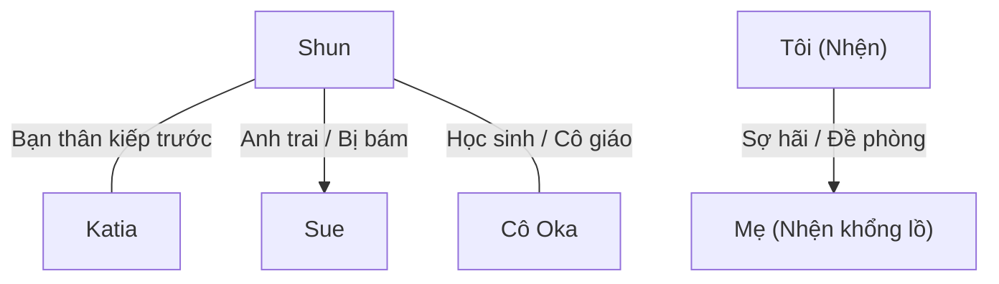

# Mối Quan Hệ Nhân Vật - Character Relationships

> Lưu trữ mối liên hệ giữa các nhân vật và cách xưng hô giữa họ.
> Đây là file CỰC KỲ QUAN TRỌNG vì xưng hô tiếng Việt phức tạp hơn tiếng Anh rất nhiều.

---

## Hướng Dẫn Xưng Hô Tiếng Việt

### Theo quan hệ gia đình

| Quan hệ | A gọi B | B gọi A |
|---------|---------|---------|
| Cha - Con trai | Con / Cha (Phụ hoàng) | Cha / Con |
| Mẹ - Con gái | Con / Mẹ (Mẫu hậu) | Mẹ / Con |
| Anh - Em trai | Em / Anh (Hoàng huynh) | Anh / Em |
| Anh - Em gái | Em / Anh (Hoàng huynh) | Anh / Em |
| Vợ - Chồng | Anh / Em | Em / Anh |

### Theo quan hệ xã hội

| Quan hệ | Xưng hô phổ biến |
|---------|------------------|
| Bạn bè đồng trang lứa (kiếp trước) | Tao - mày (riêng tư), Cậu - tớ (thân mật), Tôi - bạn (lịch sự) |
| Cô - Trò | Cô - em (thân thiện) |
| Chủ - Tớ | Tôi / Ta - Ngài / Chủ nhân |
| Anh hùng - Đồng đội | Tôi - anh, Ta - ngươi (tùy tình huống) |
| Quái vật - Quái vật | Ta - ngươi, tao - mày |

---

## Bảng Quan Hệ Nhân Vật

### Sơ Đồ Tổng Quát

---

## Chi Tiết Quan Hệ & Xưng Hô

### QH-001: Shun ↔ Katia

| Thuộc tính | Chi tiết |
|------------|----------|
| **Quan hệ** | Bạn thân kiếp trước, bạn học kiếp này |
| **Shun gọi Katia** | Katia |
| **Katia gọi Shun** | Shun |
| **Shun xưng** | Tôi / Tớ / Tao (khi nói chuyện thân mật riêng tư) |
| **Katia xưng** | Tôi / Tớ / Tao (do kiếp trước là nam nên khi nói riêng tư vẫn xưng hô thô lỗ như bạn thân) |
| **Trạng thái** | Thân thiết, tin tưởng tuyệt đối |
| **Ghi chú** | Ở nơi công cộng, họ dùng lễ nghi quý tộc (Ta - Các hạ / Hoàng tử - Tiểu thư) |

---

### QH-002: Shun ↔ Sue

| Thuộc tính | Chi tiết |
|------------|----------|
| **Quan hệ** | Anh em cùng cha khác mẹ (Sue bám Shun thái quá) |
| **Shun gọi Sue** | Sue / Em gái |
| **Sue gọi Shun** | Anh trai / Hoàng huynh (Nii-sama) |
| **Shun xưng** | Anh |
| **Sue xưng** | Em |
| **Trạng thái** | Shun yêu quý em gái; Sue yêu thương anh trai đến mức chiếm hữu cực đoan (Yandere) |
| **Ghi chú** | Sue luôn tỏ ra ghen tị với bất kỳ ai tiếp cận Shun |

---

### QH-003: Shun ↔ Cô Oka

| Thuộc tính | Chi tiết |
|------------|----------|
| **Quan hệ** | Cô trò kiếp trước, đồng minh kiếp này |
| **Shun gọi Cô Oka** | Cô Oka |
| **Cô Oka gọi Shun** | Shun / Yamada-kun (hoặc Schlain ở thế giới mới) |
| **Shun xưng** | Em |
| **Cô Oka xưng** | Cô |
| **Trạng thái** | Tin tưởng, tôn trọng |
| **Ghi chú** | Cô Oka luôn cố gắng che chở học sinh của mình |

---

### QH-004: Tôi (Nhện) ↔ Mẹ (Nhện khổng lồ)

| Thuộc tính | Chi tiết |
|------------|----------|
| **Quan hệ** | Mẹ con về mặt sinh học nhưng thù địch/sợ hãi |
| **Nhện gọi Mẹ** | Mẹ / Nhện khổng lồ / Nó |
| **Mẹ gọi Nhện** | (Không có giao tiếp ngôn ngữ, chỉ xem là thức ăn nhẹ) |
| **Nhện xưng** | Ta / Tôi (khi độc thoại) |
| **Trạng thái** | Nhện con bỏ chạy ngay lập tức khi thấy mẹ ăn thịt đồng loại |
| **Ghi chú** | Đây là bài học sinh tồn đầu tiên của Nhện về thế giới tàn khốc |

---

---

### QH-005: Julius ↔ Hyrince

| Thuộc tính | Chi tiết |
|------------|----------|
| **Quan hệ** | Bạn thuở nhỏ, đồng đội chí cốt (Kỵ sĩ khiên bảo vệ Anh hùng) |
| **Julius gọi Hyrince** | Hyrince |
| **Hyrince gọi Julius** | Julius |
| **Julius xưng** | Tôi / Ta (khi nói chuyện công việc) / Tớ |
| **Hyrince xưng** | Tôi / Tớ |
| **Trạng thái** | Tuyệt đối tin tưởng nhau trên chiến trường |
| **Ghi chú** | Hyrince thường trêu chọc và khuyên can Julius khi anh làm việc quá sức |

---

### QH-006: Julius ↔ Yaana

| Thuộc tính | Chi tiết |
|------------|----------|
| **Quan hệ** | Anh hùng và Thánh nữ đồng hành |
| **Julius gọi Yaana** | Yaana |
| **Yaana gọi Julius** | Anh Julius (Julius-sama) |
| **Julius xưng** | Tôi |
| **Yaana xưng** | Tôi / Em |
| **Trạng thái** | Yaana kính trọng và quan tâm đặc biệt đến Julius; Julius coi trọng và bảo vệ Yaana |
| **Ghi chú** | Yaana luôn là người cằn nhằn nhiều nhất khi Julius mạo hiểm |

---

### QH-007: Julius ↔ Jeskan / Hawkin

| Thuộc tính | Chi tiết |
|------------|----------|
| **Quan hệ** | Thủ lĩnh và đồng đội lớn tuổi hơn |
| **Julius gọi họ** | Anh Jeskan / Anh Hawkin |
| **Họ gọi Julius** | Hoàng tử (Prince Julius) / Ngài |
| **Julius xưng** | Tôi |
| **Họ xưng** | Tôi |
| **Trạng thái** | Kính trọng, trung thành |
| **Ghi chú** | Mối quan hệ gắn kết bất chấp khác biệt về xuất thân (quý tộc vs dân thường/nô lệ) |

---

### QH-008: Shun ↔ Hugo (Natsume)

| Thuộc tính | Chi tiết |
|------------|----------|
| **Quan hệ** | Bạn học kiếp trước, đối thủ đối đầu trực diện kiếp này |
| **Shun gọi Hugo** | Natsume / Hugo |
| **Hugo gọi Shun** | Yamada / Shun / Kẻ yếu đuối |
| **Shun xưng** | Tôi / Tao (khi nói chuyện cá nhân) |
| **Hugo xưng** | Ta / Tao |
| **Trạng thái** | Đối đầu gay gắt, thù địch |
| **Ghi chú** | Hugo luôn cảm thấy kiêu ngạo muốn vượt qua và chà đạp Shun |

---

### QH-009: Shun ↔ Hasebe

| Thuộc tính | Chi tiết |
|------------|----------|
| **Quan hệ** | Bạn học cũ ngồi cạnh nhau kiếp trước, bạn học kiếp này |
| **Shun gọi Hasebe** | Hasebe / Yuika |
| **Hasebe gọi Shun** | Yamada / Shun |
| **Shun xưng** | Tôi / Tớ |
| **Hasebe xưng** | Tôi / Mình |
| **Trạng thái** | Thân thiện, cởi mở |
| **Ghi chú** | Gặp lại bất ngờ tại lễ khai giảng học viện |

---

### QH-010: Ariel ↔ Balto

| Thuộc tính | Chi tiết |
|------------|----------|
| **Quan hệ** | Quân chủ và thuộc hạ cấp dưới trực tiếp |
| **Ariel gọi Balto** | Ngươi / Balto |
| **Balto gọi Ariel** | Ma Vương đại nhân / Ngài |
| **Ariel xưng** | Ta |
| **Balto xưng** | Tôi / Thần |
| **Trạng thái** | Balto e sợ và cẩn trọng phụng sự; Ariel thoải mái nhưng nắm quyền sinh sát tối cao |
| **Ghi chú** | Mối quan hệ chủ tớ đặc trưng của Ma Vương và Tướng quân quản lý hành chính |

---

### QH-011: Shun ↔ Sue

| Thuộc tính | Chi tiết |
|------------|----------|
| **Quan hệ** | Anh em cùng cha khác mẹ, tình cảm chiếm hữu cực kỳ mãnh liệt từ phía Sue |
| **Shun gọi Sue** | Sue |
| **Sue gọi Shun** | Hoàng huynh / Anh |
| **Shun xưng** | Anh / Tôi |
| **Sue xưng** | Em |
| **Trạng thái** | Shun yêu thương em gái nhưng chịu áp lực lớn từ sự bám dính của cô; Sue coi Shun là cả thế giới |
| **Ghi chú** | Sue luôn cố gắng tỏ ra ngoan ngoãn dịu dàng nhất trước mặt Shun |

---

### QH-012: Katia ↔ Sue

| Thuộc tính | Chi tiết |
|------------|----------|
| **Quan hệ** | Bạn bè xã giao quý tộc, đối thủ ngầm cạnh tranh sự chú ý của Shun |
| **Katia gọi Sue** | Sue / Em |
| **Sue gọi Katia** | Katia / Chị |
| **Katia xưng** | Chị / Tôi (độc thoại xưng "mình") |
| **Sue xưng** | Tôi / Em |
| **Trạng thái** | Bề ngoài lịch sự, bên trong Sue cảnh giác Katia như tình địch; Katia đóng vai trò trung gian khuyên bảo Sue |
| **Ghi chú** | Sue đề phòng mối quan hệ thân thiết giữa Katia và Shun |

---

### QH-013: Shun ↔ Anna

| Thuộc tính | Chi tiết |
|------------|----------|
| **Quan hệ** | Chủ nhân và hầu gái, cô trò (Anna dạy phép thuật cho Shun) |
| **Shun gọi Anna** | Anna |
| **Anna gọi Shun** | Điện hạ / Cậu chủ |
| **Shun xưng** | Tôi / Em |
| **Anna xưng** | Tôi |
| **Trạng thái** | Shun kính trọng và tin cậy Anna; Anna cực kỳ trung thành và tận tụy |
| **Ghi chú** | Anna chăm sóc Shun từ nhỏ nên hiểu rất rõ tính cách của cậu |

---

### QH-014: Fei ↔ Anna

| Thuộc tính | Chi tiết |
|------------|----------|
| **Quan hệ** | Thú cưng (rồng nuôi) và người chăm sóc/huấn luyện |
| **Fei gọi Anna** | Anna / Cô hầu gái đó |
| **Anna gọi Fei** | Fei |
| **Fei xưng** | Tớ / Tôi |
| **Anna xưng** | Tôi |
| **Trạng thái** | Fei oán hận ngầm vì bị Anna ép ăn thịt quái vật kinh dị; Anna nghiêm khắc ép Fei ăn vì muốn tốt cho sự phát triển của cô |
| **Ghi chú** | Fei coi Anna là "nỗi kinh hoàng" trong việc ăn uống |

---

### QH-015: Shun ↔ Yuri

| Thuộc tính | Chi tiết |
|------------|----------|
| **Quan hệ** | Bạn bè tái sinh, Yuri liên tục lôi kéo Shun cải đạo |
| **Shun gọi Yuri** | Yuri / Hasebe |
| **Yuri gọi Shun** | Shun |
| **Shun xưng** | Tớ / Tôi |
| **Yuri xưng** | Tớ / Tôi |
| **Trạng thái** | Shun cảm thấy mệt mỏi, bất lực trước sự cuồng tín của Yuri; Yuri nhiệt tình dụ dỗ Shun gia nhập giáo hội |
| **Ghi chú** | Sự bám dính của Yuri thường xuyên kích hoạt phản ứng xua đuổi từ Sue |

---

### QH-016: Katia ↔ Yuri

| Thuộc tính | Chi tiết |
|------------|----------|
| **Quan hệ** | Bạn bè tái sinh, bạn học cùng lớp |
| **Katia gọi Yuri** | Yuri / Hasebe |
| **Yuri gọi Katia** | Ooshima / Katia |
| **Katia xưng** | Tớ / Tôi |
| **Yuri xưng** | Tớ / Tôi |
| **Trạng thái** | Katia thông cảm cho quá khứ của Yuri nhưng khéo léo từ chối cải đạo; hai người chia sẻ cởi mở về giới tính nữ của Katia |
| **Ghi chú** | Lời khẳng định "cậu hoàn toàn nữ tính" của Yuri gián tiếp làm Katia bộc lộ tình cảm với Shun |

---

### QH-017: Tôi (Nhện) ↔ Quản trị viên D

| Thuộc tính | Chi tiết |
|------------|----------|
| **Quan hệ** | Đối tượng giải trí và Người theo dõi/Quản trị viên |
| **Nhện gọi D** | Quản trị viên D / Kẻ rình mò / Admin |
| **D gọi Nhện** | Cá thể Zoa Ele (hoặc qua Thần ngôn) |
| **Nhện xưng** | Tôi (Watashi) |
| **D xưng** | D / Quản trị viên Thượng cấp D |
| **Trạng thái** | Nhện cực kỳ đề phòng và sợ hãi quyền năng của D nhưng vẫn bướng bỉnh muốn sống vinh quang; D theo dõi và kiến tạo kỹ năng để chọc ghẹo Nhện |
| **Ghi chú** | Mối quan hệ một chiều qua màn hình giám sát của quản trị viên |

---

### QH-018: Shun ↔ Parton

| Thuộc tính | Chi tiết |
|------------|----------|
| **Quan hệ** | Bạn học cùng lớp, đồng đội trong buổi ngoại khóa thám hiểm |
| **Shun gọi Parton** | Parton |
| **Parton gọi Shun** | Điện hạ Schlain / Hoàng tử |
| **Shun xưng** | Tôi / Tớ |
| **Parton xưng** | Tôi / Thần |
| **Trạng thái** | Parton vô cùng kính trọng và bảo vệ Shun; Shun tôn trọng Parton và coi cậu ấy là bạn bè đồng trang lứa |
| **Ghi chú** | Parton cùng Shun dựng lều trại và cảnh báo trước khi Hugo tấn công |

---

### QH-019: Balto ↔ Bloe

| Thuộc tính | Chi tiết |
|------------|----------|
| **Quan hệ** | Anh em ruột |
| **Balto gọi Bloe** | Bloe |
| **Bloe gọi Balto** | Anh trai |
| **Balto xưng** | Anh / Tôi |
| **Bloe xưng** | Tôi / Em |
| **Trạng thái** | Balto bất lực trước sự bốc đồng của Bloe nhưng vẫn cố che chở; Bloe bất bình vì anh trai phục tùng Ma Vương |
| **Ghi chú** | Mối quan hệ gia đình ma tộc tiêu biểu giữa quan chức lý trí và võ tướng nóng nảy |

---

### QH-020: Ariel ↔ Bloe

| Thuộc tính | Chi tiết |
|------------|----------|
| **Quan hệ** | Quân chủ và thuộc hạ |
| **Ariel gọi Bloe** | Ngươi |
| **Bloe gọi Ariel** | Con ranh ngẫu nhiên (khi nói sau lưng) / Ma Vương |
| **Ariel xưng** | Ta |
| **Bloe xưng** | Ta / Tôi |
| **Trạng thái** | Bloe coi thường sức mạnh của Ariel cho đến khi bị tơ rối của cô khống chế và đe dọa sát hại; Ariel xem Bloe như đứa trẻ cần bị trừng trị |
| **Ghi chú** | Mối quan hệ căng thẳng chỉ dịu đi bằng sức mạnh áp đảo của Ariel |

---

## Ghi Chú

- **Ngày tạo**: 2026-07-06
- **Cập nhật lần cuối**: 2026-07-06
- **Tổng cặp quan hệ**: 20

