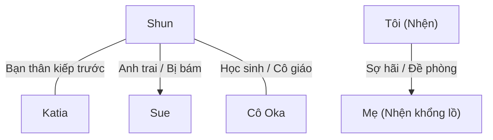

# Mối Quan Hệ Nhân Vật - Character Relationships

> Lưu trữ mối liên hệ giữa các nhân vật và cách xưng hô giữa họ.
> Đây là file CỰC KỲ QUAN TRỌNG vì xưng hô tiếng Việt phức tạp hơn tiếng Anh rất nhiều.

---

## Hướng Dẫn Xưng Hô Tiếng Việt

### Theo quan hệ gia đình

| Quan hệ | A gọi B | B gọi A |
|---------|---------|---------|
| Cha - Con trai | Con / Cha (Phụ hoàng) | Cha / Con |
| Mẹ - Con gái | Con / Mẹ (Mẫu hậu) | Mẹ / Con |
| Anh - Em trai | Em / Anh (Hoàng huynh) | Anh / Em |
| Anh - Em gái | Em / Anh (Hoàng huynh) | Anh / Em |
| Vợ - Chồng | Anh / Em | Em / Anh |

### Theo quan hệ xã hội

| Quan hệ | Xưng hô phổ biến |
|---------|------------------|
| Bạn bè đồng trang lứa (kiếp trước) | Tao - mày (riêng tư), Cậu - tớ (thân mật), Tôi - bạn (lịch sự) |
| Cô - Trò | Cô - em (thân thiện) |
| Chủ - Tớ | Tôi / Ta - Ngài / Chủ nhân |
| Anh hùng - Đồng đội | Tôi - anh, Ta - ngươi (tùy tình huống) |
| Quái vật - Quái vật | Ta - ngươi, tao - mày |

---

## Bảng Quan Hệ Nhân Vật

### Sơ Đồ Tổng Quát

---

## Chi Tiết Quan Hệ & Xưng Hô

### QH-001: Shun ↔ Katia

| Thuộc tính | Chi tiết |
|------------|----------|
| **Quan hệ** | Bạn thân kiếp trước, bạn học kiếp này |
| **Shun gọi Katia** | Katia |
| **Katia gọi Shun** | Shun |
| **Shun xưng** | Tôi / Tớ / Tao (khi nói chuyện thân mật riêng tư) |
| **Katia xưng** | Tôi / Tớ / Tao (do kiếp trước là nam nên khi nói riêng tư vẫn xưng hô thô lỗ như bạn thân) |
| **Trạng thái** | Thân thiết, tin tưởng tuyệt đối |
| **Ghi chú** | Ở nơi công cộng, họ dùng lễ nghi quý tộc (Ta - Các hạ / Hoàng tử - Tiểu thư) |

---

### QH-002: Shun ↔ Sue

| Thuộc tính | Chi tiết |
|------------|----------|
| **Quan hệ** | Anh em cùng cha khác mẹ (Sue bám Shun thái quá) |
| **Shun gọi Sue** | Sue / Em gái |
| **Sue gọi Shun** | Anh trai / Hoàng huynh (Nii-sama) |
| **Shun xưng** | Anh |
| **Sue xưng** | Em |
| **Trạng thái** | Shun yêu quý em gái; Sue yêu thương anh trai đến mức chiếm hữu cực đoan (Yandere) |
| **Ghi chú** | Sue luôn tỏ ra ghen tị với bất kỳ ai tiếp cận Shun |

---

### QH-003: Shun ↔ Cô Oka

| Thuộc tính | Chi tiết |
|------------|----------|
| **Quan hệ** | Cô trò kiếp trước, đồng minh kiếp này |
| **Shun gọi Cô Oka** | Cô Oka |
| **Cô Oka gọi Shun** | Shun / Yamada-kun (hoặc Schlain ở thế giới mới) |
| **Shun xưng** | Em |
| **Cô Oka xưng** | Cô |
| **Trạng thái** | Tin tưởng, tôn trọng |
| **Ghi chú** | Cô Oka luôn cố gắng che chở học sinh của mình |

---

### QH-004: Tôi (Nhện) ↔ Mẹ (Nhện khổng lồ)

| Thuộc tính | Chi tiết |
|------------|----------|
| **Quan hệ** | Mẹ con về mặt sinh học nhưng thù địch/sợ hãi |
| **Nhện gọi Mẹ** | Mẹ / Nhện khổng lồ / Nó |
| **Mẹ gọi Nhện** | (Không có giao tiếp ngôn ngữ, chỉ xem là thức ăn nhẹ) |
| **Nhện xưng** | Ta / Tôi (khi độc thoại) |
| **Trạng thái** | Nhện con bỏ chạy ngay lập tức khi thấy mẹ ăn thịt đồng loại |
| **Ghi chú** | Đây là bài học sinh tồn đầu tiên của Nhện về thế giới tàn khốc |

---

## Ghi Chú

- **Ngày tạo**: 2026-07-06
- **Cập nhật lần cuối**: 2026-07-06
- **Tổng cặp quan hệ**: 4
