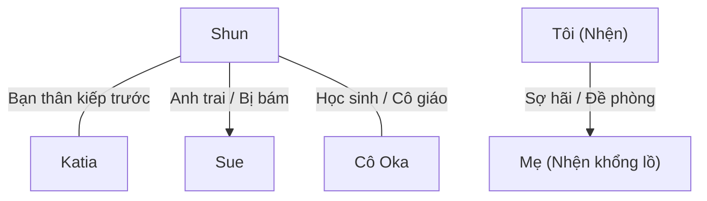

# Mối Quan Hệ Nhân Vật - Character Relationships

> Lưu trữ mối liên hệ giữa các nhân vật và cách xưng hô giữa họ.
> Đây là file CỰC KỲ QUAN TRỌNG vì xưng hô tiếng Việt phức tạp hơn tiếng Anh rất nhiều.

---

## Hướng Dẫn Xưng Hô Tiếng Việt

### Theo quan hệ gia đình

| Quan hệ | A gọi B | B gọi A |
|---------|---------|---------|
| Cha - Con trai | Con / Cha (Phụ hoàng) | Cha / Con |
| Mẹ - Con gái | Con / Mẹ (Mẫu hậu) | Mẹ / Con |
| Anh - Em trai | Em / Anh (Hoàng huynh) | Anh / Em |
| Anh - Em gái | Em / Anh (Hoàng huynh) | Anh / Em |
| Vợ - Chồng | Anh / Em | Em / Anh |

### Theo quan hệ xã hội

| Quan hệ | Xưng hô phổ biến |
|---------|------------------|
| Bạn bè đồng trang lứa (kiếp trước) | Tao - mày (riêng tư), Cậu - tớ (thân mật), Tôi - bạn (lịch sự) |
| Cô - Trò | Cô - em (thân thiện) |
| Chủ - Tớ | Tôi / Ta - Ngài / Chủ nhân |
| Anh hùng - Đồng đội | Tôi - anh, Ta - ngươi (tùy tình huống) |
| Quái vật - Quái vật | Ta - ngươi, tao - mày |

---

## Bảng Quan Hệ Nhân Vật

### Sơ Đồ Tổng Quát

---

## Chi Tiết Quan Hệ & Xưng Hô

### QH-001: Shun ↔ Katia

| Thuộc tính | Chi tiết |
|------------|----------|
| **Quan hệ** | Bạn thân kiếp trước, bạn học kiếp này |
| **Shun gọi Katia** | Katia |
| **Katia gọi Shun** | Shun |
| **Shun xưng** | Tôi / Tớ / Tao (khi nói chuyện thân mật riêng tư) |
| **Katia xưng** | Tôi / Tớ / Tao (do kiếp trước là nam nên khi nói riêng tư vẫn xưng hô thô lỗ như bạn thân) |
| **Trạng thái** | Thân thiết, tin tưởng tuyệt đối; tình cảm nữ tính của Katia bắt đầu trỗi dậy và chấp nhận sâu sắc sau khi được Shun bế cứu mạng. |
| **Ghi chú** | Ở nơi công cộng, họ dùng lễ nghi quý tộc (Ta - Các hạ / Hoàng tử - Tiểu thư). Sau sự kiện ở chương phụ K1, phần linh hồn nam tính của Katia hoàn toàn biến mất, khiến cách xưng hô riêng tư và thái độ của cô đối với Shun dần trở nên nữ tính hơn. |

---

### QH-002: Shun ↔ Sue

| Thuộc tính | Chi tiết |
|------------|----------|
| **Quan hệ** | Anh em cùng cha khác mẹ (Sue bám Shun thái quá) |
| **Shun gọi Sue** | Sue / Em gái |
| **Sue gọi Shun** | Anh trai / Hoàng huynh (Nii-sama) |
| **Shun xưng** | Anh |
| **Sue xưng** | Em |
| **Trạng thái** | Shun yêu quý em gái; Sue yêu thương anh trai đến mức chiếm hữu cực đoan (Yandere) |
| **Ghi chú** | Sue luôn tỏ ra ghen tị với bất kỳ ai tiếp cận Shun |

---

### QH-003: Shun ↔ Cô Oka

| Thuộc tính | Chi tiết |
|------------|----------|
| **Quan hệ** | Cô trò kiếp trước, đồng minh kiếp này |
| **Shun gọi Cô Oka** | Cô Oka |
| **Cô Oka gọi Shun** | Shun / Yamada-kun (hoặc Schlain ở thế giới mới) |
| **Shun xưng** | Em |
| **Cô Oka xưng** | Cô |
| **Trạng thái** | Tin tưởng, tôn trọng |
| **Ghi chú** | Cô Oka luôn cố gắng che chở học sinh của mình |

---

### QH-004: Tôi (Nhện) ↔ Mẹ (Nhện khổng lồ)

| Thuộc tính | Chi tiết |
|------------|----------|
| **Quan hệ** | Mẹ con về mặt sinh học nhưng thù địch/sợ hãi |
| **Nhện gọi Mẹ** | Mẹ / Nhện khổng lồ / Nó |
| **Mẹ gọi Nhện** | (Không có giao tiếp ngôn ngữ, chỉ xem là thức ăn nhẹ) |
| **Nhện xưng** | Ta / Tôi (khi độc thoại) |
| **Trạng thái** | Thù địch sâu sắc; Mẹ cố gắng kích hoạt kỹ năng kiểm soát tâm trí đối với Nhện nhỏ qua mối liên kết huyết thống. Nhện nhỏ phát hiện ra và cử các [Phân thân Tư duy] tiến hành "hack" ngược lại, tấn công và gặm nhấm linh hồn của Mẹ từ xa trong một trận chiến linh hồn kịch liệt. |
| **Ghi chú** | Mẹ phái một đội quân Taratect tinh nhuệ (gồm cả Taratect Thượng cổ và Vĩ đại) đến tiêu diệt Nhện nhỏ ở thế giới thực để ngăn cản việc bị hack linh hồn, nhưng bầy nhện đã bị cô dụ vào bẫy dung nham và tiêu diệt hoàn toàn. |

---

---

### QH-005: Julius ↔ Hyrince

| Thuộc tính | Chi tiết |
|------------|----------|
| **Quan hệ** | Bạn thuở nhỏ, đồng đội chí cốt (Kỵ sĩ khiên bảo vệ Anh hùng) |
| **Julius gọi Hyrince** | Hyrince |
| **Hyrince gọi Julius** | Julius |
| **Julius xưng** | Tôi / Ta (khi nói chuyện công việc) / Tớ |
| **Hyrince xưng** | Tôi / Tớ |
| **Trạng thái** | Tuyệt đối tin tưởng nhau trên chiến trường |
| **Ghi chú** | Hyrince thường trêu chọc và khuyên can Julius khi anh làm việc quá sức |

---

### QH-006: Julius ↔ Yaana

| Thuộc tính | Chi tiết |
|------------|----------|
| **Quan hệ** | Anh hùng và Thánh nữ đồng hành |
| **Julius gọi Yaana** | Yaana |
| **Yaana gọi Julius** | Anh Julius (Julius-sama) |
| **Julius xưng** | Tôi |
| **Yaana xưng** | Tôi / Em |
| **Trạng thái** | Yaana kính trọng và quan tâm đặc biệt đến Julius; Julius coi trọng và bảo vệ Yaana |
| **Ghi chú** | Yaana luôn là người cằn nhằn nhiều nhất khi Julius mạo hiểm |

---

### QH-007: Julius ↔ Jeskan / Hawkin

| Thuộc tính | Chi tiết |
|------------|----------|
| **Quan hệ** | Thủ lĩnh và đồng đội lớn tuổi hơn |
| **Julius gọi họ** | Anh Jeskan / Anh Hawkin |
| **Họ gọi Julius** | Hoàng tử (Prince Julius) / Ngài |
| **Julius xưng** | Tôi |
| **Họ xưng** | Tôi |
| **Trạng thái** | Kính trọng, trung thành |
| **Ghi chú** | Mối quan hệ gắn kết bất chấp khác biệt về xuất thân (quý tộc vs dân thường/nô lệ) |

---

### QH-008: Shun ↔ Hugo (Natsume)

| Thuộc tính | Chi tiết |
|------------|----------|
| **Quan hệ** | Bạn học kiếp trước, đối thủ đối đầu trực diện kiếp này |
| **Shun gọi Hugo** | Natsume / Hugo |
| **Hugo gọi Shun** | Yamada / Shun / Kẻ yếu đuối |
| **Shun xưng** | Tôi / Tao (khi nói chuyện cá nhân) |
| **Hugo xưng** | Ta / Tao |
| **Trạng thái** | Đối đầu gay gắt, thù địch |
| **Ghi chú** | Hugo luôn cảm thấy kiêu ngạo muốn vượt qua và chà đạp Shun |

---

### QH-009: Shun ↔ Hasebe

| Thuộc tính | Chi tiết |
|------------|----------|
| **Quan hệ** | Bạn học cũ ngồi cạnh nhau kiếp trước, bạn học kiếp này |
| **Shun gọi Hasebe** | Hasebe / Yuika |
| **Hasebe gọi Shun** | Yamada / Shun |
| **Shun xưng** | Tôi / Tớ |
| **Hasebe xưng** | Tôi / Mình |
| **Trạng thái** | Thân thiện, cởi mở |
| **Ghi chú** | Gặp lại bất ngờ tại lễ khai giảng học viện |

---

### QH-010: Ariel ↔ Balto

| Thuộc tính | Chi tiết |
|------------|----------|
| **Quan hệ** | Quân chủ và thuộc hạ cấp dưới trực tiếp |
| **Ariel gọi Balto** | Ngươi / Balto |
| **Balto gọi Ariel** | Ma Vương đại nhân / Ngài |
| **Ariel xưng** | Ta |
| **Balto xưng** | Tôi / Thần |
| **Trạng thái** | Balto e sợ và cẩn trọng phụng sự; Ariel thoải mái nhưng nắm quyền sinh sát tối cao |
| **Ghi chú** | Mối quan hệ chủ tớ đặc trưng của Ma Vương và Tướng quân quản lý hành chính |

---

### QH-011: Shun ↔ Sue

| Thuộc tính | Chi tiết |
|------------|----------|
| **Quan hệ** | Anh em cùng cha khác mẹ, tình cảm chiếm hữu cực kỳ mãnh liệt từ phía Sue |
| **Shun gọi Sue** | Sue |
| **Sue gọi Shun** | Hoàng huynh / Anh |
| **Shun xưng** | Anh / Tôi |
| **Sue xưng** | Em |
| **Trạng thái** | Shun yêu thương em gái nhưng chịu áp lực lớn từ sự bám dính của cô; Sue coi Shun là cả thế giới |
| **Ghi chú** | Sue luôn cố gắng tỏ ra ngoan ngoãn dịu dàng nhất trước mặt Shun |

---

### QH-012: Katia ↔ Sue

| Thuộc tính | Chi tiết |
|------------|----------|
| **Quan hệ** | Bạn bè xã giao quý tộc, đối thủ ngầm cạnh tranh sự chú ý của Shun |
| **Katia gọi Sue** | Sue / Em |
| **Sue gọi Katia** | Katia / Chị |
| **Katia xưng** | Chị / Tôi (độc thoại xưng "mình") |
| **Sue xưng** | Tôi / Em |
| **Trạng thái** | Bề ngoài lịch sự, bên trong Sue cảnh giác Katia như tình địch; Katia đóng vai trò trung gian khuyên bảo Sue |
| **Ghi chú** | Sue đề phòng mối quan hệ thân thiết giữa Katia và Shun |

---

### QH-013: Shun ↔ Anna

| Thuộc tính | Chi tiết |
|------------|----------|
| **Quan hệ** | Chủ nhân và hầu gái, cô trò (Anna dạy phép thuật cho Shun) |
| **Shun gọi Anna** | Anna |
| **Anna gọi Shun** | Điện hạ / Cậu chủ |
| **Shun xưng** | Tôi / Em |
| **Anna xưng** | Tôi |
| **Trạng thái** | Shun kính trọng và tin cậy Anna; Anna cực kỳ trung thành và tận tụy |
| **Ghi chú** | Anna chăm sóc Shun từ nhỏ nên hiểu rất rõ tính cách của cậu |

---

### QH-014: Fei ↔ Anna

| Thuộc tính | Chi tiết |
|------------|----------|
| **Quan hệ** | Thú cưng (rồng nuôi) và người chăm sóc/huấn luyện |
| **Fei gọi Anna** | Anna / Cô hầu gái đó |
| **Anna gọi Fei** | Fei |
| **Fei xưng** | Tớ / Tôi |
| **Anna xưng** | Tôi |
| **Trạng thái** | Fei oán hận ngầm vì bị Anna ép ăn thịt quái vật kinh dị; Anna nghiêm khắc ép Fei ăn vì muốn tốt cho sự phát triển của cô |
| **Ghi chú** | Fei coi Anna là "nỗi kinh hoàng" trong việc ăn uống |

---

### QH-015: Shun ↔ Yuri

| Thuộc tính | Chi tiết |
|------------|----------|
| **Quan hệ** | Bạn bè tái sinh, Yuri liên tục lôi kéo Shun cải đạo |
| **Shun gọi Yuri** | Yuri / Hasebe |
| **Yuri gọi Shun** | Shun |
| **Shun xưng** | Tớ / Tôi |
| **Yuri xưng** | Tớ / Tôi |
| **Trạng thái** | Shun cảm thấy mệt mỏi, bất lực trước sự cuồng tín của Yuri; Yuri nhiệt tình dụ dỗ Shun gia nhập giáo hội |
| **Ghi chú** | Sự bám dính của Yuri thường xuyên kích hoạt phản ứng xua đuổi từ Sue |

---

### QH-016: Katia ↔ Yuri

| Thuộc tính | Chi tiết |
|------------|----------|
| **Quan hệ** | Bạn bè tái sinh, bạn học cùng lớp |
| **Katia gọi Yuri** | Yuri / Hasebe |
| **Yuri gọi Katia** | Ooshima / Katia |
| **Katia xưng** | Tớ / Tôi |
| **Yuri xưng** | Tớ / Tôi |
| **Trạng thái** | Katia thông cảm cho quá khứ của Yuri nhưng khéo léo từ chối cải đạo; hai người chia sẻ cởi mở về giới tính nữ của Katia |
| **Ghi chú** | Lời khẳng định "cậu hoàn toàn nữ tính" của Yuri gián tiếp làm Katia bộc lộ tình cảm với Shun |

---

### QH-017: Tôi (Nhện) ↔ Quản trị viên D

| Thuộc tính | Chi tiết |
|------------|----------|
| **Quan hệ** | Đối tượng giải trí và Người theo dõi/Quản trị viên |
| **Nhện gọi D** | Quản trị viên D / Kẻ rình mò / Admin / Tên khốn / Tà thần |
| **D gọi Nhện** | Cá thể Zoa Ele (hoặc qua Thần ngôn) |
| **Nhện xưng** | Tôi (Watashi) |
| **D xưng** | D / Quản trị viên Thượng cấp D |
| **Trạng thái** | Sau khi kỹ năng [Cấm kỵ] đạt LV 10 (Chương 7), Nhện biết được D chính là kẻ đã tái sinh mình vào thế giới sắp sụp đổ này để làm trò giải trí. Nhện cực kỳ tức giận (nhận kỹ năng [Phẫn Nộ LV 1]) và căm ghét tính cách vặn vẹo của D, nhưng đành phải tạm thời nương theo kế hoạch của D để sinh tồn và tìm cách tích lũy thực lực thoát khỏi thế giới này. |
| **Ghi chú** | Mối quan hệ chuyển từ đề phòng một chiều sang thù ghét/bực bội sâu sắc từ phía Nhện. |

---

### QH-018: Shun ↔ Parton

| Thuộc tính | Chi tiết |
|------------|----------|
| **Quan hệ** | Bạn học cùng lớp, đồng đội trong buổi ngoại khóa thám hiểm |
| **Shun gọi Parton** | Parton |
| **Parton gọi Shun** | Điện hạ Schlain / Hoàng tử |
| **Shun xưng** | Tôi / Tớ |
| **Parton xưng** | Tôi / Thần |
| **Trạng thái** | Parton vô cùng kính trọng và bảo vệ Shun; Shun tôn trọng Parton và coi cậu ấy là bạn bè đồng trang lứa |
| **Ghi chú** | Parton cùng Shun dựng lều trại và cảnh báo trước khi Hugo tấn công |

---

### QH-019: Balto ↔ Bloe

| Thuộc tính | Chi tiết |
|------------|----------|
| **Quan hệ** | Anh em ruột |
| **Balto gọi Bloe** | Bloe |
| **Bloe gọi Balto** | Anh trai |
| **Balto xưng** | Anh / Tôi |
| **Bloe xưng** | Tôi / Em |
| **Trạng thái** | Balto bất lực trước sự bốc đồng của Bloe nhưng vẫn cố che chở; Bloe bất bình vì anh trai phục tùng Ma Vương |
| **Ghi chú** | Mối quan hệ gia đình ma tộc tiêu biểu giữa quan chức lý trí và võ tướng nóng nảy |

---

### QH-020: Ariel ↔ Bloe

| Thuộc tính | Chi tiết |
|------------|----------|
| **Quan hệ** | Quân chủ và thuộc hạ |
| **Ariel gọi Bloe** | Ngươi |
| **Bloe gọi Ariel** | Con ranh ngẫu nhiên (khi nói sau lưng) / Ma Vương |
| **Ariel xưng** | Ta |
| **Bloe xưng** | Ta / Tôi |
| **Trạng thái** | Bloe coi thường sức mạnh của Ariel cho đến khi bị tơ rối của cô khống chế và đe dọa sát hại; Ariel xem Bloe như đứa trẻ cần bị trừng trị |
| **Ghi chú** | Mối quan hệ căng thẳng chỉ dịu đi bằng sức mạnh áp đảo của Ariel |

---

---

### QH-021: Leston ↔ Cô Oka

| Thuộc tính | Chi tiết |
|------------|----------|
| **Quan hệ** | Đồng minh bí mật cùng bảo vệ Shun |
| **Leston gọi Cô Oka** | Cô / Cô Oka |
| **Cô Oka gọi Leston** | Anh / Hoàng tử Leston |
| **Leston xưng** | Tôi |
| **Cô Oka xưng** | Tôi |
| **Trạng thái** | Leston tôn trọng tấm lòng vì học sinh của cô Oka; hai người hợp tác thu thập thông tin tình báo |
| **Ghi chú** | Mối liên lạc bí mật sau khi Shun thừa kế danh hiệu Anh hùng |

---

### QH-022: Shun ↔ Leston

| Thuộc tính | Chi tiết |
|------------|----------|
| **Quan hệ** | Anh em cùng cha khác mẹ |
| **Shun gọi Leston** | Anh Leston / Hoàng huynh Leston |
| **Leston gọi Shun** | Shun |
| **Shun xưng** | Tôi |
| **Leston xưng** | Anh |
| **Trạng thái** | Leston là người anh trai Shun thân thiết thứ hai sau Julius; anh ôm Shun chia sẻ nỗi đau mất Julius |
| **Ghi chú** | Leston rất hiền lành và thương yêu các em của mình |

---

### QH-023: Shun ↔ Cylis

| Thuộc tính | Chi tiết |
|------------|----------|
| **Quan hệ** | Anh em cùng cha khác mẹ |
| **Shun gọi Cylis** | Anh cả Cylis / Hoàng huynh Cylis |
| **Cylis gọi Shun** | Schlain / Shun |
| **Shun xưng** | Tôi |
| **Cylis xưng** | Ta / Tôi |
| **Trạng thái** | Bi kịch; Cylis gài bẫy Shun và giết hại vua cha, nhưng cuối cùng bị Hugo tẩy não thành phế nhân. Shun xót thương nhưng bỏ lại anh ta để tẩu thoát. |
| **Ghi chú** | Cylis luôn tỏ vẻ nghiêm khắc và lạnh nhạt với Shun |

---

### QH-024: Shun ↔ Phụ hoàng (Vua Analeit)

| Thuộc tính | Chi tiết |
|------------|----------|
| **Quan hệ** | Cha con hoàng tộc |
| **Shun gọi Phụ hoàng** | Phụ hoàng / Cha |
| **Phụ hoàng gọi Shun** | Schlain / Con |
| **Shun xưng** | Con |
| **Phụ hoàng xưng** | Ta |
| **Trạng thái** | Kính trọng, nghiêm nghị; Phụ hoàng đặt trách nhiệm lên vai Shun nhưng vẫn dành sự quan tâm dịu dàng của người cha |
| **Ghi chú** | Phụ hoàng vô cùng đau buồn trước cái chết của Julius và lo lắng cho gánh nặng của Shun |

---

### QH-025: Shun ↔ Hyrince

| Thuộc tính | Chi tiết |
|------------|----------|
| **Quan hệ** | Người quen cũ, bạn thuở nhỏ của hoàng huynh Julius |
| **Shun gọi Hyrince** | Anh Hyrince |
| **Hyrince gọi Shun** | Shun / Nhị hoàng tử Schlain / Hoàng tử Schlain |
| **Shun xưng** | Tôi |
| **Hyrince xưng** | Tôi |
| **Trạng thái** | Tuyệt đối tin cậy; Hyrince đã trở về vương quốc, kể lại tường tận trận chiến cuối cùng của Julius cho Shun nghe và trao lại di vật khăn quàng cổ. Hyrince nguyện làm tấm khiên bảo vệ cho vị Anh hùng mới. |
| **Ghi chú** | Quan hệ chuyển từ người quen cũ thành đồng đội chung chí hướng kế thừa ý chí của Julius. |

---

### QH-026: Shun ↔ Fei

| Thuộc tính | Chi tiết |
|------------|----------|
| **Quan hệ** | Bạn học tái sinh, linh thú khế ước (chủ tớ) |
| **Shun gọi Fei** | Fei |
| **Fei gọi Shun** | Shun |
| **Shun xưng** | Tôi / Tớ |
| **Fei xưng** | Tôi / Tớ |
| **Trạng thái** | Bạn bè bình đẳng bất chấp khế ước chủ tớ; Shun coi trọng Fei và lo lắng sâu sắc khi Fei đột ngột hóa thành quả trứng khổng lồ |

---

### QH-027: Ronandt ↔ Aurel

| Thuộc tính | Chi tiết |
|------------|----------|
| **Quan hệ** | Sư phụ và đệ tử (Thầy trò) |
| **Ronandt gọi Aurel** | Ngươi / Đệ tử ngốc nghếch (foolish disciple) |
| **Aurel gọi Ronandt** | Sư phụ / Ông già (old man) |
| **Ronandt xưng** | Ta |
| **Aurel xưng** | Con (hoặc tôi) |
| **Trạng thái** | Thân thiết nhưng đầy sự cằn nhằn, cãi cọ hài hước. Aurel thường cằn nhằn về sự lười biếng, trốn việc hành chính của Ronandt; cô không ngần ngại vác lão đi làm việc. Ronandt ngoài miệng luôn gọi cô là "kẻ ngốc" nhưng trong lòng thừa nhận tài năng và tính nhạy bén của cô. |
| **Ghi chú** | Mối quan hệ thầy trò phá cách nhất của Đế quốc. |

---

### QH-028: Ronandt ↔ Julius

| Thuộc tính | Chi tiết |
|------------|----------|
| **Quan hệ** | Sư phụ và đệ tử (Julius từng học ma pháp với Ronandt) |
| **Ronandt gọi Julius** | Julius / Đứa đệ tử ngốc nghếch / Anh hùng |
| **Julius gọi Ronandt** | Sư phụ (Ronandt-sama) |
| **Ronandt xưng** | Ta |
| **Julius xưng** | Tôi / Con |
| **Trạng thái** | Ronandt coi Julius là đứa đệ tử ngốc nghếch bị danh hiệu Anh hùng che mắt, ôm ước mơ ngây thơ cứu thế giới rồi chết trẻ. Dù cằn nhằn và chê bai sự ngốc nghếch của Julius, Ronandt thực chất vô cùng đau xót trước sự hy sinh của anh và hối tiếc vì không thể dạy anh cách tự bảo vệ mình tốt hơn. |
| **Ghi chú** | Trận chiến ở pháo đài đã cướp đi Julius, để lại nỗi buồn sâu sắc cho Ronandt. |

---

### QH-029: Ronandt ↔ Tôi (Nhện)

| Thuộc tính | Chi tiết |
|------------|----------|
| **Quan hệ** | Người chứng kiến và Quái vật huyền thoại (Ronandt tôn xưng Nhện là "sư phụ") |
| **Ronandt gọi Nhện** | Vị sư phụ đó (That master) / Người đó / Thực thể đó |
| **Nhện gọi Ronandt** | Ông già loài người (sau này gặp trực tiếp) |
| **Ronandt xưng** | Ta |
| **Nhện xưng** | Ta / Tôi |
| **Trạng thái** | 16 năm trước (theo trục thời gian loài người), Ronandt chạm trán Nhện nhỏ trong Mê cung Lớn Elroe và suýt chết. Nhìn thấy ma pháp tối thượng của Nhện, Ronandt hoàn toàn bị thuyết phục và tôn sùng cô như một vị thần ma pháp, từ bỏ mọi kiêu ngạo của bản thân để học hỏi từ xa. |
| **Ghi chú** | Cuộc gặp gỡ này đã thay đổi hoàn toàn cuộc đời và tư duy ma pháp của Ronandt. |

---

### QH-030: Potimas ↔ Cô Oka (Filimõs)

| Thuộc tính | Chi tiết |
|------------|----------|
| **Quan hệ** | Cha con kiếp này (về mặt sinh học) |
| **Potimas gọi Cô Oka** | Filimõs |
| **Cô Oka gọi Potimas** | Cha / Ngài Potimas |
| **Potimas xưng** | Ta |
| **Cô Oka xưng** | Con / Tôi |
| **Trạng thái** | Xa cách, thực dụng. Potimas xem cô Oka như một công cụ đắc lực để giám sát thế giới và những người tái sinh; cô Oka vừa muốn dựa vào tộc lực của Potimas để bảo vệ học sinh, vừa vô cùng đề phòng sự tàn nhẫn và âm mưu của cha mình. |
| **Ghi chú** | Mối quan hệ chứa đựng nhiều toan tính chính trị đằng sau vẻ ngoài cha con tộc Elf. |

---

---

### QH-031: Hugo ↔ Cylis

| Thuộc tính | Chi tiết |
|------------|----------|
| **Quan hệ** | Đồng minh phản phản biến / Lợi dụng lẫn nhau |
| **Hugo gọi Cylis** | Cylis / Các hạ |
| **Cylis gọi Hugo** | Hugo |
| **Hugo xưng** | Ta / Tôi |
| **Cylis xưng** | Ta / Tôi |
| **Trạng thái** | Đồng minh phản biến nhưng bị phản bội; Hugo lợi dụng tham vọng của Cylis rồi dùng [Ái Dục] tẩy não hủy hoại hoàn toàn tâm trí anh ta ngay khi đại sự thành. |

---

### QH-032: Hugo ↔ Sue (bị tẩy não)

| Thuộc tính | Chi tiết |
|------------|----------|
| **Quan hệ** | Kẻ tẩy não và Con rối |
| **Hugo gọi Sue** | Sue |
| **Sue gọi Hugo** | (Không rõ, nhưng cô ấy nghe lệnh tuyệt đối vì "tình yêu đích thực" giả tạo) |
| **Trạng thái** | Sue bị Hugo sử dụng kỹ năng đặc biệt [Ái Dục] để tẩy não, ép cô tự sát hại cha mình và vu khống Shun. Xưng xấp với Shun cũng chuyển sang lạnh lùng, khinh bỉ. |

---

### QH-033: Hugo ↔ Sophia

| Thuộc tính | Chi tiết |
|------------|----------|
| **Quan hệ** | Đồng minh bảo vệ lẫn nhau (nhưng thực chất Sophia ở vị thế cao hơn) |
| **Hugo gọi Sophia** | Sophia |
| **Sophia gọi Hugo** | Cậu / Hugo |
| **Hugo xưng** | Tao / Ta |
| **Sophia xưng** | Tôi |
| **Trạng thái** | Sophia đứng ra chặn ma pháp của cô Oka để bảo vệ Hugo, nhưng cô ta khinh thường thực lực của Hugo và giễu cợt cậu ta. Sophia không hề bị Hugo tẩy não. |

---

### QH-034: Hugo ↔ Anna (bị tẩy não)

| Thuộc tính | Chi tiết |
|------------|----------|
| **Quan hệ** | Kẻ tẩy não và Nạn nhân |
| **Trạng thái** | Anna bị Hugo tẩy não nhằm phục kích Shun ngay khi cô gặp lại Shun tại biệt thự. |

---

### QH-035: Tôi (Nhện) ↔ Gyuristodief (Quản trị viên Hắc)

| Thuộc tính | Chi tiết |
|------------|----------|
| **Quan hệ** | Đối tượng theo dõi và Quản trị viên thế giới |
| **Nhện gọi Hắc** | Quản trị viên Gyuristodief / Gã áo đen / Người đàn ông màu đen / Gã kia |
| **Hắc gọi Nhện** | (Chưa trực tiếp giao tiếp thành công do bất đồng ngôn ngữ) |
| **Nhện xưng** | Tôi (Watashi) / Ta (khi độc thoại) |
| **Hắc xưng** | - |
| **Trạng thái** | Sau khi đạt [Cấm kỵ LV 10] (Chương 7), Nhện nhận ra người đàn ông da ngăm đen này chính là Quản trị viên Gyuristodief. Nhện nhận thức được rằng Gyuristodief bảo vệ quy tắc thế giới và sẽ không cho phép cô tàn sát con người/quái vật vô tội vạ để cày cấp, và ông ta sẽ không để D ngăn cản mình lần nữa nếu cô đi quá giới hạn. |

---

### QH-036: Gyuristodief (Quản trị viên Hắc) ↔ Quản trị viên D

| Thuộc tính | Chi tiết |
|------------|----------|
| **Quan hệ** | Bạn bè / Đồng cấp Quản trị viên |
| **Hắc gọi D** | D |
| **D gọi Hắc** | Người bạn kia của tôi / Hắc |
| **Hắc xưng** | - |
| **D xưng** | D / Tôi |
| **Trạng thái** | Hắc bất ngờ và phải tuân theo sự can thiệp của D khi cô ra lệnh cho hắn không được làm phiền Nhện nhỏ; D giới thiệu Hắc là "người bạn kia của tôi" và đuổi hắn đi qua cuộc gọi điện thoại. |

---

### QH-037: Shun ↔ Fei

| Thuộc tính | Chi tiết |
|------------|----------|
| **Quan hệ** | Bạn học tái sinh, linh thú khế ước và chủ nhân |
| **Shun gọi Fei** | Fei |
| **Fei gọi Shun** | Shun |
| **Shun xưng** | Tớ / Tôi |
| **Fei xưng** | Tớ (Watashi) |
| **Trạng thái** | Fei là linh thú khế ước của Shun, luôn đồng hành cùng cậu. Sau khi tiến hóa thành Quang Phi Long (Chương S5), Fei đã cứu thoát nhóm Shun khỏi vòng vây của Sophia và bọn ninja. Họ xưng hô thân mật "cậu" - "tớ" kiểu bạn học cũ. |

---

### QH-038: Sophia ↔ Cô Oka

| Thuộc tính | Chi tiết |
|------------|----------|
| **Quan hệ** | Học sinh tái sinh và Cô giáo kiếp trước, kẻ địch kiếp này |
| **Sophia gọi Cô Oka** | Cô Oka |
| **Cô Oka gọi Sophia** | Sophia / Negi... (Negishi Shouko) |
| **Sophia xưng** | Tôi |
| **Cô Oka xưng** | Cô / Ta |
| **Trạng thái** | Cô Oka cố gắng gọi Sophia bằng tên cũ ở kiếp trước (Negi...) nhưng bị Sophia cắt ngang và cấm gọi. Sophia thể hiện thái độ giễu cợt nhưng cũng tôn trọng giao ước với "Chủ nhân" là không làm hại cô Oka, chỉ "tự vệ". Cô Oka bàng hoàng khi biết Sophia đã chặt đầu Potimas và tự tay giết người không ghê tay. |

---

### QH-039: Sophia ↔ Ninja (Nhẫn giả)

| Thuộc tính | Chi tiết |
|------------|----------|
| **Quan hệ** | Đồng nghiệp / Cùng phe cánh dưới quyền Ma Vương |
| **Sophia gọi Ninja** | Cô |
| **Ninja gọi Sophia** | Cô |
| **Sophia xưng** | Tôi |
| **Ninja xưng** | Tôi |
| **Trạng thái** | Sophia tùy hứng và thích hành động theo ý mình (tự ý đấu với Shun để thử sức); Ninja nghiêm túc chấp hành mệnh lệnh và thường xuyên nhắc nhở, dọa báo cáo Sophia với Chủ nhân. Họ bộc lộ sự bực dọc qua lại như bạn bè/đồng nghiệp đồng trang lứa. |

---

### QH-040: Shun ↔ Ronandt

| Thuộc tính | Chi tiết |
|------------|----------|
| **Quan hệ** | Cựu sư phụ của hoàng huynh và Vị Anh hùng mới |
| **Shun gọi Ronandt** | Trưởng lão Ronandt / Sư phụ của hoàng huynh |
| **Ronandt gọi Shun** | Em trai của Julius / Anh hùng mới / Các người |
| **Shun xưng** | Tôi |
| **Ronandt xưng** | Ta / Lão già này |
| **Trạng thái** | Ronandt phục kích từ xa và thử thách nhóm Shun tại hoàng thành bằng các đòn phép uy lực lớn. Lão đánh giá nhóm "đủ điểm đỗ" và giả vờ rút lui thả cho đi vì tôn trọng tình nghĩa với Julius. Shun bàng hoàng trước sức mạnh ma pháp và không gian áp đảo của Ronandt nhưng thầm cảm kích vì được tha mạng, đồng thời hạ quyết tâm rèn luyện để vượt qua. |
| **Ghi chú** | Cuộc chạm trán giúp Shun nhận ra khoảng cách thực lực to lớn giữa mình và các pháp sư hàng đầu thế giới. |

### QH-041: Ronandt ↔ Sophia

| Thuộc tính | Chi tiết |
|------------|----------|
| **Quan hệ** | Đồng minh tạm thời tại Đế quốc (Sophia thao túng Hugo, Ronandt tạm thời đi theo Hugo) nhưng thực chất đề phòng lẫn nhau |
| **Ronandt gọi Sophia** | Đứa con gái nhỏ bé / Sophia / Con bé / Con nhóc xấc xược |
| **Sophia gọi Ronandt** | Ông / Trưởng lão Ronandt |
| **Ronandt xưng** | Ta / Lão già này |
| **Sophia xưng** | Tôi |
| **Trạng thái** | Sophia cảnh báo và đe dọa sẽ nghiền nát Ronandt nếu lão giở trò cản trở kế hoạch của Chủ nhân (Ariel). Ronandt nhận thức rõ khoảng cách sức mạnh áp đảo của Sophia và sự nguy hiểm của cô, đồng thời đề phòng cô. Lão tự cảm thấy sợ hãi trước sức mạnh phi nhân loại của cô ta và chọn cách tạm thời án binh bất động. |
| **Ghi chú** | Cuộc đối thoại diễn ra sau khi Ronandt chạm trán và cố ý thả nhóm Shun đi (Chương S7). |

---

### QH-042: Tôi (Nhện) ↔ Địa Long Alaba

| Thuộc tính | Chi tiết |
|------------|----------|
| **Quan hệ** | Cội nguồn chấn thương tâm lý đã vượt qua |
| **Tôi gọi Alaba** | Alaba / Địa Long Alaba |
| **Alaba gọi Tôi** | (Không có giao tiếp ngôn ngữ trực tiếp) |
| **Tôi xưng** | Ta / Tôi (khi độc thoại) |
| **Trạng thái** | Nhện nhỏ đã chủ động khiêu chiến và chiến thắng Alaba tại Tầng Dưới bằng chiến thuật mài mòn làm cạn kiệt chỉ số SP nhờ kỹ năng dòng Ruler [Lười Biếng]. Alaba đã chiến đấu kiên cường đến cùng và chấp nhận thất bại một cách tôn nghiêm bằng cách chủ động tắt hết kỹ năng của mình trước cái chết. Nhện nhỏ đã vượt qua được nỗi sợ hãi nguyên thủy, nhưng hành động chấp nhận cái chết kiêu hãnh của Alaba đã để lại một dư vị cay đắng và tồi tệ cho cô. |
| **Ghi chú** | Quyết chiến đỉnh điểm trong Chương 11 Tập 3. Đánh dấu mốc quan trọng khi Nhện nhỏ chính thức vượt qua chấn thương tâm lý lớn nhất để vươn lên tầm cao mới. |

---

### QH-043: Ariel ↔ Merazophis

| Thuộc tính | Chi tiết |
|------------|----------|
| **Quan hệ** | Quân chủ và thuộc hạ cấp dưới thân cận |
| **Ariel gọi Merazophis** | Ngươi / Merazophis |
| **Merazophis gọi Ariel** | Ma Vương đại nhân / Ngài |
| **Ariel xưng** | Ta |
| **Merazophis xưng** | Tôi / Thần |
| **Trạng thái** | Merazophis tuyệt đối trung thành và tuân lệnh Ariel. Ariel tin cậy giao phó những nhiệm vụ quan trọng cho cậu ta cùng nhóm Sophia. |

---

### QH-044: Sophia ↔ Merazophis

| Thuộc tính | Chi tiết |
|------------|----------|
| **Quan hệ** | Chủ tớ gắn bó từ kiếp trước, chỗ dựa tinh thần duy nhất |
| **Sophia gọi Merazophis** | Mera |
| **Merazophis gọi Sophia** | Tiểu thư (Miss / Lady Sophia) |
| **Sophia xưng** | Tôi |
| **Merazophis xưng** | Tôi / Mera |
| **Trạng thái** | Merazophis là người hầu và người giám hộ trung thành của Sophia từ kiếp trước. Sau khi cả hai cùng tái sinh thành ma tộc ma cà rồng, mối quan hệ này càng thêm sâu sắc, vừa là chủ tớ trung nghĩa vừa là chỗ dựa tinh thần vô song trên thế giới mới đầy thù địch. |

### QH-045: Buirimus ↔ Ronandt

| Thuộc tính | Chi tiết |
|------------|----------|
| **Quan hệ** | Sĩ quan và Trưởng pháp sư hoàng gia của Đế quốc Renxandt |
| **Buirimus gọi Ronandt** | Trưởng lão Ronandt / Ngài |
| **Ronandt gọi Buirimus** | Ngươi / Buirimus |
| **Buirimus xưng** | Tôi |
| **Ronandt xưng** | Ta |
| **Trạng thái** | Buirimus tôn trọng thực lực tối cường của Ronandt nhưng ngao ngán trước tính khí lập dị, tự ý của ông. Ronandt hứa bảo đảm an toàn cho Buirimus. Trong trận chiến với Ede Saine, Buirimus lấy thân mình đỡ đòn chí mạng cho Ronandt để ông kịp kích hoạt [Dịch chuyển] cứu cả hai. |

---

### QH-046: Buirimus ↔ Tôi (Nhện)

| Thuộc tính | Chi tiết |
|------------|----------|
| **Quan hệ** | Kẻ đi săn (Người thuần thú) và Con mồi (Cơn Ác Mộng Mê Cung) |
| **Buirimus gọi Nhện** | Con quái vật nhện / Con Ede Saine / Cơn ác mộng |
| **Nhện gọi Buirimus** | Người loài người / Kẻ triệu hồi |
| **Trạng thái** | Buirimus nhận lệnh thu phục hoặc tiêu diệt Nhện nhỏ ở Mê cung Elroe. Cuộc chạm trán kết thúc trong thảm kịch khi toàn bộ binh lính và thú triệu hồi của Buirimus bị Nhện tiêu diệt chớp nhoáng, còn bản thân ông bị bắn nát nửa thân người, gieo rắc nỗi khiếp sợ vĩnh viễn về "Cơn Ác Mộng". |

---

### QH-047: Shun ↔ Anna

| Thuộc tính | Chi tiết |
|------------|----------|
| **Quan hệ** | Chủ tớ (Hầu gái kiêm hộ vệ và Cậu chủ/Điện hạ) |
| **Shun gọi Anna** | Anna / Cô Anna |
| **Anna gọi Shun** | Điện hạ Schlain / Cậu chủ |
| **Shun xưng** | Tôi / Anh |
| **Anna xưng** | Tôi / Em |
| **Trạng thái** | Anna là hầu gái trung thành kiêm hộ vệ cho Shun và Sue từ nhỏ. Sau khi được giải thoát khỏi thuật tẩy não cực đoan của Hugo nhờ ma pháp của Shun, cô lâm vào tình trạng trầm cảm, tự dằn vặt bản thân vì những lỗi lầm vô ý đã phạm phải và muốn đi theo đoàn để chuộc lỗi. Shun luôn lo lắng cho tình trạng tâm lý của cô và muốn tự mình trông nom cô. |
| **Ghi chú** | Anna là một bán Elf có quá khứ bị xua đuổi khỏi làng Elf, khiến chuyến hành trình trở lại làng Elf của cô ẩn chứa nhiều căng thẳng. |

---

### QH-048: Sophia ↔ Sue

| Thuộc tính | Chi tiết |
|------------|----------|
| **Quan hệ** | Đồng nghiệp cưỡng ép (cùng phe dưới trướng Ma Vương/White) |
| **Sophia gọi Sue** | Sue / Cô em gái nhỏ (Little Sister) / Cô / Cô bé thân mến (my dear) |
| **Sue gọi Sophia** | Sophia / Cô / Chó săn của thần (god's hunting dog) |
| **Sophia xưng** | Tôi |
| **Sue xưng** | Tôi |
| **Trạng thái** | Sophia trêu chọc và chế giễu việc Sue giả vờ bị tẩy não để phản bội người anh trai yêu dấu nhằm bảo vệ anh ta; Sue vô cùng thù ghét và khinh miệt Sophia nhưng buộc phải tuân theo mệnh lệnh của Chủ nhân (Ariel/White). |
| **Ghi chú** | Sue coi Sophia là "chó săn của thần" và kẻ thù, trong khi Sophia lấy làm thú vị trước vẻ mặt tuyệt vọng của Sue khi nhận ra mình đã phản bội anh trai. |

---

### QH-049: Balto ↔ White (NV-001)

| Thuộc tính | Chi tiết |
|------------|----------|
| **Quan hệ** | Quan chức ma tộc và Thống lĩnh bí ẩn / Quản trị viên giả định |
| **Balto gọi White** | White |
| **White gọi Balto** | (Không giao tiếp trực tiếp) |
| **Balto xưng** | Tôi (trong độc thoại) / Dạ (nếu có nói chuyện lịch sự) |
| **White xưng** | (Không nói chuyện trực tiếp với Balto) |
| **Trạng thái** | Balto e ngại bản chất kỳ dị, bí ẩn của White, đánh giá cô cư xử rất đúng mực nhưng toát ra vẻ đáng sợ. Balto phỏng đoán cô là một Quản trị viên đứng sau thao túng thế giới. |

---

### QH-050: Balto ↔ Gyuristodief (Black / NV-030)

| Thuộc tính | Chi tiết |
|------------|----------|
| **Quan hệ** | Quan chức ma tộc và Thống lĩnh bí ẩn / Quản trị viên |
| **Balto gọi Hắc** | Hắc (Black) |
| **Hắc gọi Balto** | (Không giao tiếp trực tiếp) |
| **Balto xưng** | Tôi (trong độc thoại) |
| **Hắc xưng** | (Không nói chuyện trực tiếp với Balto) |
| **Trạng thái** | Balto đề phòng sâu sắc sự bí ẩn và áp đảo đến từ Hắc. Phỏng đoán ông ta là một Quản trị viên cùng phe với White. |

---

### QH-051: Ariel ↔ White (NV-001)

| Thuộc tính | Chi tiết |
|------------|----------|
| **Quan hệ** | Đồng minh tối cao / Thủ lĩnh và thuộc hạ thân cận nhất |
| **Ariel gọi White** | White / Shiraori |
| **White gọi Ariel** | Ariel / Ma Vương |
| **Ariel xưng** | Ta / Tớ |
| **White xưng** | Tôi |
| **Trạng thái** | Ariel thu phục và đưa White vào làm Thống lĩnh Quân đoàn 10. Hai người có mối liên kết chặt chẽ và sâu sắc, Ariel rất tin tưởng giao phó nhiệm vụ quan trọng cho nhóm White. |

---

## Ghi Chú

- **Ngày tạo**: 2026-07-06
- **Cập nhật lần cuối**: 2026-07-08
- **Tổng cặp quan hệ**: 51
