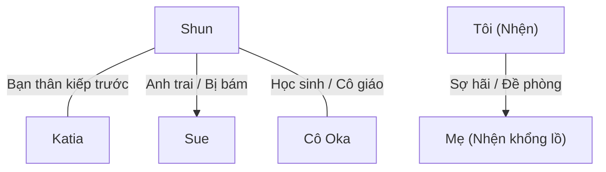

# Mối Quan Hệ Nhân Vật - Character Relationships

> Lưu trữ mối liên hệ giữa các nhân vật và cách xưng hô giữa họ.
> Đây là file CỰC KỲ QUAN TRỌNG vì xưng hô tiếng Việt phức tạp hơn tiếng Anh rất nhiều.

---

## Hướng Dẫn Xưng Hô Tiếng Việt

### Theo quan hệ gia đình

| Quan hệ | A gọi B | B gọi A |
|---------|---------|---------|
| Cha - Con trai | Con / Cha (Phụ hoàng) | Cha / Con |
| Mẹ - Con gái | Con / Mẹ (Mẫu hậu) | Mẹ / Con |
| Anh - Em trai | Em / Anh (Hoàng huynh) | Anh / Em |
| Anh - Em gái | Em / Anh (Hoàng huynh) | Anh / Em |
| Vợ - Chồng | Anh / Em | Em / Anh |

### Theo quan hệ xã hội

| Quan hệ | Xưng hô phổ biến |
|---------|------------------|
| Bạn bè đồng trang lứa (kiếp trước) | Tao - mày (riêng tư), Cậu - tớ (thân mật), Tôi - bạn (lịch sự) |
| Cô - Trò | Cô - em (thân thiện) |
| Chủ - Tớ | Tôi / Ta - Ngài / Chủ nhân |
| Anh hùng - Đồng đội | Tôi - anh, Ta - ngươi (tùy tình huống) |
| Quái vật - Quái vật | Ta - ngươi, tao - mày |

---

## Bảng Quan Hệ Nhân Vật

### Sơ Đồ Tổng Quát

---

## Chi Tiết Quan Hệ & Xưng Hô

### QH-001: Shun ↔ Katia

| Thuộc tính | Chi tiết |
|------------|----------|
| **Quan hệ** | Bạn thân kiếp trước, bạn học kiếp này |
| **Shun gọi Katia** | Katia |
| **Katia gọi Shun** | Shun |
| **Shun xưng** | Tôi / Tớ / Tao (khi nói chuyện thân mật riêng tư) |
| **Katia xưng** | Tôi / Tớ / Tao (do kiếp trước là nam nên khi nói riêng tư vẫn xưng hô thô lỗ như bạn thân) |
| **Trạng thái** | Thân thiết, tin tưởng tuyệt đối; tình cảm nữ tính của Katia bắt đầu trỗi dậy và chấp nhận sâu sắc sau khi được Shun cứu mạng (đặc biệt là sau khi được cậu dùng `[Từ Bi]` hồi sinh khi cô tự sát bằng vụ nổ để thoát khỏi sự tẩy não trong Tập 13).   *Sự kiện Volume 16:* Trong Chương 19, Katia quyết định sử dụng kỹ năng độc quyền `[Hoán Chuyển]` (Conversion) để đổi tất cả các kỹ năng lấy điểm kỹ năng nhằm mua kỹ năng thống trị `[Trinh Tiết]` (Chastity) và nhận danh hiệu `[Kẻ Thống Trị Trinh Tiết]`. Cô chấp nhận việc bị giảm chỉ số để đóng vai trò người đỡ đòn ("tanker") bảo vệ Shun bằng kết giới của mình. |
| **Ghi chú** | Ở nơi công cộng, họ dùng lễ nghi quý tộc (Ta - Các hạ / Hoàng tử - Tiểu thư). Sau sự kiện ở chương phụ K1, phần linh hồn nam tính của Katia hoàn toàn biến mất, khiến cách xưng hô riêng tư và thái độ của cô đối với Shun dần trở nên nữ tính hơn. |

---

### QH-002: Shun ↔ Sue

| Thuộc tính | Chi tiết |
|------------|----------|
| **Quan hệ** | Anh em cùng cha khác mẹ (Sue bám Shun thái quá) |
| **Shun gọi Sue** | Sue / Em gái |
| **Sue gọi Shun** | Anh trai / Hoàng huynh (Nii-sama) / Anh |
| **Shun xưng** | Anh / Tôi |
| **Sue xưng** | Em |
| **Trạng thái** | Shun yêu quý em gái nhưng chịu áp lực lớn từ sự bám dính của cô; Sue yêu thương anh trai đến mức chiếm hữu cực đoan (Yandere), coi Shun là cả thế giới.   *Sự kiện Volume 13:* Để bảo vệ tính mạng cho Shun trước thế lực của Ma Vương, Sue chấp nhận hợp tác với White và để Natsume tẩy não bằng `[Ái Dục]`, giả vờ đóng vai phản diện phản bội anh trai.   *Sự kiện Volume 15:* Trong Chương S5, sau khi tỉnh lại từ Nhiệm vụ Thế giới, Sue bộc lộ trực tiếp tình cảm yandere muốn lột đồ và kết hôn với Shun trên giường. Khi bị Shun từ chối tình cảm nam nữ nhưng hứa sẽ luôn ở bên cô với tư cách người anh trai, Sue khóc nức nở (dù sau đó giả vờ khóc để tiếp tục được Shun xoa đầu dỗ dành), ngầm chấp nhận mối quan hệ anh em nhưng vẫn duy trì tính cách ám ảnh chiếm hữu đặc trưng.   *Sự kiện Volume 16:* Trong Chương 19, được Quang Long Byaku quấn lấy cánh tay truyền thêm sức mạnh gia tăng chỉ số lên mức hàng chục ngàn, cô lập tức thích ứng nhanh chóng và xông lên tấn công Wakaba để giảm bớt gánh nặng cho Shun. |
| **Ghi chú** | Sue luôn tỏ ra ghen tị với bất kỳ ai tiếp cận Shun và cố gắng tỏ ra ngoan ngoãn dịu dàng nhất trước mặt Shun. |

---
### QH-003: Shun ↔ Cô Oka

| Thuộc tính | Chi tiết |
|------------|----------|
| **Quan hệ** | Cô trò kiếp trước, đồng minh kiếp này |
| **Shun gọi Cô Oka** | Cô Oka |
| **Cô Oka gọi Shun** | Shun / Yamada-kun (hoặc Schlain ở thế giới mới) |
| **Shun xưng** | Em |
| **Cô Oka xưng** | Cô |
| **Trạng thái** | Tin tưởng, tôn trọng |
| **Ghi chú** | Cô Oka luôn cố gắng che chở học sinh của mình |

---

### QH-004: Tôi (Nhện) ↔ Mẹ (Nhện khổng lồ)

| Thuộc tính | Chi tiết |
|------------|----------|
| **Quan hệ** | Mẹ con về mặt sinh học nhưng thù địch; hiện Mẹ đã bị tiêu diệt hoàn toàn |
| **Nhện gọi Mẹ** | Mẹ / Nhện khổng lồ / Nó |
| **Mẹ gọi Nhện** | (Không có giao tiếp ngôn ngữ, chỉ xem là thức ăn nhẹ) |
| **Nhện xưng** | Ta / Tôi (khi độc thoại) |
| **Trạng thái** | Đã kết thúc. Mẹ đã bị tiêu diệt hoàn toàn ở chương 11. Sau khi bị các Phân thân Tư duy bào mòn đến mức cực độ, Mẹ cố gắng phản kháng bằng quân đoàn nhện rối cận vệ nhưng rốt cuộc vẫn thất bại. Nhện nhỏ đã nuốt chửng linh hồn Mẹ thông qua các Phân thân Tư duy và hạ gục bà trong một trận chiến trực diện nhanh chóng. |
| **Ghi chú** | Việc Mẹ bị tiêu diệt đã giải phóng Nhện nhỏ khỏi sự kiểm soát của dòng máu Taratect, đồng thời giúp cô thăng cấp thành Zana Horowa và thừa hưởng rất nhiều chỉ số cũng như kỹ năng cực mạnh của Mẹ. |

---

---

### QH-005: Julius ↔ Hyrince

| Thuộc tính | Chi tiết |
|------------|----------|
| **Quan hệ** | Bạn thuở nhỏ, đồng đội chí cốt (Kỵ sĩ khiên bảo vệ Anh hùng) |
| **Julius gọi Hyrince** | Hyrince |
| **Hyrince gọi Julius** | Julius |
| **Julius xưng** | Tôi / Ta (khi nói chuyện công việc) / Tớ |
| **Hyrince xưng** | Tôi / Tớ |
| **Trạng thái** | Julius đã tử trận dưới tay White trong Đại chiến Nhân-Ma tại Pháo đài Kusorion. Hyrince là người sống sót duy nhất trong tổ đội, mang theo chiếc khăn quàng cổ của Julius trở về vương quốc để trao lại cho Yamada Shun. |
| **Ghi chú** | Hyrince đã bất chấp nguy hiểm che chở cho Julius trước các đòn tấn công của Taratect Nữ Vương và cố gắng kéo cậu rút lui sau cái chết của Yaana, nhưng bất thành. |

---

### QH-006: Julius ↔ Yaana

| Thuộc tính | Chi tiết |
|------------|----------|
| **Quan hệ** | Anh hùng và Thánh nữ đồng hành |
| **Julius gọi Yaana** | Yaana |
| **Yaana gọi Julius** | Anh Julius (Julius-sama) |
| **Julius xưng** | Tôi |
| **Yaana xưng** | Tôi / Em |
| **Trạng thái** | Cả hai đã tử trận tại Pháo đài Kusorion trong Đại chiến Nhân-Ma. Yaana hy sinh thân mình đỡ đòn chân của Taratect Nữ Vương để bảo vệ Julius. Julius đau đớn tột cùng trước cái chết của Yaana, từ bỏ danh nghĩa Anh hùng để chiến đấu điên cuồng báo thù cho cô trước khi bị tiêu diệt bởi tà nhãn của White. |
| **Ghi chú** | Yaana luôn là người cằn nhằn nhiều nhất khi Julius mạo hiểm. Tình cảm sâu sắc của cô dành cho Julius chỉ được bộc lộ đầy đủ trong những khoảnh khắc cuối cùng của cuộc đời cô. |

---

### QH-007: Julius ↔ Jeskan / Hawkin

| Thuộc tính | Chi tiết |
|------------|----------|
| **Quan hệ** | Thủ lĩnh và đồng đội lớn tuổi hơn |
| **Julius gọi họ** | Anh Jeskan / Anh Hawkin |
| **Họ gọi Julius** | Hoàng tử (Prince Julius) / Ngài |
| **Julius xưng** | Tôi |
| **Họ xưng** | Tôi |
| **Trạng thái** | Cả hai đều tử trận tại Kusorion. Jeskan và Hawkin đã hy sinh tính mạng trong trận chiến ác liệt chống lại chỉ huy ma tộc Agner. Nhận ra vết thương của mình là chí mạng, họ từ chối nhận Trị liệu Ma pháp từ Yaana và bảo cô cùng Hyrince đi tiếp viện cho Julius. |
| **Ghi chú** | Mối quan hệ gắn kết bất chấp khác biệt về xuất thân. Sự hy sinh của họ là đòn bẩy tinh thần lớn cho Hyrince và Yaana trên chiến trường. |

---

### QH-008: Shun ↔ Hugo (Natsume)

| Thuộc tính | Chi tiết |
|------------|----------|
| **Quan hệ** | Bạn học kiếp trước, đối thủ đối đầu trực diện kiếp này |
| **Shun gọi Hugo** | Natsume / Hugo |
| **Hugo gọi Shun** | Yamada / Shun / Kẻ yếu đuối |
| **Shun xưng** | Tôi / Tao (khi nói chuyện cá nhân) |
| **Hugo xưng** | Ta / Tao |
| **Trạng thái** | Đối đầu gay gắt, thù địch.   *Sự kiện Volume 15:* Trong Chương S3, sau khi được giải thoát khỏi sự tẩy não, Hugo kiên quyết từ bỏ cái tên "Hugo" và yêu cầu Shun gọi mình là "Natsume Kengo". Cậu ta tỏ ra hoàn toàn uể oải, bất cần đời và sẵn sàng chịu đựng bất kỳ sự trừng phạt hay đe dọa nào từ bạn học cũ. Cậu ta cũng đã cảnh báo Shun rằng phe ma tộc và White sẽ không dừng lại sau khi tiêu diệt tộc Elf, và tiết lộ việc Sue đang bị đe dọa bằng tính mạng của Shun để làm việc cho họ. |
| **Ghi chú** | Hugo từng luôn cảm thấy kiêu ngạo muốn vượt qua và chà đạp Shun, nhưng sau khi được giải thoát tẩy não thì đã hoàn toàn suy sụp và bất lực. |

---

### QH-009: Shun ↔ Hasebe

| Thuộc tính | Chi tiết |
|------------|----------|
| **Quan hệ** | Bạn học cũ ngồi cạnh nhau kiếp trước, bạn học kiếp này |
| **Shun gọi Hasebe** | Hasebe / Yuika |
| **Hasebe gọi Shun** | Yamada / Shun |
| **Shun xưng** | Tôi / Tớ |
| **Hasebe xưng** | Tôi / Mình |
| **Trạng thái** | Thân thiện, cởi mở |
| **Ghi chú** | Gặp lại bất ngờ tại lễ khai giảng học viện |

---

### QH-010: Ariel ↔ Balto

| Thuộc tính | Chi tiết |
|------------|----------|
| **Quan hệ** | Quân chủ và thuộc hạ cấp dưới trực tiếp |
| **Ariel gọi Balto** | Ngươi / Balto |
| **Balto gọi Ariel** | Ma Vương đại nhân / Ngài |
| **Ariel xưng** | Ta |
| **Balto xưng** | Tôi / Thần |
| **Trạng thái** | Balto e sợ và cẩn trọng phụng sự; Ariel thoải mái nhưng nắm quyền sinh sát tối cao |
| **Ghi chú** | Mối quan hệ chủ tớ đặc trưng của Ma Vương và Tướng quân quản lý hành chính |

---

### QH-011: Katia ↔ Sue

| Thuộc tính | Chi tiết |
|------------|----------|
| **Quan hệ** | Bạn bè xã giao quý tộc, đối thủ ngầm cạnh tranh sự chú ý của Shun |
| **Katia gọi Sue** | Sue / Em |
| **Sue gọi Katia** | Katia / Chị |
| **Katia xưng** | Chị / Tôi (độc thoại xưng "mình") |
| **Sue xưng** | Tôi / Em |
| **Trạng thái** | Bề ngoài lịch sự, bên trong Sue cảnh giác Katia như tình địch; Katia đóng vai trò trung gian khuyên bảo Sue |
| **Ghi chú** | Sue đề phòng mối quan hệ thân thiết giữa Katia và Shun |

---

### QH-012: Shun ↔ Anna

| Thuộc tính | Chi tiết |
|------------|----------|
| **Quan hệ** | Chủ tớ (Hầu gái kiêm hộ vệ và Cậu chủ/Điện hạ), cô trò (Anna dạy phép thuật cho Shun), tình mẫu tử (cha mẹ nuôi) |
| **Shun gọi Anna** | Anna / Cô Anna |
| **Anna gọi Shun** | Điện hạ Schlain / Cậu chủ / Điện hạ |
| **Shun xưng** | Ta / Tôi / Em / Anh |
| **Anna xưng** | Tôi / Em |
| **Trạng thái** | Anna chăm sóc Shun từ nhỏ nên hiểu rất rõ tính cách của cậu, cô vô cùng trung thành, tận tụy và chu đáo. Sau khi được giải thoát khỏi thuật tẩy não cực đoan của Hugo nhờ ma pháp của Shun, cô lâm vào tình trạng trầm cảm, tự dằn vặt bản thân vì những lỗi lầm vô ý đã phạm phải và sợ làm vướng chân Shun. Shun rất quan tâm, lo lắng cho tình trạng tâm lý của cô và muốn tự mình trông nom, bảo vệ cô (như khi cô có dấu hiệu bị hội chứng sợ mê cung). Trong Tập 5, Fei nhận xét cô có tình mẫu tử sâu sắc và hành xử như một người mẹ nuôi/cha mẹ đỡ đầu đối với Shun, sẵn sàng hy sinh để bảo vệ cậu. |
| **Ghi chú** | Anna là một bán Elf có quá khứ bị xua đuổi khỏi làng Elf, khiến chuyến hành trình trở lại làng Elf của cô ẩn chứa nhiều căng thẳng. |

---
### QH-013: Fei ↔ Anna

| Thuộc tính | Chi tiết |
|------------|----------|
| **Quan hệ** | Thú cưng (rồng nuôi) và người chăm sóc/huấn luyện |
| **Fei gọi Anna** | Anna / Cô hầu gái đó |
| **Anna gọi Fei** | Fei |
| **Fei xưng** | Tớ / Tôi |
| **Anna xưng** | Tôi |
| **Trạng thái** | Fei oán hận ngầm vì bị Anna ép ăn thịt quái vật kinh dị; Anna nghiêm khắc ép Fei ăn vì muốn tốt cho sự phát triển của cô |
| **Ghi chú** | Fei coi Anna là "nỗi kinh hoàng" trong việc ăn uống |

---

### QH-014: Shun ↔ Yuri

| Thuộc tính | Chi tiết |
|------------|----------|
| **Quan hệ** | Bạn bè tái sinh, Yuri liên tục lôi kéo Shun cải đạo |
| **Shun gọi Yuri** | Yuri / Hasebe |
| **Yuri gọi Shun** | Shun |
| **Shun xưng** | Tớ / Tôi |
| **Yuri xưng** | Tớ / Tôi |
| **Trạng thái** | Shun cảm thấy mệt mỏi, bất lực trước sự cuồng tín của Yuri; Yuri nhiệt tình dụ dỗ Shun gia nhập giáo hội |
| **Ghi chú** | Sự bám dính của Yuri thường xuyên kích hoạt phản ứng xua đuổi từ Sue |

---

### QH-015: Katia ↔ Yuri

| Thuộc tính | Chi tiết |
|------------|----------|
| **Quan hệ** | Bạn bè tái sinh, bạn học cùng lớp |
| **Katia gọi Yuri** | Yuri / Hasebe |
| **Yuri gọi Katia** | Ooshima / Katia |
| **Katia xưng** | Tớ / Tôi |
| **Yuri xưng** | Tớ / Tôi |
| **Trạng thái** | Katia thông cảm cho quá khứ của Yuri nhưng khéo léo từ chối cải đạo; hai người chia sẻ cởi mở về giới tính nữ của Katia |
| **Ghi chú** | Lời khẳng định "cậu hoàn toàn nữ tính" của Yuri gián tiếp làm Katia bộc lộ tình cảm với Shun |

---

### QH-016: Tôi (Nhện) ↔ Quản trị viên D

| Thuộc tính | Chi tiết |
|------------|----------|
| **Quan hệ** | Đối tượng giải trí và Người theo dõi/Quản trị viên → Chủ nhân và Quyến thuộc chính thức (từ Vol 16) |
| **Nhện gọi D** | Quản trị viên D / Kẻ rình mò / Admin / Tên khốn / Tà thần |
| **D gọi Nhện** | Cá thể Zoa Ele (hoặc qua Thần ngôn) |
| **Nhện xưng** | Tôi (Watashi) |
| **D xưng** | D / Quản trị viên Thượng cấp D |
| **Trạng thái** | Sau khi kỹ năng [Cấm kỵ] đạt LV 10 (Chương 7), Nhện biết được D chính là kẻ đã tái sinh mình vào thế giới sắp sụp đổ này để làm trò giải trí. Nhện cực kỳ tức giận (nhận kỹ năng [Phẫn Nộ LV 1]) và căm ghét tính cách vặn vẹo của D, nhưng đành phải tạm thời nương theo kế hoạch của D để sinh tồn và tìm cách tích lũy thực lực thoát khỏi thế giới này. Ở Volume 9 Chương 7, sau khi thần hóa, White đã tự dịch chuyển về Trái Đất (Nhật Bản) và đối mặt trực tiếp với D tại nhà riêng của cô ta. Tại đây, cô bàng hoàng đối diện với sự thật phũ phàng rằng mình không phải là Wakaba Hiiro tái sinh như cô hằng nghĩ, mà chỉ là một bản sao, một kẻ thế thân (substitute) được D ban cho ký ức giả mạo nhằm che giấu hành tung của cô ta. Ở Volume 16 Chương 22, sau khi Nhiệm vụ Thế giới hoàn thành, White chính thức bị D siết vai giữ lại và phải chấp nhận trở thành quyến thuộc chính thức dưới quyền D, chịu sự quản thúc trực tiếp của cô ta và chia tay với Ariel và mọi người. |
| **Ghi chú** | Mối quan hệ chuyển từ đề phòng một chiều sang thù ghét/bực bội sâu sắc từ phía Nhện. Việc gặp mặt trực tiếp ở Volume 9 đã làm sáng tỏ nguồn gốc thực sự của White như một "kẻ thế thân" của Tà Thần D trên Trái Đất. |

---

### QH-017: Shun ↔ Parton

| Thuộc tính | Chi tiết |
|------------|----------|
| **Quan hệ** | Bạn học cùng lớp, đồng đội trong buổi ngoại khóa thám hiểm |
| **Shun gọi Parton** | Parton |
| **Parton gọi Shun** | Điện hạ Schlain / Hoàng tử |
| **Shun xưng** | Tôi / Tớ |
| **Parton xưng** | Tôi / Thần |
| **Trạng thái** | Parton vô cùng kính trọng và bảo vệ Shun; Shun tôn trọng Parton và coi cậu ấy là bạn bè đồng trang lứa |
| **Ghi chú** | Parton cùng Shun dựng lều trại và cảnh báo trước khi Hugo tấn công |

---

### QH-018: Balto ↔ Bloe

| Thuộc tính | Chi tiết |
|------------|----------|
| **Quan hệ** | Anh em ruột |
| **Balto gọi Bloe** | Bloe |
| **Bloe gọi Balto** | Anh trai |
| **Balto xưng** | Anh / Tôi |
| **Bloe xưng** | Tôi / Em |
| **Trạng thái** | Bloe đã tử trận tại Pháo đài Kusorion dưới tay Anh hùng Julius. Balto vô cùng đau buồn và suy sụp khi biết tin em trai qua đời, xin phép được ở một mình trong phòng trung tâm chỉ huy sau khi nghe tin. |
| **Ghi chú** | Trước khi tử trận, Bloe đã nhận cuộc gọi cuối cùng từ Balto qua công cụ ma thuật thiết bị liên lạc (điện thoại thông minh), nhưng kiên quyết từ chối rút lui cùng White vì muốn ở lại bảo vệ và sơ tán binh lính của mình. |

---

### QH-019: Ariel ↔ Bloe

| Thuộc tính | Chi tiết |
|------------|----------|
| **Quan hệ** | Quân chủ và thuộc hạ |
| **Ariel gọi Bloe** | Ngươi |
| **Bloe gọi Ariel** | Con ranh ngẫu nhiên (khi nói sau lưng) / Ma Vương |
| **Ariel xưng** | Ta |
| **Bloe xưng** | Ta / Tôi |
| **Trạng thái** | Bloe đã tử trận tại Kusorion. Mặc dù Ariel gián tiếp phái Taratect Nữ Vương đến Kusorion nhằm mục đích giải cứu Agner và Bloe, Bloe vẫn kiên quyết không rút lui để bảo vệ binh lính của mình. |
| **Ghi chú** | Ariel sau trận chiến đã bày tỏ sự nuối tiếc thầm lặng trước cái chết của Bloe và Agner, thừa nhận họ là những chỉ huy tốt. |

---

---

### QH-020: Leston ↔ Cô Oka

| Thuộc tính | Chi tiết |
|------------|----------|
| **Quan hệ** | Đồng minh bí mật cùng bảo vệ Shun |
| **Leston gọi Cô Oka** | Cô / Cô Oka |
| **Cô Oka gọi Leston** | Anh / Hoàng tử Leston |
| **Leston xưng** | Tôi |
| **Cô Oka xưng** | Tôi |
| **Trạng thái** | Leston tôn trọng tấm lòng vì học sinh của cô Oka; hai người hợp tác thu thập thông tin tình báo |
| **Ghi chú** | Mối liên lạc bí mật sau khi Shun thừa kế danh hiệu Anh hùng |

---

### QH-021: Shun ↔ Leston

| Thuộc tính | Chi tiết |
|------------|----------|
| **Quan hệ** | Anh em cùng cha khác mẹ |
| **Shun gọi Leston** | Anh Leston / Hoàng huynh Leston |
| **Leston gọi Shun** | Shun |
| **Shun xưng** | Tôi |
| **Leston xưng** | Anh |
| **Trạng thái** | Leston là người anh trai Shun thân thiết thứ hai sau Julius; anh ôm Shun chia sẻ nỗi đau mất Julius |
| **Ghi chú** | Leston rất hiền lành và thương yêu các em của mình |

---

### QH-022: Shun ↔ Cylis

| Thuộc tính | Chi tiết |
|------------|----------|
| **Quan hệ** | Anh em cùng cha khác mẹ |
| **Shun gọi Cylis** | Anh cả Cylis / Hoàng huynh Cylis |
| **Cylis gọi Shun** | Schlain / Shun |
| **Shun xưng** | Tôi |
| **Cylis xưng** | Ta / Tôi |
| **Trạng thái** | Bi kịch; Cylis gài bẫy Shun và giết hại vua cha, nhưng cuối cùng bị Hugo tẩy não thành phế nhân. Shun xót thương nhưng bỏ lại anh ta để tẩu thoát. |
| **Ghi chú** | Cylis luôn tỏ vẻ nghiêm khắc và lạnh nhạt với Shun |

---

### QH-023: Shun ↔ Phụ hoàng (Vua Analeit)

| Thuộc tính | Chi tiết |
|------------|----------|
| **Quan hệ** | Cha con hoàng tộc |
| **Shun gọi Phụ hoàng** | Phụ hoàng / Cha |
| **Phụ hoàng gọi Shun** | Schlain / Con |
| **Shun xưng** | Con |
| **Phụ hoàng xưng** | Ta |
| **Trạng thái** | Kính trọng, nghiêm nghị; Phụ hoàng đặt trách nhiệm lên vai Shun nhưng vẫn dành sự quan tâm dịu dàng của người cha |
| **Ghi chú** | Phụ hoàng vô cùng đau buồn trước cái chết của Julius và lo lắng cho gánh nặng của Shun |

---

### QH-024: Shun ↔ Hyrince

| Thuộc tính | Chi tiết |
|------------|----------|
| **Quan hệ** | Người quen cũ, bạn thuở nhỏ của hoàng huynh Julius |
| **Shun gọi Hyrince** | Anh Hyrince |
| **Hyrince gọi Shun** | Shun / Nhị hoàng tử Schlain / Hoàng tử Schlain |
| **Shun xưng** | Tôi |
| **Hyrince xưng** | Tôi |
| **Trạng thái** | Tuyệt đối tin cậy; Hyrince đã trở về vương quốc, kể lại tường tận trận chiến cuối cùng của Julius cho Shun nghe và trao lại di vật khăn quàng cổ. Hyrince nguyện làm tấm khiên bảo vệ cho vị Anh hùng mới.  *Sự kiện Volume 16:* Hyrince cùng Anna hội ngộ Shun sau khi chiếc UFO được nhóm Shun giải cứu khỏi bầy quái vật. Tại đây, Hyrince đã tiết lộ cho Shun biết thân phận thực sự của mình là một phân thân của Hắc Thần, đồng thời chia sẻ thông tin chấn động rằng Tà thần thực sự là D chứ không phải Thần sắc ngà, và D sẽ tiêu diệt một nửa nhân loại bất kể kết cục thế nào. Trong Chương 18, khi D mở ra màn chơi phụ thử thách cả nhóm tại lõi hệ thống và bất ngờ ra tay, Hyrince đã lao ra chắn đòn tấn công của D cứu mạng cho Shun và bị D đâm thủng tim, hy sinh ngay tại chỗ. Trong Chương 19, Hyrince được Shun hồi sinh bằng kỹ năng `[Từ Bi]` và nhanh chóng triệu hồi ba thủ lĩnh rồng: Phong Long Hyuvan, Băng Long Nia và Hắc Long Reise để trợ chiến trước khi cạn kiệt MP. |
| **Ghi chú** | Quan hệ chuyển từ người quen cũ thành đồng đội chung chí hướng kế thừa ý chí của Julius. |

---

### QH-025: Shun ↔ Fei

| Thuộc tính | Chi tiết |
|------------|----------|
| **Quan hệ** | Bạn học tái sinh, linh thú khế ước (chủ tớ) |
| **Shun gọi Fei** | Fei |
| **Fei gọi Shun** | Shun |
| **Shun xưng** | Tôi / Tớ |
| **Fei xưng** | Tôi / Tớ / Tớ (Watashi) |
| **Trạng thái** | Bạn bè bình đẳng bất chấp khế ước chủ tớ, luôn đồng hành cùng nhau. Sau khi tiến hóa thành Quang Phi Long (Chương S5), Fei đã cứu thoát nhóm Shun khỏi vòng vây của Sophia và bọn ninja. Họ xưng hô thân mật "cậu" - "tớ" kiểu bạn học cũ. Shun coi trọng Fei và lo lắng sâu sắc khi Fei đột ngột hóa thành quả trứng khổng lồ. |

---
### QH-026: Ronandt ↔ Aurel

| Thuộc tính | Chi tiết |
|------------|----------|
| **Quan hệ** | Sư phụ và đệ tử (Thầy trò) |
| **Ronandt gọi Aurel** | Ngươi / Đệ tử ngốc nghếch (foolish disciple) |
| **Aurel gọi Ronandt** | Sư phụ / Ông già (old man) |
| **Ronandt xưng** | Ta |
| **Aurel xưng** | Con (hoặc tôi) |
| **Trạng thái** | Thân thiết nhưng đầy sự cằn nhằn, cãi cọ hài hước. Aurel thường cằn nhằn về sự lười biếng, trốn việc hành chính của Ronandt; cô không ngần ngại vác lão đi làm việc. Ronandt ngoài miệng luôn gọi cô là "kẻ ngốc" nhưng trong lòng thừa nhận tài năng và tính nhạy bén của cô. |
| **Ghi chú** | Mối quan hệ thầy trò phá cách nhất của Đế quốc. |

---

### QH-027: Ronandt ↔ Julius

| Thuộc tính | Chi tiết |
|------------|----------|
| **Quan hệ** | Sư phụ và đệ tử (Julius từng học ma pháp với Ronandt) |
| **Ronandt gọi Julius** | Julius / Đứa đệ tử ngốc nghếch / Anh hùng |
| **Julius gọi Ronandt** | Sư phụ (Ronandt-sama) |
| **Ronandt xưng** | Ta |
| **Julius xưng** | Tôi / Con |
| **Trạng thái** | Ronandt coi Julius là đứa đệ tử ngốc nghếch bị danh hiệu Anh hùng che mắt, ôm ước mơ ngây thơ cứu thế giới rồi chết trẻ. Dù cằn nhằn và chê bai sự ngốc nghếch của Julius, Ronandt thực chất vô cùng đau xót trước sự hy sinh của anh và hối tiếc vì không thể dạy anh cách tự bảo vệ mình tốt hơn. |
| **Ghi chú** | Trận chiến ở pháo đài đã cướp đi Julius, để lại nỗi buồn sâu sắc cho Ronandt. |

---

### QH-028: Ronandt ↔ Tôi (Nhện)

| Thuộc tính | Chi tiết |
|------------|----------|
| **Quan hệ** | Người chứng kiến và Quái vật huyền thoại (Ronandt tôn xưng Nhện là "sư phụ") |
| **Ronandt gọi Nhện** | Vị sư phụ đó (That master) / Người đó / Thực thể đó |
| **Nhện gọi Ronandt** | Ông già loài người (sau này gặp trực tiếp) |
| **Ronandt xưng** | Ta |
| **Nhện xưng** | Ta / Tôi |
| **Trạng thái** | 16 năm trước (theo trục thời gian loài người), Ronandt chạm trán Nhện nhỏ trong Mê cung Lớn Elroe và suýt chết. Nhìn thấy ma pháp tối thượng của Nhện, Ronandt hoàn toàn bị thuyết phục và tôn sùng cô như một vị thần ma pháp, từ bỏ mọi kiêu ngạo của bản thân để học hỏi từ xa. |
| **Ghi chú** | Cuộc gặp gỡ này đã thay đổi hoàn toàn cuộc đời và tư duy ma pháp của Ronandt. |

---

### QH-029: Potimas ↔ Cô Oka (Filimõs)

| Thuộc tính | Chi tiết |
|------------|----------|
| **Quan hệ** | Con gái và Cha ruột (mâu thuẫn, lợi dụng, đề phòng sinh tử) |
| **Cô Oka gọi Potimas** | Cha / Ngài Potimas (khi xa cách) |
| **Potimas gọi Cô Oka** | Con / Filimõs |
| **Cô Oka xưng** | Con / Tôi |
| **Potimas xưng** | Ta |
| **Trạng thái** | Xa cách, thực dụng và căng thẳng ngầm. Cô Oka tuy là con gái Potimas nhưng hiểu rất rõ bản chất tàn nhẫn của ông ta. Cô biết rằng nếu mình xóa kỹ năng bằng [Xóa Kỹ Năng] (đồng nghĩa với việc dâng nộp sức mạnh cho các quản trị viên, kẻ thù của tộc Elf), Potimas sẽ sẵn sàng thanh trừng cô mà không hề biến sắc. Cô Oka vừa phải lợi dụng quyền lực của cha để bảo hộ các học sinh, vừa phải giữ lại các kỹ năng của mình để tự vệ và tránh bị thanh trừng, đồng thời bảo vệ các học sinh khỏi việc bị tộc Elf lợi dụng hay vứt bỏ. Trong Chương cuối Volume 7, sau khi White hóa thần, Potimas quyết tâm trả thù và đã ra lệnh mang Oka theo cùng lực lượng quân đội tộc Elf để dàn dựng cảnh các người tái sinh tự tàn sát lẫn nhau, một kế hoạch tàn độc mà hắn cho rằng sẽ rất thú vị và gây ra đau khổ tột cùng cho cả Oka lẫn White.  *Sự kiện Volume 13:* Việc cô Oka kích hoạt quyền hạn thống trị của `[Nhân Ái]` để cứu học sinh của mình đã vô tình tiêu thụ phần linh hồn ký sinh của Potimas bám trên cô, giúp cô thoát khỏi sự kiểm soát của hắn. |

---

### QH-030: Hugo ↔ Cylis

| Thuộc tính | Chi tiết |
|------------|----------|
| **Quan hệ** | Đồng minh phản phản biến / Lợi dụng lẫn nhau |
| **Hugo gọi Cylis** | Cylis / Các hạ |
| **Cylis gọi Hugo** | Hugo |
| **Hugo xưng** | Ta / Tôi |
| **Cylis xưng** | Ta / Tôi |
| **Trạng thái** | Đồng minh phản biến nhưng bị phản bội; Hugo lợi dụng tham vọng của Cylis rồi dùng [Ái Dục] tẩy não hủy hoại hoàn toàn tâm trí anh ta ngay khi đại sự thành. |

---

### QH-031: Hugo ↔ Sue (bị tẩy não)

| Thuộc tính | Chi tiết |
|------------|----------|
| **Quan hệ** | Kẻ tẩy não và Con rối (giả tạo) |
| **Hugo gọi Sue** | Sue |
| **Sue gọi Hugo** | (Không rõ, nhưng cô ấy nghe lệnh tuyệt đối vì "tình yêu đích thực" giả tạo) |
| **Trạng thái** | Sue bị Hugo sử dụng kỹ năng đặc biệt [Ái Dục] để tẩy não, ép cô tự sát hại cha mình và vu khống Shun. Tuy nhiên, theo tiết lộ của Natsume trong Volume 15 S3, cậu ta chỉ thực sự tẩy não Sue vào thời điểm ép cô giết vua cha, còn lại Sue làm việc cho phe ma tộc của White vì bị đe dọa bằng sự an toàn của Shun. |

---

### QH-032: Hugo ↔ Sophia

| Thuộc tính | Chi tiết |
|------------|----------|
| **Quan hệ** | Lợi dụng và Quân cờ / Đồng minh giả tạo |
| **Hugo gọi Sophia** | Sophia / con khốn phản bội |
| **Sophia gọi Hugo** | Cậu / Hugo |
| **Hugo xưng** | Tao / Ta / Tôi |
| **Sophia xưng** | Tôi |
| **Trạng thái** | Liên minh giả tạo và sự sụp đổ. Sophia khinh thường thực lực của Hugo và giễu cợt cậu ta. Cô truyền đạt cảnh báo từ chủ nhân (Ariel/White) vì Hugo đã động thủ với cô Oka. Trong Chương S4, khi Hugo thua trận và gầm lên bắt Sophia giết nhóm Shun, cô thản nhiên buông lời chế giễu và tuyên bố phe ma tộc đã vứt bỏ Hugo vì không còn giá trị lợi dụng. Hugo phẫn nộ nhận ra mình chỉ là một mồi nhử giúp quân ma tộc phát động cuộc xâm lăng bất ngờ vào làng Elf. |

---
### QH-033: Hugo ↔ Anna (bị tẩy não)

| Thuộc tính | Chi tiết |
|------------|----------|
| **Quan hệ** | Kẻ tẩy não và Nạn nhân |
| **Trạng thái** | Anna bị Hugo tẩy não nhằm phục kích Shun ngay khi cô gặp lại Shun tại biệt thự. |

---

### QH-034: Tôi (Nhện) ↔ Güliedistodiez (Quản trị viên Hắc)

| Thuộc tính | Chi tiết |
|------------|----------|
| **Quan hệ** | Đối tác thương lượng bất đắc dĩ / Thần linh và Người tái sinh |
| **Tôi gọi Gülie** | Güli-güli / anh ta / hắn / Quản trị viên Güliedistodiez / Gã áo đen |
| **Gülie gọi Tôi** | Ngươi |
| **Tôi xưng** | Tôi (trong độc thoại / thần giao cách cảm) / Ta (độc thoại) |
| **Gülie xưng** | Ta |
| **Trạng thái** | Sau khi đạt [Cấm kỵ LV 10], Nhện nhận ra người đàn ông da ngăm đen mặc giáp đen này là Quản trị viên Güliedistodiez. Trong Chương 7 Volume 5, Güli-güli trực tiếp dịch chuyển đến gặp cô sau khi cô hồi sinh từ trứng. Anh ta tặng cô xác bầy địa long để cô ăn hồi phục như lời xin lỗi vì đã gián tiếp giúp Ariel tìm ra cô, đồng thời cam kết không can thiệp vào người tái sinh nữa. Tuy nhiên, Nhện nhỏ từ chối yêu cầu ngừng can thiệp vào Ariel (vì phân thân não thể xác cũ của cô bị kẹt trong Ariel) và con người. Güli-güli cảnh báo cô nếu cô đi ngược lại lợi ích của anh ta, anh ta sẽ đứng ra ngăn cản. Ở Volume 6 Chương R4, Güli-güli dịch chuyển đến ngăn chặn đàn nhện con do các Phân thân Tư duy dẫn dắt khi chúng định ăn bầy phi long bảo vệ trứng, tuyên bố bất kỳ hành động gây hấn nào tiếp theo sẽ là tuyên chiến với hắn. Trong Cuộc họp Phân thân Tư duy #4, các Phân thân Tư duy gọi hắn là "trùm cuối" và quyết định rút lui khỏi Tầng Dưới để tránh chọc giận hắn, đồng thời lên kế hoạch đi săn loài người để lấy EXP nuôi bầy nhện con. Trong Volume 6 Chương 5, sau khi cô tiêu diệt các Phân thân Tư duy nổi loạn, cả hai đã uống rượu cùng Ariel. Güli-güli nhận định tính cách ích kỷ và kiêu ngạo của cô rất giống D, định ra tay trừng trị cô vì quá nguy hiểm nhưng bị D gọi điện thoại ngăn cản. Khi anh ta hỏi về dự định tương lai, cô tuyên bố sẽ chỉ hành động theo ý chí và lòng tự tôn của chính mình, không để ai can thiệp. Ở Volume 9 Chương 6, Güli-güli trực tiếp tìm đến White tại buổi trà chiều để nhờ cô ngăn chặn Wrath (vì hắn bị ràng buộc bởi giao ước với D nên không thể tự can thiệp). White đồng ý giúp đỡ. Sau trận đấu, Güli-güli hết lời khen ngợi khả năng làm chủ ma pháp không gian của cô, thừa nhận cô đã vượt mặt hắn và có thể dễ dàng rời khỏi hành tinh này. Hắn cũng đồng ý với yêu cầu không can thiệp của cô đối với Wrath thay cho phần thưởng.  *Sự kiện Volume 13:* Trong Chương 5, Güli-güli dưới dạng phân thân Hyrince đã đối thoại riêng tư với White tại lâu đài hoàng thành Analeit sau khi cô thực hiện thành công thí nghiệm giết rồi hồi sinh Leston bằng kỹ năng [Từ Bi] của Shun. Hyrince chất vấn cô về việc để Ronandt chiến đấu với Shun và than phiền về nỗi đau của bản thân khi chứng kiến Julius chết và Shun chịu khổ. Dù vậy, ông thừa nhận con đường cô chọn là lối thoát tốt nhất và cam kết không can thiệp. White cũng xác nhận qua thí nghiệm rằng linh hồn ký sinh của Potimas đã bị trục xuất sau khi đối tượng chết, mở ra hy vọng giải thoát cô Oka. Trong Chương 8, White phát hiện thanh Anh Hùng Kiếm vẫn kết thúc ở thắt lưng của Yamada do Hyrince chuyển giao (dưới danh nghĩa di nguyện của Julius) và cảm thấy cực kỳ bực bội trước hành động thiếu trách nhiệm của ông ta khi trao vũ khí chống thần cực kỳ nguy hiểm này cho người khác.  *Sự kiện Volume 15:* Trong Chương 5, sau khi Nhiệm vụ Thế giới kích hoạt, Güliedistodiez chủ động tấn công cô và lôi cô vào kết giới dị không gian do mình thiết lập để chiến đấu nhằm bảo vệ ý nguyện bảo hộ loài người của Nữ thần Sariel. Cả hai bắt đầu trận chiến bào mòn năng lượng kéo dài. Trong Vĩ thanh & Mở đầu (Chương 19), cả hai cùng lắng nghe bài phát biểu của Ariel và Giáo hoàng Dustin qua Thần ngôn. Hắc thừa nhận không thể để thua vì lý tưởng bảo vệ nguyện ước của Sariel và gánh vác hy vọng của nhân loại. White bày tỏ sự tôn trọng và khẳng định sẽ chiến đấu hết mình để giành chiến thắng. Trận chiến giữa họ tiếp tục tiếp diễn. |

---
### QH-035: Güliedistodiez (Quản trị viên Hắc) ↔ Quản trị viên D

| Thuộc tính | Chi tiết |
|------------|----------|
| **Quan hệ** | Bạn bè / Đồng cấp Quản trị viên |
| **Hắc gọi D** | D |
| **D gọi Hắc** | Người bạn kia của tôi / Hắc |
| **Hắc xưng** | - |
| **D xưng** | D / Tôi |
| **Trạng thái** | Hắc bất ngờ và phải tuân theo sự can thiệp của D khi cô ra lệnh cho hắn không được làm phiền Nhện nhỏ. Trong Volume 7, sau khi Hắc Long tiêu diệt G-Meteo ngoài vũ trụ, D đã liên lạc qua một thiết bị mỏng ra lệnh cho anh ta phải ở yên đó quan sát phần còn lại của trận chiến chứ không được quay về hỗ trợ nhóm Ariel, chỉ vì cô ta thấy thế mới giải trí. Dù bất bình và muốn giúp Ariel, Hắc Long bắt buộc phải nghe theo vì sức mạnh áp đảo của D.  *Sự kiện Volume 14:* Trong Chương 24, tiết lộ chi tiết việc Hắc Long đi cầu xin D cứu mạng Sariel khi linh hồn cô sắp tiêu biến hoàn toàn. Mặc dù D là một vị thần đáng sợ mà loài rồng luôn xem là cấm kỵ và tránh tiếp xúc, Hắc Long vẫn bất chấp sự kiêu hãnh của rồng tộc để tới cầu xin D. Dù D đã đồng ý thiết lập Hệ thống để cứu Sariel và thế giới, ả cũng biến thế giới thành trò tiêu khiển của mình, khiến Hắc Long luôn hối hận và dằn vặt vì đã trao thế giới và Sariel vào tay D. |

---

### QH-036: Sophia ↔ Cô Oka

| Thuộc tính | Chi tiết |
|------------|----------|
| **Quan hệ** | Học sinh tái sinh và Cô giáo kiếp trước, kẻ địch kiếp này |
| **Sophia gọi Cô Oka** | Cô Oka |
| **Cô Oka gọi Sophia** | Sophia / Negi... (Negishi Shouko) |
| **Sophia xưng** | Tôi |
| **Cô Oka xưng** | Cô / Ta |
| **Trạng thái** | Cô Oka cố gắng gọi Sophia bằng tên cũ ở kiếp trước (Negi...) nhưng bị Sophia cắt ngang và cấm gọi. Sophia thể hiện thái độ giễu cợt nhưng cũng tôn trọng giao ước với "Chủ nhân" là không làm hại cô Oka, chỉ "tự vệ". Cô Oka bàng hoàng khi biết Sophia đã chặt đầu Potimas và tự tay giết người không ghê tay. |

---

### QH-037: Sophia ↔ Ninja (Nhẫn giả)

| Thuộc tính | Chi tiết |
|------------|----------|
| **Quan hệ** | Đồng nghiệp / Cùng phe cánh dưới quyền Ma Vương |
| **Sophia gọi Ninja** | Cô |
| **Ninja gọi Sophia** | Cô |
| **Sophia xưng** | Tôi |
| **Ninja xưng** | Tôi |
| **Trạng thái** | Sophia tùy hứng và thích hành động theo ý mình (tự ý đấu với Shun để thử sức); Ninja nghiêm túc chấp hành mệnh lệnh và thường xuyên nhắc nhở, dọa báo cáo Sophia với Chủ nhân. Họ bộc lộ sự bực dọc qua lại như bạn bè/đồng nghiệp đồng trang lứa. |

---

### QH-038: Shun ↔ Ronandt

| Thuộc tính | Chi tiết |
|------------|----------|
| **Quan hệ** | Cựu sư phụ của hoàng huynh và Vị Anh hùng mới |
| **Shun gọi Ronandt** | Trưởng lão Ronandt / Sư phụ của hoàng huynh |
| **Ronandt gọi Shun** | Em trai của Julius / Anh hùng mới / Các người |
| **Shun xưng** | Tôi |
| **Ronandt xưng** | Ta / Lão già này |
| **Trạng thái** | Ronandt phục kích từ xa và thử thách nhóm Shun tại hoàng thành bằng các đòn phép uy lực lớn. Lão đánh giá nhóm "đủ điểm đỗ" và giả vờ rút lui thả cho đi vì tôn trọng tình nghĩa với Julius. Shun bàng hoàng trước sức mạnh ma pháp và không gian áp đảo của Ronandt nhưng thầm cảm kích vì được tha mạng, đồng thời hạ quyết tâm rèn luyện để vượt qua. |
| **Ghi chú** | Cuộc chạm trán giúp Shun nhận ra khoảng cách thực lực to lớn giữa mình và các pháp sư hàng đầu thế giới. |

### QH-039: Ronandt ↔ Sophia

| Thuộc tính | Chi tiết |
|------------|----------|
| **Quan hệ** | Đồng minh tạm thời tại Đế quốc (Sophia thao túng Hugo, Ronandt tạm thời đi theo Hugo) nhưng thực chất đề phòng lẫn nhau |
| **Ronandt gọi Sophia** | Đứa con gái nhỏ bé / Sophia / Con bé / Con nhóc xấc xược |
| **Sophia gọi Ronandt** | Ông / Trưởng lão Ronandt |
| **Ronandt xưng** | Ta / Lão già này |
| **Sophia xưng** | Tôi |
| **Trạng thái** | Sophia cảnh báo và đe dọa sẽ nghiền nát Ronandt nếu lão giở trò cản trở kế hoạch của Chủ nhân (Ariel). Ronandt nhận thức rõ khoảng cách sức mạnh áp đảo của Sophia và sự nguy hiểm của cô, đồng thời đề phòng cô. Lão tự cảm thấy sợ hãi trước sức mạnh phi nhân loại của cô ta và chọn cách tạm thời án binh bất động. |
| **Ghi chú** | Cuộc đối thoại diễn ra sau khi Ronandt chạm trán và cố ý thả nhóm Shun đi (Chương S7). |

---

### QH-040: Tôi (Nhện) ↔ Địa Long Alaba

| Thuộc tính | Chi tiết |
|------------|----------|
| **Quan hệ** | Cội nguồn chấn thương tâm lý đã vượt qua |
| **Tôi gọi Alaba** | Alaba / Địa Long Alaba |
| **Alaba gọi Tôi** | (Không có giao tiếp ngôn ngữ trực tiếp) |
| **Tôi xưng** | Ta / Tôi (khi độc thoại) |
| **Trạng thái** | Nhện nhỏ đã chủ động khiêu chiến và chiến thắng Alaba tại Tầng Dưới bằng chiến thuật mài mòn làm cạn kiệt chỉ số SP nhờ kỹ năng dòng Ruler [Lười Biếng]. Alaba đã chiến đấu kiên cường đến cùng và chấp nhận thất bại một cách tôn nghiêm bằng cách chủ động tắt hết kỹ năng của mình trước cái chết. Nhện nhỏ đã vượt qua được nỗi sợ hãi nguyên thủy, nhưng hành động chấp nhận cái chết kiêu hãnh của Alaba đã để lại một dư vị cay đắng và tồi tệ cho cô. |
| **Ghi chú** | Quyết chiến đỉnh điểm trong Chương 11 Tập 3. Đánh dấu mốc quan trọng khi Nhện nhỏ chính thức vượt qua chấn thương tâm lý lớn nhất để vươn lên tầm cao mới. |

---

### QH-041: Ariel ↔ Merazophis

| Thuộc tính | Chi tiết |
|------------|----------|
| **Quan hệ** | Quân chủ và thuộc hạ cấp dưới thân cận |
| **Ariel gọi Merazophis** | Ngươi / Merazophis |
| **Merazophis gọi Ariel** | Ma Vương đại nhân / Ngài |
| **Ariel xưng** | Ta |
| **Merazophis xưng** | Tôi / Thần |
| **Trạng thái** | Merazophis tuyệt đối trung thành và tuân lệnh Ariel. Ariel tin cậy giao phó những nhiệm vụ quan trọng cho cậu ta cùng nhóm Sophia. |

---

### QH-042: Sophia ↔ Merazophis

| Thuộc tính | Chi tiết |
|------------|----------|
| **Quan hệ** | Chủ tớ gắn bó từ kiếp trước, chỗ dựa tinh thần duy nhất |
| **Sophia gọi Merazophis** | Mera |
| **Merazophis gọi Sophia** | Tiểu thư (Miss / Lady Sophia) |
| **Sophia xưng** | Tôi / Ta (khi đối thoại với Mera) |
| **Merazophis xưng** | Tôi / Mera |
| **Trạng thái** | Merazophis là người hầu và người giám hộ trung thành của Sophia từ kiếp trước. Sau khi dinh thự Keren bị tấn công, cậu bị trọng thương và được Sophia cắn truyền máu để chuyển hóa thành ma cà rồng quyến thuộc, từ đó có được sức mạnh mới để bảo vệ cô. Mối quan hệ chủ tớ này càng thêm sâu sắc, gắn bó bền chặt bằng khế ước máu và là chỗ dựa tinh thần duy nhất của nhau ở thế giới mới. Trong Chương cuối, sau cái chết của vợ chồng lãnh chúa John Keren, anh cam kết bảo vệ Sophia trọn đời bất kể thân phận ma cà rồng hay người tái sinh, và cùng cô gia nhập đoàn đồng hành của Ariel và Nhện nhỏ hướng về thủ đô Sariella. Trong Volume 6 Chương V3, khi Sophia lo sợ Merazophis sẽ rời bỏ mình để báo thù, anh đã quỳ gối trước cô thề nguyện phục vụ cô trọn đời và xin phép ở lại bên cô. Cảm xúc trào dâng, Sophia ôm lấy anh và cắn cổ hút máu theo bản năng ma cà rồng, xác nhận tính chiếm hữu mãnh liệt ("Người này là của tôi. Bất kể ai có nói gì đi chăng nữa... tôi cũng sẽ không bao giờ buông tay anh ấy") và khẳng định khế ước máu sâu sắc hơn nữa giữa hai người. Trong Chương 3 Tập 6 (sau sự kiện gặp Dustin), sau khi uống rượu say, Merazophis được White kề lưỡi hái vào cổ đe dọa và mắng thẳng mặt vì thói ủ rũ nửa vời, giúp anh giải tỏa được nghi ngờ và dằn vặt nội tâm, vui vẻ mỉm cười chấp nhận thân phận ma cà rồng và thề dốc toàn lực bảo vệ Sophia từ nay về sau. Trong Volume 6 Chương V4, Sophia ra lệnh cho Merazophis đi cùng cô tới lãnh thổ ma tộc thay vì để cô Ariel hỏi ý anh. Cô khẳng định tính sở hữu tuyệt đối đối với anh ("Merazophis là của tôi. Tôi sẽ không để ai cướp mất anh ấy, ngay cả cha mẹ tôi cũng không được") và hạ quyết tâm bắt anh phải công nhận cô là chủ nhân thực sự, khiến cô Ariel phải rùng mình tự hỏi liệu cô bé có đang hóa yandere hay không. |

### QH-043: Buirimus ↔ Ronandt

| Thuộc tính | Chi tiết |
|------------|----------|
| **Quan hệ** | Sĩ quan và Trưởng pháp sư hoàng gia của Đế quốc Renxandt |
| **Buirimus gọi Ronandt** | Trưởng lão Ronandt / Ngài |
| **Ronandt gọi Buirimus** | Ngươi / Buirimus |
| **Buirimus xưng** | Tôi |
| **Ronandt xưng** | Ta |
| **Trạng thái** | Buirimus tôn trọng thực lực tối cường của Ronandt nhưng ngao ngán trước tính khí lập dị, tự ý của ông. Ronandt hứa bảo đảm an toàn cho Buirimus. Trong trận chiến với Ede Saine, Buirimus lấy thân mình đỡ đòn chí mạng cho Ronandt để ông kịp kích hoạt [Dịch chuyển] cứu cả hai. |

---

### QH-044: Buirimus ↔ Tôi (Nhện)

| Thuộc tính | Chi tiết |
|------------|----------|
| **Quan hệ** | Kẻ đi săn (Người thuần thú) và Con mồi (Cơn Ác Mộng Mê Cung) |
| **Buirimus gọi Nhện** | Con quái vật nhện / Con Ede Saine / Cơn ác mộng |
| **Nhện gọi Buirimus** | Người loài người / Kẻ triệu hồi |
| **Trạng thái** | Buirimus nhận lệnh thu phục hoặc tiêu diệt Nhện nhỏ ở Mê cung Elroe. Cuộc chạm trán kết thúc trong thảm kịch khi toàn bộ binh lính và thú triệu hồi của Buirimus bị Nhện tiêu diệt chớp nhoáng, còn bản thân ông bị bắn nát nửa thân người, gieo rắc nỗi khiếp sợ vĩnh viễn về "Cơn Ác Mộng". |

---

### QH-045: Sophia ↔ Sue

| Thuộc tính | Chi tiết |
|------------|----------|
| **Quan hệ** | Đồng nghiệp cưỡng ép (cùng phe dưới trướng Ma Vương/White) |
| **Sophia gọi Sue** | Sue / Cô em gái nhỏ (Little Sister) / Cô / Cô bé thân mến (my dear) |
| **Sue gọi Sophia** | Sophia / Cô / Chó săn của thần (god's hunting dog) |
| **Sophia xưng** | Tôi |
| **Sue xưng** | Tôi |
| **Trạng thái** | Sophia trêu chọc và chế giễu việc Sue giả vờ bị tẩy não để phản bội người anh trai yêu dấu nhằm bảo vệ anh ta; Sue vô cùng thù ghét và khinh miệt Sophia nhưng buộc phải tuân theo mệnh lệnh của Chủ nhân (Ariel/White). |
| **Ghi chú** | Sue coi Sophia là "chó săn của thần" và kẻ thù, trong khi Sophia lấy làm thú vị trước vẻ mặt tuyệt vọng của Sue khi nhận ra mình đã phản bội anh trai. |

---

### QH-046: Balto ↔ White (NV-001)

| Thuộc tính | Chi tiết |
|------------|----------|
| **Quan hệ** | Quan chức ma tộc và Thống lĩnh bí ẩn |
| **Balto gọi White** | White |
| **White gọi Balto** | Balto (trong độc thoại) |
| **Balto xưng** | Tôi / thần (khi xưng hô chung với đoàn khách) |
| **White xưng** | Tôi (trong độc thoại) |
| **Trạng thái** | Hai người gặp nhau lần đầu khi Balto quay về diện kiến Ma Vương Ariel tại dinh thự Phthalo. Balto chào xã giao lịch sự với cả nhóm. White đánh giá Balto trông điềm tĩnh, giống như một quan chức hành chính lão luyện, và nhận ra anh ta là nhân vật quyền lực thứ hai của ma tộc sau Ma Vương. |

---

### QH-047: Balto ↔ Güliedistodiez (Black / NV-028)

| Thuộc tính | Chi tiết |
|------------|----------|
| **Quan hệ** | Quan chức ma tộc và Thống lĩnh bí ẩn / Quản trị viên |
| **Balto gọi Hắc** | Hắc (Black) |
| **Hắc gọi Balto** | (Không giao tiếp trực tiếp) |
| **Balto xưng** | Tôi (trong độc thoại) |
| **Hắc xưng** | (Không nói chuyện trực tiếp với Balto) |
| **Trạng thái** | Balto đề phòng sâu sắc sự bí ẩn và áp đảo đến từ Hắc. Phỏng đoán ông ta là một Quản trị viên cùng phe với White. |

---

### QH-048: Ariel ↔ White (NV-001)

| Thuộc tính | Chi tiết |
|------------|----------|
| **Quan hệ** | Đồng minh tối cao / Thủ lĩnh và thuộc hạ thân cận nhất |
| **Ariel gọi White** | White / Shiraori |
| **White gọi Ariel** | Ariel / Ma Vương |
| **Ariel xưng** | Ta / Tớ |
| **White xưng** | Tôi |
| **Trạng thái** | Ariel thu phục và đưa White vào làm Thống lĩnh Quân đoàn 10. Hai người có mối liên kết chặt chẽ và sâu sắc, Ariel rất tin tưởng giao phó nhiệm vụ quan trọng cho nhóm White. Sau khi White thần hóa và mất hết sức mạnh trong sự kiện UFO (Volume 7), mối quan hệ chuyển biến rõ rệt: Ariel quyết tâm bảo bọc, chăm sóc cô cho đến khi cô phục hồi sức mạnh mà không hề có ý định bỏ rơi cô. White cũng chính thức buông bỏ đề phòng, chấp nhận Ariel là đồng minh thực sự và quyết định ăn bám cô một thời gian. Trong cuộc hành quân đến làng Elf (tuyến thời gian tương lai), cả hai đồng hành trong xe kéo trên lưng Taratect Thượng cổ.  *Sự kiện Volume 13:* Ariel cùng White đi đàm phán với Giáo hoàng Dustin. Thấy White kiệt sức vì làm việc quá độ, Ariel dùng tơ trói cô lại bắt đi ngủ. Độc thoại nội tâm của Ariel thể hiện tình cảm gia đình ấm áp, coi White như hậu duệ của mình và thề sẽ làm mọi cách chiến đấu bảo vệ cô và cứu thế giới. Trong Chương 8, sự thân thiết giữa hai người tiếp tục được thể hiện rõ nét trước khi White bắt đầu đột nhập bẻ khóa hệ thống (Ariel trao cho White chiếc chìa khóa thứ bảy, White thầm tự nhận lý do ban đầu cô muốn cứu thế giới là vì bản thân Ariel và thấy ngượng ngùng khi cuộc hội thoại giống như một gia đình). |

---

### QH-049: Basgath ↔ Goyef

| Thuộc tính | Chi tiết |
|------------|----------|
| **Quan hệ** | Cha con |
| **Basgath gọi Goyef** | Mày / Goyef / Thằng hèn này (khi mắng) |
| **Goyef gọi Basgath** | Cha (Father) |
| **Basgath xưng** | Ta (I / Me) |
| **Goyef xưng** | Con |
| **Trạng thái** | Basgath nghiêm khắc và ngang tàng, mắng Goyef là hèn nhát khi sợ hãi sức ép của Đế quốc. Tuy nhiên, ông hiểu con trai muốn bảo vệ gia đình nên đã tự nguyện đứng ra dẫn đường thay để gánh mọi trách nhiệm. Goyef bất lực và kính sợ cha nhưng cũng thầm lo lắng cho ông. |

---

### QH-050: Basgath ↔ Shun và cả nhóm

| Thuộc tính | Chi tiết |
|------------|----------|
| **Quan hệ** | Người dẫn đường và Khách hàng |
| **Basgath gọi cả nhóm** | Các cậu / Các người / Mấy đứa (yeh / yeh all) |
| **Cả nhóm gọi Basgath** | Ông Basgath / Trưởng bối |
| **Basgath xưng** | Ta / Lão già này (retired old gramps) |
| **Shun xưng** | Tôi / Em (lịch sự) |
| **Trạng thái** | Basgath đánh giá cao sức mạnh của cả nhóm nhưng nghiêm túc cảnh báo về những hiểm nguy khôn lường của mê cung. Ông đối xử thẳng thắn, không câu nệ lễ nghi nhưng cực kỳ trách nhiệm. Shun và cả nhóm tin tưởng vào kinh nghiệm dày dặn của ông. |

---

### QH-051: Sanatoria ↔ Balto

| Thuộc tính | Chi tiết |
|------------|----------|
| **Quan hệ** | Thống lĩnh cùng cấp, Sanatoria tìm cách lôi kéo Balto |
| **Sanatoria gọi Balto** | Balto |
| **Balto gọi Sanatoria** | Sanatoria |
| **Sanatoria xưng** | Tôi |
| **Balto xưng** | Tôi |
| **Trạng thái** | Sanatoria thuyết phục Balto tham gia đảo chính cùng cô và tộc Elf vì lợi ích của ma tộc; Balto từ chối thẳng thừng vì biết sự chênh lệch sức mạnh áp đảo của Ariel và không muốn đẩy ma tộc vào con đường diệt vong.   *Kết cục sau trận chiến:* Sau cuộc chiến, cô làm cánh tay phải đắc lực hỗ trợ Balto trong thời gian dài, sau đó hai người kết hôn và nâng đỡ nhau cả trong công việc lẫn đời sống vợ chồng suốt đời. |

---

### QH-052: Sanatoria ↔ Kogou

| Thuộc tính | Chi tiết |
|------------|----------|
| **Quan hệ** | Đồng minh làm phản bí mật |
| **Sanatoria gọi Kogou** | Kogou |
| **Kogou gọi Sanatoria** | Sanatoria |
| **Sanatoria xưng** | Tôi |
| **Kogou xưng** | Tôi |
| **Trạng thái** | Sanatoria lợi dụng sự dị ứng với chiến tranh và tính cách hiền lành của Kogou để dụ dỗ ông tham gia vào kế hoạch làm phản chống lại Ariel. |

---

### QH-053: Sanatoria ↔ Huey

| Thuộc tính | Chi tiết |
|------------|----------|
| **Quan hệ** | Bạn bè thân thiết trong quá khứ |
| **Sanatoria gọi Huey** | Huey |
| **Huey gọi Sanatoria** | Sanatoria |
| **Sanatoria xưng** | Tôi |
| **Huey xưng** | Tôi |
| **Trạng thái** | Khi Huey còn sống, hai người rất thân thiết. Balto nhận định rằng nếu Huey còn sống, cậu ta chắc chắn sẽ tham gia kế hoạch của Sanatoria mà không do dự. |

---

### QH-054: Tôi (Nhện) ↔ Taratect Rối (Puppet Taratect)

| Thuộc tính | Chi tiết |
|------------|----------|
| **Quan hệ** | Kẻ săn đuổi (lực lượng tinh nhuệ của Ma Vương Ariel) ↔ Đối thủ sống còn |
| **Nhện gọi Taratect Rối** | Taratect Rối / Nhện Rối / Con búp bê / Nó |
| **Taratect Rối gọi Nhện** | (Không giao tiếp) |
| **Nhện xưng** | Ta / Tôi |
| **Taratect Rối xưng** | (Không giao tiếp) |
| **Trạng thái** | Thù địch sâu sắc ở tuyến thời gian khác. Ở chương 10, sau khi bị tăng cường quân số lên 11 con (5 đuổi theo ngoài biển, 6 phục kích trong mê cung), Nhện nhỏ đã lập mưu dụ thành công 6 con nhện rối trong mê cung vào một căn phòng hình mái vòm bị niêm phong bằng Thổ Ma pháp. Nhờ việc mua kỹ năng [Bơi] và kết hợp với phép [Lưu trữ Không gian] chứa sẵn lượng lớn nước biển, cô đã dìm chết toàn bộ 6 con nhện rối không biết bơi do tơ và các khớp rối của chúng bị thấm nước và mất đi tính cơ động dưới sức nổi lớn.  *Sự kiện Volume 6:* Trong Chương 2, khi hai con nhện rối được phái đi canh chừng Nhện nhỏ ngoài trời lạnh giá, mối quan hệ của chúng đã có sự xoay chuyển. Ban đầu chúng đề phòng cảnh giác, nhưng sau khi đầu hàng trước sự cám dỗ của thịt nướng do cô chia sẻ và được cô tận tình nâng cấp cơ thể thành dạng búp bê khớp cầu xinh xắn, chúng đã chuyển sang nhìn Nhện nhỏ bằng ánh mắt lấp lánh đầy tôn kính và ngưỡng mộ sâu sắc. |
| **Ghi chú** | Trong Chương 9, Nhện nhỏ phát hiện ra bản chất của Nhện Rối: thực chất là một con nhện cỡ nắm tay nằm giữa lõi một con búp bê ma-nơ-canh hình người, sử dụng tơ luồn khắp cơ thể búp bê và dùng [Điều khiển Tơ] để di chuyển. Nó sở hữu chỉ số vượt qua 10.000 ở mọi mặt, sử dụng sáu kiếm kiểu Tu La điêu luyện và có các kỹ năng dùng vũ khí cao cấp giống con người. Nhện nhỏ nhận định không thể đối đầu trực diện mà phải dùng bẫy sau khi đã dọn sạch quân nhện thường. |

---

### QH-055: Shun và cả nhóm ↔ Địa Long Ekisa

| Thuộc tính | Chi tiết |
|------------|----------|
| **Quan hệ** | Kẻ đi ngang và Quái vật thủ vệ (đối đầu sinh tử) |
| **Shun gọi Ekisa** | Địa Long / Địa Long Ekisa |
| **Ekisa gọi Shun** | (Không giao tiếp) |
| **Shun xưng** | Tôi (hoặc ta) |
| **Ekisa xưng** | (Không giao tiếp) |
| **Trạng thái** | Đối đầu sinh tử tại Tầng Trên. Con rồng vừa tiến hóa sở hữu tốc độ và phòng ngự kinh ngạc tấn công cả nhóm. Nhóm Shun đã phối hợp ăn ý để kiềm chế và kết liễu nó bằng chiêu [Thánh Quang Pháo] của Shun, nhận được danh hiệu [Kẻ diệt Rồng]. |

---

### QH-056: Shun và cả nhóm ↔ Tàn tích của Cơn Ác Mộng (Nightmare's Vestige)

| Thuộc tính | Chi tiết |
|------------|----------|
| **Quan hệ** | Kẻ thám hiểm và Thực thể canh giữ mê cung bí ẩn |
| **Shun gọi chúng** | Tàn tích của Cơn Ác Mộng / Quái vật nhện / Con nhện màu trắng |
| **Chúng gọi Shun** | Kẻ thống trị / Người tái sinh / Anh hùng |
| **Shun xưng** | Tôi / Ta |
| **Chúng xưng** | Chúng ta (hoặc không xưng hô rõ ràng) |
| **Trạng thái** | Căng thẳng tột độ. Sau trận chiến với Địa Long Ekisa, cả nhóm bị bao vây bởi hàng chục con Tàn tích của Cơn Ác Mộng. Chúng dùng Thần giao cách cảm xác nhận danh tính nhóm Shun là "Người tái sinh" và "quyến thuộc của chủ nhân", đồng thời cảnh cáo về "Khởi đầu của sự kết thúc" và "Thế giới sẽ kết thúc" trước khi biến mất mà không tấn công. Trong Volume 13 Chương 6, sự kiện này được kể lại dưới góc nhìn của White: lũ nhện con (do tò mò hoặc muốn chuẩn bị tinh thần cho nhóm Yamada) đã chủ động bắt chuyện qua Thần giao cách cảm và hù dọa họ trước khi đắc ý biến mất, khiến White (lúc này đang rất bận rộn và phải âm thầm giám sát) thở phào nhẹ nhõm vì chúng không kích động tấn công. |

---

---

### QH-057: Tộc Elf ↔ Các quản trị viên (Administrators)

| Thuộc tính | Chi tiết |
|------------|----------|
| **Quan hệ** | Kẻ thù truyền kiếp, tộc Elf mưu đồ lật đổ các quản trị viên |
| **Trạng thái** | Tộc Elf coi các quản trị viên (những thực thể được coi là thần của thế giới này) là kẻ thù. Họ tìm cách gom các người tái sinh về làng Elf cách ly nhằm ngăn cản các quản trị viên cướp đoạt sức mạnh của người tái sinh khi họ chết. Tộc Elf dự định ngăn chặn chiến tranh nhân tộc - ma tộc để làm suy yếu sức mạnh các quản trị viên thu thập được. |

---

### QH-058: Ma Vương (Ariel) ↔ Các quản trị viên (Administrators)

| Thuộc tính | Chi tiết |
|------------|----------|
| **Quan hệ** | Đồng minh tạm thời / Đối tác hợp tác |
| **Trạng thái** | Theo thông tin từ tộc Elf, Ma Vương đương nhiệm (Ariel) dường như đang bắt tay hợp tác với các quản trị viên để khơi mào một cuộc chiến quy mô lớn giữa nhân tộc và ma tộc, nhằm phục vụ mục đích thu hoạch sức mạnh của họ. |

---

### QH-059: Sophia Keren ↔ Các quản trị viên (Administrators)

| Thuộc tính | Chi tiết |
|------------|----------|
| **Quan hệ** | Người tái sinh đứng về phía các quản trị viên |
| **Trạng thái** | Sophia Keren (Negishi Shouko) đã lựa chọn đứng về phía các quản trị viên, hành động như một công cụ đắc lực hỗ trợ các kế hoạch của họ dưới trướng "Chủ nhân". |

---

### QH-060: Sophia ↔ Wald

| Thuộc tính | Chi tiết |
|------------|----------|
| **Quan hệ** | Chủ tớ (Wald là thuộc hạ của Sophia) / Tình cảm đơn phương từ phía Wald |
| **Sophia gọi Wald** | Wald / Anh ta |
| **Wald gọi Sophia** | Sophia / Cô |
| **Sophia xưng** | Tôi |
| **Wald xưng** | Tôi |
| **Trạng thái** | Wald thầm thương trộm nhớ và trung thành mù quáng với Sophia, luôn tìm cách nâng cao giá trị bản thân trong mắt cô. Bề ngoài Wald tỏ ra bất mãn trước tính cách tùy hứng của Sophia, nhưng thực chất cậu vẫn tuân lệnh cô mà không dám chống cự. Trong Chương S4, Sophia ra lệnh cho Wald đưa Yuri đến nơi an toàn sau khi trị liệu xong, Wald tỏ ra khó chịu nhưng vẫn gật đầu đồng ý. Sophia hoàn toàn không xem trọng tình cảm này, chỉ xem anh ta như một chú chó trung thành đáng yêu, thường xuyên lấy anh ta ra làm trò đùa hoặc mỉa mai sự vụng về của anh. |

---
### QH-061: Sue ↔ Wald

| Thuộc tính | Chi tiết |
|------------|----------|
| **Quan hệ** | Đồng đội cùng phe dưới trướng Ma Vương |
| **Sue gọi Wald** | Ngài Wald / Anh ta |
| **Wald gọi Sue** | Sue / Cô |
| **Sue xưng** | Tôi |
| **Wald xưng** | Tôi |
| **Trạng thái** | Sue âm thầm khinh thường hành động lăng xăng như một chú chó trung thành của Wald nhằm lấy lòng Sophia, nhưng bề ngoài vẫn giữ cách xưng hô lịch sự "Ngài Wald" để duy trì quan hệ đồng nghiệp. Wald tôn trọng nhiệm vụ giám sát của Sue. |

---

### QH-061b: Tôi (Nhện/White) ↔ Wald

| Thuộc tính | Chi tiết |
|------------|----------|
| **Quan hệ** | Đồng đội cùng phe dưới trướng Ma Vương |
| **Tôi gọi Wald** | Tên Ăn Bám (Mr. Deadbeat) / Hắn / Gã |
| **Wald gọi Tôi** | White / Cô ta |
| **Tôi xưng** | Tôi |
| **Wald xưng** | Tôi |
| **Trạng thái** | White coi Wald là một kẻ ăn hại, ăn bám gia đình người anh trai Balto và có gu thời trang cực kỳ thảm hại lập dị. Cô thường tránh giao tiếp trực tiếp với anh ta. Wald biết White là thực thể đáng sợ đồng hành cùng Ma Vương nên không dám vô lễ, nhưng thường bất mãn trước việc cô cùng Sophia chế giễu gu thời trang của mình. |

---

### QH-062: Tôi (Nhện) ↔ Ma Vương (Ariel)

| Thuộc tính | Chi tiết |
|------------|----------|
| **Quan hệ** | Kẻ thù sinh tử chuyển thành Đồng minh (Thỏa ước hòa bình) |
| **Tôi gọi Ariel** | Ma Vương / Ariel / Mụ ta / Cô gái đó / Cô ta / Bà ngoại (châm biếm) |
| **Ariel gọi Tôi** | Ngươi |
| **Tôi xưng** | Tôi / Ta (khi độc thoại) |
| **Ariel xưng** | Ta |
| **Trạng thái** | Từ kẻ thù sinh tử sang đồng minh. Ariel từng truy sát và đập tan xác Nhện nhỏ ở Volume 4. Ở Volume 5, họ đối đầu trực diện trên chiến trường Sariella-Ohts. Tuy nhiên, linh hồn Ariel bị Phân thân Tư duy của Nhện nhỏ kẹt lại bên trong ăn mòn và dung hợp sâu sắc, làm tính cách cô bị đồng hóa một phần. Trong Chương 9, Ariel cứu Nhện nhỏ khỏi Potimas, chủ động đề xuất hiệp ước hòa bình và liên minh do e ngại sự bất tử phi lý của đối phương. Nhện nhỏ lập tức đồng ý thiết lập liên minh. Trong Chương cuối, cả hai chính thức bắt tay liên minh để đối phó với kẻ thù chung Potimas, cùng đồng hành hướng về thủ đô Sariella. |

---
### QH-063: Fei ↔ Wakaba Hiiro

| Thuộc tính | Chi tiết |
|------------|----------|
| **Quan hệ** | Kẻ bắt nạt và Nạn nhân kiếp trước |
| **Fei gọi Wakaba** | Wakaba |
| **Wakaba gọi Fei** | (Không có giao tiếp trực tiếp) |
| **Fei xưng** | Tớ / Tôi |
| **Trạng thái** | Phức tạp. Kiếp trước, Fei (Shinohara Mirei) đố kỵ vì đàn anh khóa trên thầm thích Wakaba nên đã bắt nạt cô thậm tệ (giấu và phá đồ đạc, lăng mạ thẳng mặt, thậm chí bỏ lưỡi dao lam vào hộc bàn). Wakaba phớt lờ với vẻ lạnh lùng khiến Fei càng giận dữ vì cảm thấy mình không lọt nổi vào tầm mắt đối phương. Sau khi tái sinh thành phi long, cô vô cùng dằn vặt và hối hận về lỗi lầm cũ. Nghe tin Wakaba đã chết từ lâu, Fei nhận ra mình sẽ phải mang nỗi dằn vặt này suốt đời như một sự trừng phạt thực sự từ thần linh.   *Sự kiện Volume 16:* Trong Chương 18, Fei gặp lại Wakaba Hiiro (thân phận thật là tà thần D) tại lõi hệ thống. Khi biết D chính là kẻ đứng sau vụ nổ khiến cả lớp thiệt mạng và việc cô được đầu thai thực chất chỉ là "khuyến mãi đi kèm" cho trò chơi giải trí của D, Fei đã trút bỏ hoàn toàn mặc cảm tội lỗi kiếp trước. Cô phẫn nộ trước thái độ thờ ơ coi thường mạng người của D và quyết định biến hình thành dạng phi long để quyết chiến cùng D. |

---

### QH-064: Katia ↔ Wakaba Hiiro

| Thuộc tính | Chi tiết |
|------------|----------|
| **Quan hệ** | Người tỏ tình đơn phương và Đối tượng tỏ tình kiếp trước |
| **Katia gọi Wakaba** | Wakaba |
| **Wakaba gọi Katia** | (Không có giao tiếp trực tiếp) |
| **Katia xưng** | Tớ / Tôi |
| **Trạng thái** | Katia (Kanata Ooshima) kiếp trước từng tỏ tình với Wakaba nhưng bị cô từ chối phũ phàng. Khi nghe tin Wakaba qua đời từ cô Oka, Katia cảm thấy sốc nhưng đồng thời cảm thấy sự việc có phần không chân thực do thời gian ở dị giới quá dài làm lu mờ ký ức cũ. |

---

### QH-065: Hugo ↔ Sakurazaki Issei

| Thuộc tính | Chi tiết |
|------------|----------|
| **Quan hệ** | Bạn thuở nhỏ kiếp trước, người kiềm chế duy nhất |
| **Trạng thái** | Issei (Icchi) là bạn thuở nhỏ kiếp trước của Hugo (Natsume). Kiếp trước Hugo có tính cách bạo lực nhưng Issei luôn ở bên cạnh ngăn cản cậu ta phạm phải sai lầm lớn. Fei và Katia phỏng đoán rằng việc Hugo biết tin Issei đã chết ở dị giới là nguyên nhân chính khiến cậu ta mất đi chỗ dựa tinh thần duy nhất, dẫn đến việc mất kiểm soát và trở nên điên loạn như hiện tại. |

---

### QH-066: Cô Oka ↔ Hugo (Natsume)

| Thuộc tính | Chi tiết |
|------------|----------|
| **Quan hệ** | Cô giáo và Học trò cũ lầm đường lạc lối |
| **Cô Oka gọi Hugo** | Hugo / Natsume |
| **Hugo gọi Cô Oka** | Cô Oka |
| **Cô Oka xưng** | Cô |
| **Hugo xưng** | Ta / Tao |
| **Trạng thái** | Đối đầu sinh tử. Trong chương O2, cô Oka dùng Phong ma pháp và bẫy kết giới chân không để kết liễu Hugo nhưng bị Sophia phá hủy. Hugo trả thù tàn bạo bằng cách chém sâu vào bụng cô Oka và đá bay cô vào gốc cây để bắt cô chứng kiến sự diệt vong của tộc Elf và các học sinh khác. Trận chiến kết thúc khi Shun cùng nhóm bạn học xuất hiện kịp thời để giải vây. |

---

### QH-067: Shun ↔ Potimas Harrifenas

| Thuộc tính | Chi tiết |
|------------|----------|
| **Quan hệ** | Khách quý đe dọa (tạm thời) và Tộc trưởng tộc Elf |
| **Shun gọi Potimas** | Ông ta / Potimas / Tộc trưởng |
| **Potimas gọi Shun** | Các người / Loài người / Anh hùng |
| **Shun xưng** | Tôi |
| **Potimas xưng** | Ta |
| **Trạng thái** | Nghi ngờ, thù địch ngầm. Shun cực kỳ cảnh giác với sự bất thường của Potimas khi ông ta sống lại sau khi bị chém đầu, đồng thời vô cùng khó chịu vì thái độ trịch thượng và việc bị ông ta tự ý [Thẩm định] khi vừa mới gặp. Potimas chỉ xem nhóm Shun như công cụ chiến đấu cứu viện hơn là khách mời thực sự. |

---

### QH-068: Potimas Harrifenas ↔ Sophia Keren

| Thuộc tính | Chi tiết |
|------------|----------|
| **Quan hệ** | Kẻ thù truyền kiếp (đối đầu sinh tử) |
| **Trạng thái** | Thù địch sâu sắc. Sophia đã chém đầu Potimas tại thủ đô nước Analeit (Chương S5). Potimas thù hận Sophia và các ma cà rồng khác, coi họ là những kẻ dị giáo nguy hiểm cần bị tiêu diệt. Việc Potimas bất ngờ sống lại trong chương S8 báo hiệu một cuộc xung đột kéo dài hơn giữa hai bên. |

---

### QH-069: Kudo Sachi ↔ Cô Oka

| Thuộc tính | Chi tiết |
|------------|----------|
| **Quan hệ** | Học sinh tái sinh và Cô giáo kiếp trước (Mâu thuẫn sâu sắc) |
| **Kudo gọi Cô Oka** | Cô Oka |
| **Cô Oka gọi Kudo** | Kudo-san / Em |
| **Kudo xưng** | Tôi |
| **Cô Oka xưng** | Cô |
| **Trạng thái** | Mâu thuẫn cực kỳ gay gắt. Kudo công khai ghét bỏ cô Oka và coi cô là "nhân vật phản diện", "kẻ xấu" từ góc nhìn của mình. Cô thẳng thừng tuyên bố cô Oka không được chào đón tại khu vực của người tái sinh. Cô Oka nhẫn nhịn chịu đựng sự xua đuổi này và buồn bã rút lui để không làm hỏng buổi họp mặt của các học sinh. |

---

### QH-070: Fei ↔ Kudo Sachi

| Thuộc tính | Chi tiết |
|------------|----------|
| **Quan hệ** | Bạn học cũ kiếp trước (thường xuyên cự cãi) |
| **Fei gọi Kudo** | Kudo |
| **Kudo gọi Fei** | Shinohara |
| **Fei xưng** | Tớ |
| **Kudo xưng** | Tớ |
| **Trạng thái** | Kiếp trước, Kudo là lớp trưởng nghiêm khắc còn Fei là nữ sinh hay gây rối và phá vỡ quy tắc, khiến họ thường xuyên bất hòa và cãi cọ. Gặp lại nhau ở dị giới, họ nhanh chóng quay lại kiểu nói chuyện châm chọc, dập tắt đùa cợt của đối phương, tạo cảm giác hoài niệm của những cựu đối thủ cũ trong lớp. |

---

### QH-071: Fei ↔ Ai & Himi

| Thuộc tính | Chi tiết |
|------------|----------|
| **Quan hệ** | Bạn thân cùng nhóm kiếp trước |
| **Fei gọi Ai & Himi** | Ai, Himi |
| **Ai & Himi gọi Fei** | Mirei |
| **Fei xưng** | Tớ |
| **Ai & Himi xưng** | Tớ |
| **Trạng thái** | Vô cùng thân thiết. Kiếp trước, Ai (Iijima Aiko) và Himi (Tonooka Himiko) thuộc nhóm bạn thân điệu đà do Fei (Mirei) làm trung tâm. Gặp lại Fei sau hơn mười năm xa cách ở thế giới mới, cả hai vô cùng vui mừng, nhảy cẫng lên vì phấn khích và lập tức ríu rít trò chuyện thân mật như ngày xưa. |

---

### QH-072: Shun ↔ Kudo Sachi

| Thuộc tính | Chi tiết |
|------------|----------|
| **Quan hệ** | Bạn học cùng lớp kiếp trước |
| **Shun gọi Kudo** | Kudo |
| **Kudo gọi Shun** | Yamada |
| **Shun xưng** | Tớ |
| **Kudo xưng** | Tớ |
| **Trạng thái** | Bạn học xã giao bình thường. Kiếp trước họ không quá thân thiết nhưng vẫn nhận ra nhau. Shun có phần ngỡ ngàng trước thái độ thù ghét gay gắt của Kudo đối với cô Oka nhưng không tiện xen vào, chọn cách giữ im lặng trong buổi hội ngộ. |

---

### QH-073: Shun ↔ Ogiwara Kenichi (Ogi)

| Thuộc tính | Chi tiết |
|------------|----------|
| **Quan hệ** | Bạn thân câu lạc bộ bóng đá kiếp trước, bạn học dị giới |
| **Shun gọi Ogi** | Ogi |
| **Ogi gọi Shun** | Shun |
| **Shun xưng** | Tớ / Tôi |
| **Ogi xưng** | Tớ / Tôi |
| **Trạng thái** | Thân thiết, vui vẻ. Ogiwara là bạn thân hồi câu lạc bộ bóng đá của Shun. Ogiwara có nụ cười ngốc nghếch đặc trưng giúp Shun lập tức nhận ra dù diện mạo thay đổi. Ogiwara cảm thấy bối rối trước diện mạo mới của Katia và mâu thuẫn khi biết tin Hugo (Natsume) sắp tấn công. |

---

### QH-074: Katia ↔ Ogiwara Kenichi (Ogi)

| Thuộc tính | Chi tiết |
|------------|----------|
| **Quan hệ** | Bạn học kiếp trước, tình huống khó xử dị giới |
| **Katia gọi Ogi** | Ogi |
| **Ogi gọi Katia** | Kanata |
| **Katia xưng** | Tớ / Tôi |
| **Ogi xưng** | Tớ / Tôi |
| **Trạng thái** | Khó xử nhưng thân thiện. Ogiwara vô cùng lúng túng khi giao tiếp với Katia do cô quá xinh đẹp và từng là nam sinh Kanata kiếp trước. Cậu không biết nên ứng xử thế nào, trong khi Katia đùa rằng nếu cậu quá bực bội cô sẽ chuyển sang nói chuyện với nhóm con gái. Ogiwara níu cô lại vì thích nói chuyện với mỹ nhân. |

---

### QH-075: Tagawa Kunihiko ↔ Kushitani Asaka

| Thuộc tính | Chi tiết |
|------------|----------|
| **Quan hệ** | Thanh mai trúc mã, bạn đồng hành mạo hiểm giả |
| **Tagawa gọi Asaka** | Asaka |
| **Asaka gọi Tagawa** | Kunihiko |
| **Tagawa xưng** | Tớ |
| **Asaka xưng** | Tớ |
| **Trạng thái** | Cực kỳ gắn kết và nương tựa lẫn nhau. Lớn lên cùng nhau trong băng lính đánh thuê của cha mẹ. Sau khi gia đình bị ma tộc tiêu diệt, họ cùng nhau sinh tồn, phiêu lưu làm mạo hiểm giả tự do trước khi đến làng Elf. Asaka đóng vai trò điềm tĩnh hỗ trợ và kiềm chế tính khí bốc đồng, đam mê phiêu lưu của Tagawa. Trong Volume 16, khi đối mặt với Merazophis tại Mê cung Lớn Elroe, Asaka đã đánh ngất Kunihiko rồi cõng cậu đến lánh nạn tại ngôi làng nhỏ Uppenbebetenia để bảo vệ tính mạng cho cả hai. Tại đây, Kunihiko quyết định buông bỏ lòng hận thù bi kịch và hứa sẽ ở bên Asaka trọn đời; Asaka cũng bày tỏ mong muốn hai người sẽ kết hôn, sinh con đẻ cái và sống một cuộc sống bình dị hạnh phúc cho đến già. |
| **Ghi chú** | Xuất hiện trong Volume 16 Chương 9: Kunihiko. |

---

### QH-076: Shun ↔ Tagawa Kunihiko & Kushitani Asaka

| Thuộc tính | Chi tiết |
|------------|----------|
| **Quan hệ** | Bạn học cũ kiếp trước, bạn đồng hành mới dị giới |
| **Shun gọi họ** | Tagawa / Kushitani |
| **Họ gọi Shun** | Yamada / Shun |
| **Shun xưng** | Tớ / Tôi |
| **Họ xưng** | Tớ / Tôi |
| **Trạng thái** | Đồng cảm và tôn trọng. Shun ngạc nhiên khi biết họ từng là mạo hiểm giả thực thụ và là cựu lính đánh thuê. Tagawa và Kushitani chia sẻ thông tin về việc họ bị tộc Elf liên lạc và đưa về đây, đồng thời Tagawa bày tỏ sự ngạc nhiên khi thấy Kanata biến thành mỹ nữ. |

---

### QH-077: Ma Vương (Ariel) ↔ Potimas Harrifenas

| Thuộc tính | Chi tiết |
|------------|----------|
| **Quan hệ** | Kẻ thù truyền kiếp (đối đầu sinh tử từ thời khai thiên lập địa) |
| **Ariel gọi Potimas** | Ngươi / Potimas / Potimas Harrifenas |
| **Potimas gọi Ariel** | Ả / Sinh vật đó / Con nhóc ngu xuẩn (Demon Lord) |
| **Ariel xưng** | Ta |
| **Potimas xưng** | Ta |
| **Trạng thái** | Thù địch cực kỳ sâu sắc từ thời viễn cổ. Potimas là cha huyết thống của Ariel, người đã tạo ra cô từ chính gen của mình và DNA loài nhện như một thí nghiệm chimera. Hắn giam cầm cô trong phòng thí nghiệm để làm vật thí nghiệm và rút máu, khiến cơ thể cô bị độc tố hủy hoại liệt giường. Ariel căm thù Potimas vì đã cướp đi hạnh phúc của cô nhi viện do Sariel lập ra cho các chimera. Cô dẫn đầu quân ma tộc và đàn nhện hành quân đến làng Elf với mục tiêu lớn nhất là tiêu diệt Potimas và quét sạch tộc Elf một lần và mãi mãi. Ở chương phụ Tộc trưởng tộc Elf, Potimas cũng coi đây là cơ hội vàng để giải quyết dứt điểm mối ân oán cũ khi Ariel tự mò đến cửa nhà, ông ta ra lệnh kích hoạt toàn bộ hệ thống Gloria để nghênh chiến và tiêu diệt cô. Trong Đoạn phụ: Cuộc đụng độ của các thực thể cổ xưa, tại làng Elf, Ariel dẫn đầu đàn nhện khổng lồ Taratect từ Rừng Lớn Garam (gồm cả Taratect Nữ Vương) đối mặt với đội quân robot cơ giới của Potimas, thách thức kết giới phản hệ thống của hắn.  *Sự kiện Volume 14:* Trong trận chiến sinh tử tại làng Elf, Ariel đã kích hoạt kỹ năng đặc biệt [Khiêm Nhường] để tạm thời sở hữu sức mạnh thần thánh, kết hợp cùng [Bạo Thực] và phép thuật [Rend Soul] từ bên trong để hủy diệt Gloria Loại Ω của Potimas. Sau đó, cô thâm nhập phi thuyền đào tẩu của Potimas, đối diện bản thể thực của hắn đang thoi thóp bất động trong ống nghiệm và dùng Ma pháp Vực sâu phân rã linh hồn của hắn để quy trả về hệ thống, chính thức báo thù thành công bằng lời vĩnh biệt: "Tạm biệt, Cha". |

---

### QH-078: Tôi (Nhện) ↔ Sophia (Sophia Keren)

| Thuộc tính | Chi tiết |
|------------|----------|
| **Quan hệ** | Ân nhân cứu mạng (khi Sophia là trẻ sơ sinh) |
| **Nhện gọi Sophia** | Đứa trẻ / Đứa bé sơ sinh / Bé con / Nhóc ma cà rồng / Con nhóc ma cà rồng này / Người bạn tái sinh (kiếp trước là Negishi Shouko) |
| **Sophia gọi Nhện** | (Là trẻ sơ sinh nên chưa thể giao tiếp hay nhận thức rõ ràng) |
| **Nhện xưng** | Tôi |
| **Sophia xưng** | - |
| **Trạng thái** | Duyên nợ đầu tiên. Nhện nhỏ tình cờ cứu cỗ xe ngựa chở Sophia khỏi bọn cướp. Khi Thẩm định Sophia, Nhện phát hiện ra cô là bạn học cũ tái sinh Negishi Shouko. Nhện nhỏ cảm thấy đố kỵ cực độ trước xuất thân quý tộc và lượng điểm kỹ năng khởi đầu khổng lồ 75.000 của cô, cùng các kỹ năng gian lận từ danh hiệu Chân Tổ giúp triệt tiêu mọi điểm yếu. Tuy nhiên, Nhện vẫn dành sự đồng cảm nhẹ và mong cô có một cuộc sống an lành, hạnh phúc hơn kiếp làm nhện của mình. Trong Chương cuối, sau khi dinh thự gia đình Sophia bị phá hủy, cô đồng ý đi cùng Ariel và Nhện nhỏ làm một chuyến du hành thử nghiệm đến thủ đô của Sariella để tránh nguy cơ từ tộc Elf.  *Sự kiện Volume 6:* Trong Chương 1, Sophia phải trải qua sự huấn luyện thể lực và ma pháp cực kỳ khắc nghiệt dưới dạng 'giật dây rối' của Nhện nhỏ (White). Trong Chương V2, cô phản đối kịch liệt yêu cầu tự dùng ma pháp tấn công mình của White, nhưng sau khi được Ariel giải thích lý do, cô đã nhận lỗi vì tự hiểu lầm. Sophia cũng thừa nhận thù ghét vô cớ White do lòng đố kỵ kiếp trước với vẻ ngoài của Wakaba Hiiro. Sau khi thấu hiểu nỗ lực sinh tồn khắc nghiệt của White trong Mê cung Elroe, cô từ bỏ đố kỵ và quyết định đối xử tốt hơn với White.  *Sự kiện Volume 7:* White thần hóa và mất sạch chỉ số/kỹ năng, trở nên yếu ớt. Sophia ban đầu lo lắng cho White, nhưng sau khi chuyện ngất xỉu xảy ra mỗi ngày, cô quen dần và tỏ ra thờ ơ (mặc kệ cô).  *Sự kiện Volume 8:* Trong chuyến hành trình trên xe kéo, Sophia (Vampy) lớn lên trông thấy và tỏ vẻ cực kỳ đố kỵ/tức tối khi Mera chu đáo chăm sóc White và bế White kiểu công chúa, lườm nguýt White như phim kinh dị do bản tính chiếm hữu Mera cực cao. White cảm thấy gượng gạo và cầu mong Vampy đừng biến thành kẻ bám đuôi cuồng loạn (yandere) khi còn là một nhóc tì.  *Sự kiện Volume 9:* Trong Chương 4, Sophia lôi kéo White cùng tham gia các bài học lễ nghĩa và khiêu vũ. Cô đố kỵ với cuộc sống lười nhác nhàn nhã của White, thường xuyên xông vào phòng White quấy nhiễu và cướp đồ ăn nhẹ. Khi Bloe mang rượu đến, cô đe dọa Sael lao vào khống chế White nhưng bị White dùng Xích Lực Tà Nhãn và Hắc Sóng Thần Công đánh bật, sau đó cô bị trói ngược lên trần nhà và cù lét tơi tả. Sau sự cố, cô và các nhện rối bị treo lơ lửng ngất đi.  *Sự kiện Volume 15:* Trong Chương 4, sau khi Sophia lỡ miệng làm lộ chuyện người tái sinh không thể quay về Trái Đất, cô bị White dùng tơ trói ngược và kéo lê vào phi thuyền UFO. Tại đây, Ariel nhắc nhở White rằng Sophia và Wrath chính là bạn bè của cô. White suy ngẫm về khái niệm "tình bạn" (so sánh với bạn bè trong game online, đối tốt khi vui vẻ và sút đi khi bị làm phiền) và tiếp tục đá Sophia một phát khi cô nàng la hét ầm ĩ. |
| **Ghi chú** | Cuộc gặp gỡ định mệnh này mở đầu cho mối duyên nợ sâu sắc giữa cả hai sau này, khi Sophia trở thành đồng minh thân cận của Nhện nhỏ (White) và Ariel. |

### QH-079: Sophia Keren ↔ Seras Keren

| Thuộc tính | Chi tiết |
|------------|----------|
| **Quan hệ** | Mẹ con |
| **Sophia gọi Seras** | Mẹ / Phu nhân Seras (khi độc thoại) |
| **Seras gọi Sophia** | Con gái / Sophia |
| **Sophia xưng** | Con (hoặc Tôi khi độc thoại nội tâm) |
| **Seras xưng** | Mẹ |
| **Trạng thái** | Seras vô cùng yêu thương và nỗ lực bảo vệ đứa con gái sơ sinh của mình. Sophia dù còn là trẻ sơ sinh nhưng đã có nhận thức và ký ức của người tái sinh. |

### QH-080: Hyrince ↔ Tagawa Kunihiko & Kushitani Asaka

| Thuộc tính | Chi tiết |
|------------|----------|
| **Quan hệ** | Đồng minh mới dị giới |
| **Hyrince gọi họ** | Hai cậu / Tagawa / Asaka |
| **Họ gọi Hyrince** | Anh Hyrince / Hyrince |
| **Hyrince xưng** | Tôi |
| **Họ xưng** | Tôi / Tớ |
| **Trạng thái** | Tôn trọng và kỳ vọng. Hyrince là một chiến binh dạn dày kinh nghiệm từ tổ đội của Anh hùng Julius, trong khi Tagawa và Kushitani là những mạo hiểm giả triển vọng hạng S. Hyrince chủ động xóa tan không khí căng thẳng khi gặp mặt bằng cách bắt tay tự giới thiệu. Hyrince ghi nhận thực lực diệt rồng của họ và kỳ vọng lớn vào sự giúp đỡ của hai người, trong khi Tagawa cảm thấy rất vinh dự khi được gặp thành viên nổi tiếng trong tổ đội Anh hùng. |

---

### QH-081: John Keren ↔ Seras Keren

| Thuộc tính | Chi tiết |
|------------|----------|
| **Quan hệ** | Vợ chồng |
| **John gọi Seras** | (Chưa có hội thoại trực tiếp) |
| **Seras gọi John** | Phu quân / Nhà tôi / John |
| **Trạng thái** | Đồng lòng cai trị và bảo vệ gia đình quý tộc hạt Keren. |

---

### QH-082: John Keren ↔ Sophia Keren

| Thuộc tính | Chi tiết |
|------------|----------|
| **Quan hệ** | Cha con |
| **John gọi Sophia** | (Chưa có hội thoại trực tiếp) |
| **Sophia gọi John** | Cha / Lãnh chúa John Keren |
| **Trạng thái** | Cha và con gái. Sophia là một ma cà rồng sơ sinh trong khi John là một con người bình thường cai trị Hạt Keren. Nhện nhỏ phỏng đoán mối quan hệ này sẽ gặp nhiều rắc rối trong tương lai do sự khác biệt chủng tộc bất thường của cô con gái. |

---

### QH-083: Tôi (Nhện) ↔ John Keren

| Thuộc tính | Chi tiết |
|------------|----------|
| **Quan hệ** | Ân nhân cứu mạng và bảo vệ gia đình từ xa |
| **Trạng thái** | Nhện nhỏ theo dõi gia đình Lãnh chúa Keren từ khu rừng bên ngoài thị trấn. Sau khi cứu phu nhân Seras và đứa trẻ sơ sinh Sophia Keren, cô phát hiện ra dinh thự của Lãnh chúa Keren bị đột nhập bởi một nhóm người. Nhện nhỏ đã sử dụng kỹ năng mới [Vạn Lý Nhãn] kết hợp [Chú Oán Tà Nhãn] từ xa để quét sạch toàn bộ nhóm đột nhập để bảo vệ gia đình họ và gửi lời cảnh báo đến lãnh chúa. |

---

### QH-084: Tôi (Nhện) ↔ Tộc Elf (Nhóm Elf đột nhập)

| Thuộc tính | Chi tiết |
|------------|----------|
| **Quan hệ** | Kẻ thù thù địch sâu sắc |
| **Trạng thái** | Thù địch sâu sắc. Nhện nhỏ lúc đầu định ngó lơ các mưu đồ chính trị nhắm vào dinh thự Keren, nhưng ngay khi tên đại ca áo choàng đột nhập cởi mũ trùm lộ ra đôi tai nhọn của tộc Elf, các Phân thân Tư duy của Nhện nhỏ đã đồng loạt bộc lộ sự căm thù, phẫn nộ và sát khí tuyệt đối đối với tộc Elf. Nhện nhỏ buộc phải ở lại gần thị trấn để tìm hiểu âm mưu này và quyết định tiêu diệt chúng. |

---

### QH-085: Potimas Harrifenas ↔ Giáo hoàng Dustin

| Thuộc tính | Chi tiết |
|------------|----------|
| **Quan hệ** | Đối thủ chính trị/tôn giáo đáng gờm, kiêng dè lẫn nhau |
| **Potimas gọi Dustin** | Người đàn ông đó / Dustin |
| **Dustin gọi Potimas** | Potimas / Potimas Harrifenas (trong độc thoại) |
| **Trạng thái** | Kiêng dè và cảnh giác lẫn nhau. Potimas đánh giá Dustin là kẻ có quyền lực của một tổ chức khổng lồ (Thần Ngôn Giáo) đứng sau lưng. Dù chưa biết liệu Dustin đã phát hiện ra các người tái sinh hay chưa, Potimas thừa nhận rằng mọi hành động gây chú ý của tộc Elf tại Hạt Keren đều sẽ lọt vào tầm ngắm của Dustin, và việc gây hấn với ông ta là điều không khôn ngoan. Trong Volume 7 Chương 5, khi chiếc UFO khổng lồ trồi lên, Potimas đã tự mình Dịch chuyển đến và gặp mặt cả Dustin, Ariel lẫn Güliedistodiez. Hắn tuyên bố một mình Güliedistodiez không thể tiêu diệt nổi UFO và đề xuất kết hợp lực lượng của tất cả mọi người để giải quyết hiểm họa chung. |

---

### QH-086: Potimas Harrifenas ↔ Ariel (Ma Vương)

| Thuộc tính | Chi tiết |
|------------|----------|
| **Quan hệ** | Thù địch sâu sắc |
| **Potimas gọi Ariel** | Ariel / Bà ta |
| **Ariel gọi Potimas** | Potimas |
| **Trạng thái** | Thù địch sâu sắc. Potimas vô cùng tức giận khi Ariel nhúng tay cản trở kế hoạch bắt cóc Sophia Keren thông qua con quái vật nhện (nhỏ). Potimas quyết định đích thân ra tay triển khai Gloria loại A mới để bắt giữ Sophia và tiêu diệt lũ con của Ariel, đồng thời sẽ tiêu diệt cả chính Ariel nếu bà ta xuất hiện.  *Sự kiện Volume 14:* Tại làng Elf, Potimas sử dụng Gloria Loại Ω đối chiến Ariel bên trong Kết giới Phản Thuật thức, tin tưởng có thể dễ dàng triệt tiêu mọi kỹ năng của cô. Tuy nhiên, ông ta kinh hoàng chứng kiến Ariel hy sinh linh hồn kích hoạt [Khiêm Nhường] cùng [Rend Soul] hủy diệt Gloria Loại Ω. Potimas bỏ mặc cỗ máy để tẩu thoát bằng phi thuyền cứu hộ nhưng bị tơ của White trói chặt. Cuối cùng, bản thể thực của ông ta bất lực gào khóc xin tha mạng trước khi bị Ariel dùng Ma pháp Vực sâu phân hủy linh hồn quy trả về hệ thống để chấm dứt cuộc đời tội lỗi. |

---

---
 
### QH-087: Shun ↔ Kyouya Sasajima

 
| Thuộc tính | Chi tiết |
|------------|----------|
| **Quan hệ** | Bạn thân kiếp trước, kẻ địch trực diện kiếp này |
| **Shun gọi Kyouya** | Kyouya |
| **Kyouya gọi Shun** | Shun / Yamada |
| **Shun xưng** | Tôi / Tớ |
| **Kyouya xưng** | Tớ |
| **Trạng thái** | Đối đầu trực diện. Trong chương S6, Kyouya đột ngột xuất hiện ở làng Elf, chém gãy ma kiếm của Tagawa và hạ Kushitani, đẩy cả hai vào trạng thái mất khả năng chiến đấu. Khi đối mặt với Shun, Kyouya chào hỏi bằng tông giọng quen thuộc của bạn cũ kiếp trước (xưng "tớ" gọi "cậu"), khẳng định cậu hiện đang đứng về phía các quản trị viên cùng với Sophia.  *Volume 15 Chương S2:* Sau khi trận chiến ở làng Elf kết thúc, Shun lỡ lời đổ lỗi cho Kyouya vì đã tàn sát tộc Elf, nhưng sau đó nhìn thấy biểu cảm đau đớn, kiệt quệ của Kyouya và nhận ra cậu cũng không thực lòng muốn giết họ. Shun bình tĩnh lại và xin lỗi Kyouya. Kyouya khẽ lắc đầu chấp nhận lời xin lỗi và bày tỏ sự ghen tị với khả năng kiên trì bảo vệ lẽ phải của Shun, song vẫn khẳng định sẽ không thay đổi con đường mình chọn và không hối hận về những việc đã làm. Cả hai nhận ra đức tin của họ không bao giờ có thể dung hòa. |
 
---
 
### QH-088: Fei ↔ Shinobu Kusama (Shino)

 
| Thuộc tính | Chi tiết |
|------------|----------|
| **Quan hệ** | Bạn học kiếp trước, chuyên chạy việc vặt |
| **Fei gọi Kusama** | Shino / Kusama |
| **Kusama gọi Fei** | Fei / Mirei |
| **Trạng thái** | Bạn học kiếp trước. Kusama là chú hề của lớp, tính tình cởi mở và dễ bị sai vặt. Fei rất hiểu tính cậu ta vì kiếp trước thường xuyên sai cậu ta chạy việc vặt cho mình. Fei nhận định Kusama có thể ngốc nghếch làm chân chạy vặt cho phe địch mà không hề hay biết âm mưu của họ. |
 
---
 
### QH-089: Shun ↔ Kusama Shinobu

 
| Thuộc tính | Chi tiết |
|------------|----------|
| **Quan hệ** | Bạn học kiếp trước, đối thủ tạm thời kiếp này |
| **Shun gọi Kusama** | Kusama |
| **Kusama gọi Shun** | Shun |
| **Shun xưng** | Tôi / Tớ |
| **Kusama xưng** | Tớ |
| **Trạng thái** | Kusama thâm nhập phá hủy các điểm dịch chuyển, giam lỏng cả nhóm. Shun sử dụng Thẩm định phát hiện chỉ số của cậu ta ngang ngửa Tagawa và sở hữu kỹ năng độc quyền [Nhẫn Giả]. Dù ở hai chiến tuyến, họ vẫn giữ cách nói chuyện thân mật của bạn học cũ, Kusama trước khi chuồn còn đưa ra lời cảnh báo cho Shun. |
 
---
 
### QH-090: Katia ↔ Kusama Shinobu

 
| Thuộc tính | Chi tiết |
|------------|----------|
| **Quan hệ** | Bạn học kiếp trước, đối thủ tạm thời kiếp này |
| **Katia gọi Kusama** | Kusama |
| **Kusama gọi Katia** | Kanata |
| **Katia xưng** | Tôi / Tớ |
| **Kusama xưng** | Tớ |
| **Trạng thái** | Katia chất vấn Kusama bằng tiếng Nhật xem cậu ta có chấp nhận làm kẻ địch hay không. Kusama thừa nhận ngập ngừng nhưng vẫn thực hiện nhiệm vụ. Kusama gọi cô bằng tên kiếp trước là "Kanata". |
 
---
 
### QH-091: Tagawa Kunihiko ↔ Kusama Shinobu

 
| Thuộc tính | Chi tiết |
|------------|----------|
| **Quan hệ** | Bạn học kiếp trước |
| **Tagawa gọi Kusama** | Kusama |
| **Kusama gọi Tagawa** | Kuniyan |
| **Tagawa xưng** | Tao / Tớ |
| **Kusama xưng** | Tớ |
| **Trạng thái** | Kusama gọi Tagawa bằng biệt danh kiếp trước là "Kuniyan". Tagawa lao vào tấn công để bắt Kusama nhưng bị cậu ta dùng [Phân Thân Thuật] hoán đổi trốn thoát. Tagawa vô cùng tức giận khi biết các điểm dịch chuyển bị phá hủy. |
 
---

### QH-092: Giáo hoàng Dustin ↔ Ariel (Ma Vương)

| Thuộc tính | Chi tiết |
|------------|----------|
| **Quan hệ** | Kiêng dè và cẩn trọng quan sát |
| **Dustin gọi Ariel** | Ngài Ariel |
| **Ariel gọi Dustin** | Dustin |
| **Trạng thái** | Dustin biết Ariel là thực thể cực kỳ mạnh mẽ và e dè trước sức mạnh đó. Ông nhận định Cơn Ác Mộng là lũ con của Ariel và băn khoăn về động cơ của bà ta khi can thiệp vào Hạt Keren. Dustin muốn tránh đụng độ trực tiếp với Ariel và hy vọng Ariel và Potimas sẽ tự đối đầu trực diện nhau. Trong Volume 6 Chương V3, ông gặp riêng cô tại quán ăn để dò la tin tức. Trong Volume 7 Chương 5, khi chiếc UFO khổng lồ từ tàn tích cổ đại trồi lên, Dustin đã chủ động Dịch chuyển tới gặp Ariel và đề xuất tạm thời đình chiến để cùng kết hợp đối phó với mối hiểm họa chung này. Ariel đồng ý rằng một mình họ không thể xử lý nổi và đành phải đợi Gülie giải quyết. Trong trận chiến dưới mặt đất của Volume 7, Dustin quan sát các Nữ hoàng Taratect và các Taratect Rối chiến đấu dưới trướng Ariel và vô cùng khâm phục tài chiến thuật của thủ lĩnh Taratect Rối, đồng thời dốc sức cho các hiệp sĩ Thần Ngôn Giáo của mình làm lá chắn phối hợp cùng lực lượng của cô.  *Sự kiện Volume 13:* Trong Chương 4, Ariel đã đích thân đến Thánh quốc Alleius gặp mặt Dustin để đàm phán xin cho quân đội ma tộc đi qua lãnh thổ loài người nhằm tiến đánh làng Elf. Dustin, mặc dù coi đây là một yêu cầu vô cùng vô lý, đã chấp nhận chuẩn bị các bước đệm hỗ trợ vì có chung mục tiêu tiêu diệt Potimas.  *Sự kiện Volume 16:* Trong Chương 15, qua cuộc gọi nhóm bằng Thần giao cách cảm do Ogiwara Kenichi thiết lập, Dustin đã cố gắng thuyết phục Ariel mở lối đi dẫn tới lõi hệ thống để nhóm của Hyrince, Ronandt thử dịch chuyển đến chỗ D. Ariel ban đầu thẳng thừng từ chối, nhưng sau khi Dustin chấp nhận rằng đây có thể là sự trừng phạt của thần linh đối với tội lỗi phản bội ngài Sariel của nhân loại và bày tỏ ý muốn gặp mặt trực tiếp D để nói chuyện, Ariel đã đồng ý cho phép Dustin, Hyrince, Ronandt, các người tái sinh quan tâm và Balto tiến vào lõi hệ thống. |

---

### QH-093: Giáo hoàng Dustin ↔ Tôi (Nhện)

| Thuộc tính | Chi tiết |
|------------|----------|
| **Quan hệ** | Quan sát và lợi dụng |
| **Dustin gọi Nhện** | Cơn Ác Mộng / Cơn Ác Mộng của Mê Cung |
| **Nhện gọi Dustin** | Dustin (trong độc thoại của các Phân thân) |
| **Trạng thái** | Dustin coi Cơn Ác Mộng là một "kẻ ngoài cuộc mạnh mẽ" đã phá vỡ mạng lưới điệp viên cải trang của mình tại Sariella. Ông đang quan sát hành vi kỳ lạ của nó và muốn "ném đá dò đường" bằng cách sắp xếp một yêu cầu để các mạo hiểm giả từng chạm trán nó ở Mê cung Lớn Elroe gặp lại nó ở Ohts nhằm thử phản ứng của nó. Trong trận chiến ở Volume 7, qua kỹ năng [Vạn Lý Nhãn], Dustin nhìn thấy White sử dụng súng của Potimas bắn hạ pháo chính của soái hạm địch rồi bị súng nổ tự hủy phản phệ. Dựa vào những năng lực đặc biệt như phục hồi các bộ phận đã mất cực nhanh, ông suy đoán ra White chính là Cơn Ác Mộng của Mê Cung. Đồng thời, từ thái độ bình đẳng của Ariel dành cho White, ông nhận định mối quan hệ của họ thực chất rất lỏng lẻo, không phải chủ tớ mà là kẻ thù buộc phải đình chiến liên thủ.  *Sự kiện Volume 13:* Trong Chương 4, White đi cùng Ariel đến gặp Dustin để đàm phán. Cô cảm thấy e dè trước sự đáng sợ của Dustin dù ông không hề mạnh mẽ về chỉ số. Khi Dustin đồng ý mở đường cho quân đội ma tộc, cô nhận thấy áp lực khủng khiếp và nhận ra sự gian xảo của lão già này trong chính trị, đồng thời quyết định dốc toàn lực cho trận chiến chống lại Potimas để không phụ lòng chuẩn bị của ông ta. |

---

### QH-094: Giáo hoàng Dustin ↔ Lãnh chúa Keren (John Keren)

| Thuộc tính | Chi tiết |
|------------|----------|
| **Quan hệ** | Chướng ngại chính trị |
| **Dustin gọi Keren** | Lãnh chúa Keren / Gã lãnh chúa đáng ghét của Hạt Keren (độc thoại) |
| **Trạng thái** | Lãnh chúa Keren đang nỗ lực tránh chiến tranh với Ohts, điều này đi ngược lại với kế hoạch của Dustin nhằm kích động xung đột. Do đó, Dustin coi ông ta là một chướng ngại phiền phức. Ông nghi ngờ tộc Elf nhắm vào gia đình Keren không phải vì bản thân ông ta mà vì đứa trẻ (Sophia). |
 
### QH-095: John Keren ↔ Merazophis

| Thuộc tính | Chi tiết |
|------------|----------|
| **Quan hệ** | Chủ tớ (Lãnh chúa và thuộc hạ thân tín) |
| **John Keren gọi Merazophis** | Merazophis / ngươi |
| **Merazophis gọi John Keren** | Lãnh chúa / Ngài |
| **John Keren xưng** | Ta |
| **Merazophis xưng** | Tôi |
| **Trạng thái** | Lãnh chúa John Keren tin cậy Merazophis tuyệt đối, coi cậu ta là người tâm phúc đáng tin nhất. Merazophis trung thành tuyệt đối, tận tụy phụng sự lãnh chúa và luôn cố gắng báo đáp mọi ân huệ cứu mạng trước đó của gia đình lãnh chúa. |
| **Ghi chú** | Xuất hiện lần đầu trong chương Đoạn phụ: Lãnh chúa hoang mang. |

---

### QH-096: Cô Oka ↔ Yuri (Yurin Ullen / Yuika Hasebe)

| Thuộc tính | Chi tiết |
|------------|----------|
| **Quan hệ** | Cô giáo kiếp trước và Học sinh lầm lạc kiếp này |
| **Cô Oka gọi Yuri** | Yuri / Hasebe-san / em |
| **Yuri gọi Cô Oka** | Cô Oka / cô |
| **Cô Oka xưng** | Cô |
| **Yuri xưng** | Em |
| **Trạng thái** | Yuri bị Hugo tẩy não và thao túng, liên tục gào thét đòi tiêu diệt tộc Elf dị giáo dưới danh nghĩa Thượng đế. Trong chương O2, Yuri điên cuồng tấn công cô Oka bằng ma pháp, ép cô phải sám hối và dâng hiến bản thân cho Thượng đế. Cô Oka trong lúc tự vệ vô tình bắn mũi tên ma pháp [Long Phong] cực mạnh xuyên qua vai Yuri, khiến cô vô cùng ân hận và xót xa vì đã làm tổn hại học sinh của mình. |
| **Ghi chú** | Xuất hiện lần đầu trong chương O2: Hãy cùng chiến đấu. |

---

### QH-097: Tôi (Nhện) ↔ Người dân Hạt Keren

| Thuộc tính | Chi tiết |
|------------|----------|
| **Quan hệ** | Thần Thú được thờ phụng ↔ Tín đồ tôn sùng |
| **Nhện gọi họ** | Người dân / Đám đông / Lũ cuồng tín / Bọn họ |
| **Họ gọi Nhện** | Thần Thú / Sứ giả Nữ thần / Thần hộ mệnh / Thần Thú của Nữ Thần Giáo |
| **Nhện xưng** | Tôi (trong độc thoại) |
| **Trạng thái** | Dở khóc dở cười. Nhện nhỏ liên tục tiêu diệt lũ cướp và chữa bệnh cứu người (dù bằng phương pháp bạo lực như bóc tách nội tạng bị bệnh rồi ép cơ thể tái sinh cái mới). Điều này khiến người dân thị trấn cuồng nhiệt tôn sùng cô làm Thần Thú hộ mệnh của Nữ Thần Giáo, dâng hiến vô số trái cây tươi ngọt lành. Nhện nhỏ tuy rất xúc động vì có đồ ăn ngon mỗi ngày nhưng bản tính hướng nội (outcast) khiến cô vô cùng sợ hãi và căng thẳng mỗi khi đám đông kéo đến gần. |

---

### QH-098: John Keren ↔ Sứ giả Ohts

| Thuộc tính | Chi tiết |
|------------|----------|
| **Quan hệ** | Chủ nhà (miễn cưỡng) và Sứ giả quấy rối |
| **John Keren gọi Sứ giả** | Sứ giả / tên ngốc / kẻ bất tài đó |
| **Sứ giả gọi John Keren** | (Chưa có hội thoại trực tiếp) |
| **John Keren xưng** | Ta |
| **Sứ giả xưng** | Ta |
| **Trạng thái** | Quan hệ căng thẳng. John Keren bắt buộc phải tiếp đón nồng hậu theo nghi thức ngoại giao nhưng vô cùng ngán ngẩm trước sự ngu xuẩn, cằn nhằn vô lý của hắn. Ông nhận định tên sứ giả là con mồi nhử do Ohts gửi đến để khiêu khích Sariella phạm sai lầm ngoại giao. |

---

### QH-099: Tôi (Nhện) ↔ Sứ giả Ohts

| Thuộc tính | Chi tiết |
|------------|----------|
| **Quan hệ** | Thực thể bị làm phiền và Kẻ quấy rối (Thù địch) |
| **Trạng thái** | Tên sứ giả thường xuyên tự ý xâm nhập vào rừng để gào thét mệnh lệnh ép buộc Cơn Ác Mộng đi theo hắn sang Ohts. Nhện nhỏ phớt lờ bằng cách leo lên cây nhìn chằm chằm xuống dưới. Khi hắn phái sát thủ tấn công Nhện nhỏ vào ban đêm, cô đã tiêu diệt chớp nhoáng toàn bộ lũ sát thủ và trừng phạt tên sứ giả bằng cách giết chết hắn đột ngột ngay tại dinh thự. |
 
### QH-100: Shun ↔ Sophia

| Thuộc tính | Chi tiết |
|------------|----------|
| **Quan hệ** | Bạn học kiếp trước, đối thủ đối đầu trực diện kiếp này |
| **Shun gọi Sophia** | Sophia / Negishi Shouko |
| **Sophia gọi Shun** | Shun / cậu / Yamada |
| **Shun xưng** | Tôi |
| **Sophia xưng** | Tôi |
| **Trạng thái** | Đối đầu trực diện. Trong Chương S5, sau khi Shun cùng đồng đội dàn trận đánh bại Hugo, Sophia đã trực tiếp đối chiến với nhóm Shun. Cô dùng thanh kiếm bản to dễ dàng cản phá các đòn tấn công của cả ba người Shun, Katia và Hyrince chỉ bằng một đường kiếm. Dù bị nhóm Shun phối hợp dồn vào thế bí và hất văng đại kiếm, cô vẫn bộc lộ lớp vảy rồng cứng cáp như phi long bảo vệ quanh cổ gáy, khiến đòn chém toàn lực của Shun hoàn toàn vô hại và gieo rắc nỗi kinh hoàng khi thực sự bất lực cho cậu. |
 
---

### QH-101: Ariel ↔ Güliedistodiez (Quản trị viên Hắc)

| Thuộc tính | Chi tiết |
|------------|----------|
| **Quan hệ** | Bạn hữu lâu năm, kiêng nể lẫn nhau |
| **Ariel gọi Gülie** | Gülie / ông |
| **Gülie gọi Ariel** | Ariel / cô |
| **Ariel xưng** | Tôi (dưới ảnh hưởng của Nhện nhỏ) / Ta (bản ngã cũ) |
| **Gülie xưng** | Ta |
| **Trạng thái** | Bạn cũ từ thời đại cổ xưa. Gülie tìm đến Ariel khi thấy cô vừa kết thúc trận chiến với Gakia, bộc lộ sự lo lắng và bất lực khi chứng kiến linh hồn cô bị dung hợp sâu sắc với Nhện nhỏ. Hắn hỏi cô hiện tại là ai và cô sẽ làm gì. Dù thừa nhận Ariel đã bị thay đổi đáng kể, Gülie vẫn muốn giúp đỡ con gái người bạn cũ bằng cách dịch chuyển cô tới chỗ Nhện nhỏ để giải quyết dứt điểm mối thù, chấp nhận đối mặt với hình phạt từ D vì vi phạm giao ước không can thiệp. Trong Volume 6 Chương 5, cả hai cùng uống rượu thảo luận về sự căm thù của cô đối với nhân loại và việc ngài Sariel hiến tế. Trong Volume 7 Chương 5, sau khi nhận được tin báo từ con phong long thuộc cấp, Güliedistodiez đã dịch chuyển trực tiếp tới hoang mạc gặp Ariel để giải quyết chiếc UFO khổng lồ vừa trồi lên, tạ lỗi vì đã để cô chịu phiền toái từ sự sơ suất của mình. |

---

### QH-102: Ariel ↔ Địa Long Gakia

| Thuộc tính | Chi tiết |
|------------|----------|
| **Quan hệ** | Thù địch do lập trường khác biệt, tôn trọng lẫn nhau |
| **Ariel gọi Gakia** | Ngươi / Gakia / các ngươi |
| **Gakia gọi Ariel** | Thần Thú cổ xưa nhất / ngài / ngài Ariel |
| **Ariel xưng** | Ta |
| **Gakia xưng** | Chúng tôi / tôi |
| **Trạng thái** | Đối đầu trực diện. Gakia tôn kính Ariel là Thần Thú cổ xưa nhất nhưng quyết tâm dẫn bầy rồng chặn đường khiêu chiến Ariel để câu giờ cho Nhện nhỏ (làn gió mới) cất cánh. Trận chiến kịch liệt kéo dài khắp Tầng đáy mê cung, cuối cùng Ariel tiêu diệt Gakia. Ông qua đời trong tư thế tôn nghiêm và mãn nguyện. Ariel cũng thể hiện sự tiếc thương và tôn kính sâu sắc đối với sự hy sinh của ông ta và bầy địa long. |

---

### QH-103: Julius (Cậu bé Anh hùng) ↔ Tôi (Nhện nhỏ)

| Thuộc tính | Chi tiết |
|------------|----------|
| **Quan hệ** | Tình cờ gặp gỡ trên chiến trường, quân bài giải vây giả định |
| **Nhện gọi Julius** | Cậu nhóc Anh hùng / Cậu bé / Con nít / Nhóc |
| **Julius gọi Nhện** | Con quái vật kia |
| **Nhện xưng** | Tôi (trong độc thoại) |
| **Trạng thái** | Tình huống bất ngờ. Nhện nhỏ bị Ma Vương dồn vào đường cùng thì cậu bé Julius dũng cảm xông ra chắn trước mặt cô. Nhện nhỏ Thẩm định và nhận ra cậu là Anh hùng mới Cấp 14 với chỉ số yếu xìu. Tuy nhiên, cô phát hiện hiệu ứng ẩn của danh hiệu Anh hùng làm Ma Vương e dè, và định dùng cậu làm quân bài để lật kèo thoát thân. Đáng tiếc là cô chưa kịp thực hiện kế hoạch thì đã bị trúng [Ma pháp Vực sâu] thổi bay linh hồn. |

---

### QH-104: Julius (Cậu bé Anh hùng) ↔ Ariel (Ma Vương)

| Thuộc tính | Chi tiết |
|------------|----------|
| **Quan hệ** | Ma Vương e ngại danh hiệu ẩn của Anh hùng |
| **Ariel gọi Julius** | Cậu nhóc Anh hùng / Đứa trẻ đó |
| **Julius gọi Ariel** | Con quái vật / Kẻ thù |
| **Ariel xưng** | Ta |
| **Trạng thái** | Dè chừng lẫn nhau. Ariel đang dồn sức truy sát Nhện nhỏ thì cậu bé Julius bất ngờ xen vào. Dù chỉ số của cậu bé vô cùng thảm hại so với Ariel, hiệu ứng ẩn của danh hiệu Anh hùng ("tạm thời ban khả năng đánh bại Ma Vương") khiến cô cực kỳ dè chừng không dám động thủ trực tiếp với cậu. Sự xuất hiện của cậu tạo nên một thế đối đầu tay ba gượng gạo tại chỗ, chỉ kết thúc khi một quả cầu lửa ngẫu nhiên từ trên trời rơi xuống phân tán sự chú ý của cậu bé, cho phép Ariel rảnh tay dùng [Ma pháp Vực sâu] hạ sát Nhện nhỏ từ xa. |

---

### QH-105: Sophia Keren ↔ Kyouya Sasajima

| Thuộc tính | Chi tiết |
|------------|----------|
| **Quan hệ** | Đồng minh/Đồng nghiệp cùng phe dưới trướng các quản trị viên |
| **Sophia gọi Kyouya** | Cậu |
| **Kyouya gọi Sophia** | Cô / Sophia |
| **Sophia xưng** | Tôi |
| **Kyouya xưng** | Tôi |
| **Trạng thái** | Trò chuyện thản nhiên và có phần trêu chọc lẫn nhau (Sophia chê Kyouya đến sớm, Kyouya bảo cô lề mề). Kyouya can thiệp hạ gục nhanh Tagawa và Kushitani vì không muốn lãng phí thời gian của họ. Ở Volume 9 Chương 6, Sophia trực tiếp đối chiến với Kyouya (Wrath) khi cậu bị điên loạn bởi [Phẫn Nộ]. Cô sử dụng kỹ năng mới [Đố Kỵ] phong ấn hoàn toàn kỹ năng [Phẫn Nộ], giúp Kyouya dần lấy lại lý trí. Sau trận đấu, Güli-güli dùng vảy của Băng Long Nia nâng cấp thanh đại kiếm Fenrir của cô thành món vũ khí cấp thần thoại thuộc tính băng. |

---

### QH-106: Cô Oka ↔ Kyouya Sasajima (Wrath)

| Thuộc tính | Chi tiết |
|------------|----------|
| **Quan hệ** | Cô trò kiếp trước, kẻ địch kiếp này |
| **Cô Oka gọi Kyouya** | Kyouya / Wrath / Thống lĩnh Quân đoàn 8 |
| **Kyouya gọi Cô Oka** | Cô Oka |
| **Cô Oka xưng** | Cô / Ta |
| **Kyouya xưng** | Tớ (khi nói chuyện chung trước mặt các bạn) / Tôi |
| **Trạng thái** | Đối đầu trực diện. Cô Oka lớn tiếng vạch trần danh tính Wrath chính là Thống lĩnh Quân đoàn 8 của quân đội Ma Vương và buộc tội cậu ta cùng phe ma tộc sát hại Anh hùng Julius. Kyouya đáp lại bằng tông giọng lạnh lùng đầy không vui, tự nhận định rằng cô Oka đang che mắt các bạn học cũ khiến họ mù quáng đi giúp tộc Elf - kẻ thực chất đang gây họa cho thế giới. |

---

### QH-107: Shun ↔ White (Wakaba Hiiro)

| Thuộc tính | Chi tiết |
|------------|----------|
| **Quan hệ** | Bạn học kiếp trước, kẻ thù kiếp này (Kẻ sát hại Julius) |
| **Shun gọi White** | Wakaba / Wakaba Hiiro / Kẻ thù của anh trai |
| **White gọi Shun** | (Chưa có giao tiếp trực tiếp) |
| **Shun xưng** | Tôi (trong độc thoại) |
| **White xưng** | - |
| **Trạng thái** | Tiết lộ kinh hoàng. White đột ngột xuất hiện cứu Sophia khỏi đòn ám sát của Hugo, khiến Shun và cả nhóm bàng hoàng nhận ra cô gái màu trắng bí ẩn, kẻ đã sát hại Anh hùng Julius, lại chính là Wakaba Hiiro - cô bạn cùng lớp được cho là đã chết kiếp trước. Shun lập tức cảm nhận được sự hiện diện áp đảo của cô vượt ngoài nhận thức. |

---

### QH-108: Cô Oka ↔ White (Wakaba Hiiro)

| Thuộc tính | Chi tiết |
|------------|----------|
| **Quan hệ** | Cô trò kiếp trước, đối đầu kiếp này |
| **Cô Oka gọi White** | Wakaba / Hiiro Wakaba |
| **White gọi Cô Oka** | Cô Oka |
| **Cô Oka xưng** | Cô |
| **White xưng** | Tôi |
| **Trạng thái** | Gặp lại bất ngờ. Cô Oka bàng hoàng, hoang mang tột độ khi thấy học sinh Wakaba Hiiro (người mà cô luôn tin rằng đã chết kiếp trước) xuất hiện bằng xương bằng thịt dưới dạng một cô gái trắng tuyền. Đáp lại sự bất ngờ của cô giáo cũ, White cúi đầu chào lịch sự: "Đã lâu không gặp cô, cô Oka". |

### QH-109: Tôi (Nhện) ↔ Tàn tích của Cơn Ác Mộng (Lũ con / Nightmare's Vestiges)

| Thuộc tính | Chi tiết |
|------------|----------|
| **Quan hệ** | Mẹ con kiêm Chủ tớ (Quyến thuộc) |
| **Tôi gọi lũ con** | Lũ nhện con / Lũ con / Đám nhện nhỏ / Quyến thuộc |
| **Lũ con gọi Tôi** | (Không có ngôn ngữ giao tiếp, chịu kiểm soát qua [Điều khiển Đồng loại]) |
| **Tôi xưng** | Ta / Tôi (trong độc thoại) |
| **Trạng thái** | Sinh sản và cấy ghép phân thân. Nhện nhỏ sử dụng kỹ năng [Đẻ Trứng] tạo ra 1.000 quả trứng (dùng 1 quả tự hồi sinh, còn lại 999 quả). Cô cấy các [Phân thân Tư duy] (Parallel Minds) vào vài con trong số đó. Khi chúng nở, cô lớn tiếng trò chuyện chào mừng, để lại ít đồ ăn dự trữ rồi thả chúng tự sinh tồn trong Elroe. Cô đùa rằng mình là "phụ huynh tồi" nhưng đã có các Phân thân Tư duy chăm sóc chúng thay thế. |

---

### QH-110: Tôi (Nhện) ↔ Potimas Harrifenas

| Thuộc tính | Chi tiết |
|------------|----------|
| **Quan hệ** | Đối thủ sinh tử (Nhện nhỏ bảo vệ Sophia ↔ Potimas truy sát ma cà rồng) |
| **Nhện gọi Potimas** | Tên Elf / Potimas Harrifenas / Gã robot / Hắn |
| **Potimas gọi Nhện** | Ngươi / Quyến thuộc của Ariel |
| **Nhện xưng** | Tôi (trong độc thoại) |
| **Potimas xưng** | Ta |
| **Trạng thái** | Đối đầu gay gắt. Trong Volume 5 Chương 9, Nhện nhỏ cứu Sophia khỏi Potimas nhưng bị hắn bắn nát đầu người. Cô phản công vặn gãy tay hắn bằng [Bóp Méo Tà Nhãn] trước khi Ariel tiêu diệt bản thể robot đó. Đến Volume 7 Chương 9, cô dùng khẩu bazooka Potimas đưa để phá hủy pháo chính của UFO, nhưng bazooka phát nổ dội ngược làm cô bay màu nửa thân người, lộ rõ mưu đồ ám sát của Potimas. Trong Chương 10, cô hồi phục bằng [Kỳ Tích Ma Pháp], thâm nhập UFO và trả thù bằng cách giẫm lên đầu và đâm nát mông Potimas (tạo một "lỗ hậu" mới cho cơ thể cyborg của hắn), khiến hắn vô cùng nhục nhã và tuyên bố sẽ dùng cách tàn bạo nhất để giết cô. |

---

### QH-111: Ronandt ↔ Tiva

| Thuộc tính | Chi tiết |
|------------|----------|
| **Quan hệ** | Đồng nghiệp kiêm giám sát/bị giám sát, không mấy hòa thuận |
| **Ronandt gọi Tiva** | Ngươi / Tiva |
| **Tiva gọi Ronandt** | Ngài Ronandt |
| **Ronandt xưng** | Ta |
| **Tiva xưng** | Tôi |
| **Trạng thái** | Quan hệ bằng mặt không bằng lòng. Ronandt không ưa thái độ tỏ vẻ nhã nhặn nhưng lại dùng các lý lẽ chính xác để chèn ép của Tiva, đặc biệt là khi Tiva giám sát và cấm Ronandt tự ý hoạt động khi đang bị quản thúc. Tiva kính trọng tước vị và thực lực của Ronandt nhưng kiên quyết phê bình tính khí ngông cuồng của ông lão và không ngần ngại gọi ông là "kẻ ngốc hoàn toàn" khi biết ông muốn nhận quái vật làm sư phụ. |
| **Ghi chú** | Xuất hiện lần đầu trong chương R1: Lão già lên đường. |

---

### QH-112: Tiva ↔ Kiếm Vương

| Thuộc tính | Chi tiết |
|------------|----------|
| **Quan hệ** | Cấp trên và thuộc cấp thân tín |
| **Trạng thái** | Tiva là một kỵ sĩ nghiêm túc, siêng năng và rất được Kiếm Vương đương nhiệm tin tưởng. Tiva thực hiện nghiêm chỉnh các mệnh lệnh và kế hoạch quân sự của Kiếm Vương tại Sariella. |
| **Ghi chú** | Được nhắc đến trong chương R1: Lão già lên đường. |

---

### QH-113: Aurel ↔ Tiva

| Thuộc tính | Chi tiết |
|------------|----------|
| **Quan hệ** | Ngưỡng mộ và đồng tình |
| **Trạng thái** | Aurel vô cùng ngưỡng mộ Tiva và nhìn anh ta bằng đôi mắt long lanh đầy tôn kính khi thấy anh ta nghiêm túc giáo huấn vị sư phụ lập dị Ronandt của mình. |
| **Ghi chú** | Xuất hiện lần đầu trong chương R1: Lão già lên đường. |

---

### QH-114: Ariel ↔ Sophia

| Thuộc tính | Chi tiết |
|------------|----------|
| **Quan hệ** | Đồng minh hành trình, bảo vệ và lấy lòng |
| **Ariel gọi Sophia** | Sophia / Nhóc |
| **Sophia gọi Ariel** | Cô Ariel / Ma Vương |
| **Ariel xưng** | Ta / Tớ |
| **Sophia xưng** | Cháu / Tôi |
| **Trạng thái** | Ariel chăm sóc và bảo vệ Sophia trên hành trình, vừa vì cảm thông vừa muốn lấy lòng White để có điểm thiện cảm lâu dài. Sophia ban đầu cảnh giác nhưng dần nhận ra Ariel rất tốt bụng và chu đáo, khéo léo dùng vẻ ngoài vui vẻ của mình để hòa giải không khí ngột ngạt giữa các thành viên.  *Sự kiện Volume 6:* Trong Chương V2, Sophia hỏi xin Ariel lời khuyên về vấn đề của Merazophis nhưng bị cô từ chối và khuyên nên cư xử bình thường. Qua đó, Ariel thẳng thắn vạch trần thói ích kỷ, chỉ biết nghĩ cho bản thân và sự tự ghét bỏ giả tạo để lảng tránh trách nhiệm của Sophia. Dù bị tổn thương sâu sắc, Sophia nhận ra sự thật, biết ơn lời trấn an không bỏ rơi của Ariel và quyết tâm thay đổi bản thân. |

---

### QH-115: Tôi (Phân thân Tư duy) ↔ Ronandt

| Thuộc tính | Chi tiết |
|------------|----------|
| **Quan hệ** | Tầm sư học đạo (Ronandt) và Ngó lơ tránh rắc rối (Phân thân Tư duy) |
| **Ronandt gọi Phân thân** | Đệ tử của Cơn Ác Mộng / Các ngươi |
| **Phân thân gọi Ronandt** | Lão già dị hợm (Creepy old geezer) / Lão già khỏa thân (Naked old geezer) / Lão già quái đản |
| **Ronandt xưng** | Ta |
| **Phân thân xưng** | Tớ / Chúng ta / Tôi (độc thoại) |
| **Trạng thái** | Khi Ronandt đến Mê cung Lớn Elroe và gặp bầy nhện trắng cùng các Phân thân Tư duy ở trung tâm, lão đã phủ phục quỳ lạy xin nhận làm đệ tử. Tuy nhiên, các Phân thân Tư duy nhận định lão là một sinh vật quái đản, dị hợm tự châm lửa đốt quần áo rồi khỏa thân chạy nhong nhong, khóc lóc phun nước tung tóe, nên đã thống nhất ngó lơ lão hoàn toàn, coi lão như không tồn tại để tránh dính líu đến rắc rối. |
| **Ghi chú** | Xuất hiện trong chương R2: Lão già tầm sư học đạo, Hội thoại: Cuộc họp Phân thân Tư duy #2, Hội thoại: Cuộc họp Phân thân Tư duy #3, và Hội thoại: Cuộc họp Phân thân Tư duy #4. |

---

### QH-116: Aurel ↔ Julius

| Thuộc tính | Chi tiết |
|------------|----------|
| **Quan hệ** | Bạn bè thuở nhỏ (gặp nhau lần đầu trên chiến trường) |
| **Aurel gọi Julius** | Cậu / Julius (sau này) |
| **Julius gọi Aurel** | Cậu / Aurel (sau này) |
| **Aurel xưng** | Tớ / Tôi (trong độc thoại) |
| **Julius xưng** | Tớ / Tôi |
| **Trạng thái** | Gặp nhau lần đầu khi Julius bị người dân ném đá và đánh đập vì căm ghét chiến tranh xâm lược của Ohts. Aurel ban đầu vô cùng ngạc nhiên khi thấy vị Anh hùng cứu thế lại là một đứa trẻ trạc tuổi mình. Thấy Julius dằn vặt bản thân vì sự hiện diện của mình bị quân Ohts lấy làm cớ tàn sát, Aurel đã gợi ý cậu đi săn quái vật để bảo vệ người dân thị trấn. Gợi ý này đã truyền cảm hứng và vạch ra con đường hành động thực tế giúp Julius tìm lại động lực và quyết tâm làm một Anh hùng thực sự. |
| **Ghi chú** | Xuất hiện lần đầu trong Volume 6 Đoạn phụ: Cô nàng độc mồm và cậu bé Anh hùng quá đỗi thân thiện. |

---

### QH-117: Tiva ↔ Julius

| Thuộc tính | Chi tiết |
|------------|----------|
| **Quan hệ** | Kỵ sĩ giám hộ kiêm người hướng dẫn chiến trường và Anh hùng nhỏ tuổi |
| **Tiva gọi Julius** | Ngài Julius / Anh hùng Julius / Ngài |
| **Julius gọi Tiva** | Ngài Tiva / Ngài |
| **Tiva xưng** | Tôi / Ta |
| **Julius xưng** | Tôi |
| **Trạng thái** | Tiva được giao nhiệm vụ hộ tống Julius (lúc nhỏ) đi trải nghiệm thực tế chiến trường. Khi thấy Julius chịu đựng sự thù ghét của người dân và cam chịu bị đánh, Tiva đã ngăn cản và khuyên nhủ cậu không được phép vứt bỏ mạng sống, cũng như không được để người khác đánh mình vì điều đó chỉ khiến tâm hồn họ chai sạn và tha hóa đạo đức. Tiva lo lắng và đau xót khi chứng kiến một đứa trẻ nhỏ tuổi như Julius phải chịu gánh nặng và quyết tâm quá lớn của danh hiệu Anh hùng. Trong Chương đặc biệt: Nỗ lực của cậu bé Anh hùng, khi bầy nhện trắng tấn công, Tiva đã cố gắng giữ Julius lại và yêu cầu cậu đi lánh nạn vì còn quá trẻ để chết. Tuy nhiên, trước sự quyết tâm của Julius, cậu đã gạt tay Tiva ra để trèo lên tường thành trực tiếp chiến đấu. |

| **Ghi chú** | Xuất hiện lần đầu trong Volume 6 Đoạn phụ: Cô nàng độc mồm và cậu bé Anh hùng quá đỗi thân thiện. |

---

### QH-118: Giáo hoàng Dustin ↔ Sophia Keren

| Thuộc tính | Chi tiết |
|------------|----------|
| **Quan hệ** | Đối địch chính trị và người tái sinh |
| **Dustin gọi Sophia** | Đứa trẻ đó / Tiểu thư Sophia Keren / Sophia |
| **Sophia gọi Dustin** | Ông lão đó / Giáo hoàng / Dustin |
| **Dustin xưng** | Ta |
| **Sophia xưng** | Tôi (nghĩ trong đầu) |
| **Trạng thái** | Trong Volume 6 Chương V3, Dustin gặp Sophia lần đầu tại một nhà hàng và nhận ra cô chính là đứa trẻ mà tộc Elf nhắm tới. Ông đoán ra linh hồn bên trong cô có ký ức của kiếp trước, khiến ông vô cùng kinh ngạc và e ngại về một "lỗi trong hệ thống". Dù Dustin cúi đầu tạ lỗi với cô và Merazophis vì thảm kịch ở Hạt Keren, Sophia vẫn nhận thức rõ ông chính là kẻ thù đứng sau cuộc chiến hủy diệt quê hương cô, tuy nhiên cô cảm thấy ghê sợ ý chí sắt đá lẩn khuất sau vẻ ngoài héo úa của ông hơn là căm thù thuần túy. |
| **Ghi chú** | Xuất hiện lần đầu trong Volume 6 Chương V3. |

---

### QH-119: Giáo hoàng Dustin ↔ Merazophis

| Thuộc tính | Chi tiết |
|------------|----------|
| **Quan hệ** | Kẻ thù gián tiếp (Kẻ đứng sau cuộc xâm lược) |
| **Dustin gọi Merazophis** | Merazophis / Người hầu của tiểu thư |
| **Merazophis gọi Dustin** | Giáo hoàng Dustin / Giáo hoàng / Ông ta |
| **Dustin xưng** | Ta |
| **Merazophis xưng** | Tôi |
| **Trạng thái** | Merazophis căm ghét Dustin sâu sắc vì ông chính là kẻ đứng sau kích động cuộc xâm lược Hạt Keren dẫn tới cái chết của Lãnh chúa John và Phu nhân Seras Keren. Khi chạm trán Dustin tại quán ăn (Volume 6 Chương V3), Merazophis vô cùng giận dữ nhưng cố kiềm nén vì sự bình yên của Sophia. Khi Ariel gợi ý Merazophis có thể giết Dustin để hả giận, anh từ chối vì cho rằng cái chết của ông ta là vô ích, không bù đắp nổi những gì gia tộc Keren đã mất, và coi sinh mạng của Dustin là quá tầm thường so với nỗi đau ông gây ra. |
| **Ghi chú** | Xuất hiện lần đầu trong Volume 6 Chương V3. |

---

### QH-120: Ariel ↔ Giáo hoàng Dustin

| Thuộc tính | Chi tiết |
|------------|----------|
| **Quan hệ** | Đối thủ chính trị sừng sỏ và đồng minh có chung kẻ thù Potimas (mối quan hệ phức tạp ở ranh giới kẻ thù - đồng minh) |
| **Ariel gọi Dustin** | Dustin / ông bạn / ngài (khi mỉa mai) |
| **Dustin gọi Ariel** | Ngài / ngài Ariel / ngài Ma Vương |
| **Ariel xưng** | Ta (hoặc Tôi khi độc thoại) |
| **Dustin xưng** | Ta |
| **Trạng thái** | Một mối liên kết kỳ lạ giữa hai thực thể lão luyện của thế giới. Ariel coi Dustin là một thế lực đáng gờm vì ý chí sắt đá sẵn sàng đi trên con đường luyện ngục để bảo vệ nhân loại. Cả hai cùng có chung mối thù với Potimas và tộc Elf nên đôi khi có thể hợp tác hoặc than vãn cùng nhau, nhưng họ cũng là đối thủ không khoan nhượng do nghĩa vụ của Ariel là dẫn dắt ma tộc tấn công con người. Họ trao đổi với nhau vừa bằng sự e dè, cảnh giác cao độ nhưng vừa có tông giọng thân thiện, trò chuyện tự nhiên của những người quen cũ. |
| **Ghi chú** | Xuất hiện lần đầu trong Volume 6 Chương V3 và Đoạn phụ: Ma Vương và sự bất tử. |

---

### QH-121: Ronandt ↔ Güliedistodiez (Quản trị viên Hắc)

| Thuộc tính | Chi tiết |
|------------|----------|
| **Quan hệ** | Tình cờ chạm trán (Người chứng kiến và Quản trị viên) |
| **Ronandt gọi Gülie** | Gã mặc giáp đen / Gã bất lịch sự đó / Hắn |
| **Gülie gọi Ronandt** | Ngươi |
| **Ronandt xưng** | Ta |
| **Gülie xưng** | Ta |
| **Trạng thái** | Trong Volume 6 Chương R4, hai người chạm trán nhau ở Tầng Dưới Mê cung Lớn Elroe khi Güliedistodiez xuất hiện bảo vệ bầy địa phi long. Ronandt cố Thẩm định anh ta nhưng nhận kết quả <KHÔNG THỂ THẨM ĐỊNH>, đoán anh ta ngang hàng với vị sư phụ đó (Nhện nhỏ). Dù Gülie cố khuyên ông tránh xa lũ nhện ra, Ronandt từ chối vì muốn theo đuổi đỉnh cao ma pháp. Gülie vô cùng bất lực và cạn lời khi nhìn thấy Ronandt hoàn toàn khỏa thân chạy theo đàn nhện và yêu cầu ông rời đi. |
| **Ghi chú** | Xuất hiện lần đầu trong Volume 6 Chương R4. |

---

### QH-122: Tôi (Bản thể) ↔ Phân thân Tư duy (Parallel Minds)

| Thuộc tính | Chi tiết |
|------------|----------|
| **Quan hệ** | Bản thể và các phân khu ý thức / Phân thân phản bội (bị tiêu diệt) |
| **Tôi gọi Phân thân** | Lũ phân thân / Lũ [Phân thân Tư duy] / Lũ ngu ngốc / Hàng nhái |
| **Phân thân gọi Tôi** | Bản thể |
| **Tôi xưng** | Ta / Tôi (trong độc thoại) |
| **Phân thân xưng** | Tụi này / Chúng ta |
| **Trạng thái** | Sau khi nuốt chửng linh hồn của Mẹ ở Mê cung Elroe, các Phân thân Tư duy đã có ý chí độc lập riêng biệt và không còn là "Tôi" nữa. Chúng tự ý dẫn dắt bầy nhện con tấn công tàn sát loài người để cày EXP cứu thế giới dưới hệ thống, phớt lờ cảnh báo từ Güli-güli. Để tránh bị Güli-güli thanh trừng và ngăn chặn hành động cực đoan này, Tôi (Bản thể) đã dịch chuyển tới ngăn chặn. Do chênh lệch quân số và chúng có cùng chỉ số, cô đã áp dụng mẹo tắt toàn bộ kỹ năng của bản thể để vô hiệu hóa toàn bộ kỹ năng mượn từ chúng (bao gồm ma pháp, tơ, tà nhãn, kháng tính và cả [Bất tử]). Bản thể đã dùng lưỡi hái truyền thuộc tính Hủ thực lần lượt chém chết toàn bộ 9 phân thân, ép chúng quay lại hòa vào linh hồn mình, chấm dứt sự nổi loạn nhưng khiến đầu cô bị la hét nhức óc. |
| **Ghi chú** | Xuất hiện trong Chương 4 Tập 6 (Đập tơi tả nhện con). |

---

### QH-123: Ariel ↔ Potimas Harrifenas

| Thuộc tính | Chi tiết |
|------------|----------|
| **Ariel gọi Potimas** | Potimas / ông |
| **Potimas gọi Ariel** | Ariel / cô / cô bé |
| **Ariel xưng** | Tôi / ta |
| **Potimas xưng** | Ta |
| **Trạng thái** | Kẻ thù truyền kiếp lâu đời. Ariel căm ghét Potimas vì sự ích kỷ và những tội ác hủy diệt thế giới của hắn. Khi G-Fleet xuất hiện, họ tạm thời đình chiến hợp tác để thâm nhập UFO. Trong Chương 10, Ariel dùng đòn quật nhu đạo đập Potimas xuống sàn và giẫm lên lưng hắn để răn đe khi hắn có thái độ xấc láo và đe dọa phản bội. Ariel cũng mời White giẫm đạp hắn và cười bò sặc sụa khi White đâm nát mông hắn. Họ đồng ý tạm thời sử dụng lẫn nhau nhưng mặc định sẽ đâm sau lưng nhau bất cứ lúc nào. |

---

### QH-124: Potimas Harrifenas ↔ Giáo hoàng Dustin

| Thuộc tính | Chi tiết |
|------------|----------|
| **Potimas gọi Dustin** | Dustin / ngươi |
| **Dustin gọi Potimas** | Potimas / Potimas Harrifenas / ông |
| **Potimas xưng** | Ta |
| **Dustin xưng** | Ta |
| **Trạng thái** | Đối thủ chính trị sừng sỏ kéo dài nhiều thế kỷ. Potimas khinh bỉ Dustin và loài người, xem họ là sinh vật hạ đẳng và chỉ là con rối của các quản trị viên. Dustin đề phòng và cảnh giác cao độ trước các âm mưu công nghệ của Potimas. Tuy nhiên, trước hiểm họa diệt thế của G-Fleet, cả hai đồng ý tạm thời đình chiến và chia sẻ lực lượng để đối phó. |

---

### QH-125: Ariel ↔ Güliedistodiez (Güli-güli)

| Thuộc tính | Chi tiết |
|------------|----------|
| **Ariel gọi Güli-güli** | Gülie / ông |
| **Güli-güli gọi Ariel** | Ariel / cô |
| **Ariel xưng** | Tôi / ta |
| **Güli-güli xưng** | Ta |
| **Trạng thái** | Đồng minh lâu năm và có mối liên kết kỳ lạ từ quá khứ (liên quan đến ngài Sariel). Họ hiểu rõ tính cách của nhau và thường uống rượu tâm sự cùng nhau. Güli-güli luôn lo lắng cho an nguy của Ariel và bảo cô không được chết, còn Ariel coi anh ta là một gã ngốc tốt bụng đáng tin cậy nhưng đôi khi làm phiền cô. Khi G-Meteo xuất hiện, Güli-güli bay lên không gian để xử lý nó, giao mặt đất lại cho Ariel. |

---

### QH-126: Phong Long Hyuvan ↔ Güliedistodiez (Güli-güli)

| Thuộc tính | Chi tiết |
|------------|----------|
| **Hyuvan gọi Güli-güli** | Đại ca / Ngài |
| **Güli-güli gọi Hyuvan** | Hyuvan / ngươi |
| **Hyuvan xưng** | Tôi / ta |
| **Güli-güli xưng** | Ta |
| **Trạng thái** | Quan hệ thủ lĩnh và thuộc hạ (Rồng tộc). Hyuvan là thuộc cấp trực tiếp của Güli-güli, tôn kính và sợ hãi anh ta tuyệt đối. Hyuvan coi Güli-güli là "đại ca" chống lưng của mình và lập tức cúi đầu tuân lệnh khi anh ta giao nhiệm vụ bảo vệ vùng hoang mạc và hỗ trợ Ariel. |

---

### QH-127: Phong Long Hyuvan ↔ Ariel

| Thuộc tính | Chi tiết |
|------------|----------|
| **Hyuvan gọi Ariel** | Bà cô nhện (spider lady) / bà cô điên khùng / mày |
| **Ariel gọi Hyuvan** | Ngươi |
| **Hyuvan xưng** | Tao / ta / tụi này |
| **Ariel xưng** | Ta |
| **Trạng thái** | Oan gia tấu hài. Hyuvan ban đầu cố ra oai nhưng lập tức bị sức mạnh của Ariel đè bẹp và biến thành lâu la tép riu chuyên bị bắt nạt. Hyuvan luôn tìm cách xin nghỉ việc hoặc trốn tránh trách nhiệm, trong khi Ariel đe dọa sẽ bóc lột sức lao động của anh ta đến mức chủ xưởng bóc lột cũng phải khiếp sợ. |

---

### QH-128: Phong Long Hyuvan ↔ White (Bạch)

| Thuộc tính | Chi tiết |
|------------|----------|
| **Hyuvan gọi White** | Cô nương tóc trắng (White lady) / cô nương (girlie) / người đẹp (sweet cheeks) |
| **White gọi Hyuvan** | Tên này / gã này / con phong long / Phong Long Hyuvan (trong suy nghĩ) |
| **Hyuvan xưng** | Ta / tôi / tụi này |
| **White xưng** | Tôi (trong suy nghĩ, không trực tiếp nói chuyện) |
| **Trạng thái** | Đồng hành bất đắc dĩ trong trận không chiến đột kích UFO. Hyuvan coi White là một cô nàng tóc trắng mỏng manh cần bảo vệ, thậm chí sẵn sàng hy sinh mở đường máu để đưa cô tiếp cận UFO ở Chương 8. Tuy nhiên, khi cô bắn bazooka nổ tung rồi rơi tự do ở Chương 9, Hyuvan đã nhanh nhẹn lao tới đỡ lấy cô ngay giữa không trung. Hành động dũng cảm cứu mạng này khiến White vô cùng cảm kích (tăng mạnh điểm thiện cảm) và quyết định bỏ công sức bảo hộ giúp anh ta sống sót qua cuộc chiến. |

---

### QH-129: Potimas Harrifenas ↔ Güliedistodiez (Quản trị viên Hắc)

| Thuộc tính | Chi tiết |
|------------|----------|
| **Quan hệ** | Đối thủ chính trị viễn cổ, đề phòng và hợp tác bất đắc dĩ |
| **Potimas gọi Hắc** | Gyuriedistodiez / Hắc |
| **Hắc gọi Potimas** | Potimas |
| **Potimas xưng** | Ta |
| **Hắc xưng** | Ta |
| **Trạng thái** | Hai thực thể tồn tại từ thời cổ đại. Hắc Long coi Potimas là kẻ ích kỷ, xảo quyệt luôn tìm cách thao túng mọi thứ có lợi cho mình. Trong quá khứ, Potimas là kẻ giật dây đứng sau vụ bắt cóc một đứa trẻ rồng nhằm phục vụ nghiên cứu sinh học rồng tộc và chế tạo sinh vật lai (chimera), sự kiện khiến Hắc Long phải đi canh giám sát đứa trẻ và gián tiếp dẫn đến cuộc gặp gỡ đầu tiên của anh với Sariel. Khi G-Fleet trỗi dậy ở Volume 7, Hắc Long chấp nhận đề xuất của Potimas đi vào vũ trụ để xử lý G-Meteo vì chỉ có anh ta mới có thể chiến đấu ngoài không gian. Hắc Long biết thừa Potimas cố tình đẩy mình đi để giở trò mưu đồ riêng trên mặt đất, và anh ta thề sẽ đập tan mưu đồ của Potimas không chút nương tay sau khi quay về. Potimas luôn đề phòng sức mạnh thần cấp của Hắc Long và tìm cách vô hiệu hóa hoặc cô lập anh ta để thực hiện các kế hoạch ích kỷ của mình. |

---

### QH-130: Buirimus ↔ Kyouya Sasajima (Wrath)

| Thuộc tính | Chi tiết |
|------------|----------|
| **Quan hệ** | Chủ nhân (thao túng) và Triệu hồi thú (bị bắt buộc) / Kẻ thù không đội trời chung |
| **Buirimus gọi Kyouya** | Con quỷ (Ogre) / Sinh vật đó / Nó |
| **Kyouya gọi Buirimus** | Buirimus / Nhà triệu hồi Buirimus / Hắn |
| **Buirimus xưng** | Ta |
| **Kyouya xưng** | Tôi (trong độc thoại) |
| **Trạng thái** | Thao túng tàn bạo. Sau khi bắt được Ogre (Kyouya) thông qua sự kết hợp của Naming (Đặt tên) và thuần thú, Buirimus đặt tên cho cậu là Wrath và ép cậu phục tùng mệnh lệnh, cướp đi ý chí tự do và bắt cậu làm những việc kinh hoàng. Kyouya mang lòng căm thù tột cùng đối với Buirimus vì hắn đã chỉ huy quân đội tàn sát ngôi làng goblin của cậu và cướp đi em gái nhỏ. |
| **Ghi chú** | Được nhắc đến trong Chương O2: Ma kiếm của Quỷ và các ghi chép của Buirimus. |

---

### QH-131: Ronandt ↔ Tiva

| Thuộc tính | Chi tiết |
|------------|----------|
| **Quan hệ** | Đồng nghiệp, bạn chiến đấu, trao đổi thông tin ở Đế quốc |
| **Ronandt gọi Tiva** | Tiva |
| **Tiva gọi Ronandt** | Ngài Ronandt (Sir Ronandt) |
| **Ronandt xưng** | Ta |
| **Tiva xưng** | Tôi |
| **Trạng thái** | Tiva tôn trọng địa vị Trưởng pháp sư của Ronandt nhưng bất lực trước tính khí tự do và lập dị của lão. Ronandt thấu hiểu nỗi đau mất cả gia đình của Tiva và hứa hỗ trợ ông hết sức trong cuộc điều tra tổ chức bắt cóc. |

---

### QH-132: Buirimus ↔ Vợ của Buirimus

| Thuộc tính | Chi tiết |
|------------|----------|
| **Quan hệ** | Vợ chồng |
| **Buirimus gọi Vợ** | Em / Vợ |
| **Vợ gọi Buirimus** | Anh / Chồng / Anh Buirimus |
| **Buirimus xưng** | Anh |
| **Vợ xưng** | Em |
| **Trạng thái** | Yêu thương sâu sắc. Người vợ luôn tin tưởng và hy vọng chồng mình sẽ sống sót trở về từ Dãy núi Huyền Bí. Buirimus luôn nhớ về vợ và đứa con đầu lòng vừa chào đời mà hắn chưa từng được nhìn thấy mặt. |

---

### QH-133: Tôi (Nhện/White) ↔ Sael (Nhện Rối Sael)

| Thuộc tính | Chi tiết |
|------------|----------|
| **Quan hệ** | Đồng hành, Vệ sĩ và Đối tượng bảo vệ |
| **White gọi Sael** | Sael |
| **Sael gọi White** | (Vô thanh, không nói chuyện) |
| **White xưng** | Tôi (trong độc thoại) |
| **Trạng thái** | Trong chuyến hành trình ở Volume 8, Sael được giao nhiệm vụ canh gác phòng trọ cho White. Mặc dù Sael nhút nhát và thiếu tự lập, White vẫn tin tưởng giao nhiệm vụ cảnh vệ cho con bé. Ở Chương 6, Sael đọ sức ngang ngửa với Wrath nhưng bị rơi xuống khe nứt sông băng. Ở Chương 7, Sael kịp thời dùng lưới tơ và kỹ năng [Cơ động Chiều không gian] giải cứu thành công cả White, Sophia và Mera thoát chết khi sông băng sụp đổ, khiến White thầm thừa nhận Sael chính là người đáng tin cậy nhất lúc bấy giờ. |

---

### QH-134: Tôi (Nhện/White) ↔ Merazophis

| Thuộc tính | Chi tiết |
|------------|----------|
| **Quan hệ** | Đồng hành trên chuyến đi |
| **White gọi Mera** | Mera |
| **Mera gọi White** | (Không trực tiếp giao tiếp) |
| **White xưng** | Tôi (trong độc thoại) |
| **Trạng thái** | Trên chuyến hành trình leo núi tuyết ở Volume 8, do White bị mất hết chỉ số sau thần hóa và trở nên cực kỳ yếu ớt, Mera đã chu đáo chăm sóc và bế cô kiểu công chúa mỗi khi cô ngất xỉu hoặc không thể di chuyển. Hành động này làm bé ma cà rồng Sophia (Vampy) đố kỵ tột độ và lườm nguýt White dữ dội vì tính chiếm hữu Mera cực cao của cô bé, khiến White cảm thấy vô cùng e dè và ái ngại. |

---

### QH-135: Ronandt ↔ Nyudoz

| Thuộc tính | Chi tiết |
|------------|----------|
| **Quan hệ** | Đồng nghiệp chỉ huy liên quân Đế quốc Renxandt chống lại Quỷ (Wrath) |
| **Ronandt gọi Nyudoz** | Nyudoz / Ngươi / Tên ngốc này |
| **Nyudoz gọi Ronandt** | Ngài Ronandt |
| **Ronandt xưng** | Ta |
| **Nyudoz xưng** | Ta |
| **Trạng thái** | Phối hợp nhịp nhàng trên chiến trường (Nyudoz tiên phong, Ronandt hậu phương). Ronandt coi Nyudoz là một gã ngốc đầu óc chỉ toàn cơ bắp, dễ bị thuyết phục nhưng thừa nhận sức mạnh kiếm thuật ngang tầm Kiếm Vương tiền nhiệm của ông ta. Nyudoz kính trọng ma pháp của Ronandt, luôn bộc trực lớn tiếng quát tháo cổ vũ binh sĩ và nghe theo sắp xếp của Ronandt. |
| **Ghi chú** | Xuất hiện lần đầu ở Volume 8 Chương R2. |

---

### QH-136: Aurel ↔ Nyudoz

| Thuộc tính | Chi tiết |
|------------|----------|
| **Quan hệ** | Đồng nghiệp tại pháo đài phía bắc |
| **Nyudoz gọi Aurel** | Thiếu nữ kia / Cháu |
| **Aurel gọi Nyudoz** | Nyudoz |
| **Nyudoz xưng** | Ta |
| **Aurel xưng** | Con |
| **Trạng thái** | Aurel ngán ngẩm trước cái đầu chỉ toàn cơ bắp của Nyudoz. Nyudoz khuyên bảo Aurel không nên từ bỏ trước khi thử làm, nhưng ông ta lại dễ dàng tin lời Ronandt và đẩy Aurel ra chịu phạt trước mặt vị sư phụ của cô, làm cô vô cùng bực bội vì sự ngốc nghếch của ông ta. |
| **Ghi chú** | Xuất hiện lần đầu ở Volume 8 Chương R2. |

---

### QH-137: Giáo hoàng Dustin ↔ Kusama Shinobu (Sajin)

| Thuộc tính | Chi tiết |
|------------|----------|
| **Quan hệ** | Chủ nhân (Giáo hoàng) và điệp viên dưới quyền (Người tái sinh) |
| **Dustin gọi Shinobu** | Sajin / Thằng bé (khi nói chuyện với cha cậu) |
| **Shinobu gọi Dustin** | Lão già chết tiệt (độc thoại) / Ngài Giáo hoàng / Dustin |
| **Dustin xưng** | Ta |
| **Shinobu xưng** | Thần / Tôi / Tớ |
| **Trạng thái** | Kusama Shinobu (tên dị giới là Sajin) hoạt động như một điệp viên chạy việc cho Thần Ngôn Giáo dưới quyền Giáo hoàng Dustin. Dustin xem các người tái sinh là nạn nhân bị ép buộc đến thế giới này nên có phần thương cảm và e dè việc họ phát hiện ra âm mưu của mình. Trong Volume 8 Đoạn phụ: Giáo hoàng và các Điệp viên Bóng tối, Dustin đã ra lệnh cho cha của Sajin (cũng là một điệp viên bóng tối) giữ kín chuyện họ dồn ép bạn học cũ của cậu (Wrath) vào chỗ chết vì sợ Sajin sẽ vô cùng đau khổ nếu biết chuyện. |

---

### QH-138: Gotou ↔ Regg

| Thuộc tính | Chi tiết |
|------------|----------|
| **Quan hệ** | Đồng nghiệp, bạn chiến đấu thân thiết (Mạo hiểm giả hạng A) |
| **Gotou gọi Regg** | Regg |
| **Regg gọi Gotou** | Gotou |
| **Gotou xưng** | Tôi |
| **Regg xưng** | Tôi |
| **Trạng thái** | Quan hệ xưng hô thân mật ngang hàng "ông - tôi". Hai người là những mạo hiểm giả mạnh nhất thị trấn ở khu vực Dãy núi Huyền Bí. Trong cuộc đi săn Wrath, Regg đã hy sinh thân mình đỡ đòn ma kiếm phát nổ để Gotou đưa Rukusso bị thương rút lui. Cái chết của Regg để lại khoảng trống lớn và cảm giác tội lỗi cho Gotou, thúc đẩy anh tiếp tục nỗ lực vì thị trấn thay vì giải nghệ. |

---

### QH-139: Gotou ↔ Rukusso

| Thuộc tính | Chi tiết |
|------------|----------|
| **Quan hệ** | Tiền bối và hậu bối trong tổ đội mạo hiểm giả |
| **Gotou gọi Rukusso** | Rukusso / Cậu / Nhóc |
| **Rukusso gọi Gotou** | Anh Gotou |
| **Gotou xưng** | Tôi |
| **Rukusso xưng** | Em |
| **Trạng thái** | Gotou rất quan tâm bảo vệ Rukusso (đỡ ma kiếm nổ và xốc Rukusso tháo chạy khi cậu bị thương). Rukusso vô cùng kính trọng và biết ơn Gotou vì đã cứu mạng mình. Sau sự cố, Rukusso quyết định giải nghệ mạo hiểm giả để trở về làm ruộng cùng gia đình, Gotou khuyên bảo cậu sống một đời hạnh phúc để sự hy sinh của Regg không uổng phí. Cuộc trò chuyện này cũng tiếp thêm động lực cho Gotou tiếp tục chiến đấu. |

---

### QH-140: Gotou ↔ Ronandt

| Thuộc tính | Chi tiết |
|------------|----------|
| **Quan hệ** | Mạo hiểm giả kỳ cựu và Pháp sư tối cường Đế quốc (Trưởng bối) |
| **Gotou gọi Ronandt** | Ngài Ronandt / Trưởng lão Ronandt |
| **Ronandt gọi Gotou** | Cậu / Nhóc |
| **Gotou xưng** | Tôi |
| **Ronandt xưng** | Ta |
| **Trạng thái** | Ronandt Thẩm định Gotou và ấn tượng với chỉ số của anh nên cho phép anh vào nghe cuộc họp nội bộ về con quỷ. Ronandt đã ép trao cho Gotou thanh ma kiếm thuộc tính lôi (chiến lợi phẩm do con quỷ Wrath để lại). Món quà đắt giá này khiến Gotou dù băn khoăn về tư cách của mình vẫn buộc phải chấp nhận và quyết tâm làm việc cật lực để khôi phục thị trấn. |

### QH-141: Tôi (Bạch) ↔ Nhóm nhện rối (Ael, Sael, Riel, Fiel)

| Thuộc tính | Chi tiết |
|------------|----------|
| **Quan hệ** | Đồng hành, "vú nuôi" kiêm người phục vụ và đối tượng quan sát |
| **Bạch gọi họ** | Ael, Sael, Riel, Fiel / Nhóm nhện rối / Lũ nhện rối / Lũ ngốc (ngoại trừ Ael) |
| **Họ gọi Bạch** | (Không nói chuyện, chỉ giao tiếp bằng hành động và biểu cảm vô hồn) |
| **Bạch xưng** | Tôi |
| **Trạng thái** | Dù Bạch từng tiêu diệt 7 người chị em nhện rối của chúng trong quá khứ, mối quan hệ hiện tại đã trở nên khá thân thiết và tự nhiên. Bạch đánh giá cao sự chín chắn của Ael (chị cả gánh vác cả nhóm) và hay xoa đầu Sael (nhóc nhện nhút nhát thích mặc đồ cho cô). Riel và Fiel vô tư, ngốc nghếch nhưng rất hăng hái giúp đỡ. |
| **Ghi chú** | Xuất hiện xuyên suốt hành trình đi chung xe kéo ở Volume 8. |

---

### QH-142: Nia (Băng Long Nia) ↔ Kyouya Sasajima (Wrath)

| Thuộc tính | Chi tiết |
|------------|----------|
| **Quan hệ** | Địch thủ (chạm trán ngẫu nhiên), người thi hành mệnh lệnh cấm sát hại người tái sinh |
| **Nia gọi Kyouya** | Ngươi |
| **Kyouya gọi Nia** | Con rồng đó / Băng Long |
| **Nia xưng** | Ta |
| **Kyouya xưng** | Tôi (trong độc thoại) |
| **Trạng thái** | Nia chặn đánh Wrath khi cậu đi vào Mystic Mountains và tàn phá các dãy núi của rồng tộc. Hai bên chiến đấu kịch liệt nhưng đòn tấn công của Wrath (katana lửa bị đóng băng, katana sét không để lại vết xước) đều bị vảy của Nia đẩy lùi. Dù Nia thừa nhận có thể dễ dàng hạ sát Wrath và rất muốn làm vậy để trả thù cho rồng tộc, cô vẫn tuân theo mệnh lệnh của "Chúa tể" (Güli-güli) là không được đụng vào người tái sinh và bỏ đi. Tuy nhiên, cô vẫn đắc ý đùa rằng nếu Wrath chết vì cái lạnh thì đó là tai nạn ngoài ý muốn. Ở Volume 9 Chương X3, cô đồng ý đối đầu trực tiếp với Wrath ở biên giới để khỏa lấp lỗi lầm của mình, nhưng bị Wrath (dưới sức mạnh tăng vọt của [Phẫn Nộ]) áp đảo hoàn toàn. Cậu ta chém vỡ lớp [Thần Lân], chém rách cánh cô, kháng cự vùng băng giá nguyền rủa và kỹ năng [Trễ Nải] bằng lửa và sét. Cuối cùng, Wrath lén ném một thanh ma kiếm nổ nhỏ vào miệng Nia khi cô đang chuẩn bị phun [Hơi thở], gây nổ lớn từ dạ dày và khiến cô chịu thương tích trầm trọng cận kề cái chết. |
| **Ghi chú** | Xuất hiện lần đầu ở Volume 8 Chương O5, đụng độ lớn ở Volume 9 Chương X3. |

---

### QH-143: Tôi (White/Bạch) ↔ Kyouya Sasajima (Wrath)

| Thuộc tính | Chi tiết |
|------------|----------|
| **Quan hệ** | Bạn học kiếp trước, đụng độ sinh tử dị giới |
| **White gọi Kyouya** | Sasajima / Sasajima Kyouya / cậu Oni (trong độc thoại) |
| **Kyouya gọi White** | Wakaba / White |
| **White xưng** | Tôi (trong độc thoại) |
| **Kyouya xưng** | - |
| **Trạng thái** | Chạm trán ở Dãy núi Huyền Bí ở Volume 8 Chương 6 & 7. White nhận ra khuôn mặt cậu Oni chính là Sasajima Kyouya kiếp trước và gọi tên cậu. Kyouya bị kích động dữ dội, chém nứt sông băng làm Sael rơi xuống khe nứt, rồi chém cụt tay Mera và đâm xuyên người Sophia. Ở Chương 7, cậu điên cuồng truy sát White, dù có một giây khựng lại lấy lại lý trí khi nghe White gọi tên nhưng lập tức bị cơn giận dữ của [Phẫn Nộ] nuốt chửng trở lại. Cậu rơi xuống khe nứt sông băng đang đổ sụp sau khi bị Sophia bám cổ hút máu, còn White lần đầu tiên phóng được tơ sau thần hóa để cứu Sophia và Mera. Ở Volume 9 Chương 6, White cùng Sophia đến ngăn cản Kyouya (Wrath) theo thỉnh cầu của Güli-güli. Khi Kyouya tăng sức tấn công lên hơn hai mươi ngàn nhờ [Phẫn Nộ] và [Đấu Thần Đấu Pháp], White đã dùng dịch chuyển đưa cậu ta lên trời cao ba dặm rồi thả rơi tự do xuống đất bất tỉnh để câu giờ cho Sophia phong ấn [Phẫn Nộ]. Sau khi cậu ta bất tỉnh, White dùng [Kỳ Tích Ma Pháp] chữa lành cho cậu, trói lại bằng tơ và đưa về biệt thự. Trong Chương O (Wrath), sau khi tỉnh dậy trên giường ở biệt thự, Kyouya đã trò chuyện cùng Ariel và biết được danh tính của White chính là Wakaba Hiiro kiếp trước, dù lúc này cô không có mặt ở đó và tơ của cô vẫn trói chặt cậu cho đến khi Ariel dùng lửa thiêu rụi để giải thoát.  *Sự kiện Volume 15:* Trong Chương 4, Kyouya đi theo can thiệp khi White kéo lê Sophia vào UFO. Cậu phê bình thói quen thiếu giải thích của White. Sau đó, Ariel nhắc nhở White rằng cả hai là bạn bè của cô, và phó thác cho cậu nhiệm vụ dạy dỗ, mắng White như trẻ con mỗi khi cô làm chuyện xấu. Cậu cũng chứng kiến Hắc (Güliedistodiez) thú tội và cuộc đối chất giữa họ về bi kịch do cựu Anh hùng và cựu Ma vương gây ra dưới sự can thiệp của Sariel. |
| **Ghi chú** | Xuất hiện lần đầu ở Volume 8 Chương 6. |

---

### QH-144: Ariel ↔ Nia (Băng Long Nia)

| Thuộc tính | Chi tiết |
|------------|----------|
| **Quan hệ** | Bạn bè của Chúa tể (Gülie), đe dọa và hợp tác bất đắc dĩ |
| **Ariel gọi Nia** | Ngươi |
| **Nia gọi Ariel** | Ngươi |
| **Ariel xưng** | Ta |
| **Nia xưng** | Ta |
| **Trạng thái** | Đối thoại qua thần giao cách cảm. Nia ban đầu trêu chọc đòi rượu bồi thường cho đống hỗn loạn do Ariel gây ra trong lãnh địa của mình, đồng thời lấy Gülie ra đe dọa. Tuy nhiên, sau khi Ariel lạnh lùng tuyên bố đã giết chết Địa Long Gakia và sẵn sàng giết luôn cô ta, Nia hoảng sợ xin lỗi rối rít và thu hồi bão tuyết. Ariel trả tiền thông tin bằng một thùng rượu và được Nia kể lại chuyện goblin (Wrath) tiến hóa thành Ogre rồi Oni ở Dãy núi Huyền Bí. |
| **Ghi chú** | Xuất hiện lần đầu ở Volume 8 Đoạn phụ: Ma Vương và Băng Long. |

---

### QH-145: Ariel (Ma Vương) ↔ Erguner Ricep

| Thuộc tính | Chi tiết |
|------------|----------|
| **Quan hệ** | Chủ tớ (Ma Vương và Lãnh chúa biên cảnh) |
| **Ariel gọi Erguner** | Erguner / lão này (khi giới thiệu) / ông |
| **Erguner gọi Ariel** | Ma Vương đại nhân / ngài |
| **Ariel xưng** | Ta |
| **Erguner xưng** | Thần |
| **Trạng thái** | Quan hệ chủ tớ bên ngoài. Erguner thể hiện sự trung thành tuyệt đối và kính cẩn trước Ariel, quỳ gối đón tiếp và lập tức tuân thủ mọi yêu cầu, sắp xếp họp hành của cô mà không chút bất mãn. Ariel cư xử thô lỗ có chủ đích với ông ta tại lâu đài biên ải để thăm dò thái độ phản ứng ngầm và nhằm tự trừng phạt bản thân. Tuy nhiên, đằng sau vỏ bọc trung thành đó, Erguner thực chất đang tìm cách bảo vệ ma tộc khỏi cuộc chiến hủy diệt do Ariel khơi mào. Ông giả vờ tuân lệnh cô để đuổi tộc Elf đi, nhưng thực tế đang mưu đồ ngầm phản kháng và outwit cô cùng tộc Elf. |
| **Ghi chú** | Xuất hiện lần đầu ở Volume 9 Chương 1, làm rõ hơn tính cách trong Đoạn phụ: Mối thâm thù bí mật của Quỷ tộc kỳ cựu. |

---

### QH-146: Tôi (White/Bạch) ↔ Erguner Ricep

| Thuộc tính | Chi tiết |
|------------|----------|
| **Quan hệ** | Khách quý (thuộc nhóm Ma Vương) và Lãnh chủ chủ nhà |
| **White gọi Erguner** | Đại tá (Colonel - trong độc thoại) / lão già này / ông chú này |
| **Erguner gọi White** | Quý khách (trong nhóm tùy tùng) |
| **White xưng** | Tôi (trong độc thoại) |
| **Erguner xưng** | Tôi / thần (khi hướng về cả nhóm của Ma Vương) |
| **Trạng thái** | White quan sát Erguner từ xa và cảm thấy ông ta rất dứt khoát, mang dáng vẻ nhà binh nghiêm túc nên tự ý gọi ông là "Đại tá" (so sánh với "Thiếu tá" là kẻ âm mưu xảo quyệt). Cô nhận định ông ta rất trung thành và có năng lực. |
| **Ghi chú** | Xuất hiện lần đầu ở Volume 9 Chương 1. |

---

### QH-147: Potimas Harrifenas ↔ Erguner Ricep

| Thuộc tính | Chi tiết |
|------------|----------|
| **Quan hệ** | Đồng minh lợi dụng lẫn nhau (Tộc trưởng tộc Elf và Lãnh chúa ma tộc) |
| **Potimas gọi Erguner** | Ngươi |
| **Erguner gọi Potimas** | Ông / Potimas / Potimas Harrifenas |
| **Potimas xưng** | Ta |
| **Erguner xưng** | Tôi |
| **Trạng thái** | Quan hệ liên minh thực dụng chứa đầy sự đề phòng. Potimas đã cung cấp lương thực và công nghệ giúp phục hưng vùng biên cảnh ma tộc dưới quyền Erguner, đổi lại Erguner phải nợ hắn một món nợ lớn và hợp tác thông tin. Hai người liên lạc bí mật bằng chiếc điện thoại di động cổ đại. Potimas gọi Erguner là "bạn bè" nhưng thực chất coi ông là "quân cờ". Erguner nhận thức rõ dã tâm của Potimas nên vô cùng cảnh giác, đồng thời che giấu lệnh trục xuất tộc Elf của Ariel và bí mật thăm dò thông tin về Wrath (cậu bé có sừng) từ Potimas để tìm đường cứu rỗi ma tộc. Trong Volume 9, Erguner đứng sau giật dây một cuộc nổi loạn của ma tộc chống lại Ariel. Potimas nhận thức rõ điều này và chấp nhận hỗ trợ phe nổi loạn qua điện thoại (dù xem tên chỉ huy nổi loạn trực tiếp kia chỉ là một gã vô danh tiểu tốt) nhằm mục tiêu tiêu hao lực lượng của Ariel, ám sát các người tái sinh và White. |
| **Ghi chú** | Xuất hiện lần đầu ở Volume 9 Đoạn phụ: Mối thâm thù bí mật của Quỷ tộc kỳ cựu và chương "Yêu tinh độc ác nhếch mép cười". |

---

### QH-148: Reigar Baint Renxandt ↔ Ronandt

| Thuộc tính | Chi tiết |
|------------|----------|
| **Quan hệ** | Chiến hữu lâu năm, bạn tri kỷ |
| **Reigar gọi Ronandt** | Ronandt / Chiến hữu của ta / Bạn của ta |
| **Ronandt gọi Reigar** | Reigar / Kiếm Vương / Ngươi / Lão già |
| **Reigar xưng** | Ta |
| **Ronandt xưng** | Ta |
| **Trạng thái** | Hai người từng kề vai sát cánh chiến đấu trên sa trường suốt nửa đời người, chống lại quỷ tộc để bảo vệ nhân loại. Reigar ghen tị với lý tưởng thuần khiết và sức mạnh ý chí kiên định của Ronandt, đồng thời tin tưởng sâu sắc rằng loài người sẽ an toàn dưới sự bảo hộ của Ronandt. Sau khi thoái ẩn, Reigar vẫn coi Ronandt là người bạn thân thiết nhất của mình. Ở những giây phút cuối đời, Reigar mỉm cười gửi gắm tương lai đế quốc và nhân loại lại cho Ronandt. Ronandt ở pháo đài phía bắc vô cùng đau đớn cảm ứng được cái chết của Reigar nên đã rơi lệ, nhưng ngoài miệng vẫn quát mắng Aurel để che giấu nỗi đau mất mát. |
| **Ghi chú** | Xuất hiện trong Volume 9 Chương X1. |

---

### QH-149: Reigar Baint Renxandt ↔ Kyouya Sasajima (Wrath)

| Thuộc tính | Chi tiết |
|------------|----------|
| **Quan hệ** | Đối thủ quyết tử, người kế thừa danh hiệu |
| **Reigar gọi Wrath** | Ngươi / Con ác quỷ (the devil / fiend) |
| **Wrath gọi Reigar** | (Không có đối thoại, trong trạng thái điên cuồng) |
| **Reigar xưng** | Ta |
| **Wrath xưng** | - |
| **Trạng thái** | Reigar chạm trán Wrath (trong trạng thái điên loạn nuốt chửng bởi kỹ năng Phẫn Nộ) khi Wrath tàn sát dãy núi. Nhận thấy sức mạnh áp đảo của đối thủ, Reigar quyết định hy sinh thân mình chiến đấu để câu giờ cho dân làng di tản. Trận chiến kéo dài ròng rã suốt hai ba ngày, Reigar đẩy kiếm thuật của mình đến giới hạn tối thượng, chém đứt cả sấm sét. Mặc dù bị đánh bại hoàn toàn, Reigar nhận thấy Wrath đang học hỏi và hoàn thiện kỹ thuật kiếm của mình ngay trong trận chiến nên đã thầm kính trọng thiên phú của đối thủ. Trước khi ngã xuống, Reigar tuyên bố truyền lại danh hiệu [Thần Kiếm] (Divine Sword title) cho Wrath. |
| **Ghi chú** | Trận quyết chiến được mô tả trong Volume 9 Chương X1. |

---

### QH-150: Balto Phthalo ↔ Merazophis

| Thuộc tính | Chi tiết |
|------------|----------|
| **Quan hệ** | Cấp trên tạm thời (Chỉ huy Quân đoàn 4) và Thuộc hạ |
| **Balto gọi Merazophis** | Merazophis |
| **Merazophis gọi Balto** | Ngài Balto / Balto |
| **Balto xưng** | Tôi / ta |
| **Merazophis xưng** | Tôi |
| **Trạng thái** | Merazophis tạm thời gia nhập Quân đoàn 4 để rèn luyện thể chất và tích lũy kinh nghiệm chiến trường thực tế sau khi bị Wrath áp đảo tại Dãy núi Huyền Bí. Balto đồng ý tiếp nhận anh và trực tiếp quản lý anh trong quân đoàn đóng tại vùng Phthalo. |
| **Ghi chú** | Bắt đầu từ Volume 9 Chương 2. |

---

### QH-151: Balto Phthalo ↔ Lão Quản gia

| Thuộc tính | Chi tiết |
|------------|----------|
| **Quan hệ** | Chủ nhân và quản gia trưởng trung thành |
| **Balto gọi Lão Quản gia** | Lão già |
| **Lão Quản gia gọi Balto** | Cậu chủ Balto / Cậu chủ |
| **Balto xưng** | Ta |
| **Lão Quản gia xưng** | Thần |
| **Trạng thái** | Lão quản gia trung thành phụng sự Balto từ thời cha của cậu (Công tước tiền nhiệm). Balto coi ông là người đáng tin cậy nhất trong nhà và gọi ông một cách thân mật là "lão già". Lão quản gia thường báo cáo trực tiếp mọi chuyện bí ẩn diễn ra trong dinh thự cho Balto nghe, dù Balto thường cảm thấy mệt mỏi và than phiền rằng các bản báo cáo của lão đọc như truyện kinh dị. |
| **Ghi chú** | Xuất hiện trong Volume 9 Đoạn phụ: Trải nghiệm đáng sợ của Lão Quản gia. |

---

### QH-152: Lão Quản gia ↔ Bloe Phthalo

| Thuộc tính | Chi tiết |
|------------|----------|
| **Quan hệ** | Quản gia trưởng và Cậu chủ thứ hai trong nhà |
| **Lão Quản gia gọi Bloe** | Cậu chủ nhỏ (dear boy) / Cậu chủ Bloe |
| **Bloe gọi Lão Quản gia** | Lão già (old-timer) |
| **Lão Quản gia xưng** | Thần |
| **Bloe xưng** | Ta |
| **Trạng thái** | Lão Quản gia phụng sự gia đình công tước từ nhỏ nên coi Bloe như một đứa trẻ chưa trưởng thành và liên tục gọi cậu là "cậu chủ nhỏ" bất chấp sự giận dữ của cậu. Bloe cực kỳ khó chịu với cách gọi này và thường xuyên quát mắng lão là "lão già". Khi Bloe phóng hỏa giăng tơ trong phòng White, Lão Quản gia đã dùng ma pháp nước dập lửa và trừng mắt cảnh cáo cậu phải rút lui để tránh bị Riel và Fiel băm vằn. |
| **Ghi chú** | Bắt đầu từ Volume 9 Chương 3. |

---

### QH-153: Tôi (White/Bạch) ↔ Bloe Phthalo

| Thuộc tính | Chi tiết |
|------------|----------|
| **Quan hệ** | Khách trú ngụ (đáng ngờ) và Cậu chủ (đơn phương tương tư) |
| **White gọi Bloe** | Kẻ Du Côn (Hooligan - trong độc thoại) / Hắn |
| **Bloe gọi White** | Ngươi / Cô |
| **White xưng** | Tôi (trong độc thoại) |
| **Bloe xưng** | Ta / Tao |
| **Trạng thái** | Bloe đơn phương yêu White nhưng đã tử trận tại Kusorion. Khi ở phòng chỉ huy, White nhận thức được sự nguy hiểm của trận chiến nhưng tôn trọng nguyên tắc và quyết tâm của Bloe nên đã không dùng vũ lực cưỡng chế cứu cậu ta. Sau khi Bloe bị Julius hạ gục, White đã xuất hiện ngay sau đó và dùng tà nhãn tiêu diệt Julius. |
| **Ghi chú** | Mối tình đơn phương dở khóc dở cười của Bloe kết thúc trong bi kịch tại Kusorion. White mặc dù luôn gọi hắn là "Kẻ Du Côn" phiền phức nhưng vẫn âm thầm tôn trọng sự kiên định trong khoảnh khắc cuối cùng của hắn. |

### QH-154: Ariel ↔ Kyouya Sasajima (Wrath)

| Thuộc tính | Chi tiết |
|------------|----------|
| **Quan hệ** | Ân nhân cứu mạng, đồng minh che chở |
| **Ariel gọi Kyouya** | Cháu (hoặc Cậu nhóc / Wrath) |
| **Kyouya gọi Ariel** | Cô Ariel |
| **Ariel xưng** | Ta / Tớ |
| **Kyouya xưng** | Tôi |
| **Trạng thái** | Ariel che chở cho Wrath sau khi cậu được nhóm cứu khỏi trạng thái điên loạn. Cô khuyên cậu nên tìm hiểu thế giới qua kỹ năng [Cấm kỵ] và để cậu tự do quyết định tương lai của mình. Ariel đối xử tử tế với Wrath nửa vì đồng cảm với quá khứ đau thương của cậu, nửa vì muốn lấy lòng thần linh (D) vốn thích thú với người tái sinh. Wrath vô cùng biết ơn sự bao dung của Ariel, nhận ra cô là người tốt và quyết định sống tiếp có mục đích để giúp ích cho thế giới.  *Sự kiện Volume 15:* Trong Chương 4, cô nhắc nhở White rằng Wrath và Sophia chính là bạn bè của cô, giao việc kiềm chế và dạy dỗ White cho Wrath. Trong Chương đặc biệt: Ma vương bị bỏ lại phía sau, cô giao việc dọn dẹp chiến trường và giải quyết tàn dư làng Elf cho Wrath và Phelmina. Trong Chương đặc biệt: Ma vương hành động, cả hai ở trên phi thuyền bay về Mê cung Lớn Elroe và có cuộc trò chuyện đùa cợt lấy cảm hứng từ phim Laputa. Wrath bày tỏ sự tin tưởng vào khả năng vận hành phi thuyền của cô và sau đó xác nhận rằng Thần ngôn đang phát sóng trực tiếp tiếng kêu bối rối của cô đến toàn nhân loại. |
| **Ghi chú** | Bắt đầu từ Volume 9 Chương O (Wrath). |

---

### QH-155: Ariel ↔ Reise (Hắc Long Reise)

| Thuộc tính | Chi tiết |
|------------|----------|
| **Quan hệ** | "Anh chị em di truyền" (Genetic siblings) |
| **Ariel gọi Reise** | Ngươi / Reise |
| **Reise gọi Ariel** | Chị hai (Sis) / cô / ngươi |
| **Ariel xưng** | Ta |
| **Reise xưng** | Ta / chúng ta |
| **Trạng thái** | Xét về mặt di truyền học cơ bản, họ chia sẻ cùng nguồn gốc nhân tạo nên Reise coi Ariel là chị hai (đùa cợt di truyền học). Ariel phủ nhận gay gắt mối quan hệ anh chị em này và chỉ thừa nhận những đứa trẻ ở trại trẻ mồ côi Sariel là anh chị em duy nhất của mình. Dù vậy, họ vẫn có sự tin tưởng tương đối; Reise canh giữ Ma Vương Kiếm một cách trung thành và hỗ trợ Ariel liên lạc với Güli-güli.  *Sự kiện Volume 16:* Reise tham gia cuộc gọi Thần giao cách cảm thảo luận về Tà thần D, sau đó đồng ý tiến vào lõi hệ thống cùng phe Giáo hoàng. Ở Chương 19, ông được Hyrince triệu hồi trợ chiến. Ở Chương 20, Reise cùng các thủ lĩnh rồng khác dốc toàn lực chiến đấu bảo vệ Ariel và phối hợp cùng phe cô chống lại Quản trị viên D. |
| **Ghi chú** | Giới thiệu ở Volume 10 Chương 8. |

---

### QH-156: Ariel ↔ Nữ thần Sariel

| Thuộc tính | Chi tiết |
|------------|----------|
| **Quan hệ** | "Mẹ con" (Adoptive Mother - Daughter) / Người tôn kính sâu sắc |
| **Ariel gọi Sariel** | Mẹ (Mother) / Ngài Sariel (Lady Sariel) |
| **Sariel gọi Ariel** | (Không giao tiếp trực tiếp) |
| **Ariel xưng** | Con |
| **Sariel xưng** | - |
| **Trạng thái** | Ariel coi Sariel là "Mẹ" tối thượng và là lý do duy nhất khiến cô tiếp tục chiến đấu đơn độc suốt hàng trăm năm qua. Ariel sẵn sàng khởi xướng chiến tranh khốc liệt và gánh tiếng ác là kẻ thảm sát để thu thập năng lượng MA nhằm phá hủy hệ thống và giải cứu Sariel. Khi tận mắt chứng kiến thân xác tàn tạ của Sariel ở lõi hệ thống, Ariel khóc nức nở và hứa sẽ đưa cô thoát khỏi xiềng xích bằng mọi giá.  *Sự kiện Volume 14 (Chương 14):* Hồi tưởng lại thời kỳ ở cô nhi viện, Ariel nhận xét cô Sariel là một người kỳ quặc (weirdo), hơi lệch chuẩn so với người bình thường, có hiểu biết sâu rộng nhưng lại mù tịt về cảm xúc con người (thể hiện bản chất của một thiên thần lạc lối). Dẫu vậy, cô Sariel luôn hết lòng chăm sóc bọn trẻ chimera, khuyên răn chúng giải quyết tranh chấp bằng lý lẽ thay vì bạo lực để có thể trưởng thành. Tấm lòng đó đã cứu rỗi tâm hồn Ariel. |
| **Ghi chú** | Được làm rõ trong Volume 10 Epilogue. |

---
### QH-157: Tôi (White) ↔ Nữ thần Sariel

| Thuộc tính | Chi tiết |
|------------|----------|
| **Quan hệ** | Người quan sát / Mục tiêu cứu trợ |
| **White gọi Sariel** | Nữ thần Sariel / Sariel |
| **Sariel gọi White** | (Không giao tiếp) |
| **White xưng** | Tôi |
| **Sariel xưng** | - |
| **Trạng thái** | White chứng kiến cảnh Sariel bị treo lơ lửng, nửa người tan biến làm lõi cho hệ thống và liên tục chịu đau đớn phát thông báo. White cảm thấy xót xa trước cảnh tượng tàn bạo này. Mặc dù hơi ghen tị với mối liên kết sâu đậm giữa Ariel và Sariel, White đã hạ quyết tâm giúp đỡ Ariel đạt được kết cục hạnh phúc bằng cách giải phóng Sariel, quyết định trở thành vị "tà thần" tàn ác nhất thế giới sẵn sàng thực hiện thảm sát để đạt được mục tiêu.  *Sự kiện Volume 13:* Trong Chương 8, White trực tiếp đến gặp Nữ thần tại trung tâm hệ thống để mở khóa. Chứng kiến Yamada được chọn làm Anh hùng mới lập tức không trễ, White từng nghi ngờ Nữ thần (hoặc D) cố tình làm thế để cản đường cô và định đấm cô ấy, nhưng rồi kìm lại được. Cô chọn tin tưởng và thầm cầu nguyện Nữ thần không làm thế. |
| **Ghi chú** | Bắt đầu từ Volume 10 Epilogue. |

---

### QH-158: Julius ↔ Byaku (Quang Long Byaku)

| Thuộc tính | Chi tiết |
|------------|----------|
| **Quan hệ** | Người bảo hộ và Anh hùng kế thừa |
| **Julius gọi Byaku** | Byaku / Quang long Byaku |
| **Byaku gọi Julius** | Ngươi / Anh hùng |
| **Julius xưng** | Tôi |
| **Byaku xưng** | Ta |
| **Trạng thái** | Byaku xuất hiện và thử thách quyết tâm của Julius trong phòng ẩn. Nhận thấy lý tưởng bất khuất nhưng "khác người" của Julius (không sử dụng thánh kiếm dùng một lần để tiêu diệt bất kỳ ai, mà dựa vào nỗ lực bản thân cùng bạn bè), Byaku vô cùng cảm phục. Ông tự nguyện dung hợp vào thanh kiếm, phong ấn sức mạnh của mình và hứa sẽ bảo vệ Julius, khẳng định Julius là người có thể cứu được thần. |
| **Ghi chú** | Xuất hiện ở Volume 11 Chương J12. |

---

### QH-159: Ariel (Ma Vương) ↔ Sanatoria / Huey

| Thuộc tính | Chi tiết |
|------------|----------|
| **Quan hệ** | Ma Vương và các thủ lĩnh phản loạn dưới quyền |
| **Ariel gọi họ** | Sanatoria / Huey / các người |
| **Họ gọi Ariel** | Bệ hạ Ma Vương / Ma Vương vĩ đại / Ngài |
| **Ariel xưng** | Ta |
| **Họ xưng** | Tôi / chúng tôi |
| **Trạng thái** | Ariel thông qua mạng lưới gián điệp của Shiro đã biết rõ âm mưu phản nghịch của Sanatoria và Huey. Cô tự tay quét sạch phân đội của Huey bố trí để bắt Anh hùng, rồi trực tiếp đến cảnh cáo họ ngay giữa rừng. Ariel biểu hiện thái độ đùa cợt, nhàn nhã nhưng sát khí áp đảo và lời đe dọa tàn nhẫn của cô đã gieo rắc nỗi kinh hoàng tột cùng lên tâm trí của cả hai, buộc họ phải phục tùng vô điều kiện để giữ mạng sống. |
| **Ghi chú** | Xuất hiện ở Volume 11 Đoạn phụ: Một thế lực không thể chống cự. |

---

### QH-160: Tôi (White/Shiro) ↔ Sophia Keren (Học viện)

| Thuộc tính | Chi tiết |
|------------|----------|
| **Quan hệ** | Sư phụ và Đệ tử / Cận vệ |
| **White gọi Sophia** | Sophia / cô |
| **Sophia gọi White** | Sư phụ (Master) / cô ấy |
| **White xưng** | Tôi (trong độc thoại) |
| **Sophia xưng** | Con (khi bị nguyền rủa buộc miệng) / tôi |
| **Trạng thái** | White phát hiện Sophia lén lút uống máu và dùng kỹ năng quyến rũ quy phục các nam sinh tại học viện. Cô lập tức đến dạy dỗ Sophia bằng cách đặt một lời nguyền/ám thị bắt Sophia phải luôn gọi cô là "Sư phụ" và buộc phải ngồi xuống khi cô ra lệnh. Để cảnh cáo nghiêm khắc hơn, White lột sạch đồ và trói Sophia lên trần nhà rồi thản nhiên bỏ đi, mặc cho Sophia la hét cầu xin tha thứ. |
| **Ghi chú** | Xuất hiện ở Volume 11 Nhật ký của Sophia 10. |

---

### QH-161: Sanatoria ↔ Huey

| Thuộc tính | Chi tiết |
|------------|----------|
| **Quan hệ** | Đồng nghiệp, chiến hữu trong liên minh phản kháng |
| **Sanatoria gọi Huey** | Huey |
| **Huey gọi Sanatoria** | Sanatoria / cậu |
| **Sanatoria xưng** | Tôi |
| **Huey xưng** | Tớ / tôi |
| **Trạng thái** | Hai người cùng chỉ huy quân đội nổi dậy âm mưu hạ bệ Ariel để cứu ma tộc khỏi diệt vong. Sau khi kế hoạch thất bại hoàn toàn và Nereo bị hành quyết tàn khốc, họ nương tựa vào nhau để sinh tồn. Khi đối diện với Ariel, Huey dũng cảm đứng ra nhận toàn bộ trách nhiệm về mình để bảo vệ Sanatoria, còn Sanatoria níu chặt lấy Huey làm chỗ dựa tinh thần trước sát khí khủng khiếp của Ma Vương. |
| **Ghi chú** | Xuất hiện ở Volume 11 Đoạn phụ: Một thế lực không thể chống cự. |

---

### QH-162: Ariel (Ma Vương) ↔ Nereo

| Thuộc tính | Chi tiết |
|------------|----------|
| **Quan hệ** | Chủ tớ đối nghịch (Ma Vương và cựu Chỉ huy phản loạn) |
| **Ariel gọi Nereo** | Nereo |
| **Nereo gọi Ariel** | Ma Vương / Cô ta |
| **Ariel xưng** | Ta |
| **Nereo xưng** | Thần (độc thoại xưng tôi) |
| **Trạng thái** | Nereo âm thầm lôi kéo đầu bếp và người hầu đầu độc Ariel để ám sát cô sau vụ phản loạn của Warkis thất bại. Biết trước điều này, Ariel thản nhiên ăn hết sạch đĩa thức ăn tẩm độc trước khi ra lệnh xử tử đầu bếp và người hầu. Sau đó, cô triệu tập ba chỉ huy phản loạn (Nereo, Huey, Sanatoria) và hành quyết Nereo một cách dã man bằng năng lượng nuốt chửng rùng rợn, ăn thịt ông ngay trước mắt họ nhằm xóa sổ sự chống đối vĩnh viễn. |
| **Ghi chú** | Xuất hiện ở Volume 11 Đoạn phụ: Một thế lực không thể chống cự. |

---

### QH-163: Sanatoria / Huey ↔ Nereo / Warkis

| Thuộc tính | Chi tiết |
|------------|----------|
| **Quan hệ** | Đồng minh phản kháng ngầm |
| **Sanatoria/Huey gọi họ** | Ngài Warkis / Ngài Nereo / Nereo |
| **Nereo/Warkis gọi họ** | Sanatoria / Huey |
| **Sanatoria/Huey xưng** | Tôi |
| **Nereo/Warkis xưng** | Tôi / Ta |
| **Trạng thái** | Sanatoria và Huey bí mật hợp tác với Nereo và ủng hộ cuộc nổi dậy của Warkis tiến về thủ đô nhằm bảo vệ tương lai ma tộc. Tuy nhiên, sự tự sát dũng cảm của Warkis khi thất bại và vụ hành quyết nhai nuốt tàn khốc của Nereo đã phá nát tinh thần chiến đấu của hai người, đưa họ vào trạng thái sợ hãi tuyệt đối và chấp nhận quy phục Ariel. |
| **Ghi chú** | Xuất hiện ở Volume 11 Đoạn phụ: Một thế lực không thể chống cự. |

---

### QH-164: Wrath ↔ Nyudoz

| Thuộc tính | Chi tiết |
|------------|----------|
| **Quan hệ** | Đối thủ quyết đấu trên chiến trường |
| **Wrath gọi Nyudoz** | Trưởng lão Nyudoz / Ông |
| **Nyudoz gọi Wrath** | Thống lĩnh / Ngươi |
| **Wrath xưng** | Tôi / Ta |
| **Nyudoz xưng** | Ta |
| **Trạng thái** | Nyudoz dẫn quân ra ngoài Pháo đài Renxandt để cản bước Quân đoàn 8 dưới quyền Wrath. Ông ta đã đưa ra lời thách đấu tay đôi với Wrath. Wrath đồng ý quyết đấu sòng phẳng, tôn trọng ý chí quả cảm của Nyudoz và tiễn đưa ông sau khi giành chiến thắng trong danh dự. |
| **Ghi chú** | Xuất hiện ở Volume 12 Chương 13: Wrath. |

---

### QH-165: Agner ↔ Jeskan & Hawkin & Hyrince & Yaana

| Thuộc tính | Chi tiết |
|------------|----------|
| **Quan hệ** | Đối thủ sinh tử trên chiến trường |
| **Agner gọi họ** | Các ngươi / Tổ đội Anh hùng |
| **Họ gọi Agner** | Agner / Lão ta |
| **Agner xưng** | Ta |
| **Họ xưng** | Chúng tôi / Tôi |
| **Trạng thái** | Agner cầm chân tổ đội của Anh hùng tại Kusorion. Trận đấu diễn ra vô cùng khốc liệt khi Agner dù bị Ma Vương đẩy vào tử lộ vẫn chiến đấu vì tương lai ma tộc. Jeskan và Hawkin đã hy sinh thân mình tạo sơ hở cho Hyrince đâm trúng ngực Agner, khiến lão ta kiệt sức và hy sinh trong tư thế đứng thẳng chân holding kiếm. |
| **Ghi chú** | Xuất hiện ở Volume 12 Chương 19: Yaana và Chương 20: Julius. |

---

### QH-166: White (NV-001) ↔ Phelmina

| Thuộc tính | Chi tiết |
|------------|----------|
| **Quan hệ** | Chỉ huy và phó chỉ huy (phó tướng) trung thành |
| **White gọi Phelmina** | Phelmina |
| **Phelmina gọi White** | White đại nhân (Lady White) / Ngài |
| **White xưng** | Tôi (trong độc thoại) |
| **Phelmina xưng** | Tôi / Thần |
| **Trạng thái** | Phelmina tuyệt đối trung thành và tôn sùng sức mạnh cũng như trí tuệ của White. Trong khi đó, White đánh giá cao năng lực làm việc xuất sắc của Phelmina nhưng đôi khi cảm thấy e ngại trước tính cách nghiêm túc và sắc sảo như một "nữ quản lý" của cô. Trong Volume 13, Phelmina trở thành nhân vật không thể thiếu đối với Quân đoàn 10, đảm nhận toàn bộ việc quản lý hành chính, giấy tờ và giao tiếp thay cho White (vì White quá dở nói chuyện). |
| **Ghi chú** | Mối quan hệ được củng cố qua việc huấn luyện và chiến dịch Pháo đài Okun ở Volume 13. |

---

### QH-167: Sophia ↔ Phelmina

| Thuộc tính | Chi tiết |
|------------|----------|
| **Quan hệ** | Oán hận cũ, cấp trên - cấp dưới mới |
| **Sophia gọi Phelmina** | Phelmina |
| **Phelmina gọi Sophia** | Sophia đại nhân (Lady Sophia) / Ngài |
| **Sophia xưng** | Ta / Tôi |
| **Phelmina xưng** | Tôi |
| **Trạng thái** | Từng là kẻ thù không đội trời chung tại Học viện Ma tộc, nơi Sophia dùng [Mê Hoặc] cướp đi hôn phu của Phelmina và phá hủy gia đình cô. Hiện tại, họ cùng phục vụ dưới trướng White. Trong Volume 13, Phelmina được chọn làm phó chỉ huy của Quân đoàn 10 (cấp trên trực tiếp của Sophia). Sophia là người duy nhất phản đối điều này nhưng bị White dùng lời nguyền bắt quỳ rạp mặt xuống đất để trừng phạt. Các thành viên khác trong quân đoàn (những người biết rõ những gì Sophia đã làm với Phelmina) luôn lườm nguýt Sophia đầy thù hận, nhưng Sophia không mẩy may bận tâm. |
| **Ghi chú** | Mối quan hệ đảo ngược khi vị thế của Phelmina lúc này cao hơn Sophia trong quân đoàn. |

---

### QH-168: Wald ↔ Phelmina

| Thuộc tính | Chi tiết |
|------------|----------|
| **Quan hệ** | Cựu hôn phu, cấp dưới - cấp trên |
| **Wald gọi Phelmina** | Phelmina |
| **Phelmina gọi Wald** | Wald |
| **Wald xưng** | Ta / Tôi |
| **Phelmina xưng** | Tôi |
| **Trạng thái** | Wald từng là hôn phu của Phelmina trước khi bị Sophia quyến rũ và biến thành ma cà rồng. Trong Volume 13, Phelmina trở thành phó chỉ huy (cấp trên trực tiếp) của Wald trong Quân đoàn 10. Điều này khiến Wald vô cùng áp lực, thường xuyên đau bụng và lo lắng mỗi ngày. Phelmina luôn duy trì thái độ công tư phân minh, lạnh nhạt và nghiêm túc khi làm việc với Wald, không biểu lộ cảm xúc cá nhân. |
| **Ghi chú** | Quan hệ gượng gạo đến mức cực điểm khi vị hôn thê cũ bị phản bội nay lại là cấp trên trực tiếp quản lý Wald. |

---

### QH-169: Sophia ↔ Wald

| Thuộc tính | Chi tiết |
|------------|----------|
| **Quan hệ** | Chủ nhân (Ma huyết tộc) và quyến thuộc (bị ám ảnh) |
| **Sophia gọi Wald** | Wald / Tên phiền phức này |
| **Wald gọi Sophia** | Sophia đại nhân / Chủ nhân |
| **Sophia xưng** | Ta / Tôi |
| **Wald xưng** | Tôi / Thần |
| **Trạng thái** | Wald bị ám ảnh và tôn thờ Sophia tuyệt đối. Ngay cả khi hiệu ứng [Mê Hoặc] đã hết, cậu vẫn tự nguyện gia nhập Quân đoàn 10 để đeo bám cô, thậm chí xin cô biến mình thành ma cà rồng. Cậu hành xử giống như một fan cuồng đeo bám cô mọi lúc mọi nơi. Sophia coi Wald là một gã bám đuôi phiền phức, phiền hà và thường xuyên mắng mỏ, lạnh nhạt với cậu ta. |
| **Ghi chú** | Mối quan hệ chủ tớ kỳ lạ pha trộn giữa lòng trung thành mù quáng (fan cuồng) của Wald và sự chán ghét của Sophia. |

---

### QH-170: Kusama Shinobu (Sajin) ↔ Hugo

| Thuộc tính | Chi tiết |
|------------|----------|
| **Quan hệ** | Đồng phạm ngầm, người giám sát dưới bóng tối |
| **Shinobu gọi Hugo** | Hugo / Tên khốn kiêu ngạo kia |
| **Hugo gọi Shinobu** | Sajin / Ngươi |
| **Shinobu xưng** | Tôi / Tớ |
| **Hugo xưng** | Ta |
| **Trạng thái** | Shinobu nhận mệnh lệnh của Giáo hoàng Dustin đóng vai điệp viên hộ tống và hỗ trợ Hugo. Shinobu kiếp trước là bạn học cũ nên rất rõ tính cách kiêu ngạo của Hugo, luôn âm thầm khinh bỉ sự ngu ngốc của hắn nhưng buộc phải phục tùng vì đại cuộc. Hugo coi Shinobu như một kẻ hầu hạ trung thành và công cụ để củng cố quyền lực. |
| **Ghi chú** | Mối quan hệ được đề cập rõ trong các tập trước và được củng cố ở Volume 11/12 khi Hugo nổi loạn tại vương quốc. |

---

### QH-171: White (NV-001) ↔ Julius

| Thuộc tính | Chi tiết |
|------------|----------|
| **Quan hệ** | Kẻ thù đối đầu trực diện, người giám sát thầm lặng |
| **White gọi Julius** | Anh hùng / Cậu ấy (trong độc thoại) |
| **Julius gọi White** | Cô gái màu trắng / Ngài (khi gặp mặt) |
| **White xưng** | Tôi (độc thoại) |
| **Julius xưng** | Tôi |
| **Trạng thái** | White âm thầm theo dõi hành trình của Julius qua các phân thân nhện của mình trong một thời gian dài, tôn trọng sự cao thượng và tinh thần chính chính trực của cậu. Tuy nhiên, vì mục tiêu thu thập năng lượng hệ thống và loại bỏ mối hiểm họa cho Ariel (do danh hiệu Anh hùng có đặc quyền khắc chế Ma Vương), White buộc phải tiêu diệt Julius. Cậu đã hy sinh dưới tà nhãn của cô sau trận Kusorion. |
| **Ghi chú** | Trận chiến quyết định ở Volume 12 đánh dấu sự kết thúc của Julius. |

---

### QH-172: Giáo hoàng Dustin ↔ Kyouya Sasajima (Wrath)

| Thuộc tính | Chi tiết |
|------------|----------|
| **Quan hệ** | Người gây ảnh hưởng tư tưởng (Giáo hoàng) và Người tiếp nhận lý tưởng (Wrath) |
| **Dustin gọi Kyouya** | Wrath / Cậu nhóc |
| **Kyouya gọi Dustin** | Giáo hoàng / Giáo hoàng Dustin / Ông ta |
| **Dustin xưng** | Ta |
| **Kyouya xưng** | Tôi (trong độc thoại) |
| **Trạng thái** | Kyouya được diện kiến Giáo hoàng Dustin trong một cuộc gặp gỡ bí mật tại Alleius cùng với cô Ariel và cô White trước khi cuộc chiến bắt đầu. Ban đầu Kyouya nhận thấy Giáo hoàng là một người cực kỳ yếu đuối về mặt thể chất, nhưng sau đó vô cùng chấn động trước ý chí sắt đá và tổ chức tôn giáo vững chắc của ông ta. Những lời của Giáo hoàng về việc sẵn sàng hy sinh số ít để cứu lấy số đông và chịu trách nhiệm cho vô số cái chết đã soi sáng cho Kyouya, giúp cậu quyết định chọn con đường hành động tàn sát để chuộc tội vì tương lai của thế giới. |
| **Ghi chú** | Được thể hiện rõ trong Volume 13 Chương đặc biệt: Con đường của Oni. |

---

### QH-173: Giáo hoàng Dustin ↔ Güliedistodiez (Quản trị viên Hắc / Hắc Long)

| Thuộc tính | Chi tiết |
|------------|----------|
| **Quan hệ** | Đối tác lâu năm có bối cảnh phức tạp (chia sẻ mục tiêu cứu thế nhưng khác biệt đối tượng cần bảo vệ) |
| **Dustin gọi Gülie** | Ngài Hắc Long / Ngài |
| **Gülie gọi Dustin** | Giáo hoàng / ngươi / ông |
| **Dustin xưng** | Ta |
| **Gülie xưng** | Ta |
| **Trạng thái** | Dù Dustin chọn hy sinh Nữ thần Sariel để bảo vệ nhân loại (điều đi ngược lại với mong muốn bảo vệ Nữ thần của Güliedistodiez), họ vẫn hợp tác để duy trì sự ổn định của thế giới. Hai người duy trì mối quan hệ bề nổi, chỉ nói chuyện công việc mà không can thiệp đời tư. Trong Volume 13 Đoạn phụ, họ có một buổi uống rượu cùng nhau xuyên đêm tại Alleius, ôn lại chuyện xưa khi thế giới mới thay đổi bởi Hệ thống, chia sẻ sự tiếc nuối và hối hận về các quyết định trong quá khứ, và nhận thức rõ đây là cơ hội cuối cùng để uống rượu yên bình trước khi biến động lớn xảy ra.  *Sự kiện Volume 14:* Hồi tưởng lại cuộc chạm trán đầu tiên đầy sóng gió giữa họ thời cổ đại. Hắc Long tìm đến Sariel chất vấn tại bệnh viện của Quỹ Sariella và gặp Foduey (tiền kiếp của Dustin). Foduey dùng lời lẽ sắc bén để chế giễu sự non nớt và ngông cuồng của Hắc Long, đồng thời khéo léo ép anh ra ngoài bệnh viện để tránh làm phiền bệnh nhân. Foduey dù biết rõ anh là rồng vẫn không hề e sợ và khuyên anh nên tìm hiểu về xã hội loài người. Cuộc chạm trán này để lại ấn tượng cực mạnh cho Hắc Long. Sau đó, Foduey bị biến thành ma cà rồng do thảm họa nhân tạo từ thí nghiệm của Potimas. Khi Foduey bị cách ly trong phòng cách ly mờ tối, Hắc Long thường xuyên ghé thăm chơi cờ shogi cổ đại và đàm đạo cùng ông. Dù luôn thắng cờ nhờ trí tuệ tính toán vượt trội của loài rồng, Hắc Long vẫn cảm thấy bất lực và chịu khuất phục hoàn toàn trước khả năng biện luận thông thái của Foduey. Cuối cùng, Foduey cúi đầu phó thác sứ mệnh bảo vệ Nữ thần Sariel cho Hắc Long. |
| **Ghi chú** | Được thể hiện chi tiết trong Volume 13 Đoạn phụ: Giáo hoàng và Quản trị viên cùng uống rượu. |

---

### QH-174: Hugo ↔ Sue (Suelecia)

| Thuộc tính | Chi tiết |
|------------|----------|
| **Quan hệ** | Đính hôn giả tạo cưỡng ép (vì mục đích chính trị/quản lý) |
| **Hugo gọi Sue** | Sue / Công chúa Suelecia / Vị hôn thê yêu quý (my dear fiancée) |
| **Sue gọi Hugo** | Anh hùng giả mạo (false hero) / Ngươi / Tên khốn |
| **Hugo xưng** | Ta / Tao |
| **Sue xưng** | Tôi |
| **Trạng thái** | Dưới sự sắp xếp của White, Hugo dùng `[Ái Dục]` tẩy não Sue và cả hai được công bố đính hôn để hợp thức hóa việc hành động cùng nhau dưới danh nghĩa quân đội đế quốc. Sue vô cùng kinh tởm và căm ghét Hugo, coi hắn là "tên anh hùng giả mạo" và "con sâu/ký sinh trùng", sẵn sàng giết hắn bất cứ lúc nào nếu không vì sự an toàn của hoàng huynh (Shun). Hugo thì luôn cười toe toét đểu giả trêu chọc và chế giễu cô. Trong Volume 15 S3, Natsume tiết lộ rằng cậu ta chỉ thực sự tẩy não Sue khi cô giết đức vua, còn lại Sue giúp đỡ họ vì bị đe dọa bằng tính mạng của Shun. |
| **Ghi chú** | Được thể hiện rõ trong Volume 13 Đoạn phụ: Em gái Anh hùng, con rối của Tà thần, và chú chó săn. |

## Ghi Chú

- **Ngày tạo**: 2026-07-06
- **Cập nhật lần cuối**: 2026-07-20
- **Tổng cặp quan hệ**: 178

---

### QH-175: Tôi (Nhện / White) ↔ Sue (Suelecia Analeit)

| Thuộc tính | Chi tiết |
|------------|----------|
| **Quan hệ** | Chủ mưu/Chủ nhân đứng sau ↔ Đồng minh/Quân cờ mật thiết bảo vệ Shun |
| **White gọi Sue** | Sue / Cô bé / Em gái của Yamada |
| **Sue gọi White** | White / Cô ta |
| **Trạng thái** | White đã chủ động tiếp cận Sue để đề xuất hợp tác bảo vệ tính mạng của Shun, đổi lấy việc Sue phải làm việc cho cô. Sue đồng ý và chấp nhận để White sắp xếp cho Natsume dùng `[Ái Dục]` tẩy não cô. White làm việc này một phần để giúp Sue tránh được mặc cảm tội lỗi trực tiếp khi ám hại cha mình (Vua Analeit). White hứa sẽ cứu Sue khỏi các biến cố khi hủy diệt hệ thống để đền ơn cô đã giúp đỡ. |
| **Ghi chú** | Xuất hiện trong Volume 13 Chương 7. |

---

### QH-176: Tôi (Nhện / White) ↔ Hugo (Natsume Kengo)

| Thuộc tính | Chi tiết |
|------------|----------|
| **Quan hệ** | Chủ nhân (Tẩy não) ↔ Tay sai/Người sở hữu chìa khóa hệ thống |
| **White gọi Hugo** | Natsume / Hugo |
| **Hugo gọi Hugo** | - |
| **Trạng thái** | White đã cấy một phân thân nhện nhỏ vào trong não của Natsume để tẩy não và thu phục hắn về phe mình, biến hắn thành một công cụ sở hữu hai kỹ năng Kẻ thống trị `[Ái Dục]` và `[Tham Lam]`. White sử dụng quyền năng tẩy não của Natsume để gián tiếp kiểm soát các học sinh tái sinh khác (như Ooshima, Hasebe) và buộc Sue ám hại phụ hoàng. |
| **Ghi chú** | Xuất hiện trong Volume 13 Chương 7. |

---

### QH-177: Güliedistodiez (Quản trị viên Hắc / Hắc Long) ↔ Nữ thần Sariel

| Thuộc tính | Chi tiết |
|------------|----------|
| **Quan hệ** | Mối lương duyên sâu sắc từ thời viễn cổ (Hắc Long kính trọng, bảo vệ và thầm thương Nữ thần Sariel) |
| **Hắc gọi Sariel** | Sariel / Nữ thần Sariel / ngài Sariel |
| **Sariel gọi Hắc** | Rồng (Dragon) / native species (chủng tộc bản địa - khi làm nhiệm vụ) |
| **Hắc xưng** | Tôi (trong độc thoại) / Ta |
| **Sariel xưng** | - |
| **Trạng thái** | Hắc Long luôn kính trọng và muốn bảo vệ Nữ thần Sariel bằng mọi giá. Cuộc chạm trán đầu tiên của họ diễn ra đầy bạo lực khi Hắc Long định sát hại đám thanh niên loài người côn đồ đe dọa mình và bị Sariel ngăn chặn, đánh ngã xuống đất và cảnh báo tiêu diệt nếu tiếp tục có hành vi can thiệp vật lý vào chủng tộc bản địa. Mặc dù khởi đầu không chút lãng mạn, đó là khởi đầu cho mối lương duyên lâu dài của hai người. Sau đó, Hắc Long bắt đầu quan sát và điều tra cô. Anh phát hiện cô thành lập Quỹ Sariella và bảo vệ con người một cách gián tiếp để khuyến khích họ tự lực cánh sinh (trái ngược với cách thống trị an toàn trong lồng chim của loài rồng). Bực bội trước phương pháp bảo hộ mà mình coi là gián tiếp và kém hiệu quả đó, Hắc Long đã đi gặp trực tiếp để chất vấn cô, chính thức bắt đầu mối giao hảo thực sự của hai người. Trong thời gian ở cô nhi viện, anh thường xuyên ghé thăm và đem thạch dẻo tặng Ariel để có cơ hội gặp mặt Sariel, dù luôn lúng túng lảng tránh khi bị Ariel chọc ghẹo về tình cảm đơn phương của mình. Khi thế giới đứng trước nguy cơ diệt vong và Hệ thống được vận hành, Hắc Long dù đau đớn khi thấy Sariel hiến tế làm lõi vẫn phải chấp nhận và đồng ý duy trì trật tự thế giới để bảo vệ nhân loại theo ước nguyện của cô.  *Sự kiện Volume 14:* Trong Chương 24 (Trầm tư: Ragnarok), ông hồi tưởng lại việc đi cầu xin Tà Thần D cứu mạng Sariel khi linh hồn cô sắp tiêu biến sau cuộc chiến giữa Sariel và rồng tộc. Ông chấp nhận điều khoản tàn nhẫn của D, để D biến thế giới thành trò chơi tiêu khiển nhằm giữ cho Sariel cùng thế giới tồn tại, bất chấp sự dằn vặt nội tâm kéo dài nhiều năm trời sau đó vì đã gián tiếp đẩy cô và thế giới vào bể khổ đau này.  Trong Chương 29 (Trầm tư), ông tiếp tục hồi tưởng, nhận xét Sariel có phần "đầu óc chỉ biết đến cơ bắp" do chỉ giỏi chiến đấu và không thể hiểu các thuật thức ma pháp cổ đại phức tạp của Potimas, và D cứu cô làm lõi là để cô không phải chết một cách vô ích. |
| **Ghi chú** | Được làm rõ trong Volume 14 Chương 3 (Hồi tưởng: Cuộc gặp đầu tiên), Chương 8 (Trầm tư: Thiên thần lạc lối và Rồng), Chương 18 (Lãnh chúa dõi theo), Chương 24 (Trầm tư: Ragnarok) và Chương 29 (Trầm tư: Lịch sử lại chuyển động như thế). |
 
 
 ---
 
 ### QH-178: Kusama Shinobu ↔ Kyouya Sasajima (Wrath)
 
 | Thuộc tính | Chi tiết |
 |------------|----------|
 | **Quan hệ** | Bạn thân kiếp trước, đồng minh cùng phe cánh dưới quyền Ma Vương |
 | **Shinobu gọi Kyouya** | Kyouya / cậu Oni (Mr. Oni) |
 | **Kyouya gọi Shinobu** | Kusama / Shinobu |
 | **Shinobu xưng** | Tớ |
 | **Kyouya xưng** | Tớ |
 | **Trạng thái** | Kiếp trước hai người là bạn khá thân thiết. Ở dị giới, khi phe Thần Ngôn Giáo gặp gỡ phe Ma Vương/White, họ đã gặp lại nhau vài lần và nối lại tình bạn cũ. Kyouya đã tặng Kusama thanh kiếm nổ làm quà chia tay. Kusama sau đó đã dùng chính thanh kiếm nổ này để thực hiện nhiệm vụ bí mật phá hủy các cổng dịch chuyển của tộc Elf từ bên trong kết giới. |
 | **Ghi chú** | Xuất hiện trong Volume 14 Chương 2. |
 
 
 ---
 
### QH-179: Ronandt ↔ Fiel (Nhóm nhện rối)

| Thuộc tính | Chi tiết |
|------------|----------|
| **Quan hệ** | Đồng minh bất đắc dĩ tại rừng Elf (Fiel trêu chọc và cứu mạng Ronandt, Ronandt cố gắng chứng minh thực lực của mình) |
| **Fiel gọi Ronandt** | Loooser (Thảảảm hại) / Geeezer (Lããão già) / Loo-gee (Thả-già) |
| **Ronandt gọi Fiel** | Fiel / Con nhóc / Đứa trẻ cưỡi nhện này |
| **Fiel xưng** | - |
| **Ronandt xưng** | Ta |
| **Trạng thái** | Khi Ronandt bị cỗ golem kim loại của Elf đánh trọng thương và sắp chết, Fiel cùng ba nhện rối khác đã lao xuống tiêu diệt lũ golem. Fiel chế nhạo Ronandt là "Thả thảm" (Loooser) và sau đó sửa lại là "Lão già" (Geeezer), rồi ghép lại thành "Thả-già" (Loo-gee). Dù Ronandt hết sức bất bình và gào thét phản đối, ông vẫn cố gắng gượng dậy thi triển liên hoàn ma pháp Tiêu Thổ và Đông Thổ để tiêu diệt bầy golem mới nhằm chứng minh lòng kiêu hãnh của mình. Fiel vỗ tay tán thưởng đầy phấn khích nhưng vẫn tiếp tục gọi ông là "Thả-già". Mặc dù thiếu MP và sức lực, Ronandt vẫn quyết định ở lại hỗ trợ nhóm nhện rối chiến đấu chống lại bầy golem tiếp theo để bảo vệ lòng tự tôn. |
| **Ghi chú** | Xuất hiện trong Volume 14 Đoạn phụ: Lão già và những tiểu thư phù thủy. |

---

### QH-180: Tagawa Kunihiko ↔ Merazophis

| Thuộc tính | Chi tiết |
|------------|----------|
| **Quan hệ** | Kẻ thù diệt tộc (Merazophis tiêu diệt bộ tộc lính đánh thuê của Kunihiko và Asaka) |
| **Kunihiko gọi Merazophis** | Merazophis / Anh (khi nói chuyện trực tiếp lịch sự) |
| **Merazophis gọi Kunihiko** | Cậu / Tagawa Kunihiko (xưng hô lịch sự) |
| **Kunihiko xưng** | Tôi / Tớ (nói với Asaka) |
| **Merazophis xưng** | Tôi / các cậu |
| **Trạng thái** | Merazophis tôn trọng sự khiêu chiến của Kunihiko; Kunihiko căm ghét anh ta vì mối thù diệt tộc nhưng sau khi nghe giải thích về lý do đằng sau (để bảo vệ cô Oka khỏi Potimas và đưa người tái sinh ra khỏi vùng chiến sự), cậu thầm hiểu anh ta chỉ đang tuân lệnh cấp trên, dẫn đến cảm xúc mâu thuẫn phức tạp và hoang mang về con đường báo thù của mình. Trong Volume 16, họ đối đầu trước lối vào Mê cung Lớn Elroe, nhưng trận chiến không xảy ra vì Asaka chủ động đánh ngất Kunihiko và tuyên bố đầu hàng để bảo vệ tính mạng cho cả hai. Merazophis dõi theo bóng lưng họ rời đi và thầm chúc phúc cho tương lai hạnh phúc của họ. |
| **Ghi chú** | Xuất hiện trong Volume 15 Đoạn phụ: Kunihiko Tagawa và Volume 16 Chương 8: Merazophis. |

---

### QH-181: Fei ↔ Hugo (Natsume Kengo)

| Thuộc tính | Chi tiết |
|------------|----------|
| **Quan hệ** | Bạn học kiếp trước, quan hệ bắt nạt/giám sát kiếp này |
| **Fei gọi Hugo** | Cậu / Natsume |
| **Hugo gọi Fei** | Shinohara |
| **Fei xưng** | Tớ / Bọn tớ (khi nói cùng nhóm) |
| **Hugo xưng** | Tao / Tao (khi đối thoại) / Tôi (khi độc thoại) |
| **Trạng thái** | Trong Volume 15 Đoạn phụ: Kengo Natsume, khi Hugo lầm lũi rời đi sau cuộc họp vì cảm thấy bản thân bị cô lập và không còn bận tâm đến việc sống chết, Fei đã đuổi theo gặng hỏi và thẳng thắn vạch trần việc cậu ta chỉ đang trút giận lên người khác để trốn tránh thực tại. Sau đó, cô quật ngã và đấm cậu ta để trừng phạt, đồng thời tuyên bố bắt cậu ta làm "nô lệ" cho nhóm bạn học cho đến chết. Hugo thản nhiên chấp nhận hình phạt và cảm thấy bớt nặng nề hơn dưới sự giám sát thô bạo nhưng thẳng thắn của Fei. |
| **Ghi chú** | Xuất hiện trong Volume 15 Đoạn phụ: Kengo Natsume. |

---

### QH-182: Ariel ↔ Phelmina

| Thuộc tính | Chi tiết |
|------------|----------|
| **Quan hệ** | Chủ nhân và phụ tá của thuộc hạ (Phelmina là phó chỉ huy Quân đoàn 10 dưới quyền White) |
| **Ariel gọi Phelmina** | Phelmina / Cháu |
| **Phelmina gọi Ariel** | Ma Vương đại nhân / Ngài |
| **Ariel xưng** | Ta |
| **Phelmina xưng** | Thần / Tôi |
| **Trạng thái** | Phelmina chịu trách nhiệm báo cáo trực tiếp tình hình cho Ariel khi White vắng mặt. Ariel đánh giá cao năng lực làm việc nghiêm túc, nhanh nhẹn của Phelmina. Trong Volume 15 Chương đặc biệt: Ma vương bị bỏ lại phía sau, Phelmina đã tức tốc đến báo cáo tình hình biến mất của Shun và việc mất liên lạc với White cho Ariel. Ariel đã trấn an Phelmina rằng White chắc chắn sẽ thắng và giao cho cô chịu trách nhiệm giải quyết hậu quả tại làng Elf cùng Wrath. |
| **Ghi chú** | Xuất hiện trong Volume 15 Chương đặc biệt: Ma vương bị bỏ lại phía sau.

---

### QH-183: Shun ↔ Giáo hoàng Dustin

| Thuộc tính | Chi tiết |
|------------|----------|
| **Quan hệ** | Đối thoại thẳng thắn giữa hai đại diện cho hai lý tưởng cứu thế khác nhau |
| **Shun gọi Dustin** | Giáo hoàng / Giáo hoàng Dustin |
| **Dustin gọi Shun** | Cậu / Anh hùng mới / Yamada / Các cậu |
| **Shun xưng** | Tôi |
| **Dustin xưng** | Ta |
| **Trạng thái** | Shun gặp Giáo hoàng Dustin tại Thánh quốc Alleius. Giáo hoàng cư xử vô cùng nhã nhặn, khiêm nhường nhưng bộc lộ dã tâm và ý chí sắt đá, sẵn sàng hiến tế vô số sinh mạng để cứu nhân loại. Shun thẳng thắn từ chối tham gia phe Giáo hoàng vì không chấp nhận các phương thức tàn nhẫn hiến tế mạng người và các vị thần của ông, đồng thời tuyên bố đi theo con đường của hoàng huynh Julius là tìm giải pháp cứu tất cả không hy sinh. Giáo hoàng rất bất ngờ trước đức tin kiên định của Shun, quyết định nhượng bộ tôn trọng lựa chọn của Shun và chúc cậu may mắn. |
| **Ghi chú** | Xuất hiện trong Volume 16 Chương 3. |

---

### QH-184: Shun ↔ Thủ lĩnh Rồng Cổ Xưa (Hyuvan, Nia, Reise)

| Thuộc tính | Chi tiết |
|------------|----------|
| **Quan hệ** | Đồng minh bất đắc dĩ từ cuộc gặp gỡ tại Thánh quốc Alleius |
| **Shun gọi rồng** | Các vị / Thủ lĩnh rồng |
| **Rồng gọi Shun** | Cậu / Anh hùng / Nhóc con |
| **Shun xưng** | Tôi |
| **Rồng xưng** | Ta / Tôi |
| **Trạng thái** | Trong cuộc họp tại Alleius, khi Shun tuyên bố từ chối hai phe và theo đuổi lý tưởng của Julius, ba thủ lĩnh rồng là Hyuvan, Nia và Reise đã quyết định tách khỏi phe Giáo hoàng để gia nhập phe của Shun. Hyuvan muốn báo đáp ân tình của White và thích đi theo lý tưởng điên rồ của Shun. Nia cũng nợ ân tình của vị thần sắc ngà và không muốn chiến đấu vô ích. Reise quyết định đặt cược vào nỗ lực quyết tâm của Shun, cảnh cáo Shun không được nuốt lời.  *Sự kiện Volume 16:* Tại lõi hệ thống, sau khi Hyrince bị D hạ sát và được Shun hồi sinh bằng [Từ Bi], Hyrince dùng khế ước triệu hồi Hyuvan, Nia và Reise trợ chiến. Cả ba lao vào trận chiến bảo vệ phe Shun chống lại Quản trị viên D. Trong Chương 20, Reise đóng vai trò chủ lực cùng các thủ lĩnh khác nỗ lực cầm chân D để phối hợp với Anh hùng Schlain thực hiện đòn tấn công bằng Thánh Kiếm Anh Hùng. |
| **Ghi chú** | Xuất hiện trong Volume 16 Chương 3. |

---

### QH-185: Thủ lĩnh Rồng Cổ Xưa (Phe Dustin ↔ Phe Shun)

| Thuộc tính | Chi tiết |
|------------|----------|
| **Quan hệ** | Rạn nứt phe cánh giữa các thủ lĩnh rồng cổ xưa dưới trướng Güliedistodiez |
| **Các thủ lĩnh gọi nhau** | Ngươi / Em gái / Chị gái / Reise / Hyuvan / Nia / Nguyen / Iena |
| **Xưng hô** | Ta / Tôi / Em |
| **Trạng thái** | Các thủ lĩnh rồng bị chia rẽ sâu sắc trong việc lựa chọn phe phái. Trong khi Iena, Nguyen và Gohka quyết định trung thành tuân theo mệnh lệnh của Chúa tể Güliedistodiez và Giáo hoàng Dustin (chấp nhận hiến tế bản thân để cứu nhân loại), thì Hyuvan, Nia và Reise lại chọn đi theo Anh hùng Shun để tìm kiếm một con đường khác cứu sống tất cả. Iena cực kỳ tức giận chỉ trích Nia và Hyuvan bất tuân lệnh, suýt động thủ với Nia nhưng được Reise can ngăn kịp thời. |
| **Ghi chú** | Xuất hiện trong Volume 16 Chương 3. |

---

### QH-186: Balto ↔ Darad

| Thuộc tính | Chi tiết |
|------------|----------|
| **Quan hệ** | Thống lĩnh cùng cấp, đồng nghiệp tôn trọng lẫn nhau |
| **Balto gọi Darad** | Darad |
| **Darad gọi Balto** | Ngài Balto (Sir Balto) |
| **Balto xưng** | Tôi |
| **Darad xưng** | Tôi |
| **Trạng thái** | Darad là thống lĩnh ma tộc thuần chủng duy nhất giữ lòng trung thành chân thành với Ariel, nhưng khi Balto quyết định phản kháng chống lại Ma Vương vì lợi ích ma tộc, Darad không ngăn cản. Ông thấu hiểu cho nỗi đau của Balto khi Bloe hy sinh và quyết định trung lập, ở lại lãnh địa giữ trị an cho dân chúng. Balto tôn trọng sự lựa chọn của Darad và hai người chia tay trong hòa bình. |
| **Ghi chú** | Xuất hiện trong Volume 16 Chương 4. |

---

### QH-187: Balto ↔ Kogou

| Thuộc tính | Chi tiết |
|------------|----------|
| **Quan hệ** | Thống lĩnh cùng cấp, đồng nghiệp kề vai chiến đấu |
| **Balto gọi Kogou** | Kogou |
| **Kogou gọi Balto** | Ngài Balto (Mr. Balto) |
| **Balto xưng** | Tôi |
| **Kogou xưng** | Tôi |
| **Trạng thái** | Kogou vốn là kẻ nhút nhát và ghét chiến tranh, nhưng trong cuộc đối đầu sinh tử với đàn nhện Tàn tích của Cơn Ác Mộng tại lối vào Đại Mê cung Elroe, Kogou đã dũng cảm xung phong cản hậu bảo vệ cho quân ma tộc rút lui. Balto vô cùng chấn động và đau đớn trước lòng dũng cảm tự hiến của Kogou, buộc phải nuốt nước mắt ra lệnh cho toàn quân rút lui theo ý nguyện của cậu ta. |
| **Ghi chú** | Xuất hiện trong Volume 16 Chương 4. |

---

### QH-188: Sophia ↔ Thủy Long Iena

| Thuộc tính | Chi tiết |
|------------|----------|
| **Quan hệ** | Đối thủ đối đầu trực diện trong trận chiến |
| **Sophia gọi Iena** | Cô / Cô ta / Thủy Long Iena |
| **Iena gọi Sophia** | Cô bé / Cô bé loài người (little girl) |
| **Sophia xưng** | Tôi |
| **Iena xưng** | Ta |
| **Trạng thái** | Trong cuộc chạm trán tại Tầng Trên của Mê cung Lớn Elroe, Thủy Long Iena tìm cách dìm nước mê cung bằng việc đục trần kết nối với đại dương. Sophia đã sử dụng Băng Công Kích để chặn đứng dòng nước ngập và đối đầu với Iena. Iena tìm cách kéo dài thời gian và giữ khoảng cách bằng các đòn tấn công dạng rắn nước để 37 cổ thủy long khác đồng loạt đục trần mê cung ở các khu vực khác. |
| **Ghi chú** | Xuất hiện trong Volume 16 Chương 5. |

---

### QH-189: Phelmina ↔ Kusama Shinobu

| Thuộc tính | Chi tiết |
|------------|----------|
| **Quan hệ** | Đối thủ đối đầu trên chiến trường |
| **Phelmina gọi Kusama** | Cậu / Người tái sinh / Cậu ta |
| **Kusama gọi Phelmina** | Cô / Quý cô / Cô nàng mặc áo choàng trắng |
| **Phelmina xưng** | Tôi / Chúng tôi |
| **Kusama xưng** | Tôi / Tớ |
| **Trạng thái** | Trong trận tập kích vào sở chỉ huy lâm thời của Giáo hoàng Dustin, Phelmina đã đối đầu trực diện với Kusama Shinobu. Nhận ra cậu là một người tái sinh, cô đề xuất tha mạng cho cậu nếu cậu khai ra nơi ẩn náu của Giáo hoàng. Dù vậy, Kusama đã từ chối lời đề nghị vì không muốn quay lưng bỏ chạy khi bố mình đang dốc sức chiến đấu gần đó và muốn đền đáp ơn dưỡng dục của Thần Ngôn Giáo. Hai người chiến đấu ngang tài ngang sức, giao đấu kịch liệt giữa phi tiêu shuriken, nhẫn đao và hỏa thuật của Kusama với chakram và Hắc Ma pháp của Phelmina. Sau trận đấu khiến cả hai kiệt sức, Phelmina đã quyết định rút lui và tha mạng cho Kusama vì không đành lòng giết một người tái sinh vô tội bị cuốn vào cuộc chiến của thế giới này. |
| **Ghi chú** | Xuất hiện trong Volume 16 Chương 6 và Chương 7. |

---

### QH-190: Cô Oka ↔ Hyrince

| Thuộc tính | Chi tiết |
|------------|----------|
| **Quan hệ** | Đồng hành bất đắc dĩ, đối thoại bí mật bằng Thần giao cách cảm |
| **Cô Oka gọi Hyrince** | Anh Hyrince / Hyrince-san |
| **Hyrince gọi Cô Oka** | Cô Oka / Cô |
| **Cô Oka xưng** | Tôi |
| **Hyrince xưng** | Tôi |
| **Trạng thái** | Hyrince (phân thân của Hắc Thần Güliedistodiez) đã ra tay cứu cô Oka cùng các học sinh trên chiếc đĩa bay (UFO) khỏi sự tấn công của bầy quái vật và cất cánh thành công nhờ ký ức của Hắc Thần. Hyrince tiết lộ thân phận thực sự của mình cho cô Oka và Anna biết, đồng thời đề nghị đối thoại bí mật với cô Oka qua [Thần giao cách cảm] để tìm hiểu cột tương lai trong kỹ năng độc quyền [Danh Sách Học Sinh] của cô. Qua cuộc nói chuyện, cô Oka phát hiện một sự thật kinh hoàng: "Tà thần" thực sự muốn hiến tế một nửa nhân loại không phải là Thần sắc ngà, mà chính là Tà thần D - kẻ sáng tạo ra [Danh Sách Học Sinh]. Hyrince cũng bàng hoàng trước thông tin này và nhận ra D sẽ hiến tế một nửa nhân loại bất kể kết cục trận chiến giữa Hắc Thần và Thần sắc ngà thế nào.  *Sự kiện Volume 16:* Trong hành trình băng qua Mê cung Elroe bằng Greater Taratect ở Chương 16, Hyrince đã có một cuộc trò chuyện giúp làm dịu tinh thần của cô Oka khi cô tự dằn vặt và cảm thấy những việc mình làm đều vô ích. Hyrince khẳng định các nỗ lực của cô không hề vô nghĩa và khuyến khích cô ngừng ủ rũ và nhìn về tương lai. |
| **Ghi chú** | Xuất hiện trong Volume 16 Chương 12 và Chương 16. |

---

### QH-191: Schlain (Shun) ↔ Byaku (Quang Long Byaku)

| Thuộc tính | Chi tiết |
|------------|----------|
| **Quan hệ** | Người bảo hộ (Byaku) và Anh hùng kế thừa (Schlain) |
| **Schlain gọi Byaku** | Byaku / Quang long Byaku |
| **Byaku gọi Schlain** | Cậu / Dũng sĩ đương nhiệm |
| **Schlain xưng** | Tôi |
| **Byaku xưng** | Ta |
| **Trạng thái** | Trong Chương 17 Volume 16, Ariel lôi Byaku ra khỏi thanh Kiếm Dũng Sĩ và yêu cầu ông bảo vệ dũng sĩ đương nhiệm (Schlain). Byaku tự nguyện quấn lấy cánh tay của Schlain để bảo hộ cậu. Schlain vô cùng bàng hoàng và ngơ ngác khi đón nhận thanh kiếm cùng người bạn đồng hành thần thánh mới này. Trong Chương 19, nhận thấy quyết tâm chiến đấu của Shun, Byaku tháo khỏi tay Shun và quấn lấy tay Sue để cho cô mượn sức mạnh của mình, giúp cô tăng mạnh chỉ số lên mức hàng chục ngàn và hỗ trợ cô sử dụng ma pháp trị liệu. |
| **Ghi chú** | Xuất hiện trong Volume 16 Chương 17 và Chương 19. |

---

### QH-192: Quản trị viên D ↔ Cô Meido

| Thuộc tính | Chi tiết |
|------------|----------|
| **Quan hệ** | Đồng nghiệp / Người giám sát (Meido) và Người trốn việc (D) |
| **D gọi Meido** | Cô Meido / Meido |
| **Meido gọi D** | D |
| **D xưng** | Tôi / D |
| **Meido xưng** | Tôi |
| **Trạng thái** | Trong Vĩ thanh Volume 16, cả hai ngồi cùng nhau tận hưởng buổi tiệc trà. Cô Meido là một vị thần siêu cấp mạnh mẽ và đóng vai trò như người giám sát/hầu gái giữ chân D để bắt cô ta quay lại làm việc. Cô Meido tỏ ra ngao ngán trước thói quen đi đường vòng hoang phí và tính cách lười biếng của D, trong khi D thản nhiên đối đáp và giải thích về nguồn gốc năng lượng cứu thế giới. D dù tối cao vẫn e ngại trước sự quản thúc của cô Meido. |
| **Ghi chú** | Xuất hiện trong Volume 16 Vĩ thanh. |

---

### QH-193: Tôi (White) ↔ Cô Meido

| Thuộc tính | Chi tiết |
|------------|----------|
| **Quan hệ** | Thần cấp cao (Meido) và Quyến thuộc mới / Đồ chơi (White) |
| **White gọi Meido** | Cô Meido |
| **Meido gọi White** | Đứa nhỏ này (this one) / Nó (she/her) |
| **White xưng** | Tôi |
| **Meido xưng** | Tôi |
| **Trạng thái** | Trong Vĩ thanh Volume 16, White bị bắt mặc đồ hầu gái đứng phục vụ tiệc trà cho D và cô Meido. Cô Meido nhìn White với ánh mắt đầy thương cảm khi biết White sắp phải chịu khóa huấn luyện địa ngục do D đích thân bồi dưỡng, nhưng cô Meido cũng đồng tình xem White là món đồ chơi mới của D. White bất lực cầu cứu trong lòng nhưng vô vọng vì kế hoạch giả chết đã bị D bắt thóp từ trước. |
| **Ghi chú** | Xuất hiện trong Volume 16 Vĩ thanh. |

