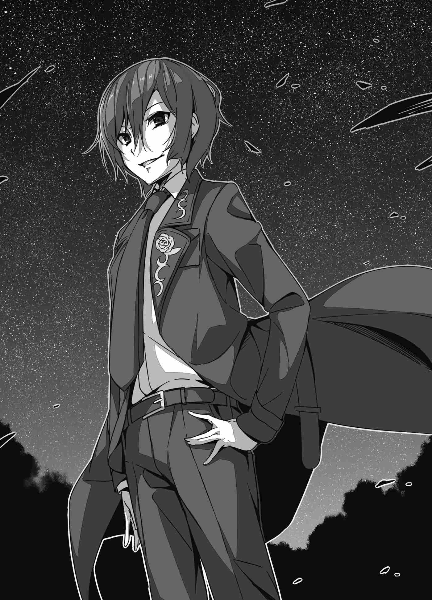

# Mở Đầu: Ma Đạo Sĩ Suimei Yakagi

Felmenia Stingray là một trong những ma đạo sư cung đình kiêu hãnh nhất của Vương quốc Astel. Sinh ra là con gái thứ hai của Bá tước Stingray, cô là tiểu thư dòng dõi quý tộc cao quý, lớn lên trong nhung lụa mà chưa từng biết đến thiếu thốn hay gian khổ. Sau khi bộc lộ lượng ma lực vượt trội từ khi còn là một đứa trẻ, cô theo học ma pháp dưới sự chỉ dạy của một vị đại sư thường được người đời kính trọng gọi là Hiền giả. Ngay từ khi còn là một cô bé, Felmenia đã được coi là một thiên tài với khả năng nhìn thấu vực thẳm ma đạo.

Mười năm trôi qua trong quá trình cô miệt mài học tập ma pháp cùng vị Hiền giả. Dưới sự dẫn dắt của ông, Felmenia đã chạm tới những tầng sâu thẳm của ma pháp—những tri thức mà người thường được bảo phải mất ít nhất ba mươi năm mới có thể thấu hiểu.

"Từ đây về sau, ta không còn điều gì để truyền dạy cho con nữa. Bằng trí tuệ của chính mình, hãy tự mình khai phá con đường ma đạo riêng," ông từng nói với cô như vậy vào thời điểm đó.

Và kể từ mốc thời gian ấy, cuộc sống của Felmenia trở nên bận rộn hơn rất nhiều so với những tháng ngày tu luyện trong hang động của Hiền giả. Nhờ những thành quả từ các nghiên cứu ma pháp của mình, cô được bổ nhiệm làm thành viên trẻ tuổi nhất trong hàng ngũ ma đạo sư cung đình. Khối lượng công việc chính thức được giao cho cô tuy nhiều nhưng chẳng thấm tháp gì so với vô số lời mời tham dự các buổi dạ yến, những sự vụ xã giao lạ lẫm, cùng những buổi tiệc trà với các mệnh phụ quý tộc mà cô liên tục nhận được. Kể từ khi rời khỏi hang động của Hiền giả—nơi toàn bộ thời gian của cô chỉ dành riêng cho việc nghiên cứu ma thuật—cuộc đời cô là một chuỗi những trải nghiệm học hỏi mới mẻ nối tiếp nhau.

Cuộc sống bận rộn ấy khiến cô có rất ít thời gian để ngủ và mang lại những vất vả cô chưa từng biết tới, nhưng nó lại lấp đầy tâm trí cô đến mức cô chẳng hề bận tâm. Cô cảm nhận được một niềm tự hào và thành tựu to lớn. Cô cảm thấy mình đang thực sự sống. Cô không còn là một cô tiểu thư quý tộc nhỏ bé bị giam cầm trong lồng kính như một chú chim; cô cảm thấy mình đang tạo ra sự thay đổi với tư cách là một bánh răng quan trọng của đất nước. Và thế là cô tiếp tục lối sống bận rộn nhưng vô cùng mãn nguyện ấy. 

Nhiều năm sau khi chia tay vị Hiền giả, Felmenia đã tạo ra một phát kiến vĩ đại. Trong lúc thực hiện một nhiệm vụ của ma đạo sư cung đình—khi cô được giao trọng trách chinh phạt một mối đe dọa quái vật và ma quỷ quy mô lớn—cô đã chạm đến chân lý của ngọn lửa mà nhân loại chưa từng biết tới.

Phải, ở độ tuổi mười lăm còn rất trẻ, Felmenia đã vươn tới chân lý. Ngọn lửa nguyên bản mà mọi ngọn lửa trên đời đều khao khát đạt tới. Cô đã khám phá ra thứ có thể thiêu rụi vạn vật thành tro bụi—Bạch Hoả (White Flame). Sau một khoảnh khắc run rẩy vì sung sướng, Felmenia đã báo cáo phát kiến này lên người thầy của mình và Bệ hạ Quốc vương. Cô thậm chí còn nhận được những lời tán dương nhiệt liệt từ cả hai người cho thành tựu vĩ đại ấy.

Nhưng thứ cô khám phá ra không chỉ có Bạch Hoả. Đó cũng là khoảnh khắc cô tìm thấy giá trị của chính bản thân mình. Đây mới là điều cô thực sự khao khát. Đó là sự công nhận và giá trị tự thân mà cô đã luôn đuổi theo bấy lâu nay. Nó thúc đẩy cô tiến về phía trước, và cô hạ quyết tâm sẽ tiếp tục dấn thân sâu hơn nữa trên con đường ma đạo.

Kể từ mốc thời gian đó, Felmenia tiếp tục công việc ma pháp của mình, gặt hái vô số thành tựu to lớn cho vương quốc. Từ việc đánh bại lũ ma quỷ ở phương Bắc, tiêu diệt con quái vật khổng lồ được thờ phụng trong sa mạc, đến việc cải cách học thuật ma pháp trong nước, rồi được bổ nhiệm vào Giáo hội Ma đạo sĩ (Mage's Guild)—nơi làm nền tảng cho những thay đổi học thuật sâu rộng hơn nữa... Hầu như mọi việc cô làm đều nhận được sự ngưỡng mộ từ tất cả mọi người. Sự biết ơn của người dân, sự ghen tị của đồng nghiệp, cùng những lời kỳ vọng đè nặng từ cha mẹ đều là những vinh dự lớn lao nhất mà cô có thể hình dung.

Đó là cách mà Felmenia đã sống cho đến tận bây giờ. Cuộc đời phi thường lừng lẫy của cô cuối cùng đã mang lại cho cô sự công nhận là pháp sư hàng đầu vương quốc, điều càng trở nên kinh ngạc hơn bởi độ tuổi còn quá trẻ của cô.

Thế nhưng, ngay cả Felmenia—người luôn tự hào là pháp sư mạnh nhất vương quốc—lại chẳng thể nhúc nhích dù chỉ một ngón tay trước mặt chàng thanh niên đang đứng trước mặt cô lúc này.

Ánh trăng tròn vạch lối từ bầu trời đêm thăm thẳm được điểm xuyết bởi những vì sao lấp lánh xuống khu sân vườn yêu thích của nhà vua bên trong Hoàng thành Camellia. Nó chiếu sáng chàng thanh niên bận y phục đen tuyền, người đang tiếp tục buông lời giễu cợt răn đe cô.

"Trời ạ... Đi bám đuôi người khác thế này quả thực là thiếu thẩm mỹ đấy. Đó là hành vi chỉ hợp với đám cừu lạc tội nghiệp và ngu ngốc không hề biết đến chân lý cùng quy luật của thế giới mà thôi, cô biết chứ?"

Chàng thanh niên phát biểu bằng những thuật ngữ xa lạ với cô này chính là một trong những người bạn thân của Reiji—Dũng sĩ được triệu hồi. Nhưng không giống như cô gái trẻ cùng xuất hiện với họ và đã đồng ý tham gia vào chiến dịch chinh phạt Ma Vương cùng Dũng sĩ, chàng thanh niên hoàn toàn giản dị này lại thẳng thừng từ chối lời yêu cầu của nhà vua một cách vô lễ và đòi được trở về thế giới của chính mình.

Với một khuôn mặt tỉnh rụi, cậu ta tuyên bố mình chỉ là một người bình thường. Cậu ta nói mình chẳng có năng lực đặc biệt nào đáng nhắc tới, và vì lý do đó, cậu ta từ chối chiến đấu chống lại quái vật, ma quỷ hay cái ác. Và cậu ta đặc biệt khinh bỉ ý tưởng bị phái đi săn đuổi Ma Vương. Khăng khăng rằng mình sẽ không chiến đấu, cậu ta đòi được đưa trở về nhà bằng đủ loại ngôn từ gay gắt. Đó là chuyện của vài ngày trước, sau đó cậu ta tiến hành tự nhốt mình trong gian phòng được ban cho.

Vượt qua sự hoang mang và sợ hãi dọa đè bẹp bản thân sau khi đột ngột bị triệu hồi đến thế giới này, cô bạn cùng lớp của họ đã dõng dạc tuyên bố sẽ đồng hành cùng Dũng sĩ trong hành trình của anh. Nhưng chàng thanh niên này thì không. Cậu ta tiếp tục khăng khăng đòi được để yên và đưa về nhà. Thật là một trò hề. Cậu ta là một kẻ hèn nhát. Và là một kẻ ích kỷ. Làm sao cậu ta có thể tự coi mình là một người đàn ông cơ chứ? Không chỉ các đại thần và tướng lĩnh quyền cao chức trọng, mà toàn bộ gia nhân trong lâu đài cho đến những người hầu gái và binh lính cấp thấp nhất đều chế giễu cậu ta một cách không thương tiếc sau lưng.

Thế nhưng... sự thật của vấn đề là gì?

Felmenia đã đặt cược niềm tự hào của mình vào Bạch Hoả—đỉnh cao của ma pháp nguyên tố Lửa. Nhưng nó lại thảm hại không đủ để giành chiến thắng trước chàng thanh niên này, người đã xua tan nó chỉ bằng một cú búng tay đơn giản. Và giờ đây cậu ta đang đứng sừng sững áp đảo cô, tỏa ra luồng ma lực tĩnh lặng nhưng áp đảo đến mức tưởng như có thể biến cô thành băng giá.

"Vậy thì, thưa cô tiểu thư pháp sư. Đã đến lượt tôi chưa nhỉ?"

Chính trong khoảnh khắc đó, Felmenia Stingray đã học được giá trị bản thân thực sự của cô rốt cuộc đáng giá bao nhiêu.

Chàng thanh niên này vô cùng mạnh mẽ và tinh khôn. Vẻ ngoài bình thường của cậu ta chỉ là một lời dối trá. Một sự ngụy trang. Cậu ta ma mãnh đến mức những kẻ nhìn xuống cậu ta với sự thương hại và khinh bỉ mới chính là những kẻ ngu ngốc thực sự. Cậu ta không phải là kẻ có thể xem thường.

Không, chàng thanh niên này là một con quái vật trú ngụ sâu hơn rất nhiều trong vực thẳm ma đạo so với vị Hiền giả đã từng dạy dỗ cô. Cậu ta sở hữu vô số bí thuật bên trong mà cô ở thời điểm hiện tại hoàn toàn không phải là đối thủ. Cậu ta sở hữu kỹ nghệ và tri thức phi lý đến mức tưởng như cậu ta có thể hạ gục ngay cả vị Dũng sĩ đã nhận được sự bảo hộ của thần linh trong nghi lễ triệu hồi, tất cả chỉ bằng một nụ cười khinh khỉnh và dễ dàng.

Không thể nghi ngờ gì nữa. Cậu ta chính là một ma đạo sĩ đứng trên đỉnh cao nhất của nghệ thuật ma thuật.

"...Anh là ai?"

Felmenia hỏi cậu ta câu đó bằng một giọng nói run rẩy. Chàng thanh niên mân mê vật gì đó trên mu bàn tay với vẻ mặt chán nản và trả lời cô một cách phẳng lặng.

"Ma đạo sĩ Suimei Yakagi."

Đó là lần đầu tiên cậu ta giới thiệu bản thân một cách đàng hoàng.

---

[Chương tiếp theo: Chương 1: Ta Đâu Phải Thứ Muốn Triệu Hồi Là Triệu Hồi! - Phần 1 ▶](01_chapter_1_part1.md)
