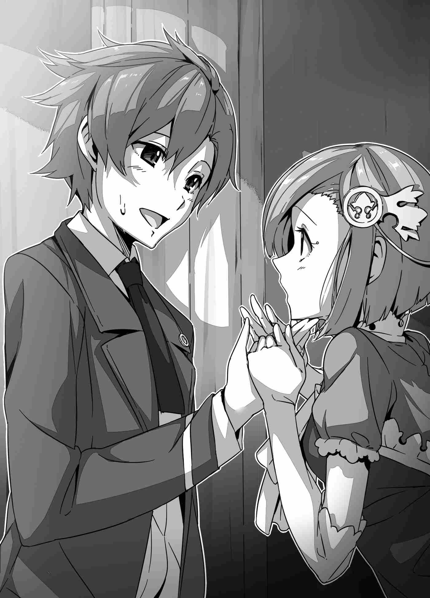

"Cái gì...?"

Reiji ngẩn người ra khi nghe Mizuki giải thích, gương mặt thoáng chút bối rối. Thấy phản ứng của cậu, Mizuki cuống quýt giải thích thêm:

"Nhưng... nhưng tớ không bao giờ làm chuyện đó đâu, Reiji-kun! Tớ làm sao ghét cậu được! Tớ th-th-th-thích..."

Cô nàng ngượng đỏ chín mặt, không dám nhìn thẳng vào cậu bạn. Giọng cô nhỏ dần rồi tắt ngấm. Reiji ngượng ngùng quay sang nhìn Suimei.

"V-Vậy... là cậu sao, Suimei?"

"Hơ, nói thật thì, tớ vốn luôn nghĩ cậu là một tên khoác lác thích thể hiện, biến phắt đi cho rảnh nợ."

"—!"

Ánh mắt Suimei thoáng hiện lên vẻ u ám trêu chọc khi nói câu đó, khiến Reiji á khẩu không biết trả lời sao.

"Tớ đùa thôi..."

"S-Suimei..."

"Tớ đùa thật đấy. Ghét cậu thì tớ thèm chơi chung suốt sáu năm qua chắc? Nghĩ thử mà xem."

"Đ-Đúng thế thật. May quá..."

Biết cả Suimei lẫn Mizuki đều đứng về phía mình, Reiji mới thở phào nhẹ nhõm. Giữa lúc ba người họ đang trò chuyện, cô gái xanh cất tiếng gọi bằng giọng điệu trang nhã của một hoàng nữ.

"Xin lỗi các vị. Tôi rất tiếc vì phải ngắt lời, nhưng liệu các vị có phiền trò chuyện với chúng tôi một lát không?"

"Ồ, dĩ nhiên rồi."

Reiji lịch sự gật đầu. Thiếu nữ tóc xanh cúi chào một cách trang nhã rồi tự giới thiệu bản thân.

"Tôi rất xin lỗi vì đã triệu hồi các vị đến đây một cách đột ngột. Tôi là Nhị công chúa của Vương quốc Astel, Titania Root Astel. Còn đây là người đã thực hiện nghi lễ triệu hồi..."

Công chúa Titania khẽ nghiêng người giới thiệu cô gái đứng bên cạnh. Thiếu nữ khoác áo choàng lập tức bước lên một bước.

"Tôi là ma đạo sư cung đình Felmenia Stingray. Rất hân hạnh được gặp các vị."

Đây chính là thiếu nữ mà công chúa đã gọi là "Bạch Hỏa" trong cuộc trò chuyện trước đó của họ. Cô sở hữu mái tóc bạc tuyệt đẹp dài đến thắt lưng, với hai lọn tóc tết gọn gàng rủ xuống bên tai. Đôi mắt hơi xếch toát lên vẻ tự tin và kiêu hãnh. Dù mang lại cảm giác nghiêm nghị và sắc sảo, cô vẫn có những nét duyên dáng, dễ mến. Đúng danh xưng ma đạo sư cung đình, luồng ma lực xung quanh cô dao động vô cùng ổn định và mạnh mẽ. Công chúa Titania cũng có ma lực, nhưng thiếu nữ tóc bạc này rõ ràng kiểm soát nó điêu luyện hơn nhiều.

*Hóa ra cô ta chính là kẻ đã kéo mình tới đây sao...*

Trước mặt cậu giờ đây chính là kẻ chịu trách nhiệm cho tình cảnh hiện tại của họ. Cảm thấy chẳng có gì dễ chịu khi làm quen với cô ta, Suimei cằn nhằn trong lòng. Sau khi các cô gái hoàn thành phần giới thiệu, Reiji bước lên phía trước và lịch sự đáp lại.

"Cảm ơn vì lời chào hỏi lịch sự như vậy. Tên tôi là Shodai Reiji. Nếu ở đây gọi tên trước họ sau, xin cứ tự nhiên gọi tôi là Reiji Shodai. Hai người đi cùng tôi là bạn thân của tôi. Bên phải tôi là Anoh Mizuki, và bên trái là Yakagi Suimei."

Cậu học được cách ăn nói trang trọng như thế từ bao giờ vậy? Công chúa Titania và ma đạo sư cung đình Felmenia đáp lại với sự ngưỡng mộ dành cho Reiji. Tuy mang phong thái hoàng tộc kiêu sa, họ vẫn tỏ ra hài lòng trước thái độ lịch sự của Reiji. Khi có cơ hội, Mizuki bước lên tiếp theo.

"Cho phép tôi tự giới thiệu. Tên tôi là Anoh Mizuki..."

Khi cô xong, Suimei cũng bước tiến một bước.

"Tôi là... Yakagi Suimei."

Suimei giới thiệu ngắn gọn. Cậu hiểu rằng trong tình cảnh xa lạ này, tốt nhất là nên hạn chế phát ngôn bừa bãi. Công chúa Titania nhìn lướt qua ba người họ rồi khẽ nhắm mắt suy nghĩ. Và rồi...

"Reiji-sama, Mizuki-sama, và Suimei-sama, đúng không? Lý do mà chúng tôi triệu hồi các vị trong hoàn cảnh như thế này... Quý vị thấy đấy, có một điều mà chúng tôi phải nhờ cậy một trong ba người."

"Chuyện gì vậy?"

"Chúng tôi cần ngài tiêu diệt Ma Vương Nakshatra, kẻ đứng đầu đám ác ma hiện đang đe dọa hòa bình của thế giới này."

Khoảnh khắc Công chúa Titania nói ra những lời đó, cả ba người bạn đều trao nhau những ánh nhìn thấu hiểu. Suimei sau đó là người duy nhất đưa tay lên trán và ngước nhìn lên trần nhà như thể muốn thoát khỏi nơi này ngay lập tức.

***

Được triệu hồi sang thế giới khác, được đón tiếp bởi một công chúa và một ma đạo sư cung đình, sau đó được nhờ cứu thế giới. Đúng là một kịch bản rập khuôn. Dù cố giữ vẻ bình tĩnh, cả ba người họ đều cảm thấy như bị dội một gáo nước lạnh.

"Trời ạ..."

"Chà..."

"Ôi chúa ơi..."

Rốt cuộc, cả ba không thể kìm được tiếng thở dài ngao ngán trước thực tế phũ phàng. Nhìn bộ dạng uể oải của họ sau cú sốc vừa rồi, Titania bối rối hỏi:

"Và vì vậy, tôi xin lỗi vì sự đột ngột của tất cả những chuyện này, nhưng ai trong số các vị là vị Dũng sĩ kính mến?"

"Ừm..."

"Chuyện đó..."

Nghe vậy, Reiji và Mizuki bối rối nhìn nhau. Họ vốn là những học sinh bình thường, làm sao biết được ai là Dũng sĩ? Nếu tự dưng bị hỏi câu đó, câu trả lời chắc chắn là "không biết". Cứ im lặng mãi thì câu chuyện cũng chẳng đi đến đâu, thế nên Suimei đành lên tiếng để phá vỡ bầu không khí bế tắc:

"Tôi có thể hỏi một điều được không?"

"Vâng, xin cứ tự nhiên hỏi bất cứ điều gì ngài thấy phù hợp."

"Có dấu hiệu nào cho thấy ai là mục tiêu triệu hồi không? Như một dấu hiệu chứng minh rằng một trong chúng tôi là Dũng sĩ?"

"Bằng chứng là Dũng sĩ sao? Một dấu hiệu, ngài nói vậy ư?"

Suimei gật đầu, và Titania nhìn sang Felmenia. Felmenia đón nhận ánh mắt của cô và gật đầu, sau đó quay về phía Suimei để cho cậu câu trả lời.

"Vâng, có một thứ như vậy. Vị dũng sĩ được triệu hồi bởi nghi lễ được ban cho sự bảo hộ thần thánh bởi các Nguyên tố (Elements) khi vượt qua các thế giới, và sẽ chứa đựng sức mạnh to lớn trong cơ thể mình. Nói cách khác, một người trong số các vị sẽ cảm nhận được sức mạnh chảy trôi bên trong mình không giống với bất kỳ điều gì từng trải nghiệm... Có ai trong số các vị phù hợp với mô tả đó không?"

"Nếu là như vậy, tôi nghĩ đó là tôi. Kể từ khi đến đây, tôi cảm thấy mình trở nên mạnh mẽ hơn nhiều—mạnh hơn những gì tôi có thể hình dung."

Những người lính trong phòng bắt đầu thì thầm với nhau và thốt ra một tiếng "Ồồồ" đồng loạt trước câu trả lời của Reiji. Đúng là Reiji dường như là người duy nhất nhận được sức mạnh khi họ được dịch chuyển, nhưng dù vậy...

*Cô ta nói "bởi các Nguyên tố", đúng không nhỉ?*

Suimei xem xét kỹ lưỡng những lời của cô gái trong lòng. Nguyên tố (Elements), thuộc tính, căn bản... Những từ như vậy ở thế giới của Suimei dùng để mô tả các nguyên tố hóa học, hoặc huyền học hơn là bốn hoặc năm nguyên tố ma thuật cổ xưa. Đất, nước, lửa và gió tạo thành bốn nguyên tố truyền thống, và thêm cả hư không tạo thành năm nguyên tố mang tính khái niệm. Những từ này và những thứ chúng đại diện đóng một vai trò cực kỳ quan trọng trong ma thuật.

Tuy nhiên, cách Felmenia diễn đạt khiến nó nghe như thể cô đang đề cập đến một sinh vật sống. Mặc dù ma thuật có thể hoạt động sóng đôi với niềm tin tôn giáo tâm linh, và mặc dù cốt lõi của việc thực hành nó là kêu gọi các linh hồn để lấy sức mạnh, thì sắc thái này có chút kỳ lạ.

Nhưng giờ họ đang ở một thế giới khác. Không có gì đảm bảo rằng mọi thứ hoạt động chính xác như những gì Suimei kỳ vọng. Nếu chúng giống hệt nhau, sẽ không cần phải phân chia giữa các thế giới ngay từ đầu. Phải có lý do nào đó khiến hai thế giới này bị chia cắt—điều gì đó khiến thế giới này khác biệt. Có lẽ sự khác biệt chính là Nguyên tố...

"Vậy ngài chính là vị Dũng sĩ kính mến sao?"

"Thì... Vâng, tôi nghĩ vậy."

Trong khi Suimei đang ngẫm nghĩ về các Nguyên tố, đôi mắt ngập tràn cảm xúc của Titania dừng lại trên Reiji. Có vẻ như cô có những cảm xúc đặc biệt dành cho "Dũng sĩ" này. Dĩ nhiên, việc cậu ngẫu nhiên lại rất đẹp trai cũng không hại gì. Thấy cô nhìn mình như vậy, Reiji có chút bối rối. Càng bối rối hơn khi Titania đột nhiên nắm lấy tay cậu.

"Dũng sĩ-sama, dù thật là đường đột quá đỗi, nhưng xin ngài... Tôi xin giao phó mọi chuyện vào tay ngài!"

"H-Hả?!"

"Đ-Điện hạ?!"

Có vẻ như cô gái mặc áo choàng màu trắng, Felmenia, cũng bộc phát sự kinh ngạc trước hành động đột ngột này hệt như Reiji. Cô gọi Titania trong sự bối rối, và chỉ đến lúc đó công chúa mới dường như nhận ra những gì mình vừa nói. Công chúa sau đó buông tay cậu ra và đỏ mặt một chút.

"Trời ạ... Tôi xin lỗi ngài sâu sắc, Dũng sĩ-sama. Tôi lại hành động thất lễ trước mặt các vị khách quý như thế này... Chà, giờ thì, tôi tin rằng Đức vương sẽ giải thích mọi chuyện trong phòng diện kiến, vì vậy xin hãy cho chúng tôi câu trả lời của ngài khi đó."

"H-Hiểu rồi."

Vẫn bị cuốn vào vòng xoáy bối rối, Reiji cố gắng giữ bình tĩnh để đưa ra câu trả lời lịch sự. Felmenia sau đó tiến một bước về phía cậu.

"D-Dũng sĩ-sama, cho phép tôi tự giới thiệu một lần nữa. Tên tôi là Felmenia Stingray."

"Ah, vâng. Rất hân hạnh được làm quen với cô."

"Tôi tin rằng chúng ta sẽ gặp nhau rất nhiều từ nay về sau. Rất hân hạnh được làm việc với ngài. Tôi cũng xin giao phó mọi chuyện cho ngài."

"Cái gì? Ồ, vâng, dĩ nhiên rồi..."

Felmenia vừa cúi chào vừa lặp lại lời gửi gắm của công chúa. Reiji tuy chưa hiểu rõ sự tình nhưng vẫn lịch thiệp đáp lễ. Titania, tuy nhiên, khẽ hắng giọng để cắt ngang:

"Khụ khụ, Bạch Hỏa-dono..."

"S-Xin lỗi ngài. Thần lại đi trước một bước rồi."

"Bây giờ thì, xin hãy đi đường này, tất cả các vị. Tôi sẽ cá nhân dẫn các vị đến gặp Đức vương."

Theo mệnh lệnh của Titania, những người lính một lần nữa xếp thành hàng và mở ra một con đường cho Suimei và những người khác.

---

Sau khi đi theo những người lính dọc theo một hành lang đá u tối, họ bước ra một sảnh lớn lát đá hoa cương lộng lẫm, rực rỡ ánh nến. Trái ngược hoàn toàn với căn phòng triệu hồi ẩm thấp lúc nãy, hành lang này được trang trí vô cùng tinh xảo và sạch sẽ, điểm xuyết những bức họa nghệ thuật và những bộ giáp hiệp sĩ trưng bày dọc lối đi, toát lên phong thái hoàng gia sang trọng.

Đi cùng họ hiện tại là hai thiếu nữ—công chúa Titania và ma đạo sư cung đình Felmenia. Titania tỏ ra đặc biệt hứng thú với Reiji, cô đi bên cạnh và không ngừng trò chuyện cùng cậu. Bắt đầu từ việc hỏi thăm về thế giới cũ, cô chuyển sang hỏi han tuổi tác, sở thích của Reiji. Sự cởi mở và nhiệt tình của nàng công chúa khiến cô trông không khác gì một thiếu nữ đang cố tiếp cận người trong mộng. Suimei nhìn mà có chút chạnh lòng.

Mizuki đi bên cạnh cũng có tâm trạng tương tự, dù lý do có chút khác biệt. Tuy không phải bạn gái của Reiji, nhưng cô luôn là người bạn khác giới thân thiết nhất của cậu, và trong thâm tâm cô cũng hằng mong giữ vị trí đó. Giờ đây, một cô gái xinh đẹp, lại mang thân phận công chúa cao quý đột ngột xuất hiện và chiếm trọn sự chú ý của Reiji. Dù cố kìm nén không lộ ra ngoài, nhưng Mizuki rõ ràng đang có chút hụt hẫng.

Nhưng rồi có cô gái thứ hai, ma đạo sư cung đình Felmenia.

"Cô cần gì sao?"

"Không, không có gì đặc biệt."

Nãy giờ, Felmenia cứ liên tục liếc nhìn Suimei, đặc biệt là tập trung vào vùng tay của cậu. Suimei liền quay sang hỏi với giọng điệu hơi sắc mỏng, nhưng Felmenia chỉ lạnh lùng quay đi như không có chuyện gì. Suimei thầm thở dài chán ngán.

*Chết tiệt, lúc nãy mình sơ hở khi duy trì ma thuật phòng thủ ở trạng thái chờ sao? Nhìn thái độ của cô ta, có lẽ cô ta đã phát hiện ra mình biết dùng phép thuật rồi...*

Hết sai sót này đến sai sót khác, Suimei tự trách mình vô cùng. Cậu chỉ muốn tìm cái lỗ nẻ nào chui xuống cho đỡ xấu hổ, nhưng thực tế trước mắt không cho phép.

Ở thế giới cũ của Suimei, sự tồn tại của ma đạo sĩ là một bí mật tuyệt đối. Trong thời đại khoa học lên ngôi, ma thuật bị coi là dị giáo và bị gạt ra ngoài lề xã hội.

Thế nhưng ở thế giới này, vị thế của những người sử dụng ma thuật ra sao? Cô gái tự xưng là ma đạo sư cung đình này tuy đi bên cạnh công chúa—người có địa vị cao hơn hẳn—nhưng vẫn toát lên phong thái rất đáng gờm.

Dùng phép thuật công khai tuy là cách nhanh nhất để thăm dò thông tin, nhưng lại là một nước đi tồi tệ. Cậu không muốn Reiji và Mizuki phát hiện ra thân phận ma đạo sĩ của mình. Để giữ bí mật này, ưu tiên hàng đầu của cậu lúc này là làm sao để Felmenia im lặng. Cậu cần phải lên kế hoạch đối phó.

"Chúng ta đến nơi rồi. Đây là phòng diện kiến. Đức vương đang chờ đợi, vì vậy hãy đi thôi."

Titania dừng chân trước một cánh cửa khổng lồ. Nó to lớn tới mức như dành cho người khổng lồ, được chạm khắc vô cùng xa hoa và lộng lẫy. Một người lính hộ tống ra hiệu cho lính canh cửa. Người lính canh nhẩm đọc chú văn, cánh cửa khổng lồ lập tức từ từ mở ra.

"Ôi chao!"

"Hả?!"

Reiji và Mizuki ngạc nhiên đến mức há hốc mồm. Nhìn một cánh cửa nặng nề tự mở ra mà không cần ai chạm tay vào, lại chẳng phải là cửa tự động hiện đại, Reiji tò mò hỏi Titania:

"L-Làm sao nó mở được vậy?"

"...Bằng ma thuật? Liệu nó có hợp ý ngài không?"

"À, tôi hiểu rồi, ở đây có ma thuật sao?"

"'Ở đây'?"

"Ma thuật không tồn tại ở thế giới của chúng tôi, cô thấy đấy."

"Có thật thế không?!"

"Vâng."

"Điều đó có nghĩa đây là lần đầu tiên ngài nhìn thấy nó, có phải vậy không?"

Có vẻ như rất hài lòng vì Reiji tỏ ra ấn tượng, Titania cười tươi đến tận mang tai. Felmenia, tuy nhiên, dường như có chút cuống quýt. Cô nhanh chóng bắt đầu khẳng định bản thân với Reiji.

"T-Tôi có thể thực hiện một kỳ tích như vậy một cách dễ dàng."

"Thật sao?"

"Dù tôi trông như thế này, tôi vẫn là một trong những ma đạo sư cung đình kiêu hãnh của Astel, sau tất cả."

"Chà, Felmenia-san cũng thật tuyệt vời nhỉ?"

"Ờ-Thì... Hí hí..."

Không rõ Reiji khen thật lòng hay chỉ vì lịch sự, nhưng Felmenia đột nhiên đỏ mặt ngượng ngùng. Hóa ra cô nàng lại khá dễ lung lay trước những lời tán dương. Nhưng cũng phải thôi, được chính vị Dũng sĩ cứu thế khen ngợi thì ai mà chẳng phổng mũi. Sự đối lập giữa vẻ ngoài nghiêm nghị thường ngày và nụ cười ngượng ngùng lúc này của cô trông khá thú vị. Trong khi đó, Mizuki vẫn dán chặt mắt vào cánh cửa khổng lồ với vẻ đầy phấn khích.

"Tuyệt vời... Vậy là ma thuật thực sự tồn tại..."

Có vẻ như cô khá hứng thú với bức tranh toàn cảnh. Nhưng là một cô gái yêu thích tiểu thuyết kỳ ảo, điều đó hoàn toàn được kỳ vọng. Điều này đúng là phong cách của cô.

Suimei cũng quan sát ma thuật vừa rồi, nhưng dưới con mắt chuyên môn của một ma đạo sĩ. Dù không nghe rõ chú văn người lính canh sử dụng, cậu vẫn dễ dàng nắm bắt được cấu trúc thuật thức, cách vận hành ma lực và quá trình kích hoạt của phép thuật đó.

*Hệ Phong, đúng không?*

Đó thực ra là một thuật thức thuộc tính Phong đơn giản dài ba câu chú để dùng lực đẩy cánh cửa ra. Người lính canh kiểm soát ma lực khá mượt mà, chứng tỏ anh ta cũng là một người có tay nghề, thế nhưng...

*Nhưng sao lại dùng thuộc tính Phong nhỉ? Chỉ để mở một cánh cửa mà phải mượn một nguyên tố trung gian rồi tốn công thi triển chú văn như vậy không phải là quá rườm rà sao? Dù nhìn thế nào thì việc dùng một câu chú dài ba câu chỉ để làm việc này đúng là lãng phí.*

Thay vì kinh ngạc trước sự hiện diện của ma thuật, Suimei lại cảm thấy cạn lời trước sự kém hiệu quả trong cách sử dụng nó. Dù người gác cổng có kỹ năng tốt, nhưng Suimei chỉ thấy việc đó thật lãng phí ma lực. Nếu tối ưu hóa luồng ma lực, chỉ cần một phép tác động lực trực tiếp là đủ giải quyết.

Cậu không thể hiểu nổi tại sao người ta lại phải đi một đường vòng bằng thuộc tính Phong như vậy. Việc đó vừa làm kéo dài thời gian tụng chú, vừa tiêu tốn lượng ma lực không cần thiết.

Một phép thuật tốn thời gian và lãng phí năng lượng như vậy hoàn toàn không có chút thực tiễn nào. Nói thẳng ra, việc vặt vãnh này chẳng cần đến một câu chú. Nếu là Suimei hay bất kỳ ma đạo sĩ Trái Đất nào khác, họ chỉ cần một cái búng tay nhẹ là xong. Thật không thể hiểu nổi tại sao người ở đây lại lãng phí ma lực đến thế.

*Có lẽ người gác cổng chỉ thích làm màu thôi chăng?*

Cậu bỏ qua điều đó. Có lẽ người gác cổng hoàng gia đơn giản là thích khoe khoang. Nếu đúng như vậy, sẽ dễ hiểu hơn một chút. Cậu không có lý do thực sự nào để bắt bẻ phong cách của người đàn ông, nhưng bất cứ khi nào Suimei thấy ma thuật hoạt động, cậu có thói quen phân tích tính thực tế và hiệu quả của nó. Nhưng trong khi cậu đang suy nghĩ về điều đó, Titania đột nhiên bắt đầu nói chuyện với cậu.

"Suimei-sama, ngài không ngạc nhiên bởi ma thuật sao?"

Thôi chết.

"Ồ, tôi sao? Tôi chỉ là quá sốc không nói nên lời thôi... Hahaha."

"Ôi, vậy sao? Lát nữa khi ngài được tận mắt chứng kiến các ma đạo sư cung đình tập luyện, khéo ngài sẽ đứng không vững vì kinh ngạc mất."

"Nó tuyệt vời đến thế sao? Chà, tôi không thể chờ đợi để xem nó..."

"Hí hí..."

Titania cười khúc khắc một cách vui vẻ nhưng đúng mực một tiểu thư. Đây thực sự là tất cả sự ngạc nhiên đối với Suimei, nhưng không phải theo cách cô giả định. Khi cô và Suimei tiếp tục trò chuyện, Felmenia gọi cô.

"Điện hạ, đến lúc rồi."

"Vâng. Bây giờ thì, Dũng sĩ-sama, Mizuki-sama, Suimei-sama. Xin hãy đi theo tôi."

Nói rồi, nhóm đi theo Titania khi cô đi qua cánh cửa mở. Ở phía bên kia là một căn phòng khổng lồ. Căn phòng hình chữ nhật lớn có những cột đá dày đâm xuyên qua nó. Rõ ràng là đã tốn nhiều công sức để tạo ra hơn lối đi họ đã dùng để đến đó. Đây, có vẻ như, là phòng diện kiến.

"Chà..."

"Tuyệt vời..."

"Ồôô..."

Ba người bạn không thể không thốt lên những tiếng ồ à ngưỡng mộ. Phòng diện kiến ấn tượng đến mức đó. Ngay cả Suimei, người đã không mấy ấn tượng bởi ma thuật trước đó, cũng hoàn toàn bị mê hoặc bởi điều này.

Nổi bật ở vị trí trung tâm phía cuối sảnh điện là ngai vàng hoàng gia. Ngồi trên đó là một người đàn ông trung niên với gương mặt nghiêm nghị, toát ra uy thế của một bậc quân vương. Đó chính là nhà vua Almadious Root Astel. Ông sở hữu mái tóc vàng cắt ngắn gọn gàng cùng bộ râu quai nón được cắt tỉa tinh tế. Đứng bên cạnh ngai vàng là một vị đại thần lớn tuổi có vẻ là cố vấn hoàng gia, cùng hai hàng quý tộc quyền quý đứng dọc hai bên.

Titania đi thẳng lên phía trước, mắt hướng về phía nhà vua mà không liếc nhìn ai khác. Cô bước lên thềm điện rồi quỳ xuống bái kiến. Felmenia cũng nhanh chóng quỳ theo. Thấy vậy, Suimei và những người khác cũng vội vàng làm theo. Khi tất cả đã yên vị, Titania cất tiếng kính cẩn bái kiến quốc vương:

"Thần, Titania Root Astel, đã mang vị dũng sĩ được triệu hồi từ thế giới khác bởi đại ma thuật triệu hồi Dũng sĩ đến đây."

"Xuất sắc. Con đã giúp ích rất nhiều, Titania. Tuy nhiên, tại sao lại có ba dũng sĩ có mặt ở đây?"

Đức vương rõ ràng có vẻ bối rối, nhưng chính Felmenia đã trả lời câu hỏi của ông.

"Bệ hạ thấy đấy, hai người khác đi cùng dũng sĩ là bạn của ngài ấy. Có vẻ như họ cũng bị cuốn vào đại ma thuật triệu hồi và bị kéo đi cùng ngài ấy tại thời điểm triệu hồi."

"Cái gì?! Họ bị kéo đi cùng sao?!"

"Vâng, Bệ hạ. Nhiều khả năng là vậy."

Gương mặt nghiêm nghị của quốc vương thoáng hiện vẻ kinh ngạc. Phía bên dưới, tiếng xầm xì bàn tán của các quý tộc bắt đầu rộ lên. Nhà vua trầm ngâm quay sang hỏi Felmenia bằng giọng trầm ổn:

"Một chuyện như vậy thực sự có thể xảy ra sao? Đại ma thuật triệu hồi Dũng sĩ đã được thực hiện bởi nhiều quốc gia trong hàng thế kỷ, nhưng ta chưa từng một lần nghe nói về một chuyện như vậy."

"Tâu Bệ hạ, kiến thức của thần còn nông cạn, nhưng sự thật là họ đã xuất hiện ngay trước mắt chúng ta. Vì vậy..."

"Nghĩa là chúng ta buộc phải tin vào mắt mình đúng không."

"Vâng, Bệ hạ."

Sau cuộc trao đổi với Felmenia, nét mặt của đức vương trở nên nghiêm trọng.

Nói rồi, Mizuki thì thầm với những người khác.

"Ông ấy đang nói về chuyện triệu hồi này như thể nó xảy ra suốt, ngay cả ở các quốc gia khác. Điều đó có nghĩa là có những người như chúng ta ở khắp mọi nơi sao?"

"Dựa trên những gì ông ấy nói, có lẽ vậy. Nhưng quan trọng hơn, rốt cuộc có bao nhiêu Ma Vương đang mọc lên ở thế giới này...?"

---

[◀ Chương trước: Chương 1: Ta Đâu Phải Thứ Muốn Triệu Hồi Là Triệu Hồi! - Phần 1](01_chapter_1_part1.md) | [Chương tiếp theo: Chương 1: Ta Đâu Phải Thứ Muốn Triệu Hồi Là Triệu Hồi! - Phần 3 ▶](01_chapter_1_part3.md)
