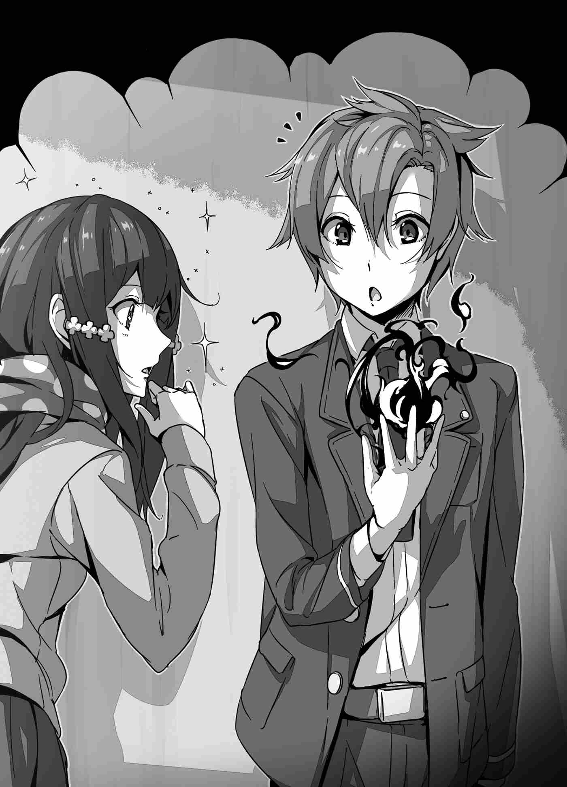

"Ta chân thành xin lỗi, nhưng ta không thể đưa cậu trở về thế giới của mình. Không phải ta không muốn làm vậy. Chỉ đơn giản là không có cách nào để thực hiện việc đó cả."

Nghe những lời đó, thái dương của Suimei bắt đầu giật liên hồi. Biết thừa là bất kính, cậu vẫn quyết định liều lĩnh hỏi lại một lần nữa.

"Tôi xin lỗi. Tôi nghe không rõ lắm. Bệ hạ có thể vui lòng nhắc lại điều đó thêm một lần nữa được không?"

"Không tồn tại phương pháp nào để đưa cậu trở về thế giới của mình. Do đó, ta không thể đưa cậu về nhà."

Thế là rõ. Đó là đòn chí mạng. Suimei không kìm được mà giậm mạnh chân xuống đất mạnh đến mức suýt làm thủng một lỗ trên sàn nhà.

"Cái... ĐỪNG CÓ GIỠN MẶT VỚI TAOOOOOOOO!"

Tiếng thét thứ hai trong ngày của Suimei vang vọng khắp phòng diện kiến.

***

Sau sự cố trong phòng diện kiến, một cuộc náo loạn chưa từng có kể từ khi thành lập Vương quốc Astel đã nổ ra. Sau khi nghe đức vua bảo rằng mình không thể trở về thế giới cũ, Suimei đã hét lên và nổi một trận lôi đình. "Chẳng phải các người đúng là một lũ ngu ngốc khi triệu hồi người khác đến mà lại không thể đưa họ trở về sao?!" và "Dù các người có ngụy biện thế nào đi nữa, hành động này đơn giản là quá ích kỷ, lũ ngu này!" là một vài lời lẽ "vàng ngọc" thốt ra từ miệng cậu trong cơn thịnh nộ. Sau khi tuôn ra đủ mọi lời lẽ xúc phạm đức vua, cậu tiến thẳng về phía ngai vàng. Khi ấy, Suimei đã hoàn toàn mất trí. Cậu không còn nghĩ được gì nhiều, cũng chẳng thèm bận tâm xem mình đang ở đâu hay hành động của mình sẽ dẫn đến hậu quả gì—cậu đã giận dữ đến mức đó. Tuy nhiên, xét đến hoàn cảnh và những lời cậu vừa phải nghe, phản ứng này có lẽ cũng là điều dễ hiểu.

Nhưng đối với những người có mặt ở đó, đây là một tình huống đáng sợ. Họ không biết người được triệu hồi có năng lực gì, và liệu Suimei có làm hại đức vua hay không. Khi cậu tiến gần ngai vàng, các quan chức và binh lính có mặt liền lao lên ngăn cản bằng vũ lực. Mọi chuyện suýt nữa đã leo thang thành một sự cố nghiêm trọng không thể cứu vãn, nhưng nhờ Reiji và Mizuki nhanh chóng cảm nhận được bầu không khí căng thẳng, họ đã giữ Suimei lại và xoay xở để tránh xảy ra thêm bất kỳ rắc rối nào.

Sau đó, trước khi cơn giận kịp nguôi ngoai, Suimei đã bị áp giải đi trong hỗn loạn, gần như bị tống vào căn phòng được giao cho mình và bị nhốt một mình ở đó. Hiện tại cậu đang ở đây—trong lòng vẫn còn ấm ức và dạ dày thì đau thắt lại.

"Khốn khiếp, nghiêm túc đấy chứ? Đùa nhau à...?"

Đã đến giới hạn chịu đựng, Suimei nghi ngờ tính chân thực của tất cả mọi chuyện không biết bao nhiêu lần. Tuy nhiên, dù cậu có véo má bao nhiêu lần đi nữa, cậu vẫn không thể tỉnh dậy trên chiếc giường quen thuộc của mình. Dù có nhìn ra ngoài cửa sổ bao nhiêu lần đi nữa, phong cảnh xa lạ vẫn chẳng hề thay đổi. Việc phải đối mặt với sự thật phũ phàng này chỉ càng làm tăng thêm sự đau khổ trong cậu. Suimei hét lên, nguyền rủa những kẻ gây ra chuyện này giờ đã không còn ở đây.

"Aaaaaaaargh! Giờ mình biết làm cái quái gì đây?! Mình không biết công thức của loại ma pháp có thể vượt qua ranh giới giữa các thế giới!"

Ma pháp triệu hồi đưa họ đến thế giới này khác với ma pháp triệu hồi thông thường. Tuy về mặt lý thuyết thì nguyên lý giống nhau, nhưng để hoạt động xuyên qua các chiều không gian, quy mô của nó lớn đến mức không thể tưởng tượng nổi. Nếu họ triệu hồi cậu đến cõi astral (tinh linh giới), đó lại là chuyện khác, nhưng việc triệu hồi một đối tượng không rõ vị trí cụ thể từ một thế giới song song là điều Suimei chưa từng nghe thấy ở thế giới cũ.

Ngay cả khi giả sử hai thế giới này được gắn kết bởi một mối liên kết nhân quả từ chuyến du hành vừa rồi, việc dùng kết nối đó làm nền tảng cho ma pháp dịch chuyển cũng cực kỳ mong manh. Nó giống như việc cho tàu chạy trên những đường ray rệu rã, lỏng lẻo và cầu mong nó đến đích bằng niềm tin thuần túy. Khả năng cao là tàu sẽ chệch khỏi đường ray và tan biến hoàn toàn giữa chừng.

"Ư..."

Suimei thở dài não nề. Nhưng vì cậu đã bị triệu hồi đến đây, dù chỉ là ngoài ý muốn, cậu biết chắc chắn phải có một lối đi nào đó tồn tại. Dù chỉ là bấu víu vào cọng rơm cứu mạng, nếu cậu có thể xoay xở để kích hoạt nó...

"Xin hãy kết nối, Mary..."

Truyền tin ma pháp—nhờ sự phổ biến của điện thoại di động, loại ma pháp cổ xưa này hiếm khi được sử dụng ngày nay. Nhưng bằng ma pháp đó, Suimei thử thiết lập kết nối với một người quen của cậu, Hydemary Alzbayne. Cô là người mà cậu làm việc chung nhiều nhất ở Hiệp hội hồi còn ở Trái Đất, và nếu liên lạc được với cô, cậu có thể củng cố lại mối liên kết này. Làm vậy thì ngay cả trong kịch bản tồi tệ nhất là không thể trở về nhà, ít nhất cậu cũng báo được cho cô biết chuyện gì đã xảy ra với mình.

"Khốn kiếp!"

Nhưng nỗ lực của cậu hoàn toàn vô ích. Khoảng cách giữa hai thế giới quá lớn, cậu không cách nào thiết lập được kết nối.

"Nếu đã đến nước này, mình đành phải tự mở lối về thôi sao?"

Thử thách cam go trước mắt đè nặng lên vai cậu hơn bất kỳ việc gì cậu từng đối mặt trước đây, khiến cậu không khỏi thở dài thườn thượt. Dù luôn có lựa chọn từ bỏ, nhưng để hoàn thành những việc cần làm, cậu bắt buộc phải tìm được đường về nhà.

"Hàhh..."

Suimei hít một hơi thật sâu, và rồi...

"TA NHẤT ĐỊNH SẼ TRỞ VỀ, CÁC NGƯỜI CỨ CHỜ ĐẤY!"

Cậu giải phóng quyết tâm của mình bằng một tiếng gầm.

***

Vài ngày sau khi nhóm Suimei được triệu hồi tới thế giới xa lạ này, Reiji và Mizuki đang đứng trước các hiệp sĩ hoàng gia và các ma đạo sư hoàng gia tại sân luyện tập ngoài trời của Hoàng thành Camellia.

"Cuối cùng cũng bắt đầu nhỉ, Reiji-kun?"

"Ừ."

Mizuki không thể giấu nổi sự phấn khích của mình. Dù sao thì, họ sắp bắt đầu buổi huấn luyện ma pháp với Titania cùng các ma đạo sư và hiệp sĩ hoàng gia. Chẳng trách Mizuki lại hào hứng đến vậy, ngay cả Reiji cũng thấy máu trong người sục sôi vì phấn khích.

"Ma pháp sao? Tớ chưa từng nghĩ sẽ có ngày mình sử dụng được nó."

Ở thế giới của họ, một thứ như vậy hoàn toàn là không thể tưởng tượng được. Đó chỉ là một giấc mơ mà bất kỳ ai cũng có thể có, nhưng không ai có thể hoàn thành. Nó chỉ đơn thuần là một sức mạnh hư cấu chỉ tồn tại trong kỳ ảo. Nhưng không còn nữa.

"Tớ đoán chúng ta thực sự đang ở một thế giới khác, nhỉ?"

Mizuki khẽ cúi đầu khi nỗi cô đơn dâng trào trong lòng, những cảm xúc dồn nén bấy lâu vô thức thốt ra thành lời. Thực tế phũ phàng này quá sức chịu đựng đối với cô, nhưng đó là điều dễ hiểu. Suimei chắc chắn không phải người duy nhất bị sốc khi nghe tin không thể trở về nhà. Dù đã quyết tâm đi theo Reiji, Mizuki cũng không khỏi đau lòng. Ngay cả Reiji cũng thấy trĩu nặng khi nghĩ đến việc có thể không bao giờ được gặp lại những người thân yêu của mình nữa.

"Mizuki..."

"À, tớ x-xin lỗi! Tớ hơi yếu lòng chút thôi."

"Không sao đâu. Tớ hiểu cảm giác của cậu mà..."

"Ừ..."

"Nhưng đừng lo lắng quá. Tớ sẽ bảo vệ cậu, nhớ chứ?"

Đó là lời thật lòng. Reiji là người đã quyết định gánh vác việc này, và cậu đã hứa sẽ bảo vệ Mizuki suốt hành trình. Nghĩ đến ý nghĩa của lời hứa đó, Mizuki bỗng đỏ mặt ngượng ngùng.

"R-Reiji-kun! Ý cậu là..."

"Ừm? Sao thế?"

"À, ý tớ hỏi là..."

"...?"

"À... Đúng rồi. Cậu vẫn luôn là Reiji-kun mà..."

Mizuki tự trách mình thầm thì trong sự thất vọng và bất lực. Reiji không hiểu tại sao cô lại phản ứng như vậy, nhưng rồi Mizuki bỗng sực nhớ ra một mối bận tâm khác và bày tỏ với Reiji.

"Không biết Suimei-kun có sao không nữa..."

Tâm trí cô hướng về người bạn cùng lớp vắng mặt, Yakagi Suimei. Kể từ sau vụ việc ở phòng diện kiến, cậu tự nhốt mình trong phòng và không chịu ra ngoài. Có lẽ việc không thể trở về nhà là một cú sốc quá lớn đối với cậu. Ngay cả khi Reiji và Mizuki lo lắng đến hỏi han qua cánh cửa, Suimei cũng chỉ đáp lại bằng giọng điệu uể oải. Họ không rõ tình trạng của cậu ra sao. Nhưng để xoa dịu nỗi lo của Mizuki, Reiji mỉm cười trấn an.

"Tớ nghĩ cậu không cần quá lo cho cậu ấy đâu. Đó là Suimei cơ mà. Vài ngày nữa cậu ấy sẽ lại bước ra ngoài và hành xử như chưa từng có chuyện gì xảy ra cho xem, cậu biết cậu ấy rồi đấy."

"Ừ... Hy vọng là thế."

Những lời an ủi của Reiji giúp cô bớt căng thẳng phần nào, nhưng Mizuki vẫn không khỏi bồn chồn. Mọi chuyện quá phức tạp và đáng lo ngại. Nỗi lo dành cho Suimei hòa lẫn với nỗi bất an về tương lai phía trước khiến lòng cô rối bời. Nhưng suy cho cùng, đó cũng là lẽ tự nhiên. Đúng như những gì Suimei đã nói ở phòng diện kiến hôm ấy: Reiji tự ý đưa ra quyết định mà không hề bàn bạc trước với họ, liệu như vậy có thực sự ổn không?

"Mọi người đã tập hợp đông đủ rồi, chúng ta bắt đầu thôi chứ? Reiji-sama, ngài đã chuẩn bị sẵn sàng chưa?"

Trong khi Reiji đang tự hỏi liệu mình có đưa ra quyết định đúng đắn hay không, Titania đưa mắt nhìn quanh hàng ngũ các ma đạo sư hoàng gia và đề nghị bắt đầu buổi tập luyện. Lời của cô kéo Reiji ra khỏi dòng suy nghĩ.

"Vâng, tôi đã sẵn sàng."

"Xin lỗi vì bắt ngài phải đợi."

"Không sao đâu ạ."

"Ngài thật nhã nhặn, Reiji-sama."

Titania nở nụ cười rạng rỡ. Dù mới quen biết, cô luôn đối xử lịch thiệp với họ. Có lẽ đó là bản tính tự nhiên của cô. Dù mang thân phận hoàng gia, cô không hề kiêu ngạo mà vô cùng dễ mến. Trong lúc Reiji còn đang thầm ngưỡng mộ phẩm chất của cô, Titania xoay người một cách duyên dáng.

"Đầu tiên, ta xin giới thiệu các ma đạo sư hoàng gia—những người sẽ giám sát quá trình tập luyện của ngài. Trước hết là Bạch Hỏa-dono... xin lỗi, là Lady Stingray."

Titania vội sửa lời vì chưa quen xưng hô với Felmenia như vậy. Felmenia bước lên một bước từ hàng ngũ, cúi chào Reiji một cách cung kính.

"Dù đây là lần thứ ba tự giới thiệu, tôi vẫn xin phép được làm theo đúng lễ nghi. Tên tôi là Felmenia Stingray. Tuy là người ít kinh nghiệm nhất trong số các ma đạo sư hoàng gia của Astel, nhưng xin ngài hãy chỉ giáo thêm."

"Tôi cũng rất mong được cô chỉ giáo."

Reiji đáp lễ lịch sự. Người đầu tiên được giới thiệu chính là ma đạo sư đã triệu hồi cậu đến thế giới này. Có lẽ đó là lý do công chúa gọi tên cô trước, nhưng bản thân Felmenia Stingray vốn đã vô cùng nổi bật. Điểm ấn tượng nhất ở cô là mái tóc màu bạc tuyệt đẹp. Dù tự nhận là thiếu kinh nghiệm, phong thái của cô lại rất chín chắn và thông tuệ. Felmenia sở hữu một vẻ đẹp kiệt xuất không hề kém cạnh Công chúa Titania. Hơn nữa, khuôn ngực đầy đặn của cô... Reiji khẽ nuốt nước bọt.

"Phía bên trái là Lord Malfous, tiếp theo là Lord Kran..."

"Dạ?"

Bị thu hút bởi thân hình quyến rũ của Felmenia, Reiji đã bỏ lỡ phần giới thiệu của Titania về các ma đạo sư khác. Nhận thấy vẻ ngơ ngác của cậu, Titania tỏ ra lo lắng.

"Reiji-sama, có chuyện gì sao ạ?"

"K-Không, à..."

"Ngài thấy trong người không khỏe ư?"

"Tôi ổn mà. Thật đấy, không có gì đâu ạ, ha ha..."

Để chữa ngượng, Reiji gượng cười trừ. Cậu không thể thú nhận rằng mình không tập trung chỉ vì mải ngắm Felmenia. Như vậy thì thật đáng xấu hổ.

"Vậy sao ạ? Phần giới thiệu tạm thời đến đây thôi... À phải rồi, tôi có chuyện muốn hỏi ngài, Reiji-sama."

Nhớ ra điều cần hỏi, Titania vỗ nhẹ hai tay vào nhau và quay sang Reiji.

"Nếu tôi không lầm, thế giới của các ngài hoàn toàn không có ma thuật đúng không..."

"Đúng vậy ạ. Thay vào đó, thế giới của chúng tôi phát triển một thứ gọi là Khoa học."

Trên Trái Đất, việc không có ma thuật là lẽ thường tình. Nhưng đối với người dân dị giới, điều này thật khó tin. Những tiếng xì xào bàn tán kiểu "Khoa học là gì?" hay "Chưa nghe thấy bao giờ" bắt đầu rộ lên, và Felmenia cuối cùng đã lên tiếng hỏi với vẻ hoài nghi.

"Tôi xin lỗi vì đã đường đột ngắt lời, nhưng thưa Dũng sĩ-dono, chuyện đó có thật không?"

"Vâng, đúng thế thật... Có vấn đề gì sao cô?"

"Không, tôi chỉ tò mò thôi... Xin lỗi vì đã hỏi lại, nhưng những gì ngài nói hoàn toàn là thật chứ?"

Khi Felmenia cố gặng hỏi lại, một ma đạo sư lớn tuổi trong hàng ngũ hắng giọng khiển trách bằng giọng đầy mỉa mai:

"Lady Stingray, chẳng phải cô đang thất kính với vị Dũng sĩ gánh vác sứ mệnh cứu thế giới này sao?"

"Tôi xin lỗi."

Felmenia cúi đầu nhận lỗi, nhưng vẻ mặt cô vẫn đầy bất an. Có vẻ như điều gì đó đang đè nặng tâm trí cô. Reiji không hiểu ẩn ý của cô, thấy vậy Mizuki liền lên tiếng giải thích giúp:

"Ở thế giới của tụi tôi, khái niệm ma pháp vẫn tồn tại nhưng chỉ là sản phẩm hư cấu trong sách truyện thôi. Thực tế thì hoàn toàn không có ma pháp nào cả."

Đối với họ, ma pháp chỉ là sản phẩm của trí tưởng tượng nhằm tăng tính hấp dẫn cho câu chuyện. Giống như Reiji, Titania cũng thấy lạ trước sự hiếu kỳ của Felmenia nên tò mò hỏi:

"Bạch Hỏa-dono, có chuyện gì sao?"

"Không... Không có gì đâu ạ. Xin lỗi vì đã làm gián đoạn cuộc trò chuyện."

"Thật sao? Nếu cô đã nói vậy thì..."

Trong lúc Titania đang nghiêng đầu thắc mắc, người hầu đứng bên cạnh khẽ ghé tai thì thầm nhắc nhở. Nhận ra thời gian có hạn, Titania lấy lại vẻ trang trọng và tiếp tục chủ đề cũ.

"Được rồi, giờ chúng ta sẽ bắt đầu. Vì đây là lần đầu tiên Reiji-sama tiếp xúc với ma pháp, ta muốn có ai đó biểu diễn và giải thích ngắn gọn trước. Vậy..."

Chưa đợi công chúa dứt lời, vị ma đạo sư hoàng gia vừa khiển trách Felmenia khi nãy đã tự tin bước lên một bước. Nếu Reiji nhớ không lầm, người này được Titania giới thiệu là Lord Kran. Gã này có dáng người gầy nhom và mái tóc dài, trông khá u ám. Có vẻ gã rất chăm chút cho diện mạo khi cứ liên tục vén tóc mái cho đến khi đứng ra trước hàng ngũ. Reiji đoán gã bước ra để xin đảm nhận việc này, và đúng như vậy thật.

"Dù có hơi tự phụ, nhưng tôi rất vinh hạnh được hướng dẫn vị Dũng sĩ những kiến thức cơ bản về ma pháp."

"...Lord Kran ư?"

"Tôi luôn sẵn lòng phục vụ ngài, Điện hạ."

Gã đáp lại sự ngạc nhiên của công chúa bằng phong thái tự phụ. Tuy lời lẽ tỏ ra lịch sự nhưng nụ cười tự mãn của gã khiến Reiji thấy khó chịu. Titania sau đó quay sang Felmenia.

"Ta nghĩ Bạch Hỏa-dono là người thích hợp nhất... Cô thấy sao, Bạch Hỏa-dono?"

Cả Kran lẫn Felmenia đều ngỡ ngàng trước lời đề nghị đột ngột của công chúa.

"Cái gì?!"

"...Liệu tôi có xứng đáng nhận nhiệm vụ quan trọng này không ạ?"

"Tất nhiên rồi. Cô là người sở hữu ma pháp mạnh mẽ nhất vương quốc, thế nên cô là ứng viên hoàn hảo nhất."

"M-Mạnh nhất vương quốc..."

Lời khẳng định chắc nịch của Titania khiến Felmenia vô cùng cảm kích, trong khi vị ma đạo sư lớn tuổi kia lại tỏ ra không phục và lập tức lên tiếng phản đối.

"T-Thưa Điện hạ, tôi không nghĩ rằng Bạch Hỏa-dono lại thích hợp để giảng dạy cho vị Dũng sĩ hơn tôi."

Gã vô cùng ấm ức khi nhiệm vụ béo bở bị cướp mất bởi một cô gái chỉ đáng tuổi con cháu mình. Felmenia đương nhiên nhận ra giọng điệu khinh khỉnh đó.

"Lord Kran đang ám chỉ ma pháp của tôi kém cỏi sao?"

"Bạch Hỏa-dono, chắc cô cũng biết tôi là giảng viên của Giáo hội Ma đạo sĩ chứ? Tôi tự tin vào khả năng truyền thụ kiến thức của mình hơn bất kỳ ai. Rõ ràng kinh nghiệm của tôi vượt trội hơn hẳn so với một cô gái trẻ tuổi như cô."

Felmenia thoáng chút tức giận, nhưng rồi cô nhanh chóng lấy lại bình tĩnh và nở nụ cười khiêu khích.

"Ồ? Vậy chúng ta thử đấu một trận để phân tài cao thấp xem sao?"

"Nếu cô đã muốn thế."

Bầu không khí bỗng chốc trở nên vô cùng căng thẳng, những tia lửa vô hình như đang bắn ra giữa hai người.

"H-Hả? Họ tính đánh nhau thật à?"

"Tớ không chắc là giao chiến hay không, nhưng có vẻ sắp có chuyện hay để xem rồi."

Mizuki tỏ ra bối rối trước diễn biến bất ngờ của buổi huấn luyện, nên Reiji liền nói để cô bình tĩnh lại. Công chúa Titania đứng bên cạnh cũng không hề can ngăn mà im lặng theo dõi. Trái ngược với vẻ ngoài dịu dàng ban đầu, cô công chúa này xem ra cũng bướng bỉnh và quyết đoán ra phết.

"Được rồi. Hai người hãy cùng biểu diễn ma pháp để ta xem ai là người xứng đáng hơn."

Sau khi Titania công bố luật lệ, cả hai ma đạo sư bước ra vị trí chuẩn bị.

"Hỏi Đất mẹ! Hãy tập hợp và biến đổi! Trở thành sức mạnh vĩ đại đè bẹp kẻ thù của ta! Nham Lăng!" (Rock Ridge!)

Lord Kran là người ra chiêu trước. Lời niệm chú của gã nghe chẳng khác nào những câu thoại trong trò chơi điện tử khiến Mizuki hào hứng trông đợi. Khi gã vừa dứt lời, ma pháp trận lập tức kích hoạt, đất đá màu vàng từ hư không tụ lại tạo thành một khối nhọn hoắt lơ lửng giữa không trung.

"Tuyệt quá!"

"...!"

Mizuki phấn khích reo hò, còn Reiji thì há hốc mồm kinh ngạc. Thi triển xong ma pháp, Kran đắc ý cười và bắt đầu thuyết trình:

"Thưa Dũng sĩ-dono, đây chính là ma pháp. Ma đạo sư chúng tôi sử dụng ma lực để kêu gọi các Nguyên tố cấu thành nên thế giới và mượn sức mạnh của chúng. Chỉ cần ngài giao tiếp với Đất và thành tâm cầu nguyện, ngài cũng sẽ..."

"Thật là mơ hồ."

"Cái gì cơ?"

Felmenia nở nụ cười khẩy, lạnh lùng ngắt lời thuyết minh đầy tự mãn của Kran.

Cô bước lên trước, cây quyền trượng trong tay tỏa ra vầng sáng trắng tinh khiết rực rỡ.

"Để tôi cho ông thấy thế nào mới là ma pháp thực sự. Nhìn cho kỹ đây!"

Felmenia thi triển không cần lời xướng rườm rà. Luồng ma lực dao động mãnh liệt quanh thân cô, rồi ngay sau đó, ngọn lửa màu trắng tinh khiết—Bạch Hỏa (White Flame)—bùng lên dữ dội. Khối đá nhọn hoắt Kran vừa tạo ra bị ngọn lửa trắng nuốt trọn, hóa thành tro bụi trong nháy mắt mà không để lại chút dấu vết. Sức nóng lan tỏa áp sát khiến Kran kinh hoàng ngã nhào ra đất, gương mặt cắt không còn một giọt máu.

"Xong rồi đấy."

Nhìn Felmenia tuyên bố chiến thắng, gã ma đạo sư chỉ biết nghiến răng u uất.

"Hừ... Đừng tưởng chỉ vì thắng bằng sức mạnh hủy diệt thuần túy của ma pháp..."

Ma pháp của gã đã bị áp đảo hoàn toàn. Kran đã thua thảm hại ở khía cạnh này, song đúng như gã ngụy biện, năng lực chiến đấu không phải yếu tố duy nhất quyết định ai là người dạy học tốt hơn. Mọi người cùng quay sang Titania chờ đợi quyết định.

"Đúng như ta nghĩ, Bạch Hỏa-dono rất thích hợp cho việc này. Cả về năng lực lẫn sự chu đáo thấu hiểu hoàn cảnh của Reiji-sama, cô ấy đều không có điểm nào để chê cả."

"Nhưng thưa Điện hạ..."

Felmenia ném cái nhìn sắc lạnh về phía Kran khi gã vẫn cố vớt vát chút hy vọng mong manh.

"Ông cũng thật dai nhách đấy. Đã là một ma đạo sư hoàng gia kiêu hãnh của vương quốc Astel thì nên biết chấp nhận thất bại đi."

"Cô... Cô nói cái gì..."

"Lùi lại đi. Hay ông định nghi ngờ phán quyết của ta?"

Titania nghiêm giọng xen vào bày tỏ thái độ không hài lòng. Kran tức tối lẩm bẩm trong miệng, mặt đỏ bừng vì xấu hổ. Cuối cùng, gã đành phải cúi đầu chấp nhận mệnh lệnh của công chúa rồi lùi lại. Dù ấm ức nhưng gã thừa hiểu chọc giận hoàng tộc chẳng mang lại kết quả tốt đẹp gì.

Giải quyết xong chuyện phiền toái, Felmenia quay sang Reiji mỉm cười tự tin.

"Vậy thì thưa Dũng sĩ-dono, từ nay với tư cách là ma đạo sư hoàng gia hàng đầu vương quốc này, tôi sẽ hướng dẫn ngài học ma pháp."

"Vâng, mong cô chỉ giáo thêm, Felmenia-sensei."

"S-Sensei?"

"Cô dạy tôi học ma pháp nên gọi như vậy là lẽ đương nhiên mà."

"Nhưng Dũng sĩ-dono là vị cứu tinh gánh vác vận mệnh của đất nước chúng tôi. Hơn nữa tuổi tác chúng ta cũng ngang nhau, gọi tôi là 'sensei' thì có hơi..."

"Dù hoàn cảnh có đặc biệt đi nữa thì tôn sư trọng đạo vẫn là việc nên làm. Tôi không muốn kiêu ngạo chỉ vì mang danh Dũng sĩ, và tôi muốn dành sự tôn trọng lớn nhất cho người hướng dẫn của mình. Thế nên cứ để tôi gọi cô là sensei nhé. Nhưng nếu cô thấy không thoải mái, tôi sẽ dừng lại."

"...Vậy sao? Nếu ngài đã quyết định như vậy thì tôi xin phép nhận lời. Cứ xưng hô như thế nào ngài thấy thoải mái là được."

---

[◀ Chương trước: Chương 1: Ta Đâu Phải Thứ Muốn Triệu Hồi Là Triệu Hồi! - Phần 3](01_chapter_1_part3.md) | [Chương tiếp theo: Chương 1: Ta Đâu Phải Thứ Muốn Triệu Hồi Là Triệu Hồi! - Phần 5 ▶](01_chapter_1_part5.md)
