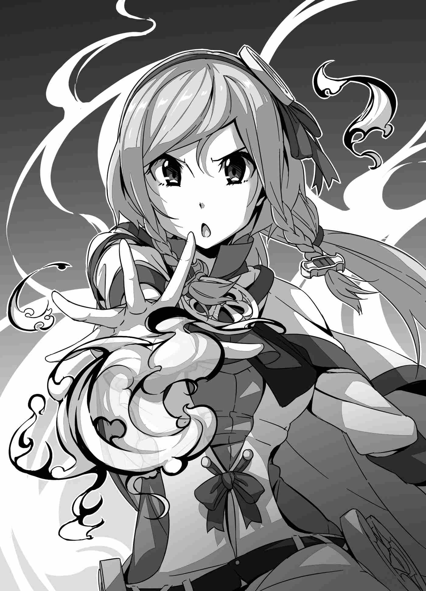

"Cảm ơn cô nhiều nhé, Felmenia-sensei."

Felmenia vẫn còn đôi chút bối rối khi được gọi bằng danh xưng ấy, nhưng cô dường như dần quen hơn khi nghe Reiji lặp lại nó bằng giọng điệu vui vẻ. Cô gật đầu đáp lại.

"R-Rất tốt. Ngài đã sẵn sàng cho bài học chưa, thưa Dũng sĩ-dono?"

"Tôi đang chú ý lắng nghe đây."

Nói rồi, Felmenia quay mặt đi và bắt đầu ngượng ngùng lẩm bẩm một mình.

"Sensei...? Mình là người hướng dẫn... Người hướng dẫn của Dũng sĩ... Hi hi..."

Reiji không nghe rõ cô nói gì, nhưng khi Felmenia thoát khỏi cơn ảo tưởng ngắn ngủi và lấy lại bình tĩnh, Titania đã lên tiếng giục họ bắt đầu buổi học.

"Bạch Hỏa-dono, phần còn lại nhờ cả vào cô đấy."

"Vâng, thưa Điện hạ. Vậy thì trước hết, thưa Dũng sĩ-dono, tôi muốn ngài nhớ lại những gì tôi đã nói khi biểu diễn ma thuật lúc nãy, và hình dung lại cảm giác luân chuyển ma lực bên trong cơ thể mình. Bây giờ, hãy thử tập trung cảm giác đó vào... lòng bàn tay sẽ là nơi thích hợp nhất, tôi nghĩ vậy. Chỉ cần thế, dù không dùng câu chú hay ma pháp trận cụ thể nào, ngài vẫn có thể thực hiện được một vài điều cơ bản."

"Chỉ cần làm thế thôi sao?"

"Không phải ngài có thể làm được ngay lập tức đâu. Chắc ngài phải thử tập trung vài lần đấy. Xưa nay chưa từng có ai thành công ngay lần thử đầu tiên cả."

Reiji gật đầu trước lời giải thích của Felmenia và chuẩn bị tinh thần. Dù sao thì cậu cũng phải thử một lần đã. Cậu cố nhớ lại cảm giác ấm nóng ở vùng bụng lúc Felmenia thi triển ma pháp ban nãy.

"Reiji-kun, chúc may mắn!"

Khi Mizuki cất tiếng cổ vũ từ băng ghế đá phía sau, Reiji bước lên một bước.

*Mình có thể làm được. Không sao cả.*

Tin chắc rằng luồng khí nóng ấm dâng trào trong bụng lúc nãy chính là ma lực, Reiji chậm rãi nhắm mắt lại, giơ tay lên và cố gắng tập trung nguồn năng lượng đó vào lòng bàn tay.

"Tốt lắm. Bây giờ, giữ nguyên như thế, hãy tìm kiếm một nhịp đập khác bên trong cơ thể ngài, ngoài nhịp tim ra."

*Một nhịp đập khác ngoài tim? Có phải... là cái này không?*

Làm theo chỉ dẫn của Felmenia, Reiji hoàn toàn tập trung vào các cảm quan trong cơ thể. Lúc này, cậu nhận ra có một thứ gì đó đang đập bên trong mình. Dù không phải trái tim, nhưng nó lại đập với nhịp điệu đều đặn tương tự. Đúng như cậu dự đoán, nó xuất phát từ ngay dưới rốn—nơi được gọi là đan điền trong Đông y.

"Một khi đã tìm thấy nhịp đập đó, ngài coi như đã thành công một nửa rồi. Bây giờ, việc ngài cần làm chỉ là dẫn nguồn năng lượng từ nhịp đập đó đến lòng bàn tay... Tuy nhiên, nói thì dễ hơn làm, đây hoàn toàn không phải chuyện đơn giản."

Có vẻ như Felmenia cho rằng Reiji sẽ không thể thực hiện được ngay. Nắm vững ma pháp vốn chẳng phải chuyện dễ dàng, và thử thách cô vừa đưa ra chính là bài kiểm tra quyết định xem một người có tố chất để trở thành ma đạo sĩ hay không.

*Không, mình có thể làm được...*

Thế nhưng, Reiji không hề nghi ngờ bản thân. Cậu vẫn cảm nhận được luồng khí ấm áp đang lớn dần bên trong cơ thể, và điều đó càng tiếp thêm động lực cho cậu. Để khơi gợi sức mạnh ấy, hình ảnh đầu tiên xuất hiện trong tâm trí Reiji chính là lửa. Nhưng ngọn lửa của cậu hoàn toàn khác biệt với ngọn lửa của Felmenia. Ngọn lửa của Reiji đỏ rực như ánh hoàng hôn chiều tà—một ngọn lửa rực rỡ và thiêu đốt dữ dội.

Và rồi, những từ ngữ tựa như một lời khải thị chợt lóe lên trong đầu Reiji.

"Hỡi Ngọn lửa, hãy hiện diện tại đây! Bộc Hỏa!" (Flare!)

Ma lực của Reiji lập tức tụ hội khi cậu hô vang mệnh lệnh như thể đang giải phóng ngọn lửa giận dữ trong tim mình để kêu gọi các nguyên tố. Một ngọn lửa đỏ rực rỡ bùng lên ngay giữa lòng bàn tay cậu—ngọn lửa ma pháp thực sự. Nhưng chỉ trong tích tắc, sự tập trung của Reiji bị đứt đoạn và ngọn lửa biến mất tăm, không để lại dù chỉ một tia lửa nhỏ.

"Tớ làm được rồi..."

Reiji sững sờ trước thành công ngay trong lần đầu tiên của mình, và các ma đạo sĩ đang chứng kiến xung quanh cũng có cùng cảm xúc đó. Họ phấn khích thì thầm: "Đ-Đó thực sự là lần đầu tiên của cậu ấy sao?!" và "Đúng là Dũng sĩ của chúng ta!" Ngay cả Felmenia—người vừa hướng dẫn cậu từng bước—cũng cất lời khen ngợi.

"Xuất sắc lắm... Ngài quả là một thiên tài bẩm sinh, thưa Dũng sĩ-dono."

Titania tiếp lời:

"Xin chúc mừng ngài, Reiji-sama. Giờ đây ngài đã chính thức đứng vào hàng ngũ của các ma đạo sĩ rồi."

"Tôi là... một ma đạo sĩ rồi sao?"

Reiji ngập tràn cảm xúc trước lời chúc mừng của Titania. Sau đó, công chúa quay sang nói chuyện với Felmenia:

"Làm tốt lắm, Bạch Hỏa-dono. Phương pháp giảng dạy của cô quả thực rất hiệu quả."

"Không, thần hầu như chưa làm được gì cả. Chỉ là do Dũng sĩ-dono quá tài năng mà thôi."

"Tất nhiên là Dũng sĩ-sama có tài năng, nhưng không thể phủ nhận cô đóng vai trò vô cùng quan trọng trong thành công của ngài ấy. Dũng sĩ-sama đến từ một thế giới không hề có ma pháp, vậy mà nhờ sự chỉ dẫn của cô, ngài ấy đã có thể sử dụng được nó ngay lập tức. Cả năng lực của ngài ấy lẫn sự hướng dẫn của cô đều vô cùng xuất sắc."

"Thần vô cùng vinh hạnh, tâu Điện hạ."

Felmenia kính cẩn cúi đầu trước lời khen ngợi quý giá ấy. Dù đang cúi đầu, cô vẫn không giấu nổi niềm vui sướng ngập tràn. Khi cô ngẩng đầu lên, Mizuki bèn rụt rè gọi cô.

"Ư-Ừm..."

"Có chuyện gì vậy? Mizuki-dono."

Mizuki hít một hơi thật sâu để lấy lại bình tĩnh, rồi nói ra ước muốn nung nấu trong lòng.

"C-Cô có thể dạy cả em ma pháp nữa được không?! Em cũng muốn học!"

"Được chứ. Vậy thì..."

Và thế là, một ma đạo sĩ dị giới nữa lại được khai sinh.

---

[◀ Chương trước: Chương 1: Ta Đâu Phải Thứ Muốn Triệu Hồi Là Triệu Hồi! - Phần 4](01_chapter_1_part4.md) | [Chương tiếp theo: Chương 2: Nơi Tôi Phải Trở Về Là Nơi Thật Xa Xôi - Phần 1 ▶](02_chapter_2_part1.md)
