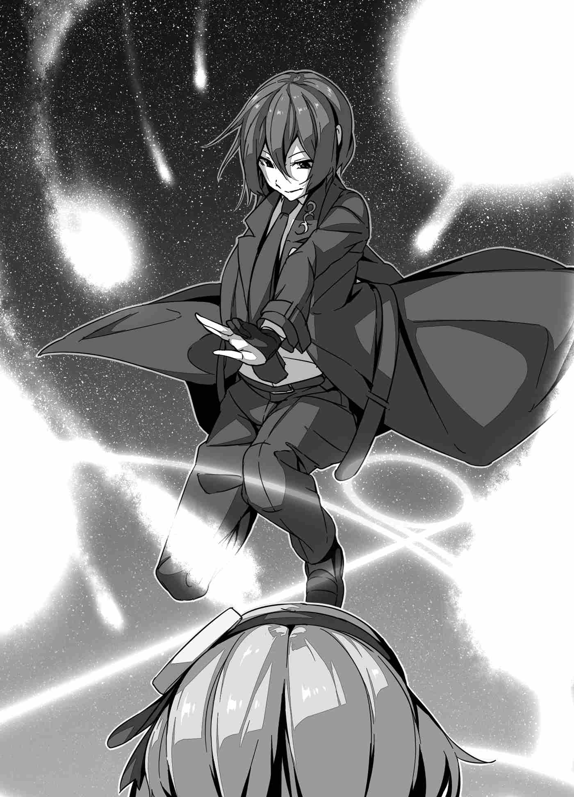

# Chương 3: Kẻ Truy Tìm Bí Ẩn

Vài ngày đã trôi qua kể từ đêm con golem bị phá hủy.

Vào giữa đêm khuya thanh vắng tại Hoàng thành Camellia, khi vạn vật đã chìm sâu vào giấc ngủ, Felmenia đang lén lút bám theo một thiếu niên.

Cô chọn đêm nay để đối chất với cậu khi cậu đang âm thầm đi lại xung quanh. Để dạy cho tên nhóc này một bài học—kẻ không chỉ lảng vảng khắp lâu đài mà theo lời đồn còn có ý đồ mưu hại tính mạng của Quốc vương—Cô giữ khoảng cách một thời gian cho đến khi có cơ hội dồn cậu vào thế bí.

Như thường lệ, Suimei hoàn toàn không nhận ra sự xuất hiện của cô. Làm sao cậu có thể nhận ra được chứ.

Mỗi khi bám theo cậu, cô đều sử dụng ma pháp hệ Phong để tiếng bước chân, thân nhiệt và ngay cả hơi thở nhẹ chập chùng của cô cũng không thể truyền tới cậu. Khi sử dụng thuật che giấu này, dù là gã vệ sĩ tinh tường nhất có sục sạo tìm kiếm dấu vết của ai đó xung quanh, họ cũng chẳng bao giờ phát hiện ra cô. Suimei lại càng không có cửa.

Xung quanh không một ánh đèn, vậy mà chàng thiếu niên vẫn bước đi thẳng tắp qua hành lang chìm trong bóng tối mịt mùng mà không chút hề hà phân vân. Cậu dường như đang hướng đến một nơi khác với mọi khi, nhưng vẫn mặc trên mình bộ trang phục kỳ lạ mà Reiji gọi là "áo blazer". Cô không chắc cậu đang đi đâu, nhưng đêm nay cô quyết tâm sẽ đối mặt xử lý cậu.

"...Hả?!"

Khóe mắt Felmenia chợt bắt gặp một cái bóng đang chuyển động. Cô vô cùng kinh ngạc, lập tức ngoái đầu lại xem đó là thứ gì. Cô không nghĩ giờ này lại có ai khác đi lại xung quanh. Khả năng cao nhất là lính gác ca đêm, nhưng vì biết đêm nay mình sẽ ra tay với Suimei, Felmenia đã tạm thời đình chỉ ca tuần tra của họ. Ngay cả lính gác cũng không nên xuất hiện lúc này, vậy rốt cuộc đó là ai?

Felmenia đảo mắt tìm kiếm cái bóng trên hành lang lần nữa, nhưng chẳng có ai xuất hiện. Có vẻ cô chỉ nhìn nhầm, nhưng điều đó cũng tự nhiên trong đêm khuya thanh vắng thế này. Giờ này đến cỏ cây cũng đã ngủ say, xung quanh không một bóng người, Felmenia đứng trơ trọi một mình trong bóng tối. Mắt cô có hoa một chút thì đã sao? Cô lại dồn ánh mắt quyết đoán về phía trước để tiếp tục đuổi theo Suimei, nhưng...

"Cậu ta... biến mất rồi?"

Suimei không còn ở đó. Cô chỉ mới ngoảnh đi một thoáng, vậy mà cậu đã đường hoàng bốc hơi. Điều này thật khó hiểu đối với Felmenia. Với tốc độ cậu đang đi, cậu không thể nào tới được bất kỳ lối rẽ giao nhau nào. Cô vẫn liếc qua các lối đi để chắc chắn, nhưng quả thực chẳng có ai.

Tuy nhiên, Felmenia không để điều đó ngáng đường. Nếu đã mất dấu, cô chỉ cần tìm lại cậu là xong. Với ý chí thép, Felmenia gom ma lực trong cơ thể và dệt nên một phép thuật bằng ma pháp hệ Phong.

"Hỡi Làn Phong. Ngươi là tôi tớ của ta. Hãy cho ta biết điều ta khao khát. *Wind Search (Tầm Phong Thuật)!*"

Thứ cô triển khai là một dạng ma pháp dò tìm. Dùng nó, cô có thể mượn làn gió để cảm nhận khu vực xung quanh. Chẳng mấy chúp, tiếng bước chân của Suimei đã được gió mang đến tai Felmenia. *Tách, tách...* Cô biết rất rõ nhịp bước chân đều đặn của cậu. Cậu chưa đi xa, vì vậy cô giữ bình tĩnh và tiếp tục bám theo.

"Hướng này... Hừm?"

Đi theo tiếng bước chân trong lúc vội vã tiến lên, Felmenia bỗng khựng lại bởi một điều.

*Khoan đã, hướng này là...*

Khi nhận ra nơi Suimei đang hướng tới, ngọn lửa tức giận trong cô bùng lên mãnh liệt. Cậu đang đi thẳng về phía Khu vườn Tường Trắng. Đó là một trong những khu vườn nằm trong Hoàng thành Camellia, tọa lạc ngay bên cạnh đại điện diện kiến.

Đó là khu vực riêng tư và việc ra vào bị hạn chế, chỉ dành cho những ai có phép thuật đặc biệt hoặc sự cho phép cấp cao. Đó là một trong số ít nơi thánh địa mà Quốc vương có thể dành thời gian riêng tư. Sao tên ma đạo sĩ vô lễ này lại gan xúy xâm nhập vào đó? Thật không thể tha thứ. Nỗi giận dữ trong lòng cô biến thành cơn lôi đình, thôi thúc cô lao về phía trước. Felmenia dậm bước dồn dập nện xuống sàn đá đuổi theo.

Nện bước qua hành lang đá và băng qua một sân nhỏ sau đó, Felmenia tiếp tục tiến tới. Cô thề với bản thân hết lần này đến lần khác rằng cô sẽ đánh gục tên ma đạo sĩ láo xược đó bằng cơn thịnh nộ của mình khi cô chạm tới cánh cổng cuối cùng. Ánh sáng từ những vì sao và ánh mặt trăng trên cao rọi xuống thành những chùm sáng rực rỡ khi cô lao vào khu vườn, toàn thân trào dâng ma lực.

Chào đón cô là hình ảnh của một ma đạo sĩ khoác trên mình bộ trang phục đen tuyền từ đầu đến chân.

Khu vườn Tường Trắng. Bên cạnh đài tưởng niệm tháp đá obelisk trắng vút lên ở trung tâm, Suimei Yakagi đứng lặng im quay lưng về phía Felmenia, ngẩng đầu nhìn lên bầu trời đêm đầy sao lung linh như trận mưa trang sức quý giá. Bức màn xanh thẫm của đêm đen trải dài từ mặt đất lên tận trời cao, rồi từ trời cao rủ xuống mặt đất. Nó tưởng chừng như kéo dài vô tận, nhưng lại được thắp sáng bởi quầng sáng tuyệt mỹ của trăng tròn, thổi sống khí thế tĩnh mịch của khung cảnh mê đắm lòng người. Ánh trăng đó và Suimei là tất cả những gì Felmenia có thể tập trung lúc này.

Nhưng... cậu đã thay đồ từ khi nào? Mới vừa rồi cậu còn mặc chiếc áo blazer đó, nhưng giờ đây lại khoác một chiếc áo măng-tô màu đen. Cậu ăn mặc chỉn chu và trang trọng đến mức cô phải nghi vấn trong giây phút xem liệu mình có nhìn nhầm người hay không.

"Chà chà... Quả thực là thiếu gu thẩm mỹ khi đi bám đuôi người khác thế này đấy. Đó là hành vi chỉ hợp với những con cừu lạc tội nghiệp và ngu ngốc chẳng biết tí gì về chân lý và quy luật của thế giới thôi, cô biết không?"

Khoe khóe miệng uốn thành một nụ cười ngạo nghễ và xảo quyệt, Suimei cất lời mỉa mai. Cậu thong thả quay người lại, như thể đã biết cô ở đó từ lâu. Phải, cậu trông như đang nhếch môi giễu cợt một đứa trẻ lạc đường không biết mình đang đi đâu.

"Không thể nào... Ngươi phát hiện ra ta?"

"Tất nhiên rồi. Lao qua lao lại đằng sau lưng tôi như thế, nếu tôi không phát hiện ra thì mới là chuyện lạ đấy."

"...!"

Suimei bình tĩnh đáp lại, như thể câu trả lời là điều hiển nhiên. Cậu đã biết cô theo đuôi cậu. Felmenia sững sờ trước việc cậu có khả năng nhìn thấu thuật che giấu hoàn hảo của cô.

Cục diện bất ngờ lật ngược hoàn toàn với cô. Cô từ kẻ đi săn trở thành con mồi, và đã rơi tọt vào lòng bàn tay cậu khi đi theo cậu đến đây. Felmenia nghiến răng ken két đến mức phát ra tiếng kêu. Việc bị biến thành quân cờ nhảy múa trên lòng bàn tay kẻ khác lại chực trào sự uất hận đến thế này... Đây là lần đầu tiên cô nếm trải sự tủi hổ như vậy, và nó càng đổ thêm dầu vào ngọn lửa giận dữ của cô.

Cô đã bị dụ vào, đúng thế, nhưng cô sẽ không để mọi chuyện kết thúc như vậy. Cô hiên ngang bước tới và bắt đầu chất vấn kẻ trước mặt.

"Nếu đã vậy, tên vô lại kia, mục đích của ngươi ở đây là gì?"

"Cần gì phải hỏi câu đó. Tôi chỉ đang đi dạo đêm thôi. Tôi đâu có lệnh giới nghiêm, đúng không? Và lần này, tôi chỉ đơn giản nghĩ rằng mình sẽ đi đến một nơi mà mình chưa từng tới mà thôi."

"Ngươi thật sự nghĩ một cái cớ như vậy sẽ qua mắt được ta sao? Nếu ngươi biết ta bám theo, nghĩa là ngươi đến đây khi biết rõ điều đó, có đúng không?"

Cô không biết chính xác điều gì hay tại sao, nhưng cô biết cậu đang chơi trò mèo vờn chuột với cô. Cô không ngần ngại vạch trần cậu, và chẳng buồn giấu đi sự bực bội khi làm vậy. Khi cô làm thế, Suimei bật ra tiếng cười tráo trở như một đứa trẻ hư vừa bị vạch mặt trò đùa quái ác.

"Không lừa được rồi nhỉ? Tôi cũng e là vậy."

"Ta hỏi lại lần nữa. Tại sao ngươi lại đến đây?"

"Tại sao ư? Điều đó..."

Suimei cất tiếng cười nhẹ nhàng như làn gió xuân lướt qua. Cậu dường như đặc biệt thích thú với những gì mình tin là sẽ diễn ra tiếp theo. Và rồi, với đôi mắt trông như có thể nhìn thấu tâm cơ thực sự của Felmenia...

"Đó cũng là lý do cô đến đây, chẳng phải sao?"

"..."

"Giữ im lặng sao? Tôi đã chắc chắn đó là lý do mà. Tôi đoán sai ư?"

Nói đoạn, Suimei đeo vào tay một đôi găng tay màu đen với những động tác vô cùng thành thạo. Khi Felmenia không có phản ứng gì, cậu lại lên tiếng với giọng điệu có vẻ thất vọng.

"Tôi chưa từng nghĩ mình sẽ phải làm trò này với cô. Nói thật lòng thì, tôi muốn giải quyết chuyện này theo một cách hòa bình hơn cơ..."

"Mặt dày tới mức nào mà ngươi dám nói đến chuyện giải quyết hòa bình chứ..."

Đúng vậy. Suimei đang nhắm vào Quốc vương. Cậu làm gì có ý định xử lý hòa bình. Và khi Felmenia chỉ ra điều đó, Suimei nở một nụ cười có phần tự giễu. Thay vì phản đối những gì cô nói, cậu lại thừa nhận nó.

"Có lẽ tôi không nên nói vậy sau khi đã dựng lên sân khấu này. Nghĩ lại thì, có lẽ đã có vài phương pháp khác có thể giải quyết chuyện này êm đẹp từ lâu rồi."

"Hừm."

Cậu nghĩ chỉ cần thú nhận là xong sao? Hoàn toàn mờ tịt không hiểu Suimei đang nghĩ gì, Felmenia hợm hĩnh hừ một tiếng. Suimei sau đó ngẩng đầu nhìn lên bầu trời như thể đang nhớ lại điều gì đó.

"Đây là lần thứ hai chúng ta trò chuyện đúng không?"

"Đúng thế."

Sau khi đáp lại câu hỏi của Suimei một cách cộc lốc, cậu nhăn mặt tiếp lời.

"Chà, cô đúng là một người khó mến đấy..."

"Ý ngươi là sao?"

"À, không có gì. Chỉ là tán phét thôi. Không có ý gì sâu xa đâu, nhưng... Chà chà, cô thật sự ghét tôi đến thế cơ à? Có phải vì chuyện đó không? Cô vẫn còn giữ mối hận về những gì đã xảy ra lần trước ư?"

"..."

"Lại giữ im lặng rồi."

Suimei thở dài có phần thất vọng, nhưng cậu không phải là người duy nhất cảm thấy như vậy. Quả thực, Felmenia từng nghĩ cậu là một người khá chính trực. Cậu đã từ chối tham gia vào cuộc chinh phạt Ma Vương, nhưng khi đụng chuyện, cậu lại tốt tính và thực sự quan tâm đến bạn bè. Reiji và Mizuki chưa từng nói một lời không hay nào về cậu. Sự do dự vẫn lảng vảng trong một góc trái tim Felmenia, nhưng...

"Nói thật lòng, tôi cũng ước chuyện không đi đến nước này."

"Ý ngươi là ngươi muốn giải quyết nó từ cách đây một thời gian sao? Chắc chắn sẽ nhanh hơn nhiều với những gì ngươi đã bày ra nhỉ?"

"...?"

Cậu đã hiểu những gì cô nói theo cách nào chứ? Cậu gật đầu như thể đã vỡ lẽ ra điều gì đó. Cô không chắc cậu đang nói về cái gì, nhưng khi nhìn cậu lúc này, một điều khác lại khơi dậy sự chú ý của cô.

"Cho dù là vậy, tên vô lại kia, ngươi lấy đâu ra bộ quần áo đó?"

Cô chưa từng thấy cậu mặc bộ trang phục này trước đây. Trên thực tế, cô chưa từng thấy bất cứ thứ gì tương tự. Cậu đang mặc một chiếc áo măng-tô đen tuyền với vạt áo dài và một đóa hoa hồng xanh được thêu trên ve áo. Một miếng vải có hình dáng như một lưỡi kiếm ngược rủ xuống từ cổ chiếc áo sơ mi trắng tinh được dệt tỉ mỉ. Cậu cũng mặc một chiếc quần cùng màu đen tuyền với chiếc áo khoác. Đó là một tổng thể vô cùng kỳ lạ.

"Hửm? Ạh, cô nói bộ suit này sao? Tôi luôn mang theo trang phục chiến đấu bên mình để dùng bất cứ khi nào cần."

"Ngươi mang theo bên mình? Nhưng ngươi đâu có mang theo quần áo nào khác ngoài những gì đang mặc trên người vào ngày được triệu hồi."

"Nó ở trong túi của tôi. Cô thấy tôi mang theo nó mà, đúng không?"

Felmenia nghe ra ẩn ý thực sự trong giọng điệu của Suimei: "Cố mà nhớ lại đi." Cậu ra hiệu bằng tay, chỉ ra kích thước và hình dáng của chiếc túi để cố gắng khơi gợi ký ức của cô. Nhớ lại thì, đúng là cả ba người bạn đều đến đây với những chiếc túi đựng đồ cá nhân, nhưng...

"Không đời nào những bộ quần áo cồng kềnh như vậy lại nhét vừa một cái túi nhỏ như thế."

"...Thật sao? Dù cô nhìn nhận chuyện này thế nào đi nữa, chẳng phải cô hơi hẹp hòi quá rồi sao?"

Cái cách Suimei nhún vai kinh ngạc làm Felmenia khó chịu, nhưng cậu có lý. Cậu là một ma đạo sĩ, nên nếu những gì cậu nói là sự thật, có vẻ như đã có một câu trả lời rõ ràng.

"Ta hiểu rồi... Một Ma Cụ (Magic Tool)?"

"Ma cụ sao? Cách gọi đó hơi tầm thường đấy, nhưng cô không sai. Đó là chiếc túi có thể chứa được đồ vật gấp nhiều lần kích thước bề ngoài của nó—nó là một trong những món đồ yêu thích của tôi."

Suimei nói với giọng điệu có phần tự hào. Ma cụ là những vật phẩm được ban cho một loại sức mạnh nào đó vốn là điều không thể. Cô biết những thứ như vậy tồn tại, nhưng Felmenia chưa từng nghe nói về một phép thuật gia hộ nào có thể tăng sức chứa của một vật chứa mà không làm tăng kích thước của nó. Cô không thể nghĩ ra thuộc tính nào trong số tám thuộc tính lại cho phép một điều như vậy. Nếu Suimei thực sự nắm trong tay một ma cụ xuất sắc như thế, cô có thể hiểu tại sao cậu lại khoe khoang về nó.

Trong khi Felmenia đang chiêm ngưỡng hiệu ứng từ chiếc túi của cậu, Suimei thắt chặt găng tay, chỉnh lại cổ áo măng-tô và dũng cảm đi thẳng vào vấn đề.

"Vậy thì, giờ cũng đã khá muộn rồi. Chúng ta bắt đầu chứ?"

Felmenia đáp lại một cách ngạo mạn.

"Đừng nói những lời ngu ngốc như vậy, tên ngốc kia. Ngươi nghĩ đây là đâu? Đây là Khu vườn Tường Trắng, nơi yêu thích của Bệ hạ. Ngươi nghĩ đánh nhau được phép diễn ra ở một nơi thế này sao?"

Phải, đây là Khu vườn Tường Trắng. Khu vườn của Quốc vương. Tàn phá nó bằng một trận chiến sẽ là một sự vô lễ tột cùng. Lên án cậu vì lời đề nghị đó, Felmenia thách thức Suimei bằng một ánh nhìn sắc lẹm. Tuy nhiên, Suimei dường như chỉ thấy buồn cười. Cậu trả lời cô bằng một nụ cười táo tợn khi nhếch môi.

"Hừm? Khu vườn Tường Trắng sao? Đó là một cái tên hoàn toàn khoa trương cho một khu vườn lòe lẹt thế này, nhưng... cô có chắc đây thực sự là nơi chúng ta đang đứng không?"

"Ngươi đang gợi ý điều vô lý gì vậy? Khu vườn Tường Trắng có thể nhận biết trên hết bởi tháp đá obelisk màu trắng đặc trưng ở trung tâm—chính là kiến trúc ngươi đang đứng ngay bên cạnh đấy. Những bông hoa rực rỡ sắc màu trang trí khu vườn đến từ mọi loại hạt giống, được đặt hàng từ khắp nơi trên toàn vương quốc. Đây là nơi yêu thích của Bệ hạ, và ngọn tháp mà ngươi có thể nhìn thấy ở bên trái ta là— Hả...?"

Không có ở đó. Cô nhấn mạnh giơ tay trái lên để chỉ ra, nhưng ngọn tháp đồ sộ chứa gian phòng riêng của Quốc vương không nằm ở nơi nó vốn phải ở. Nó đã biến mất không một dấu vết.

Tâm trí Felmenia lập tức lao xuống vực sâu của sự hỗn loạn. Có lẽ nhận thức được sự hỗn loạn nội tâm của cô, và như thể giễu cợt sự bất lực không thể nói thêm lời nào của cô, Suimei đưa ra một tuyên bố.

"Sao thế? Chẳng có gì ở nơi tay trái cô đang chỉ đâu, cô biết đấy. Ngọn tháp chứa gian phòng của Quốc vương và bao quát tầm nhìn ra Khu vườn Tường Trắng—ngọn tháp tôi đoán cô đang nói tới—nằm ở bên phải cô kìa, chẳng phải sao?"

Suimei tỏa ra một bầu không khí đáng sợ. Tóc mái che khuất đôi mắt khi cậu cúi đầu, và Felmenia có thể cảm nhận được trái tim mình đang bị thu hút bởi gã ác ma áo đen này. Đôi môi cậu uốn cong thành một nụ cười điềm báo để lộ cả răng khểnh. Felmenia ngoảnh lại để nhìn ngọn tháp mà cô đang tìm kiếm... ngay đúng nơi cậu nói nó sẽ ở.

"Phi lý... Phòng riêng của Bệ hạ phải nằm ở bên trái chứ. Tại sao... Làm sao nó lại ở bên phải...?"

Felmenia bàng hoàng trước hiện tượng kỳ lạ này. Cô không thể nghĩ ra lời giải thích nào. Điều đó là không thể, nhưng cô không thể phủ nhận những gì mình đang nhìn thấy tận mắt. Ngọn tháp nằm ở bên phải cô thay vì bên trái.

Chuyện gì vừa xảy ra vậy? Những nghi ngờ xoay mòng mòng trong đầu Felmenia, đe dọa nhấn chìm cô. Ngọn tháp của hoàng gia đáng lẽ phải nằm ở bên trái khu vườn. Cô chưa từng được mời vào khu vườn nhiều lần như vậy, nhưng cô khá chắc chắn rằng mình nhớ rõ điều đó. Cô sẵn sàng thề thốt về điều đó. Vậy làm sao giờ đây nó lại nằm sai bên? Và tại sao?

Suimei nhắm mắt lại với cái nhìn hiểu thấu và giải thích ẩn số.

"Để xem nào. Có hai câu trả lời nảy ra trong đầu tôi. Nó thực sự rất đơn giản. Ngọn tháp nằm ở bên phải cô là vì cô đã nhầm lẫn ngay từ đầu, hoặc có lẽ đây không phải là Khu vườn Tường Trắng như cô biết."

"Hoang đường. Cả hai điều đó đều không thể."

"Thật thế sao? Vậy thì làm sao ngọn tháp lại ở bên phải thay vì bên trái như cô nhớ? Tại sao mặt trăng mà chúng ta đang thấy lại mọc ở bên phải cô nữa? Tại sao những bông hoa rực rỡ được trồng ở đây lại xếp theo thứ tự ngược lại với những gì cô có thể nhớ? Thử trả lời điều đó cho tôi xem."

"Điều... Điều đó..."

Suimei tiếp tục nói như thể có ý định cạy câu trả lời ra khỏi cô, nhưng cô vẫn không biết. Đúng như cậu nói. Khu vườn Tường Trắng mà họ đang đứng dường như hoàn toàn đảo ngược, như thể sự tồn tại của nó được phản chiếu qua một tấm gương.

Ngay cả mặt trăng và các chòm sao... Mọi thứ Felmenia có thể nhìn thấy đều bị lộn ngược. Như thể, mà cô không hề hay biết, cô đã lạc đường và sảy chân vào một thế giới khác.

"*Phantom road (Con đường ảo ảnh)...*"

"Phan... tum... Rô-đơ?"

Suimei bắt đầu nói một loại ngôn ngữ nước ngoài nào đó, loại ngôn ngữ không tự động chuyển đổi sang ngôn ngữ mà Felmenia nói. Đó chắc chắn phải là một thứ gì đó vô cùng bất thường. Felmenia cố gắng hết sức để lặp lại những gì cậu nói, phát âm nó bằng những từ cô biết trong tiếng mẹ đẻ của mình.

"Đúng vậy. Đây là bên trong một kết giới mà tôi tạo ra. Đó là một thế giới ảo ảnh khép kín, nơi bất kỳ điều gì và mọi thứ trong thế giới hiện tại đều bị đảo ngược như thể phản chiếu qua một tấm gương. Dệt nên những con số không tồn tại trên thế giới, tôi đã tạo ra một nơi không tồn tại. Nói cách khác, đây có thể gọi là một *không gian số phức*."

"C-Cái gì cơ? Những con số không tồn tại? Một k-không gian số phức, ngươi nói sao? Ngươi đang nói cái quái gì vậy? Ngươi đã làm cái gì?"

Lời giải thích của Suimei chỉ càng làm tăng thêm sự sốt ruột của Felmenia. Những từ cô chưa từng nghe trước đây đã đành, nhưng cô cũng chưa từng thấy hay nghe nói về ma pháp như vậy bao giờ. Chưa từng. Không một lần nào. Và cô lại là một cung đình ma đạo sĩ.

Đối với cô, ma pháp là sức mạnh bí ẩn của các Nguyên tố: lửa, nước, gió, đất, lôi, mộc, quang và ám. Vì các ma đạo sĩ mượn sức mạnh của tám Nguyên tố đó, ma pháp luôn mang một trong tám thuộc tính đó. Sức mạnh Nguyên tố đó đã tạo nên những kỳ tích vĩ đại. Ma lực là lực đẩy, lời xướng gọi đến các Nguyên tố, và sức mạnh của chúng đến với ma đạo sĩ dưới dạng một phép thuật.

Nhưng những gì Suimei làm lại không tuân theo những quy tắc đó. Nó hoàn toàn không có sức mạnh Nguyên tố nào.

"Trời ạ, tệ đến mức đó sao...? Chà, tôi nói những điều đó khi biết rõ điều này. Thần ma lực (magicka) ở đây chỉ là loại nhảm nhí cấp độ Thời Kỳ Đen Tối. Và lý thuyết có vẻ chậm hơn vài thế kỷ so với cả mức đó nữa... Chả trách ngôn ngữ và khái niệm của nó hoàn toàn xa lạ với cô, đúng không?"

"Đây là... Ý ngươi nói đây là ma pháp sao? Ma pháp có thể thay đổi diện mạo của thế giới? Một thứ như vậy tồn tại ư? Mà thậm chí không cần dùng đến một thuộc tính... Làm sao ngươi có thể phản chiếu toàn bộ..."

"Không chỉ diện mạo thay đổi đâu, cô biết đấy... Nó thực sự khó hiểu đến thế sao? Đây chỉ là loại ma thuật kết giới tinh vi hơn một chút thôi."

Đó lại là một cụm từ nữa cô chưa từng nghe qua. Có lẽ thứ kỳ lạ cậu nói đến là một loại thuộc tính chưa được biết tới nào đó.

"Bơ-ri-ơ ma-gic-a?"

"Cái gì?! Chúng ta phải quay ngược lại xa đến thế sao?! Đừng nói với tôi ngay cả khái niệm về kết giới cũng không tồn tại ở đây nhé..."

"Như ta đã nói, rốt cuộc ngươi đang—"

"Kết giới! Ma thuật kết giới! Cô nghiêm túc chưa từng nghe nói về nó sao?!"

"T-Ta chưa! Ta không biết ngươi đang nói về cái gì, nhưng loại ma thuật khả nghi đó không tồn tại ở thế giới này!"

"Kh-Không... Thật ư? Tôi cảm giác như mình đột nhiên trở thành vô địch ở thế giới này vậy."

Suimei trông bàng hoàng. Cậu ôm lấy đầu bằng cả hai tay như thể nó nặng trịch. Ma pháp của thế giới này lại gây sốc cho cậu đến vậy sao? Cậu đã đi đến kết luận rằng không đáng để mất thời gian giải thích thêm nữa ư? Suimei trút ra một tiếng thở dài ngao quán chấp nhận.

"Thôi thì, sao cũng được... Để thảo luận sau đi. Điều quan trọng duy nhất lúc này là đây không phải là Khu vườn Tường Trắng như cô biết. Đó là một thế giới gương tôi tạo ra bằng ma thuật dựa trên Khu vườn Tường Trắng. Bằng cách này, ngay cả khi chúng ta ném phép thuật và làm ầm ĩ lên, sẽ không ai nhận ra đâu. Nó sẽ giống như tất cả chỉ là một giấc mơ."

"..."

Felmenia vẫn không hiểu một nửa những gì cậu đang nói. Ma thuật cậu sử dụng là một ẩn số hoàn toàn đối với cô, nhưng cô hiểu tình thế mà mình đã tự đưa bản thân vào. Cô đã bị dụ vào một cái lồng. Hay đúng hơn là một đấu trường.

Suimei coi sự im lặng của cô là sự thấu hiểu.

"Tôi biết nó vượt quá tầm hiểu biết của cô, nhưng có vẻ cô ít nhất cũng đã nắm được chừng đó. Chà, việc có thể bình tĩnh đối mặt với bất kỳ tình huống nào là rất quan trọng. Vậy thì, đã đến lúc rồi... Chúng ta bắt đầu chứ?"

"Câm miệng đi. Ngươi có vẻ khá tự mãn sau khi kéo ta vào cái nơi khó hiểu này, nhưng ngươi nghiêm túc nghĩ một tên vô lại với lượng ma lực cấp độ của ngươi có thể đánh bại ta sao? Ta là cung đình ma đạo sĩ của Vương quốc Astel, Felmenia Bạch Hỏa. Ta sẽ không thua một kẻ không thể đối mặt với đối thủ trừ khi hắn sử dụng thứ mưu hèn kế bẩn hèn hạ này!"

Suimei cố gắng thể hiện lợi thế vượt trội trước Felmenia, và cô gầm lên đáp trả cậu. Cô sẽ không để bị nói như vậy. Cô là Bạch Hỏa. Ma đạo sĩ đã chạm tới chân lý của ngọn lửa. Không cần cô phải co rúm lại trước mặt kẻ này. Nếu đi đến một cuộc chiến, vị thế của cô là tuyệt đối. Cô đã thiêu rụi vô số quái thú và ma vật thành tro bụi trước ngày hôm nay.

Không đời nào cô lại thua chàng thiếu niên vừa mới chân ướt chân ráo hầu như chẳng có ma lực này. Ngay cả khi cậu đã dụ cô vào cái nơi kỳ lạ này, lợi thế thực sự nó mang lại cho cậu là gì? Cậu chỉ là loại ma đạo sĩ đáng khinh không thể chiến đấu nếu thiếu đi những trò khôn lỏi như vậy. Cô chẳng có gì phải sợ cậu.

"Hừm. Ngươi cứ khăng khăng thao thao bất tuyệt về những điều hoàn toàn nhảm nhí, nhưng kết cục của cuộc chiến này đã được định đoạt rồi."

"Chà chà. Cô nghe có vẻ tự tin đấy. Nhưng cô thực sự có thể đánh bại tôi bằng sức mạnh của mình không, tôi tự hỏi đấy?"

"Nói hay lắm. Để ta biểu diễn cho ngươi xem. Ta sẽ cho ngươi thấy tại sao ta được gọi là Bạch Hỏa ở Astel này. Ta sẽ cho ngươi thấy chân lý trên đỉnh cao của con đường ma pháp, ngọn lửa của ta!"

"Hả? Chân lý?"

Felmenia lớn tiếng tự ca tụng bản thân, và cô nghe thấy giọng nói của Suimei trở nên khá nghiêm túc ở đoạn cuối cùng cô nói. Cậu trông như thể đang thong dong tận hưởng làn gió suốt thời gian qua, nhưng sắc mặt cậu giờ đây cũng trở nên trầm ngăm. Nhưng Felmenia không ngạc nhiên. Những gì cô dọa dẫm sử dụng đối với cậu là chân lý của ngọn lửa. Không đời nào một tên ma đạo sĩ biến chất như cậu có thể duy trì bộ mặt điềm nhiên khi nghe thấy điều đó. Và thế là cô bắt đầu xướng chú. Cô sẽ biểu hiện chính ma pháp đó ngay trước mắt cậu.

"Hỡi Ngọn Lửa. Ngươi mang bản chất của mọi ngọn lửa, nhưng hãy bùng cháy không bị ràng buộc bởi quy luật của tự nhiên. Giờ đây, hãy biến mọi thứ tồn tại thành tro bụi, tai họa màu trắng của chân lý! *Truth Flare (Chân Lý Bộc Hỏa)!*"

Ngay khoảnh khắc cô ngâm xướng những từ cuối cùng đóng vai trò là chìa khóa cho phép thuật của mình, một ngọn lửa màu trắng rực rỡ cuộn xoáy xung quanh cô. Nó hút lấy ngọn gió ở khu vực xung quanh, và tỏa ra nhiệt độ gấp nhiều lần bất kỳ ngọn lửa đỏ nào. Đó là ngọn lửa có thể giảm bất kỳ điều gì và mọi thứ thành tro bụi, ngọn lửa chân chính.

"Cái— Hả?"

Suimei thốt ra những tiếng lắp bắp ngơ ngác khi ngọn lửa màu trắng quấn lấy cậu. Sự bàng hoàng hiện rõ trên khuôn mặt cậu, và không thể làm gì khác, cậu chỉ đứng đó ngơ ngác.

Nhưng phản ứng đó là điều dự đoán trước. Ngọn lửa màu trắng mà tất cả đều khao khát và tôn kính đe dọa sẽ nuốt chửng cậu. Trước sức mạnh như vậy, việc bỏ cuộc mà không có bất kỳ sự kháng cự nào là hoàn toàn bình thường.

Phải, đó là cách mọi thứ thường diễn ra. Đó là cách mọi thứ nên diễn ra, nhưng vì lý do nào đó, sau khi Suimei xoay người với vẻ mặt bàng hoàng, cậu lại rụt rè búng tay một cái. Sau đó nó xảy ra trong chớp mắt. Ngọn lửa màu trắng mất đi màu sắc và trở thành một ngọn lửa màu đỏ bình thường.

"C-Cái gì?!"

Và trong khoảnh khắc ngắn ngủi Felmenia kinh ngạc trước hiện tượng này, những ngọn lửa xung quanh Suimei nhanh chóng mất đi sự dữ dội. Chúng dịu xuống và biến mất như thể chưa từng có chuyện gì xảy ra.

Sau khi liếc nhìn Felmenia đang kinh ngạc, Suimei nhìn chằm chằm một hồi lâu vào nơi ngọn lửa từng màu trắng vừa bùng cháy rực rỡ. Cậu cuối cùng thong thả quay lại nhìn cô.

"Vậy... thế thôi sao?"

Cậu nghe như thể đã mong đợi một điều gì đó cực kỳ hung tợn, nhưng những kỳ vọng đó đã bị phản bội một cách thất vọng. Đó là điều mà ai đó có thể nói ở bước ngoặt của một trò hụt hẫng.

Sự căng thẳng và lo lắng của cậu mất đi mọi mục đích và chỉ treo lơ lửng trên người cậu, mông quạnh không biết đi đâu. Nhưng những lời thản nhiên của Suimei đã kích hoạt một cơn bão lửa hoàn toàn mới—một con sóng hỗn loạn từ miệng Felmenia.

"C-C-C-C-Cái gì?! LÀM SAO?! Tại sao ngọn lửa màu trắng của ta lại biến mất?! Đó là đỉnh cao của mọi ngọn lửa mà chỉ những ai đã chạm tới chân lý của nó mới có thể sử dụng! Làm sao nó lại... chỉ bằng một cú búng tay của ngươi..."

"Chà... Không, cô nghiêm túc đấy à? Cô nói 'chân lý', nên tôi đã tự hỏi loại ma thuật nguy hiểm nào cô sắp tung ra với tôi, nhưng hóa ra tất cả những gì cô làm chỉ là trộn thêm oxy để tăng tốc độ cháy một chút thôi sao..."

"T-Ta không chấp nhận thái độ đó! Ng-Ngọn lửa của ta là...!"

Thấy sự thất vọng nổi bật của Suimei, Felmenia không thể chọn từ ngữ cẩn thận. Tại sao ngọn lửa màu trắng của cô lại biến mất? Tại sao cậu lại thất vọng đến vậy? Những suy nghĩ đó chi phối tâm trí cô và cản trở khả năng đưa ra bất kỳ lời đáp trả có ý nghĩa nào. Nhưng Suimei chưa xong. Cậu chuyển từ sự hoài nghi hoàn toàn sang việc đưa ra lời khuyên chân thành.

"Không có nguyền rủa, không có ý nghĩa gán cho ngọn lửa... Nếu thậm chí không có một sợi chỉ nào được buộc vào từ truyền thuyết, cô khó có thể gọi đó là ma thuật. Nếu tôi là thầy của cô, tôi sẽ hét vào mặt cô bảo quay lại học từ những điều cơ bản ngay bây giờ."

"C-Cái gì?! Rốt cuộc ngươi lấy quyền gì mà nói ma pháp của ta thiếu sót như vậy?!"

"Mọi nơi! Bất kỳ đâu! Nó chẳng có cái gì trong những điều tôi vừa nói cả. Cô chẳng qua chỉ là một gã súng phun lửa được tôn sùng thôi! Đã thế lại còn là loại tồi tàn nữa chứ!"

"Cái gì?!"

"Hàaa, đủ rồi đấy, chết tiệt... Nghiêm túc luôn..."

Suimei nói như một giáo sư đã từ bỏ mọi hy vọng giải thích điều gì đó cho học sinh. Cậu đã vượt qua sự ngán ngẩm và đôi mắt cậu giờ đây nghiêng về sự thương hại nhiều hơn, tất cả những điều đó làm Felmenia tức giận điên người. Và đó là chưa kể đến sự bối rối ban đầu của cô. Điều gì vừa thực sự xảy ra? Cậu đã làm gì? Suimei trút ra một tiếng thở dài ngao quán khác, và rồi đột nhiên... một thuật thức trận (vòng ma pháp) hiện lên dưới chân cậu.

"Cái gì?!"

"...Lại chuyện gì nữa đây?"

Giọng điệu trách móc của cậu truyền tải việc cậu đã chán ngấy chuyện này đến mức nào. Nhưng Felmenia không quan tâm. Cô vẫn còn bàng hoàng khi thấy điều không thể vừa xảy ra ngay trước mắt mình.

"Một vòng ma pháp tự vẽ trên mặt đất... Không thể nào..."

"...Hừm?"

"Hừm cái đầu ngươi! Tại sao... Tại sao một vòng ma pháp lại đột nhiên hiện lên dưới chân ngươi?! Một thứ như vậy không thể nào tồn tại! S-Suimei Yakagi, ngươi đã làm cái quái gì vậy?!"

Trong khi Felmenia đang hét lên trước hiện tượng kỳ lạ, Suimei nhíu mày. Cậu bắt đầu trông hơi tái bạch, nhưng Felmenia cảm thấy cô mới là người duy nhất có quyền làm bộ mặt đó lúc này.

Một vòng ma pháp phải được vẽ ra, nhưng nó không nhất thiết phải ở trên mặt đất hay sàn nhà. Chúng có thể được vẽ trên tường, bề mặt đá, giấy—về cơ bản bất cứ thứ gì có thể viết lên đều có thể được sử dụng để dựng nên ma pháp một phần hay toàn bộ. Những vòng tròn này đóng vai trò như một cách để đơn giản hóa con đường mà người ta phải theo để kích hoạt một phép thuật.

Tóm lại, một vòng tròn chứa các chữ cái hoặc con số cấu thành nên phương trình của một phép thuật và kết hợp chúng với các hình dạng chính xác. Vì nó đòi hỏi một lượng nỗ lực khá lớn để vẽ một cách cẩn thận, không cần phải nói rằng đó không phải là thứ có thể làm ngay giữa trận chiến. Tạo ra một cái phức tạp hơn nhiều so với bất kỳ cử chỉ hay chuyển động đơn lẻ nào, nhưng gã này...

"Điều đó là bình thường, chẳng phải sao?"

"Làm sao mà bình thường được?! Rốt cuộc ngươi thao túng ma lực kiểu gì để một vòng ma pháp tự vẽ ra chứ?!"

"Loại chuyện đó chỉ cần dùng bài nghi thức xướng trước lên phép thuật để..."

Giữa chừng khi đang giải thích, Suimei dường như nhận ra một điều khác và một lần nữa đưa tay lên đầu.

"Trời ạ, cái này nữa sao? Thế giới này thậm chí còn lạc hậu hơn tôi tưởng tượng. Mấy người thậm chí có nghiêm túc với ma pháp không đấy?"

Suimei không bận tâm đến Felmenia khi cậu trút bỏ sự đau đớn của mình. Nhưng sau khi vò đầu bứt tóc một lúc lâu, cậu quay lại với câu hỏi của cô. Cậu liên tục vẽ một vòng tròn bằng ngón tay trên trán, và nói với giọng điệu khác hẳn trước đây.

"Ừm, cô biết đấy... Việc này đều được thiết lập trước. Bằng cách can thiệp vào thế giới từ trước để khi một phần của phép thuật được dựng lên, thuật thức trận hỗ trợ nó sẽ tự động hình thành, sau đó nó được chèn vào cơ sở hạ tầng của ma thuật đang được thi triển. Vì vậy, bằng cách làm điều đó, khi ma thuật được sử dụng, thuật thức trận sẽ tự động hiện lên, và ma thuật có thể được kích hoạt ở tốc độ cao. Hiểu chưa?"

"Ơ, ảh...?"

"Đừng có kêu chíp chíp như thể những gì tôi nói không có ý nghĩa gì chứ. Điều này hoàn toàn hợp pháp. Cô vừa thấy tôi làm ngay trước mặt cô mà. Tôi sẽ nói trước khi cô lại bắt đầu nổi giận và la hò, và điều này cũng áp dụng cho ma thuật trước đây, nhưng nếu cô định phủ nhận những bí ẩn xảy ra ngay trước mắt mình, tôi không thể công nhận cô là một nhà nghiên cứu bí ẩn được. Hiểu chưa?"

"..."

Nghe Suimei khiển trách như vậy, Felmenia cạn lời. Không có chỗ cho cô phản đối dù chỉ một chút. Cậu có lý, nhưng đây là lần đầu tiên cô nghe nói về một kỹ thuật có thể tự động biểu hiện một vòng ma pháp thậm chí còn tồn tại. Chưa từng có ai sử dụng một vòng ma pháp như vậy trước đây. Ngay cả vị Hiền giả cũng chưa từng nói về những điều như vậy.

"Đơn giản hóa quá trình thi triển ma thuật là điều thiết yếu ngay giữa trận chiến, đúng không? Tôi tưởng đây là một thế giới của kiếm và ma pháp chứ? Nếu mấy người vụng về đến mức này, thì thế giới tôi đến còn mang tính kỳ ảo hơn nơi này..."

"C-Chúng ta có cách đơn giản hóa quá trình thi triển ma pháp mà! Thi triển ma pháp không cần lời xướng là đỉnh cao tột cùng của điều đó!"

"Hả, ồ vậy sao? Cô nghĩ không có lời xướng là loại kỹ thuật tinh vi nào đó à?"

"D-Dĩ nhiên rồi."

"Chà, tôi đoán đối với một số đại ma thuật thì đúng là vậy, nhưng... Chà, để tôi hỏi cô điều này. Loại chuyện này thực sự là một kỹ thuật tuyệt vời với mấy người sao?"

Với những lời bực bội đó, Suimei búng tay một cái. Khi cậu làm vậy, với một tiếng *Tách!* trầm bổng—hoàn toàn ăn khớp với âm thanh được tạo ra khi búng ngón tay cái và ngón trỏ—không khí ngay trước mắt Felmenia nổ tung với một sức sống dữ dội.

Cô không có thời gian để hít một hơi hay thậm chí nuốt nước bọt. Như thể không khí trước mắt cô nổ tung về mọi hướng. Sức mạnh hủy diệt của nó vượt qua sức mạnh của gió, và làm rung chuyển mọi thứ trong khu vực bằng một sóng xung kích.

"Hả, ảh... Cái gì... vừa rồi? Không lời xướng, và không chỉ vậy, còn không có từ khóa..."

"'Tuyệt vời quáaaa, Suimei-kun! Cậu đã thi triển ma thuật mà không cần lời xướng! Từ hôm nay trở đi, tớ xin công nhận cậu là một trong những ma đạo sĩ vĩ đại...!' Hàaa, thật ngu ngốc..."

Lồng ngực của Suimei, vốn đang ưỡn ra tự hào, giờ đây xẹp xuống. Sau khi dội một gáo nước lạnh vào trò đùa của chính mình, Suimei không còn tâm trạng tốt nữa.

"Tôi mệt mỏi với việc giải thích rồi. Tôi không thể theo kịp tất cả những câu hỏi này. Đó là lý do tại sao..."

Suimei ngắt lời, và rồi đổi hướng.

"*Archiatius overload (Lò ma lực quá tải)!*"

*Arc hiatus over-lode?*

Đó có phải là một lời xướng ma pháp không? Nó quá ngắn để phân biệt giữa phép thuật và từ khóa. Cô thậm chí không có một manh mối nào về việc cậu đang kêu gọi điều gì. Tuy nhiên, thuật thức trận dưới chân cậu bắt đầu tỏa sáng rực rỡ. Sau đó nó tràn ngập một vành hào quang rực rỡ của cầu vồng và giải phóng một thứ gì đó bên trong chàng thiếu niên.

"Hả?!"

Ngay sau đó, một lượng ma lực khổng lồ thổi bùng về phía Felmenia. Cô theo phản xạ nhắm mắt lại trước sức mạnh chói lọi như vậy, nhưng khi mở mắt ra sau khi cơn sóng thần ma lực đã lắng xuống, cô có thể thấy hình dáng của một thứ gì đó đang đứng đó với ma lực thanh tĩnh lấp đầy và bao phủ nó trong một bầu không khí áp đảo.

"M-Ma lực của ngươi tăng lên?! Ngươi đã làm gì—"

"Tôi đã làm gì ư? Tôi đã nói mình xong việc với các câu hỏi rồi, nhớ không? Tôi sẽ không giải thích thêm nữa. Ồ, chờ đã, tôi hiểu rồi. Cô kinh ngạc vì ma lực của tôi vừa được khuếch đại. Tôi đoán cô thậm chí không thể hiểu nổi điều đó, đúng không?"

Suimei nói với giọng điệu có phần bực bội. Cậu đã mất hết hứng thú trả lời các câu hỏi của cô, đến mức thậm chí không muốn nghe cô hỏi nữa. Dành một khoảnh khắc để trở lại với thái độ bình tĩnh thường ngày, cậu đưa cuộc trò chuyện trở lại.

"Hừm. Kể từ khi nói rằng chúng ta nên bắt đầu, chúng ta đã lãng phí khá nhiều thời gian rồi, vì vậy... vậy thì, cô tiểu thư ma đạo sĩ, đã đến lượt tôi chưa?"

Suimei nhếch môi như thể không hề thấy buồn cười chút nào.

Felmenia bàng hoàng. Rốt cuộc chuyện gì đang xảy ra ngay trước mắt cô vậy? Cô đã mất đếm bao nhiêu lần mình tự hỏi điều đó sau khi đi vào khu vườn. Sự khuếch đại ma lực của cậu là một chuyện, nhưng vòng tròn cậu sử dụng để kích hoạt nó thực sự gây chấn động tâm trí.

Tự làm khó mình khi dựng nên một vòng ma pháp để đơn giản hóa quá trình thi triển ma pháp nghe có vẻ mâu thuẫn. Vẽ vòng ma pháp chỉ làm tăng thêm công sức, và cuối cùng, làm tăng tổng thời gian dành cho việc thi triển phép thuật. Tuy nhiên, người đàn ông này đã đảo ngược mọi logic và thi triển ma pháp trong thời gian ít hơn nhiều so với lượng thời gian tối thiểu bare minimum cần thiết để làm vậy.

Đó không phải là trò lừa đảo. Không có gì cô thấy chỉ là để làm màu. Và công nhận điều đó, cô không thể tiếp tục coi chàng thiếu niên này là một kẻ kém cỏi hơn mình. Những điều cô không thể làm, những điều cô không thể hiểu... Cậu làm tất cả dễ như ăn bánh. Chắc chắn chàng thiếu niên này không hề tự cao tự đại khi tuyên bố sức mạnh của mình. Cậu đã đi trên một con đường ma pháp cô không biết gì về nó trong một thế giới cô không biết gì về nó. Kiến thức của cậu sừng sững vượt xa cô.

Felmenia dành một khoảnh khắc để ngẫm nghĩ xem điều đó có nghĩa là gì. Chắc chắn chàng thiếu niên này mạnh hơn cô. Chắc chắn cậu mạnh hơn vị Hiền giả đã dạy cô. Chắc chắn cậu thậm chí còn mạnh hơn Dũng sĩ Reiji. Chắc chắn chàng thiếu niên này, ngay cả trước mặt Ma Vương kẻ đang dẫn dắt thế giới đến chỗ diệt vong...

"...Ngươi là ai?"

"Giờ cô mới nhắc tới, tôi đoán mình chưa giới thiệu bản thân một cách đàng hoàng kể từ khi đến đây nhỉ? Chà, được thôi. Chỉ dành riêng cho cô, tại sao tôi không làm điều đó ngay bây giờ?"

Suimei trông như đã nhớ ra điều gì đó đã bị lãng quên từ lâu, và rồi nhìn thẳng vào Felmenia.

"Tôi là Ma đạo sĩ Yakagi Suimei. Kẻ khao khát giải mã mọi chân lý trên thế giới bằng cách sử dụng các bí ẩn, và là một nhà nghiên cứu bí ẩn đến từ Nhật Bản hiện đại."

*Ma đạo sĩ Yakagi Suimei.*

Đó là tên của người đàn ông mà ngay sau đây, sẽ đốn gục vị ma đạo sĩ được tán dương là vĩ đại nhất toàn xứ Astel xuống mặt đất lần đầu tiên. Tên của vị ma đạo sĩ mà cô không bao giờ có thể đuổi kịp.

★

"Hừm..."

Một cách láo xược và lặng lẽ, Suimei nhếch môi. Đúng như cậu đã lên kế hoạch, Felmenia Stingray đã bị dụ vào kết giới của cậu, và hiện tại, cậu vừa chuyển sang biểu diễn sức mạnh tối đa của mình với tư cách là một ma đạo sĩ bằng cách kích hoạt archiatius—lò ma lực của cậu.

Cuối cùng cũng nắm được sự khác biệt áp đảo về sức mạnh giữa họ, Felmenia bị trói buộc tại chỗ bởi sự bất an và sợ hãi. Suimei đứng trước mặt cô, tận dụng tối đa kiến thức và kỹ năng của mình, với ma lực trào dâng từ bên trong. Nếu bất kỳ ai có sự thấu hiểu đúng đắn về tình hình có mặt ở đó, họ có lẽ sẽ nghĩ rằng việc sử dụng toàn bộ sức mạnh của cậu là đi quá xa.

Felmenia Stingray—không, các ma đạo sĩ của thế giới này chỉ lạc hậu đến mức đó so với các ma đạo sĩ thuộc thế giới của Suimei. Cậu biết điều đó, và sẽ là khôn ngoan nếu nén sức lại để ngăn chặn việc tiêu thụ ma lực không cần thiết. Đó sẽ là cách thông minh nhất, hiệu quả nhất và lịch thiệp nhất để thực hiện mọi việc.

Nhưng Suimei không có ý định như vậy. Ngay cả khi các ma đạo sĩ của thế giới này không biết gì về các hệ thống ma thuật đa dạng, ngay cả khi họ không biết gì về việc sử dụng hiệu quả các thuật thức trận, ngay cả khi họ không cống hiến hết mình để cải thiện lời xướng của mình, và ngay cả khi họ không làm một điều cơ bản như rèn luyện lò ma lực với chính bản thân họ, đối với Suimei, một ma đạo sĩ là một ma đạo sĩ.

Và vì vậy cậu đã chuẩn bị sân khấu cho trận chiến. Với tư cách là chủ nhà vẫy gọi cô vào trận chiến, dù cuộc xung đột có thấp kém đến đâu, Suimei không thể phớt lờ nghi lễ đối ứng của một ma đạo sĩ thuộc Hiệp Hội bằng cách không thể hiện toàn bộ sức mạnh của mình. Một ma đạo sĩ nên hành xử như một ma đạo sĩ, và điều đó có nghĩa là sử dụng ma thuật với toàn bộ trái tim và tâm hồn để mê hoặc đối thủ và buộc họ phải khuất phục. Bất kể ý định của cậu là gì sau cuộc chiến, với tư cách là chủ nhà, cậu phải đứng vững trong trận chiến và trình diễn một màn biểu diễn hay. Đó là niềm tự hào của Yakagi Suimei với tư cách là một ma đạo sĩ.

Suimei đối đầu với Felmenia. Tự nhiên, cuộc chiến này không có tín hiệu bắt đầu. Rõ ràng, nó đã bắt đầu rồi. Tất cả những gì còn lại là cho một bên ra tay. Và không thể chịu đựng được sự căng thẳng nữa, người đầu tiên hành động là Felmenia.

"Tch! Hỡi Ngọn Lửa! Ngươi mang bản chất của mọi ngọn lửa, nhưng hãy bùng cháy không bị ràng buộc bởi quy luật của tự nhiên! Giờ đây, hãy biến mọi thứ tồn tại thành tro bụi, tai họa màu trắng của chân lý! *Truth Flare (Chân Lý Bộc Hỏa)!*"

Đó là cùng một ma pháp mà cô đã sử dụng trước đây—ma pháp mà cô nói đã thể hiện chân lý của ngọn lửa, ngọn lửa màu trắng. Mặc dù cô tuyên bố nó tiết lộ bản chất thực sự của ngọn lửa, nó thực sự chỉ là ma pháp gây ra một tia lửa ở nhiệt độ cao hơn bình thường. Nhưng có vẻ như đòn tấn công trước đây của cô chỉ là khởi động. Đòn này có quy mô lớn hơn đáng kể. Lượng ma lực cô đổ vào nó cũng tăng lên đáng kể.

Ngọn lửa bất ngờ được sinh ra uốn lượn như một ngọn sóng và xoáy lại như một trận phong ba khi nó tự va chạm vào chính nó. Khi nó lan rộng ra, nó tập trung vào Suimei trong một khoảnh khắc và hội tụ tại vị trí của cậu.

Trong khoảnh khắc đó, trái tim Suimei hoàn toàn chuyển sang một nấc mới.

Đây là một trận lũ lửa có thể thiêu chết cậu. Cậu không có ác cảm gì với nó, nhưng cậu sẽ không để điều đó xảy ra. Chắc chắn là không. Hít một hơi thật nhanh, cậu tập trung ánh nhìn. Sau đó, tối ưu hóa ma lực của mình, cậu thi triển ma thuật.

"*Secundum, tertium, quartum moenia, expansio localis.*"

*(Thành lũy thứ hai, thứ ba, thứ tư, mở rộng cục bộ.)*

Đó là ma thuật phòng thủ của Suimei.

Những bức tường thành từ pháo đài vàng rực rỡ—thứ cậu suýt sử dụng trong phòng nghi lễ vào ngày mình được triệu hồi—lan rộng ra trong một khu vực giới hạn. Suimei giơ tay ra như thể đón lấy thứ gì đó bằng lòng bàn tay, và ba thuật thức trận màu vàng xếp chồng lên nhau trở thành tấm khiên của cậu.

Một ngọn lửa chỉ có nhiệt độ sẽ không bao giờ chạm tới cậu lúc này. Bức tường của pháo đài rất kiên cố. Ngọn lửa thuần túy sẽ không thể đánh gục chúng. Điều tồi tệ nhất nó có thể làm là bị cuốn vào tấm khiên tường thành ba lớp và tự dập tắt một cách vô ích.

Ngọn lửa màu trắng gầm lên sấm sét dọc theo quỹ đạo của nó khi nó thu nhỏ lại thành một điểm và đâm sầm vào các thuật thức trận màu vàng. Ngọn lửa màu trắng bị ngáng đường bắn ra những tia lửa màu trắng tinh khi chạm vào và xòe ra. Nó bùng cháy rực rỡ và dữ dội đến mức toàn bộ khu vực tắm trong ánh sáng màu trắng chói mắt. Với tiếng gầm sấm sét như một chiếc máy xúc, cú va chạm hất tung những tia lửa màu trắng về mọi hướng, trút xuống khu vực xung quanh Suimei. Một giây, hai giây, ba giây, bốn giây trôi qua. Nhưng ngọn lửa màu trắng không thể xuyên qua tấm khiên. Bị vướng vào bức tường thành thứ hai đóng vai trò như một rào cản chống lại các phép thuật, bức tường thành thứ ba đang xoay tròn đã tháo gỡ phép thuật đằng sau đòn tấn công đang lao tới. Nhờ đó, ánh sáng màu trắng chói mắt mờ đi khi nó thoái lui về màu đỏ. Sau đó, bằng sức mạnh phản xạ của bức tường thành thứ tư và cuối cùng, những gì còn lại của ma thuật nổ tung và bị phân tán.

"T-Ta vẫn chưa xong đâu!"

Suimei có thể nghe thấy giọng nói hoảng loạn nhưng dũng cảm của Felmenia. Đó có lẽ là tuyên bố ý định bồi thêm đòn của cô. Cậu đã đỡ được đòn tấn công của cô ngay từ phía trước, nhưng đúng như cô ngụ ý, vẫn còn những ngọn lửa màu trắng đang bùng cháy trong không khí xung quanh cô.

Phát ra mệnh lệnh, cô gửi chúng bay đi. Ngọn lửa màu trắng lao về phía Suimei một lần nữa, nhưng lần này nó uốn lượn và lao vào bên hông cậu. Nó tiếp tục chuyển hướng khi khép chặt khoảng cách. Có vẻ như danh hiệu cung đình ma đạo sĩ của Felmenia không phải để làm màu. Ma lực để thao túng ngọn lửa, tư duy nhanh nhạy để quản lý chuyển động của chúng, và sức mạnh để xử lý chúng—cô đang phô diễn kỹ năng của mình một cách bậc thầy. Sự kiểm soát ma thuật không bị cản trở đó có thể được gọi là hàng đầu và chắc chắn đáng được ngưỡng mộ.

Tuy nhiên, cuối cùng, dù ngọn lửa có sặc sỡ đến đâu, nó cũng chẳng đi đến đâu nếu không có thực chất đằng sau. Ma thuật không thể xuyên qua tường thành của cậu và không có hiệu ứng hủy diệt đặc biệt nào sẽ không bao giờ làm trầy xước pháo đài vàng. Nhưng Suimei đã giải phóng hàng phòng thủ của mình và thực hiện hành động né tránh thay vì phòng thủ. Ngọn lửa đuổi theo cậu mà không bỏ lỡ một nhịp nào khi cậu lao đi theo một đường thẳng, vạt áo măng-tô của cậu thậm chí còn không bị xém.

Liếc nhìn lại ngọn lửa màu trắng không thể theo kịp mình, Suimei chuyển sang phản công. Khoảng cách giữa cậu và đối thủ khá lớn, vì vậy cậu chú thuật một ma thuật gia tốc.

"*Gravitas residito, massa reducito.*"

*(Giảm trọng lực, giảm khối lượng.)*

Với lời thì thầm nhỏ nhẹ đó, cơ thể Suimei nhẹ nhàng giải thoát khỏi xiềng xích của trọng lực. Giờ đây như thể cậu hoàn toàn không có trọng lượng. Sau đó cậu chạy—không, cậu bay. Với vạt áo măng-tô màu đen quất vào không khí đằng sau, cậu xé gió lao ra khỏi ngọn lửa màu trắng đang đuổi theo mình, và rồi khép chặt khoảng cách với Felmenia ở tốc độ của một con chim én đang lao đi.

"Nhanh qu—"

Cô đang định phàn nàn sao? Cô có lẽ đã nhầm sự gia tốc của cậu khi khép chặt khoảng cách với cô là dịch chuyển tức thời. Vào lúc cô nhận ra, cậu chỉ còn cách cô ba mét.

Nhưng trước khi cô kịp thốt ra hết lời phàn nàn của mình, cậu đã búng tay vào cô. Trong chớp mắt, ánh mắt lạnh ngắt của cậu gặp phải ánh nhìn bàng hoàng của cô.

Ma thuật bộc kích. Với tư cách là một ma đạo sĩ hiện đại, Suimei có thể thi triển ma thuật có thể nén không khí và sau đó giải phóng nó trong một cú bùng nổ mà không cần lời xướng chỉ bằng cách búng tay. Mặc dù đó là ma thuật đơn giản, sức mạnh của nó rất dễ đoán. Chính vì nó đơn giản, tốc độ của nó rất tuyệt vời. Và vì hiệu ứng của nó hoàn toàn là vật lý, nó rất dễ hiểu.

*Tách!*

Như thể một quả bom trong suốt đã kích hoạt một vụ nổ trong suốt, một sóng xung kích bùng nổ ngay dưới chân Felmenia. Nó ở quá gần nên cô chỉ kịp né tránh trong gang tấc khi cuộn mình lăn đi.

"Hự, ảh...!"

Như thể chặn đường lui của cô, Suimei búng tay một lần nữa. Felmenia dường như cảm nhận được mối nguy hiểm đang rình rập và thay đổi đường đi. Cô chạy bán sống bán chết khỏi các sóng xung kích, né trái né phải gần như một điệu nhảy. Không hài lòng với diễn biến này, cô hét lên với Suimei.

"Đ-Điều này thật phi lý! Làm sao ngươi có thể liên tục bắn ra ma thuật một cách dễ dàng như vậy?!"

"Hàaa. Cô là một ma đạo sĩ hạng ba chính vì cô không thể làm điều đó. Cô nghĩ rằng tôi sẽ bắn một lần rồi để cô bồi thêm đòn vào tôi sao? Chúng ta đâu có đang chơi một game RPG, cô biết đấy?"

Đúng vậy. Đây không phải là một trò chơi. Đó là một cuộc cạnh tranh với mạng sống của họ bị đe dọa. Suimei đến từ một thế giới nơi một giây do dự có thể mang lại một kết thúc tàn nhẫn cho mọi thứ. Nó không thể so sánh với những bí ẩn mà Felmenia biết.

Trong khi Felmenia đang cuống quít né tránh các đòn tấn công của cậu, Suimei rút một lọ hóa chất từ trong túi ra và mở nó nhanh chóng. Bên trong là thủy ngân, kim loại duy nhất trên thế giới tự nhiên ở dạng lỏng ở nhiệt độ phòng. Các nhà luyện kim gọi nó là *quicksilver (thủy ngân lỏng)*, nhưng khi ma thuật được thi triển lên nó, cái tên đó mới mang ý nghĩa thực sự của nó.

Với lực lớn, Suimei quét tay từ trái sang phải như thể rải nội dung của lọ hóa chất, rồi tập trung vào thủy ngân đang chờ cậu thành một đường trên không trung.

"*Permutato, coagulato, vis existito.*"

*(Biến đổi, đông đặc, trở thành sức mạnh.)*

Tóm lấy thủy ngân trong khi nó vẫn ở trạng thái lỏng, cậu vẩy nó lại như thể hất máu khỏi một thanh katana. Vào lúc cậu theo đà vung tay, thủy ngân đã hình thành. Vì cậu đã sử dụng nó như một thanh kiếm, nó tự nhiên bắt chước hình dạng đó. Đó là những gì cậu đã định sẵn. Thứ cậu cầm là một vũ khí, một thanh katana thủy ngân. Sử dụng ma thuật, cậu có thể trao cho nó bất kỳ hình dạng nào. Đó là một vũ khí không có hình dạng cố định—một *Mercurial Arm (Thiên Biến Thủy Ngân Arm)*.

"Hỡi Đất! Hãy biến thân thể ngươi thành đá kiên cố và đập tan kẻ thù của ta! *Stone Raid (Nham Thạch Thối)*!"

Khoảnh khắc trước khi thủy ngân của Suimei đông đặc lại, Felmenia hoàn thành ma pháp của mình. Cô kêu gọi trái đất, và những hòn đá nhỏ hình thành và bay về phía Suimei theo các quỹ đạo đã lên kế hoạch. Ngay trước khi chúng chạm tới cậu, chúng hoàn thành việc thu nhỏ lại thành những điểm sắc nhọn và trở thành những đầu đạn hung tợn.

"Ăn đòn th—"

"Quá ngây thơ!"

Suimei dọn dẹp những hòn đá đang lao tới khỏi không trung bằng thanh kiếm mới hình thành của mình. Ngay cả một viên đạn cũng không thể qua mắt một ma đạo sĩ được rèn luyện. Những hòn đá bay chẳng gây ra mối đe dọa nào. Lưỡi kiếm của Suimei đập tan hòn đá này đến hòn đá khác được bắn ra bằng ma lực. Dòng chảy kiếm thuật của cậu thật tao nhã. Cậu không hề nao núng, khuôn mặt chưa từng lộ ra dù chỉ một chút hoảng loạn.

"Ngươi có thể dùng kiếm ngay cả khi là một ma đạo sĩ sao?!"

"Có gì sai với điều đó à? Các kỹ thuật cận chiến là thiết yếu đối với các ma đạo sĩ ở nơi tôi đến, tôi cho cô biết đấy. Nhưng dù ở cự cự gần hay từ xa, nó không phải là rào cản cho việc sử dụng ma thuật—"

*Xoẹt!*

"Chết tiệt! Chếtchếtchếtchếtchếtttttttttt!"

Felmenia bắt đầu bắn đá vô định trong một hành động tuyệt vọng. Nhưng chúng sẽ không bao giờ trúng Suimei. Ngay cả một hạt cát cũng không chạm tới chiếc áo măng-tô của cậu. Khi cậu chém gục hòn đá cuối cùng, nó vỡ vụn thành những cục đất vụn. Chúng không còn giữ được hình dạng nữa.

"Hỡi Ngọn Lửa! Hãy trở thành ý chí của ta để xuyên qua và—"

"*Permutato, fluctuato, acutum flagellum existito.*"

*(Biến đổi, chảy trôi, trở thành một cây roi sắc bén.)*

Suimei và Felmenia bắt đầu bài xướng của họ cùng một lúc, nhưng của cậu ngắn hơn và cậu hoàn thành sớm hơn. Suy nghĩ rằng bài xướng dài hơn sẽ tốt hơn là đã lỗi thời. Lời xướng được tạo ra để ngắn gọn, và chúng có chức năng hơn nhiều theo cách đó. Sẽ là thông minh nếu chỉ rút ra sức mạnh từ những từ có ý nghĩa.

Bằng cách cắt bỏ đi phần dư thừa, từng từ một, và cân nhắc kỹ lưỡng từ vựng được sử dụng cho mỗi vần thơ đơn lẻ, bài xướng cuối cùng sẽ trở nên nhanh hơn. Câu trả lời quá rõ ràng và minh bạch.

Và với bài xướng thích hợp của Suimei, một thuật thức trận hình thành xung quanh thanh katana thủy ngân của cậu như thể thanh kiếm đang xuyên qua nó. Suimei sau đó khéo léo búng cổ tay. Thủy ngân, vốn ở hình dạng của một lưỡi kiếm sắc bén và cứng cỏi, sau đó biến đổi thành một cây roi như một sợi dây da. Đúng như bài xướng của cậu ngụ ý, giờ đây cậu có một cây roi thủy ngân chảy trôi tự do trong không khí. Cậu sử dụng nó để vụt xuống mặt đất ngay dưới chân Felmenia và ngắt lời xướng của cô.

"Hả?!"

Cây roi thủy ngân vượt qua tốc độ âm thanh, và một tiếng bùng nổ dữ dội vang lên như một khẩu súng bắn đạn mã tấu. Mặt đất nơi nó đánh trúng bị đào sâu. Cây roi kim loại sở hữu sức mạnh hủy diệt vượt xa một cây roi làm bằng da. Khối lượng của nó, độ cứng của nó, độ sắc bén của nó, và ngay cả chiều dài của nó đều tự do cho Suimei kiểm soát. Nó có thể xuyên qua lớp mạ sắt như thể là giấy, vì vậy hiệu ứng nó gây ra đối với thịt và xương không cần phải nói. Sức mạnh hủy diệt của nó có thể thoáng thấy chỉ bằng cách nhìn vào những gì nó đã làm với mặt đất.

"Ư... Điều này không thể nào..."

Chỉ với một cú vung tay, Suimei có thể gặt hái mạng sống của cô. Nhìn chằm chằm vào sự nhận thức lạnh gáy đó, Felmenia đóng băng. Cô không thể bước một bước nào từ nơi mình đang đứng, và đôi môi cô đơn giản là từ chối xướng chú nữa. Cô khó có thể diễn đạt bản thân, nhưng vẻ mặt tủi hổ của cô đã nói lên tất cả.

Suimei có thể thấy cô trở nên tái bạch. Cậu biết đây là cờ tàn, nhưng cậu chưa thể dừng lại. Bức màn sẽ không hạ xuống cho đến khi đối thủ của cậu quỳ gối xuống. Nếu cô chỉ đơn thuần là tủi hổ, thì cô vẫn chưa từ bỏ. Cô vẫn đang tự hỏi làm thế nào để hồi phục, vẫn đang tìm kiếm một kẽ hở. Và cho đến khi tất cả những suy nghĩ như vậy bị loại bỏ khỏi tâm trí cô, Suimei sẽ không nương tay. Cậu sẽ khắc sự thất bại tuyệt đối vào độ sâu trái tim cô.

Với ý định đó, Suimei tiếp củi cho lò ma lực của mình như củi khô, và ma lực của cậu đột nhiên nổ tung. Với một tiếng gầm nghe như một trận động đất, toàn bộ lâu đài rung chuyển. Dòng ma lực bùng nổ của Suimei giải phóng một làn sóng ánh sáng màu xanh thẫm với tiếng gầm sấm sét như một con rồng.

Và ngay trước mắt Suimei, Felmenia mất đi khả năng thậm chí là run rẩy trước bản ngã thực sự của cậu. Thấy sự khác biệt thực sự áp đảo giữa họ, cô ngã gục xuống quỳ gối trong dại khờ và đơn giản là ngước nhìn cậu trong sự kinh ngạc kính sợ.

Suimei sau đó cất lên một bài xướng khác.

"*Intra velum. Noctis lacrimarum potestas.*"

*(Bên dưới bức màn. Uy nghiêm của những giọt nước mắt đêm rủ.)*

Dưới chân cậu, một thuật thức trận khổng lồ mở rộng bao phủ toàn bộ khu vườn. Nó tỏa sáng với ánh sáng màu xanh thẫm làm từ ma lực sâu thẫm hơn cả sắc màu của bầu trời đêm đầy sao. Sự rực rỡ nổi bật của nó vô cùng chói mắt, và thế giới ảo ảnh mà họ đang ở trở nên kỳ ảo hơn nữa.

"*Insigne Olympus et terrae pingito.*"

*(Được tô điểm bởi biểu tượng của thiên đường và mặt đất.)*

Với mỗi vần thơ trong bài xướng của cậu, một điều mới lại xảy ra. Phép thuật này không được xây dựng tất cả cùng một lúc, không giống như ma pháp của thế giới này vốn đòi hỏi toàn bộ quá trình đọc bài xướng để biểu hiện. Mỗi dòng của bài xướng này là một sự hiện thân của sức mạnh. Với mỗi dòng, thế giới đang thay đổi, đã chuyển giao hướng tới bí ẩn sẽ xảy ra.

Như những con đom đóm điểm xuyết không khí, những hạt sức mạnh màu vàng bay lên từ mặt đất và bay vút lên thiên đường khi chúng bị hút vào sự trống rỗng bao la của bầu trời đêm đầy sao.

"*Infestato ad irrationabilis veritas.*"

*(Lao đến chân lý phi lý.)*

Tiếp theo, một thuật thức trận khổng lồ xuất hiện ngay trên đầu và bao phủ mọi thứ bên dưới. Như thể chiếu lên những vì sao thắp sáng bầu trời, vô số các thuật thức trận nhỏ hơn hình thành bên trong nó.

"*Caecato, pluvia incessabilis.*"

*(Làm chói mắt, trận mưa không dứt.)*

Thuật thức trận bao phủ thiên đường được xếp vào loại mở rộng khu vực rộng lớn. Thuộc tính của nó là hư vô, được mô phỏng theo ether. Hệ thống của nó là sự kết hợp giữa thuật số Kabbalah và chiêm tinh học. Đó là một sự dung hợp các phong cách, vốn có thể gọi là phong cách đại diện của ma thuật hiện đại.

Tất cả những gì còn lại là vần thơ cuối cùng. Một nụ cười ngạo nghễ bò qua đôi môi Suimei khi cậu tuyên án cô.

"Cung đình ma đạo sĩ-dono. Hãy sẵn sàng phòng thủ với tất cả những gì cô có đi."

Felmenia thậm chí không phản đối. Cô triển khai ma thuật phòng thủ tốt nhất của mình khi bám lấy sự sống.

Và rồi...

"*Enth, Astrarle—*"

*(Hỡi bầu trời đêm đầy sao, hãy giội xuống—)*

Với những từ khóa đó làm tín hiệu, những cột ánh sáng phóng xuống từ mỗi thuật thức trận đơn lẻ bao phủ bầu trời đêm đầy sao. Những cột ma lực và ánh sao vô số đó mang tính định hướng, và giội xuống như một trận mưa nước mắt sao rơi.

Mọi âm thanh trên mặt đất đều bị thổi bay bởi tiếng gầm sấm sét từ sự tiếp cận của thần chết. Cái chết nhe nanh giơ nanh vào tất cả mặt đất trong phạm vi của nó trong một màn trình diễn tuyệt mỹ. Những tia sáng đó, trông như thể có thể đẩy ngay cả những con đại quái thú vào hư vô chỉ bằng một đòn đánh, giội xuống không ngừng từ vô số thuật thức trận trên đầu.

Mọi thứ ngay bên dưới tự nhiên không có cách nào phòng thủ trước sự hủy diệt như vậy, và mặt đất rung chuyển như thể cất lên tiếng chuông báo tử khi nó sụp đổ dưới ánh sáng tàn nhẫn. Đây là ma thuật sao trời *Starfall (Mưa Sao Băng)*.

Sử dụng sức mạnh của chính các vì sao và hạt giống sức mạnh tiềm ẩn đang ngủ yên bên trong con người, nó biểu hiện cùng với những lời để lại của Pericles, "*Enth Astrarle*". Đó là một trong những đại ma thuật của Yakagi Suimei.

***

Cuối cùng, trận mưa sao lắng xuống. Và tất cả những gì còn lại, như thể cảnh tượng hủy diệt đó không là gì ngoài một giấc mơ, là Khu vườn Tường Trắng ban đầu trong sự tĩnh lặng hoàn toàn, Yakagi Suimei mặc bộ suit màu đen, và Felmenia trong bộ áo áo choàng màu trắng tinh khôi, bị đánh rách tơi tả đến mức có thể nhầm thành giẻ rách.

"Không thể nào..."

Người đầu tiên cất tiếng là Felmenia. Cô vẫn quỳ gối, hoàn toàn mất đi phẩm giá thường ngày và không thể di chuyển khi Suimei kề thanh katana thủy ngân của cậu vào gáy cô.

"Tôi tuyên bố đây là chiến thắng của mình. Có ai phản đối không?"

Khi cậu hỏi về chiến thắng của mình, một giọng nói run rẩy đáp lại cậu.

"N-Ngươi là một gã quái vật sao...? Rốt cuộc cái miệng nào vừa thốt ra những lời nhảm nhí về việc không thể chiến đấu...? Tại sao ngươi từ chối tham gia vào cuộc chinh phạt Ma Vương? Nếu ngươi đi, ngay cả tên Ma Vương đó..."

"Có thể bị đánh bại sao? Đó là lời nhảm nhí và cô biết điều đó. Tôi đã nói lại trong đại điện diện kiến rồi, nhưng chiến đấu là về số lượng. Lịch sử đã chứng minh điều đó. Cho dù cá nhân có mạnh đến đâu, họ cũng không thể thắng nổi số lượng áp đảo. Không có tiền lệ nào cho việc một người duy nhất đạt được chiến thắng cả. Ngay cả khi ai đó xuất sắc, tài năng và dai sức, họ vẫn sẽ chết đuối trong một biển bạo lực đủ lớn. Một cá nhân không phải là đối thủ của ý chí đoàn kết của nhiều người."

Suimei cảm thấy cậu đã đưa ra quan điểm của mình, nhưng cậu không dừng lại ở đó.

"Cô không chỉ bảo chúng tôi đánh bại Ma Vương mà cô gọi là Nakshatra hay gì đó, đúng không? Còn có các quân đoàn ma quỷ dưới trướng gã này. Gã hói mã vạch đó đã nói rằng quân đội lật đổ đất nước gọi là Noshias gì đó lên tới hàng triệu con, nhưng hãy suy nghĩ về điều đó. Chắc chắn đó không phải là toàn bộ lực lượng của chúng. Nếu chúng tập hợp các binh sĩ dự bị, ai biết được nó có thể lớn hơn bao nhiêu? Là gấp đôi? Gấp ba? Cô định gợi ý tôi làm thế nào để đối đầu với một triệu con ma quỷ, chứ đừng nói là ba triệu? Ngay cả với một kế hoạch chắc chắn để tiêu diệt một vài con ma quỷ tinh nhuệ nhằm lật ngược thế cờ và làm rung chuyển tinh thần chiến đấu, không có gì đảm bảo cô sẽ vượt qua được đám đông lâu la. Bất kể cô làm gì, cô không thể nào thắng được trò đó."

"Ngươi đang nói cái quái gì vậy? Người ta nói rằng trận chiến là nơi lòng dũng cảm cá nhân quyết định tất cả. Với sức mạnh cỡ đó, chiến thắng của chúng ta là chắc chắn và thất bại là điều không thể."

"Cô là đồ ngốc sao? Tôi đang nói rằng số lượng và chất lượng nằm ở các danh mục khác nhau khi nói đến chiến tranh. Không đời nào chất lượng lại bằng số lượng, đúng không?"

"Tên vô lại nhà ngươi... Làm sao một kẻ có sức mạnh như ngươi lại có thể nói một điều hèn nhát như vậy?"

"Cái gì? Tôi ư? Dừng lại đi. Tôi không phải là ma đạo sĩ hạng nhất. Chà, tôi đã được bảo là có chút tài năng, nhưng ở quê nhà, tôi chỉ là một ma đạo sĩ thuộc tầng lớp trung hạ cấp là cùng... Tôi đoán cô đúng ở chỗ nếu chúng ta thực sự có những kẻ giỏi nhất trong số những kẻ giỏi nhất ở đây, họ có thể làm được điều đó với một tay buộc sau lưng. Chắc chắn rồi. Nhưng loại chuyện đó không có một chút liên quan nào đến những gì chúng ta đang nói cả."

"..."

Felmenia không thể nói được gì. Việc cô khiếp sợ những người trong thế giới của Suimei, hay bản thân cậu khi cậu cười và khoe khoang về họ thì không hoàn toàn rõ ràng. Nhưng dù sao đi nữa, sự câm nín của cô chỉ khẳng định lại sự khác biệt về sức mạnh giữa họ.

"Chà, tôi đã biết điều đó trước khi chúng ta bắt đầu, nhưng ma pháp ở đây khá lạc hậu nhỉ? Nói trắng ra, điều này thậm chí còn không vui chút nào. Phải thừa nhận rằng điều đó có thể hơi phũ phàng với cô."

Suimei nói một cách thành thật. Niềm vui khi chứng kiến những bí ẩn mà cậu không biết và tìm ra các kỹ thuật để đối phó với chúng, khai sinh ra ma thuật mới... Đó là những gì Suimei khao khát từ trận chiến với tư cách là một ma đạo sĩ. Cậu chẳng nhận được gì từ trận chiến vừa rồi.

Không có gì bất ngờ, không ngờ tới hay đáng khen ngợi trong những gì vừa diễn ra. Chiến thắng của Suimei là tất yếu, phủ nhận mọi niềm vui cậu lẽ ra phải có khi giành chiến thắng. Tất cả những gì cậu nhận được từ nó là ném nó vào mặt Felmenia.

"Được rồi, đã đến lúc chúng ta hạ bức màn trên sân khấu này rồi, ma đạo sĩ."

Suimei dùng một giọng điệu tàn nhẫn đến mức sẽ gửi những luồng ớn lạnh sống lưng cho bất kỳ ai nghe thấy. Cậu đóng băng trái tim mình. Ánh nhìn của cậu dưới mức âm. Cậu đã sẵn sàng kết thúc điều này. Felmenia đang quỳ gối và không cố đứng dậy nữa. Đây là kết cục của cô. Như thể cô đang đối mặt với sự kết thúc của thế giới hoàn toàn một mình, khuôn mặt cô tái nhạt như tờ giấy.

"N-Ngươi định giết ta sao...?"

"Tôi tự hỏi đấy. Cô nghĩ tôi sẽ kết thúc tỷ số này thế nào?"

"T-Ta là một cung đình ma đạo sĩ..."

"Ồ, vậy nếu cô là một cung đình ma đạo sĩ, thì không có gì to tát sao?"

Bất cứ khi nào Felmenia khẳng định danh hiệu của mình, đó là một nỗ lực để nhen nhóm lòng dũng cảm và thép bản thân, nhưng thần kinh của cô đã phản bội cô ở đây. Với thanh katana thủy ngân của Suimei đặt ở cổ họng, cô không thể tiếp tục giả vờ dũng cảm được nữa.

"Ạh, hự..."

Nghe thấy sự sợ hãi vượt qua Felmenia, Suimei dội cho cô lời khiển trách.

"Đừng có co rúm lại vì sợ hãi muộn màng như thế này chứ, cô đồ ăn hại. Tất cả những gì tôi làm chỉ là trả lời yêu cầu của cô bằng hiện vật thôi."

"C-Câm miệng! Ngươi là tên vô lại kẻ... đối với Bệ hạ..."

"Còn về Quốc vương thì sao?"

Khi cậu sắc bén chất vấn cô, giọng điệu của Felmenia dao động. Tại sao điều đó đột nhiên nảy ra? King Almadious có liên quan gì đến cuộc cãi vã của họ không?

"Ngươi đã lên kế hoạch làm hại... Bệ hạ Quốc vương..."

"Cái gì? Giờ chúng ta lại bịa ra các cớ sao? Rốt cuộc khi nào tôi sẽ làm hại vị quốc vương tốt tính của cô chứ? Tôi chẳng có một lý do nào để làm trò nhảm nhí đó, đúng không?"

"Hả...? Nhưng ngươi..."

"Hừm. Tôi chịu đủ trò nhảm nhí của cô rồi."

"—!"

Khi Suimei tàn nhẫn ngắt lời cô, một luồng ớn lạnh chạy dọc sống lưng Felmenia. Và rồi, nhếch môi với một ánh nhìn lạnh ngắt, cậu hỏi cô một câu hỏi u ám.

"Một ma đạo sĩ luôn sẵn sàng trả giá cho hành động của mình bằng chính cơ thể họ, chẳng phải vậy sao, cung đình ma đạo sĩ?"

Một ma đạo sĩ phải hướng vào mọi thứ với sự chuẩn bị cho các hậu quả. Trong thế giới Suimei đến, đó là kiến thức chung. Nhưng cô gái trẻ Felmenia không có quyết tâm như vậy.

"X-Xin ngươi! Bất cứ điều gì trừ điều đó!"

Felmenia vứt bỏ niềm tự hào của mình theo gió và sụp lạy trước mặt Suimei. Cô âm thầm cầu xin cậu tha cho cô và thể hiện sự lòng tha thứ mà không quan tâm đến diện mạo của mình. Cô thậm chí sẽ thề không bao giờ chống lại cậu nữa. Nhưng Suimei không thấy buồn cười. Cậu nhếch môi và bắt đầu chất vấn cô một cách xấu tính.

"Này. Cô đã không thể chờ đợi để hạ gục tôi, nhưng giờ cô lại cầu xin tôi nương tay với cô sao?"

"N-Ngươi nhầm rồi! Ta chưa từng có ý định giết ngươi! Ta chỉ... muốn trừng phạt ngươi một chút..."

Felmenia lắc đầu dữ dội sang hai bên, và Suimei ném một ánh nhìn nghi ngờ về phía cô như một tấm chăn ướt. Mặc dù cô không có gì để đặt cược mạng sống của mình, sự thiếu quyết tâm của cô thật đáng thương. Cô có bản lĩnh để thử và hạ gục đối thủ, nhưng rõ ràng chưa cân nhắc kịch bản tồi tệ nhất có thể xảy ra với cô là gì. Suimei coi đây là hình phạt cho cô. Cậu nhớ lại đã nghe nói cô là một quý tộc quan trọng nào đó, và dù tốt hay xấu, điều đó dường như đã có ảnh hưởng đến tính cách của cô. Nhưng gạt điều đó sang một bên, Suimei quay lại chất vấn cô.

"Có thật là cô không có ý định giết tôi không?"

"Là thật! Ta thề với Nữ thần Alshuna, ta không nói dối!"

"Tôi không biết tên cô ta có ý nghĩa gì với mấy người, nhưng là một người Nhật Bản đến từ thế giới khác, nó chẳng có ý nghĩa gì với tôi cả."

Suimei điều chỉnh thanh katana, và nó vang lên tiếng *Keng* như thể nó có một tấm chắn bảo vệ tay. Vì Felmenia không phải là người Nhật, cô có lẽ không biết âm thanh đó có ý nghĩa gì, nhưng cô theo bản năng dường như cảm nhận được mình đã tiến gần hơn đến việc mất đi mạng sống. Sau đó cô tìm đến sự van xin đau đớn.

"X-Xin ngươi! Ta chưa muốn chết! Ta không muốn chết... Làm ơn..."

Bất kỳ ai cũng có thể thấy cậu đã bắt nạt cô quá đà. Nhưng giờ cô đã thành một đống hỗn loạn thế này, Suimei nghĩ đã đến lúc chuyển sang chủ đề chính. Duy trì màn kịch độc hại, cậu bắt đầu nói với giọng điệu rõ ràng là chán nản.

"Vậy thì để xem nào... Để đổi lấy việc tha mạng cho cô, tôi sẽ bảo cô chấp nhận các điều kiện của tôi nhé?"

"...Đ-Điều kiện sao?"

"Đúng vậy. Đầu tiên, cô sẽ không bao giờ nói về những gì đã xảy ra ở đây đêm nay với bất kỳ ai. Thứ hai, cô sẽ không bao giờ nói với ai rằng tôi là một ma đạo sĩ. Đặc biệt không phải Reiji hay Mizuki. Hiểu chưa?"

Khi Suimei ép cô đồng ý, Felmenia lắc đầu từ bên này sang bên kia với tất cả sức lực khi cô run rẩy vì sợ hãi.

"K-Không, xin hãy chờ đã! Reiji-dono và Mizuki-dono là một chuyện, nhưng ta đã báo cáo với Bệ hạ rằng ngươi là một ma đạo sĩ rồi. Trong trường hợp đó, ta phải làm gì...?"

"Hừm, thật không ngờ. Tôi kinh ngạc khi một kẻ tự cao tự đại như cô lại bận tâm nói chuyện với ai đó về điều đó đấy. Tôi tưởng cô sẽ coi một kẻ như tôi là không đáng kể, và chắc chắn rằng cô có thể xử lý tôi bất cứ lúc nào một mình, thậm chí sẽ không thiết lập bất kỳ khoản bảo hiểm nào trong trường hợp cô thua tôi... Chà, tôi thực sự không bận tâm lắm. Trong bất kỳ trường hợp nào, cô không bao giờ được nói về chi tiết của cuộc chạm trán này với bất kỳ ai."

Né được viên đạn vi phạm yêu cầu của cậu trước khi cậu kịp hỏi nó, Felmenia thở dài nhẹ nhõm. Suimei sau đó chuyển sang điều kiện cuối cùng và quan trọng nhất.

"Và thứ ba, dựa trên hai điều kiện trước, tôi sẽ bảo cô ký vào tài liệu này."

Với một cử chỉ như thể cậu đang với vào hư không, một tờ giấy duy nhất và một cây bút xuất hiện trong tay trái của Suimei. Cây bút là chiếc cậu luôn sử dụng, và tờ giấy có một loại thỏa thuận nào đó được viết ra trên đó bằng ngôn ngữ nước ngoài. Tự nhiên, Felmenia không thể hiểu được bất kỳ chữ nào trong đó.

"Đó là cái gì?"

"Không là gì cả. Chỉ là một bản hợp đồng. Nó nói rằng cô sẽ tuyệt đối giữ lời nếu đồng ý với các điều kiện này. Một bản khế ước ràng buộc, nếu cô muốn gọi như vậy. Cô không bận tâm ký một thứ thế này chứ?"

"...Đã hiểu. Ta sẽ ký nó."

Felmenia dường như thấy nó hơi khả nghi một chút, nhưng cô nhanh chóng đồng ý. Cô khó có thể hiểu được tài liệu kỳ lạ này trình ra cho cô có ý nghĩa gì, nhưng cân nhắc đến sự cưỡng ép cô đang chịu đựng, cô khó có thể có lựa chọn nào khác về việc ký nó.

Sau khi viết tên mình, cô niêm phong nó bằng một dấu vân tay bằng máu. Sau khi giám sát điều này, Suimei tráo trở thông báo cho cô về ý nghĩa của tất cả những điều đó.

"Ngoài ra, tôi quên đề cập đến điều này, nhưng giờ cô đã ký cái này, trong trường hợp cô thất hứa, cô sẽ chết."

"C-Cái gì?"

"Hừm, cô có lẽ đã lên kế hoạch tiết lộ mọi thứ cho Quốc vương sau việc này, vì vậy đây là một chút bảo hiểm để giữ cho điều đó không xảy ra, cô biết đấy? Tôi cũng không muốn mọi chuyện trở nên phức tạp bằng việc cô đưa ra một báo cáo kỳ lạ cho bất kỳ ai."

"Chờ đã, không đời nào ngươi có thể làm một thứ như vậy chỉ với—"

"Đối với một ma đạo sĩ, một bậc thầy thao túng các bí ẩn của vũ trụ, không gì là không thể."

Không phải Felmenia đang coi nhẹ những gì cậu nói, nhưng cô nhìn Suimei với một biểu cảm hoài nghi. Cậu quyết định chứng minh hiệu ứng của nó theo cách đơn giản nhất có thể. Cậu buông thanh katana thủy ngân của mình ra trong khoảnh khắc, rồi chọc vào tài liệu đã ký bằng ngón tay đẫm ma lực. Khi cậu làm vậy, lồng ngực của Felmenia bị bóp nghẹt bởi cơn đau.

"Đừng có vô... Hự... UAAAAAAAAH!"

"Nó hoạt động một chút giống như vậy đấy. Khá khó chịu đựng cảm giác bị bóp nát trái tim, phải không?"

Suimei rút ngón tay ra khỏi tài liệu. Khi cậu làm vậy, Felmenia được giải thoát khỏi cơn đau đang bóp nát trái tim cô, và bắt đầu hổn hển hít không khí khi cô lên tiếng phàn nàn mà không có chút sức lực nào đằng sau.

"Hộc, hộc... Ngươi đâu có nói gì về điều này..."

"Dù tôi có nói gì hay không, chúng ta đã có thỏa thuận rồi. Và tôi đã nói cô sẽ không bao giờ nói về điều này, đúng không? Đó là tất cả những gì có ở nó. Nó thực sự không phức tạp đến thế đâu. Tất cả những gì cô phải làm là ngậm miệng lại. Về những gì đã xảy ra hôm nay, và về việc tôi là một ma đạo sĩ. Chừng nào cô giả vờ quên tất cả những điều đó, không có hại nào đến với cô đâu. Chẳng phải đó là một thỏa thuận công bằng hơn nhiều so với việc bị bán đi hay đi chọn một cuộc chiến với Ma Vương sao?"

Suimei quay người lại khi nói, và hỏi câu hỏi cuối cùng qua vai. Nhưng không có câu trả lời nào đáp lại. Thấy điều đó khá kỳ lạ, cậu nhìn kỹ Felmenia, người đang gục đầu xuống.

"Hự... Hức, hức... Ngươi... ác lắm... Oaaa... Uwaaaaaaaah..."

Có vẻ như mọi nấc niềm tự hào cuối cùng của cô đã biến mất. Tất cả những gì Suimei có thể nghe thấy lúc này là tiếng khóc nức nở của Felmenia.

*Hừm... Mình có hơi quá đà một chút ở đây không nhỉ?*

Có vẻ cậu đã làm một công việc tuyệt hảo khi đập tan cô. Đã quen đối mặt với các ma đạo sĩ trong thế giới của mình, cậu không thể tưởng tượng việc dùng bất kỳ thái độ nào khác ngoài thái độ nghiêm khắc, cứng rắn chống lại bất kỳ ai tìm đến cậu như cô đã làm... nhưng cậu không thể giấu sự bàng hoàng của mình lúc này.

Đó không chỉ là về ma thuật. Có vẻ như có một khoảng cách không thể san lấp giữa thế giới của cậu và thế giới này khi nói đến sự trưởng thành. Nhận ra điều đó, liệu cậu có thể tiếp tục dồn cô vào bước đường cùng không? Cậu tạm thời cân nhắc điều đó, và rồi mềm lòng. Suimei dù sao không phải là một người tàn nhẫn, và cậu thực sự bắt đầu hơi hoảng loạn một chút.

"N-Này, chuyện là như vậy đấy, nên hãy giữ lời hứa của cô, được chứ? Sẽ rất tồi tệ cho trái tim tôi nếu tôi vô tình giết ai đó đấy."

Cậu nói với giọng điệu tự nhiên hơn nhiều so với trước đây. Sự cảm thông đã xâm chiếm cậu. Cậu không bao giờ nghĩ cô sẽ khóc như thế này. Và vì cô tiếp tục không làm gì ngoài việc khóc nức nở, Suimei thậm chí không thể biết liệu cô có đang lắng nghe cậu hay không. Cậu gãi đầu trong bối rối, và rồi lệch khỏi kế hoạch của mình.

"*Renovato, atque restituito...* Xong rồi đấy."

*(Phục hồi, và rồi tái thiết.)*

Ít nhất, cậu nghĩ mình có thể sửa lại quần áo cho cô, vì vậy cậu đã thi triển ma thuật phục hồi cho cô. Khi thuật thức trận nổi lên từ mặt đất bên dưới Felmenia đang chán nản, bộ áo choàng của cô được phục hồi hoàn hảo. Vào lúc vòng tròn chạm tới đỉnh đầu cô, không có một cái lỗ, sợi chỉ xơ, vết cháy hay một hạt bụi nào có thể nhìn thấy trên đó.

Và rồi, không còn gì để làm, Suimei để Felmenia lại một mình và rời khỏi khu vườn. Cuối cùng, cậu giải quyết mọi thứ bằng cách thả cô đi. Để lại các hậu quả cho sau này, Suimei tăng tốc bước đi khi bước đi.

Một cuộc chiến giữa các ma đạo sĩ không giống như một trận chiến sinh tử. Thực sự, rất hiếm khi một ma đạo sĩ lấy đi mạng sống của một ma đạo sĩ khác. Chắc chắn, sự lòng tha thứ không bao giờ được thể hiện cho những kẻ tùy tiện xâm nhập vào công xưởng của người khác, nhưng ngoài những trường hợp đó, các ma đạo sĩ vốn mang một mức độ tôn trọng lẫn nhau. Họ là anh chị em trong việc theo đuổi của mình.

Ngày nay, ma thuật đã bị đẩy lùi sang một bên nhờ khoa học, và sự phát triển của nó đã dừng lại vì sự suy thoái của nó. Với mọi thứ như hiện tại, mạng sống của mỗi một người khao khát thúc đẩy ma thuật là rất quan trọng. Vì vậy, để đảm bảo nghệ thuật được gọi là ma thuật không bao giờ bị xóa sổ hoàn toàn khỏi mặt đất, có một sự thấu hiểu ngầm rằng các ma đạo sĩ không được giết các ma đạo sĩ khác một cách vô ích, ngay cả khi họ sử dụng các phong cách khác nhau. Để đạt được mục đích đó, bản hợp đồng Suimei vừa sử dụng được employing khá thường xuyên thay vào đó.

Để đổi lấy việc không giết ai đó, một ma đạo sĩ có thể sử dụng hợp đồng để đảm bảo không có tác hại nào thêm có thể gây ra cho họ. Và với một sức mạnh như vậy, không có nhu cầu thực sự để giết ai đó ngay từ đầu. Nó giữ cho các ma đạo sĩ không tự giết lẫn nhau, và giúp duy trì tỷ lệ những người nghiên cứu các bí ẩn trong thời đại hiện đại.

Tự nhiên có những ngoại lệ, nhưng đáng để ghi nhớ rằng một cuộc quyết đấu giữa các ma đạo sĩ giống như một cuộc cạnh tranh hơn là một cuộc chiến. Đó là một cơ hội để khoe khoang về việc họ hiểu các bí ẩn tốt đến mức nào. Nói cách khác, đó là một cuộc thi về độ chính xác của ma thuật của họ, sức mạnh và độ phức tạp của các phép thuật của họ, kiến thức lý thuyết của họ, và bất kỳ đặc tính đặc biệt nào họ có thể sử dụng. Theo một cách nào đó, đó là cơ hội để học hỏi lẫn nhau, thúc đẩy các mục tiêu của ngành nghề của họ.

Suy nghĩ về điều đó như vậy, còn cuộc chiến vừa rồi thì sao? Không có ma thuật nào làm cậu vô tình trầm ồ tán thưởng. Không có gì để cậu vương vấn sau chiến thắng của mình. Không, chỉ một suy nghĩ nảy ra trong đầu về chủ đề này.

"Họ thực sự quá lạc hậu, nhỉ?"

Cậu đã nói điều gì đó tương tự với Felmenia trước đó, nhưng điều đó thực sự làm cậu bận tâm lúc này. Từ đây trở đi, sau cùng, cậu phải sống ở thế giới này. Cậu lo lắng liệu có bất kỳ bí ẩn nào ở đây sẽ làm trái tim cậu nhảy múa hay không. Không có gì để kích thích và truyền cảm hứng cho cậu, cậu—hoặc bất kỳ ma đạo sĩ nào, cho vấn đề đó—se biến thành một hóa thạch. Đối với Suimei, người đang theo đuổi luận văn của mình, đây là một trở ngại khổng lồ. Trong bất kỳ trường hợp nào...

*Không có ý định giết người, đúng không...*

Điều tiếp theo cậu nhớ là những gì Felmenia đã nói trước đó. Làm sao cô có thể nói điều gì đó như vậy sau khi dựng lên con golem hung dữ đó? Nhưng mặc dù vậy, cô dường như không nói dối khi nói điều đó.

"Tôi đoán mình sẽ tìm hiểu một chút."

Felmenia cũng đã nói điều gì đó về việc Suimei lên kế hoạch làm hại Quốc vương. Nhớ lại điều đó, nó không giống như một cái cớ. Nếu cậu giả định rằng cô đang chịu một loại hiểu lầm nào đó, có lẽ có nhiều điều hơn đang diễn ra. Nhận ra rằng bức màn vẫn chưa thực sự hạ xuống, Suimei cằn nhằn với chính mình.

Felmenia bị bỏ lại hoàn toàn thất bại. Mọi thứ đã đi hơi chệch khỏi thứ tự, nhưng mục tiêu ban đầu của cậu đã hoàn thành, và điều đó làm giảm các rủi ro tiềm ẩn cho cậu. Khi trường hợp đó xảy ra, nó dường như là thời điểm tốt như bất kỳ thời điểm nào để đưa ra một nước đi. Và vì vậy Suimei lặng lẽ lật chiếc áo măng-tô màu đen của mình, và tan chảy vào bóng tối tương ứng.

★

Vài ngày sau sự cố ở Khu vườn Tường Trắng, Quốc vương Almadious Root Astel đã gọi Felmenia Stingray đến đại điện diện kiến.

Lý do cho lệnh triệu hồi này tự nhiên là để nhận bản cập nhật về tình hình các bài học ma pháp của Reiji trực tiếp từ miệng người hướng dẫn của cậu.

Ngài đã đưa ra các yêu cầu hỏi thăm từ những người khác, nhưng các báo cáo của họ chỉ toàn nói những điều như "một bó tài năng", "một thiên tài ma pháp", và "vĩ đại nhất trên thế giới". Không có gì ngoài sự khen ngợi mơ hồ. Những phần quan trọng đều bị lướt qua, và tóm lại, tất cả những gì Quốc vương thực sự biết về khả năng ma pháp của Reiji là cậu có tài năng. Vì Quốc vương có trách nhiệm tiễn cậu đi, ngài muốn biết các chi tiết chuyên sâu hơn.

Vì vậy ngài đã gọi Felmenia đến báo cáo với tư cách là người hướng dẫn của cậu. Bộ áo áo choàng màu trắng tinh khôi của cô lặng lẽ phấp phới đằng sau khi cô quỳ xuống trước mặt Quốc vương, và chăm chú báo cáo về tiến trình của cả Reiji và Mizuki. Theo cô, tài năng ma pháp của Reiji quả thực phi thường. Dung lượng ma lực của cậu gấp hơn mười lần so với các cung đình ma đạo sĩ của lâu đài, và mặc dù cậu vẫn có một số khuyết điểm nhỏ khi nói đến việc kiểm soát tỉ mỉ các phép thuật và ma lực, cậu cực kỳ nhanh nhạy khi tiếp thu việc hiểu ma pháp.

Về Mizuki Anoh, mặc dù cô không ở cấp độ của Reiji, cô cũng nắm giữ một lượng sức mạnh khá lớn. Khả năng hiểu và khái niệm hóa ma pháp của cô dường như không có giới hạn, và cô thường khiến các bạn cùng lứa tự hỏi làm thế nào cô có thể đi đến những ý niệm như vậy. Đến mức đáng tiếc khi cô cũng không nhận được sự gia hộ thần thánh từ việc triệu hồi dũng sĩ.

"Đó là tất cả, tâu Bệ hạ. Tốc độ Reiji-dono và Mizuki-dono tiếp thu ma pháp thật kinh ngạc. Một ngày nào đó, thần chắc chắn họ sẽ sánh ngang với các đại ma đạo sĩ trên khắp thế giới."

Bồi thêm một lời khen cuối cùng, Felmenia kết thúc báo cáo của mình. Quốc vương sau đó thêm vào một câu hỏi nữa như một trò đùa nhẹ nhàng.

"Liệu có vẻ như họ sẽ vượt qua cả ngươi không?"

"Với sức mạnh của Reiji-dono, có lẽ vậy."

"Ta hiểu rồi. Điều đó thật an tâm. Nếu Reiji-dono có tài năng với ma pháp đến mức đó, thì những lo ngại của ta có lẽ chỉ là sự lo lắng không cần thiết."

"Thần chắc chắn hy vọng như vậy, tâu Bệ hạ. Thần cũng rất kinh ngạc. Họ mới chỉ được giới thiệu về ma pháp khoảng hai tuần nay, và việc đã là đối thủ cho các ma đạo sĩ cấp trung trình độ chỉ cho thấy Reiji-dono không phải ngẫu nhiên được chọn làm dũng sĩ. Nếu Bệ hạ cho phép thần nói điều này với tư cách là một ma đạo sĩ đơn lẻ, sự ghen tị của thần là không thể đè nén."

Felmenia nói đoạn cuối đó một cách lặng lẽ. Với cái đầu cúi xuống, Quốc vương không thể thấy rõ biểu cảm của cô, nhưng nếu cô đủ ghen tị để thừa nhận điều đó với ngài, ngài không nghi ngờ gì rằng nó đang hiện trên khuôn mặt cô. Nhưng không có cách nào khác. Từ những gì ngài đã nghe, Reiji đang tiếp thu kiến thức ma pháp từ cô với tốc độ không còn có thể miêu tả chỉ bằng từ "ngoại lệ".

"Ta chắc chắn là vậy. Tuy nhiên, nếu cậu ấy không có ít nhất chừng đó sức mạnh..."

"Đúng như Bệ hạ nói; cậu ấy sẽ không thể đánh bại Ma Vương."

"Quả đúng vậy."

Quốc vương gật đầu đáp lại khi ý kiến của họ trùng khớp. Sau khi nghe mọi thứ ngài muốn về dũng sĩ, ngài treo hy vọng của mình vào những nỗ lực và sự chăm chỉ của Felmenia để tiếp tục huấn luyện cậu.

"Cung đình ma đạo sĩ Felmenia Stingray, báo cáo của ngươi đã được tiếp nhận. Vẫn còn ba ngày cho đến khi Reiji-dono khởi hành, vì vậy hãy tận dụng tối đa thời gian đó."

"Mọi việc đều theo ý Bệ hạ. Vậy thì, thần xin phép lui ra tại đây..."

Sau khi cung kính chấp nhận lệnh của Quốc vương, Felmenia cúi chào và rồi quay người bước đi. Tuy nhiên, Quốc vương vẫn chưa cho cô lui. Ngài vẫn còn việc với cô, và ngài dừng cô lại không cho đi.

"Felmenia, ta có một việc khác muốn nghe từ ngươi."

"Hả? D-Dĩ nhiên rồi, tâu Bệ hạ."

"Chàng thiếu niên đó... Là về người bạn tốt của Reiji-dono, Suimei-dono."

Quốc vương muốn nói về Suimei Yakagi. Kể từ báo cáo trước đó của Felmenia về cậu, Quốc vương đã lo lắng về Suimei gần như nhiều như ngài đã lo lắng về dũng sĩ Reiji. Ngài chủ yếu lo lắng về cuộc va chạm tiềm ẩn giữa Suimei và Felmenia, và ngài muốn biết liệu có điều gì xảy ra trong vài ngày kể từ khi họ nói chuyện về vấn đề này hay không.

"S-Suimei-dono, tâu Bệ hạ...?"

Felmenia cảm thấy bị bất ngờ, và vẻ mặt bàng hoàng dán trên mặt cô đã nói lên tất cả. Giọng cô hơi vỡ ra, nhưng mặc dù vậy, Quốc vương vẫn ép cô về vấn đề này.

"Quả đúng vậy. Sau lần cuối chúng ta nói chuyện, chàng thiếu niên đó đã có những hành động gì? Ngươi đã tiếp tục giám sát cậu ấy, đúng không?"

"V-Về điều đó... Ứm..."

"Felmenia?"

Cô đang tránh ánh nhìn của ngài vì lý do nào đó, và ngập ngừng nói như thể đó là một điều khó nói. Trái ngược hoàn toàn với báo cáo của cô về dũng sĩ, như thể cô đã hoàn toàn mất đi sự bình tĩnh.

Có vẻ như cô đã làm điều gì đó, nếu không cô sẽ nói lớn và với phẩm giá như bình thường. Mặc dù còn khá trẻ, dù trong tình huống nào và dù đối thủ là ai, cô chưa bao giờ mất đi sự bình tĩnh. Tất cả những điều đó đã bay ra ngoài cửa sổ lúc này.

"À, ừm..."

"Có chuyện gì vậy? Chẳng lẽ có chuyện gì đã xảy ra sao?"

"Không, tâu Bệ hạ, đó là, ừm..."

Ngay cả khi ngài hỏi lần thứ hai, Felmenia chỉ có thể trả lời một cách thoái lùi. Khi Quốc vương nhìn kỹ, ngài có thể thấy cô đang đổ mồ hôi nhẹ. Ngài sau đó hỏi cô lần thứ ba, lần này với giọng điệu nghiêm khắc.

"Trả lời ta, Felmenia. Nếu ngươi không nói, chúng ta sẽ không thể tiến triển, đúng không? Hãy nói cho ta mọi thứ đã xảy ra và mọi thứ ngươi đã chứng kiến. Không giấu giếm điều gì."

Tuy nhiên, Felmenia vẫn không trả lời. Thay vào đó, cô cúi đầu sâu đến mức như thể đang dụi trán xuống sàn nhà.

"Y-Tâu Bệ hạ! Xin Bệ hạ! Về vấn đề này, xin Bệ hạ cho phép thần giữ im lặng!"

"Ngươi đang nói ngươi không thể nói về nó sao?"

"Vâng, tâu Bệ hạ. Mặc dù thật ngu ngốc, đúng như Bệ hạ nói."

"Tại sao?"

"Câu trả lời Bệ hạ tìm kiếm là một trạng thái không mong muốn được mang lại do sự thiếu đức độ của thần. Thần không thể nói về nó..."

"Hừm..."

Thấy cô tiếp tục hành xử không giống bản thân như vậy, Quốc vương vô tình stượt ra tiếng thở dài. Phủ phục bản thân, cô từ chối nói về vấn đề này. Cô đang trở nên ương bướng một cách bất thường.

Câu hỏi là tại sao cô lại đi đến mức độ lớn như vậy để che giấu những gì đã xảy ra, nhưng câu trả lời khá rõ ràng. Sau khi được bảo không làm điều gì đó, cô tự nhiên sẽ miễn cưỡng thừa nhận nếu cô đã chống lại mệnh lệnh đó. Ngay cả khi cô cố gắng lảng tránh vấn đề, một từ sai có thể tiết lộ cô, và sau đó cô sẽ bị trừng phạt tương ứng vì chống lại Quốc vương.

Vậy sự im lặng này có phải là một dạng tự vệ chống lại hình phạt đó không? Nếu đúng như vậy, cô đã tự tố giác mình rồi.

"...Ta đã bảo ngươi rằng ngươi không được hành động, đúng không, Felmenia? Và có vẻ như ngươi đã làm điều gì đó với Suimei-dono sau tất cả. Ta có sai không?"

Khi Quốc vương cất cao giọng, vai Felmenia run rẩy như một con vật nhỏ bị kẻ săn mồi phát hiện. Thấy cô như vậy, có vẻ cô thực sự sợ bị phát hiện và bị khiển trách. Việc cô không thể dự đoán một điều như vậy mặc dù có sự khôn ngoan của mình là điều vừa không ngờ tới vừa thất vọng, nhưng dù cô có run rẩy thế nào, trách nhiệm vẫn là trách nhiệm.

Nhưng trước hết, ngài thực sự cần biết chuyện gì đang xảy ra, và điều đó có nghĩa là lấy các chi tiết từ cô.

"Nói đi. Trước khi ta đưa ra hình phạt cho ngươi, ta phải nghe những gì ngươi nói. Cho đến lúc đó, không gì có thể bắt đầu."

"X-Xin Bệ hạ. Thần xin Bệ hạ... Thần xin sự tha thứ của Bệ hạ."

"Không cần phải ương bướng như vậy. Ta đã dự đoán ngươi sẽ không tuân lệnh ta rồi. Hãy chấp nhận và không giữ lại điều gì."

"T-Tâu Bệ hạ..."

"Ta đã chịu đủ điều này rồi, Felme...?"

Khi nhìn kỹ, Quốc vương thấy rằng người phụ nữ trẻ kiêu hãnh này có nước mắt chảy ra từ khóe mắt. Đã bao lâu kể từ lần cuối ngài thấy cô khóc? Đó chắc chắn phải là khi cô vẫn còn là một đứa trẻ nhỏ, cái đêm cô ghé thăm lâu đài lần đầu tiên cho một bữa tiệc tối và bị lạc khỏi cha mẹ cô, nữ bá tước và Bá tước Stingray.

Điều này thật kỳ lạ.

"Tại sao ngươi không nói?"

"..."

Felmenia không trả lời. Tất cả những gì cô làm là cúi đầu xuống. Quốc vương Almadious dành một khoảnh khắc dài, im lặng để suy nghĩ cho bản thân. Tại sao cô không nói? Tại sao cô lại ương bướng đến thế về điều này? Câu trả lời cho những câu hỏi đó không đến với ngài, nhưng ngài cuối cùng đã nghĩ ra một kế hoạch và thay đổi dòng câu hỏi của mình.

"Felmenia. Từ đây, ta sẽ đặt câu hỏi cho ngươi."

"Nhưng tâu Bệ hạ..."

"Hãy nghe ta, Felmenia. Nếu câu trả lời cho câu hỏi của ta là đúng, thì hãy giữ im lặng như ngươi đang làm lúc này để đáp lại. Nếu nó không đúng, thì chỉ cần lắc đầu. Hiểu chưa?"

Quốc vương đã làm cho bản thân mình rất rõ ràng, và Felmenia giữ im lặng không phản đối. Ngài sau đó tiếp tục đặt các câu hỏi đã nảy ra trong đầu ngài, từng câu hỏi một.

"Trong vài ngày qua, ngươi có thực hiện hành động nào chống lại Suimei-dono không?"

"..."

Im lặng. Do đó, một cú trúng đích. Nhưng ngài đã dự đoán được chừng đó. Đây không phải là tin mới đối với ngài.

"Đó là một lời cảnh báo bằng lời nói sao?"

Lần này, Felmenia lắc đầu.

"Ngươi đã dùng vũ lực sao?"

"..."

Một cú trúng đích khác, mặc dù nó có lẽ không hơn gì việc uy hiếp cậu như một hình phạt. Felmenia đáng lẽ phải biết rất rõ không làm bất cứ điều gì hơn thế. Ngài không nghĩ điều đó là có thể, nhưng ngài vẫn phải hỏi.

"Vào thời điểm đó, ngươi có làm tổn thương Suimei-dono không?"

Quốc vương lo lắng ngài có thể đã diễn đạt điều đó hơi mạnh mẽ, nhưng... Felmenia kiên quyết lắc đầu. Với điều đó, một câu hỏi nữa nảy ra trong đầu.

"...Khoan đã, ngươi có thử làm tổn thương cậu ấy không?"

"..."

Để đáp lại sự im lặng của Felmenia, Quốc vương cũng bị sững sờ chìm vào im lặng một thời gian. Điều này quá bất ngờ. Không phải thực tế là Felmenia đã thực sự sử dụng vũ lực, mà là cô, mặc dù được coi là ma đạo sĩ lỗi lạc nhất trên toàn quốc, đã thất bại trong việc làm tổn thương Suimei khi đó là những gì cô có ý định express thực hiện. Đó là điều làm ngài sốc. Điều đó có nghĩa là gì? Cậu bé không được trao sự gia hộ thần thánh từ việc triệu hồi dũng sĩ, một ma đạo sĩ đơn thuần không có sức mạnh được ban cho bởi Nữ thần hay các Nguyên tố, đã thực sự bước đi không sứt mẻ sau cuộc chạm trán với Bạch Hỏa sao?

Trong khi lắng nghe âm thanh của cái nuốt ực của chính mình, Quốc vương quyết tâm và hỏi thêm một câu hỏi nữa.

"Vậy thì để ta hỏi ngươi điều này, Felmenia. Ngươi đã bị đánh bại sao?"

"..."

Sự im lặng khẳng định. Không còn gì để nghi ngờ. Felmenia đã tự mình hành động, chống lại lệnh của Quốc vương và đối mặt với Suimei, và kết quả là cô đã nếm trải một sự thất bại tan nát.

"Và vào thời điểm đó, Suimei-dono đã nắm giữ một điểm yếu nào đó của ngươi. Và vì điều đó, ngươi không thể nói bất cứ điều gì với ta. Có đúng không?"

"..."

Một cú trúng đích. Đúng như dự đoán, Felmenia không thể nói chuyện tự do về vấn đề này vì một loại điểm yếu nào đó, mặc dù thực tế là cô không thể bị nhìn thấy hay nghe thấy bởi kẻ khai thác điểm yếu đó lúc này. Quốc vương có những nghi ngờ về việc tại sao cô lại tôn trọng bất kỳ thỏa thuận nào cô có với Suimei, nhưng...

Felmenia, và cả người đã đánh gục cô, Suimei, đều là những người đi trên con đường tối tăm, uốn lượn của ma thuật. Đối với Quốc vương người chỉ mới thử sức trong nghệ thuật ma thuật, thật khó để ngài thấu hiểu loại thỏa thuận nào hai người họ có thể đã đi đến.

"Hức... Hức... Tâu Bệ hạ, thần xin lỗi sâu sắc nhất... Ngoài việc chống lại lệnh của Bệ hạ, thần đang bất trung chỉ để bảo vệ bản thân. Thần, Felmenia Stingray, sẽ chấp nhận bất kỳ... bất kỳ hình phạt nào mà Bệ hạ cho là thích... thích hợp..."

"Không sao đâu. Ngươi đã nhận hình phạt từ Suimei-dono rồi, đúng không? Không có ý nghĩa gì khi đánh đòn một kẻ đã chết. Ta không có hình phạt nào để ban cho ngươi."

"Tâu Bệ hạ..."

Ăn ăn ăn ăn vì những sai lầm của mình, nước mắt của Felmenia chảy ra tự do và cô trở nên chán nản một cách thái quá. Việc cô ở trong tinh thần thấp như vậy có lẽ là vì cuộc chiến của cô chống lại Suimei đã tàn phá đến mức đó. Trong trường hợp đó, Quốc vương có thể thấy rằng cô đã bị trừng phạt đủ rồi. Nếu tình huống khiến cô trở nên khiêm tốn như vậy, sự tự cao tự đại và niềm tự hào của cô có lẽ không còn là vấn đề nữa, và đó là một sự nhẹ nhõm đối với ngài, thật lòng mà nói. Nhưng không phải tất cả đều là tin tốt.

Một nỗi lo nhanh chóng thay thế nỗi lo khác.

"Felmenia. Ta không thể để vấn đề này không được giải quyết. Sau điều này, ta đang nghĩ đến việc triệu hồi Suimei-dono đến đại điện diện kiến."

"Tâu Bệ hạ, gọi Suimei-dono đến đây... Nhưng tại sao...?"

Khi Felmenia ngẩng đầu lên trong sự bàng hoàng, Quốc vương trả lời cô mà không giữ lại điều gì.

"Chẳng phải đã rõ ràng sao? Vì ta không thể nghe điều đó từ ngươi, ta sẽ hỏi Suimei-dono. Ngoài ra, còn có vấn đề về việc triệu hồi cũng như điểm yếu của ngươi. Ta nên dập tắt bất kỳ sự bất hòa tiềm ẩn nào giữa người đàn ông đó và chúng ta."

"Bệ hạ không được, tâu Bệ hạ! Suimei-dono không phải là loại người nửa chừng— GUAAAAAAAAH!"

Khi cô cố gắng phản đối, Felmenia bị đau đớn một cách kỳ lạ. Đột nhiên, ngay giữa câu nói của cô, một tiếng hét thất thanh thoát ra từ miệng cô và cô đang ôm lấy một cơn đau dữ dội trong lồng ngực.

"Felmenia?! Chuyện gì đã xảy ra?! Felmenia!"

Trước hiện tượng kỳ lạ, đột ngột này, Quốc vương theo phản xạ đứng bật dậy. Cơn bộc phát của Felmenia báo động đến mức đó. Nhưng cơn đau khiến cô ngã lăn lộn trên mặt đất dường như không kéo dài lâu. Trong vài khoảnh khắc, tiếng hét của cô dừng lại và cô chỉnh lại tư thế.

"Hàaa, hàaa... Thần xin lỗi vì đã thể hiện một màn trình diễn ô trọc trước... Hừm, hắng giọng..."

"Rốt cuộc có chuyện gì vậy? Đó là một loại bệnh tật sao?"

"Không..."

Cô phủ nhận chừng đó, nhưng Quốc vương biết đây không phải là sự trùng hợp. Một suối mồ hôi lạnh thực sự đang chảy xuống khuôn mặt xinh đẹp, khôn ngoan của cô. Cô tái nhạt như một cái xác. Sẽ là hợp lý khi giả định nguyên nhân là bệnh tật, nhưng Quốc vương chưa từng nghe nói cô chịu đựng bất kỳ thứ gì như vậy.

Quốc vương xem xét lại các sự kiện trong đầu. Vài khoảnh khắc trước, Felmenia đã ở trên sàn nhà ôm lấy lồng ngực, dường như ở trái tim cô. Và cô bị đau đớn với cơn đau này một cách đột ngột. Phản đối ý tưởng của Quốc vương, cô đã bắt đầu nói điều gì đó về Suimei, chính cậu bé cô đã từ chối nói về nếu không thì. Ngay sau khi đề cập đến tên cậu cô mới bắt đầu hét lên. Theo logic đó...

"Có thể cơn đau đó là điểm yếu...?"

"..."

"Đó là ma thuật sao?"

"..."

Felmenia không trả lời. Không, vì điểm yếu của cô, cô có lẽ không thể trả lời. Quốc vương chỉ có thể nhìn thấy khuôn mặt cúi xuống của cô, nhưng đó là một vòng xoáy của những cảm xúc đắng ngắt. Đó một phần là sự tự trách bản thân và một phần là sự hối hận. Thấy cô trong trạng thái đó, Quốc vương không còn gì để hỏi cô nữa.

"Đã hiểu, Felmenia. Ngươi có thể giao mọi thứ cho ta."

"Tâu Bệ hạ?"

"Như ta đã nói trước đây, ta sẽ gọi Suimei-dono đến đây."

"N-Nhưng...!"

"Không sao đâu. Ta sẽ chịu mọi trách nhiệm. Ngươi hãy—"

Và từ đó, Quốc vương Almadious đã gửi một sứ giả để đón ma đạo sĩ người đã nguyền rủa một trong những ma đạo sĩ của ngài.

★

Đêm đã rơi xuống kể từ khi Quốc vương kết thúc công việc của ngài với Felmenia.

Ngài ngồi trong đại điện diện kiến của Hoàng thành Camellia, và cuối cùng được chào đón bởi âm thanh của cánh cửa mở ra. Người bước vào không ai khác chính là Suimei Yakagi. Cậu là một người bạn tốt của Reiji, và theo Felmenia, một ma đạo sĩ đến từ thế giới khác.

Thoạt nhìn, chàng thiếu niên này trông hoàn toàn bình thường. Cậu cúi chào tại cánh cửa, và rồi tiếp cận Quốc vương với một dáng đi không vội vã. Bầu không khí xung quanh cậu vẫn giống như lần đầu tiên cậu ghé thăm đại điện diện kiến, nhưng lần này cậu ăn mặc khác. Bộ trang phục đơn sắc mới trao cho cậu một cảm giác tinh tế nhất định. Có lẽ vì cậu không quen với những tình huống như vậy, Suimei quỳ xuống trước mặt Quốc vương theo một cách hơi vụng về.

"Theo yêu cầu của sứ giả của Bệ hạ, tôi đã đến gặp Bệ hạ."

"Ta phải xin lỗi vì đã triệu hồi cậu muộn thế này vào ban đêm. Xin hãy tha lỗi cho ta vì đã nói vậy sau khi cậu đã rất lịch thiệp, nhưng hôm nay sẽ chỉ có hai chúng ta ở đây. Xin hãy tự nhiên."

"..."

"Liệu điều đó có ổn không, Suimei-dono?"

"...Vâng, tâu Bệ hạ."

Sau một khoảng lặng dài, Suimei đồng ý và ngẩng mặt lên. Biểu cảm của cậu vẫn hơi cứng đờ. Thấy cậu như vậy, Quốc vương hoãn việc chuyển sang chủ đề chính và thay vào đó hỏi về quần áo của cậu.

"Ta không quen thuộc với bộ trang phục đó. Rốt cuộc đó là gì vậy?"

"Đó là quần áo tôi mang theo từ thế giới quê nhà. Nó ở trong chiếc túi tôi mang theo bên mình, và là một phần của số ít đồ dùng cá nhân tôi có thể mang đến đây."

"Nó có một cảm giác tinh tế khác với quần áo dũng sĩ mặc."

"Ở thế giới của chúng tôi, quần áo này sẽ là một phần của những gì được coi là trang phục chính thức. Nó phù hợp hơn cho một nơi như thế này."

Nghe những lời của Suimei, Quốc vương chuyền ánh nhìn qua bộ trang phục của Suimei một lần nữa. Tấm vải màu đen không có một nếp nhăn nào trong đó. Mảnh vải được thắt quanh cổ cậu rủ xuống như một thanh kiếm là một sự tương phản đẹp đẽ trên chiếc áo sơ mi trắng tinh khôi cậu mặc bên dưới nó. Và kết hợp với chiếc quần màu đen cậu đang mặc, toàn bộ tổng thể có một cảm giác tinh tế không thể miêu tả.

"Ta hiểu rồi. Nó rất hợp với cậu."

"Cảm ơn Bệ hạ rất nhiều."

Khi Suimei đáp lại, mặc dù vẫn quỳ, cậu khéo léo vuốt phẳng chiếc áo măng-tô, chỉnh lại tay áo và sửa lại tư thế của mình. Trong khoảnh khắc ngắn ngủi đó, như thể sự vụng về đã biến mất. Nhưng Suimei đột nhiên cúi đầu xuống khi cậu dường như nhớ ra điều gì đó.

"Mặc dù đã quá hạn khá lâu, tâu Bệ hạ, tôi xin lỗi vì đã làm một cảnh tượng không đẹp mắt vào ngày hôm đó."

Suimei khiêm tốn đưa ra lời xin lỗi cho những gì đã xảy ra vào ngày họ gặp nhau. Khi Suimei nghe nói cậu không thể trở về nhà ngay từ miệng Quốc vương, mặc dù đó là một phản ứng hoàn toàn tự nhiên, Suimei đã hoàn toàn mất đi sự kiểm soát bản thân.

Khoảnh khắc cậu nghe thấy những lời đó, cậu đã vô lễ đứng dậy và bắt đầu hét lên. "Đừng có giỡn mặt với tao. Tao không thể tin được. Nếu ông không thể đưa chúng tao trở về, thì ông không nên triệu hồi chúng tao." Điều gì đó đại loại như vậy. Cậu đã hoàn toàn trút giận lên Quốc vương. Hành vi láo xược của cậu đã làm mất lòng và chọc giận khán giả chứng kiến nó, nhưng tình huống là như vậy. Với sự hòa giải của Quốc vương, mọi thứ đã lắng xuống kể từ đó, nhưng cậu không bao giờ nghĩ rằng mình sẽ nhận được một lời xin lỗi sau sự việc.

"...À, vâng, chuyện đó. Rất ổn thôi. Cảm xúc của cậu là chính đáng. Sau khi tùy tiện triệu hồi ba người các cậu đến thế giới này, chúng ta đã làm cho mọi thứ tồi tệ hơn và nói rằng các cậu không thể trở về. Thực sự, không có lý do gì cậu phải xin lỗi cả. Ta muốn cậu ngẩng đầu lên."

"Vậy thì..."

Khi Quốc vương thẳng thắn tuyên bố rằng không có sự xúc phạm nào được lấy từ sự bộc phát của cậu vào ngày hôm đó, Suimei đã tuân lệnh và một lần nữa ngẩng đầu lên. Từ biểu cảm của cậu, Quốc vương có thể thấy rằng bất kể ai là người có lỗi trong sự náo động vào ngày hôm đó, Suimei vẫn lo lắng về nó. Vẫn còn một cảm giác vụng về xung quanh cậu. Nhưng với điều đó đã qua đi, Suimei đi thẳng vào vấn đề.

"Bệ hạ nói rằng Bệ hạ có điều gì đó muốn thảo luận với tôi sao?"

"Quả đúng vậy. Có điều gì đó ta phải biết, Suimei-dono."

"...Tâu Bệ hạ?"

Những gì Quốc vương nghe thấy lúc này là một giọng nói lo âu. Khuôn mặt bàng hoàng và hàng lông mày nhíu lại này có phải là một cái nhìn thoáng qua về người thực sự của chàng thiếu niên này không?

"Đó là về Felmenia, Suimei-dono. Có điều gì đó ta muốn nghe từ cậu."

"Felmenia-san, đúng không...? Nếu tôi nhớ không nhầm, tôi nghe nói cô ấy là người đã hướng dẫn Reiji và Mizuki về ma pháp. Nhưng có chuyện gì với cô ấy, tâu Bệ hạ?"

Khi Suimei tráo trở tuyên bố rằng Felmenia là người cậu chỉ quen biết sơ sơ, Quốc vương đối mặt với cậu bằng những gì ngài đã nghe về hành vi của cậu. Suimei sau đó mỉm cười với một biểu cảm yếu ớt và cay đắng như thể cậu bị ngượng ngùng theo một cách nào đó.

"À, ahaha... Tôi đã có ấn tượng rằng mình được tự do nhìn quanh bên trong lâu đài, vì vậy tôi đã đi dạo để giữ cho bản thân bận rộn. Tôi đã gây ra một loại bất tiện nào đó sao?"

"Không, đó không phải là một vấn đề. Mục đích của ta là cậu nên có thể làm điều đó, sau tất cả. Cậu không phạm phải tội lỗi nào về mặt đó."

"Vậy thì có chuyện gì khác sao, tâu Bệ hạ?"

"Cậu không biết sao?"

"..."

Suimei mang một biểu cảm bàng hoàng để che giấu những suy nghĩ nội tâm của mình. Quốc vương đã gợi lại Felmenia, nhưng Suimei đã không nói gì. Trên thực tế, cậu đang giả vờ ngu ngơ chính vì cậu biết Quốc vương đang thực sự muốn đi đến đâu.

Theo một cách nào đó, đây là sự mở rộng của sự căng thẳng giữa họ từ cuộc chạm trán đầu tiên của họ. Việc được triệu hồi có lẽ đủ để đưa bất kỳ ai lên bờ vực. Nếu Quốc vương là Suimei, ngài chỉ có thể hình dung mình sẽ tự mình thực hiện một số biện pháp. Cụ thể là, sử dụng vũ lực như một sự đe dọa. Quốc vương không có phương tiện kiểm soát một ma đạo sĩ có thể đánh bại Felmenia. Chừng đó là đơn giản.

Tuy nhiên, đối với Suimei việc mạnh mẽ đến thế mà không hành động vì nó trong suốt thời gian qua, cậu dường như đang ngầm nói với Quốc vương rằng cậu muốn kết thúc mọi thứ một cách hòa bình với mọi người giả vờ rằng họ không hề hay biết.

"Nếu ngài giữ im lặng, tôi sẽ không làm gì cả, vì vậy đừng động vào nó."

Điều gì đó như vậy. Quốc vương biết tổ ong vò vẽ ngài tiềm ẩn đang chọc vào, nhưng ngài phải đi đến trái tim của vấn đề.

"Chính xác thì cậu đã làm gì với Felmenia?"

"Tôi không hiểu, tâu Bệ hạ."

"Suimei-dono, không đời nào cậu không biết những gì ta nói, đúng không? Hãy nói thậ—"

Và ngay lúc đó, khoảnh khắc ngài cố gắng nói thêm, sự kinh kãi và nổi da gà chạy dọc sống lưng Almadious. Rốt cuộc loại biểu cảm nào cậu bé này đang che giấu dưới mái tóc che phủ khuôn mặt mình? Qua khe hở nhỏ trong mái tóc mái của Suimei, Quốc vương có thể thấy một quầng sáng màu đỏ sẫm sâu thẫm. Nó truyền cảm hứng cho một nỗi sợ hãi không thể miêu tả trong ngài. Và rồi...

"Với tất cả sự tôn trọng, tâu Bệ hạ, Bệ hạ có chắc chắn muốn hỏi câu hỏi đó không?"

Almadious cảm thấy như ngài đã mất đi giọng nói của mình. Như thể nó đã bị đánh cắp. Suimei khiển trách Quốc vương bằng một giọng điệu sắc bén khiến cậu trông như một người hoàn toàn khác. Như một bài kiểm tra nhỏ về sự quyết tâm của Quốc vương, Suimei đã làm ngài im lặng trong một khoảnh khắc và cướp đi hơi thở của ngài. Tuy nhiên...

"...S-Suimei-dono. Vâng, ta muốn có một câu trả lời."

Thấy rằng Quốc vương vẫn sẽ nói về nó sau điều đó, Suimei ngừng quỳ và đột ngột đứng dậy. Cậu sau đó vung tay về phía sau, và một chiếc áo măng-tô xuất hiện trên vai cậu với một sự phấp phới từ hư không. Quốc vương không biết cậu đã làm gì, nhưng, nếu ngài phải đoán, đó là ma pháp. Đó là ma pháp Suimei sử dụng mà các ma đạo sĩ ở đây khó có thể thấu hiểu.

Về bản thân Suimei, không có dấu vết của sự vụng về và cứng đờ từ trước. Ánh nhìn dịu dàng của cậu đã trở nên sắc bén, và đôi mắt cậu đang sống động với một quầng sáng màu đỏ sẫm sâu thẫm có thể xuyên qua bóng tối. Biểu cảm của cậu được nhuốm màu tự hào mà Quốc vương đã thấy từ các ma đạo sĩ vô số lần trước đây.

Nếu có một khán giả đàng hoàng trong đại điện, mọi người sẽ thầm thì về sự láo xược của Suimei một lần nữa. Nhưng lần này không có ai để bình luận về hành vi của cậu. Trong khi Quốc vương bị mê hoặc khi thấy thái độ giống ma đạo sĩ này từ Suimei lần đầu tiên, Suimei nói như thể trút ra một tiếng thở dài.

"Trời ạ. Tôi chưa nghe thấy bất kỳ điều gì về việc người phụ nữ đó bị khai ra, vậy làm sao Bệ hạ lại biết nhiều đến thế?"

"Đúng như dự đoán, cậu..."

"Phải, nó chính xác là như vậy. Khi tôi mới được triệu hồi đến đây, người phụ nữ đó phát hiện ra tôi là một ma đạo sĩ, và kết quả của việc bằng cách nào đó phong ấn miệng cô ta đã mang hình dáng như vậy. Nhưng thấy cô ta không thể nói về nó lúc này, làm sao Bệ hạ lại được thông tin nhiều như vậy về những gì tôi đã làm?"

"Ta đã hỏi cô ấy về điều đó. Nếu cô ấy không thể nói về nó, ta bảo cô ấy giữ im lặng."

Sau khi Quốc vương giải thích súc tích những gì đã xảy ra, Suimei nói một cách lặng lẽ như thể cậu đã đi đến một loại thấu hiểu nào đó.

"Tôi hiểu rồi. Tôi đã không cân nhắc điều đó. Chắc chắn lời thề ràng buộc người phụ nữ đó chỉ cấm cô ta nói."

Trái ngược hoàn toàn với giọng nói dịu dàng của cậu khi nhớ lại điều đó, Suimei bắn một ánh nhìn sắc lẹm về phía Quốc vương.

"Tuy nhiên, tại sao Bệ hạ lại gọi tôi đến đây? Tôi là người nắm giữ mạng sống của người phụ nữ đó trong tay. Nếu Bệ hạ hiểu chừng đó, tôi tin rằng Bệ hạ hoàn toàn nắm bắt được mối nguy hiểm của việc triệu hồi tôi mà không có một vệ sĩ đơn lẻ nào có mặt."

Cậu đã đúng. Quốc vương hiểu chính xác sự nguy hiểm của việc gọi Suimei đến đây riêng tư là như thế nào. Tuy nhiên ngay cả khi biết rõ nó nguy hiểm như thế nào, ngài đã triệu hồi cậu mà không chuẩn bị bất kỳ loại biện pháp đối phó nào.

Câu hỏi của Suimei chỉ là tự nhiên. Tuy nhiên, Quốc vương có lý do của ngài.

"Đó chắc chắn là một mối quan ngại. Tuy nhiên, cả cậu và dũng sĩ đều là những vị khách mà ta đã gọi đến thế giới này. Dù có chuyện gì xảy ra, điều đó vẫn không thay đổi. Việc đã cưỡng ép đẩy các vấn đề của chúng ta lên những người trong số các cậu đến từ một thế giới khác với một tập hợp các nguyên tắc khác là tội lỗi của ta, và ta sẽ chấp nhận chừng đó."

Đó là lý do tại sao Quốc vương từ chối nhe nanh chống lại họ, bất kể lý do là gì. Khoảnh khắc ngài làm điều đó, ngài sẽ trở thành không gì hơn một con quái thú che giấu bản chất thực sự của mình đằng sau một chiếc mặt nạ của sự tốt bụng. Nó sẽ là quá nhiều cho sự tiện lợi của chính ngài. Như thể cẩn thận xem xét kỹ những gì Quốc vương đã nói, Suimei giữ im lặng.

"..."

"Suimei-dono. Sau khi triệu hồi cậu đến cái nơi không quen thuộc này và nhắm mắt làm lơ trước sự hành xử sai trái của cấp dưới của ta, thật là tự cao tự đại khi ta hỏi nhiều hơn từ cậu, nhưng cậu có vui lòng nói về nó với ta không?"

"Tại sao Bệ hạ lại muốn nghe điều đó dữ dội vậy? Ngay cả khi tôi không nói gì, sự im lặng của tôi sẽ không làm hại Bệ hạ, đúng không?"

"Điều đó chắc chắn có thể là sự thật. Nhưng nếu ta nhìn đi hướng khác và cô ấy mất đi mạng sống vì một cơ hội nào đó, sự hối tiếc của ta sẽ là vô tận."

"Ngay cả đối với loại phụ nữ tự cao tự đại đó sao?"

"Đúng vậy. Cô ấy là thần tử của ta, và ta phải bảo vệ cô ấy."

Suimei trút ra một tiếng thở dài khi cậu đáp lại.

"Chừng nào cô ta không nói, không có mối đe dọa nào đối với mạng sống của cô ta. Điều đó là tuyệt đối. Tôi cũng không muốn lấy đi mạng sống của người khác một cách vô ích. Điều đó sẽ kết thúc cuộc nói chuyện của chúng ta, đúng không?"

"Không, chưa đâu."

"Tôi không tin có bất kỳ điều gì khác để chúng ta nói chuyện, đúng không?"

Suimei chất vấn Quốc vương với một biểu cảm nghi ngờ. Nhưng ngay cả khi công việc thực sự của họ đã được giải quyết, Quốc vương vẫn có những điều ngài muốn học hỏi.

"Suimei-dono, ta không biết gì về cậu. Với tư cách là người chịu trách nhiệm cho việc triệu hồi cậu đến đây, ta muốn học hỏi. Ta muốn nghe rốt cuộc cậu là ai, và cậu định làm gì từ đây trở đi. Ta muốn có một cuộc trò chuyện thẳng thắn với cậu. Nếu có thể, ta muốn hoàn toàn làm sạch không khí giữa chúng ta."

Phải, đó là ý định thực sự của Quốc vương không có bất kỳ sự giả vờ nào. Chắc chắn, vấn đề trước đó sẽ được giải quyết chừng nào Felmenia và Quốc vương giữ miệng họ đóng lại. Họ là hai người duy nhất biết về Suimei. Và sự im lặng của họ sẽ mua lại sự hòa bình. Nếu họ ở lại yên lặng, họ có thể trở lại với cuộc sống hàng ngày của họ mà không có bất kỳ vấn đề nào.

Sau khi gọi một dũng sĩ từ thế giới khác, họ sẽ tiễn cậu ấy đi chinh phạt Ma Vương. Theo một cách nào đó, đó chỉ là việc từ bỏ trách nhiệm cho việc đã triệu hồi họ đến đây. Nếu điều gì đó xảy ra với những đứa trẻ được triệu hồi sau khi họ được mang đến thế giới này, nếu Quốc vương bỏ mặc họ để tự cứu bản thân, ngay cả khi biết rằng những đứa trẻ đủ mạnh để tự bảo vệ mình, điều đó sẽ biến ngài thành một người tồi tệ. Ngài muốn tìm hiểu họ để hiểu rõ hơn nguyện vọng của họ. Nó cảm thấy như điều tối thiểu ngài có thể làm.

"Tự nhiên, cậu không cần phải nói với ta. Ép buộc cậu nói cho sự hài lòng của riêng ta sẽ đánh bại mục đích. Nhưng nếu cậu không bận tâm, thì ta khuyến khích và hoan nghênh nó. Lựa chọn là của cậu."

Trong khi ngồi trên ngai vàng, Quốc vương cúi đầu xuống. Đó là một cử chỉ không phù hợp đối với quốc vương của cả một quốc gia, nhưng đó là cách ngài thể hiện rằng ngài sẽ không đánh mất bản thân vào niềm tự hào của mình. Khi ngài ngẩng đầu lên một lần nữa sau một thời gian ngắn, Suimei trông bàng hoàng. "Tại sao ngài lại làm một thứ như vậy?" và "Tại sao ngài lại đi xa đến thế?" là những câu hỏi được viết trên khắp khuôn mặt cậu. Cậu đứng đó im lặng trong một khoảnh khắc, và rồi trút ra một tiếng thở dài thất bại.

"Tôi có thể coi đó là ý định thực sự của Bệ hạ vượt qua bóng tối của một nghi ngờ không?"

"Đúng vậy, đó là cảm xúc của ta không có bất kỳ sự giả vờ hay dối trá nào."

Khi Quốc vương diễn đạt rõ ràng điều đó, Suimei thẳng lại tư thế của mình.

"Tôi xin lỗi vì cách nói chuyện bất lịch sự của mình cho đến lúc này. Xin hãy hỏi tất cả những gì Bệ hạ muốn ở tôi, tâu Bệ hạ. Tôi, với tư cách là một trong những thành viên khiêm tốn của Hiệp Hội, sẽ trả lời tất cả những gì tôi có thể trong phạm vi cho phép."

Thực tế là cậu vẫn không quỳ sẽ bị những người khác gọi là bất lịch sự, nhưng bầu không khí ngạo mạn từ vừa rồi đã biến mất như sương sớm. Ngay cả giọng điệu của Suimei cũng thay đổi hoàn toàn. Cuối cùng, có khả năng đây là bản ngã thực sự của cậu.

Đó không phải là bản ngã thường ngày của cậu khi cậu ở cùng với Reiji và Mizuki. Đó không phải là phiên bản ngạo mạn của chính cậu khi cậu đối mặt với kẻ thù hoặc những tình huống không xác định. Đó chỉ là cậu với tư cách là một ma đạo sĩ đơn độc, Suimei Yakagi. Và đối với Quốc vương, đây là sự tôn trọng lớn nhất cậu có thể thể hiện.

Ngài sau đó bắt đầu cuộc chất vấn của mình trong một nỗ lực nhằm tháo gỡ nhiều nhất có thể về cậu.

"Ngươi là ai?"

"Ở thế giới của riêng tôi, tôi là những gì được gọi là một ma đạo sĩ. Điều gì đó giống như một nhà nghiên cứu, người nghiên cứu các bí ẩn để hoàn thành một luận văn. Nói chung, tôi tin rằng chúng tôi không khác biệt mấy so với những gì các người gọi là ma đạo sĩ dị giới."

"Một ma đạo sĩ..."

Quốc vương lặp lại từ kỳ lạ đó. Tại sao những gì ngài chỉ có thể nghe như "ma đạo sĩ dị giới" trước đây do hiệu ứng của việc triệu hồi dũng sĩ giờ đây lại nghe khác đi? Có phải vì Suimei đã sử dụng nó theo cách tiết lộ ý nghĩa thực sự của nó? Đó là một thứ khác biệt với một ma đạo sĩ dị giới, và tai ngài giờ đây có thể đánh giá đúng sự khác biệt. Các câu hỏi của ngài tiếp tục từ đó.

"Tại sao cậu lại giấu điều này? Gạt sang một bên những người trong chúng ta đến từ thế giới này, tại sao lại giữ nó ngay cả với Dũng sĩ-dono và Mizuki-dono?"

"Ở thế giới của chúng tôi, không giống như thế giới này, một công nghệ được gọi là khoa học đã phát triển. Bệ hạ có thể đã nghe chừng này từ Reiji rồi, nhưng ma thuật là thứ đã bị đẩy vào thế giới ngầm ở bên đó, và các ma đạo sĩ đã trở thành mục tiêu xóa bỏ của mọi thế lực. Đó là lý do tại sao, đối với công chúng, các ma đạo sĩ không tồn tại. Nếu chúng tôi tiết lộ danh tính của mình, chúng tôi sẽ bị loại bỏ không thương tiếc vì đi ngược lại sự bình thường được nhận thức của thế giới. Đó là lý do tại sao tôi không công khai nhận mình là một ma đạo sĩ. Đó là lý do tôi che giấu, ngay cả ở đây. Tôi chỉ đang cẩn trọng thôi."

"Vậy Dũng sĩ-dono và Mizuki-dono không biết, nhưng Felmenia đã khám phá ra danh tính của cậu?"

"Vâng. Vào thời điểm đó, tôi không thể biết chắc liệu mình có bị phát hiện hay không. Vì vậy chính xác những gì cô ta biết và cô ta hành động ra sao đối với điều đó là một vấn đề tiềm ẩn đối với tôi. Và vì vậy, sau khi điều tra, tôi đã lập một kế hoạch và gieo mầm để dụ cô ta ra, nhưng một loại automaton nguy hiểm nào đó hoặc thứ gì đó đã được đặt vào vị trí—chà, vì cô ta dường như không hứng thú nói chuyện, đó là những gì nó đã dẫn đến."

Một từ đặc biệt ở đó đã khơi dậy sự chú ý của Quốc vương.

"Automaton?"

"Vâng. Đó là một con được chế tạo tốt dưới hình dạng một kỵ binh nặng. Nó đã tấn công tôi, vì vậy tôi đã phá hủy phép thuật kiểm soát nó."

"Golem của Hiền giả Slamas, huh...?"

Quốc vương có một ý niệm về những gì đã tấn công Suimei. Con golem duy nhất trong toàn bộ lâu đài là con Slamas đã tạo ra. Tự nhiên, nếu Suimei đang nói về bộ giáp tấn công cậu, đó gần như là thứ duy nhất nảy ra trong đầu. Con golem Slamas tạo ra được chế tạo tốt, và mạnh mẽ. Nếu Felmenia đã mang thứ đó ra, nó trao cho Quốc vương một cái nhìn thoáng qua về việc cô đã trở nên ương bướng đến mức nào trước khi bị đốn gục một nấc bởi Suimei.

Tuy nhiên...

"Ta đã hỏi Felmenia câu hỏi tương tự, nhưng chẳng lẽ việc tìm đến vũ lực không phải là có phần quá nôn nóng sao?"

Cuối cùng, sự phát triển của cuộc xung đột này cảm thấy hơi phi lý. Đã có một vài cơ hội cho họ nói chuyện rành mạch. Felmenia là người đầu tiên ra tay, nhưng Quốc vương không thể không nói ra ý kiến chân thành của ngài. Và để đáp lại điều đó, Suimei nói với một biểu cảm cực kỳ nghiêm túc.

"Chắc chắn tôi không thể phủ nhận rằng mình đã phần nào bị cuốn vào khoảnh khắc đó. Tuy nhiên, tôi cũng là một người đi trên con đường ma thuật. Một ma đạo sĩ có cách xử lý công việc của một ma đạo sĩ, và khi một kẻ khoe khoang đơn thuần—không, một kẻ tự cao tự đại—thi hành bạo lực, chúng tôi là những người sẽ tìm kiếm sự trả thù. Ngoài ra, chà, tôi vẫn còn hậm hực về việc bị cưỡng ép triệu hồi đến đây và đã xả một chút hơi nực."

Cuối cùng, Suimei bật ra tiếng cười phù hợp với một cậu bé ở độ tuổi của cậu, và thấy điều đó, Quốc vương thở dài.

"...Đúng là một đứa trẻ ranh."

"Các ma đạo sĩ thường giống như vậy đấy. Chúng tôi là những sinh vật chỉ có hứng thú với những gì chúng tôi đang ích kỷ cố gắng hoàn thành. Là bình thường khi không nghĩ về những người xung quanh chúng tôi. Ngoài ra, tôi không tin Bệ hạ ở vị thế để phàn nàn sau khi nhắm mắt làm lơ trước vấn đề ngay từ đầu."

"Cậu chắc chắn có lý."

Phải, Quốc vương cũng chịu trách nhiệm cho việc nhắm mắt làm lơ mặc dù biết Felmenia sẽ làm gì. Ngài không ở vị thế để nghiêm khắc khiển trách Suimei, và nhìn vào các kết quả, cách cậu xử lý cô có thể tranh luận là hợp lý.

Nếu cậu sử dụng ma thuật của mình mà không kiềm chế, có một số lượng tội ác không đếm nổi Suimei có thể phạm phải. Nếu cậu muốn thỏa mãn sự tham lam của riêng mình, cậu có thể tự do làm vậy suốt thời gian qua. Tuy nhiên cậu đã lặng lẽ ở trong phòng của mình theo cách không làm phiền bất kỳ ai. Khi điều tra xem liệu có tác hại nào đến từ việc cậu lén lút quanh lâu đài hay không, người ta tiết lộ rằng kho báu, phòng ngai vàng, kho lưu trữ, và bất kỳ nơi nào khác có ý nghĩa vật chất đều không bị chạm tới.

Và khi nói đến bạo lực của Felmenia, có thể nói rằng Suimei đã xử lý cô một cách cảm thông. Cậu không biết mọi thứ hoạt động thế nào ở thế giới này, nhưng sau khi cô sử dụng golem chống lại cậu, không ai có thể tranh luận nếu Suimei đã giết cô trong sự tự vệ.

Suimei sau đó nhìn sang một cột tháp bên cạnh cậu. Không thể nào...

"Chuyện là như vậy đấy. Đó chỉ là sự mở rộng của việc tôi trút bỏ cơn giận của mình, vì vậy Bệ hạ cũng có thể thư giãn. Tôi không có ý định ra lệnh cho Bệ hạ làm bất kỳ điều gì khác."

Cậu đang nói với ai đó khác ngoài Quốc vương—không, không cần phải mơ hồ. Suimei đang nói chuyện với Felmenia. Cô chắc chắn ở đó, trốn đằng sau cột tháp cậu đang nhìn vào.

"..."

Felmenia bước ra từ cái bóng của cột tháp với một biểu cảm bàng hoàng. Suimei chỉ trao cho cô một ánh nhìn thoáng qua như thể cô không làm cậu hứng thú, và rồi quay lại với Quốc vương. Thấy điều này, ngài có một câu hỏi mới cho vị ma đạo sĩ trẻ.

"...Cậu đã nhận ra từ khi nào?"

"Câu hỏi ngược lại: tại sao Bệ hạ lại nghĩ rằng tôi đã không nhận ra?"

"..."

Ngài chắc chắn có lý ở đó. Suimei đã vượt qua Felmenia ở mọi bước ngoặt. Thay vì giả định cậu sẽ không nhận ra cô, sẽ là an toàn hơn khi giả định rằng cậu sẽ nhận ra.

"Suimei-dono, về điều này..."

"Tôi có thể biết mà không cần Bệ hạ nói ra. Tôi đã nghi ngờ khi Bệ hạ nói muốn nói chuyện riêng chỉ có hai chúng ta, nhưng như Bệ hạ đã nói, cô ấy là thần tử quý giá của Bệ hạ. Nếu cô ấy quan trọng với Bệ hạ đến thế, thì không phải là tôi không hiểu hành động của Bệ hạ."

"Ta xin lỗi."

Quốc vương thành thật xin lỗi. Lý do ngài để Felmenia trốn ở đó không phải vì sự bảo vệ của ngài, mà vì lợi ích của cô. Nếu Suimei biết Felmenia ở đó, có lẽ có những điều cậu sẽ không nói. Và nếu cô không có mặt, cô sẽ không bao giờ có được câu trả lời. Che giấu cô trong phòng là sự thỏa hiệp của Quốc vương. Cuối cùng, Suimei nhìn thấu qua nó, nhưng vẫn nói chuyện.

Felmenia sau đó gọi tên Suimei với một khuôn mặt tái nhạt.

"S-Suimei-dono..."

"Tôi đã nói tôi sẽ không làm gì cả, đúng không? Đừng có tái mặt đi như thế chứ. Cô thực sự chẳng được nước trống gì cả, đúng không? Nếu cô cũng là một ma đạo sĩ, thì hãy đứng thẳng lưng cho đến tận khi trên bờ vực cái chết. Chẳng phải cô là một cung đình ma đạo sĩ hay bất cứ thứ gì vương quốc này tự hào sao?"

"Auuu..."

Felmenia không nhìn đi hướng khác trước sự phê bình sắc bén như vậy, nhưng nước mắt đọng lại trong khóe mắt cô. Có vẻ cô không thể nói điều gì đáp lại điều đó. Khi Suimei đứng đó chờ câu hỏi tiếp theo của Quốc vương, ngài cắt thẳng vào nó.

"Vậy lý do cậu đang điều tra vòng ma pháp triệu hồi sau tất cả..."

Quả thực, đó là vì ý chí của cậu vẫn không thay đổi.

"Tôi tin rằng mình đã nói với Bệ hạ rằng tôi muốn trở về. Tôi có những điều tôi phải hoàn thành ở quê nhà. Ngoài ra..."

"Ngoài ra?"

"Khi Reiji và Mizuki muốn trở về, tôi sẽ chuẩn bị sẵn con đường trở về cho họ. Tôi không đồng hành cùng những người bạn tốt của mình khi họ lao vào nguy hiểm. Với tư cách là một ma đạo sĩ, đây là điều tối thiểu tôi có thể làm cho họ."

"Aha..."

Quốc vương vô tình để sự tán thưởng của ngài thoát ra khỏi đôi môi. Tự nhiên, mục tiêu của Suimei được thúc đẩy bởi mong muốn của chính cậu. Cậu muốn trở về, cậu tự mình nói vậy. Tuy nhiên, cậu cũng đang nghĩ cho bạn bè của mình. Cậu muốn trao cho họ cùng một cơ hội. Nhưng thậm chí còn ngạc nhiên hơn điều đó...

"Cậu có thể giải mã thứ đó sao?"

"Nếu có thời gian, ở một mức độ nào đó. Nó không phải là không thể."

"T-Thật sự sao...?!"

Vòng ma pháp triệu hồi dũng sĩ được cho là không thể giải mã bởi bất kỳ ai, và Suimei vừa mới đưa ra gợi ý một cách hời hợt rằng cậu có thể làm điều đó. Vòng ma pháp triệu hồi đó được truyền lại từ một thời đại bị lãng quên. Sử dụng lượng ma lực chính xác và xướng bài xướng thích hợp là tất cả những gì cần thiết để kích hoạt. Nhưng bản thân phép thuật quá khó để hiểu, và cho đến tận bây giờ không ai có thể thấu hiểu các nguyên lý đằng sau cách thức nó hoạt động. Tuy nhiên chàng thiếu niên này vừa tuyên bố rằng cậu có thể làm như vậy với một giọng điệu như thể chính cậu cũng thấy điều đó là bất ngờ.

"Tôi đã nghiên cứu về thuật gọi hồn và thuật thông linh ở một mức độ nào đó, nhưng tôi chưa bao giờ nghĩ nó sẽ nảy ra ở một nơi thế này. Nghiêm túc mà nói, nó không có lý lẽ gì cả."

Tuy nhiên, nếu đó là vận may tốt như vậy, thì...

"Tuy nhiên, nếu cậu đang nghĩ cho Reiji-dono đến mức này, tại sao cậu không nói mọi thứ với cậu ấy? Nếu cậu mở lòng với dũng sĩ, thì..."

"Tâu Bệ hạ, nếu bạn bè tôi biết về dòng máu của tôi, bất cứ khi nào chúng tôi trở về thế giới của riêng mình, nó sẽ chỉ mời gọi khả năng tai hại giáng xuống họ."

Không giữ lại điều gì, Suimei thừa nhận lý do thực sự tại sao cậu không thể nói cho bạn bè sự thật. Đó là vấn đề nguy hiểm và sự lo lắng cho sự an toàn của họ.

"Chẳng phải tất cả sẽ tốt đẹp nếu họ đơn giản giữ bí mật của cậu sao?"

"Tâu Bệ hạ, tôi không biết mọi thứ ở đây thế nào, nhưng thế giới tôi đến là một hang ổ của những kẻ trộm."

"Một... hang ổ của những kẻ trộm?"

"Vâng. Nơi tôi đến, ngay cả khi Bệ hạ giữ miệng đóng lại, chỉ việc có kiến thức đã là nguy hiểm rồi. Có những kỹ thuật để trích xuất hoặc đánh cắp ký ức của một người, và các phép thuật khiến người ta nói về ký ức của họ một cách vô thức. Khi nói đến ma thuật, số lượng các phương pháp như vậy thậm chí không thể đếm nổi. Nếu tôi bất cẩn lộ danh tính của mình ở một thế giới như vậy, không thể biết cái giá sẽ là gì. Có những kẻ điên ở bên đó những kẻ sẽ chĩa lưỡi kiếm của họ vào những người thậm chí không biết về các ma đạo sĩ."

"Con đường ma thuật ở thế giới của cậu thực sự là một thứ đáng sợ như vậy sao?"

"Vâng."

Thấy Suimei gật đầu một cách rõ ràng, một suy nghĩ nảy ra trong đầu. Nếu cậu thực sự nghĩ cho bạn bè của mình, thì dường như cậu nên thành thật với họ. Nhưng hình như điều đó không phải là một lựa chọn. Con đường ma thuật ở thế giới của Suimei đi sâu hơn vào bóng tối hơn là ở đây. Kẻ thù của họ rất nhiều, và họ dành những ngày của mình với mối nguy hiểm bị lộ luôn treo lơ lửng trên đầu họ. Sự cẩn trọng của Suimei sau đó dường như hoàn toàn hợp lý.

"Khi thời điểm đến mà họ nói rằng họ muốn trở về, tôi có lẽ sẽ phải nói với họ về điều đó, nhưng... Sau khi che giấu nó suốt thời gian qua, nó làm cho việc nói về nó trở nên khó khăn."

"Ta có thể hình dung."

Như cậu đã nói, khi cậu tiết lộ vòng tròn trở về, cậu có lẽ sẽ phải giải thích bản thân lúc đó. Và vì họ đã học ma pháp ở đây tại thế giới này, họ sẽ phải được thông báo về những nguy hiểm của việc trở về nhà với nó. Chắc chắn có một cuộc nói chuyện dài phía trước họ, nhưng nó sẽ không dễ dàng cho Suimei và cậu không vội vàng đi đến điều đó. Tất cả điều này mang một ẩn ý khác nữa, và Quốc vương nói về nó với sự thất vọng trong giọng nói của ngài.

"Điều này có nghĩa là cậu quả thực kiên quyết không đi cùng họ."

"Tôi đã nói điều gì đó tương tự trước đây, nhưng tôi không muốn hành động một cách liều lĩnh."

"Sau khi đánh bại Felmenia, ta không nghĩ nó sẽ là liều lĩnh đến thế. Ngoài ra, Suimei-dono, sự có mặt của cậu chẳng phải sẽ là một ân huệ lớn cho bạn bè của cậu sao?"

"Điều đó có thể đúng, nhưng cuối cùng, nó là không cần thiết."

"Tại sao cậu lại nói một điều như vậy?"

"Chúng tôi đã có một chút tranh cãi về điều đó trong nấc nhiệt của khoảnh khắc, nhưng Reiji không phải là một người hời hợt. Cậu ấy là tuýp người bị cuốn vào những điều điên rồ, nhưng cậu ấy luôn suy nghĩ mọi thứ thấu đáo trước khi đưa ra bất kỳ phán quyết nào, cậu ấy không bao giờ quên cẩn trọng, và ngoài ra, cậu ấy có sức mạnh đáng sợ đó của một dũng sĩ trong cơ thể mình lúc này. Tôi lo lắng cho cậu ấy cũng vô ích như việc lo lắng cậu ấy sẽ vấp phải một hòn sỏi ở bên đường vậy. Tôi không thể nói rằng cậu ấy chắc chắn sẽ thành công trong việc chinh phạt Ma Vương, nhưng tôi biết rằng cậu ấy sẽ không đơn giản chết một cách bất lực."

"Ta hiểu rồi."

Suimei không lo lắng. Cậu nói với một nụ cười trên khuôn mặt. Hơn nữa, cậu tin tưởng Reiji và Mizuki khá nhiều. Mặc dù thực tế là cậu đã làm rõ rằng cậu nghĩ Reiji nên trải qua một điều gì đó kinh hoàng một lần trong đời, cậu vẫn đang nghĩ cho cậu ấy. Cậu không ước bất kỳ điều gì xấu cho cả hai người bạn của mình. Và vì vậy Quốc vương chất vấn Suimei như thể để xác nhận điều gì đó.

"Ta sẽ lặp lại chính mình, nhưng về Felmenia..."

"Đúng như tôi đã nói trước đây, không có gì xảy ra chừng nào cô ta không nói, nhưng—chà, sao cũng được."

Với một ánh nhìn hiểu thấu, Suimei rút ra một tờ giấy màu trắng tinh khôi. Nó trông hoàn toàn bình thường ngoài thực tế là đó là một màu trắng đẹp đẽ như tuyết mới rơi, nhưng nhìn kỹ, mặt trước của nó có các chữ viết trên đó và một thứ gì đó trông như vết máu. Suimei cầm tờ giấy bằng cả hai tay như thể sắp xé nó ra.

"S-Suimei-dono?! Ch-Chờ đã—"

Khuôn mặt Felmenia tái nhạt trong chớp mắt và cô hét lên bảo Suimei thể hiện sự kiềm chế, nhưng giọng nói của cô không chạm tới cậu. Không một khoảnh khắc do dự, âm thanh của việc xé giấy lấp đầy đại điện diện kiến. Chính xác thì tai của Felmenia đã diễn giải âm thanh đó như thế nào?

Khi cô bị nuốt chửng bởi cảm xúc và ngã gục xuống quỳ gối, Suimei xé tờ giấy nhiều lần và rải các mảnh vụn xuống sàn đại điện diện kiến. Và với một cú búng tay của cậu, tất cả chúng đều bị nuốt chửng trong một ánh sáng màu đỏ thẫm và biến mất.

"À..."

"Cung đình ma đạo sĩ. Với điều này, những ràng buộc trói buộc cô không còn nữa. Hãy thể hiện sự biết ơn của cô đối với Bệ hạ cho đến ngày cô chết vì đã đặt mạng sống của ngài lên đường vì cô, hiểu chưa?"

Gạt sang một bên Felmenia, người đã ngã gục hoàn toàn bàng hoàng, Quốc vương chuyển sang chất vấn Suimei, người đang nhếch môi giễu cợt cô.

"Điều đó có ổn không?"

"Tâu Bệ hạ, Bệ hạ nói Bệ hạ muốn làm sạch hoàn toàn không khí giữa chúng ta, đúng không? Nếu bất kỳ điều gì tạo ra ác ý, đó sẽ là thứ đó. Vì vậy tôi đã chăm sóc nó. Sau tất cả, đó là một sự bảo đảm không còn được yêu cầu giữa chúng ta nữa."

Suimei mỉm cười một chút, và rồi tiếp tục.

"Tuy nhiên, tôi vẫn muốn Bệ hạ hứa không nói về điều này với Reiji và Mizuki, và không thực hiện bất kỳ hành động nào dẫn đến việc họ nhận ra nó. Tôi hy vọng mình không cần phải hỏi sự hợp tác của Bệ hạ trong điều đó, nhưng..."

"Đã hiểu. Ta sẽ làm như cậu yêu cầu."

Quốc vương chấp nhận các điều khoản của Suimei. Nếu cậu sẵn sàng nhượng bộ nhiều như vậy, thì không có lý do gì để Quốc vương từ chối. Quốc vương sau đó chuyển sang hỏi về một điều nữa ngài muốn nghe.

"Cậu sẽ làm gì sau điều này? Cho đến khi cậu có một ý niệm thô về cách trở về, ta không bận tâm nếu cậu muốn ở lại lâu đài..."

Họ là những vị khách được gọi đến thế giới này chống lại ý chí của họ, bao gồm cả Suimei. Quốc vương chấp nhận trách nhiệm của mình trong điều đó. Điều đó chỉ đứng vững với lý lẽ rằng ngài nên chăm sóc cậu bên trong lâu đài cho đến khi cậu có thể hoàn thành một vòng tròn trở về và về nhà. Điều đó, tuy nhiên, chỉ nếu Suimei muốn ở lại, đó là lý do tại sao Quốc vương phải hỏi. Và Suimei đáp lại bằng cách lắc đầu.

"Không. Sau khi Reiji và Mizuki rời khỏi lâu đài, tôi cũng đang nghĩ đến việc rời đi."

"Cậu định làm gì sau khi rời lâu đài?"

"Tôi đang nghĩ đến việc tới Đế quốc Nelferia. Đó là một điểm mấu chốt nơi ba quốc gia gặp nhau. Tôi sẽ có thể đạt được tất cả các loại thông tin và hàng hóa mà tôi cần ở đó, và tôi tin rằng đó là một vị trí thích hợp cho tôi để thiết lập."

Quốc vương stượt ra tiếng thở dài khi nghe kế hoạch của Suimei. Đúng là Đế quốc Nelferia là một giao điểm quan trọng giáp ranh với ba quốc gia bao gồm cả Astel. Thương mại chắc chắn tích cực hơn ở đó so với ở đây. Vì đó là một quốc gia đồng minh của Astel, việc đi vào sẽ tương đối dễ dàng, và có thể đạt được các hàng hóa ở đó khó tìm thấy ở những nơi khác tại Astel. Nó có lẽ là vị trí tối ưu để thu thập thông tin từ mọi hướng.

Thành thật mà nói, Quốc vương không muốn một bậc thầy cấp độ của Suimei rời khỏi đất nước, nhưng dù có như vậy, không thể dừng cậu lại khỏi việc đi. Ngay cả khi ngài có sức mạnh để làm vậy, ngài sẽ không muốn hạn chế cậu theo cách như vậy.

"Ta hiểu rồi. Vậy nếu cậu có bất kỳ nhu cầu nào, đơn giản là hãy nói ra. Chừng nào đó là điều ta có thể làm, ta sẽ ban cho cậu tất cả những gì ta có thể, mặc dù nó có thể không là gì ngoài một món quà tồi tàn đối với cậu."

Để đảm bảo cậu được tự do làm như cậu ước muốn, Quốc vương đề nghị Suimei sự hỗ trợ của ngài. Tuy nhiên, Suimei lắc đầu đáp lại.

"Tôi cảm ơn Bệ hạ vì sự cân nhắc, nhưng xin hãy đừng bận tâm đến tôi."

"Tại sao vậy? Cậu sắp mạo hiểm đi vào những vùng đất không quen thuộc. Cậu không yêu cầu một loại viện trợ nào sao?"

Suimei là một con người đến từ thế giới khác. Cậu không quen với văn hóa và phong tục của vùng đất này. Và cậu sẽ một mình. Có vẻ như cậu nên yêu cầu một loại trợ giúp nào đó, nhưng...

"Điều đó hoàn toàn ổn thôi. Từ đây, không thể chịu đựng việc sống trong lâu đài, tôi sẽ ích kỷ bỏ chạy. Và không có cách nào Bệ hạ có thể thể hiện sự khoan hồng sau một sự ô trọc như vậy, chứ đừng nói là thưởng cho loại hành vi đó. Thay vì bản thân tôi, xin hãy nghĩ đến danh tiếng của chính Bệ hạ, tâu Bệ hạ."

"Tuy nhiên..."

"Sau sự náo động nảy ra lần trước và việc tôi tự nhốt mình trong phòng, các tin đồn chỉ trở nên tồi tệ hơn. Nếu Bệ hạ hỗ trợ tôi theo sự tùy xét của riêng Bệ hạ, chắc chắn sẽ có những người khen ngợi sự tốt bụng của Bệ hạ, nhưng phần lớn mọi người sẽ lên án một hành động như vậy. Điều đó sẽ là sự bất tiện khá lớn đối với Bệ hạ."

Đúng như Suimei nói. Nếu cậu rời khỏi lâu đài, tính đến diện mạo công chúng của cậu cho đến tận bây giờ, mọi thứ sẽ đi chính xác như cậu đoán. Các tin đồn về việc cậu bỏ chạy sẽ lan rộng. Không có nghi ngờ gì về điều đó. Và nếu người ta phát hiện ra Quốc vương đang hỗ trợ cậu sau điều đó, sự bất mãn công chúng sẽ cao. Tại sao Quốc vương lại đi xa như vậy khỏi đường đi của mình để rộng lượng với một kẻ ăn cháo đá bát?

"Và... nếu ta nói rằng ta sẽ làm như vậy bất kể điều gì?"

"Tôi biết ơn sự cân nhắc của Bệ hạ, nhưng Bệ hạ đang lặp lại chính mình."

"Hừm..."

Quốc vương cạn lời trước chút khiển trách đột ngột. Suimei rất ương bướng. Cậu không bận tâm. Và cậu đang bảo Quốc vương đừng bận tâm. Nó có thể được coi là sự tự tin không có căn cứ, nhưng cậu đang thể hiện loại tinh thần đúng đắn để tựa vào một tuyên bố như vậy.

Rốt cuộc đôi mắt màu đen hướng vào Quốc vương thực sự đang nhìn vào điều gì? Điều gì đó vượt xa hơn nhiều. Ánh nhìn của cậu là ánh nhìn của một người sắp thách thức bất kỳ khó khăn nào nằm trên con đường phía trước cậu. Tính cách của cậu là không ngờ tới cho một cậu bé ở độ tuổi của cậu; nó có nhiều sức nặng hơn nhiều so với số năm của cậu gợi ý. Và rồi...

"Để sống trên thế giới, người ta sẽ luôn thấy mình bắt gặp những bức tường cản trở sự tiến triển. Cho dù chúng có rộng hay cao đến đâu, những người dễ dàng bước qua những trở ngại như vậy được gọi là các ma đạo sĩ. Tôi, Yakagi Suimei, là một trong số họ. Tôi nhảy qua những bức tường được gọi là các bí ẩn của vũ trụ. Và vì vậy, tâu Bệ hạ, tôi sẽ nói điều đó một lần nữa. Chỉ sự cân nhắc Bệ hạ thể hiện với tôi đã là quá đủ rồi; tôi sẽ khiêm tốn chỉ chấp nhận chừng đó."

Tuyên bố của Suimei là nghiêm túc, tự tin, và không để lại chỗ cho sự tranh luận. Tất cả những gì cậu có là sức mạnh, nhưng đó là sức mạnh của một cậu bé thành thật đẩy tới để phá vỡ sự bế tắc được gọi là điều không thể.

Cuối cùng, cậu thực sự là một thứ gì đó khác. Chàng thiếu niên này chắc chắn là loại người không nên bị kéo vào cuộc triệu hồi dũng sĩ. Quốc vương nín thở khi ngài nhìn chằm chằm vào cậu, nhưng Suimei sau đó phá vỡ biểu cảm nghiêm khắc của mình và nói với giọng điệu tự giễu.

"...Mặc dù tôi lên mặt như vậy, nó thực sự không phải là điều một người đàn ông từ chối đối mặt với một cuộc chiến vì sợ hãi cho mạng sống của chính mình nên nói, nhỉ?"

"Điều đó sẽ không giới hạn ở chỉ riêng cậu. Những người, khiếp sợ bởi mối đe dọa của Ma Vương, đã ép buộc mọi thứ lên những đứa trẻ vô tội cũng có thể bị buộc tội tương tự. Và điều đó bao gồm cả ta."

Thực sự, ai có quyền nói rằng sự khoe khoang của Suimei là thái quá? Chỉ có hai người nảy ra trong đầu: những người thực sự đang hướng đi để tham gia vào cuộc chinh phạt Ma Vương. Những người trốn trong sự an toàn và đặt mạng sống của chính họ lên trên hết không ở vị thế để phê bình cậu. Suimei đang ném số phận của mình để tự mình dấn thân và đứng lên chống lại mọi khó khăn sẽ đến với cậu.

Chỉ là bao nhiêu người trong số những người đã quá sẵn sàng ném ra những lời xúc phạm đã cản trở chàng thiếu niên này, người đang đẩy tới hướng tới mục tiêu chưa hoàn thành của cậu? Họ đã giữ cậu lại bao nhiêu? Quốc vương không có cách nào biết được, nhưng đó chắc chắn phải là một cú đánh nghiêm trọng. Tiếng kêu cậu đã giải phóng trong chính căn phòng này ngày hôm đó đã làm tổn thương trái tim Quốc vương.

Và những gì Quốc vương cảm thấy cho cậu lúc này là sự cảm thông nhiều như bất kỳ điều gì khác. Mặc dù họ cách xa nhau về độ tuổi đủ để là cha và con, không phải là ngài không hiểu. Và khi ngài chìm đắm trong ấn tượng kỳ lạ đó, Suimei đẩy cuộc trò chuyện tiến lên.

"Có bất kỳ điều gì khác Bệ hạ muốn hỏi tôi không?"

"Nếu cậu không bận tâm, thì..."

Nhận lời đề nghị của cậu, Quốc vương bắn ra thêm một vài câu hỏi nữa, và về nhiều thứ hơn là chỉ các ma đạo sĩ. Về cậu, về Reiji, về Mizuki, và ngay cả về sự ngốc nghếch tầm thường giữa ba người bạn.

★

Một khoảng thời gian đã trôi qua kể từ khi Quốc vương và Suimei bắt đầu trò chuyện. Khi cuộc trò chuyện đi đến một sự lắng xuống tự nhiên, Suimei đột nhiên thay đổi chủ đề.

"Liệu có ổn cho tôi hỏi một điều nhỏ nữa không?"

"Có chuyện gì vậy?"

Khi Quốc vương hỏi điều đó, Suimei quay ánh nhìn sang bên cạnh.

"Không, không phải Bệ hạ."

"Ý cậu là... ta sao?"

"Phải. Tôi có ý cô đấy. Nếu tôi nhớ không nhầm, vào thời điểm đó, cô đã nói với tôi rằng cô không có ý định giết tôi, đúng không?"

Chính xác thì họ đã nói về điều đó khi nào? Quốc vương không nhận thức được, nhưng Felmenia dường như biết.

"V-Vâng, và đó là sự thật. Ta thề với Nữ thần Alshuna."

Vì Felmenia sẵn lòng thề trên nữ thần của cô, Suimei không bận tâm hỏi lại. Cậu đơn giản gật đầu với chính mình.

"Tôi đã hơi tò mò khi cô nói điều đó, cô thấy đấy. Sau đó, tôi đã đào xới một chút xung quanh, nhưng tôi rốt cuộc đã tình cờ vấp phải một thứ thậm chí còn thú vị hơn."

"Thứ gì đó... thú vị sao?"

"Phải. Nó cũng không phải không liên quan đến cô đâu—thực ra, cô giống một nạn nhân hơn. Thế nào? Có muốn đi cùng tôi và xem qua không?"

Với nụ cười của một kẻ phản diện vừa chế tạo ra một trò quái ác sinh sự nào đó, Suimei bắt đầu giải thích vấn đề mà cậu đã điều tra một cách kỹ lưỡng.
