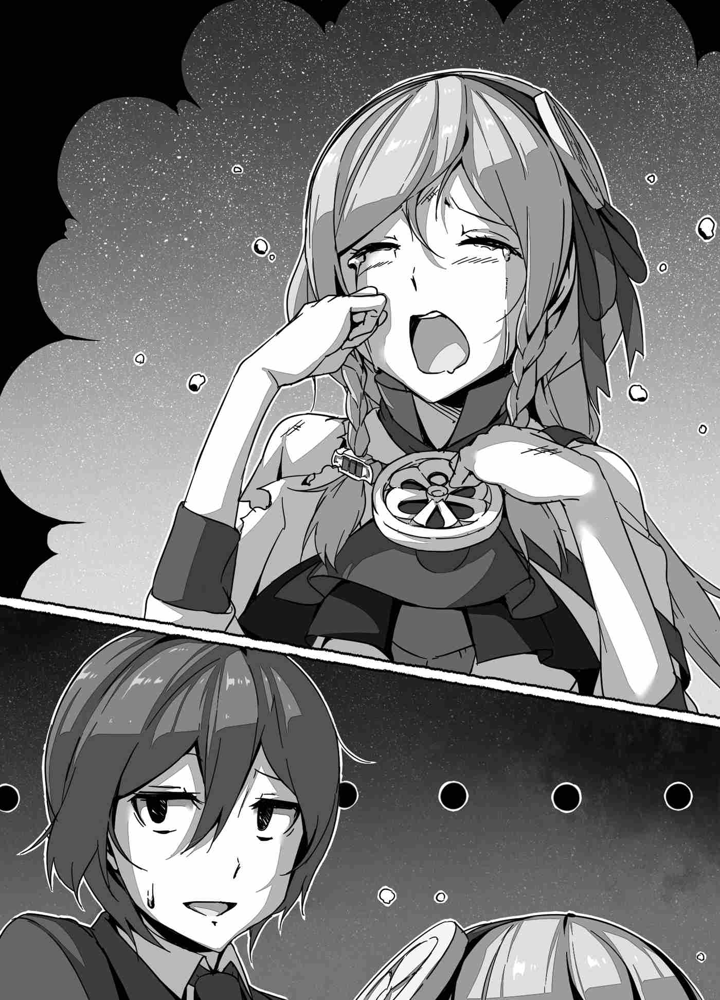

Một từ đặc biệt ở đó đã khơi dậy sự chú ý của Quốc vương.

"Automaton?"

"Vâng. Đó là một con được chế tạo tốt dưới hình dạng một kỵ binh nặng. Nó đã tấn công tôi, vì vậy tôi đã phá hủy phép thuật kiểm soát nó."

"Golem của Hiền giả Slamas, huh...?"

Quốc vương có một ý niệm về những gì đã tấn công Suimei. Con golem duy nhất trong toàn bộ lâu đài là con Slamas đã tạo ra. Tự nhiên, nếu Suimei đang nói về bộ giáp tấn công cậu, đó gần như là thứ duy nhất nảy ra trong đầu. Con golem Slamas tạo ra được chế tạo tốt, và mạnh mẽ. Nếu Felmenia đã mang thứ đó ra, nó trao cho Quốc vương một cái nhìn thoáng qua về việc cô đã trở nên ương bướng đến mức nào trước khi bị đốn gục một nấc bởi Suimei.

Tuy nhiên...

"Ta đã hỏi Felmenia câu hỏi tương tự, nhưng chẳng lẽ việc tìm đến vũ lực không phải là có phần quá nôn nóng sao?"

Cuối cùng, sự phát triển của cuộc xung đột này cảm thấy hơi phi lý. Đã có một vài cơ hội cho họ nói chuyện rành mạch. Felmenia là người đầu tiên ra tay, nhưng Quốc vương không thể không nói ra ý kiến chân thành của ngài. Và để đáp lại điều đó, Suimei nói với một biểu cảm cực kỳ nghiêm túc.

"Chắc chắn tôi không thể phủ nhận rằng mình đã phần nào bị cuốn vào khoảnh khắc đó. Tuy nhiên, tôi cũng là một người đi trên con đường ma thuật. Một ma đạo sĩ có cách xử lý công việc của một ma đạo sĩ, và khi một kẻ khoe khoang đơn thuần—không, một kẻ tự cao tự đại—thi hành bạo lực, chúng tôi là những người sẽ tìm kiếm sự trả thù. Ngoài ra, chà, tôi vẫn còn hậm hực về việc bị cưỡng ép triệu hồi đến đây và đã xả một chút hơi nực."

Cuối cùng, Suimei bật ra tiếng cười phù hợp với một cậu bé ở độ tuổi của cậu, và thấy điều đó, Quốc vương thở dài.

"...Đúng là một đứa trẻ ranh."

"Các ma đạo sĩ thường giống như vậy đấy. Chúng tôi là những sinh vật chỉ có hứng thú với những gì chúng tôi đang ích kỷ cố gắng hoàn thành. Là bình thường khi không nghĩ về những người xung quanh chúng tôi. Ngoài ra, tôi không tin Bệ hạ ở vị thế để phàn nàn sau khi nhắm mắt làm lơ trước vấn đề ngay từ đầu."

"Cậu chắc chắn có lý."

Phải, Quốc vương cũng chịu trách nhiệm cho việc nhắm mắt làm lơ mặc dù biết Felmenia sẽ làm gì. Ngài không ở vị thế để nghiêm khắc khiển trách Suimei, và nhìn vào các kết quả, cách cậu xử lý cô có thể tranh luận là hợp lý.

Nếu cậu sử dụng ma thuật của mình mà không kiềm chế, có một số lượng tội ác không đếm nổi Suimei có thể phạm phải. Nếu cậu muốn thỏa mãn sự tham lam của riêng mình, cậu có thể tự do làm vậy suốt thời gian qua. Tuy nhiên cậu đã lặng lẽ ở trong phòng của mình theo cách không làm phiền bất kỳ ai. Khi điều tra xem liệu có tác hại nào đến từ việc cậu lén lút quanh lâu đài hay không, người ta tiết lộ rằng kho báu, phòng ngai vàng, kho lưu trữ, và bất kỳ nơi nào khác có ý nghĩa vật chất đều không bị chạm tới.

Và khi nói đến bạo lực của Felmenia, có thể nói rằng Suimei đã xử lý cô một cách cảm thông. Cậu không biết mọi thứ hoạt động thế nào ở thế giới này, nhưng sau khi cô sử dụng golem chống lại cậu, không ai có thể tranh luận nếu Suimei đã giết cô trong sự tự vệ.

Suimei sau đó nhìn sang một cột tháp bên cạnh cậu. Không thể nào...

"Chuyện là như vậy đấy. Đó chỉ là sự mở rộng của việc tôi trút bỏ cơn giận của mình, vì vậy Bệ hạ cũng có thể thư giãn. Tôi không có ý định ra lệnh cho Bệ hạ làm bất kỳ điều gì khác."

Cậu đang nói với ai đó khác ngoài Quốc vương—không, không cần phải mơ hồ. Suimei đang nói chuyện với Felmenia. Cô chắc chắn ở đó, trốn đằng sau cột tháp cậu đang nhìn vào.

"..."

Felmenia bước ra từ cái bóng của cột tháp với một biểu cảm bàng hoàng. Suimei chỉ trao cho cô một ánh nhìn thoáng qua như thể cô không làm cậu hứng thú, và rồi quay lại với Quốc vương. Thấy điều này, ngài có một câu hỏi mới cho vị ma đạo sĩ trẻ.

"...Cậu đã nhận ra từ khi nào?"

"Câu hỏi ngược lại: tại sao Bệ hạ lại nghĩ rằng tôi đã không nhận ra?"

"..."

Ngài chắc chắn có lý ở đó. Suimei đã vượt qua Felmenia ở mọi bước ngoặt. Thay vì giả định cậu sẽ không nhận ra cô, sẽ là an toàn hơn khi giả định rằng cậu sẽ nhận ra.

"Suimei-dono, về điều này..."

"Tôi có thể biết mà không cần Bệ hạ nói ra. Tôi đã nghi ngờ khi Bệ hạ nói muốn nói chuyện riêng chỉ có hai chúng ta, nhưng như Bệ hạ đã nói, cô ấy là thần tử quý giá của Bệ hạ. Nếu cô ấy quan trọng với Bệ hạ đến thế, thì không phải là tôi không hiểu hành động của Bệ hạ."

"Ta xin lỗi."

Quốc vương thành thật xin lỗi. Lý do ngài để Felmenia trốn ở đó không phải vì sự bảo vệ của ngài, mà vì lợi ích của cô. Nếu Suimei biết Felmenia ở đó, có lẽ có những điều cậu sẽ không nói. Và nếu cô không có mặt, cô sẽ không bao giờ có được câu trả lời. Che giấu cô trong phòng là sự thỏa hiệp của Quốc vương. Cuối cùng, Suimei nhìn thấu qua nó, nhưng vẫn nói chuyện.

Felmenia sau đó gọi tên Suimei với một khuôn mặt tái nhạt.

"S-Suimei-dono..."

"Tôi đã nói tôi sẽ không làm gì cả, đúng không? Đừng có tái mặt đi như thế chứ. Cô thực sự chẳng được nước trống gì cả, đúng không? Nếu cô cũng là một ma đạo sĩ, thì hãy đứng thẳng lưng cho đến tận khi trên bờ vực cái chết. Chẳng phải cô là một cung đình ma đạo sĩ hay bất cứ thứ gì vương quốc này tự hào sao?"

"Auuu..."

Felmenia không nhìn đi hướng khác trước sự phê bình sắc bén như vậy, nhưng nước mắt đọng lại trong khóe mắt cô. Có vẻ cô không thể nói điều gì đáp lại điều đó. Khi Suimei đứng đó chờ câu hỏi tiếp theo của Quốc vương, ngài cắt thẳng vào nó.

"Vậy lý do cậu đang điều tra vòng ma pháp triệu hồi sau tất cả..."

Quả thực, đó là vì ý chí của cậu vẫn không thay đổi.

"Tôi tin rằng mình đã nói với Bệ hạ rằng tôi muốn trở về. Tôi có những điều tôi phải hoàn thành ở quê nhà. Ngoài ra..."

"Ngoài ra?"

"Khi Reiji và Mizuki muốn trở về, tôi sẽ chuẩn bị sẵn con đường trở về cho họ. Tôi không đồng hành cùng những người bạn tốt của mình khi họ lao vào nguy hiểm. Với tư cách là một ma đạo sĩ, đây là điều tối thiểu tôi có thể làm cho họ."

"Aha..."

Quốc vương vô tình để sự tán thưởng của ngài thoát ra khỏi đôi môi. Tự nhiên, mục tiêu của Suimei được thúc đẩy bởi mong muốn của chính cậu. Cậu muốn trở về, cậu tự mình nói vậy. Tuy nhiên, cậu cũng đang nghĩ cho bạn bè của mình. Cậu muốn trao cho họ cùng một cơ hội. Nhưng thậm chí còn ngạc nhiên hơn điều đó...

"Cậu có thể giải mã thứ đó sao?"

"Nếu có thời gian, ở một mức độ nào đó. Nó không phải là không thể."

"T-Thật sự sao...?!"

Vòng ma pháp triệu hồi dũng sĩ được cho là không thể giải mã bởi bất kỳ ai, và Suimei vừa mới đưa ra gợi ý một cách hời hợt rằng cậu có thể làm điều đó. Vòng ma pháp triệu hồi đó được truyền lại từ một thời đại bị lãng quên. Sử dụng lượng ma lực chính xác và xướng bài xướng thích hợp là tất cả những gì cần thiết để kích hoạt. Nhưng bản thân phép thuật quá khó để hiểu, và cho đến tận bây giờ không ai có thể thấu hiểu các nguyên lý đằng sau cách thức nó hoạt động. Tuy nhiên chàng thiếu niên này vừa tuyên bố rằng cậu có thể làm như vậy với một giọng điệu như thể chính cậu cũng thấy điều đó là bất ngờ.

"Tôi đã nghiên cứu về thuật gọi hồn và thuật thông linh ở một mức độ nào đó, nhưng tôi chưa bao giờ nghĩ nó sẽ nảy ra ở một nơi thế này. Nghiêm túc mà nói, nó không có lý lẽ gì cả."

Tuy nhiên, nếu đó là vận may tốt như vậy, thì...

"Tuy nhiên, nếu cậu đang nghĩ cho Reiji-dono đến mức này, tại sao cậu không nói mọi thứ với cậu ấy? Nếu cậu mở lòng với dũng sĩ, thì..."

"Tâu Bệ hạ, nếu bạn bè tôi biết về dòng máu của tôi, bất cứ khi nào chúng tôi trở về thế giới của riêng mình, nó sẽ chỉ mời gọi khả năng tai hại giáng xuống họ."

Không giữ lại điều gì, Suimei thừa nhận lý do thực sự tại sao cậu không thể nói cho bạn bè sự thật. Đó là vấn đề nguy hiểm và sự lo lắng cho sự an toàn của họ.

"Chẳng phải tất cả sẽ tốt đẹp nếu họ đơn giản giữ bí mật của cậu sao?"

"Tâu Bệ hạ, tôi không biết mọi thứ ở đây thế nào, nhưng thế giới tôi đến là một hang ổ của những kẻ trộm."

"Một... hang ổ của những kẻ trộm?"

"Vâng. Nơi tôi đến, ngay cả khi Bệ hạ giữ miệng đóng lại, chỉ việc có kiến thức đã là nguy hiểm rồi. Có những kỹ thuật để trích xuất hoặc đánh cắp ký ức của một người, và các phép thuật khiến người ta nói về ký ức của họ một cách vô thức. Khi nói đến ma thuật, số lượng các phương pháp như vậy thậm chí không thể đếm nổi. Nếu tôi bất cẩn lộ danh tính của mình ở một thế giới như vậy, không thể biết cái giá sẽ là gì. Có những kẻ điên ở bên đó những kẻ sẽ chĩa lưỡi kiếm của họ vào những người thậm chí không biết về các ma đạo sĩ."

"Con đường ma thuật ở thế giới của cậu thực sự là một thứ đáng sợ như vậy sao?"

"Vâng."

Thấy Suimei gật đầu một cách rõ ràng, một suy nghĩ nảy ra trong đầu. Nếu cậu thực sự nghĩ cho bạn bè của mình, thì dường như cậu nên thành thật với họ. Nhưng hình như điều đó không phải là một lựa chọn. Con đường ma thuật ở thế giới của Suimei đi sâu hơn vào bóng tối hơn là ở đây. Kẻ thù của họ rất nhiều, và họ dành những ngày của mình với mối nguy hiểm bị lộ luôn treo lơ lửng trên đầu họ. Sự cẩn trọng của Suimei sau đó dường như hoàn toàn hợp lý.

"Khi thời điểm đến mà họ nói rằng họ muốn trở về, tôi có lẽ sẽ phải nói với họ về điều đó, nhưng... Sau khi che giấu nó suốt thời gian qua, nó làm cho việc nói về nó trở nên khó khăn."

"Ta có thể hình dung."

Như cậu đã nói, khi cậu tiết lộ vòng tròn trở về, cậu có lẽ sẽ phải giải thích bản thân lúc đó. Và vì họ đã học ma pháp ở đây tại thế giới này, họ sẽ phải được thông báo về những nguy hiểm của việc trở về nhà với nó. Chắc chắn có một cuộc nói chuyện dài phía trước họ, nhưng nó sẽ không dễ dàng cho Suimei và cậu không vội vàng đi đến điều đó. Tất cả điều này mang một ẩn ý khác nữa, và Quốc vương nói về nó với sự thất vọng trong giọng nói của ngài.

"Điều này có nghĩa là cậu quả thực kiên quyết không đi cùng họ."

"Tôi đã nói điều gì đó tương tự trước đây, nhưng tôi không muốn hành động một cách liều lĩnh."

"Sau khi đánh bại Felmenia, ta không nghĩ nó sẽ là liều lĩnh đến thế. Ngoài ra, Suimei-dono, sự có mặt của cậu chẳng phải sẽ là một ân huệ lớn cho bạn bè của cậu sao?"

"Điều đó có thể đúng, nhưng cuối cùng, nó là không cần thiết."

"Tại sao cậu lại nói một điều như vậy?"

"Chúng tôi đã có một chút tranh cãi về điều đó trong nấc nhiệt của khoảnh khắc, nhưng Reiji không phải là một người hời hợt. Cậu ấy là tuýp người bị cuốn vào những điều điên rồ, nhưng cậu ấy luôn suy nghĩ mọi thứ thấu đáo trước khi đưa ra bất kỳ phán quyết nào, cậu ấy không bao giờ quên cẩn trọng, và ngoài ra, cậu ấy có sức mạnh đáng sợ đó của một dũng sĩ trong cơ thể mình lúc này. Tôi lo lắng cho cậu ấy cũng vô ích như việc lo lắng cậu ấy sẽ vấp phải một hòn sỏi ở bên đường vậy. Tôi không thể nói rằng cậu ấy chắc chắn sẽ thành công trong việc chinh phạt Ma Vương, nhưng tôi biết rằng cậu ấy sẽ không đơn giản chết một cách bất lực."

"Ta hiểu rồi."

Suimei không lo lắng. Cậu nói với một nụ cười trên khuôn mặt. Hơn nữa, cậu tin tưởng Reiji và Mizuki khá nhiều. Mặc dù thực tế là cậu đã làm rõ rằng cậu nghĩ Reiji nên trải qua một điều gì đó kinh hoàng một lần trong đời, cậu vẫn đang nghĩ cho cậu ấy. Cậu không ước bất kỳ điều gì xấu cho cả hai người bạn của mình. Và vì vậy Quốc vương chất vấn Suimei như thể để xác nhận điều gì đó.

"Ta sẽ lặp lại chính mình, nhưng về Felmenia..."

"Đúng như tôi đã nói trước đây, không có gì xảy ra chừng nào cô ta không nói, nhưng—chà, sao cũng được."

Với một ánh nhìn hiểu thấu, Suimei rút ra một tờ giấy màu trắng tinh khôi. Nó trông hoàn toàn bình thường ngoài thực tế là đó là một màu trắng đẹp đẽ như tuyết mới rơi, nhưng nhìn kỹ, mặt trước của nó có các chữ viết trên đó và một thứ gì đó trông như vết máu. Suimei cầm tờ giấy bằng cả hai tay như thể sắp xé nó ra.

"S-Suimei-dono?! Ch-Chờ đã—"

Khuôn mặt Felmenia tái nhạt trong chớp mắt và cô hét lên bảo Suimei thể hiện sự kiềm chế, nhưng giọng nói của cô không chạm tới cậu. Không một khoảnh khắc do dự, âm thanh của việc xé giấy lấp đầy đại điện diện kiến. Chính xác thì tai của Felmenia đã diễn giải âm thanh đó như thế nào?

Khi cô bị nuốt chửng bởi cảm xúc và ngã gục xuống quỳ gối, Suimei xé tờ giấy nhiều lần và rải các mảnh vụn xuống sàn đại điện diện kiến. Và với một cú búng tay của cậu, tất cả chúng đều bị nuốt chửng trong một ánh sáng màu đỏ thẫm và biến mất.

"À..."

"Cung đình ma đạo sĩ. Với điều này, những ràng buộc trói buộc cô không còn nữa. Hãy thể hiện sự biết ơn của cô đối với Bệ hạ cho đến ngày cô chết vì đã đặt mạng sống của ngài lên đường vì cô, hiểu chưa?"

Gạt sang một bên Felmenia, người đã ngã gục hoàn toàn bàng hoàng, Quốc vương chuyển sang chất vấn Suimei, người đang nhếch môi giễu cợt cô.

"Điều đó có ổn không?"

"Tâu Bệ hạ, Bệ hạ nói Bệ hạ muốn làm sạch hoàn toàn không khí giữa chúng ta, đúng không? Nếu bất kỳ điều gì tạo ra ác ý, đó sẽ là thứ đó. Vì vậy tôi đã chăm sóc nó. Sau tất cả, đó là một sự bảo đảm không còn được yêu cầu giữa chúng ta nữa."

Suimei mỉm cười một chút, và rồi tiếp tục.

"Tuy nhiên, tôi vẫn muốn Bệ hạ hứa không nói về điều này với Reiji và Mizuki, và không thực hiện bất kỳ hành động nào dẫn đến việc họ nhận ra nó. Tôi hy vọng mình không cần phải hỏi sự hợp tác của Bệ hạ trong điều đó, nhưng..."

"Đã hiểu. Ta sẽ làm như cậu yêu cầu."

Quốc vương chấp nhận các điều khoản của Suimei. Nếu cậu sẵn sàng nhượng bộ nhiều như vậy, thì không có lý do gì để Quốc vương từ chối. Quốc vương sau đó chuyển sang hỏi về một điều nữa ngài muốn nghe.

"Cậu sẽ làm gì sau điều này? Cho đến khi cậu có một ý niệm thô về cách trở về, ta không bận tâm nếu cậu muốn ở lại lâu đài..."

Họ là những vị khách được gọi đến thế giới này chống lại ý chí của họ, bao gồm cả Suimei. Quốc vương chấp nhận trách nhiệm của mình trong điều đó. Điều đó chỉ đứng vững với lý lẽ rằng ngài nên chăm sóc cậu bên trong lâu đài cho đến khi cậu có thể hoàn thành một vòng tròn trở về và về nhà. Điều đó, tuy nhiên, chỉ nếu Suimei muốn ở lại, đó là lý do tại sao Quốc vương phải hỏi. Và Suimei đáp lại bằng cách lắc đầu.

"Không. Sau khi Reiji và Mizuki rời khỏi lâu đài, tôi cũng đang nghĩ đến việc rời đi."

"Cậu định làm gì sau khi rời lâu đài?"

"Tôi đang nghĩ đến việc tới Đế quốc Nelferia. Đó là một điểm mấu chốt nơi ba quốc gia gặp nhau. Tôi sẽ có thể đạt được tất cả các loại thông tin và hàng hóa mà tôi cần ở đó, và tôi tin rằng đó là một vị trí thích hợp cho tôi để thiết lập."

Quốc vương stượt ra tiếng thở dài khi nghe kế hoạch của Suimei. Đúng là Đế quốc Nelferia là một giao điểm quan trọng giáp ranh với ba quốc gia bao gồm cả Astel. Thương mại chắc chắn tích cực hơn ở đó so với ở đây. Vì đó là một quốc gia đồng minh của Astel, việc đi vào sẽ tương đối dễ dàng, và có thể đạt được các hàng hóa ở đó khó tìm thấy ở những nơi khác tại Astel. Nó có lẽ là vị trí tối ưu để thu thập thông tin từ mọi hướng.

Thành thật mà nói, Quốc vương không muốn một bậc thầy cấp độ của Suimei rời khỏi đất nước, nhưng dù có như vậy, không thể dừng cậu lại khỏi việc đi. Ngay cả khi ngài có sức mạnh để làm vậy, ngài sẽ không muốn hạn chế cậu theo cách như vậy.

"Ta hiểu rồi. Vậy nếu cậu có bất kỳ nhu cầu nào, đơn giản là hãy nói ra. Chừng nào đó là điều ta có thể làm, ta sẽ ban cho cậu tất cả những gì ta có thể, mặc dù nó có thể không là gì ngoài một món quà tồi tàn đối với cậu."

Để đảm bảo cậu được tự do làm như cậu ước muốn, Quốc vương đề nghị Suimei sự hỗ trợ của ngài. Tuy nhiên, Suimei lắc đầu đáp lại.

"Tôi cảm ơn Bệ hạ vì sự cân nhắc, nhưng xin hãy đừng bận tâm đến tôi."

"Tại sao vậy? Cậu sắp mạo hiểm đi vào những vùng đất không quen thuộc. Cậu không yêu cầu một loại viện trợ nào sao?"

Suimei là một con người đến từ thế giới khác. Cậu không quen với văn hóa và phong tục của vùng đất này. Và cậu sẽ một mình. Có vẻ như cậu nên yêu cầu một loại trợ giúp nào đó, nhưng...

"Điều đó hoàn toàn ổn thôi. Từ đây, không thể chịu đựng việc sống trong lâu đài, tôi sẽ ích kỷ bỏ chạy. Và không có cách nào Bệ hạ có thể thể hiện sự khoan hồng sau một sự ô trọc như vậy, chứ đừng nói là thưởng cho loại hành vi đó. Thay vì bản thân tôi, xin hãy nghĩ đến danh tiếng của chính Bệ hạ, tâu Bệ hạ."

"Tuy nhiên..."

"Sau sự náo động nảy ra lần trước và việc tôi tự nhốt mình trong phòng, các tin đồn chỉ trở nên tồi tệ hơn. Nếu Bệ hạ hỗ trợ tôi theo sự tùy xét của riêng Bệ hạ, chắc chắn sẽ có những người khen ngợi sự tốt bụng của Bệ hạ, nhưng phần lớn mọi người sẽ lên án một hành động như vậy. Điều đó sẽ là sự bất tiện khá lớn đối với Bệ hạ."

Đúng như Suimei nói. Nếu cậu rời khỏi lâu đài, tính đến diện mạo công chúng của cậu cho đến tận bây giờ, mọi thứ sẽ đi chính xác như cậu đoán. Các tin đồn về việc cậu bỏ chạy sẽ lan rộng. Không có nghi ngờ gì về điều đó. Và nếu người ta phát hiện ra Quốc vương đang hỗ trợ cậu sau điều đó, sự bất mãn công chúng sẽ cao. Tại sao Quốc vương lại đi xa như vậy khỏi đường đi của mình để rộng lượng với một kẻ ăn cháo đá bát?

"Và... nếu ta nói rằng ta sẽ làm như vậy bất kể điều gì?"

"Tôi biết ơn sự cân nhắc của Bệ hạ, nhưng Bệ hạ đang lặp lại chính mình."

"Hừm..."

Quốc vương cạn lời trước chút khiển trách đột ngột. Suimei rất ương bướng. Cậu không bận tâm. Và cậu đang bảo Quốc vương đừng bận tâm. Nó có thể được coi là sự tự tin không có căn cứ, nhưng cậu đang thể hiện loại tinh thần đúng đắn để tựa vào một tuyên bố như vậy.

Rốt cuộc đôi mắt màu đen hướng vào Quốc vương thực sự đang nhìn vào điều gì? Điều gì đó vượt xa hơn nhiều. Ánh nhìn của cậu là ánh nhìn của một người sắp thách thức bất kỳ khó khăn nào nằm trên con đường phía trước cậu. Tính cách của cậu là không ngờ tới cho một cậu bé ở độ tuổi của cậu; nó có nhiều sức nặng hơn nhiều so với số năm của cậu gợi ý. Và rồi...

"Để sống trên thế giới, người ta sẽ luôn thấy mình bắt gặp những bức tường cản trở sự tiến triển. Cho dù chúng có rộng hay cao đến đâu, những người dễ dàng bước qua những trở ngại như vậy được gọi là các ma đạo sĩ. Tôi, Yakagi Suimei, là một trong số họ. Tôi nhảy qua những bức tường được gọi là các bí ẩn của vũ trụ. Và vì vậy, tâu Bệ hạ, tôi sẽ nói điều đó một lần nữa. Chỉ sự cân nhắc Bệ hạ thể hiện với tôi đã là quá đủ rồi; tôi sẽ khiêm tốn chỉ chấp nhận chừng đó."

Tuyên bố của Suimei là nghiêm túc, tự tin, và không để lại chỗ cho sự tranh luận. Tất cả những gì cậu có là sức mạnh, nhưng đó là sức mạnh của một cậu bé thành thật đẩy tới để phá vỡ sự bế tắc được gọi là điều không thể.

Cuối cùng, cậu thực sự là một thứ gì đó khác. Chàng thiếu niên này chắc chắn là loại người không nên bị kéo vào cuộc triệu hồi dũng sĩ. Quốc vương nín thở khi ngài nhìn chằm chằm vào cậu, nhưng Suimei sau đó phá vỡ biểu cảm nghiêm khắc của mình và nói với giọng điệu tự giễu.

"...Mặc dù tôi lên mặt như vậy, nó thực sự không phải là điều một người đàn ông từ chối đối mặt với một cuộc chiến vì sợ hãi cho mạng sống của chính mình nên nói, nhỉ?"

"Điều đó sẽ không giới hạn ở chỉ riêng cậu. Những người, khiếp sợ bởi mối đe dọa của Ma Vương, đã ép buộc mọi thứ lên những đứa trẻ vô tội cũng có thể bị buộc tội tương tự. Và điều đó bao gồm cả ta."

Thực sự, ai có quyền nói rằng sự khoe khoang của Suimei là thái quá? Chỉ có hai người nảy ra trong đầu: những người thực sự đang hướng đi để tham gia vào cuộc chinh phạt Ma Vương. Những người trốn trong sự an toàn và đặt mạng sống của chính họ lên trên hết không ở vị thế để phê bình cậu. Suimei đang ném số phận của mình để tự mình dấn thân và đứng lên chống lại mọi khó khăn sẽ đến với cậu.

Chỉ là bao nhiêu người trong số những người đã quá sẵn sàng ném ra những lời xúc phạm đã cản trở chàng thiếu niên này, người đang đẩy tới hướng tới mục tiêu chưa hoàn thành của cậu? Họ đã giữ cậu lại bao nhiêu? Quốc vương không có cách nào biết được, nhưng đó chắc chắn phải là một cú đánh nghiêm trọng. Tiếng kêu cậu đã giải phóng trong chính căn phòng này ngày hôm đó đã làm tổn thương trái tim Quốc vương.

Và những gì Quốc vương cảm thấy cho cậu lúc này là sự cảm thông nhiều như bất kỳ điều gì khác. Mặc dù họ cách xa nhau về độ tuổi đủ để là cha và con, không phải là ngài không hiểu. Và khi ngài chìm đắm trong ấn tượng kỳ lạ đó, Suimei đẩy cuộc trò chuyện tiến lên.

"Có bất kỳ điều gì khác Bệ hạ muốn hỏi tôi không?"

"Nếu cậu không bận tâm, thì..."

Nhận lời đề nghị của cậu, Quốc vương bắn ra thêm một vài câu hỏi nữa, và về nhiều thứ hơn là chỉ các ma đạo sĩ. Về cậu, về Reiji, về Mizuki, và ngay cả về sự ngốc nghếch tầm thường giữa ba người bạn.

★

Một khoảng thời gian đã trôi qua kể từ khi Quốc vương và Suimei bắt đầu trò chuyện. Khi cuộc trò chuyện đi đến một sự lắng xuống tự nhiên, Suimei đột nhiên thay đổi chủ đề.

"Liệu có ổn cho tôi hỏi một điều nhỏ nữa không?"

"Có chuyện gì vậy?"

Khi Quốc vương hỏi điều đó, Suimei quay ánh nhìn sang bên cạnh.

"Không, không phải Bệ hạ."

"Ý cậu là... ta sao?"

"Phải. Tôi có ý cô đấy. Nếu tôi nhớ không nhầm, vào thời điểm đó, cô đã nói với tôi rằng cô không có ý định giết tôi, đúng không?"

Chính xác thì họ đã nói về điều đó khi nào? Quốc vương không nhận thức được, nhưng Felmenia dường như biết.

"V-Vâng, và đó là sự thật. Ta thề với Nữ thần Alshuna."

Vì Felmenia sẵn lòng thề trên nữ thần của cô, Suimei không bận tâm hỏi lại. Cậu đơn giản gật đầu với chính mình.

"Tôi đã hơi tò mò khi cô nói điều đó, cô thấy đấy. Sau đó, tôi đã đào xới một chút xung quanh, nhưng tôi rốt cuộc đã tình cờ vấp phải một thứ thậm chí còn thú vị hơn."

"Thứ gì đó... thú vị sao?"

"Phải. Nó cũng không phải không liên quan đến cô đâu—thực ra, cô giống một nạn nhân hơn. Thế nào? Có muốn đi cùng tôi và xem qua không?"

Với nụ cười của một kẻ phản diện vừa chế tạo ra một trò quái ác sinh sự nào đó, Suimei bắt đầu giải thích vấn đề mà cậu đã điều tra một cách kỹ lưỡng.

---

[◀ Chương trước: Chương 3: Kẻ Truy Tìm Bí Ẩn - Phần 4](03_chapter_3_part4.md) | [Chương tiếp theo: Chương 4: Vì Mục Tiêu Ta Hướng Đến - Phần 1 ▶](04_chapter_4_part1.md)
