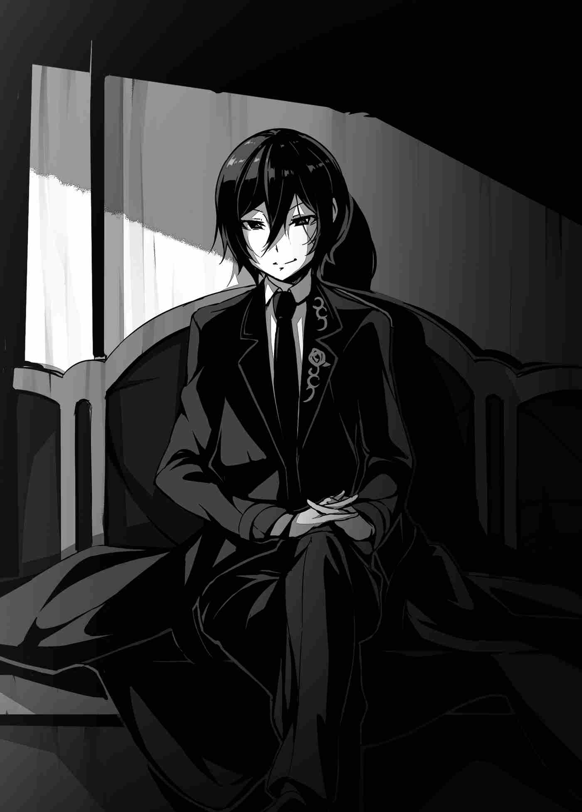

Tuy nhiên, Sebastian vẫn giữ im lặng. Y không phản ứng gì với Felmenia cả. Thấy y im lặng như vậy, Suimei chĩa một ánh nhìn lạnh người về hướng y khi cậu chất vấn y.

"Này, tại sao ngài lại chạy đến một nơi như thế này?"

"Hì... Hì hì hì..."

"Có gì buồn cười cơ chứ?!"

Nghe thấy tiếng cười giễu cợt của Sebastian, lần này chính Felmenia là người nạt lại y. Nhưng nó hầu như không chạm vào da thịt y. Y đơn giản đáp lại như thể việc nhìn thấy sắc mặt giận dữ của cô là một niềm vui đối với y.

"Ngây thơ... Ngươi quá ngây thơ, Stingray. Không lẽ ngươi nghĩ rằng ta sẽ trốn đến căn phòng này mà không có bất kỳ loại kế hoạch nào sao?"

"Cái gì?"

"Ha ha ha, ta cũng là một cung đình ma đạo sĩ! Ta có phương tiện để bứt phá qua chính một tình huống như thế này! Hãy nhìn đây!"

Nói rồi, Sebastian kích hoạt vòng tròn triệu hồi. Chỉ với một tiếng lẩm bẩm nhỏ, một ánh sáng u tối bùng ra từ vòng ma pháp dưới chân y, và một ánh sáng màu tím thẫm vô tận tràn ngập căn phòng đá thô ráp. Thấy hành động dã man của Sebastian, Felmenia rơi vào hoảng loạn.

"Ng-Ngài đang làm cái gì thế?! Đó là vòng tròn triệu hồi để gọi các dũng sĩ từ thế giới khác mà!"

"Chắc chắn là vậy rồi! Tuy nhiên, nếu nó có thể triệu hồi những thứ từ thế giới khác, thì với một vài chỉnh sửa, nó có thể mang lại nhiều thứ hơn là chỉ dũng sĩ!"

"Cái... Vậy thì ngài đang..."

Cô định hỏi y đang cố gọi thứ gì thay thế, nhưng cô nhận ra điều đó là không cần thiết sau khi thấy hành vi của y.

"Chẳng phải rõ ràng sao?! Nó sẽ là một thứ gì đó nho nhỏ để tống khứ ta khỏi lũ ranh con các ngươi!"

"Tất cả những gì ngài quan tâm chỉ là giữ lấy cái mạng cừu của mình sao?! Ngươi đã bộc lộ bản chất thật của mình rồi!"

"Đủ rồi với những lời nhảm nhí của mi, con nhóc ngu ngốc! Ảo tưởng sức mạnh chỉ vì mi có thể dùng một đốm sáng ma pháp! Chỉ như vậy thôi đã ổn rồi, nhưng dám cướp đi danh dự triệu hồi dũng sĩ từ ta, và rồi, trong tất cả mọi thứ, dám làm ta biến thành trò hề trước mặt bao nhiêu người! Hãy trả giá cho sự tủi hổ mi đã mang lại cho ta bằng cái chết của mi!"

"Câm miệng! Ngươi chẳng qua chỉ là loại rác rưởi đê tiện bị mê muội bởi danh vọng và tài lộc..."

Khi Sebastian cuối cùng cũng diễn đạt kế hoạch u tối mà y đang ấp ủ, Felmenia nhổ nước bọt đáp trả y. Thấy cô nhăn nhó với sự khinh bỉ, Suimei hỏi cô bằng một giọng tò mò.

"...Hừm? Cô không phải là người duy nhất có thể sử dụng thứ đó sao?"

"Hả? N-Không. Trong trường hợp có chuyện gì xảy ra với ma đạo sĩ chịu trách nhiệm triệu hồi dũng sĩ, tất cả các cung đình ma đạo sĩ đều được dạy phép thuật triệu hồi, với sự ban phước của Giáo hội Cứu Thế và Giáo hội Ma đạo sĩ. Nhưng quan trọng hơn, chúng ta phải ngăn hắn lại khỏi—"

Khi Felmenia bước lên phía trước để bắt đầu thi triển ma pháp của mình, Suimei đã nắm lấy cô.

"Chờ đã."

"Cái gì?! Tại sao ngài lại ngăn tôi lại, Suimei-dono?!"

Felmenia không thể hiểu tại sao cậu lại làm vậy, nên cô hỏi xin lời giải thích. Suimei làm một biểu cảm như thể câu trả lời đáng lẽ ra phải diễn ra mà không cần nói.

"Tất nhiên là tôi sẽ ngăn cô lại trong một tình huống như thế này rồi. Điều đó là rõ ràng mà."

"Có gì rõ ràng về điều đó cơ chứ?! Đó là một phép thuật triệu hồi mà hắn đã can thiệp vào! Chúng ta không biết chuyện gì sẽ xảy ra nếu nó được sử dụng đâu!"

Đó là sự thật khi phép thuật triệu hồi và vòng tròn mà Sebastian hiện đang sử dụng là những thứ y đã thay đổi. Và vì điều này không tuân theo mục đích sử dụng được quy định cho chúng, nó có thể hoàn toàn không an toàn. Trên hết, vòng tròn triệu hồi đã bắt đầu hành động. Ánh sáng phát ra bởi ma lực lấp đầy sức mạnh và trở nên mạnh mẽ hơn, và hầu như không có một giây nào để lãng phí.

Được thôi thúc bởi cảm giác cấp bách đó, Felmenia hầu như đang la gầm. Khao khát hành động nhanh chóng của cô là hoàn toàn có thể hiểu được, nhưng Suimei khoanh tay lại khi nhăn nhó với một lượng bối rối nhỏ trên khuôn mặt.

"Không, chúng ta không thể ngăn nó lại đâu. Nó đã lách tách và nổ bốp được một lúc rồi, nhưng vòng tròn triệu hồi đó dường như có một phép thuật bảo vệ khá tốt trên nó. Mặc dù nó không dường như có bất kỳ sự phòng thủ nào chống lại những gì đến từ phía bên kia, nhưng phần phòng thủ chống lại sự cản trở từ phía này dường như hoàn hảo."

Phản hồi rất kém. Suimei cũng đã cố gắng cản trở cuộc triệu hồi trong khi không ai nhìn, nhưng cuối cùng, cậu không thể ngăn nó lại.

"Cái... Ngay cả ngài cũng không thể làm được sao, Suimei-dono?!"

"Tôi có một khúc mắc với cách cô diễn đạt điều đó đấy, nhưng ngay cả khi chúng ta có thể ngăn hắn lại, việc ép hắn ra khỏi nghi thức ngay lúc này... một điều gì đó dữ dội chắc chắn sẽ xảy ra, cô thấy đấy?"

"Hả...?"

Nghe thấy lời cảnh báo đó từ Suimei, Felmenia bị đánh gục bởi một điềm báo không an lành. Từ "dữ dội" không phải là một từ đặc biệt kỳ lạ, nhưng Felmenia cảm thấy điềm xấu về việc Suimei sử dụng nó trong tình huống này. Có một sự chênh lệch đáng sợ giữa những gì cô gọi là dữ dội và những gì cậu gọi. Suimei nhìn vào cột ánh sáng, thứ đã bắt đầu cô lập mục tiêu của nó, và cố gắng giải thích.

"Thứ đó đang sử dụng cùng một vòng tròn triệu hồi được tạo ra để gọi chúng tôi đến thế giới này, nhưng đây là những gì chúng tôi gọi là một cuộc triệu hồi cuồng nổ (*berserk summoning*). Nó giống như một cuộc triệu hồi nhảy qua mặt phẳng tinh tú, hoặc thậm chí là các chiều không gian. Và khi điều đó xảy ra, vào thời điểm cuộc triệu hồi xé rách một lỗ hổng mở ra, một thứ gọi là lực đẩy được tạo ra để duy trì lỗ hổng đó. Nếu chúng ta cưỡng ép cắt đứt mọi thứ ở đây mà không cho phép cuộc triệu hồi kết thúc, lực đẩy đó sẽ không có nơi nào để đi, và nó sẽ quay trở lại ngay tại đây."

"...Nếu nó quay trở lại, chuyện gì sẽ xảy ra?"

"Để xem nào... Chà, kịch bản tồi tệ nhất sẽ là toàn bộ khu vực này bị thổi bay thành mây khói."

"N-Không đời nào."

Suy đoán của Suimei khiến Felmenia cạn lời. Cô hẳn phải đang nghĩ về những gì sẽ xảy ra nếu Suimei không giữ cô lại vài khoảnh khắc trước. Thảm họa tiềm năng không chỉ giới hạn ở họ hay lâu đài. Nó có thể là một thảm họa quốc gia.

"Chà, đó là những gì nó có nghĩa là xé rách bức tường giữa các chiều không gian. Từ góc nhìn của tôi, công nghệ lỗi thời đằng sau vòng tròn triệu hồi dũng sĩ đó làm cho một điều như vậy có thể cho một cá nhân duy nhất còn dữ dội hơn nhiều, mặc dù..."

"H-Hà..."

Tất nhiên, Felmenia đã lạc lối. Tất cả những gì Suimei nhận được chỉ là một tiếng kêu ngơ ngác từ cô.

"Chà, đừng lo lắng về cuộc triệu hồi. Vật môi giới được sử dụng chỉ là ma lực của lão già đó thôi. Bất cứ thứ gì được gọi đến bởi nó có khả năng sẽ tuân theo quy mô đó. Nó sẽ ổn thôi chừng nào không có thứ gì quá vô lý chui qua."

Suimei dừng lại một lúc trước khi tiếp tục.

"Mặc dù vậy, nếu cuộc triệu hồi thành công, chúng ta vẫn có khả năng nhìn thấy một phần của lâu đài bị đập nát thành từng mảnh nhỏ."

"Đ-Điều đó không thể nào! Vẫn còn rất nhiều người trong lâu đài..."

Ngay khi Felmenia chuẩn bị nói điều gì đó về cuộc khủng hoảng đang ập đến, như thể ngắt lời cô, cột ánh sáng màu tím dội lại vòng tròn triệu hồi trở nên mạnh mẽ một cách đáng kinh ngạc.

"Nó đến rồi!"

"Á-Á!"

Felmenia nhắm mắt lại trước dòng thác ánh sáng dâng trào và kêu lên trong sự ngạc nhiên giật mình. Có lẽ vì cô mất đi giác quan trong một khoảnh khắc do sóng năng lượng và ánh sáng, điều tiếp theo cô biết, cô đã được ôm chặt bởi cánh tay trái của Suimei.

"Á..."

Khi cô ngước nhìn lên, cô có thể thấy Suimei đang nhìn vào thứ gì đó với một nụ cười lạnh lùng và thản nhiên. Bầu trời xanh trải rộng đằng sau cậu. Có vẻ như đúng như cậu đã nói. Một phần của lâu đài, bao gồm cả phòng nghi lễ, đã bị xóa sổ. Và phía dưới cô...

"Sức mạnh đã thoát lên phía trên. Với điều này, không nên có bất kỳ thiệt hại nào cho phần còn lại của lâu đài ngoại trừ căn phòng này. Ngoài ra..."

"Á?! Á Á Á!"

Nhận thấy thật kỳ lạ khi Felmenia đột nhiên bắt đầu làm ầm ĩ trong vòng tay cậu, Suimei trao cho cô một ánh nhìn khó hiểu.

"Có chuyện gì thế?"

"B-Bay! Chúng ta đang bay!"

Ngay giữa bầu trời xanh stare xuống mặt đất, Felmenia tung ra một tiếng shrieking ngạc nhiên. Hai người bọn họ quả thực đang bay vào lúc này. Suimei đã triển khai ma thuật phi hành (*Flight Magicka*), và đang bế Felmenia theo cùng cậu. Một đốm sáng ma lực có thể được nhìn thấy phân tán từ đôi chân của Suimei. Đó là hình dạng của sức mạnh đã treo hai người bọn họ trên không trung. Suimei hành động như thể đây không là gì, nhưng Felmenia suýt mất đi tâm trí trước cú sốc khi nhìn thấy nó.

"C-Cái gì?! Rốt cuộc đây là thứ gì?!"

Nghe thấy sự bối rối của cô, Suimei đã đoán được Felmenia đang nói về điều gì.

"Ồ, tôi hiểu rồi. Không có ma thuật phi hành ở đây, phải không? Tôi tưởng việc học bay sau khi có khả năng sử dụng ma lực khá nhiều là điều đầu tiên mọi người làm chứ, mặc dù..."

"M-Quan trọng hơn, Suimei-dono...!"

"Tôi nói với cô là ổn mà. Chúng ta sẽ không rơi đâu, nên hãy bình tĩnh và ôm chặt lấy tôi."

"Ô-Ôm chặt sao?! Vào một vị quý ông?! Tôi không thể... N-Không, ý tôi là—"

Và ngay khi Felmenia chuẩn bị cầu xin Suimei thả cô xuống vì cô sợ độ cao, một giọng nói vang lên từ ngay phía dưới họ, một giọng nói quá đỗi ghê tởm đến mức nó hầu như không giống như có thể đến từ thế giới này. Đó không phải là một âm thanh đe dọa sẽ làm nổ màng nhĩ của ai đó, mà đúng hơn là một âm thanh trực tiếp tấn công họ. Theo sau nó, ánh sáng xung quanh vòng tròn triệu hồi tháo gỡ ra như một bức màn mỏng. Và những gì được tiết lộ là...

"Ư, ơ..."

Đó là một thứ gì đó giống như một con quái thú bốn chân kỳ dị và khổng lồ được tô điểm bởi những cái bóng sẩm tối và một màu đỏ máu. Nơi phòng nghi lễ từng tồn tại cũng như xung quanh nó giờ đây bị nuốt chửng bởi cái bóng của nó. Nó đứng dễ dàng cao bằng một nửa ngọn tháp lâu đài, và hình dáng của nó giống như một con chó hay con sói đang chết đói. Xung quanh cơ thể nó là những dải bóng tối đang quất quanh.

"Chà, không ngờ nó lại là một cấp B... Xem ra chúng ta đã bắt được một con to đấy, hử?"

"C-Cái gì? Con quái vật đó...?"

Mặc dù không có sự bình tĩnh để hỏi cậu về nó một cách đàng hoàng, Felmenia đơn giản staring vào con quái vật với đôi mắt mở to. Câu trả lời duy nhất của Suimei là lẩm bẩm một từ được chọn như thể cậu đang nói một nụ cười giễu cợt.

"Một con quái thú (*A beast*)."

"...Suimei-dono, ngài có biết thứ đó là gì không?"

"Phải. Đó là một thứ đến từ thế giới của tôi, dù sao thì."

Một thứ đến từ thế giới của Suimei. Nghe thấy sự thật đáng sợ đó, Felmenia nhớ lại điều gì đó khiến cô nghi ngờ nó.

"Từ thế giới của ngài sao? Nhưng Ngài Dũng sĩ và Ngài Mizuki đã nói không có quái vật ở đó..."

"Điều đó chỉ cho thấy tầm nhìn của họ hẹp nòi đến thế nào thôi. Họ không có cách nào biết được vì họ đã bị quáng mắt bởi những sự phát triển của khoa học. Khi nói đến những thứ như quái vật, thế giới của chúng tôi có thừa quá nhiều."

"..."

Trong khi Felmenia nhìn Suimei và con quái thú trong sự bàng hoàng, cậu tiếp tục giải thích thêm.

"Và đó là một trong số chúng. Giống như cô có các ma quỷ làm khổ nhân loại ở đây, ở thế giới của chúng tôi, có những hệ thống đóng vai trò như kẻ thù của nhân loại."

"Hệ-hệ thống sao?"

"Đúng vậy. Những con quái thú của khải huyền (*The beasts of the apocalypse*). Ở thế giới của chúng tôi, chúng được biệt danh là **Apparition** (Biến thể Hoàng hôn / Ma thú Khải huyền). Để chứng minh cho các sinh thể ở thế giới của chúng tôi thấy rằng không có thứ gì gọi là vĩnh cửu, chúng là những quy luật tăng tốc thế giới về phía kết thúc của nó."

"Q-Quy luật sao? Ý ngài là thứ đó không phải là một sinh thể sống?"

"Để xem nào... Không, không hẳn. Đó không phải là một sinh thể sống; đó là một hiện tượng. Giống như sấm sét hay vòi bão. Chừng nào các yêu cầu được đáp ứng để nó tồn tại, nó sẽ xuất hiện. Đó là một trong những quy tắc của thế giới. Lý do nó mang hình dáng của một sinh thể sống là vì dễ gieo rắc nỗi sợ hãi vào con người hơn bằng một hình thái vật chất... Đó là những gì vị thủ lĩnh đã nói, nhưng, chà, tự mình nhìn xem. Chẳng phải thứ đó chỉ khơi gợi nỗi khiếp đảm trong cô sao?"

Đi theo ánh mắt của Suimei, Felmenia nhìn kỹ vào con quái vật—không, thứ được gọi là Apparition. Thông tin được truyền đến bộ não của cô từ đôi mắt cô quả thực có hiệu ứng đó. Chính vẻ ngoài của nó đang kích hoạt một nỗi sợ hãi không thể diễn tả chạy dọc sống lưng cô. Đó là bản năng, và những chiếc chuông báo động đang vang lên khắp cơ thể cô.

"Hội chứng hoàng hôn (*Twilight syndrome*). Ở thế giới của chúng tôi, nó không tấn công con người một cách bừa bãi, nhưng giống như vậy, nó đưa thế giới đi xuống một con đường xác định để trở thành không gì hơn ngoài thần thoại."

Giọng điệu của Suimei rất thản nhiên, nhưng ánh mắt của cậu truyền tải một cảm giác khó chịu khiến Felmenia rùng mình. Thế giới mà họ triệu hồi Dũng sĩ cứu thế từ đó lại bị quấy phá bởi những thứ như thế này sao? Đó là một sinh thể mà, chỉ bằng cách nhìn vào nó, đã khơi gợi nỗi khiếp đảm thuần túy vượt xa nỗi sợ hãi cảm nhận được trước sự xuất hiện của bất kỳ con quái vật nào. Nếu thứ đó là tiên phong của sự kết thúc thế giới, thì thế giới của Suimei rất có thể đang gặp nguy hiểm hơn thế giới của cô nhiều.

Felmenia nuốt ực một cái.

Nghe lời giải thích của Suimei, cô chỉ có thể stare vào con quái thú với một sự cố định kỳ lạ. Và rồi...

"KHÀ HA HA HA HA HA! Ngươi thấy chưa?! Nếu ngươi biết cách sử dụng nó, triệu hồi chỉ là trò chơi trẻ con! Một con nhóc ranh như mi không phải là người duy nhất có khả năng làm điều đó đâu, Stingray!"

Tiếng cười thô giáp, khó chịu vang vọng qua không trung. Say sưa bởi thực tế là cuộc triệu hồi của y đã thành công, Sebastian dường như quá cuốn vào sự phấn khích của chính mình để đưa ra bất kỳ phán quyết hợp lý nào liên quan đến Apparition. Ngay cả khi y quản lý cuộc triệu hồi, y cũng vô giá trị trong trạng thái này. Nghe thấy người đàn ông đó thốt ra tiếng cười tự mãn và say sưa của y, Suimei đảo mắt mặc dù có sự hiện diện của Apparition.

"Chà, đúng là một câu thoại dập khuôn đáng kinh ngạc."

"Cứ giễu cợt khi mi còn có thể đi, con nhóc ranh! Tiếp theo mi sẽ bị giết dưới tay con quái vật ta đã triệu hồi!"

Sebastian gầm lên, nhưng Suimei chỉ có thể lạnh lùng phủ nhận bài phát biểu tự hào nhỏ bé đó của y.

"Ồ, điều đó sẽ không xảy ra đâu."

"Thật là một kẻ thua cuộc cay cú! Đi đi, quái vật đến từ thế giới khác! Hãy xé xác kẻ thù của ta thành từng mảnh!"

Sebastian đưa ra mệnh lệnh của y, nhưng Apparition vẫn giữ nguyên như cũ và không cho thấy dấu hiệu phản ứng nào với y cả.

"Cái..."

"Cô thấy chưa?"

"T-Tại sao?! Tại sao ngươi không nghe lời ta?! Tại sao ngươi không tuân lệnh ta?!"

Với việc Sebastian nồng nhiệt phàn nàn ở bên cạnh nó, Apparition chĩa những ánh sáng màu đỏ thẫm nó có cho đôi mắt xuống y như thể đang cau mày trước thứ gì đó đáng ghét.

"Éc, ơ..."

Và có lẽ Sebastian cuối cùng cũng nhận ra sự điên rồ mà chính y đã tác giả. Stare lên Apparition, y chìm xuống sàn nhà. Và rồi...

"Ư-Ư Á Á Á Á Á Á Á Á Á!"

Tiếng kêu chết chóc của Sebastian đã bị đè nén thành sự im lặng bởi Apparition.

"Thật ngu ngốc..."

Từ trên bầu trời, Felmenia cộc lốc lẩm lẩm suy nghĩ của cô liên quan đến Sebastian. Ngay cả khi y là loại rác rưởi tồi tệ nhất, cô vẫn tội nghiệp y vì đã gặp phải kết cục của mình theo một cách như vậy. Nhưng dù vậy, cô sẽ không tha thứ cho y vì những gì y đã làm. Cô sau đó lại quay sang Suimei để tìm câu trả lời.

"Suimei-dono, tại sao nó lại không tuân lệnh hắn?"

"Hừm? Ồ, đó là của vòng tròn triệu hồi—chà, nền tảng hoàn toàn khác nhau, nhưng các phần của nó giống chặt chẽ với những phần ở thế giới của chúng tôi. Nói ngắn gọn, các phép thuật và vòng tròn triệu hồi về mặt căn bản là các kỹ thuật có sức mạnh sử dụng một hợp đồng làm tiền đề để đưa sinh thể được gọi đến vào sự phục dịch. Cho dù đó là một hiện tượng hay một sinh thể sống hay bất cứ thứ gì khác, nó bình thường làm bất cứ điều gì được yêu cầu mà không có câu hỏi—nó giống như vậy ở thế giới này nữa, phải không?"

"Đúng vậy. Tôi không biết về trường hợp của các hiện tượng, nhưng điều đó nói chung mô tả cách các phép thuật triệu hồi hoạt động ở thế giới này."

Ngay cả khi Felmenia không thể nói như vậy với 100 phần trăm sự chắc chắn, đó đúng như những gì Suimei đã nói. Các nguyên tắc phần lớn là giống nhau. Các phép thuật triệu hồi của thế giới này, ngoại trừ cuộc triệu hồi dũng sĩ, chủ yếu triệu hồi các sinh thể bị ràng buộc bởi sự phục dịch.

"Triệu hồi, gọi hồn, thỉnh cầu, nhập hồn. Trong bốn phân loại của phép thuật triệu hồi, thứ đó sẽ rơi vào loại gọi hồn. Nhưng có một điểm vướng mắc. Mục đích chính của vòng tròn triệu hồi đó là triệu hồi dũng sĩ. Đó là lý do tại sao nó không bao gồm phần cần thiết để ràng buộc sinh vật được triệu hồi vào sự phục dịch."

"Nó không có sao?"

"Một dũng sĩ nô lệ không thực sự là loại hình ảnh mà hầu hết mọi người hướng tới, phải không? Ngoài ra, hãy thử nhớ lại xem. Hình tam giác trong vòng tròn đã được sắp xếp lộn ngược, phải không?"

"Bây giờ ngài nhắc đến nó, nó chắc chắn là như vậy."

"Điều này áp dụng cho ma thuật cũng giống như hầu hết bất cứ thứ gì khác, nhưng khi một thành phần bị đảo ngược, khía cạnh mà thành phần đó chi phối cũng sẽ bị đảo ngược. Vì hình tam giác trong một vòng tròn triệu hồi là thứ chi phối sự ràng buộc, hướng mặc định của nó đại diện cho sự phục dịch, và sự đảo ngược của điều đó sẽ là sự giải phóng. Nói cách khác..."

"Thứ đó đã được giải phóng vào thế giới này sao?"

"Ừm. Chà, tôi không thực sự có thể hình dung thứ đó tuân theo bất kỳ điều gì một con người phải nói dù sao."

"Th-Thế thì một phép thuật để đưa nó vào sự kiểm soát..."

"Không có đâu."

Felmenia không có lời bác bỏ nào dành cho tuyên bố của Suimei. Vì cậu đã đi xa hơn nhiều trên con đường ma thuật so với cô, cô sẵn sàng tin lời cậu về điều này. Nhưng nếu họ không thể đưa nó vào sự kiểm soát, thì...

"Hỡi Ngọn Lửa. Ngươi mang bản chất của mọi ngọn lửa, nhưng hãy bùng cháy không bị ràng buộc bởi quy luật của tự nhiên. Giờ đây, hãy biến mọi thứ tồn tại thành tro bụi, tai họa màu trắng của chân lý! *Truth Flare (Chân Lý Bộc Hỏa)!*"

Vẫn được giữ bởi Suimei, Felmenia vươn cánh tay cô ra, dệt nên phép thuật của cô, và giải phóng ngọn lửa màu trắng ma thuật của cô. Cô đổ lượng ma lực tối đa cô có thể vào nó. Đó là một đòn đánh không hề kém cạnh đòn cô từng dùng để đánh bại con quái vật đó trong sa mạc. Cột lửa khổng lồ và chói lọi đánh trúng Apparition với một tiếng gầm cuồng nhiệt, nhưng...

"N-Nó không có tác dụng..."

"Ồ, e là không rồi."

Khoảnh khắc Felmenia tưởng rằng ma pháp của cô sắp thiêu rụi Apparition, ngọn lửa màu trắng biến thành các hạt và biến mất. Apparition hoàn toàn không hề bị tổn hại. Trông như thể chưa từng có chuyện gì xảy ra cả. Toàn bộ sức mạnh của cô bị phủ nhận hoàn toàn. Cô không thể đánh bại nó. Đối mặt với thực tế đó, trái tim của Felmenia bị bóp nghẹt bởi sự hoảng loạn và sợ hãi.

"Chúng ta có thể làm gì chống lại thứ đó...?"

"Chẳng phải rõ ràng sao? Chúng ta sẽ đập nát đầu nó."

Tất cả những gì Felmenia có thể nghe thấy là sự dũng cảm nam tính.

"M-Ma pháp hoàn toàn không có tác dụng, ngài biết đấy?! Rốt cuộc làm sao—"

"Ma pháp ở đây thì không. Nhưng ma thuật tôi biết lại là một thứ hoàn toàn khác!"

Và với điều đó, giống như lần trước, Suimei bắt đầu ngâm xướng một bài chú bằng một ngôn ngữ mà cô chưa từng nghe qua trước đây.

"Bầu trời cao xanh thẳm nhuộm vạn vật trong ánh sáng trong trẻo hoàn hảo của nó."

Nó bắt đầu ngay khoảnh khắc Suimei bắt đầu ngâm chú. Dưới chân cậu, mặc dù không có gì để vẽ lên, một vòng tròn ma thuật màu xanh lam khổng lồ trải rộng ra giữa không trung. Theo sau đó, thế giới bắt đầu rung chuyển, và một tiếng kêu như tiếng kim loại bị cưỡng ép vặn xoắn nuốt chửng khu vực.

Những vật thể giòn không thể chống chịu được sức mạnh đang cuộn trào trong không khí sụp đổ, biến thành bụi mịn, và bị kéo lên không trung, bị nuốt chửng bởi vô số tia sét màu xanh lam rực rỡ được tạo ra bởi dòng thác ma lực đang gầm tháo và giảm xuống thành không gì cả.

Thế giới tiếp tục rung chuyển vô tận, và tiếng kêu của đại địa cùng tiếng reo hò crackling của tia sét tán dương nó cũng vậy. Bài chú tiếp tục từ đó.

"Đường chân trời vô hình nơi biển và trời hòa làm một. Chỉ trong khoảnh khắc thời gian này, ranh giới đó nằm trong tay ta."

Chẳng mấy chúp, như thể bị thu hút bởi nhiều vòng tròn ma thuật, quang phổ màu xanh lam lấp đầy bầu trời hội tụ trong tay Suimei, và cậu giữ nó ra như một lưỡi đao. Như thể màu xanh lam thu thập trong tay cậu đã bị hút ngay ra khỏi bầu trời, một phần của bầu trời rơi vào bóng tối như thể đó là đêm đen. Và rồi...

"Hãy xé rách bầu trời xanh. Tên của nó là bầu trời xanh chói lọi!"

Suimei vung tay phải xuống một cách mạnh mẽ khi cậu ném xuống dòng cuối cùng của bài chú của mình.

"*Azure Engraved Beheading (Thương Không Trảm)!*"

Những từ cuối cùng đó thốt ra như một lời tuyên bố về vết chém được tạo ra bởi thanh đao màu xanh lam, Azure Engraved Beheading. Giống như Starfall, thuộc tính của nó là hư không. Nó sử dụng tất cả những gì tồn tại trong hư không làm sức mạnh. Nếu Starfall là ma thuật tinh tú, thì Azure Engraved Beheading là ma thuật bầu trời. Vòng tròn ma thuật được phân loại là triển khai diện rộng cũng như hội tụ đa tầng, một sự kết hợp của số học Kabbalah và ma thuật thời tiết, một sự dung hợp khác của hai hệ thống.

Và với phép thuật của cậu hoàn tất, Suimei vung màu xanh lam trong tay phải của cậu. Ánh sáng màu xanh lam giống hệt như ánh sáng của một bầu trời xanh trong trẻo hoàn hảo, nhưng tạo thành một lưỡi đao khổng lồ để lại một dải cực quang màu xanh lam vệt đằng sau nó. Đúng như tên gọi của phép thuật ám chỉ, Apparition khổng lồ ngay lập tức bị chém đứt đầu.

Cực quang màu xanh lam phủ nhận hoàng hôn.

Khi bị chém đứt, Apparition quẫy đạp trong nỗi đau không định hướng. Và chẳng mấy chúp, trong cơn hấp hối của cái chết, nó phát ra một tiếng gầm lạnh người và bắt đầu co giật liên tục.

"Và thế là xong."

Kết thúc với ma thuật của mình, Suimei từ từ và an toàn hạ cánh từ trên bầu trời, đáp xuống trước mặt Apparition và thả Felmenia xuống khỏi tay cậu.

"Rồi đấy, không sao nữa rồi."

"Á..."

Một khi cậu đặt cô đứng trên đôi chân mình, Suimei bắt đầu chỉnh lại quần áo cho cô như thể đó là điều hoàn toàn tự nhiên. Thấy phía tử tế, quan tâm này ở Suimei một lần nữa làm Felmenia cảm động. Cậu đã làm điều gì đó tương tự cho cô một lần trước đây, và đó là một hành động hào hiệp. Cậu phần lớn là ích kỷ và bộc bạch ngoài ra, đặc biệt là xung quanh cô, nhưng đây là bản chất thật của cậu sâu thẳm bên trong. Đó dường như là sự mâu thuẫn vốn có trong bản dạng của cậu. Cậu đã bỏ rơi Dũng sĩ và Mizuki, nhưng đang làm việc chăm chỉ để tìm cách giúp họ trở về nhà. Và giống như bây giờ, cậu đã hành động để tự cứu mình, nhưng cậu cũng đã cứu Felmenia.

---

[◀ Chương trước: Chương 4: Vì Mục Tiêu Ta Hướng Đến - Phần 1](04_chapter_4_part1.md) | [Chương tiếp theo: Chương 4: Vì Mục Tiêu Ta Hướng Đến - Phần 3 ▶](04_chapter_4_part3.md)
