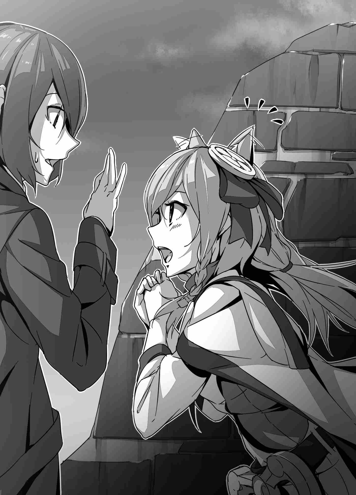

Cô ngước nhìn lên. Apparition mà Suimei đã đánh bằng ma thuật giờ đây đang sụp đổ thành từng mảnh nhỏ. Những gì ấn tượng nhất của ma pháp của cô thậm chí không làm trầy xước con quái thú, nhưng nó đã bị hạ gục ngay lập tức bởi ma thuật của Suimei—một kỳ tích không thể tưởng tượng nổi với kiến thức của thế giới này.

Cuộc chiến của họ ở Khu vườn Tường Trắng, bay qua không trung, hiện tượng được gọi là Apparition, các kỹ thuật kết hợp nhiều loại ma thuật thành một. Mọi thứ mà cô đã chứng kiến giống như một trải nghiệm bước ra từ một giấc mơ.

"Đây là... Đây là những gì một ma đạo sĩ có thể làm sao...?"

Nhìn Suimei từ phía sau khi cậu tiến lại gần Apparition, cô vô tình lại lẩm bẩm một mình.

"Vậy đây chính là ma thuật?"

Không phải bằng phương tiện chỉ xướng chú, không phải bằng phương tiện sức mạnh của các Nguyên tố, mà bằng cách sử dụng sức mạnh của chính mình và sức mạnh của xung quanh để khám phá các quy luật của mọi sáng tạo và biến điều đó thành ma thuật. Đó là ma thuật của thế giới Yakagi Suimei—không, đó là ma thuật (*magicka*).

Nếu đây cũng là những bí ẩn mà con người có thể nắm giữ... Nơi mà cô đã ở, những người cô đã cạnh tranh cùng, những người cô đã giành chiến thắng—thế giới này sau cùng rất nhỏ bé, phải không? Phải chăng mọi thứ cho đến thời điểm này chỉ là một điều tầm thường?

Đột nhiên, Suimei quay người lại. Không có sự ngán ngẩm hay sự không sợ hãi trên khuôn mặt cậu. Nếu người ta nói một cách hình tượng, đó là khuôn mặt của một người đàn ông không cần phải thách thức.

"Chẳng phải tôi đã nói với cô rồi sao? Tôi là một nhà nghiên cứu các bí ẩn. Mục tiêu của các ma đạo sĩ ở thế giới này chỉ đơn giản là thi triển ma pháp mạnh bằng cách chỉ ngâm xướng một phép thuật, nhưng chúng tôi thì khác. Mục tiêu của các ma đạo sĩ ở thế giới của tôi là giải mã tất cả các quy luật của vũ trụ và làm cho bản thân chúng tôi trở nên toàn năng. Phải, để chúng tôi có thể vượt qua bất kỳ điều gì và mọi thứ. Cách suy nghĩ căn bản của chúng tôi khác với các ma đạo sĩ các cô."

"Và điều này... tất cả đều áp dụng cho ngài sao, Suimei-dono?"

"Đúng vậy. Tôi chắc chắn sẽ chạm tới chân lý của ma thuật, và hoàn thành nguyện vọng mà cha tôi đã không thể làm được. Đó là lý do tại sao—"

Apparition sụp đổ thành không gì cả. Nó quá khổng lồ và tỏa ra một cảm giác tuyệt vọng áp đảo như vậy, thế nhưng nó đã bị đánh bại một cách dễ dàng.

"Tôi chắc chắn sẽ chứng minh rằng mình có thể trở về thế giới của mình. Và rồi tôi sẽ chứng minh rằng mình có thể nắm giữ **Hồ Sơ Akashic** (*Akashic Records*)."

And so giọng nói kiên quyết của vị ma đạo sĩ chiến thắng đã đưa ra một tuyên bố như thể thề thốt với điều gì đó không thể nhìn thấy, và hạ màn xuống cuộc chiến này.

★

Sau khi tiêu diệt Apparition được triệu hồi bởi Sebastian bằng một phép thuật duy nhất, Suimei bắt đầu nhìn quanh những gì còn lại của căn phòng.

"Hàaa... Đúng như mình nghĩ, nó hoàn toàn mất sạch rồi."

Do tác động từ việc Apparition được triệu hồi và việc nó dậm chân xung quanh, không còn chút dấu vết nào còn lại của phòng nghi lễ như trước đây. Điều đó có nghĩa là thứ Suimei đang tìm kiếm cũng không có ở đó.

Những gì cậu hy vọng tìm thấy là vòng tròn triệu hồi đã mang cậu đến thế giới này. Nó không được nhìn thấy ở đâu cả. Lý do duy nhất cậu không quá thất vọng về điều đó là vì cậu đã hoàn thành việc chép lại nó. Cậu đã chép nó xuống đến tất cả các chi tiết nhỏ nhất, nên không cần phải đau buồn trước sự mất mát của bản tham khảo. Tất nhiên, những gì cậu có không thể so sánh với bản gốc, thứ được kết nối với phía bên kia. Tuy nhiên, ngay cả khi không có nó, cậu tin rằng mình sẽ giải quyết được bằng cách nào đó.

Nhưng khi cậu tìm kiếm khu vực để tìm dấu vết của nó, Suimei đã tìm thấy một thứ khác. Cụ thể là người đàn ông mà cậu trước đây nghĩ rằng đã bị đè bẹp bởi Apparition.

"...Gắn đó đéo chết. Hắn có cái may mắn của quỷ dữ. Nghiêm túc luôn."

Quả thực, đó là Cung đình Ma đạo sĩ Sebastian Kran. Mặc dù Apparition đáng lẽ ra phải giẫm lên y, y dường như đã quản lý để chui vào các kẽ hở trong đống đổ nát để tự cứu mình. Y không vẻ như bị thương nghiêm trọng. Y chỉ đơn giản là bất tỉnh.

Suimei để mặc vị cung đình ma đạo sĩ kẻ đã gây ra tất cả sự ầm ĩ này nằm ngửa trên sàn nhà bất tỉnh, và đơn giản nhún vai. Ngay cả khi y bị để lại một mình, y sẽ không gây ra thêm rắc rối nào nữa. Vào lúc y tỉnh dậy, y có khả năng đã ở bên trong một kle tàng ngục rồi.

Và rồi quyết định rằng không còn gì cho cậu trong đống đổ nát nữa, Suimei quay sang Felmenia. Khi cậu làm vậy...

"S-Suimei-dono..."

Felmenia đang hơi ửng hồng đôi má.

"...?"

Cô sau đó đột nhiên bước tới bên cậu, kéo tay cậu vào ngực mình, và nắm chặt lấy nó bằng cả hai tay. Rốt cuộc chuyện gì đang xảy ra với cô vậy?

"Ư-Ừm, Cô Ma Đạo Sĩ...?"

"Không cần phải khiêm tốn như vậy đâu ạ. Xin ngài hãy gọi thần là **Menia**, Suimei-dono."

"Hả? Hả...?"

Lắc đầu qua lại, Felmenia xin Suimei gọi cô bằng một biệt danh với khuôn mặt đỏ bừng. Suimei không thể che giấu sự bối rối của mình trước sự thay đổi thái độ đột ngột của cô. Tuy nhiên, như thể cô bị cuốn đi bởi niềm đam mê, Felmenia tiếp tục nói.

"Phép thuật tuyệt vời mà ngài đã sử dụng để đánh bại Apparition vừa rồi... Thần hoàn toàn kinh ngạc và thán phục."

"Chắc rồi... Cảm ơn."

"Thần thậm chí không thể diễn tả lòng biết ơn của mình đối với ngài vì đã cất công giải quyết những thất bại từ sự bất tài của thần như thế này."

"Phải, chắc rồi, nhưng không cần phải quá lịch sự như vậy đâu. Đúng hơn là, ừm... có chuyện gì không ổn sao?"

Thấy mình rơi vào vị trí đột ngột và khó hiểu khi được trút lên những lời khen ngợi, giọng nói của Suimei vỡ ra khi cậu nói. Có chuyện gì với cô vậy? Thấy cô đột nhiên mang một thái độ trang trọng như vậy là một điều gì đó đáng lo ngại. Mặt khác, cậu không thể biết liệu Felmenia có nhận ra cậu hoàn toàn bối rối trước hành vi của cô hay không.

"Không, ừm... Nói ra thành lời sẽ khiến thần có chút tự giác..."

"?"

Đôi má của Felmenia lại càng đỏ hơn nữa. Cô rõ ràng đang tưởng tượng điều gì đó, và ngượng ngùng tại chỗ khi làm vậy. Ngay giữa tất cả những điều này...

"Có ai ở đó không?!"

Từ một khoảng cách, một giọng nói lớn gọi về phía họ. Suimei không nhận ra nó. Khi cậu quay lại nhìn xem đó là ai, cậu bắt gặp hình dáng của một vài người lính lâu đài đang chạy tới. Sau khi nhìn thấy thảm họa... Hay đúng hơn, sau khi nhìn thấy thảm họa dịu đi, họ rất có thể đang đi tới để điều tra. Nhìn họ, Suimei gọi Felmenia bằng một giọng lo âu.

"Ách, xin lỗi về điều này, nhưng..."

"Vâng. Thần hiểu hoàn toàn. Sẽ tốt hơn nếu thần không thông báo cho họ rằng ngài đã xử lý chuyện này, đúng không ạ?"

"Phải."

Sau khi Felmenia đoán đúng những gì Suimei muốn nói với những từ ngắn gọn của cậu, Suimei gật đầu lại với cô khi cô ngay lập tức lao vào hành động.

"Đã rõ. Như ngài muốn, Suimei-dono."

Với điều đó, biểu cảm của Felmenia chuyển sang một biểu cảm uy quyền trong một khoảnh khắc, và cô xử lý những người lính đang chạy tới.

"Vất vả cho các anh rồi."

"Ngài Bạch Hỏa! Ưm, cảnh tượng thảm khốc này rốt cuộc là gì vậy ạ?"

"Chà, chỉ vừa mới đây thôi, Sebastian-dono đã phát điên và gây ra một sự quấy rối. Ta đã xử lý mọi chuyện ở đây rồi."

Felmenia đưa ra một lời giải thích ngắn gọn mà không có bất kỳ thông tin không cần thiết nào. Có vẻ như cô sẽ có thể xử lý việc này một cách thích hợp. Một trong những người lính sau đó đột nhiên nhìn về phía Suimei.

"Đó là, nếu tôi không nhầm, người của Ngài Dũng sĩ..."

"Ách, phải. Suimei-dono tình cờ ở trong khu vực này. Đó là tất cả những gì ngài ấy liên quan đến việc này."

"Ra là vậy sao?"

"Sebastian-dono đang nằm trên sàn nhà đằng kia. Vì chúng ta không biết liệu hắn có cố gắng làm gì thêm khi tỉnh dậy hay không, hãy bắt giữ hắn ngay bây giờ khi các anh có cơ hội."

"Đã rõ."

"Xin lỗi về việc này."

Hóa ra Felmenia khá có khả năng. Cô nhanh chóng chấm dứt chính cuộc trò chuyện mà Suimei đang cố gắng tránh, và khéo léo lướt qua nó khi cô thay đổi chủ đề. Hầu như không có một cái bóng nào của cô gái vụng về và bất tài mà cậu từng thấy ở cô trước đây. Cậu thành thật mà nói khó xử lý sự chênh lệch, nhưng nếu đây là cách cô bình thường mang bản thân mình ra công chúng, cậu có thể hiểu tại sao mọi người đều xem cô là người thu thập và tài năng.

Kết thúc cuộc trò chuyện với những người lính, Felmenia một lần nữa quay sang Suimei. Cô đã trở lại với tính cách bình thường mà cậu kỳ vọng thấy từ cô. Sự thay đổi nghiêm trọng đến mức cậu phải tự hỏi người nữ dũng cảm xử lý lính gác vừa rồi đã đi đâu. Quả thực, cô giờ đây lại đang đỏ mặt toàn lực.

"Chuyện đó có đúng ý ngài không ạ?"

"Ư-Ừm."

Felmenia đi chập chững về phía cậu tràn ngập nụ cười và niềm vui. Cô đang hành động giống như một loại chú chó nhỏ đã gắn bó về mặt cảm xúc. Nhìn cô, Suimei thực tế có thể nhìn thấy một chú chó nhỏ đang vẫy đuôi và chờ đợi lời khen ngợi từ chủ nhân của nó khi cô đứng trước mặt cậu một cách mong chờ. Suimei nói với cô với sự bối rối pha trộn vào giọng nói của cậu.

"Cảm ơn cô, ừm... Menia?"

"N-Ngài rất hoan nghênh ạ!"

Rốt cuộc điều gì đã khiến cô có tâm trạng tốt đến vậy? Khoảnh khắc cậu cảm ơn cô, Felmenia nhảy nhót xung quanh khi cô xoay một vòng. Hành vi của cô chỉ càng làm tăng thêm sự bối rối của Suimei.

Sau đó, việc bắt giữ Cung đình Ma đạo sĩ Sebastian Kran đã được hoàn thành mà không có một trục trặc nào. Mặc dù vậy, tâm trạng của Felmenia vẫn giữ nguyên vẻ thiếu nữ và lâng lâng.

"Cái quái gì với cô ta thế không biết?"

Có vẻ như chàng thanh niên này không còn có thể nói xấu Reiji về khía cạnh này nữa.

★

Vương quốc Astel, trước cánh cổng đại diện của Hoàng thành Camellia.

Ở đó đứng hàng ngũ lính gác của vương quốc, một dàn nhạc, và các nhóm hiệp sĩ hạng nhất ở phía trước và phía sau. Và ngay giữa tất cả những điều đó, một chiếc xe ngựa chở Reiji, Mizuki, và Titania xuất hiện.

Khoảnh khắc họ đi qua cánh cổng, họ sẽ ra ngoài để gặp gỡ người dân của hoàng thành Metel lần đầu tiên. Đây sẽ là chặng đường đầu tiên trong chuyến hành trình của họ. Họ sắp sửa bước những bước đầu tiên về phía cuộc chinh phạt Ma Vương với cuộc diễu hành ra mắt đại chúng của họ trong thành phố, và Suimei hoàn toàn không vui vẻ gì về điều đó.

"Vậy là cuối cùng thời khắc cũng đã đến rồi nhỉ?"

Đúng như Suimei đã nói, thời gian cuối cùng cũng đã đến. Ngày mà họ sẽ khởi hành cho nhiệm vụ của họ. Sau cuộc diễu hành, Reiji sẽ ngay lập tức lên đường trong chuyến hành trình của mình với Mizuki và một vài hiệp sĩ. Và khi giờ G đến gần, không thể tránh khỏi sự tiếc nuối hiện rõ trên khuôn mặt của Suimei.

Reiji, tuy nhiên, trông vui vẻ. Cậu ấy có hy vọng đến thế về chuyến hành trình sắp tới của mình không? Hay cậu ấy chỉ đang che giấu sự lo lắng của mình đằng sau một nụ cười? Không rõ đó là kịch bản nào, nhưng cậu ấy duy trì khuôn mặt hạnh phúc của mình khi quay sang Suimei.

"Tớ đi đây."

"Đừng có coi nhẹ nó như thế, mẹ kiếp."

Sự tiếc nuối của Suimei chuyển sang một ánh nhìn nghi vấn khi cậu nói, nhưng biểu cảm của Reiji trở nên cực kỳ nghiêm túc khi cậu phủ nhận cáo buộc.

"Tớ không coi nhẹ nó đâu. Ngay cả tớ cũng đã suy nghĩ kỹ về việc này rồi, cậu biết đấy? Về việc câu trả lời của tớ ngày hôm đó là không hề sai lầm."

"Không, nó chắc chắn là một sai lầm. Dù cậu có nhìn nhận thế nào đi nữa, nó vẫn là một sai lầm. Tớ phải nói bao nhiêu lần nữa thì cậu mới hiểu ra đây? Nghiêm túc đấy."

Ngay cả khi Reiji nói một điều như vậy với một ánh nhìn xa xăm trong mắt cậu ấy, Suimei cũng sẽ không cho phép mình bị cuốn vào bầu không khí cảm xúc của tất cả. Cậu nhổ ra một câu nói mỉa mai dập khuôn đáp trả Reiji, nhưng vì lý do nào đó, Titania đưa cả hai tay ra trước ngực và chắp chúng lại với nhau.

"Suimei-sama..."

Cô là công chúa của Vương quốc Astel. Thật tự nhiên khi cô có những cảm xúc phức tạp đối với những tuyên bố tiêu cực như vậy. Cô ủng hộ cuộc chinh phạt, nhưng ngay cả khi nó không hoàn toàn giống như của nhà vua, cô chắc chắn cũng cảm thấy một chút tội lỗi về vai trò của mình trong việc đưa Dũng sĩ vào cuộc. Đôi mắt cô trở nên buồn rầu và đôi vai cô run rẩy. Reiji nhẹ nhàng vỗ nhẹ lên chúng để cố gắng xua tan sự lo lắng của cô, nhưng quay sang Suimei và làm rõ ý định của mình.

"Không, cậu sai rồi, Suimei. Dù tớ có đi hay không, thực tế vẫn là quân đoàn ma quỷ đang tiến vào lãnh thổ của con người. Những người trong chúng ta không thể trở về nhà không có nơi nào để chạy. Tớ nhận ra rằng dù tớ có đi chiến đấu ngay bây giờ hay không, ngày đó rồi cũng sẽ đến khi chúng ta phải đối mặt với Ma Vương thôi. Tớ không thể nói chắc chắn khi nào, nhưng đó là lý do tại sao tớ muốn sử dụng cơ hội này. Nếu tớ chiến đấu chống lại nhiều kẻ thù khác nhau và trở nên mạnh mẽ hơn bây giờ, dù thời gian để đứng lên chiến đấu đến sớm hay muộn, tớ sẽ càng sẵn sàng hơn cho nó khi nó thực sự đến. Rõ ràng là, giả định rằng chúng ta đang giữ mục tiêu đánh bại Ma Vương trong tầm mắt mặc dù."

Reiji để cho những suy nghĩ chân thành của cậu ấy về vấn đề này tràn ra. Mặc dù sự kiên quyết quái gở của cậu ấy về việc tham gia vào cuộc chinh phạt, cuối cùng, cậu ấy dường như đã suy nghĩ ra một điều gì đó của một kế hoạch cho tương lai.

Suimei không thể nói rằng triển vọng của Reiji là tồi tệ. Nếu họ giả định rằng một cuộc bế tắc với Ma Vương là không thể tránh khỏi, thì tiếp cận của cậu ấy không phải là một tiếp cận tồi. Suimei đã làm hết sức để đè nén sự mỉa mai thường ngày của mình và tiếp tục cuộc trò chuyện.

"Cậu không nghĩ rằng nếu cậu bỏ chạy, một ngày nào đó ai đó khác sẽ đến và đánh bại chúng sao?"

"Tớ không thể trông cậy vào mọi thứ tiến triển một cách tiện lợi như vậy được. Chắc chắn, đó là một khả năng. Nhưng nếu tớ đánh cược vào giả định đó và nó kết thúc bằng một sự thất bại, tất cả chúng ta đều sẽ chết."

Thật tốt khi không quá lạc quan, nhưng...

"Cậu luôn luôn chỉ ném thẳng về phía trước và tông sầm vào các vấn đề của cậu, hử?"

"Điều đó có tồi tệ không?"

"Tớ không ghét nó, nhưng chỉ lần này thôi, tớ không nghĩ nó sẽ giết chết cậu nếu cậu kiềm chế nó lại. Điều này không có gì giống như những gã côn đồ và các băng nhóm đua xe ở khu phố đâu."

Suimei đang nói về quá khứ của họ cùng nhau. Trong cuộc sống hàng ngày của họ, Suimei bằng cách này hay cách khác luôn kết thúc bằng việc đóng vai bạn đồng hành cho vị siêu anh hùng của Reiji, và họ đã đụng độ với đủ loại người vì điều đó.

Cuối cùng, sức mạnh thể chất và trái tim tốt lành của Reiji luôn tìm được cách để giải quyết mọi chuyện, nhưng lần này hoàn toàn khác biệt. Đối thủ của họ thậm chí không phải là con người; họ là ma quỷ. Cơ hội để họ có ý chí của những kẻ bắt nạt khu phố là thấp một cách đoán trước được. Thế nhưng Reiji nói với sự tự tin.

"Phải, nhưng cậu biết đấy, tớ cũng không phải là người như trước nữa."

"...Nghiêm túc đấy, cậu luôn có từ cuối cùng, phải không?"

"Ha ha ha."

Thấy biểu cảm mệt mỏi của Suimei, Reiji bật ra một trận cười vui vẻ. Cậu ấy có thấy loại trao đổi này giữa những người bạn tin cậy là vui đến thế không? Suimei chắc chắn cũng không ghét nó. Và sau khi đã nghe Reiji nói hết, Suimei đã đưa ra câu trả lời của mình.

"Tớ hiểu những gì cậu đang nghĩ. Nếu cậu không ra ngoài đó để chết, mà để cậu có thể sống sót, tớ không có gì để nói. Chỉ là... Đừng làm điều gì ngu ngốc."

Suimei có thể hiểu quy trình suy nghĩ của cậu ấy. Ngay cả khi nó là liều lĩnh, nó không chỉ là sự liều lĩnh. Nếu cậu ấy đang làm những gì cậu ấy nghĩ mình phải làm để sống sót, thì cậu ấy sẽ dùng cái đầu của mình nhiều hơn bình thường. Nhưng dù vậy, Suimei phải quăng vào một lời nhắc nhở. Khi cậu làm vậy, Reiji cho cậu một biểu cảm có phần nghiêm túc.

"Không sao đâu. Từ đây, chúng tớ sẽ đi thẳng vào trái tim lãnh thổ của Ma Vương và—"

"Này."

"Ha ha ha, tớ đùa đấy. Trước hết và quan trọng nhất, tớ phải trở nên mạnh mẽ hơn. Giống như tớ đã nói, phải không?"

Khi Suimei ngắt lời cậu ấy bằng một giọng nói mệt mỏi, Reiji đã cười xòa cho qua. Với một chủ đề nghiêm túc như vậy, làm sao cậu ấy vẫn có thể ném một trò đùa vào bánh răng đàm thoại như vậy? Reiji có lẽ cũng đang lo lắng theo cách riêng của cậu ấy. Nếu cậu ấy quá căng thẳng toàn bộ thời gian, sẽ rất khó khăn cho cậu ấy, nên cậu ấy rất có thể đang xả bớt căng thẳng ở bất cứ đâu cậu ấy có thể. Đó là lý do tại sao cậu ấy muốn cười xòa xua đi sự căng thẳng trong những khoảnh khắc nhẹ nhàng này.

Suimei không thực sự có thể tìm thấy lỗi ở cậu ấy vì điều đó. Làm sao cậu có thể chứ? Reiji đang bị gây áp lực từ mọi hướng chỉ bằng cách trở thành dũng sĩ. Đây là cách cậu ấy kháng cự lại áp lực dữ dội mà những xiềng xích đó tạo ra. Đó là lý do tại sao Suimei nói những gì cậu cần tiếp theo bằng một tiếng thì thầm mà chỉ Reiji mới có thể nghe thấy.

"Nếu cậu nghĩ mọi chuyện đang trở nên tồi tệ, hãy đưa Mizuki và bỏ chạy để tìm một nơi nào đó trốn đi, được không? Chỉ vì cậu trở thành dũng sĩ không phải là một sự đảm bảo cậu sẽ có thể đánh bại kẻ thù một cách tiện lợi như trong vài bộ manga hay tiểu thuyết đâu, cậu hiểu chưa?"

"Tớ hiểu rồi. Nhưng tớ muốn làm mọi thứ tớ có thể."

"Thật bướng bỉnh."

Thấy rằng cậu ấy sẽ không nhượng bộ, Suimei trút ra một tiếng thở dài ngao quán. Lần này, Reiji thay đổi hoàn toàn chủ đề và quay sang chất vấn Suimei.

"Nhưng tớ ngạc nhiên là cậu đã thoát ra an toàn đấy, Suimei."

"Hừm?"

"Cậu biết đấy, chuyện đã xảy ra sớm hơn... Chuyện đó."

Thấy Suimei không thể đoán ra từ cách diễn đạt mơ hồ của Reiji, Mizuki đã đoán được những gì cậu ấy đang ám chỉ và lên tiếng.

"Á, chuyện một trong các cung đình ma đạo sĩ nổi giận trong phòng nghi lễ đó sao?"

"Ừm. Tớ nghe nói cậu là một người đứng xem, phải không?"

Reiji đang nói về thời gian Suimei thực hiện cuộc trả thù của mình đối với Cung đình Ma đạo sĩ Sebastian Kran. Vào thời điểm đó, Reiji và Mizuki đang ở ngoài lâu đài, nên họ chỉ nghe về những gì đã xảy ra sau sự thật.

"Chà, phải. Mặc dù tớ không thực sự ở quá gần hành động."

"Nhưng cậu đã bị kéo vào đó, phải không?"

"Chà, nhiều hay ít."

Khi Suimei không cho Reiji gì ngoài những câu trả lời mơ hồ, Mizuki lên tiếng như thể quá sức chịu đựng đối với cô.

"Khi tớ quay lại với Reiji-kun và Tia, toàn bộ một phần của lâu đài đã bị xóa sổ. Chúng tớ nghe nói một cung đình ma đạo sĩ đã nổi giận, và có tin đồn về một con quái vật khổng lồ xuất hiện. Tất cả đều quá ngạc nhiên..."

Sau khi họ trở về từ chuyến đi nhỏ của mình, họ đã nghe tất cả những lời đồn đại về những gì đã xảy ra, nhưng không phải sự thật của nó. Trên thực tế, Suimei đã đưa ra các sắp xếp để đảm bảo đó là trường hợp long trước khi họ thậm chí đi ra ngoài. Sau khi được mời vào chuyến đi trường quay nhỏ của họ hôm nọ, cậu đã tham khảo ý kiến nhà vua và Felmenia, và họ quyết định giải quyết mọi chuyện trong khi ba người bọn họ đang ở xa lâu đài. Được rồi, không ai mong đợi một Apparition xuất hiện.

"Rất tốt khi không có ai bị thương."

Thấy biểu cảm nhẹ nhõm của Reiji, Suimei đáp lại bằng một câu mỉa mai.

"Không ai ngoại trừ phòng nghi lễ."

"Chừng nào cậu an toàn, Suimei, đó là tất cả những gì quan trọng."

"Tớ ngạc nhiên là cậu có thể thốt ra những lời nhảm nhí xấu hổ như vậy với một khuôn mặt thẳng thắn đấy."

Sự bận tâm của Reiji cho sự an toàn của cậu và nụ cười vui mừng trên khuôn mặt cậu ấy đều là chân thật. Và chính xác vì lý do đó, chúng đều làm cho cuộc nói chuyện xấu hổ của cậu ấy khó nghe hơn nhiều. Trong khi Suimei đang nghĩ vậy, Titania gọi cậu một cách tạ lỗi.

"Thần xin lỗi, Suimei-sama. Người dân của lâu đài đã gây ra cho ngài quá nhiều rắc rối."

"Không, cuối cùng, Meni... Ý tôi là Stingray-san đã kết thúc bằng việc cứu tôi, nên không cần cô phải hạ thấp đầu mình đâu, công chúa."

Titania trút ra một tiếng thở dài nhẹ nhõm khi cậu nói vậy. Đó có lẽ là điều được kỳ vọng, nhưng cả cô và nhà vua đều đang cảm thấy tội lỗi về rất nhiều thứ. Khi cô suy ngẫm về điều đó, Reiji lên tiếng bằng một giọng vui mừng.

"Đó là Sensei của chúng ta. Giống như tớ nghĩ, cô ấy thật tuyệt vời."

Gật đầu liên tục, cậu ấy nghe như thể gần như khoe khoang. Cậu ấy có niềm tin đến thế vào cô giáo của mình sao? Cậu ấy dường như có một sự ngưỡng mộ sâu sắc dành cho cô ấy, nếu không muốn nói là một sự thích thú hoàn toàn dành cho cô ấy, nhưng...

"Cậu không nghĩ vậy sao, Suimei?"

"Hừm?"

"Về Sensei. Cậu không nghĩ cô ấy thật tuyệt vời sao?"

"Ách, phải, chắc rồi. Cậu đúng đấy."

"Đúng không?"

Reiji đã trở nên kiên quyết một cách khác thường về việc bắt Suimei đồng ý với cậu ấy. Điều gì về Felmenia đã đánh trúng cậu ấy như vậy?

Áaa...

Suimei sau đó nhận ra trái tim của vấn đề. Suy nghĩ về nó, cậu khá chắc chắn người bạn của mình có một điểm yếu dành cho những phụ nữ có bộ ngực lớn. Khi nói đến những sự tinh tế trong trái tim của phụ nữ, cậu ấy dày một cách tàn phá, nhưng cậu ấy chắc chắn có một sự thèm ăn lành mạnh cho sự đồng hành của họ.

Sắc hồng nhẹ trên má cậu ấy là quá đủ để chứng minh cậu ấy bị thu hút bởi cô ấy. Đó là sự thật khi Felmenia khá được ban tặng nhiều trái ngược với chiều cao của cô ấy. Đó không phải là tất cả những gì có ở đó, nhưng trong bất kỳ trường hợp nào, nó về mặt căn bản là về bộ ngực đối với cậu ấy. Và Suimei không phải là người duy nhất đi đến kết luận đó.

"Ách, Felmenia-san cũng là một đối thủ sao...?"

"Bạch Hỏa-dono là một đối thủ đáng nể đấy, Mizuki. Cô ấy có mái tóc bạc đẹp đẽ đó cũng như khuôn mặt lạnh lùng và đẹp đẽ của cô ấy. Felmenia được trang bị nhiều vũ khí."

Mizuki quay lưng lại với Reiji và đang trên bờ vực của nước mắt, nhưng Titania bùng cháy với một tinh thần cạnh tranh khi nghĩ đến việc thêm một đối thủ mới.

"Thật không công bằng... Đó là sự rung rinh..."

"Gừ, nếu tớ có thứ đó, ngay cả ngài Reiji cũng sẽ lập tức..."

Cả hai cô gái đều đau buồn đặt tay lên ngực của chính họ. Cho họ một ánh nhìn nghiêng, Reiji dường như háo hức chuyển sang một chủ đề khác.

---

[◀ Chương trước: Chương 4: Vì Mục Tiêu Ta Hướng Đến - Phần 2](04_chapter_4_part2.md) | [Chương tiếp theo: Chương 4: Vì Mục Tiêu Ta Hướng Đến - Phần 4 ▶](04_chapter_4_part4.md)
