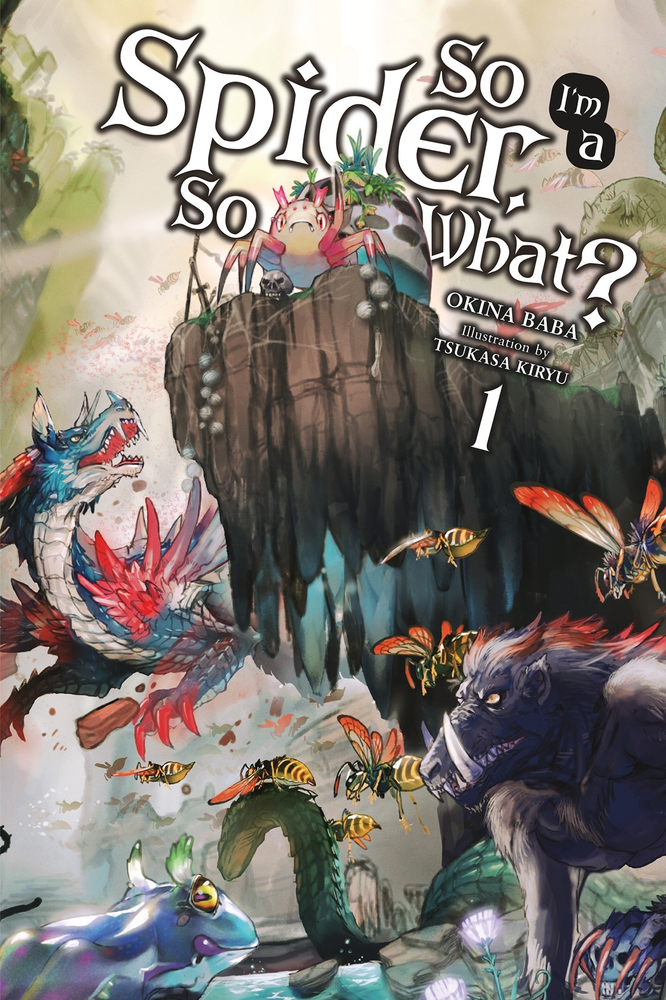
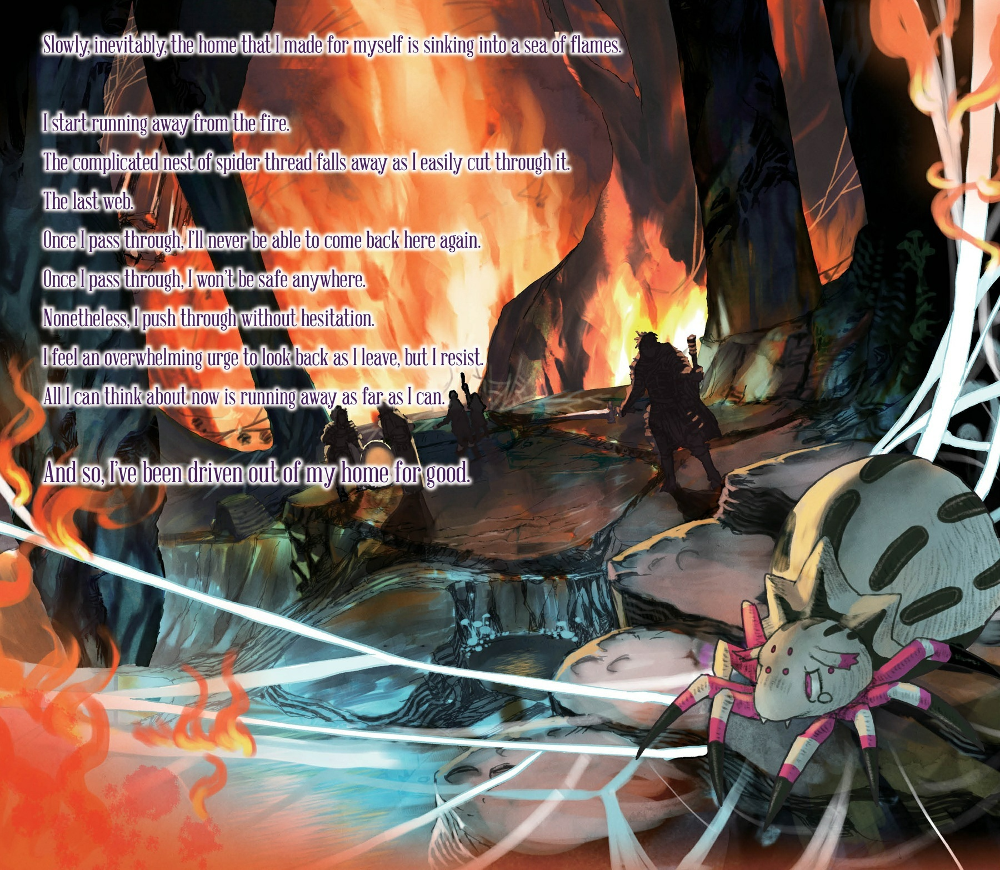
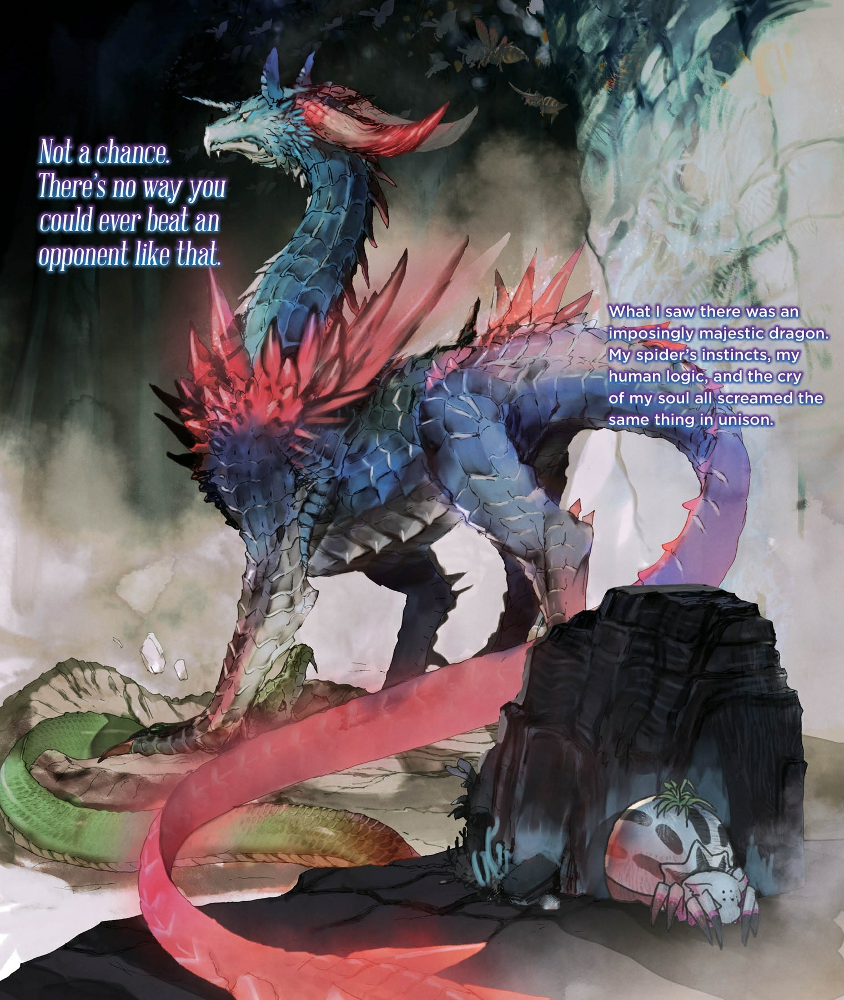
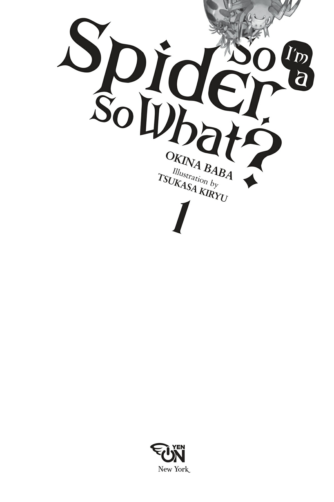
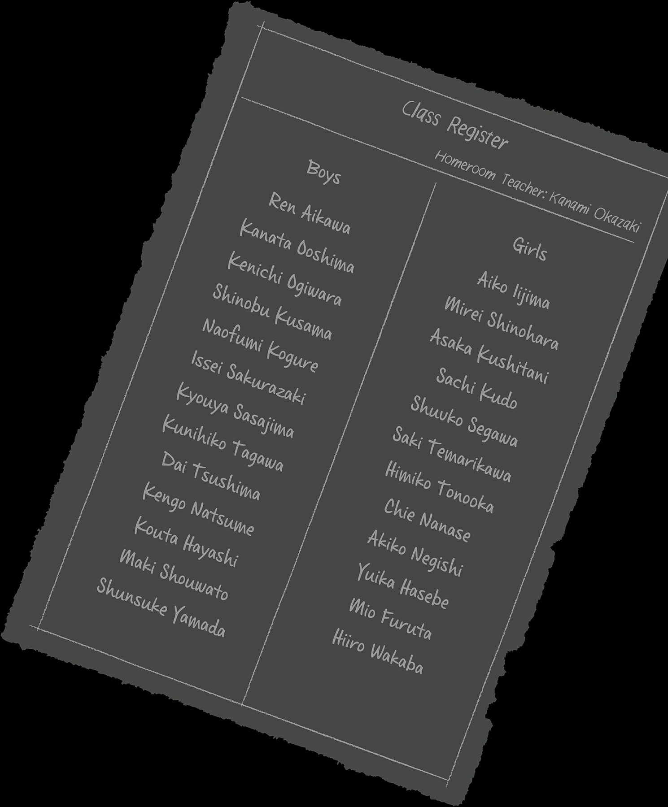
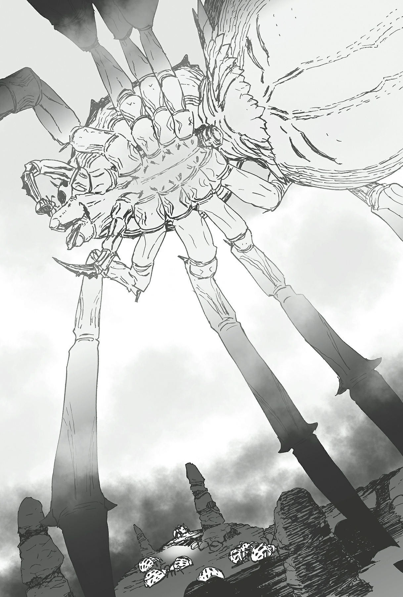
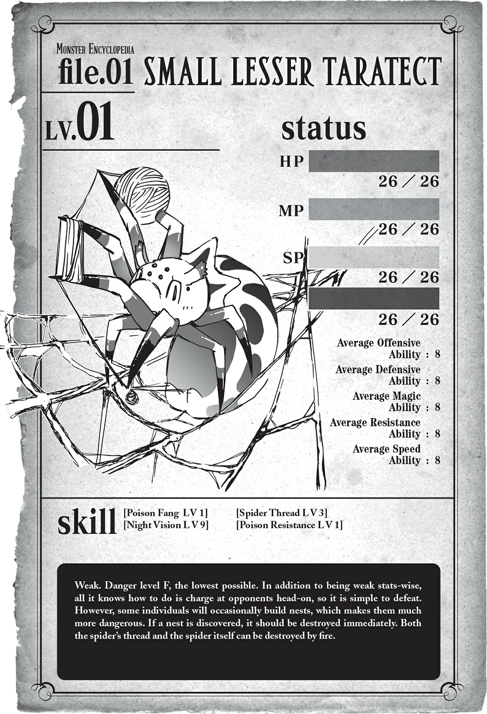

# Chương 1: Bắt đầu bằng một tiếng nổ lớn

*(Starting with a Bang)*

---

### --- TRANG 1 ---

---

### --- TRANG 2 ---

---

### --- TRANG 3 ---

---

### --- TRANG 4 ---

---

### --- TRANG 7 ---

---

### --- TRANG 9 ---

Gwaaaaah!

Tôi định hét lên, nhưng thực tế là ngay cả một tiếng rên rỉ cũng không thốt ra được.

Cơ thể tôi bị tàn phá nặng nề đến thế rồi sao?

Được rồi, bình tĩnh lại nào.

Tôi không cảm thấy đau đớn gì cả.

Điều cuối cùng tôi nhớ là một cơn đau dữ dội, quái dị ập đến ngay giữa giờ Ngữ văn Cổ điển.

Có lẽ tôi đã ngất đi vì chuyện đó, nhưng hiện tại chẳng có bộ phận nào trên người tôi thấy đau cả.

Dẫu vậy, dù tôi có mở mắt ra thì xung quanh vẫn tối đen như mực. Tôi chẳng biết mình đang ở đâu nữa.

Thực tế, tôi hầu như không thể cử động nổi, giống như có thứ gì đó đang quấn chặt lấy cơ thể.

Không phải giả thuyết suông đâu. Ý tôi là cảm nhận được một cách rõ ràng cơ thể mình đang bị trói buộc trong thứ gì đó, một loại vật liệu vừa cứng lại vừa có chút đàn hồi.

Tôi chỉ có thể nghe thấy loáng thoáng vài tiếng sột soạt từ bên ngoài.

Được rồi, chuyện gì đang xảy ra thế này? Mình bị bắt cóc à?

Không, thực tế chút đi.

Kẻ nào lại thèm bắt cóc một đứa con gái thuộc tầng lớp đáy xã hội như tôi cơ chứ?

Mà thôi, bất kể tình huống này có kỳ quái thế nào, việc duy nhất tôi cần làm là thoát ra ngoài.

Đúng lúc đó, tôi nghe thấy một tiếng RẮC lớn.

Ồ hô! Khi tôi dồn lực đẩy vào thứ đang bao bọc quanh mình, nó bắt đầu nứt ra.

Được rồi, giải quyết nốt cho xong rồi biến khỏi đây thôi!

---

### --- TRANG 10 ---

Gồng thêm chút lực, tôi tông thẳng ra ngoài, chúi đầu chui lên.

Tự do muôn năm!

Cảnh tượng hiện ra trước mắt tôi là một lũ nhện đang bò lổm ngổm.

Á á á?! Tại saoooooo?! Tởm quá!!

Cái quái gì với đội quân nhện kinh tởm này thế?! Ơ, xin lỗi, nhưng tại sao chúng nó đều to bằng tôi vậy?! Ôi kinh tởm, bọn chúng cứ liên tục chui ra từ mấy thứ trông như quả trứng thế kia! Hóa ra tiếng sột soạt lúc nãy là từ đây mà ra à?!

Theo bản năng, tôi co rúm người lại. Chân tôi va phải thứ gì đó, tôi quay lại nhìn.

Hửm?

Đây là... nó à? Thứ mà tôi vừa chui ra lúc nãy? Ơ... sao trông nó lại hơi giống mấy quả trứng mà lũ nhện kia đang đập vỏ chui ra thế? Không, không phải chỉ là hơi giống—nó chính là một trong số đó phải không?

Tôi cúi xuống nhìn lại mình kỹ hơn. Cổ tôi không cử động được. Dù vậy, ở rìa tầm mắt, tôi có thể nhìn thấy những thứ trông giống như chân của mình.

......Chân nhện.

Đ-Được rồi, kh-không được hoảảảng loạạạn!!!

Ch-chuyện này không phải như tôi nghĩ đâu đúng không?! Nhưng mà, thật sự là thế sao?! Cái trào lưu đang cực kỳ phổ biến trên mạng dạo này ấy hả?!

Không! Thật không thể tin nổi!

Chuyện này không thể xảy ra được đúng không? Làm ơn đi, bảo là không phải thế đi!

Tôi lại liếc nhìn xuống dưới. Những cái chân gầy khẳng khiu, hệt như chân của lũ nhện đang ngọ nguậy xung quanh tôi.

Tập trung tinh thần, tôi thử cử động chúng. Những cái chân nhện di chuyển theo đúng ý tôi.

Đúng vậy. Tôi phải đối mặt với sự thật thôi.

Rõ ràng là tôi đã đầu thai thành nhện.

Thật không thể tin nổi.

Nhưng ngay khi tôi chuẩn bị suy sụp tinh thần, tôi lại nghe thấy những tiếng nhai nhóp nhép. Nói đúng hơn là những âm thanh cực kỳ đáng ngại.

Hừm.

Trốn tránh thực tại cũng chẳng ích gì. Ngay trước mắt tôi là một đội quân nhện khổng lồ, có lẽ là anh chị em của tôi. Bất kể những âm thanh đó là gì, chắc chắn là phát ra từ chúng.

---

### --- TRANG 11 ---

Tôi từ từ định thần lại để quan sát cảnh tượng trước mắt. Ở đằng kia, một con nhện đang nhồm nhoàm ngấu nghiến đồng bọn của nó.

Áaaa! Cái quái gì thế này?! Nghiêm túc đấy hả, chúng nó đang ăn thịt lẫn nhau? Ăn thịt đồng loại?!

Trước mắt tôi, các anh chị em của tôi bắt đầu một cuộc tắm máu để cạnh tranh sinh tồn khốc liệt.

Không, không, không! Tệ rồi, tệ thật rồi!

Tại sao chúng ta lại phải tàn sát lẫn nhau thế này, các anh chị em của tôi ơi?! À, phải rồi—vì thức ăn. Chắc tụi nó đói bụng. Nhắc mới nhớ, bản thân tôi cũng muốn ăn cái gì đó.

HẢ?! Suy nghĩ đáng sợ gì thế này.

Suýt chút nữa là tôi đánh mất lý trí rồi. Trên một chiến trường như thế này, một nữ sinh trung học ngây thơ như tôi có thể trở thành con mồi của lòng lang thú dữ bất cứ lúc nào! Cả nghĩa bóng lẫn nghĩa đen!

Những lúc thế này thì phải vắt chân lên cổ mà chạy thôi.

Chiến đấu á? Không đời nào.

Tôi vốn là một kẻ ru rú xó nhà bẩm sinh mà. Làm sao tôi có thể thách thức một thứ gì đó tởm lợm và bạo lực như thế chứ. À. Tôi vừa nhớ ra mình bây giờ cũng chính là loại quái thai đó rồi.

Được rồi.

Thay vì lãng phí thời gian nghĩ ngợi vớ vẩn, tôi nghĩ mình nên chuồn lẹ thì hơn. Nhưng có vẻ đã hơi muộn một chút. Mặt đất dưới chân tôi bắt đầu rung chuyển một cách đầy điềm xấu. Lại gì nữa đây?! Những âm thanh và chấn động truyền đến từ phía sau. Quay người lại, tôi thấy mình đang ngước nhìn một con nhện khổng lồ, to lớn đến kinh hoàng.

Ồ, phải chăng ngài là Mẹ? Hay là Bố nhỉ?

Thôi kệ đi.

Đầu óc tôi lại rối bời lên rồi. Mà nghiêm túc đấy—sao nó lại to đến thế chứ?!

Con quái vật nhiều chân khổng lồ này phải lớn hơn tôi gấp hàng chục lần.

Có lẽ tôi nhớ nhầm, nhưng tôi khá tự tin là trên Trái Đất không có con nhện nào to đến mức này cả!

Á.

---

### --- TRANG 12 ---

---

### --- TRANG 13 ---

Rắc một tiếng gọn lỏn, kẻ khổng lồ dùng một bên càng xiên một con nhện nhỏ hơn cùng loài rồi ngấu nghiến nuốt chửng.

Cứ như thể bà ta đang ăn một món điểm tâm nhẹ vậy.

Đến cả mẹ cũng thế sao...?!

Thôi, mấy chuyện đó để sau hãy nghĩ. Hiện tại, mục tiêu duy nhất của tôi là thoát khỏi đây an toàn và cố gắng sống sót!

Tôi cắm đầu cắm cổ chạy với tốc độ tối đa. Chỉ đến khi mệt rã rời đến mức hầu như không thể lướt đi nổi nữa, tôi mới dần bình tĩnh lại. May mắn thay, khi ngoảnh lại kiểm tra, tôi thấy không có ai đuổi theo mình cả.

Phù, tôi cứ tưởng mình tiêu đời rồi chứ. Mới sống lại được vài phút mà đã bị giết thì đúng là nhảm nhí quá mà.

Dù sao thì... bây giờ khi đã tỉnh táo lại một chút, tôi có rất nhiều điều phải suy nghĩ.

Trước hết, tại sao tôi lại chết?

Thật ra, nghĩ kỹ lại thì tôi cũng không chắc chắn 100% là cuộc đời mình đã chấm dứt hay chưa.

Tôi chỉ tự quy chụp rằng mình đã chết và đầu thai thành nhện, chứ bản thân đâu có nhớ gì về khoảnh khắc mình lìa đời.

Tôi khá chắc ký ức cuối cùng của mình là cảnh cô giáo Ngữ văn Cổ điển, người mà chúng tôi hay gọi là cô Oka, đang đọc bài trong sách giáo khoa.

Tôi đang thiu thiu ngủ thì đột nhiên bị một cơn đau thấu xương tủy đè bẹp, và sau đó tôi chẳng còn ký ức nào về những gì xảy ra tiếp theo.

Nếu tôi thực sự đã chết, thì có lẽ nguyên nhân là do cơn đau bí ẩn đó, nhưng...

...tôi hoàn toàn không biết cái gì đã gây ra nó.

Dẫu sao, kết luận khả thi nhất vẫn là tôi đã chết vào khoảnh khắc đó và đầu thai thành nhện.

Ngoại trừ khả năng đó, tôi đoán cũng có thể tôi vẫn còn sống, và linh hồn tôi hiện chỉ đang nhập vào một con nhện, hoặc điều gì đó tương tự.

Chẳng hạn như, có thể cơ thể gốc của tôi đang trong trạng thái sống thực vật, nằm trên giường bệnh vào lúc này.

Or đây là một ý tưởng còn điên rồ hơn: Có lẽ tôi hoàn toàn không phải là chính mình, chỉ là một người xa lạ nào đó tình cờ có ký ức của người khác mà thôi.

Biết đâu bản thân tôi thực sự vẫn đang ngồi học trong lớp như bình thường, ngay cả lúc này.

Mà thôi.

Dù sao tôi cũng chẳng có cách nào để xác thực chuyện đó cả. Làm thế nào để chứng minh tôi không phải là người tôi nghĩ mình đang là đây?

---

### --- TRANG 14 ---

Tôi sẽ lại kết thúc bằng việc lảm nhảm mấy thứ triết lý vô nghĩa khó hiểu kiểu như "Tôi tư duy, nên tôi tồn tại" cho mà xem.

Hơn nữa, từ những bằng chứng có được thì kết luận dễ xảy ra nhất là cái giả thuyết đầu thai nực cười kia, thế nên tốt hơn hết tôi nên vứt bỏ lẽ thường đi là vừa.

Dù thế nào, tốt nhất là gác chuyện này sang một bên đã.

Theo tinh thần của câu "Tôi tư duy, nên tôi tồn tại", tôi cứ tạm coi mình chính là bản thân mình cho đến khi có bằng chứng chứng minh ngược lại.

Vậy nên, rõ ràng giờ tôi đã là một con nhện. Chuyện đó chắc chắn không thể chối cãi được nữa rồi.

Trong lúc bỏ chạy lúc nãy, tôi đã có thể bật nhảy theo những cách mà một con người không bao giờ làm nổi.

Thế nếu tôi là nhện, thì cái bóng dáng khổng lồ tôi thấy lúc trước là sao đây?

Hừm.

Trong tình cảnh này, có lẽ đó thực sự là một trong số cha mẹ nhện của tôi? Tôi không biết rõ về đặc tính sinh học của loài nhện, nhưng tôi nghĩ trong tự nhiên việc động vật ăn thịt con mình không phải là hiếm. Lũ nhện kia rõ ràng đã ăn thịt đồng loại ngay từ khi mới lọt lòng, thế nên việc cha mẹ ăn thịt con cái cũng chẳng có gì đáng ngạc nhiên.

Nếu con nhện khổng lồ đó là phụ huynh của tôi, không biết có phải điều đó đồng nghĩa với việc một ngày nào đó tôi cũng sẽ to đùng như thế không?

Nghĩ đến thôi đã thấy hơi buồn nôn rồi.

Được rồi, quên phần đó đi. Quay lại vấn đề chính nào.

Xem nào. Thật ra, có một điều khiến tôi đặc biệt bận tâm.

Cụ thể là việc tôi là một con quái vật.

Cái thể loại "đầu thai" đang khá là hot trong các tiểu thuyết mạng dạo gần đây, nên tôi đoán ý tưởng này cũng không đến nỗi quá xa lạ.

Ý tôi là việc đầu thai thành quái vật ấy.

So câu hỏi là: Tôi thuộc một loài sinh vật bình thường trên Trái Đất, hay đây hoàn toàn không phải Trái Đất mà là một thế giới song song, nơi tôi được tái sinh thành một dã thú?

Nhìn con nhện khổng lồ lúc nãy thì tôi nghiêng về giả thuyết thứ hai hơn, nhưng nếu vậy thì độ khó để sinh tồn ở đây sẽ tăng vọt cho xem.

Cứ nghĩ thế này cũng chẳng đi đến đâu. Tôi không có đủ thông tin để phân tích chuyện gì đang xảy ra.

Đây có phải Trái Đất không? Tôi là quái vật hay chỉ là một con nhện bình thường? Nếu đây là thế giới khác, thì đó là loại thế giới nào?

---

### --- TRANG 15 ---

Có một núi thứ tôi muốn biết, nhưng tôi chẳng có cách nào để tìm hiểu cả.

Aaa, giá mà đây là một cuốn tiểu thuyết hay gì đó tương tự, chắc tôi sẽ có kỹ năng Thẩm định để giúp mình làm sáng tỏ mọi chuyện rồi...

`<Số điểm kỹ năng hiện có: 100. Số điểm kỹ năng cần thiết để sở hữu kỹ năng [Thẩm định Cấp 1]: 100. Tiếp nhận kỹ năng?>`

Oa. Cái gì thế? ...Thật á? Một giọng nói máy móc hoàn toàn không có cảm xúc đột nhiên vang vọng trong tâm trí tôi. Điều này thật đáng ngạc nhiên ở nhiều khía cạnh.

Thứ nhất, việc tôi nghe thấy tiếng nói đã là lạ rồi.

Thứ hai, hóa ra các "kỹ năng" có tồn tại ở nơi này.

Rõ ràng trên Trái Đất không hề có hệ thống kỹ năng nào như vậy, và tôi cũng chưa từng nghe thấy bất kỳ giọng nói thông báo nào trong đầu mình trước đây.

Vậy điều đó có nghĩa đây không phải Trái Đất? Chắc chắn rồi.

Tôi đoán điều này càng làm tăng thêm sức nặng cho giả thuyết "tôi là quái vật" của mình.

Làm quái vật ở thế giới song song nghe cứ như một tấm vé đi thẳng tới cái chết vậy, nhưng thôi đừng nghĩ về chuyện đó nữa. Không, không, không.

Quan trọng hơn, chuyện này là thật! Kỹ năng Thẩm định thực sự tồn tại!

Húuuu! Thế mới được chứ! Cuối cùng thì mọi chuyện cũng bắt đầu giống một câu chuyện đầu thai kỳ ảo thực thụ rồi! Tất nhiên câu trả lời của tôi là "CÓ!" chứ!

`<Đã tiếp nhận [Thẩm định Cấp 1]. Số điểm kỹ năng còn lại: 0.>`

Có vẻ như lựa chọn đó đã ngốn sạch toàn bộ điểm kỹ năng của tôi, nhưng tôi quyết định tạm thời không lo lắng về chuyện đó.

Quên! Nó! Đi!

Giờ là lúc sử dụng kỹ năng Thẩm định mới toanh nóng hổi để dò xét sạch sành sanh mọi thứ xung quanh nào!

Tôi chọn bừa một hòn đá gần đó, cố gắng nghĩ chữ [Thẩm định] khi tập trung nhìn vào nó.

Thành công rồi! Thông tin truyền thẳng vào tâm trí tôi một cách trơn tru.

`<Đá>`

...Hửm? Khoan, cái gì cơ? Chỉ thế thôi á?

Không, không, không.

Không thể nào như vậy được đúng không? Chắc do lần đầu tiên nên tôi mới thất bại thôi.

---

### --- TRANG 16 ---

Để thử lại xem...

`<Đá>`

...Hả? Thật sự chỉ thế thôi sao?

Không, không, không, không.

Chắc chắn là vì hòn đá này không có thông tin gì giá trị vì nó chỉ là một viên đá bình thường thôi! Lần này, tôi quyết định thử nghiệm kỹ năng lên bức tường.

Biết đâu nó sẽ cho tôi biết điều gì đó về khu vực tôi đang ở. Nếu có thể nhận được một cái tên địa danh kiểu như "Hang động nào đó" cùng với một đoạn mô tả ngắn hay gì đó tương tự, tôi chắc chắn sẽ thấy an tâm hơn nhiều.

`<Tường>`

.........Tôi cạn lời luôn rồi.

Lẽ ra tôi phải để ý đến việc tên kỹ năng là [Thẩm định Cấp 1], tức là nó đã chỉ rõ cấp độ của mình rồi.

Xét về mọi mặt, điều này có nghĩa là một kỹ năng cấp 1 sẽ không mang lại cho tôi bất kỳ kết quả hữu ích nào cả.

Có lẽ việc nâng cấp độ sẽ cải thiện được tình hình, nhưng tôi đã tiêu sạch điểm kỹ năng mất rồi.

Áaaa! Không thể tin được là tôi đã nướng sạch điểm vào một năng lực vô dụng thế này!

Tôi không biết có những kỹ năng nào khác để chọn, nhưng biết đâu có vài cái thực sự hữu ích ngay từ cấp 1 thì sao!

Không, tôi nên nghĩ theo chiều hướng ngược lại. Nếu Thẩm định ở cấp 1 đã phế thế này, thì chắc chắn bất kỳ kỹ năng cấp 1 nào khác cũng sẽ vô dụng tương đương thôi. Ừ, cứ nghĩ thế đi. Nếu không tôi sẽ không chịu nổi cú sốc này mất.

Ôi. Thật không thể tin nổi.

Đến nước này, tôi nghĩ mình nên Thẩm định chính bản thân xem sao.

`<Nhện       Không tên>`

Hửm? Tất nhiên tôi biết nó sẽ hiện chữ "Nhện" rồi, nhưng tại sao lại là "Không tên"?

"Tôi là một con nhện. Cho đến nay tôi vẫn chưa có tên." Bộ định bắt chước tác phẩm của Natsume Souseki à?

Ý tôi là, kiếp trước tôi có tên hoàng hoi chứ, nhưng tôi đoán bây giờ thì hết rồi, vì hiện tại tôi đã là một con nhện.

Tốt nhất tôi nên tạm gác cái kỹ năng Thẩm định vô dụng này sang một bên. Nếu có tác dụng gì, thì nó chỉ tổ làm tăng thêm số lượng những điều bí ẩn mà thôi.

Chẳng hạn như điểm kỹ năng tôi đã dùng để đổi lấy Thẩm định. Có lẽ tôi có thể nhận thêm kỹ năng bằng cách tích lũy thêm điểm. Tuy nhiên, tôi hoàn toàn không biết làm thế nào để kiếm được chúng cả.

---

### --- TRANG 17 ---

Hết cấp độ, kỹ năng lại đến điểm kỹ năng, thế giới này tạo cảm giác cực kỳ giống game.

Ý tôi là, thế thì cũng khá thú vị đấy chứ, đúng không?

Mặc dù tôi không biết liệu hiện tại mình có đủ thư thả để tận hưởng niềm vui đó không nữa.

Kệ đi. Bắt đầu thấy đói bụng rồi.

Cứ quanh quẩn một chỗ mãi cũng chẳng giải quyết được gì, nên tôi đành phải di chuyển để xem có tìm được cái gì bỏ bụng không.

Tôi cứ nghĩ mình chỉ đi dạo một lát, nhưng cái hang này TO KINH KHỦNG!

Tất nhiên là to so với kích thước của tôi rồi, nhưng trần hang cao đến mức tôi hầu như chẳng nhìn rõ được gì, còn chiều rộng thì cũng vô lý không kém.

Mấy hòn đá nằm rải rác ngẫu nhiên ít nhiều tạo chút cảm giác thay đổi, nhưng đối với một cái hang thì nơi này vẫn rộng lớn đến phát khiếp.

Cuối cùng, tôi tìm thấy một ngã rẽ.

Trèo lên một tảng đá khá lớn, tôi thử nheo mắt nhìn xuống con đường phía trước. Có thứ gì đó ở đằng kia...! Theo những gì tôi có thể nhìn ra, đó là một bầy sinh vật trông như quái vật đang tụ tập.

`<Nai> <Nai> <Nai> <Nai> <Nai> <Nai> <Nai> <Nai> <Nai> <Nai> <Nai> <Nai> <Nai> <Nai> <Nai> <Nai> <Nai> <Nai> <Nai> <Nai> <Dơi> <Dơi> <Dơi> <Dơi> <Dơi> <Dơi> <Dơi> <Dơi> <Dơi> <Dơi> <Dơi> <Dơi> <Dơi> <Dơi> <Dơi> <Dơi> <Dơi> <Dơi> <Dơi> <Dơi> <Dơi> <Dơi> <Dơi> <Dơi> <Dơi> <Dơi> <Dơi> <Dơi> <Dơi> <Dơi> <Dơi> <Dơi> <Dơi> <Dơi > <Dơi> <Dơi> <Dơi> <Sói> <Sói> <Sói> <Sói> <Sói> <Sói>...`

Ui da! Đau đầu quá?! Cái kỹ năng Thẩm định ngu xuẩn kia chắc tự động kích hoạt rồi, vì vụ bùng nổ thông tin đột ngột đó làm đầu tôi đau nhức nhối.

Ý tôi là, nếu nhìn thật kỹ thì trông chúng cũng hơi giống hươu nai thật, nhưng tôi không nhớ loài nai ở thế giới cũ lại có cặp sừng sáng bóng và sắc nhọn đến thế.

Còn lũ "dơi" đang vỗ cánh bay lượn trên không trung trông giống loài gặm nhấm gớm ghiếc mọc thêm đôi cánh ác quỷ hơn.

Lũ sói thì ít ra trông có vẻ bình thường... ngoại trừ việc bây giờ tôi phát hiện ra chúng có tận sáu chân.

Mình phải đi qua chỗ này sao? Ồ, chắc thế rồi đấy. Tôi chỉ là một con nhện con mới chào đời thôi mà. Độ khó này quá cao rồi.

Tôi rón rén bò xuống khỏi tảng đá.

Vậy ra... có quái vật thực sự. Nơi này quả nhiên không phải Trái Đất.

---

### --- TRANG 18 ---

Chưa kể, nếu những con được gọi là nai và sói đó có cùng kích thước như ở Trái Đất...

Đừng nghĩ nữa! Đừng nghĩ nữa!

Được rồi, giờ sao đây?

Phía trước là cả một hàng rào quái vật. Phía sau là địa ngục nhện. Đùa nhau à? Mình bị chiếu tướng rồi sao?

Bình tĩnh, bình tĩnh nào, làm ơn đấy.

Tôi đã nghĩ tình huống kiểu này có thể xảy ra, nên tôi đã chuẩn bị sẵn phương án dự phòng cho những lúc như thế này.

À thì, thật ra cũng chẳng có gì ghê gớm lắm đâu. Chỉ là lúc nãy tôi tình cờ thấy một con đường khác. Lối đi phụ nhỏ hơn này rất dễ bị bỏ qua vì nó nằm ngay sát con đường lớn kia, trông như một cái lỗ nhỏ khiêm tốn trên vách đá. Tuy nhiên, nó rộng khoảng mười feet, nên tôi sẽ chui qua mà không gặp vấn đề gì.

Trên tinh thần đó, tôi vẫn cần phải đi tìm thức ăn. Hy vọng là tôi cũng sẽ tìm được lối thoát khỏi cái hang này.

Quyết định thế nhé, xuất phát thôi!

Chuyến hành trình mới đầy thắng lợi của tôi đang diễn ra rất suôn sẻ, ngoại trừ việc tôi vừa đi đã bị lạc ngay lập tức.

Trời đất ơi. Cho tôi nói lại lần nữa nhé? Cái hang này quá rộng lớn luôn ấy! Nghiêm túc đấy, cái mê cung khổng lồ này là thế nào vậy?

Tại sao lại có nhiều lối rẽ nhánh khắp nơi đến thế cơ chứ?

Bao nhiêu lối á? Tôi ngừng đếm sau khi nó vượt quá con số mười rồi.

Tôi cũng đụng độ nhiều quái vật hơn mức bình thường nữa. Và vì lần nào tôi cũng lập tức bỏ chạy trối chết, tôi đã hoàn toàn mất phương hướng chẳng biết mình từ đâu tới nữa rồi.

Ôi... thật không thể tin nổi.

Nếu muốn đi đến đâu đó trong cái mê cung này, tôi thực sự cần một tấm bản đồ. Cứ thế này thì còn khuya mới tìm thấy lối ra.

Và rồi tôi phát hiện ra một điều cực kỳ điên rồ.

Có dấu chân trên mặt đất. Dấu chân người.

Tôi có thể phân biệt rõ ràng vài dấu chân khác nhau. Điều đó có nghĩa là đã có người đi qua nơi này. Trên thực tế, đây là bằng chứng cho thấy con người có tồn tại ở thế giới này. Phát hiện vĩ đại này khiến tôi có chút xúc động.

Thế nhưng bây giờ tôi lại nhận thấy một điều có chút... không, phải nói là cực kỳ đáng báo động mới đúng.

Cơ thể tôi to hơn những dấu chân này rất nhiều.

---

### --- TRANG 19 ---

Dựa trên kích thước của người đã để lại những vết chân này, cơ thể tôi phải cao ít nhất ba feet...

Không đâu, tôi chắc chắn đây chỉ là dấu chân của người lùn thôi.

Chắc chắn là thế rồi! Ha ha ha!

...Thật không thể tin nổi. Không, không đời nào.

À thì... nói đi cũng phải nói lại.

Thật lòng mà nói, tôi đã bắt đầu nghi ngờ từ lúc nhìn thấy con nhện khổng lồ kia rồi. Dù có nhìn nhận thế nào đi nữa, tôi chắc chắn là một con quái vật. Xin cám ơn nhiều nhé!

Ôi, tôi đã cố né tránh nó rồi, nhưng cuối cùng vẫn phải đối mặt với toàn bộ sự thật.

Việc đầu thai thành nhện đã đủ sốc rồi, thế mà tôi lại còn là một con nhện quái vật nữa chứ.

Đời đúng là vớ vẩn. Vớ vẩn đến mức có người sẽ tuyệt vọng và tự kết liễu luôn ấy. Bản thân tôi thì chắc chắn không nghĩ đến cái chết rồi, nhưng thế này thì vẫn nản thật đấy. Nhưng thôi, ngồi một chỗ ủ rũ cũng chẳng ích gì.

Vì thế giới này rõ ràng khác với thế giới của tôi, tôi không biết có những mối nguy hiểm nào đang chờ đợi mình. Có một điều chắc chắn là chẳng có gì đảm bảo sẽ không có thêm những con quái vật khổng lồ như con nhện kia. Và dựa vào kích thước của chính mình, con quái vật đó phải dài tới một trăm feet...

Liệu con người có thể hạ gục một sinh vật như thế không nhỉ? Chắc là không rồi đúng không? Nếu có bất kỳ con trùm quái vật nào ở đây, con nhện khổng lồ kia chắc chắn là một trong số đó.

Vậy hóa ra tôi là con của một con trùm quái vật sao.

Nghe tệ thật đấy, đúng không?

Mà thế có nghĩa là nếu tôi đụng mặt con người, họ sẽ cố giết tôi đúng không?

Hoàn toàn có thể xảy ra lắm chứ. Thực ra, khả năng cao là chuyện sẽ diễn ra đúng như vậy.

Đột nhiên, tôi nhìn thấy thứ gì đó nằm trên mặt đất gần những dấu chân.

Cái gì thế kia?

Sau khi nhìn kỹ hơn, tôi nhận ra đó là phần thi thể bị xẻ thịt của một con nhện.

Phải, chính là cùng loài với tôi.

Oa, kỹ thuật giải phẫu điêu luyện thật đấy. Đây chắc chắn là tác phẩm của con người rồi nhỉ?

Tôi không thích cái hướng đi này chút nào đâu nhé!

Nếu có con người nào phát hiện ra tôi, họ chắc chắn sẽ đồ sát tôi cho mà xem!

---

### --- TRANG 20 ---

---

[Chương tiếp theo: Chương S1: Kết thúc của cuộc sống thường nhật ▶](s1_the_end_of_normal_life.md)
