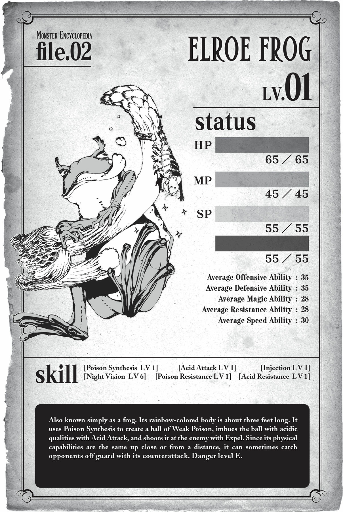

# Chương 4: Rời tổ

*(Leaving the Nest)*

---

### --- TRANG 64 ---

---

### --- TRANG 65 ---

Nếu muốn đập vỡ quả trứng, và nếu muốn sinh tồn, tôi sẽ phải trở nên mạnh mẽ hơn nữa.

Tôi không muốn bị giết bởi quái vật, con người, hay bất kỳ thứ gì khác.

Và vì kẻ trộm trứng đó đã xuất hiện ngay trước cửa nhà tôi, có vẻ như con người thỉnh thoảng cũng đi xa đến tận đây.

Cũng không có gì đảm bảo rằng bố mẹ của quả trứng không lảng vảng ở đâu đó gần đây cả.

Hiện tại cơ thể nhện của tôi khá là nhanh nhẹn.

Tôi có thể nhảy cao gần bảy feet vào không trung, và tôi cũng có thể leo tường nữa.

Trước khi xây nhà, tôi đã chạm trán với các quái vật khác khi đi lang thang ngoài kia, nhưng tôi đủ nhanh nhẹn để tránh chúng mà không gặp vấn đề gì.

Ủa, thế không phải nghĩa là tôi thực sự là một con quái vật khá mạnh mẽ sao? Tôi cũng từng nghĩ thế đấy.

Nhưng rõ ràng là tôi đã nhầm.

Làm sao tôi có thể mạnh mẽ được khi ngay cả một quả trứng tôi còn không đập vỡ nổi chứ?

Vũ khí tốt nhất của tôi là tơ và răng nanh độc. Tôi có thể trói kẻ thù bằng mạng nhện của mình và kết liễu chúng bằng chất độc.

Sự kết hợp vàng này là chìa khóa chiến thắng của tôi, nói cách khác, bất kỳ tình huống nào mà nó không hoạt động đều đồng nghĩa với thất bại của tôi.

Mạng nhện và răng nanh độc là những thứ thiết yếu đối với tôi—không, đối với tất cả quái vật nhện nói chung.

Một khi đã đi đến kết luận này, tôi kiên trì tuân thủ mô-típ làm cho đối thủ của mình bất động bằng tơ trước khi kết liễu chúng.

Áp dụng chiến thuật này, tôi đã tiêu diệt con ếch thứ ba mà không hề bị thương, và khi ăn xong, Lời của Thần (tạm gọi) lại vang lên lần nữa.

---

### --- TRANG 66 ---

`<Đủ điều kiện. Nhận được Danh hiệu [Kẻ ăn tạp].>`

`<Nhận được kỹ năng [Kháng Độc LV 1] [Kháng Thối Rữa LV 1] như một kết quả từ Danh hiệu [Kẻ ăn tạp].>`

`<Kỹ năng [Kháng Độc LV 1] đã được tích hợp vào [Kháng Độc LV 3].>`

Ồ, tôi lại nhận được một danh hiệu mới kìa.

Vậy là tôi không thể cố tình kiếm được một cái bằng cách làm tất cả những trò kia, nhưng rồi đột nhiên lại được trao cho một cái khi tôi còn chẳng thèm cố gắng sao?

Này, tôi đâu có lỗi khi thức ăn của mình toàn là đồ dơ bẩn chứ!

Ở đây làm gì có gì khác cho tôi ăn ngoài quái vật đâu!

Mà thôi, tôi đoán có phàn nàn với Lời của Thần (tạm gọi) cũng chẳng giải quyết được gì.

Vậy là các kỹ năng tôi nhận được là Kháng Độc và... Kháng Thối Rữa?

Nghĩa là sao chứ? Bây giờ tôi có thể ăn đồ thối rữa rồi chăng?

Cái này nghe có vẻ không mấy hữu ích lắm, nhưng tôi đoán có vẫn hơn không.

Và tôi vốn đã có kỹ năng Kháng Độc rồi, nhưng đánh giá từ những gì Lời của Thần (tạm gọi) vừa nói, nó chắc đã cộng thêm độ thuần thục tương đương với một kỹ năng cấp 1 vào những gì tôi đang có.

Thì, nếu các kỹ năng của tôi mạnh lên, tôi cũng sẽ mạnh lên theo, có lẽ vậy.

Mặc dù việc tăng cường kháng tính của tôi cũng chẳng giúp ích gì cho việc đập vỡ quả trứng kia cả.

`<Độ thuần thục đã đạt mức yêu cầu. Kỹ năng [Tơ Nhện LV 5] đã trở thành [Tơ Nhện LV 6].>`

Sau một thời gian nghịch t... à hèm, ý tôi là luyện tập thao tác tơ một cách chăm chỉ, cấp độ kỹ năng của tôi đã tăng lên.

Kể từ khi biết tơ nhện của mình là một kỹ năng, tôi đã thử đủ trò với nó để kiếm thêm độ thuần thục.

Biết đâu việc nâng cấp kỹ năng này sẽ cải thiện những thứ như độ đàn hồi của sợi tơ đàn hồi, giúp quả trứng có thể bị đập vỡ thì sao.

Trời ạ, nhưng mà nâng cấp nó tốn thời gian thật đấy.

Kết quả là, bên trong ngôi nhà của tôi bây giờ đã được phủ kín một màu trắng xóa.

So với khi tôi mới xây dựng nó, ngôi nhà của tôi đã thay đổi rất nhiều chỉ trong vòng vài ngày qua.

Đầu tiên là tôi có nhiều mạng lưới hơn.

Lúc trước, tôi chỉ giăng một tấm lưới chắn ngang mỗi lối đi trong ba lối đi của ngã ba đường, nhưng bây giờ tôi đã giăng thêm vài tấm lưới nữa dọc theo các hành lang.

---

### --- TRANG 67 ---

Suy nghĩ của tôi là một cái bẫy đơn lẻ có thể dễ dàng bị phá vỡ.

Với nhiều mạng nhện thế này, bất cứ thứ gì muốn tiến vào trung tâm căn cứ của tôi cũng sẽ phải tốn kha khá thời gian.

Bây giờ ngôi nhà của tôi thậm chí còn an toàn hơn trước rất nhiều.

Nhưng chỉ chừng đó vẫn chưa đủ để tăng cấp kỹ năng, nên tôi quyết định trang trí các bức tường tiếp theo.

Tôi phủ tơ của mình khắp tường, biến chúng thành một màu trắng xóa.

Tất nhiên, đây không chỉ là những món đồ trang trí thông thường.

Những sợi tơ giấy dán tường này được liên kết với mạng nhện của tôi, sao cho khi con mồi bị mắc bẫy, các sợi tơ sẽ tự động bong ra khỏi tường và quấn chặt lấy nạn nhân xấu số.

Tôi vô cùng tự hào về cái bẫy này, thứ đã ngốn của tôi rất nhiều lần thử nghiệm và thất bại mới hoàn thành được.

Vào khoảng thời gian tôi bắt đầu giăng tơ bám tường này, cấp độ kỹ năng của tôi đã tăng thêm một cấp.

Sau khi hoàn tất toàn bộ việc đó, dự án cuối cùng của tôi là giăng một vài sợi tơ vô hình bên trong nhà của mình.

Loại tơ này không có độ dính, và nó sẽ đứt ngay chỉ với một cái chạm nhẹ.

Nếu tôi cứ để mặc chúng, luồng gió tự nhiên cuối cùng cũng sẽ làm đứt chúng trước khi chúng được hấp thụ bởi các sợi tơ bám tường.

Tôi nghĩ mình có thể tạo ra những sợi tơ mịn như vậy là nhờ cấp độ kỹ năng đã đạt đến cấp 5.

Mục đích của chúng là để phát hiện kẻ địch. Đầu của các sợi tơ vô hình này được kết nối trực tiếp với tôi, nên nếu có thứ gì chạm vào chúng, tôi sẽ biết ngay đó là thứ gì.

Tôi phát triển loại tơ cảm biến này để khắc phục một thực tế bất tiện là tôi không thể nhìn thấy phía sau lưng mình.

Vì tôi không phải lo lắng về phía sau khi ở trong nhà, tôi quyết định giăng một vài sợi quanh nhà mình thay thế.

Hy vọng của tôi là cuối cùng có thể điều khiển từ xa những sợi tơ này khi tôi đi thám hiểm bên ngoài nhà mình.

Sau tất cả những việc này, tôi hầu như chẳng còn việc gì để làm nữa, nên tôi chỉ việc tích lũy thêm tơ một cách vô nghĩa cho đến khi kỹ năng cuối cùng cũng đạt cấp 6.

Nhờ đó, tôi đã có được khả năng tạo ra những sợi tơ chất lượng cao, mịn màng như lụa, nên tôi đã làm ra vài cuộn tơ như vậy và để chúng rải rác khắp nơi.

Cơ mà, việc tự nhiên sản xuất ra ngần ấy tơ nhện rút cục lại làm tôi thấy đói bụng.

---

### --- TRANG 68 ---

Đó là lý do tôi không chần chừ ngấu nghiến ngay nạn nhân tiếp theo dính vào lưới của mình.

Tất cả quái vật ở khu vực này dường như đều có độc, nên răng nanh độc của tôi không thể giết chúng một cách nhanh chóng.

Thôi thì, một khi chúng đã bị mắc vào lưới của tôi, tôi muốn tốn bao nhiêu thời gian hành hạ chúng cũng được.

Kết quả là, kỹ năng Răng Độc của tôi đã tăng lên cấp 4, và Kháng Độc của tôi tăng lên cấp 5.

Cho đến nay, tôi đã đánh bại ba con Randanel Elroe, một con Peckatot Elroe, một con Basilisk Elroe, và một con Finjicote.

Ngoài ra, còn có thêm hai con ếch quen thuộc nữa.

Cái hầm ngục này là trang trại nuôi ếch hay sao thế hả?

Tôi đã đánh bại khá nhiều quái vật rồi, nhưng tôi vẫn chưa thấy bóng dáng con người nào khác.

Randanel Elroe là loại quái vật nhỏ giống như khủng long. Ba con trong số chúng đã tấn công tôi cùng một lúc, chuyện đó làm tôi sợ chết khiếp.

Nhưng cả ba đều bị dính lưới của tôi một cách hoàn hảo, nên cũng không có gì đáng lo.

Peckatot Elroe là một loài quái vật kỳ dị trông giống như sự kết hợp giữa chim cánh cụt và bồ nông với cánh tay khỉ.

Finjicote là một sinh vật giống như ong khổng lồ dị dạng, lớn đến mức nó chiếm gần như toàn bộ bề rộng mười feet của lối đi. Dẫu vậy, vì thế nên mạng nhện của tôi đã tóm gọn được nó không một chút trở ngại.

Kẻ phiền phức nhất chắc chắn là Basilisk Elroe.

Nó trông giống hệt một con thằn lằn khổng lồ, nhưng đúng như cái tên của nó, nó có một loại đòn tấn công hóa đá. Tôi nghĩ nó có ánh nhìn hóa đá giống như bạn thấy trong game và các câu chuyện giả tưởng vậy—nó đã biến một trong những chân trước của tôi thành đá. Thật là một kẻ thù đáng sợ.

Tôi đã hoảng sợ đến mức phải áp dụng chiến thuật rút lui chiến lược, cụ thể là trốn sau quả trứng.

Ngay lúc đó, các sợi tơ đàn hồi quấn quanh quả trứng đều bị biến thành đá và vỡ vụn.

Biết đâu cách đó cũng sẽ có tác dụng với quả trứng thì sao? Tràn đầy hy vọng, tôi cứ để mặc cho nó liên tục sử dụng đòn tấn công hóa đá của mình, nhưng quả trứng hoàn toàn không bị ảnh hưởng gì cả.

Thực tế là, con thằn lằn đã tự vắt kiệt sức mình khi tấn công tấm khiên của tôi, nên tôi có thể lẻn ra và kết liễu nó mà không gặp bất kỳ trở ngại nào. Cái quả trứng này rốt cuộc là thứ quái gì thế không biết?!

Sau cuộc chạm trán đó, tôi đã phải chịu đựng cái chân hóa đá của mình cho đến khi tôi tăng cấp và lột xác một lần nữa.

---

### --- TRANG 69 ---

Vì tôi có được kỹ năng Kháng Hóa Đá trong quá trình đó, nên về tổng thể thì đây cũng là một kết quả có lợi, nhưng nó vẫn nguy hiểm không kém gì lần đầu tiên tôi chạm trán với con ếch.

Ồ, đúng rồi, như tôi đang nói: tôi đã tăng cấp. Chính xác là ba lần. Bây giờ tôi đã đạt cấp 5.

Theo như tôi biết, tôi đang sở hữu các kỹ năng sau: [Răng Độc LV 4] [Tơ Nhện LV 6] [Thẩm định LV 2] [Cấm kỵ LV 1] [Ma pháp Dị giáo LV 1] [Kháng Độc LV 5] [Kháng Axit LV 2] [Kháng Thối Rữa LV 1] [Kháng Hóa Đá LV 1].

Tôi đã tăng liền ba cấp, nhưng các kỹ năng của tôi không thay đổi nhiều cho lắm.

Xem ra phần thưởng độ thuần thục khi tăng cấp không lớn như tôi nghĩ.

Tôi cũng không có vẻ nhận được nhiều điểm kỹ năng lắm với mỗi cấp độ.

Tôi đã rất hào hứng khi Lời của Thần (tạm gọi) nói tôi có thêm điểm kỹ năng, nhưng tôi không thể tìm ra cách nào để có được kỹ năng mới bằng chúng cả.

Tôi đã thử tưởng tượng đủ loại kỹ năng có thể tồn tại, nhưng tôi không thể làm được gì.

Khi kỹ năng tôi nghĩ đến không tồn tại, Lời của Thần (tạm gọi) sẽ không thèm nói một lời, còn khi nó tồn tại...

`<Không đủ điểm kỹ năng.>`

...thì đó là tất cả những gì nó nói.

Các quy tắc đối với kỹ năng phức tạp hơn tôi tưởng nhiều.

Lại một ngày lười biếng nữa trôi qua. Aaa, tôi yêu ngôi nhà nhỏ của mình quá...

Cái gì? Quả trứng nào cơ?

Tôi không biết các bạn đang nói về cái gì cả. Tôi hoàn toàn không nhớ gì về một cuộn tơ đàn hồi lớn màu trắng nào hết nhé.

Các bữa ăn tự tìm đến tận nơi mà tôi chẳng cần tốn chút công sức nào, và ngôi nhà thì vô cùng an toàn, nên tôi có thể đánh một giấc tùy thích dù đang ở giữa một hầm ngục nguy hiểm. Tôi đã trải rất nhiều tơ lụa mềm mại lên nền đất đá cứng nhắc, nên nó cũng rất đẹp đẽ và thoải mái nữa.

Tôi đang tận hưởng những ngày tháng nhàn nhã trôi qua bằng công việc nhả tơ hàng ngày của mình. Aaa, đây mới là cuộc sống chứ.

Nghĩ lại thì, những ngày tháng ở kiếp trước của tôi khá là bận rộn.

---

### --- TRANG 70 ---

Trước đây tôi không chú ý đến chuyện đó lắm, nhưng nghĩ lại thì, làm thế nào mà tôi có thể sống sót chỉ với bốn tiếng ngủ mỗi ngày được nhỉ?

Trước đây, cuộc sống của tôi chỉ xoay quanh việc dậy sớm đi học, rồi về nhà chơi game cho đến khi không thể chống cự lại cơn buồn ngủ nữa thì thôi.

Phải, tôi đã sống như thế đấy.

Chơi game thì vui thật, nhưng nhìn lại, tôi không biết tại sao mình lại phải tốn nhiều công sức như vậy khi bản thân không có nghĩa vụ phải làm thế. Giữa niềm tự hào là một trong số ít người chơi hệ cày chay top đầu và việc đáp ứng kỳ vọng của các chiến hữu, tôi nghĩ mình đã bắt đầu ép bản thân vượt quá giới hạn của mình.

Tôi mà lại đi lo lắng về kỳ vọng của người khác á? Thật nực cười!

Tôi hoàn toàn tự cung tự cấp. Ai mà thèm quan tâm người khác nghĩ gì chứ?

Ít nhất thì tôi vẫn tự nhủ như vậy... Nhưng kể từ khi bắt đầu cuộc sống mới này, tôi nhận ra mình có lẽ đã nhượng bộ trước sự thúc đẩy của con người đó ít nhiều. Nên bây giờ khi đang sống một cuộc sống thực sự không có trách nhiệm, tôi cảm thấy vô cùng giải phóng khi bỏ lại tất cả những thứ khác phía sau.

Ban đầu, tôi đã lo lắng rằng mình có thể sẽ chán phát điên lên vì có quá ít việc để làm, nhưng rõ ràng là tôi đã lo lắng hão huyền rồi. Tôi chắc chắn có rất nhiều thời gian rảnh rỗi khi không có Internet hay trò chơi điện tử, nhưng chuyện đó cũng không tệ lắm.

Có lẽ tiêu chuẩn hạnh phúc của tôi chỉ đơn giản là thấp hơn mức bình thường mà thôi. Thật lòng mà nói, miễn là tôi được sống, thế là đủ tốt rồi. Cuộc sống hiện tại, với thức ăn và chỗ ở được đảm bảo, là đủ để tôi thấy mãn nguyện rồi.

Mãn nguyện đến mức tôi nghĩ mình có thể cứ thế dành phần đời còn lại ở ngay đây.

Mặc dù tôi không biết quái vật nhện sống được bao lâu.

Và dù trên lý thuyết nghe có vẻ hay ho, tôi biết một ngày nào đó có lẽ sẽ đến lúc tôi buộc phải rời khỏi ngôi nhà này.

Một tình huống bất ngờ nào đó, một sự thay đổi của môi trường, sự xuất hiện của những kẻ thù có khả năng phá hủy mạng nhện của tôi...

Nhiều người hơn giống như kẻ trộm trứng kia, hoặc một con quái vật thực sự mạnh mẽ, hoặc—thứ gì đó tương tự.

Tôi không biết khi nào, nhưng tôi chắc chắn ngày đó cuối cùng rồi sẽ đến.

Mọi thứ đều thay đổi, sớm hay muộn mà thôi.

Nên tôi nghĩ tốt nhất là chuẩn bị sẵn sàng cho bất cứ khi nào thời điểm đó đến.

Ừ thì, tôi đã nói thế thật, nhưng thế này thì quá sớm rồi! Tôi chưa chuẩn bị xong mà!

---

### --- TRANG 71 ---

Lý do cho sự hoảng loạn của tôi ư? Một trong những lối vào nhà tôi đang bốc khói ngay trước mắt tôi.

Tôi vừa mới bắt đầu thiu thiu ngủ thì ngọn lửa đột ngột bùng lên.

Chầm chậm nhưng không thể tránh khỏi, ngôi nhà tôi tự dựng lên cho mình đang chìm vào biển lửa.

Và đây là cách tôi phát hiện ra rằng tơ nhện của mình, thứ tôi cứ ngỡ là gần như bất khả chiến bại, lại cực kỳ yếu trước lửa.

Nhưng ngọn lửa này từ đâu ra cơ chứ?

Không mất nhiều thời gian để tìm câu trả lời—con người. Có một người đàn ông đang đứng giữa những ngọn lửa. Tất nhiên không phải là tên trộm trứng kia. Anh ta đang cầm một ngọn đuốc trên tay.

Anh ta chắc chắn đã dùng thứ đó để phóng hỏa ngôi nhà của tôi.

Chết tiệt.

Tôi không thể nhìn rõ qua ngọn lửa, nhưng tôi có thể thấy vài người nữa đang đứng phía sau người đàn ông đó.

Ngọn lửa này không phải là tai nạn. Rõ ràng, họ đang làm nhiệm vụ tiêu diệt mạng nhện của tôi.

Nghĩa là họ cũng nhận thức được sự tồn tại của con quái vật nhện bên trong—nói cách khác là tôi.

Nếu tôi ở lại đây, tôi sẽ bị thiêu chết hoặc bị con người bắt sống.

May mắn thay, ngọn lửa vẫn chưa lan tới chỗ tôi, và nếu tôi chạy qua lối thoát hiểm khẩn cấp ở phía bên kia, tôi cũng sẽ trốn thoát được khỏi những người đó.

Tôi nhìn quanh ngôi nhà của mình lần cuối.

Kể từ khi đầu thai, tôi đã dành phần lớn thời gian ở đây.

Tôi đã làm việc chăm chỉ để dựng lên ngôi nhà này.

Tôi cũng đã có nhiều phát hiện ở đây, và kết quả đã mang lại cả niềm vui, nỗi buồn, và mọi thứ ở giữa.

Nơi này đã giữ cho tôi an toàn suốt thời gian qua.

Thực tế là, tôi thậm chí có thể đã trở nên gắn bó với nó hơn cả căn phòng của mình ở kiếp trước nữa.

Đó là minh chứng cho thấy khoảng thời gian tôi dành ở đây có ý nghĩa to lớn đến nhường nào.

Tôi bắt đầu chạy trốn khỏi đám cháy.

Mạng lưới tơ nhện phức tạp rách toạc ra khi tôi dễ dàng cắt đứt nó để mở đường.

Tấm lưới cuối cùng.

Một khi tôi bước qua, tôi sẽ không bao giờ có thể quay lại đây nữa.

Một khi tôi bước qua, tôi sẽ không còn an toàn ở bất kỳ nơi nào nữa.

---

### --- TRANG 72 ---

Tuy nhiên, tôi vẫn bước qua mà không hề do dự.

Tôi cảm thấy một sự thôi thúc mãnh liệt muốn ngoái đầu nhìn lại khi rời đi, nhưng tôi đã kiềm chế được.

Tất cả những gì tôi có thể nghĩ lúc này là chạy trốn càng xa càng tốt.

Và thế là, tôi đã bị đuổi khỏi nhà mình vĩnh viễn.

Nói thêm một chút, tôi nên lưu ý rằng những mạo hiểm giả phóng hỏa đốt nhà tôi sau đó rõ ràng đã phát hiện ra một số lượng lớn các cuộn tơ của tôi và quả trứng tôi bỏ lại.

May mắn thay, ngọn lửa chưa lan đến đó, nên họ đã cuỗm hết chúng đi theo.

Tôi nghe nói rằng quần áo làm từ loại tơ đó bán được với giá cực kỳ đắt đỏ.

Người ta đồn rằng nhà vua của một đất nước nào đó đã mua một ít, và nó đã trở thành đề tài bàn tán sôi nổi suốt một thời gian.

Còn về quả trứng, rõ ràng nó đã sống sót một cách ngoan cường qua toàn bộ thử thách đó và nở thành công vào một thời gian sau.

Tôi đã không biết bất kỳ điều nào trong số này cho đến mãi, mãi sau này.

Và khi biết chuyện, suy nghĩ đầu tiên của tôi là: May quá, hồi đó mình không đập vỡ cái thứ đó.

---

[◀ Chương trước: Chương 3: Quả trứng](03_the_egg.md) | [Chương tiếp theo: Chương S3: Rồng con mới nở ▶](s3_the_hatchling.md)
