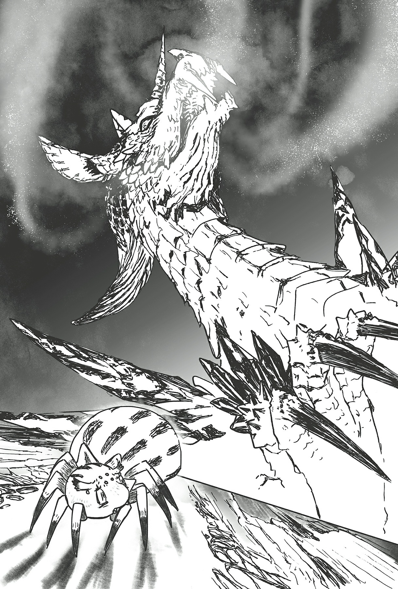

# Chương 9: Nhện vs Ong

*(Spider vs Bee)*

---

### --- TRANG 142 ---

Sau khi con Địa Long rời đi, tôi dành thời gian tỉ mỉ quan sát xung quanh mình.

Tuy nhiên, dù có nhìn bao lâu đi chăng nữa, tôi vẫn không hề cảm thấy an toàn chút nào. Nhưng dù có an toàn hay không, tôi vẫn phải làm điều gì đó, nếu không tôi sẽ bị mắc kẹt ở đây cho đến chết mất.

Tôi sử dụng Điều khiển Tơ để kéo dài một sợi tơ về phía con ong vẫn đang bị trói chặt trên mặt đất.

Ư, lưng tôi đau quá. Nhưng tôi có vẻ vẫn có thể nhả tơ mà không gặp vấn đề gì.

Tôi từ từ và thận trọng kéo dài sợi tơ cho đến khi cuối cùng nó kết nối được với mục tiêu của mình.

Con ong vẫn đang giãy giụa, nhưng điều đó lúc này không còn quan trọng nữa.

Tôi chỉ cần thu hồi nó về trước khi một quái vật khác tìm thấy nó.

Mỗi khi kéo tơ, vết thương của tôi lại đau nhói lên.

Cơn đau thật kinh khủng, nhưng HP của tôi không giảm thêm nữa, nên tôi muốn tin rằng mình vẫn ổn.

Cuối cùng, tôi đã thu hồi thành công con mồi của mình.

Ngay lập tức, tôi cắm răng nanh độc vào người nó, kết liễu nó ngay tại chỗ.

Xem xét việc chất độc của tôi dường như hoạt động tốt ngay cả trên các quái vật có độc khác, có lẽ kỹ năng Răng Độc và Kháng Độc của tôi cao hơn so với những đồng loại của mình chăng?

Thôi, chuyện đó bây giờ không thực sự quan trọng.

Vấn đề thực sự là tôi sẽ làm gì tiếp theo đây. Thành thật mà nói, thám hiểm khu vực này có lẽ là tự sát. Có khả năng còn có những quái thú khác như con Địa Long kia, nên cơ hội sống sót của tôi xem ra đang ngày càng giảm dần.

Không tốt chút nào. Tôi chắc chắn đã vượt qua nhiều tình huống nguy hiểm cho đến nay, nhưng lần này lại đáng sợ hơn bất cứ thứ gì trước đó nhiều.

---

### --- TRANG 143 ---

Trong những hoàn cảnh bình thường, tôi khá tự tin vào khả năng chiến đấu của mình.

Gần đây, tôi đã quen với việc đi lang thang quanh hầm ngục và sử dụng các chiến thuật như tấn công bất ngờ, nhưng chung quy lại, tôi vẫn phù hợp nhất với việc giăng lưới và đợi con mồi tự dẫn xác đến. Ý tôi là, tôi thậm chí còn có thể hạ gục con rắn khổng lồ kia chỉ bằng cái tổ tạm thời dựng vội của mình mà. Nên nếu tôi dồn tâm trí vào việc thiết kế một ngôi nhà chuyên dụng cho các trận chiến phòng thủ, không quái vật nào có thể vượt qua được.

Hoặc tôi đã từng nghĩ thế.

Thứ đó chắc chắn sẽ làm được. Thậm chí còn không cần chớp mắt nữa kìa. Con quái vật kinh hoàng đó đủ mạnh để làm điều đó.

Tơ nhện, răng độc, phục kích và tốc độ. Những chiến thuật cơ bản của tôi sẽ chẳng khác nào trò hề trước mặt con rồng đó cả.

Chúng sẽ vỡ vụn trước sức mạnh áp đảo như thế.

Tôi có thể dễ dàng tưởng tượng ra chuyện đó.

Trong suốt cuộc đời tái sinh thành một con nhện này, đây là lần thứ hai tôi chạm trán với một sinh vật thống trị đáng sợ có thể bóp nát tôi một cách dễ dàng.

Nhân tiện, lần đầu tiên là khi tôi nhìn thấy con nhện mẹ (cha?) khổng lồ của mình.

Thực tế là việc tôi không có cơ hội chiến thắng là một vấn đề, chắc chắn rồi. Nhưng tệ hơn nữa là việc nó còn nhanh hơn cả tôi nữa.

Ngay cả khi có thứ gì đó xâm nhập vào tổ của tôi, tôi vẫn có thể bỏ chạy. Tôi có lẽ sẽ tự trách mình như lần trước, nhưng ít nhất tôi có thể thoát thân an toàn.

Với tốc độ đáng kinh ngạc của mình, đó chưa bao giờ là vấn đề cả. Nhưng thứ đó có thể chạy nhanh hơn tôi.

Nếu chiến đấu, không đời nào tôi có thể thắng. Và tôi thậm chí còn không thể trốn thoát được nữa kìa.

Thật sự, nếu thứ đó nhìn thấy tôi, tất cả sẽ kết thúc trong nháy mắt.

Thật là một sinh vật đáng lo ngại.

Nếu biết có một thứ như vậy tồn tại ở đây, tôi thà liều mạng chiến đấu trực diện với con rắn còn hơn.

Và tôi không có cách nào để biết liệu đó có phải là cá thể duy nhất thuộc chủng tộc của nó đang rình rập ở khu vực này hay không.

Đáng sợ quá.

Đây là lúc tôi tiến gần đến cái chết nhất từ trước đến nay. Thành thật mà nói, tôi khá ngạc nhiên khi thấy mình lại sợ hãi đến thế.

Mặc dù đã trải qua tất cả những trải nghiệm nực cười cho đến nay, tôi chưa bao giờ cảm thấy thực sự căng thẳng hay kinh hoàng, nên tôi đã nghĩ mình đã bỏ lại những cảm xúc đó ở phía sau từ lâu rồi.

Nhưng bây giờ tôi biết quá rõ chuyện đó không phải như vậy.

Lý do duy nhất tôi chưa từng trải qua nỗi sợ hãi lớn thế này là vì không có tình huống nào trước đây có thể bắt đầu so sánh được với tình huống này cả. Không phải cảm xúc của tôi đã chết đi, chỉ là tôi chưa có nhu cầu sử dụng đến chúng cho đến tận bây giờ mà thôi.

Ha ha.

Bây giờ mới nhận ra chuyện đó thì hơi muộn rồi. Tại sao tôi không thể nhận ra điều đó trước khi tự đẩy mình vào hoàn cảnh này chứ?

Được rồi, thế là đủ cho việc chìm đắm trong hối hận rồi. Đã đến lúc tìm hiểu xem tôi cần làm gì tiếp theo.

Trước tiên, tôi phải đảm bảo một mức độ an toàn nhất định đã.

Nó sẽ vô dụng trước mặt con rồng đó, nhưng tôi có lẽ vẫn nên dựng một cái mạng nhện xung quanh hốc đá nhỏ này.

Vào lúc này, tôi hoàn toàn không thể rời đi được về mặt thể chất.

Nên lần này, tôi sẽ chơi tất tay. Đã đến lúc xây dựng ngôi nhà thứ ba của mình ở đây rồi. Sau đó, nếu có thể, tôi muốn dụ và tiêu diệt một số quái vật yếu như lũ ong kia.

Mục tiêu của tôi là tăng cấp để các vết thương có thể lành lại hoàn toàn. Cho đến khi phục hồi, tôi không thể làm được gì nhiều cả. Trong tình trạng hiện tại của tôi, chỉ một cái chạm nhẹ từ con quái vật yếu nhất cũng đủ để giết chết tôi rồi.

Tốt nhất là không nên hy vọng những vết thương này sẽ tự lành lại.

Trời ạ, ước gì tôi có kỹ năng tự động hồi phục HP nào đó nhỉ. Nhưng cằn nhằn về chuyện đó cũng chẳng ích gì. Tôi chỉ cần chấp nhận hoàn cảnh của mình và cố gắng vực dậy bản thân thôi.

Dù sao thì, việc đầu tiên cần làm là xây dựng một căn cứ xung quanh cái hốc nhỏ này.

Thành thật mà nói, dựng tổ ở đây có lẽ không phải là ý kiến hay cho lắm. Nó sẽ chỉ làm cho sự hiện diện của tôi trở nên rõ ràng hơn, và nếu một quái vật như con rồng đó phát hiện ra tôi, tôi sẽ tiêu đời.

Tuy nhiên, với vết thương nghiêm trọng hiện tại, tôi không có nhiều sự lựa chọn.

Nên tôi chỉ có thể cố gắng tăng cấp mà thôi.

Một khi làm được điều đó và hồi phục vết thương, tôi có thể nghĩ đến việc trốn thoát khỏi khu vực nguy hiểm này.

Tôi nên cố gắng đi lên qua đàn ong khổng lồ kia hay tiếp tục thám hiểm bên dưới bất chấp nguy hiểm đây? Cả hai lựa chọn đều có vẻ dẫn thẳng xuống địa ngục cả.

Tuy nhiên, bây giờ tôi đã rơi xuống tận đáy cái hố này rồi, tôi thực tế đã ở sẵn trong địa ngục rồi. Câu hỏi duy nhất là tôi sẽ sống hay chết ở đây mà thôi. Và tại thời điểm này, chuyện đó phần lớn phụ thuộc vào vận may.

Tại thời điểm này, tôi muốn nói cán cân đang nghiêng hẳn về phía tôi sẽ chết. Liệu tỷ lệ cược của tôi có tiếp tục giảm đi không, hay tôi có thể nghiêng cán cân theo hướng ngược lại đây?

Thì, ít nhất tôi cũng sẽ cố gắng thử xem sao.

May mắn thay, tôi ít nhất vẫn còn đủ thể lực để giăng mạng nhện. Một con ong vẫn rất to lớn, nên nó là một nguồn thức ăn vững chắc.

Tôi sẽ phải sử dụng từng chút thể lực mà con ong này cung cấp cho mình để xây dựng ngôi nhà mới.

Từ đây, mọi chuyện sẽ phụ thuộc vào các kỹ năng và vận may của tôi.

Vào ngày đầu tiên, tôi dựng một cái mạng nhện cơ bản nhất có thể rồi đi ngủ.

Tôi không thể nói mình đã ngủ ngon, chủ yếu là do cơn đau ở lưng, nhưng ít nhất tôi đã không bị tấn công trong lúc ngủ.

Bên cạnh khả năng bị tấn công, tôi cũng đã lo lắng rằng mình có thể chết vì vết thương trong lúc bất tỉnh nhân sự hoặc tương tự, nên tôi vô cùng nhẹ nhõm khi tỉnh dậy một cách an toàn.

HP của tôi vẫn ở mức 6, giống như trước khi tôi đi ngủ.

Tôi không biết nên thất vọng vì nó không hồi phục hay nhẹ nhõm vì nó không giảm thêm nữa đây.

Tôi dành toàn bộ ngày thứ hai để mở rộng mạng nhện.

Cơn đau ở lưng đóng một vai trò không nhỏ trong việc làm cho quá trình xây dựng ngôi nhà này trở nên khó khăn hơn tôi tưởng nhiều.

Vì lũ ong cứ liên tục vo ve quá gần khiến tôi không thoải mái, tôi thường xuyên phải dừng công việc lại và tìm chỗ ẩn nấp.

Không giống như các dự án xây dựng trước đây của mình, tôi phải liên tục cảnh giác trong lúc giăng lưới, và chuyện đó đang bào mòn dây thần kinh của tôi.

Khi có thời gian rảnh rỗi, tôi tập trung ăn con ong từ ngày hôm qua từng chút một, để đảm bảo mình không bị cạn kiệt thể lực. Trong tình huống này, tôi không thể mạo hiểm để mình tiến gần đến cái chết hơn mức hiện tại được. Thể lực, đặc biệt, là cực kỳ quan trọng đối với sự sống sót của tôi. Tôi cần nó để tạo ra tơ và thậm chí là di chuyển xung quanh. Nên ít nhất, tôi phải chú ý tiết kiệm đủ thể lực cho ít nhất một trận chiến.

---

### --- TRANG 146 ---

Thêm vào đó, tôi không biết khi nào mình mới kiếm được thức ăn tiếp theo sau chuyện này, nên tôi phải rất cẩn thận trong việc quản lý thể lực của mình phòng trường hợp bị cuốn vào một cuộc chiến tiêu hao.

Trong lúc làm việc, tôi phát hiện ra kỹ năng Kháng Đau của mình đã tăng vọt lên khá nhiều cấp độ.

Lần cuối tôi nhớ, nó mới chỉ lên cấp độ 2, nhưng ở giữa quá trình giăng lưới của mình, Lời của Thần (tạm gọi) đã cất tiếng:

`<Độ thuần thục đã đạt mức yêu cầu. Kỹ năng [Kháng Đau LV 1] đã trở thành [Kháng Đau LV 7].>`

Wait, không phải, thực ra nó đã là:

`<Độ thuần thục đã đạt mức yêu cầu. Kỹ năng [Kháng Đau LV 6] đã trở thành [Kháng Đau LV 7].>`

Nên bây giờ nó đột ngột đạt cấp 7.

Tôi không biết làm sao chuyện đó lại xảy ra, nhưng dự đoán của tôi là nó đã tăng lên trong lúc tôi đang ngủ.

Đó chắc chắn không phải là một giấc ngủ thoải mái, nên nếu điều kiện duy nhất để tăng độ thuần thục của kỹ năng đó là cảm nhận cơn đau, khả năng cao là tôi đã tích lũy được rất nhiều trong đêm.

Nghĩ lại thì, tôi thực sự có cảm giác như mình đã nghe thấy Lời của Thần (tạm gọi) vang lên trong giấc mơ của mình vậy.

Hóa ra kỹ năng Kháng Đau không thực sự làm giảm bớt sự khó chịu của bạn như mong đợi.

Nó đã thăng tiến lên tận cấp độ 7 rồi, nhưng cơn đau dường như không hề dịu đi chút nào so với trước đó cả. Cuối cùng, tôi nhận ra tác dụng của nó có lẽ giống như "cho phép bạn di chuyển xung quanh trong khi chịu đựng cơn đau" hơn.

Thật sự đấy, cái quái gì thế không biết.

Nó không hề bớt đau đi chút nào, và dù tôi có thể di chuyển, ít nhất thì các lựa chọn của tôi vẫn bị hạn chế.

Khi mới nhận được kỹ năng này, tôi cảm thấy cơn đau có dịu đi một chút, nhưng có lẽ đó chỉ là do tôi tự tưởng tượng ra mà thôi.

Đến cuối ngày hôm đó, kỹ năng Kháng Đau của tôi đã lên tới cấp 8.

Ngày thứ ba.

Tôi đã ăn xong con ong bắt được. Tôi cũng đã mở rộng các mạng lưới của tổ mình hết mức có thể rồi, nên bây giờ đã đến lúc chuyển sang giai đoạn tiếp theo.

Cụ thể là, đi săn để tăng cấp độ của mình.

Câu hỏi là, làm thế nào tôi có thể bắt được con mồi đây?

---

### --- TRANG 147 ---

Lũ ong đến khá gần, nhưng chúng chắc chắn đang cảnh giác với tôi hoặc đại loại thế, vì chúng thực tế vẫn chưa tấn công tôi.

Tôi đã hy vọng chúng sẽ chỉ lao thẳng vào tôi mà không cần suy nghĩ gì, nhưng mọi chuyện đã không diễn ra suôn sẻ như vậy.

Trước mắt, tôi ngước nhìn lũ ong khi chờ đợi một cơ hội.

Tôi đã thử gián tiếp khiêu khích những con đến gần, cùng nhiều trò khác, nhưng chúng vẫn không thèm lao vào tôi.

Khi quan sát lũ ong, tôi nhận thấy vài điều.

Trước tiên, chúng nhìn chung có vẻ lập thành các nhóm năm hoặc sáu con. Mỗi tiểu đội hoạt động một cách riêng biệt.

Và các tiểu đội đều có một thủ lĩnh.

`<Finjicote Cấp cao       LV 1: Thẩm định trạng thái thất bại>`

Một phiên bản cao cấp hơn của finjicote.

Đánh giá qua cái tên, nó có lẽ là một chủng tộc mạnh hơn, thậm chí có thể là một hình thái tiến hóa.

Hầu hết chúng đều ở cấp độ 1, nên đó có vẻ là một khả năng rất cao.

Trong số các con ong thường, có một số con ở cấp độ 8 hoặc 9, không còn xa so với ngưỡng tăng cấp, nên có lẽ chúng có thể trở thành thủ lĩnh của tiểu đội riêng một khi tiến hóa.

Con ong đội trưởng này có màu sắc sẫm hơn một chút so với những con ong thường. Đó về cơ bản là điểm khác biệt duy nhất; kích thước và hình dáng của chúng thì giống hệt nhau.

Vì Thẩm định trạng thái vẫn thất bại như thường lệ, tôi không thể chắc chắn, nhưng có lẽ an toàn khi giả định rằng các chỉ số của chúng cao hơn Basic bees.

Thôi thì, có lẽ vẫn chưa đủ để xé toạc mạng nhện của tôi đâu.

Chúng có lẽ cũng nhận ra điều đó, điều này giải thích tại sao chúng không thực hiện bất kỳ cú lao người vô ích nào vào tôi cả.

Trong trường hợp đó, lũ ong này có vẻ khá thông minh đấy.

Thỉnh thoảng, một tiểu đội sẽ tách ra và biến mất vào một trong các lối hành lang dưới đáy hố.

Sau một lúc, chúng sẽ quay trở lại mang theo một số con mồi đã bị đánh bại. Đó có vẻ là cách chúng đi săn: theo các nhóm được tổ chức một cách hiệu quả.

Nên chúng thực sự là những sinh vật thông minh.

Tuy nhiên, có một vài con ong cô độc có vẻ hoạt động một mình.

Quan trọng hơn, khả năng săn quái vật của lũ ong ở dưới này là một thông tin cực kỳ quan trọng.

Điều đó có nghĩa là không phải mọi thứ ở dưới này đều mạnh mẽ một cách dị thường như con Địa Long kia.

Chỉ riêng một mẩu tin nhỏ đó thôi cũng làm tôi cảm thấy khá khẩm hơn một chút rồi.

Nói thế chứ, không phải tất cả các tiểu đội đều quay trở lại, nên tôi không được phép lơ là cảnh giác quá nhiều. Thực tế đó gợi ý rằng có một số quái vật ngoài kia có thể lật ngược thế cờ chống lại nhóm ong. Một số nhóm đi săn quay trở lại cũng mang theo xác của đồng đội mình, nên không nghi ngờ gì đây là một khu vực vô cùng nguy hiểm.

Tôi tiếp tục quan sát tình hình của lũ ong thêm một lúc nữa.

Ngay khi tôi đang cân nhắc việc chợp mắt một chút, tôi nhận được một thông báo từ Lời của Thần (tạm gọi).

`<Độ thuần thục đã đạt mức yêu cầu. Kỹ năng [Kháng Đau LV 9] đã trở thành [Vô hiệu Đau].>`

`<Đủ điều kiện. Kỹ năng [Giảm Đau LV 1] đã được rút ra từ kỹ năng [Vô hiệu Đau].>`

Kỹ năng Kháng Đau của tôi lại tăng cấp một lần nữa.

Tôi thậm chí còn không nhận ra nó đã tăng từ cấp 8 lên 9 từ lúc nào. Chuyện đó chắc hẳn lại xảy ra trong lúc tôi đang ngủ rồi.

Tên của kỹ năng cũng đã đổi thành "Vô hiệu," và bộ đếm cấp độ cũng biến mất luôn. Tôi chắc chắn đã đạt đến giới hạn độ thuần thục tối đa rồi.

Sau Dạ Nhãn, đây là kỹ năng thứ hai tôi nâng lên mức tối đa.

Và có vẻ như Dạ Nhãn ban đầu đã ở cấp độ cao sẵn rồi, nghĩa là đây là lần đầu tiên tôi tự mình nâng cấp một kỹ năng từ đầu lên tận cấp 10.

Mặc dù thành thật mà nói tôi không chắc chuyện này có xứng đáng với tất cả những ký ức đau đớn tột cùng mà tôi đã trải qua trong quá trình cày cuốc hay không nữa.

Thôi thì, kỹ năng phái sinh có vẻ thực sự làm dịu cơn đau, nên chuyện đó rất tốt. Không phải là Kháng Đau hoàn toàn vô dụng, chính xác là vậy, nhưng dẫu sao thì.

Ở cấp độ 1, không có nhiều thay đổi lắm. Vết đốt ở lưng tôi vẫn nhức nhối như thường lệ.

Nếu tôi nâng cấp độ của kỹ năng này lên, cơn đau có lẽ sẽ dễ chịu đựng hơn một chút, nên tôi chỉ có thể hy vọng nó sẽ tự tăng lên trong lúc tôi đang ngủ mà thôi.

Nên không chần chừ gì thêm nữa, tôi đi ngủ thôi.

Ngày thứ tư.

Tôi đang bắt đầu cạn kiệt dần thể lực, nên tôi có lẽ sẽ phải hành động sớm thôi.

---

### --- TRANG 149 ---

Mục tiêu của tôi là một trong những con ong đơn độc. Rủi ro khi thách đấu cả một nhóm là quá cao.

Tôi không nhất thiết nghĩ mình không có cơ hội chiến thắng. Nhưng ở đây tốt hơn hết là nên chọn giải pháp an toàn.

Nếu có nhiều kẻ địch tham gia, đủ loại vấn đề không lường trước được có thể phát sinh. Về mặt đó, đối phó với một kẻ cô độc sẽ dễ dàng hơn nhiều.

Vì lũ ong cô độc không có đội trưởng, khả năng nhận thức của chúng không mạnh lắm. Dựa trên những quan sát của tôi từ ngày hôm trước, một số cá thể sẵn sàng đi vào những đường hầm hẹp mà các nhóm ong sẽ không bao giờ tiếp cận.

Khả năng cao là con ong duy nhất tôi bắt được trong mạng nhện của mình trước đây là một con cô đơn đi lạc vào một lối hành lang kỳ lạ và bị mất phương hướng.

Nhưng nghĩ lại thì, tôi không thể tưởng tượng nổi gã đó lại có thể đi một quãng đường dài như thế từ nơi này đến cái tổ trước đây của tôi, nên có lẽ có một cái tổ khác ở gần khu vực đó hơn.

Lũ ong đi lạc tôi quan sát thấy có vẻ không được thông minh cho lắm. Thực tế là, biết đâu chúng đã thất bại trong việc gia nhập nhóm vì chính lý do đó và cam chịu một cuộc sống cô độc thì sao.

Dù thế nào đi nữa, tôi nghĩ việc khiêu khích chúng tấn công tôi sẽ dễ dàng hơn.

Nhưng tôi không có kế hoạch sử dụng một cách tiếp cận dựa trên may rủi như vậy.

Thay vào đó, tôi lấy ra thứ vũ khí mới mà tôi vừa nghĩ ra ngày hôm qua.

Đó là một sợi tơ với một quả cầu tơ cứng hơn và dính hơn được gắn ở đầu. Tôi gọi nó là Sao Mai Nhện!

Hắc hắc hắc. Tôi sẽ sử dụng sức mạnh và Điều khiển Tơ của mình để vung thứ này vào một con ong đang ở trên không trung.

Tôi có lẽ—không, gần như chắc chắn—sẽ ném trượt.

Nhưng chuyện đó hoàn toàn ổn.

Nó sẽ đủ để mục tiêu nhận diện tôi là kẻ thù. Sau đó, nó sẽ tự động bay xuống tấn công tôi, tôi hy vọng là vậy.

Nếu tôi ném trúng thì tuyệt vời. Nếu không, miễn là tôi có thể khiến nó nhìn về phía mình và coi tôi là kẻ thù, tôi sẽ coi đó là một chiến thắng. Sau đó, tôi chỉ cần hy vọng nó sẽ tiếp cận mạng nhện của tôi mà thôi.

Đánh giá qua cách mọi chuyện diễn ra ngày hôm qua, lũ ong cô độc thỉnh thoảng sẽ bay xuống để kiểm tra xem có chuyện gì đang diễn ra xung quanh nhà tôi không, nên chuyện này chắc chắn sẽ hiệu quả thôi.

---

### --- TRANG 150 ---

`<Độ thuần thục đã đạt mức yêu cầu. Kỹ năng [Giảm Đau LV 2] đã trở thành [Giảm Đau LV 3].>`

Trong lúc tôi đang chờ đợi, kỹ năng Giảm Đau mới của tôi đã tăng cấp.

Hửm? Tốc độ cải thiện của cái này có vẻ chậm hơn so với Kháng Đau nhỉ. Tôi đã nghĩ ít nhất nó cũng phải lên đến cấp 5 trong giấc ngủ của mình chứ, nhưng nó không thay đổi nhiều lắm.

Tuy nhiên, bây giờ cấp độ đã tăng lên, rõ ràng là kỹ năng đang hoạt động.

Nên Giảm Đau thực sự có tác dụng giảm nhẹ cơn đau. Nhờ có nó, vết đau buốt ở lưng tôi bây giờ đã dễ chịu hơn nhiều rồi.

Đó là một vết thương khá nặng đấy.

Tôi đã sơ cứu bằng cách băng bó nó lại bằng Điều khiển Tơ, nhưng vẫn có một cái hốc lớn trên lưng tôi.

Nếu tôi vẫn còn là con người, tôi biết mình đã chết chắc vì một vết rách khổng lồ như thế này rồi.

Liệu tôi sống sót là vì tôi là nhện hay vì tôi là quái vật đây? Dù thế nào đi nữa, đó là một vết thương nghiêm trọng đến mức việc tôi còn sống quả là một phép màu.

Thỉnh thoảng tôi có sử dụng Điều khiển Tơ để làm sạch vết thương, hy vọng có thể loại bỏ bớt chất độc trong lúc đó, nhưng nó đau đến mức tôi tưởng mình sắp chết luôn rồi.

Tôi phải tăng cấp càng sớm càng tốt để chữa lành vết thương. Nếu tôi cứ để yên như vậy lâu hơn nữa, tình hình sẽ sớm trở nên tồi tệ hơn mà thôi.

Mưng mủ, hoại tử, nhiễm trùng vi khuẩn... Tôi cần phải làm gì đó trước khi bất kỳ triệu chứng mới nào xuất hiện.

Và bây giờ, cuối cùng, cơ hội của tôi đã đến.

Một trong những con ong cô độc đang hướng về phía tôi.

Không có con nào khác xung quanh cả. Nếu có, khả năng cao là chúng sẽ lao đến viện trợ cho con ong cô độc kia.

Vì chuyện đó lúc này không phải là vấn đề, đây quả là một cơ hội tuyệt vời.

Tôi xoay vòng vòng cây Sao Mai Nhện của mình.

Tập trung... tập trung nào...

Nhắm mục tiêu, và... ngay bây giờ!

`<Độ thuần thục đã đạt mức yêu cầu. Nhận được kỹ năng [Tập trung LV 1].>`

Oa, tôi ném trúng rồi. Và tôi thậm chí còn nhận được một kỹ năng mới cùng một lúc nữa chứ.

Ồ-ồ.

---

### --- TRANG 151 ---

Tôi đã không kỳ vọng mình sẽ ném trúng phát nào, nhưng Sao Mai Nhện đã đập thẳng vào cơ thể con ong một cách chính xác.

Không chút do dự, tôi sử dụng Điều khiển Tơ để quấn sợi tơ xung quanh con ong ngay lập tức. Sau đó tôi lịch sự mời nó vào tổ của mình. Và giới thiệu nó với răng nanh độc của tôi.

Được rồi.

Mọi chuyện đã diễn ra tốt đẹp nhất có thể, từ đầu đến cuối. Có lẽ vận may của tôi đang bắt đầu đảo chiều rồi chăng.

Không, không, không.

Tôi không thể để mình bị cuốn đi được. Sự tự tin thái quá đó đã không mang lại kết quả tốt đẹp cho tôi trong quá khứ rồi. Tôi phải giữ thái độ khiêm tốn mới được.

Tôi thực hiện bước đi đầu tiên bằng cách thưởng thức bữa ăn đầu tiên của mình sau một thời gian dài.

Giờ thì, đến giờ ăn rồi.

Vào lúc này, tôi đã đảm bảo được một lượng thức ăn nhất định. Với kích thước cơ thể của con ong, tôi có thể ngăn chặn cơn đói trong ít nhất vài ngày với thứ này. Bây giờ tôi không cần phải lo lắng về thể lực trong một thời gian nữa rồi.

Nghĩa là tôi có nhiều lựa chọn hơn.

Và lựa chọn của tôi là mở rộng tổ của mình hơn nữa. Theo hướng đi lên.

Tôi thực sự không muốn thám hiểm bên dưới này chút nào cả. Đây không phải là vấn đề tôi có thể hay không thể làm được. Chỉ đơn giản là tôi không muốn thôi.

Không đời nào. Tôi sợ con rồng đó phát điên đi được. Nên đó chắc chắn là một quyết định từ chối thẳng thừng.

Đó là lý do tại sao tôi quyết định rằng mình sẽ bằng cách nào đó leo ngược trở lại lối hành lang nơi tôi đã rơi xuống.

Để đạt được mục tiêu đó, tôi phải tìm một con đường vòng qua đàn ong kia.

Nếu tôi chỉ cố gắng leo tường một cách bình thường, lũ sinh vật bay lượn kia sẽ tóm được tôi ngay lập tức, nên tôi cần một kế hoạch nào đó.

Chiến lược của tôi rất đơn giản là tiếp tục kéo dài mạng nhện của mình đi lên trên.

Thì, tôi không biết đây có được tính là một chiến lược hay chỉ đơn giản là một nỗ lực mơ hồ nhằm húc đầu trực diện vào vấn đề nữa.

Ý tôi là, tôi là một kẻ mưu mẹo, nếu tôi tự nói thế về bản thân mình. Nhưng tôi không thể nghĩ ra cách nào khác để quay trở lại trên kia cả.

Tất nhiên, cũng có rất nhiều bất lợi cho kế hoạch này.

Một điều là, giăng thêm mạng lưới sẽ vắt kiệt thể lực của tôi.

Và không giống như bình thường, lần này tôi phải dựng nó dọc theo một vách đá dựng đứng.

---

### --- TRANG 152 ---

Vì hoàn cảnh khác biệt, tôi không biết mình sẽ phải tốn thêm bao nhiêu thể lực nữa.

Đây có lẽ sẽ là một cái tổ khá lớn đấy, nên chỉ một con ong tôi hiện có trong tay sẽ không cung cấp đủ năng lượng cho toàn bộ dự án này đâu.

Nên tôi phải tìm cách tăng nguồn cung cấp của mình lên.

Trên hết, tôi có lẽ sẽ phải chiến đấu với lũ ong vì những lý do khác ngoài việc nguồn thức ăn bị giảm dần.

Chúng đang phớt lờ tôi vào lúc này, nhưng nếu tôi tiếp tục mở rộng tổ của mình đi lên trên, cuối cùng tôi sẽ xâm phạm vào lãnh thổ chính của chúng.

Đó sẽ là một hành vi vi phạm không phận. Không có cách nào để biết liệu chúng có bỏ qua chuyện đó hay không cả.

Tình huống tồi tệ nhất, hoàn toàn có khả năng hàng trăm hay thậm chí hàng ngàn con ong sẽ tấn công tôi cùng một lúc. Thật là một cơn ác mộng.

Rõ ràng, không có lượng mạng nhện nào là đủ để bảo vệ tôi chống lại số lượng đông đảo như thế cả. Và lũ ong không phải là thứ duy nhất tôi phải lo lắng.

Vào lúc này, không có quái vật nào khác xuất hiện dưới đáy cái hố này cả.

Chỉ có con rắn đầu tiên và con Địa Long kia mà thôi.

Nhưng nếu con rồng đó tình cờ đi ngang qua đây một lần nữa...

Lần trước, tôi có thể chờ nó đi qua bằng cách trốn dưới các tảng đá, nhưng nếu tôi đang mở rộng tổ của mình, tôi sẽ thu hút sự chú ý bất kể tôi có muốn hay không.

Và nếu tôi lọt vào mắt xanh của thứ đó, tất cả sẽ kết thúc.

Ngay cả bây giờ, tôi vẫn lo sợ con quái vật khổng lồ đó có thể xuất hiện bất cứ lúc nào.

Nói cách khác, trong khi thành công sẽ có nghĩa là trốn thoát khỏi cái địa ngục nguy hiểm này, đây vẫn là một chiến lược vô cùng rủi ro.

Nhưng có vẻ như tôi không còn lựa chọn nào khác cả.

Ngay cả khi tôi có, cũng chẳng có lựa chọn nào tự tìm đến với tôi lúc này cả.

Và thế là, tôi đã quyết định xong. Đã đến lúc mở rộng tổ của mình rồi!

Đầu tiên là phần nền móng. Bạn không thể xây nhà mà không có một cái nền vững chắc được. Thậm chí có thể nói nền móng là thứ quyết định sự thành bại của một ngôi nhà.

Và còn tảng đá nào tốt hơn để sử dụng cho việc xây dựng hơn... tảng đá này chứ!

Nơi trú ẩn đầu tiên của tôi ở dưới đáy này.

Tảng đá tựa sát vào tường và khá lớn: cao khoảng hai mươi feet và rộng mười lăm feet. Tôi quyết định sử dụng nó làm điểm tựa cho phần mở rộng của mình.

Cho đến nay, các mạng nhện của tôi đã chiếm khoảng trống giữa tảng đá này và bức tường và một

---

### --- TRANG 153 ---

quãng nhỏ vượt ra ngoài đó.

Đầu tiên, tôi bịt kín không gian giữa tảng đá và bức tường đối diện bằng nhiều sợi tơ hơn. Sau đó, tôi thêm một sợi tơ chéo từ đỉnh tảng đá đến bức tường. Tiếp theo, tôi kết nối bức tường và tảng đá bằng nhiều mạng lưới hơn, sử dụng sợi tơ chéo đó làm đường dẫn.

Bây giờ nền móng của tôi đã hoàn thành.

Tất cả những gì tôi phải làm bây giờ là xây dựng đi lên từ đó, từng bước một.

Tôi tiến hành công việc của mình từng chút một, thỉnh thoảng dừng lại để ăn con ong lấy thể lực.

Dọc đường đi, thỉnh thoảng tôi nhận thấy một vài tiểu đội ong đang quan sát mình, nhưng chúng vẫn chưa thực hiện bất kỳ cuộc tấn công nào cả.

Có vẻ như tôi vẫn chưa nằm trong phạm vi tấn công của chúng.

Khi ăn xong con ong, tôi quyết định nghỉ ngơi một ngày.

Bây giờ là ngày thứ năm.

Cơn đau có vẻ đã giảm đi đáng kể rồi. HP của tôi vẫn là 6.

Vì nó không hề hồi phục chút nào, kỹ năng Giảm Đau của tôi chắc hẳn đã tăng cấp trong lúc tôi đang ngủ.

Không còn phải chịu đựng sự đau đớn tột cùng quả là một sự thay đổi dễ chịu.

Tôi đã có thể làm việc suốt thời gian qua nhờ vào kỹ năng Vô hiệu Đau của mình, nhưng việc cơn đau dịu đi vẫn mang lại sự khác biệt vô cùng lớn.

Tất nhiên, cảm giác đó không biến mất hoàn toàn, và vết thương vẫn chưa lành hẳn, nhưng dù sao thì. Nó chắc chắn là dễ dàng hơn nhiều rồi.

Tôi chưa bao giờ phải chịu đựng một vết thương nghiêm trọng thế này khi còn là con người.

Cho đến trước khi tái sinh, trải nghiệm đau đớn nhất tôi từng có là khi tôi vấp ngón chân út vào góc cửa. Trời ạ, cái đó đau phát điên lên được.

Nhưng nó chẳng là gì so với một cái hốc lớn trên lưng tôi lúc này cả.

Vì tôi bắt đầu cảm thấy khá hơn một chút, công việc đang tiến triển rất suôn sẻ.

Dọc đường đi, một con ong cô độc khác lại xuất hiện. Nhưng một trong những tiểu đội ong cũng đang ở khá gần đó. Hừm.

Như một thử nghiệm nhỏ, tôi quyết định thử tấn công nó xem sao. Tôi muốn biết liệu nhóm ong gần đó có phản ứng gì không nếu một con ong cô đơn bị tấn công. Nếu chúng phản ứng, tôi sẽ ngay lập tức rút lui sâu vào trong tổ của mình. Và nếu chúng không phản ứng, tôi sẽ tiếp tục hành động.

Tôi vung cây Sao Mai Nhện của mình.

---

### --- TRANG 154 ---

Nhắm mục tiêu, và... ngay bây giờ!

Ồ, tôi ném trúng rồi.

Oa. Tôi có tuyệt vời không cơ chứ?

Tôi đã không kỳ vọng mình sẽ ném trúng bất cứ thứ gì với cái này, nhưng bây giờ tỷ lệ của tôi là hai trên hai rồi đấy nhé.

Tôi, kẻ đã đứng bét bảng toàn khối trong môn ném bóng mềm ở buổi kiểm tra thể chất trường học ngày xưa...

Ối, tôi ngạc nhiên đến mức quên mất việc quan sát phản ứng của nhóm ong chính rồi.

Tiểu đội ong đang... ở đằng kia. Hừm. Không có phản ứng gì cả. Nên nếu tôi hành hạ một con ong cô độc, những con khác sẽ không đuổi theo tôi.

Có phải chỉ là ảo giác của tôi thôi không, hay chuyện này có hơi vô tình quá mức vậy nhỉ?

Tôi đoán có lẽ bạn phải lạnh lùng một chút mới có thể sống sót ngoài thế giới hoang dã được...

Thôi thì, nếu chúng không tấn công, đó là một chiến thắng đối với tôi rồi. Bây giờ tôi có thể nhặt nhạnh những con đi lạc theo ý muốn của mình. Tôi thực sự cười thầm một mình khi thu hồi chiến lợi phẩm của mình và kết liễu nó bằng cú cắn độc.

Khi tôi đi săn thêm một con ong đi lạc khác (tôi đã mất dấu số lượng tại thời điểm này rồi), tôi nghe thấy giọng nói mà tôi đã chờ đợi bấy lâu nay.

`<Điểm kinh nghiệm đã đạt mức yêu cầu. Cá thể Tiểu Taratect đã tăng từ LV 2 lên LV 3.>`

`<Tất cả các chỉ số cơ bản đều tăng lên.>`

`<Nhận được phần thưởng tăng cấp độ thuần thục kỹ năng.>`

`<Độ thuần thục đã đạt mức yêu cầu. Kỹ năng [Sức mạnh LV 1] đã trở thành [Sức mạnh LV 2].>`

`<Độ thuần thục đã đạt mức yêu cầu. Kỹ năng [Cứng cáp LV 1] đã trở thành [Cứng cáp LV 2].>`

`<Độ thuần thục đã đạt mức yêu cầu. Kỹ năng [Phàm ăn LV 1] đã trở thành [Phàm ăn LV 2].>`

`<Nhận được điểm kỹ năng.>`

Thời khắc tăng cấp mong đợi từ lâu của tôi cuối cùng đã đến rồi.

Lớp da của tôi nhanh chóng bong ra khỏi cơ thể.

Mặc dù không thể nhìn thấy, tôi có thể cảm nhận được cái hốc lớn trên lưng mình đang tự khép miệng lại một cách hoàn chỉnh.

`<Độ thuần thục đã đạt mức yêu cầu. Nhận được kỹ năng [Tự hồi phục HP LV 1].>`

Hử? Thật sao?

---

### --- TRANG 155 ---

Ồ-ồ. Cái này đúng là bất ngờ thật đấy.

Khoan đã, vậy việc hồi phục hoàn toàn với mỗi lần tăng cấp có được tính là tự hồi phục không thế?

Tôi hoàn toàn rất vui mừng, nhưng nếu tôi có thể đưa ra một lời góp ý mang tính xây dựng, tôi thà nhận được kỹ năng đó sớm hơn một chút...

Thế thì tôi đã không phải chịu đựng nhiều đau khổ như thế này suốt thời gian qua rồi. Nhưng không nên đòi hỏi quá nhiều khi được ban tặng điều gì đó. Phản ứng đúng đắn duy nhất là ăn mừng việc cuối cùng cũng tăng cấp và quét sạch rất nhiều lo lắng của tôi.

Thật sự đấy, đó quả là một tình huống ngàn cân treo sợi tóc. Đúng như tôi lo sợ ban đầu, HP của tôi đã bắt đầu sụt giảm.

Khi nó lần đầu tiên giảm từ 6 xuống 5, tôi đã cảm nhận được sự chắc chắn của cái chết đang lơ lửng trên đầu mình.

Sau đó, nó tiếp tục từ từ giảm xuống, và vào thời điểm tôi tăng cấp, nó đã giảm xuống chỉ còn vỏn vẹn 3 điểm.

Thực sự là quá cận kề rồi đấy.

Cảm ơn trời đất vì tôi đã kiềm chế được sự lo lắng của mình đủ lâu để tập trung vào việc bắn hạ lũ ong đó.

Cuộc đi săn đang diễn ra rất suôn sẻ. Ngạc nhiên là các đòn tấn công tầm xa của tôi với Sao Mai Nhện đều trúng đích mọi lúc.

Tôi không thể hiểu nổi chuyện đó. Đây có phải là một lợi thế khác của cơ thể nhện không nhỉ?

Có lẽ nhờ thế, tôi đã nhận được hai kỹ năng cấp 1 mới: [Ném] và [Đánh trúng].

Cả hai kỹ năng đó có lẽ sẽ làm cho các đòn tấn công Sao Mai Nhện của tôi tốt hơn nữa.

And với lần tăng cấp mới nhất này, ba kỹ năng của tôi cũng đã được tăng sức mạnh nữa.

Tôi không thực sự biết bất kỳ kỹ năng nào trong số chúng có tác dụng gì, nhưng nếu chúng tăng cấp, tôi chắc chắn phải tích lũy được độ thuần thục cho chúng bằng cách nào đó rồi, nên có khả năng là tôi đang được hưởng lợi từ chúng mà không hề nhận ra đấy chứ.

Thôi thì, việc tăng cấp cho chúng chắc chắn là không có hại gì rồi. Mặc dù cái kỹ năng Phàm ăn đó thực sự làm tôi hơi khó chịu...

Trong lúc làm việc với các mạng nhện và đi săn ong, tôi đã sử dụng Tơ Nhện và Điều khiển Tơ đủ nhiều để chúng cũng thăng hạng luôn.

Kỹ năng Tơ Nhện bây giờ đạt cấp độ 8, và Điều khiển Tơ đạt cấp độ 5.

Kỹ năng sau chắc chắn hữu dụng hơn tôi nghĩ ban đầu nhiều.

Ở cấp độ 5, tôi có thể điều khiển các sợi tơ với tốc độ và độ chính xác vượt trội hơn hẳn.

Việc chọn kỹ năng đó quả là một quyết định tuyệt vời mà.

Giảm Đau bây giờ cũng đạt cấp độ 5 rồi, chuyện đó làm cuộc sống của tôi càng thêm dễ dàng hơn.

---

### --- TRANG 156 ---

Điều tốt ở kỹ năng này, bên cạnh lợi ích rõ ràng là ít đau hơn, là ngay cả khi tôi không cảm thấy khó chịu, tôi vẫn có thể nhận biết được khi mình đang ở trong một tình huống nguy hiểm.

Cơn đau có một chức năng của nó, suy cho cùng, như một tín hiệu cảnh báo bạn về các mối đe dọa hoặc tình trạng tồi tệ của cơ thể. Nên nếu bạn không thể cảm nhận được nó, bạn sẽ không biết khi nào cơ thể mình đang gặp nguy hiểm, nhưng với kỹ năng này, tôi vẫn có thể biết được một vết thương sâu hay nghiêm trọng đến mức nào ngay cả khi tôi miễn nhiễm với bất kỳ cảm giác nào mà nó thường gây ra.

Thật khó để diễn tả một ấn tượng trực quan như thế thành lời, nhưng có chăng, tôi muốn nói nó giống như tôi có một sự nhận biết về sự bất an hay trầm trọng hoặc tương tự từ vết thương vậy.

Dù sao thì, nhờ thế, không có bất lợi nào cho việc giảm cơn đau cả.

Nói thế chứ, kỹ năng này vẫn mới chỉ cấp độ 5, nên không phải là cơn đau hoàn toàn biến mất đâu nhé.

Bây giờ tôi đã tăng cấp rồi, tôi nghĩ mình nên xem các chỉ số của mình đã thay đổi bao nhiêu.

`<Tiểu Taratect LV 3 | Không tên>`

| Chỉ số | Giá trị |
| :--- | :--- |
| **HP** | 38/38 (xanh lá) |
| **MP** | 38/38 (xanh lam) |
| **SP (vàng)** | 38/38 |
| **SP (đỏ)** | 38/38 |
| **Sức công kích trung bình** | 21 |
| **Sức phòng ngự trung bình** | 21 |
| **Sức ma pháp trung bình** | 19 |
| **Sức kháng trung bình** | 19 |
| **Tốc độ trung bình** | 369 |

Ồ hô hô.

HP, MP, và SP của tôi đều tăng thêm 2 điểm mỗi loại, sức công kích và phòng ngự trung bình cũng tăng 2 điểm, còn sức ma pháp và sức kháng tăng thêm 1 điểm.

Và rồi còn có tốc độ của tôi nữa. Ngươi bị làm sao thế hả, Tốc độ? Tôi nghĩ trước đó nó là 348 cơ mà. Nên nó tăng thêm tận 21 điểm sao?

Chuyện đó có hơi kỳ lạ đúng không?

Khá là một bước nhảy vọt lớn so với các chỉ số tăng thêm khác của tôi, nếu bạn hỏi tôi...

Ý tôi là, điểm thưởng tốc độ cho một lần tăng cấp duy nhất ngang bằng với tổng điểm của sức công kích và phòng ngự cộng lại sao? Thật luôn đấy à?

Chưa kể nó còn lớn hơn cả sức ma pháp và sức kháng nữa chứ... Cái quái gì thế không biết?

Thôi kệ đi. Tôi quyết định nhắm mắt làm ngơ trước bản chất mất cân đối một cách nực cười của các chỉ số của mình vậy. Đằng nào thì bây giờ cũng đã quá muộn cho chuyện đó rồi. Cuối cùng tôi đã đạt được mong muốn tăng cấp và phục hồi hoàn toàn, nên bây giờ đã đến lúc tập trung toàn bộ nỗ lực vào việc trốn thoát.

Trong lúc bị thương, tôi rõ ràng đã làm việc chậm hơn nhiều, và tôi cũng phải cực kỳ thận trọng nữa.

Nên từ bây giờ, tôi sẽ đi săn lũ ong đi lạc bất cứ khi nào có cơ hội, duy trì nguồn cung cấp thể lực ổn định khi tôi mở rộng tổ của mình.

Hiện tại, mạng nhện của tôi đã chiếm khoảng một phần tư khoảng cách đến mục tiêu.

Vẫn còn một chặng đường dài phía trước.

Lũ ong vẫn chưa có động thái gì muốn gây chiến với tôi cả, nhưng tôi không biết tình trạng đó sẽ kéo dài được bao lâu. Với suy nghĩ đó, tôi phải đảm bảo duy trì đủ sức mạnh để chống đỡ các cuộc xâm nhập tiềm năng của lũ ong trong lúc tôi tiến hành xây dựng.

Tuy nhiên, việc này đang chứng minh là khá khó khăn.

Đúng như tôi đoán, xây dựng hướng lên một bức tường khó hơn nhiều so với việc làm dọc theo mặt đất, nên tôi càng xây mạng nhện lên cao, công việc càng trở nên khó khăn hơn.

Tôi phải kéo dài các sợi tơ dày từ tảng đá nền móng để làm điểm tựa, sau đó cố định chúng bằng nhiều sợi tơ khác ở khắp mọi nơi.

Và đây mới chỉ là những gì diễn ra ở mức một phần tư chặng đường mà thôi; mọi chuyện sẽ chỉ càng khó khăn hơn từ đây trở đi mà thôi.

Dẫu vậy, tôi vẫn phải làm điều đó. Tôi không biết khi nào con Địa Long kia có thể đột ngột xuất hiện trở lại. Tôi cần phải biến khỏi đây trước khi chuyện đó xảy ra.

Trong tình huống tồi tệ nhất, tôi có lẽ phải từ bỏ cái tổ giữa chừng và hy vọng rằng tốc độ của mình sẽ đủ để vượt qua.

Đó không vẻ là một lựa chọn tuyệt vời cho lắm, nhưng nếu nó rơi vào một tình huống sinh tử, tôi sẽ không có nhiều sự lựa chọn.

Trong hy vọng tránh được tình huống cụ thể đó, tôi cố gắng hết sức để tiếp tục xây dựng.

Tôi nghĩ thời khắc đó cuối cùng đã đến rồi.

`<Finjicote       LV 6: Thẩm định trạng thái thất bại>`

`<Finjicote       LV 4: Thẩm định trạng thái thất bại>`

`<Finjicote       LV 5: Thẩm định trạng thái thất bại>`

`<Finjicote       LV 5: Thẩm định trạng thái thất bại>`

`<Finjicote Cấp cao       LV 1: Thẩm định trạng thái thất bại>`

---

### --- TRANG 158 ---

Một trong những tiểu đội ong đang bay thẳng về phía tôi.

Đây không phải là thái độ của các nhóm thỉnh thoảng sẽ bay qua để canh chừng tôi nữa. Không nghi ngờ gì, lũ này đang đến để chiến đấu với kẻ thù.

Tại thời điểm này, tổ của tôi đã đạt khoảng một nửa chặng đường đến vị trí mục tiêu rồi.

Khi tôi mới đạt đến mức này, hành vi của lũ ong đã bắt đầu thay đổi dần dần, nhưng có vẻ như chúng cuối cùng đã quyết định không thể để tôi yên được nữa rồi.

Nhưng dẫu vậy vẫn chỉ là một tiểu đội duy nhất mà thôi.

Tôi không chắc lũ ong đang đánh giá thấp tôi hay tiểu đội này chỉ là một nhóm trinh sát trong khi những con khác lùi lại phía sau để xem chuyện gì sẽ xảy ra nữa.

Dù thế nào đi nữa, chúng đã lầm to nếu nghĩ một tiểu đội duy nhất có thể đánh bại tôi lúc này khi tôi đã có tổ nhện hỗ trợ.

Tôi chuẩn bị sẵn cây Sao Mai Nhện của mình.

Tổ nhện được tạo thành từ các mạng lưới hình lưới tiêu chuẩn, nhưng tôi đã để lại các khoảng trống đủ lớn để ném Sao Mai Nhện qua đó.

Tuy nhiên, các khoảng trống đó không có vẻ đủ lớn để lũ ong dài sáu feet chui vào được đâu.

Các đối thủ của tôi không thể vượt qua mạng nhện của tôi, nhưng tôi có thể tấn công chúng từ bên trong bao nhiêu tùy thích. Mặc dù chúng cũng có thể bay đi bất cứ khi nào chúng muốn, nên chúng tôi sẽ coi chuyện đó là hòa nhau vậy.

Hai thành viên tiểu đội cấp 5 bay về phía tôi.

Hừm. Cứ như thể hai con cùng lúc là đủ để vượt qua hàng phòng ngự của tôi vậy.

Kỹ năng Tơ Nhện của tôi đã đạt cấp độ 8. Ngay cả ở cấp độ thấp, sợi tơ của tôi đã cực kỳ chắc chắn rồi, và nó chỉ càng mạnh hơn với mỗi cấp độ tăng thêm kể từ đó.

Đúng như dự đoán, hai con ong va chạm vào bề mặt tổ của tôi và nhanh chóng bị mắc kẹt vào những sợi tơ nguyên vẹn. Bất chấp khối lượng và tốc độ lao vào của chúng, tổ của tôi không hề chịu một chút sát thương nào cả. Nó hoàn toàn không hề lay chuyển, cả theo nghĩa đen lẫn nghĩa bóng.

Những sợi tơ tôi dùng để làm ra nó có độ bền cực kỳ cao, với tính đàn hồi như cao su để hấp thụ lực va đập. Khi một lượng trọng lượng nhất định được áp dụng, các sợi tơ sẽ uốn cong và làm mềm lực tác động.

Cơ thể của hai con ong đó không đủ để kích hoạt cơ chế đó. Nói cách khác, mạng nhện của tôi đã chịu đựng toàn bộ sức mạnh đòn tấn công của chúng chỉ dựa trên độ bền của riêng nó mà thôi.

---

### --- TRANG 159 ---

Không phải là đòn tấn công của lũ ong đặc biệt yếu đâu nhé.

Theo những gì tôi có thể biết từ các quan sát của mình, lũ ong này thực tế là khá mạnh đấy.

Tôi thậm chí còn nhìn thấy một tiểu đội khiêng xác một con rắn về làm một trong những nạn nhân của chúng nữa cơ mà.

Chúng có rất nhiều lợi thế: các đòn tấn công đơn phương từ trên không, ngòi châm độc, và thể chất mạnh mẽ.

Trong hoàn cảnh bình thường, chúng sẽ là một mối đe dọa đáng kể đấy.

Bởi vì chúng luôn bay lơ lửng trên không trung, hầu hết các đòn tấn công không thể chạm tới chúng, và chúng có thể dễ dàng thực hiện một đòn tấn công phủ đầu.

Nhưng đó chính xác là lý do tại sao chúng lại yếu trước các đòn tấn công kiểu phòng không. Nếu bạn hỏi tôi, sự thành công của các đòn tấn công Sao Mai Nhện của tôi phần lớn liên quan đến sự thiếu cảnh giác của chúng cũng như việc tôi nhắm bắn chuẩn xác vậy.

Tuy nhiên, trong một trận chiến bình thường, một con ong là một kẻ thù đáng gờm. Nhưng đó chỉ là các trận chiến bình thường mà thôi.

Quân bài tẩy của tôi—ngôi nhà của tôi—không hề bình thường chút nào cả.

Nó sở hữu sức phòng thủ bất thường, độ kết dính cực cao, và những chiến lược cực kỳ tốt của tôi nữa chứ.

Tôi chắc chắn những loài côn trùng này chưa bao giờ nhìn thấy các chiến thuật chiến đấu kiểu này bao giờ cả.

Sau cùng, tôi đang kết hợp tất cả các thế mạnh của một con nhện với trí tuệ của một con người mà.

Trước mắt, tôi phớt lờ hai con ong đã lao vào mạng nhện của tôi và hiện đang bị dính chặt ở đó. Tôi ném Sao Mai Nhện của mình về phía ba con còn lại, những con vẫn chưa hoàn toàn xử lý được tình hình hiện tại.

Con ong thủ lĩnh, không thể né tránh kịp lúc, đã nhận đòn tấn công trực diện vào mặt. Sau cùng, tốt nhất là luôn nhắm vào đầu trước tiên mà.

Để lực ly tâm và trọng lực thực hiện phần lớn công việc, tôi vung con ong thủ lĩnh xuống phía đáy tổ của mình.

Và thế là xong, tôi đã loại bỏ được đội trưởng của chúng rồi.

Không có trưởng nhóm của mình, hai con ong còn lại của tiểu đội đứng khựng lại trên không trung mà không biết phải làm gì tiếp theo cả.

Quá tốt cho tôi rồi.

Tôi đập hạ con có cấp độ cao hơn trước bằng cây Sao Mai Nhện đáng tin cậy của mình. Khi nó quan sát chuyện đó, con ong cuối cùng cuối cùng cũng lấy lại được bình tĩnh, nhưng chiến thuật tiếp theo của nó được suy nghĩ rất kém.

Tôi không biết nó hy vọng đạt được điều gì, nhưng nó chỉ đơn giản là lao toàn bộ cơ thể của mình thẳng về phía tôi.

---

### --- TRANG 160 ---

Cậu không nhìn thấy chuyện gì đã xảy ra với hai gã đầu tiên sao, người anh em?

Dù sao thì, đòn tấn công tuyệt vọng đó rõ ràng không thể chạm tới tôi, và con ong cuối cùng đâm sầm một cách thảm hại vào mạng nhện của tôi rồi ngừng di chuyển.

Ồ, chuyện này gần như là đáng thất vọng đấy chứ.

Khi tôi mới rơi xuống đây, những kẻ thù đó thật đáng sợ, nhưng bây giờ tôi đã có tổ của mình rồi, chúng thậm chí còn không thể chạm vào tôi nữa kìa.

Xem xét việc ba cú lao người đập cánh cũng không đủ để làm rung chuyển bề mặt mạng nhện của tôi, tôi nghi ngờ việc chúng có thể chạm tới tôi bất kể có bao nhiêu con bay đến đi chăng nữa.

Tôi vừa mới chứng minh được mạng nhện của mình mạnh mẽ thế nào rồi đấy nhé.

So với khả năng phòng thủ của tơ của tôi, sức tấn công của lũ ong không đủ cao để tạo ra một vết rách nào cả.

Thành thật mà nói, tôi đã tưởng tượng ngôi nhà của mình ít nhất cũng phải chịu đủ sát thương để yêu cầu sửa chữa, ngay cả khi chúng không hoàn toàn đột phá qua được cơ chứ.

Vẫn còn hàng trăm con ong đang bay lượn phía trên tôi.

Ban đầu, số lượng đó làm tôi khiếp sợ, nhưng bây giờ tôi đã biết chúng không thể xé toạc mạng nhện của tôi, đó lại là một câu chuyện khác rồi.

Cho dù có một trăm hay một ngàn con đi chăng nữa, nếu chúng không thể đâm thủng tổ của tôi, ngòi châm của chúng sẽ không bao giờ chạm tới tôi được.

Cuối cùng, cơ hội trốn thoát của tôi đang bắt đầu được cải thiện rồi đấy.

Cảm thấy hân hoan, tôi bắt tay vào việc kết liễu lũ ong mình vừa bắt được.

Sau khi tôi đẩy lùi tiểu đội đầu tiên một cách dễ dàng, lũ ong khác bắt đầu đến tấn công tôi liên tục. Tôi đã giải quyết đợt thứ hai dễ dàng như đợt đầu tiên vậy, nhưng sau đó nó đã trở thành một vấn đề lớn rồi. Đó là khi nhiều tiểu đội bắt đầu tấn công cùng một lúc.

Chuyện này thật không thể tin nổi mà.

Thì, thực ra, tôi đoán đó là một ý kiến hay từ góc nhìn của lũ ong, nhưng dẫu sao thì.

Là mục tiêu, tôi muốn chúng đừng bay đến tấn công tôi với số lượng lớn như thế này hơn, đó là những gì tôi đang muốn nói đấy. Chắc chắn rồi, tôi an toàn và lành lặn bên trong tổ của mình, nhưng đó vẫn là một cảnh tượng vô cùng ngột ngạt.

Ai lại muốn dành cả ngày của mình để liên tục bị bao vây bởi lũ ong đực khổng lồ vo ve xung quanh chứ?

Tôi thở dài một tiếng khi liếc nhìn qua. Ong, ong, ong, ở khắp mọi nơi trong tầm mắt.

---

### --- TRANG 161 ---

Nghiêm túc đấy, cái quái gì thế không biết?

Với ngần ấy con tập trung ở một chỗ, tiếng vo ve đang trở nên vô cùng lớn.

Nó siêu khó chịu luôn đấy. Làm sao tôi có thể ngủ được đây chứ?

Bên cạnh đó, nếu tôi cứ siêng năng tiêu diệt chúng như thế này, sẽ có quá nhiều xác ong để tôi có thể ăn hết được mất thôi.

Chắc chắn rồi, tôi cảm thấy mình có thể ăn nhiều hơn bình thường nhờ vào kỹ năng Phàm ăn đó, nhưng ngay cả cái đó cũng có giới hạn của nó chứ.

Xem xét kích thước to lớn của một trong những con ong vo ve này, thu hoạch chúng thành từng bó năm con một lúc có thể là quá tải đối với tôi đấy.

Ý tôi là, kỹ năng Phàm ăn của tôi thậm chí đã tăng lên cấp độ 3 cũng nhờ lũ ong này rồi đấy nhé.

Cảm ơn nhiều nhé, lũ ong kia.

Điều khó chịu nhất là việc đối phó với chúng hoàn toàn ngăn cản tôi tiếp tục công việc xây dựng tổ nhện của mình.

Mục tiêu hàng đầu của tôi là trốn thoát khỏi nơi này. Chứ không phải chiến đấu với một lũ quái vật ngu ngốc đâu nhé.

Ấy thế mà, các cuộc tấn công của chúng lại liên tục đến mức tôi hoàn toàn không thể tiếp tục công việc xây dựng được chút nào cả.

Tôi đã có thừa thức ăn vào lúc này rồi, nên tôi sẽ rất vui lòng để chúng yên, nếu chúng chỉ chịu ngừng tấn công tôi mà thôi!

Tuy nhiên, tôi không có cách nào để làm cho lũ côn trùng đó hiểu được chuyện đó cả.

Dù sao thì, có vẻ như tôi không có lựa chọn nào khác ngoài việc tận dụng những khoảng thời gian tạm lắng ngắn ngủi giữa các đợt càn quét của lũ ong để tiến hành dự án tổ nhện của mình mà thôi.

Tại thời điểm này, chúng đang tập trung vào tôi đến mức việc rời khỏi tổ lúc này sẽ là tự sát đấy.

Rõ ràng, kế hoạch dự phòng trước đây của tôi là lao nhanh qua chúng là không khả thi rồi.

Bất kể tôi có chạy nhanh thế nào bình thường đi chăng nữa, tôi sẽ không thể sử dụng tốc độ tối đa của mình khi chạy dọc theo chiều thẳng đứng được, nên tôi chỉ có thể nhìn thấy chiến lược đó kết thúc bằng việc tôi bị bắt và bị đâm trúng khi đang leo dở mà thôi.

Oa, chết tiệt thật chứ.

Bị trì hoãn như thế này là điều cuối cùng tôi muốn... Tôi vẫn chưa biết khi nào con Địa Long kia có thể xuất hiện trở lại nữa cơ mà.

Khoan đã... Địa Long sao?

Đột nhiên, tôi cảm thấy một luồng ớn lạnh khủng khiếp chạy dọc khắp cơ thể mình.

Cái gì thế này...?

Không, không, không, không, không, không, không, không, không, không, không, không, không, khôngggg!!!

Tôi không dám nhìn nữa.

---

### --- TRANG 162 ---

Tôi không dám nhìn, nhưng dẫu vậy tôi vẫn phải nhìn mà thôi.

`<Địa Long Alaba       LV 31: Thẩm định trạng thái thất bại>`

Nỗi sợ hãi tồi tệ nhất của tôi đã trở thành sự thật rồi. Và tệ hơn nữa, nó chắc chắn đang nhìn chằm chằm vào tổ nhện của tôi.

---

### --- TRANG 163 ---

---

### --- TRANG 164 ---

Tôi phải làm gì bây giờ đây?!

Không, tôi chẳng thể làm gì được cả.

Hoàn toàn không thể làm gì cả, và tôi biết rõ chuyện đó.

Tôi chắc chắn không thể chiến đấu với thứ đó được rồi.

Lựa chọn duy nhất tôi có là cầu nguyện rằng nó sẽ để tôi yên mà thôi.

Nhưng lựa chọn đó đã bị nghiền nát trong nháy mắt, cùng với hy vọng sống sót của tôi luôn.

Con Địa Long mở miệng ra.

Phải rồi. Vũ khí mạnh nhất của một con rồng thường là một loại đòn phun thở nào đó đúng không.

Một tiếng gầm vang dội như sấm truyền ra.

Luồng năng lượng xé toác bầu không khí lao đi. Một cơn lốc hủy diệt bùng nổ xung quanh tôi.

Tôi không thực sự biết chuyện gì đang xảy ra nữa.

Nhưng điều này thì vô cùng rõ ràng.

Tổ của tôi đã biến mất hoàn toàn, cùng với tảng đá nền móng của nó luôn. Nói về chuyện đó, bức tường phía sau nền móng cũng bị thổi bay thành một cái hố khổng lồ rồi kìa.

Ngay cả bức tường đối diện cũng đầy rẫy những vết nứt nghiêm trọng.

Khi các vết nứt lan rộng, những tảng đá bắt đầu đổ sụp xuống từ bức tường.

Nó đang sụp đổ rồi.

Một đòn tấn công duy nhất đã hủy diệt hơn một nửa tổ nhện của tôi. Ngay cả những mảnh tơ còn sót lại ở phía trên cũng bắt đầu rơi rụng cùng với bức tường.

Tôi đang ở đâu đó trong phần phía trên đó.

Có vẻ như đòn phun thở không trực tiếp bắn trúng tôi. Dẫu vậy, tôi vẫn đang nhào lộn đi xuống cùng với các mạng nhện xung quanh mình.

Không có lấy một giây để phản ứng, tôi đập mạnh xuống đất.

Hự.

HP của tôi đã hoàn toàn bị tàn phá. Nhưng bằng cách nào đó, tôi vẫn còn sống.

Tôi vẫn chưa chết, nhưng tôi không biết tình trạng đó sẽ kéo dài được bao lâu nữa đây.

Phần còn lại hoàn toàn phụ thuộc vào tâm trạng của con Địa Long kia mà thôi.

Một trong những mạng nhện của tôi rơi xuống đè lên người tôi.

Nhưng chuyện đó thực ra lại là một điều tốt đấy chứ.

Cơ thể tôi bây giờ hoàn toàn bị bao phủ bởi tơ nhện, ẩn giấu khỏi tầm nhìn. Và không có tảng đá rơi nào trực tiếp đè trúng tôi cả. Nếu tôi tiếp tục ẩn nấp ở đây, có khả năng con rồng sẽ không chú ý đến tôi đâu.

---

### --- TRANG 174 ---

Với tia hy vọng mong manh nhất, tôi nín thở và cố gắng hết sức để ngăn cơ thể mình run rẩy vì kinh hãi.

`<Độ thuần thục đã đạt mức yêu cầu. Nhận được kỹ năng [Kháng Sợ hãi LV 1].>`

Cơn run rẩy của tôi có phần dịu đi một chút.

Dẫu vậy tôi vẫn vô cùng kinh hãi.

Cơ thể tôi không chịu ngừng run rẩy.

Cứu tôi với, cứu tôi với, cứu tôi với, cứu tôi với, cứu tôi với, cứu tôi với, cứu tôi với!

`<Độ thuần thục đã đạt mức yêu cầu. Kỹ năng [Ẩn mật LV 2] đã trở thành [Ẩn mật LV 3].>`

`<Độ thuần thục đã đạt mức yêu cầu. Kỹ năng [Kháng Sợ hãi LV 1] đã trở thành [Kháng Sợ hãi LV 2].>`

`<Độ thuần thục đã đạt mức yêu cầu. Kỹ năng [Ẩn mật LV 3] đã trở thành [Ẩn mật LV 4].>`

`<Độ thuần thục đã đạt mức yêu cầu. Kỹ năng [Kháng Sợ hãi LV 2] đã trở thành [Kháng Sợ hãi LV 3].>`

`<Độ thuần thục đã đạt mức yêu cầu. Kỹ năng [Tự hồi phục HP LV 1] đã trở thành [Tự hồi phục HP LV 2].>`

`<Độ thuần thục đã đạt mức yêu cầu. Kỹ năng [Kháng Sợ hãi LV 3] đã trở thành [Kháng Sợ hãi LV 4].>`

`<Độ thuần thục đã đạt mức yêu cầu. Kỹ năng [Ẩn mật LV 4] đã trở thành [Ẩn mật LV 5].>`

`<Độ thuần thục đã đạt mức yêu cầu. Kỹ năng [Kháng Sợ hãi LV 4] đã trở thành [Kháng Sợ hãi LV 5].>`

Lời của Thần (tạm gọi) đã kéo tâm trí tôi quay trở lại thực tại.

Hoặc có lẽ đó chỉ là do kỹ năng Kháng Sợ hãi mới của tôi đang tăng vọt cấp độ trong lúc tôi còn đang bận rộn run bần bật mà thôi.

Dù sao thì, tôi không biết mình đã dành bao nhiêu thời gian ẩn nấp ở đây nữa.

Dựa trên việc các kỹ năng của tôi đã được cải thiện bao nhiêu, tôi chắc hẳn đã che giấu hơi thở của mình trong một thời gian khá dài rồi.

Tôi tự hỏi liệu mình có thể biết được bao nhiêu thời gian đã trôi qua bằng cách kiểm tra thể lực của mình đã giảm đi bao nhiêu không, nhưng vì lý do nào đó, nó không hề giảm chút nào cả.

Tôi sử dụng Điều khiển Tơ để gạt tấm mạng nhện ra khỏi cơ thể mình. Sau đó tôi bò ra chầm chậm từ đống tơ sợi đó.

Con Địa Long không còn ở xung quanh đây nữa rồi.

Tôi được cứu rồi.

---

[◀ Chương trước: Chương Phụ: Sự rút lui của mạo hiểm giả](interlude_an_adventurers_withdrawal.md) | [Chương tiếp theo: Chương S6: Luyện tập ▶](s6_training.md)
