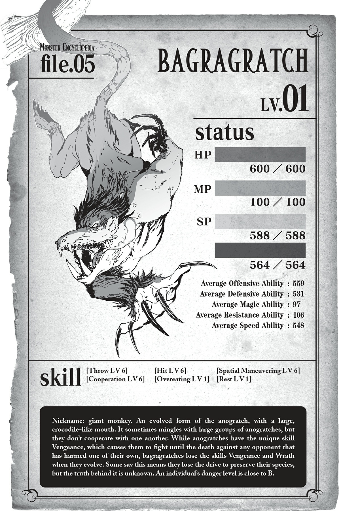
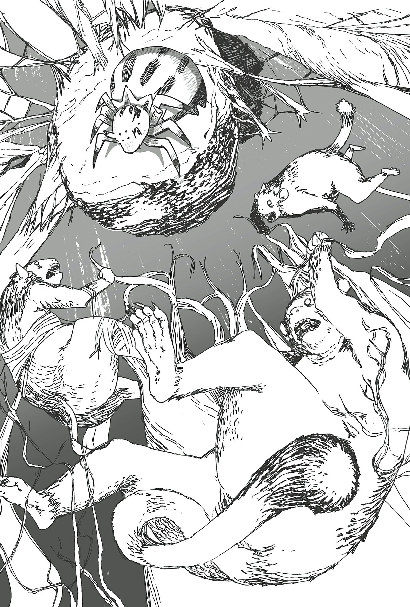

# Chương 12: Trận chiến ở độ cao ba trăm feet

*(Battling Three Hundred Feet Up)*

---

### --- TRANG 210 ---

---

### --- TRANG 217 ---

Aaaa, mệt quá đi mất. Tôi sắp không thể mở mắt nổi nữa rồi.

Tôi không ngờ việc cắm trại ngoài trời mà không có một ngôi nhà tử tế lại khổ sở đến thế này.

Tôi đã nghĩ mình có thể chịu đựng thêm một thời gian nữa, nhưng bây giờ tôi sẽ thực sự gặp rắc rối lớn nếu không sớm nghĩ ra cách nào đó để có được một giấc ngủ ngon.

Nhưng nói đi cũng phải nói lại, nếu chuyện đó dễ dàng như vậy thì tôi đã không phải ép bản thân tiếp tục thám hiểm cho đến khi kiệt sức hoàn toàn thế này.

Con Địa Long đó có lẽ sẽ không xuất hiện vào lúc này đâu, nhưng vấn đề hiện tại của tôi là tôi đang ở giữa một khu vực chứa đầy những quái vật mạnh khác. Không có gì đảm bảo rằng một trong số chúng sẽ không dễ dàng phá tan một tấm lưới nhện cơ bản của tôi cả.

Nhưng điều đó không có nghĩa là tôi có thể xây dựng một ngôi nhà phức tạp hơn ở đây.

Tôi không muốn định cư lâu dài ở nơi này. Tôi muốn thoát khỏi đây càng sớm càng tốt. Nên việc tốn cả đống thời gian để xây một ngôi nhà mới là hoàn toàn vô lý.

Trong trường hợp này, việc xây một ngôi nhà đơn giản sẽ hợp lý hơn, nhưng tôi lại không thể biết được liệu nó có đủ để ngăn chặn lũ quái vật sống ở khu vực này hay không... Tôi cứ suy nghĩ đi suy nghĩ lại những điều đó và giờ thì tôi đang bị kẹt trong một vòng lặp tinh thần.

Tôi vắt kiệt cái bộ não đang mệt mỏi của mình ra để tìm cách giải quyết.

Một ngôi nhà đơn giản có thể hoạt động tốt tùy thuộc vào cách tôi tạo ra nó đúng không?

Ví dụ, thay vì dựng nó ở bất cứ đâu, tôi có thể giấu nó ở một góc khuất khó tìm nào đó chăng.

Ý tôi là, các tảng đá xung quanh đây khá sắc cạnh, nhưng chúng không nhất thiết phải là những nơi ẩn nấp an toàn nhất.

Ơ khoan, chờ một chút. Biết đâu tôi hoàn toàn không cần phải lẩn trốn thì sao?

---

### --- TRANG 218 ---

Chỉ cần các quái vật khác không thể đụng vào tôi, thì ở đâu cũng tốt đúng không nào?

Trong trường hợp đó, tôi đoán mình biết một nơi rất thích hợp rồi.

Thế là tôi lập tức hướng về phía đó. “Đó” chính là trần nhà, bằng cách bò leo lên bức tường.

Phù... Cao quá đi mất! Trời đất ơi, sợ thật đấy. Tôi thực sự có thể ngủ ngon ở đây sao?

Nhưng tôi chưa từng nhìn thấy bất kỳ con quái vật nào quanh đây có khả năng bay hoặc leo tường cả.

Ngoại trừ bọ ốc sên ra nhé.

Tôi cũng không nhìn thấy con ong nào kể từ khi bước ra không gian rộng lớn này, nên tôi đoán có lẽ sẽ an toàn nếu dựng một ngôi nhà nhỏ ở giữa trần nhà và bức tường rồi ngủ ở đó.

Và thế là, không chần chừ gì nữa, tôi bắt tay vào giăng lưới ngay.

Mặc dù vậy, chỗ này thực sự rất cao. Có lẽ phải cao khoảng ba trăm feet giữa không trung ấy chứ... Độ cao đó tương đương với bao nhiêu tầng của một tòa nhà chọc trời nhỉ?

Nếu rơi xuống, tôi chắc chắn sẽ chết.

Ý tôi là, tôi có sợi tơ cứu sinh của mình mà, nên có lẽ không có gì phải lo lắng cả, nhưng việc làm việc ở một nơi trống trải thế này vẫn rất đáng sợ. Nào, Kháng Sợ hãi ơi, mau phát huy tác dụng đi chứ!

`<Độ thuần thục đã đạt mức yêu cầu. Kỹ năng [Kháng Sợ hãi LV 5] đã trở thành [Kháng Sợ hãi LV 6].>`

Được rồi, tôi xin lỗi. Tôi đã nói hơi sớm rồi.

Nên đừng có cà khịa tôi như vậy chứ hả? Làm tôi giật cả mình đấy.

Dù sao thì, bây giờ phần khung bên ngoài đã hoàn thành.

Hừm. Nhưng nhìn từ bên ngoài vào thì chỗ này hoàn toàn lộ liễu đúng không nhỉ?

Nếu nó trúng phải một đòn tấn công tầm xa như đòn phun thở của con Địa Long đó, nó sẽ sập ngay lập tức đúng không?

Tốt nhất là tôi nên tìm cách ngụy trang một chút.

Có lẽ tôi có thể sử dụng những tảng đá nằm rải rác dưới đất.

Tôi tụt xuống dưới đất một lát và nhìn vào đống đá. Hừm. Mấy tảng này to quá.

Liệu tôi có thể đập nhỏ chúng ra bằng cách nào đó không nhỉ? Bằng Tơ Cắt chẳng hạn?

Tôi buộc một sợi tơ vào tảng đá, kích hoạt Tơ Cắt rồi kéo mạnh. Hừm... Nó chỉ khía được một đường nhỏ chứ không có nhiều tác dụng lắm.

---

### --- TRANG 219 ---

Có lẽ tôi nên cưa nó giống như dùng cưa chăng? Oa, cách này có vẻ hoạt động tốt đấy, từng chút một.

`<Độ thuần thục đã đạt mức yêu cầu. Kỹ năng [Tơ Cắt LV 3] đã trở thành [Tơ Cắt LV 4].>`

Cấp độ kỹ năng của tôi đã tăng lên trong quá trình làm việc, giúp công việc của tôi trở nên hiệu quả hơn.

Được rồi, giờ tôi đã có một số khối đá được cắt nhỏ.

Tôi đoán mình có thể gắn chúng lên bề mặt của lưới nhện để ngụy trang.

Đầu tiên, tôi dán chặt tơ vào tảng đá, sau đó tôi leo ngược lên độ cao ba trăm feet để trở về tổ trong khi sợi tơ vẫn nối liền.

Được rồi, giờ tất cả những gì tôi phải làm là kéo nó lên, và...

Ái chà! Ôi trời ơi, nặng quá đi mất! Ưưư... Cố lên nào, dùng hết sức bình sinh đi tôi ơi!

Hai, ba, nào!

`<Độ thuần thục đã đạt mức yêu cầu. Kỹ năng [Sức mạnh LV 2] đã trở thành [Sức mạnh LV 3].>`

Cấp độ kỹ năng Sức mạnh của tôi đã tăng lên dọc đường đi. Nhưng ngay cả khi đã tăng thêm một cấp, thứ này vẫn là một thử thách cực kỳ gian khổ.

Phù, việc này đang ngốn sạch cả thể lực tức thời lẫn thể lực dự trữ tổng thể của tôi cùng một lúc rồi! Khổ sở quá đi!

`<Đủ độ thuần thục. Nhận được kỹ năng [Bộc phát lực LV 1].>`

`<Đủ độ thuần thục. Nhận được kỹ năng [Bền bỉ LV 1].>`

Tôi đã nhận được một số kỹ năng mới, nhưng lúc này tôi không có thời gian để kiểm tra chúng đâu!

Nào, kéééo lên!

Hộc... hộc... Phù.

Cuối cùng, tôi cũng đã thành công kéo tảng đá lên đúng vị trí.

Oa, nhìn kỹ lại thì, thanh thể lực màu đỏ của tôi thực sự đã sụt giảm vượt quá cả lượng dự trữ của kỹ năng Phàm ăn rồi.

Ra đó là lý do tại sao nó lại đau đớn đến thế.

Hả? Tôi cứ nghĩ mình đã nghĩ ra một phương pháp nhanh chóng để có được một giấc ngủ ngon, nhưng nghĩ lại thì, thực chất tôi lại tự chuốc thêm việc vào người.

Trời ạ, nghiêm túc chứ? Mọi chuyện thế là hết. Thôi kệ đi vậy.

Nhưng tất cả những nỗ lực rốt cuộc cũng xứng đáng, vì tảng đá tôi kéo lên dán vào tổ có vẻ đang che giấu tôi khá là hiệu quả.

Giờ tôi chỉ cần làm một chiếc đệm nằm nữa thôi, và...

---

### --- TRANG 220 ---

Hoàn thành!

Phù. Giờ thì đây chính là thiên đường.

Aa, được bao bọc bởi tơ lụa mềm mại làm tôi cảm thấy an toàn hơn rất nhiều. Cuộc sống là đây chứ đâu. Nếu không có nó, tôi đơn giản là không thể ngủ ngon được.

Ồ, phải kiểm tra tác dụng của mấy cái kỹ năng mới trước khi đi ngủ đã.

`<Bộc phát lực: Cộng thêm vào chỉ số SP (tức thời) một lượng bằng với cấp độ kỹ năng>`

`<Bền bỉ: Cộng thêm vào chỉ số SP (bền bỉ) một lượng bằng với cấp độ kỹ năng>`

À, vậy ra đây chính là phiên bản SP của Cứng cáp và Sức mạnh rồi.

Chỉ số SP của tôi vốn là 40 điểm mỗi loại giờ đã tăng lên thành 41. Thể lực là vô cùng quan trọng, nên đây quả thực là một món hời lớn.

Thôi thì, giờ đã kiểm tra xong các kỹ năng mới rồi, đã đến lúc đi ngủ để rũ bỏ mọi mệt mỏi từ đống công việc cực nhọc vừa qua thôi!

Đã lâu lắm rồi tôi mới có cơ hội được nằm tổ tử tế thế này, tôi sẽ tận dụng cơ hội này để ngủ một giấc cho thỏa thích mới được.

Và thế là, chúc ngủ ngon nhé!

Aaa, thật là một giấc ngủ tuyệt vời. Đúng thế. Tôi chắc chắn đã ngủ rất ngon rồi.

Nhưng mà, cái gì thế này?

Tôi vốn định ngủ thêm một chút nữa, nhưng tại sao lúc này tôi đột nhiên lại cảm thấy hoàn toàn tỉnh táo thế này?

Hửm? Cảm giác giống như tất cả lông tơ trên cơ thể tôi đang dựng đứng hết cả lên vậy. Điềm chẳng lành rồi đây.

Tôi ló đầu ra khỏi tảng đá để nhìn xuống phía dưới.

`<Anogratch       LV 6: Thẩm định trạng thái thất bại>`

`<Anogratch       LV 3: Thẩm định trạng thái thất bại>`

`<Anogratch LV 8>`

| Chỉ số | Giá trị |
| :--- | :--- |
| **HP** | 165/168 (lục) |
| **MP** | 38/38 (lam) |
| **SP (vàng)** | 127/127 |
| **SP (đỏ)** | 109/118 (đỏ) |

`<Thẩm định trạng thái thất bại>`

`<Anogratch       LV 5: Thẩm định trạng thái thất bại>`...

Một nhóm khỉ đã tụ tập dàn trận chiến đấu ngay bên dưới chỗ tôi nấp. Tôi ước chừng phải có khoảng năm mươi con trong số đó.

Hử? Các bạn đùa tôi đấy à đúng không?

---

### --- TRANG 221 ---

Lũ này chắc chắn biết tôi đang ở trên này.

Tại sao chứ?!

Tôi cứ nghĩ lớp ngụy trang bằng đá của mình là hoàn hảo rồi cơ chứ. Tôi thậm chí còn tự mình đứng từ dưới đất nhìn lên để kiểm tra cơ mà.

Nhìn thoáng qua, nó trông không khác gì một tảng đá hơi nhô ra khỏi bức tường một chút cả.

Vậy thì tại sao chứ?!

Lý do duy nhất tôi có thể nghĩ ra là có liên quan đến con khỉ cùng loài mà tôi đã đánh bại trước đó.

Nó đã làm gì tôi sao? Giống như để lại một mùi hương đặc biệt trên người tôi hay gì đó chăng? Tôi hoàn toàn không có manh mối nào cả.

Nhưng dù thế nào đi nữa, lũ khỉ đó đang nằm chờ sẵn để săn tôi.

Một vài con trong số chúng thậm chí còn đang chuẩn bị leo lên bức tường. Thực tế là chúng đã bắt đầu leo rồi.

Thôi chết rồi!

Việc leo lên một bức tường đá dựng đứng rõ ràng là rất khó khăn ngay cả đối với loài khỉ, vì tốc độ leo của chúng khá là chậm.

Với tốc độ này, tôi sẽ có vài phút trước khi những con đầu tiên tiếp cận được tôi. Tôi phải hành động trong khi vẫn còn cơ hội.

Lựa chọn tốt nhất ở đây có lẽ là chạy trốn dọc theo trần nhà.

Rõ ràng là không đời nào tôi có thể đánh bại một nhóm quái vật khỉ đông đảo như thế này được rồi.

Được rồi, đã đến lúc chuồn lẹ thôi.

Ủa? Màu sắc của trần nhà ở đây khác đi sao? Không thể nào! Tại sao nó lại trơn trượt thế này chứ?!

Tơ của tôi hầu như không thể dính vào nó được luôn! Ôi không...

Đặc tính của đá tạo nên trần nhà đã thay đổi rõ rệt chỉ cách bức tường vài feet. Nó trơn nhẵn đến mức ngay cả những sợi tơ dính nhất của tôi cũng không thể bám vào được, chưa nói gì đến chân tôi.

Với tình hình này, trần nhà sẽ không thể hoạt động như một lối thoát hiểm được rồi.

Tôi sẽ phải chạy ngang dọc theo bức tường vậy.

Chúng có lẽ sẽ cố gắng đuổi theo tôi, nhưng đó sẽ chỉ là một cuộc đấu sức bền mà thôi.

Được rồi, đi thôi— BỘP! Hả?! Cái gì thế?! Một tảng đá sao?!

Chết tiệt, lũ này đang ném đá vào tôi sao?!

Khoan đã, làm thế nào mà chúng có thể ném tới đây được khi trần nhà cao như thế này chứ?!

---

### --- TRANG 222 ---

Oa, lại một quả nữa sao?!

Tôi nhanh chóng lánh nạn vào phía sau tảng đá che chắn ngôi nhà của mình để tránh né.

Một tảng đá khác đập trúng ngay vị trí tôi vừa đứng cách đó vài giây.

Xét về quãng đường bay xa như vậy, những tảng đá không có quá nhiều lực khi bay tới chỗ tôi.

Dẫu vậy, nếu một trong số chúng đập trúng người tôi trong lúc tôi đang bám vào tường, nó có lẽ sẽ đánh rơi tôi xuống đất.

Đánh giá qua thực tế là các vật thể ném luôn tiếp đất ngay vị trí tôi vừa đứng, lũ khỉ đó có lẽ sở hữu kỹ năng Ném, kỹ năng Đánh trúng, hoặc thậm chí là cả hai.

Một cảm giác ớn lạnh chạy dọc sống lưng tôi.

Tôi không thể chạy trốn theo cách này được. Tôi phải làm sao đây? Thực sự, tôi chỉ có một lựa chọn duy nhất mà thôi. Tôi phải chiến đấu.

May mắn thay, mặc dù chỉ là một ngôi nhà đơn giản, tôi vẫn có một căn cứ điểm ở đây.

Lựa chọn duy nhất của tôi là gia cố nó nhiều nhất có thể trước khi con khỉ đầu tiên leo tới nơi và ngăn chặn chúng từ bên trong.

Nếu tất cả chúng tôi đều phải bám vào tường trong suốt trận chiến, không giống như lần đối đầu với lũ ong, các đối thủ của tôi sẽ không có bất kỳ lợi thế nào cả.

Nếu có gì, vì tôi có mạng lưới của mình để vừa làm chỗ đứng vững chắc vừa làm pháo đài phòng thủ, tôi mới là người có lợi thế hơn vào lúc này.

Tôi không còn lựa chọn nào khác ngoài việc phải thử.

Đầu tiên, tôi phóng ra thêm nhiều sợi tơ. Sau đó tôi dán chặt chúng vào bức tường bằng kỹ năng Điều khiển Tơ.

Đây là một chiến thuật cơ bản, nhưng nó sẽ khiến chúng khó leo lên hơn.

Vì tôi phải liên tục né tránh những tảng đá đang lao về phía mình, nên rất khó để tập trung làm việc. Và trong quá trình đó, làn sóng khỉ đầu tiên đã leo được nửa chặng đường lên bức tường rồi.

Chết tiệt. Chúng leo nhanh hơn tôi tưởng.

Không đời nào tôi có thể ngăn chặn tất cả bọn chúng chỉ bằng những sợi tơ tôi vừa mới giăng ra.

Giờ thì sao đây?

À, có lẽ có thứ gì đó tôi có thể sử dụng để tấn công chúng trước chăng?

Tôi có kỹ năng Ném và Đánh trúng mà, nên nếu tôi có thứ gì đó để ném vào chúng...

Ồ! Có một thứ đây rồi. Tôi không thể ném nó, nhưng tôi có thể thả nó xuống!

Tôi ló đầu ra khỏi tảng đá và kích hoạt kỹ năng Tổng hợp Độc.

Rõ ràng, tôi không tạo ra Độc Yếu làm gì cả. Tôi sử dụng loại độc tố mà tôi đã rèn giũa suốt cuộc đời làm nhện của mình: loại Độc Nhện cực mạnh.

Một quả cầu chất độc xuất hiện trước mắt tôi, và trọng lực lập tức kéo nó rơi xuống.

---

### --- TRANG 223 ---

Con khỉ đang leo tường không thể né tránh nó được.

Chất độc bắn thẳng vào mặt nó, và nó hét lên thảm thiết trong đau đớn rồi rơi xuống dưới.

Cách này có thể hoạt động tốt đấy!

Nhanh chóng, tôi xác nhận lượng MP tiêu hao của mình. Nó chỉ tốn 1 điểm MP mà thôi. Nói cách khác, tôi có thể tung ra tới 40 phát bắn khi đầy MP. Với lượng MP tôi đã tiêu tốn cho kỹ năng Điều khiển Tơ trước đó, tôi vẫn còn lại khoảng 25 phát bắn.

Nếu tất cả đều trúng đích, tôi có thể tiêu diệt khoảng một nửa lực lượng của lũ khỉ!

Tôi lập tức thả quả cầu thứ hai xuống. Lại trúng đích, một con khỉ nữa rơi xuống.

Đã đến lúc chuyển sang con tiếp theo rồi. Đây là một chiến thuật mà tôi nên dựa vào bất cứ khi nào có thể.

`<Độ thuần thục đã đạt mức yêu cầu. Kỹ năng [Tổng hợp Độc LV 1] đã trở thành [Tổng hợp Độc LV 2].>`

Cấp độ kỹ năng của tôi vừa tăng lên, nhưng tôi không thể kiểm tra nó vào lúc này được.

Dù sao thì Độc Nhện có lẽ vẫn mạnh hơn bất kỳ loại chất độc mới nào tôi vừa nhận được.

Tôi đã thành công trong việc đánh rơi một số lượng lớn lũ khỉ xuống dưới, nhưng chúng đã bắt đầu phản ứng lại tương ứng. Chúng tránh khu vực ngay bên dưới tổ của tôi và leo lên từ hai bên hông để thay thế.

Tôi dội xuống lượng chất độc nhiều nhất có thể trước khi tất cả bọn chúng thoát ra khỏi phạm vi tấn công của tôi.

`<Độ thuần thục đã đạt mức yêu cầu. Kỹ năng [Đánh trúng LV 2] đã trở thành [Đánh trúng LV 3].>`

Tuyệt quá, tuyệt quá. Lũ khỉ đang rụng như sung.

Nhưng rất nhiều con trong số chúng vẫn thoát được sang hai bên hông. Với tình hình này thì những quả bom độc sẽ không còn hiệu quả nữa rồi. Dù sao thì tôi cũng đang lo lắng về lượng MP còn lại khá ít của mình, nên có lẽ dừng lại thế này là tốt nhất rồi.

Tôi phóng một ít tơ về phía lũ khỉ đã chuyển hướng sang hai bên hông.

Trận chiến này thực chất chỉ mới bắt đầu mà thôi.

Lũ khỉ vẫn tiếp tục leo lên bức tường.

Tôi đang sử dụng kỹ năng Điều khiển Tơ để giăng những sợi tơ dính trên tường ngay trên đường đi của chúng.

Tệ thật đấy. Tôi không còn đủ MP nữa. Tôi có lẽ đã sử dụng quá nhiều MP cho kỹ năng Tổng hợp Độc mất rồi.

---

### --- TRANG 224 ---

Nhưng nếu tình huống bắt buộc, tôi vẫn có thể giăng tơ thủ công mà không cần dùng đến kỹ năng Điều khiển Tơ cơ mà.

Một tảng đá khác lại bay về phía tôi, nên tôi nhanh chóng ẩn nấp sau tảng đá lớn.

Lũ khỉ vẫn còn ở dưới đất đang ném đá lên liên tục không ngừng nghỉ. Ngay cả khi trúng phải một quả, đó cũng không phải là vết thương chí mạng gì cả, nhưng nó vẫn cực kỳ phiền phức.

Những con khỉ tiên phong gần nhất đã lao thẳng vào vùng giăng tơ dính của tôi.

Tất nhiên, chúng bị giữ chân cố định tại chỗ ngay lập tức.

Chuyện đó sẽ mua cho tôi một chút thời gian, vì nếu những con khỉ dẫn đầu ngừng di chuyển, nó sẽ tạo ra một nút thắt cổ chai cho— Hở?!

Lũ khốn kiếp đó đang sử dụng chính đồng đội của mình làm bệ đỡ để tiếp tục leo lên kìa!

Mặc dù vẫn còn khu vực tơ dính đệm ở phía sau, nhưng với đà này, chúng sẽ vượt qua nhanh hơn nhiều so với tôi tưởng!

Chết tiệt! Tôi không có thời gian để suy nghĩ nữa rồi.

Tôi nhắm thẳng vào một nhóm khỉ đặc biệt đông đúc và phóng ra một tấm lưới quăng. Tôi để mặc cho các nạn nhân xấu số tự định đoạt số phận của mình.

Chúng càng giãy giụa thì sẽ càng bị quấn chặt hơn, cho đến khi hoàn toàn không thể cử động được nữa. Khối hỗn độn gồm khỉ và tơ nhện kết quả sẽ tạo nên một chướng ngại vật đáng gờm ngay giữa đường đi của chúng.

Theo quy luật thông thường, một khi lũ khỉ đã bị dính tơ, tôi có thể hoàn toàn gạt chúng ra khỏi đầu. Dù sao thì chỉ số của chúng có vẻ quá thấp để có thể tự mình thoát khỏi tơ của tôi.

Lần này, tôi không sử dụng kỹ năng Điều khiển Tơ nữa.

Chiến thuật cơ bản của tôi là vô hiệu hóa tất cả lũ khỉ chỉ bằng tơ dính của mình mà thôi.

Sau đó, tôi có thể thong thả kết liễu bọn chúng sau.

Tôi phóng tấm lưới quăng thứ hai. Lại thêm vài con khỉ nữa bị sa lưới.

Trong lúc tôi chuẩn bị phóng tấm lưới thứ ba, một tảng đá bay thẳng về phía tôi. Tôi hoảng loạn né tránh nó.

Lũ này thực sự phối hợp đồng đội quá tốt rồi.

Trên hết, chúng đã bắt đầu cảnh giác với những tấm lưới quăng của tôi và di chuyển ra xa hơn nữa về phía bên trái và bên phải. Giờ đây tôi chỉ có thể bắt được một hoặc hai con với mỗi tấm lưới mà thôi.

Lũ này thông minh hơn nhiều so với bất kỳ quái vật nào tôi từng chiến đấu trước đây!

Nếu chúng thông minh đến thế, tại sao chúng không nhận ra rằng tôi không hề đủ lớn để đáng làm con mồi cho chúng chứ?! Chúng hy vọng nhận được gì từ việc đánh bại một con nhện bé tí như tôi chứ?!

Nhưng lũ này rõ ràng đang lao vào tôi với khát vọng đánh bại tôi bằng mọi giá.

Nào, thôi đi chứ. Tôi không thể chịu nổi mức độ nhiệt tình thái quá này hướng về phía mình đâu đấy nhé? Các người nên dành tất cả sự nhiệt huyết đó cho việc khác đi. Ví dụ như ______, chẳng hạn (tự điền vào chỗ trống nhé).

Tôi tiếp tục phóng tơ ra khắp nơi trong khi lẩm bẩm chửi rủa những kẻ tấn công một cách vô nghĩa trong lòng.

Vì chúng đã phân tán ra quá xa về hai bên hông, tôi phải cố gắng giăng lưới thật rộng.

Tôi đang cố gắng hạn chế sử dụng kỹ năng Điều khiển Tơ nhất có thể. Nếu tôi cạn sạch MP trong tình huống này, mọi chuyện sẽ trở nên cực kỳ tồi tệ.

Tại sao tôi không cứ trốn ở bên trong ngôi nhà đơn giản của mình nhỉ? Thì, vì tôi đang ở độ cao ba trăm feet so với mặt đất cơ mà.

Tơ của tôi chắc chắn rất chắc chắn, nhưng chúng không phải là vô địch. Đầu tiên là chúng rất sợ lửa, và con Địa Long kia đã thổi bay chúng một cách dễ dàng.

Mặc dù lưới nhện của tôi sở hữu phòng thủ cao, chúng vẫn có thể bị phá hủy bởi bất kỳ thứ gì có sức tấn công vượt trội hơn.

Tôi không nghĩ lũ khỉ này có thể làm được chuyện đó.

Nếu ở dưới mặt đất, tôi rõ ràng sẽ chọn cách ru rú ở bên trong. Nhưng đây không phải là mặt đất.

Nếu một con khỉ tấn công ngôi nhà nhỏ của tôi và bị dính vào đó...

...thì trọng lượng của nó rõ ràng sẽ được cộng thêm vào tổ.

Và nếu chuyện đó xảy ra nhiều lần, ngôi nhà của tôi có thể sẽ không chịu nổi tải trọng đó mất...

Cái tổ đơn giản này không có nền móng vững chắc neo giữ nó lại. Nó chỉ được gắn vào tường và trần nhà bằng một số sợi tơ dính mà thôi.

Nó có thể chịu được trọng lượng của tôi và tảng đá ngụy trang mà không gặp nhiều khó khăn. Nhưng tôi không biết nó có thể chịu đựng được thêm bao nhiêu nữa vượt quá giới hạn đó.

Tôi đã cân nhắc việc mở rộng nó và tăng độ ổn định, nhưng thay vào đó tôi quyết định cố gắng ngăn lũ khỉ không thể tiếp cận gần hơn. Logic của tôi là ngay cả việc mở rộng lưới cũng chỉ tăng tải trọng tối đa của tổ lên được một phần nào đó mà thôi.

Dẫu vậy, nó đáng lẽ phải đủ tốt đối với số lượng lũ khỉ...

Hoặc ít nhất là, vào lúc ban đầu.

---

### --- TRANG 226 ---

Tại sao lại chỉ vào lúc ban đầu ư? Bởi vì số lượng lũ khỉ hoàn toàn không hề giảm đi chút nào cả!

Tôi cứ nghĩ mình có lẽ chỉ thất bại trong việc kết liễu những con tôi đã đánh trúng bằng độc tố thôi, nhưng xác của chúng rõ ràng đang chất đống dưới chân tường kia kìa. Nên không phải là chúng được hồi sinh hay gì cả.

Không, đơn giản là có nhiều khỉ hơn số lượng ban đầu mà thôi.

Chúng chắc chắn đã gọi tiếp viện rồi. Ha ha... Tôi không biết chúng từ đâu chui ra nhiều thế nữa, nhưng số lượng của chúng chắc chắn đang tăng lên. Ban đầu chỉ có khoảng năm mươi con thôi, nhưng giờ đã dễ dàng tăng lên gấp đôi rồi. Và con số đó vẫn đang tiếp tục tăng. Việc không thể nhìn thấy hồi kết của cuộc đua marathon này thực sự không mấy dễ chịu chút nào cả.

Tôi phải làm sao đây? Nghiêm túc đấy, giờ phải làm sao? Không chỉ MP của tôi bị cạn kiệt, mà thanh thể lực màu đỏ của tôi cũng đang bắt đầu giảm xuống mức đáng báo động rồi.

Có lẽ là do tôi đã liên tục giăng tơ suốt thời gian qua.

Nếu tôi cạn kiệt thể lực, mọi chuyện coi như chấm hết. Tôi sẽ không thể tạo ra thêm tơ được nữa.

Nên tôi phải tránh chuyện đó bằng mọi giá.

Tôi chuẩn bị một sợi Tơ Sao Mai.

Mục tiêu của tôi là con khỉ đang ở gần tôi nhất.

Tôi ném nó đi, và nó đã trúng mục tiêu.

Tiếp theo, tôi để độ dính của sợi tơ làm việc và giật mạnh nó lên phía mình.

Nhanh chóng, tôi khống chế con khỉ khi nó đang cố gắng giãy giụa. Sau đó tôi tấn công bằng Răng Độc.

Trong quá trình đó, một tảng đá đập trúng người tôi.

Ái! Nhưng tôi chỉ mất 5 HP mà thôi.

Đúng như tôi dự đoán, không có nhiều lực trong các vật thể ném khi chúng bay tới chỗ tôi. Nó khá đau, nhưng tôi đã phớt lờ nó đi nhờ sự giúp đỡ của Vô hiệu Đau và Giảm Đau.

Con khỉ sớm trút hơi thở cuối cùng nhờ chất độc của tôi.

Đến giờ ăn rồi!

Tôi nhanh chóng giải quyết bữa ăn của mình. Tôi phải kết thúc càng sớm càng tốt để trở lại mặt trận.

Lũ khỉ vẫn đang giãy giụa trong những sợi tơ dính của tôi. Hầu hết chúng đều bị sa lưới đến mức cơ bản là không thể cử động được nữa, nhưng cơ thể của chúng lại đang tạo thành một lối đi cho những đồng đội còn lại của chúng. Chầm chậm nhưng chắc chắn, những con khỉ khác đang tiến lại gần hơn.

---

### --- TRANG 227 ---

Tôi đã thành công hồi phục được một phần thể lực của mình, nhưng tốt nhất là nên giả định rằng tôi sẽ không có cơ hội đó lần thứ hai nữa đâu.

Nên việc ăn từng miếng một để làm nhiên liệu cho phần còn lại của trận chiến lại càng quan trọng hơn nữa!

Phù! Ăn sạch sành sanh luôn!

Tôi có cảm giác việc này chỉ càng làm gia tăng cơn thịnh nộ muốn giết tôi của lũ khỉ mà thôi, nhưng đã quá muộn cho chuyện đó rồi!

Tôi chính là kẻ đi săn! Không một ai có thể biến tôi thành con mồi được đâu!

Tôi phun tơ ra khắp mọi nơi.

`<Độ thuần thục đã đạt mức yêu cầu. Kỹ năng [Tập trung LV 2] đã trở thành [Tập trung LV 3].>`

Vì tôi đang tập trung hết sức mình, kỹ năng Tập trung thậm chí đã tăng cấp luôn rồi.

Nhưng tôi không quan tâm đến chuyện đó vào lúc này. Nếu tôi lơ là cảnh giác dù chỉ một giây ở thời điểm hiện tại, tôi sẽ tiêu đời ngay.

Có hàng tấn con khỉ đang chất đống bên dưới tôi, bị bao phủ trong tơ nhện.

Thế mà số lượng của chúng vẫn không hề giảm đi. Trên thực tế, lại càng có nhiều con hơn nữa xuất hiện.

Số lượng khỉ bị khống chế đang tăng lên, chắc chắn rồi, nhưng quân tiếp viện của chúng lại đang tăng lên nhanh hơn nhiều.

Cứ như thể tất cả lũ khỉ trong khu vực này đều đang tập trung ngay tại đây vậy.

Tôi chỉ còn lại vỏn vẹn 2 MP mà thôi.

Tôi không biết sẽ có những tác động tiêu cực nào xảy ra khi MP của tôi chạm mức 0, nên tôi không thể sử dụng nó nữa để đảm bảo an toàn. Điều đó có nghĩa là tôi cũng không thể sử dụng kỹ năng Điều khiển Tơ vào lúc này nữa rồi.

Nhưng ở thời điểm hiện tại, chuyện đó không phải là vấn đề quá lớn nữa.

Bởi vì lực lượng tiên phong của lũ khỉ hiện đã ở ngay trước mặt tôi rồi.

Chúng đã thu hẹp khoảng cách giữa hai bên đến mức kỹ năng Điều khiển Tơ thậm chí còn không cần thiết nữa.

Tôi tạo ra một sợi tơ khác. Một con khỉ nữa bị dính và quấn chặt trong đó.

Và điều nó làm tiếp theo thực sự là hoàn toàn điên rồ.

Nó nhảy xuống.

Con khỉ rơi bịch xuống đất với một tiếng động trầm đục. Từ độ cao thế này, ngay cả một con quái vật cũng không có hy vọng sống sót sau cú ngã.

---

### --- TRANG 228 ---

Giữa việc lựa chọn cái chết hoặc bị mắc kẹt trên đường đi của đồng đội và cản trở bước tiến của chúng, lũ khỉ điên rồ này thực sự đã chọn cái chết.

Thật không thể tin nổi.

Tôi không thể không rùng mình trước quá trình suy nghĩ đáng sợ này.

Tôi đã hy vọng mong manh rằng nếu mình tiếp tục khắc chế chúng, lũ khỉ cuối cùng sẽ bỏ cuộc, nhưng rõ ràng chuyện đó sẽ không xảy ra. Lũ khỉ này sẽ không dừng lại cho đến khi chúng tiếp cận được tôi. Trận chiến này chỉ có thể kết thúc theo hai cách: hoặc chúng giết tôi, hoặc tôi tiêu diệt toàn bộ bọn chúng.

Một tảng đá bay thẳng về phía tôi. Nhưng tôi thậm chí không thể né tránh nó được nữa rồi. Tôi không còn dư một giây nào cả.

Tảng đá đập trúng cơ thể tôi, và HP của tôi bị sụt giảm. Nhưng nhờ có Vô hiệu Đau và Giảm Đau, tôi hoàn toàn có thể phớt lờ nó.

Tôi phó mặc lượng HP đã mất cho kỹ năng Tự hồi phục.

Ngay cả khi bị đá đập trúng, tôi vẫn tiếp tục phun tơ ra liên tục.

Đó là cơ hội duy nhất để tôi sống sót trong tình huống này.

Trước đây tôi từng có phần coi thường lũ khỉ này. Ý tôi là, chúng chẳng là gì so với con Địa Long kia cả.

Chắc chắn rồi, hầu hết các đối thủ đều không là gì so với cái thứ mạnh mẽ một cách điên rồ đó cả.

Nhưng điều đó không có nghĩa là tôi có thể coi thường chúng.

Tôi quả thực là một kẻ ngốc mà. Tôi đã quên mất bản thân mình yếu đuối thế nào rồi sao? So với tôi, hầu như bất kỳ thứ gì cũng có thể là một kẻ thù đáng gờm. Điều gì đã khiến tôi nghĩ mình có thể xử lý lũ tép riu dễ dàng như vậy chứ? Chưa kể mặc dù tôi yếu hơn bọn chúng, chúng vẫn đang lao vào tôi với một sự quyết tâm lớn đến mức ngay cả cái chết cũng không thể ngăn cản được.

Với tất cả những điều đó, không có lý do gì tôi lại kỳ vọng mình có thể vượt qua chuyện này mà không gặp bất kỳ vấn đề gì cả.

Vì vậy bây giờ, tôi phải triệu tập tất cả quyết tâm của mình và đối mặt với chuyện này bằng mọi thứ tôi có.

Một tảng đá khác lại đập trúng người tôi.

Chỉ là một khoảnh khắc ngắn ngủi mà thôi. Chỉ trong một khoảnh khắc duy nhất, tôi bị giật mình bởi cú va chạm.

Trong khoảnh khắc đó, một con khỉ đã tóm được một chân của tôi. Hơn một nửa cơ thể của nó đã bị quấn chặt trong tơ, thế mà nó vẫn cố với cánh tay phải tự do của mình ra.

Chân của tôi phát ra một tiếng răng rắc không mấy dễ chịu chút nào.

Cố gắng chịu đựng cơn đau nhức nhối, tôi đã thành công cắm răng độc của mình vào

---

### --- TRANG 229 ---

bàn tay đang nắm lấy chân tôi.

Gần như cùng lúc sức lực của con khỉ cạn kiệt, một nửa cái chân của tôi cũng đã bị xé toạc ra.

Đau quá đi mất. Đau đớn đến kinh hoàng, và tôi vẫn có thể cảm nhận rõ ràng nó bất chấp kỹ năng Giảm Đau của mình.

Vì nó chỉ là một phần cái chân của tôi thôi, nên có lẽ kỹ năng Tự hồi phục HP sẽ chữa lành nó chăng?

Hy vọng ít nhất nó cũng sẽ hồi phục khi tôi tăng cấp.

Nhưng lúc này tôi không có thời gian để lo lắng cho cái chân đã mất của mình nữa rồi.

Đòn tấn công đó đã cướp đi quá nhiều thời gian quý báu của tôi.

Một con khỉ khác sẽ leo tới nơi bất cứ giây nào nữa đây.

Tôi tạo ra một sợi tơ khác. Lúc này tôi đang bắt đầu hoảng loạn rồi. Thể lực của tôi lại đang cạn dần.

Sợi tơ của tôi kết nối với một con khỉ, và nó lập tức nhảy thẳng ra ngoài khoảng không vô tận.

Không thèm bận tâm đến số phận của nó, tôi tiếp tục phóng sợi tơ tiếp theo.

`<Đủ điểm kinh nghiệm. Cá thể tiểu Taratect đã tăng từ LV 4 lên LV 5.>`

`<Tất cả các thuộc tính cơ bản đều gia gia tăng.>`

`<Nhận được điểm thưởng độ thuần thục kỹ năng khi tăng cấp.>`

`<Độ thuần thục đã đạt mức yêu cầu. Kỹ năng [Tập trung LV 3] đã trở thành [Tập trung LV 4].>`

`<Độ thuần thục đã đạt mức yêu cầu. Kỹ năng [Đánh trúng LV 3] đã trở thành [Đánh trúng LV 4].>`

`<Độ thuần thục đã đạt mức yêu cầu. Kỹ năng [Cứng cáp LV 2] đã trở thành [Cứng cáp LV 3].>`

`<Đã nhận được điểm kỹ năng.>`

Khoảnh khắc nghe thấy giọng nói đó, tôi nhanh chóng rút lui vào trong ngôi nhà đơn giản của mình.

Thời điểm thật hoàn hảo, nhưng nó cũng mang lại một bất lợi kèm theo.

Lột xác.

Tôi vội vã lột bỏ lớp da cũ của mình. Cái chân bị đứt của tôi đã hồi phục hoàn toàn không gặp vấn đề gì cả. Vứt bỏ lớp da cũ sang một bên, tôi lập tức trở lại mặt trận ngay. Ngay cả khoảng thời gian ngắn ngủi mà quá trình lột xác tiêu tốn cũng có thể trở thành chí mạng trong tình huống này.

Đúng như tôi dự đoán, một con khỉ đã bị mắc kẹt vào lưới nhện nhỏ bé của tôi.

Chúng đã tiếp cận được phòng tuyến cuối cùng của tôi rồi.

Khi tăng cấp, cả MP và SP của tôi đều được hồi đầy, nhưng chuyện đó có lẽ là hơi muộn mất rồi.

---

### --- TRANG 230 ---

Không, chờ đã. Tôi vẫn có thể làm được chuyện này mà.

Tôi thò một chân ra ngoài ngôi nhà đơn giản của mình.

Một con khỉ lập tức chộp lấy nó ngay, nhưng chuyện đó thì có sao chứ?

Tôi phun ra lượng tơ nhiều nhất có thể, tạo thành một khối tơ nhện khổng lồ.

Sau đó, tôi dồn hết tất cả sức lực còn lại vào việc kích hoạt kỹ năng Điều khiển Tơ. Từng chút từng chút một, sức mạnh của tôi thấm đẫm vào những sợi tơ.

Vì cấp độ kỹ năng của tôi đã tăng lên, số lượng sợi tơ tôi có thể điều khiển cùng một lúc đã gia tăng đáng kể.

Tất nhiên, tôi không thể điều khiển toàn bộ cái khối tơ khổng lồ này được, nhưng thế là đủ tốt rồi.

Dẫu vậy, với số lượng tơ khổng lồ mà tôi đang cố gắng thao tác, lượng MP vừa mới hồi phục của tôi lại đang biến mất với một tốc độ đáng báo động.

Thế rồi, cái chân đang bị tóm lấy của tôi lại phát ra một tiếng động kinh khủng khác.

Cùng lúc đó, toàn bộ cơ thể tôi bị kéo tuột ra ngoài tổ.

Thêm nhiều cánh tay khỉ khác vươn ra từ bên ngoài.

Tôi đã cố giữ cho đầu mình được tự do, nhưng giờ cơ thể tôi đã bị tóm chặt rồi.

Lũ khỉ hoàn toàn không hề nương tay, chúng cố gắng bóp nát tôi bằng tất cả sức mạnh của chúng.

HP của tôi đang sụt giảm nhanh chóng, và cơn đau dữ dội cào xé cơ thể tôi.

`<Đủ độ thuần thục. Nhận được kỹ năng [Sinh mệnh LV 1].>`

`<Đủ độ thuần thục. Nhận được kỹ năng [Ma lượng LV 1].>`

Ngay khi nghe thấy Giọng nói của Thần (tạm gọi), những sợi tơ của tôi đã sẵn sàng.

Tôi sử dụng tất cả sức mạnh còn lại của mình để điều khiển sợi tơ. Tuân theo mệnh lệnh của tôi, khối tơ nhện khổng lồ tách ra khỏi bức tường và rơi xuống dưới. Lẽ tự nhiên, lũ khỉ đang dính trên đó cũng rơi xuống theo.

Với một tiếng gầm lớn, bức tường tơ nhện cùng lũ khỉ bị mắc kẹt đập sầm xuống đống quân xâm lược còn lại ở phía dưới.

`<Đủ điểm kinh nghiệm. Cá thể tiểu Taratect đã tăng từ LV 5 lên LV 6.>`

`<Tất cả các thuộc tính cơ bản đều gia tăng.>`

`<Nhận được điểm thưởng độ thuần thục kỹ năng khi tăng cấp.>`

`<Độ thuần thục đã đạt mức yêu cầu. Kỹ năng [Điều khiển Tơ LV 6] đã trở thành [Điều khiển Tơ LV 7].>`

`<Độ thuần thục đã đạt mức yêu cầu. Kỹ năng [Phàm ăn LV 3] đã trở thành [Phàm ăn LV 4].>`

`<Đã nhận được điểm kỹ năng.>`

---

### --- TRANG 231 ---

`<Đủ điểm kinh nghiệm. Cá thể tiểu Taratect đã tăng từ LV 6 lên LV 7.>`

`<Tất cả các thuộc tính cơ bản đều gia tăng.>`

`<Nhận được điểm thưởng độ thuần thục kỹ năng khi tăng cấp.>`

`<Độ thuần thục đã đạt mức yêu cầu. Kỹ năng [Giảm Đau LV 5] đã trở thành [Giảm Đau LV 6].>`

`<Độ thuần thục đã đạt mức yêu cầu. Kỹ năng [Ẩn mật LV 5] đã trở thành [Ẩn mật LV 6].>`

`<Độ thuần thục đã đạt mức yêu cầu. Kỹ năng [Né tránh LV 1] đã trở thành [Né tránh LV 2].>`

`<Đã nhận được điểm kỹ năng.>`

Tôi đã thành công tiêu diệt được một lượng lớn lũ khỉ cùng một lúc.

Nhờ quá trình lột xác khi tăng cấp, cơ thể và chân đang bị tóm của tôi đã được giải thoát khỏi bàn tay của lũ khỉ.

Tất cả những gì chúng đang nắm giữ lúc này chỉ là hai lớp da cũ của tôi mà thôi.

Quả bom tơ khổng lồ của tôi đã giải quyết hầu hết lũ khỉ, nhưng những con dính vào ngôi nhà đơn giản của tôi thì vẫn còn sống.

Dù vậy, chúng vốn đã bị mắc kẹt hoàn toàn trong lưới nhện của tôi rồi.

Tôi bổ sung thêm tơ để khống chế chúng hoàn toàn rồi kết liễu bọn chúng bằng độc tố một cách dứt khoát.

Khi con cuối cùng ngừng chuyển động, tôi thở phào nhẹ nhõm một tiếng.

Mọi chuyện vẫn chưa hoàn toàn kết thúc, nhưng ít nhất tôi đã vượt qua được làn sóng tấn công đầu tiên này rồi.

---

### --- TRANG 232 ---

---

### --- TRANG 233 ---

Lòng tôi muốn được thư giãn một chút, nhưng tôi lập tức chấn chỉnh tinh thần lại ngay. Không, vẫn chưa kết thúc đâu. Lũ khỉ vẫn chưa bị xóa sổ hoàn toàn. Tôi không được phép lơ là cảnh giác cho đến khi con cuối cùng bị tiêu diệt hoàn toàn.

Tôi lập tức đi ra khỏi lưới nhện và quan sát tình hình phía dưới.

Một cảnh tượng kinh hoàng đập vào mắt tôi.

Tôi nhìn thấy đống xác của những kẻ thù đã đập sầm xuống đất, bị quấn chặt trong những sợi tơ của tôi, và những con khác bị đè bẹp bên dưới chúng.

Và giữa bãi chiến trường đẫm máu gớm ghiếc này, tôi phát hiện ra những kẻ sống sót, những kẻ vẫn chưa hề mất đi ý chí chiến đấu.

Tôi lập tức bắt đầu giăng thêm tơ lên bức tường.

Lũ khỉ vẫn chưa từ bỏ đâu. Khoảnh khắc chúng sẵn sàng, chúng sẽ lại lao vào tôi một lần nữa.

Trước khi chuyện đó xảy ra, tôi phải tự mình chuẩn bị sẵn sàng mới được.

Quân tiếp viện vẫn đang tiếp tục kéo đến. Nghiêm túc đấy, rốt cuộc là có bao nhiêu con trong số chúng thế nhỉ...? Xin hãy tha cho tôi đi mà.

Và giữa lũ kẻ thù mới đến đó là thứ mà tôi thực sự không muốn nhìn thấy chút nào cả.

`<Bagragratch       LV 3: Thẩm định trạng thái thất bại>`

`<Bagragratch       LV 4: Thẩm định trạng thái thất bại>`

`<Bagragratch       LV 6: Thẩm định trạng thái thất bại>`

Cái miệng giống mõm cá sấu khổng lồ. Và bên trong cái miệng đó là vô số những chiếc răng cưa quỷ dị. Chiều cao của chúng gần như gấp đôi lũ khỉ tôi vừa mới chống chọi nãy giờ. Cơ thể của chúng cũng dày dặn hơn nhiều. Lũ khỉ khổng lồ, biến dị, quái dị.

Đó chính là con quái vật đầu tiên tôi nhìn thấy khi bước vào khu vực rộng lớn này.

Tên chủng tộc của lũ khỉ là Anogratch. Tôi đáng lẽ phải nhận ra cái tên tương đồng này mới đúng chứ. Con khỉ khổng lồ kia chính là dạng tiến hóa của lũ này.

Và lúc này, vài con trong số chúng đã xuất hiện dưới tư cách là quân tiếp viện đáng sợ của lũ khỉ.

Có ba con trong số chúng, đang trà trộn cùng các loài khác.

Cấp độ của chúng thấp hơn con đầu tiên tôi nhìn thấy, nhưng chúng vẫn là những quái vật đã tiến hóa cấp cao hơn, nên tôi không thể lơ là cảnh giác chỉ vì lý do đó được. Chưa kể, ngay cả lũ khỉ thường đã là những chiến binh hung hãn rồi, nên dạng tiến hóa của chúng làm sao có thể yếu được chứ. Ngoại hình của chúng trông cũng rất đáng sợ nữa, nên tốt nhất là cứ giả định chúng mạnh hơn nhiều so với lũ khỉ thường đi.

Chắc chắn rồi, chúng có lẽ không thể so sánh được với con Địa Long kia đâu, nhưng chúng vẫn mạnh hơn những đối thủ hiện tại của tôi, và có tất cả ba con như vậy.

---

### --- TRANG 234 ---

Độ khó của khu vực này lại vừa mới tăng vọt lên một lần nữa rồi.

Tôi chết lặng vì sợ hãi, nhưng chỉ trong một giây mà thôi.

Khi những con khỉ sống sót bắt đầu hành động, tâm trí tôi lập tức bị kéo trở lại thực tại.

Tránh xa cái khối tơ nhện đã rơi xuống dưới đất, lũ khỉ lại bắt đầu leo tường từ hai bên hông trái phải một lần nữa.

Đánh giá qua chuyển động của chúng, rõ ràng lúc này chúng đang rất cảnh giác với tơ của tôi.

Lũ này thực sự là những đối thủ rất khó nhằn đây.

Vừa để mắt đến lũ khỉ khổng lồ, tôi vừa tiếp tục giăng thêm tơ nhện.

Mấy con khỉ biến dị kia vẫn chưa hành động. Có lẽ chúng không mấy hứng thú với việc phối hợp cùng lũ khỉ thường chăng?

Được thế thì tốt quá, nhưng tôi không được phép lạc quan vào lúc này. Tôi phải để mắt đến chúng mọi lúc mọi nơi.

Lũ linh trưởng rõ ràng đã từ bỏ việc ném đá rồi.

Đằng nào thì chuyện đó cũng không có nhiều tác dụng lắm, và có lẽ cái khối tơ nhện đổ sụp lúc nãy hiện đã ngăn cản chúng tiếp cận tôi theo cách đó rồi.

Nên chúng đã từ bỏ việc ném đá và giờ chỉ tập trung vào việc leo tường mà thôi. Chuyện đó thì lại rất tốt cho tôi. Những tảng đá đó quả thực là một trở ngại lớn. Chúng vừa gây sát thương lên HP của tôi vừa cản trở chuyển động của tôi, nên việc không phải lo lắng về chuyện đó nữa đúng là một đặc ân nhỏ nhoi rồi.

Thế rồi, một trong những con khỉ khổng lồ bắt đầu di chuyển.

Chầm chậm, nó nhấc bổng một tảng đá lớn lên. Khoan đã, một tảng đá lớn sao?!

Nó đang nhấc cái thứ khổng lồ đó lên mà không có vẻ gì là khó khăn cả, nhưng đó chính là tảng đá lớn mà ban đầu tôi đã cắt ra để làm ngôi nhà nhỏ của mình cơ mà!

Tôi cứ nghĩ nó đã được gắn chặt vào mặt đất rồi cơ chứ, thế mà cái thứ này lại có thể nhấc bổng nó lên như thể không có gì luôn! Ngay cả cái lát đá nhỏ tôi cắt ra trước đây cũng đã nặng kinh khủng rồi cơ mà!

Được rồi, tôi sẽ phải làm gì với chuyện này đây? Khoan đã, nó nhấc lên như thế để làm gì chứ? Không thể nào!

Tôi vội vã chạy trốn khỏi ngôi nhà đơn giản của mình.

Một tích tắc sau đó, tảng đá khổng lồ lao thẳng lên cao như một quả đạn pháo và đập sầm ngay vào tổ của tôi.

Khi cát bụi lắng xuống, tôi thấy tảng đá đã hoàn toàn phá hủy lưới nhện của mình rồi.

Các người đùa tôi đấy à đúng không?

Sức mạnh đó thực sự là quá khủng khiếp rồi. Nếu tôi nhận phải một đòn từ cú ném đó, cơ thể tôi chắc chắn sẽ chẳng còn lại gì ngoài một vệt máu trên tường mất!

May mắn thay, không còn tảng đá nào như thế ở gần con khỉ khổng lồ đó nữa. Nên

---

### --- TRANG 235 ---

sẽ không có thêm quả đạn pháo điên rồ nào bay về phía tôi nữa đâu.

Tuy nhiên, phòng tuyến cuối cùng của tôi, ngôi nhà đơn giản của tôi, đã bị hủy diệt hoàn toàn rồi.

Từ đây trở đi, tôi sẽ phải chiến đấu mà không có nó. Chuyện này không ổn chút nào cả.

Không thể dựa vào nó để phòng thủ đã là một chuyện tồi tệ rồi, nhưng điều tồi tệ hơn là lúc này tôi không còn một chỗ đứng vững chắc nào nữa cả.

Lý do duy nhất tôi có thể chiến đấu với lũ khỉ cho đến nay là tôi hoàn toàn tự tin vào chỗ đứng của mình, điều này giúp tôi tập trung hoàn toàn vào việc tấn công.

Khi chỗ đứng đó đã mất đi, tôi có thể dễ dàng bị trượt chân và rơi xuống chỉ với một bước đi sai lầm.

Vì tôi có kết nối với trần nhà bằng một sợi tơ, tôi sẽ không bị rơi thẳng xuống đất đâu, nhưng tôi vẫn sẽ rơi vào tình trạng hoàn toàn không thể phòng thủ được.

Nếu tôi cho lũ khỉ một cơ hội như vậy, không đời nào chúng lại bỏ qua cả.

Tôi lập tức đưa ra quyết định trong nháy mắt.

Ngay cả khi đó chỉ là một công việc vội vàng, tôi vẫn phải tạo ra một chỗ đứng mới bằng tơ nhện.

Trong thời gian đó, tôi sẽ không thể tập trung vào việc giăng thêm bẫy ở những nơi khác được, nhưng một khi lũ khỉ leo tới nơi, tôi sẽ không còn thời gian để xây dựng bất cứ thứ gì nữa đâu.

Nếu tôi không làm chuyện đó ngay bây giờ, tôi chắc chắn sẽ phải hối hận sau này cho mà xem.

Được rồi! Tôi đã tạo ra một bục đứng đủ lớn để mình có thể đứng vững trên đó!

Bây giờ tôi đã có một địa điểm để đối đầu với kẻ thù. Vòng thứ hai của trận chiến phòng thủ này sắp sửa bắt đầu rồi đây.

Lũ khỉ đang tiến lại gần. Tôi tiếp tục phóng tơ về phía chúng.

Về phần lớn, nó diễn ra y hệt như vòng đầu tiên. Tuy nhiên, có một số điểm khác biệt mấu chốt.

Lũ khỉ hiện đã biết cách hoạt động của tơ nhện của tôi rồi.

Chúng đã nhận ra rằng nếu bị mắc kẹt vào đó, chúng sẽ không thể trốn thoát được nữa.

Và thế là, những con khỉ dẫn đầu đang tản ra xa nhất có thể và nhảy thẳng vào sợi tơ. Chúng đang cố gắng bao phủ nhiều phần lưới dính nhất có thể bằng chính cơ thể của mình để giúp đồng đội phía sau có thể đi qua dễ dàng hơn.

Kết quả là, khá nhiều con khỉ hiện đang bị mắc kẹt, dang rộng hai tay hai chân trên bức tường. Chúng thậm chí còn đang chuẩn bị cho một quả bom tơ và khỉ khác bằng cách bám chặt vào bề mặt đá.

Lúc này làn sóng tiếp theo đang tiến bước trên con đường mà đồng đội của chúng đã tạo ra bằng chính cơ thể mình.

---

### --- TRANG 236 ---

Giống như lần trước, chúng tự gieo mình xuống dưới ngay khi bị lưới nhện của tôi bắt được.

Đây quả thực là một chiến thuật tự sát điên rồ. Chúng quan tâm đến việc tiêu diệt tôi nhiều hơn là bảo vệ mạng sống của chính mình. Nhưng nó cũng được lên kế hoạch cực kỳ kỹ lưỡng nữa.

Lũ này thực sự là những đối thủ vô cùng đáng gờm đây.

Tuy nhiên, bất kể chúng có cố gắng thực hiện bao nhiêu biện pháp khắc chế đi chăng nữa, sự hy sinh vẫn đang làm giảm số lượng của chúng.

Không có thêm quân tiếp viện mới nào xuất hiện kể từ khi lũ khỉ khổng lồ đến cả.

Với đà này, lũ khỉ sẽ bị quét sạch hoàn toàn trước khi chúng có thể tiếp cận được tôi. Miễn là những con khỉ khổng lồ kia không hành động thêm một lần nữa.

Tôi vẫn đang trong trạng thái cảnh giác cao độ.

Ngay cả khi đối mặt với lũ khỉ thường, tôi vẫn luôn để mắt đến những người anh em đã tiến hóa của chúng mọi lúc mọi nơi.

Đây quả thực là một công việc cực kỳ hại não. Nhờ có chuyện đó mà cấp độ kỹ năng Tập trung của tôi đã tăng lên.

Cuối cùng, đã có chuyển động từ hướng đó. Đó là con khỉ khổng lồ có cấp độ thấp nhất trong nhóm.

Sinh vật đó đột ngột quay người lại và bắt đầu bước đi xa dần.

Sẽ thật tuyệt nếu nó cứ thế đi thẳng và rời khỏi đây luôn, nhưng tất nhiên, mọi chuyện làm sao có thể dễ dàng như vậy được chứ.

Con khỉ khổng lồ quay ngược trở lại hướng này và bắt đầu chạy trên một đường thẳng.

Không thể nào!

Trực giác của tôi réo chuông cảnh báo trong đầu: Có thể lắm chứ, nó bảo tôi thế.

Lập tức, tôi chuẩn bị sẵn sàng cho đòn phản công của mình.

Dự đoán của tôi không may lại hoàn toàn chính xác. Con khỉ khổng lồ lấy đà chạy đà và nhảy qua khối tơ nhện cùng lũ khỉ thường chỉ trong một bước nhảy duy nhất.

Sau đó, đôi chân mạnh mẽ đến đáng sợ đó đã phóng thẳng cơ thể nó về phía tôi.

Hoàn thành công tác chuẩn bị vừa kịp lúc, tôi phóng một tấm lưới quăng về phía tên khổng lồ khi nó đang áp sát lại gần.

Không thể né tránh khi đang ở giữa không trung, nó lập tức bị sa lưới.

May mắn thay, cú va đập của tấm lưới đã làm chệch quỹ đạo bay của sinh vật đó xuống phía dưới một chút.

Nó lao thẳng về phía trước và đập sầm vào bức tường ngay bên dưới vị trí của tôi.

Với một tiếng động lớn, nó dính chặt vào đống tơ trên tường và nằm im bất động. Dẫu vậy, nó nhanh chóng lấy lại ý thức và bắt đầu vùng vẫy dữ dội để trốn thoát.

Bổ ném thêm nhiều sợi tơ dính để khống chế nó, tôi đồng thời kích hoạt kỹ năng Tổng hợp Độc

---

### --- TRANG 237 ---

để tạo ra Độc Nhện và thả nó xuống thẳng cái miệng khổng lồ kia.

Con khỉ khổng lồ hét lên đau đớn khi đòn combo liên hoàn của tôi trúng đích.

Tôi có hơi lo ngại một chút khi một phát bắn Độc Nhện duy nhất vẫn chưa đủ để kết liễu nó, nhưng dẫu vậy tôi vẫn tiếp tục tổng hợp thêm liều thứ hai.

Quả cầu chất độc hạ cánh đẹp mắt ngay giữa hai chiếc hàm gớm ghiếc kia.

`<Đủ điểm kinh nghiệm. Cá thể tiểu Taratect đã tăng từ LV 7 lên LV 8.>`

`<Tất cả các thuộc tính cơ bản đều gia tăng.>`

`<Nhận được điểm thưởng độ thuần thục kỹ năng khi tăng cấp.>`

`<Độ thuần thục đã đạt mức yêu cầu. Kỹ năng [Mở rộng Tầm nhìn LV 1] đã trở thành [Mở rộng Tầm nhìn LV 2].>`

`<Độ thuần thục đã đạt mức yêu cầu. Kỹ năng [Kháng Axit LV 3] đã trở thành [Kháng Axit LV 4].>`

`<Đã nhận được điểm kỹ năng.>`

Việc tăng cấp chính là bằng chứng cho thấy kẻ thù khổng lồ của tôi đã trút hơi thở cuối cùng.

Tôi vội vã lột bỏ lớp da cũ của mình. Không có thời gian để nhẹ nhõm đâu.

Ngay khi quay trở lại đối mặt với lũ khỉ đang xâm lược, tôi nhìn thấy con khỉ khổng lồ thứ hai. Sử dụng cú nhảy của đồng đội làm mồi nhử, con này đã leo lên theo đúng con đường mà lũ khỉ thường đang đi.

Làm thế nào mà nó có thể nhanh đến thế chứ?!

Nó vừa mới ở dưới đất cách đây một lát thôi, thế mà giờ nó đã thực tế ở ngay trên đầu tôi rồi. Con khỉ khổng lồ hoàn toàn không hề nương tay đè bẹp những con khỉ nhỏ hơn trên đường đi của nó khi nó tiến lại gần.

Với tốc độ và lực bám ấn tượng của mình, nó sẽ hoàn thành hành trình của mình chỉ trong chớp mắt mất thôi.

Tôi vội vã phóng một sợi tơ về hướng của nó.

Con khỉ khổng lồ né tránh nó một cách dễ dàng, bất chấp việc đang bám trên một bức tường dựng đứng.

Nhưng nó lại né tránh vào một khu vực không có con đường khỉ thường nào để dẫm lên cả.

Thứ duy nhất đang chờ đón nó ở đó là một bãi chiến trường giăng đầy tơ nhện của tôi.

Con khỉ khổng lồ dính chặt vào đó chỉ trong nháy mắt.

Lập tức, nó vùng vẫy để xé toạc sợi tơ ra, nhưng ngay cả sức mạnh của nó cũng không thể xé rách tơ của tôi dễ dàng như thế được đâu.

Nhưng khi nó đang cố gắng xử lý cái bẫy của mình, bản thân bức tường đá cũng bắt đầu phát ra

---

### --- TRANG 238 ---

những tiếng rạn nứt đáng lo ngại.

Tất nhiên, tôi không thể để mặc chuyện đó được rồi. Tôi lập tức giăng tơ bao phủ lấy cơ thể sinh vật đó không chút chậm trễ.

Chuyện đó sẽ giữ chân nó được một lát. Sau khi đã xử lý xong con đó, tôi lập tức quay người lại để tìm kiếm con khỉ khổng lồ thứ ba.

Vì con thứ hai đã hành động, tôi không nghi ngờ gì việc con thứ ba cũng sẽ nhanh chóng bám đuôi theo sau mà thôi.

Đúng như dự đoán, suy đoán của tôi hoàn toàn chính xác.

Tôi phát hiện ra con thứ ba chỉ trong nháy mắt.

Nó đang lao thẳng về phía tôi, cái miệng khổng lồ của nó vốn đã há rộng ra từ trước.

?!?!

Tôi đã nghĩ cái gì thế này, cứ tưởng là mình đã nắm chắc chiến thắng trong tay rồi chứ?

Tôi phản xạ mà không kịp suy nghĩ, di chuyển hoàn toàn theo bản năng của mình.

Cụ thể là, tôi nhảy ra ngoài để tránh né, rời khỏi bục đứng của mình lao thẳng vào khoảng không vô định.

Ngay cả như vậy, tôi vẫn không thể né tránh hoàn toàn được, và chiếc hàm khổng lồ kia đã nghiền nát tất cả các chân bên phải cũng như một phần bụng của tôi.

HP của tôi sụt giảm nghiêm trọng.

Bị bao trùm trong đau đớn, ý thức của tôi bắt đầu chập chờn lúc tỉnh lúc mê.

Nhưng nếu tôi ngất đi vào lúc này, tôi sẽ không bao giờ có thể tỉnh lại được nữa đâu.

Tôi vội vã phóng một sợi tơ ngay giữa không trung. Nó bám chặt vào bức tường, giữ cho đà rơi của tôi dừng lại.

Tuy nhiên, lực phản chấn đã đập mạnh người tôi vào đá, suýt chút nữa đã đánh ngất tôi trong một khoảnh khắc.

Cắn chặt răng nanh, tôi ép bản thân phải giữ vững sự tỉnh táo.

`<Đủ độ thuần thục. Nhận được kỹ năng [Kháng Ngất LV 1].>`

Có lẽ nhờ sự trợ giúp từ kỹ năng mới nhận được, tôi đã thành công giữ vững được ý thức của mình.

Tầm mắt của tôi xoay ngược lên trên, hướng về phía bục đứng bằng tơ nhện nơi tôi vừa đứng cách đây một lát.

Con khỉ khổng lồ thứ ba đã hoàn toàn phá hủy cái bục đứng đó và giờ đang bị mắc kẹt trong đống tơ nhện còn sót lại.

Thì, tất nhiên là thế rồi. Tôi đâu có tạo ra một bục đứng bình thường đâu chứ. Để đề phòng, tôi đã xây dựng nó để nó có thể đóng vai trò như một cái bẫy nếu cần thiết mà. Mặc dù tôi không ngờ nó lại bị phá hủy chỉ trong một đòn duy nhất như thế này.

---

### --- TRANG 239 ---

Tôi chật vật leo lên trên.

Vì một nửa số chân của tôi đã bị hỏng hoàn toàn rồi, tôi sử dụng kỹ năng Điều khiển Tơ để giúp kéo cơ thể mình lên.

Tôi leo qua con khỉ khổng lồ đang vùng vẫy dữ dội kia.

Sử dụng kỹ năng Điều khiển Tơ, tôi khống chế đối thủ của mình, dùng tơ nhện giữ cho cái mõm lớn của nó há rộng ra.

Sau đó tôi tổng hợp Độc Nhện và thả nó thẳng xuống cổ họng của sinh vật đó.

`<Đủ điểm kinh nghiệm. Cá thể tiểu Taratect đã tăng từ LV 8 lên LV 9.>`

`<Tất cả các thuộc tính cơ bản đều gia tăng.>`

`<Nhận được điểm thưởng độ thuần thục kỹ năng khi tăng cấp.>`

`<Độ thuần thục đã đạt mức yêu cầu. Kỹ năng [Tự hồi phục HP LV 2] đã trở thành [Tự hồi phục HP LV 3].>`

`<Độ thuần thục đã đạt mức yêu cầu. Kỹ năng [Sinh mệnh LV 1] đã trở thành [Sinh mệnh LV 2].>`

`<Độ thuần thục đã đạt mức yêu cầu. Kỹ năng [Bộc phát lực LV 1] đã trở thành [Bộc phát lực LV 2].>`

`<Độ thuần thục đã đạt mức yêu cầu. Kỹ năng [Bền bỉ LV 1] đã trở thành [Bền bỉ LV 2].>`

`<Đã nhận được điểm kỹ năng.>`

Tôi đã tăng cấp và lột xác thêm một lần nữa.

Phù. Tôi cứ nghĩ mình đã chết chắc rồi chứ. Đúng là một trải nghiệm cận kề cái chết mà. Nếu tôi không tăng cấp nhờ cú kết liễu đó, tôi có lẽ đã thực sự tiêu đời lần này rồi.

Nhưng tôi đã vượt qua được.

Con khỉ khổng lồ thứ hai đang tiến rất gần đến việc thoát khỏi đống tơ khống chế, nên tôi lập tức dội thêm nhiều tơ lên người nó. Phần còn lại của đội quân khỉ vẫn chưa tiến được xa như tôi lo ngại, vì những người đồng đội đã tiến hóa của chúng đã giẫm nát con đường mà chúng đã tốn biết bao công sức để tạo ra trước đó.

Thực tế là sự phối hợp của chúng đã hoàn toàn đổ vỡ và nhường chỗ cho sự hỗn loạn tột cùng.

Không còn trận địa pháo đá nào nữa, và số lượng của chúng cũng đã giảm đi đáng kể.

Hử? Khoan đã, ở thời điểm này, chẳng phải tôi có thể đơn giản là trốn thoát thay vì phải cố gắng tiêu diệt toàn bộ bọn chúng sao?

Không, thật ngớ ngẩn khi đã đi xa đến mức này rồi lại chọn cách chạy trốn. Nếu tôi làm thế, thì việc tôi rời bỏ ngôi nhà của mình ban đầu chẳng còn ý nghĩa gì cả. Làm sao tôi có thể chạy trốn

---

### --- TRANG 240 ---

vào lúc này được chứ, khi tôi đã thề sẽ không bao giờ làm thế một lần nào nữa?

Con khỉ cuối cùng đã bị mắc kẹt hoàn toàn trong tơ của tôi ngay trước mặt.

Bàn tay vươn ra của nó chỉ còn thiếu một chút nữa là chạm tới người tôi rồi.

Tôi quấn thêm tơ xung quanh bàn tay đó, vô hiệu hóa hoàn toàn khả năng cử động của nó.

Sau đó tôi nhìn xung quanh.

Chẳng có gì ngoài lũ khỉ bị mắc kẹt, xa tận tầm mắt. Không có một con nào có thể cử động tự do cả.

Để chắc chắn, tôi quan sát kỹ khu vực mặt đất bên dưới suốt một lát, nhưng không thấy quân tiếp viện nào nữa cả.

Cố gắng lắng tai nghe, tôi cũng không nghe thấy tiếng động nào khác đang tiến lại gần cả.

Cuối cùng, tôi đã vô hiệu hóa hoàn toàn tất cả những kẻ tấn công mình.

Thật cám dỗ khi được thư giãn vào lúc này sau khi rõ ràng đã giành chiến thắng, nhưng tôi vẫn chưa được phép lơ là cảnh giác ngay đâu.

Chúng không thể di chuyển được nữa thật đấy, nhưng tôi vẫn chưa kết liễu chúng mà.

---

### --- TRANG 241 ---

Bên dưới chỗ tôi đứng, tôi có thể nhìn thấy nhiều con khỉ bị quấn chặt hơn mức tôi muốn đếm.

Giữa chúng là hình dáng to lớn vượt trội rõ rệt của lũ khỉ khổng lồ. Con cuối cùng trong số chúng vẫn đang vùng vẫy dữ dội để xé toạc lớp tơ đang trói buộc mình.

Trên thực tế, nó có lẽ đủ mạnh để thực sự thoát ra được. Không phải ngay lập tức đâu, nhưng nếu tôi cứ để mặc nó tự xoay xở, nó sớm muộn gì cũng sẽ tự giải thoát được bản thân mà thôi.

Đó là lý do tại sao tôi liên tục giăng thêm tơ để khống chế nó bất cứ khi nào nó tiến gần đến việc làm được chuyện đó.

Và thế là, tôi vừa chặn đứng lũ khỉ đang lao lên vừa liên tục kiểm soát con khỉ khổng lồ kia.

Việc đó khó khăn hơn tôi tưởng nhiều. Thật may là tôi đã không lơ là cảnh giác sau khi tiêu diệt hai con đầu tiên.

Vì việc khống chế con cuối cùng tiêu tốn nhiều công sức hơn tôi nghĩ, lượng MP và SP của tôi hiện đang xuống khá là thấp.

Lý do duy nhất tôi giữ cho nó sống sót chỉ đơn giản là vì tôi không có thời gian để đến kết liễu nó mà thôi.

Lũ khỉ khác liên tục lao vào tôi, nên tôi không có cơ hội.

Và để mọi chuyện trở nên khó khăn hơn nữa, con khỉ khổng lồ lại nằm ngay giữa con đường mà đồng bọn của nó đang đi để tiếp cận tôi.

Nếu tôi cố gắng đến kết liễu nó, tôi sẽ bước thẳng vào một biển kẻ thù mất.

Nên rõ ràng tôi sẽ không làm một hành động tự sát như vậy rồi.

---

### --- TRANG 242 ---

Điều tôi lo sợ nhất là lũ khỉ thường sẽ hỗ trợ con khỉ khổng lồ kia.

Nếu nỗ lực phối hợp của lũ thường kết hợp cùng sức mạnh của người bạn to xác của chúng, rất có thể chúng sẽ bứt đứt được đống tơ trói của tôi.

Nhưng may mắn thay, chúng hoàn toàn không có ý định làm chuyện đó.

Bất chấp xu hướng ưu tiên hiệu quả hơn mạng sống của chính mình, chúng đã chọn không thực hiện chiến thuật mang lại lợi thế rõ ràng nhất: giúp con khỉ khổng lồ thoát ra và cùng nhau tấn công tôi.

Tôi tuy nhẹ nhõm thật đấy, nhưng nguyên tắc hành vi của lũ khỉ này thực sự là một bí ẩn hoàn toàn đối với tôi. Mặc dù thực tế là ngay từ đầu tôi đã không hiểu nổi cái cuộc tấn công điên cuồng này rồi. Chỉ riêng việc ăn thịt tôi làm sao có thể đủ để chúng tấn công liều mạng đến thế được chứ, nên tôi hoàn toàn không biết động cơ của chúng là gì nữa.

Giải thích duy nhất tôi có thể nghĩ ra là chúng đang cố gắng trả thù cho con khỉ đầu tiên tôi đã giết và ăn thịt, nhưng lý do đó có đủ để giải thích cho những hành động điên cuồng này không nhỉ? Hừm.

Thôi kệ đi. Chẳng có ích gì khi cứ bận lòng về chuyện đó cả. Tôi không có cách nào biết được lũ quái vật kia đang nghĩ cái gì cả.

Dù sao thì, tôi tiến lại để kết liễu con khỉ khổng lồ cuối cùng.

Lẽ tự nhiên, tôi không thực sự đủ can đảm để đến cắn trực tiếp một sinh vật nguy hiểm như thế đâu.

Vì vậy, giống như hai con trước, tôi sử dụng kỹ năng Tổng hợp Độc để thả Độc Nhện thẳng vào miệng nó từ trên cao.

Sau khi ăn trọn hai đòn tấn công bằng độc của tôi (theo nghĩa đen luôn), sinh vật đó cuối cùng cũng đã nằm im bất động.

Khi mối đe dọa lớn nhất đã được giải quyết, tôi bắt đầu tiến hành tiêu diệt những con khỉ còn lại bằng những cú cắn của mình, từng con một.

Ngay cả kỹ năng Răng Độc cũng tiêu tốn một lượng SP cực nhỏ, nhưng tôi chưa bao giờ phải lo lắng về chuyện đó trước đây cả.

Lượng tiêu hao là vô cùng thấp, nên tôi chưa từng rơi vào tình huống nó đe dọa sẽ ngốn sạch SP của mình cả.

Nhưng lần này, số lượng mục tiêu thực sự là quá nhiều rồi. Ngay cả kỹ năng Răng Độc rồi cũng sẽ vắt kiệt SP của tôi mất thôi.

Nên tôi phải dừng lại giữa chừng để ăn uống hồi phục một chút thể lực đã.

Bị khống chế hoàn toàn bởi tơ của tôi, lũ khỉ vẫn tuyệt vọng cố gắng đưa ra một số phản kháng nào đó, nên chúng gầm ghè đe dọa tôi khi tôi tiến lại gần. Tôi cũng cảm nhận được một chút sợ hãi trong tiếng gầm của chúng, nhưng chuyện đó thì liên quan gì đến tôi chứ?

---

### --- TRANG 243 ---

Chính chúng là những kẻ đã chủ động gây sự với tôi trước, nên chúng đáng lẽ phải tự chuẩn bị tinh thần chịu chết từ lâu rồi mới đúng.

Các bạn sẽ không bao giờ thấy tôi cảm thấy hối hận vì đã kết liễu một thứ từng cố gắng giết tôi trước đâu nhé.

Nên tôi phớt lờ sự giãy giụa của bọn chúng và tiến hành kết liễu tất cả.

`<Đủ điều kiện. Nhận được danh hiệu [Kẻ Vô tình].>`

`<Nhận được các kỹ năng [Ma pháp Ngoại đạo LV 1] [Kháng Ngoại đạo LV 1] nhờ danh hiệu [Kẻ Vô tình].>`

`<Kỹ năng [Ma pháp Ngoại đạo LV 1] đã được tích hợp vào [Ma pháp Ngoại đạo LV 2].>`

Ồ này, tôi lại nhận được một danh hiệu nữa rồi. Lại là một cái tên đáng lo ngại nữa chứ.

Đây cũng là danh hiệu thứ hai đi kèm với kỹ năng Ma pháp Ngoại đạo rồi đấy nhé. Đây chắc chắn phải là một nỗ lực nhằm bêu rếu tôi rồi. Tôi đâu có ngoại đạo đến mức đó chứ! Thật lòng đấy!

Hiện tại, tôi quyết định việc kiểm tra các kỹ năng mới nhận được có thể gác lại sau vậy.

Tôi đã tăng cấp cả đống lần trong suốt trận chiến và cũng nhận được một đống kỹ năng rồi, nên có lẽ tốt hơn là cứ kiểm tra tất cả chúng cùng một lúc sau.

`<Đủ điểm kinh nghiệm. Cá thể tiểu Taratect đã tăng từ LV 9 lên LV 10.>`

`<Tất cả các thuộc tính cơ bản đều gia tăng.>`

`<Nhận được điểm thưởng độ thuần thục kỹ năng khi tăng cấp.>`

`<Độ thuần thục đã đạt mức yêu cầu. Kỹ năng [Tổng hợp Độc LV 2] đã trở thành [Tổng hợp Độc LV 3].>`

`<Độ thuần thục đã đạt mức yêu cầu. Kỹ năng [Ném LV 2] đã trở thành [Ném LV 3].>`

`<Độ thuần thục đã đạt mức yêu cầu. Kỹ năng [Ma lượng LV 1] đã trở thành [Ma lượng LV 2].>`

`<Đã nhận được điểm kỹ năng.>`

`<Đủ điều kiện. Cá thể tiểu Taratect hiện tại có thể tiến hóa.>`

Khi tôi kết liễu tất cả lũ khỉ một cách máy móc, cấp độ của tôi lại tăng lên một lần nữa.

Ồ, hử. Đã lên cấp độ 10 rồi sao? Nhanh thật đấy!

Ý tôi là, tôi đã tăng cấp khá nhiều trong suốt trận chiến thật đấy, nhưng tôi đã có thể tiến hóa một lần nữa rồi sao?!

`<Có nhiều lựa chọn tiến hóa. Vui lòng chọn một trong các phương án sau.

---

### --- TRANG 244 ---

• Taratect
• Tiểu Taratect Độc
>`

Hửm?

Tôi cứ nghĩ chủng tộc Taratect không có chữ "tiểu" ở trước sẽ là một lựa chọn cơ, nhưng lại có cả Tiểu Taratect Độc nữa sao?

Đó có phải là một chủng tộc siêu chuyên hóa về độc tố hay gì đó tương tự không nhỉ?

Thôi thì, tôi có lẽ cũng nên gác chuyện này lại sau vậy. Tôi không muốn tiến hóa cho đến khi tôi có thể đảm bảo an toàn tuyệt đối cho bản thân. Ít nhất là tôi phải kết liễu tất cả những con khỉ còn lại đã.

`<Đủ điều kiện. Nhận được danh hiệu [Kẻ tàn sát quái vật].>`

`<Nhận được các kỹ năng [Cự lực LV 1] [Vững chãi LV 1] nhờ danh hiệu [Kẻ tàn sát quái vật].>`

`<Kỹ năng [Sức mạnh LV 3] đã được tích hợp vào [Cự lực LV 1].>`

`<Kỹ năng [Cứng cáp LV 3] đã được tích hợp vào [Vững chãi LV 1].>`

Hửm? Lại thêm danh hiệu nữa sao?

Lại là một cái tên đáng ngờ nữa chứ.

Cái này có phải là phiên bản nâng cấp của Kẻ diệt quái vật không nhỉ? Và tại sao Sức mạnh và Cứng cáp lại được tích hợp vào các kỹ năng khác nhau thế kia?

Tôi phải nhớ kiểm tra tất cả những chuyện này sau mới được.

Trong lúc đó, tôi tiếp tục tiến trình xử lý lũ khỉ thường.

Răng Độc, Răng Độc, thỉnh thoảng dừng lại để ăn một chút hoặc bổ sung thêm tơ.

Cho đến khi cuối cùng, tôi là sinh vật duy nhất còn sống sót ở khu vực này.

Tôi đã thắng.

Giờ mọi chuyện thực sự đã kết thúc, lần này là thật rồi.

Tất cả sức lực lập tức rút cạn khỏi cơ thể tôi cùng một lúc. Tuy nhiên, có một cảm xúc đang trỗi dậy mạnh mẽ hơn cả sự mệt mỏi đơn thuần.

Tôi đã sống sót rồi! Hú hú!

Nhìn tôi này! Tôi vẫn còn sống! Tôi vẫn còn sốôông!

Khi tôi chạy trốn trong gang tấc trước đòn tấn công dồn dập của con Địa Long kia, tôi đã hoàn toàn bị bao trùm trong nỗi sợ hãi.

---

### --- TRANG 244 ---

Nhưng tôi cũng có chút bực bội nữa.

Tôi đã lập một lời thề khi bị trục xuất khỏi ngôi nhà của mình ở Tầng trên. Tôi đã thề sẽ sống kiêu hãnh kể từ khoảnh khắc đó trở đi. Nhưng tôi đã liên tục nuốt lời hứa đó hết lần này đến lần khác kể từ lúc ấy.

Tôi chẳng có chút kiêu hãnh nào cả. Tôi chỉ liên tục chạy trốn để có thể sống sót mà thôi.

Tôi không nghĩ đó là một quyết định sai lầm. Nếu tôi không chạy trốn những lần đó, tôi đã không thể sống sót đến tận bây giờ rồi.

Nhưng ngay cả khi đó là lựa chọn đúng đắn, thực tế là tôi đã vứt bỏ lòng tự trọng của mình để chạy trốn.

Luôn luôn chạy trốn, luôn luôn sợ hãi, luôn luôn thất vọng với chính bản thân mình.

Nhưng lần này, tôi đã đứng vững tại chỗ và sống sót để kể lại câu chuyện.

Phải thừa nhận rằng, đó là vì tôi không có lựa chọn nào để chạy trốn cả.

Nhưng dẫu vậy, tôi đã đứng vững tại chỗ và giành chiến thắng trong trận chiến này.

Đây là chiến thắng sòng phẳng đầu tiên của tôi kể từ khi bước chân vào Tầng dưới này.

Tôi đang cực kỳ phấn khích đây.

Ngay lúc này, tôi cảm thấy mình có thể đối đầu với bất kỳ thứ gì cản đường mình.

Ha ha ha!

Anh hùng, ma vương, bất cứ ai hay bất cứ thứ gì, nhào vô đây hết đi!

À, nhưng xin đừng có con Địa Long nào nhé.

Một lần nữa, tôi dành một khoảnh khắc để đắm mình trong niềm vui chiến thắng.

Tôi vẫn còn sốôôông!

---

[◀ Chương trước: Chương S8: Thiếu nữ Elf](s8_the_elf_maiden.md) | [Chương tiếp theo: Chương 13: Kết thúc ▶](13_the_end.md)
