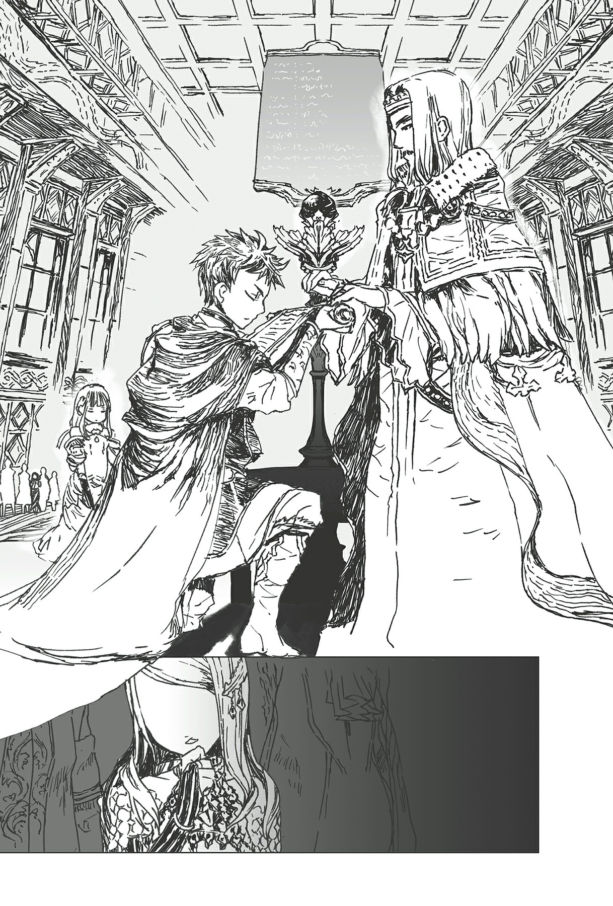

# Chương S2: Tái sinh

*(Reincarnation)*

---

### --- TRANG 38 ---

Tại Vương quốc Analeit, có một cậu bé tên là Schlain Zagan Analeit.

Như cái tên đã gợi ý, cậu là một thành viên của hoàng tộc.

Cậu là con của một phi tần của nhà vua và sống với tư cách là đệ tư hoàng tử.

Nhưng cậu bé này lại sở hữu ký ức từ kiếp trước.

Ở kiếp đó, tên của cậu là Yamada Shunsuke.

Tôi sẽ thành thật nhé: Cậu bé đó chính là tôi.

Ký ức cuối cùng từ kiếp trước của tôi là cảnh đang ngồi trong giờ học tiếng Nhật Cổ điển.

Vào lúc đó, tôi nhận ra một vết nứt trên không trung ngay phía trên lớp học, và rồi mọi thứ tối sầm lại.

Những vết rách trong không gian không phải là chuyện bình thường ở Trái Đất.

Vì vậy, bất kể chuyện gì xảy ra lúc đó rất có thể là lý do khiến tôi mất mạng.

Thế rồi, một cách khó hiểu, tôi được tái sinh với đầy đủ ký ức của kiếp trước.

Đó là cách tôi đến sống ở thế giới giống như game này, nơi các kỹ năng và cấp độ là có thật.

Ở thế giới này, bạn thực sự sở hữu một "bảng trạng thái".

Làm sao thứ này có thể tồn tại trong thực tế ngoài đời thực chứ không phải trong game? Tôi đã thắc mắc về điều đó một thời gian, nhưng cuối cùng tôi đã từ bỏ việc cố gắng tìm hiểu.

Thay vào đó, tôi nhận ra sẽ thú vị hơn nếu tập trung vào những mặt tích cực khi sống ở một thế giới như thế này. Việc luyện tập sẽ cải thiện năng lực của tôi, và việc mài giũa sức mạnh của bản thân theo cách đó cũng khá là vui.

Tuy nhiên, thế giới này cũng có những bất tiện của nó.

Bạn không thể nhìn thấy bảng trạng thái của bất kỳ ai. Khái niệm này tồn tại, nhưng bạn phải đáp ứng những điều kiện cực kỳ khắt khe nếu muốn nhìn thấy nó.

Bạn thấy đấy, có một kỹ năng gọi là Thẩm định.

---

### --- TRANG 39 ---

Với Thẩm định, bạn có thể nhìn thấy bảng trạng thái, nhưng rất ít người sở hữu kỹ năng đó.

Để học được nó, cũng giống như việc trở thành một giám định viên hay chuyên gia định giá ở Trái Đất, bạn cần một sự giáo dục kỹ lưỡng về cách đánh giá giá trị của vạn vật, khả năng quan sát để tìm ra thành phần của các chất, và các kỹ năng cấp cao khác tương tự. Không một kẻ nghiệp dư nào có thể làm được điều đó.

Và ngay cả khi bạn có thể học được kỹ năng Thẩm định, việc nâng cấp độ của nó cũng cực kỳ khó khăn, vì thế ngay từ đầu đã có rất ít người sở hữu nó.

Thực ra, tất cả những gì cần thiết để học được Thẩm định chỉ là chi trả đúng số lượng điểm kỹ năng tương ứng.

Nhưng ngay cả khi việc đó là khả thi về mặt kỹ thuật, bạn cũng không thể tiến xa hơn một khi đã sở hữu nó.

Việc tăng cấp độ kỹ năng của Thẩm định chỉ yêu cầu bạn sử dụng nó.

Mỗi khi bạn sử dụng Thẩm định, độ thuần thục của bạn sẽ tăng lên, và nếu đạt đến một mức độ thuần thục nhất định, cấp độ kỹ năng cũng sẽ tăng lên theo.

Tuy nhiên, việc sử dụng kỹ năng mới là vấn đề thực sự.

Một mặt, nó không đòi hỏi bất kỳ ma lực hay năng lượng nào cả.

Tôi biết bạn đang nghĩ gì: "Thế thì chẳng phải cậu có thể dùng nó bất cứ khi nào cậu muốn sao?" Mọi chuyện không đơn giản như thế.

Điểm mấu chốt là thế này: Mỗi khi Thẩm định được sử dụng, người dùng sẽ bị tấn công bởi một cơn đau đầu và cảm giác say xỉn.

Mức độ có vẻ khác nhau tùy thuộc vào từng cá nhân, nhưng trong trường hợp xấu nhất, một số người sẽ ngất xỉn ngay sau khi sử dụng chỉ một lần, và ngay cả những người dùng tài năng hơn cũng không thể Thẩm định quá hai thứ cùng một lúc.

Vì mỗi lần sử dụng đều rất cực khổ, nên việc sử dụng kỹ năng này lặp đi lặp lại để tăng độ thuần thục sẽ là một cực hình vô cùng khủng khiếp.

Như một phần thưởng phụ thêm, kỹ năng Thẩm định sẽ hoàn toàn vô dụng cho đến khi nó đạt đến một cấp độ rất cao.

Và vì thế, rất ít người bận tâm đến việc học nó.

Trên thực tế, chỉ có một số ít gia tộc kiếm sống bằng nghề Thẩm định sư, truyền lại kỹ năng này qua nhiều thế hệ.

Nên nếu bạn đang thắc mắc làm thế nào để bất kỳ ai kiểm tra được bảng trạng thái của mình, câu trả lời là bằng Đá Thẩm định.

Đá Thẩm định là một ma cụ được tạo ra thông qua một quy trình đặc biệt, cho phép người nắm giữ tạm thời sử dụng kỹ năng này.

Cấp độ của kỹ năng được phép bởi một trong những viên đá này phụ thuộc vào chất lượng của nó. Số lượng đá trên thế giới cho phép đạt đến cấp độ 10, giống như viên đá

---

### --- TRANG 40 ---

thuộc sở hữu của hoàng tộc, chỉ có thể đếm trên đầu ngón tay.

Tất nhiên, bạn cần có sự cho phép đặc biệt để sử dụng nó, vì vậy về cơ bản chỉ có những đại quý tộc thân cận với hoàng tộc mới có cơ hội. Vì bản thân tôi là người hoàng tộc, về mặt lý thuyết tôi có thể sử dụng nó, nhưng không phải là tôi có thể làm việc đó bất cứ khi nào mình muốn. Tôi đã mè nheo cô hầu gái Anna về chuyện này nhiều lần, nhưng nó chỉ có thể được sử dụng khi bạn đạt đến một độ tuổi nhất định.

Thực tế, hóa ra lần đầu tiên được Thẩm định bảng trạng thái được coi là một dịp đặc biệt, vì vậy giới quý tộc và những người tương tự luôn tổ chức một buổi lễ trang trọng, lớn cho sự kiện này.

Và tôi cũng phải trải qua buổi lễ đó.

Ngoài việc Thẩm định, buổi lễ này còn đóng vai trò là màn ra mắt của đứa trẻ trước giới thượng lưu.

Kết quả Thẩm định của bạn được tiết lộ cho tất cả những người có mặt, và tất cả người lớn sẽ bắt đầu đánh giá giá trị của bạn ngay tại chỗ.

Tôi có nhiều kỹ năng hơn một người bình thường ở độ tuổi của mình, vì vậy tôi biết chuyện đó có lẽ sẽ không phải là vấn đề đối với tôi. Nhưng rõ ràng là nếu các chỉ số của bạn cực thấp, gia đình bạn có thể từ bỏ bạn, nên đó là một viễn cảnh khá đáng sợ.

Dù sao thì, tôi và em gái tôi, Sue, một đứa con của vương hậu sinh ra vào khoảng cùng thời điểm với tôi, sắp sửa trải qua buổi ra mắt công chúng của mình.

Sue và tôi phải thay sang bộ quần áo lễ hội dành cho trẻ em cho dịp này và nghe đi nghe lại về lịch trình của buổi lễ.

Đức vua hiện tại—nói cách khác là cha của chúng tôi—cũng tham dự.

Ngoài ra, sẽ có sự hiện diện của những nhân vật cực kỳ quan trọng khác, vì vậy việc phạm sai lầm và làm xấu mặt bản thân là điều không được phép xảy ra.

Mặc dù là một đứa trẻ, tôi vẫn là một thành viên của hoàng tộc.

Tôi sắp sửa đóng vai trò chính trong buổi lễ, vì vậy tôi cần phải gánh vác thể diện của hoàng tộc trên vai mình.

Đó quả là một gánh nặng lớn đối với một kẻ kiếp trước chỉ là thường dân thuộc tầng lớp trung lưu bình dân.

Tuy nhiên, khi tôi nhìn thấy phong thái uy nghiêm mà em gái tôi đang thể hiện ngay bên cạnh mình, tôi cảm thấy một sự quyết tâm phải làm mọi việc thật nghiêm túc, gần như là một sự nôn nóng.

"Các con đã sẵn sàng chưa?"

Tôi lặng lẽ gật đầu đáp lại lần kiểm tra cuối cùng của Anna.

"Vậy thì xin mời bước vào."

Anna thúc chúng tôi tiến lên phía trước, và Sue cùng tôi đi song song qua cánh cửa tiến vào lễ đường.

---

### --- TRANG 41 ---

Ngay khi chúng tôi bước qua lối vào, không gian nghi lễ rộng lớn hiện ra ngay trước mắt tôi.

Một tấm thảm đỏ trải dài từ cửa theo một đường thẳng hướng về phía bục phát biểu, nơi một người đàn ông đang đứng đợi sẵn.

Một đám đông người xếp hàng dọc theo bức tường đang im lặng quan sát chúng tôi.

Mọi người ở đây đều là những quý tộc có địa vị cao.

Sue và tôi bước đi trên tấm thảm mà không nói một lời.

Bước đi của chúng tôi rất chuẩn mực và uy nghiêm, đúng như cách chúng tôi đã được dạy để chuẩn bị cho chính ngày này.

Tôi có thể cảm nhận được ánh mắt của các quý tộc đang dòm ngó mình, nhưng tôi đã cố gắng hết sức để phớt lờ họ.

Cuối cùng, chúng tôi cũng đến trước bục. Sue và tôi dừng lại và quỳ xuống.

Đứng sẵn sàng đằng sau bục là nhà vua, cha của chúng tôi, Meiges Derra Analeit.

“Lễ Thẩm định bây giờ xin được phép bắt đầu.” Giọng nói uy nghiêm của đức vua vang vọng khắp lễ đường.

Mặc dù ông là cha tôi, tôi mới chỉ gặp người này một vài lần.

Ông mang lại cảm giác giống như một người họ hàng có chức quyền cao hơn là một người cha.

Điều này chỉ làm cho sự lo lắng của tôi trở nên tồi tệ hơn.

Nhà vua vẫn đang phát biểu, nhưng tôi không thể tiếp thu hết những gì ông đang nói.

“Bây giờ, Schlain Zagan Analeit. Con có thể đứng lên.”

“Vâng, thưa cha.”

Tôi đứng dậy.

“Hãy bắt đầu buổi Thẩm định.”

Tôi bước lên chiếc bục gỗ nhỏ ở phía trước bục phát biểu.

Nếu không có bục hỗ trợ này, tôi sẽ không đủ cao với chiều cao hiện tại của mình.

Một viên đá màu đen được gắn trên bục.

Đây chính là Đá Thẩm định. Nhỏ hơn tôi tưởng tượng. Nếu tôi là một người trưởng thành, nó sẽ nằm gọn trong lòng bàn tay tôi một cách dễ dàng.

Che giấu sự ngạc nhiên của mình, tôi đặt hai tay lên Đá Thẩm định.

Đúng như những gì đã được dạy, tôi nghĩ trong đầu: [Thẩm định].

Bảng trạng thái của tôi hiện lên một cách dễ dàng đến không ngờ.

---

### --- TRANG 42 ---

`<Nhân tộc LV 1 | Tên: Schlain Zagan Analeit>`

| Chỉ số | Giá trị |
| :--- | :--- |
| **HP** | 35/35 (lục) |
| **MP** | 348/348 (lam) |
| **SP (vàng)** | 35/35 |
| **SP (đỏ)** | 35/35 |
| **Sức tấn công trung bình** | 20 (chi tiết) |
| **Sức phòng ngự trung bình** | 20 (chi tiết) |
| **Sức mạnh ma pháp trung bình** | 314 (chi tiết) |
| **Khả năng kháng tính trung bình** | 299 (chi tiết) |
| **Tốc độ trung bình** | 20 (chi tiết) |

`<Kỹ năng: | Điểm kỹ năng: 100.000 | Danh hiệu: Không>`

[Cảm nhận ma lực LV 8] [Thao tác ma lực LV 8] [Ma đấu pháp LV 6] [Ban tặng ma lực LV 5] [Tấn công ma pháp LV 3] [Tốc độ hồi phục MP LV 7] [Tốc độ hồi phục MP LV 7] [Giảm tiêu hao MP LV 2] [Kiếm thuật LV 3] [Tăng cường phá hủy LV 2] [Ý chí chiến đấu LV 2] [Ban tặng năng lượng LV 1] [Tập trung LV 5] [Chính xác LV 1] [Né tránh LV 1] [Tăng cường thị giác LV 4] [Tăng cường thính giác LV 7] [Tăng cường khứu giác LV 2] [Tăng cường vị giác LV 1] [Tăng cường xúc giác LV 1] [Kiên cường LV 5] [Khối lượng ma pháp LV 8] [Bộc phát LV 5] [Bền bỉ LV 5] [Sức mạnh LV 5] [Cứng cáp LV 5] [Luyện kim thuật LV 8] [Bảo hộ LV 7] [Chạy nhanh LV 5] [Thần bảo hộ] [n% I = W]

Tôi có thể nhìn thấy bảng trạng thái của mình.

Cùng lúc đó, kết quả của bảng trạng thái xuất hiện trên một bề mặt giống như màn hình ở bức tường phía trước. Màn hình được kết nối với Đá Thẩm định để nó có thể hiển thị kết quả. Rõ ràng, thế giới này không có khái niệm "thông tin cá nhân".

Đối với tôi, kết quả Thẩm định hiển thị bằng tiếng Nhật, nhưng trên màn hình, chúng lại hiện lên bằng ngôn ngữ được nói ở đây. Tôi đã tự hỏi chuyện gì sẽ xảy ra

---

### --- TRANG 43 ---

nếu nó hiển thị bằng tiếng Nhật, nhưng tôi đoán hệ thống đã tính đến những chuyện thuộc loại này rồi.

Những tiếng xôn xao bắt đầu khuấy động khắp căn phòng.

Đức vua lớn tiếng nhằm xoa dịu đám đông, nhưng sự ồn ào vẫn tiếp tục không hề giảm bớt.

Bảng trạng thái của tôi chắc chắn phải rất bất thường mới gây ra phản ứng đó.

Thành thật mà nói, tôi cũng đã phần nào đoán được chuyện như thế này sẽ xảy ra.

Các chỉ số liên quan đến ma pháp của tôi tương đối cao. Anna đã bảo chứng cho điều đó.

Ngược lại, năng lực thể chất của tôi thì phù hợp với lứa tuổi của mình.

À thì, nó vẫn cao hơn nhiều so với mức trung bình, nhưng nó không lệch khỏi tiêu chuẩn nhiều như ma pháp của tôi.

Vì vậy chỉ số của tôi khá là mất cân bằng.

Về phần các kỹ năng, một giọng nói gọi là Lời của Thần đã thông báo cho tôi mỗi khi tôi tăng cấp một kỹ năng hoặc nhận được một kỹ năng mới, nên tôi đã biết về hầu hết chúng rồi.

Nhưng có hai cái tôi không nhận ra.

Một cái là Thần bảo hộ, và cái kia có một cái tên trông như văn bản bị lỗi.

Tò mò về chúng, tôi thử Thẩm định chúng xem sao.

`<Thần bảo hộ: Bạn được bảo hộ bởi trời cao, giúp bạn dễ dàng đạt được kết quả mình mong muốn trong bất kỳ tình huống nào.>`

`<n% I = W: Không thể Thẩm định>`

Cái gì thế này?

Cái gọi là Thần bảo hộ kia thật là điên rồ. Chắc chắn là một kỹ năng có thể coi là gian lận.

Tuy nhiên, cách diễn đạt "dễ dàng đạt được kết quả mình mong muốn" chắc hẳn có nghĩa là mọi việc không nhất thiết phải diễn ra theo đúng ý tôi muốn trong mọi lần. Nó vẫn là một kỹ năng tuyệt vời, nhưng tôi không nên phụ thuộc vào nó quá nhiều.

Thứ tôi không hiểu là cái còn lại kìa.

Tên của nó và kết quả Thẩm định cũng mơ hồ tương đương nhau.

Tôi hoàn toàn không biết đó có thể là loại kỹ năng gì.

Sự thật là ngay cả viên Đá Thẩm định cấp cao nhất hiện có vẫn cho ra kết quả này lại càng bí ẩn hơn nữa.

Nếu viên Đá này không thể cho tôi biết, có lẽ không có cách nào để tìm hiểu chi tiết về năng lực này rồi.

Tôi không hiểu nổi.

“Chẳng phải chuyện đó giống như con gái của công tước sao?”

---

### --- TRANG 44 ---

“Đúng vậy, thiên tài đó...”

“Nhưng Điện hạ cũng là một thiên tài giống như cô ấy... không, thậm chí còn hơn thế nữa!”

Khi các quý tộc tiếp tục tán gẫu, tôi nghe thấy họ liên tục nhắc đến cụm từ “con gái công tước”.

Có ai đó khác cũng sở hữu những chỉ số tương tự sao?

Tôi cứ nghĩ Sue là người duy nhất ngoài tôi ra chứ...

“Trật tự!”

Đáp lại tiếng hét cực lớn của nhà vua, lễ đường cuối cùng cũng dịu xuống.

Nhà vua đưa cho tôi một tờ giấy.

Đó là bản ghi lại kết quả của tôi, được in bằng ma pháp từ màn hình kết nối với Đá Thẩm định.

Tôi đón lấy tờ giấy một cách cung kính. Sau đó tôi cúi chào và bước xuống.

Với việc này, Lễ Thẩm định của tôi đã kết thúc.

Bây giờ đến lượt của Sue.

Không cần phải nói, một sự náo động khác lại bao trùm cả căn phòng khi kết quả Thẩm định của Sue cho thấy kết quả tương tự như tôi.

Tuy nhiên, khác với tôi, Sue không có Thần bảo hộ hay bất kỳ kỹ năng lỗi bí ẩn nào cả.

Bỏ qua sự náo động nhỏ đó, Lễ Thẩm định kết thúc mà không có sự cố nào khác xảy ra.

Nhưng các chỉ số cao bất thường của chúng tôi không phải là nguyên nhân duy nhất gây ra sự xáo động.

Nghe lỏm được từ các quý tộc bằng thính giác được tăng cường của mình, tôi biết được rằng điểm kỹ năng thông thường chỉ được trao khi một người tăng cấp, vì vậy việc có một trăm nghìn điểm kỹ năng ở cấp độ 1 như tôi là vô cùng bất thường.

Điều này làm tôi nhớ ra: Sue cũng có 0 điểm kỹ năng giống như vậy.

Tôi đoán đây có lẽ là vì tôi là người đầu thai, nhưng điều thực sự làm tôi chú ý là con gái công tước dường như cũng được sinh ra với điểm kỹ năng sẵn có.

Theo những gì tôi có thể biết, Lễ Thẩm định của cô ấy đã được tổ chức chỉ vài ngày trước tôi.

Và giống như tôi, cô ấy sở hữu các chỉ số cao đến kinh ngạc so với độ tuổi của mình cùng số điểm kỹ năng đáng lẽ không thể có được.

---

### --- TRANG 45 ---

---

### --- TRANG 46 ---

Rõ ràng, con gái công tước thậm chí còn sở hữu cả kỹ năng có ký tự bị lỗi kia nữa.

Một mối nghi ngờ nhất định bắt đầu dấy lên trong lòng tôi.

Nếu linh cảm của tôi là đúng, thì tôi phải gặp con gái công tước bằng mọi giá.

Một cơ hội đã đến sớm hơn mong đợi.

Sau Lễ Thẩm định, một buổi tiệc chiêu đãi nhỏ được tổ chức ở một sảnh tiệc riêng biệt.

Nhà vua đưa Sue và tôi đến giữa sảnh, nơi chúng tôi kết thúc bằng việc chào hỏi một hàng dài các quý tộc.

Các vị khách đều dẫn theo con cái của họ đi cùng, hầu hết đều bằng tuổi tôi hoặc lớn hơn một chút.

Vì vậy về cơ bản, mục đích của buổi gặp gỡ này là để giới thiệu các quý tộc trẻ tuổi có độ tuổi tương đương nhau.

And đó chính là nơi tôi đã gặp vị con gái công tước đã được nhắc đến từ trước.

“Rất hân hạnh được gặp mặt Điện hạ. Thần là trưởng nữ của Công tước Anabald, Karnatia Seri Anabald.”

Cô ấy là một cô gái rất xinh đẹp, với mái tóc đỏ rực lửa và một vẻ mặt vô cùng kiên định.

Ngoại hình của cô ấy đã đủ để thu hút sự chú ý của tôi, nhưng hơn thế nữa, kỹ năng Cảm nhận ma lực của tôi cho biết cô ấy sở hữu một lượng ma lực khổng lồ.

Nó gần như tương đương với tôi và Sue.

Nhân tiện thì, Công tước Anabald là một trong những quý tộc quyền lực nhất trong nước.

Gia tộc của ông đã giữ các chức vụ quan trọng trong nước qua nhiều thế hệ, và họ xuất thân từ dòng dõi có mối liên hệ với huyết thống của các anh hùng và hoàng tộc.

Những người sinh ra trong gia đình công tước đều sẽ trải qua một nền giáo dục nghiêm khắc, toàn diện, và họ được nuôi dạy với những kiến thức chuyên môn để cống hiến cho đất nước.

Mặc dù vậy, cô gái trước mặt tôi lại sở hữu một lượng ma lực bất thường đến mức kinh ngạc.

Nó thậm chí còn vượt qua cả người đàn ông tóc đỏ bên cạnh cô ấy, người mà tôi đoán là cha của cô ấy.

“Chào buổi sáng. Ta là Schlain Zagan Analeit. Yoroshiku.”

Với một niềm tin chắc chắn, tôi cố tình nhấn mạnh từ cuối cùng, có nghĩa là “rất vui được gặp cậu”, bằng tiếng Nhật.

---

### --- TRANG 47 ---

Mắt của con gái công tước trợn tròn lên trong một khoảnh khắc, rồi nhanh chóng híp lại.

Dựa vào phản ứng đó, tôi dám chắc rằng phán đoán của mình đã chính xác.

“Thưa cha. Con có thể trò chuyện riêng với vị tiểu thư này một lát được không ạ?”

“Hửm?” Phản ứng của đức vua có vẻ hơi ngạc nhiên.

Tôi đoán điều này cũng tự nhiên thôi, vì vẫn còn một hàng dài các quý tộc cùng con cái của họ đang đứng đợi phía sau công tước và con gái ông, những người đứng đầu tiên trong hàng.

Nhưng tôi không thể để mình rút lui ở đây được.

“Không được ạ?”

“Hắng giọng.” Nhà vua nhìn tôi, rồi nhìn công tước, và nhìn hàng người phía sau trước khi lên tiếng. “Được rồi. Nhưng đừng đi quá lâu đấy. Con phải quay lại đây sau một lát.”

“Vâng, thưa cha. Con xin cảm ơn cha rất nhiều.”

Tôi nắm lấy tay con gái công tước như một đứa trẻ và chạy đi.

Phía sau tôi, tôi có thể nhận thấy Sue đang bừng bừng giận dữ, nhưng tôi không thể bận tâm đến chuyện đó vào lúc này.

Tôi rời khỏi sảnh tiệc và bước vào một căn phòng riêng đóng vai trò là phòng chờ.

Các quý tộc thường xuyên rời khỏi các bữa tiệc để bàn bạc công việc kinh doanh và các vấn đề công việc riêng tư khác, nên luôn có những căn phòng như thế này ở gần các sảnh hội nghị.

Nơi này được cho là cách âm, và có một lính canh đứng túc trực bên ngoài cửa, nên chúng tôi được an toàn.

“Phù. Ở đây chắc ổn rồi.” Lúc này tôi đã công khai nói bằng tiếng Nhật.

“Thật không thể tin nổi. Hóa ra hoàng tử cũng là người đầu thai sao...” Con gái công tước trả lời bằng chính ngôn ngữ đó. “Trời ạ... Đã lâu lắm rồi tớ mới được nghe người khác nói tiếng Nhật đấy. Tớ sắp phát khóc lên được rồi đây này.”

Cô ấy trông vẫn kiên định như mọi khi, nhưng giọng điệu bây giờ lại khá nhẹ nhàng.

“Vậy, nếu cậu không phiền cho tớ hỏi, cái tên Trường Trung học Heishin có gợi nhớ gì cho cậu không?” Tôi tung ra cái tên trường trung học mà tôi đã học ở Trái Đất.

“Có chứ, tất nhiên rồi. Vậy là cậu thực sự đã đầu thai vào thế giới này từ cùng một trường trung học với tớ sao...”

Đúng như tôi đã nghi ngờ, cô gái này là một người bạn học cũ của tôi, bị kéo vào thế giới này bởi vết nứt bí ẩn trong lớp học của chúng tôi, hệt như tôi vậy.

“Tên cũ của tớ là Yamada Shunsuke. Còn cậu thì sao?”

---

### --- TRANG 48 ---

“Phụt!”

Khi tôi đưa ra cái tên của mình, cô gái không thể nhịn được mà bật cười thành tiếng.

“Ha ha ha ha! Hơ, ha ha ha! Cậu, cậu á, cậu thực sự là Shun hả?! Shun mà làm hoàng tử á?! Ha ha ha... Trông chả giống cậu chút nào cả, ông bạn!”

Cô ấy đang cười ngặt nghẽo rồi.

Tôi có một cảm giác quen thuộc đến kỳ lạ.

Tôi không nhận ra cô gái trước mặt mình, nhưng cách nói năng và hành xử của cô ấy khiến cô ấy giống hệt một người mà tôi biết rất rõ.

“C-cậu không phải là... Kanata đấy chứ?!”

“Chính xác.”

Lần này đến lượt tôi bật cười nắc nẻ.

Chiến hữu chơi game cũ của tôi, người anh em Kanata của tôi, giờ đã là một tiểu thư quý tộc quý phái.

Cứ như thể cậu ấy được tái sinh thành phiên bản hoàn toàn trái ngược với bản thân trước đây vậy.

“Này, đừng cười nữa mà. Cậu có biết tớ đã trầm cảm thế nào khi lần đầu tiên được tái sinh thế này không?”

“Xin lỗi, xin lỗi nhé. Nhưng cậu cũng cười tớ mà đúng không? Giờ chúng ta huề nhau rồi nhé.”

“Tớ đoán vậy. Nhưng mà khốn thật, tớ rất vui vì chúng ta đã gặp nhau thế này. Tớ đã khá cô đơn suốt thời gian qua đấy.”

“Ừ. Tớ cũng vậy thôi. Tớ rất vui vì đã tìm thấy cậu.”

Kanata và tôi đấm nhẹ vào tay nhau.

Vào khoảnh khắc đó, những giọt nước mắt bắt đầu rơi xuống từ mắt Kanata.

“Ủa, cái gì...? Ồ, trời ạ, xin lỗi nhé. Tớ đã thề là mình sẽ không... hức... khóc rồi mà... hức...”

Tiếng nấc cụt của Kanata càng lúc càng lớn hơn.

Trước khi kịp nhận ra, tôi cũng đã khóc theo.

Tôi nhớ lại cảm giác khi lần đầu tiên nhận ra mình đã đầu thai.

Tôi chắc chắn không thể nói rằng mình không nhớ cuộc sống cũ của mình. Nếu có gì, tôi chỉ có đầy những sự hối tiếc.

Tôi vẫn đang ở độ tuổi thanh xuân đẹp nhất, và tôi muốn dành nhiều thời gian hơn để đi chơi với bạn bè. Tôi thậm chí còn chưa từng có bạn gái nữa.

Bên cạnh đó, tôi cảm thấy thật tồi tệ khi không chỉ chết trước bố mẹ, mà thậm chí là cả ông bà của mình.

---

### --- TRANG 49 ---

Khi tôi nhận ra mình sẽ không bao giờ được gặp lại gia đình nữa, trái tim tôi chìm xuống sâu hơn những gì bạn có thể tưởng tượng.

Tôi cũng tò mò về tình trạng của trường học sau khi tôi chết nữa.

Tôi nhớ vết nứt trên không trung và khoảnh khắc nó toác rộng ra. Nếu tôi chết vì chuyện đó, chuyện gì đã xảy ra với những người khác chứ? Kyouya, Kanata, Hasebe ngồi bên cạnh tôi... Có phải tất cả bọn họ đều đã chết cùng với tôi không?

Suy nghĩ đó làm tôi khiếp sợ.

Buổi sáng hôm đó đã diễn ra hoàn toàn bình thường, nhưng giờ tôi không bao giờ có thể gặp lại bất kỳ ai trong số họ được nữa.

Tôi đã phải chiến đấu chống lại nỗi sợ hãi đè nén đó kể từ khi lần đầu tiên đầu thai.

Không hề biết chuyện gì đang xảy ra, tôi đột nhiên thức dậy với tư cách là một đứa trẻ sơ sinh, nên việc tôi cảm thấy lo lắng là điều tự nhiên. Hơn thế nữa, đất nước nơi tôi tái sinh không phải là Nhật Bản. Thực tế, nó không phải là bất kỳ nơi nào trên Trái Đất. Đây hoàn toàn là một thế giới khác biệt.

Ban đầu, tôi không nhận ra.

Tôi không hiểu ngôn ngữ ở đây, và tôi hiếm khi được rời khỏi phòng trẻ.

Vì vậy có rất nhiều điều tôi không biết. Lúc đầu tôi nghĩ mình đang ở đâu đó bên châu Âu.

Nhưng lần đầu tiên tôi nhìn thấy ma pháp, tôi nhận ra chuyện không phải như vậy. Việc này xảy ra khi một vị tư tế quyền năng thực hiện một buổi ban phước cho tôi. Tôi được bao bọc trong ánh sáng lấp lánh, và tôi cảm nhận được sức mạnh đang chảy vào người mình. Đó là lúc tôi cảm nhận được sự tồn tại của ma pháp lần đầu tiên.

Ban đầu, điều này làm tôi hào hứng.

Nhưng rồi tôi lại trở nên lo lắng một lần nữa.

Liệu tôi có thể thực sự tự mình tiến bước trong một thế giới có ma pháp không? Tôi chỉ là một gã bình thường ở kiếp trước của mình.

Quay lại thời ở Nhật Bản, tôi chưa từng thực sự phải trải qua bất kỳ khó khăn nào cả. Nhưng ở thế giới này, nơi tôi được sinh ra trong một gia đình ưu tú, sự tầm thường không phải là một lựa chọn.

Liệu tôi có thể sống đáp ứng được sự kỳ vọng đó không? Tôi đã rất lo lắng.

Và vì tôi là một đứa trẻ sơ sinh, tôi không thể khiến cơ thể cử động theo cách mình muốn được, điều đó thật đáng sợ. Việc không thể sống thiếu sự trợ giúp của người khác càng làm tôi căng thẳng hơn.

Điều gì sẽ xảy ra nếu những người đang nuôi dưỡng tôi đột nhiên quyết định dừng lại?

Tôi sẽ không thể làm gì khác ngoài việc yếu đi và chết.

Hơn nữa, những người nuôi dưỡng tôi là các hầu gái, chứ không phải gia đình ruột thịt của tôi.

Vì họ không có quan hệ máu mủ với tôi, nên không có gì đảm bảo rằng họ sẽ

---

### --- TRANG 50 ---

tiếp tục chăm sóc tôi.

Cộng thêm việc tôi vẫn nhớ kiếp trước của mình, bố mẹ ruột của tôi ở thế giới này mang lại cảm giác giống như người lạ vậy.

Vậy nên chẳng phải hoàn toàn có khả năng những người bố mẹ này cũng ít gắn bó với tôi và có khả năng vứt bỏ tôi bất cứ lúc nào sao?

Tâm trí tôi mệt mỏi đến mức tôi bắt đầu có những ảo tưởng điên rồ đó.

Trong khi đó, tôi bắt đầu tuyệt vọng cố gắng học ngôn ngữ.

Việc không biết bất kỳ từ ngữ nào đáng sợ hơn những gì tôi có thể tưởng tượng.

Tôi không hiểu bất kỳ ai đang nói gì. Ai mà biết chuyện đó lại mang đến cho tôi sự tuyệt vọng lớn đến thế chứ?

Nó làm tôi cảm thấy hoàn toàn đơn độc.

Tôi lo lắng về việc được tái sinh ở thế giới khác. Khổ sở vì không hiểu ngôn ngữ. Quằn quại vì liệu mình có thể tự mình tiến bước trong tương lai không.

Thứ đã xoa dịu tâm trí đang rối bời của tôi chính là sự hiện diện của em gái tôi, đang ngủ một cách yên bình ngay bên cạnh tôi.

Đứa em gái cùng cha khác mẹ này của tôi không thèm bận tâm đến một chuyện gì cả.

Con bé hoàn toàn vô tư lự, như thể chẳng có điều gì trên đời đáng để lo lắng vậy.

À thì, tôi đoán đó là chuyện tự nhiên đối với một đứa trẻ sơ sinh.

Một sinh vật nhỏ bé yếu ớt phó mặc số phận của mình cho người khác và phụ thuộc vào thế giới cho tất cả mọi thứ...

Đó là những gì một đứa trẻ sơ sinh đáng lẽ phải như thế.

Lý do duy nhất tôi lo lắng như vậy là vì tôi sở hữu ký ức từ kiếp trước của mình.

Thế rồi tôi nhận ra một điều...

Vì tôi có ký ức của mình, ít nhất tôi nên có tinh thần vượt trội hơn em gái của mình chứ.

Vậy tại sao tôi lại tràn ngập lo lắng khi con bé ở ngay bên cạnh tôi, lại rất hạnh phúc cơ chứ?

Tôi là anh trai của con bé. Tôi không nên hành xử một cách thảm hại như vậy trước mặt em gái mình, tôi nhận ra điều đó. Một người anh trai thì đáng lẽ phải thật ngầu chứ.

Có lẽ đó chỉ là sự tự phụ thôi.

Nhưng sau thời điểm đó, tôi đã ngừng lo lắng quá nhiều. Tôi chưa hoàn toàn vượt qua được nỗi sợ hãi của mình, nhưng tôi biết mình muốn ít nhất là bảo vệ đứa em gái không có khả năng tự vệ của mình.

---

### --- TRANG 51 ---

Tôi dần dần học được nhiều từ ngữ hơn, và chậm rãi nhưng chắc chắn tôi bắt đầu tiếp thu được nhiều thông tin hơn về thế giới này từ những mẩu trò chuyện vụn vặt mà tôi nghe được.

Muốn lấy lại phạm vi chuyển động mà tôi đã quen thuộc càng sớm càng tốt, tôi đã rèn luyện cơ thể trẻ sơ sinh của mình bằng cách di chuyển xung quanh nhiều nhất có thể.

Nhờ có việc đó, tôi đã học bò sớm hơn bình thường rất nhiều.

Theo cách này, mong muốn thể hiện trước mặt em gái đã thúc đẩy tôi.

Tôi muốn trở thành một người anh trai mà con bé có thể tự hào.

Tuy nhiên, tôi đã không tính đến khả năng con bé hóa ra lại là một thiên tài vô lý bắt chước tôi và trở nên mạnh mẽ gần như tương đương.

Kanata chắc hẳn phải trải qua sự lo lắng ít nhất là tương đương với tôi.

Ý tôi là, chắc chắn là rất sốc khi sống cả đời dưới tư cách là một người đàn ông và rồi đột nhiên được tái sinh thành một phụ nữ.

Tôi đã cố gắng hình dung việc phải chịu đựng sự căng thẳng của một cuộc sống phụ nữ mới mẻ bên cạnh tất cả những nỗi sợ hãi mà tôi đã phải đối mặt.

Chuyện đó chắc chắn phải khó khăn hơn những gì tôi có thể tưởng tượng rất nhiều.

Và rồi tôi đã được đoàn tụ với người bạn của mình, người mà tôi cứ ngỡ sẽ không bao giờ được gặp lại nữa.

Tôi không thể kìm nén được cảm xúc đang dâng trào trong lòng.

Không suy nghĩ nhiều, tôi tiến đến ôm lấy Kanata đang khóc.

Vào khoảnh khắc đó, một tiếng rầm lớn vang lên từ phía cánh cửa của căn phòng riêng.

“Cái gì thế?!”

Kanata trông rất bối rối.

Tôi cũng hoảng hốt một lát, nhưng đã bình tĩnh lại ngay khi nhận ra ai đang đứng ở cửa sổ cửa ra vào.

Không, thực ra, tôi chỉ hoảng hốt theo một cách khác thôi.

Một tiếng rầm thứ hai thổi bay cánh cửa vào bên trong.

Đứng bên ngoài lối vào với một nắm đấm tích tụ ma pháp sẵn sàng là Sue, người đã tăng cường thể chất của mình bằng ma pháp.

Sue liếc nhìn hai chúng tôi, rồi khóa mục tiêu vào Kanata.

“Sue, dừng lại!”

Nếu tôi không vội vàng lao vào giữa hai người bọn họ, nắm đấm của Sue chắc chắn đã thổi bay Kanata đi rồi.

---

### --- TRANG 52 ---

“Không được cướp anh trai của ta!” Sue lầm bầm, ngay lập tức bám chặt lấy tôi.

“Em gái cậu đáng sợ quá đấy, ông bạn,” Kanata thì thầm bằng tiếng Nhật.

Đó là ngày tôi được đoàn tụ với người bạn học đầu tiên của mình.
