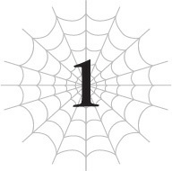
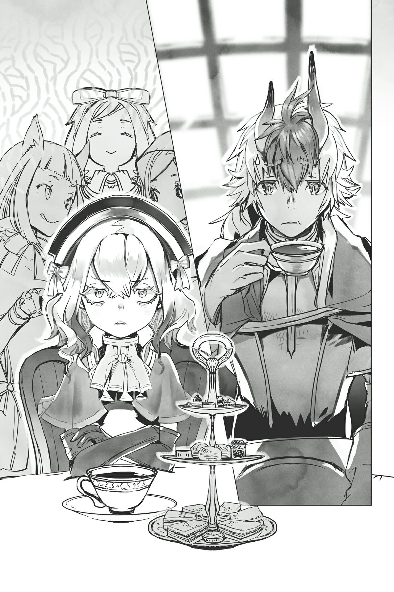

# Hãy lập mục tiêu
*(Let’s Set a Goal)*

Hương trà đậm đà cùng mùi bánh ngọt ngào quyện lẫn với hương hoa trang trí trong phòng tôi.

Các mùi hương tuy khác biệt nhưng lại hài hòa một cách kỳ lạ.

Tôi cá là ngay cả điều đó cũng nằm trong sự sắp đặt có ý đồ của họ.

Những người phục vụ trong dinh thự của vị công tước này quả là không phải dạng vừa.

Hiện tại, chúng tôi đang tổ chức buổi tiệc trà thường lệ.

Thành viên tham dự gồm có Vampy, ba chị em nhện rối Sael, Riel và Fiel, cùng với tôi.

Ngoài ra còn có cậu Oni, người đang trông có vẻ vô cùng bồn chồn khó chịu.

Chỉ sáu người chúng tôi.

Gia nhân trong dinh thự đã nhanh chóng tản đi ngay sau khi dọn đồ ra, như thường lệ.

Mà, tôi đoán mình cũng không thể trách họ được, vì cả nhóm thường tỏa ra một hào quang kiểu "chớ có dây vào" đối với nhân viên ở đây.

Ngay cả khi không phải thế, họ có lẽ cũng chẳng thể chịu đựng nổi bầu không khí ngột ngạt này.

Đúng vậy. Bầu không khí căng thẳng đến mức có thể dùng dao cắt ra được, phần lớn là nhờ Vampy, kẻ đang lườm cậu Oni như muốn ăn tươi nuốt sống.

Trong khi con bé cứ im lặng nhìn chằm chằm đầy thù hằn, cậu Oni trông ngày càng bối rối không biết phải làm sao.

Tôi đoán hai người này sẽ chẳng bao giờ có thể hòa hợp nổi.

Ý tôi là, họ đã từng cố gắng giết nhau tới hai lần rồi mà.

Lúc đó, cậu Oni đang ở trong trạng thái mất trí do kỹ năng Wrath (Phẫn Nộ) cực kỳ mạnh mẽ cùng tác dụng phụ khủng khiếp của nó.

Khi anh ta nổi điên, Vampy và tôi đã đấu với anh ta hai lần, cả hai lần đều suýt mất mạng.

Hả? Bạn bảo ở trận thứ hai, tôi đã hoàn toàn áp đảo anh ta bằng một chiến thuật cực kỳ rẻ tiền á?

Tôi chẳng nhớ gì cả nhé.

Dù sao thì, cậu Oni và Vampy có một quá khứ khá là ân oán.

Đã thế, Vampy còn bị đánh cho bầm dập và suýt chết ở lần đầu tiên, còn lần thứ hai thì tôi lại can thiệp, nên giữa họ vẫn chưa phân định thắng thua rõ ràng.

Dù tôi khá chắc là cô bé ma cà rồng nhà chúng tôi sẽ thua nếu tôi không nhúng tay vào.

Nhưng sự thật đó có lẽ chỉ càng khiến con bé ghét cậu Oni hơn, vì con bé là một kẻ cực kỳ cay cú khi thua cuộc.

Và thế là dẫn đến tình trạng đối đầu hiện tại.

Thật không thể tin nổi.

Nếu muốn đánh nhau thì nhào vô đánh luôn đi.

Đừng có phá hỏng thời gian thư giãn nghỉ ngơi của tôi chứ!

Tại sao tôi lại phải chịu đựng một bầu không khí u ám đến mức nuốt chén trà với miếng bánh ngọt còn không thấy ngon thế này?

Bây giờ dung tích dạ dày của tôi đã bị thu nhỏ đáng kể, tôi không còn nhiều cơ hội để thưởng thức đồ ăn ngon nữa đâu đấy!

Aaaaa, không chịu đâuuuuu.

Cậu Oni có vẻ đang cầu cứu tôi qua những ánh mắt tuyệt vọng, nhưng tôi lờ tịt đi.

Những buổi tiệc trà của chúng tôi thường diễn ra trong im lặng.

Và nhờ những bài học khắc nghiệt của huấn luyện viên kiểu Spartan trong dinh thự, giờ đây chúng tôi đã có phép lịch sự hoàn hảo, nghĩa là việc ăn uống cũng hoàn toàn không phát ra tiếng động.

Không một lời nói, không một tiếng động. Cảnh tượng này chắc chắn trông rất kỳ dị đối với bất kỳ ai ngoài chúng tôi.

Nhưng tôi và lũ nhện rối vốn chẳng bao giờ nói chuyện, nên đương nhiên Vampy cũng không có gì để nói.

Cậu Oni có vẻ đã nhận ra điều này, nên anh ta cũng không cố gắng bắt chuyện.

Hay đây chỉ là áp lực đồng trang lứa?

Chúng tôi cứ tiếp tục uống trà và ăn bánh trong sự im lặng căng thẳng.

Chẳng phải tiệc trà thường phải vui vẻ và nhẹ nhàng hơn một chút sao?

Ồ, nhưng nghĩ lại thì, nghe nói các buổi tiệc trà của giới quý tộc thường đi kèm với những âm mưu ngầm, những lời đe dọa ẩn ý, trao đổi thông tin và vân vân. Chỉ nghĩ đến thôi là tôi đã thấy đau dạ dày rồi.

Thế nên tôi đoán bầu không khí gây đau dạ dày không kém này có khi lại đúng chuẩn một buổi tiệc trà đấy chứ!

Nhân tiện, kết luận đó chủ yếu dựa trên quan điểm và giả định cá nhân của tôi thôi, nên mọi người đừng có tin sái cổ nhé!

Aaaa, chuẩn rồi. Những lúc thế này, tốt nhất là cứ trốn tránh thực tại bằng cách chìm đắm trong suy nghĩ của chính mình.

Cho đến khi tôi nghĩ thông suốt, cậu Oni sẽ phải chịu đựng thêm một chút nữa vậy.

Nói thế thôi chứ không phải tôi đang trăn trở về ý nghĩa cuộc sống hay gì cả.

Tôi chỉ đang quyết định xem mình nên làm gì tiếp theo.

Chuyện này có lẽ sẽ là vấn đề lớn nếu tôi đang vạch ra một kế hoạch vĩ đại nào đó cho tương lai, nhưng thực tế thì chẳng sâu xa đến thế.

Bạn biết chuyện ở Nhật Bản không, khi học sinh năm hai cao trung nhận được tờ khai định hướng nghề nghiệp và bắt đầu lo lắng về tương lai của mình ấy? Giống hệt thế.

Một khi lên năm ba, các kỳ thi tuyển sinh đại học hay tìm kiếm việc làm sẽ chờ sẵn họ, dù muốn hay không.

Nên khi học sinh năm hai bắt đầu nghĩ về tương lai, họ vẫn còn chút thời gian để tìm hiểu mọi thứ.

Trường hợp của tôi về cơ bản cũng tương tự. Tôi không cần phải vội vã đưa ra quyết định, nhưng rồi cũng sẽ đến lúc phải đối mặt với thực tế thôi.

Có thể tôi hơi phiến diện, nhưng tôi nghi ngờ việc có bao nhiêu học sinh năm hai cao trung thực sự có một tầm nhìn rõ ràng về tương lai của mình.

Hầu hết họ chắc chỉ nghĩ kiểu: *Chắc mình sẽ học đại học hay gì đó rồi kiếm việc làm hay gì đó thôi, nhỉ?*

Và thường thì mọi chuyện diễn ra đúng như vậy.

Nó giống hệt tình cảnh hiện tại của tôi.

Nếu mọi chuyện cứ tiếp diễn như thế này, tương lai của tôi có lẽ sẽ là bị D tóm đi và biến thành một loại cấp dưới nào đó của cô ta.

Được tuyển dụng ngay khi vừa tốt nghiệp cao trung! Tuyệt vời quá, tôi ơi!

Đúng vậy. D dường như thực sự rất thích tôi, nên nếu tôi không sớm hành động, cô ta có lẽ sẽ từ từ nhưng chắc chắn biến tôi thành thú cưng của mình mất.

Dù D chưa bao giờ nói rõ ràng như vậy, nhưng theo những gì tôi biết, đó chính xác là những gì cô ta sẽ làm.

Nó giống như việc bạn có được một lời mời làm việc nhờ vào mối quan hệ của cha mẹ vậy.

Nếu tôi tiếp tục đi theo con đường này, tôi sẽ cứ thế lang thang vô định suốt đời, được D chiêu mộ, rồi cuối cùng nằm trong danh sách trả lương của cô ta.

Chuyện đó có xấu không? Không, không hẳn.

D là một vị thần có thể thao túng cấu trúc ma thuật cực kỳ phức tạp được gọi là "hệ thống" mà không hề chớp mắt, và giờ khi đã gặp trực tiếp cô ta, tôi biết chắc chắn cô ta là một thực thể khôn lường đến mức nào.

Với tôi hiện tại—không, cho dù tương lai tôi có mạnh lên thế nào đi nữa—tôi cũng không thể tưởng tượng nổi một viễn cảnh mình có thể đánh bại cô ta.

Tôi chẳng biết gì về thế giới của các vị thần, nên được một vị thần bảo bọc thực ra lại là một hoàn cảnh khá ngọt ngào đối với tôi đấy chứ, phải không?

Dù sao thì trên danh nghĩa tôi cũng là thần rồi cơ mà (cười)!

Một vị thần mới toanh—vừa mới thần hóa và vẫn còn non choẹt.

Và giữa việc bị hệ thống nuốt chửng với việc nuốt chửng quả bom hủy diệt lục địa kia, tôi đã đi một con đường cực kỳ bất thường để đạt tới thần cảnh, thế nên năng lực chiến đấu hiện tại của tôi thực chất còn yếu hơn trước khi trở thành thần.

Không phải là tôi biết con đường chính quy để trở thành thần là gì.

Nhưng ít nhất, tôi đoán nó không phải là tăng cấp vù vù nhờ vào một hệ thống giống như game, rồi sau đó nuốt một quả bom hủy diệt lục địa.

Dù sao đi nữa.

Tôi về mặt lý thuyết là một vị thần rồi, nhưng tôi chẳng cảm thấy mình giống thần chút nào cả.

Mặc dù lượng năng lượng khổng lồ đang cuộn xoáy bên trong tôi chắc chắn là ở cấp độ thần linh.

Như bạn có thể đoán được, năng lượng tôi hấp thụ từ quả bom hủy diệt lục địa đó... ừm, đủ để thổi bay cả một lục địa, tất nhiên rồi.

Nên đối với những người trong cuộc, hoặc ít nhất là các vị thần trong cuộc, rất dễ để nhận ra tôi là một vị thần.

Vậy chuyện gì sẽ xảy ra nếu tôi lang thang đến một hành tinh khác?

Ừm, tôi sẽ bị các vị thần của hành tinh đó phát hiện.

Điều đó dường như là không thể tránh khỏi?

Bây giờ, nếu họ vui vẻ cùng chung sống hòa bình thì quá tốt rồi.

Nhưng từ góc nhìn của họ, tôi về cơ bản là một kẻ xâm nhập, nên tôi sẽ chẳng ngạc nhiên nếu họ tấn công tôi mà không thèm chào hỏi lấy một câu.

Ý tôi là, ngay cả khi tôi rời khỏi Mê cung Lớn Elroe, Ma Vương đã lập tức tấn công tôi ngay.

Đó là lúc tôi học được chính xác việc rời khỏi địa bàn của mình nguy hiểm đến mức nào.

Nhưng mà, Ma Vương vốn đã nhắm vào cá nhân tôi từ trước, nên chuyện đó không hẳn là do tôi rời khỏi mê cung, không hoàn toàn như vậy.

Nhưng dù thế nào, miễn là tôi ở lại hành tinh này, sẽ không có vị thần vô danh ngẫu nhiên nào từ trên trời rơi xuống tấn công tôi vô cớ cả.

Nơi này thuộc phạm vi quản lý của D.

Ma pháp mạnh mẽ của hệ thống bao phủ toàn bộ bề mặt hành tinh này, và như bạn đã biết, kẻ chịu trách nhiệm không ai khác ngoài D.

Điều đó có nghĩa là D theo đúng nghĩa đen đang cai trị thế giới này.

Ngay cả khi cô ta không thực sự ở đây, việc cố gắng đụng vào hành tinh này cũng giống như việc tuyên chiến với cô ta vậy.

Nên miễn là tôi ở lại hành tinh này, tôi tự động được mượn oai của D.

Thậm chí có thể nói rằng tôi đang nằm dưới sự bảo hộ của cô ta.

Vì vậy, việc bước một bước ra khỏi vùng an toàn đó đòi hỏi rất nhiều can đảm đối với một vị thần mới tập sự như tôi.

Tôi chẳng biết gì về thần giới cả, nên nếu rời khỏi phạm vi ảnh hưởng của D, nó sẽ giống như một diễn viên nhào lộn thực hiện một cú đu dây điên rồ mà không có lưới an toàn ngay trong ngày đầu tiên đi làm vậy.

Tôi có thể chết. Rất dễ dàng.

Nên hiện tại, tôi không có kế hoạch rời khỏi hành tinh này, hay nói cách khác là khu vực quyền hạn của D.

Thành thật mà nói, điều đó càng khiến việc trở thành bà nội trợ ăn bám của D hay gì đó trở nên hấp dẫn hơn, ít nhất là xét về mặt an toàn cá nhân của tôi.

Thực tế, tôi nghĩ mình không còn lựa chọn nào khác vào lúc này.

Đặc biệt là khi nghĩ đến việc sẽ tồi tệ thế nào nếu tôi làm điều gì đó khiến cô ta phật lòng.

Xem xét mọi chuyện đã xảy ra từ trước đến nay, tôi hoàn toàn không biết D sẽ làm gì tôi nếu tôi chọc giận cô ta.

Tôi sợ rằng nó sẽ còn tồi tệ hơn bất cứ điều gì tôi có thể tưởng tượng nổi.

Chỉ là, tôi không biết nữa...

Đó cũng là vấn đề lớn nhất đối với ý tưởng làm việc cho D.

Kiểu như, cô ta chắc chắn có máu ác độc trong người.

Ví dụ như cái cách cô ta đùa giỡn với trái tim của một người nào đó bằng hệ thống, hay tất cả những lần cô ta ác ý can thiệp vào chuyện của tôi.

Cô ta không tự gọi mình là tà thần khơi khơi đâu.

Và khi tôi thực sự nhìn thấy D bằng xương bằng thịt, cô ta bằng cách nào đó còn đáng sợ hơn cả nỗi sợ hãi tồi tệ nhất của tôi.

Tôi liệu có thực sự ổn khi sống và làm việc dưới trướng một kẻ không thể hiểu nổi như vậy không?

…Tôi không thể nói là có.

Hả?

Khoan đã, thế là tôi tiêu đời dù có làm gì đi nữa sao?

…Không, dĩ nhiên là không rồi. Không đâu, được chưa?

Cứ tạm cho là thế đi. Ừ.

Dù sao thì, điều đó cũng không thay đổi được sự thật là tôi chẳng thể làm gì ngay lập tức vào lúc này.

Tôi chỉ cần tiếp tục làm bất cứ điều gì có thể, ngay tại hành tinh này, nơi tôi có thể tự do hành động.

Dù cuối cùng tôi có để D tuyển dụng trong tương lai, hay tôi chọn từ chối cô ta, tôi hiện tại không ở vị thế có thể đưa ra bất kỳ quyết định nào.

Tôi chưa có đủ kiến thức lẫn sức mạnh cho việc đó.

Nghĩa là bước đi đầu tiên của tôi là phải tích lũy thêm cả hai thứ đó.

Về cơ bản thì vẫn là việc tôi đã làm suốt bấy lâu nay thôi.

Tôi cần phải lấy lại sức mạnh mà tôi từng có khi còn được hệ thống hỗ trợ, hoặc lý tưởng nhất là vượt qua mức đó.

Trên lý thuyết, các chỉ số của tôi chắc chắn là cao hơn bây giờ, nên tôi sẽ có thể làm được mọi thứ tôi từng làm với hệ thống và hơn thế nữa.

Thành thật mà nói, tôi không quá lo lắng về điều đó.

Tôi có thể cảm thấy mình đang tiến bộ từng ngày, ngay cả khi nó diễn ra cực kỳ chậm chạp.

So với nỗi lo lắng tột cùng khi tôi thậm chí còn không thể nhả tơ, hoàn toàn không biết liệu mình có bao giờ lấy lại được sức mạnh hay không, thì bất kỳ sự tiến bộ nào cũng tốt hơn là không có gì.

Thời gian trôi qua càng lâu, tôi sẽ càng mạnh hơn. Điều đó tôi biết chắc chắn.

Nhưng nói thế không có nghĩa là tôi hoàn toàn không có gì phải lo lắng.

Miễn là tôi ở lại hành tinh này, tôi không phải sợ bất kỳ vị thần vô danh nào tấn công mình, nhưng có những vị thần mà tôi biết lại khá đáng lo ngại, và cả những kẻ mờ ám khác nữa.

Vị thần đáng nói ở đây là Güli-güli, và kẻ mờ ám chính là Potimas.

Dù tôi có làm gì—hay không làm gì—những kẻ này có lẽ vẫn sẽ tiếp tục những hành động gây ảnh hưởng đến vận mệnh của cả thế giới.

Đúng vậy. Ngay cả khi tôi cứ sống bình thường, thế giới cũng sẽ không ngừng thay đổi.

Ngay cả khi là một vị thần (ha ha), tôi vẫn có khả năng bị giết, và không chỉ bởi các vị thần khác.

Gã khốn Potimas đó thừa biết điều đó.

Đội quân máy móc của hắn hoạt động theo quy tắc riêng, nằm ngoài hệ thống.

Dù tôi sở hữu thuật dịch chuyển phá vỡ mọi quy tắc, tôi vẫn không thể lơ là cảnh giác.

Chắc chắn rồi, tôi có thể dùng dịch chuyển để đưa kẻ địch vào những vùng nguy hiểm, dịch chuyển bản thân đến nơi an toàn, hay làm đủ thứ trò khác.

Đó là lý do tại sao tôi tự tin gần như 100% rằng mình sẽ không thua bất kỳ kẻ địch nào hoạt động trong hệ thống vào thời điểm này.

Miễn là Ma Vương không dùng tốc độ điên cuồng của cô ấy để tung một đòn trúng tôi trước khi tôi kịp phản ứng hay gì đó tương tự.

Nhưng cái kết giới bí ẩn mà Potimas sử dụng thậm chí có thể ngăn tôi dịch chuyển.

Và những quân bài thực sự tôi có lúc này chỉ là chiêu đó cùng với tơ nhện của mình.

Nếu không có dịch chuyển, tôi hầu như không có cách nào để chiến thắng.

Hơn nữa, Potimas lại là kẻ thù không đội trời chung của Ma Vương, và tôi hiện tại rõ ràng là thuộc phe của cô ấy.

Không phải là tôi nợ cô ấy cả đời, nhưng Ma Vương đã giúp đỡ tôi rất nhiều.

Cô ấy đã bảo vệ và nâng đỡ tôi rất nhiều, ngay cả khi tôi bị mất hết sức mạnh.

Nên tôi nghĩ mình nên làm việc cho cô ấy ít nhất là cho đến khi trả hết món nợ đó.

Điều đó có nghĩa là việc tôi cuối cùng sẽ phải chiến đấu với Potimas gần như là điều chắc chắn, nên tôi phải nghĩ ra một chiến thuật nào đó.

Hừm. Ý tôi là, tôi đoán nó khá đơn giản thôi.

Thứ đó được gọi là "kết giới", nên nó có lẽ chỉ ảnh hưởng đến một phạm vi giới hạn, phải không?

Về mặt lý thuyết, tất cả những gì tôi thực sự phải làm là đảm bảo mình đứng ngoài phạm vi giới hạn đó.

Nói cách khác, tôi chỉ cần tránh tiếp cận hắn.

Phải đứng ngoài tầm kết giới, tấn công từ xa và hạ gục hắn.

Dễ như ăn bánh.

Và chỉ cần tôi vận dụng kỹ năng dịch chuyển điêu luyện đã nói ở trên, tôi có thể di chuyển xung quanh bao nhiêu tùy thích.

Vấn đề duy nhất là hiện tại tôi không có đòn tấn công tầm xa nào cả!

Nhưng tôi đã có vài ý tưởng rồi, nên tất cả những gì tôi phải làm là thực hiện ít nhất một trong số chúng.

Khi đó tôi sẽ có thể đối phó được với Potimas... ở một mức độ nào đó. Tôi hy vọng thế.

Nhưng mà, kiểu như...

Tiêu diệt Potimas không phải là mục tiêu cuối cùng của Ma Vương.

Ý tôi là, tôi chắc chắn đó là một trong số những mục tiêu của cô ấy, nhưng mục tiêu thực sự của cô ấy còn vĩ đại hơn thế nhiều.

Cô ấy muốn cứu lấy thế giới đang trên đập vực thẳm của sự hủy diệt này.

Về cơ bản là cô ấy muốn giải cứu nó, tôi đoán vậy.

Nhưng việc đó sẽ rất khó khăn, ngay cả đối với một người như Ma Vương.

Dù cô ấy có mạnh mẽ đến đâu, cô ấy cũng không phải là thần.

Güli-güli là một vị thần thực thụ, thế mà anh ta còn chỉ đứng ngoài quan sát, nên tôi nghi ngờ một người phi thần như Ma Vương có thể làm được gì nhiều.

Và ừ thì, tôi đoán mình cũng muốn làm gì đó giúp ích, nếu có thể.

Nơi này hiện đang là vùng an toàn của tôi, nên tôi cần nó phải tồn tại, nếu không tôi sẽ chẳng còn nơi nào để đi.

Cái gì, Trái Đất á?

Ý tôi là, đúng vậy, đó cũng là một lựa chọn, nhưng đó cũng là nơi D đang ở.

D là kiểu người mà tôi chỉ muốn gặp một lần trong một khoảng thời gian dài. Một khoảng thời gian cực kỳ, cực kỳ dài.

Nếu tôi bắt đầu gặp cô ta thường xuyên, điều đó sẽ rất tệ theo nhiều nghĩa.

Nó giống như một hố đen vậy.

Bạn biết sẽ rất khủng khiếp nếu bị hút vào, nhưng bạn vẫn không thể không bị kéo về phía nó.

Không, tôi phải đảm bảo giữ khoảng cách giữa chúng tôi.

Hừmmmm.

Với đà này, Ma Vương có khi sẽ làm việc đến kiệt sức mà chết trước khi kịp hoàn thành bất cứ việc gì mất. Phải có ai đó giải quyết chuyện đó thôi.

Ái chà. Khó khăn thật đấy.

Có quá nhiều thứ tôi muốn làm, nhưng tôi lại chỉ có một thân một mình!

Chết tiệt thật. Giá mà tôi có thể tạo ra thêm hai hoặc ba cơ thể nữa.

…Hửm? Khoan đã, tôi làm được việc đó mà, đúng không?

Nếu tôi áp dụng ý tưởng cơ bản của kỹ năng [Đẻ Trứng] để tạo ra một loại phân thân, rồi dùng khái niệm [Phân thân Tư duy] để đặt một phần não bộ của mình vào đó…

Có chăng thì tôi chỉ cần đảm bảo mình có thể kiểm soát được nó để không xảy ra một sự cố [Phân thân Tư duy] mất kiểm soát như lần trước, phải không?

…Rất đáng để thử đấy chứ.

Được rồi.

Mục tiêu ngắn hạn của tôi là tìm cách tạo ra phân thân.

Mục tiêu trung hạn của tôi là giúp đỡ Ma Vương.

Và mục tiêu dài hạn của tôi là… trở nên đủ mạnh để trốn thoát khỏi D.

Đúng vậy. Tôi nghĩ mình thực sự nên tránh xa cô ta ra.

Tôi luôn cố gắng hết sức để chống lại bất kỳ ai muốn lợi dụng mình, cho dù đó là Mẫu Thân, Ma Vương hay bất kỳ ai khác.

Ma Vương và tôi hiện tại gần như là đồng minh, nên không phải là cô ấy đang quản lý hay áp đặt gì tôi cả.

Nhưng với D thì sẽ không dễ dàng như vậy.

Nếu tôi đi đến nơi cô ta ở, tôi rất có khả năng sẽ phải phục tùng dưới trướng cô ta.

Điều đó có thực sự phù hợp với những nguyên tắc sống của tôi từ trước đến nay không?

Vấn đề của tôi là, càng tiếp xúc với D, tôi lại càng bắt đầu nghĩ rằng có lẽ chuyện đó cũng không đến nỗi tệ.

Đó là lý do tại sao tôi cần phải giữ khoảng cách giữa D và mình, để tôi có thể suy nghĩ mọi thứ một cách lý trí.

Điều thực sự làm tôi sợ là cứ đà này, tôi có thể sẽ chấp nhận số phận của mình chỉ vì lý do đơn giản là tôi biết mình không thể chạy trốn.

Nên tôi phải trở nên đủ mạnh để có thể chạy trốn, rồi sau đó mới tính tiếp.

Liệu tôi có thực sự chạy trốn hay không?

Á, không, nghĩ vậy là sai bét rồi!

Nếu bây giờ tôi còn nhu nhược như thế, thì khi thời cơ đến, tôi chắc chắn sẽ kiểu: *À thì, bây giờ mình CÓ THỂ chạy trốn rồi, nhưng mình đoán là cũng không thực sự CẦN THIẾT lắm.*

Tôi phải kiên định ở điểm này: Tôi SẼ trốn thoát.

Bất kể chuyện gì xảy ra.

Tôi sẽ dốc hết tất cả những gì mình có, cả thể xác lẫn tâm hồn, để đảm bảo mình sẽ trốn thoát bằng mọi giá.

Được rồi. Tôi chỉ cần tự nhủ với bản thân rằng nếu thất bại, tôi cầm chắc cái chết.

Ngay khi tôi vừa sắp xếp xong đống suy nghĩ của mình, cánh cửa đột ngột bị đẩy mạnh ra.

Chỉ có một tên ngốc duy nhất ở nơi này mới dám xông vào phòng tôi mà không thèm gõ cửa như vậy.

"Xin lỗi nhé."

"Anh không được xin lỗi đâu. Xin vui lòng biến đi cho."

Đúng như tôi nghĩ, đó chính là Tên Ăn Bám.

Và Vampy ngay lập tức gây sự với anh ta.

Tại sao hai người này lại không hòa hợp nổi như thế nhỉ?

Tôi nghĩ Vampy có khi còn ghét anh ta hơn cả ghét cậu Oni ấy chứ.

À thì, ý tôi là. Tôi cũng ghét Tên Ăn Bám, nhưng vẫn vậy thôi.

"Mày muốn tao phải nói bao nhiêu lần nữa hả nhóc? Tao không có việc gì với mày cả! Hơn nữa, đây là nhà của tao! Hay đầu óc mày ngắn quá nên cũng quên luôn rồi hả, đồ não chim?!"

"Làm sao trách tôi được khi lúc nào cũng phải đối phó với một tên ngốc có bộ não còn nhỏ hơn cả não chim chứ? Tôi phải cố hạ mình xuống cùng đẳng cấp với anh, không thì anh còn chẳng hiểu nổi tôi đang nói gì. Dù sao thì anh cũng có hiểu được ngôn ngữ của người văn minh đâu."

"..."

"..."

Đây là phân đoạn mà một cô bé và một gã đàn ông trưởng thành đấu mắt với nhau.

ÁI CHÀ, Ở ĐÂY YÊN BÌNH THẬT ĐẤY.

"Ừm, chúng ta có nên ngăn họ lại không?" Cậu Oni ghé sát người và thì thầm với tôi.

"Này! Thằng quái nào đây?!"

Động tác của cậu Oni đã lọt vào mắt Tên Ăn Bám, và anh ta lập tức chuyển mục tiêu sang chúng tôi.

"Cái quái gì đang diễn ra ở đây thế hả?! Không ai nói với tao là tên này sẽ ở đây cả! Đây là nhà của tao, chết tiệt thật. Tại sao một gã ất ơ tao còn chẳng biết mặt lại ngồi lù lù ở đây như thể chủ nhà thế này?! Khôn hồn thì khai mau, không tao thề là sẽ tự tay tống cổ mày ra ngoài!"

"Ờ thì..."

Tên Ăn Bám áp sát cậu Oni, người đang trông hoàn toàn ngơ ngác.

Cũng phải thôi. Cậu Oni đâu có biết tiếng của ma tộc.

Anh ta chẳng hiểu Tên Ăn Bám đang nói cái quái gì cả.

"Anh ấy có sự cho phép để ở đây đấy nhé. Từ cô Ariel, và tôi đoán là cả hoàng huynh của anh nữa."

"Hả?"

Tên Ăn Bám cau có khi Vampy lôi tên của Ma Vương ra.

Nhưng đó là sự thật. Ma Vương đã gặp cậu Oni ngay sau khi anh ta lấy lại lý trí, và tôi chắc chắn vị quản gia trưởng đã thông báo cho chủ nhân của ngôi nhà này, anh trai của Tên Ăn Bám, chính là Balto.

Vì Ma Vương đã cho phép anh ta ở đây, Balto không thể làm trái ý cô ấy được.

Và nếu đã như vậy, cậu em trai ăn bám của Balto chắc chắn càng không có quyền tống cổ anh ta đi.

"Tch! Tại sao không ai nói với tao những chuyện như thế này chứ? Chết tiệt thật!"

Tên Ăn Bám đập bàn giận dữ.

May mắn là không mạnh đến mức làm gãy bàn, nhưng nó làm đổ một ít trà từ một chiếc tách.

Xin lỗi nhé. Đó là trà của tôi đấy.

Gã này tồn tại trên đời chỉ để làm cuộc sống của tôi thêm khốn khổ hay sao vậy?

"Nghe đây, thằng kia. Nếu mày có sự cho phép, tao sẽ không đuổi mày đi. Nhưng tao nghĩ ít nhất tao cũng có quyền biết mày đang làm gì ở đây. Mau khai ra đi. Mày là ai, và tại sao mày lại ở trong nhà của tao?"

Tên Ăn Bám dồn dập hỏi, nhưng dĩ nhiên cậu Oni chẳng hiểu một chữ bẻ đôi nào.

Anh ta nhìn sang Vampy và tôi với vẻ mặt cầu cứu đầy bất lực.

Tên Ăn Bám có vẻ không thích điều đó. Anh ta túm lấy sừng của cậu Oni, theo đúng nghĩa đen.

"Mà cái đống phụ kiện ngu ngốc này là sao đây? Mày nghĩ trông thế là ngầu lắm à? Để tao nói cho nghe nhé: Nhìn ngu xuẩn bỏ xừ!"

Ơ kìa, đó không phải phụ kiện đâu anh bạn ơi.

...Với cả, anh có tư cách nói người khác sao?

"Hừm? Trông anh ấy vẫn không buồn cười bằng anh đâu."

Lại nữa rồi, Vampy lại nói ra những điều đáng lẽ ra nên giữ trong lòng như mọi khi.

Đó hẳn chỉ là phản xạ tự nhiên của con bé thôi. Khi nhận ra những gì mình vừa nói, con bé lập tức lấy tay che miệng.

Lũ nhện rối đều đứng hình, còn các hầu gái đang đứng quan sát từ ngoài hành lang thì đều hít một hơi lạnh.

Nghe này, có một số thứ trên đời này bạn không nên chỉ ra, cho dù bạn có muốn đến mức nào đi nữa.

Giống như khi sếp của bạn rõ ràng là đang đội tóc giả vậy.

Và xếp ngang hàng trong danh sách đó chính là gu thời trang tệ hại của Tên Ăn Bám.

Ngay cả Vampy, kẻ thực chất là kẻ thù không đội trời chung của anh ta, cũng chưa từng đi xa đến mức đó.

Cho đến tận bây giờ.

Nhưng lời đã nói ra thì không thể rút lại được!

Chúng ta phải đối mặt với sự thật thôi.

Tên Ăn Bám lúc nào nhìn cũng hoàn toàn lố bịch!

Tôi không biết phải giải thích thế nào, nhưng không một món quần áo nào anh ta mặc trông ăn nhập với nhau cả, chưa nói đến việc mặc trên người anh ta.

Bạn có thể gọi gu thời trang của anh ta là "kỳ dị"—nếu muốn nói giảm nói tránh—nhưng sự thật là những lựa chọn trang phục của anh ta thường kỳ quái đến mức lúc nào trông anh ta cũng rất ngớ ngẩn.

Tôi hiểu là anh đang cố tạo dựng một phong cách độc lạ, nhưng nó không hiệu quả chút nào đâu, anh bạn à.

"Hừ. Một đứa nhóc ranh như mày thì biết cái gì về độ ngầu của phong cách này chứ!"

...Thế mà, Tên Ăn Bám lại trông có vẻ đắc thắng sau lời nhận xét của Vampy.

Tôi xin lỗi. Tôi thực sự không biết phải bày ra vẻ mặt thế nào trong những tình huống như thế này.

Kiểu như, tôi có được phép cười không?

Không, tôi khá chắc đó sẽ là một bước đi sai lầm.

Những người khác dường như cũng có cùng cảm nghĩ: Ai nấy đều mang những vẻ mặt rất kỳ lạ.

Lũ nhện rối đã chuyển từ biểu cảm mặc định sang một bộ mặt cực kỳ nghiêm trọng.

Mấy đứa không cần phải cố quá để đổi nét mặt vào lúc này đâu!

Tôi không thể biết được từ phản ứng đó là tụi nó đang cố gắng tỏ ra chu đáo hay chỉ là lũ nhóc xấc xược đang cười thầm nữa!

"...Nếu anh đã nói vậy. Dù sao thì, anh ấy không hiểu tiếng của ma tộc đâu, nên anh có nói thế nào cũng vô ích thôi." Vampy có lẽ cảm nhận được việc tiếp tục chủ đề này sẽ vô ích, nên cô bé ép buộc chuyển chủ đề lại về phía cậu Oni. "Và tôi cũng cần chỉ ra rằng cái sừng đó không phải phụ kiện đâu. Anh ấy là một quái vật dạng nhân tộc được gọi là Oni đấy."

"Cái gì?!"

Vừa nghe thấy từ *quái vật*, tay Tên Ăn Bám lập tức đặt lên chuôi kiếm treo bên hông.

"Anh có thèm nghe tôi nói không thế? Cô Ariel, vị Ma Vương tôn kính, đã đích thân chấp thuận cho anh ấy ở lại đây. Nên anh hiểu chuyện gì sẽ xảy ra nếu anh động vào anh ấy rồi chứ?"

"Ư hự..." Tên Ăn Bám rên rỉ.

Anh ta tiếp tục lườm cậu Oni thêm vài giây nữa, rồi miễn cưỡng buông tay khỏi vũ khí của mình.

Nhưng vẻ mặt u ám của anh ta cho thấy anh ta vẫn chưa hề hạ cảnh giác.

"Nếu đã vậy, tao thực sự cần phải biết chuyện gì đang diễn ra ở đây. Tao ghét phải nói ra điều này, nhóc con, nhưng tao cần mày dịch hộ."

Anh ta thả người xuống một chiếc ghế trống, ra lệnh cho Vampy.

Tôi phải công nhận một điều—ít nhất quyết định không thèm hỏi tôi của anh ta là hoàn toàn chính xác.

Nhưng nói giọng đó với Vampy thì quả là một sai lầm LỚN.

"Ồ? Nhưng anh ấy hiểu tiếng nhân tộc rất tốt mà. Sao anh không tự đi mà hỏi anh ấy?"

Thấy chưa? Vampy đã nở nụ cười gian xảo khi bắt đầu đòn phản công của mình.

Có hai ngôn ngữ chính trên thế giới này: tiếng nhân tộc và tiếng ma tộc.

Dù thế giới có rộng lớn thế nào, nếu bạn thành thạo hai ngôn ngữ này, bạn có thể giao tiếp với hầu như bất kỳ ai.

Tất nhiên là có các phương ngữ và cách diễn đạt cục bộ, nhưng nó giống như giọng Kansai trong tiếng Nhật vậy. Chỉ cần bạn nắm được ngôn ngữ cơ bản, bạn có thể ít nhiều hiểu được phần còn lại.

Nhưng Tên Ăn Bám lại đang yêu cầu cô bé dịch hộ.

Lại còn bằng giọng ra lệnh nữa chứ.

Nếu nghĩ kỹ thì điều đó chỉ có thể mang một ý nghĩa duy nhất.

"Đi đi chứ. Sao anh không hỏi anh ấy những gì anh muốn biết? Tên anh ấy là gì? Đến từ đâu? Làm sao lại lạc đến đây? Anh muốn biết mà, phải không? Cứ tự nhiên hỏi đi. Bằng tiếng nhân tộc ấy."

Vampy cười toe toét đầy thích thú, biểu cảm độc ác của một kẻ bắt nạt.

Máu tàn bạo của con bé đang hiện rõ mồn một trên mặt.

Con bé còn giống ma quỷ hơn bất kỳ ma tộc nào ở đây.

À thì, về mặt lý thuyết con bé là ma cà rồng.

"Hự...!"

Tên Ăn Bám mặt đỏ gay và nghiến răng ken két.

Bình thường anh ta sẽ giận dữ bỏ đi nếu bị làm nhục đến mức này, nhưng hôm nay anh ta lại kiên trì một cách kỳ lạ...

Tên Ăn Bám liếc nhìn tôi rồi lại nhìn cậu Oni.

Hửmmmm? Có chuyện gì thế nhỉ?

"Tao... không biết tiếng nhân tộc. Dịch giùm tao đi."

Run lên vì xấu hổ, Tên Ăn Bám cố rặn ra từng chữ qua kẽ răng.

Ừ, tôi đoán đúng rồi.

Nếu không, anh ta đã chẳng cắn răng chịu đựng tất cả những lời chế giễu đó mà không chịu nói.

"Ồ? Ôi trời ơi, thật vậy sao? Chúa ơi, anh là người của gia tộc Công tước Ma tộc cao quý cơ mà! Ai mà ngờ được anh lại không biết nói tiếng nhân tộc chứ?! Tôi vô cùng, vô cùng xin lỗi nhé. Có nằm mơ tôi cũng không bao giờ ngờ tới chuyện như vậy luôn ấy!"

Vampy bồi thêm một nhát dao chí mạng!

Đòn đánh cực kỳ hiệu quả vào trái tim của Tên Ăn Bám!

Đau đớn lắm đây.

"Dịch nhanh lên đi, chết tiệt thật!"

"Không phải anh nên nói là 'Làm ơn dịch giúp tôi nhé' sao?"

Vampy không hề nương tay!

Tên Ăn Bám đã ngừng thở!

Thật là tàn nhẫn dã man.

"Làm... Làm ơn! Làm ơn... dịch giúp tôi với!"

Ghê thật đấy.

Tôi chưa bao giờ thấy ai đỏ mặt như tôm luộc vì vừa giận dữ vừa xấu hổ đến thế.

Liệu anh ta có ổn không đấy?

Máu không dồn hết lên não rồi chứ?

"Được rồi, nếu anh đã khẩn khoản cầu xin đến thế."

Có vẻ đã thỏa mãn, hoặc có lẽ đoán được Tên Ăn Bám sẽ phát điên lên nếu cô bé tiếp tục dồn ép, Vampy nở nụ cười rạng rỡ như ánh mặt trời và cuối cùng cũng đồng ý làm phiên dịch.

Tuy nhiên, đến lúc này, cậu Oni thực chất đã co rúm người lại như một quả bóng, trông như thể muốn độn thổ cho xong.

Anh ta không thể hiểu cuộc đối thoại của họ vì họ nói tiếng ma tộc, nhưng anh ta chắc chắn phải đoán được từ bầu không khí rằng mình bằng cách nào đó là kẻ chịu trách nhiệm.

Cậu Oni có lẽ là người chịu nhiều sát thương nhất trong trận chiến này.

"Trời ạ, người anh em, vất vả cho cậu rồi!"

Vì lý do nào đó, Tên Ăn Bám giờ đây đang rơi những giọt nước mắt nam nhi khi vỗ mạnh lên vai cậu Oni.

Một khi Vampy đồng ý phiên dịch, cuộc trò chuyện diễn ra khá suôn sẻ.

Cô bé làm tròn vai trò trung gian một cách nghiêm túc đến ngạc nhiên mà không thêm thắt bất kỳ lời mỉa mai nào của riêng mình.

Có lẽ con bé đã thỏa mãn cơn thèm bắt nạt Tên Ăn Bám trong ngày hôm nay rồi.

Có một vài phần của câu chuyện buộc phải lược bỏ: việc chúng tôi đi ngăn cản cậu Oni theo yêu cầu của vị quản trị viên Güli-güli, thung lũng ở phía bên kia Dãy núi Huyền Bí, và những chuyện tương tự. Nhưng ngoài chuyện đó ra, lời giải thích mà Tên Ăn Bám nhận được phần lớn là chính xác.

Những chi tiết bịa đặt duy nhất là cậu Oni đã tự mình vượt qua Dãy núi Huyền Bí và chúng tôi đã cưu mang anh ta sau khi anh ta tìm được lối ra và ngất xỉu vì kiệt sức.

Chúng tôi đã cùng nhau nghĩ ra câu chuyện ngụy trang đó từ trước rồi, nên không có vấn đề gì.

Và sau khi nắm được đại ý câu chuyện của cậu Oni, đây là phản ứng của Tên Ăn Bám.

"Vậy ra cậu cũng không còn lựa chọn nào khác. Sớm muộn gì cậu cũng phải đi thôi, nhưng tạm thời thì cứ ở lại đây bao lâu tùy thích."

Tên Ăn Bám sụt sịt một tiếng rõ to, rồi hỉ mũi một cách đầy phóng đại!

Vampy nhìn với vẻ mặt ghê tởm.

Ngay cả lũ nhện rối cũng hơi khó chịu, nhưng rõ ràng người cảm thấy bối rối nhất chính là cậu Oni, người đang phải trực tiếp trải qua chuyện này ở cự ly gần.

Hử. Chuyện này hơi ngoài dự kiến của tôi đấy.

Tôi chưa quen biết Tên Ăn Bám lâu, nên không phải là tôi nắm rõ tính cách của anh ta, nhưng tôi luôn mặc định anh ta là một tên kiêu ngạo vô dụng chẳng được tích sự gì.

Bây giờ thấy anh ta phản ứng giống như nhân vật phản anh hùng trong mấy bộ truyện tranh bất lương—một tên cục cằn thô lỗ nhưng có trái tim vàng—tôi tự dưng không biết nên nghĩ thế nào nữa.

Ai mà ngờ được anh ta lại là kiểu nhân vật đó chứ?

Tôi cứ tưởng anh ta chỉ là một tên du côn tép riu cơ.

Nhưng tôi đoán anh ta thực sự là một người khá quan trọng trong thế giới ma tộc, nên ngay từ đầu anh ta đã không phải hạng tép riu rồi. Thực tế, anh ta có lẽ cũng có thuộc hạ của riêng mình.

Tôi không biết lũ thuộc hạ đó có thực sự tôn kính anh ta hay không, nhưng ít nhất thì hầu hết các gia nhân ở đây đều có vẻ khá quý mến anh ta.

Đúng vậy, bạn không nghe lầm đâu. Ngoại trừ vị quản gia trưởng ra, gia nhân trong dinh thự thường rất sẵn lòng giúp đỡ Tên Ăn Bám.

Một ví dụ là anh ta cứ đến thăm chúng tôi mỗi ngày, mặc dù vị quản gia trưởng đã chỉ thị cho gia nhân phải giữ anh ta tránh xa.

Nếu Tên Ăn Bám ép buộc gia nhân phải phục tùng, họ có lẽ đã báo cáo chuyện đó lên cấp trên của mình rồi.

Nhưng chẳng thấy vị quản gia trưởng nói năng gì, nên hoặc là họ không mách lẻo, hoặc là chính vị quản gia trưởng cũng mắt nhắm mắt mở cho qua.

Dù thế nào đi nữa, chắc chắn có ai đó đang âm thầm giúp đỡ anh ta sau lưng.

Nghĩa là Tên Ăn Bám thực ra lại đối xử khá tốt với thuộc hạ của mình.

Mà tôi cũng chẳng quan tâm lắm.

Đúng vậy. Đã quá muộn để Tên Ăn Bám có thể cải thiện hình ảnh của mình trong mắt tôi rồi.

"Nếu cậu không có nơi nào để đi, tôi có thể tuyển cậu đấy, biết không? Cậu chắc chắn phải rất mạnh mới có thể một mình băng qua Dãy núi Huyền Bí như vậy. Thế nào? Có muốn gia nhập quân đoàn của tôi không?"

Chà, anh ta thay đổi thái độ nhanh thật sau khi nghe câu chuyện lâm ly bi đát của cậu Oni.

Cậu Oni vẫn vẻ mặt e dè, nhưng sau khi Vampy dịch lại cho, anh ta trả lời bằng cách xin thêm thời gian để suy nghĩ.

Đúng vậy, đó không phải là chuyện có thể quyết định ngay lập tức.

Chưa kể, nếu muốn làm việc cho ma tộc, anh ta có lẽ sẽ phải học ngôn ngữ của họ nữa.

Anh ta sẽ phải bắt đầu từ đó.

"Được rồi, có cần gì thì cứ bảo tôi nhé."

Nói xong, Tên Ăn Bám vui vẻ cáo từ.

Anh ta đang tự thể hiện mình như một người đàn anh lớn vậy.

Tôi, ừm. Tôi không biết nên cảm thấy thế nào nữa.

"Cái quái gì vừa diễn ra thế không biết?"

Có vẻ Vampy cũng có cùng cảm xúc đó.

Dù sao thì, điều này nghĩa là Tên Ăn Bám đã chấp thuận cho cậu Oni ở lại đây, nên ít nhất anh ta sẽ có thể tiếp tục ở lại dinh thự mà không gặp rắc rối gì.

"Biết đi đâu về đâu đây...?"

Sau khi Tên Ăn Bám rời đi, cậu Oni lầm bầm một mình, chìm vào suy nghĩ.

Tôi đoán không chỉ mình tôi đang nghĩ về bước đi tiếp theo của mình.

Mọi người ai cũng có tương lai của riêng mình để suy nghĩ cả.

"Cậu biết đấy, lo lắng về tương lai cũng chẳng ích gì đâu."

Đính chính lại. Tôi đoán có một người hoàn toàn không nghĩ ngợi gì về chuyện đó cả.

"Cậu sẽ không bao giờ biết chuyện gì sẽ xảy ra tiếp theo đâu. Nếu cứ dành hết thời gian để lo lắng về nó, cậu sẽ chẳng đi đến đâu cả, biết không? Điều quan trọng là cậu sẽ sống thế nào ở hiện tại kìa."

Chà.

Vampy vừa thốt ra một câu nói sâu sắc đến ngạc nhiên sao?

Hừmmm. Tôi đoán con bé nói cũng có lý.

Dù sao thì khi tôi sống trong Mê cung Lớn Elroe, tất cả những gì tôi nghĩ đến chỉ là làm sao để sống sót qua từng giây từng phút mà thôi.

Ý tôi là, tôi thực sự làm gì có thời gian để nghĩ đến bất cứ điều gì khác.

Sống cho hiện tại là quan trọng, nhưng tôi nghĩ tốt hơn là nên có chút ý niệm về việc bạn sẽ làm gì sau khi đã sống sót thành công.

Đặc biệt là đối với Vampy.

Đứa trẻ này là ma cà rồng Thủy Tổ duy nhất trên thế giới, và đã mạnh mẽ đến điên rồ ở độ tuổi của mình.

Nhưng con bé vẫn chỉ là một cô nhóc, nên tôi đoán con bé còn rất nhiều thời gian để nghĩ về tương lai của mình.

Mặc dù... thế giới này có khi chẳng trụ được lâu để con bé kịp lớn lên đâu.

Cuối cùng, tôi đoán cho dù bạn có lập kế hoạch cho tương lai kỹ lưỡng đến đâu đi nữa, bạn vẫn không thể thoát khỏi quy luật chung của vũ trụ: Chuyện gì đến sẽ đến thôi.

---

[◀ Chương trước: Nữ thần ra đời như thế đó](prologue_thus_a_goddess_was_born.md) | [Chương tiếp theo: Chương 2: Hãy chuẩn bị sẵn sàng ▶](02_lets_make_preparations.md)
