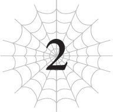
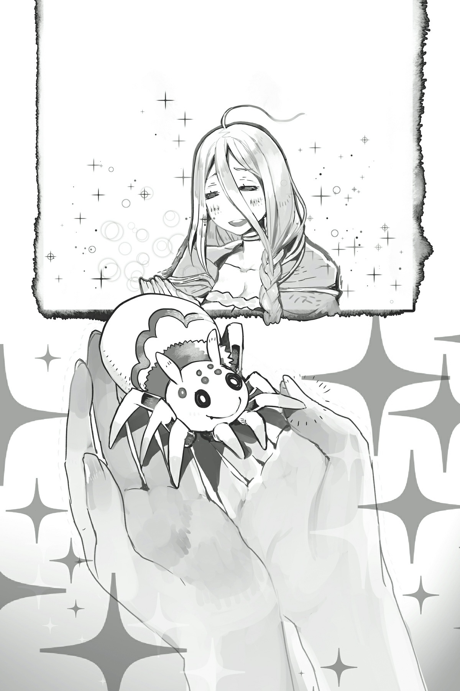

# Hãy chuẩn bị sẵn sàng
*(Let’s Make Preparations)*

Thời gian thấm thoắt thoi đưa. Mới đó mà đã khoảng một năm kể từ khi chúng tôi bắt đầu sống trong dinh thự của vị công tước.

Những ngày tháng của chúng tôi trôi qua khá bình yên, ngoại trừ các cuộc đột kích định kỳ của Tên Ăn Bám.

Sau khi ở lại dinh thự khoảng sáu tháng, cậu Oni đã gia nhập quân đội ma tộc dưới sự trợ giúp của Ma Vương.

Tôi chắc chắn anh ta có lý do riêng để làm vậy, và trông anh ta cũng đã đủ tuổi để tự lập rồi, nên không ai thực sự thắc mắc gì cả.

Về mặt lý thuyết thì anh ta cũng chỉ là một đứa trẻ sơ sinh giống như Vampy, nhưng vì là người tái sinh nên chuyện đó không tính.

Nếu anh ta muốn trở thành một người lớn tự lập, tôi chắc chắn sẽ không ngăn cản.

Có vẻ anh ta cũng đã học được tiếng ma tộc trong suốt sáu tháng ở lại dinh thự.

Thành thật mà nói, tôi ước gì Vampy có thể học hỏi cậu Oni một chút về cách tự lập hơn.

Vampy thế nào rồi á? Ừm, con bé đang làm tôi phát điên đây.

Cảm xúc của con bé bất ổn hơn bao giờ hết, có lẽ là do tác động từ kỹ năng [Đố Kỵ] (Envy).

Vừa mới một phút trước còn bám lấy tôi như con nít, thế mà ngay sau đó đã nổi giận đùng đùng với tôi mà chẳng có lý do rõ ràng nào.

Con bé lúc nào cũng tỏ vẻ bực dọc và sẵn sàng ăn tươi nuốt sống người khác chỉ vì một hành động khiêu khích nhỏ nhất.

À, dĩ nhiên là theo nghĩa bóng thôi nhé.

Tôi biết con bé là ma cà rồng, nhưng con bé không thực sự cắn người đâu.

Ngay cả Vampy cũng có đủ lý trí để không làm vậy... tôi hy vọng thế.

Điều đáng sợ là, với cái cách con bé hành xử gần đây, tôi sẽ chẳng ngạc nhiên nếu con bé khơi mào một cuộc tắm máu thực sự.

Ma Vương đã giao nhiệm vụ cho con bé phải lấy được kỹ năng [Kháng Ngoại đạo], nhưng cho đến nay nó có vẻ vẫn chưa mang lại hiệu quả gì.

Hầu như những người duy nhất có thể ngăn chặn những trận lôi đình của con bé là Mera và tôi, nhưng Mera hiện tại không có ở đây, nên việc trông chừng con bé đã trở thành công việc của tôi.

Phiền phức thật sự.

Đến mức này, cứ mỗi lần các hầu gia chạy xộc vào phòng tôi, tôi chỉ biết nghĩ: *Tuyệt vời, lại bắt đầu rồi đây.*

May mắn thay, con bé vẫn chưa gây ra bất kỳ sự cố nghiêm trọng nào, nên tạm thời chuyện này giống như việc dỗ dành một đứa trẻ dễ thương đang ăn vạ vậy.

Mặc dù sự hiện diện thuần túy của con bé đã suýt làm các hầu gái ngất xỉu vài lần.

Cố lên nhé, các hầu gái!

Dù sao thì, ngoại trừ những thay đổi nhỏ và khó khăn như vậy, thời gian tôi ở dinh thự nhìn chung là khá yên bình.

Nếu bạn thắc mắc tôi đã làm gì suốt thời gian qua, thì tôi đang tập trung vào việc tạo ra phân thân.

Tôi muốn tạo ra một bản sao của chính mình dựa trên kỹ năng [Đẻ Trứng] cũ.

Ồ, nhưng dĩ nhiên, tôi không có ý nói là tôi đang thực sự cố gắng đẻ trứng hay sinh con đâu nhé, được chứ?

Tôi sẽ không làm bất cứ điều gì điên rồ và gắn mác 18+ như thế đâu.

Chủ yếu là tôi chỉ nhả tơ, vê nó thành một quả bóng, rồi cố gắng tạo ra một phân thân bên trong.

Hửm? Gì cơ?

Bạn bảo cái đó nhìn chẳng giống quả trứng chút nào á?

Kệ đi chứ. Chi tiết không quan trọng, miễn là tôi có kết quả là được.

Hả? Tôi có đạt được kết quả không á?

Hắc hắc hắc.

Được rồi, tôi sẽ cho các bạn thấy thành quả nỗ lực của tôi suốt một năm qua!

Hãy nhìn kỹ phân thân của riêng tôi đây!

Tadaaa! Nhìn sinh vật đáng yêu này xem!

Đó là một con nhện trắng nhỏ bé, đang nằm gọn trong lòng bàn tay tôi.

Đúng vậy, sinh vật nhỏ nhắn xinh xắn này chính là một bản sao của tôi đấy!

...Dễ thương đúng không? Trông nó đáng yêu cực kỳ luôn ấy chứ?

Hả? Bạn muốn tôi ngưng nói về độ dễ thương của nó đi và cho biết nó mạnh thế nào á?

...Thì nó dễ thương mà!

Siêu dễ thương luôn, được chưa?

Thôi nào, cứ tận hưởng sự dễ thương của nó đi chứ.

...Được rồi, được rồi. Tôi thừa nhận.

Hiện tại, ngoài sự dễ thương ra thì nó chẳng được tích sự gì cả.

Đây là phân thân hay chỉ là một phiên bản mini của tôi? Tôi không biết nó có thực sự xứng đáng được gọi là một phân thân đúng nghĩa hay không nữa.

Bây giờ, vì về mặt lý thuyết nó là một bản sao của tôi, nó có thể chia sẻ giác quan với tôi.

Bất cứ thứ gì phiên bản mini này nhìn thấy hay nghe thấy đều được truyền lại cho tôi.

Nhưng đó thực sự là tất cả những gì nó làm được. Nó không có bất kỳ tính năng đặc biệt ẩn giấu nào khác cả.

Chắc chắn rồi, nó có thể cắn và nhả tơ, nhưng không có thứ nào trong số đó thực sự ấn tượng cả.

Khả năng nhả tơ của nó còn lâu mới tinh vi được như tôi—về cơ bản chỉ ngang tầm với một con nhện bình thường mà bạn có thể tìm thấy trên Trái Đất.

Vết cắn của nó cũng vậy. Thậm chí còn không có độc, nên thành thật mà nói, cùng lắm nó chỉ làm người ta kêu "ui da" một tiếng thôi. Chắc chắn là không đủ mạnh để giết bất cứ ai.

Tôi thực sự nghĩ rằng bất kỳ ai cũng có thể dẫm chết con nhện này chỉ bằng một phát chân.

...Mọi người nghĩ sao? Đây là những gì tôi có thể trưng ra sau một năm làm việc cật lực đấy!

Phải rồi, phải rồi, cứ việc cười đi!

Hừm. Nhưng mà để đi được đến bước này cũng tốn bao nhiêu công sức của tôi đấy, biết không?

Tạo ra một phân thân từ con số không đâu có dễ dàng gì!

Nếu suy nghĩ một cách khách quan, việc tạo ra một sinh vật sống từ một quả bóng tơ đã là điều vô cùng hoang đường rồi đúng không?

Nói theo cách đó thì nghe có vẻ khá ngầu đấy chứ.

...Ngay cả khi tạo vật của tôi chẳng qua chỉ là một phiên bản mini dễ thương nhưng vô dụng!

Nhưng nhìn xem, nó có khả năng suy nghĩ độc lập theo kiểu [Phân thân Tư duy], nên chắc chắn là nó có tiềm năng.

Tôi chỉ cần hy vọng rằng cuối cùng nó sẽ trở nên hữu ích trong tương lai.

Nên hiện tại, tôi chỉ việc quăng nhóc phân thân nhỏ bé của mình vào một chiều không gian khác để cất giữ an toàn trước khi có ai đó dẫm bẹp sinh vật nhỏ bé không có khả năng tự vệ này.

Đúng vậy. Tôi đã sử dụng ma pháp kiến tạo không gian để lưu trữ đồ đạc trong một chiều không gian phụ riêng biệt với thế giới thực tại này.

Có ba kỹ thuật chính xuất hiện trong đầu tôi khi nghĩ về kiến tạo không gian: dịch chuyển, hộp chứa đồ (item box), và kho lưu trữ không gian (dimensional storage).

Và đây là cách tôi áp dụng kỹ thuật thứ ba.

Khả năng tạo phân thân của tôi có thể không có gì đáng để khoe khoang, nhưng ít nhất ma pháp kiến tạo không gian của tôi đã tiến bộ rõ rệt.

Nếu điều đó còn chưa rõ ràng qua trò dịch chuyển, thì tôi rõ ràng là có năng khiếu thiên bẩm với kiến tạo không gian.

Aaaa, tôi tài năng đến mức tự thấy đáng sợ luôn ấy!

Ngoại trừ cái trò phân thân ra.

Dù sao thì, tôi ném cái phân thân xoàng xĩnh đó vào một chiều không gian khác.

Nơi đó về cơ bản là một thế giới do chính tôi tạo ra, nơi tôi tự đặt ra luật lệ.

Tôi thậm chí có thể kiểm soát dòng chảy thời gian trong đó, ít nhất là ở một mức độ nào đó.

Nên đúng vậy, nó về cơ bản là một Phòng Tinh thần và Thời gian.

Tập trung vào luyện tập trong đó đi nhé!

Trong chiều không gian phụ, phân thân nhỏ bé của tôi giơ một chiếc chân trước lên chào kiểu quân đội.

Như để bắt chước nó, tất cả các phân thân khác cũng đồng loạt chào theo.

Phải, đúng vậy đấy. Ai bảo tôi chỉ có một phân thân chứ?

Chiều không gian lưu trữ này hiện tại thực chất đang lúc nhúc toàn phân thân là phân thân.

Chúng có thể yếu, nhưng ít nhất chúng ta có lợi thế về số lượng!

...Đó là lời bào chữa của tôi cho việc tạo ra nhiều như vậy. Sự thật là, tôi cứ liên tục thử nghiệm xem mình có thể tạo ra thứ gì đó mạnh hơn không, và thế là trước khi kịp nhận ra, tôi đã có cả một bầy nhóc tì tép riu này rồi.

Nhưng một khi chúng lớn lên, tôi chắc chắn chúng sẽ siêu mạnh.

Nên mọi nỗ lực của tôi không hề uổng phí.

Không hề uổng phí đâu nhé!

Tôi cứ liên tục tự nhủ với bản thân như vậy khi đóng cánh cửa không gian lưu trữ lại.

*    *    *

Dù sao thì, khác với đống phân thân ba chấm đó, tôi đã có những tiến bộ khá tốt ở các lĩnh vực khác.

Trước hết là kiến tạo không gian. Như các bạn có thể đoán được từ việc tôi có thể tạo ra các chiều không gian phụ, tôi đã giỏi hơn rất nhiều ở mảng này.

Tốc độ và độ chính xác của phép dịch chuyển của tôi đều được cải thiện, và tôi đã phát triển một loạt các chiêu trò bẩn thỉu mới để tận dụng tối đa nó.

Thành thật mà nói, một vài chiêu trong số đó bá đạo đến mức có thể coi là overkill (quá đà).

Nên về cơ bản tôi đã chuẩn bị hỏa lực đầy đủ xét về phương thức tấn công.

Mặt khác, khả năng phòng thủ của tôi vẫn còn nhiều điểm cần cải thiện.

Tôi luôn có thể dịch chuyển đi chỗ khác như một phương án cuối cùng, nhưng điều đó sẽ không giúp ích gì nếu tôi bị hạ gục chỉ bằng một đòn (one-hit KO) từ một cuộc tấn công bất ngờ hay gì đó tương tự.

Tôi đã giỏi hơn trong việc sử dụng kiến tạo để cường hóa cơ thể vật lý, nhưng tôi vẫn chưa thể đưa phòng thủ của mình đạt đến mức như trước khi trở thành thần.

Đặc biệt là vì các hiệu ứng sẽ tự động tắt đi khi tôi ngủ hay bất kỳ lúc nào mất ý thức.

Càng nghĩ về điều đó, tôi càng nhận ra các chỉ số do hệ thống cung cấp tuyệt vời đến mức nào, vì nó về cơ bản cung cấp khả năng cường hóa cơ thể vĩnh viễn.

Hiện tại, mục tiêu của tôi là bắt kịp sức mạnh trước đây và tìm cách duy trì nó hoạt động mọi lúc mọi nơi.

Tình hình hiện tại là tôi quá dễ bị tổn thương khi ngủ thiếp đi vào ban đêm.

Tôi phải làm gì đó để đảm bảo không có ai lẻn vào và sát hại tôi trong giấc ngủ.

Không phải tôi thấy trước điều đó sẽ sớm trở thành vấn đề lớn, khi có lũ nhện rối xung quanh bảo vệ tôi.

Nhưng dù vậy, cẩn tắc vô áy náy. Tôi phải thực hiện các biện pháp phòng ngừa bất cứ khi nào có thể.

Tôi sẽ cứ tiếp tục thử nghiệm cho đến khi tìm ra cách.

Vấn đề duy nhất là, tôi không khỏi cảm thấy rằng chỉ nâng cao phòng thủ thôi sẽ là không đủ để giúp ích cho tôi trong tương lai.

Ví dụ, phòng thủ cao chẳng giúp ích được gì nhiều chống lại các phương thức tấn công dịch chuyển lén lút của tôi cả.

Và nếu tôi làm được, chắc chắn cũng phải có những kẻ khác có khả năng tương tự.

Tôi không thể đi rêu rao rằng mình là người duy nhất đặc biệt được.

Nghĩa là tôi phải nghĩ ra cách đối phó với những đòn tấn công bỏ qua phòng thủ.

Các đòn tấn công dịch chuyển của tôi tương đối dễ tránh—bạn chỉ cần triệt tiêu chúng là được.

Lên kế hoạch cho bất cứ điều gì xa hơn thế sẽ rất khó khăn, chủ yếu là vì ngay từ đầu tôi còn chẳng biết ngoài kia có những thứ gì khác.

Nhưng tốt nhất là nên chuẩn bị cho tình huống xấu nhất trong những trường hợp này.

Giờ khi biết hệ thống là một ma pháp kiến tạo mạnh mẽ đến điên rồ, tôi bắt đầu nghĩ rằng mình nên chuẩn bị tinh thần cho những điều không tưởng trong thế giới này.

Đặc biệt là vì D rất có thể làm được hầu như mọi thứ.

Tôi sẽ không ngạc nhiên nếu cô ta có thể giết tôi trước khi tôi kịp nhận ra điều đó.

Đáng sợ thật sự!

Tôi không nghĩ chỉ nâng cao phòng thủ là đủ để bảo vệ tôi khỏi chuyện đó.

Vậy tôi nên làm gì? Ừm, hiện tại, tôi đang cố gắng tìm hiểu xem mình có thể sử dụng lại chiêu thuật hồi sinh từ trứng hay không.

Thuật hồi sinh từ trứng là một chiến thuật mà tôi chuyển ý thức của mình sang một quả trứng mà tôi đã tạo ra bằng kỹ năng [Đẻ Trứng].

Vì tôi có thể sử dụng kỹ thuật tương tự để tạo ra phân thân, tôi đang nghĩ mình cũng có thể đưa bản thể thực sự của mình vào một trong những phân thân đó.

Bằng cách đó, ngay cả khi cơ thể tôi bị tổn thương chí mạng, tôi vẫn có thể sống sót.

Không còn lý do gì để sợ các đòn tấn công bỏ qua phòng thủ một khi trò này được thiết lập xong!

Nhưng tính đến thời điểm hiện tại, những phân thân đó còn lâu mới hoàn hảo.

Nếu tôi phải chuyển mình vào một cơ thể yếu ớt dễ dàng bị dẫm chết bởi bất kỳ người qua đường ngẫu nhiên nào...

...thì đó quả không phải là ý kiến hay nếu tôi muốn sống thọ.

Nên tôi nghĩ mình có thể thực hiện nó khá dễ dàng, nhưng vẫn còn nhiều việc phải làm.

Dù sao thì, đó là tình trạng hiện tại của tôi ở mảng chiến đấu.

Nhưng đúng vậy, tôi cũng đã đạt được nhiều tiến bộ khác nữa.

Quan trọng nhất là Tà Nhãn.

Tôi đã luyện tập cách nhìn xuyên qua vạn vật bằng cách làm mọi thứ với đôi mắt nhắm nghiền suốt một thời gian, nên bây giờ tôi có thể làm điều đó mà không cần suy nghĩ.

Nghĩa là hiện tại tôi đang nhắm mắt theo mặc định.

Giờ thì tôi không lo vô tình chạm mắt với ai đó rồi bị họ trợn mắt nhìn nữa!

Không phải trước đây tôi có thói quen nhìn thẳng vào mắt người khác đâu.

Hửm? Tại sao á?

Ừm, lũ người bình thường (normie) các bạn có thể không hiểu được điều này, nhưng lũ hướng nội thích rú rú trong nhà chúng tôi gặp khó khăn thực sự chỉ để chạm mắt với người khác.

Và việc giữ giao tiếp bằng mắt trong khi nói chuyện với ai đó gần như là điều bất khả thi.

Tôi biết nghe có vẻ khá thảm hại, nhưng giờ đây tất cả những kinh nghiệm né tránh ánh mắt đó thực sự đã giúp ích cho việc giữ mọi người không nhận ra đôi mắt kỳ dị của tôi.

Thêm vào đó, vì bây giờ tôi có thể nhìn xuyên qua các vật thể rắn, tôi sẽ không bao giờ rẽ qua góc đường và đâm sầm vào ai đó nữa.

Không phải tôi thực sự có nguy cơ gặp chuyện đó, vì tôi có bao giờ rời khỏi phòng đâu!

Nhưng dù sao thì, tầm nhìn xuyên thấu vẫn khá là tiện lợi.

Ý tôi là, đó cơ bản là siêu năng lực trong mơ của mọi cậu bé đang tuổi dậy thì mà!
Tôi có thể nhìn lén đồ lót của người khác bất cứ khi nào tôi muốn!

Không phải là tôi muốn làm vậy đâu nhé.

...Hửm? Nghe có vẻ như tôi đang không tận dụng tốt khả năng này lắm á?

Kh-kh-kh-không hề có chuyện đó nhé!

Tôi đang tận dụng nó triệt để đây này, được chưa?!

Ngoài ra, bây giờ tầm nhìn của tôi giống hệt như khi tôi còn kỹ năng [Thiên Lý Nhãn] vậy!

Và tôi cũng có thể tái hiện lại hiệu ứng của Tà Nhãn, nên bây giờ tôi đã có các đòn tấn công Tà Nhãn tầm siêu xa.

Tôi vẫn không thể sử dụng các kỹ thuật liên quan trực tiếp đến hệ thống, như [Nguyền Rủa Tà Nhãn] hay [Phong Ấn Tà Nhãn], nhưng tôi có thể tái hiện lại hiệu ứng của [Ngưng Trệ Tà Nhãn] và [Bóp Méo Tà Nhãn] mà không gặp vấn đề gì.

[Tử Vong Tà Nhãn] á? Cái đó nguy hiểm quá nên tôi chưa thử.

Nhưng dù vậy, nếu tôi dùng [Ngưng Trệ Tà Nhãn] để giữ chân kẻ địch không cho di chuyển và [Bóp Méo Tà Nhãn] để vặn vẹo họ trong không gian, tôi có thể đánh bại hầu hết đối thủ từ rất lâu trước khi họ kịp tiếp cận tôi.

Có thể nói tôi đang vững vàng lấy lại sức mạnh mà tôi từng có trước khi được thần hóa.

Tôi vẫn chưa có cơ hội thử nghiệm những sức mạnh đó trong thực tế, mặc dù tôi không chắc đó là điều tốt hay điều xấu.

Hừm. Nghĩa là thế giới đang hòa bình, đó là một điều tốt đúng không?

Nhưng dù vậy, tôi không biết nữa... Sự "hòa bình" này mang lại cảm giác rất tạm bợ.

Kiểu như đang có một sự bất ổn nghiêm trọng lơ lửng trong không khí vậy.

Toàn bộ lãnh địa ma tộc thực tế đang căng như dây đàn.

Ma Vương gần đây đã tuyển mộ rất nhiều công dân vào quân đội.

Ma tộc có dân số ít hơn loài người rất nhiều, nên họ không có nhiều người để dư dả, vì dân số bằng với năng suất lao động mà.

Với dân số hạn chế, chắc chắn sẽ có rất nhiều nơi lâm vào tình trạng thiếu nhân lực.

Ấy vậy mà, Ma Vương vẫn tiếp tục cướp đi những người từ lực lượng lao động vốn đã ít ỏi của họ để bắt họ chiến đấu trong quân đội của cô ấy. Khỏi cần phải nói, tỷ lệ ủng hộ của cô ấy đã chạm đáy vực.

Nhưng người dân không thể nổi loạn chống lại cô ấy.

Ý tôi là, cô ấy là MA VƯƠNG cơ mà.

Điều đó làm cô ấy trở thành một sự tồn tại cực kỳ to lớn đối với ma tộc. Kiểu như, lớn nhất luôn ấy.

Và ngay cả khi họ cố gắng nổi loạn, tôi nghi ngờ họ có cửa thắng được vị Ma Vương đặc biệt này.

Cho dù họ có đoàn kết thế nào đi nữa, tôi cũng không thể tưởng tượng nổi viễn cảnh họ đánh bại được cô ấy.

Cô ấy đủ mạnh để gây ra một thảm họa thiên nhiên hoàn toàn do vô tình mà lị.

Nhưng hầu hết ma tộc không hoàn toàn hiểu được Ma Vương thực sự mạnh đến nhường nào.

Vì vậy, những cảm xúc tồi tệ đang lan tràn khắp nơi, và chúng đang đạt đến điểm sôi.

Sẽ không còn lâu nữa trước khi một số ma tộc cố gắng đánh bại Ma Vương để đưa người khác lên nắm quyền.

Tôi khá chắc là sẽ sớm có một cuộc đảo chính thôi.

Đặc biệt là khi họ đã tập hợp đủ lực lượng quân sự để bắt đầu một cuộc cách mạng vũ trang.

Làm sao tôi biết được điều đó khi suốt ngày ru rú trong phòng á?

Sao nữa, tất nhiên là bằng hoạt động gián điệp rồi.

Vì khả năng sống sót và sự chuẩn bị chiến đấu của tôi đang tăng lên, dự án tiếp theo của tôi phải là thu thập thông tin tình báo.

Trong chiến tranh, kẻ nào nắm được nhiều thông tin hơn kẻ đó sẽ chiếm thế thượng phong.

Quân số của kẻ thù là bao nhiêu?

Họ đang ở đâu?

Một khi biết được những điều đó, bạn có thể lập kế hoạch tương ứng.

Và nếu bạn hoàn toàn không biết kẻ thù đang làm gì, bạn đã rơi vào thế bất lợi rồi.

Nói cách khác, chỉ cần nhận thức được những điều như vậy đã mang lại cho bạn lợi thế to lớn rồi.

Kiến thức là sức mạnh, người ta vẫn thường nói thế mà.

Vì vậy, tôi đã cật lực làm việc để thu thập thông tin.

Tôi lấy thông tin từ đâu á?

Từ những nhóc phân thân mini của tôi chứ đâu!

Vì chúng là nhện, chúng có thể bò trên tường và trần nhà, và với kích thước bằng lòng bàn tay, chúng có thể dễ dàng lẻn vào đủ loại địa điểm.

Và mọi thứ những nhóc mini này nghe thấy và nhìn thấy đều được truyền lại cho tôi trong thời gian thực.

Còn gì có thể hoàn hảo hơn cho hoạt động gián điệp nữa chứ?! Tôi không nghĩ ra được thứ gì luôn!

Vấn đề duy nhất là chúng quá yếu nên rất dễ bị tiêu diệt nếu có ai đó phát hiện ra.

Bạn biết tôi từng nói chúng sẽ chết nếu bị ai đó dẫm lên chứ?

Ừm, tôi đang nói từ kinh nghiệm thực tế đấy...

Nhưng ngay cả khi chúng bị giết, cá nhân tôi cũng không cảm thấy đau đớn gì cả.

Và hơn thế nữa, không ai nghi ngờ một con nhện nhỏ như vậy lại đi do thám ai đó, nên mọi người không hề trở nên hoang tưởng khi phát hiện ra chúng. Cùng lắm, họ chỉ cho rằng đó là một loại quái vật mới hay gì đó thôi.

Nghĩa là tôi có thể thay thế chúng bao nhiêu lần tùy ý.

Dù vậy thì tránh bị phát hiện vẫn tốt hơn.

Dù sao thì, tôi đã phái đống phân thân mini sản xuất hàng loạt của mình đi khắp nơi.

Và cứ thế, đủ loại thông tin bắt đầu đổ về.

Mọi thứ từ những tin đồn của tầng lớp thường dân cho đến những cuộc trò chuyện bí mật giữa giới chức cấp cao.

Tôi không dám nói mình biết tất cả những gì đang diễn ra trong lãnh địa ma tộc, nhưng tôi đã thu được một lượng thông tin khá đáng kể vào thời điểm này.

Lý tưởng nhất là tôi muốn gửi phân thân vào lãnh thổ của loài người và các ngôi làng của tộc elf nữa, nhưng tôi không thể làm thế.

Tôi nhận ra chuyện đó lúc này quá nguy hiểm.

Lãnh thổ loài người được cai trị bởi Giáo hội, còn tộc elf thì được cai trị bởi Potimas.

Những nhóc mini tội nghiệp của tôi hoàn toàn không đủ trình độ để đối phó với họ.

Hơn nữa, lý do duy nhất tôi có thể sử dụng chúng tự do ở lãnh địa ma tộc là vì sự tồn tại của chúng dưới dạng quái vật nhện sẽ không nhất thiết liên hệ chúng với Ma Vương hay tôi.

Ngay cả khi bị phát hiện, không ai nghi ngờ Ma Vương hay tôi đang làm gián điệp cả.

Nhưng nếu Potimas hoặc Giáo hội phát hiện ra một con nhện nhỏ kỳ lạ, họ sẽ lập tức biết ngay có chuyện gì.

Và thế là họ sẽ tìm cách tiêu diệt chúng tôi.

Và những nhóc mini tội nghiệp sẽ bị nghiền nát không thương tiếc mà còn chẳng thu thập được chút thông tin nào...

Nên để ngăn chặn điều đó xảy ra, tôi sẽ tạm hoãn việc giao nhiệm vụ giám sát cho lũ phân thân ở lãnh thổ loài người và tộc elf cho đến khi chúng ít nhất có đủ kỹ năng để tránh bị nhìn thấy hoặc trốn thoát an toàn nếu bị phát hiện.

Mặc dù tôi đoán mình luôn có thể để chúng bị bắt một cách cố ý và thực tế là tuyên bố rằng chúng tôi đang do thám kẻ thù chỉ để làm họ hoang tưởng chơi.

Nhưng chuyện đó khá rủi ro, và nó đồng nghĩa với việc mất đi một phân thân hoàn toàn khỏe mạnh, nên tôi không thực sự muốn làm thế.

Ngay cả những nhóc mini nhỏ bé này cũng không phải là miễn phí đâu nhé. Tôi phải cung cấp các vật liệu thích hợp để tạo ra cơ thể của chúng, và cũng mất thời gian cùng năng lượng để chúng nở ra.

Tôi lấy nguồn cung cấp cho việc đó ở Mê cung Lớn Elroe, nơi những con nhện trắng cung cấp cho tôi vô số xác quái vật.

Không phải tôi muốn ăn quái vật nữa, nhưng chúng vẫn là nguồn thức ăn dồi dào giàu chất dinh dưỡng!

Nên hãy nhớ ăn một phần thịt quái vật đầy đặn mỗi ngày nhé các bé!

Chỉ cần cẩn thận kẻo trúng độc thôi!

Ăn đi nào, các nhóc phân thân mini, ăn đi.

Nghĩ lại thì, về mặt lý thuyết tụi nó vẫn là một phần của tôi, nên chuyện này có nghĩa là tôi cũng đang ăn quái vật theo một nghĩa nào đó.

Ít nhất vì tụi nó ở dạng nhện, việc ăn quái vật dường như không làm tụi nó thấy kinh tởm.

Nếu tụi nó ở dạng người, tôi phải tưởng tượng ra cảnh tụi nó sẽ đình công vì sự kinh tởm của thức ăn tôi cung cấp mất. Nên thế là may mắn thoát nạn rồi.

Chúng không phải tự dưng mà ở dạng nhện đâu nhé.

Đó chỉ là cách tụi nó ra đời một cách tự nhiên thôi. Nếu cố gắng, tôi chắc chắn mình có thể cho tụi nó cơ thể người thay thế.

Nhưng nếu tôi tạo ra tụi nó mà không nghĩ ngợi gì đặc biệt trong đầu, tụi nó sẽ ra đời dưới dạng nhện.

Điều này có nghĩa là sâu trong thâm tâm mình, tôi vẫn tự nhận mình là một con nhện sao?

Tôi không chắc nữa.

Nhưng chuyện đó không đặc biệt là vấn đề lớn, nên tôi đoán chẳng cần nghĩ ngợi quá sâu xa làm gì.

Dù thế nào đi nữa, điều đó cũng không thay đổi được tôi là ai ở bên trong.

So với việc phát hiện ra mình thực chất chỉ là kẻ thay thế của D, chuyện này chẳng có gì to tát cả, đúng không?

Chưa kể, cơ thể người siêu bất tiện luôn ấy!

Tại sao họ chỉ có hai chân thôi chứ?!

Rõ ràng là tám chân sẽ vững chãi hơn nhiều rồi!

Tôi còn khó giữ thăng bằng trên hai chân nữa là.

Và vì ma pháp kiến tạo cường hóa cơ thể của tôi hiện tại đang không ổn định, việc chạy cũng là một cực hình lớn.

Nó giống như việc gia tốc của tôi có thể đạt ga tối đa, nhưng phanh lại không hoạt động vậy.

Nếu tôi có tám chân, tôi có thể tìm cách gồng mình lại để trụ vững, nhưng hai chân á?
Quên đi nhé.

Thế nên tôi tự hỏi liệu có thể làm gì đó với chuyện này không, và đoán xem, tôi đã tìm ra giải pháp.

Trong lúc tôi đang mải lo lắng về toàn bộ tình huống đó, tôi đột nhiên nhận thấy nửa thân dưới của mình đã biến thành thân nhện.

Về cơ bản tôi đã quay lại dạng Arachne.

Tôi không thực sự biết chính xác nó xảy ra như thế nào, nhưng nếu tôi chỉ cần gồng nửa thân dưới như thế này—HỰỰỰ!—tôi có thể biến thành Arachne theo ý muốn.

Cơ thể của tôi tùy tiện hết chỗ nói...

Tiện thể nói luôn, tôi nghĩ rằng nếu mình có thể biến đổi nửa thân dưới, thì về mặt lý thuyết, tôi sẽ có thể biến đổi toàn bộ cơ thể theo bất cứ cách nào tôi muốn, nhưng có vẻ như tôi chỉ có thể chuyển sang dạng Arachne thôi.

Tôi đoán mình sẽ không có cơ hội hét câu *Đây thậm chí còn chưa phải dạng biến hình cuối cùng của ta đâu* sớm đâu.

Về mặt lý thuyết, việc biến hình Arachne này có lẽ là một loại thuật kiến tạo nào đó, nhưng việc xây dựng rune hay gì đó có vẻ diễn ra trong tiềm thức, giống như khi tôi tạo tơ vậy. Nên tôi không thực sự biết mình đang làm thế nào.

Tôi đoán kiến tạo là một nghệ thuật khá bí ẩn, vì tôi có thể làm những chuyện như thế này mà thậm chí còn không hiểu nó hoạt động ra sao. Nhưng tôi đoán nó cũng chẳng kỳ lạ hơn khái niệm ma pháp và kiến tạo ngay từ đầu.

Dù sao thì, điều đó có nghĩa là tôi có một mức độ năng lực cận chiến nhất định.

Tôi không nghĩ chuyện đó sẽ xảy ra thường xuyên, và thực tế tôi cũng không thực sự muốn nó xảy ra, nhưng có một cơ thể vật lý mà tôi có thể tin cậy để trốn thoát thì cũng không thừa.

Tôi có thể biến thành Arachne trong chớp mắt, nên chỉ cần tôi không bị hạ gục trước khi biết chuyện gì đã xảy ra, tôi sẽ có thể đối phó với hầu hết mọi việc.

Hửm? Tôi đang làm gì với đồ lót á?

Ồ, tất nhiên là tôi không mặc gì rồi.

NÓI DỐI ĐẤY! Các bạn nghĩ tôi là loại ngốc nghếch nào thế hả?!

Tất nhiên là tôi có mặc đồ lót chứ.

Tôi chỉ cất chúng vào một chiều không gian khác khi biến hình thôi.

Tôi không có ý định cống hiến bất kỳ màn fan service gợi cảm nào khi biến hình đâu nhé, cảm ơn nhiều.

Tôi được che đậy kỹ lưỡng y như một bộ anime chiếu buổi sáng Chủ Nhật vậy!

Và nhân tiện, tôi cũng có cách để chống lại tầm nhìn xuyên thấu nữa nhé.

Tôi luôn chuẩn bị sẵn sàng cho bất cứ điều gì các bạn có thể tung ra, đặc biệt là nếu đó là thứ tôi tự làm được!

Hắc hắc hắc.

Nếu các bạn muốn nhìn lén tôi trong một số kịch bản gợi cảm nào đó, các bạn sẽ phải cố gắng nhiều hơn thế đấy!

...Mặc dù tôi hy vọng mình sẽ không đụng phải bất kỳ ai thực sự cố gắng làm một việc như vậy.

Chỉ tiếp những đối thủ nghiêm túc thôi nhé, xin vui lòng.

"Tôi vào đây."

"Sao anh không cút xéo đi nhỉ?"

Như mọi khi, Tên Ăn Bám tự tiện mời mình vào tiệc trà của chúng tôi, và Vampy ngay lập tức mời anh ta đi ra.

Bình thường, họ sẽ lập tức lao vào đấu khẩu xỏ xiên nhau từ đó, nhưng hôm nay tôi thực sự có việc cần nhờ Tên Ăn Bám, nên tôi cần họ dừng chuyện đó lại.

Trước khi Vampy kịp nổ súng, tôi giơ một tay lên để ngăn con bé lại.

Con bé nhìn tôi chằm chằm, kinh ngạc trước phản ứng bất thường của tôi.

Tên Ăn Bám cũng vẻ mặt ngạc nhiên, nhưng rồi anh ta nhanh chóng nhếch mép cười đắc thắng với Vampy.

Cái sự trẻ con đó trông chẳng đẹp đẽ gì đâu nhé, nếu bạn hỏi tôi.

Đáp lại, Vampy... Ôi hỏng rồi. Con bé đang cau có và nghiến răng ken két một cách dữ dội.

Tôi chưa bao giờ thực sự nghe thấy âm thanh cọ xát đó phát ra từ miệng ai đó to đến thế.

Ôi thôi xong. Bây giờ môi con bé cũng chảy máu luôn rồi kìa.

Cái kỹ năng [Đố Kỵ] đó siêu đáng sợ thật sự!

Nào, nào. Bình tĩnh lại đi được không?

Thôi nào—bây giờ em còn làm cho Tên Ăn Bám khiếp vía rồi kìa.

Với đà này, thảm họa xảy ra chỉ là vấn đề thời gian thôi, nên tốt hơn hết tôi nên nhanh chóng giải quyết và tống cổ Tên Ăn Bám ra ngoài.

Thế là không chút dông dài, tôi đưa cho anh ta một bức thư.

Nó được làm từ tơ của tôi và chứa đựng những cảm xúc chân thành nhất của tôi.

Nhưng nó không phải thư tình hay gì tương tự đâu nhé.

Tên Ăn Bám trông có vẻ khá vui mừng, nên tôi thấy hơi có lỗi một chút, nhưng... trên phong bì có ghi rõ chữ "gửi Ma Vương" mà lị.

À, anh ta hẳn đã nhận ra điều đó. Giờ thì anh ta trông thất vọng hẳn.

"Cái quái gì thế này? Cô muốn tôi đưa cái này cho cô ta à?"

Phải, chính xác đấy. Anh thực sự có thể làm được nếu cố gắng mà, Tên Ăn Bám!

Tôi gật đầu xác nhận, và đôi vai anh ta sụp xuống.

Xin lỗi nhé, anh bạn.

Vì đã dùng anh như một chân chạy vặt và vì đã làm anh hy vọng hụt.

Nhưng anh ta cứ làm phiền chúng tôi suốt, nên tôi cảm thấy mình hoàn toàn có quyền làm vậy.

Dù sao thì, đi giao bức thư đó ngay đi nào.

Đi đi, đi đi!

Tôi vẫy vẫy tay ra hiệu cho Tên Ăn Bám khẩn trương lên, và anh ta lủi thủi bước ra khỏi phòng với dáng vẻ ủ rũ đáng thương.

Ừm, chuyện đó chắc sẽ làm Vampy thấy dễ chịu hơn.

"Đừng có đi gieo rắc ảo tưởng cho anh ta như thế chứ."

Hoặc là không, tôi đoán vậy?!

Giọng nói của Vampy trầm xuống đầy nguy hiểm, giống như thứ gì đó trồi lên từ vực sâu của địa ngục.

Không một bé gái sơ sinh nào nên có giọng nói như thế cả.

Nhìn kìa, Sael và Fiel đang ôm chặt lấy nhau và run rẩy vì sợ hãi kìa!

Riel á?

Con bé chỉ đang cười toe toét như một đứa ngốc, như mọi khi thôi!

Nào, nào. Bình tĩnh lại đi được không?

Tôi bằng cách nào đó đã dỗ dành được cô bé ma cà rồng đang hờn dỗi, và buổi tiệc trà của chúng tôi cũng đi đến hồi kết.

Ái chà. Tôi đã thành công giao bức thư cho Ma Vương, nhưng tôi cảm thấy mình lại làm cho tính khí của Vampy trở nên tệ hơn trong quá trình đó mất rồi.

Tôi từng nghĩ việc để con bé tăng kỹ năng [Kháng Ngoại đạo] sẽ có tác dụng về lâu dài, nhưng có lẽ chúng tôi cần phải thực hiện một số biện pháp quyết liệt hơn.

Vampy có xu hướng bám lấy một cách ám ảnh những người con bé quen biết rõ.

Đặc biệt là Mera, ở một mức độ cực đoan.

Chúng tôi đã cùng nhau đi khắp thế giới, nhưng chúng tôi không thực sự gặp gỡ nhiều người khác.

Nói cách khác, Vampy không có nhiều bạn bè.

Nên con bé càng bám lấy—và phụ thuộc vào—vài người thân cận với mình.

Không phải tôi có tư cách nói người khác, nhưng tôi nghĩ Vampy thực sự cần phải gặp gỡ những gương mặt mới.

Ý tôi là, tôi là một người phụ nữ mạnh mẽ, độc lập không cần bạn bè, nhưng Vampy thì chỉ là một đứa trẻ con.

Dù vậy, có lẽ đó cũng không phải việc của tôi.

Dù sao thì Vampy cũng sẽ sớm được gửi đến học viện thôi.

Tôi đoán điều đó nghĩa là tôi không phải là người duy nhất đang lên kế hoạch cho tương lai.

---

[◀ Chương trước: Chương 1: Hãy lập mục tiêu](01_lets_set_a_goal.md) | [Chương tiếp theo: Đoạn phụ: Ma Vương lười biếng ▶](interlude_the_slacker_demon_lord.md)
