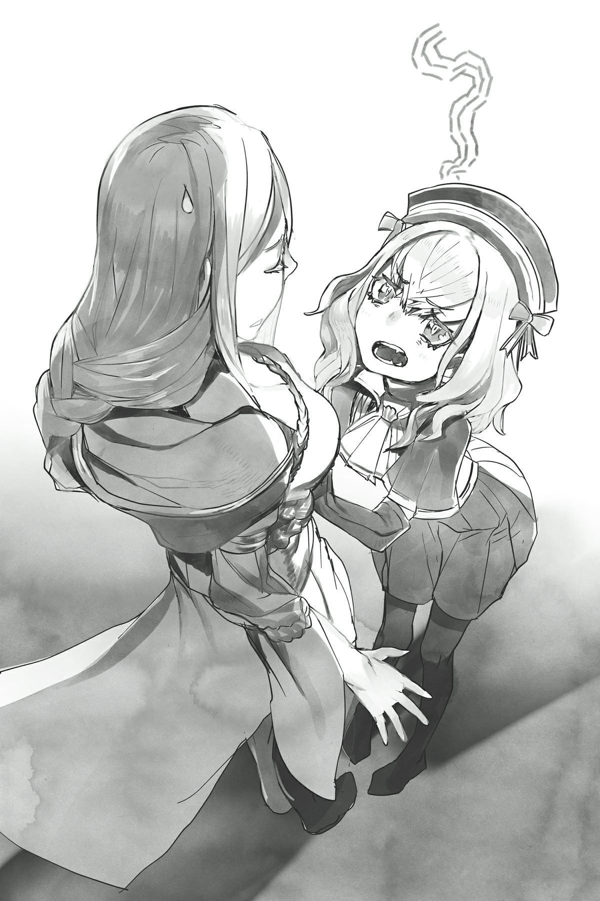

# Hãy hành động
*(Let’s Take Action)*

Đã ba ngày trôi qua kể từ khi tôi gửi thư cho Ma Vương thông qua Tên Ăn Bám để báo cho cô ấy biết về những dấu hiệu của một cuộc nổi loạn đang nhen nhóm.

Một lực lượng đặc nhiệm để giải quyết quân phản loạn đã được thành lập và phái đi.

Khỉ thật, nhanh thật đấy!

Các bạn thực sự đưa ra quyết định chóng vánh như vậy về chuyện này sao?!

Kiểu như, chẳng phải bình thường phải mất nhiều thời gian hơn để chuẩn bị cho một chiến dịch quân sự hay sao?

Tôi đã sử dụng các phân thân của mình để tìm hiểu xem chuyện gì đang xảy ra, và câu trả lời là:

Họ đang khá là gồng mình ép tiến độ.

Có vẻ như Ma Vương đã đùn đẩy toàn bộ tình huống này cho Balto, và anh ta quyết định giải quyết bằng chiến thuật chớp nhoáng (blitzkrieg).

Quân phản loạn đang tốn thời gian tập hợp những kẻ ủng hộ và lương thảo nhằm tránh bị nghi ngờ, nên tôi đoán Balto muốn đè bẹp bọn họ trước khi họ kịp tích lũy đủ những gì cần thiết.

Thêm vào đó, lực lượng đặc nhiệm đang cố gắng hết sức để che giấu việc triển khai quân, tất cả là để có thể đánh úp quân phản loạn một cách bất ngờ.

Balto chắc chắn đang lên kế hoạch cho một trận chiến nhanh gọn, dứt điểm.

Ừm, tôi đoán ở vị trí của anh ta, anh ta cũng không có nhiều lựa chọn.

Hiện tại anh ta đáng lẽ phải đang chuẩn bị binh lực cho cuộc chiến sắp tới chống lại nhân tộc, nên anh ta không thể để mất thêm bất kỳ nhân lực nào.

Càng kéo dài thời gian, quân phản loạn càng có thêm thời gian chiêu mộ lực lượng, nên tốt nhất là anh ta cứ dập tắt nó ngay từ trong trứng nước càng sớm càng tốt để giảm thiểu tổn thất.

Nếu may mắn, điều đó có thể đủ để giải tán tàn dư của quân phản loạn trước khi họ kịp tập trung lực lượng.

Nhưng họ thực sự sẽ ổn khi tấn công vội vã như vậy chứ? Còn vấn đề lương thảo và hậu cần thì sao?

Tôi biết các bạn đang nghĩ gì rồi. Ai mà cần ba cái thứ rác rưởi đó trong một thế giới có chỉ số và kỹ năng chứ, phải không?!

Nhưng chiến tranh ở thế giới này thực chất vẫn tuân theo các nguyên lý cơ bản tương tự như ở Trái Đất, ít nhất là ở một mức độ nào đó.

Ý tôi là, đây vẫn là những con người bằng xương bằng thịt đang chiến đấu mà, đúng không?

Họ phải ăn nếu không sẽ chết đói, và họ phải ngủ nếu không sẽ kiệt sức mà gục ngã.

Chắc chắn rồi, có những thứ như kỹ năng [Vô hiệu Kiệt sức], nhưng chỉ có một số ít cá nhân kiệt xuất mới sở hữu loại năng lực đó.

Nếu bạn mệt mỏi hay đói khát, bạn sẽ không thể chiến đấu tốt được, bất kể chỉ số của bạn có cao đến đâu.

Chưa kể, các chỉ số thực chất không tạo ra sự khác biệt lớn như bạn nghĩ đâu.

Cho dù là nhân tộc hay ma tộc, hầu hết bọn họ đều có chỉ số dưới 1.000.

Thực tế, theo những gì tôi biết, những người có dù chỉ một chỉ số vượt quá 1.000 đã được xem là những chiến binh huyền thoại siêu cấp rồi.

Nó thực sự khiến bạn nhận ra phe Ma Vương điên rồ đến mức nào khi sở hữu vài người có chỉ số dễ dàng vượt quá 10.000.

Thế nên, chỉ số ở mức ba chữ số là tiêu chuẩn chung cho một người lính bình thường, nghĩa là họ không thể làm được điều gì quá hoành tráng.

Đúng vậy, họ có thể mặc một bộ giáp đầy đủ và vẫn chạy với tốc độ tối đa, nhưng đó cơ bản là giới hạn lớn nhất của họ rồi.

Bạn sẽ không thực sự thấy nhiều người có thể đấm nát mặt đất bằng một cú đấm, thiêu rụi xung quanh thành tro bụi bằng một câu thần chú, hay bất kỳ trò nào tương tự như trong mấy câu chuyện giả tưởng buff bẩn bá đạo đâu.

Tôi đoán nếu có quá nhiều người sở hữu những sức mạnh đáng kinh ngạc như vậy, thì các pháo đài và thành trì sẽ mất hết ý nghĩa, nhỉ?

Sự tồn tại của các pháo đài chứng minh rằng chúng đủ khả năng phòng thủ trước hầu hết mọi thứ, nếu không thì chẳng ai rảnh rỗi đi xây dựng chúng làm gì.

Mặc dù tôi đoán cũng có một số pháo đài giống như cái này có hệ thống phòng thủ được tăng cường bằng kỹ năng và các thứ tương tự, nên chúng không thực sự tương đồng với các công trình phòng thủ trên Trái Đất.

Hừm. Để tôi nghĩ xem.

Tôi đoán nếu bạn cân nhắc đến lợi ích của chỉ số, trang bị và thú cưỡi ngoại lai, chiến tranh ở đây có lẽ ngang tầm với Thế chiến thứ nhất hay gì đó tương đương.

Cung tên ở thế giới này khá tương đồng với súng đạn, và bạn có thể coi ma pháp giống như một loại pháo binh.

Mặc dù, như tôi đã nói, có những điểm khác biệt, như sức phòng thủ của các pháo đài chẳng hạn.

Hửm? Nghe có vẻ khá ấn tượng với các bạn sao?

Tôi không biết nữa, từ vị trí của tôi nhìn xuống thì mấy cái đó phế vật vô cùng.

Ý tôi là, hãy nghĩ xem tôi đang đi chung với những ai đi?

Chúng ta có Ma Vương, người có thể tự tay gây ra thảm họa thiên nhiên bằng tay không, và một lũ quái vật khác có thể tàn phá hàng loạt chỉ bằng dư chấn từ các đòn tấn công của họ.

So với những con quái thú đó, việc có thể tạo ra uy lực cấp pháo binh bằng tay không chẳng qua chỉ là muỗi mà thôi.

Nhưng dù sao, để quay lại chủ đề chính, chiến tranh ở thế giới này có những điểm tương đồng nhất định với chiến tranh ở Trái Đất.

Từ góc nhìn đó, rõ ràng là cuộc tấn công này khá là vội vã.

Sẽ là một chuyện nếu họ đã chuẩn bị từ trước, nhưng khi họ triển khai quân đột ngột thế này thì có vẻ hơi điên rồ.

Trong chiến tranh, cũng như trong bất kỳ trận chiến nào, việc chuẩn bị trước là vô cùng quan trọng.

Tập hợp binh lính, mài giũa khả năng của họ, trang bị vũ khí, vân vân.

Và sau đó bạn phải vạch ra chiến thuật để có thể tối đa hóa tiềm năng của họ trên chiến trường.

Chắc chắn rồi, chỉ số và kỹ năng có thể bù đắp cho những thiếu sót ở các mảng đó phần nào, nhưng nếu bạn muốn binh lính của mình thể hiện tốt nhất, bạn phải đảm bảo họ được cung cấp đầy đủ lương thực và được nghỉ ngơi.

Chiến thuật đánh chớp nhoáng mà Balto nghĩ ra sẽ vắt kiệt sức lực của những người lính đó. Liệu họ có ổn không đây?

Ừm, tôi đoán anh ta sẽ không bật đèn xanh trừ khi anh ta tính toán rằng nó sẽ thành công, nhưng dù sao thì...

Hừmmmm.

Có lẽ tôi nên đi kiểm tra lại tình hình xem sao.

Quân phản loạn hiện đang tập hợp tại một thị trấn phía bắc thủ phủ ma tộc.

Binh lính cải trang thành thường dân để tránh bị nghi ngờ, tiến vào thị trấn mỗi lần vài người.

Và họ cũng đang vận chuyển trang bị và nhu yếu phẩm vào một cách chậm rãi và cẩn thận.

Bình thường, việc phát hiện ra hành động của họ sẽ vô cùng khó khăn.

Quân phản loạn có lẽ tính toán rằng vào lúc có ai đó nhận ra, họ đã tập hợp được một đội quân lớn và đã xuất kích trước khi bất kỳ ai kịp phản ứng rồi.

Chà. Tôi quả là ấn tượng với chính mình khi phát hiện ra tất cả những điều đó từ trước.

Nhờ khả năng quan sát tuyệt vời của tôi, bây giờ chúng tôi đã giành được thế chủ động để ra tay trước trong khi quân phản loạn vẫn đang chuẩn bị.

Nên việc chúng tôi muốn tấn công càng sớm càng tốt để tận dụng tối đa lợi thế đó là hoàn toàn hợp lý.

Nghĩ theo cách đó, tôi đoán chiến thuật chớp nhoáng này cũng không tệ lắm.

Vấn đề duy nhất là liệu chúng tôi có thực sự chiến thắng bằng cách đó hay không.

Hệ thống phòng thủ của thị trấn phía bắc không đặc biệt đáng gờm.

Hầu hết các thị trấn của ma tộc, hay thực sự là toàn bộ các thị trấn ở thế giới này, thường được thiết lập để ngăn chặn quái vật chứ không phải con người.

Điều đó hợp lý thôi, vì thông thường quái vật mới là thứ đe dọa con người nhiều nhất.

Bạn phải chuẩn bị cho điều đó nếu không nhà cửa của bạn sẽ bị xóa sổ.

Tất nhiên là có những ngoại lệ, nhưng đa số các thị trấn đều được trang bị hệ thống phòng thủ phù hợp với bất kỳ loài quái vật nào xuất hiện trong khu vực của họ.

Những con quái vật xuất hiện quanh thị trấn của quân phản loạn hầu hết là loại quái vật dạng thú từ nhỏ đến trung bình.

Chúng tương đối yếu và có thể dùng làm thức ăn, nên săn bắn chúng là một trong những nguồn thu nhập chính của thị trấn.

Có chăng thì họ thường đi tấn công nhiều hơn là phòng thủ...

Dù sao thì, nghĩa là hệ thống phòng thủ của họ không đặc biệt mạnh, chỉ ở mức tối thiểu để ngăn quái vật đi lạc vào trong.

Nên không lo họ sẽ cố thủ để chống chọi với một cuộc bao vây hay gì cả.

Nếu họ cố làm trò đó, việc phá vỡ nó bằng một cuộc tấn công trực diện sẽ rất dễ dàng.

Không cần lo lắng về việc họ kéo dài thời gian trong khi quân đội cách mạng tập hợp ở khu vực khác.

Kiến thức về chiến thuật quân sự mà tôi vừa vội vã tiếp thu được nói rằng bao vây một kẻ thù đã chuẩn bị kỹ lưỡng sẽ tốn vô số thời gian, và bên tấn công thường cần nhiều quân hơn bên phòng thủ rất nhiều mới có cơ hội thắng.

Không phải lo lắng về điều đó là một lợi thế lớn.

Nếu đó chỉ là một trận dã chiến, thì các yếu tố quan trọng nhất là quân số và tài năng của chỉ huy.

Năng lực của binh lính á?

Điều đó cũng quan trọng, nhưng vì họ đều là ma tộc nên sẽ không có sự khác biệt quá lớn.

Vì cả hai bên đều cùng một chủng tộc và có lối sống tương đồng, chỉ số của họ tự nhiên cũng sẽ giống nhau thôi.

Tất nhiên, nếu có một khoảng cách lớn về chỉ số, điều đó có thể quyết định trận chiến trước khi nó bắt đầu, nhưng chỉ có một số ít người sở hữu loại chỉ số như vậy.

Và ngay cả những người đó cũng chỉ có chỉ số kịch trần khoảng 1.000.

Có rất nhiều giới hạn cho những gì bạn có thể làm với loại chỉ số đó.

Nghĩa là thông thường bạn sẽ không bao giờ thấy toàn bộ quân đội bị đè bẹp bởi một người duy nhất sở hữu sức mạnh không thể tin nổi hay bất kỳ trò nào tương tự.

Với những hạn chế kiểu này, chiến thắng hoàn toàn phụ thuộc vào quân số của mỗi bên và sự thông minh của các chỉ huy tương ứng.

Trong trường hợp này, chúng tôi đang gửi đi số lượng lính gấp khoảng ba lần đối thủ.

Và chỉ huy của họ là Balto.

Tuy nhiên, có vẻ như Tên Ăn Bám mới là người thực sự dẫn đầu cuộc tấn công.

Tôi không thể nói là chuyện đó không làm tôi hơi lo lắng, nhưng với ưu thế áp đảo về quân số, việc họ thất bại là điều khá khó xảy ra.

Balto cũng sẽ ở đó, nên anh ta sẽ không để mọi chuyện vượt ngoài tầm kiểm soát.

Mối bận tâm duy nhất còn lại của tôi là cuộc hành quân cưỡng bức sẽ vắt kiệt sức binh lính thế nào và họ có thể bảo đảm nguồn cung cấp lương thảo đáng tin cậy hay không.

Họ có lẽ sẽ mang theo thức ăn, nhưng tôi đoán họ sẽ chỉ mang theo lượng tối thiểu để có thể di chuyển nhanh chóng. Nó có lẽ sẽ không đủ.

Và tôi chưa thấy có dấu hiệu nào cho thấy có kế hoạch tiếp tế hay viện binh cả.

Họ thực sự sẽ ổn chứ?

Có thực mới vực được đạo, các bạn biết mà!

Nhưng khi nghĩ lại, tôi đoán chuyện đó có lẽ không phải là vấn đề quá lớn, đặc biệt là khi xem xét nơi họ sắp tấn công.

Ý tôi là, thị trấn phía bắc sống bằng nghề săn bắn quái vật để làm thức ăn mà.

Nói cách khác, thức ăn có ở khắp mọi nơi.

Nếu họ có thể tự cung tự cấp lương thực tại chỗ, thì không cần phải mang theo đống nhu yếu phẩm nặng nề làm gì.

Nghĩ lại thì, tôi đoán đó cũng là trường hợp của rất nhiều sự kiện trong lịch sử Trái Đất. Cướp bóc và chiến tranh thường đi đôi với nhau.

...Nghĩ theo cách đó thì chiến tranh quả là bi thảm.

Hửm? Một kẻ ăn thịt những kẻ thù bị mình tiêu diệt như tôi mà lại nói câu đó nghe đạo đức giả quá á?

Này nhé, đó là hai tình huống hoàn toàn khác nhau đấy nhé.

Dù sao thì, tôi đoán Balto chắc đã có biện pháp đối phó khi nói đến việc giải quyết sự mệt mỏi của binh lính, nên tôi không cần lo lắng về chuyện đó quá nhiều làm gì.

Hửm?

Khoan đã, thế nghĩa là họ thực sự có cơ hội chiến thắng khá cao sao?

Ừm, họ đã có rất nhiều thông tin tình báo trước từ tôi rồi, nên tôi đoán họ phải vô năng đến mức gây sốc mới có thể thua trong tình huống này.

Chưa kể, có ba cá nhân cực kỳ bất thường đã lẻn vào hàng ngũ của Balto.

Ael, Mera và cậu Oni.

Mấy người đang làm cái quái gì thế hả?

Ý tôi là, kể từ khi Vampy phong ấn kỹ năng [Phẫn Nộ] của cậu Oni, sức mạnh của anh ta đã bị giới hạn trong mức anh ta có thể kiểm soát, nên anh ta có lẽ không quá lạc quõng giữa các binh lính ma tộc.

Và tôi đoán Mera cũng an toàn chứ?

Không, không, anh ta chắc chắn là lộ rồi.

Mera đã âm thầm huấn luyện để bắt kịp Vampy, và vì anh ta là ma cà rồng nên anh ta mạnh hơn rất nhiều so với người bình thường của bạn.

Anh ta thậm chí còn có thể cầm cự trước cậu Oni trong trạng thái Phẫn Nộ, nên điều đó cũng đặt anh ta ở đẳng cấp vượt trội so với hầu hết ma tộc.

Và khi bạn ném thêm Ael, một con quái vật thực sự theo đúng nghĩa đen, vào hỗn hợp đó?

Được rồi, phải. Lúc này việc họ thua trận thực sự còn khó hơn ấy.

Tuyệt vời. Không có gì phải lo lắng cả.

...Phải rồi, chắc thế. Có chăng thì tôi lại càng lo lắng hơn trước.

Có thể nói tôi đang hơi "nhặng xị" (hoang mang) một chút.

Mặc dù về mặt kỹ thuật, nhện không phải là côn trùng.

Được rồi, chuyện đó lúc này không quan trọng. Điều duy nhất quan trọng là trực giác nhện của tôi đang mách bảo rằng có điều gì đó không ổn.

Không bao giờ là ý kiến hay khi phớt lờ bản năng của mình.

Lý do tôi suy ngẫm về cơ hội chiến thắng của quân Balto ngay từ đầu là vì tôi có linh cảm xấu về chuyện đó.

Kết luận của tôi là họ về cơ bản đã nắm chắc chiến thắng trong tay... Nhưng vì lý do nào đó, tôi vẫn cảm thấy bất an.

Tôi đã bỏ sót điều gì đó sao?

Không... Ít nhất tôi không nghĩ vậy, nhưng người ta không bao giờ có thể quá chắc chắn.

Tôi đã thu thập thông tin bằng cách phái các phân thân của mình đi làm gián điệp.

Chúng là những nhóc mini bằng lòng bàn tay, nên chúng có thể lẻn vào đủ loại không gian chật hẹp và nghe lén đủ thứ chuyện.

Nếu không có ai xung quanh, chúng thậm chí có thể xem qua tài liệu và các thứ.

Chúng chỉ là không được mạnh cho lắm thôi.

Chúng vẫn yếu đến mức nếu ai đó phát hiện ra, họ có thể dẫm bẹp lũ nhỏ chỉ bằng một phát chân.

Nên ưu tiên hàng đầu là phải ẩn mình trong khi cẩn thận thu thập thông tin.

Việc một phân thân bị dẫm bẹp thực chất không gây tổn thương gì cho tôi cả, nhưng tôi sẽ ghét việc nhìn chúng bị lãng phí sau khi tôi đã cất công tạo ra chúng.

Hơn nữa, tôi đã thu được rất nhiều thông tin tình báo mà không cần phải mạo hiểm nhiều, nên tôi khá hài lòng với điều đó.

Nhưng... chuyện gì sẽ xảy ra nếu có thứ gì đó lọt qua mạng lưới thông tin của tôi?

Nếu quân phản loạn đang che giấu một bí mật lớn kỹ lưỡng đến mức tôi thậm chí còn không nghe ngóng được gì, và nó hóa ra là một siêu vũ khí làm thay đổi cục diện trận đấu thì sao?

Xét một cách logic, nghi ngờ việc quân phản loạn có một lá bài tẩy tiện lợi như vậy là điều dễ hiểu.

Chỉ tính riêng về quân số, binh lính của Balto có 99,9% cơ hội chiến thắng.

Tuy nhiên, tôi không thể phớt lờ linh cảm này được.

Lựa chọn tốt nhất của tôi là theo dõi họ từ trong bóng tối, vì dù sao tôi cũng chẳng có việc gì tốt hơn để làm.

Được rồi, thế thì tôi nên xuất phát thôi.

Ồ, khoan đã.

Tôi phải báo cho Vampy biết là tôi sắp đi trước đã.

Con bé sẽ phát điên lên nếu tôi biến mất mà không nói câu nào.

"Cái gì cơ? Ý cô là sao khi nói cô sắp đi? Đừng có vô lý thế chứ. Rõ ràng là tôi sẽ đi cùng cô."

Tôi hoàn toàn không biết làm thế nào con bé lại đưa ra kết luận này. Có ai vui lòng giải thích cho tôi dưới dạng một bài luận rõ ràng và súc tích được không?

Vampy nhanh chóng nhấc thanh đại kiếm yêu quý của mình lên và đứng cạnh tôi với vẻ đầy mong đợi, như thể việc đi cùng là điều hiển nhiên.

Ừm.

Giờ sao đây?

Thật sự tôi không biết chuyện gì sẽ xảy ra, nên tôi không muốn dắt Vampy theo chút nào, nhưnnggg...

"Nhìn vào thời điểm của chuyến đi nhỏ này, rõ ràng cô đang hướng đến nơi mà cái gọi là quân phản loạn đang tập hợp, đúng không? Merazophis cũng sẽ ở đó, nên chẳng có lý do gì tôi lại không đi cả."

Khoan đã. Vampy đã đi guốc trong bụng tôi rồi sao?!

Từ khi nào con bé lại thông minh đến mức đó thế?!

Hừm, tôi đoán cũng không phải là con bé chưa từng thông minh...

Nhưng dù vậy, tôi không khỏi cảm thấy con bé đoán ra kế hoạch của tôi dựa trên một loại bản năng động vật nào đó, chứ không phải do suy nghĩ logic mà ra. Nhưng các bạn có thể trách tôi khi nghĩ thế được không?

Chưa kể, cái lý do để con bé đòi đi theo vẫn cực kỳ ngớ ngẩn.

Chỉ vì Mera ở đó mà con bé cũng đòi đi theo sao...?

Ừm, hơi bị phiền phức nếu em đi theo vì một lý do ngớ ngẩn như vậy đấy...

"Sao thế? Có lý do gì tôi không thể đi cùng à? Một lý do khiến cô phải đi đuổi theo Merazophis mà không cho tôi đi cùng? Hửm?"

Éc!

Xin lỗi nhé, cô Vampy, cô có biết đồng tử của cô đang giãn ra đến mức nào vào lúc này không?

Đừng có nhìn tôi bằng cái biểu cảm phim kinh dị đó chứ! Cô đang làm tôi khiếp vía rồi đấy!

Được rồi, được rồi! Cô thắng! Tôi sẽ dắt cô theo!

Khi tôi cuống cuồng biểu thị sự đầu hàng bằng đủ loại cử chỉ, Vampy cuối cùng cũng có vẻ hài lòng và tiếp tục dọn đồ.

Phù.

Cái nhóc ma cà rồng chưa tuổi dậy thì, vừa cuồng yêu vừa cuồng sát này.

Thôi nào, kiềm chế lại đi chứ. Nhiều đặc điểm kỳ dị tụ hội trên một người quá rồi đấy.

Chưa kể, giữa Mera và tôi làm gì có chuyện gì xảy ra được.

Nếu con bé phản ứng thế này với tôi, tôi không muốn nghĩ con bé sẽ làm gì nếu có người phụ nữ xa lạ nào đó cố gắng tiếp cận anh ấy.

Theo những gì tôi thấy thì hiện tại không có chuyện gì như vậy cả, nhưng ai biết được tương lai sẽ ra sao chứ?

Ý tôi là, Mera cũng thuộc dạng cực phẩm đấy chứ.

Anh ta mạnh mẽ, tính cách tốt, lại còn dễ nhìn nữa.

Nếu bạn bỏ qua sự thật anh ta là ma cà rồng, thì anh ta cơ bản là người đàn ông hoàn hảo, đúng không?

Ngoại trừ việc anh ta đi kèm với một cục nợ lớn dưới hình dạng một cô nhóc điên khùng sẵn sàng giết bạn nếu bạn dám bén mảng đến gần anh ta!

Mera tội nghiệp. Về mặt lý thuyết anh ta có thể rất được chào đón, nhưng đó có lẽ là điều tồi tệ nhất có thể xảy ra.

Tôi thà không thấy bất kỳ vụ đổ máu nào do tác dụng phụ của kỹ năng [Đố Kỵ] gây ra.

Ái chà. Nhưng tôi đoán mình nên lo lắng cho tình cảnh hiện tại của mình hơn là những chuyện lâu dài như thế vào lúc này.

Nếu tôi dắt theo Vampy, thì tôi cũng sẽ phải mang theo cả lũ nhện rối nữa.

Dù sao thì về mặt lý thuyết, nhiệm vụ của tụi nó là bảo vệ tôi và Vampy mà.

Hừmmm. Ừ thì, trong trường hợp đó, chúng tôi sẽ ổn thôi miễn là không có chuyện gì quá điên rồ xảy ra.

Ý tôi là, lý do chúng tôi đi ngay từ đầu chỉ là vì bản năng không có căn cứ của tôi rằng chuyện xấu có thể xảy ra thôi...

Để chúng tôi có thể có mặt ở đó giúp đỡ nếu điều đó hóa ra là sự thật.

Thực sự thì khả năng không có chuyện gì xảy ra cũng cao như vậy thôi.

Cẩn tắc vô áy náy, nhưng tôi đoán quá thận trọng cũng chẳng ích gì.

Nếu có chuyện gì xảy ra THẬT, thì mạnh ai nấy thoát nhé.

Vampy là người đã nằng nặc đòi đi theo mà.

Tất nhiên, tôi sẽ để mắt tới để cố gắng ngăn chặn những chuyện như thế xảy ra.

Ngoài ra, tôi không muốn dội gáo nước lạnh vào con bé khi con bé đang bận rộn dọn đồ, nhưng chúng tôi thực ra chưa đi ngay đâu nhé, được chứ?

Tôi sở hữu phương thức dịch chuyển bá đạo bất cứ khi nào tôi muốn mà lị.

Chúng tôi vẫn còn vài ngày trước khi binh lính của Balto tiếp cận thị trấn phía bắc đang đóng vai trò là căn cứ của quân phản loạn.

Tôi hoàn toàn có ý định thư giãn cho đến lúc đó, được chứ?

Thế là tua nhanh thời gian: Binh lính của Balto đáng lẽ sẽ đến nơi vào ngày mai. Trong khi đó, chúng tôi đã đến thị trấn phía bắc nhờ sự trợ giúp của phép dịch chuyển.

Tôi quyết định đến sớm một ngày để chúng tôi có thời gian tiến hành một số cuộc điều tra sơ bộ và các thứ.

Vậy tại sao tôi không đến sớm hơn á?

Ừm, các phân thân của tôi đã thực hiện hầu hết các cuộc điều tra hộ tôi rồi, các bạn thấy đấy.

Chúng tôi thực sự chỉ có mặt ở đây đề phòng trường hợp có chuyện gì đó hoàn toàn nằm ngoài dự tính xảy ra.

Đó chỉ là linh cảm hoàn toàn không có căn cứ của tôi mà thôi.

Tôi nghĩ chúng tôi cứ thư thả là được.

Thế là chúng tôi đi lang thang ngắm cảnh trong thị trấn, mà thực chất chủ yếu là đi do thám. Và chà, ở đây nhộn nhịp thật đấy.

Ừm, tôi đoán không thể trách họ được, vì hiện tại đang có một đội quân nhỏ đang tiếp cận thị trấn của họ mà.

Quân phản loạn chắc chắn tính toán rằng họ sẽ là bên tiến hành một cuộc tấn công bất ngờ, nên họ sẽ không bao giờ tưởng tượng nổi mình lại rơi vào thế bị tấn công khi thậm chí còn chưa tập hợp xong lực lượng.

Bây giờ họ đang vắt chân lên cổ cố gắng chuẩn bị cho thị trấn sẵn sàng chiến đấu.

Tôi đoán họ đang lên kế hoạch co cụm lại để chống đỡ một cuộc bao vây.

Chuyện đó hơi ngoài dự kiến của tôi đấy. Làm sao bạn có thể cố thủ trong một nơi có hệ thống phòng thủ yếu ớt như vậy chứ?

À thì, tôi từng nghĩ là chúng yếu cơ.

Nhưng tôi đã quên mất đây cơ bản vẫn là một thế giới giả tưởng.

Họ đã dựng lên một vòng tường thành hoàn chỉnh với tốc độ đáng sợ bằng [Thổ Ma pháp], bao bọc hoàn toàn thị trấn phía bắc.

Không chỉ vậy, tường thành còn được xây dựng kiên cố, ngang ngửa với kiến trúc hiện đại trên Trái Đất.

Đó là một tòa lâu đài đáng kinh ngạc, được xây dựng gần như chỉ qua một đêm. Ngay cả Hideyoshi chắc cũng phải trầm trồ.

Mặc dù nó hoàn toàn dùng để phòng thủ, nên tôi đoán nó không được lộng lẫy như các tòa lâu đài lịch sử của Nhật Bản.

Dù sao thì, họ đã phái những con ngựa nhanh nhất của mình đến các khu vực xung quanh, bảo các quân phản loạn khác tập hợp tại thị trấn phía bắc càng sớm càng tốt (ASAP).

Xem ra sắp có một cuộc huyết chiến rồi.

Nhưng vì đây là một diễn biến bất ngờ, họ đang bắt các thổ pháp sư làm việc đến kiệt sức, nên tôi không hẳn là nói họ đã chuẩn bị đầy đủ.

Trước mắt, binh lính có vẻ sẵn sàng bỏ chạy bất cứ lúc nào.

Người dân trong thị trấn, những người hoàn toàn không được thông báo về chuyện này, lại càng đau khổ hơn.

Họ đâu có liên quan gì đến quân phản loạn chứ, đúng không?

Bất ngờ chưa! Một cuộc nổi loạn đang sử dụng thị trấn của các bạn làm căn cứ hoạt động, và bây giờ quân đội của Ma Vương đang đến để tiêu diệt chúng!

Phải rồi, đúng là một phát hiện gây chấn động.

Bạn không thể trách họ vì đã hoảng loạn về những gì sắp xảy ra với mình.

Nhưng không phải thị trấn này ngẫu nhiên trở thành căn cứ của quân phản loạn. Lãnh chúa của thị trấn thực chất là một thủ lĩnh của phe phản loạn.

Đúng vậy. Sự thật đã được phơi bày: Thủ lĩnh của cuộc nổi loạn chính là lãnh chúa của thị trấn này!

Cái gì cơ?!

Phải rồi, được rồi, chuyện đó thực ra cũng không đáng ngạc nhiên đến thế.

Bạn phải là một nhân vật tầm cỡ quan trọng hoặc là một tên ngốc tuyệt đối mới dám nghiêm túc cân nhắc việc lật đổ Ma Vương: biểu tượng tối cao của ma tộc.

May mắn thay, trong trường hợp này là vế trước.

À thì, là vế sau nếu bạn biết toàn bộ câu chuyện, nhưng đối với những ma tộc không biết sức mạnh thực sự của Ma Vương, đương nhiên họ sẽ bị cám dỗ nổi loạn chống lại các kế hoạch của cô ấy.

Ma tộc vốn đã đang chật vật sinh tồn, thế mà bây giờ Ma Vương lại tuyên chiến với nhân tộc.

Nếu bạn là một lãnh chúa, đương nhiên bạn sẽ không chỉ khoanh tay đứng nhìn rồi bảo: *Được rồi, nghe tốt đấy.*

Dù sao thì một lãnh chúa cũng có trách nhiệm bảo vệ đất đai và người dân của mình mà.

Trong lúc thu thập thông tin quanh lãnh địa ma tộc, tôi phát hiện ra rằng giới ma tộc cấp cao—về cơ bản là quý tộc—nhìn chung không hề tham nhũng chút nào.

Điều đó tất nhiên không áp dụng cho tất cả bọn họ, nhưng so với loài người, có nhiều quý tộc tuân thủ nguyên tắc nghĩa vụ của giới quý tộc (noblesse oblige) và hoàn thành tốt nhiệm vụ của mình đối với những người kém may mắn hơn.

Điều đó liên quan nhiều đến chế độ tôn trọng thực lực của ma tộc.

Thấy đấy, quý tộc ma tộc không được giữ tước vị vĩnh viễn.

Nếu hành vi của họ bị coi là không phù hợp, đất đai của họ sẽ bị tước đoạt trong nháy mắt.

Nên quý tộc ma tộc thực sự phải hành xử cho đúng mực: thực hiện nghĩa vụ của mình, nuôi dạy con cái tử tế, vân vân.

Vế sau là để con cái họ không làm mất đất đai của gia tộc do thiếu sự nuôi dạy tử tế một khi thế hệ hiện tại nghỉ hưu.

Miễn là họ cho con cái mình một nền giáo dục tài năng từ khi còn nhỏ, điều thường nằm trong tầm tay vì tài nguyên của họ, thì việc nuôi dạy một người lớn đứng đắn sẽ đủ dễ dàng thôi.

Và một người lớn đứng đắn thì ít có khả năng làm gia đình bị đuổi khỏi đất đai của mình hơn.

Nên đối với ma tộc, việc truyền lại quyền lực và năng lực cho người thừa kế quan trọng hơn là thừa kế huyết thống.

Nghĩa là hầu hết quý tộc ma tộc đều khá tử tế, vì họ cẩn thận không nuôi dạy lũ ngốc.

Theo logic đó, lãnh chúa của thị trấn phía bắc này chắc chắn cũng là một người khá đứng đắn và có trách nhiệm.

Thực tế là anh ta đã làm việc rất xuất sắc cho đến tận bây giờ.

Quân phản loạn của anh ta đã tập hợp một cách lén lút và lặng lẽ, ít nhất là cho đến khi tôi vạch trần toàn bộ sự việc và mách lẻo với chính quyền.

Ngay khi phát hiện ra chính quyền đang đến, anh ta đã đưa ra quyết định chóng vánh là biến thị trấn phía bắc thành một pháo đài.

Nên anh ta có tầm ảnh hưởng để tập hợp quân phản loạn từ khắp nơi trên lãnh thổ dưới ngọn cờ của mình và có sự linh hoạt để đưa ra những phán quyết nhanh chóng, bình tĩnh khi tình hình thay đổi.

Đúng là một nhân tài xuất sắc.

À, xuất sắc ngoại trừ việc anh ta đủ ngốc để gây chiến với Ma Vương... Không, tôi không nên cười cợt.

Nhưng, ừm... anh ta gần như chắc chắn là tiêu đời rồi.

Ý tôi là, Balto có Ael trong quân đội của mình mà.

Đừng quên, con bé là một con quái vật có chỉ số ở mức hàng chục nghìn.

Tường thành làm bằng [Thổ Ma pháp] á? Đối với Ael, chúng thực chất chỉ như những tờ giấy mỏng mà thôi.

Thành thật mà nói, một mình con bé có thể hủy diệt toàn bộ thị trấn này.

Chiến thuật và chiến lược quân sự đều sụp đổ trước loại sức mạnh đó.

Khi khoảng cách về sức mạnh là không thể vượt qua như vậy, việc chỉ huy của bạn xuất sắc thế nào cũng không thực sự quan trọng.

Tôi chắc chắn Ma Vương chỉ gửi con bé đi cùng để đề phòng cho an toàn thôi, nhưng, kiểu như, chuyện này vượt quá mức cực đoan rồi.

Đặc biệt là khi có không dưới ba cá nhân sở hữu cấp độ sức mạnh áp đảo đó ở cùng một nơi vào cùng một thời điểm!

Và nếu tính cả Vampy và tôi, hãy nhân số đó với vô cực!

Đây chỉ đơn giản là overkill, rồi thêm một lớp overkill nữa chồng lên trên.

Đúng vậy, tôi thậm chí còn chẳng nói năng mạch lạc được nữa rồi, nhưng các bạn hiểu ý tôi mà.

Và cấm các bạn hỏi tôi "Ý gì?" vào lúc này đấy nhé.

Dù sao thì, chúng tôi chỉ cần hy vọng rằng không có chuyện gì xảy ra để biện minh cho việc phái Biệt đội Hủy diệt đến.

Chuyện này sẽ diễn ra thế nào đây? Tôi tự hỏi.

"Bắt đầu rồi."

Chúng tôi đang ngồi trong phòng tại quán trọ, thong thả tổ chức tiệc trà.

Vampy nhấp ngụm trà một cách trang nhã khi đưa ra một nhận xét nghe có vẻ sâu sắc.

Mặc dù không có ý nghĩa đặc biệt nào cả—trận chiến thực sự vừa mới bắt đầu, chỉ có thế thôi.

Làm sao chúng tôi biết được điều đó khi chỉ ngồi trong quán trọ á?

Ừm, Vampy có kỹ năng [Vạn Lý Nhãn], nên việc nhìn thấy những gì đang diễn ra trong khu vực là đủ dễ dàng ngay cả khi chúng tôi ở trong nhà.

Cái cách đôi mắt của Vampy đang nhìn chằm chằm một cách vô thần vào bức tường trống là bằng chứng đủ rõ ràng cho điều đó.

Nếu là ai khác nhìn vào khoảng không và nói những điều kỳ lạ, bạn chắc chắn sẽ nghĩ họ bị điên, nhỉ?

...Được rồi, mọi thứ về Vampy đều điên rồ cả, nên tôi đoán nghĩ thế cũng không lệch đi đâu được.

Dù sao thì, không có chuyện nào trong số này quan trọng vào lúc này.

Tôi sử dụng [Thiên Lý Nhãn] của riêng mình để kiểm tra tình hình bên ngoài thị trấn phía bắc.

Ở đó, binh lính của Balto đã bắt đầu cuộc tấn công vào thị trấn.

Tôi chưa bao giờ thực sự nhìn thấy loại trận chiến quy mô lớn này ở thế giới này trước đây, nên mặc dù chuyện này có hơi thiếu lịch sự, tôi phải thừa nhận mình có chút phấn khích.

Hửm? Ý bạn là tôi vốn đã có kinh nghiệm trên chiến trường rồi á?

Nếu bạn đang nói về chuyện ở Sariella, thì đó không hẳn là một trận chiến mà là một cuộc tàn sát thì đúng hơn.

Chưa kể, đây là lần đầu tiên tôi có cơ hội đứng ngoài quan sát người khác chiến đấu thay vì phải tự mình tham gia, nên nó vẫn tính chứ.

Cứ nghĩ nó giống như việc xem một bộ phim đi, và có lẽ bạn sẽ hiểu tôi cảm thấy thế nào.

Thêm vào đó, tôi đang xem trực tiếp ngoài đời thực chứ không phải trên màn hình, nên nó sẽ còn dữ dội hơn nhiều.

Theo nhiều cuốn sách tôi đã đọc trong lúc giết thời gian ở dinh thự của công tước, chìa khóa của các trận chiến lớn ở thế giới này là một loại phép thuật được gọi là "đại ma pháp".

Thường có ba bước đối với các kỹ năng của bất kỳ loại ma pháp nào.

Ví dụ như với thuộc tính lửa, đó là [Hỏa Ma pháp], [Hỏa Diễm ma pháp], và [Hỏa Ngục ma pháp].

Để đơn giản hóa mọi chuyện, chúng tôi sẽ gọi những loại đó là "thấp", "trung" và "cao".

Mỗi kỹ năng ma pháp này đều có các câu thần chú khác nhau cho từng cấp độ kỹ năng, phải không?

Chúng tôi sẽ gọi các câu thần chú ở cấp độ kỹ năng thấp hơn là "sơ cấp", các câu thần chú trung cấp là "trung cấp", và những câu thần chú bạn học được sau này là "cao cấp".

Theo hệ thống này, câu thần chú Hắc Thương tôi thường xuyên sử dụng trước khi thần hóa sẽ được coi là câu thần chú "trung-cao cấp".

Nên đương nhiên, "đại ma pháp" sẽ ám chỉ các câu thần chú cao-cao cấp... Ha ha, không đâu, tôi đùa đấy. Hóa ra, nó thường có nghĩa là các câu thần chú trung-cao cấp.

Các bạn đang tự hỏi thế thì có gì là "đại" ở đây sao?

Nếu câu trả lời là có, thì đầu óc các bạn đã bị đầu độc bởi sự lạm phát sức mạnh (power creep) rồi đấy!

Thực tế là hầu như chẳng có ai ở thế giới này có thể sử dụng ma pháp cấp cao ngay từ đầu cả.

Ngay cả ma pháp cấp trung cũng khá khó khăn đối với bất kỳ ai ngoại trừ những pháp sư tinh nhuệ nhất, nên khi hầu hết mọi người nghĩ đến ma pháp, họ sẽ nghĩ đến ma pháp cấp thấp.

Khi tôi ném ma pháp cấp cao lung tung như điên trước khi được thần hóa, tôi đã nằm ngoàiii mọi tiêu chuẩn của phần còn lại của thế giới rồi!

Từ góc nhìn của con người, ma pháp cấp trung đã cực kỳ nguy hiểm rồi, và ngay cả ma pháp cấp thấp cũng có thể dễ dàng gây ra vết thương chí mạng nếu bắn trúng đích.

Chuyện đó là bình thường, rõ ràng là vậy.

Nên các câu thần chú trung-cao cấp có sức tàn phá diện rộng về cơ bản là loại ma pháp mạnh nhất mà hầu hết mọi người có thể sử dụng một cách thực tế.

Không chỉ vậy, họ cũng không thể cứ thế niệm những câu thần chú đó bất cứ khi nào họ muốn.

Vì chỉ số ít ỏi của con người thường nằm dưới mức 1.000 rất nhiều, nên rất khó để một người trong số họ có thể tự mình sử dụng một câu thần chú trung-cao cấp.

Đó là lúc kỹ năng [Hợp tác] (Cooperation) phát huy tác dụng.

Nhiều người có cùng kỹ năng ma pháp có thể sử dụng [Hợp tác] để cùng nhau hoàn thành một câu thần chú duy nhất.

Nó cơ bản là một đòn tấn công combo đồng đội! Nghe ngầu đúng không?

Và thế là đại ma pháp tạo ra sẽ đè bẹp lực lượng kẻ thù và gây ra những tổn thất thảm khốc!

Ngoại trừ việc rõ ràng là kẻ thù sẽ không chỉ đứng yên đó và tự nguyện chịu ăn đòn.

Nhờ hiệu ứng của kỹ năng [Trí Tuệ], tốc độ niệm phép của tôi cực kỳ nhanh, nên tôi có thể bắn ra ma pháp trung-cao cấp trong nháy mắt. Nhưng đó chỉ là tôi thôi.

Vì con người phải sử dụng kỹ năng [Hợp tác] và hoạt động theo nhóm để thậm chí có cơ hội niệm loại ma pháp đó, rõ ràng họ cũng không thể làm điều đó nhanh chóng được.

Phải mất thời gian để kiến tạo các câu thần chú, và lượng năng lượng khổng lồ mà nó phát ra thực tế giống như đang hét lên: *HỘI ANH EM ƠI, CHÚNG TA SẮP DÙNG ĐẠI MA PHÁP NÈ!*

Nên khi kẻ thù nhìn thấy dấu hiệu của đại ma pháp, đương nhiên họ sẽ chạy đến để cố gắng ngăn chặn nó.

Vặc việc niệm phép lại cực kỳ nhạy cảm ngay cả trong những thời điểm tốt nhất, nên chỉ một sự gián đoạn nhỏ nhất cũng có thể dễ dàng phá hỏng toàn bộ quá trình.

Tóm lại, đại ma pháp có thể gây ra sát thương lớn cho quân địch, nhưng việc thực hiện nó còn lâu mới dễ dàng.

Trong trận chiến, việc cố gắng đánh trúng kẻ thù bằng đại ma pháp trong khi ngăn chặn chúng sử dụng nó lên phe mình là cực kỳ quan trọng.

Điều này nghĩa là trong một cuộc bao vây, nơi bên phòng thủ được bảo vệ và có thể sử dụng đại ma pháp tùy ý, bên tấn công sẽ rơi vào thế bất lợi đáng kể.

Deadbeat, người đang dẫn đầu binh lính của Balto, sẽ đối phó với tình huống đó thế nào đây?

Chuyện đó rất đáng để xem đấy.

Trời ạ, tôi không thể chờ đợi thêm được nữa.

Nhưng khi tôi đưa mắt nhìn lên chiến trường, tràn đầy mong đợi, nét mặt tôi nhanh chóng trở nên nghiêm nghị khi nhìn thấy tình hình diễn tiến.

Ừm, xin lỗi nhé?

Cái trò chơi một chiều này là sao đây?

Bức tường mà các thổ pháp sư phản loạn đã cật lực xây dựng đang bị thổi bay thành từng mảnh bởi một loạt các vụ nổ.

Đại ma pháp á?

À, không phải đâu.

Đây hoàn toàn là tác phẩm của chỉ một người duy nhất.

Khi tôi quan sát, một thanh kiếm duy nhất bay thẳng vào bức tường.

Ngay sau đó, một cái lỗ khổng lồ xuất hiện ở đó.

Binh lính của Balto lập tức tràn vào.

Tường thành coi như không tồn tại.

Như các bạn có thể đoán được, kẻ chịu trách nhiệm thổi bay tất cả những bức tường này không ai khác ngoài cậu Oni, với sự trợ giúp của kỹ năng cheat tạo ma kiếm bá đạo của mình.

Kỹ năng được nói đến thậm chí có thể tạo ra những thanh kiếm phát nổ.

Về cơ bản là bom đấy.

Đó là lý do tại sao các bức tường phòng thủ cứ KABOOM.

Những thanh kiếm đủ mạnh để phá nổ một cái lỗ trên tường, và tất cả những gì bạn phải làm là ném chúng để gây ra sát thương diện rộng, nên quân phản loạn hầu như không thể chống cự nổi.

Nếu đó là đại ma pháp di chuyển chậm chạp, ít nhất họ còn có thể cố gắng ngăn chặn việc niệm phép, nhưng tất cả những gì cậu Oni phải làm chỉ là ném một thanh kiếm đi.

Tôi nghi ngờ họ có nhiều cung thủ có đủ kỹ năng để bắn hạ những thanh kiếm đó trên bầu trời với tốc độ cao, và ngay cả khi họ có thể làm vậy, thanh tiếp theo sẽ bay đến chỉ trong vòng vài giây.

Những gã đó tiêu đời chắc rồi.

Trời ạ, cậu Oni chiến đấu bẩn thật sự.

Tôi từng nghĩ việc bị Vampy phong ấn kỹ năng [Phẫn Nộ] sẽ làm anh ta yếu đi, nhưng tôi đoán anh ta vẫn có thể sử dụng mọi thứ khác một cách tự do.

Bao gồm cả kỹ năng tạo ma kiếm của mình.

Và mặc dù mất đi kỹ năng [Phẫn Nộ] nghĩa là chỉ số của anh ta thấp hơn, tôi nhớ Vampy từng nói chỉ số tấn công vật lý của anh ta trong trạng thái berserker Phẫn Nộ là trên 20.000.

Và hiệu ứng của Phẫn Nộ nhân chỉ số của bạn lên mười lần.

Nghĩa là ngay cả chỉ số tấn công vật lý cơ bản của anh ta vẫn là trên 2.000?

Điều đó đặt anh ta ở một đẳng cấp hoàn toàn khác biệt so với bất kỳ ma tộc bình thường nào.

Chỉ số ở mức hàng nghìn, cùng kỹ năng tạo kiếm giống như hack, thứ có lẽ là năng lực đặc biệt của người tái sinh.

Anh ta có thể không mạnh mẽ như những người như Ael hay Mera, nhưng anh ta vẫn có thể tả xung hữu đột chém giết mở đường qua quân đội như đi dạo vậy.

Phải rồi, được thôi. Tôi đã thật ngốc khi mong đợi một trận chiến bao vây cân tài cân sức.

Đây chính là vấn đề của lũ hacker...

"Tch. Sao lâu thế? Anh ta vẫn chưa đột phá qua được sao? Anh ta có thực sự nghiêm túc làm việc không thế?"

Có vẻ như Vampy không mấy ấn tượng trước những nỗ lực của cậu Oni.

Oa. Anh ta đang một mình phá tan hàng phòng thủ của họ, thế mà em vẫn chưa thỏa mãn sao?

Hơn nữa, tôi tưởng em ghét cậu Oni cơ mà. Vậy tại sao em lại nổi giận khi anh ta không thể hiện tốt như em mong đợi chứ?

Tôi hoàn toàn không hiểu nổi Vampy chút nào cả.

Đây có phải là một trong những tình huống kiểu đó không? Các bạn biết đấy, kiểu mà bạn nổi giận khi đối thủ làm bạn thất vọng ấy?

Tiếp theo là gì đây? Một trong hai người sẽ bắt đầu thốt ra những câu thoại kiểu như: *Bây giờ mọi chuyện mới bắt đầu thú vị đây!* hay gì đó tương tự sao?

Trời ạ, tôi thực sự không hiểu nổi mấy kẻ cuồng chiến này.

Tại sao họ không thể là những người yêu chuộng hòa bình, giống như tôi chứ?

Hừmmmm.

Dù sao thì, nếu cứ đà này, tôi đoán rốt cuộc mình cũng chẳng cần phải làm gì cả.

Nhìn lướt qua, có vẻ như không có bất kỳ chuyển động đáng ngờ nào trên chiến trường.

Ngoại trừ màn tàn phá của cậu Oni, tất cả những gì tôi thấy là ma pháp bay qua bay lại, quân phản loạn tuyệt vọng cố gắng ngăn chặn binh lính tràn vào tường thành, và các cảnh tượng khác bạn thường thấy trong một cuộc bao vây.

Mặc dù tôi đoán phần "ma pháp" làm cho chuyện này bớt bình thường đi một chút.

Những tên quân phản loạn mặc áo choàng đang ném ma pháp có vẻ tương đối mạnh: Họ thực chất có thể đang chiến thắng trong cuộc đấu súng ma pháp này.

Đó một phần là vì họ có tường thành bảo vệ, nhưng cũng có vẻ như từng binh lính của họ khá mạnh mẽ.

Họ đang áp đảo các pháp sư của Balto về cả tốc độ lẫn hỏa lực.

Chả trách bọn họ lại mặc áo choàng: ký hiệu phổ quát cho câu *Nhìn đi, tôi là một pháp sư đấy!*

Nhưng đó là mặt trận duy nhất mà quân của Balto gặp bất lợi.

Mặt khác, họ đang đột phá qua hàng phòng ngự của kẻ thù nhờ vào những cái lỗ cậu Oni tạo ra trên tường.

Cho dù lũ mặc áo choàng kia có cố gắng thế nào đi nữa, họ cũng không thể xoay chuyển được cục diện.

Trong thực tế, họ chỉ mạnh hơn một chút so với một kẻ hack bẩn bá đạo như cậu Oni mà thôi.

Hừmmmm.

Phải, khá chắc chắn là chúng tôi sẽ thắng trận này.

Có lẽ tôi đã lo lắng hão huyền rồi sao?

Đừng hiểu lầm—không có ai vui mừng hơn tôi nếu chuyện đó hóa ra chỉ là do tôi tưởng tượng ra đâu.

Kiểu như, tại sao tôi lại muốn linh cảm về một thảm họa sắp xảy ra trở thành sự thật chứ? Ha ha ha.

...Nhưng vấn đề là nó thường chính xác, thế mới tài.

Tôi rời mắt khỏi chiến trường trong chốc lát và tập trung vào một điểm đáng chú ý khác.

Tướng lĩnh của quân phản loạn đang trốn trong một căn phòng nào đó trong dinh thự của lãnh chúa, trông như đang nói chuyện một mình.

Hắn ta hẳn đang hoảng loạn lắm, vì hắn ta thực sự đang lảm nhảm liên hồi.

"Nên xin hãy gửi viện binh ngay lập tức. Các người có thể sử dụng cổng dịch chuyển đó, đúng không? Dù chỉ một lượng nhỏ cũng sẽ giúp ích. Cứ đà này, toàn bộ thị trấn sẽ thất thủ mất!"

Tuyệt vời. Tín hiệu đã bị đánh chặn.

Tất nhiên, tôi đang nghe lén thông qua một trong những phân thân mini của mình đang ẩn nấp trong khu vực.

Chỉ có kẻ ngốc mới bỏ qua cơ hội lắng nghe các cuộc liên lạc của tướng địch bằng một trong những nhóc tì tiện lợi này.

Tôi đã cho phân thân của mình bám đuôi hắn suốt nhiều ngàyy liền rồi.

Nhưng vì hắn giữ một vai trò quan trọng như vậy, tôi đoán mình không nên ngạc nhiên khi tên này bằng cách nào đó cảm nhận được mình đang bị theo dõi.

Hắn đã cực kỳ cẩn thận, nên tôi vẫn chưa thể bắt quả tang hắn ngay được.

Dù sao thì ở thế giới này, chuyện các kỹ năng và các thứ giúp việc gián điệp dễ dàng hơn nhiều so với thế giới của chúng ta là điều hiển nhiên.

Những gì tôi đang làm về mặt lý thuyết không phải là một kỹ năng, nhưng tôi vẫn đang do thám hắn bằng một phân thân.

Hắn đã rất cảnh giác cho đến nay, nhưng tôi đoán bây giờ khi đã bị dồn vào đường cùng, hắn không còn rảnh rỗi để lo lắng về những chuyện như vậy nữa.

Dù sao thì, nghe có vẻ như hắn đang yêu cầu viện binh.

Cái thứ "cổng dịch chuyển" này nghe có vẻ quan trọng, nhưng thứ thực sự thu hút sự chú ý của tôi chính là vật nằm trong tay hắn.

Áp sát vào tai hắn là một vật trông giống hệt như những gì chúng ta gọi là điện thoại di động trên Trái Đất.

Một ma cụ á? Ừmmm, tôi không nghĩ vậy.

Đúng vậy, có những "ma cụ" có thể tái hiện lại hiệu ứng của kỹ năng.

Để chế tạo chúng, bạn cần một kỹ năng gọi là [Truyền Chỉ Số], thứ cho phép bạn truyền một kỹ năng vào một vật thể.

Nên về mặt lý thuyết, thứ trông giống điện thoại di động đó có thể là một ma cụ được ban kỹ năng [Viễn Thoại] hoặc gì đó tương tự.

Nhưnnggg...

Chuyện đó có vẻ hơi quá tiện lợi, phải không?

Đúng vậy. Thứ đó không thể là gì khác ngoài một cỗ máy do tộc elf chế tạo.

Nó không được tạo ra bằng kỹ năng, nhưng tôi chắc chắn nó mạnh mẽ ít nhất là ngang ngửa với một ma cụ.

Chỉ có tộc elf mới có thể sản xuất ra thứ như vậy.

Nghĩa là rất có thể, kẻ mà hắn đang dùng chiếc điện thoại đó để trò chuyện cùng là... một tên elf.

Phải rồi. Chúng tôi chính thức gặp rắc rối rồi đấy.

Đã bao giờ có lần nào có sự tham gia của tộc elf, đặc biệt là Potimas, mà kết cục không biến thành một đống hỗn độn chưa?

Chưa từng có luôn, tôi không nghĩ là có đâu!

Tôi nghĩ lúc này đã có thể an tâm khẳng định rằng linh cảm xấu của tôi hoàn toàn chính xác rồi.

Aaa.

Tôi không khỏi thở dài một tiếng thật dài.

Nhúng tay vào thì phiền phức thật, nhưng nếu tôi không làm gì thì kết cục sẽ còn phiền phức hơn nữa.

Đoán chừng tôi nên xốc lại tinh thần và giải quyết chuyện này thôi.

Vào lúc này, dường như không có bất kỳ nhân vật đáng ngờ nào trong thị trấn.

Đó chỉ là dựa trên cái nhìn lướt qua nhanh chóng, nên tôi có thể đã bỏ sót điều gì đó, nhưng chắc chắn là không có nhóm lớn nào đang tính chuyện mờ ám cả.

Và dường như cũng không có bất kỳ kẻ ác tầm cỡ nào trộn lẫn với phe phòng thủ.

Nếu Potimas quyết định thực sự nhúng tay vào cuộc chiến này, ngay cả cậu Oni bá đạo cũng sẽ gặp khó khăn trước những cỗ máy còn bá đạo hơn nhiều đó.

Có vẻ như có thể an tâm giả định rằng người của Potimas vẫn chưa có mặt ở đây.

Nghĩa là công việc tiếp theo tôi cần giải quyết chính là cái cổng dịch chuyển mà tên kia vừa nói tới.

Cổng dịch chuyển là một vòng tròn ma pháp được truyền sức mạnh của Ma pháp Không gian.

Nó là một loại công cụ, không phải máy móc.

Bạn thiết lập các vòng tròn ma pháp liên kết ở hai địa điểm khác nhau, và nó kết nối chúng thông qua phép dịch chuyển.

Bạn chỉ có thể đi đến một địa điểm cụ thể, và bạn cũng không thể di chuyển vị trí đó được.

Phép thuật làm nền tảng cho nó, [Dịch Chuyển Tầm Xa], có thể đưa mục tiêu đến bất kỳ nơi nào mà pháp sư sử dụng đã từng đặt chân đến trước đó, nên so ra thì nó ít hữu ích hơn nhiều.

Nhưng những người sử dụng Ma pháp Không gian thực chất cực kỳ hiếm, nên bạn không thể cứ thế bắt họ làm việc bất cứ khi nào bạn muốn. Trên hết, việc dịch chuyển nhiều mục tiêu cùng lúc có thể khá tốn sức tùy thuộc vào khả năng của pháp sư và lượng MP của họ.

Mặt khác, cổng dịch chuyển có thể được sử dụng bởi bất kỳ ai miễn là nó được cung cấp MP, và nó có thể dịch chuyển cả lượng lớn người cùng lúc.

Chúng có những nhược điểm riêng, nhưng cổng dịch chuyển cực kỳ hữu ích khi liên kết các địa điểm quan trọng.

Tuy nhiên, chuyện này hơi kỳ lạ.

Như tôi đã nói ở trên, có rất ít người có thể sử dụng Ma pháp Không gian.

Và bạn cần kỹ năng [Truyền Chỉ Số] để tạo ra một cổng dịch chuyển.

Kỹ năng đó thực chất cũng khá là hiếm.

Chắc chắn là có nhiều người có thể sử dụng nó hơn là Ma pháp Không gian, nhưng còn những người có thể sử dụng cả hai thì sao? Chuyện đó chắc chắn là siêu siêu hiếm luôn.

Hiếm đến mức nào á? Đủ để những người tồn tại hầu như luôn nằm dưới sự quản lý nghiêm ngặt nhất của chính phủ.

Đúng là những quốc bảo sống mà.

Và ngay cả thế, họ được cho là chỉ chế tạo được một số ít cổng dịch chuyển trong suốt cuộc đời của mình.

Nh tiện, tất cả những thứ này là thông tin tôi đọc được trong sách đấy nhé.

Theo những gì tôi nghe được, hiện tại không có ai ở lãnh địa ma tộc có thể chế tạo cổng dịch chuyển cả.

Thực tế, một ứng cử viên phù hợp chỉ xuất hiện một lần mỗi trăm năm hoặc lâu hơn, nếu có được chừng đó.

Nên cổng dịch chuyển tuy tiện lợi, nhưng chúng không đặc biệt phổ biến.

Nếu chúng tồn tại ở khắp mọi nơi, nó đã gây ra một cuộc cách mạng giao thông rồi.

Nhóm nhỏ của chúng tôi đã phải mất vài năm chỉ để đi từ phía nam của lục địa này đến lãnh địa ma tộc ở phía bắc, các bạn nhớ chứ?

Nếu chúng tôi có một cổng dịch chuyển, chúng tôi đã có thể vượt qua khoảng cách đó ngay lập tức, điều đó đã thay đổi tất cả mọi thứ rồi.

...Hửm? Khoan đã.

Tôi có lẽ chế tạo được cổng dịch chuyển mà, đúng không?

Thuật kiến tạo không gian của tôi có thể tái hiện lại Ma pháp Không gian, và tôi từng sở hữu kỹ năng [Truyền Chỉ Số] trước khi được thần hóa, nên... không có gì hoang đường khi giả định rằng tôi có thể tái tạo lại nó, phải không?

Hừmmm. Tôi thậm chí còn chẳng cần giới hạn nó ở cổng dịch chuyển, đúng không?

Nếu muốn, chẳng phải tôi có thể chế tạo những thứ như túi ma pháp chứa đồ trong chiều không gian khác, các vật phẩm đào thoát kiểu Cánh Chimera giúp dịch chuyển bạn đến một địa điểm cụ thể, và những thứ tương tự sao?

Cái gì cơ?!

Hừm. Được rồi, tạm gác chuyện đó lại đã.

Vấn đề hiện tại là tên lãnh chúa ở đây đang nói điều gì đó về một trong những cổng dịch chuyển siêu hiếm này.

Sự tồn tại của một cổng dịch chuyển đơn lẻ đã là một lợi thế chiến thuật khổng lồ, nên các quốc gia luôn biết chính xác chúng ở đâu và kiểm soát chúng cực kỳ cẩn thận.

Nếu cái này không nằm trong danh sách đăng ký, điều đó nghĩa là nó được chế tạo trái phép sao?

Và dựa trên những gì tên lãnh chúa đang nói, có vẻ như nó kết nối với một nơi nào đó trong lãnh thổ của tộc elf.

Và cái cổng này nằm ngay bên trong thị trấn sao?

Hừmmm.

Nên làm gì đây?

Không chỉ vậy, hắn ta định làm gì chứ?

Không có gì đáng thắc mắc tại sao Potimas lại âm mưu với tên này.

Kích động một cuộc nổi loạn và gây ra dù chỉ một chút thiệt hại cho phe Ma Vương cũng đủ để làm hắn ta vui lòng rồi.

Quân phản loạn sẽ dẫn đầu còn tộc elf chỉ giúp đỡ một chút bên lề.

Hắn ta có lẽ thừa biết bọn họ sẽ thất bại, nhưng tộc elf cũng chẳng chịu tổn thất lớn nào dù thế nào đi nữa.

Biết tính Potimas, hắn ta sẽ tận dụng bất kỳ cơ hội nào có được để quấy rối Ma Vương. Chuyện này nghe chính xác là những gì hắn ta sẽ làm.

Nhưng cuộc tấn công bất ngờ vào quân phản loạn có lẽ đã phá hỏng kế hoạch của hắn ta.

Quân phản loạn sẽ bị đè bẹp mà không gây ra bất kỳ rắc rối nào cho Ma Vương cả.

Potimas sẽ làm gì về chuyện đó?

...Có lẽ hắn ta sẽ không làm gì cả?

Sẽ mất rất nhiều công sức để cứu vãn tình thế hiện tại, ngay cả đối với Potimas.

Và nếu hắn ta làm vậy, Ma Vương sẽ biết hắn ta có liên quan.

Mục tiêu của Potimas có lẽ là âm thầm hoạt động sau hậu trường để tiếp tay cho quân phản loạn, nên việc hành động công khai ở đây sẽ là điều không lý tưởng đối với hắn ta.

Hắn ta là một kẻ cực kỳ hèn nhát, thích chờ đợi cơ hội hoàn hảo để ra tay khi kẻ thù quay lưng đi, các bạn biết mà?

Hắn ta sẽ không muốn giải quyết tình huống này bằng vũ lực đâu.

Nếu hắn ta định chọn con đường đó, hắn ta đã có thể làm từ trước rồi thay vì sử dụng các phương pháp gián tiếp như hỗ trợ nổi loạn.

Đặt mình vào vị trí của tên khốn nạn Potimas đó, bước đi tiếp theo của hắn ta có lẽ sẽ là... rút lui.

Với đà này, tất cả những gì hắn ta nhận được chỉ là mất đi một đống quân tốt.

Hắn ta không ngại hy sinh các quân cờ, nhưng tôi cá là hắn ta thuộc kiểu người ghét lãng phí tài nguyên vô ích. Dù vậy, hắn ta sẽ không chơi một canh bạc mạo hiểm khi không thu lại được gì.

Hắn ta có nhiều khả năng sẽ bỏ rơi con tàu đắm và cố gắng che giấu sự thật rằng tộc elf từng có liên quan.

Nghĩa là bước đi tiếp theo của hắn ta có lẽ là phá hủy cổng dịch chuyển.

Chúng hiếm và có giá trị, nhưng chỉ khi cả hai đầu đều nằm trong tay đồng minh.

Nếu một cổng dịch chuyển bị kẻ thù chiếm được, họ có thể dễ dàng sử dụng nó để xâm nhập vào bất cứ thứ gì ở đầu bên kia.

Tôi nghi ngờ cổng dịch chuyển ở thị trấn này dẫn thẳng đến căn cứ chính của tộc elf, nhưng nó chắc chắn phải dẫn đến đâu đó.

Nếu hắn ta muốn tránh nguy cơ nơi đó bị tấn công, lựa chọn duy nhất của hắn ta là phá hủy cổng dịch chuyển, dù có lãng phí hay không.

Có vẻ như họ sẽ tự động rút lui mà không cần tôi phải động tay động chân gì cả.

Có điều duy nhất là Potimas sẽ phải phá hủy cổng dịch chuyển đó.

Hắn ta có lẽ không muốn làm vậy, nên có một mối nguy hiểm nhỏ là hắn ta sẽ thực hiện một nỗ lực cuối cùng trên đường rút lui.

Nếu hắn ta làm thế, tôi đoán mục tiêu của hắn ta sẽ là cậu Oni, người đang cực kỳ nổi bật vào lúc này.

Được rồi. Tôi nghĩ mình đã nắm được ý đồ của Potimas rồi.

Nghĩa là ưu tiên hàng đầu của tôi nên là bảo vệ cậu Oni.

Anh ta chắc chắn mạnh mẽ so với ma tộc, nhưng Potimas vẫn có thể ám sát anh ta.

Tôi phải yểm trợ cho anh ta, nếu không anh ta có thể bị giết mất.

Trong kịch bản tồi tệ nhất, Mera hoặc Ael cũng có thể bị thương.

Tôi nghi ngờ Ael sẽ bị giết, nhưng đó là Potimas, nên cẩn thận vẫn hơn.

Balto và Tên Ăn Bám... Ờ thì, tôi có thể chấp nhận mất họ nếu thực sự bắt buộc.

Mặc dù tôi thà không muốn thế, vì họ là những ma tộc quan trọng và tất cả những thứ đó.

...Hừmmm, nhưng chuyện này thế thì chẳng có gì thú vị cả, đúng không?

Potimas đã gây ra cho chúng tôi vô số phiền toái suốt nhiều năm qua. Chẳng phải sẽ rất tuyệt nếu được giáng cho hắn ta một đòn đau đớn một lần sao?

Tôi chắc chắn bản thể thực sự của hắn ta vẫn đang trốn trong một boongke nào đó, nên không phải tôi có thể gây ra nhiều thiệt hại nghiêm trọng gì cho hắn ta, nhưng dù sao thì.

Tôi cá là hắn ta sẽ tức điên lên nếu việc cố gắng gây rối với Ma Vương phản tác dụng một cách trầm trọng.

Phải rồi. Thêm vào đó, lúc nào cũng ở thế phòng thủ thì không tốt chút nào.

Chúng tôi phải thỉnh thoảng khiến hắn ta phải cảnh giác lo sợ chứ.

Thế thì cái cổng dịch chuyển đó ở đâu nhỉ? Ồ, tìm thấy rồi.

Kết hợp [Thiên Lý Nhãn] với tầm nhìn xuyên thấu, tôi phát hiện ra cổng dịch chuyển ở tầng hầm của dinh thự lãnh chúa.

Nó nằm trong một căn phòng bí mật, đó là lý do tại sao các phân thân của tôi không tìm thấy nó.

Có vẻ như nó vẫn chưa bị phá hủy.

Mặc dù tôi đoán có khả năng cái ở đầu bên kia đã bị phá hủy, trong trường hợp đó tôi sẽ chẳng thể làm được gì.

Nhưng dù sao thì vẫn đáng để thử...

Uống nốt chỗ trà còn lại, tôi đứng dậy.

"Cô định ra tay sao?"

Tôi gật đầu trước câu hỏi của Vampy, rồi nhận ra mình hoàn toàn không biết phải làm gì với con bé.

Sẽ thực sự nguy hiểm nếu để con bé đi cùng, vì tôi sắp tiến vào lãnh thổ kẻ thù mà.

Nghĩa là lý tưởng nhất là tôi nên để con bé ở lại đây, nơi con bé có thể trông chừng cậu Oni và đồng bọn.

Vấn đề duy nhất là làm thế nào để truyền đạt yêu cầu đó cho con bé!

Tôi ngập ngừng một phút, rồi sử dụng [Ảo ảnh] để tạo ra hình ảnh của cậu Oni xuất hiện trên bàn.

Hắc hắc hắc. Đúng vậy, tôi đã học được vài chiêu trò mới khá ngầu đấy.

[Ảo ảnh] ban đầu là [Ngoại đạo Ma pháp], nhưng câu thần chú đó tác động trực tiếp vào não của mục tiêu, ép họ nhìn thấy thứ không có thực. Mặt khác, chiêu này tạo ra một hình ảnh thực sự giữa không trung, nên nguyên lý cơ bản hoàn toàn khác biệt.

Ban đầu, tôi đã cố gắng tái hiện lại phương pháp của [Ngoại đạo Ma pháp], nhưng nó khó khăn vãi cả chưởng, nên tôi đã chuyển sang chiêu này.

[Ngoại đạo Ma pháp] điên rồ thật sự đấy, các bạn ạ.

Vampy và lũ nhện rối chăm chú nhìn nhóc Quỷ mini trên bàn.

Ha ha ha. Khá là tuyệt vời đúng không?

Được rồi, khoe khoang thế là đủ rồi. Tôi thêm một Potimas mini vào hình ảnh, đang tấn công cậu Oni.

Sau đó, tôi thêm Vampy và đồng bọn lao vào đập Potimas tơi tả.

Và thế là Potimas bị nghiền nát thành bã và chết ngoẻo. Hết chuyện.

"Hừmmm, được rồi. Vậy ý cô là gì? Potimas đang ở đây, và hắn ta đang nhắm vào tên nhóc đó? Và cô muốn chúng tôi ngăn chặn chuyện đó?"

Em tiếp thu nhanh đấy!

Tôi gật đầu lần nữa.

"Thế còn cô định làm gì trong lúc đó?"

Hự. Cái đó khó giải thích quá.

Nó là, ừm, bạn biết đấy.

Một quý cô thì phải có bí mật của riêng mình chứ.

Tôi đặt ngón tay lên môi để né tránh câu hỏi.

"Ý gì đây? Cô lại định giấu giếm tôi nữa à?"

Tôi đoán thế là chưa đủ thuyết phục đối với Vampy.

Ôi hỏng rồi. Con bé lại chuẩn bị nổi giận rồi kìa.

Thôi nào, thật sao? Là do tôi tưởng tượng hay dạo này em trở nên nóng tính quá mức thế hả?

Và thêm nữa, tôi đã giấu em chuyện gì bao giờ chưa?

Chưa kể, em thực sự kỳ vọng TÔI trong số tất cả mọi người sẽ đưa ra một lời giải thích dài dòng vào lúc này sao?

Chúng ta chưa rơi vào thế bí, nhưng cũng không phải là có dư dả thời gian để lề mề đâu nhé.

Nếu em cứ đưa ra những đòi hỏi trẻ con vào lúc này, thì tôi mới là người chuẩn bị nổi điên lên đây này.

"““...!””"

"Hả? Cái quái gì thế—?! Các người đang làm gì vậy?! Này!"

Chắc chắn cảm nhận được cơn giận của tôi, ba con nhện rối lập tức chộp lấy Vampy và nhanh chóng tản ra.

Con bé đang giãy giụa dữ dội, nhưng tụi nó đã khống chế con bé một cách điêu luyện và bỏ chạy như những kẻ bắt cóc chuyên nghiệp có thâm niên.

Tụi nó trông có vẻ là những cô bé nhỏ nhắn, nhưng bên trong lại là nhện mà lị.

Bị trói chặt và bịt miệng bằng tơ nhện, Vampy không có cơ hội trốn thoát.

Tôi vẫy tay chào con bé khi tụi nó rút lui ra xa.

Con bé đang lườm tôi đầy giận dữ khi bị khiêng đi, nhưng ngay từ đầu con bé đã là người tự ý quyết định đi theo tôi mà.

Cứ trút hết đống xả stress đó lên đầu quân phản loạn và tộc elf đi nhé, làm ơn.

Sau khi tiễn Biệt đội Bé gái đi, tôi dọn sạch chỗ trà và bánh ngọt còn lại trên bàn.

Nếu tôi gửi chúng đến chiều không gian phụ nơi lưu trữ các phân thân của mình, tụi nó sẽ vui vẻ ăn sạch hộ tôi.

Nhìn xem, lãng phí thức ăn là không tốt đâu nhé.

Được rồi, thế là giải quyết xong mọi chuyện ở đây.

Miễn là không có chuyện gì điên rồ xảy ra, bốn chị em nhện rối hợp lực lại đáng lẽ phải đối phó được với hầu hết mọi thứ quanh đây.

Chưa kể họ còn có cả Vampy nữa.

Đã đến lúc tôi được bung xõa và thể hiện bản lĩnh của mình rồi.

Tôi tự dịch chuyển mình đến căn phòng bí mật chứa cổng dịch chuyển.

Tôi chưa bao giờ sử dụng cổng dịch chuyển trước đây, nhưng tôi đã xác nhận rằng mình vẫn có thể sử dụng ma cụ sau khi thần hóa.

Tôi chỉ cần biến MP thành năng lượng và truyền nó vào nguồn năng lượng.

Thực tế, bản thân MP cơ bản là một loại năng lượng.

Chúng chỉ là cùng một thứ với những tên gọi khác nhau, nên việc tôi vận hành một ma cụ là đủ dễ dàng.

Nghĩa là nếu tôi chỉ cần truyền năng lượng vào cái cổng dịch chuyển này, nó sẽ đưa tôi đến cái cổng kết nối với nó, miễn là cái cổng kia chưa bị phá hủy.

Tôi chạm vào cổng dịch chuyển và truyền một ít năng lượng vào đó.

Khi cảm nhận được nó phản hồi tương ứng, tôi tự dưng muốn nhếch mép cười như một kẻ phản diện.

Nhưng tôi sẽ không làm thế đâu.

Tôi cung cấp năng lượng cho cổng dịch chuyển và kích hoạt nó.

Tôi đã quen với việc dịch chuyển rồi.

Nhưng khác với khi tôi tự mình làm, lần này cảm giác hơi kỳ lạ.

Có lẽ nó giống như việc bạn không bị say xe khi tự mình lái, nhưng có thể bị say khi người khác cầm lái vậy.

Nghĩ lại thì, việc được dịch chuyển bởi thứ khác giống như việc bị ném cưỡng bức vào một không gian khác, nên tôi đoán việc nó mang lại cảm giác hơi kỳ lạ cũng là điều dễ hiểu.

Tôi chưa bao giờ nhận ra điều đó, vì tôi luôn tự dịch chuyển xung quanh mà không gặp vấn đề gì.

Nếu tôi làm chuyện đó nhiều lần liên tiếp, liệu tôi có bắt đầu cảm thấy buồn nôn không nhỉ?

Ừm, tôi đoán mình có thể gây ra điều đó chỉ bằng cách xáo trộn không gian một chút.

Dù sao thì, trong lúc đang nghĩ về những chuyện đó, tôi đã đến đích.

"Tôi sẽ qua đó ngay bây giờ, nhưng đừng có trông chờ quá nhiều vào viện... binh..."

Ngay khi tầm nhìn trước mắt thay đổi, tôi lập tức chạm mắt với một người đàn ông từ phía đối diện căn phòng.

Nghe có vẻ giống như khởi đầu của một câu chuyện tình yêu, nhưng không, chúng tôi là kẻ thù truyền kiếp của nhau.

Trước mắt tôi là Potimas, đang đứng hình vì kinh ngạc với một vật trông giống điện thoại áp sát vào tai.

Khi một chuyện hoàn toàn bất ngờ xảy ra, suy nghĩ của con người sẽ tạm thời ngưng trệ trong một khoảnh khắc.

Tôi đoán Potimas cũng không ngoại lệ.

Biết thế là tốt rồi.

"……"

"……"

Ăn một đấm này đi! ĐẤM TRƯỚC TÍNH SAU!

"Hự?!"

---

[◀ Chương trước: Đoạn phụ: Ma Vương lười biếng](interlude_the_slacker_demon_lord.md) | [Chương tiếp theo: Chương O: Tôi sẽ làm những gì có thể ▶](o_ill_do_what_i_can.md)
