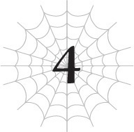

# Hãy gieo rắc đau thương
*(Let’s Bring the Pain)*

Này, lại là tôi đây. Người vừa đột ngột xuất hiện từ hư không và đấm thẳng vào mặt Potimas ấy.

Hèn nhát á?

Tôi sẽ coi đó là một lời khen nhé, cảm ơn!

Chơi bẩn thì sao chứ. Làm tốt lắm, tôi ơi.

"Ngài Potimas?!"

Úi chà, có vẻ tôi không có thời gian đứng đây để tự mãn về bản thân rồi.

Có một bầy kẻ mặc áo choàng có mũ trông khá mờ ám đang tụ tập quanh chỗ Potimas vừa đo đất.

Vài tên trong số chúng có vẻ đang hoảng loạn.

Tôi cũng sẽ thế thôi, nếu sếp của mình đột ngột bị ăn đấm vào mặt.

Mà, điều kỳ lạ là những tên mặc áo choàng còn lại không hề nhúc nhích lấy một phân.

Trông chúng có vẻ... tôi không biết nữa, không giống người cho lắm... hay nói đúng hơn là không giống như đang sống.

Nhưng chúng cũng không hoàn toàn là vật vô tri vô giác, điều này rất quan trọng.

Thực tế, tôi đã đoán được phần nào những thứ này là gì rồi. Chúng chắc chắn không phải tộc elf bình thường.

Rất có thể, bọn chúng là những người đã bị biến thành vũ khí cyborg sinh học, giống như tên Potimas ở đây vậy.

Nhìn thấy cả một bầy như thế này ở cùng một chỗ quả thực hơi rợn tóc gáy.

Ơ kìa, xin lỗi nhé, ngài Potimas?

Cảnh tượng này có nghĩa là ông thực sự nghiêm túc muốn nghiền nát chúng tôi lần này sao?

Nếu hắn ta đã tập hợp được ngần này hỏa lực trước cả khi quân phản loạn tập hợp xong, nghĩa là đáng lẽ đã có thêm nhiều vũ khí điên rồ hơn ở thị trấn phía bắc kia nếu họ hoàn thành xong công tác chuẩn bị.

Eo ôi. Nguy hiểm thật đấy.

Dựa trên những gì Potimas nói lúc trước, tôi đoán hắn ta không có ý định gửi đống vũ khí này qua để giúp quân phản loạn.

Đây chỉ là suy đoán thôi, nhưng có lẽ hắn ta định đi thu hồi đống viện binh đã gửi đến thị trấn phía bắc vì phát hiện ra chúng tôi đột ngột hành động.

Nghĩ lại thì, đúng là có một nhóm mặc áo choàng ở hàng ngũ công sự đang kháng cự dữ dội hơn hẳn các quân phản loạn còn lại.

Tôi đoán bọn đó chính là tộc elf.

Nếu có vài cyborg trộn lẫn trong số bọn họ, giống như nhóm ở đây, tôi có thể hiểu tại sao Potimas lại muốn cuỗm tụi nó về trước khi bị ai đó chú ý.

Dựa trên cách chiến đấu của bọn họ, tôi khá chắc chắn hầu hết là elf bình thường chứ không phải cyborg. Và một nhúm cyborg nhỏ nhoi cũng chẳng giúp ích được gì nhiều một khi Ma Vương và tôi xuất hiện trên chiến trường.

Nên Potimas có lẽ đã quyết định khai tử kế hoạch này như một thất bại và thu hồi lực lượng trước khi chịu bất kỳ tổn thất nào.

Nếu đã vậy, sao tôi không gây ra thiệt hại lớnnnn hơn nhiều so với những gì ông muốn bảo toàn nhỉ?

Con chim dậy sớm thì bắt được sâu!

Hay trong trường hợp này là con nhện dậy sớm.

Bây giờ, đã đến lúc kích hoạt [Bóp Méo Tà Nhãn]!

[Bóp Méo Tà Nhãn] là một chiêu trò bẩn thỉu giúp vặn vẹo không gian mục tiêu và trong quá trình đó, nghiền nát bất cứ thứ gì ở đó.

Khi tôi sử dụng nó như một kỹ năng, việc thao túng không gian đòi hỏi nhiều năng lượng hơn tùy thuộc vào độ kiên cố của vật liệu trong khu vực mục tiêu.

Nói cách khác, vật thể càng cứng thì càng khó bóp méo.

Nhưng khoan đã!

[Bóp Méo Tà Nhãn] mới của tôi không hề có giới hạn như vậy!

Nó vặn vẹo chính cấu trúc của không gian, nên thành phần của bất cứ thứ gì cản đường chẳng liên quan gì cả!

Theo một nghĩa nào đó, đòn tấn công này hoàn toàn bỏ qua khả năng phòng ngự.

Một khi bị cuốn vào [Bóp Méo Tà Nhãn] của tôi, bạn coi như tiêu đời bất kể là thứ gì.

Nhược điểm duy nhất là phạm vi của nó không được rộng cho lắm.

Dù sao thì, công việc đầu tiên cần làm là quét sạch những tên elf có ý thức tự chủ, cụ thể là những tên đang hoảng loạn vì Potimas bị đấm tắt điện kia.

Tôi nhắm vào ba tên trong số chúng, và ngay sau đó, bọn chúng bị vặn vẹo và nghiền nát thành đống bầy nhầy không rõ hình thù.

Tuyệt vời.

Bây giờ hãy xử lý nốt đống cyborg còn lại trước khi Potimas kịp hồi phục nào.

"Kích hoạt [Kết giới Phản Kỹ thuật]."

Ôi hỏng rồi. Hắn ta hành động trước khi tôi kịp ra tay.

Vẫn đang nằm sấp, Potimas kích hoạt kết giới của mình, viết lại các quy tắc của thế giới xung quanh chúng tôi.

Ngay lập tức, tầm nhìn của tôi tối sầm lại.

Tầm nhìn xuyên thấu của tôi đã bị triệt tiêu, nên vì tôi đang nhắm mắt, tôi chẳng nhìn thấy gì cả.

Ngay khi tôi mở mắt ra, tôi thấy các binh lính cyborg đang quay lại đối mặt với tôi, cánh tay của chúng biến thành súng.

Chết tiệt!

Tốt nhất tôi nên sử dụng ma pháp kiến tạo cường hóa cơ thể lên chân và NHẢY!

Vài giây sau, một loạt đạn nã thẳng vào khoảng không gian tôi vừa đứng cách đó một tích tắc.

Tôi phóng tơ lên trần nhà và đu đưa như một quả lắc để nới rộng khoảng cách giữa chúng tôi.

Tôi đoán chúng tôi đang ở trong một tòa nhà nào đó.

Lũ cyborg đuổi theo tôi, bắn nát tường và trần nhà.

Nếu tôi bị trúng một trong những viên đạn đó bên trong kết giới của Potimas, ngay cả tôi cũng không thể thoát ra mà không có một vết xước.

May mắn thay, có lẽ vì bây giờ tôi đã là thần, tôi vẫn có thể tạo ra tơ ngay cả bên trong kết giới, và ma pháp kiến tạo cường hóa cơ thể của tôi cũng hoạt động.

Nhưng đúng như tôi nghi ngờ, đó là tất cả những gì tôi có thể làm.

Không một kỹ thuật kiến tạo nào tôi có thể sử dụng để trốn thoát hoạt động cả.

Hừm! Tôi đoán mình nên suy nghĩ thấu đáo hơn một chút trước khi lao đầu vào hiểm cảnh.

Tình huống này hơi bị nan giải rồi đây.

Nhìn xung quanh, tôi thấy Potimas đang đứng dậy và chuẩn bị biến cánh tay thành súng của riêng mình.

Tôi phóng một mạng tơ về phía hắn.

Nhận lấy này! Lưới nhện!

Potimas đẩy một binh lính cyborg gần đó vào mạng lưới đang bay để bảo vệ bản thân.

Dùng người của mình làm lá chắn sao? Chơi bẩn thật sự!

Nhưng trò đó quả thực đã mua cho tôi thời gian cần thiết.

Trong khi hắn bị phân tâm, tôi chạy áp sát vào tường, rồi dùng đà đó để tung ra một cú đá bay!

Mục tiêu của tôi là phá vỡ bức tường và trốn thoát ra ngoài!

Tôi gọi chiến thuật này là Chiến dịch: Thoát Khỏi Phạm Vi Đáng Ghét của Kết giới (gọi tắt là Chiến dịch GOOBER)!

Với cường hóa cơ thể của tôi, cú đá mạnh mẽ của tôi cắm chặt vào tường.

Khoan đã, cái gì cơ? Cắm chặt á?

Được rồi, bức tường hơi cứng hơn tôi tưởng và bây giờ chân tôi hơi tê tê, nhưng chuyện đó không có gì to tát.

Nhưng... cắm chặt á?

Tôi bị KẸT RỒI SAO?!

Tôi đang cố gắng phá vỡ bức tường để ra ngoài, thế mà thay vào đó lại tự ghim mình một cách hoàn hảo vào bức tường chết tiệt.

Chà, chuyện này thật ngoài dự kiến!

Sau đó tôi nhận ra lý do tại sao chân mình lại bị kẹt và bắt đầu hoảng loạn một chút.

Chúng tôi đang ở DƯỚI ĐẤT!

Không có thế giới bên ngoài nào sau bức tường này cả! Chỉ có đất đá nén chặt mà thôi.

Chả trách tôi không thể đột phá ra ngoài được, ha ha ha.

Ơ kìa, chuyện này không buồn cười chút nào đâu!!

Tôi vội vàng rút chân ra, nhưng đã quá muộn.

Tôi cảm thấy vài viên đạn găm thẳng vào cơ thể mình.

Ôi hỏng rồi. Tình hình có vẻ không ổn chút nào.

"Tiếp tục bắn đi. Đừng ngừng bắn cho đến khi ả ngừng thở."

Chà chà, tôi không thích chuyện này chút nào cả.

Không, không, không ổn rồi.

Biết thế tôi chỉ việc nhảy vào, đấm hắn một phát, rồi nhảy ra ngay lập tức cho xong.

Mọi chuyện trước đó diễn ra quá suôn sẻ nên tôi đã hơi tự mãn quá đà.

Được rồi, lần sau tôi sẽ biết điểm dừng khi đang thắng thế.

Hiện tại, tôi đoán đã đến lúc từ bỏ cơ thể này rồi.

Tôi mở rộng ma pháp kiến tạo không gian của mình lên mức tối đa và đẩy lùi kết giới ra một chút.

Sau đó, tôi kết nối với một chiều không gian khác thông qua khe hở nhỏ đó.

Không có thay đổi rõ rệt nào ở xung quanh, nên Potimas không thể nhận ra.

Và ngay cả khi hắn nhận ra, tôi nghi ngờ hắn có thể đuổi theo tôi trong đống hỗn loạn tiếp theo.

Ngay khi cơ thể tôi bị bắn nát như tổ ong và ngã xuống đất, cái bẫy nhỏ tôi thiết lập trước đó kích hoạt.

"Cái gì?!"

Nếu bạn hỏi một bầy fan game RPG xem ma pháp tấn công mạnh nhất là gì, tôi cá là ít nhất một vài người trong số họ sẽ trả lời: Meteor (Thiên Thạch).

Một đòn tấn công mà một vật thể khổng lồ lao thẳng xuống từ không gian vũ trụ vừa đơn giản lại vừa cực kỳ có sức tàn phá.

Nói đi cũng phải nói lại, việc nhắm vào một điểm chính xác là hơi khó khi điểm xuất phát theo nghĩa đen là từ vũ trụ, nên tôi không thực sự bắt đầu từ độ cao lớn đến thế.

Chính xác là tôi đã làm gì? Ừm, tôi chỉ sử dụng ma pháp kiến tạo không gian để làm một tảng đá khổng lồ xuất hiện trên không trung phía trên chúng tôi, chỉ thế thôi.

Từ đó, tôi chỉ cần để trọng lực làm nốt phần việc còn lại, và tảng đá sẽ rơi xuống nghiền nát mọi thứ.

Nếu thực sự muốn, tôi có thể tạo ra một vật thể thậm chí còn lớn hơn rơi xuống từ khoảng không xa hơn trong vũ trụ, nhưng điều đó sẽ gây ra tổn thất cực kỳ kinh hoàng, nên tôi quyết định kiềm chế lại.

Kiểu như, người ta thường chấp nhận rằng một thiên thạch đã xóa sổ loài khủng long mà, đúng không?

Tôi không muốn hủy diệt hành tinh này ở đây đâu.

Tôi không giống như một kẻ nào đó đã thiết kế vũ khí Thiên Thạch có thể hủy diệt hành tinh theo đúng nghĩa đen trong sự cố UFO cách đây một thời gian. Không chỉ đích danh ai đâu nhé... Potimas!

Nhưng đúng vậy, bạn có thể giải quyết hầu hết mọi thứ nếu thả một tảng đá đủ lớn từ một nơi đủ cao. Không cần phải làm gì quá điên rồ cả.

Thế là, tảng đá khổng lồ lao xuống và nghiền nát mọi thứ, bao gồm cả đống tàn tích nát bươm như tổ ong của tôi.

---

[◀ Chương trước: Chương O: Tôi sẽ làm những gì có thể](o_ill_do_what_i_can.md) | [Chương tiếp theo: Chương đặc biệt: Yêu tinh cười hô hố ▶](special_chapter_the_elf_cackles.md)
