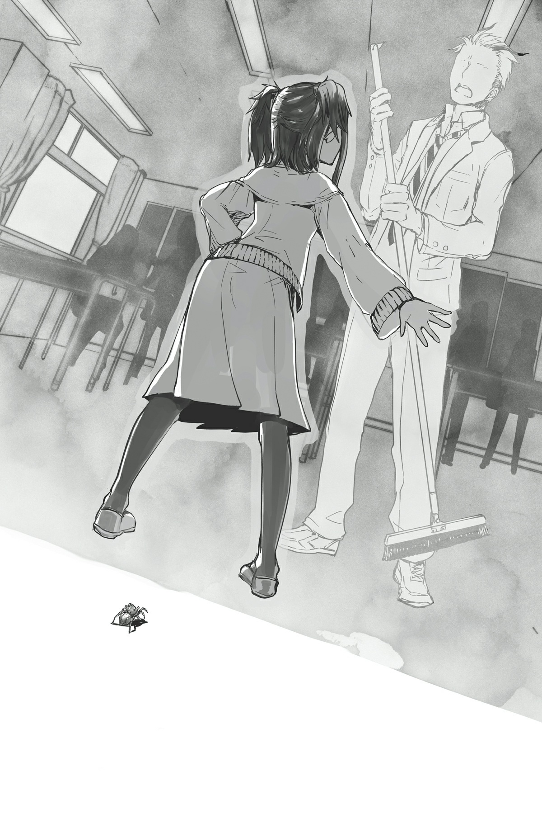

# Hãy nộp đơn khiếu nại
*(Let’s File a Complaint)*

Cô giáo.

Đối với những người tái sinh chúng tôi, từ ngữ đó chỉ có thể ám chỉ một người duy nhất.

Tất cả chúng tôi đều được tái sinh ở thế giới này sau một vụ nổ trong lớp học.

Tiết học chúng tôi đang học vào thời điểm đó là môn cổ văn.

Và người dạy chúng tôi khi đó không ai khác ngoài cô giáo Okazaki Kanami.

Ngoài tôi ra, cô ấy là người tái sinh duy nhất không phải là học sinh.

Và cô ấy đã đụng độ cậu Oni.

Về mặt lý thuyết thì chuyện đó không sao. Vấn đề là địa điểm và hoàn cảnh mà họ gặp nhau, và quan trọng hơn cả, chủng tộc của cô giáo chúng tôi.

Cậu Oni phát hiện ra cô ấy đang hỗ trợ quân phản loạn.

Chuyện đó vốn đã là một dấu hiệu cảnh báo rồi, nhưng trên hết, cô ấy lại thuộc tộc elf trong số tất cả các chủng tộc có thể?

Tộc elf—phải rồi, chính là chủng tộc của Potimas.

Không đời nào.

Cái sự "không đời nào" lớn nhất từ trước đến nay đấy.

Chuyện đó không ổn chút nào!

Nếu bạn suy nghĩ về nó, hoặc ngay cả khi bạn không suy nghĩ, đó hoàn toàn là tin xấu!

Toàn bộ sự việc có vẻ thật lố bịch, nhưng chúng tôi cũng không thể cứ thế phớt lờ nó.

Chả trách Ma Vương lại gọi tình huống này là "rắc rối"!

Tôi đã đoán rằng bất kỳ tình huống nào cô ấy thấy rắc rối cũng sẽ liên quan đến tộc elf hoặc người tái sinh, nhưng tôi chưa bao giờ tưởng tượng nổi nó lại là cả hai thứ gộp lại làm một như thế này!

Theo lời cậu Oni, cô ấy đã chạy thoát khỏi anh ta.

Trong lúc họ đang nói chuyện, lũ elf cyborg quái dị đã tấn công anh ta, và cô ấy đã được một tên elf khác bế đi nơi khác.

Và cô giáo của chúng tôi hoàn toàn không được tìm thấy trong số các binh lính phản loạn bị chúng tôi bắt giữ.

Thực tế, hoàn toàn không có lấy một tên elf nào trong số bọn họ, chấm hết.

Chúng chắc chắn đều đã chết hoặc đã trốn thoát.

Có vẻ kỳ lạ khi chúng tôi không bắt giữ được dù chỉ một tên, nên chúng tôi nghi ngờ rằng những kẻ có nguy cơ bị bắt sống có thể đã tự sát.

Có lẽ chúng được lệnh thà chết chứ không được rơi vào tay kẻ thù chăng?

Nghe chính xác là những gì Potimas sẽ nói đấy, dĩ nhiên rồi, nhưng thậm chí còn đáng sợ hơn khi tộc elf lại thực sự tuân theo lệnh hắn.

Nhưng tôi đoán lũ người chết lúc này không thực sự quan trọng.

Có vẻ như những tên elf sống sót đã tập hợp lại và đang cố gắng trốn thoát khỏi lãnh địa ma tộc.

Hợp lý thôi. Dù sao thì bọn họ cũng đã đến thị trấn phía bắc bằng cổng dịch chuyển mà.

Giờ đây khi đầu bên kia của cái cổng đó đã đi KABOOM nhờ phép [Thiên Thạch] của tôi, họ không thể quay về bằng con đường cũ được nữa, nghĩa là không còn lựa chọn nào khác ngoài việc chạy trốn bằng đường bộ.

Mặc dù ngay cả khi nó còn nguyên vẹn, họ cũng chẳng có cách nào tiếp cận được nó với việc toàn bộ thị trấn hiện đã nằm dưới sự kiểm soát của quân đội Ma Vương.

Nhưng người ta không thể cứ thế thong thả đi bộ ra khỏi lãnh địa ma tộc được đâu.

Trước hết, không đời nào một lũ elf lại có thể di chuyển quanh đây mà không bị phát hiện. Cuối cùng thì họ cũng sẽ phải bổ sung nhu yếu phẩm thôi, nên việc trốn thoát mà không tương tác với bất kỳ ma tộc nào là điều hầu như không thể.

Tôi không biết tin đồn tộc elf hỗ trợ quân phản loạn đã lan xa đến mức nào, nhưng nếu thông tin đó truyền ra đường phố, mọi người sẽ nâng cao cảnh giác.

Vấn đề là, vì không có Internet hay bất cứ thứ gì tương tự ở thế giới này, thông tin lan truyền khá chậm.

Điều đó cũng giải thích tại sao tộc elf lại di chuyển về phía nam nhanh như vậy: Họ đang lên kế hoạch chạy trốn càng xa càng tốt trước khi tin tức về họ bị đồn ra ngoài.

Nhưng vẫn còn một khoảng cách khá lớn giữa thị trấn phía bắc và biên giới với nhân giới.

Không đời nào họ có thể vượt qua khoảng cách đó mà không có sự giúp đỡ của bất kỳ ma tộc nào.

Và ngay cả khi họ chạm được tới biên giới, mọi chuyện chỉ càng trở nên khó khăn hơn từ đó.

Ma tộc và nhân tộc đã và đang gườm gườm nhìn nhau ở biên giới suốt nhiều năm qua rồi.

Mối quan hệ của họ tồi tệ đến mức bất kỳ ai cố gắng vượt biên đều có thể bị giết ngay lập tức mà không cần hỏi han gì.

Mặc định là họ vượt qua được biên giới đi, thì khả năng rất cao họ cũng sẽ bị con người giết chết.

Có những khu vực cụ thể ở biên giới dễ vượt qua hơn, nhưng tất cả chúng đều được canh phòng cẩn mật bởi các pháo đài khổng lồ do con người xây dựng.

Không đời nào họ có thể lén lút đi qua đó được.

Vậy tại sao họ không đơn giản là tránh những khu vực đó đi chứ?

Ồ, nếu cuộc sống chỉ đơn giản như thế thì tốt biết mấy.

Trước hết, chúng ta có thể loại trừ tất cả các khu vực có địa hình thực sự khó chịu, ví dụ lớn nhất là Dãy núi Huyền Bí mà chúng tôi đã vượt qua để đến đây.

Không một người bình thường nào có thể sống sót băng qua đó được cả.

Rồi còn những nơi không có đường sá đàng hoàng nhưng về mặt lý thuyết vẫn là các lựa chọn.

Vấn đề là, có cướp bóc ở những khu vực đó.

Cụ thể hơn, về cơ bản bọn họ là những nhóm cướp đường được chính phủ loài người cấp phép.

Chúng giết người và cướp bóc giống hệt như những tên cướp thông thường của bạn, nhưng chúng thực chất có giấy phép từ đế quốc loài người để làm việc cướp bóc này.

Các bạn sẽ không nghĩ một chính phủ lại muốn cho phép bất kỳ băng cướp nào hoạt động đâu, nhưng các bạn sai rồi.

Những tên này đang đóng góp cho nền quốc phòng của họ đấy, thấy chưa: Chúng nằm chờ sẵn trên những con đường hẻo lánh mà chính phủ không thể kiểm soát hoàn toàn, và chúng tiêu diệt bất kỳ kẻ xâm nhập tiềm năng nào từ lãnh địa ma tộc.

Chúng sống quanh các trạm kiểm soát này, tạo ra các khu định cư di động để tìm kiếm con mồi, cướp đoạt bất cứ thứ gì có thể từ những kẻ xâm nhập mà chúng tình cờ gặp phải, và thậm chí còn nhận được tiền bồi dưỡng từ chính phủ nữa.

Nên mặc dù về cơ bản chúng chỉ là lũ côn đồ, chúng quả thực đã giúp bảo vệ biên giới chống lại các cuộc xâm nhập từ lãnh địa ma tộc.

Nói cách khác, nếu tộc elf cố gắng trốn thoát theo bất kỳ con đường nào trong số này, họ sẽ bị chấn lột bởi lũ lưu manh được chính phủ hậu thuẫn này.

Chắc chắn rồi, tộc elf có thể chiến đấu để đẩy lùi chúng, nhưng lũ này mạnh mẽ đến ngạc nhiên đấy, vì chúng kiếm sống bằng việc giết chóc những kẻ xâm nhập mà lị.

Tôi không biết liệu những tên elf đang kiệt sức có cơ hội chiến thắng nào không sau khi đã lê lết suốt chặng đường dài qua lãnh địa ma tộc.

Nếu thua, tất cả bọn họ sẽ bị giết, và ngay cả khi thắng, tôi cá là họ cũng sẽ phải chịu tổn thất lớn.

Nhân tiện, cũng sẽ không có chuyện thương lượng hay đàm phán gì cả đâu nhé.

Lũ này bản chất là cướp. Nếu chúng nhận thấy có con mồi đi ngang qua, chúng chắc chắn sẽ tấn công.

Sẽ rất khó để thuyết phục chúng xem xét một thỏa thuận, và ngay cả khi họ xoay xở được đến mức đó, tôi chắc chắn bất kỳ cuộc nói chuyện nào cũng sẽ đổ vỡ nhanh chóng thôi.

Tại sao ư? Bởi vì toàn bộ công việc của lũ này là giết bất kỳ ai lang thang đến từ lãnh địa ma tộc mà.

Đất nước của chúng trả tiền để chúng làm việc đó, và chúng chắc chắn phải có mức độ tự hào nhất định về công việc của mình.

Chúng đang bảo vệ nhân loại khỏi sự xâm lăng của ma tộc, các bạn biết mà?

Ngay cả khi những gì chúng đang làm hầu như không thể phân biệt được với trò cướp cạn thông thường!

Nên chúng sẽ nhắm vào bất kỳ ai và mọi người đến từ lãnh địa ma tộc, dù là elf hay không.

Chưa kể, ma tộc và con người trông thực chất không khác nhau là mấy.

Bất kể ai bước ra từ lãnh địa ma tộc, chúng chỉ việc giết sạch mà thôi!

Tộc elf sao?

Bọn chúng đến từ lãnh địa ma tộc, nên chúng chắc chắn là đồng minh của ma tộc đúng không?

Giết sạch đi!

Chuyện sẽ diễn ra theo kịch bản đó đấy.

Những gì tôi đang cố gắng diễn đạt ở đây là cô Oka và những tên elf khác có cơ hội sống sót trốn thoát khỏi lãnh địa ma tộc cực kỳ thấp.

Thấp đến mức nếu bạn so sánh nó với tỷ lệ đánh trúng bóng của một cầu thủ bóng chày chuyên nghiệp, thì đó sẽ là một sự xúc phạm đối với cầu thủ đó!

Không phải là tôi quan tâm đến số phận của những tên elf khác ngoài cô Oka.

Nhưng không may là, chúng tôi cũng sẽ cần bọn chúng thoát ra ngoài an toàn.

Chẳng phải sẽ đơn giản hơn nếu chỉ việc đặt cô Oka dưới sự bảo vệ hay sao, bạn hỏi ư?

Ừm, tôi cũng đã nghĩ về chuyện đó rồi.

Nhưng có lý do khiến chúng tôi không thể làm như vậy.

Nghĩa là chúng tôi phải gián tiếp giúp đỡ cô Oka và đồng bọn thoát khỏi lãnh địa ma tộc.

Ít nhất, đó là quyết định nhanh chóng tôi đưa ra khi lắng nghe thông tin của cậu Oni và sử dụng kỹ năng dạng [Dò Tìm] để theo dấu cô Oka.

"Vậy đó là toàn bộ sự việc. Chúng ta nên làm gì đây?"

Một khi cậu Oni kết thúc lời giải thích của mình, Ma Vương quay sang hỏi tôi.

Phải nói rằng, tôi khá tự hào khi bản thân đã tìm thấy cô Oka và vạch ra kế hoạch xong xuôi vào thời điểm cô ấy hỏi tôi câu đó.

"Tôi sẽ xử lý."

Tôi đưa ra một tuyên bố nhanh gọn.

Không có thời điểm nào tốt hơn hiện tại, nên tôi lập tức đưa kế hoạch của mình vào hành động.

Trước hết, tôi cần phải tìm đến người tôi đã chọn để hộ tống tộc elf đến biên giới. Người đàn ông phù hợp nhất có thể cho công việc này.

Dĩ nhiên, đó chính là vị lãnh chúa phụ trách phần biên giới nhân-ma bên phía ma tộc: chính là Thượng tá.

Trời ạ, vị Thượng tá đó đúng là một khách hàng khó tính.

Đúng vậy, chính xác là thế.

Tôi vừa mới giao cho Thượng tá nhiệm vụ hỗ trợ tộc elf đấy!

Aaa, thật cực kỳ khó khăn để giải thích cho ông ta hiểu.

"Tộc elf." "Chạy trốn khỏi quân phản loạn." "Họ sẽ đi qua đây."
"Hướng đến nhân giới." "Hãy giúp đỡ họ."

Tôi đã phải tốn rất nhiều công sức mới truyền đạt được toàn bộ lượng thông tin đó cho ông ta.

Vì ông ta lập tức phản hồi bằng một câu hỏi ngay sau đó, tôi rốt cuộc đã đưa ra một câu trả lời khá là kỳ lạ, nhưng có vẻ như ông ta đã chấp nhận câu trả lời đó vì bất kỳ lý do gì.

Tốt lắm, Thượng tá.

Thật đáng tin cậy mà.

Ý tôi là, tôi đã gây ra rất nhiều áp lực cho ông ta, thế mà ông ta không hề mất đi sự bình tĩnh của mình.

Khá là điên rồ đấy.

Chắc chắn lời đe dọa ẩn ý đầy tinh vi của tôi đã truyền đạt được tới ông ta, nên ông ta hẳn phải là một người khá nhạy bén.

Tôi đã thành công gửi đi thông điệp *Tôi biết ông là kẻ chủ mưu thực sự đằng sau quân phản loạn* mà không cần thực sự nói ra thành tiếng, và ông ta đã hiểu.

Ông ta chắc chắn hữu dụng hơn nhiều so với ba kẻ tốt thí mà ông ta đã thao túng trước đó.

So với bọn họ, ngài Warkis là một nhân vật tầm cỡ hơn nhiều.

Hắc hắc hắc.

Tôi không tự dưng rảnh rỗi tập hợp cả bầy phân thân mini của mình để lườm ông ta không vì lý do gì đâu nhé, các bạn biết mà?

Đó là để truyền đạt thông điệp rằng ông ta đang bị giám sát và chúng tôi biết những gì ông ta đã và đang làm.

Tại sao tôi lại làm chuyện đó một cách vòng vo như vậy, bạn hỏi ư?

Để giảm thiểu lượng từ ngữ tôi thực sự phải nói ra thành tiếng chứ sao, rõ ràng là vậy rồi.

Làm ơn hãy tự mình suy luận ra đi để tôi không phải nói nữa.

Đó là nguyện vọng tha thiết đằng sau cử chỉ của tôi.

Và Thượng tá đủ thông minh để biến nó thành sự thật, nên tôi vô cùng hài lòng.

Trong thực tế, tôi là người duy nhất biết Thượng tá mới là kẻ chủ mưu thực sự đằng sau cuộc nổi loạn.

Ông ta không hề để lại dù chỉ một mảnh bằng chứng nhỏ nhoi nào cả.

Ông ta chỉ phái những thuộc hạ đáng tin cậy nhất của mình thâm nhập vào các quân đoàn khác và hành động thông qua họ.

Chắc chắn phải mất nhiều năm trời mới đặt nền móng xong xuôi cho tất cả những chuyện đó, nhưng bạn có thể làm được loại chuyện như vậy khi bạn có tuổi thọ dài như ma tộc.

Và ông ta đã sử dụng nền móng đó để thao túng vài thống lĩnh khơi mào cả một đội quân phản loạn.

Điều thực sự ấn tượng về Thượng tá là ông ta chưa từng trực tiếp can thiệp dù chỉ một lần, và ông ta thậm chí còn làm cho các thống lĩnh kia nghĩ rằng họ đang hành động theo ý chí của riêng mình.

Tôi nghi ngờ bản thân mình khó có thể thực hiện được chuyện gì tương tự.

Đó là một nghệ thuật tinh tế đòi hỏi sự thấu hiểu sâu sắc về bản chất con người, những tính toán thấu đáo, và một sự cân bằng cực kỳ cẩn thận giữa các yếu tố chuyển động khác nhau.

Khi tôi nhìn nhận vấn đề theo cách đó, nó làm tôi tự hỏi liệu ngay cả Potimas có phải cũng bị Thượng tá thao túng để hành động hay không.

Thực tế thì, rất có khả năng là vậy. Một nhà chiến lược thiên tài như Thượng tá chắc chắn sẽ nhận ra rằng chỉ riêng ma tộc thì không thể đánh bại được Ma Vương.

Ít nhất, không phải là không có sự trợ giúp từ bên ngoài dưới dạng Potimas.

Thượng tá đã lên kế hoạch ép buộc Potimas hành động dưới vỏ bọc chuyển động của quân phản loạn và thiết lập cho hắn đụng độ với Ma Vương.

Tôi rùng mình khi nghĩ chuyện gì sẽ xảy ra nếu ông ta thành công.

Đó là một nước đi táo bạo đặt trọng tâm của kế hoạch vào tay một kẻ ngoài cuộc.

Thực ra, có khả năng ngay cả việc ma tộc nhờ tộc elf giúp đỡ tái thiết cũng là do âm mưu của Thượng tá.

Potimas có thể nhẹ dạ cả tin đến ngạc nhiên. Nếu bạn tâng bốc hắn đúng cách, hoặc hứa hẹn nợ hắn một món nợ hay gì đó, hoặc gợi ý rằng ma tộc sẽ cần thêm sức mạnh để chiến đấu với loài người, hắn rất có thể sẽ đồng ý giúp đỡ.

Kiểu như, nếu bạn thực sự nghĩ về chuyện đó, sẽ hiệu quả hơn nhiều nếu tập trung năng lượng đó vào công việc ở nơi khác, nên thực sự không có lý do sâu xa nào để tộc elf phải giúp đỡ ma tộc cả.

Điều đó càng làm tăng khả năng Thượng tá đã sử dụng cái lưỡi không xương của mình để thúc đẩy Potimas gửi viện trợ.

Và nếu ông ta có thể làm vậy, tôi chắc chắn ông ta cũng có thể thuyết phục Potimas hỗ trợ quân phản loạn nữa.

Thượng tá quả thực sở hữu những năng lực đáng sợ, ngay cả khi chúng là loại không được phản ánh trong các kỹ năng của ông ta.

Nếu tôi không có cái chiêu trò bẩn thỉu mang tên mạng lưới thông tin phân thân mini của mình, tôi sẽ không bao giờ có thể đoán được Thượng tá mới là kẻ giật dây từ phía sau.

Nhưng có vẻ như sau sự cố nhỏ này, ông ta đã nhận ra rằng không có ý nghĩa gì khi cố gắng nổi loạn chống lại Ma Vương nữa. Và nếu một người tài năng như vậy hợp tác với chúng tôi, họ sẽ là một tài sản khổng lồ.

Việc thu phục ông ta về phía chúng tôi chắc chắn hiệu quả hơn nhiều so với việc hành quyết ông ta.

Dĩ nhiên tôi vẫn sẽ để mắt tới ông ta để đảm bảo ông ta không thử làm trò gì kỳ quặc.

Nhưng đúng vậy, tôi đã giao cho Thượng tá nhiệm vụ giúp đỡ cô Oka và đồng bọn.

Dù sao thì ông ta cũng có mối liên hệ với Potimas từ trước, nên sẽ không có vẻ gì là quá bất thường nếu ông ta âm thầm giúp đỡ tộc elf.

Và lũ elf đó hiện đang rơi vào tình cảnh vô cùng ngặt nghèo, nên họ chắc chắn sẽ nhận bất kỳ sự giúp đỡ nào được đưa ra.

Dù sao thì đây cũng không phải là một cái bẫy. Chúng tôi thực sự đang giúp đỡ họ, nên chúng tôi thực sự cần họ chấp nhận nó.

Dù thế nào đi nữa, họ sẽ được an toàn trong suốt thời gian còn lại ở lãnh địa ma tộc.

Tôi vẫn phải làm gì đó đối với biên giới, nhưng sẽ mất một khoảng thời gian để cô Oka và bạn bè chạm được tới đó.

Và trong lúc này, có một chuyện khác tôi buộc phải làm.

Cụ thể là, tôi phải đi nộp đơn khiếu nại.

Tôi tự dịch chuyển mình lên không trung.

Và sau đó: Đã đến giờ đá song phi rồi, cưng ơi!

Nhưng mục tiêu của tôi chắc chắn đã biết trước là tôi sẽ đến, vì không có ai ở đó vào lúc tôi lao xuống cả.

Động lượng từ cú đá của tôi ném tôi thẳng vào bức tường, và chân tôi đâm xuyên qua nó, bị kẹt cứng ở đó.

...Tôi cảm thấy như có chuyện gì đó tương tự một cách kỳ lạ vừa mới xảy ra với mình gần đây, nhưng đó chắc chắn chỉ là do tôi tưởng tượng mà thôi.

Các bạn sẽ không thể bắt gặp quý cô này cứ mãi đắm chìm trong quá khứ đâu nhé!

"Chào mừng. Mặc dù ta ước cô có thể bước vào nhẹ nhàng hơn một chút đấy."

Chủ nhân của căn phòng khiển trách tôi vì cách xuất hiện bất thường của mình.

Nhưng tôi phớt lờ lời phàn nàn của cô ta trong lúc rút chân ra khỏi bức tường.

Gì cơ, chi phí sửa chữa á?

Có cái nịt tôi mới trả tiền cho cái đó nhé!

Từ chối nhìn vào cái lỗ tôi vừa mới tạo ra, tôi đối mặt trực diện với chủ nhân của ngôi nhà.

Ngoại trừ tông màu khác biệt, cô ta có thể là hình ảnh phản chiếu của tôi qua gương.

Không cần phải nói, đó chính là bản gốc cho bản sao của tôi, người tạo ra hệ thống ở thế giới bên kia: vị thần được gọi là D, người hiện tại đang nhìn lại tôi một cách không cảm xúc.

Sau đó cô ta thản nhiên quay đi và tiếp tục trò chơi đang tạm dừng của mình.

Tôi đoán cô ta chắc chắn đã tạm dừng nó để né cú đá song phi của tôi.

Mức độ thiếu tôn trọng tuyệt đối đó làm tôi phát điên lên, nên tôi chộp lấy vai cô ta, xoay cô ta lại đối mặt với mình, và nhấc bổng cô ta lên bằng cổ áo bằng cả hai tay.

Các bạn biết đấy, cái hành động kinh điển các bạn thường thấy trong các bộ phim truyền hình và các thứ ấy.

Sự khác biệt là sức mạnh của tôi đã được cường hóa bằng ma pháp kiến tạo, nên tôi rốt cuộc đã nhấc bổng toàn bộ cơ thể của D lên không trung.

Đúng vậy, tôi có thể làm những trò như thế nếu tôi cường hóa sức mạnh cánh tay của mình bằng ma pháp kiến tạo mà lị.

Có lẽ việc này sẽ cho cô thấy tôi đang tức giận đến mức nào!!

Nhưng rồi tôi nghe thấy một tiếng động kỳ lạ, giống như tiếng vải rách phựt phựt, và sức nặng trên tay tôi đột ngột nhẹ đi rất nhiều.

Hử? Tôi nhìn lại và phát hiện ra quần áo của D đã bị rách toạc ra.

Ồ. Phải rồi, tôi đoán thế cũng hợp lý.

D không nặng lắm, nhưng nếu bạn dồn toàn bộ trọng lượng của một người lên một mảnh vải duy nhất, rõ ràng nó sẽ rách bất kể người đó có nhẹ đến mức nào đi nữa...

Và vì quần áo của cô ta bị rách, tôi không còn nâng bản thân D lên nữa, nên cô ta rơi bịch xuống đất.

Với vết rách khổng lồ trên quần áo của cô ta, bạn có thể nhìn thấy đủ thứ chuyện, nhưng biểu cảm của D không hề thay đổi dù chỉ một chút.

Nếu cô ta biết đỏ mặt một chút vì ngượng ngùng hay gì đó, tình huống này có thể được coi là khá dễ thương, nhưng vì cô ta hoàn toàn không có cảm xúc, nó mang lại cảm giác đáng sợ hơn là gợi cảm.

Chuyện này chắc hẳn giống như cảm giác khi bạn tình cờ nhìn thấy một con ma-nơ-canh khỏa thân hoàn toàn vào giữa đêm vậy.

"Thôi nào—ít nhất hãy tỏ ra hơi ngượng ngùng một chút đi chứ."

"Ta không có lý do gì để cảm thấy xấu hổ khi có ai đó nhìn thấy cơ thể mình cả. Ta tin rằng mình là người đẹp nhất thế giới, nếu ta tự nhận xét như vậy."

Oa, đó thực sự là một câu nói cực kỳ tự luyến được thốt ra một cách thản nhiên vô cùng.

Ờ... Được rồi, tùy cô vậy.

Tình huống kỳ quặc này bằng cách nào đó đã rút sạch mọi sự tức giận trong tôi.

Tôi thở dài một tiếng, tùy tiện vứt một bộ quần áo từ trong tủ đồ ra và ném vào người D. (Vì tôi có một phần ký ức của D trong não mình, tôi biết cách bố trí của căn phòng này.)

D đón lấy quần áo, lột bỏ bộ đồ đã hỏng của mình, và thay vào bộ đồ mới.

"Muốn chơi game không?"

Và ĐÓ là những gì cô ta quyết định nói tiếp theo.

Cô ta thong thả đến mức đang làm tôi cụt hết cả hứng đây này, chết tiệt thật!

Chuyện này không hoạt động rồi. Tôi buông thõng vai, đầu hàng theo nhiều nghĩa khác nhau.

Tôi đã biết ngay từ đầu rằng việc khiếu nại với D về mọi chuyện rốt cuộc sẽ không tạo ra bất kỳ sự khác biệt nào, vì cô ta mạnh hơn tôi rất nhiều, nhưng bằng cách nào đó chuyện này còn diễn biến tệ hơn tôi tưởng.

Nó thậm chí không phải là vấn đề về sức mạnh—cô ta chỉ đơn giản là có cách làm bạn cảm thấy như bất cứ điều gì mình nói đều không có trọng lượng.

Ngay cả khi chúng tôi trò chuyện được với nhau, tôi luôn có cảm giác mình sẽ không bao giờ thông suốt được với cô ta.

Thực tế thì, điều đó có lẽ là bất khả thi, chuyện đó chỉ một lần nữa chứng minh rằng các quy tắc thông thường không áp dụng cho D.

Xét về mặt cảm xúc, tôi không biết liệu bạn có thể coi cô ta là một sinh vật sống hay không nữa.

"Không. Hôm nay tôi đến đây để nộp đơn khiếu nại."

Tôi biết việc đó sẽ không đạt được kết quả gì, nhưng tôi vẫn phải làm những gì mình đến đây để làm.

"Về cô Okazaki, ta đoán vậy. Ta thực sự đã rất mong chờ cuộc đụng độ của hai người, nên ta khá thất vọng khi cô lại biết về cô ta thông qua lời kể của người khác đấy. Hai người không thể gặp nhau theo cách kịch tính hơn sao? Có chăng thì, chính ta mới là người muốn nộp đơn khiếu nại đây này."

"Ai thèm quan tâm chứ?!"

Tại sao cô lại được quyền có những kỳ vọng kỳ quặc như vậy về tôi rồi lại tỏ ra thất vọng một cách kỳ quặc khi chúng không xảy ra chứ?!

Tôi hoàn toàn không biết cô Oka ở đâu hay đang làm gì, vậy làm sao tôi có thể dàn dựng một cuộc hội ngộ kịch tính như thế được chứ?!

Hơn nữa, nếu tôi bằng cách nào đó biết trước từ trước, nó sẽ không còn kịch tính nữa rồi!

Người ta thường nói về những cuộc gặp gỡ định mệnh và những cuộc đụng độ ngàn năm có một và tất cả những thứ đó, nhưng trong thực tế, loại chuyện đó thông thường không xảy ra một cách kịch tính như vậy đâu!

Trong lúc tôi đang bốc hỏa vì giận dữ, D với tay lấy một túi khoai tây chiên bên cạnh và loay hoay một lát trước khi mở được nó ra.

Cô phải ngừng cái thái độ thong thả đó lại ngay đi chứ!

Tôi giật phắt cái túi khỏi tay D và ngấu nghiến toàn bộ phần bên trong chỉ trong một miếng.

Đây là một chiêu trò tôi mới tìm ra gần đây: sử dụng ma pháp kiến tạo không gian để tái tạo lại kỹ năng [Bạo Thực] của Ma Vương.

Dĩ nhiên, vì tôi có một cái dạ dày nhỏ bé trong cơ thể này, tôi thực chất chỉ ăn có một miếng mà thôi. Tôi đã gửi phần còn lại cho các phân thân mini của mình.

Trời ạ, đã bao lâu rồi—không, khoan đã, đây thực chất là lần đầu tiên tôi thực sự được ăn khoai tây chiên trong đời đấy chứ. Chúng ngon tuyệt cú mèo luôn.

Tôi quả thực có ký ức về việc ăn chúng dưới thân phận Wakaba Hiiro, nhưng đống đó thực chất chỉ là những ký ức giả do D ban cho tôi mà thôi.

Trong thực tế, tôi chưa bao giờ thực sự có cơ hội ăn khoai tây chiên ở kiếp trước cả.

Các bạn biết mà, vì tôi là một con nhện.

Bị cướp mất túi khoai tây chiên, D nhún vai một cách cường điệu trong một cử chỉ mang đậm phong cách Mỹ kiểu *Ta phải làm gì với cô đây chứ?*.

Vẫn hoàn toàn không có cảm xúc, dĩ nhiên rồi.

Aaa, giờ tôi phải làm gì đây? Cô ta thực sự làm tôi ngứa mắt vô cùng.

Tôi muốn đấm thẳng vào khuôn mặt vô cảm đó của cô ta ghê gớm.

"Chẳng phải cô đến đây để hỏi ta tại sao lại biến giáo viên của cô thành elf sao?"

Phải rồi! Đúng vậy, chính là chuyện đó!

Tôi đến để nộp đơn khiếu nại để D giải thích tại sao cô ta lại biến cô Oka thành một tên elf, trong số tất cả các chủng tộc!

D là người đã khiến tất cả chúng tôi tái sinh ở thế giới mới này.

Nói cách khác, việc cô Oka là một tên elf là một lựa chọn có chủ ý được đưa ra bởi chính bản thân D mà thôi.

Con người và ma tộc thì không sao.

Ngay cả ma cà rồng nữa, tôi đoán vậy.

Quái vật như cậu Oni và tôi, ờ thì... chúng ta tạm gọi đó là một cú ném suýt soát nằm trong vùng an toàn, vì mục đích tranh luận đi.

Nhưng tộc elf sao? Tộc elf chắc chắn là không được!

Chúng ta đang nói về tộc elf ở đây đấy, các bạn biết mà. Cái chủng tộc về cơ bản đã bị Potimas nô dịch hóa ấy.

Không, theo một cách nào đó, tình hình có khi còn tệ hơn thế nhiều. Cho dù họ có biết hay không, tất cả tộc elf đều là quân cờ của Potimas, là những con rối của hắn.

Rõ ràng là cực kỳ tồi tệ khi tái sinh ai đó thành một trong những thứ đó!

"Lý do chắc chắn phải hiển nhiên chứ. Bởi vì nó có vẻ giải trí hơn theo cách đó mà."

Đấy rồi. Lời bào chữa kinh điển của D cho mọi thứ.

"Tộc elf đóng một vai trò rất quan trọng trong thế giới đó, cô biết mà. Nên việc có ít nhất một trong những nhân vật cốt cán của chúng ta là elf mới là điều phù hợp chứ, cô không nghĩ vậy sao?"

Không, tôi không nghĩ vậy!

Bởi vì bất kỳ ai sinh ra là elf—trong trường hợp này là cô Oka—chắc chắn sẽ phải chịu đau khổ vô cùng.

Nhưng tôi đoán đối với một kẻ như D, kẻ sử dụng cả một thế giới làm trò chơi tiêu khiển của mình, việc một cá nhân đơn lẻ không hạnh phúc chẳng có nghĩa lý gì cả.

Có chăng, cô ta có vẻ còn tìm thấy niềm vui trong đó nữa kìa.

"Và sẽ càng giải trí hơn nữa nếu tộc elf bằng cách nào đó biết về những người tái sinh. Nên để giữ cho trò chơi thêm phần thú vị, ta đã ban cho cô ấy một kỹ năng cực kỳ thú vị."

Tôi đã có thể đoán được cái kỹ năng này sẽ chẳng có gì tốt đẹp rồi.

Và trời ạ, tôi đã đoán trúng phóc luôn.

"Kỹ năng ta ban cho cô ấy được gọi là [Danh Sách Học Sinh]. Nó cung cấp cho cô ấy một phần thông tin về những người tái sinh khác."

Cái gì cơ?

Cái gì cơ cơơơơ?!

Khoan đã. Chờ một chút đã nào.

Điều đó chính xác nghĩa là gì chứ?

Cô đang nói với tôi là Potimas đã săn lùng Vampy và các thứ tương tự bằng cách khai thác kỹ năng đó sao?

"Ta biết cô đang nghĩ gì, và cô đoán đúng rồi đấy."

Hự! Cô đang đọc suy nghĩ của tôi đấy à?!

"Ta không đọc suy nghĩ của cô đâu. Ta chỉ dự đoán suy nghĩ của cô thôi."

Quả thực đúng như vậy, tôi không hề cảm nhận thấy bất kỳ dấu vết nào của thuật pháp được sử dụng cả.

Cô ta chắc chắn chỉ đoán ra kết luận tôi sẽ đạt được, chứ không phải sử dụng năng lực đọc tâm trí.

Mặc dù chuyện đó cũng đủ đáng sợ theo cách riêng của nó rồi.

"Đúng vậy. Hành động của tên elf đó vượt xa mong đợi của ta rất nhiều. Ta chưa bao giờ tưởng tượng nổi hắn lại có thể thu thập được phần lớn các học sinh tái sinh như vậy."

Hả?

K-k-khoan đã nào!

Cái gì cơ? Chờ đã, nói lại cho tôi nghe xem nào!

Ơ kìa? Cô nói nghiêm túc đấy chứ?!

Tôi kinh ngạc đến mức vốn từ vựng của mình đang đình công luôn rồi, nhưng lúc này tôi không thể lo lắng về chuyện đó được.

"Ý cô là sao chứ?!"

"Chính xác là những gì ta vừa nói đấy. Mặc dù ta sẽ không nói cho cô biết hắn lên kế hoạch sử dụng những người tái sinh đã thu thập được như thế nào đâu, dĩ nhiên rồi. Đây hoàn toàn là thông tin tối mật mà ta chia sẻ như một sự tử tế dành cho cô do tính chất đặc biệt trong mối quan hệ của chúng ta, được chứ?"

Cô ta đang bỏ qua các chi tiết quan trọng nhất, nhưng biết tính Potimas, bất cứ thứ gì hắn lên kế hoạch chắc chắn sẽ không có gì tốt đẹp cả.

Trên hết, cô ta làm như thể mình đang cực kỳ tử tế, cứ như thể muốn bảo tôi nên biết ơn đi, nhưng tôi biết cô ta kể cho tôi nghe chuyện này chỉ vì nó sẽ giải trí hơn theo cách này mà thôi.

Đó chính là con người của D.

"Cô ấy là một người trưởng thành có lý trí, và cô ấy cảm thấy trách nhiệm nhất định đối với các học sinh của mình. Vậy cô nghĩ chuyện gì sẽ xảy ra nếu ta ban cho một giáo viên gương mẫu như vậy một kỹ năng [Danh Sách Học Sinh] mà, ví dụ như, dự đoán cái chết của học sinh của mình chứ?"

Hự! Chỉ có một vị tà thần mới có thể phát minh ra một kỹ năng lố bịch như vậy!

Nếu cô ấy nhìn thấy một thứ như thế, đương nhiên cô Oka sẽ cố gắng làm điều gì đó để ngăn chặn những cái chết đó xảy ra.

Nếu là tôi ở vị trí của cô ấy, tôi sẽ chỉ việc phớt lờ cái danh sách đó đi. Nhưng cô ấy là một phụ nữ Nhật Bản có lý trí và lại còn là một giáo viên nữa, nên cô ấy sẽ nỗ lực hết sức để cứu mạng học sinh của mình.

Và tôi chắc chắn có thể hình dung ra cảnh Potimas sử dụng điều đó làm lợi thế của hắn để vạch ra những âm mưu tồi tệ.

Chết tiệt thật.

Chuyện này thật kinh khủng. Tình cảnh của cô Oka còn tồi tệ hơn tôi tưởng nhiều.

Theo lời của một cô nàng ma pháp thiếu nữ nào đó thì, thật tàn nhẫn... Chuyện đó thật quá tàn nhẫn!

Nhưng nghiêm túc đấy, chuyện này không ổn chút nào.

"Thật cao quý đúng không? Cô ấy đang dũng cảm đối mặt với hiểm nguy để đi khắp thế giới vì lợi ích của học sinh của mình mặc dù bản thân đang ở trong cơ thể của một đứa trẻ con. Và rồi cô ấy lại đang đặt chính những học sinh mình cố gắng cứu sống vào ngay tay của kẻ cuối cùng cô ấy nên tin tưởng. Đáng thương thật đấy."

"Hự! Đồ khốn nhà cô!"

Câu nói đó đã đẩy tôi vượt qua giới hạn của sự khó chịu tiến thẳng vào cơn thịnh nộ thực sự.

Nhưng ngay khi tôi giơ nắm đấm lên định nện cô ta—

"Cô có biết tại sao mình lại đặc biệt lo lắng cho cô Okazaki như vậy không?"

—lời nói của D đã khóa chặt tôi tại chỗ.

Cô ta đang nói cái quái gì thế hả?

Chuyện đó quá hiển nhiên rồi còn gì, đúng không?

"Cô không hề bận tâm nhiều như vậy khi những người tái sinh khác gặp bất hạnh—nói thế có công bằng không nhỉ?"

Chuyện đó không... không đúng, tôi đoán vậy.

"Không, cô không hề bận tâm. Ngay cả khi biết rằng có những người tái sinh khác, cô cũng không lo lắng cho họ trừ phi họ tình cờ ngáng đường cô. Thực tế là cô không hề bắt đầu tìm kiếm họ ngay cả khi hiện tại đã là một vị thần là bằng chứng đủ rõ ràng cho điều đó. Cô sẵn lòng giúp đỡ những người tái sinh cô gặp mặt, dù là ma cà rồng hay cậu Oni, nhưng điều đó chỉ nằm trong giới hạn hợp lý mà thôi. Cô sẽ không bỏ mặc họ, nhưng cô cũng không tự ý đi giúp đỡ họ, ngay cả với tất cả sức mạnh đó của mình. Cô đồng cảm với hoàn cảnh của họ, nhưng không hề nổi giận thay cho họ. Vậy tại sao cô chỉ tức giận duy nhất về hoàn cảnh của cô Okazaki như vậy chứ?"

Cô thực sự cần phải hỏi sao?

Đó là bởi vì, ờ... Khoan đã... tại sao tôi lại quan tâm đến cô ấy nhiều như vậy chứ?

Bởi vì nó có vẻ giống như một tội ác chống lại nhân loại sao?

Không, tôi không thể tự nhận một lý do cao cả và vĩ đại như vậy được.

Ngay từ đầu tôi thậm chí còn không phải là con người cơ mà, nên tôi thực sự không có loại cảm xúc đó.

Như D đã nói, tôi thực sự không mấy hứng thú với những người tái sinh khác.

Tôi cảm thấy có mối liên kết nhất định với họ, nên tôi cố gắng giúp đỡ nếu tình cờ nhìn thấy họ, nhưng chỉ có thế mà thôi.

Tôi liên quan đến Vampy và cậu Oni chỉ vì chúng tôi tình cờ đụng độ nhau.

Nếu sự trùng hợp ngẫu nhiên không đưa chúng tôi lại với nhau, tôi nghi ngờ mình sẽ tự ý đi tìm kiếm họ.

Nếu tôi không gặp Vampy hồi đó, và con bé đã bị Potimas giết chết, tôi sẽ chỉ nghĩ *Ồ, ra vậy* nếu tình cờ biết được sau đó.

Bây giờ, dĩ nhiên, tôi có mức độ quý mến nhất định dành cho con bé, vì chúng tôi đã ở bên nhau quá lâu rồi, và tôi có lẽ sẽ nổi điên lên nếu con bé bị giết.

Nhưng đó chỉ là vì chúng tôi đã gặp gỡ và hình thành một mối liên kết sâu sắc hơn mà thôi.

Nếu một người tái sinh tôi chưa từng gặp qua qua đời, tôi thực sự không cảm thấy một chút gì cả.

Và mặc dù về mặt kỹ thuật lúc này tôi đã biết hoàn cảnh của cô Oka, chúng tôi thực chất chưa từng nói chuyện mặt đối mặt, nên tôi không thể nói là tôi đã thực sự gặp cô ấy, chứ đừng nói là hình thành mối liên kết.

Ấy vậy mà, tôi lại tức giận đến mức tự mình chạy đến tận đây để khiếu nại với D.

Nó không phải chỉ vì một người tái sinh được sinh ra là elf, đẩy cô ấy thẳng vào nanh vuốt của kẻ thù truyền kiếp Potimas của chúng tôi.

Nếu đó là bất kỳ ai ngoại trừ cô Oka, tôi chắc chắn mình sẽ chỉ kiểu *Hự! D lại làm trò nữa rồi!* chứ tôi sẽ không chạy đến để nộp đơn khiếu nại đâu.

Không, đó là bởi vì cô ấy là cô Oka.

Tôi ở đây là vì cô ấy.

"Thật giải trí làm sao. Thật vô cùng, vô cùng giải trí. Cô không có nhiều ký ức về việc làm nhện, nên về mặt lý thuyết, cô không nên nhớ bất kỳ món nợ nào hay những thứ tương tự. Phải chăng món nợ này đã in hằn sâu vào linh hồn của cô rồi? Coi như cô đã làm ta cực kỳ giải trí đấy."

Đúng vậy.

Tôi thực sự không nhớ nhiều về việc làm một con nhện bình thường ở kiếp trước của mình.

Nhưng nếu tôi kết hợp những gì ít ỏi tôi nhớ được với ký ức của Wakaba Hiiro, có một chuyện tôi không thể ngó lơ.

"Á! Một con nhện khổng lồ kìa!"

"Trời đất ơi, ghê quá. Lấy cây chổi đi. Tớ sẽ đập nát nó."

Một nhóm con trai đi vào lớp học và cố gắng đập bẹp tôi khi bọn họ phát hiện ra mạng nhện của tôi trong lớp học.

Wakaba Hiiro, hay chính là D, chỉ đơn giản lặng lẽ quan sát.

"Khoan đã nào, các em trai ơi!"

Nhưng rồi cô Oka lập tức chạy đến.

"Ngay cả sinh vật nhỏ bé này cũng có linh hồn mà. Giết nó đi thì thật là tàn nhẫn đấy, các em biết mà!"

"Ơ kìa, cô..."

Cậu học sinh nam khựng lại, cây chổi vẫn lăm lăm trong tay.

"Nghe cô nói này, được chứ? Nhện là loài côn trùng có ích, các em biết không? Chúng ăn các loài côn trùng gây hại khác đấy. Hơn nữa, nhìn xem bọn chúng đáng yêu thế nào kìa!"

"Đáng yêu á? Có cái nịt ấy..."

Cậu bé phàn nàn, nhưng cậu ta vẫn miễn cưỡng nghe theo lời cô Oka.

"Các em không được ai giết sinh vật tội nghiệp này nữa đấy nhé, được chứ?"

"Dạ, biết rồi ạ."

"Như vậy có phải tốt không nào? Hãy sống cuộc đời của em một cách trọn vẹn nhất nhé, chú nhện nhỏ?"

Đúng vậy.

Chính nhờ sự kiện đó mà tôi được phép sinh sống trong lớp học.

Đó là lý do tôi đã sống sót.

Cô Oka... đã cứu mạng tôi.

Ký ức đó là một ký ức từ góc nhìn của Wakaba Hiiro, chứ không phải ký ức từ cuộc sống làm nhện của tôi.

Nhưng ngay cả khi tôi không nhớ rõ về nó, linh hồn tôi vẫn nhớ rằng tôi nợ cô ấy một mạng sống.

Nghĩa là tôi buộc phải làm gì đó để đền đáp cô ấy.

Nợ mạng đền mạng.

"Chỉ để nhắc nhở cô thôi, bất kỳ điều gì cô cố gắng làm với ta lúc này cũng sẽ không thay đổi được tình cảnh của cô giáo thân yêu của cô đâu, hửm?"

"Ừ, tôi biết."

Nhưng đó là vấn đề nguyên tắc.

Nắm đấm của tôi vốn đã dừng lại ngay trước lúc va chạm lập tức lao thẳng về phía trước và đấm thẳng vào mặt D!

Thực tế, cú đấm mạnh mẽ đến mức thổi bay cả đầu cô ta đi mất.

"Cô cảm thấy khá hơn chưa?"

Nhưng ngay khi tôi rút cánh tay về, đầu của D lập tức tái tạo lại cứ như thể thời gian đang quay ngược vậy.

Trời ạ, gớm quá đi mất!

Cái kiểu hồi phục quái dị gì thế kia chứ?

Ngay cả tôi cũng cảm thấy hơi rợn người.

Và một cái nhìn thoáng qua nhỏ nhoi về ma lực của D rò rỉ ra ngoài vào khoảnh khắc tái tạo lại là quá đủ để làm tôi khiếp sợ.

Sự hiện diện của cô ta mạnh mẽ đến mức, giống như cô ta đang tỏa ra chính cái chết vậy.

D tự gọi mình là một vị tà thần, nhưng thành thật mà nói, ngay cả từ đó cũng không thể mô tả đúng về cô ta.

Tôi chắc chắn cô ta có thể giết chết tôi chỉ trong một cái chớp mắt nếu cô ta cảm thấy thích.

Hồi sinh thông qua phân thân ư? Phải rồi, điều đó chắc chắn chẳng có ý nghĩa gì nếu D muốn giết tôi.

Chỉ trong một khoảnh khắc đó, điều đó đã trở nên rõ ràng mồn một.

Nhưng luồng hào quang đáng sợ đó biến mất nhanh chóng như lúc nó xuất hiện.

"Ồ không ổn rồi. Ta sơ hở rồi. Ta chắc chắn mình vừa mới bị phát hiện ra xong."

D lầm bầm điều gì đó tôi không mấy hiểu rõ.

"...?"

"Ồ, đừng lo lắng về chuyện đó. Chỉ là chút việc riêng tư mà thôi."

Chà, D luôn thần bí như vậy. Và nếu cô ta đã bảo tôi đừng lo lắng về chuyện đó, tôi chắc chắn việc bận tâm cũng chẳng giúp tôi đi đến đâu cả.

"Tôi sẽ cứu cô Oka."

"Cứ tự nhiên đi. Ta chỉ là một người quan sát ở đây mà thôi. Cô được tự do làm bất cứ điều gì mình muốn. Ta sẽ không ép buộc cô, và ta cũng sẽ không cố gắng ngăn cản cô đâu."

Lời tuyên bố táo bạo của tôi nhận được sự đồng thuận dễ dàng từ D.

Hợp lý thôi. Như cô ta đã nói, cô ta chỉ là một người quan sát mà thôi.

Cô ta thỉnh thoảng có can thiệp vào chuyện của tôi, nhưng thường chỉ là để giúp đỡ tôi một chút mà thôi.

Ví dụ lớn nhất chính là khi cô ta ban cho tôi kỹ năng [Trí Tuệ], nhưng điều đó cơ bản nghĩa là tất cả những lần khác chỉ là vài lời khuyên khôn ngoan mà thôi.

Và mặc dù cô ta từng giúp đỡ tôi trước đây, cô ta chưa từng làm chuyện gì để cản trở cả.

...Ít nhất là không đối với những người tái sinh chúng tôi.

Khi Güli-güli đến gặp tôi ở Đại Mê cung Elroe, D chắc chắn đã nói điều gì đó để đuổi ông ta đi.

Và cô ta cũng đã ngăn cản ông ta can thiệp trong suốt sự cố UFO nữa.

Nên mặc dù cô ta tuyên bố mình là người quan sát, cô ta không hoàn toàn đứng ngoài cuộc đâu.

Tôi tin lời hứa không cản trở tôi của cô ta là chân thành, nhưng điều đó không ngăn cản cô ta gây rối với bất kỳ ai khác.

"Ta không làm gì nhiều cả. Cùng lắm thì, có lẽ ta chỉ để một ít thông tin sai lệch lọt vào kỹ năng [Danh Sách Học Sinh] của cô Okazaki mà thôi. Chưa từng có ai nói rằng tất cả thông tin đó đều là thật cả, thế mà cô ấy chắc chắn tin vào nó và chạy đôn chạy đáo tương ứng. Đúng là khá giải trí đấy."

Tôi đấm D một phát nữa.

Đồ khốn nhà cô!

Làm sao một kẻ có thể tồi tệ đến thế chứ?!

Đầu cô ta lại nổ tung lần nữa, rồi tự phục hồi chỉ trong nháy mắt.

"Không cần lo lắng đâu. Ta sẽ không làm bất kỳ chuyện gì như thế từ nay về sau nữa. Hoặc có lẽ chính xác hơn nếu nói là ta sẽ không thể làm được nữa."

"Từ nay về sau" nghĩa là trước đây cô ta đã từng làm đúng không?

Tôi có nên đấm cô ta thêm một phát nữa cho chắc ăn không nhỉ?

Nhưng ý cô ta là gì khi nói "sẽ không thể làm được nữa"?

"Ta tìm thấy cô rồi nhé."

Câu trả lời xuất hiện gần như ngay lập tức.

Nó đến từ một giọng nói không thuộc về cả D lẫn tôi.

Quay lại nhìn, tôi đối mặt trực diện với một cô hầu gái.

Khoan đã, một cô hầu gái sao?

Cô ấy mỉm cười vui vẻ khi nhìn D.

Thật kỳ lạ. Cô ấy là một mỹ nhân truyền thống Nhật Bản duyên dáng, tốt bụng, nhưng nụ cười của cô ấy trông có vẻ kỳ quái và đáng sợ một cách kỳ lạ.

Vì lý do nào đó, từ *người mẹ* lập tức hiện lên trong đầu tôi.

Theo nghĩa là bạn sẽ không bao giờ dám đứng lên chống lại cô ấy.

Cô ấy có vẻ giống kiểu một người chị gái sẽ đặt tay lên má và nói những câu như *Ôi trời đất ơi!* hay *Kìa em!*, vậy tại sao cô ấy lại đáng sợ đến thế chứ?

Hửm, cô ấy có hơi thiếu thốn ở phần ngực một chút thì phải.

Ôi hỏng rồi, tốt nhất tôi nên ngừng nghĩ những chuyện như thế thì hơn.

Phải nín thở và đảm bảo cơn giận của cô Hầu Gái không chuyển sang tôi nữa.

"Thật là sơ suất quá đi mất. Ta đã tốn bao nhiêu công sức để che giấu vị trí của mình vậy mà lại tự để lộ ra bằng cách tái tạo lại cơ thể vừa rồi."

"Như thường lệ, cô thiếu đi sự đứng đắn mà một vị thần tối cao cần phải sở hữu đấy nhé. Chuyến đi chơi trốn việc của cô kết thúc tại đây rồi. Cô phải đi về với tôi ngay."

Ồồồ, ra là cô ấy đến để lôi tên D trốn việc về nhà sao?

Chả trách cô ấy lại mang cái hào quang *đừng có giỡn mặt với tôi* như thế kia.

"Và cái thứ này là gì vậy?"

Cô Hầu Gái nhìn tôi.

Cô vừa gọi tôi là "thứ này" đúng không? Tôi hiểu rồi đấy nhé.

Chuyện đó làm tôi hơi nổi giận đấy, nhưng tôi có cảm giác mình sẽ không thể đánh bại được cô ấy...

Để bắt đầu, tôi thậm chí còn không nhận ra cô ấy đến đây từ lúc nào.

Thực tế, đối với một cô gái xinh đẹp như vậy, cô ấy sở hữu mức độ hiện diện cực kỳ thấp.

Ma pháp cường hóa ư...? Không, tôi không nghĩ vậy.

Tôi không thể phát hiện ra bất kỳ điều gì bất thường ở cô ấy cả. Nhưng bằng cách nào đó sự hiện diện của cô ấy cực kỳ mờ nhạt.

Cô ấy chắc chắn đang sử dụng kỹ thuật nào đó tôi chưa từng nghe nói đến để xóa bỏ sự hiện diện của mình, nhưng hiệu ứng là bạn có thể dễ dàng mất dấu cô ấy ngay cả khi cô ấy đang đứng ngay trước mặt bạn như thế này.

Tôi chắc chắn đã bị cuốn vào ảo ảnh của cô ấy rồi.

Bất kỳ ai có thể bẫy tôi dễ dàng như vậy chắc chắn phải rất mạnh.

"Đây là món đồ chơi mới của ta."

Hự, và giờ D cũng ám chỉ tôi giống như một đồ vật luôn sao?!

Tôi chắc chắn cô ta nói thật lòng đấy, nhưng chuyện đó chỉ càng làm tôi thấy bị xúc phạm hơn mà thôi.

"Một phân thân đơn thuần sao...? Không, có vẻ như không phải vậy. Chính xác thì nó là thứ gì chứ?"

Nghiêm túc đấy, các bạn có thể ngừng đối xử với người khác như đồ vật được không hả?

Được rồi, tôi thực chất là một con nhện thật, nhưng dù thế thì vẫn vậy nhé.

"Một sự đột biến nhện đặc biệt. Ta đã tạo ra cô ta theo hình dáng của mình để đánh lạc hướng cô về vị trí của ta, thế mà cô ta lại vượt quá mong đợi của ta và trở thành một vị thần luôn."

"...Ta hoàn toàn không hiểu cô đang nói cái gì cả."

Phải rồi, khi cô ta diễn đạt theo cách đó, tôi thực ra cũng không mấy hiểu rõ nữa là.

Thành thật mà nói, tất cả những gì tôi thực sự làm chỉ là cực kỳ may mắn và rơi vào vài tình huống thực sự kỳ diệu mà thôi. Ngay sau đó, tôi đã là một vị thần đàng hoàng rồi.

Ngay cả tôi cũng thấy chuyện đó thật lố bịch khi nhìn lại lịch sử cá nhân của mình, nên tôi chắc chắn nó sẽ càng khó hiểu hơn đối với một người ngoài cuộc.

"Dù sao đi nữa, chúng ta phải về nhà thôi. Cô có cả một đống công việc đang chất cao như núi đang chờ đấy."

"Ta không muốn về nhà đâu. Ta không muốn làm việc. Ta chỉ muốn chơi game mãi mãi thôi."

Vẫn hoàn toàn vô cảm, D bắt đầu mè nheo ăn vạ.

Tôi ghét phải thừa nhận chuyện này, nhưng nhìn thấy cô ta như thế này chỉ càng làm tăng thêm sự thuyết phục rằng cô ta thực sự là bản gốc của tôi.

"Làm ơn đừng ích kỷ như vậy chứ. Cô nghĩ ai là người phải quản lý địa ngục thay cho cô khi cô không làm việc hả?"

"Ừm."

D chỉ tay vào cô Hầu Gái.

Ôi hỏng rồi.

Cô Hầu Gái vẫn đang mỉm cười, nhưng tôi thực tế có thể nhìn thấy một tia máu đang giật giật trên trán cô ấy.

"Ta vốn đã cực kỳ bận rộn quản lý các tầng địa ngục rồi đấy nhé, cô biết mà."

"Nhưng không phải là cô không làm được, đúng không?"

"Đó không phải là vấn đề ta có làm được hay không. Ta có nhiệm vụ của ta, và cô có nhiệm vụ của cô. Bây giờ đi thôi nào."

Xem ra cô Hầu Gái cuối cùng đã phải dùng đến biện pháp cưỡng chế rồi.

Cô ấy chộp lấy cổ áo D và bắt đầu kéo lê cô ta đi.

Đúng là một phương pháp khá thô sơ, nếu các bạn hỏi tôi.

"Xin lỗi nhé, nhưng như cô có thể thấy đấy, có vẻ như ta sẽ không thể quay lại đây trong một thời gian rồi. Nghĩa là ta cũng không thể can thiệp vào thế giới đó được nữa. Hệ thống sẽ tiếp tục vận hành dù có hay không có sự giúp đỡ của ta."

D nói chuyện một cách bình thản với tôi khi cô ta bị kéo lê đi.

"Nhưng đúng vậy, điều đó nghĩa là ta không thể can thiệp vào hệ thống. Chuyện đó cũng đồng nghĩa với việc ta chắc chắn không thể bảo vệ nó khỏi bất kỳ sự can thiệp tiềm ẩn nào từ bên ngoài đâu."

Oa!

"Cứ tự nhiên sử dụng bất cứ thứ gì nằm rải rác trong ngôi nhà này nhé. Cô thậm chí có thể tìm thấy một hoặc hai vật phẩm hữu ích đấy."

Cái gì thế này?

Một loại quà chia tay sao?

Chà, nếu cô ta đã bảo tôi có thể lấy bất cứ thứ gì mình muốn, tôi chắc chắn sẽ nhận lời đề nghị đó rồi.

"Ồ đúng rồi, một chuyện nữa. Ta không thể can thiệp, nhưng dĩ nhiên ta vẫn sẽ lén nhìn cô thỉnh thoảng đấy nhé."

Ờ, được rồi, thực ra không cần thiết phải kể cho tôi nghe chuyện đó đâu.

"Đúng vậy, ta sẽ dõi theo cô. Nên hãy chắc chắn làm ta giải trí nhé, được chứ? Hẹn gặp lại lần sau."

"Cô sẽ không có thời gian để theo dõi bất cứ thứ gì đâu, cứ biết thế đi nhé."

Cô Hầu Gái mỉm cười đe dọa D, và họ rời khỏi phòng.

Vào lúc tôi thận trọng liếc nhìn ra ngoài hành lang, họ đã biến mất rồi.

Tôi đoán thế giới của các vị thần cũng có những vấn đề của riêng họ, hả?

Chắc chắn rồi, bản thân tôi có thể cũng sẽ kết thúc ở đó vào một ngày nào đó, nhưng hiện tại tôi sẽ chỉ cầu nguyện cho D làm việc đến kiệt sức mà chết mà thôi.

Hừm. Vì cô ta đã để lộ vị trí của mình cho cô Hầu Gái bằng cách sử dụng sức mạnh để tái tạo lại cái đầu sau khi bị tôi đấm bay đi mất, tôi đoán có thể nói về mặt kỹ thuật tôi đã thực sự giáng được một đòn trúng cô ta rồi chứ bộ.

Cô Oka ơi, em đã trả thù cho cô rồi nhé!

Mặc dù điều đó không thay đổi được hoàn cảnh tồi tệ của cô ấy lúc này.

Việc làm điều gì đó về chuyện đó là tùy thuộc vào tôi.

Tôi phải trả lại món nợ mạng sống này. Có lẽ tôi thậm chí nên làm nhiều hơn thế nữa.

...Nợ nần sao?

Ừ... phải rồi, tôi đoán vậy.

Khi tôi nghĩ về nó theo cách đó, có một người khác tôi cũng đang mắc nợ.

Chúng tôi lúc đầu là kẻ thù của nhau, rồi cuối cùng đã đình chiến, bắt đầu hợp tác, và thậm chí còn giúp đỡ lẫn nhau.

Và khi tôi mới thần hóa và rơi vào tình trạng cực kỳ suy yếu, kẻ thù cũ của tôi, một người có lẽ có mọi quyền để giết tôi, đã nhận tôi dưới trướng và bảo vệ tôi.

Tôi vốn đã đang giúp đỡ cô ấy khi có thể, nhưng việc đó không đủ để trả lại món nợ tôi đang mang.

Vì cô ấy đã cứu mạng tôi, tôi buộc phải làm điều gì đó ít nhất là tương đương để đền đáp lại.

Phải rồi, quyết định thế đi nhé.

Tôi sẽ cứu cô Oka.

Và sau đó tôi sẽ cứu cả Ma Vương nữa.

Bằng tất cả khả năng của mình, không nể nang gì cả, đánh cược cả mạng sống nếu cần thiết.

Đó chính là cách bạn trả lại món nợ mạng sống đấy.

Nhưng trước tiên, tôi phải lục soát toàn bộ ngôi nhà này đã!

Hắc hắc hắc.

Một vật phẩm siêu đặc biệt được để lại bởi D, một vị thần thực sự cơ đấy!

Tôi sẽ nhận được thứ gì đây? Tôi nóng lòng muốn biết quá đi mất!

---

[◀ Chương trước: Đoạn phụ: Trưởng lão Ma tộc thừa nhận thất bại](interlude_the_elder_demon_admits_defeat.md) | [Chương tiếp theo: Đoạn phụ: Người hầu Ma cà rồng bị hủy diệt ▶](interlude_the_vampire_servants_annihilation.md)
