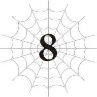
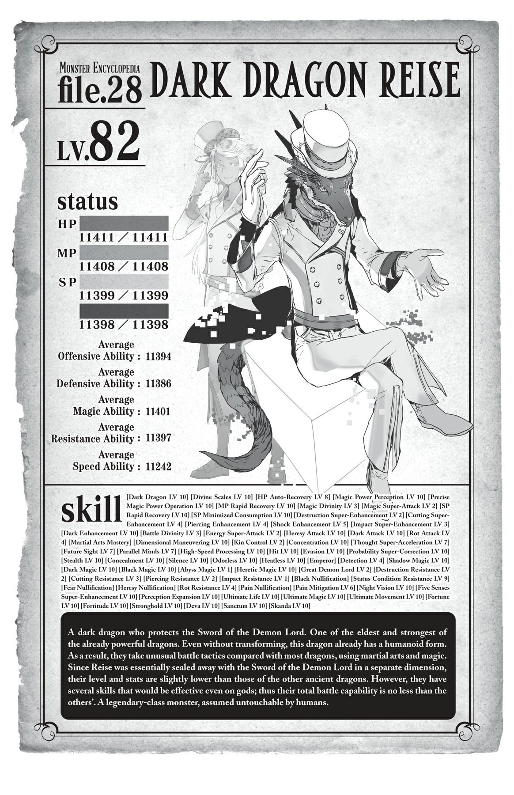

# Hãy dứt điểm mọi chuyện
*(Let’s Wrap Things Up)*

Nhóm Đưa Cô Oka Về Nhà: Nhiệm vụ hoàn thành!

Trời ạ, thỉnh thoảng mọi chuyện thực sự lại diễn ra theo chiều hướng tốt đẹp nhất.

Ngay cả khi chúng tôi rốt cuộc đã đồng ý tiêu diệt tộc elf vào một thời điểm nào đó trên hành trình thương lượng.

Nhưng không phải là chúng tôi buộc phải làm chuyện đó ngay vào phút này. Và vì đối thủ chúng tôi đối đầu là Potimas, tôi nghĩ lựa chọn tốt nhất của chúng tôi là thu thập một đống thông tin, vạch ra một kế hoạch chiến đấu thấu đáo, và nhìn chung là thong thả dành thời gian để chuẩn bị hoàn toàn sẵn sàng.

Suy cho cùng, chuyện này là để cứu cô Oka, và để cứu cả Ma Vương nữa.

Tiêu diệt tộc elf sẽ là một sự giúp đỡ khổng lồ dành cho cô ấy, vì bọn chúng cơ bản giống như những tế bào ung thư của thế giới này vậy. Vì mục tiêu tối thượng của Ma Vương là cứu thế giới này khỏi sự hủy diệt, cô ấy sớm muộn gì cũng phải hạ bệ bọn chúng thôi.

Hừm.

Tộc elf, tộc elf, tộc eeelf.

Thật lòng mà nói, cho dù tôi có ghét cay ghét đắng Potimas đến mức nào đi nữa, tôi cũng chưa từng thực sự nghĩ đến việc quét sạch toàn bộ tộc elf.

Ý tôi là, cho đến tận gần đây, kế hoạch duy nhất của tôi chỉ là lười biếng huấn luyện và học tập mà thôi.

Làm thế nào để lười biếng huấn luyện ư? Xin lỗi, tôi không nhận câu hỏi vào lúc này nhé.

Thực sự, đối với toàn bộ cái vấn đề tận thế của thế giới này, tôi kiểu như không mấy quan tâm lắm miễn là nó có thể chờ cho đến SAU KHI tôi rời khỏi hành tinh này.

Nhưng các bạn biết đấy.

Nếu tôi thực sự muốn giúp đỡ Ma Vương, thái độ đó sẽ không thể chấp nhận được.

Ma Vương muốn cứu thế giới.

Tôi có cảm giác cô ấy hoàn toàn chuẩn bị sẵn sàng tinh thần để hiến tế tính mạng mình nhằm đạt được mục tiêu đó.

Chắc chắn rồi, Ma Vương rất mạnh mẽ, nhưng vẫn có những giới hạn cho những gì cô ấy có thể làm được.

Ví dụ như tộc elf chẳng hạn. Nếu Potimas nghiêm túc, hắn có thể tung ra một số vũ khí điên rồ giống như cái đĩa bay UFO chúng tôi đã hạ bệ cách đây một thời gian.

Được rồi, không phải là "có thể". Hắn CHẮC CHẮN sẽ làm vậy đấy.

Và nó có lẽ sẽ còn tồi tệ hơn cả cái đĩa bay UFO đó nữa cơ.

Kiểu như, chính Potimas đã nói rằng hắn cảm thấy xấu hổ vì đã từng thiết kế ra cái thứ đó mà.

Hoàn toàn không có nghi ngờ gì trong tâm trí tôi rằng hắn đã phát minh ra một loại vũ khí tốt hơn nhiều kể từ đó.

Và nếu đúng là như vậy, Ma Vương không thể đánh bại hắn được.

Cô ấy chắc chắn là một trong những cá thể mạnh nhất thế giới này, nhưng cô ấy không thể tự mình đối đầu với một cái đĩa bay UFO mang theo quả bom có thể quét sạch cả một lục địa—chưa kể đến một loại vũ khí còn TỒI TỆ hơn cả thế nữa.

Cô ấy không thể cứu thế giới này nếu không loại bỏ tộc elf, nhưng cô ấy lại không có cách nào làm được chuyện đó cả.

Nghĩa là đây vốn đã là một nhiệm vụ bất khả thi rồi.

Thế nên tôi cá là Ma Vương đang lên kế hoạch làm tất cả những gì có thể rồi phó thác tương lai của thế giới cho thế hệ tiếp theo.

...Tiếc là cô ấy không biết rằng sẽ không CÓ thế hệ tiếp theo nào nữa cả.

Aaa.

Trời ạ, thế giới này đúng là đống rác rưởi lớn nhất từ trước đến nay mà!

Hừm. Được rồi, làm thôi nào.

Chết dọc đường ư? Không đời nào, tôi sẽ không để chuyện đó xảy ra đâu.

Nợ mạng đền mạng, nợ mạng sống phải trả bằng mạng sống.

Tôi thề trên nấm mồ của mẹ tôi rằng tôi sẽ không để Ma Vương chết miễn là tôi vẫn còn đang thở.

Được rồi, về mặt kỹ thuật thì tôi là kẻ đã giết mẹ mình, nhưng chuyện đó lúc này không quan trọng!

Dù sao đi nữa, đến thời điểm này, tôi sẽ theo đuổi chuyện này cho đến tận cùng.

Và tôi cũng đang hướng tới việc biến nó thành một kết thúc có hậu nữa kìa.

Cứ chờ mà xem—phần vĩ thanh sẽ là cảnh Ma Vương mỉm cười và nói: *Cảm ơn, White! Em là tuyệt nhất đấy. Ta yêu em nhìu nhìu lắm!*

"Ờm, ta chắc chắn sẽ nói cảm ơn, nhưng ta không biết về phần cuối cùng đâu nhé."

"Gì cơơơơ?"

"Oa, tại sao trông ngươi lại thất vọng thế hả? Ngươi có hứng thú với ta theo kiểu đó sao?"

"Có cái nịt ấy."

"Vậy tại sao đó lại là ý tưởng của ngươi về một kết thúc có hậu chứ?"

Thế đấy, tôi đã trò chuyện về tất cả những chuyện này với Ma Vương suốt cả chặng đường.

"Nhân tiện, có phải chỉ có mình ta cảm thấy thế không, hay là ngươi vừa mới thả một quả bom tấn khổng lồ vào giữa đoạn độc thoại nhỏ của mình vậy?"

"Cái gì cơ? Ý ngài là tình yêu bất diệt tôi dành cho ngài sao?"

"Được rồi, nghiêm túc đấy, tại sao ngươi lúc nào cũng phải lái câu chuyện theo hướng đó thế hả?"

Thôi nào—chỉ là trò đùa thôi mà. Thật đấy.

"Ý ngươi là sao khi nói 'sẽ không có thế hệ tiếp theo'?"

Ồ, quả bom tấn đó sao.

Tôi nghĩ có một người có trình độ hơn nên giải thích chuyện đó, chứ không phải tôi.

Thực tế thì, cân nhắc đến tất cả những chuyện điên rồ tôi đang lên kế hoạch thực hiện từ nay về sau, tôi có lẽ dù thế nào cũng nên có một cuộc trò chuyện nhỏ với người này.

"Được rồi, hãy gọi Güli-güli thôi nào."

"Làm ơn hãy giúp ta một việc là đừng bao giờ gọi ông ấy như thế trước mặt ông ấy nhé, được chứ?"

"Đừng lo lắng—tôi sẽ không thể nói được lời nào một khi ông ấy thực sự ở đây đâu, nên đó không phải là vấn đề!"

"Ờ, ta phải nói đó chắc chắn là một vấn đề lớn đấy, nhưng sao cũng được."

Ma Vương thở dài một tiếng rồi đứng dậy khỏi ghế.

Được truyền cảm hứng từ chiếc sofa êm ái chúng tôi đã ngồi khi gặp Giáo hoàng, tôi đã sử dụng tơ của mình để tạo ra một chiếc ghế hoàn toàn mới, siêu cấp êm ái đảm bảo sẽ hủy hoại cuộc đời bạn mãi mãi. Chỉ là cảm giác ngồi vào đó quá đỗi tuyệt vời mà thôi.

Chắc chắn không phải là do tôi tưởng tượng đâu khi thấy Ma Vương mất nhiều thời gian hơn thường lệ một chút chỉ để đứng dậy vừa rồi.

Tôi biết mà, quá ngầu đúng không?

Phải, tôi hiểu mà. Thật khó để đứng dậy khỏi một chiếc ghế êm ái như thế.

Ma Vương đang biến thành một kẻ lười chảy thây hơn nữa rồi đấy!

"Tại sao ta lại cảm thấy như ngươi đang nghĩ những suy nghĩ cực kỳ bất lịch sự về ta lúc này thế nhỉ?"

"Tôi không biết ngài đang nói về cái gì cả."

Ma Vương nheo mắt nhìn tôi một lát, rồi lắc đầu, nhún vai, và bắt đầu bước đi.

Tôi đi theo sau cô ấy xuống tầng hầm của lâu đài.

Dưới đáy của một cầu thang dài điên cuồng là một căn phòng nhỏ, trông có vẻ trống rỗng.

Nhưng mặc dù trông giống như thế chỉ bằng một cái liếc nhìn, vẫn có sự hiện diện mờ nhạt của thuật pháp kiến tạo trên một bức tường.

Ma Vương đặt tay vào chính giữa của nó.

Ngay lập tức, bức tường biến mất cứ như thể nó chưa từng tồn tại ở đó, và một không gian có cùng kích thước với căn phòng ban đầu hiện ra.

...Đây không phải chỉ là một căn phòng ẩn sau bức tường đâu nhé.

Căn phòng mới là một chiều không gian khác.

Nó chỉ tạm thời được kết nối với thực tại này lúc này mà thôi.

Thế nên ngay cả khi bạn có phá vỡ bức tường vừa mới ở đó đi nữa, bạn cũng không thể chạm tới căn phòng này được.

Có một thứ giống như bục đá ở chính giữa căn phòng, và có ai đó đang ngồi trên đỉnh của nó.

Để tóm tắt về người đó, cơ bản thì đó là một người thằn lằn đen thui.

Không, tôi đoán long nhân sẽ chính xác hơn.

Họ có cái đầu rồng, nhưng cơ thể chắc chắn là của con người.

Họ thậm chí còn đang mặc một bộ âu phục và đội một chiếc mũ chóp cao vì lý do nào đó.

"CHÀO NHÉ, CHỊ HAI."

Con rồng trò chuyện với Ma Vương bằng một giọng nói khó hiểu, giống như họ đang ép buộc dây thanh đới của mình phát ra ngôn ngữ loài người vậy.

Tôi không thể đoán được từ giọng nói xem họ là nam hay nữ. Lũ người rồng thậm chí có giới tính không vậy chứ?

"Ta và ngươi có quan hệ huyết thống từ khi nào thế hả? Những người anh chị em duy nhất của ta là những người khác ở trại trẻ mồ côi đó thôi."

"Ồ, ĐỪNG CÓ NHƯ THẾ CHỨ. XÉT VỀ MẶT DI TRUYỀN, CHÚNG TA VỀ MẶT KỸ THUẬT LÀ ANH CHỊ EM MÀ, ĐÚNG KHÔNG?"

"Có thể, nhưng cha mẹ chúng ta đâu có thừa nhận chuyện đó."

"HA-HA-HA! CŨNG ĐÚNG."

Tôi lắng nghe cuộc trò chuyện giữa Ma Vương và long nhân trong im lặng.

Rõ ràng, nó gợi ra rất nhiều câu hỏi, nhưng hỏi thì có lẽ sẽ bất lịch sự.

Tôi vốn đã có một ý niệm mơ hồ về cuộc đời thuở nhỏ của Ma Vương nhờ vào nội dung của kỹ năng [Cấm Kỵ], nhưng có vẻ như việc dò hỏi sẽ là một sự xâm phạm quyền riêng tư.

Ai cũng có một vài bí mật không muốn kể ra mà lị.

Bản thân tôi cũng chẳng háo hức gì để kể cho bất kỳ ai khác nghe về việc mình là thế thân của D, nên tôi không phải là kẻ đi phán xét người khác.

Tôi không có ý định đào bới quá khứ của Ma Vương trừ phi cô ấy tự mình quyết định chia sẻ nó với tôi mà thôi.

"VẬY? CÓ CHUYỆN GÌ ĐƯA CÔ ĐẾN ĐÂY THẾ? HAY CÔ CHỈ GHÉ QUA ĐỂ TRÒ CHUYỆN THÔI?"

"Tất nhiên là không rồi. Ta sẽ không triệu tập ngươi không vì lý do chính đáng nào đâu."

"TA CŨNG NGHĨ VẬY. NHƯNG NHƯ TA ĐÃ NÓI VỚI CÔ TRƯỚC ĐÂY, MA VƯƠNG KIẾM HIỆN TẠI KHÔNG CÒN Ở ĐÂY NỮA ĐÂU."

Ma Vương Kiếm sao? Hửm?

Hừm, nghĩ lại thì, tôi có lẽ đã nhìn thấy điều gì đó về chuyện đó trong thông tin của kỹ năng [Cấm Kỵ] thì phải.

Không phải là tôi đã đọc toàn bộ từ đầu đến cuối, và giờ tôi đã trở thành một vị thần và mất đi các kỹ năng, tôi không thể gọi đống thông tin [Cấm Kỵ] đó quay lại được nữa.

Nhưng tôi đoán long nhân này chắc hẳn đã và đang canh gác thanh kiếm được nói đến.

Thế nên thanh Ma Vương Kiếm này đã được lưu giữ trong một căn phòng ẩn giấu được bảo vệ bởi phép kiến tạo không gian—loại phép mà bạn có lẽ không thể tái tạo lại bằng kỹ năng được đâu nhé.

Nếu nó được đề cập trong thông tin [Cấm Kỵ], nó chắc chắn phải là một vật phẩm quan trọng liên quan đến hệ thống.

Mặc dù nó cũng có thể chỉ là một vật phẩm D nhét vào chỉ để tự giải trí mà thôi.

Nhưng khoan đã, nó không còn ở đó nữa sao?

Chuyện đó chẳng phải kiểu như, rất tồi tệ sao?

"Không, ta cũng không đến đây vì chuyện đó. Ta đến để nhờ ngươi gọi Gülie cho chúng ta."

"GỌI CHỦ NHÂN SAO? CÓ CHUYỆN KHẨN CẤP À?"

"Không khẩn cấp đến mức đó, nhưng có một chuyện chúng ta chắc chắn buộc phải hỏi ông ấy."

"ĐƯỢC RỒI. CHỜ MỘT LÁT."

Đôi mắt của long nhân nhắm lại.

Có phải họ đang giao tiếp với Güli-güli bằng thần giao cách cảm hay gì đó không?

"White, đây là Hắc Long Reise. Họ là một trong những con rồng cổ xưa nhất đấy."

Ồồồ.

Một con rồng thuộc tính bóng tối cơ đấy, hử?

Hơn nữa, nếu là một trong các cổ long, thì đó là cùng loại danh mục với Phong Long Hyuvan ở vùng hoang dã phía nam và Băng Long Nia ở Dãy núi Huyền Bí rồi.

Một con rồng như thế lại đi canh gác thanh Ma Vương Kiếm này sao?
Nó chắc chắn phải là một vật phẩm siêu cấp quan trọng rồi.

"Ma Vương Kiếm là gì vậy?"

Tôi ghé sát vào Ma Vương để lầm bầm câu hỏi vào tai cô ấy.

"Đó là một loại vũ khí chỉ có Ma Vương mới có thể sử dụng được. Ta không biết các tin đồn có thật hay không, nhưng họ nói nó có thể tung ra một đòn thậm chí có thể giết chết cả một vị thần, ngoại trừ việc nó cơ bản chỉ có thể sử dụng được một lần duy nhất mà thôi."

Ờ, nghe có vẻ cực kỳ nguy hiểm đấy chứ!

Ma Vương nói nó có thể không đúng sự thật, nhưng vì cái tên đó xuất hiện trong thông tin [Cấm Kỵ], hầu như chắc chắn chính D mới là kẻ chế tạo ra nó.

Biết tính D, cô ta rất có thể đã nghiêm túc tạo ra một vật phẩm có thể giết chết thần linh thật đấy.

Và loại vũ khí siêu cấp nguy hiểm này hiện tại chỉ đang trôi nổi đâu đó ngoài thế giới ngoài kia sao?

Ngài nói nghiêm túc đấy chứ?!

"Không cần lo lắng đâu. Ma Vương Kiếm cơ bản là một vật phẩm sử dụng một lần. Một khi đã được sử dụng một lần, nó không thể được sử dụng lại trong vòng vài trăm năm hoặc thậm chí cả ngàn năm tiếp theo đâu. Và theo lời Reise, nó vốn đã được sử dụng rồi."

Phù. Tôi đoán mình không cần phải lo lắng về việc có ai đó cố gắng sử dụng nó lên người mình nữa rồi.

Nhưng... nó vốn đã được sử dụng rồi sao?

Một loại vũ khí có thể giết chết thần linh. Vụ nổ vượt qua chiều không gian vào lớp học đó để cố gắng giết chết D. Chỉ có Ma Vương mới có thể sử dụng được nó.

Phải rồi, các mảnh ghép đều có vẻ khớp lại với nhau rồi đấy.

Vậy là D đã bị tấn công bằng chính một vật phẩm do cô ta tự tay chế tạo ra sao...?

Thế thì bạn không khỏi cảm thấy tội nghiệp cho những người tái sinh đã bị cuốn vào vụ nổ đó rồi.

Mặc dù trong trường hợp của tôi, phiên bản này của tôi thực sự không tồn tại cho đến khi tôi tái sinh ở đây, nên tôi thực sự không có gì để phàn nàn cả.

Dù sao đi nữa, trong lúc tôi đang nói chuyện về việc đó với Ma Vương và các thứ, đột nhiên có một sự xáo trộn trong không gian.

Có ai đó chuẩn bị dịch chuyển đến đây.

Chà, không thực sự là "ai đó", vì người đó chỉ có thể là Güli-güli mà thôi.

"Ta nghe nói các ngài muốn nói chuyện với ta."

Ngay khi vừa xuất hiện, Güli-güli lập tức đi thẳng vào vấn đề, và Ma Vương cũng đáp lại một cách cộc lốc không kém.

"Phải. White bảo với ta là sẽ không có thế hệ tiếp theo nữa sao? Chuyện đó nghĩa là thế nào hả?"

Trước câu hỏi đó, khuôn mặt của Güli-güli vặn vẹo một cách cay đắng, và ông ta lườm tôi một lát.

Thôi nào! Đừng nhìn tôi như thế chứ.

Tất cả những gì ông thực sự yêu cầu tôi làm lần trước chỉ là đừng kể cho Ma Vương nghe về thung lũng ẩn giấu phía sau Dãy núi Huyền Bí mà thôi, được chứ?

Tôi không hề đề cập đến phần đó, và hơn thế nữa, đó chỉ là một lời thỉnh cầu hơn là một lời hứa thực sự mà thôi, nên đâu phải tôi đã thề sẽ giữ bí mật hay gì đó đâu đúng không?

Chẳng có ai bảo tôi rằng điều ông thực sự muốn giữ bí mật là việc sẽ không có thế hệ tiếp theo sau chuyện này cả, được chứ?

Được chứ? Được chứ? Được rồi.

Güli-güli thở dài một tiếng thườn thượt, rõ ràng là đã bỏ cuộc, và bắt đầu giải thích.

"Những con người sống ở thế giới này được tái sinh đi tái sinh lại ở chính thế giới này. Bình thường, chuyện này sẽ không khả thi, nhưng hệ thống đã bóp méo trật tự tự nhiên của vạn vật. Và sự việc phi tự nhiên này chỉ càng làm mọi thứ thêm méo mó, cho đến khi cuối cùng các đường khâu bắt đầu rách ra. Linh hồn của các cư dân thế giới này đang dần bị mài mòn dưới sức nặng của những lần tái sinh lặp đi lặp lại này, tất cả là vì họ bị ép buộc phải gánh vác những gánh nặng không cần thiết như các kỹ năng. Nếu linh hồn của họ tiếp tục suy kiệt, họ cuối cùng sẽ bị tiêu diệt hoàn toàn, điều đó dĩ nhiên nghĩa là họ không thể tái sinh được nữa. Và có những dấu hiệu cho thấy chuyện này vốn đã bắt đầu xảy ra rồi."

Nó giống như việc bạn giặt quần áo đi giặt lại nhiều lần vậy, cho đến khi cuối cùng chúng trở nên quá sờn rách để mặc.

Nếu bạn tiếp tục nhuộm, tẩy, rồi lại nhuộm lại chúng trên hết thảy những chuyện đó, chúng sẽ sờn rách nhanh hơn nữa.

Theo cùng một lối logic đó, linh hồn của những con người liên tục tái sinh đang bắt đầu suy yếu.

Kỹ năng giống như màu nhuộm vậy: Nó có vẻ tuyệt vời ngay sau khi bạn mới thêm vào lần đầu, nhưng nếu bạn liên tục tẩy sạch nó rồi nhuộm đi nhuộm lại cùng một mảnh quần áo đó, bạn sẽ rút ngắn tuổi thọ của nó.

Mỗi khi một linh hồn tái sinh, các kỹ năng nó sở hữu ở kiếp trước sẽ bị tước đoạt đi.

Rõ ràng, nếu bạn lặp lại điều đó đủ số lần, linh hồn cuối cùng sẽ bị đổ vỡ mà thôi.

Và các dấu hiệu của sự đổ vỡ đó vốn đã bắt đầu rồi.

Thung lũng Güli-güli muốn giữ bí mật với Ma Vương chính là nơi ông ta bảo vệ những người có linh hồn đang chạm tới giới hạn của họ.

Nó giống như một hố cát nhỏ nơi ông ta ngăn chặn quái vật bên ngoài, cấm đoán chiến đấu, và cố gắng giữ cho mọi người không nhận thêm bất kỳ kỹ năng nào nữa, tất cả là để cố gắng kéo dài tuổi thọ cho linh hồn đã kiệt quệ của họ.

Sau lời giải thích của Güli-güli, tâm trạng của Ma Vương có vẻ nặng nề vô cùng.

"Tại sao ông không kể cho ta nghe chứ?"

"Kể cho ngài nghe thì có ích lợi gì chứ?"

Cả hai người bọn họ đều chìm vào một sự im lặng nặng nề như cũ.

"Hãy nói cho ta biết sự thật đi. Nếu ta tiếp tục hành động với tư cách là Ma Vương, liệu ta có thể thu hồi đủ năng lượng MA không?"

"Không."

Güli-güli phản hồi ngay lập tức.

Ma Vương cúi đầu xuống, đôi vai cô ấy run rẩy lên.

Cô ấy trở thành Ma Vương với sự sẵn lòng hy sinh cả tính mạng mình để cứu thế giới.

Với niềm tin kiên định không thể lay chuyển rằng cô ấy sẽ làm những gì buộc phải làm, ngay cả khi điều đó nghĩa là phải miễn cưỡng đóng vai một kẻ phản diện và bị toàn bộ ma tộc căm ghét.

Nhưng Güli-güli vừa mới nói rằng chuyện đó vẫn là không đủ.

Thế giới này đang gặp rắc rối lớn đến mức những quyết định khó khăn của Ma Vương cơ bản chẳng có tác dụng gì cả.

Đúng vậy, thế giới đang thực sự đứng trước nguy cơ diệt vong.

Đến mức không có cách nào logic để cứu được nó cả.

Vậy tại sao không cứu nó theo một cách phi logic chứ?

"Chúng ta chỉ việc phá hủy hệ thống là xong."

Cả Güli-güli lẫn Ma Vương đều nhìn tôi đầy hoài nghi.

Ngay cả Reise, người nãy giờ vẫn im lặng lắng nghe, cũng quay sang nhìn chằm chằm vào tôi. Mặc dù tôi không thể đọc được nét mặt của cái bản mặt thằn lằn đó đang biểu lộ cảm xúc gì.

"Ngươi nói thế nghĩa là sao?"

Güli-güli hỏi câu hỏi mà chắc hẳn tất cả bọn họ đều đang nghĩ trong đầu.

Thế giới này được duy trì bởi hệ thống, nên tôi cũng không thể trách bọn họ khi nhìn tôi như thể tôi bị mất trí khi đề xuất phá hủy nó.

Nhưng nghĩ lại mà xem—ý tôi là, thực sự nghĩ kỹ lại đi.

Hệ thống này được tạo ra bởi không ai khác ngoài D.

Bạn biết đấy, tà thần siêu cấp xấu tính tự phong ấy?

Cái tên khốn thối tha đó chính là kẻ đã thiết kế nên toàn bộ hệ thống này.

Sẽ thật vô nghĩa nếu chúng ta cố gắng đối đầu trực diện với nó.

Không, chắc chắn phải có một loại mánh khóe bẩn thỉu nào đó mà chúng ta có thể lợi dụng.

Hiểu rõ tính cách của D, tôi chắc chắn có một lối thoát khác, thứ gì đó được giấu kín theo một cách cực kỳ hèn hạ mà bình thường bạn sẽ không bao giờ tìm ra được.

Tôi đã thề là sẽ cứu Ma Vương, nhớ không?

Nên tôi đã suy nghĩ về cách để cứu lấy thế giới này.

Và cuối cùng, kết luận mà tôi đạt được chính là chúng ta phải phá vỡ hệ thống.

Tôi nuốt nước bọt và cố gắng trấn tĩnh bản thân trước khi nói tiếp.

Với một chủ đề siêu cấp nghiêm túc thế này, ngay cả một đứa dốt giao tiếp như tôi cũng biết rằng việc nói ngắn gọn sẽ không giải quyết được vấn đề.

Nhất là khi số phận của Ma Vương đang phụ thuộc vào màn thuyết trình bán hàng này.

"Hệ thống là một thuật kiến tạo khổng lồ nâng đỡ thế giới này. Nó tái tạo hành tinh đã bị tàn phá này, bóp méo quy luật sinh tử, và ban cho sức mạnh siêu nhiên được gọi là kỹ năng."

Hệ thống thực chất chỉ là một thuật kiến tạo vĩ đại.

Chức năng chính của nó là giữ cho hành tinh đổ nát này tiếp tục tồn tại.

Nhưng nó cũng có một vài chức năng khác.

Thành thật mà nói, nếu tất cả những gì bạn muốn chỉ là phục hồi thế giới, bạn không thực sự cần tất cả những thứ phức tạp đó.

Hệ thống ép buộc con người phải luân hồi ở thế giới này đi luân hồi lại nhiều lần, giam cầm họ tại đây.

Nó khuyến khích họ cài đặt thật nhiều gói mở rộng linh hồn được gọi là kỹ năng, sau đó thu hồi các kỹ năng đó khi họ chết và tái sinh, biến chúng thành năng lượng MA để giúp duy trì sự sống cho thế giới.

Về cơ bản: Hệ thống thực chất là một cỗ máy dùng con người làm nhiên liệu.

Nhưng như tôi vừa nói, nếu chỉ muốn hành tinh hồi phục, bạn không cần phải làm việc đó theo một cách vòng vo như vậy.

"Ông có biết cần bao nhiêu năng lượng để duy trì tất cả các chức năng phức tạp của hệ thống không?"

Người duy nhất có thể trả lời chính xác câu hỏi đó có lẽ là Güli-güli, vì ông ta là một vị thần có thể thực sự sử dụng thuật kiến tạo.

Nhưng có vẻ như những gì tôi đang cố gắng nói cũng đã truyền tải được đến Ma Vương.

"Nếu chúng ta dùng nguồn năng lượng đó cho việc phục hồi thay thế, liệu có đủ không?" cô ấy hỏi.

Hệ thống bóp méo trật tự tự nhiên của sinh tử luân hồi ở thế giới này, tăng cường sức mạnh cho con người bằng thuật kiến tạo lố bịch được gọi là chỉ số, và thậm chí chất đống kỹ năng lên như một cách để vắt kiệt thêm năng lượng từ các linh hồn.

Rõ ràng, việc vận hành một thuật kiến tạo phức tạp đến mức lố bịch như vậy phải tiêu tốn một lượng năng lượng tương ứng.

Chúng ta chỉ cần phá vỡ các phần không cần thiết của hệ thống, lấy nguồn năng lượng được giải phóng từ đó, và dồn toàn bộ vào phần phục hồi hành tinh.

Hệ thống giữ chúng ta sống, nhưng giờ chúng ta sẽ tiêu diệt hệ thống.

Bình thường, không một người tỉnh táo nào lại đi đề xuất cách tiếp cận đó.

Nhưng chúng ta đang nói về D ở đây. Tôi cá là cô ta đã cố tình đưa vào một phương pháp tục tĩu mà đáng lẽ không ai có thể tìm ra hay thực hiện được.

Tuy nhiên, thật không may là Ma Vương chỉ đúng một nửa.

"Với tình trạng hiện tại của chúng ta thì không. Chưa được đâu."

Đúng vậy. Khi tôi tính toán lượng năng lượng trong hệ thống và so sánh nó với tình trạng tàn phá hiện tại của hành tinh, tôi xác định rằng nó sẽ không đủ để khôi phục hoàn toàn hành tinh này.

Nếu chúng ta phá vỡ các bộ phận thu hồi năng lượng của hệ thống, chúng ta sẽ không thể tạo ra thêm năng lượng để sửa chữa hành tinh nữa, nên việc phục hồi sẽ không bao giờ hoàn thành.

Nói cách cách khác, phương pháp bí mật này chỉ hoạt động một khi chúng ta đã tích lũy đủ năng lượng để khôi phục hoàn toàn hành tinh.

"Chúng ta chỉ cần bù đắp phần còn thiếu mà thôi."

Thế giới này vẫn còn các kỹ năng, một phương pháp sản sinh năng lượng bằng cách sử dụng sức mạnh của linh hồn.

Chúng ta cần con người nâng cao kỹ năng của họ, tích lũy thêm năng lượng và sau đó để hệ thống thu hồi nó—nói cách khác, chúng ta cần họ chết.

"Ta hiểu rồi. Vậy thì ta đoán chuyện đó không làm thay đổi những gì ta buộc phải làm."

Những gì Ma Vương đã và đang cố gắng thực hiện là châm ngòi cho một cuộc chiến tranh giữa con người và ma tộc, ép buộc cả hai bên phải nâng cao kỹ năng của mình, và sau đó thu hồi thêm năng lượng cho thế giới khi họ ngã xuống trong trận chiến.

Vì chúng ta cần thu thập nhiều năng lượng hơn nữa, kế hoạch này vẫn hoạt động cực kỳ hoàn hảo.

Khác biệt duy nhất là trong khi Ma Vương lên kế hoạch trả lại nguồn năng lượng đó cho hệ thống đang thiếu hụt năng lượng theo cách thông thường, tôi lại có những kế hoạch khác về cách sử dụng nó.

"Khoan đã. Về mặt lý thuyết thì chuyện đó có vẻ khả thi, nhưng D sẽ không bao giờ đứng nhìn khi có ai đó cố tình phá hủy hệ thống đâu."

Một lời phản đối từ Güli-güli.

Cũng hợp lý thôi. Vì về mặt kỹ thuật, ông ta chịu trách nhiệm duy trì hệ thống với tư cách là một quản trị viên, nên ông ta có lẽ không thể dễ dàng chấp nhận kế hoạch này, ngay cả khi ông ta hiểu logic đằng sau nó.

Và tôi chắc chắn ông ta nghĩ rằng cấp trên của mình, D, sẽ nổi giận nếu chúng tôi làm điều gì đó như thế.

Nhưng tôi có thể khẳng định chắc chắn điều này.

"Chuyện đó sẽ không phải là vấn đề đâu."

Ý tôi là, chúng ta đang nói về D đấy, biết chứ?

Cô ta sẽ không gặp vấn đề gì với việc hệ thống bị phá hủy miễn là cô ta nghĩ chuyện đó sẽ mang tính giải trí hơn.

Nếu có gì xảy ra, tôi cá là D đã và đang chờ đợi Güli-güli thực hiện một bước đi nguy hiểm như vậy, chỉ để xem kịch hay mà thôi.

Một kế hoạch điên rồ như phá hủy hệ thống chỉ khả thi đối với một vị thần như Güli-güli.

Nếu D thực sự cố tình đưa lựa chọn đó vào hệ thống, tôi nghĩ có thể đoán chắc rằng cô ta đang hy vọng Güli-güli sẽ chọn nó.

"Nhưng..."

"Sẽ ổn thôi mà. Tôi hứa đấy."

Bên cạnh đó, giờ đây khi D đã bị cô Hầu Gái lôi đi rồi, cô ta dù thế nào cũng không thể can thiệp vào chuyện của chúng tôi nữa.

Khi mèo đi vắng thì chuột sẽ tung hoành thôi!

Cô ta có thể nổi giận sau này, nhưng tôi không quan tâm.

Và tôi khá chắc chắn là cô ta cũng sẽ không giận đâu.

Nên tôi cứ khăng khăng là sẽ ổn thôi.

"Nhưng dù thế—"

"Thành thật mà nói, chuyện này cơ bản là do sự tắc trách của ông với tư cách là quản trị viên đấy."

Trước câu nói đó, khuôn mặt của Güli-güli sụp đổ.

Trời ạ, tôi có ác quá không nhỉ?

Nhưng đó là sự thật mà! Nếu Güli-güli làm tốt công việc của mình hơn, chúng ta đã không rơi vào tình cảnh này.

Ngay cả khi việc nói toạc móng heo ra khiến tôi trở thành kẻ tồi tệ nhất, điều đó cũng không thay đổi được sự thật!

Đặc biệt là khi những gì tôi đề xuất ngay từ đầu là ông ta cơ bản hãy từ bỏ vị trí quản trị viên của mình để chúng ta có thể phá hủy hệ thống.

"Tôi sẽ không yêu cầu ông giúp đỡ. Nhưng đừng có cố cản chúng tôi."

Trở ngại lớn nhất đối với kế hoạch này chính là khả năng Güli-güli can thiệp.

Những người duy nhất trên thế giới này có khả năng đánh bại tôi vào lúc này chỉ có Ma Vương, Potimas, và Güli-güli.

Và cái tên cuối cùng kia chính là người duy nhất tôi có thể khẳng định không một chút nghi ngờ là mạnh hơn tôi rất, rất nhiều.

Nếu Güli-güli cố gắng ngăn cản, kế hoạch của chúng tôi coi như tiêu đời.

"HÍ HÍ. XEM RA LẦN NÀY NGÀI THUA RỒI NHỈ, CHỦ NHÂN?"

Reise chọn đúng thời điểm này để cuối cùng cũng cất tiếng nói.

"Ta đoán vậy."

Güli-güli thở dài một tiếng thật sâu, trông giống hệt như một nhân viên văn phòng đang kiệt sức.

"Được rồi. Ta sẽ không ngăn cản các ngài... Không, chính vì thất bại của ta mà chúng ta mới rơi vào tình cảnh khó khăn này. Ta không thể sử dụng trực tiếp sức mạnh của mình cho mục đích này, nhưng ta sẽ hỗ trợ các ngài hết mức có thể."

Ông ta nở một nụ cười cay đắng.

Ồ? Ồôồ!

Tôi vốn dĩ đã thấy vui mừng khi ông ta đồng ý không can thiệp rồi, thế mà ông ta lại thực sự định giúp đỡ.

Lời nói mỉa mai của tôi có vẻ lại có tác dụng quá mức cần thiết rồi hả?

Dù thế nào đi nữa, tôi vẫn tính đây là một chiến thắng!

"Ồ, thật sao? Vậy thì ông có thể, kiểu như, tập hợp một lũ rồng và phi long các thứ có thể biến thành dạng người để tạo thành một quân đội không?"

Ma Vương giáng ngay cho ông ta một yêu cầu siêu to khổng lồ ngay từ bước đầu tiên.

Oa! Cô ấy hoàn toàn lên kế hoạch bóc lột không chỉ Güli-güli mà ngay cả đám thuộc hạ của ông ta đến tận xương tủy!

Chà, THẾ MỚI LÀ độc ác chứ!

Cô ấy tận dụng mọi thứ và mọi người có thể, bắt tất cả bọn họ làm việc, rồi tự mình ru rú ở nhà.

Đúng chuẩn NEET tối thượng!

"Ông có thể làm Quân đoàn 9. Ta sẽ tước bỏ danh hiệu của thống lĩnh hiện tại và giao cho ông quản lý thay thế."

"Như ngài muốn. Ta sẽ tuân theo mệnh lệnh của ngài, trong phạm vi hợp lý."

Oa, cái yêu cầu vô lý đùng đoàng của cô ấy thực sự đã được chấp thuận kìa.

Nghiêm túc đấy chứ? Một quản trị viên mà lại được phép đứng về một bên trong những chuyện thế này sao?

Chà, tôi đoán điều đó chỉ cho thấy Güli-güli cảm thấy mắc nợ Ma Vương nhiều đến mức nào thôi.

"Reise. Ngươi cũng đi cùng đi."

"Ồ?"

"Nếu Ma Vương Kiếm không còn ở đây nữa, thì ngươi cũng không cần phải ở lại đây làm gì."

"TA HIỂU RỒI. TA VỐN ĐÃ QUEN VỚI KHÔNG GIAN NƠI THỜI GIAN NGƯNG ĐỌNG NÀY, NHƯNG NẾU NGÀI BẢO TA ĐI, TA SẼ THEO CHỦ NHÂN CỦA MÌNH."

Hửm. Hóa ra thời gian bình thường được dừng lại bên trong căn phòng này sao?

Tôi đoán điều đó giải thích cách Reise sinh sống trong chiều không gian trống rỗng này.

Nếu bạn bị đóng băng thời gian, trừ khi có ai đó triệu hồi căn phòng lên thế này, bạn sẽ không cần thức ăn hay bất cứ thứ gì khác.

Dù vậy, quả đúng là phong cách của D khi thản nhiên kiến tạo ra một thứ lố bịch như một căn phòng nơi thời gian ngưng đọng.

Hình dáng của Reise bắt đầu thay đổi thành một con người, bằng cách sử dụng một loại kỹ thuật nào đó.

Hình dạng con người kết quả có làn da ngăm đen và ngoại hình phi giới tính.

Bộ âu phục và chiếc mũ lụa trông giống như trang phục của nam giới, nhưng chúng cũng có thể dễ dàng phù hợp với một người phụ nữ tuyệt đẹp.

Nên ngay cả ở dạng người, ngươi cũng không có giới tính rõ ràng sao?!

"Cho phép tôi tự giới thiệu lại bản thân. Tôi là Hắc Long Reise. Vì tôi đã sống trong thời gian ngưng đọng suốt thời gian dài như vậy, nên tôi hoàn toàn tràn trề sức trẻ so với những con cổ long khác. Ngài có thể tin tưởng vào tôi bất cứ khi nào ngài muốn."

Reise đưa ra lời giới thiệu này với một nụ cười nhăn nhở.

Là do tôi tưởng tượng ra, hay loài rồng thường có tính cách cực kỳ cường điệu nhỉ?

Hay là tôi chỉ tình cờ gặp phải những con kỳ quặc nhất?

Ngoài ra, tôi đoán bọn họ có thể nói chuyện bình thường khi ở dạng người.

"Ta sẽ đi thu thập rồng và phi long từ mỗi vùng đất có thể biến hình. Ta sẽ không mang tất cả bọn họ đến đây, vì họ vẫn cần phải canh giữ lãnh thổ tương ứng của mình, nhưng đó vẫn sẽ là một số lượng đáng kể. Ariel, nếu không có gì khác, làm ơn hãy sắp xếp chuẩn bị tiếp nhận bọn họ trước khi ta trở lại nhé."

"Được rồi."

Trời ạ. Tôi hoàn toàn có thể biết chắc chắn rằng Ma Vương không hề có ý định tự mình làm việc đó.

Cô ấy có lẽ sẽ đùn đẩy nhiệm vụ đó cho Balto.

Cố gắng lên nhé, người anh em.

"Chủ nhân, tôi sẽ đi cùng ngài. Tôi muốn được ngắm nhìn thế giới bên ngoài một chút."

"Nếu ngươi muốn. Ngươi đã phải nhận lấy vai diễn khó chịu khi bị bỏ lại đông cứng trong thời gian suốt thời gian dài như vậy. Từ bây giờ, hãy làm những gì ngươi muốn, trong phạm vi vai diễn tiếp theo mà ngươi được giao."

"Ồ, cảm ơn ngài."

Reise trông thực sự vui mừng.

Tôi không có cách nào biết được cảm giác một mình trong một căn phòng nhỏ nơi thời gian đứng im sẽ thế nào.

Nhưng tôi nghi ngờ có ai lại muốn làm việc đó.

Ấy thế mà, Reise lại không có lựa chọn nào khác, vì đó là vai diễn mà họ được ban cho.

Thế giới này luôn có cách hy sinh những người như vậy để tiếp tục duy trì.

Chuyện đó bao gồm cả Ma Vương và Güli-güli nữa.

Tôi sẽ phá hủy cái lối sống tồi tệ đó.

"Được rồi, cả đội! Hãy cứu lấy thế giới nào!"

Ma Vương hét lên bằng một giọng nói cố ý tỏ ra tràn đầy năng lượng.

Vì họ đã tìm thấy con đường phía trước sau khi không thể nhìn thấy ánh sáng suốt thời gian dài, cô ấy và Güli-güli trông đều vui vẻ hơn thường ngày.

Tôi...

Tôi đã không nói dối.

Nếu chúng ta sử dụng hệ thống như một khoản bồi hoàn, chúng ta có thể nhận được lượng năng lượng mà thế giới cần.

Có điều, phá vỡ hệ thống đồng nghĩa với việc loại bỏ các kỹ năng và chỉ số.

Điều đó nghĩa là chúng sẽ bị cưỡng bức tước đoạt ra khỏi các linh hồn mà chúng đã gắn kết vào.

Nên khi chúng ta thu thập toàn bộ nguồn năng lượng đó, nó sẽ cực kỳ khắc nghiệt đối với linh hồn của những người có nhiều kỹ năng và chỉ số cao.

Tôi đã không nói dối.

Nếu chúng ta phá vỡ hệ thống, chúng ta có thể cứu thế giới.

Chỉ là, đổi lại, một lượng khổng lồ con người sống ở thế giới này sẽ phải chết.

Tôi chỉ giữ phần đó cho riêng mình mà thôi, chỉ vậy thôi.

Nếu điều đó nghĩa là cứu được Ma Vương và cô Oka, tôi không quan tâm nếu mình phải hy sinh hầu hết con người trên thế giới này để làm được việc đó.

Mọi chuyện chỉ đơn giản là thế mà thôi.

---

[◀ Chương trước: Người cô giáo chỉ muốn những gì tốt nhất cho học sinh](interlude_a_teacher_wants_only_what_is_best_for_her_students.md) | [Chương tiếp theo: Vĩ thanh: Tà Thần ra đời như thế đó ▶](epilogue_thus_an_evil_god_is_born.md)
