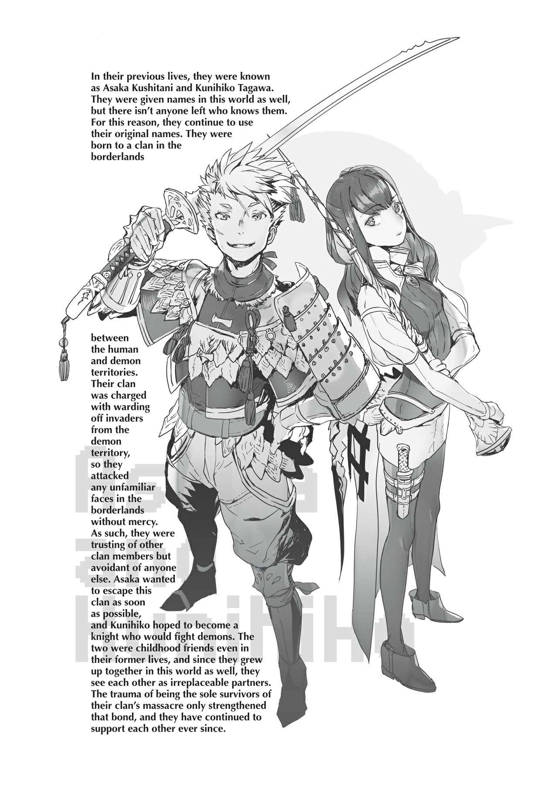
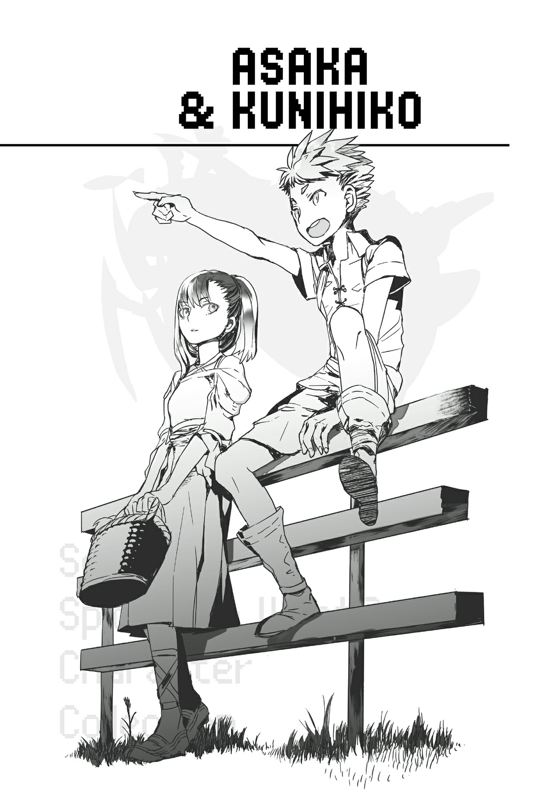

# Đoạn phụ: Asaka và Kunihiko
*(Interlude: Asaka and Kunihiko)*

Tên tôi là Kushitani Asaka.

Tôi cũng được đặt một cái tên mới ở thế giới này, nhưng tôi có cảm giác mơ hồ rằng mình sẽ không bao giờ được gọi bằng cái tên đó nữa.

Những người duy nhất gọi tôi bằng cái tên đó là những người trong bộ tộc của chúng tôi; suy cho cùng, tôi và người bạn tái sinh Tagawa Kunihiko vẫn gọi nhau bằng tên cũ từ kiếp trước.

Và bây giờ khi tất cả mọi người trong bộ tộc ngoại trừ Kunihiko và tôi đều đã chết, tôi chắc chắn mình sẽ không còn được nghe thấy cái tên mới kia nữa.

Vì lý do nào đó, chúng tôi đã được tái sinh.

Tôi không thực sự hiểu tại sao.

Kunihiko kể với tôi rằng cái kiểu "tái sinh dị giới" này là một thể loại light novel và các thứ rất phổ biến kiếp trước, nhưng khi tôi thực sự tự mình trải nghiệm nó, tôi chỉ nghĩ mình đang gặp phải một cơn ác mộng tồi tệ mà thôi.

Nhưng đó là sự thật: tôi thức dậy vào một ngày nọ dưới hình hài một đứa trẻ sơ sinh ở một thế giới xa lạ.

Không thể mô tả chính xác nỗi đau khổ và bối rối tôi cảm thấy khi đó.

Và khi tôi nhận ra rằng Kunihiko cũng ở ngay đó và đã chứng kiến mọi khoảnh khắc tôi khóc nhè đến chảy nước mắt nước mũi... chà, tôi suýt chết vì ngượng.

Dù vậy, đó vẫn là một niềm an ủi to lớn khi có một người bạn ở ngay cạnh bên trong cùng một hoàn cảnh khốn cùng.

Kunihiko và tôi được tái sinh vào một bộ tộc cướp đường.

Gợi nhớ đến những người du mục Mông Cổ, bọn họ sống trong những chiếc lều, rong ruổi khắp vùng biên giới nhân-ma để tìm kiếm con mồi. Họ tấn công bất kỳ ma tộc nào họ phát hiện, cướp đoạt tất cả đồ đạc của họ, và báo cáo việc giết chóc đó cho đế quốc để nhận tiền thưởng.

Một loại hình cướp bóc hợp pháp kỳ lạ.

Tôi muốn rời khỏi một nơi như vậy càng nhanh càng tốt để sống một cuộc sống bình thường.

Kunihiko luôn muốn dấn thân vào một cuộc phiêu lưu, nhưng tôi chỉ muốn sự bình thường.

Tôi thèm khát tìm được một nơi an toàn để định cư trong hòa bình.

Nhưng tôi chưa bao giờ tưởng tượng nổi đây lại là cách chúng tôi rời khỏi bộ tộc.

"Tớ thấy một cái rồi."

"...Ừ."

Phía trước, một thị trấn đang dần hiện ra trước mắt.

Bộ tộc của chúng tôi đã bị tàn sát, nhưng may mắn thay xe ngựa và ngựa vẫn còn nguyên vẹn.

Vì vậy, sau khi chúng tôi đào mộ và chôn cất những người còn lại trong bộ tộc, chúng tôi đóng gói tất cả hành lý có thể vào xe ngựa và lên đường đến thị trấn gần nhất.

Chẳng còn ý nghĩa gì nếu cứ tiếp tục ở lại đó nữa.

Khi chúng tôi đến cổng thị trấn, chúng tôi giải thích tình hình cho lính gác.

Người lính gác trông có vẻ bối rối nhưng vẫn cho chúng tôi vào thị trấn mà không thu phí vào cửa thông thường, đồng thời khuyên chúng tôi nên đến gặp nhà thờ.

Nhà thờ sao...?

Tôi không biết chúng tôi sẽ làm gì tiếp theo, nhưng tôi đoán hiện tại chúng tôi cứ đến đó trước đã.

"Chuẩn bị đi làm nhiệm vụ à, Gotou?"

"Ừ."

Khi xe ngựa của chúng tôi đi tiếp trên đường, tôi thấy hai người đàn ông đang trò chuyện gần đó.

Kunihiko cũng đang nhìn họ.

"...!"

"Hả? A! Khoan đã!"

Kunihiko đột ngột nhảy xuống khỏi xe ngựa.

Sau đó cậu ấy chạy đến chỗ một trong hai người đàn ông và chộp lấy tay ông ta.

"Hử? Gì thế hả thằng nhóc?"

"Gotou! Katana!" Kunihiko hét lên. "Ông có phải là đồng hương của bọn tôi không?!"

"Hả?"

Gotou? Katana?

Nhìn kỹ hơn, tôi thấy người đàn ông tên Gotou có một thanh kiếm giống katana dắt ở thắt lưng.

Và rồi tôi cuối cùng cũng nhận ra ý của Kunihiko.

Tên ông ta là Gotou, và ông ta có một thanh katana.

Có khi nào ông ta cũng là người Nhật không?

Ông ta chắc chắn trông không giống người Nhật, nhưng nghĩ lại thì, chúng tôi lúc này cũng thế mà.

Có lẽ ông ta cũng là một người tái sinh giống như chúng tôi.

"Này, nhóc đang nói cái gì thế hả?"

Nhưng niềm hy vọng mong manh đó nhanh chóng bị dập tắt.

Anh Gotou trông thực sự bối rối.

Kunihiko cố gắng nói chuyện với ông ta bằng vài từ tiếng Nhật xen lẫn nhưng vẫn không có phản ứng gì.

"Làm ơn hãy nhận cháu làm đệ tử!"

Nhưng ngay cả khi biết ông ta không phải là người Nhật, Kunihiko dường như vẫn cảm thấy rất mạnh mẽ về cuộc gặp gỡ này.

Tại sao cậu ấy lại yêu cầu một người hoàn toàn xa lạ nhận mình làm đệ tử chứ?

"Ờ... khoan đã. Tôi nên làm gì ở đây bây giờ hả? Tôi phải đi làm nhiệm vụ ngay bây giờ đây này. Ờ, tôi nên làm gì đây?"

Gotou trông thực sự lúng túng.

Nhưng có vẻ như ông ta không có ý định quay lưng bỏ mặc chúng tôi. Bằng cách nào đó, điều đó khiến con đập ngăn giữ mọi cảm xúc của tôi vỡ òa, và tôi đột ngột bật khóc nức nở.

"Hả? Ờ... khoan đã nào. Đừng khóc chứ cô bé. Không sao đâu mà, thấy chưa?"

Sự tử tế của anh Gotou khi đưa tay ra an ủi tôi bất chấp sự bối rối của ông ta đã có tác động sâu sắc đến tôi.

Toàn bộ bộ tộc của chúng tôi đột nhiên bị sát hại, không rõ lý do.

Chúng tôi không biết phải làm gì tiếp theo, nên chúng tôi đã đến thị trấn này, nhưng dĩ nhiên chúng tôi chẳng có nơi nào để đi cả.

Khoảnh khắc anh Gotou thể hiện sự tử tế với chúng tôi, lần đầu tiên tôi cảm thấy như mình vẫn có thể tiếp tục tiến bước.

Đây là một thế giới tàn nhẫn, không còn nghi ngờ gì nữa, nhưng có lẽ nó không hoàn toàn vô vọng sau tất cả.

Tôi không thể nghĩ về bất kỳ điều gì trong số đó lúc này. Tôi chỉ muốn khóc cho thỏa thích một lần nữa mà thôi.

Tôi chắc chắn mình sẽ sống để hối hận về khoảnh khắc đáng xấu hổ này, nhưng hiện tại tôi không thể bận tâm nổi nữa.

Cuối cùng, lính gác nghe thấy tiếng ồn ào và dẫn một người từ nhà thờ đến.

Các giáo sĩ đồng ý chăm sóc chúng tôi trong một thời gian.

Tôi vô cùng biết ơn.

"Tớ sẽ trở nên mạnh mẽ hơn."

"Ừ."

"Tên Merazophis đó chắc chắn là một tên ma tộc đúng không? Tớ sẽ trở nên đủ mạnh để đánh bại hắn vào một ngày nào đó. Tớ thề đấy."

"Ừ."

Tôi không biết liệu điều đó có thực sự khả thi hay không, và tất cả những gì tôi muốn chỉ là được sống trong hòa bình mà không phải lo lắng về tất cả những chuyện đó. Nhưng khao khát không muốn bị chia lìa khỏi Kunihiko còn mạnh mẽ hơn thế nhiều.

Nên bất kể cậu ấy quyết định làm gì, tôi cũng sẽ đi theo cậu ấy.

Nhưng hiện tại, tôi chỉ muốn khóc thật to như đứa trẻ con mà tôi đang khoác lên mình lúc này mà thôi.

---

[◀ Chương trước: Đoạn phụ: Người hầu Ma cà rồng bị hủy diệt](interlude_the_vampire_servants_annihilation.md) | [Chương tiếp theo: Chương 7: Hãy đưa ra lời đe dọa ▶](07_lets_make_a_threat.md)
