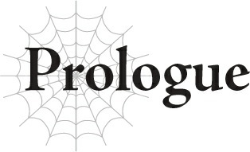

# Nữ thần ra đời như thế đó
*(Prologue: Thus a Goddess Was Born)*

Ngày xửa ngày xưa…

Thế giới khi ấy đã vô cùng tân tiến.

Máy móc ở khắp mọi nơi giúp cuộc sống của con người trở nên dễ dàng hơn.

Thế nhưng, con người thời cổ đại đã phạm phải một sai lầm nghiêm trọng.

Họ đã chạm tay vào nguồn sức mạnh cấm kỵ, năng lượng MA, thứ đáng lẽ ra họ không bao giờ được phép đụng tới.

Một người phụ nữ đã giải thích cho họ về sự nguy hiểm và khẩn khoản khuyên họ từ bỏ việc sử dụng nó, nhưng họ chẳng thèm bận tâm.

Suy cho cùng, năng lượng MA có thể khiến cuộc sống của họ vốn đã tiện nghi nay lại càng tốt đẹp hơn nữa.

Nhưng tất cả những gì chờ đón họ lại là sự hủy diệt.

Đến khi họ nhận ra sai lầm của mình và cố gắng sửa sai, thì mọi sự đã quá muộn màng.

Thời khắc tàn lụi đang cận kề.

Trong lúc khóc than trong tuyệt vọng, con người đã tìm thấy một tia hy vọng duy nhất.

Một phương cách để cứu lấy thế giới bằng việc hy sinh một người phụ nữ duy nhất.

Người phụ nữ đó chính là người đã từng cảnh báo họ về sự nguy hiểm của năng lượng MA.

Khi con người thay đổi thái độ và cầu xin cô cứu rỗi, cô vẫn đồng ý cứu họ.

Và cứ thế, cô trở thành vật hiến tế để duy trì sự sống cho thế giới.

Con người gọi cô là nữ thần và tôn thờ cô.

---

[Chương tiếp theo: Chương 1: Hãy lập mục tiêu ▶](01_lets_set_a_goal.md)
