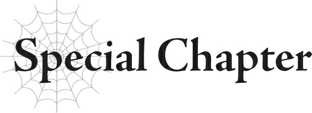

# Yêu tinh cười hô hố
*(Special Chapter: The Elf Cackles)*

Kể từ ngày hôm đó, ta đã là một người vô cùng bận rộn.

Nhưng đó là sự bận rộn mang lại cho ta cảm giác vô cùng thỏa mãn.

Kế hoạch quấy rối bằng cách phái tộc elf đi hỗ trợ quân phản loạn ma tộc đã kết thúc trong thất bại thảm hại.

Ariel không hiểu bằng cách nào đã đánh hơi được chuyển động của quân phản loạn từ trước và không may tấn công bọn họ trước khi chúng ta kịp hoàn thành công tác chuẩn bị.

Ta không thể trách tên thủ lĩnh phản loạn về chuyện này, vì ngay cả ta cũng chưa bao giờ tưởng tượng được chúng ta lại bị phát hiện nhanh chóng và đột ngột đến vậy, rồi bị tấn công trong thời gian ngắn như thế.

Tệ hơn nữa, và thậm chí còn ê chề hơn, chính cái cổng dịch chuyển của ta lại bị dùng để phản kích ta trong một cuộc tấn công bất ngờ.

Ta đã mất không dưới hai mươi bảy con Gloria dạng người mà ta dày công chuẩn bị.

Dạo gần đây, do sự hiện diện phiền toái của Giáo hoàng Thần Ngôn Giáo và tên Anh hùng, việc thu thập các bộ phận chính cần thiết để tạo ra những siêu chiến binh này đã trở nên khó khăn hơn.

Để mất nhiều con như vậy vào đúng thời điểm này quả thực là một tổn thất không hề nhỏ.

Ý định bỏ mặc cô ta đã thoáng qua trong đầu ta, nhưng sẽ còn rắc rối hơn nếu cô ta tiếp xúc với Ariel và trong kịch bản tồi tệ nhất, bắt đầu thông đồng với cô ta.

Để cô ta chết bờ chết bụi ở đâu đó thì tốt rồi, nhưng cô ta lại biết vị trí của cổng dịch chuyển bí mật dẫn thẳng đến làng elf, và dĩ nhiên ta không thể để thông tin đó rơi vào tay Ariel.

Ta sẵn sàng tự tay giết cô ta nếu cần, nhưng nếu có thể cứu sống cô ta thì vẫn tốt hơn.

Ta đã thành lập một đội giải cứu dẫn đầu bởi các elf biết sử dụng phép [Thần Tốc Dịch Chuyển].

Ta đã cố gắng phái họ đến lãnh địa ma tộc, nhưng việc đó rốt cuộc chỉ là một chuyến đi vô ích, dù theo nghĩa tốt.

Với sự giúp đỡ của Agner, Oka cùng những người sống sót khác đã tự mình trốn thoát khỏi lãnh địa ma tộc sang lãnh thổ loài người.

Điều này nghĩa là ta hiện tại đang nợ Agner một món nợ, nhưng đó không phải là vấn đề quá lớn.

Ta nhận được thông tin rằng một số thuộc hạ của Ma Vương—hay nói cách khác, quân cờ của Ariel—đang gây náo loạn tại biên giới giữa lãnh địa ma tộc và nhân tộc.

Điều đó quả thực có làm ta hơi lo ngại một chút, nhưng vì ta đã cứu được Oka, ta đoán mình có thể bỏ qua chuyện đó.

Trong lúc Oka đang được giải cứu, ta đã đi kiểm tra tàn tích của cổng dịch chuyển ở nhân giới kết nối với lãnh địa ma tộc.

Nó đã bị phá hủy không còn một dấu vết, nhưng ta đã cẩn thận đào bới khu vực đó lên.

Ta buộc phải nhìn thấy tận mắt mới được.

Và rồi ta đã tìm thấy một thứ.

"Ừm, bây giờ ông đã làm được rồi đấy. Cảm ơn rất nhiều nhé."

Giọng nói của Ariel cất lên với ta, trầm hơn bình thường.

Thỉnh thoảng ta có thể nghe thấy giọng cô ta thông qua cái đầu của tên thế thân ta sử dụng trong sự cố hạm đội bay G-Fleet, thứ mà cô ta đã thu giữ.

Hầu hết các tính năng của nó đã bị vô hiệu hóa từ trước, nhưng ta vẫn để lại chức năng thu âm và ghi hình hoạt động khi cô ta mang nó đi.

Có vẻ như Ariel biết điều đó, nên khi ở trong phòng chứa cái đầu đó, cô ta chỉ để nó ghi lại những thông tin vô dụng đối với ta. Đôi khi cô ta thậm chí còn truyền thông tin giả với hy vọng đánh lừa ta.

Nếu ta cắn câu thì quá tốt.

Còn nếu không thì cô ta cũng chẳng mất mát gì.

Ta đoán con bé đó cuối cùng cũng đã biết dùng não một chút rồi.

Nhưng lúc này cô ta chắc chắn đang nói chuyện trực tiếp với ta.

"Đừng nghĩ thế này nghĩa là ông đã thắng."

Nói xong, âm thanh và hình ảnh liền bị cắt đứt.

Cô ta chắc chắn đã bóp nát cái đầu đang nói chuyện đó rồi.

"Hì hì."

Một tiếng cười khẩy khẽ thoát ra khỏi môi ta.

"Hì hì... Ha ha ha ha ha!"

Ta thực sự đang cười hô hố thành tiếng, dù không lớn cho lắm.

Đã bao lâu rồi ta mới cười như thế này nhỉ?

Đã bao lâu rồi tâm trạng của ta mới phấn chấn được như thế này?

Những lời cay đắng của Ariel khi nếm mùi thất bại vang lên thật êm tai.

Ta hạnh phúc nhìn ngắm thứ mình vừa tìm thấy trong đống đổ nát của cổng dịch chuyển.

"Cuối cùng ta cũng làm được rồi."

Nó hầu như không còn nguyên vẹn, nhưng không còn nghi ngờ gì nữa, đó chính là xác của White.

Hai mươi bảy con Gloria dạng người ư?

Thời gian và công sức bỏ ra để giải cứu Oka ư?

Tất cả những thứ đó chỉ là cái giá quá nhỏ để trả.

Ta sẵn sàng đánh đổi tất cả những thứ đó và nhiều hơn thế nữa để cuối cùng tiêu diệt được sinh vật đã gây khó dễ cho ta suốt mấy năm qua.

Thực lòng mà nói, ta đã lên kế hoạch gửi gấp mười lần số lượng Gloria dạng người đó để hỗ trợ quân phản loạn.

Ta thậm chí đã chuẩn bị sẵn tinh thần để mất tất cả bọn chúng trong quá trình này.

Tất cả những điều đó đều được thực hiện mà không biết kết quả trận chiến sẽ ra sao.

So với chuyện đó, ta hiện tại đã giành được thắng lợi khổng lồ với chi phí tối thiểu.

Đây là một đòn giáng nặng nề vào thực lực của Ariel.

Những thuộc hạ còn lại của cô ta vẫn là một vấn đề, nhưng chúng không phải là thứ ta không thể đối phó.

Và bản thân Ariel không phải là đối thủ của ta.

Ma tộc ư? Chẳng qua chỉ là đống rác rưởi.

Chắc chắn là an toàn khi nới lỏng sự cảnh giác của ta đối với Ariel và đồng bọn của cô ta rồi.

Nghĩa là tất cả những gì ta phải đối phó lúc này chỉ là những chuyển động của Giáo hoàng Thần Ngôn Giáo.

Lão ta đã và đang sử dụng tên Anh hùng để đi khắp nơi phá hủy các chi nhánh tổ chức của ta.

Nhưng ngay cả chuyện đó giờ đây cũng chẳng còn quan trọng nữa.

Ta đã giết được White.

Ta không cần phải vội vã thu thập thêm các bộ phận nữa.

Hơn nữa, ta đã thu thập được phần lớn những kẻ tái sinh quý giá đó rồi. Nghĩa là không cần thiết phải tiếp tục sử dụng tổ chức đó để bắt cóc trẻ em làm bình phong cho các mục tiêu của ta nữa.

Ta có lẽ có thể giảm bớt quy mô hoạt động của chúng lúc này.

Thời hoàng kim của ta cuối cùng cũng đã đến.

Việc lão Giáo hoàng cứ liên tục can thiệp vào chuyện của ta một cách dai dẳng thật sự làm ta ngứa mắt, nhưng chuyện đó lúc này không có mấy hệ lụy.

Nếu ta đi giết tên Anh hùng phụng sự lão ta, điều đó cũng sẽ gây rắc rối cho ta.

Bây giờ khi nhân tố hỗn loạn mang tên White đã ra đi, ta chẳng còn gì phải sợ hãi từ phe của Ariel cả.

Nhưng việc tiêu diệt tên Anh hùng—quân cờ phù hợp nhất để tiêu diệt Ma Vương—vẫn sẽ là một hành động ngu xuẩn.

Đặc biệt là vì tên Anh hùng vẫn còn trẻ. Ngay khi một Anh hùng chết đi, con người còn sống phù hợp nhất với vai trò này về mặt sức mạnh tổng thể và tính cách sẽ tự động trở thành Anh hùng mới.

Vì một con người trẻ tuổi với năng lực và sức mạnh vẫn đang phát triển được chọn làm Anh hùng, nghĩa là không có con người còn sống nào lớn tuổi hơn tên Anh hùng hiện tại phù hợp với vai trò này hơn hắn ta cả.

Nên nếu tên Anh hùng này chết, kẻ tiếp theo rất có thể sẽ là một đứa trẻ còn nhỏ tuổi hơn nữa.

Tên này vốn đã quá trẻ để có thể đối đầu với Ariel rồi, nên một kẻ trẻ tuổi hơn sẽ càng vô dụng hơn.

Vì vậy, ta không thể động vào tên Anh hùng hiện tại, ngay cả khi việc phải hành động đúng như dự đoán của lão Giáo hoàng làm ta vô cùng ngứa mắt.

Ta còn nhiều công việc khác cần làm, nên một khi chúng ta thu thập xong những kẻ tái sinh còn lại, ta sẽ rút lực lượng của mình ở đó về.

Nhưng có lẽ ta có thể tìm một con đường khác để cố gắng nghiền nát Thần Ngôn Giáo.

Dù sao thì, việc tiêu diệt được White, một trong những cái gai lớn nhất trong mắt ta, là một sự giải thoát lớn.

Khi ta đứng dậy khỏi ghế để tiến hành hành động tiếp theo, bước chân của ta mang lại cảm giác nhẹ nhàng hơn thường ngày rất nhiều.

---

[◀ Chương trước: Chương 4: Hãy gieo rắc đau thương](04_lets_bring_the_pain.md) | [Chương tiếp theo: Chương 5: Hãy quan sát một cuộc họp ▶](05_lets_observe_a_meeting.md)
