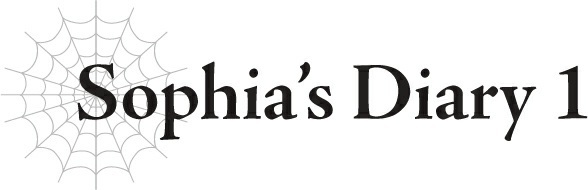

# Nhật ký của Sophia 1

*(Sophia’s Diary 1)*

Cháaaan quá đi mất.

Hôm nay mình lại không được gặp Merazophis rồi, vẫn như mọi khi.

White cũng đã lâu rồi không trở lại dinh thự công tước.

Nghe bảo cô ấy đang bận đi làm việc gì đó cùng với cô Ariel.

Thật không công bằng chút nào!

Mình ở đây chán muốn chết luôn. Chán đến mức có thể chết được luôn ấy!

Lần trước khi White trở về sau mấy chuyến phiêu lưu nhỏ của cô ấy, mình đã cằn nhằn với cô ấy về chuyện này, và thế là ngày hôm sau, cô ấy đưa cho mình một bản kế hoạch huấn luyện viết tay.

Hừ! Cái đó hoàn toàn ngược lại với những gì mình muốn!

Ý mình là, ừ thì, về mặt lý thuyết thì nó cũng giúp mình có việc để làm đấy, nhưng mà vẫn không được!

Hơn nữa, rốt cuộc thì ai lại muốn thực hiện một chế độ huấn luyện khắc nghiệt điên cuồng như thế này chứ?!

Không còn lựa chọn nào khác sao?!

Chẳng hạn như dành nhiều sự chú ý cho mình hơn ấy!

---

[◀ Chương trước: J1 Julius, 11 tuổi: Khởi đầu](01_j1_julius_age_11_beginnings.md) | [Chương tiếp theo: J2 Julius, 12 tuổi: Chuyến viễn chinh đầu tiên ▶](03_j2_julius_age_12_first_expedition.md)
