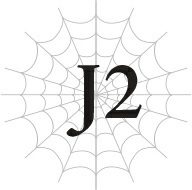
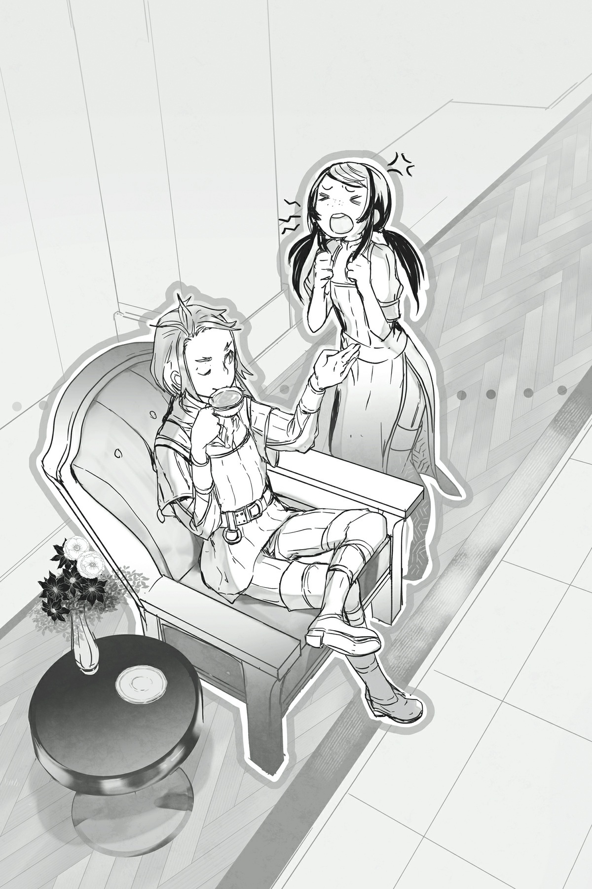
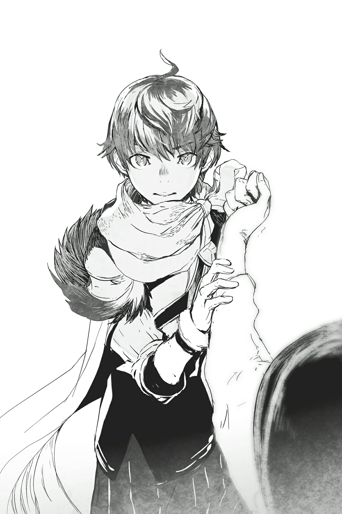

# J2 Julius, 12 tuổi: Chuyến viễn chinh đầu tiên

*(Julius, Age 12: First Expedition)*

Đã khoảng sáu tháng kể từ khi tôi đồng ý tham gia lực lượng đặc nhiệm đặc biệt để chống lại tổ chức buôn người.

Điều đó có nghĩa là năm mới đã qua đi, và tôi đã tăng thêm một tuổi.

Trong sáu tháng đó, lực lượng đặc nhiệm đã được tập hợp đầy đủ, và cuối cùng chúng tôi cũng chuẩn bị lên đường để triệt phá tổ chức này.

Lý do mất nửa năm để huy động là vì có quá nhiều quốc gia khác nhau cử binh lính tham gia sứ mệnh này.

Mỗi quốc gia đều có những toan tính riêng của họ, nên việc lựa chọn người gửi đi tốn khá nhiều thời gian, hoặc ít nhất là tôi được nghe kể lại như vậy.

Thành thật mà nói, thật khó để hành động nhanh chóng khi có quá nhiều lợi ích và kỳ vọng khác nhau cần phải cân nhắc.

Tôi hiểu điều đó ở một mức độ nào đó là không thể tránh khỏi, nhưng tôi không thể phủ nhận rằng mình đã bắt đầu cảm thấy bồn chồn.

Bây giờ ngày mong đợi bấy lâu cuối cùng cũng đã đến, tất cả những gì tôi cảm thấy chỉ là sự háo hức.

Đây chính là nơi mọi chuyện bắt đầu.

"Này, Juliusss! Trà pha xong rồi đây."

"Sao cậu vẫn có thể nói chuyện với ngài ấy bất lịch sự như vậy hả?! Cho dù có là bạn thuở nhỏ đi nữa, xưng hô trống không gọi thẳng tên Ngài Anh hùng như thế là hoàn toàn không thể chấp nhận được!"

Khi tôi đang ngồi ở phòng chờ để chuẩn bị tinh thần, tôi nghe thấy tiếng cãi vã của hai người. Giọng nói của họ cho biết họ trạc tuổi tôi.

Quay lại, tôi thấy một cô bé và một cậu bé quen thuộc đang tiến lại gần.

"Rồi, rồi. Từ giờ tôi sẽ cẩn thận hơn, đại loại thế."

"Thật là! Thái độ kiểu gì thế hả?! Cậu chẳng có ý định cẩn thận chút nào cả, đúng không?!"

Cậu bé nhún vai khi cô bé đang nổi giận lôi đình với cậu.

Kiểu trò chuyện này đã trở thành một nghi thức thường ngày gần đây.

Cậu bé tên là Hyrince. Cậu ấy cũng đến từ Vương quốc Analeit giống như tôi, và bất chấp thái độ cợt nhả của mình, cậu ấy xuất thân từ gia tộc Công tước Quarto danh giá.

Tuy nhiên, vì đã có một người anh trai trưởng thành và ở vị thế vững chắc để kế thừa tước vị tiếp theo của gia tộc, Hyrince ở một vị trí tương đối kỳ lạ dưới tư cách là thứ nam.

Trong giới quý tộc, con trai thứ hai thường được coi là phương án dự phòng phòng trường hợp có chuyện xảy ra với con trưởng, nhưng trong trường hợp của Hyrince, anh trai cậu ấy đã có con riêng, nên cậu ấy hoàn toàn trở nên dư thừa.

Tôi không khỏi đồng cảm với cậu ấy, vì tôi cũng giữ một vị trí kỳ lạ không kém trong hoàng gia khi là nhị hoàng tử nhưng lại do một phi tần sinh ra.

Đó có lẽ là lý do tại sao chúng tôi đã thân thiết từ khi còn rất nhỏ.

Vì vậy, đúng vậy, bạn có thể gọi cậu ấy là bạn thuở nhỏ của tôi.

Cậu ấy là một trong số ít những người bạn thân thiết mà tôi quen biết từ trước khi trở thành Anh hùng.

Và hiện tại, Hyrince đang đồng hành cùng tôi với tư cách là cận vệ thân cận. Về cơ bản, công việc của cậu ấy là chăm sóc các nhu cầu của tôi.

Đó không phải là kiểu công việc thường giao cho con trai của một công tước, dù là con thứ, nhưng vì tôi là hoàng tộc kiêm Anh hùng, tôi được phép có những ngoại lệ như thế này.

Thực tế, nếu Hyrince không tình nguyện nhận vai trò này, tôi có lẽ đã bị ngập lụt trong các đơn kiến nghị từ khắp nơi trong vương quốc và thậm chí các nước khác khi mọi người tranh nhau tiếp cận tôi.

Chính gia thế của Hyrince với tư cách là một nhân vật quan trọng từ quê hương tôi đã giúp cậu ấy đẩy lui các đối thủ khác để giành lấy vai trò này.

Tôi thích có một người bạn quen thuộc bên cạnh hơn là một người chưa từng gặp, đặc biệt là những người lạ có động cơ chính trị.

Nhưng có một người không mấy thiện cảm với tính cách thẳng thắn của cậu ấy.

Cụ thể, đó là cô bé đã mắng mỏ cậu ấy từ lúc bước vào phòng: Thánh nữ Yaana.

Thánh nữ là vai trò đi đôi với Anh hùng.

Tuy nhiên, thay vì được lựa chọn thông qua một danh hiệu như Anh hùng, họ phải trải qua quá trình huấn luyện khắc nghiệt từ khi còn nhỏ và đáp ứng các tiêu chuẩn nhất định để được tuyển chọn.

---

---

Theo một cách nào đó, các ứng cử viên cho vị trí Thánh nữ phải trải qua một con đường còn gian nan hơn cả các Anh hùng, vì vậy người cuối cùng được chọn cho vai trò này chắc chắn phải là một thực lực xuất chúng hàng đầu.

Ít nhất, đáng lệ phải là như thế...

"Này, Julius. Uống trước khi nguội đi nhé? Cậu phải tranh thủ nghỉ ngơi khi còn có thể, nếu không lát nữa sẽ vất vả lắm đấy."

"Này! Đừng có phớt lờ tôi chứ!"

...Tuy nhiên, thái độ của Hyrince đối với cô ấy không giống như đang đối xử với một nhân vật xuất chúng cho lắm.

Thánh nữ thường được Thần Ngôn Giáo cử đến để hỗ trợ Anh hùng.

Nói rằng Thánh nữ là người hòa giải giữa Anh hùng và Thần Ngôn Giáo thì thật là nói giảm nói tránh. Thực chất, cô ấy giống như một người giám sát được bổ nhiệm hơn.

Ít nhất, đó là những gì tôi nghĩ trước khi gặp Yaana.

Ban đầu, tôi nghĩ thái độ của cô ấy chỉ là giả vờ, nhưng sau nửa năm, tôi có thể khẳng định không phải như vậy.

Cô ấy là người nghiêm túc, tỉ mỉ, thành thật đến mức ngốc nghếch, và đôi khi tôi thấy mình hơi tội nghiệp cho cô ấy.

"Còn cô thì sao, Yaana? Tôi tự thấy mình pha trà cũng khá ngon đấy chứ. Nào — đừng lo. Chắc chắn không có con bọ nào trong đó đâu."

"Hừ...! Không cần đâu!"

Hiên ngang bước tới ngồi cùng bàn với tôi, người được gọi là chủ nhân của cậu ấy, Hyrince bắt đầu uống trà của mình mà không đợi tôi bắt đầu trước.

Trong khi đó, Yaana đỏ mặt và đùng đùng bỏ ra khỏi phòng sau khi đã chịu đủ trò trêu chọc của cậu ấy.

"Ôi, lũ trẻ con thật là nóng tính."

Hyrince không thể nén nổi một nụ cười toe toét.

"Như vậy không tốt đâu đấy."

"Tôi không kiềm chế được mà; trêu cô ấy vui quá đi mất."

Tôi thở dài khi thấy cậu bạn thuở nhỏ của mình cười một cách đầy tinh quái.

"Thực sự không cần thiết phải liên tục khiêu khích cô ấy như vậy đâu, giờ chúng ta đã biết cô ấy là người thế nào rồi mà..."

Ban đầu, Hyrince trêu chọc Yaana chỉ để thăm dò tính khí và tìm hiểu con người cô ấy.

Cậu ấy trông có vẻ đơn giản và thẳng tính, nhưng trong thâm tâm, cậu ấy là người sâu sắc, chăm chỉ và chân thành hơn bất kỳ ai khác. Không có nhiều người biết khía cạnh này của cậu ấy.

Thái độ thường ngày của Hyrince trông tự nhiên đến mức bạn phải là người cực kỳ tinh mắt mới nhận ra đó chỉ là một lớp ngụy trang.

Và vì bản thân luôn phải đeo mặt nạ, cậu ấy đã trở nên rất giỏi trong việc phát hiện khi người khác đang nói dối hoặc giả vờ.

Sau khi Hyrince thử thách Yaana bằng cách cố tình khiêu khích cô nhiều lần, cậu ấy kết luận rằng tính cách của Yaana không phải là lớp ngụy trang, và chúng tôi nhận thấy cô ấy chỉ đang là chính mình.

"...Vậy tại sao Giáo hoàng lại bổ nhiệm Yaana làm Thánh nữ chứ?"

Vị trí Thánh nữ được quyết định bổ nhiệm bởi Giáo hoàng và các hồng y của Thần Ngôn Giáo. Vì Giáo hoàng có tầm ảnh hưởng lớn như vậy đối với Giáo hội, tôi chắc chắn ông ta có tiếng nói quyết định trong lựa chọn cuối cùng này.

Nếu ông ta muốn một người để mắt đến tôi, tôi chắc chắn có những ứng cử viên khác phù hợp hơn cho vai trò đó.

Tôi không muốn nói xấu, nhưng tôi không nghĩ Yaana đủ xảo quyệt để làm loại việc đó, và tôi cũng chưa từng thấy cô ấy thử làm thế bao giờ.

"Có lẽ họ nhận thấy tốt hơn là không nên tròng xích vào cổ cậu nếu không cần thiết chăng? Đại loại vậy?"

Hyrince nhấp trà một cách khoan thai đến mức khó tin là cậu ấy lại bằng tuổi tôi.

Khi Hyrince không đóng kịch, cậu ấy trông vô cùng trưởng thành.

Việc cậu ấy đã cao hơn hầu hết những đứa trẻ cùng tuổi càng làm nổi bật vẻ ngoài đó.

Mặc dù đối với những người không biết bản chất thực sự của cậu ấy, cậu ấy có lẽ trông giống như một kẻ cơ bắp thích tỏ ra hiểu biết.

"Tôi chắc chắn Giáo hoàng không thực sự muốn làm cậu mất lòng đâu. Nên ông ta có lẽ đã chọn một Thánh nữ có thể làm đồng minh tốt cho cậu. Cô ấy thành thật, dễ đoán, nhưng vẫn rất tài năng. Plus, cô ấy có khiếu công lý mạnh mẽ giống như cậu vậy. Xem xét mức độ tương thích giữa hai người, đó thực sự là một lựa chọn khá chu đáo đấy chứ?"

Phân tích của Hyrince trùng khớp với suy nghĩ của tôi về vấn đề này: Giáo hoàng có lẽ đã cân nhắc rất kỹ cho tôi khi chọn Thánh nữ.

Có lẽ ông ta nhận ra tôi không cảm thấy tin tưởng ông ta, nên ông ta quyết định cố gắng cải thiện mối quan hệ của chúng tôi.

Yaana có thể là một kiểu lễ vật hòa bình.

"Julius, Giáo hoàng không phải là kẻ thù của cậu. Đề phòng ông ta thì không hại gì, nhưng nếu cậu quá đa nghi, điều đó chỉ khiến mọi việc trở nên khó khăn hơn cho cậu thôi, cậu biết mà?"

"Ừ... tớ đoán cậu nói đúng."

Trước nhận xét của Hyrince, tôi nhận ra mình có lẽ đã vô thức coi Giáo hoàng như một thế lực thù địch.

"Cậu nói đúng. Tớ không được nhầm lẫn giữa đồng minh và kẻ thù. Tớ không chiến đấu chống lại Giáo hoàng."

Tôi nói từng từ một, như thể đang cố tự thuyết phục bản thân.

Nhưng sau đó Hyrince nhún vai và nói thêm, "Mặc dù ông lão đó luôn khiến tôi có cảm giác mình đang bị dắt mũi."

Nụ cười hiền từ nhưng đầy dối trá của Giáo hoàng hiện lên trong tâm trí tôi.

Nếu ông ta biết tất cả những điều này sẽ xảy ra và gửi Yaana đi như một bước đi được tính toán trước, thì tôi có lẽ lại đang chơi trong lòng bàn tay ông ta một lần nữa.

Và tôi có lý do chính đáng để tin rằng điều đó là sự thật, vì chuyện này đã từng xảy ra trước đây.

...Ông ta không phải là kẻ thù, nhưng tôi vẫn không thể nào thích ông ta nổi.

Tôi đóng cửa lại.

Sau đó tôi quay đi, đầu hàng trước cảm giác bất lực trong chốc lát.

Phía sau cánh cửa sau lưng tôi, các chỉ huy được cử đến từ mỗi quốc gia cho lực lượng đặc nhiệm đang tụ họp.

Với sự tham gia của rất nhiều quốc gia khác nhau, có một lượng lớn binh lính cần quản lý, vì vậy mỗi nhóm đều được cử đi cùng với một vị tướng nổi tiếng từ vùng đất tương ứng của họ.

Những chỉ huy này đã đến đây với danh dự quốc gia của họ được đặt cược.

Chúng tôi vừa mới kết thúc cuộc họp với tất cả bọn họ.

Và tôi sẽ đứng trên họ với tư cách là tổng chỉ huy.

Tim tôi đập liên hồi vì lo lắng trước sức nặng và trách nhiệm của vai trò này khi tôi chuẩn bị bước vào cuộc họp.

Nhưng kết quả lại khác xa những gì tôi mong đợi.

Không một ai, không một người nào thèm nhìn tôi lấy một lần khi việc lập kế hoạch thực sự bắt đầu.

Lần duy nhất tôi lên tiếng trong suốt cuộc họp là để giới thiệu bản thân mình.

Sau đó tôi lắng nghe lời giới thiệu của các chỉ huy, và ngay khi họ bắt đầu thảo luận về các chiến lược cụ thể, tôi đã bị mời ra khỏi phòng.

Không một ai coi tôi là người lãnh đạo cả.

Không phải là một thủ lĩnh thực sự, chỉ là một kẻ tình cờ ngồi vào vị trí đó nhờ sở hữu danh hiệu Anh hùng.

Tôi nhớ lại cách các chỉ huy khác nhìn tôi ngay khi tôi bước vào phòng. Họ không mong đợi gì ở tôi, như thể họ đang liếc nhìn một viên đá cuội bên vệ đường.

Dĩ nhiên, không ai nói thẳng điều đó với tôi.

Khi tôi giới thiệu bản thân, họ đều đáp lại một cách tôn kính.

Nhưng tôi vẫn có thể nhận ra, dù muốn hay không.

Đối với họ, tôi chẳng qua chỉ là một bù nhìn làm cảnh.

Tôi có thể là Anh hùng, và là hoàng tử của một vương quốc lớn, nhưng họ chỉ coi tôi là một đứa trẻ không hơn không kém.

Thay vì gánh vác trách nhiệm nặng nề của vai trò tổng chỉ huy, tôi thậm chí còn không được trao cơ hội. Rõ ràng là không ai muốn tôi làm vậy.

Phía sau cánh cửa kia, các chỉ huy đang thảo luận về các bước đi tiếp theo của lực lượng.

Tôi đáng lẽ là người chịu trách nhiệm, nhưng tôi thậm chí còn không có mặt trong cuộc thảo luận.

Không phải họ dùng vũ lực đuổi tôi ra ngoài, nhưng một khi họ nói những câu kiểu như "ngài cứ giao phần còn lại cho chúng tôi", thật khó để cảm thấy mình được chào đón ở vị trí đó.

Cố chấp ở lại chỉ tổ làm giảm đánh giá của họ về tôi, từ một bù nhìn biết điều thành một đứa trẻ ngang ngạnh, rắc rối.

Tôi phải kiên nhẫn.

Các chỉ huy và tôi chỉ vừa mới gặp nhau.

Họ chưa có lý do gì để tin tưởng tôi.

Sẽ sớm có rất nhiều cơ hội cho việc đó.

Tôi phải thu hẹp khoảng cách giữa chúng tôi, từng chút một.

Không cần phải hoảng loạn.

Mọi thứ đều cần có thời gian.

"Không sao cả. Chúng ta chỉ mới bắt đầu thôi."

Tôi siết chặt chiếc khăn quàng cổ như để tự trấn an mình.

Sẽ không ai nghe thấy giọng tôi qua cánh cửa dày cộp kia đâu.

Tay tôi nới lỏng ra, tôi bước trở về phòng mình.

Rồi vài ngày sau, lực lượng đặc nhiệm lên đường thực hiện chuyến viễn chinh đầu tiên của mình.

"Này, chúng ta chuẩn bị vào trận chiến rồi đúng không?"

"Ừm. Đúng vậy. Tớ nghĩ thế."

Câu trả lời của tôi trước câu hỏi của Hyrince chậm rãi và không chắc chắn, nhưng xin hãy thông cảm cho tôi.

Tôi không thể không nghi ngờ về tình huống này.

Đây là nhiệm vụ sơ bộ của lực lượng đặc nhiệm đặc biệt.

Vì đây là trận chiến đầu tiên dưới tư cách là một đơn vị liên kết, và vẫn còn một số lo ngại về việc khả năng phối hợp của chúng tôi sẽ tốt đến đâu, chúng tôi bắt đầu từ một khu vực lân cận nơi sự hiện diện của tổ chức buôn người tương đối thấp để giảm thiểu tổn thất tiềm tàng.

Nhưng ngay cả như vậy, đây có thực sự là cách làm đúng đắn?

"Cảm giác giống như một chuyến đi tham quan hơn là bất cứ thứ gì khác."

Tôi đồng ý với nhận xét thẳng thắn của Hyrince, mặc dù tôi không nói ra thành tiếng.

Chúng tôi đáng lẽ phải truy lùng và tiêu diệt một nhóm buôn người bí mật... thế nhưng, chúng tôi lại đang ngồi trên một chiếc xe ngựa sang trọng.

Xung quanh chúng tôi có các kỵ sĩ cưỡi ngựa hộ tống, như thể họ có nhiệm vụ bảo vệ chúng tôi.

Không, không phải "như thể". Đó chính xác là những gì họ đang làm.

Chỉ nhìn vào cỗ xe ngựa của chúng tôi, không ai có thể đoán được tôi là người chỉ huy của toàn bộ lực lượng này.

Trông giống như một quý tộc sang chảnh hay một người hoàng gia đang đi nghỉ dưỡng hơn.

Chiếc xe ngựa này nổi bần bật một cách kỳ quặc, di chuyển ở giữa một đoàn quân đang hành quân uy nghiêm.

"Cậu lại thế nữa rồi!"

Ngồi bên cạnh Hyrince, Yaana nhíu mày với cậu ấy.

"Các chỉ huy của lực lượng đã chuẩn bị cỗ xe này đặc biệt dành riêng cho Ngài Anh hùng! Phàn nàn về nó chẳng khác nào từ chối tấm lòng của họ cả!"

Cô ấy nói đúng, tất nhiên rồi.

Và thế nhưng...

"Cô nói vậy, nhưng... cô thực sự nghĩ cái gọi là tấm lòng đó là vì lợi ích của Julius sao?"

Trước lời phản bác sắc bén của Hyrince, Yaana mở miệng định nói gì đó, rồi lại im lặng.

Xem ra, trong thâm tâm cô ấy cũng không mấy mặn mà với tình huống này.

Điều đó làm tôi bớt lo lắng hơn một chút.

Tôi chắc chắn có rất nhiều người bình dân thích được ngồi trên một cỗ xe ngựa như thế này.

Hyrince và tôi lần lượt là quý tộc thượng lưu và hoàng tộc, ngay cả khi vị trí của chúng tôi có phần bất thường. Chúng tôi đã quen với kiểu đối xử này, nhưng Yaana thì không.

Theo tôi hiểu, các ứng cử viên Thánh nữ phải trải qua khóa huấn luyện nghiêm ngặt từ thuở nhỏ và bị cách ly khỏi thế giới bên ngoài.

Nếu có gì, tôi nghĩ cô ấy có lẽ sẽ hào hứng với việc trải nghiệm sự xa hoa này hơn cả một người bình thường.

Chúng tôi chưa biết nhau lâu, nhưng tôi thừa nhận tính cách thẳng thắn của cô ấy khiến tôi nghi ngờ điều đó sẽ xảy ra.

Đồng thời, cô ấy cũng có tinh thần trách nhiệm cao, nên tôi không nghĩ cô ấy sẽ làm ầm lên hay gì cả.

Tuy nhiên, đáng ngạc nhiên là cô ấy có vẻ cũng cảm thấy không thoải mái trong hoàn cảnh này giống như chúng tôi.

Hóa ra có những điều bạn không thể biết về một người nếu không dành nhiều thời gian ở bên họ.

Tôi đoán điều đó có nghĩa là tôi cũng phải tiếp tục giao tiếp với những người khác để hiểu rõ hơn về tính cách của họ và theo thời gian, tìm kiếm thêm những người tôi có thể tin tưởng.

"Ừm, thì, cậu biết đấy. Có thể việc nổi bật như thế này sẽ giúp người dân cảm thấy an tâm hơn chăng?"

Yaana cuối cùng cũng vặn ra được một câu trả lời, nhưng Hyrince chỉ khịt mũi.

"Người dân không ngốc đâu. Nếu mục đích là làm mọi người cảm thấy an toàn, họ sẽ phô trương lực lượng quân sự chứ. Chỉ cần nhìn qua một cái là thấy có bao nhiêu người tài giỏi trong lực lượng này rồi. Tôi không thấy có lý do gì để chỉ đặt Julius — tổng chỉ huy — vào một cỗ xe ngựa sang trọng thế này."

Xem xét việc cô ấy không cố gắng đưa ra bất kỳ lập luận nào để cãi lại, có vẻ như ngay cả Yaana cũng biết đó là một cái cớ yếu ớt.

"Ngược lại là đằng khác, sử dụng một cỗ xe nổi bật thế này có nguy cơ khiến người dân càng thêm lo lắng. Họ sẽ nhìn vào nó và tự hỏi chúng ta thực sự đang làm gì, liệu có phải chúng ta chỉ đang đi dạo chơi hay không."

Hyrince cười ẩn ý.

Chúng tôi thực sự đã nhận được những ánh nhìn nghi ngại như vậy khi rời khỏi thị trấn.

Hoạt động của tổ chức buôn người không được công bố rộng rãi ở khu vực này.

Nên việc người dân thị trấn nhìn đoàn diễu hành của chúng tôi đi qua mà không cảm thấy chút khẩn trương hay nguy hiểm nào là điều tự nhiên; họ xem đoàn xe của chúng tôi như thể chúng tôi đang tổ chức một lễ hội nhỏ nào đó.

Nhưng không phải là ở đây không có vụ bắt cóc nào cả.

Hầu hết mọi người chỉ đứng xem chúng tôi rời đi vì tò mò, nhưng tôi thực sự thấy có vài người nhìn theo như thể đang cầu nguyện cho sự thành công của chúng tôi.

Và những người mang vẻ mặt đó lại phản ứng mạnh mẽ nhất khi nhìn thấy cỗ xe này.

Nhưng không phải theo hướng tích cực.

Lo âu, ghê tởm, cam chịu — đó là những cảm xúc hiện rõ trên khuôn mặt của những người nhìn thấy thứ xa hoa mà chúng tôi đang ngồi bên trên.

Nhìn thấy vẻ mặt của họ càng làm rõ ràng hơn việc toàn bộ sự sắp đặt này lạc lõng đến mức nào.

Nhưng dù vậy...

"Ngay cả khi họ nhìn thấy chúng ta, phản ứng của họ có lẽ vẫn sẽ như vậy thôi."

Tôi không đặc biệt cố gắng đồng tình với Yaana, nhưng tôi có một suy nghĩ hơi mâu thuẫn với nhận định của Hyrince.

Chúng tôi là trẻ con.

Anh hùng, Thánh nữ hay bất cứ danh hiệu gì đi nữa, điều đó không thay đổi thực tế rằng chúng tôi vẫn là những đứa trẻ.

Những người đang đau khổ vì tổ chức buôn người có lẽ cũng chẳng cảm thấy khá hơn khi nhìn thấy chúng tôi đi cùng binh lính so với việc nhìn thấy cỗ xe ngựa này.

Bởi vì dù thế nào đi nữa, chúng tôi chắc chắn trông không hề đáng tin cậy.

"Điều đó thì đúng thật. Chúng ta vẫn chỉ là những đứa trẻ mà. Nhưng tớ vẫn cảm thấy đáng lẽ phải có cách tốt hơn để làm việc này chứ."

Hyrince thở dài và tựa lưng sâu vào ghế ngồi.

"Không phải thế đâu! Cho dù ngài ấy có là trẻ con đi nữa, Ngài Anh hùng vẫn là một nhân vật vô cùng nổi bật! Không ai có thể nhìn ngài ấy mà cảm thấy bất an cả! Tôi chắc chắn về điều đó!" Yaana nắm chặt hai nắm tay đầy quả quyết phản đối. "Bất kỳ ai không nhận ra phong thái uy nghiêm của Ngài Anh hùng thì chắc chắn là bị mù rồi! Cứ nhìn xem ngài ấy ngầu và đẹp trai biết bao!"

Tôi không thể không nhìn cô ấy chằm chằm một cách ngơ ngác.

Ngay cả Hyrince cũng sững sờ đến mức ngồi đó chớp mắt, quên mất việc trêu chọc cô ấy lần này.

Nhận ra ý nghĩa của những lời mình vừa thốt ra từ phản ứng của chúng tôi, Yaana lập tức đỏ bừng mặt.

"X-xin hãy quên những gì tôi vừa nói đi ạ!"

Cô ấy lấy hai tay che mặt.

"À há..."

Khôi phục lại sau cơn chấn kinh, Hyrince bắt đầu cười một cách đầy gian tà.

Thông thường, vì Yaana không thể đấu khẩu lại Hyrince, cô ấy có xu hướng bỏ chạy khi tình thế bất lợi. Đáng tiếc là hiện tại chúng tôi đang ở trong xe ngựa. Không có nơi nào để chạy cả.

"Oaaa!"

Như thể cố gắng thoát khỏi móng vuốt độc ác của cậu ấy, Yaana lùi lại tận góc ghế và cuộn tròn lại.

Không có từ ngữ nào tả xiết biểu cảm trên khuôn mặt Hyrince khi cậu ấy cố gắng nhịn cười.

"Á! Ối!"

"Hự!"

Đúng lúc đó, cỗ xe nảy lên một cái cục.

Đang ngồi ở một tư thế kỳ lạ, Yaana mất thăng bằng và suýt chút nữa ngã nhào khỏi ghế, tôi vội vàng đỡ lấy cô ấy.

"Cô không sao chứ?"

"V-vâng, cảm ơn ngài..."

Mặt Yaana càng đỏ hơn.

Giữa đợt bộc phát trước đó và sự cố mới này, mặt cô ấy giờ đỏ như gấc chín.

Rồi, vào khoảnh khắc tồi tệ nhất có thể, cửa xe ngựa đột ngột mở ra.

"...Chúng ta đã đến nơi."

Người lính mở cửa nhìn chúng tôi với một biểu cảm cực kỳ đáng sợ.

Tôi có thể thấy rõ suy nghĩ hiện trên mặt anh ta: Lũ trẻ này tưởng đây là một trò chơi chắc?

...Có lẽ chúng tôi thực sự chẳng có tư cách gì để phàn nàn về vẻ ngoài của cỗ xe ngựa này nữa rồi.

Chiến dịch diễn ra vô cùng suôn sẻ, ít nhất là trên giấy tờ.

Các thành viên của tổ chức buôn người ở khu vực này kém xa lực lượng đặc nhiệm về cả kỹ năng lẫn số lượng.

Vì nơi ẩn náu của chúng đã bị phát hiện từ trước, chúng hầu như không kháng cự được gì khi quân ta ập vào và tiếp quản nơi đó... hoặc ít nhất là tôi nghe bảo vậy.

Chúng tôi thực chất không được tận mắt chứng kiến điều này.

Chúng tôi bị bắt đợi ở một khoảng cách khá xa, được bao quanh bởi lính gác.

Không lâu sau, cỗ xe của chúng tôi quay trở lại thị trấn.

Tôi có thể nghe thấy những tiếng reo hò chào đón chúng tôi trở về, nhưng điều đó không giúp tâm trạng tôi khá hơn chút nào.

Ở một mức độ nào đó, tôi đã dự đoán mọi chuyện sẽ như thế này, nhưng tôi vẫn cảm thấy xấu hổ khi bị đối xử rõ ràng như một bù nhìn làm cảnh thuần túy.

Tất nhiên, tôi biết một đứa trẻ như tôi không bao giờ có thể chỉ huy một nhóm sĩ quan dạn dày kinh nghiệm được.

Họ cũng có thể mạnh hơn tôi trong chiến đấu, dù tôi là Anh hùng.

Nhưng dù vậy, tôi chắc chắn phải có việc gì đó tôi có thể làm được chứ.

Vậy mà, tôi bị buộc phải ngồi trong xe ngựa suốt cả chặng đi lẫn chặng về.

Cứ đà này, sự hiện diện của tôi ở đây hoàn toàn vô nghĩa.

Tôi có thể thực sự tiếp tục thế này sao?

Tôi không còn lựa chọn nào khác ngoài việc chờ đợi cho đến khi mình thực sự làm nên trò trống gì đó sao?

"Hửm? Có chuyện gì thế?"

Khi tôi đang chìm trong suy nghĩ, Hyrince rướn người nhìn ra phía trước xe ngựa. Tôi nhìn theo ánh mắt của cậu ấy và thấy đoàn xe đã dừng lại không tiến lên nữa.

Theo đó, cỗ xe của chúng tôi cũng từ từ dừng lại.

"Có chuyện gì xảy ra thế?" Hyrince hỏi một người lính gác.

"Có vẻ như một số người dân địa phương đã tiếp cận chúng ta."

"Cái gì, họ định gây rắc rối à? Tha cho tôi đi chứ."

Hyrince càu nhàu bực bội. Chuyến viễn chinh đầu tiên này chắc hẳn cũng đã làm cậu ấy căng thẳng.

Nhưng tôi quan tâm hơn đến tình hình ở phía trước.

"Tớ sẽ quay lại ngay."

"Hả? Này, đợi một chút!"

Tôi mở cửa xe và nhảy xuống, hướng về phía nơi đang xảy ra náo loạn.

Không lâu sau, tôi đã có thể nghe thấy các giọng nói.

"Mọi người có tìm thấy con gái tôi không?!"

"Con trai chúng tôi an toàn đúng không?!"

"Lũ trẻ bị bắt cóc đang ở đâu?!"

Một số người dân thị trấn vây quanh các binh lính, hỏi han tin tức về những đứa trẻ bị mất tích.

Nhưng các binh lính chỉ nhìn nhau và từ chối trả lời.

"Nào! Nói cho chúng tôi biết đi! Đã có chuyện gì xảy ra?!"

"Con tôi ở đâu? Nó có an toàn không?!"

Thái độ của binh lính có vẻ làm người dân địa phương thêm bất an, những câu hỏi của họ ngày càng trở nên điên cuồng hơn.

Đúng vậy, chiến dịch quét sạch chi nhánh địa phương của tổ chức buôn người đã diễn ra suôn sẻ.

Ít nhất là trên giấy tờ.

Nhưng khi chúng tôi đột nhập vào nơi ẩn náu, những đứa trẻ bị bắt cóc lại không có ở đó.

Và chúng tôi không hề biết chúng có thể đã bị đưa đi đâu.

Một số tài liệu đã được thu hồi từ nơi ẩn náu, nhưng không biết liệu chúng tôi có thể thu thập được thông tin hữu ích nào từ việc nghiên cứu chúng hay không.

Nhìn vào lực lượng trở về của chúng tôi, có thể thấy rõ những kẻ sống sót bị bắt giữ của tổ chức buôn người đang bị di lý đi, nhưng cũng rõ ràng không kém là không có những đứa trẻ bị bắt cóc đi cùng chúng tôi.

Gia đình của các nạn nhân, những người đã đặt toàn bộ hy vọng vào chúng tôi, hiển nhiên muốn có câu trả lời.

"Chúng tôi sẽ công bố chi tiết sau. Bây giờ, tránh ra đường."

Một trong những chỉ huy cố gắng xua đuổi họ, nhưng tôi nhanh chóng bước can thiệp.

"Xin hãy dừng lại."

"Ngài Anh hùng?"

Vị sĩ quan nhìn tôi đầy nghi ngờ, với một biểu cảm chứa đựng một chút bực bội không thể che giấu hoàn toàn.

Trong mắt anh ta, tôi chỉ là một đứa trẻ không nên xía vào tình huống này.

Nhưng tôi không thể chỉ biết nhắm mắt làm vừa lòng người khác.

"Chúng ta đã tiêu diệt tất cả những kẻ tội phạm ẩn náu ở khu vực này."

Tôi bước lên trước mặt những người dân làng và bắt đầu nói.

Biểu cảm của họ dịu đi đôi chút khi tôi thông báo rằng tổ chức buôn người đã bị xóa sổ khỏi khu vực.

Nhưng... còn có một điều nữa.

Tôi không có lựa chọn nào khác ngoài việc nói với họ.

"Nhưng những người bị bắt cóc đã không còn ở trong nơi ẩn náu khi chúng tôi đến nơi."

Ngay cả khi chúng tôi trì hoãn họ ở đây, họ cũng sẽ sớm tìm ra sự thật thôi.

"Không thể nào..."

"Điều đó có nghĩa là... các ngài đã... quá muộn sao...?"

Im lặng. Và rồi...

"Đồ khốn!"

"Sao các người có thể làm thế chứ?! Trả lời tôi đi!"

Sự giận dữ bùng nổ.

Người dân làng lao lên như muốn đánh tôi, và các binh lính vội vã cản họ lại.

"Ngài Anh hùng, ngài đã làm cái gì thế hả?!"

Vị chỉ huy túm lấy vai tôi, tỏ vẻ thất vọng trước sự tự tiện của tôi.

Nhưng tôi gạt tay anh ta ra.

Đồng thời, một người phụ nữ vượt qua bức tường binh lính và lao thẳng về phía tôi.

Vị chỉ huy định bước ra chắn trước mặt tôi ngay lập tức, nhưng tôi giơ tay ra hiệu để cô ấy đi qua.

Với những giọt nước mắt lăn dài trên má, người phụ nữ vung tay định tát tôi.

Nhưng tôi bắt lấy tay cô ấy trước khi cú đánh giáng xuống.

"Tôi rất tiếc vì chúng tôi đã không đến kịp."

Tôi không thể để cô ấy đánh mình, ngay cả khi tôi đồng cảm với cô ấy.

Một lần, tại tàn tích của hạt Keren ở Sariella, tôi đã để những người sống sót trút giận lên mình, không hề có ý định kháng cự lại bạo lực của họ.

Nhưng ngài Tiva đã khiển trách tôi vì điều đó.

Đánh tôi chỉ giúp họ cảm thấy khá hơn trong vài khoảnh khắc.

Rất nhanh thôi, tay họ sẽ đau, và tim họ sẽ nhói lên vì cảm giác tội lỗi.

Người vung nắm đấm và người nhận cú đấm đều chỉ còn lại nỗi đau đớn.

---

---

Ngài Tiva đã giải thích với tôi khi đó rằng điều quan trọng là không được để mọi người đánh mình vào những thời điểm như thế này.

"Chúng tôi sẽ tiếp tục truy đuổi tổ chức đó. Tôi không thể hứa với mọi người rằng chúng tôi chắc chắn sẽ tìm thấy những người bị bắt cóc. Nhưng ít nhất tôi có thể hứa rằng chúng tôi sẽ không bao giờ bỏ cuộc."

Tôi không thể đưa ra những lời thề thốt một cách nhẹ bẫh.

Bởi vì tất cả những gì chúng tôi biết là có thể đã quá muộn để cứu các nạn nhân.

Nhưng chúng tôi phải làm mọi thứ trong khả năng của mình cho đến khi số phận của họ được làm sáng tỏ.

Đó là điều tôi có thể hứa.

Tôi buông tay người phụ nữ ra, và cô ấy ngã quỵ xuống khóc nức nở.

Gầy dựng danh tiếng của mình, cảm thấy bực bội vì sự vô dụng của bản thân... Làm sao tôi lại có thể bị cuốn vào những ý ý nghĩ vô bổ như vậy chứ?

Rốt cuộc tôi là cái gì?

Tôi là Anh hùng.

Và nhiệm vụ của Anh hùng là giúp đỡ những người đang đau khổ!

Tôi không thể tin nổi là mình đã quên đi điều quan trọng nhất.

Tôi không biết liệu những lời nói của mình có làm dịu lòng ai trong số họ hay không.

Nhưng người dân thị trấn dần dần rút khỏi con đường, sự tức giận của họ lùi dần.

Ngay cả người phụ nữ đã quỳ gối khóc lóc cũng đứng dậy và bước đi một cách lảo đảo.

Và khi làm vậy, cô ấy thì thầm, "Tôi xin lỗi."

Ngài Tiva đã đúng. Tôi đã đưa ra lựa chọn chính xác.

"Ngài Anh hùng, chúng tôi không thể để ngài đơn giản là làm bất cứ điều gì mình thích như vậy."

Khi mọi chuyện đã lắng xuống, vị chỉ huy bắt đầu khiển trách tôi.

"Không có lý do gì để ngài phải đối mặt với sự giận dữ của công chúng."

"Không phải thế đâu," tôi trả lời một cách đơn giản. "Tôi là tổng chỉ huy của chuyến viễn chinh này. Tôi có trách nhiệm phải lắng nghe họ. Cho dù tôi chỉ là một bù nhìn, tôi vẫn là người chịu trách nhiệm."

Trước câu nói đó, vị sĩ quan hít vào một hơi lạnh.

"Chúng ta đã không đến kịp. Đúng vậy, kể từ khi chúng ta phá hủy nơi ẩn náu, mối đe dọa ở đây đã bị loại bỏ. Nhưng chúng ta không thể đảo ngược những gì đã xảy ra. Đó là thực tế."

"Nhưng nhiệm vụ của chúng ta không phải là—"

"Đúng vậy, nói một cách nghiêm túc thì đó không phải nhiệm vụ của chúng ta. Nhưng dù vậy... chúng ta vẫn thất bại."

Ngay cả khi đó không phải lỗi của chúng ta, chúng ta không thể quên rằng mình đã không hoàn thành những gì được kỳ vọng.

Nếu chúng ta làm được, có lẽ chúng ta đã có thể cứu họ.

Nhưng chúng ta đã không làm được.

Và chúng ta tuyệt đối không bao giờ được quên thực tế đó, bất kể thế nào đi nữa.

"Tôi biết tôi đã không làm được gì, cũng như không có việc gì tôi có thể làm được. Tôi biết tất cả những điều này chỉ là lời nói suông. Nhưng nếu tôi thậm chí không thể đưa ra những lời hứa như vậy, thì tôi không xứng đáng làm Anh hùng."

Nói xong, tôi quay lưng lại với vị chỉ huy và trở về xe ngựa của chúng tôi.

Bước vào bên trong, Hyrince chào đón tôi bằng một nụ cười kiểu "tớ chịu thua cậu luôn rồi đấy".

Vào những thời điểm thế này, tôi thực sự biết ơn vì có một người bạn hiểu tôi mà không cần phải nói một lời.

Mặc dù tôi không chắc tại sao Yaana lại đang bồn chồn bối rối bên cạnh cậu ấy.

"Hyrince. Tớ sẽ làm việc đó."

"Tất nhiên rồi. Tớ sẽ ở ngay phía sau cậu."

Hyrince không hỏi tôi làm việc gì? hay đại loại thế.

Cậu ấy chỉ đơn giản nói rằng cậu ấy sẽ đi theo tôi, bất kể tôi đang lên kế hoạch gì.

Đúng vậy, tôi vẫn còn rất nhiều thời gian.

Tôi đã nghĩ mình có thể từ từ tiếp cận các thành viên trong lực lượng, từng chút một.

Nhưng như thế là không đủ tốt.

Tôi có thể có thời gian, nhưng với mỗi giây trôi qua, lại có những người không còn có thể cứu được nữa.

Họ không có lấy một giây phút nào để lãng phí.

Tại sao một anh hùng lại chiến đấu?

Vì mọi người.

Cuối cùng tôi đã nhớ ra quyết tâm mà mình đã lập ra.

Và vì vậy tôi không thể cho phép mình thong thả được nữa.

Với quyết tâm mới, tôi tiếp tục tiến bước về phía trước.

---

[◀ Chương trước: Nhật ký của Sophia 1](02_sophias_diary_1.md) | [Chương tiếp theo: Chương đặc biệt: Lão binh Đế quốc và Chỉ huy ▶](04_special_chapter_the_empire_veteran_and_the_commander.md)
