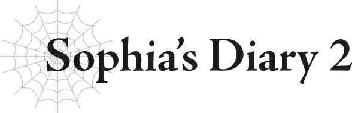

# Nhật ký của Sophia 2

*(Sophia’s Diary 2)*

Mình đã bị gửi đến học viện.

Một trường nội trú.

Sao họ dám làm một việc như thế chứ!

Bình thường mình đã hầu như chẳng bao giờ được gặp Merazophis rồi, thế mà bây giờ lại phải ở một trường nội trú sao?!

Đã vậy chúng mình còn không được phép ra ngoài nếu không nộp đơn xin phép?

Muốn có người đến thăm ở học viện cũng phải làm đủ các thủ tục phức tạp?

Nhưng như thế thì việc mình đi gặp Merazophis hay anh ấy đến gặp mình sẽ lại càng khó khăn hơn!

Sao họ dám chứ!

SAO HỌ DÁM CHỨ!

Hừ, rõ ràng là mình chẳng còn lựa chọn nào khác ngoài việc bỏ trốn!

Thế nhưng, khi mình vừa cố phá cửa sổ phòng ký túc xá để lao thẳng đến chỗ Merazophis, không hiểu sao ngay khoảnh khắc tiếp theo mình đã thấy mình bị trói chặt trong tơ nhện.

Mình hầu như không thể cử động được, nhưng vẫn kịp quay đầu lại để thấy Sael, Riel và Fiel đang đập tay ăn mừng với nhau.

Có phải họ ở đây chỉ để canh chừng mình không hả?!

Thật là, SAO HỌ DÁM CHỨ!

---

[◀ Chương trước: Chương đặc biệt: Lão binh Đế quốc và Chỉ huy](04_special_chapter_the_empire_veteran_and_the_commander.md) | [Chương tiếp theo: J3 Julius, 12 tuổi: Cuộc tập kích bất ngờ ▶](06_j3_julius_age_12_surprise_attack.md)
