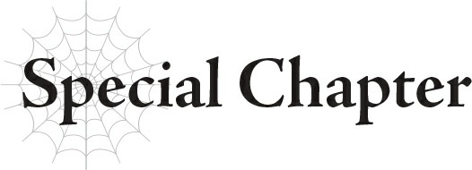
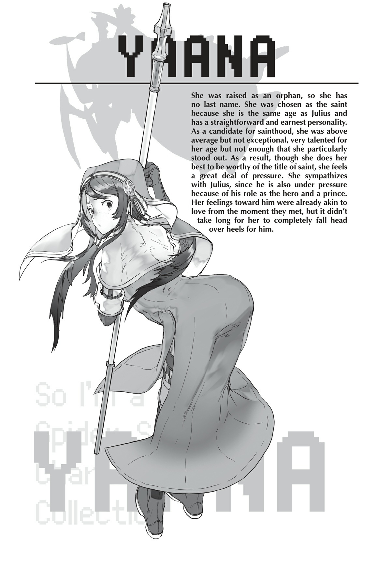

# Chương đặc biệt: Thánh nữ và Lão binh Đế quốc
*(Special Chapter: The Saint and the Empire Veteran)*

"Yaana, tại sao họ lại chọn cậu?"
Khi tôi được chọn làm Thánh nữ, đó là điều đầu tiên một trong số các ứng cử viên Thánh nữ khác, cũng là bạn thân của tôi, đã nói với tôi.
Tôi đã vô cùng phấn khởi trước lời đề nghị bất ngờ này, nhưng những lời đó đã lập tức dập tắt tâm trạng của tôi.
Các ứng cử viên Thánh nữ được huấn luyện từ khi còn nhỏ.
Nhiều cô gái đã rút lui trước khi kết thúc, không thể chịu đựng được quá trình huấn luyện khắc nghiệt.
Đó là một cuộc sống khó khăn, nhưng chúng tôi vẫn kiên trì với hy vọng trở thành Thánh nữ tương lai, tất cả là để một ngày nào đó có thể hỗ trợ Anh hùng.
Lẽ tự nhiên, việc được chọn làm Thánh nữ là vinh dự tột cùng đối với chúng tôi.
Tất nhiên, chỉ có duy nhất một người được chọn.
Và ngay cả như vậy, một Thánh nữ mới chỉ có thể được chọn khi một Anh hùng mới ra đời.
Theo thông lệ, ứng cử viên được chọn phải là người có tuổi tác gần với Anh hùng, vì vậy ngay cả ứng cử viên xuất sắc nhất thường cũng sẽ không được chọn nếu cô ấy không đúng độ tuổi.
Đại số các ứng cử viên sẽ không bao giờ có thể trở thành Thánh nữ.
Nhưng không thể nói trước khi nào một Anh hùng có thể qua đời và một Thánh nữ mới lại cần thiết, vì vậy các học viên mới vẫn được kết nạp hàng năm.
Tất cả chỉ để có một cơ hội nhỏ nhoi trở thành Thánh nữ.
Và tôi đã được chọn cho vai trò đó. Cứ như thể nữ thần may mắn đã mỉm cười với tôi vậy.
Tự nhiên, tôi đã quá vui mừng và phấn khích đến mức chạy đi báo tin cho người bạn tốt của mình.
Chị ấy lớn tuổi hơn tôi nhưng luôn đối xử tử tế với tôi, nên tôi chắc chắn chị ấy sẽ mừng cho tôi.
Nhưng ngay khi chị ấy lên tiếng, tôi nhận ra mình đã lầm.

---

“A — mình xin lỗi. Mình không có ý đó đâu...”
Chị ấy xin lỗi ngay lập tức, dường như rất hối hận về cách dùng từ của mình.
Nhưng rồi chị ấy dường như không còn gì để nói nữa. Chị ấy chỉ cúi gục đầu, quay lưng và vội vã bỏ đi.
Người bạn của tôi lớn hơn tôi hai tuổi.
Còn ngài Julius, Anh hùng mới, lại bằng tuổi tôi.
Nếu ứng cử viên được chọn phải có độ tuổi gần với Anh hùng, thì chắc chắn chị ấy cũng đủ tiêu chuẩn, vì họ chỉ cách nhau có hai tuổi.
Ngược lại, tôi không thể nghĩ ra lý do nào khác khiến mình được chọn ngoại trừ yếu tố tuổi tác.
Năng lực của tôi không tệ; chắc chắn là trên mức trung bình.
Nhưng vẫn có những ứng cử viên khác xếp hạng cao hơn tôi, bao gồm cả người bạn của tôi.
Vì vậy, mặc dù tôi luôn nỗ lực hết mình, tôi chưa từng nghĩ mình sẽ được chọn làm Thánh nữ.
Tuy nhiên, tùy thuộc vào thành tích học tập, một ứng cử viên không được chọn làm Thánh nữ vẫn có thể có được một công việc tốt.
Nếu có gì, đó mới là mục tiêu tôi hướng tới.
Tất nhiên tôi từng mơ ước được làm Thánh nữ, nhưng thực tế mà nói, tôi nghĩ mình không đời nào trở thành Thánh nữ thật sự.
Vì vậy, tôi đã không hiểu hết sức nặng của việc đảm nhận vai trò đó.
Tôi đã không nhận ra rằng việc trở thành Thánh nữ đồng nghĩa với việc chà đạp lên hy vọng của tất cả những người khác không được chọn.
Những cô gái đã nỗ lực để trở thành Thánh nữ nhưng thất bại.
Vì lợi ích của họ, tôi phải gánh vác hy vọng của họ và trở thành vị Thánh nữ tốt nhất có thể.
Để không ai còn phải hỏi tôi câu “Tại sao?” thêm một lần nào nữa.
Vì tôi chưa từng thực sự kỳ vọng mình sẽ trở thành Thánh nữ, tôi chắc chắn có những ứng cử viên khác sẽ cười nhạo tôi vì đã đưa ra quyết tâm này quá muộn màng.
Nhưng một khi tôi đã quyết định, tôi sẽ không bao giờ nuốt lời.
Tôi phải trở thành kiểu Thánh nữ mà các ứng cử viên kia không bao giờ có thể bắt lỗi được.
Một nửa trong số đó là vì tinh thần trách nhiệm.
Một nửa còn lại... là nỗi sợ hãi.
Một khi Thánh nữ đã được bổ nhiệm, chỉ có ba cách để danh hiệu này được chuyển giao cho một người mới.

---

Một là nếu Anh hùng đương nhiệm, ngài Julius, qua đời.
Hai cách còn lại là nếu bản thân tôi không còn khả năng hoàn thành vai trò Thánh nữ.
Nói cách khác, nếu tôi không thể trị liệu do bị bệnh nặng hoặc chấn thương nghiêm trọng, hoặc nếu tôi chết.
Có rất ít trường hợp một Thánh nữ bị ám sát bởi chính ứng cử viên Thánh nữ khác.
Chúng tôi được dạy phải thanh cao và đức độ trong suốt quá trình đào tạo, nên rất ít người nghĩ đến chuyện làm vậy.
Nhưng điều đó không có nghĩa là hoàn toàn không có.
Tôi không muốn tin rằng những người bạn học cũ của tôi lại có thể nghĩ đến việc làm điều đó với tôi, nhưng tôi biết một số người trong họ cảm thấy không vừa lòng.
Suy cho cùng, ngay cả người bạn thân nhất của tôi cũng phản ứng như thế cơ mà.
“Ư hự!”
“Thưa Thánh nữ, xin cô đừng cố quá sức.”
Tôi cố gắng nhưng không thể ngăn được cơn buồn nôn dâng lên trong cổ họng trước cảnh tượng trước mắt.
Và cả mùi hôi thối nữa.
Mùi máu, mùi ruột gan và mùi cơ thể đặc trưng. Lũ cướm sống ngoài thị trấn hẳn là có thói quen vệ sinh kém, nên mùi cơ thể tự nhiên của chúng thật kinh khủng.
Mùi máu thì không đến nỗi tệ — tôi đã từng trải qua điều đó trong các buổi đào tạo y tế thực hành mà Giáo hội huấn luyện khi tôi còn là ứng cử viên.
Ban đầu, mùi máu làm tôi khó chịu, nhưng tôi đã quen sau vài lần trải nghiệm.
Nhưng đó là từ các bệnh nhân trong phòng bệnh vô trùng, chứ không phải các nạn nhân trên chiến trường thực sự.
Ở đây, còn có những mùi khác trộn lẫn với máu, cùng với đất cát và bụi bặm của trận chiến.
Tất cả những thứ đó kết hợp lại tấn công tôi bằng cảm giác buồn nôn tồi tệ hơn nhiều so với bất kỳ điều gì tôi từng trải qua khi huấn luyện.
“Không sao đâu. Tôi không thể yếu lòng sau khi Ngài Anh hùng đã chiến đấu anh dũng như thế.”

---

Nhẹ nhàng từ chối người lính cố gắng dẫn tôi trở lại xe ngựa, tôi yêu cầu anh ta đưa tôi đến chỗ những người bị thương để bắt đầu chữa trị cho họ.
Một khi bắt đầu trị liệu, tôi có thể chỉ tập trung vào việc đó mà thôi, thay vì bị ảnh hưởng bởi môi trường xung quanh.
Dù tốt hay xấu, tôi vẫn chưa được gọi để làm bất cứ việc gì kể từ khi lực lượng chống buôn người được thành lập.
Có những bác sĩ và trị liệu sư chính quy trong đội, và mọi chuyện cho đến nay vẫn diễn ra suôn sẻ, nên tôi chưa từng được đưa ra để chữa trị.
Ngay cả lần này, cũng không ai yêu cầu tôi giúp đỡ.
Nhưng sau khi thấy Ngài Anh hùng tự mình lao vào cuộc chiến, tôi không thể chỉ ngồi ngoài lề mà không làm gì cả.
“Người tiếp theo!”
“Thưa Thánh nữ, phần lớn những người bị thương đều đã được trị liệu xong rồi ạ.”
Quả thực, tôi nhìn quanh và nhận thấy không còn binh lính nào bị thương nặng nữa.
“Vậy còn những tên tội phạm bị bắt giữ thì sao?”
Những nạn nhân tập trung ở đây chỉ có binh lính, nên các tù binh hẳn phải ở nơi khác.
Chúng đã chiến đấu chống lại Ngài Anh hùng và đồng đội, nên chắc chắn chúng cũng bị thương rất nặng.
“...Hầu hết bọn tội phạm đều đã trút hơi thở cuối cùng rồi. Sẽ không cần phải chữa trị đâu ạ.”
“Tôi... tôi hiểu rồi.”
Từ sự ngập ngừng của người lính, tôi có thể nhận ra hầu hết bọn tội phạm đều đã gặp phải một kết cục thảm khốc.
“Giá như Ngài Anh hùng bắt sống vài tên cho chúng ta thì tốt hơn...”
Người lính dường như cho rằng tôi đang thương xót cho những kẻ tội phạm đã chết, và anh ta lẩm bẩm điều gì đó nghe như đang chỉ trích Ngài Anh hùng.
“Không, không phải thế đâu.”
...Thành thật mà nói, tôi từng rất sợ nhìn thấy Ngài Anh hùng chiến đấu.
Ấn tượng cá nhân của tôi về ngài ấy là một cậu bé vô cùng nhân từ bằng tuổi tôi.
Ngài ấy luôn mỉm cười nhã nhặn và có vẻ ấm áp đến mức người ta có thể tự hỏi liệu ngài ấy có nỡ làm hại một con ruồi hay không. Tôi thừa nhận, dù có phần thất lễ, tôi từng nghi ngờ liệu ngài ấy có thể thực sự chiến đấu được hay không.

---

Nhưng ngài ấy có tinh thần trách nhiệm mạnh mẽ, và việc nhìn ngài ấy nỗ lực hết mình để giành được sự tôn trọng từ những người lớn chỉ càng làm tăng thêm tình cảm của tôi dành cho ngài ấy.
Tôi từng nghĩ ngài ấy cũng đang phải vật lộn với một vai trò nặng nề, giống hệt như tôi.
Nhưng tôi đã lầm.
Không chỉ là địa vị hay tinh thần trách nhiệm thúc đẩy Ngài Anh hùng nỗ lực: Đó là khát vọng công lý mãnh liệt của ngài ấy.
“Ngài Anh hùng không có thời gian để lo lắng về những việc đó đâu. Nếu ngài ấy để chúng chạy thoát, chúng sẽ phân tán sang các khu vực khác, và chúng ta sẽ mất cơ hội tiêu diệt tất cả cùng một lúc. Và rồi chúng sẽ tiếp tục thực hiện những tội ác kinh hoàng ở những nơi khác, dù chỉ ở quy mô nhỏ hơn. Ngài Anh hùng nhận ra điều này và quyết định rằng phải quét sạch chúng trước khi chuyện đó xảy ra, ngay cả khi điều đó đồng nghĩa với việc ngài ấy phải tự tay làm việc đó.”
Trong trận chiến, Ngài Anh hùng đã chiến đấu với sự mãnh liệt đến dựng tóc gáy, khác xa với vẻ hiền lành thường ngày của ngài ấy.
Phong cách chiến đấu dứt khoát không chút dung thứ của ngài ấy cho thấy ngài ấy đã quyết tâm ngăn chặn bọn tội phạm bằng mọi giá thế nào.
“Cái gì? Không, không thể nào... Ngài Anh hùng chắc chắn đâu có nghĩ nhiều đến vậy chứ?”
“Trong mắt tôi thì có vẻ là như vậy đấy.”
“Nhưng ngay cả khi có vài tên trốn thoát, thiệt hại gây ra cũng chỉ là thứ yếu thôi mà...”
“Anh có còn nói như vậy nữa không nếu các nạn nhân chính là gia đình của anh?”
Trước lời nhận xét cuối cùng đó, những lời bào chữa của người lính lập tức biến mất.
“Phải thừa nhận rằng những người sống ở khu vực này phần lớn là người xa lạ đối với chúng ta. Nhưng Ngài Anh hùng đã ép buộc bản thân vượt qua giới hạn của mình để bảo vệ chính những người xa lạ đó.”
Trong lúc đang trị liệu cho những người bị thương, tôi tình cờ nghe thấy các binh lính tỏ ra không hài lòng trước việc Ngài Anh hùng tự ý hành động.
Họ bảo ngài ấy liều lĩnh vì muốn có thêm nhiều thành tựu mang tên mình.
Rằng ngài ấy không có ý thức làm việc nhóm vì chỉ là một đứa trẻ.
Rằng vì người mà họ có nhiệm vụ bảo vệ đã lao vào trận chiến, nên họ cũng buộc phải lao vào theo, và cứ thế tiếp tục.
Đúng là việc tự ý hành động không hẳn là đáng khen ngợi.
Nhưng ngài ấy được thúc đẩy bởi mong muốn bảo vệ mọi người, một ý thức công lý sâu sắc hơn bất kỳ ai có thể biết.
“Chính xác.”
Quay lại, tôi thấy phó tổng chỉ huy, ngài Tiva, đang tiến về phía chúng tôi.

---

Giọng nói của ông ấy, căng thẳng và nhiều cảm xúc hơn bình thường rất nhiều, khiến tôi không khỏi ngạc nhiên.
“Ngài Tiva, tay ngài đang chảy máu kìa!”
Nhận thấy máu nhỏ giọt từ nắm đấm đang siết chặt của ông ấy, tôi vội chạy đến định chữa trị, nhưng ông ấy đã ngăn tôi lại.
“Không sao đâu. Tôi tuyệt đối không được chữa lành vết thương này, để tự nhắc nhở bản thân.”
Ngài Tiva mở lòng bàn tay ra nhìn vết thương, rồi lại siết chặt tay lại.
“Tôi cảm thấy xấu hổ vì sự hèn nhát của mình,” ông ấy khẽ nói. “Để Ngài Anh hùng phải ép mình đến mức này... Tôi là một kẻ thất bại dưới tư cách là phó chỉ huy của ngài ấy.”
“...Ngài Anh hùng chỉ là một đứa trẻ. Chẳng phải việc của một đứa trẻ là vượt qua giới hạn của chúng sao?”
Một trong những binh lính, có lẽ là một chỉ huy dựa trên trang phục của anh ta, cố gắng an ủi ngài Tiva nhưng chỉ nhận lại một tiếng thét phẫn nộ.
“Vậy thì chúng ta là cái gì chứ, nếu ngay cả một đứa trẻ cũng không nghĩ rằng nó có thể dựa dẫm vào chúng ta?! Ngài Anh hùng đã bị buộc phải hành động vì chúng ta quá hèn nhát!”
Ý định xoa dịu ngài Tiva của vị chỉ huy thay vào đó lại châm ngòi cho một cơn bùng nổ mà ông ấy vốn đang cố kìm nén.
“Tôi từng nghĩ chúng ta có thể để Ngài Anh hùng trưởng thành theo tốc độ của riêng ngài ấy, rằng ngài ấy sẽ từ từ thu hẹp khoảng cách giữa bản thân và quân đội. Nhưng xem ra chúng ta mới là những người cần phải trưởng thành.”
Vị chỉ huy nhìn đi chỗ khác khi Tiva tiếp tục.
“Chúng ta đã quên mất lý do tại sao lực lượng này lại tồn tại ngay từ đầu. Mục tiêu của chúng ta là bảo vệ nhiều nạn nhân vô tội khỏi tổ chức này nhất có thể! Ngài Anh hùng hiểu rõ điều đó hơn bất kỳ ai trong chúng ta. Tất cả chúng ta đều là những kẻ đại ngốc!”
Giọng nói của ngài Tiva vang vọng khắp vùng lân cận.
Tôi chắc chắn những binh lính còn lại cũng đều đã nghe thấy lời ông ấy.
Tôi không nghĩ mọi thứ sẽ thay đổi ngay lập tức.
Nhưng tôi có cảm giác đây có thể là khởi đầu của một điều gì đó mới mẻ.
“Này, chào mừng cô trở lại.”
Khi tôi trở lại xe ngựa, cận vệ của Ngài Anh hùng, Hyrince, vẫy tay chào tôi.
Cậu ấy khá thô lỗi, nên tôi thừa nhận mình không mấy thiện cảm với cậu ấy.
“Ngài Anh hùng đâu rồi?”
Hyrince im lặng chỉ tay vào trong xe ngựa.

---

Nhìn qua cửa sổ xe, tôi thấy Ngài Anh hùng đã ngủ say trên ghế ngồi.
Vào khoảnh khắc này, ngài ấy trông không khác gì một cậu bé ngây thơ.
Nhưng đây chính là Anh hùng, vị cứu tinh duy nhất được các vị thần lựa chọn.
“Julius hôm nay thực sự đã làm việc rất vất vả, nên cậu ấy kiệt sức rồi. Hãy cứ để cậu ấy ngủ đi nhé?”
“Lại thế nữa rồi. Tôi biết cậu là bạn thuở nhỏ của Ngài Anh hùng, nhưng cậu phải gọi ngài ấy với thái độ tôn trọng hơn chứ!”
Ngài Anh hùng xứng đáng nhận được sự tôn trọng cao nhất. Hôm nay tôi lại nhận thức rõ điều đó một lần nữa.
Ấy vậy mà, cái cậu bé vô lễ này lại coi nhẹ ngài ấy quá mức!
“Tôi không biết nữa. Có khi cô nên ngừng gọi cậu ấy là ‘Ngài Anh hùng’ đi thì tốt hơn đấy?”
“Cậu đang nói cái gì thế? Đừng có đùa nữa.”
Tôi chế giễu Hyrince. Sao cậu ấy có thể thốt ra những lời ngớ ngẩn như vậy chứ?
“Nhưng tôi thực sự không đùa đâu. Hai người sẽ đồng hành cùng nhau mãi mãi, đúng chứ? Dù không phải theo nghĩa kết hôn.”
“M-m-m-mãi mãi sao?! K-k-k-kết hôn ư?!”
Nghĩ lại thì đúng là...!
Ngài Anh hùng và... tôi sao?
Khi tôi tưởng tượng hai chúng tôi ở bên cạnh nhau, mặt tôi đỏ bừng lên.
Vì tôi được nuôi dạy giữa các cô gái tại trường đào tạo ứng cử viên Thánh nữ, tôi không quen với những chuyện đại loại như thế này.
“...Tớ vừa nói rõ ràng là không phải như vậy rồi mà, nhưng thôi kệ đi.” Hyrince thở dài vì lý do nào đó. “Nhưng sự thật là Anh hùng và Thánh nữ sẽ giữ vai trò của họ suốt đời. Hai người sẽ ở bên nhau cho đến khi một trong hai qua đời.”
Khi tôi hậm hực lườm cậu ấy, Hyrince trả lời bằng một tông giọng nghiêm túc đến không ngờ.
“Cô định giữ khoảng cách khách sáo với cậu ấy mãi mãi sao?”
“Chuyện đó...”
Bây giờ nghe cậu ấy chỉ ra, tôi nhận ra mình có lẽ đã quá xa cách với Anh hùng.
“Tớ không bảo cô phải trở thành bạn thân nhất hay cố gắng ép buộc một mối quan hệ cực kỳ thân mật hay gì cả. Tớ chỉ nghĩ cô nên cân nhắc lại việc gọi cậu ấy là ‘Ngài Anh hùng’ này nọ. Việc đó tạo cảm giác như có một bức tường ngăn cách giữa hai người vậy.”
“Một bức tường sao...”
Tôi chỉ đơn thuần cố gắng bày tỏ sự tôn trọng của mình bằng cách gọi ngài ấy là “Ngài Anh hùng”.
Nhưng liệu ngài ấy có cảm thấy như vậy về mối quan hệ của chúng tôi hay không?
“À thì, tớ cũng không ép cô đâu. Nhưng nếu là tớ, tớ sẽ không gọi cậu ấy bằng danh hiệu chút nào cả. Xưng hô như thế cứ như thể cô không nhìn vào một Julius thực sự, mà chỉ nhìn vào cái danh hiệu của cậu ấy thôi.”
“Một... Julius thực sự sao...”
Liệu tôi có thực sự nhìn nhận một Ngài Anh hùng... không, ngài Julius thực tế? Hay tôi vẫn luôn nhìn ngài ấy qua lăng kính danh hiệu?
Đột nhiên, tôi không chắc chắn nữa.
“Mặc dù tôi rất ghét phải nhận lời khuyên của cậu... tôi sẽ suy nghĩ về việc đó.”
“Nghe được đấy.”
Thông thường, Hyrince chắc chắn sẽ trêu chọc tôi về chuyện này, nhưng lần này, cậu ấy mỉm cười dịu dàng và ấm áp y như ngài Julius vậy.

---

---

[◀ Chương trước: J3 Julius, 12 tuổi: Cuộc tập kích bất ngờ](06_j3_julius_age_12_surprise_attack.md) | [Chương tiếp theo: Nhật ký của Sophia 3 ▶](08_sophias_diary_3.md)
