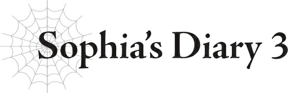

# Nhật ký của Sophia 3
*(Sophia’s Diary 3)*

Chúng mình đã tổ chức lễ khai giảng ở trường.
Chỉ vậy thôi.
Cái gì?
Bạn muốn nghe kể nhiều hơn á?
Được rồi, sau đó chúng mình phải tự giới thiệu bản thân trước cả lớp và mấy trò đại loại thế, nhưng tại sao mình lại phải nhớ tên và mặt của lũ người vô danh tiểu tốt đó chứ?
À, mình đoán là cũng có một vài người khiến mình chú ý một chút.
Như là một cậu nhóc ra vẻ ngoan ngoãn nhưng chắc chắn bên trong là một kẻ tồi tệ.
Và một cô nàng kiểu lớp trưởng nghiêm túc đến ngốc nghếch.
Cùng với một vài đứa nhóc mũi thò lò mà mình đoán sau này lớn lên có thể trở thành mỹ nhân.
Tóm lại là, chẳng có ai xứng đáng để mình bận tâm cả.
Hử?
Bạn nghĩ mình không thể kết bạn á?
Không phải việc của bạn! Làm như mình thèm muốn làm chuyện đó lắm không bằng!

---

[◀ Chương trước: Chương đặc biệt: Thánh nữ và Lão binh Đế quốc](07_special_chapter_the_saint_and_the_empire_veteran.md) | [Chương tiếp theo: J4 Julius, 12 tuổi: Bóng tối và Thánh nữ ▶](09_j4_julius_age_12_shadows_and_the_saint.md)
