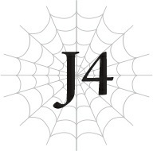

# J4 Julius, 12 tuổi: Quyết chiến

*(Julius, Age 12: Showdown)*

“Có vẻ như căn cứ của kẻ địch nằm ở một ngôi làng bỏ hoang cách xa đường núi.”

Ngài Tiva vừa giải thích vừa trải rộng một tấm bản đồ.

Tôi và các chỉ huy khác của lực lượng im lặng lắng nghe.

Sau khi lực lượng của chúng tôi bị sập bẫy phục kích của tổ chức lần trước, một cảm giác lo lắng đột ngột đã bao trùm.

Cho đến lúc đó, mọi chuyện đã diễn ra suôn sẻ đến mức đáng lo ngại.

Nên mặc dù cuộc tập kích bất ngờ hầu như không gây ra thương vong nào, các chỉ huy dường như đang cố gắng tập trung lại nỗ lực của họ sau khi lực lượng vấp phải trở ngại đầu tiên.

“Tuyến đường duy nhất dẫn đến ngôi làng là dọc theo con đường cũ này. Do đó, kẻ địch nhiều khả năng sẽ đề phòng cao độ sự tiếp cận của chúng ta.”

Tất cả chúng tôi đều nhìn chằm chằm vào tấm bản đồ trên bàn.

“Việc này sẽ khó khăn đây,” một chỉ huy lẩm bẩm.

Sự cố tập kích bất ngờ không phải là lý do duy nhất khiến các chỉ huy trông căng thẳng.

Mục tiêu tiếp theo của chúng tôi là một mục tiêu đặc biệt khó khăn.

Sự hiện diện của tổ chức tại ngôi làng bỏ hoang này hoạt động với quy mô lớn hơn nhiều so với bất kỳ thứ gì chúng tôi từng đối mặt cho đến nay.

Một ngôi làng bỏ hoang chắc chắn là rất rắc rối.

Ngay cả khi người dân không còn sống ở đó, những mảnh ghép từ cuộc sống của họ vẫn còn sót lại trong khu vực.

Nói cách khác, đó là một căn cứ đã được trang bị sẵn phần lớn những thứ con người cần để sinh tồn.

Những ngôi nhà để ngủ, những cánh đồng để tự cung tự cấp, nhiều khả năng có một nguồn nước gần đó, và những bức tường để ngăn quái vật.

---

Chúng sẽ có sẵn tất cả những thứ đó để tùy ý sử dụng.

Và điều này có nghĩa là chúng sẽ có một sinh kế tương đối ổn định, từ đó những kẻ ngoài vòng pháp luật khác cũng sẽ bị thu hút đến đó.

Nghĩa là ngôi làng duy trì một lượng dân số cao, và số lượng đồng nghĩa với sức mạnh.

Bất kể chỉ số của bạn có cao đến đâu, thật khó để bù đắp cho sự chênh lệch thuần túy về số lượng.

Ngoại lệ duy nhất là một người có chỉ số cao đến mức việc bị áp đảo quân số không còn là vấn đề — giống như tôi, Anh hùng.

Tất nhiên, lực lượng này được tạo thành từ những ngoại lệ như thế, vì nó bao gồm các chiến binh tinh nhuệ được tuyển chọn từ nhiều quốc gia khác nhau.

Tôi chắc chắn mỗi người trong số họ có thể tự mình đối phó với hai hoặc ba tên cướp.

Nhưng đó là trước khi bạn tính đến lợi thế sân nhà của kẻ địch.

Theo các cuộc điều tra của chúng tôi, ngôi làng chúng sử dụng làm căn cứ thực chất không khác gì một pháo đài.

Và như Tiva đã nói, bản đồ cho thấy cách duy nhất để tấn công chúng là từ phía trước.

Địa hình khiến khu vực này dễ thủ khó công.

Giữa quân số và lợi thế sân bãi của mình, chúng có thể bù đắp được sự chênh lệch về chỉ số.

“Chúng ta có thể chia nhỏ quân ra không?”

“Không. Những con đường duy nhất còn lại chạy thẳng qua các ngọn núi. Chúng ta chỉ có thể di chuyển qua đó theo những nhóm cực kỳ nhỏ.”

“Hơn nữa, toàn bộ ngôi làng được bảo vệ bởi những bức tường. Cho dù chúng ta cố gắng trèo qua hay phá vỡ, chúng ta sẽ bị phát hiện ngay lập tức. Chúng ta có thể tổ chức một cuộc tập kích bất ngờ, nhưng việc đó quá nguy hiểm đối với một nhóm nhỏ.”

“Hừm. Vậy thì tôi cho rằng chúng ta không còn lựa chọn nào khác ngoài việc tấn công trực diện và bao vây chúng.”

Việc di chuyển trên một ngọn núi không có đường đi là vô cùng khó khăn.

Bạn phải tự phạt bụi rậm mở đường chỉ để đi đến bất cứ đâu, và bạn cũng có thể đụng độ với những quái vật sống trong khu vực đó.

Điều đó là bất khả thi đối với một nhóm lớn.

Một nhóm nhỏ sẽ phải chịu đựng một chuyến leo núi gian khổ, và ngay sau đó, họ sẽ phải chiến đấu với lũ cướp.

Việc một kế hoạch như vậy bị bác bỏ ngay lập tức là điều tự nhiên.

Nhưng đó chính là lý do các anh hùng tồn tại.

---

“Tôi sẽ thực hiện cuộc tập kích bất ngờ.”

“Ngài Anh hùng... quá nguy hiểm.”

Vị chỉ huy trách móc tôi không hề cố gắng che giấu sự bực bội của mình.

Tôi có thể nhận ra anh ta đang nghĩ, Cậu có nghe tôi nói gì không đấy? và tôi hiểu cảm xúc của anh ta.

Nhưng tôi không thể lùi bước lúc này.

Nếu tôi cứ tiếp tục đứng ngoài lề và để họ bảo vệ, sẽ chẳng có gì thay đổi cả.

Tôi chắc chắn lý do trước đây tôi không thể làm được gì là vì quyết tâm của tôi chưa đủ mạnh mẽ.

Tôi chưa sẵn sàng để chiến đấu với con người, để giết chóc.

Nhưng bây giờ tôi đã sẵn sàng. Tôi chỉ cần biến quyết tâm đó thành hành động.

Để tôi có thể giải cứu nhiều nạn nhân nhất có thể và ngăn chặn nhiều vụ bắt cóc nhất có thể trong tương lai.

“Rất tốt.”

Tôi há miệng định phản đối, rồi sững người khi nhận ra những gì mình vừa nghe.

Điều đó có lẽ khiến tôi trông như đang há hốc mồm ra một cách ngớ ngẩn.

Tôi thực sự bị sốc trước những gì ông ấy nói, nên tôi đoán ấn tượng đó không sai.

Nhưng tất cả những người khác trong phòng đều tỏ ra ngạc nhiên không kém.

Người đồng ý với kế hoạch của tôi không ai khác chính là ngài Tiva.

“Nhưng tất nhiên, chúng tôi không thể để ngài làm việc này hoàn toàn một mình được, Ngài Anh hùng. Tôi sẽ cử vài người của mình đi cùng ngài. Và tôi tình cờ quen biết một nhà mạo hiểm tài năng, nên tôi sẽ yêu cầu anh ta đi cùng ngài nữa.”

Tiva nhanh chóng tiếp tục vạch ra kế hoạch.

“Ngài có sẵn lòng đi theo con đường này băng qua núi và tấn công kẻ địch từ phía sau không?”

“Vâng, được ạ.”

Mọi chuyện diễn ra nhanh đến mức tôi cuối cùng chỉ đưa ra một câu trả lời nghe có vẻ ngơ ngác.

Nhưng rồi một trong các chỉ huy tỉnh táo lại và bật dậy khỏi ghế.

“Ngài Tiva! Ngài đang nghĩ cái quái gì thế?!”

“Ý ngài là sao?”

---

Ngài Tiva bình tĩnh nhìn lại, vẻ mặt như thể thực sự không hiểu vấn đề nằm ở đâu.

“Chúng ta không thể để Ngài Anh hùng làm một việc nguy hiểm như vậy! Ngài nghĩ ngài ấy là cái gì chứ?!”

“À, ý ngài chỉ có thế thôi sao?”

“Chỉ có thế thôi sao?!”

Tiva cười khúc khích như thể vừa nghe thấy một câu chuyện đùa đặc biệt thú vị.

Ai cũng có thể thấy ông ấy đang chế giễu vị chỉ huy. Tôi không nghĩ ông ấy là kiểu người sẽ làm chuyện như vậy, nên tôi cũng nhất thời không biết nói gì.

“Ngài Anh hùng tự nguyện đảm nhận vai trò đó theo ý muốn của mình. Và tôi đã đưa ra phán đoán rằng ngài ấy hoàn toàn có khả năng thực hiện, nên tôi đang lên kế hoạch tương ứng. Có vấn đề gì ở đây sao?”

“Toàn bộ kế hoạch này đầy rẫy vấn đề! Nếu có chuyện gì xảy ra với Ngài Anh hùng thì sao? Ngài có chịu hoàn toàn trách nhiệm về việc đó không?!”

À, chính là nó. Một trong những sợi xích vô hình trói buộc tôi.

Đối với các chỉ huy, tôi là một đối tượng cần được bảo vệ tính mạng, chứ không phải là một đồng đội mà họ có thể tin tưởng giao phó mạng sống.

Những từ ngữ như trách nhiệm đã làm rõ điều đó.

“Tại sao ngài lại lôi một từ như trách nhiệm ra nói ở đây chứ?”

“Cái gì? Ngài Tiva, xin hãy hợp lý một chút.”

Sự khó chịu của vị chỉ huy ngày càng lộ rõ.

“Ngài Anh hùng tất nhiên hoàn toàn chịu trách nhiệm về hành động của chính mình. Ngài ấy là tổng chỉ huy, và ngài ấy có thể lên tiền tuyến nếu ngài ấy muốn.”

Trước câu nói đó, vị chỉ huy lập tức ngậm miệng lại.

“Thực tế, các ngài đã liên tục phàn nàn về các quyết định của tổng chỉ huy suốt thời gian qua. Liệu tôi có thể giả định rằng các ngài đang nghi ngờ sức mạnh của Ngài Anh hùng, người dẫn đầu của chúng ta không?”

“Cái gì?! Không, nhưng... tôi...”

Khi Tiva nhắc nhở về địa vị của tôi, vị chỉ huy chùn bước và dường như không còn lý do gì để bào chữa.

Anh ta nhìn sang các chỉ huy khác để tìm kiếm sự giúp đỡ, nhưng họ lúng túng tránh nhìn vào mắt anh ta.

Tôi chắc chắn phần lớn bọn họ đồng ý với anh ta, nhưng họ không muốn bênh vực một người đang lên tiếng chống lại tổng chỉ huy của họ — chính là tôi — và đồng thời nhận lại sự phản đối nghiêm khắc từ phó tổng chỉ huy, ngài Tiva.

---

“Nhưng dù vậy! Nếu điều tồi tệ nhất xảy ra và có chuyện gì hệ trọng đến Ngài Anh hùng, thế giới sẽ mất đi điểm tựa! Tôi cầu xin ngài hãy xem xét lại!”

Nhận ra không có ai đến giúp mình, vị chỉ huy lên dây cót tinh thần và kiên quyết giữ vững nhận định ban đầu.

Xét đến địa vị của tôi, quan điểm của anh ta không hoàn toàn sai. Nhưng ngài Tiva gạt phăng đi bằng một cái liếc mắt sắc lẹm.

“Vậy là ngài không chỉ nghi ngờ sức mạnh của Ngài Anh hùng, mà còn bác bỏ phán đoán của tôi rằng ngài ấy có khả năng hoàn thành nhiệm vụ?”

Cứ như thể vị chỉ huy thậm chí không còn được phép tự giải thích nữa.

“Vừa rồi ngài đã hỏi tôi xem tôi nghĩ Ngài Anh hùng là cái gì, vậy tôi cũng sẽ hỏi ngài điều tương tự. Ngài thực sự nghĩ gì về Ngài Anh hùng hả?”

Vị chỉ huy không có phản hồi nào trước giọng điệu đanh thép của ngài Tiva.

“Đây chính là lý do tại sao Ngài Anh hùng không tin tưởng chúng ta sẽ bọc lót cho ngài ấy. Làm sao ngài ấy có thể tin được, khi không ai trong các ngài coi ngài ấy như một đồng đội trên chiến trường? Chẳng trách ngài ấy không tin tưởng chúng ta.”

“Ngài Tiva, chuyện đó—”

“Không cần phải cố gắng làm dịu tình hình đâu, Ngài Anh hùng. Tất cả chuyện này là vì chúng ta quá hèn nhát mà thôi.”

Tôi há miệng định phản đối lời tự phê bình gay gắt của ông, nhưng ngài Tiva đã ngăn tôi lại.

“Hơn nữa, trong số các ngài có bao nhiêu người có thể là đối thủ của Ngài Anh hùng chứ? Không một ai, theo như tôi thấy. Nói thẳng ra, ngay cả tôi cũng có thể không bằng. Vậy thì những kẻ yếu hơn Ngài Anh hùng có quyền gì mà quyết định hành động thay cho ngài ấy chứ?”

Một vài chỉ huy tỏ ra tức giận rõ rệt trước lời nhận xét cuối cùng đó, nhưng trước cơn thịnh nộ bừng bừng của Tiva, họ không thể thốt ra một lời.

“Chúng ta hoàn toàn chưa hỗ trợ được gì cho Ngài Anh hùng. Thực tế, chúng ta thậm chí còn không đuổi kịp ngài ấy. Thế mà, tất cả chúng ta đều coi thường ngài ấy như thể chúng ta đã và đang bảo vệ ngài ấy, chỉ vì chúng ta là người lớn còn ngài ấy là một đứa trẻ. Các ngài có biết ở quê hương tôi người ta gọi đó là gì không? Là lòng tốt đặt sai chỗ.”

RẦM! Ngài Tiva đập mạnh nắm đấm xuống bàn.

“Chúng ta đáng lẽ phải chiến đấu bên cạnh Ngài Anh hùng, nhưng thay vào đó, chúng ta lại tụt lại phía sau ngài ấy — không, thực chất là chúng ta đang kéo ngài ấy lùi lại! Không có gì ngạc nhiên khi ngài ấy thất vọng về chúng ta và liên tục cố gắng tự mình hành động!”

Cái gì cơ?!

Tôi nghĩ mình có lẽ là người ngạc nhiên trước cơn giận của ngài Tiva hơn bất kỳ ai khác.

---

Đó không phải là những gì tôi cố gắng làm...

Nhưng phòng họp rơi vào im lặng, và tôi không có đủ can đảm để lên tiếng.

“Nếu các ngài lo ngại cho sự an toàn của Ngài Anh hùng, thì hãy chứng tỏ rằng các ngài có bản lĩnh để triệt hạ căn cứ của kẻ địch mà không cần Ngài Anh hùng phải thực hiện cuộc tập kích bất ngờ. Nhưng nếu các ngài không thể làm được việc đó, thì các ngài chỉ được cái to mồm.”

Tôi có thể thấy tinh thần chiến đấu bắt đầu bùng cháy rực rỡ trong mắt các chỉ huy.

Tất cả bọn họ đều đã leo lên vị trí hiện tại bằng chính thực lực của mình.

Giờ đây có vẻ như lòng kiêu hãnh về sức mạnh đó khiến họ không thể lùi bước sau khi bị khiển trách một cách triệt để như vậy.

“Được thôi. Tôi sẽ chứng minh cho ngài thấy tôi không phải là kẻ chỉ biết nói suông. Chúng tôi sẽ giải quyết mọi chuyện trước khi Ngài Anh hùng kịp thực hiện cuộc tấn công của mình — ngài cứ chờ mà xem.”

Vị chỉ huy lên tiếng lúc trước lườm ngài Tiva với một tia sáng lóe lên trong mắt.

Tôi đoán là họ đã chấp nhận kế hoạch tập kích bất ngờ của tôi rồi.

Khi nhận ra điều này, tôi chợt nghĩ rằng tất cả chuyện này có thể đã diễn ra chính xác theo kế hoạch của ngài Tiva.

Nhờ những lời nói của ông, tôi được phép dẫn đầu một cuộc tấn công như tôi mong muốn, và ông ấy thậm chí còn thổi bùng ngọn lửa quyết tâm dưới chân các chỉ huy.

Hơn thế nữa, họ thực tế đã hứa sẽ không phàn nàn trong lần tới nếu họ không thể triệt hạ căn cứ của tổ chức trước khi tôi phát động cuộc tập kích bất ngờ.

Vì tất cả bọn họ đều có quá nhiều lòng kiêu hãnh và niềm tin vào sức mạnh của mình, tôi nghi ngờ các chỉ huy sẽ nuốt lời hoặc cố gắng tìm cớ thoái thác nếu họ thất bại.

Tôi ước tính sơ bộ mất bao lâu để tôi tiếp cận phía sau căn cứ của kẻ địch từ chân núi và mất bao lâu để quân ta triệt hạ pháo đài từ phía trước.

...Theo những gì tôi có thể nhận định, không đời nào họ có thể làm được việc đó trước khi tôi tấn công.

Tôi có thể thấy một vài chỉ huy đang cố kìm nén tiếng thở dài, nên có lẽ họ cũng nhận ra điều đó.

Vậy ra tất cả chuyện này đều nằm trong kế hoạch của ngài Tiva sao?

Tôi luôn nghĩ ngài Tiva là một người lớn chín chắn, sáng suốt, nhưng có vẻ như tôi nên thêm cụm từ 'kiên quyết' và 'không thể xem thường' vào mô tả đó.

---

Hơn tất cả, tôi mừng vì ông ấy đứng về phía tôi.

“Đi đường này nhé, tôi nghĩ thế. Cẩn thận bước chân đấy.”

Tôi đi theo người đàn ông có cách nói chuyện kỳ lạ sâu hơn vào trong núi.

Tên người dẫn đường của tôi là ngài Hawkin.

Hình như ông ấy là một cựu tặc nhân và hiện là nô lệ của một nhà mạo hiểm.

Chủ nhân của ngài Hawkin, ngài Jeskan, im lặng đi trước tôi.

Anh ta sải bước qua địa hình hiểm trở này một cách dễ dàng như thể đang đi dạo trong thị trấn.

Thế nhưng anh ta vẫn có vẻ đang cảnh giác cao độ: Thỉnh thoảng, mắt anh ta lại liếc nhanh sang một bên, ngay trước khi một con chim hoặc con vật nhỏ khác đi qua.

Tôi không học được cách phát hiện ra sự hiện diện của những sinh vật nhỏ như vậy. Cấp độ kỹ năng [Cảm nhận Hiện diện] của anh ta hẳn phải cao đến kinh ngạc.

Tuy nhiên, điều đó cũng dễ hiểu — ngài Jeskan là một nhà mạo hiểm nổi tiếng.

Anh ta đã tự mình leo lên đến tận hạng A nhờ khả năng sử dụng thành thạo đủ loại vũ khí khác nhau tùy thuộc vào tình huống yêu cầu.

Theo những gì tôi được kể, anh ta vẫn còn trẻ và dự kiến cũng sẽ sớm đạt đến hạng S.

Xem xét việc ngài Tiva gọi anh ta là một nhà mạo hiểm tài giỏi và thuê anh ta làm việc cùng tôi, tôi chắc chắn anh ta đáng tin cậy cũng như vô cùng mạnh mẽ.

Đó hẳn là lý do tại sao anh ta được phép mang theo một người dẫn đường có vẻ ngoài đáng nghi như một cựu tặc nhân.

Nhưng rõ ràng, không phải ai cũng chấp nhận chuyện đó.

“Tại sao chúng ta lại phải đi theo sau một kẻ từng là tặc nhân chứ?”

Yaana khẽ càu nhàu.

Cô ấy có ý thức công lý cực kỳ mạnh mẽ và ghét bất cứ điều gì không đúng đắn hoặc vô đạo đức.

Từ góc nhìn của cô ấy, tôi chắc chắn một kẻ trộm cắp không xứng đáng nhận được gì ngoài sự khinh bỉ.

Cô ấy dường như không thể chấp nhận việc làm việc cùng một kẻ như vậy, ngay cả khi ông ta đã là cựu tặc nhân.

---

“Chú Hawkin không phải kiểu tặc nhân như cậu nghĩ đâu, Yaana,” Hyrince giải thích. “Chú ấy là một hiệp đạo — chú ấy chỉ trộm của những quý tộc và thương nhân tham nhũng để phân phát của cải cho người nghèo khổ và túng thiếu thôi.”

Hyrince khăng khăng rằng việc cậu ấy tham gia trận chiến này là điều đương nhiên, vì cậu ấy là cận vệ của tôi.

Tôi được nghe kể rằng cậu ấy đã thương lượng với ngài Tiva và thuyết phục Tiva cho phép cậu ấy đi cùng tôi.

“Có thật thế không?!”

“Có đúng vậy không, thưa ‘Hiệp đạo Ngàn Dao’?”

Trước câu hỏi đó, ngài Hawkin quay đầu nhìn chúng tôi với một nụ cười ranh mãnh.

“Ồ, chào. Đó chỉ là một biệt danh cũ của tôi thôi.”

“H-Hiệp đạo Ngàn Dao nổi tiếng sao?! Là chú thật ư??”

Hiệp đạo Ngàn Dao là bí danh cũ của ngài Hawkin. Ông ấy là một kẻ ngoài vòng pháp luật có thể nhanh chóng hạ gục bất kỳ kẻ thù nào bằng kỹ năng dùng dao của mình và không bao giờ để mục tiêu trốn thoát cùng với tài sản của họ.

Ông ấy chỉ nhắm vào những kẻ tham gia vào các hoạt động gian lận và sai trái, rồi chuyển số tiền kiếm được của mình đến các trại trẻ mồ côi và người túng thiếu dưới dạng thực phẩm.

Vì các khoản quyên góp ẩn danh là thực phẩm chứ không phải hàng hóa trộm cắp hay tiền xu, các quý tộc và thương nhân bị cướp không thể lấy lại tiền của họ, do đó người nghèo và người đói luôn biết ơn Hiệp đạo Ngàn Dao.

Và người thực hiện những chiến tích như trong truyện cổ tích này không ai khác chính là ngài Hawkin.

Những huyền thoại về chiến tích của ông đã được các nhạc sĩ hát rong truyền bá rộng rãi, và giờ đây bạn có thể nghe thấy chúng ở nhiều vùng đất khác nhau.

Nói cách khác, Yaana không hề biết mình vừa phàn nàn về một người vô cùng nổi tiếng.

Cô ấy trông có vẻ ngượng ngùng, mặc dù cũng có chút thất vọng.

“Chú không giống như những gì cháu tưởng tượng lắm...”

Mặc dù cô ấy chỉ lẩm bẩm gần như với chính mình, nó vẫn truyền đi xa một cách đáng ngạc nhiên trong không khí loãng trên núi.

Yaana đỏ mặt và vội vàng che miệng lại, nhưng vì mọi người ở đây đều được huấn luyện để chiến đấu, tất cả chúng tôi đều có kỹ năng [Tăng cường Ngũ quan].

Mọi người đều nghe thấy ngay khi cô ấy nói ra, điều đó có nghĩa là ngài Hawkin chắc chắn cũng đã nghe thấy lời phàn nàn ban đầu của cô ấy.

Đó có lẽ là lý do tại sao Hyrince ngay từ đầu đã nói đỡ cho cô ấy.

---

“Hì hì, tôi nghe câu đó nhiều lắm rồi. Toàn mấy anh chàng đẹp trai thủ vai tôi trong các nhà hát này nọ thôi, nên tôi không trách cô bé đâu.”

Ngài Hawkin dường như không đặc biệt phật lòng.

Vì những câu chuyện về Hiệp đạo Ngàn Dao đã trở nên nổi tiếng qua các nhạc sĩ hát rong, nên cũng có những vở kịch về ông, với vai chính thường thuộc về diễn viên ngôi sao của đoàn.

Kết quả là, hầu hết mọi người đều tưởng tượng hiệp đạo nổi tiếng là một chàng trai trẻ đẹp trai, nhưng tôi phải thừa nhận rằng bạn không thể mô tả ngài Hawkin như vậy ngay cả khi có ý nói giảm nói tránh.

Ông ấy trẻ đến kinh ngạc, nhưng các đường nét trên khuôn mặt lại vô cùng bình thường, đến mức có thể dễ dàng hòa vào đám đông.

Có lẽ đó là lý do tại sao ngay từ đầu ông ấy lại là một tặc nhân giỏi như vậy.

“Nhưng tại sao Hiệp đạo Ngàn Dao lại trở thành nô lệ?”

Lần này, Yaana hướng ánh mắt nghi ngờ về phía ngài Jeskan, chủ nhân của ngài Hawkin.

“À, đó là một câu chuyện vui đấy. Xem nào, tôi đã bị tổ chức buôn người mà các cậu đang truy lùng bắt giữ và suýt chút nữa thì mất đầu. Nhưng ngài Jeskan đây đã có lòng tốt mua lại cái thân già này.”

“Tôi tình cờ đang điều tra tổ chức này theo yêu cầu từ chính phủ, đó là lý do tôi tiếp xúc với chúng. Có giới hạn cho những gì bạn có thể đạt được khi hành động đơn độc, nên tôi đã lấy cớ là muốn có một nô lệ biết chiến đấu, và thế là chúng tôi đồng hành cùng nhau.”

Từ phần giải thích còn lại của họ, ngài Hawkin đã độc lập cố gắng thu thập thông tin về tổ chức buôn người, trong khi ngài Jeskan cũng làm điều tương tự theo yêu cầu chính thức của chính phủ. Trong quá trình đó, Hawkin bị bắt, và vì Jeskan đã nói rằng anh ta muốn một nô lệ sẵn sàng chiến đấu, anh ta cuối cùng đã mua lại ông ấy.

“Tôi thực sự rất biết ơn đấy. Ngài đã cứu mạng tôi.”

“Được rồi, ông có thể trả ơn tôi bằng cách làm việc chăm chỉ.”

Bất chấp mối quan hệ chủ tớ, tôi có thể nhận ra hai người này hòa hợp với nhau khá tốt.

Như một bằng chứng, chiếc vòng cổ đã được tháo ra khỏi cổ ngài Hawkin.

Tổ chức buôn người đeo những chiếc vòng cổ đặc biệt cho tù nhân của chúng, khiến nạn nhân không thể không tuân theo mệnh lệnh của chủ nhân.

Chúng tôi không hiểu chính xác nguyên lý hoạt động của nó.

---

Những chiếc vòng cổ có lẽ được xử lý theo một cách đặc biệt và được ban cho một loại kỹ năng kiểm soát nào đó, hoặc tôi được bảo như vậy, nhưng ngay cả các nghiên cứu viên của Thần Ngôn Giáo cũng không thể tìm ra điều gì khác.

Nói cách khác, tổ chức buôn người có một kẻ trong biên chế sở hữu công nghệ vượt trội hơn cả đội ngũ nghiên cứu của Thần Ngôn Giáo.

Tại sao một tổ chức tội phạm tồi tàn lại có được công nghệ như vậy chứ?

Có rất nhiều bí ẩn, nhưng điều đó không làm thay đổi những gì tôi phải làm.

“Hì hì. Chúng đáng lẽ không nên thả tôi đi sau khi đã để tôi nhìn thấy nơi ẩn náu của chúng. Tôi cá là chúng sẽ phải hối hận vì sự bất cẩn đó đấy.”

Ngài Hawkin cười ngạo nghễ.

Lý do ông ấy dẫn đường là vì ông ấy từng bị giam giữ tại chính ngôi làng bỏ hoang mà chúng tôi đang cố gắng tấn công lúc này.

Ông ấy cũng đang điều tra khu vực miền núi khi bị bắt, vì vậy ông ấy là người dẫn đường hoàn hảo.

Là một cựu tặc nhân, ông ấy là chuyên gia trong việc tìm ra những con đường bình thường không thể nhận ra và có thể phát hiện cũng như tháo dỡ bất kỳ cái bẫy nào dọc đường mà không tốn một giọt mồ hôi.

“Nó kia rồi.”

Nhờ sự dẫn đường tài tình của ngài Hawkin, chúng tôi sớm tìm thấy mình đã ở đích đến: nhìn xuống phía sau ngôi làng bỏ hoang.

Trái ngược với những gì cụm từ 'ngôi làng bỏ hoang' gợi ý, hệ thống phòng thủ của nó trông rất vững chắc.

Tất cả đều được làm bằng gỗ, nhưng những bức tường bao quanh ngôi làng vẫn kiên cố, với một chiếc cổng và thậm chí cả một tháp canh được xây dựng ở phía trước đối diện với con đường cũ.

Đúng như thông tin của chúng tôi, nơi này thực sự giống như một pháo đài nhỏ.

Đột kích vào từ phía trước có vẻ là một nhiệm vụ vô cùng gian nan.

Chắc chắn rồi, nghe có vẻ như lực lượng chính vẫn đang phải vật lộn với hệ thống phòng thủ phía trước. Tôi có thể nghe thấy tiếng binh khí va chạm và tiếng hét chiến trận vọng lại từ hướng đó.

Có vẻ như các chỉ huy rốt cuộc sẽ không thể hạ gục pháo đài trước khi tôi kịp phát động cuộc tập kích bất ngờ.

Khi chuẩn bị ma pháp, tôi không thể không tự cười trừ. Tôi đoán ngài Tiva luôn đúng như mọi khi.

“Nghe này, Julius. Nếu con chỉ muốn sử dụng ma pháp, các kỹ năng là quá đủ cho việc đó. Nhưng nếu con thực sự muốn làm chủ ma pháp, điều đó là chưa đủ tốt. Con thường tạo ra và giải phóng các phép thuật như thế nào? Hãy nhận thức rõ điều đó, và tự hỏi bản thân làm thế nào con có thể thực hiện nó mạnh hơn, nhanh hơn và chính xác hơn.”

---

Tôi nhớ lại những lời của sư phụ.

Ông ấy hơi điên rồ một chút, nhưng những lời dạy của ông ấy đều đi đúng trọng tâm. Ông ấy đã chỉ cho tôi chính xác những gì tôi cần làm để trở nên mạnh mẽ.

Làm theo hướng dẫn của ông lúc này, tôi tập trung cao độ vào ma pháp mà mình sắp giải phóng.

“Ngay khi tôi phá vỡ bức tường bằng ma pháp, xin mọi người hãy lao vào và tấn công.”

Sau khi ra lệnh cho những người còn lại trong nhóm, tôi bắt đầu niệm chú.

“Ngay bây giờ!”

Đồng thời với tiếng hét của mình, tôi thi triển phép thuật Thánh Ma pháp [Quang Cầu Thánh Lực].

Quả cầu ánh sáng đâm sầm vào bức tường gỗ với tốc độ cao, phá vỡ nó kèm theo một tiếng gầm vang.

Sau dư chấn của nó, không còn gì sót lại ngoài một khoảng đất trống bị khoét sâu, không hẳn là một lối vào lý tưởng cho một cuộc tấn công. Có lẽ tôi nên nương tay hơn một chút.

Tôi đoán mình vẫn còn một chặng đường dài phía trước.

“Tấn công!”

“““XÔNG LÊN!!!”””

Tôi hét lên để che giấu sai sót của mình, và tất cả chúng tôi cùng nhau lao về phía ngôi làng.

Các thành viên của tổ chức buôn người đang chiến đấu để bảo vệ cổng trước, hoảng loạn quay lại khi chúng tôi đột kích qua bức tường bị phá hủy.

Tôi đoán chúng không ngờ một cuộc tập kích bất ngờ lại đến từ bức tường phía sau.

Hàng rào gỗ chắc chắn đủ kiên cố để ngăn chặn những quái vật yếu ớt đi lang thang trong khu vực này và sẽ là một thách thức đối với bất kỳ binh lính bình thường nào muốn phá vỡ.

Nhưng đối mặt với một đối thủ thực sự mạnh, một hàng rào gỗ là vô dụng.

Tại thị trấn cũ thuộc hạt Keren ở Sariella, ngay cả những bức tường đá bảo vệ ngôi làng cũng vô nghĩa trước những con nhện trắng đó.

Nếu tôi phải đối mặt với loại kẻ thù đó trong tương lai, hoặc có thể là thứ gì đó thậm chí còn mạnh hơn, tôi không thể để một bức tường nhỏ thế này làm chậm bước chân của mình!

Lũ cướp quay lại và cố gắng chống cự.

Nhưng cùng lúc với cuộc tấn công của chúng tôi, lực lượng chính cũng nối lại cuộc tấn công vào cổng trước, khiến đội hình chiến đấu của kẻ địch rơi vào tình trạng hỗn loạn.

Phát hiện cơ hội hoàn hảo, tôi tăng tốc và lao thẳng vào hàng ngũ kẻ thù.

---

Người đàn ông trước mặt tôi, kẻ đang ở phía sau lực lượng của lũ cướp, thậm chí không thể chuẩn bị vũ khí trong cơn hoảng loạn của mình.

Tôi vung kiếm chém vào đối thủ không chút phòng bị kia, rồi tiếp tục lao lên chém gục kẻ tiếp theo mà không thèm dừng lại xem kết quả.

Với mỗi cú vung kiếm, tôi cảm nhận được lưỡi kiếm ăn sâu vào da thịt và để một làn máu phun ra lấp đầy không khí.

Binh lính địch ngã xuống hết kẻ này đến kẻ khác, hầu như không thể phản kháng.

“Aaaaah!”

Một trong những kẻ còn lại liều mạng lao vào tôi.

Hắn ta vung chiếc chùy của mình trên không trung, chuẩn bị nện xuống tôi bằng đà lao cực mạnh.

“A!”

Rồi Hyrince nhảy vào giữa tôi và hắn ta, chặn chiếc chùy bằng chiếc khiên ở tay trái và đâm xuyên qua cổ hắn bằng thanh kiếm ở tay phải.

“Đừng có lao lên quá xa thế chứ, đồ ngốc!”

“Thế này chưa là gì đâu!” Tôi phản đối. “Tớ sẽ tiếp tục tiến xa nhất có thể!”

“Cẩn thận!”

Đúng lúc đó, một mũi tên lao thẳng về phía tôi, nhưng đã bị chiếc xích liềm của ngài Jeskan gạt phăng đi trong gang tấc.

“Cảm ơn anh!”

Với một lời cảm ơn ngắn gọn, tôi tiếp tục tiến đến đối thủ tiếp theo.

Jeskan sử dụng một chiếc rìu ném để nhanh chóng kết liễu tên lính địch vừa bắn mũi tên.

Phía sau tôi, phần còn lại của nhóm tham gia vào trận chiến với kẻ thù, trong khi Yaana hỗ trợ họ bằng ma pháp.

Xa hơn về phía trước, cuộc tấn công của tôi dường như đã tạo ra đủ kẽ hở để lực lượng chính cuối cùng cũng phá vỡ cổng trước, và giờ đây các đồng minh của chúng tôi tràn vào một cách ồ ạt.

Tại thời điểm này, kẻ địch không có cách nào để ngăn chặn chúng tôi.

Chiến thắng của chúng tôi được định đoạt chỉ trong vòng vài phút.

“Chết tiệt! Lũ khốn các người!”

Một trong những tên lính địch còn sống sót mà chúng tôi bắt giữ nhổ nước bọt về phía chúng tôi.

“Chúng tao phải làm gì khác được chứ?! Tao đang nợ ngập đầu! Đây là cách duy nhất để tao có thể tiếp tục sống. Tao không có sự lựa chọn! Tụi mày không hiểu sao?!”

---

Hắn ta chỉ bị thương nhẹ, nên là người đầu tiên trong số tù binh tỉnh lại, và ngay lập tức bắt đầu nguyền rủa chúng tôi.

Hắn không biết chuyện gì sẽ xảy ra với mình sao?

“Này, nhóc con kia! Tao có một đứa con trai trạc tuổi mày đấy! Tao không thể chết bỏ lại nó ở đây được! Làm ơn đi?!”

Người đàn ông cố gắng cầu xin tôi khi tôi tình cờ đi ngang qua gần đó.

Một trong những binh lính đi cùng tôi âm thầm đặt tay lên kiếm, nhưng tôi ra hiệu cho anh ta lui xuống.

“Bất kể lý do là gì, việc gieo rắc bất hạnh cho người khác để giải quyết vấn đề của chính mình chưa bao giờ là đúng đắn cả.”

Nói xong, tôi bỏ người đàn ông lại phía sau.

Hắn ta tiếp tục hét lên đuổi theo tôi, nhưng tôi nghi ngờ lời mình nói có thể lọt tai hắn, bất kể tôi có giải thích thế nào đi nữa.

Con người ta sa chân vào con đường tà đạo quá dễ dàng.

Tôi đã chứng kiến điều đó trong suốt chuyến đi cùng lực lượng đặc nhiệm đặc biệt này, nhiều hơn rất nhiều so với những gì tôi muốn thấy.

Tổ chức buôn người có đủ loại thành viên.

Một số chuyển sang con đường phạm tội chỉ để có cái ăn đặt lên bàn, giống như người đàn ông này.

Những người khác bị buộc phải gia nhập tổ chức dù tuổi còn nhỏ vì cha mẹ chúng là thành viên.

Và vẫn có những kẻ khác dường như độc ác từ trong máu, đơn giản là lấy việc nhìn người khác đau khổ làm niềm vui.

Mỗi người trong số họ đã gia nhập tổ chức buôn người dưới những hoàn cảnh khác nhau.

Nhưng có một điểm chung ở tất cả bọn chúng: Không một ai cảm thấy hối hận vì điều đó.

Không một kẻ nào tỏ ra hối lỗi vì đã vấy bẩn bàn tay mình với tội ác.

Tất nhiên, một số kẻ tuyên bố mình ăn năn hối cải khi đến thời điểm bị hành quyết.

Nhưng chúng không thực sự hối hận vì tội lỗi của mình — chúng chỉ tiếc vì đã bị bắt và bị trừng phạt mà thôi.

Tại sao mình lại không thể trốn thoát được chứ? Đó mới là sự thật kinh tởm trong những gì chúng đang nghĩ.

Có những lúc tôi đã cố gắng dùng những lời lẽ đúng đắn để thuyết phục họ làm lại từ đầu. Nhưng dĩ nhiên, tôi vẫn phải tiếp tục tiến tới trận chiến tiếp theo.

---

Sa ngã vào cái ác thì dễ. Nhưng phải mất vô vàn thời gian và sự kiên nhẫn để đưa họ trở lại con đường đúng đắn.

Lao xuống thì nhanh mà đưa trở lại ánh sáng thì lại vô cùng gian nan.

Có nhiều con đường khác nhau khiến một người lầm đường lạc lối vào cái ác, nhưng để họ quay trở lại, trước tiên họ cần phải hối hận về những việc mình đã làm.

Nếu bạn không thể làm cho họ nhận ra tội ác của mình kinh khủng đến mức nào, thì không thể thuyết phục họ cố gắng bắt đầu lại.

Nhưng tôi không có loại thời gian đó, và họ cũng vậy.

Tôi phải du hành đến vô số vùng đất khác nhau, còn họ phải đối mặt với hình phạt thích đáng với mức độ nghiêm trọng của tội ác của mình.

Và trong hầu hết các trường hợp, điều đó đồng nghĩa với việc bị tra tấn để lấy thông tin, sau đó bị hành quyết.

Ngay cả khi chúng tôi có thời gian để cải tạo họ, việc tận dụng những kẻ có thể sử dụng được và xử lý những kẻ còn lại sẽ hiệu quả hơn.

Bởi vì việc giải cứu những nạn nhân vô tội vẫn đang phải chịu đựng dưới bàn tay của tổ chức buôn người quan trọng hơn nhiều so với việc bận tâm đến những tên tội phạm này.

Tôi hiểu điều đó, về mặt lý thuyết. Nhưng tôi không biết liệu mình có thực sự tin rằng điều đó là đúng đắn hay không.

Một số kẻ tham gia chỉ vì chúng không có sự lựa chọn nào khác.

Chúng nghèo đói, quê hương bị quái vật tấn công, hoặc chúng sinh ra đã ở trong hoàn cảnh đó rồi.

Liệu có thực sự đúng đắn khi trừng phạt họ mà không trao cho họ một cơ hội để cải tạo?

…Tôi có thể không bao giờ tìm ra câu trả lời cho việc đó, bất kể tôi có trăn trở nhiều thế nào đi chăng nữa.

Nhưng dù thế nào đi nữa, tôi vẫn nên luôn suy nghĩ về những gì mình coi là đúng và sai, như ngài Tiva đã nói.

Chỉ là vào thời điểm hiện tại, có những giới hạn cho những gì tôi có thể làm.

Thời gian của tôi thà dành cho việc giải cứu nhiều nạn nhân vô tội khỏi đau khổ còn hơn là tốn công sức để thuyết phục một người thay đổi cuộc đời họ.

Không thể đo lường giá trị mạng sống của một con người, nhưng giữa một người đã phạm tội lỗi nghiêm trọng và một người vô tội, rõ ràng ai là người nên được ưu tiên.

Có lẽ mọi chuyện sẽ khác nếu tôi có một phương pháp nào đó khác để thuyết phục những người lầm đường lạc lối.

---

Nhưng tôi không có, nên tôi phải ưu tiên cứu những người mà mình vẫn còn có thể cứu.

Trong một thế giới hoàn hảo, tôi sẽ cứu tất cả mọi người, nhưng tôi biết điều đó không thực sự khả thi.

Tôi chỉ cần nỗ lực hết sức để cứu nhiều người nhất có thể.

Bất kể việc đó có khó khăn thế nào đi chăng nữa. Bởi vì đó là việc mà một Anh hùng phải làm.

---

[◀ Chương trước: Nhật ký của Sophia 3](08_sophias_diary_3.md) | [Chương tiếp theo: Chương đặc biệt: Cựu tặc nhân và Nhà mạo hiểm ▶](10_special_chapter_the_former_thief_and_the_adventurer.md)
