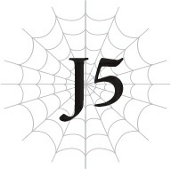

# J5 Julius, 13 tuổi: Âm mưu
*(Julius, Age 13: Machinations)*

Tôi bước qua những hành lang quen thuộc của hoàng cung Vương quốc Analeit.
Nói cách khác, ngôi nhà thời thơ ấu của tôi.
Kể từ khi trở thành Anh hùng, tôi chủ yếu ở trong căn phòng được cấp cho mình tại Thánh quốc Alleius, nên đã lâu rồi tôi không trở lại đây, nhưng tôi vẫn nghĩ nơi này là nhà thực sự của mình.
Ở nơi này giúp tôi cảm thấy bình yên theo cách mà căn phòng ở Alleius không bao giờ có thể mang lại.
Nhưng đó chỉ là cảm giác của tôi. Bám chặt vào tay tôi khi chúng tôi bước đi, Yaana trông vô cùng lo lắng.
Thay vì trang phục Thánh nữ thông thường vốn đơn giản và được thiết kế để dễ di chuyển, cô ấy đang mặc một chiếc váy màu trắng.
Đó là một thiết kế trang nhã, phù hợp với một Thánh nữ, nhưng bạn vẫn có thể nhận thấy ngay từ cái nhìn đầu tiên mức độ đắt đỏ của nó.
Nó được may riêng cho Yaana, nên rất hợp với cô ấy.
...Hoặc ít nhất là như vậy, nếu khuôn mặt của cô ấy hiện tại không quá căng thẳng đến mức sự lo âu hiện rõ mồn một.
Chuyển động của cô ấy cũng cứng nhắc không kém, đến mức tôi không chắc liệu cô ấy có thể đi lại mà không bị vấp ngã nếu không có tôi hộ tống bên cạnh.
Yaana và tôi đến đây để tham dự một buổi lễ đặc biệt.
Đây là lần đầu tiên Yaana đặt chân vào hoàng cung, và cô ấy đã vô cùng lo lắng dọc đường đi về việc mọi chuyện sẽ ra sao.
Như nhiều cô gái bằng tuổi, cô ấy dường như có một sự ngưỡng mộ nhất định đối với ý tưởng lãng mạn về một tòa lâu đài.
Cô ấy không nói ra thành lời, nhưng Yaana luôn là người dễ đọc vị, nên tôi có thể nhận ra cô ấy đang rất hào hứng.

---

Nhưng khi chúng tôi thực sự có mặt ở đây, sự lo lắng của cô ấy dường như đã lấn át mọi cảm xúc khác.
Biết tính cách nghiêm túc của cô ấy, cô ấy có lẽ đang tự đặt áp lực cực kỳ lớn lên bản thân, nghĩ rằng mình không được phép làm bất cứ điều gì gây xấu mặt với tư cách là Thánh nữ.
“Yaana.”
Với đà này, tôi cảm thấy cô ấy thực chất lại càng có nhiều khả năng tự làm mình xấu mặt hơn, nên tôi giữ cô ấy lại trước khi chúng tôi bước vào phòng nghi lễ.
Cô ấy quay người lại với một tiếng cọt kẹt như thể phát ra thành tiếng, giống như một cánh cửa có bản lề đang rất cần được tra dầu.
“Cô đang lo lắng à?”
“D-Dĩ nhiên... là không... rồi.”
Lời đó chẳng có chút thuyết phục nào khi giọng cô ấy ngập ngừng và nhỏ đến mức tôi khó lòng nghe rõ.
“Cô lo lắng thật mà, đúng không?”
“...Vâng, đúng vậy. Tôi xin lỗi.”
Cô ấy trông có vẻ đau khổ, nhưng tôi nghĩ việc không biết nói dối là một trong những đức tính tốt của cô ấy.
Mặc dù cô ấy có lẽ khó lòng tồn tại được lâu trong giới thượng lưu.
“Việc lo lắng là hoàn toàn bình thường mà,” tôi trấn an cô ấy.
Yaana tuy là Thánh nữ, nhưng cô ấy không xuất thân từ gia đình quý tộc, nên chưa từng tham gia nhiều nghi lễ trang trọng như thế này.
Cô ấy có thể đã từng phụ giúp hậu trường khi còn đang huấn luyện làm ứng cử viên Thánh nữ, nhưng tôi đoán lần duy nhất cô ấy thực sự là một phần của buổi lễ là khi cô ấy chính thức được bổ nhiệm làm Thánh nữ, nên cô ấy vẫn còn thiếu kinh nghiệm.
“Tôi biết mình không được phép lo lắng, nhưng tôi không thể ngăn bản thân được...” Giọng cô ấy run rẩy.
“Không, tôi không nghĩ có điều gì sai trái ở đó cả.”
Cô ấy dường như cảm thấy lo lắng là một lỗi lầm, nhưng tôi khẳng định với cô ấy rằng điều ngược lại mới đúng.
Yaana chớp mắt nhìn tôi một cách không chắc chắn, như thể cô ấy không hiểu.
“Nếu cô cứ nghĩ rằng mình không được phép lo lắng, điều đó sẽ chỉ làm mọi chuyện tệ hơn thôi. Nhưng lo lắng vào những thời điểm thế này là chuyện bình thường, nên tốt hơn hết cô đừng cố ép bản thân phải tỏ ra bình tĩnh.”

---

“Nhưng...”
“Có một mức độ lo lắng vừa phải là tốt nhất. Cô có hiểu ý tôi không?”
Trong trận chiến hay những tình huống tương tự, việc hơi căng thẳng một chút sẽ tốt hơn là hoàn toàn thư giãn.
Tất nhiên, nếu cô quá lo lắng, cô sẽ không thể hoạt động bình thường được, giống như Yaana lúc này.
Nhưng sự lo lắng không hẳn là một điều xấu, ngay cả khi rất khó để điều tiết nó ngay tại thời điểm đó.
Nếu cô có thể giữ nó ở mức độ vừa phải, nó sẽ giúp cô tập trung và luôn cảnh giác.
“Tôi không phiền việc cô lo lắng. Và cũng không cần phải quá tập trung vào việc không được thất bại. Nếu cô nỗ lực hết mình tại thời điểm đó, tôi nghĩ kết quả tốt đẹp sẽ tự nhiên theo sau. Vì vậy, hãy thả lỏng hai vai một chút nhé? Sẽ thật lãng phí nếu cô quá lo lắng đến nỗi không thể thể hiện phiên bản tốt nhất của chính mình.”
Yaana chậm rãi gật đầu, như thể đang tiếp thu những gì tôi nói.
“Ngài thật tuyệt vời, ngài Julius. Lời nói của ngài thực sự có sức thuyết phục, không giống như của ai đó.”
Tôi chắc chắn cô ấy đang ám chỉ Hyrince.
Cậu ấy hẳn lại vừa trêu chọc cô ấy như thường lệ.
“Hãy nhớ rằng, cái 'ai đó' kia cũng sẽ có mặt trong phòng lễ đấy.”
Nếu cô ấy cứ lo lắng và cứng đờ trong suốt buổi lễ, tôi chắc chắn Hyrince sẽ trêu chọc cô ấy về chuyện đó sau này. Khi tôi ẩn ý nhắc nhở một cách nhẹ nhàng, mắt Yaana lập tức mở to.
Cái biểu cảm 'Mình không thể để chuyện đó xảy ra!' hiện rõ mồn một trên mặt cô ấy.
Đôi mắt cô ấy tràn ngập quyết tâm mới để tránh bị trêu chọc.
Người ta nói rằng việc hay cãi nhau là minh chứng cho sự thân thiết của tình bạn, nhưng tôi không chắc điều đó có áp dụng cho Yaana và Hyrince hay không.
Đúng hơn là Hyrince đang trêu đùa Yaana hoặc nắm thóp cô ấy trong lòng bàn tay.
Dù sao thì việc đó dường như cũng giúp cô ấy bình tĩnh lại đôi chút, nên hy vọng cô ấy sẽ không phạm phải sai lầm lớn nào.
Miễn là cô ấy không trở nên quá phấn khích rồi cuối cùng lại phản tác dụng.
“Chúng ta vào trong chứ?”
“Vâng!”
Chúng tôi bước về phía phòng nghi lễ với những bước đi nhẹ nhàng hơn trước.
Chẳng mấy chốc, chúng tôi đã đến trước những cánh cổng lớn và bước vào bên trong, nơi đã tập trung một đám đông lớn.
Buổi lễ vẫn chưa bắt đầu, nhưng căn phòng rất yên tĩnh, mặc dù có nhiều người đang tụ tập ở trung tâm.
Yaana dường như cảm thấy bất an trước bầu không khí kỳ lạ này, nhưng tôi khẽ kéo tay cô ấy và trấn an bằng một nụ cười.

---

Chúng tôi tiến sâu hơn vào trong phòng lễ, đi về phía cuối phòng nơi hoàng gia đang đứng.
Tất cả những người khác đều đã có mặt ở đó: Vương hậu; anh trai tôi, Cylis; đệ nhất và đệ nhị phi tần của nhà vua; và em trai tôi, Leston.
“Chú đến muộn đấy,” Cylis nói với tôi với vẻ mặt không hài lòng.
Anh ấy trước đây chưa từng như thế này, nhưng dạo gần đây, anh ấy lúc nào cũng có vẻ cau có tức giận.
“Em rất xin lỗi. Em đã quá lo lắng cho ngày trọng đại của các em của mình đến mức hầu như không ngủ được đêm qua, nên em e là mình vẫn còn hơi mệt.”
Yaana ném cho tôi một cái nhìn đầy nghi ngờ trước lời xin lỗi của tôi.
Rõ ràng là tôi không thực sự mệt. Chúng tôi đến muộn chỉ vì tôi đang trấn an tinh thần của Yaana.
Tôi nói dối vì không muốn kể chuyện đó cho bất kỳ ai khác, nhưng phản ứng của Yaana có lẽ đã khiến nỗ lực đó trở nên vô ích.
Vì những người thân hoàng tộc của tôi dành cả ngày để quan sát các cận thần khác để tìm ra ngay cả những gợi ý nhỏ nhất về suy nghĩ hay cảm xúc, tôi đoán tất cả họ đều đã đoán ra từ cuộc đối thoại này rằng tôi đang bao che cho Yaana.
“Thôi nào, anh trai yêu quý. Họ đâu có bỏ lỡ phần bắt đầu của buổi lễ đâu, nên không cần phải lườm họ như vậy đúng không?”
Leston can thiệp với anh trai để nói đỡ cho tôi, nhưng việc đó chỉ mang lại tác dụng ngược.
“Hãy lo cho bản thân mình trước đi, Leston. Chú nên gọi anh là Anh cả trong một nghi lễ thế này, chứ không phải xưng hô tùy tiện như vậy.”
Cơn giận của Cylis chuyển sang Leston, mặc dù có khả năng Leston đã cố tình làm vậy để hướng sự chú ý của anh ấy ra khỏi Yaana và tôi.
Leston trông có vẻ dễ tính, nhưng thực chất anh ấy lại khá sắc sảo.
“Đủ rồi đấy.”
Khi cuộc tranh cãi giữa các anh trai tôi có nguy cơ leo thang, một giọng nói lạnh lùng, dứt khoát đã cắt ngang bọn họ: Vương hậu.
“Nhưng, thưa Mẫu hậu...”
“Hãy nhìn xung quanh các con đi. Đừng làm hoàng gia xấu mặt thêm nữa bằng những hành vi khó coi của mình.”
Con trai ruột của bà, Cylis, chùn bước trước lời khiển trách.
Nhận ra đám đông đang theo dõi cuộc trò chuyện của chúng tôi, anh ấy điều chỉnh lại biểu cảm của mình.

---

“Xin hãy thứ lỗi cho sự thiếu lễ độ của con trai tôi.”
Vương hậu xin lỗi Yaana, nhưng bà không hề cúi đầu.
Bà cũng không thèm tự giới thiệu bản thân.
Ở Vương quốc Analeit, việc người có địa vị xã hội thấp hơn tự giới thiệu bản thân trước được coi là đúng lễ nghi.
Yaana là Thánh nữ và đến từ Thánh quốc Alleius, nên cô ấy không có mối quan hệ cấp bậc cụ thể nào với Vương hậu.
Nhưng cô ấy tham gia nghi lễ này với tư cách là bạn đồng hành của tôi.
Tôi là Anh hùng, nhưng ở Vương quốc Analeit, tôi vẫn xếp dưới Vương hậu.
Nếu Vương hậu giới thiệu bản thân trước, bà sẽ gián tiếp ám chỉ với mọi người xung quanh rằng bà thấp hơn tôi về địa vị xã hội; còn nếu Yaana giới thiệu trước, điều đó có thể tạo cảm giác như cô ấy đang làm giảm thể diện của Thánh quốc Alleius.
Thật khó để quyết định xem liệu Yaana có nên tự giới thiệu trước hay không.
“Xin cho phép tôi giới thiệu bạn đồng hành của mình. Đây là Thánh nữ Yaana, người có mặt hôm nay với tư cách là bạn đồng hành của tôi.”
Lựa chọn tốt nhất có lẽ là tôi tự mình giới thiệu cô ấy.
Yaana chắc hẳn vẫn còn lo lắng; cô ấy thực hiện một cái nhún người chào cứng nhắc mà không nói lời nào.
Tôi không chắc đó có phải là lựa chọn tốt nhất của cô ấy hay không, nhưng trong thế lực cân bằng kỳ lạ mà tình huống này tạo ra, đó cũng không phải là lựa chọn tồi tệ nhất.
“Cảm ơn cô vì đã chăm sóc Julius của chúng tôi.”
Vương hậu nhìn chằm chằm vào Yaana một cách dò xét khi bà trả lời.
“K-Không có gì đâu ạ. Nếu có gì... ngài Julius mới là người luôn... c-chăm sóc tôi...”
...Cô ấy hoàn toàn bị cứng họng.
Tôi đoán sự lo lắng mà tôi cố gắng xua tan hẳn đã quay trở lại với toàn bộ sức mạnh của nó.
Dù vậy, tôi không thể trách cô ấy.
Bất kỳ ai cũng sẽ bị áp đảo dưới cái nhìn lạnh lùng của Vương hậu nếu không quen với điều đó. Bà ấy là một người rất đáng sợ.
“Buổi lễ sẽ sớm bắt đầu thôi. Tôi e là khoảng thời gian chờ đợi có thể hơi tẻ nhạt, nhưng xin hãy kiên nhẫn.”
Vương hậu dường như đã mất hứng thú với Yaana, bà quay mặt về phía trước một lần nữa.
Các anh trai của tôi và các phi tần làm theo bà, im lặng và đứng nghiêm chỉnh.
Yaana trông như thể sắp bật khóc đến nơi, nên tôi thì thầm “không sao đâu” với cô ấy và xếp hàng đứng cạnh những người còn lại trong hoàng gia.

---

Mặc dù thành thật mà nói, tôi không chắc mọi chuyện có thực sự ổn hay không...
Tôi nghĩ Vương hậu có lẽ đã đưa ra đánh giá về Yaana trong cuộc tiếp xúc ngắn ngủi đó và coi cô ấy là một người không có tầm quan trọng đặc biệt nào, một người bà có thể phớt lờ.
Thực tế là Yaana chưa bao giờ có cơ hội tự giới thiệu bản thân là bằng chứng đủ rõ ràng cho điều đó.
Ánh mắt lạnh lùng như thép của Vương hậu rất khó đọc vị, nên thành thật mà nói, tôi hiếm khi biết bà đang nghĩ gì.
Cha tôi có hai khuôn mặt, một của nhà chính trị và một của một người cha, nhưng Vương hậu dường như chỉ luôn thể hiện vế trước.
Bà ấy là một chính trị gia kiểu mẫu, theo một cách khác với Giáo hoàng.
Giáo hoàng luôn thực hiện vài âm mưu đằng sau nụ cười hiền hậu của mình, trong khi Vương hậu chỉ đơn giản là che giấu mọi thứ bằng một cái nhìn lạnh lùng.
Đó là những gì tôi trải nghiệm, ít nhất là cho đến nay.
Nên tôi không biết chính xác bà thực sự nghĩ gì về Yaana.
Nhưng bất kể bà có nghĩ gì trong thâm tâm, tôi chắc chắn thái độ của bà sẽ không bao giờ thay đổi.
Chừng nào Yaana còn là Thánh nữ, bà ít nhất nên dành một chút tôn trọng cho địa vị đó.
Tôi chỉ không chắc liệu điều tương tự có áp dụng cho bản thân Yaana hay không.
“Bệ hạ đã đến.”
Sau vài phút nữa trôi qua trong cùng một bầu không khí căng thẳng kỳ lạ đó, buổi lễ cuối cùng cũng bắt đầu.
Cha tôi bước vào phòng và đứng đằng sau một chiếc bục gỗ gần phía sau.
“Hoàng tử Schlain và Công chúa Suresia đã đến.”
Tiếp theo, tên của các em út tôi được xướng lên.
Một cánh cửa mở ra đối diện với chiếc bục, Schlain và Sue bước vào.
Chúng bước đi chậm rãi và đĩnh đạc dọc theo tấm thảm đỏ ở giữa phòng.
Bạn thậm chí có thể mô tả sải bước của chúng là vô cùng uy nghiêm, bất chấp độ tuổi còn nhỏ.
Chúng có vẻ không lo lắng chút nào; chúng bước đi đầy tự hào, như thể việc mọi người trong phòng đổ dồn ánh mắt vào chúng là điều hiển nhiên, và những tiếng xì xào ngưỡng mộ bắt đầu gợn lên trong đám đông.
Cuối cùng, Schlain và Sue đến trước bục gỗ và quỳ xuống.
“Lễ Thẩm định bây giờ xin được bắt đầu,” cha chúng tôi tuyên bố.
Hôm nay là lễ Thẩm định của Schlain và Sue.

---

Tôi đã xin nghỉ phép một thời gian từ lực lượng đặc nhiệm để có mặt ở đây.
Phần còn lại của đơn vị vẫn đang hoạt động mà không có chúng tôi, điều đó khiến tôi hơi chạnh lòng, nhưng ngài Tiva đã tử tế khuyến khích tôi trở về để chứng kiến ngày các em mình tỏa sáng.
Kể từ khi chúng tôi tiêu diệt chi nhánh của tổ chức buôn người đóng tại ngôi làng bỏ hoang, các chỉ huy đã ngừng phàn nàn về hành động của tôi, đúng như lời hứa của họ với ngài Tiva.
Nhờ đó, tôi đã có thể đảm nhận vai trò nổi bật hơn trên tiền tuyến, trong khi ngài Tiva đưa ra mệnh lệnh từ phía sau.
Biết rằng Tiva đang hỗ trợ mình từ phía sau, tôi có thể tập trung chiến đấu mà không cần giữ sức.
Và ông ấy vẫn tiếp tục giúp đỡ tôi dọc đường đi, khiển trách các chỉ huy khi cần thiết.
Kết quả là, các chỉ huy đang dần bắt đầu thừa nhận tôi, tất cả đều nhờ vào những nỗ lực của ngài Tiva.
Tôi không thể cảm ơn ông cho đủ trước tất cả những gì ông đã làm cho tôi.
“Nào, Schlain Zagan Analeit. Con có thể đứng lên.”
“Vâng, thưa cha.”
Tôi từng không chắc liệu mình có nên tham dự nghi lễ này hay không, nhưng giờ tôi rất vui vì mình đã trở về.
Em trai tôi, Schlain, vốn đã trưởng thành hơn tuổi, nhưng em ấy đã lớn khôn hơn nhiều so với những gì tôi mong đợi.
Tôi ước mẹ của chúng tôi cũng có thể chứng kiến em ấy lớn lên, nhưng tôi sẽ phải thay mẹ quan sát em ấy thật kỹ.
Nhưng khoảnh khắc xúc động của tôi nhanh chóng trôi qua.
Khi kết quả Thẩm định của Schlain được trình chiếu bằng ma thuật lên bức tường, sự im lặng trong phòng lễ bị phá vỡ hoàn toàn.

| Thông số | Giá trị |
| --- | --- |
| **Chủng tộc** | Con người (Human) |
| **Cấp độ (Level)** | 1 |
| **Tên (Name)** | Schlain Zagan Analeit |
| **HP** | 35 / 35 |
| **MP** | 348 / 348 |
| **SP (Vàng)** | 35 / 35 |
| **SP (Đỏ)** | 35 / 35 |
| **Sức tấn công trung bình** | 20 |
| **Sức phòng ngự trung bình** | 20 |
| **Sức mạnh ma pháp trung bình** | 314 |
| **Kháng tính trung bình** | 299 |
| **Tốc độ trung bình** | 20 |
| **Điểm kỹ năng (Skill Points)**| 100,000 |
| **Danh hiệu (Titles)** | Không có |

**Kỹ năng (Skills):**
* [Cảm nhận Ma lực LV 8]
* [Thao tác Ma lực LV 8]
* [Ma đấu pháp LV 6]
* [Ban cấp Ma lực LV 5]
* [Ma pháp Công kích LV 3]
* [Tốc độ Hồi phục MP LV 7]
* [Giảm hao phí MP LV 2]
* [Kiếm thuật LV 3]
* [Tăng cường Phá hủy LV 2]
* [Tâm đấu pháp LV 2]
* [Ban cấp Khí lực LV 1]
* [Tập trung LV 5]
* [Chính xác LV 1]
* [Né tránh LV 1]
* [Tăng cường Thị giác LV 4]
* [Tăng cường Thính giác LV 7]
* [Tăng cường Khứu giác LV 2]
* [Tăng cường Vị giác LV 1]
* [Tăng cường Xúc giác LV 1]
* [Mệnh LV 5]
* [Lượng Ma lực LV 8]
* [Bộc phát lực LV 5]
* [Bền bỉ lực LV 5]
* [Cường lực LV 5]
* [Kiên cố LV 5]
* [Sử dụng Kỹ thuật LV 8]
* [Hộ vệ LV 7]
* [Chạy nhanh LV 5]
* [Thần Hộ Mệnh]
* [n% I = W]

Các chỉ hữu và kỹ năng của em ấy vượt xa bất kỳ đứa trẻ bình thường nào tham gia buổi lễ Thẩm định đầu tiên của chúng.
Điều đó thì tốt thôi; Schlain vốn luôn là người đặc biệt mà.
Ngay cả khi không tính đến sự thiên vị cá nhân của tôi, em ấy khách quan là một thần đồng.
Tôi không quá ngạc nhiên trước các chỉ số của em ấy. Nhưng kỹ năng [Thần Hộ Mệnh]... điều đó đáng báo động hơn nhiều.
Đó thực tế là một lời tuyên bố rằng Schlain là một người đặc biệt, được các vị thần yêu thương và ban ơn.
Tôi liếc nhìn sang Vương hậu. Nhưng biểu cảm của bà vẫn cứng đờ như mọi khi, không để lộ bất kỳ suy nghĩ nào.
Sau buổi lễ, chúng tôi chuyển sang giai đoạn tiếp theo: bữa tiệc ăn mừng.
Nhưng thật không may, cảm xúc của tôi quá mâu thuẫn để có thể ăn mừng một cách trọn vẹn.
“Yo. Một vị đại anh hùng mà lại trốn ở một góc thế này sao?”

---

Hyrince nhanh chóng phát hiện ra Yaana và tôi đang lánh nạn sát tường.
“Schlain và Sue mới là những ngôi sao của ngày hôm nay, nên tớ nghĩ tốt nhất chúng ta không nên quá nổi bật.”
“Tớ hiểu.” Hyrince nhún vai.
Thông thường, Yaana chắc chắn sẽ có vài lời giáo huấn trước thái độ tùy tiện của Hyrince, nhưng hôm nay cô ấy lại im lặng như thóc.
Ngược lại, Hyrince cũng kiềm chế không trêu chọc cô ấy như cậu ấy vẫn làm thường ngày.
Cậu ấy có khả năng tỏ ra chu đáo khi thực sự quan trọng, mặc dù tôi ước cậu ấy làm vậy mọi lúc.
“Còn cậu thì sao, Hyrince? Cậu không định đến chúc mừng Schlain và Sue à?”
Hyrince thực chất là con trai thứ của Công tước Quarto, mặc dù thỉnh thoảng người ta rất dễ quên mất điều này.
Là thành viên của một gia đình quý tộc cao cấp thân cận với hoàng gia, cậu ấy thực sự nên đến bày tỏ sự tôn trọng của mình với những nhân vật chính của ngày hôm nay.
“À thì, tớ nghĩ là vì tớ đi cùng cậu, nên sớm muộn gì tớ cũng có cơ hội nói chuyện với họ thôi. Hiện tại, tớ không muốn xếp hàng ở đằng kia đâu.”
Hyrince chỉ tay về phía hàng dài ở giữa phòng khiêu vũ với một nụ cười khô khốc, nơi mọi người đang chờ đợi cơ hội để chào hỏi các em tôi.
Chỉ những quý tộc cấp cao nhất mới được phép tham dự lễ Thẩm định, nhưng bữa tiệc sau đó bao gồm cả một số lượng quý tộc cấp thấp hơn nữa.
Cụ thể là những người có con cái trạc tuổi Schlain và Sue.
Nên bây giờ, các quý tộc đang xếp hàng với hy vọng đưa con cái họ tiếp cận gần hơn với cặp đôi này và có tiềm năng thiết lập mối liên hệ với hoàng gia.
Mặc dù vậy, xem xét kết quả của lễ Thẩm định, tôi lo ngại rằng động cơ của họ có thể còn phức tạp hơn thế nhiều.
“Chuyện này sẽ là một vấn đề lớn đây,” Hyrince nhận định.
“...Ừ.”
“Cái gì cơ?”
Yaana nhìn qua lại giữa hai chúng tôi với vẻ bối rối.
Thay vì giải thích, tôi đưa cho cô ấy chiếc đĩa bánh ngọt mà tôi lấy từ một trong những người phục vụ, vì tôi nhận thấy cô ấy cứ liên tục liếc nhìn nó.
Ngay lập tức, mắt cô ấy sáng lên. Ôi, Yaana. Chẳng bao giờ thay đổi cả.
“Vậy chúng ta nên làm gì?”

---

“Không làm gì cả. Thật đáng tiếc là chúng ta thực sự không thể làm được gì lúc này.”
Vì tôi đang làm việc trong lực lượng đặc nhiệm đặc biệt, tôi không thể can thiệp nhiều vào nội vụ của vương quốc mình.
Ngay cả tầm ảnh hưởng của tôi dưới tư cách là Anh hùng cũng không có tác dụng gì mấy ở đây.
Quyền lực của Vương hậu quá lớn.
Bà ấy cũng nắm giữ phần lớn các quý tộc dưới lòng bàn tay của mình.
Và đối với sự cố hiện tại này, tôi thậm chí còn phải cảnh giác hơn với những kẻ không liên kết với bà.
“Tớ đoán chúng ta chỉ có thể hy vọng Bệ hạ và Vương hậu sẽ giữ chân lũ ngốc đó lại.”
“Ừ.”
Yaana dường như vẫn tò mò về cuộc trò chuyện của chúng tôi, nhưng cô ấy không thể cưỡng lại việc cắn một miếng bánh ngọt.
Mặc dù cô ấy có vẻ không hiểu, Hyrince và tôi đang lo ngại rằng có thể có những động thái nhằm đưa Schlain lên làm vị vua tiếp theo.
Tôi nghĩ các cuộc tranh giành quyền lực tồn tại ở mức độ nào đó tại hầu hết mọi quốc gia.
Vương quốc Analeit không phải ngoại lệ, với các quý tộc âm mưu đằng sau hậu trường ngày qua ngày.
Và trong vài năm qua, đã có những lời bàn tán xôn xao về việc liệu Hoàng tử Cylis có thực sự phù hợp với ngai vàng hay không.
Cylis là con trai duy nhất của Vương hậu, và mặc dù tôi không bao giờ nói điều này ra thành tiếng, anh ấy khá bình thường.
Thành tích, kỹ năng chiến đấu và mọi thứ khác của anh ấy đều ở mức trung bình.
Anh trai tôi đang nỗ lực hết mình để xứng đáng thừa kế ngai vàng. Chỉ là nó không mang lại kết quả như anh ấy mong muốn.
Nhưng anh ấy cũng không hề dưới mức trung bình ở bất kỳ điểm nào.
Với sự hỗ trợ thích hợp, anh ấy sẽ trở thành một vị vua hoàn toàn có thể chấp nhận được.
Vì vậy, thực tế việc Cylis là người thừa kế duy nhất chưa bao giờ là một vấn đề.
Nhưng thành thật mà nói, sự hiện diện của tôi đã làm phức tạp hóa mọi chuyện.
Tôi là Anh hùng — người duy nhất trên thế giới nhận được danh hiệu đặc biệt này.
Và tôi cũng là một hoàng tử của vương quốc này.
Tuy nhiên, điều đó không có nghĩa là tôi nằm trong danh sách ứng cử viên làm vị vua tiếp theo.
Anh hùng chưa bao giờ là người lãnh đạo một vương quốc.
Thực tế, xem xét vai trò của Anh hùng, tôi không nghĩ chuyện đó khả thi — bởi vì Anh hùng phải liên tục chiến đấu chống lại ác quỷ.
Ngoại lệ duy nhất tôi có thể nghĩ đến là Kiếm Vương của Đế quốc Renxandt, vốn là bức tường thành của nhân loại nằm trên biên giới chúng tôi chia sẻ với lãnh thổ của quỷ tộc.
Công việc của Kiếm Vương có thể trùng lặp với Anh hùng đủ để việc đó hoạt động được.

---

Nhưng ngoài ngoại lệ đó ra, mặc dù trong quá khứ có những anh hùng sinh ra trong các gia đình hoàng gia, họ chưa bao giờ làm vua. Và tôi cũng không hề có ý định cố gắng làm điều đó.
Nhưng nếu Anh hùng có một người em trai xuất sắc thì sao?
Một hoàng tử là người thân của Anh hùng vốn đã sở hữu sức hút đáng kể.
Nhưng nếu cậu ta cũng tình cờ tài năng xuất chúng, và thậm chí còn sở hữu một kỹ năng gọi là [Thần Hộ Mệnh]?
Và hiện tại, Vương hậu và phe cánh của bà đang đứng ở trung tâm quyền lực của vương quốc này.
Các quý tộc không liên kết với phe của bà có khả năng sẽ chớp lấy bất kỳ cơ hội nào để lật đổ con trai của Vương hậu, chính là anh trai tôi Cylis, và đưa một người khác lên nắm quyền, người sẽ có lợi hơn cho họ.
Vì tôi là Anh hùng, tôi rất khó để ở lại vương quốc.
Và con trai thứ ba, em trai tôi Leston, đã luôn chủ động giữ khoảng cách với các quý tộc để tránh loại tranh giành quyền lực đó, cố tình biến mình thành một kiểu hoàng tử phá gia chi tử.
Vì vậy, việc các quý tộc nhắm mắt hướng về phía người con trai còn lại, Schlain, là điều tự nhiên.
Với tất cả những yếu tố này đã sẵn sàng, bọn họ chắc chắn sẽ hành động.
“May mắn thay, tình hình hiện tại tương đối ổn định. Trừ khi bọn họ vô cùng ngu ngốc, không ai dám có động thái cố gắng phế truất Hoàng tử Cylis và đưa Hoàng tử Schlain lên vị trí kế vị ngai vàng vào lúc này đâu.”
“Tớ hy vọng cậu nói đúng.”
Hiện tại không chỉ có các quý tộc nhỏ lẻ là phản đối phe của Vương hậu.
Một số trong bọn họ là những nhân vật quan trọng, những người hoàn toàn có thể gây ra sự hỗn loạn không lường trước được.
Chỉ cần nghĩ đến chuyện đó cũng khiến một cảm giác bất an dâng lên từ dưới chân tôi — đặc biệt là khi Schlain có thể là trung tâm của tất cả.
“Tớ hy vọng cậu nói đúng.”
“Oa, chờ chút đã. Em trai cậu khá nhanh tay đấy nhỉ? Mới tuổi đó mà đã dắt tay một cô bé chạy đi rồi!”
“Cái gì cơ?”

---

Tôi vội vàng quay người lại, vừa vặn kịp nhìn thấy Schlain đang dắt tay một cô bé chạy ra khỏi phòng.
“Ai thế kia?”
“Đó là con gái của Công tước Anabald, tớ nghĩ vậy. Hình như tên cô bé là Karnatia? Em trai cậu tinh mắt đấy chứ.”
“Cô bé đó chắc chắn rất dễ thương.”
“Cái gì?! Đó là kiểu con gái ngài thích sao, ngài Julius?!”
Một tay cầm đĩa bánh ngọt, Yaana đột ngột xen vào cuộc trò chuyện với một giọng nói cao vút.
“Không, dĩ nhiên là không rồi. Tôi đâu có nhìn một cô bé nhỏ tuổi theo cách đó chứ.”
“Đ-Đúng vậy...”
Sau lời phủ nhận nhanh chóng của tôi, Yaana trông có vẻ nhẹ nhõm phần nào và tiếp tục ăn bánh ngọt.
...Cô ấy dạo này có vẻ đặc biệt chú ý đến tôi. Việc này có thể không tốt đâu.
“Công tước Anabald ôn hòa hơn phe của Vương hậu. Ông ấy không quá gần gũi với bà, nhưng cũng không đứng quá xa, đặt ông vào một vị thế đặc biệt. Nên cả hai bên đều không thể dễ dàng chạm vào ông ấy. Schlain khá sắc sảo đấy — em ấy chắc hẳn đã mời cô bé đó vì chính lý do đó.”
“Tớ chắc chắn đó chỉ là sự trùng hợp ngẫu nhiên thôi. Sao Schlain có thể biết về những mối quan hệ và tranh giành quyền lực đó ở tuổi của em ấy chứ?”
Mặc dù trong trường hợp của Schlain, tôi không thể hoàn toàn loại trừ khả năng này.
Em trai tôi thỉnh thoảng nói những câu tục ngữ lạ hoặc truyện cổ tích mà ngay cả tôi cũng chưa từng nghe qua; tôi đã nghe lỏm được em ấy kể cho Sue nghe những câu chuyện kỳ lạ, như “Momotarou” và “Issun-Boushi”.
Rốt cuộc em ấy lấy những kiến thức đó từ đâu ra chứ?
Ban đầu tôi nghi ngờ cô hầu gái của em ấy, Anna, nhưng có vẻ nguồn gốc không phải từ cô ấy.
Vì tôi vẫn chưa biết em ấy học những thứ đó từ đâu, nên tôi không thể loại trừ khả năng em ấy đã cố tình lựa chọn con gái của Công tước Anabald.
Ngay cả khi tôi hỏi, em ấy chỉ bảo tôi rằng điều đó đến từ giấc mơ của mình. ...Liệu em ấy có thực sự mơ thấy tất cả những chuyện đó không?
Nếu đó thực chất là tác dụng từ kỹ năng [Thần Hộ Mệnh] bí ẩn của em ấy thì sao? Nếu kỹ năng đó có thể gây ra những kiểu khải thị của thần linh, điều ấy sẽ giải thích được rất nhiều thứ.
Nhưng cho dù em ấy tiếp cận con gái của Anabald bằng sự trùng hợp ngẫu nhiên hay do thần linh can thiệp, tôi đoán điều đó cũng không làm thay đổi tình hình hiện tại.

---

“Dù sao đi nữa, Schlain vẫn còn quá nhỏ cho những chuyện đó.”
“Nhưng đính hôn hoàng gia thường diễn ra theo cách đó mà.”
“Đính hôn ư?!”
Vài người quay đầu lại nhìn chúng tôi trước tiếng hét thất thanh của Yaana.
Cô ấy há hốc mồm kinh ngạc và vội lấy tay che miệng, nhưng đã quá muộn.
Yaana nhìn tôi cầu cứu, nhưng tất cả những gì tôi có thể làm là mỉm cười bất lực.
Ngay cả Hyrince cũng nhăn mặt, và lần này, đó có vẻ không phải là diễn kịch.
“...Giờ thì sao đây? Tin đồn có xu hướng bị phóng đại lên rất nhanh. Tớ cá là đến ngày mai mọi người sẽ đồn thổi rằng Hoàng tử Schlain và Tiểu thư Karnatia đã đính hôn với nhau mất.”
“Tớ không nghĩ chúng ta có thể làm gì nhiều đâu, đặc biệt là khi chúng nắm tay nhau như những người bạn thân. Có lẽ đã quá muộn rồi.”
“Hả? Cái gì cơ?! Tôi đã làm gì sai sao?!”
“Không sao đâu.”
Tôi đưa cho Yaana đĩa bánh ngọt thứ hai để làm cô ấy bình tĩnh lại.
Ánh mắt cô ấy đảo qua đảo lại giữa mặt tôi và chiếc bánh ngọt, nhưng cuối cùng đã dừng lại ở vế sau.
Khoảnh khắc Schlain và Tiểu thư Karnatia làm một việc đáng chú ý như vậy, việc họ trở thành đề tài đàm tiếu có lẽ là điều không thể tránh khỏi.
Phải thừa nhận rằng Yaana có lẽ đã đổ thêm dầu vào lửa khi hét toáng lên về chuyện đính hôn, nhưng tôi không nghĩ những gì cô ấy làm là quá tệ.
Hơn nữa, giống như Hyrince đã nói, việc Schlain có mối liên kết với gia đình Công tước Anabald không hẳn là điều xấu.
Nếu có gì, một hôn ước với Karnatia có lẽ sẽ là điều tốt cho em ấy — đó là nếu bạn không tính đến cảm xúc của em ấy, hoặc một vấn đề lớn khác.
Nếu Schlain thực sự phải lòng Karnatia từ cái nhìn đầu tiên hay điều gì tương tự thế, thì tôi sẽ rất vui mừng được cổ vũ cho họ.
Nhưng vẫn còn một vấn đề nghiêm trọng khác.
“Ái chà. Suresia đang phớt lờ mệnh lệnh của Bệ hạ và đuổi theo họ kìa.”
“Ừm, có vẻ là như vậy.”
Tôi cười trừ khi nhìn chằm chằm vào trở ngại lớn nhất đối với hôn ước tiềm năng của Schlain: em gái cùng cha khác mẹ của em ấy, Sue, đang nổi trận lôi đình đúng như tôi dự kiến.
“Ơ, tớ vừa nghe thấy một tiếng đổ vỡ khá lớn đấy. Cậu nghĩ họ có sao không?”
“...Có lẽ là có sao đấy.”
Một tiếng động lớn vang vọng khắp căn phòng, có thể nghe rõ ngay cả giữa những tiếng trò chuyện ồn ào.
Tôi chắc chắn ai cũng có thể nghe thấy nó.
Các hiệp sĩ chịu trách nhiệm canh gác phòng lễ vội vàng hành động, và có vẻ như họ thậm chí có thể bắt đầu sơ tán mọi người.
Vì tôi lờ mờ đoán được chuyện gì đang diễn ra, tôi không thể không rên rỉ.
“Xin lỗi Hyrince, nhưng cậu có phiền bảo các vệ binh rằng không cần phải gây náo loạn lên không?”
“Hiểu rồi.”
Vào những lúc thế này, thật tuyệt vời khi có một người bạn sẽ thực hiện những gì bạn yêu cầu mà không cần giải thích thêm một lời.
Yaana đang bồn chồn bối rối, hai tay cầm chiếc đĩa trống thứ hai.
“Tôi xin lỗi, Yaana. Cô có thể đợi ở đây một chút được không?”
Xem xét thảm họa mà tôi có thể cần phải kiềm chế, thật khó để chăm sóc cô ấy bên cạnh mọi việc khác.
Tôi cảm thấy tệ khi bỏ cô ấy lại đây một mình, nhưng cô ấy sẽ phải tự xoay xở thôi.
Nói xong, tôi vừa đi vừa chạy nhanh về phía nguồn phát ra âm thanh.
Rồi có tiếng đổ vỡ thứ hai. Mồ hôi lạnh chảy dài trên lưng tôi khi tôi tăng tốc bước chân.
Khi tôi đến căn phòng nhỏ đó, tôi nhìn thấy gần như chính xác những gì mình lo sợ: một cánh cửa bị vỡ, một Tiểu thư Karnatia mặt cắt không còn giọt máu, và Sue đang ôm chặt lấy Schlain.

---

Vấn đề cực kỳ lớn của Schlain là em gái cùng cha khác mẹ của em ấy, Sue, hoàn toàn yêu thương em ấy.
Anh em cùng cha khác mẹ hay không, việc một người ruột thịt có tình cảm lãng mạn với em ấy vốn đã đủ tệ rồi, nhưng mức độ mãnh liệt trong sự gắn bó của Sue lại càng khiến mọi chuyện tồi tệ hơn nhiều.
Theo Schlain, những cô gái thể hiện tình yêu của họ giống như Sue được gọi là yandere, bất kể điều đó có nghĩa là gì.
Nếu Schlain đính hôn, Sue có khả năng sẽ gây tổn hại nghiêm trọng đến cô gái được nhắc tới.
May mắn thay, có vẻ như lần này em ấy chưa làm gì Karnatia, nhưng em ấy chắc chắn đang phóng một cái nhìn đầy sát khí về phía cô bé.
“Cháu có bị thương không?”
“Ch-Cháu không sao ạ.”
Đầu tiên, tôi đảm bảo rằng Karnatia được an toàn.
“Sue, em thừa biết mình không nên làm những chuyện như thế này mà.”
“Tất cả là tại con nhỏ lẳng lơ kia dám cố tình quyến rũ anh trai em!”
“Ôi, Sue...”
Tôi cố gắng khiển trách em ấy, nhưng em ấy có vẻ không chút hối lỗi.
“Dù sao thì em cũng phải buông Schlain ra đã chứ. Em không thấy em ấy đang khó thở sao?”
Khi Sue vòng tay ôm chặt lấy em ấy, một tiếng rên khẽ thoát ra khỏi môi Schlain.
“Anh trai yêu quý của em chắc chắn có thể chịu đựng được tình yêu của em mà.”
“Anh thì không chắc chắn về chuyện đó đâu, nên làm ơn thả em ấy ra đi.”
Sue từ chối nghe lời, nên tôi buộc phải kéo em ấy ra khỏi người Schlain.
“Cảm ơn anh.” Em ấy ho khục khặc.
“Schlain, em cũng nên cẩn thận về việc quá nuông chiều Sue đấy nhé? Nếu em muốn em ấy dừng lại, hãy nói ra.”
“Anh trai yêu quý sẽ không bao giờ từ chối em đâu.”
“Ư... cậu nói đúng đấy. Tớ sẽ tự giải quyết.”
Schlain nhăn mặt bất lực, trong khi Sue có vẻ như đang khoe khoang vì lý do nào đó.
Tôi thở dài thườn thượt trước toàn bộ tình huống này.
Trong suốt cuộc đối thoại, Karnatia đứng nhìn ngơ ngác.
Tôi không thể nói là mình trách cô bé.
Bây giờ đã quá rõ ràng rằng Schlain sẽ phải gặp một số rắc rối nghiêm trọng với phụ nữ từ đây về sau.
Ngay khi tôi chuẩn bị thông báo cho các hiệp sĩ rằng mọi chuyện đã lắng xuống, nhà vua và vương hậu xuất hiện bên ngoài căn phòng.
Cha tôi trông có vẻ lo lắng, trong khi Vương hậu vẫn không biểu lộ cảm xúc như thường lệ.
Bà đang nghĩ gì khi nhìn vào Schlain chứ?
Tình cảm không phải là thứ duy nhất mà Schlain có thể gặp rắc rối; còn có rất nhiều khó khăn nhiều khả năng đang chờ đợi em ấy trên con đường phía trước.
Tôi bước về phía nhà vua và vương hậu.
“Mọi chuyện ổn cả rồi ạ.”
“Ồ? Ta rất mừng khi nghe thấy điều đó.”
Cha tôi đặt một tay lên ngực nhẹ nhõm.
“Cha có thể trông chừng Schlain giúp con được không ạ?”
“Tất nhiên rồi.”
Khi tôi đưa ra lời thỉnh cầu với cha kèm theo ý nghĩa sâu xa đằng sau từ ngữ, ông ấy đã đồng ý ngay lập tức.
Tuy nhiên, Vương hậu không nói một lời nào.
Với tư cách là anh trai của em ấy, tôi sẽ phải làm bất cứ điều gì có thể để đảm bảo rằng em ấy có một tương lai hạnh phúc.

---

“...Ông vừa nói cái gì cơ?”
Một ngày sau lễ Thẩm định của Schlain và Sue, tôi nhận được một tin tức dường như không thể tin nổi.
“Ngài Tiva đã tử trận.”
Ngay ngày hôm sau ngày ăn mừng chiến thắng của các em mình, tôi đã mất đi một người vô cùng yêu quý đối với tôi.

---

[◀ Chương trước: Nhật ký của Sophia 4](11_sophias_diary_4.md) | [Chương tiếp theo: Chương đặc biệt: Những giờ phút cuối cùng của Lão binh Đế quốc ▶](13_special_chapter_the_empire_veterans_final_hours.md)
