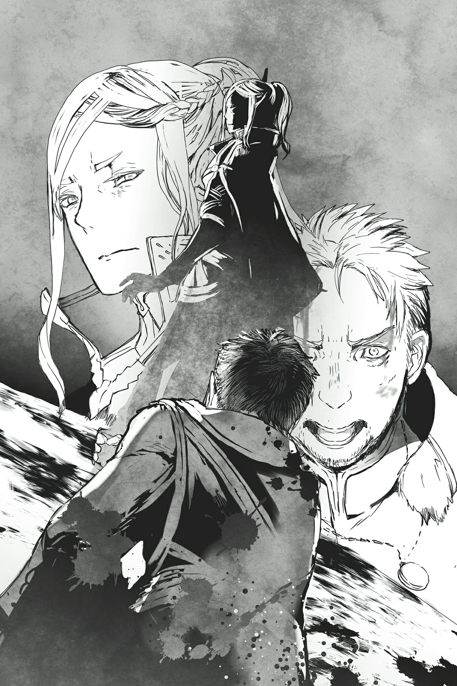

# Chương đặc biệt: Những giờ phút cuối cùng của Lão binh Đế quốc

*(Special Chapter: The Empire Veteran’s Final Hours)*

Tôi quyết định gia nhập lực lượng đặc nhiệm chống buôn người vì một mối thâm thù cá nhân.

Con trai và con dâu tôi rốt cuộc cũng có con, cùng thời điểm đó đứa con đầu lòng của Kiếm Vương cũng chào đời, nên cả đế quốc dường như chìm trong bầu không khí ăn mừng hân hoan.

Nghĩ lại, tôi chắc chắn mình khi đó cũng vậy.

Có lẽ đó là lý do tại sao tôi đã không ngăn cản con trai và gia đình nó ra ngoài mà không có đội cận vệ đi kèm, một quyết định khiến tôi phải hối hận cho đến tận ngày hôm nay.

Tôi sẽ không bao giờ lơ là cảnh giác như vậy trong cuộc chiến với ma tộc.

“Cận vệ ư? Không cần chuyện đó đâu cha. Cha nghĩ con trai cha yếu đuối đến mức không thể tự bảo vệ bản thân mình sao?”

Tại sao khi đó tôi lại không gạt đi những lời tự tin của con trai mình chứ?

Thậm chí, tôi vẫn nhớ mình đã cảm thấy ấn tượng với nó.

Giá như lúc đó tôi cảnh báo nó rằng sự kiêu ngạo đó sẽ hại chết nó, có lẽ tương lai đã khác.

Con trai tôi và gia đình nó không bao giờ trở về, họ được tìm thấy đã chết vào ngày hôm sau.

Một vụ tai nạn xe ngựa... hoặc ít nhất là được tạo hiện trường giả giống như vậy.

Trên thực tế, con trai tôi, con dâu và đứa cháu của tôi đều bị ám sát bởi một kẻ thủ ác ẩn danh.

Tôi đã săn lùng kẻ thủ ác như một kẻ mất trí, sử dụng mọi phương tiện có sẵn để thu thập từng manh mối nhỏ nhất liên quan đến vụ án mạng.

Con trai tôi không hề yếu đuối, đúng như những gì nó đã kiêu hãnh khẳng định với tôi.

Vì nó sinh ra sau khi ma tộc đã im hơi lặng tiếng, nó không có nhiều kinh nghiệm chiến đấu thực chiến, nhưng nó vẫn là niềm tự hào và niềm vui lớn nhất đời tôi.

---

Nó rất mạnh, đủ để đọ sức với hầu hết đàn ông, ngoại trừ những cựu binh gia giàu kinh nghiệm như tôi.

Trong số những người bạn cùng lứa, những thanh niên chưa từng nếm trải chiến tranh, nó chắc chắn là một trong những kẻ mạnh nhất.

Nhưng ai đó đã hạ sát con trai tôi một cách vô cùng điêu luyện và dễ dàng.

Với phương thức và sức mạnh đòi hỏi phải có để làm việc đó, chắc chắn có một âm mưu lớn hơn đang vận hành.

Và cùng lúc đó, những vụ mất tích nhiều khả năng là bắt cóc bắt đầu diễn ra.

Không mất nhiều thời gian để tôi liên kết hai sự việc này, cũng như xác định được có một tổ chức lớn đứng sau chúng.

Sai lầm duy nhất của tôi là đánh giá sai quy mô khổng lồ của tổ chức đó.

Tôi chưa từng tưởng tượng rằng những vụ bắt cóc tương tự lại đang diễn ra trên toàn thế giới chứ không riêng gì ở Đế quốc. Dù biết nó lớn, tôi từng cho rằng nó chỉ giới hạn ở khu vực này, nhưng nó đã vượt xa kỳ vọng của tôi.

Nếu tổ chức đó chỉ nằm trong phạm vi Đế quốc, tôi đã có thể tự mình truy quét sạch bọn chúng.

Nhưng giờ cuộc tìm kiếm phải mở rộng sang các quốc gia khác, việc đó quá tầm kiểm soát để một mình tôi tự xoay xở.

Có lẽ chuyện này khả thi nếu chỉ giới hạn trong Đế quốc và các nước đồng minh lân cận, nhưng phạm vi của tổ chức đã vượt ra ngoài cả đại lục, đến những nơi mà Đế quốc không hề có quyền hạn nào.

Ngay cả trên đất của đồng minh, việc điều tra cũng rất khó khăn nếu không có lý do chính đáng, đi kèm với đó là rất nhiều khâu chuẩn bị và giấy tờ thủ tục phức tạp.

Vào thời điểm tôi gần như đã quét sạch tổ chức bên trong Đế quốc, tôi không còn làm được gì khác nữa.

Nhưng rồi tôi nhận được tin tức. Thánh quốc Alleius đang thành lập một lực lượng đặc nhiệm đặc biệt xuyên biên giới nhằm truy quét tổ chức buôn người trên quy mô lớn.

Và vì tôi đã và đang chiến đấu chống lại tổ chức này trong Đế quốc của mình, tôi đã được mời tham gia.

Tất nhiên, tôi đồng ý ngay mà không chút do dự.

Nếu gia nhập lực lượng, tôi có thể điều tra và triệt phá các chi nhánh của tổ chức ở các vùng đất khác một cách hợp pháp.

---

Tôi không nghi ngờ gì việc Thánh quốc Alleius có động cơ riêng khi thành lập lực lượng này, sau thất bại gần đây trong việc thôn tính Sariella, nhưng chuyện đó không mấy quan trọng với tôi.

Động cơ gia nhập lực lượng của tôi không có gì cao cả, kiểu như bảo vệ các gia đình khác không trở thành nạn nhân. Tôi tham gia với mục đích duy nhất là trả thù cho con trai mình và gia đình nó.

Tất nhiên, tôi cũng quyết tâm cứu những đứa trẻ bị bắt cóc trong Đế quốc, đặc biệt là con gái của Buirimus.

Nhưng mối thâm thù khắc sâu trong xương tủy mới là nhân tố quyết định lớn nhất.

Tôi sẽ tiêu diệt tổ chức này và báo thù cho con trai, con dâu và cháu tôi.

Tôi thừa nhận mình đã phụ lòng Kiếm Vương vĩ đại khi rời đi.

Dù là tạm thời hay không, sự vắng mặt của tôi đã để lại một lỗ hổng đáng kể cho Đế quốc. Vì lý do nào đó, tôi nắm giữ tầm ảnh hưởng mạnh mẽ trong giới quân sự ở đó.

Kiếm Vương vốn đã có rất nhiều kẻ thù, nên sự vắng mặt của tôi có khả năng đẩy ngài ấy vào một tình thế bấp bênh.

Ngài ấy có lẽ đã giao cho tôi trọng trách nuôi dạy con trai mình vì chính lý do đó, với hy vọng giữ tôi lại Đế quốc, nhưng lý do truy lùng tổ chức này của tôi chỉ đơn giản là quá mạnh mẽ.

Vì thế, tôi đã gia nhập lực lượng đặc nhiệm chống buôn người.

Tôi được giao vai trò phó tổng chỉ huy: người nắm quyền thứ hai trên toàn bộ lực lượng.

Nhưng vì chỉ huy thực tế là vị Anh hùng trẻ tuổi, tôi về cơ bản là người đứng đầu.

Tôi tận dụng vị trí này để cống hiến hết mình cho việc nhổ cỏ tận gốc tổ chức.

Điều tra mọi quốc gia, xác định xem căn cứ nào quan trọng nhất và tấn công căn cứ nào sẽ mang lại hiệu quả cao nhất.

Tôi đã đưa ra tất cả những quyết định đó và dẫn dắt lực lượng thành công.

Lực lượng đặc nhiệm này là một tập hợp hỗn độn gồm các binh sĩ đến từ nhiều vùng miền khác nhau.

Xét riêng lẻ, họ đều là những chiến binh tinh nhuệ, nhưng rất khó để kiềm tỏa tất cả họ dưới một hệ thống cấp bậc rõ ràng.

Mỗi khi chúng tôi bàn thảo về hành động tiếp theo, mỗi chỉ huy đều khăng khăng đòi thực hiện mong muốn của riêng mình, khiến tiến trình gặp nhiều khó khăn.

Nhưng tôi đã xoay xở thúc đẩy và sử dụng vị trí phó tổng chỉ huy để đưa ra quyết định cuối cùng sau những cuộc tranh luận kéo dài này và giúp mọi chuyện tiến triển.

---

Tôi tự hỏi có bao nhiêu người trong số họ nhận ra rằng tôi thực ra chỉ đang áp đặt ý chí của mình lên bọn họ.

Nhưng tôi biết mình đang lựa chọn những chiến thuật hiệu quả nhất để đập tan tổ chức buôn người, vốn là mục tiêu của lực lượng này, nên tôi nghi ngờ có ai phàn nàn ngay cả khi họ nhận ra điều đó.

Mặc dù cảm thông với Anh hùng, người buộc phải đóng vai trò bù nhìn hoàn toàn trong cương vị tổng chỉ huy, tôi vẫn có ý định để chuyện này làm một bài học cuộc sống cho cậu bé và tiếp tục đi theo con đường này.

Ngài Anh hùng vẫn còn quá trẻ.

Tôi nghĩ nếu cậu ấy trải nghiệm loại tình huống không như ý này từ sớm, cậu ấy sẽ được trang bị tốt hơn để đối phó với nó sau này trong cuộc đời.

Vai trò Anh hùng đi kèm với rất nhiều nghĩa vụ của người lớn.

Vì vậy, cậu ấy cần phải làm quen với những sự ràng buộc như vậy và học cách khi nào nên tuân theo, khi nào nên rũ bỏ chúng, và khi nào nên tận dụng chúng để tạo lợi thế cho riêng mình.

Dù tốt hay xấu, các thành viên trong lực lượng này là binh lính chứ không phải những chính trị gia xảo quyệt.

Tất cả họ đều chiến đấu vì sự an toàn của quê hương mình, nên tôi tự tin rằng chỉ cần có thời gian, họ sẽ bị thuyết phục bởi sự chân thành và nhân cách của Anh hùng.

Lực lượng này sẽ là một trường huấn luyện hoàn hảo để Ngài Anh hùng học cách đối phó với người lớn trước khi phải đối mặt với những kẻ tinh quái nhất trong tương lai, một cơ hội lớn cho sự trưởng thành của cậu ấy.

Chắc chắn vị Giáo hoàng phái Thần Ngôn luôn đầy toan tính kia đã cân nhắc tất cả những điều này khi bổ nhiệm vị Anh hùng trẻ tuổi vào vị trí đó.

Đúng vậy, ban đầu, tôi dõi theo Anh hùng giống như một người cha quan sát sự trưởng thành của con mình.

Nhưng tôi vẫn đánh giá quá thấp Anh hùng.

Tôi luôn nỗ lực tập trung vào việc tiêu diệt tổ chức buôn người — tâm trí tôi chưa từng nghi ngờ về điều đó.

Nhưng mục tiêu của Ngài Anh hùng là thứ quan trọng hơn nhiều.

Ngay từ đầu, cậu ấy đã hướng mắt về phía người dân.

Và mục tiêu hòa bình.

Vị Anh hùng trẻ tuổi suy nghĩ lung nấu hơn bất kỳ ai trong chúng tôi về cách giảm thiểu số lượng nạn nhân của tổ chức, và cậu ấy đã nỗ lực hết mình để đưa điều đó vào hành động.

Lũ người lớn chúng tôi và những vấn đề vặt vãnh của mình chỉ là thứ tạp âm nền đối với cậu ấy.

---

Điều Ngài Anh hùng quan tâm nhất chính là liệu mình có thể cứu người hay không, và việc phải đi theo tốc độ của chúng tôi sẽ chẳng khác nào một sự cản trở đối với mục tiêu của cậu ấy.

Tôi đã nghĩ mình đang khuyến khích sự trưởng thành của Anh hùng sao?

Thật là một sự hiểu lầm nực cười và đáng xấu hổ làm sao.

Anh hùng nhận lấy vai trò đó chỉ vì cậu ấy xứng đáng với nó.

Ý chí của Ngài Anh hùng của chúng ta đã vượt xa bất kỳ cơ hội phát triển nào mà tôi cố gắng mang lại cho cậu ấy.

Chắc chắn đối với một số người, cậu ấy nghe có vẻ ngây thơ, nhưng quyết tâm đấu tranh vì công lý bất chấp mọi khó khăn có thể là một trong những sức mạnh lớn nhất của cậu ấy.

Ngay khi nhận ra sự ngạo mạn của chính mình, tôi đã lập tức hành động để sửa chữa sai lầm.

Để lực lượng không kìm hãm bước chân Ngài Anh hùng.

Vì mục đích cứu người, chứ không phải vì thù hận cá nhân của tôi.

Đầu tiên, tôi cần các chỉ huy nhận ra rằng họ chỉ đang cản trở Ngài Anh hùng.

Đồng thời, tôi đưa cậu ấy ra tiền tuyến như cậu ấy mong muốn.

Ngài Anh hùng sinh ra là để bảo vệ người khác, chứ không phải để bản thân được bảo vệ.

Do đó, thật vô nghĩa nếu tước đi của cậu ấy cơ hội tham gia vào các trận chiến sinh tử.

Đúng vậy, tôi từng hối hận vì không gửi cận vệ đi cùng con trai mình và gia đình nó.

Nhưng cuối cùng, con trai tôi cũng là một người sinh ra để bảo vệ người khác.

Nó đã chiến đấu để bảo vệ vợ và con trai mình, ngay cả khi thật đáng tiếc là nó đã không thành công.

Khi dõi theo Ngài Anh hùng, tôi bắt đầu nhận ra rằng có lẽ mình nên tự hào về con trai mình vì đã chiến đấu, thay vì tự dày vò bản thân bằng những niềm hối tiếc.

Khi lực lượng đạt được nhiều tiến triển hơn, quân sĩ bắt đầu nhìn nhận Ngài Anh hùng bằng con mắt khác.

Họ nhìn nhận cậu như một chiến binh đáng kính trọng, chứ không phải một đứa trẻ cần được bảo vệ.

Đúng như những gì nên thế.

Tất cả chúng tôi đều đã coi nhẹ Anh hùng, bao gồm cả tôi.

Và tôi sớm biết được rằng có một người khác mà tôi vẫn luôn đánh giá thấp.

Giáo hoàng phái Thần Ngôn.

Ông ta lập ra lực lượng này hoàn toàn như một nơi để Ngài Anh hùng rèn luyện.

---

Không chỉ để cậu trải nghiệm việc va chạm với người lớn như tôi nghĩ ban đầu.

Mà là để cậu trải nghiệm những trận chiến thực sự ngoài đời.

Và hơn thế nữa, là để cậu làm quen với việc tước đoạt mạng sống của kẻ khác.

Các thế hệ Anh hùng đi trước đương nhiên được tiếp xúc với chiến đấu nhờ cuộc chiến với ma tộc.

Nhưng giờ khi ma tộc đã ngừng tấn công, hầu hết mọi người đều có ít kinh nghiệm hơn với kiểu giao tranh đó.

Ngay cả các binh sĩ của Đế quốc cũng phần lớn thiếu kinh nghiệm, nên dĩ nhiên một cậu bé như Ngài Anh hùng chưa từng chiến đấu trong một trận thực chiến chống lại đồng loại của mình.

Việc một người đã từng giết người trước đây hay chưa là cực kỳ quan trọng trong kiểu chiến đấu này.

Ngay cả một binh sĩ được huấn luyện kỹ lưỡng nhất cũng sẽ ngần ngại xuống tay tước đoạt sinh mạng lần đầu tiên. Rất thường xuyên, khoảnh khắc do dự đó sẽ dẫn đến cái chết của chính họ.

Ma tộc trông hầu như không khác biệt gì so với con người, nhưng họ mạnh hơn nhiều.

Họ không phải là đối thủ mà người ta có thể do dự trước mặt, ngay cả đối với Anh hùng.

Để chiến đấu chống lại ma tộc, việc tích lũy kinh nghiệm tước đoạt mạng sống của những con người khác trước là vô cùng quan trọng.

Các thành viên của tổ chức buôn người chính là những đối thủ hoàn hảo để Ngài Anh hùng xây dựng kinh nghiệm thực chiến chống lại, vì việc hạ gục chúng sẽ ít gây cắn rứt lương tâm nhất.

Vì thế, Ngài Anh hùng phải học cách giết chóc, ngay cả khi còn ở độ tuổi trẻ như vậy.

Nếu cậu ấy muốn chiến đấu với ma tộc sau này, đó sẽ là một sức mạnh cốt lõi đối với cậu.

Vì vậy, tôi nhận ra một cách kinh hãi rằng vị Giáo hoàng hẳn đã tính toán tất cả những điều này trong các toan tính của mình.

Tôi không nghi ngờ gì về việc có những sự thật ẩn giấu còn kinh hoàng hơn đằng sau tổ chức buôn người vốn được bao phủ trong bức màn bí ẩn này.

Giáo hội Thần Ngôn đã định danh nó như vậy, là “tổ chức buôn người,” nhưng trong thực tế, có rất ít trường hợp các nạn nhân bị bắt được bán làm nô lệ.

Chúng tôi biết rằng một vài nạn nhân thực sự đã bị mua và đưa đi đâu đó, nhưng chúng tôi hoàn toàn không biết chuyện gì xảy ra với họ.

Một số quả thực đã bị bán làm nô lệ hoặc thậm chí được gửi cho những người giám hộ mới, nhưng so với tổng số cá nhân biến mất, những trường hợp như vậy chỉ chiếm một thiểu số cực nhỏ.

---

Số phận của phần lớn các nạn nhân đều là ẩn số, và không có thi thể nào được tìm thấy.

Rốt cuộc những nạn nhân bị bắt trộm này đã bị đưa đi đâu chứ?

Tình trạng các nơi ẩn náu của tổ chức rất đa dạng.

Một số có quy mô khổng lồ, trong khi một số khác lại ẩn náu trong các hang động với số lượng thành viên cực kỳ ít ỏi.

Lũ côn đồ thông thường bắt cóc người, và một ai đó từ tổ chức trả tiền cho chúng rồi đưa họ đi.

Nói cách cách, những gì chúng tôi thường xuyên đối phó chỉ là các băng nhóm tội phạm thông thường, chứ không phải bản thân tổ chức buôn người.

Chúng tôi vẫn chưa bắt giữ được bất kỳ thành viên thực sự nào của tổ chức buôn người.

Hành động của chúng táo tợn và hiển hiện rõ ràng, nhưng lại quá điêu luyện để không để lại bất kỳ dấu vết nào.

Cân nhắc lượng không gian khổng lồ cần có để giam giữ tất cả các tù nhân này, không nghi ngờ gì việc một quốc gia nào đó có can thiệp trực tiếp.

Tôi từng nghi ngờ Sariella và đã tự mình tiến hành một số cuộc điều tra, nhưng cuối cùng đều tay trắng ra về.

Ngoại trừ các căn cứ ở Sariella, nơi chúng tôi không được phép đặt chân tới, chúng tôi đã triệt phá hầu hết các nơi ẩn náu của tổ chức, nhưng vẫn chưa có được bức tranh toàn cảnh về bản thân tổ chức này.

Nếu không phải Sariella đứng sau, tôi nghi ngờ ma tộc, nhưng rất khó tin rằng Đế quốc lại để họ đưa nhiều tù nhân đi qua biên giới một cách dễ dàng như vậy.

Xem xét số lượng nạn nhân khổng lồ, việc vận chuyển họ mà không bị phát hiện tại một thời điểm nào đó là bất khả thi.

Vì Đế quốc luôn canh phòng nghiêm ngặt biên giới với ma giới, tôi không thể tưởng tượng rằng có người lại bỏ lỡ một chuyện rõ ràng như vậy.

Vì vậy, chúng tôi tiếp tục triệt hạ những tên cướp cuối cùng đã bị cắt đứt liên lạc với tổ chức, vẫn hoàn toàn thiếu thốn manh mối về danh tính thực sự đứng sau bọn chúng.

Nếu chúng tôi quét sạch hết tất cả những nơi ẩn náu của tội phạm này, tôi nghi ngờ chúng tôi sẽ không thể truy lùng tổ chức xa hơn được nữa.

Chắc chắn phải có một thứ gì đó, một manh mối quan trọng mà tôi đã bỏ sót.

Nhưng tôi hoàn toàn không biết đó là gì.

Tôi nghi ngờ Giáo hoàng biết rõ, nhưng dĩ nhiên ông ta sẽ không thèm nói cho chúng tôi.

---

Chắc chắn phải có một âm mưu lớn hơn đang vận hành ở đây. Một thứ vượt xa sự hiểu biết của chúng tôi.

Vào ngày Ngài Anh hùng trở về quê hương, tôi đang chuẩn bị cho cuộc tấn công của chúng tôi vào căn cứ tiếp theo của tổ chức buôn người.

Sĩ khí trong lực lượng rất cao.

Được truyền cảm hứng bởi Ngài Anh hùng, quân lính quyết tâm tiêu diệt tổ chức để bảo vệ những người dân vô tội.

Ngay cả khi không có sự hiện diện của cậu ấy, những người khác vẫn có đủ dũng khí để chủ động hành động và cố gắng tiến về phía trước, một điều tôi chưa từng dám tưởng tượng khi lực lượng mới được thành lập.

Ngài Anh hùng nói về chuyện này như thể tất cả đều nhờ tôi làm, nhưng việc duy nhất tôi làm chỉ là dọn dẹp các chướng ngại vật cản trở cậu ấy, bao gồm cả tôi và các thủ lĩnh khác.

Tất cả chuyện này đều nhờ vào tầm ảnh hưởng của Ngài Anh hùng.

Cậu ấy từng do dự không biết có nên về nhà hay không, nhưng tôi biết được rằng đó là để tham dự lễ Thẩm định của các em cậu ấy.

Với tinh thần trách nhiệm cao của mình, tôi chắc chắn cậu ấy cảm thấy ngần ngại khi rời đi trong lúc chúng tôi vẫn đang làm việc, nhưng cậu ấy không cần phải lo lắng về những chuyện đó.

Ngay cả những chiến binh can trường nhất cũng cần có lúc nghỉ ngơi, và cậu ấy nên có mặt trong một sự kiện gia đình trọng đại như vậy.

…Đặc biệt là vì bạn không bao giờ biết được khi nào gia đình mình có thể bị cướp đi.

Tôi cảm thấy cậu ấy nên dành thời gian ở bên họ nhiều nhất có thể và tạo ra thật nhiều kỷ niệm phòng khi một ngày nào đó một người trong bọn họ có thể qua đời.

Sau khi mất đi con trai và gia đình nó, tôi không thể ngừng trăn trở về việc liệu mình có thể dành nhiều thời gian hơn cho họ khi họ còn sống hay không, vì vậy tôi không muốn Ngài Anh hùng hay gia đình cậu ấy phải chịu những nuối tiếc tương tự.

Tất nhiên, tôi không có ý định để cậu ấy mất mạng.

Nhưng giống như con trai tôi, có thể có một ngày vị Anh hùng bị đánh bại ở một nơi nào đó ngoài tầm với của tôi.

Kể từ khi lựa chọn chiến trường, cậu ấy phải sống chung với khả năng luôn hiện hữu của số phận đó.

“Ngài Tiva.”

---

Khi chúng tôi chuẩn bị tấn công, một thuộc hạ của tôi chạy đến, người thường chịu trách nhiệm thu thập thông tin.

“Có chuyện gì thế?”

“Dạ, chúng tôi đã định vị được một nơi ẩn náu của tổ chức ở ngay gần đây.”

“Cái gì cơ?”

Tôi hầu như không tin vào tai mình.

Ai mà ngờ được tổ chức buôn người lại có một nơi ẩn náu nằm gần thủ đô của Thánh quốc Alleius đến thế, ngay nơi đặt trị sở của Thần Ngôn Giáo chứ?

Lập căn cứ ngay dưới mũi tổng hành dinh của lực lượng chúng tôi quả thực là táo tợn tột cùng.

Nhưng có lẽ đó là lý do tại sao chúng tôi không tìm thấy nó sớm hơn?

“Quy mô thế nào?”

“Thật khó nói vì chúng tôi mới vừa phát hiện ra, nhưng nhiều khả năng là quy mô nhỏ.”

“Ta rất ấn tượng là các cậu có thể định vị được nó đấy.”

“Dạ, một người dân đã tình cờ chứng kiến một đứa trẻ bị đưa đi ở ngay khu vực lân cận và đã báo tin cho chúng tôi.”

“Cái gì?”

Điều đó có nghĩa là đứa trẻ vẫn đang bị giam giữ trong căn cứ này sao?

“Chuyện xảy ra lúc nào?”

“Dạ nghe nói là vào sáng nay.”

Tổ chức buôn người hành động rất nhanh chóng trong việc thu nhận các nạn nhân bị bắt cóc.

Chúng tôi không biết bọn chúng đã sử dụng phương thức nào để đến nơi sớm như vậy sau khi lũ cướp bắt giữ ai đó.

Ngay cả bản thân lũ tội phạm cũng không biết bằng cách nào những người đại diện của tổ chức lại có thể giám sát chặt chẽ hoạt động của chúng như vậy.

Vì lũ tội phạm thông thường không có cách nào liên lạc với tổ chức, chúng tôi chưa bao giờ bắt được hơi hướng của chúng, nhưng có lẽ đây là cơ hội ngàn năm có một.

Nếu may mắn, chúng tôi có thể bắt giữ được thành viên tổ chức đến nhận đứa trẻ.

Hoặc ít nhất, có lẽ chúng tôi có thể giải cứu nạn nhân.

“Chúng tôi có khoảng hai mươi người có thể xuất phát ngay lập tức.”

Nếu nơi ẩn náu đó nhỏ, số lượng người đó là quá đủ để giải quyết.

---

“Hừm... chúng ta không có đủ thời gian để xin phép. Chúng ta buộc phải hành động thôi.”

Ngay cả với một lực lượng xuyên biên giới, chúng tôi cũng không được phép tùy tiện tấn công trên lãnh thổ quốc gia khác khi chưa có sự cho phép.

Nhưng đây là tình huống khẩn cấp, nên bọn họ sẽ phải chấp nhận nó thôi.

Nếu tôi đi theo các thủ tục chính thống, chúng tôi có thể sẽ không kịp thời gian, ngay cả khi chúng tôi vốn có thể làm được.

“Dù thế nào cũng hãy phái một sứ giả đi.”

“Rõ, thưa ngài.”

Nếu chúng tôi ít nhất gửi đi một lời giải thích ngay lập tức, hy vọng điều đó sẽ giảm thiểu rắc rối sau này.

Nói xong, tôi tập hợp tất cả những người đã sẵn sàng hành động ngay lập tức, và chúng tôi khẩn trương di chuyển đến nơi ẩn náu mới được định vị.

Nơi ẩn náu mới này là một hang động.

Thông thường có hai loại nơi ẩn náu mà tội phạm sử dụng: hoặc là các khu vực như thị trấn ma, nhà bỏ hoang, hoặc là các hang động như thế này.

Vế sau có thể được chia thành hai nhánh nhỏ: hang động tự nhiên hoặc các hang động từng là tổ của quái vật.

Có một số quái vật đào hố và tạo ra các hang ổ sâu dưới lòng đất để sinh sống.

Những cái hang này thường được coi là tổ hoặc thậm chí là các hầm ngục mê cung nhỏ do quái vật tạo dựng.

Nhiều khả năng, hang động cụ thể này được tạo ra bởi quái vật. Vì đó là một cái hố dốc đứng đột ngột cách không xa khu dân cư, tôi nghi ngờ nó được hình thành tự nhiên.

Sự nguy hiểm của những tổ quái vật cũ này là không thể biết được chúng lớn thế nào bên trong, và chúng thường có cấu trúc phức tạp.

Quái vật có xu hướng tạo ra các đường hầm phức tạp để chống lại những kẻ tấn công từ bên ngoài.

Và vì là hang động dưới lòng đất, chúng thường quá hẹp để các nhóm lớn có thể di chuyển dễ dàng.

“Đây có phải là lối vào duy nhất không?”

“Dạ chúng tôi tin là vậy. Chúng tôi đã lục soát khu vực xung quanh nhưng không tìm thấy lối nào khác.”

Nếu đây thực sự là lối vào duy nhất, thì mục tiêu của chúng tôi không thể trốn thoát chừng nào chúng tôi còn phong tỏa chặt chẽ nó.

“Chúng ta sẽ để bảy người ở lại đây. Nếu có chuyện gì xảy ra, một trong các cậu phải sẵn sàng chạy đi báo tin ngay tức khắc.”

Có tất cả hai mươi hai người chúng tôi ở đây, tính cả tôi. Tôi quyết định để lại một phần ba nhóm canh gác lối vào và cùng những người còn lại đi sâu vào khám phá hang động.

“Hửm?”

Đột nhiên, tôi quay người lại, cảm giác như thể mình đang bị theo dõi.

Nhưng chẳng có ai ở đó cả ngoại trừ một con bọ nhỏ màu trắng.

Có lẽ tôi chỉ đang quá căng thẳng vì những việc chúng tôi chuẩn bị làm.

“Hãy chắc chắn giữ khoảng cách giữa mọi người và tiến lên để không cản trở chuyển động của nhau.”

Khi tôi đưa ra những mệnh lệnh này, tôi bước chân vào trong hang động.

Bên trong rộng rãi hơn tôi nghĩ, nên không gian chật hẹp không phải là vấn đề.

Nhưng nếu nó lớn như thế này, tôi lo ngại có thể có nhiều tội phạm ở đây hơn tôi mong đợi. Chúng tôi không được phép lơ là cảnh giác.

Nhưng trái ngược với mong đợi của tôi, chúng tôi không chạm trán một bóng người nào khi tiến sâu vào trong hang. Và chỉ có một con đường dài duy nhất chứ không phải một mê cung các đường hầm.

Tất nhiên, mười lăm binh sĩ được trang bị đầy đủ chắc chắn sẽ tạo ra tiếng động, bất kể chúng tôi có tiến hành cẩn thận thế nào.

Chắc chắn họ phải nghe thấy tiếng chúng tôi, thế nhưng không có dấu hiệu nào của người đến chặn đường.

Họ đã bỏ chạy rồi sao? Có một lối thoát nào khác mà chúng tôi không tìm ra chăng? Hay họ đã rời đi trước khi chúng tôi đến nơi?

Khi những ý nghĩ này lướt qua tâm trí tôi, tôi đột nhiên cảm thấy như thể cơ thể mình trở nên nặng trĩu.

Và cùng lúc đó, một luồng ánh sáng chói lòa bùng lên dữ dội từ sâu trong hang động.

Một âm thanh đâm vào màng nhĩ vang lên, và tôi ngã xuống đất mà hoàn toàn không hiểu chuyện gì vừa xảy ra.

“Ư... hự!”

---

Cái quái quỷ gì vậy?!

Nhìn về phía trước, tôi thấy các binh lính đi trước tôi cũng đều đã ngã xuống.

Những người ở xa hơn phía trước có vẻ đã chết gần như ngay lập tức.

Máu bắn tung tóe khắp nơi, và trong vài trường hợp, thậm chí vài bộ phận cơ thể đã bị thổi bay.

Những tiếng rên rỉ xung quanh tôi cho thấy vẫn còn vài người sống sót, nhưng không một ai lành lặn.

“Hửm?”

Khi tôi đang nhìn nhận tất cả những điều này, một người đàn ông đơn độc bước về phía chúng tôi, nghiêng đầu đầy tò mò.

Gã cầm một vật gì đó dài và màu đen — không phải một thanh kiếm mà là một loại vũ khí mới nào đó chăng?

Đó có phải là thứ đã hủy diệt nhóm của chúng tôi chỉ trong vòng vài giây ngắn ngủi?

“Biết tính gã đó, ta cứ ngỡ phải có một hai cái bẫy thông minh gì chứ. Có lẽ ta đã nghĩ quá nhiều rồi chăng?”

Người đàn ông lẩm bẩm một mình bằng một giọng điệu đều đều, không chút cảm xúc. Thật kỳ lạ. Thính giác của tôi có vẻ tệ hơn nhiều so với bình thường.

Và các vết thương của tôi mất nhiều thời gian hơn nhiều để hồi phục.

Đáng lo ngại nhất là, bất kể tôi có kỹ năng [Giảm Đau], tôi vẫn bị tấn công bởi một cơn đau đớn dữ dội đến mức gần như quằn quại trên mặt đất.

Chuyện quái gì đang xảy ra thế này?

“Ta đã dựng lên một [Kết giới Phản Kỹ thuật] và sử dụng những viên đạn quý giá, vậy mà ở đây dường như chẳng có gì ngoài lũ tép riu. Thật lãng phí.”

Người đàn ông cau có nói.

Bước đến gần một trong những thương binh đang nằm bất động, rên rỉ trên đất, gã giơ chân lên và nhanh chóng giẫm mạnh xuống đầu người đồng đội tội nghiệp đó.

Như thể gã đang giẫm nát một con bọ. Gã lặp lại hành động này với từng binh sĩ khi di chuyển qua cả nhóm.

Tôi biết mình phải di chuyển, nhưng cơ thể bị thương của tôi không chịu vâng lời.

Và khi tôi đang chật vật, chẳng mấy chốc đã đến lượt mình.

Tôi ngước nhìn người đàn ông, người lúc này đang đứng gần như ngay phía trên tôi.

Tai của gã dài và nhọn hơn tai của chúng tôi.

“Một Elf sao?”

Một cơn chấn động lạnh toát ập đến bên tôi như một trận lở tuyết.

---

Những kẻ chủ mưu đứng sau tổ chức buôn người, quốc gia bí ẩn, nơi cất giữ nhiều nạn nhân biến mất mà chúng tôi chưa từng tìm thấy.

Tất cả đều đã sáng tỏ.

Tôi đã gạch tên họ ngay từ đầu, nhưng có một quốc gia, một chủng tộc có thể biến tất cả những điều đó thành sự thật.

Tộc Elf.

Một chủng tộc được bao phủ bởi bức màn thần bí, những người sống tại một nơi gọi là Làng Elf, nơi con người bị cấm xâm phạm.

Người ta nói rằng toàn bộ tộc Elf đều sống ở đó, nhưng họ nổi tiếng là thường xuất hiện đột ngột và bất ngờ ở khắp nơi trên thế giới, rồi biến mất cũng nhanh chóng không kém.

Nếu họ sử dụng chính những phương thức đó để đưa các tù nhân về Làng Elf, điều đó sẽ giải thích được tất cả.

Và con người không thể vào trong ngôi làng đó, nên dĩ nhiên chúng tôi không thể điều tra.

Và thế nhưng, nơi đó chắc chắn phải đủ lớn để chứa toàn bộ một chủng tộc.

Họ có thể dễ dàng giấu tất cả các nạn nhân bị bắt cóc ở đó.

Ai có thể nghi ngờ rằng tộc Elf lại đứng sau tổ chức buôn người chứ?!

Tộc Elf yêu thiên nhiên, những người luôn phấn đấu vì hòa bình thế giới và đóng góp sức mình cho các nỗ lực từ thiện?!

Và thậm chí là toàn bộ chủng tộc đó đều có liên can!

“Ngài Potimas Harrifenas. Hóa ra ông là kẻ đứng sau tất cả những chuyện này sao?!”

“Hửm?”

---

---

Tôi đã từng nhìn thấy người đàn ông tộc Elf này trước đây.

Ông ta đã ghé thăm Đế quốc dưới tư cách là đại diện tộc Elf vài lần.

“...À. Ta nhận ra khuôn mặt đó. Ngươi đến từ Đế quốc... dù ta đã quên mất tên ngươi rồi.”

Dù tôi nhớ rất rõ ông ta, Potimas lại không nhớ chính xác tôi là ai.

Như thể tôi là một kẻ quá tầm thường để ông ta bận tâm ghi nhớ.

Tôi cảm thấy một cơn tủi nhục run rẩy.

“Ngươi là một người có chức quyền lớn, theo như ta nhớ, nhưng ta khó lòng để ngươi sống sót sau khi ngươi đã nhìn thấy mặt ta ở đây.”

Làm như thể vốn dĩ ông ta có ý định để ai trong chúng tôi sống sót vậy!

Với chút tàn lực cuối cùng, tôi túm chặt lấy chân của Potimas.

“Tên khốn... tên khốn nhà ngươi!”

Tôi hét lên vào mặt ông ta, hầu như không thể tạo thành một câu hoàn chỉnh.

Không còn nghi ngờ gì nữa, người đàn ông này chính là kẻ phải chịu trách nhiệm cho cái chết của con trai tôi và gia đình nó.

Không chỉ có thế, ông ta còn là nguyên nhân gây ra vô số vụ bắt cóc và bi kịch trên toàn thế giới.

Không thể để ông ta sống sót.

Nếu ông ta sống, chắc chắn ông ta sẽ chỉ mang đến những thảm họa lớn hơn nữa.

And then Sir Hero would be in danger.

Và khi đó Ngài Anh hùng sẽ gặp nguy hiểm.

Tôi siết chặt tay bám vào chân ông ta hết mức có thể.

Nhưng tôi không thể làm gì thêm nữa, chỉ có thể trơ mắt nhìn Potimas nhìn xuống tôi một cách thờ ơ và nhấc bàn chân kia lên.

Rồi chiếc ủng đạp thẳng xuống người tôi.

Ngài Anh hùng.

Ý nghĩ cuối cùng của tôi là về con trai, gia đình nó, và khuôn mặt của vị Anh hùng trẻ tuổi.

---

[◀ Chương trước: J5 Julius, 13 tuổi: Âm mưu](12_j5_julius_age_12_machinations.md) | [Chương tiếp theo: Đoạn phụ: Yêu tinh ghét lãng phí thời gian ▶](14_interlude_the_elf_despises_wasting_time.md)
