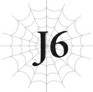

# J6 Julius, 13 tuổi: Sinh tử

*(Julius, Age 13: Life and Death)*

Một tang lễ tập thể đã được tổ chức cho ngài Tiva cùng hai mươi mốt binh sĩ khác đã hy sinh.

Họ là những người đầu tiên thuộc lực lượng đặc nhiệm đặc biệt hy sinh khi đang làm nhiệm vụ.

Tôi chắc chắn không ai ngờ ngài Tiva lại nằm trong số đó, chưa nói đến việc toàn bộ đội ngũ của ông bị xóa sổ hoàn toàn.

Giáo hoàng đích thân chủ trì tang lễ.

Thay vì nụ cười hiền từ thường ngày, ông khoác lên mình vẻ mặt u sầu trong suốt buổi lễ.

Đối với tôi, ông ấy trông thực sự đau buồn trước cái chết của ngài Tiva và những người khác.

Ngay cả sau khi tang lễ kết thúc, tôi vẫn ngồi thẫn thờ trong đền thờ một lúc lâu.

Yaana, Hyrince và những người khác đi ra bên ngoài, nơi các cỗ quan tài được xếp hàng dài.

Sau đó, chúng sẽ được chuyển về quê hương tương ứng của họ để an táng.

Nên bây giờ là cơ hội cuối cùng để tôi nói lời tạm biệt, nhưng... tôi không thể làm được.

Cảm giác ngài Tiva đã ra đi vĩnh viễn vẫn chưa chân thực đối với tôi.

Tôi cảm thấy như mình đang ở trong một cơn ác mộng.

Nhưng tôi chắc chắn rằng một khi nhìn thấy cỗ quan tài của ông, tôi sẽ bị kéo trở lại thực tại, dù muốn hay không.

Ngay lúc này, tôi quá sợ hãi điều đó đến mức không thể nhúc nhích.

Tôi không biết mình đã ngồi đây bao lâu hay có ai đã ngồi cạnh mình từ lúc nào, nhưng tại một thời điểm, tôi nhận thấy sự hiện diện của người đó.

Đó là sư phụ của tôi, Trưởng lão Ronandt.

“Sư phụ... người đến rồi.”

“Ta đến rồi đây.”

Đế quốc nằm ở một lục địa khác với Thánh quốc Alleius.

Việc di chuyển đến đây là vô cùng khó khăn đối với hầu hết mọi người, nhưng là một trong số ít người trên thế giới có thể sử dụng Ma pháp Không gian, sư phụ tôi có thể dịch chuyển tức thời một cách dễ dàng.

---

Họ hẳn đã sử dụng một cổng dịch chuyển để báo tin ngài Tiva qua đời về Đế quốc, khiến sư phụ tôi vội vã đến đây ngay lập tức.

“Chẳng có việc gì diễn ra suôn sẻ cả, nhỉ?”

Không nhìn vào mắt tôi, sư phụ nói khẽ, như thể đang tự nói với chính mình.

“Bọn họ cứ lần lượt chết trước ta, mặc dù tất cả đều trẻ tuổi hơn. Dù ta cho rằng Tiva cũng đã có tuổi rồi. Nhưng tại sao tên khốn đó lại không thể cố chịu đựng thêm một chút và sống thọ hơn ta chứ, chết tiệt thật.”

Mặc dù lời lẽ đầy cay đắng, nhưng ngọn lửa nhiệt huyết thường ngày đã biến mất khỏi giọng nói của ông.

“Hầu hết các chiến hữu của ta từ cuộc chiến với ma tộc đều đã chết và ra đi. Người bạn thân yêu của ta, cựu Kiếm Vương, đã biến mất, nên tất cả những gì còn lại chỉ là lão Kiếm sư kia và ta. Tiva trẻ hơn chúng ta một chút, đúng thế, nhưng ông ấy là một trong những người sống sót cuối cùng của cuộc chiến đó.”

Với giọng điệu đau lòng khôn nguôi, sư phụ thở dài một tiếng dài.

“...Sư phụ, ngài Tiva trong mắt người là một người như thế nào?”

Vì lý do nào đó, tôi không thể không hỏi.

“Con có biết người ta gọi tên đó là gì ở Đế quốc không?”

“Dạ không...”

“Cứu tinh trong Bóng tối.”

Không hiểu sao, nghe thấy điều đó tôi không thực sự ngạc nhiên.

Tôi hiểu từ kinh nghiệm thực tế ông ấy tuyệt vời đến nhường nào.

Chuyện người ta gọi ông là vị cứu tinh chẳng có gì đáng ngạc nhiên cả.

“Kiếm Vương, Kiếm sư, và ta. Ba chúng ta là những kẻ nổi bật nhất trên chiến trường, nhưng Tiva đã lặng lẽ hoạt động siêng năng ở những nơi quan trọng nhất, đóng góp vào chiến thắng của chúng ta. Có người nói lý do duy nhất ba chúng ta có thể chiến đấu không sợ hãi là vì biết ông ấy đang hỗ trợ từ trong bóng tối. Nên một vài kẻ thông thái thậm chí còn kính trọng ông ấy hơn cả chúng ta. Dĩ nhiên, ta vẫn là người tuyệt vời hơn rồi,” ông nói thêm.

Ông ấy không hề phô trương nhưng đủ đáng tin cậy để những người khác có thể chiến đấu mà không sợ hãi hay ngần ngại.

Đó chính xác là những gì ngài Tiva mang lại cho tôi.

Chính nhờ có ông ấy mà tôi mới có thể lao ra tiền tuyến.

Và giờ đây, chúng tôi đã mất đi vị Cứu tinh trong Bóng tối của mình.

“Giá như lúc đó con có mặt ở đó...,” tôi lẩm bẩm không suy nghĩ.

Nếu tôi không bận tham dự lễ Thẩm định, nếu tôi ở bên cạnh ngài Tiva, có lẽ kết quả đã khác.

“Nếu con có mặt ở đó? Hơ.”

Sư phụ khịt mũi.

---

“Có gì đáng cười chứ ạ?!”

Tôi nổi giận bất chấp bản thân.

Nhưng khi chạm vào ánh mắt của sư phụ, cơn giận của tôi lập tức tan biến.

“Có gì đáng cười ư? Tất cả mọi chuyện, dĩ nhiên rồi.”

Giọng ông run rẩy như thể đang cố kìm nén cơn giận dữ của mình.

Ông đang giận, giận hơn tôi rất nhiều.

Nhưng không phải giận tôi.

Tôi không thể hiểu điều gì đã khiến ông giận dữ đến thế, nhưng tôi có thể nhận ra ông đang trút một thứ gì đó khác lên đầu tôi.

“Phải rồi. Gần đây ta chưa làm tròn bổn phận sư phụ cho lắm. Có lẽ đã đến lúc cần rèn luyện thêm chút rồi.”

Nói xong, ông đột ngột đưa tay về phía tôi trước khi tôi kịp tránh né.

Sự mãnh liệt trong cảm xúc của ông khiến tôi đứng chôn chân tại chỗ.

Bàn tay ông chộp lấy vai tôi.

Cùng lúc đó, tầm nhìn của tôi tối sầm lại trong một giây, và đột nhiên chúng tôi không còn ở trong đền thờ nữa.

Chúng tôi đang đứng trên một vùng đất hoang vu, trống trải trải dài hút tầm mắt.

Ông hẳn đã đưa tôi đến nơi nào đó bằng dịch chuyển tức thời.

Nhưng tại sao chứ?

“Bây giờ, hãy lao vào ta như thể con thực sự muốn giết ta vậy. Hửm, và ta đoán mình cũng sẽ nghiêm túc một nửa với con.”

Sư phụ lùi lại vài bước cách xa tôi.

“Hả? Khoan đã...”

“Sao nào? Ta ít nhất sẽ cho con xuất phát trước làm lợi thế. Con không định tận dụng nó sao?”

Tôi vẫn chưa hoàn toàn nắm bắt được tình hình, nhưng... ông đang rất nghiêm túc.

Ông có ý định huấn luyện tôi ngay tại đây và ngay lúc này.

Và là bằng thực chiến thực sự.

Quá trình huấn luyện của sư phụ vô cùng khắc nghiệt, đến mức mạng sống của tôi từng rơi vào tình trạng nguy hiểm thực sự vài lần trong quá khứ.

Nhưng trong thực tế, ông chưa bao giờ một lần đồng ý đối đầu với tôi trong một trận đấu tay đôi đơn độc.

Vậy tại sao lại là lúc này?

“Nếu con không tấn công, thì ta sẽ ra tay đấy, nhóc con. Một kẻ thù thực sự sẽ không đứng đợi con thế này đâu.”

Khi tôi còn đang do dự, sư phụ lấy cây gậy phép của mình ra từ hư không.

Đó là phép thuật hệ ma pháp không gian [Lưu trữ Không gian], một phép thuật cho phép người dùng cất giữ các vật phẩm ở một chiều không gian khác.

---

“Ồ, phải rồi — ta đoán con đang tay không. Được rồi. Ta sẽ cho con thêm một lợi thế nữa nhé?”

Sau cây gậy phép, sư phụ rút ra một thanh kiếm.

Ông ném nó về phía tôi, nên tôi vội vàng đón lấy.

“Đây là một hỏa ma kiếm sao?”

Rút kiếm ra khỏi bao, tôi thấy một lưỡi kiếm có chất lượng cực kỳ cao.

Khi tôi truyền ma lực vào đó, ngọn lửa lập tức chạy dọc theo cạnh kiếm.

“Đúng vậy. Một tên ngốc nào đó đã ép buộc quái vật phải sản xuất hàng loạt chúng.”

“Sản xuất hàng loạt ma kiếm sao?”

Tôi chưa từng nghe nói về chuyện như vậy.

Việc chế tạo ma kiếm là vô cùng khó khăn, nên ngay cả những thợ rèn tài năng nhất cũng không thể dễ dàng làm được.

Vậy làm thế nào chúng có thể được sản xuất hàng loạt chứ?

“À, chuyện đó không quan trọng lúc này. Ta cho con mượn nó đấy, lao vào đây đi.”

“Chúng ta thực sự phải làm chuyện này sao?”

“Sẽ có rất nhiều lúc con phải chiến đấu ngay cả khi bản thân không muốn, nhóc con. Ngừng phàn nàn và tấn công đi.”

Sư phụ có vẻ không hề có ý định nhượng bộ.

Và tôi sẽ không thể quay trở lại nếu không có phép dịch chuyển của ông.

Trong trường hợp xấu nhất, tôi có thể phải tự mình tìm đường thoát khỏi vùng đất hoang xa lạ này cho đến khi sư phụ chịu quay lại.

Nên tôi không còn lựa chọn nào khác.

“Được rồi ạ.”

“Tốt.”

Tôi không thể giữ sức nếu đối thủ là sư phụ.

Đầu tiên, tôi sẽ nghi binh bằng ma pháp.

Tôi tạo ra một Quang Cầu bằng Thánh Quang Ma pháp và phóng thẳng về phía ông.

Đồng thời, tôi lao thẳng vào ông với thanh kiếm trên tay.

Sẽ thật ngu ngốc nếu cố gắng đấu tầm xa với pháp sư mạnh nhất thế giới.

Nếu tôi có bất kỳ cơ hội chiến thắng nào, đó là rút ngắn khoảng cách giữa hai bên và ép ông vào một trận cận chiến.

Câu hỏi duy nhất là liệu tôi có thể né tránh ma pháp của ông cho đến lúc đó hay không.

Quang Cầu đâm sầm vào bàn tay đang giơ ra của sư phụ.

---

Tôi đã cho rằng ông sẽ triệt tiêu nó bằng ma pháp hoặc tránh né, nên mắt tôi mở to kinh ngạc.

Đúng như ông nói, ông đang cho tôi xuất phát trước như một lợi thế.

Không cần cản phá hay né tránh đòn tấn công của tôi.

Quang cầu bùng nổ ngay trong lòng bàn tay ông — một cú đánh trực diện.

Nhưng một giây sau, ông vẩy tay như thể chưa từng có chuyện gì xảy ra ở đó.

Không có một vết xước nào trên người ông.

Ông chỉ nhăn mặt một chút, không khác gì việc bị vấp ngón chân.

Đó chỉ là một đòn nghi binh, nhưng tôi vẫn bị sốc khi ông có thể đón nhận cú đánh trực diện từ ma pháp của tôi mà hầu như không chịu tổn thương nào.

Một lần nữa, tôi lại tự hỏi liệu ông có thực sự là con người hay không.

Nhưng trong khoảnh khắc đó, tôi đã thu hẹp được khoảng cách giữa hai bên.

Ngay cả khi ma pháp của tôi không có tác dụng, nếu thanh kiếm của tôi có thể chạm tới, tôi vẫn có cơ hội!

“Hây à!”

Tôi vung kiếm xuống với một tiếng hét lớn, chém vào hư không.

Sư phụ biến mất.

Ông thực sự đã dịch chuyển đi nơi khác trong tích tắc.

Ma pháp Không gian đáng lẽ phải mất nhiều thời gian để thi triển, nhưng bạn sẽ không bao giờ biết được điều đó từ tốc độ di chuyển nhanh chóng của sư phụ.

Nếu ông có thể tránh xa tôi bằng dịch chuyển tức thời, thì khoảng cách sẽ không còn mang lại chút ý nghĩa nào nữa.

Sư phụ có thể dễ dàng dịch chuyển ra đủ xa để tôi không thể chạm tới, sau đó nã phép thuật vào tôi từ khoảng cách xa.

Và ngay cả khi tôi xoay xở vượt qua khoảng cách đó, ông chỉ cần dịch chuyển đi một lần nữa.

Tôi vốn dĩ không hề có cơ hội ngay từ đầu.

Nhưng sư phụ lại xuất hiện gần tôi hơn nhiều so với tôi mong đợi, có lẽ vì đây chỉ là huấn luyện.

Ngay phía sau tôi.

Chỉ cách khoảng mười bước chân — khá gần.

Nhưng mười bước chân đó là quá xa khi chiến đấu chống lại sư phụ.

Sư phụ giơ cây gậy phép của mình lên.

Đến đây!

Tôi nhảy sang một bên nhanh nhất có thể.

Ngay sau đó, những ngọn lửa bùng cháy dữ dội qua khu vực tôi vừa đứng vài giây trước.

Bất kỳ người bình thường nào có lẽ đã bị thiêu rụi đến tận xương tủy.

Đáng sợ nhất là, đó chỉ là một phép thuật sơ cấp, [Hỏa Cầu].

Thông thường, uy lực của một phép thuật không khác biệt nhiều tùy thuộc vào người sử dụng.

Chỉ số cao có thể làm nó mạnh hơn một chút, nhưng đó không phải là sự khác biệt đủ lớn để có thể nhìn thấy ngay từ cái nhìn đầu tiên.

Ngay cả khi chỉ số của người thi triển cao gấp mười lần trung bình, điều đó cũng không làm phép thuật mạnh hơn mười lần. Nó theo truyền thống chỉ là một chỉ báo xem liệu họ có thể sử dụng các phép thuật cao cấp hơn hay không.

Nếu chỉ số của một người đạt đến một lượng nhất định, thì họ nhiều khả năng sẽ sử dụng được mức độ ma pháp tương ứng.

Trong vài trường hợp, nếu chỉ số của một người quá thấp, một phép thuật có thể phản tác dụng ngay cả khi người dùng sở hữu kỹ năng đó.

Chỉ số ma pháp là một cách nhanh chóng để hiểu điều đó — hoặc ít nhất là trước đây từng như vậy.

Thật không may, sư phụ đã khiến kiến thức đó trở nên hoàn toàn vô dụng.

Với các chỉ số thách thức mọi logic của mình, ông đã tìm ra cách sử dụng nhiều ma lực hơn mức cần thiết cho các phép thuật đã biết trước đó, làm tăng uy lực của chính phép thuật đó.

Với sự đột phá mới này, giờ đây chỉ số ma pháp của một người thực sự có thể quyết định mức độ mạnh mẽ của một phép thuật.

Và dĩ nhiên, sư phụ có chỉ số ma pháp cao nhất trong số bất kỳ con người nào trên thế giới.

Trong tay ông, ngay cả các phép thuật sơ cấp cũng mạnh hơn nhiều so với một phép thuật khổng lồ do cả một nhóm pháp sư cấp thấp cùng thi triển!

Ngay cả kết giới Thánh Quang Ma pháp của tôi cũng không thể ngăn chặn nó hoàn toàn.

Thế nhưng...

“Á!”

Khi tôi né tránh Hỏa Cầu, gậy phép của sư phụ xoay lại chỉ thẳng về phía tôi.

Đúng vậy, Hỏa Cầu là một phép thuật sơ cấp.

Ngay cả khi uy lực của nó được tăng lên, nó vẫn được thi triển rất nhanh và tiêu tốn ít năng lượng.

Nói cách khác, ông có thể sử dụng nó với tốc độ chóng mặt!

Tôi vắt chân lên cổ chạy.

Một làn sóng nhiệt phả vào mặt tôi, làm bốc hơi những giọt mồ hôi.

Tôi đang đổ mồ hôi vì sức nóng hay vì nỗi sợ hãi thuần túy đây? Ngay cả bản thân tôi cũng không dám chắc.

Tất cả những gì tôi biết là nếu tôi ngừng di chuyển, toàn bộ cơ thể tôi sẽ bị nhấn chìm trong biển lửa.

---

Vì vậy, tôi tiếp tục guồng chân chạy nhanh nhất có thể để né tránh các phép thuật của ông.

Nhưng chỉ chạy vòng quanh thế này là không đủ.

Đúng như suy nghĩ của tôi lúc trước, nếu tôi có bất kỳ cơ hội chiến thắng nào, đó là phải ép ông vào một trận cận chiến.

Tôi phải tiếp cận gần hơn với ông bằng cách nào đó, nếu không tôi thậm chí sẽ không có được cơ hội mong manh đó.

Tôi bắn một Quang Cầu vào quả Hỏa Cầu tiếp theo đang bay về phía mình.

Các khối ma pháp va chạm vào nhau, phát nổ với một tiếng gầm lớn.

Triệt tiêu lẫn nhau — hoặc không hoàn toàn.

Ma pháp của tôi bị đẩy lùi một chút, nên vụ nổ bay về hướng của tôi.

Ông đã áp đảo một phép thuật Thánh Quang Ma pháp cao cấp, vũ khí của Anh hùng, bằng một phép thuật sơ cấp của người mới học.

Thật là một người mạnh mẽ đến kinh ngạc.

Nhưng tôi đã tiến gần hơn một bước về phía ông bằng cách sử dụng Quang Cầu để làm chệch hướng ma pháp của ông.

Vượt qua một bước, còn chín bước nữa!

Tôi nhảy lên không trung để tránh luồng xung kích của vụ nổ.

Một quả Hỏa Cầu khác lại bay thẳng về phía tôi khi tôi đang lơ lửng trên không.

Chính là lúc này!

Tôi sử dụng kỹ năng — [Cơ động Không gian]!

Một điểm tựa vô hình hình thành dưới chân tôi, và tôi dùng nó để bật nhảy né tránh quả Hỏa Cầu.

Hỏa Cầu của sư phụ di chuyển nhanh và tạo ra một vụ nổ lớn hơn khi đâm trúng mục tiêu.

Đó là nếu chúng đâm trúng mục tiêu.

Ông đã bao phủ khu vực xung quanh trong biển lửa bằng cách nhắm các đòn tấn công vào tôi trên mặt đất, nhưng ông không thể làm vậy nếu tôi ở trên không trung.

Và bất kể chúng có nhanh đến đâu, chúng không phải là không thể né tránh nếu tôi biết trước chúng đang lao tới.

Nhưng tôi vẫn còn thiếu kinh nghiệm với kỹ năng [Cơ động Không gian], và cùng một chiêu thức sẽ không có tác dụng với sư phụ lần thứ hai, nên đây là chiến thuật chỉ dùng được một lần duy nhất.

Dù vậy, giờ tôi đã tiến thêm được hai bước nữa.

Giữa bước đầu tiên tôi đạt được và hai bước từ [Cơ động Không gian], chỉ còn lại bảy bước nữa!

Ngay khi tôi vừa đáp xuống đất, một quả Hỏa Cầu khác lại lao về phía tôi.

---

Tôi lại làm chệch hướng quả Hỏa Cầu của ông bằng ma pháp của mình một lần nữa, dẫn đến một luồng sóng chấn động khác.

Nhưng tôi giảm thiểu nó bằng kết giới của mình và tiến lên thêm một bước nữa.

Còn sáu bước!

Tôi nhảy sang một bên để né tránh quả Hỏa Cầu tiếp theo.

Đồng thời, tôi sử dụng quân bài tẩy của mình.

“Hửửửm?!”

Sư phụ thốt lên kinh ngạc lần đầu tiên kể từ khi trận đấu bắt đầu.

Đối với ông, lúc này sẽ có vẻ như đột nhiên xuất hiện ba bản thể của tôi.

Đó là một ảo ảnh được tạo ra bằng Quang ma pháp.

Tôi chạy lên phía trước cùng với hai ảo ảnh từ ba hướng khác nhau.

Ngay cả sư phụ cũng không thể bắn phép thuật theo ba hướng cùng một lúc — ít nhất là tôi hy vọng thế.

“Con cũng ranh ma đấy chứ.”

Một quả Hỏa Cầu bắn ra và đâm trúng một trong ba bản thể.

Nhưng hai bản thể còn lại vẫn tiếp tục chạy về phía ông mà không hề giảm tốc độ.

Còn năm bước.

Một quả Hỏa Cầu khác lại bắn trúng bản thể thứ hai.

Còn bốn bước.

“Con mới là bản thể thật, phải không? Con may mắn đấy.”

Quả Hỏa Cầu thứ ba bắn trúng bản thể cuối cùng đang đứng vững.

“Cái gì?!”

Sư phụ thốt lên trong sự bối rối thực sự lần đầu tiên.

Còn ba bước.

Sư phụ đóng băng trong ngỡ ngàng chỉ trong một giây ngắn ngủi.

Nhưng một giây đó đã giúp tôi tiến thêm được một bước nữa.

Còn hai bước!

“Nhưng làm thế nào chứ?!”

Nói thật lòng, quả Hỏa Cầu đầu tiên thực chất đã bắn trúng bản thể thật là tôi.

Sư phụ nhận xét rằng tôi gặp may, nhưng tôi không hề gặp may chút nào trong trường hợp này.

Không, tôi đoán đó có lẽ là bản năng hoàn hảo của sư phụ hơn là do may mắn.

Tôi chắc chắn ông đã nhìn thấu các ảo ảnh trong tích tắc và cố tình bắn vào bản thể thật của tôi.

Nhưng khi hai bản thể kia vẫn tiếp tục di chuyển sau khi bản thể thật bị trúng đòn, ông hẳn đã cho rằng mình bị nhầm lẫn.

---

Ngay cả khi chịu đòn trực diện, tôi vẫn tiếp tục điều khiển hai ảo ảnh tiến lên phía trước.

Và trong khi ông bị phân tâm bởi chúng, tôi đã tiếp cận gần.

Tôi quyết định chịu quả Hỏa Cầu mà không né tránh vì tôi tính toán mình có thể chống chịu được một đòn trực diện.

Thành thật mà nói, tôi hối hận vì chuyện đó — nó rất nóng và đau đớn, và hiện tại vẫn còn rất đau.

Nhưng đổi lại, tôi đã tự mua cho mình cơ hội này.

Tôi không thể để nó vuột mất!

“Đỡ lấy này!”

Một quả Hỏa Cầu bắn thẳng về phía tôi ở khoảng cách cực cận.

Tôi không có cách nào né tránh nó, nhưng...

“Aaaah!”

Tôi truyền lực vào thanh hỏa ma kiếm mượn được, bao phủ nó trong ngọn lửa.

Rồi tôi vung kiếm để gạt quả Hỏa Cầu đi.

Ngọn lửa của phép thuật và thanh kiếm va chạm, kích hoạt một vụ nổ khổng lồ.

Nó thiêu đốt! Tôi không thể thở nổi!

Nhưng tôi phải tiếp tục tiến lên phía trước!

Chỉ một bước nữa thôi!

“Hả?”

Tôi thốt lên một lời ngu ngốc.

Tôi đã nghĩ mình chỉ còn cách một bước nữa thôi.

Nhưng trước khi tôi kịp bước đi, sư phụ đã đứng sẵn ở ngay trước mặt tôi.

“Con nghĩ mình có thể chiến thắng nếu tiếp cận đủ gần ta sao?”

Cây gậy phép của ông vung xuống người tôi.

Nó diễn ra quá đột ngột khiến tôi phản ứng quá muộn.

Nó không đặc biệt nhanh, nhưng đòn tấn công bằng gậy vẫn đập thẳng vào mặt tôi.

Cơn đau chẳng thấm tháp gì so với quả Hỏa Cầu kia, nhưng tôi vẫn lảo đảo lùi lại.

Chính điều đó đã định đoạt thất bại của tôi.

Một quả Hỏa Cầu găm thẳng vào người tôi.

Điều tiếp theo tôi biết là tôi đang ngửa mặt nhìn lên bầu trời.

“Sao nào?”

“Con chỉ còn cách một bước nữa thôi mà...”

Tôi càu nhàu mà không thực sự suy nghĩ.

---

“Đừng có ngốc thế. Nếu ta chiến đấu nghiêm túc, mọi chuyện đã kết thúc trước khi con kịp bước một bước đầu tiên rồi.”

Dĩ nhiên rồi. Sư phụ thực chất vẫn đang giữ sức.

Ông chỉ sử dụng Hỏa Cầu, và ngay cả những quả đó cũng được kiềm chế đủ để một đòn đánh trực diện không giết chết tôi ngay lập tức.

“Giờ con đã nhận ra mình yếu thế nào chưa, nhóc con?”

“...Dạ rồi.”

Tôi vẫn không có cách nào đánh bại được sư phụ.

Cân nhắc việc ông chỉ sử dụng phép Dịch chuyển duy nhất một lần đó, tôi chắc chắn mình sẽ không thắng ngay cả khi vượt qua được mười bước chân kia.

Nếu ông thực sự cảm thấy mình gặp nguy hiểm, ông có thể dễ dàng dịch chuyển đi một lần nữa.

“Nghe này, Julius. Tiva có yếu không?”

“Không ạ!” Tôi thốt lên ngay lập tức.

“Nhưng kẻ thù này vẫn có thể giết chết ông ta một cách dễ dàng. Nếu con có mặt ở đó, sự khác biệt duy nhất chỉ là có thêm một cái xác chết mà thôi.”

“Có thể là vậy, nhưng—”

“Ta hỏi lại con một lần nữa. Con có nhận ra mình yếu đuối thế nào không?”

Lần này, tôi không thể mở miệng trả lời.

Bởi vì lúc này tôi đã nhận ra sự yếu đuối mà ông đang nói đến sâu sắc đến nhường nào.

Ngay cả bây giờ, tôi chắc chắn mình vẫn chưa hiểu hết về nó.

“Tiva đã chiến đấu với một kẻ mạnh hơn bản thân mình và thất bại. Chỉ đơn giản thế thôi. Giống như trận đòn ta vừa dành cho con cách đây một lúc.”

Tôi cắn chặt môi khi ông tiếp tục nói.

“Con có hiểu không? Kẻ yếu không bao giờ có thể đánh bại kẻ mạnh. Con bảo ta rằng Tiva không hề yếu. Đối với con, ta chắc chắn ông ta không có vẻ như vậy. Nhưng kẻ mà ông ta chiến đấu lại còn mạnh hơn ông ta rất nhiều. Chỉ có thế thôi.”

“Người chỉ nói điều đó dễ dàng vì người là kẻ mạnh thôi, thưa sư phụ!”

Tất nhiên sư phụ sẽ không thất bại.

Ông là pháp sư loài người mạnh nhất còn sống. Ai có thể đánh bại được ông chứ?

Nhưng câu trả lời của sư phụ lại khiến tôi bất ngờ.

“Không. Ta yếu đuối. Ta có vẻ mạnh mẽ đối với con, nhưng ta vẫn là kẻ yếu đuối.”

Ban đầu tôi nghĩ ông hẳn đang đùa, nhưng biểu cảm của ông lại nghiêm túc đến đáng sợ.

“Nghe cho kỹ đây, Julius. Con người rất yếu đuối. Cực kỳ yếu đuối. Hầu hết con người thậm chí còn yếu hơn ta, đó là lý do họ nhìn vào ta và bảo rằng ta mạnh mẽ. Nhưng ta cũng chỉ là con người mà thôi. Ta mạnh mẽ theo tiêu chuẩn của con người, nhưng chỉ có thế.”

---

Đây là những lời nói của pháp sư loài người mạnh nhất.

“Con cũng biết điều này, đúng không? Con đã từng nhìn thấy sức mạnh thực sự. Ác mộng của Mê cung.”

Lời nói đó gợi lại trong tôi một ký ức địa ngục.

Một chiến trường hỗn loạn, nơi mọi người ở cả hai bên đều không ngừng ngã xuống.

Sinh vật xuất hiện tại trận chiến giữa Sariella và Ohts, thứ được gọi là “Ác mộng,” chính là hiện thân của cái chết.

“Ý người là ngay cả người cũng không thể đánh bại được nó sao, thưa sư phụ?”

“Ta nghĩ là không thể. Sự khác biệt giữa sức mạnh của ta và sinh vật đó còn rộng lớn hơn cả sự khác biệt giữa con và ta.”

Tôi không thể chạm vào một sợi tóc của sư phụ trong trận chiến của chúng tôi, và ông lại bảo ông không thể đánh bại được Ác mộng.

“Đệ tử số một. Con phải đối mặt với sự yếu đuối của chính mình. Hãy biết rằng có những kẻ thù trong thế giới này mà con người không thể chạm tới, ngay cả đối với Anh hùng. Con phải học cách thừa nhận rằng có những thứ là bất khả thi.”

Theo một cách nào đó, những lời này vô cùng đau lòng.

Tôi đã trải qua những trải nghiệm cận kề cái chết dưới tay sư phụ rất nhiều lần, bao gồm cả trận chiến vừa rồi.

Nhưng không hiểu sao, lời nói của ông lúc này lại còn đau đớn hơn thế nhiều.

“Vậy con phải làm thế nào chứ?! Tại sao con lại...? Tại sao ngài Tiva lại phải...? Tại sao chứ?!”

Ngay cả bản thân tôi cũng không biết mình đang cố nói gì.

Có lẽ lời nói đó chẳng có ý nghĩa gì cả.

Nỗi đau buồn của tôi trước cái chết của ngài Tiva chỉ đơn giản là đang tràn ra khỏi miệng.

Đột nhiên, tôi nhận ra nước mắt đang chảy dài trên khuôn mặt mình.

“Có rất nhiều thứ trên thế giới này chúng ta không thể làm gì được. Nhưng chúng ta vẫn phải sống tốt nhất có thể. Không có gì chúng ta có thể làm được trước cái chết của Tiva, nhưng ông ấy đã sống hết mình. Nếu con cứ ngồi đó than vãn về những điều bất khả thi, con đang hạ thấp cuộc đời của Tiva đấy, con biết không.”

“Nhưng...!”

“Bây giờ, đừng lo lắng về bất cứ điều gì cả. Cứ khóc đi.”

Sư phụ ôm lấy tôi nhẹ nhàng, vỗ về đầu tôi.

Không thể kìm nén được nữa, tôi bật khóc nức nở vào ngực ông.

“Con người sinh ra rồi một ngày nào đó sẽ chết đi. Chúng ta không thể thay đổi điều đó. Chúng ta cũng không thể lựa chọn cách mình sẽ chết. Nhưng thứ chúng ta có thể lựa chọn là cách mình sống. Cách ông ấy chết không quan trọng bằng cách ông ấy đã sống. Nghĩ về những gì con có thể làm cho người chết, những gì con lẽ ra đã có thể làm cho người chết, chẳng qua chỉ là một dạng ngạo mạn mà thôi. Tất cả những gì người sống cần làm là đau buồn cho người chết và nhớ về cách họ đã sống.”

---

Sau khi tôi khóc một lúc lâu, sư phụ đưa hai chúng tôi trở lại đền thờ, và chúng tôi đã nói lời tạm biệt cuối cùng với ngài Tiva trước cỗ quan tài của ông.

Cũng có những người khác đang áp sát vào cỗ quan tài với đôi mắt đỏ hoe như tôi, bao gồm cả Yaana và Aurel, người đệ tử mà sư phụ nhận vào sau tôi.

“Sư phụ?”

“Hửm?”

“Con muốn sống giống như ngài Tiva đã sống, theo cách mà mọi người sẽ khóc cho con khi con qua đời.”

“Vậy thì cứ làm đi. Con hoàn toàn có quyền tự do làm điều đó.”

“Vâng.”

“Nhưng hãy nhớ học cách nhận biết sự yếu đuối của chính mình trước đã. Nếu con không thể phân biệt giữa những gì mình có thể và không thể làm, con sẽ chỉ liều lĩnh đẩy nhanh cái chết của mình mà thôi. Sống theo cách mình muốn chẳng có ý nghĩa gì nếu con không sống thọ.”

“Vâng, thưa sư phụ.”

“Mặc dù ta không thể không cảm thấy con dù sao cũng sẽ liều lĩnh thôi.”

“Con sẽ không thế đâu.”

“Hừm. Được rồi, đây là mệnh lệnh từ sư phụ của con. Con bị cấm chết trước ta. Hiểu chưa? Và khi ta chết, con phải bám lấy quan tài của ta và khóc thậm chí còn to hơn ngày hôm nay nữa đấy.”

“Ưm, con không biết nữa...”

“Này, thế nghĩa là sao hả?”

“Không có gì ạ.”

Tôi không thể nói với ông rằng tôi không thể tưởng tượng nổi cảnh ông qua đời, và chắc chắn không phải việc tôi nghĩ mình không thể khóc nhiều hơn hôm nay.

Nhưng nếu ngày đó thực sự đến, tôi chắc chắn mình sẽ khóc ít nhất là nhiều như ngày hôm nay.

“Con chỉ hy vọng ngày đó sẽ không bao giờ đến,” tôi nói thay thế.

“Nó sẽ đến thôi. Con người sớm muộn gì cũng phải chết. Cách duy nhất con không nhìn thấy ngày đó là nếu con không tuân theo mệnh lệnh của ta. Và con chắc chắn không muốn trở thành một tên đệ tử vô dụng không thèm nghe lời sư phụ mình đúng không?”

“Vâng. Tất nhiên rồi ạ.”

Ngày hôm đó, ngài Tiva đã dạy tôi về cái chết, và sư phụ dạy tôi cách sống.

Sâu trong thâm tâm, tôi thề sẽ sống anh dũng như ngài Tiva đã sống, cho đến ngày tôi nhắm mắt xuôi tay.

---

[◀ Chương trước: Nhật ký của Sophia 5](15_sophias_diary_5.md) | [Chương tiếp theo: Đoạn phụ: Giáo hoàng và Gián điệp chuyển sinh ▶](17_interlude_the_pontiff_and_the_reincarnation_spy.md)
