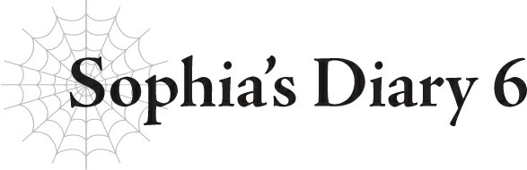

# Nhật ký của Sophia 6

*(Sophia’s Diary 6)*

Ưưư, mình bựựực-mììình quá đi mất!

Hửm?

Cái gì đây?

Một khúc xương á?

Có chuyện gì với nó thế?

Bạn muốn mình gặm nó á?

Cái gì cơ, để bổ sung canxi à?

Ưm, thôi, mình xin kiếu chuyện đó.

N-Này!

Đừng có nhìn mình bằng đôi mắt cún con đáng thương đó chứ!

Được rồi, được rồi!

Bạn chỉ muốn mình gặm nó thôi chứ gì?!

Hửm? Thực ra nó mềm đến bất ngờ đấy.

Nó không đặc biệt ngon lắm, nhưng cũng không phải là không thể ăn được.

...Này, chính bạn là người đã đưa nó cho mình mà. Sao trông bạn lại có vẻ kinh hãi thế hả?

---

[◀ Chương trước: Đoạn phụ: Giáo hoàng và Gián điệp chuyển sinh](17_interlude_the_pontiff_and_the_reincarnation_spy.md) | [Chương tiếp theo: J7 Julius, 13 tuổi: Tiến bộ ▶](19_j7_julius_age_13_progress.md)
