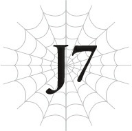
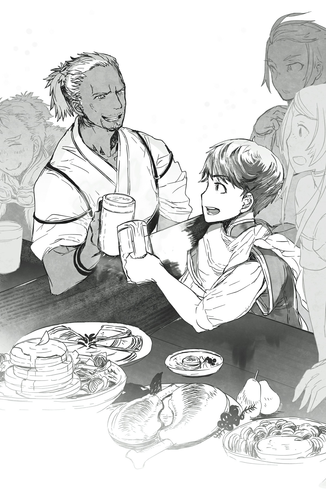

# J7 Julius, 13 tuổi: Tiến bộ

*(Julius, Age 13: Progress)*

Đã vài ngày trôi qua kể từ khi chúng tôi tổ chức tang lễ cho ngài Tiva cùng những binh sĩ khác.

Lực lượng đặc nhiệm của chúng tôi đã bắt đầu nhiệm vụ cuối cùng của mình.

Ngài Tiva, người thực sự là chất keo gắn kết lực lượng này lại với nhau, đã ra đi, và đây cũng là căn cứ lớn cuối cùng của tổ chức mà chúng tôi định vị được. Vì những lý do này, Giáo hoàng đã tuyên bố rằng lực lượng đặc nhiệm sẽ được giải tán sau nhiệm vụ này.

Vẫn còn rất nhiều bí ẩn bao quanh tổ chức buôn người, và chúng tôi không biết hầu hết các nạn nhân bị bắt cóc đã đi đâu.

Nhưng việc tiếp tục tìm kiếm vào thời điểm này là rất khó khăn, và vì chúng tôi đã triệt phá hầu hết các căn cứ, nên sẽ không còn nạn nhân nào bị bắt cóc trong tương lai nữa.

Dĩ nhiên, chúng tôi không hài lòng với kết luận đó.

Nhưng ở đâu đó trong tổ chức này chính là kẻ ác nhân đã giết ngài Tiva.

Đúng như lời sư phụ nói, tôi hiện tại không đủ mạnh để đánh bại kẻ đó.

Ngay cả khi tôi có bướng bỉnh đòi truy lùng tổ chức đi chăng nữa, tôi cũng chỉ phải nhận một cái chết vô ích nếu vô tình đối đầu với kẻ đó.

Vì vậy, thay vào đó, tôi chỉ có thể làm bất cứ điều gì trong khả năng của mình.

Và bước đầu tiên chính là nhiệm vụ cuối cùng của lực lượng đặc nhiệm.

Chúng tôi giành quyền kiểm soát căn cứ cuối cùng một cách dễ dàng.

Động lực của lực lượng cao hơn bao giờ hết, đặc biệt là vì đây là cơ hội để báo thù cho ngài Tiva cùng các binh sĩ khác đã hy sinh mạng sống của họ.

Và sĩ khí của kẻ thù lại thấp một cách kỳ lạ.

Khi chúng tôi thẩm vấn một số tên cướp bị bắt sau đó, chúng tôi biết được nguyên nhân là do những người đại diện của tổ chức đột ngột ngừng đến.

Thông thường, khi lũ cướp bắt giữ được ai đó, người của tổ chức sẽ xuất hiện từ hư không để mang nạn nhân đi, đưa cho lũ tội phạm tiền bạc hoặc hàng hóa để trao đổi. Nhưng giờ đây khi chúng ngừng xuất hiện, lũ tội phạm không nhận được tiền thanh toán, điều này làm tổn hại nghiêm trọng đến sĩ khí của chúng.

Tổ chức chắc hẳn đã quyết định dừng các hoạt động bắt cóc của mình.

Vì vậy, dù không thể tìm ra nguồn gốc đứng đầu của tổ chức, sẽ không còn vụ bắt cóc nào diễn ra nữa.

Mặc dù, vì chúng tôi chưa từng tìm ra nơi những người bị bắt trước đó được đưa đi, thật khó để coi đây là một chiến thắng trọn vẹn.

Tuy nhiên, như một điểm sáng an ủi, chúng tôi ít nhất đã có thể giải cứu những người bị giam giữ tại căn cứ cuối cùng này. Vì người của tổ chức không bao giờ đến nhận họ, họ chỉ đơn giản là bị giữ lại ở đó.

May mắn thay, họ không bị đối xử quá tệ, phòng trường hợp người của tổ chức đến đón.

Chúng tôi từng giải cứu được một số người trong quá trình triệt phá các căn cứ một vài lần trước đây, nhưng lần này số lượng nhiều hơn hẳn bình thường.

Khi chúng tôi đưa họ trở về quê hương, gia đình và bạn bè họ đã ôm chầm lấy họ và khóc nức nở.

Trong suốt thời gian tôi phục vụ trong lực lượng đặc nhiệm này, đó chính là điều tôi mong muốn được nhìn thấy hơn bất cứ thứ gì khác.

Phải mất đến tận nhiệm vụ cuối cùng này tôi mới được chứng kiến cảnh tượng đó, và khi biết rằng chúng tôi thực sự đã cứu được ai đó, tôi đã lặng lẽ rơi những giọt nước mắt nhẹ nhõm.

---

Khi trở về Thánh quốc Alleius, chúng tôi lập tức được chiêu đãi một bữa tiệc ăn mừng.

Đó là một bữa tiệc giản dị, chỉ được tổ chức với các thành viên của lực lượng đặc nhiệm và gia đình của họ. Giáo hoàng đã tử tế cung cấp hội trường cho chúng tôi.

Có rất nhiều đồ ăn thức uống cho tất cả mọi người, và quân lính ăn uống thả ga không chút dè dặt, thưởng thức từng món ăn.

Một khi bữa tiệc này kết thúc, các binh sĩ sẽ đều trở về quê hương tương ứng của họ.

Tập hợp hỗn độn gồm những con người từ các quốc gia khác nhau này có lẽ sẽ không bao giờ tụ họp lại ở một nơi nữa.

Vì vậy, tất cả họ đều xõa hết mình và ăn mừng thỏa thích.

Mặc dù thật không may, vì Hyrince, Yaana và tôi chưa đủ tuổi uống rượu, chúng tôi không thể bắt kịp sự nhiệt tình của mọi người.

Dù vậy, nó vẫn rất vui.

Tại thời điểm náo nhiệt nhất, khi ngày càng có nhiều người say xỉn lăn ra dưới bàn, một người đàn ông ngồi xuống đối diện tôi.

“Kết thúc rồi đấy nhỉ?”

“Vâng.”

Đó là ngài Jeskan, nhà mạo hiểm.

Bản thân anh ta cũng đã uống một lượng rượu đáng kể, nhưng tác dụng duy nhất tôi có thể thấy là hai gò má hơi ửng đỏ.

“Ồ, ngài Hawkin đâu rồi ạ?”

“À, lão ấy say bí tỉ và bất tỉnh ở đằng kia rồi.”

Ngài Jeskan chỉ tay về phía bên kia căn phòng, nơi một nhóm người say đang nằm chồng chất bất tỉnh lên nhau.

Làm thế nào mà chuyện đó lại xảy ra được chứ?

Và tôi không thấy ngài Hawkin đâu cả. Có phải ông ấy ở dưới cùng không?

“Ông ấy sẽ không bị đè bẹp dưới đó chứ?” Hyrince nói, vẻ mặt thảng thốt. “Về mặt vật lý ý tớ là thế.”

“Ha-ha-ha! Lão ấy từng là một tên trộm nổi tiếng, bất chấp vẻ bề ngoài đấy. Lão ấy không mềm yếu đến mức dễ bị đè bẹp như vậy đâu.”

Ngài Jeskan cười khúc khích.

“Vậy, thưa Ngài Anh hùng, lực lượng đặc nhiệm giải tán kể từ ngày hôm nay. Cậu sẽ làm gì sau chuyện này?”

“...Tôi nghĩ mình sẽ du hành đến các vùng đất khác nhau và cố gắng giúp đỡ những người gặp khó khăn.”

Tôi đã nhìn thấy nhiều quốc gia khác nhau trong thời gian phục vụ lực lượng, nhưng tổ chức buôn người và lũ côn đồ của chúng không phải là nguyên nhân duy nhất gây ra nỗi đau khổ của người dân.

Quái vật, nghèo đói, phân biệt đối xử, môi trường nguy hiểm...

Họ đều có những vấn đề khác nhau, nhưng bằng cách này hay cách khác, chúng tôi chưa từng thấy một nơi nào mà bạn có thể thực sự gọi là yên bình.

“Tôi biết có lẽ không có nhiều điều tôi có thể làm được. Hầu hết các vấn đề của họ có lẽ đều vượt quá khả năng của tôi. Nhưng dù thế, tôi vẫn muốn làm bất cứ điều gì có thể để giúp đỡ mọi người.”

“Thật đáng ngưỡng mộ làm sao...!”

Yaana chắp hai tay lại và xúc động nhìn tôi.

“Rất đáng ngưỡng mộ, thực sự vậy.”

Jeskan cười khúc khích khi lặp lại nhận xét của Yaana.

Tuy nhiên, không giống như Yaana, tôi không thể không cảm thấy anh ta dường như đang trêu chọc tôi một chút.

“Xin lỗi, anh có điều gì muốn nói với Ngài Anh hùng sao?!” Yaana lớn tiếng đòi hỏi anh ta một cách bất bình.

“Quê hương tôi từng bị lũ cướp phá hủy.”

Trước lời tuyên bố đột ngột này, Yaana thảng thốt lùi lại.

“Đó là một khu định cư nhỏ bé chỉ với vài gia đình, nhỏ đến mức bạn khó lòng gọi đó là một ngôi làng. Tôi đã không muốn dành cả đời mình ở một nơi như thế, nên đã bỏ trốn và trở thành một nhà mạo hiểm khi vẫn còn là một đứa trẻ.”

Jeskan uống một ngụm rượu lớn khi kể cho chúng tôi nghe về quá khứ của mình.

“Phần còn lại không có gì kịch tính cả. Tôi nghe ngóng được rằng quê hương tôi đã bị lũ cướp tấn công, chúng tàn sát tất cả mọi người và cướp bóc sạch sẽ từng món đồ có giá trị. Tôi cũng không săn lùng lũ cướp đó để trả thù hay gì cả. Vào thời điểm tôi nghe tin về chuyện đó, một nhà mạo hiểm khác đã tìm ra sào huyệt của chúng và quét sạch bọn chúng rồi.”

“Chuyện đó, ừm... chắc hẳn rất kinh khủng.”

“Không, không hẳn vậy.”

Yaana bày tỏ sự đồng cảm của mình, nhưng ngài Jeskan khẽ lắc đầu.

“Một nơi tồi tàn không có phòng thủ như thế sớm muộn gì cũng bị quái vật hoặc lũ cướp phá hủy thôi. Đó là lý do tại sao tôi bỏ trốn ngay từ đầu. Khi nghe tin nó biến mất, tất cả những gì tôi thực sự nghĩ là 'Ừ, chuyện đó chẳng có gì ngạc nhiên cả'.”

Nhìn vẻ mặt sửng sốt của Yaana, cô ấy định mở miệng nói gì đó, nhưng Jeskan vẫn tiếp tục.

“Nhưng tôi đã học được một điều vào ngày hôm đó: Con người từ sâu thẳm bên trong là tà ác. Họ sẽ tàn nhẫn hết mức có thể để tự cứu lấy mạng sống của mình. Điều đó đúng với lũ cướp đã phá hủy quê hương tôi — chúng sẵn sàng giết người và cướp bóc vì lợi ích của bản thân. Và điều đó cũng đúng với tôi. Tôi đã bỏ rơi gia đình để có thể sống sót. Và ngay cả khi nơi đó bị phá hủy, tôi cũng không cảm thấy gì cả.”

Ngài Jeskan nói mà không có một chút mỉa mai nào, như thể anh ta chỉ đơn giản là đang nêu lên sự thật.

“Cậu đã nhìn thấy những kẻ mà lực lượng của chúng ta chiến đấu rồi đúng không? Chúng chảy chung dòng máu đang chảy trong huyết quản của chúng ta. Nhưng chúng đã làm những điều nhẫn tâm đến mức người ta dễ dàng quên đi điều đó.”

Những kẻ chúng tôi chiến đấu là con người giống như chúng tôi.

Chắc chắn, hoàn cảnh của chúng tôi khác nhau, nhưng tất cả chúng tôi đều là con người.

Nói cách khác, nếu vị thế của chúng tôi bị đảo ngược, chúng tôi có thể đã đi trên cùng một con đường tội ác — bởi vì tất cả chúng tôi cũng chỉ là con người.

“Con người không cao quý như chúng ta vẫn nghĩ đâu. Nhưng cậu vẫn muốn sử dụng sức mạnh của mình để cố gắng giúp đỡ họ sao, Ngài Anh hùng?”

Jeskan quay sang tôi.

Tôi đã biết câu trả lời từ lâu rồi.

“Tất nhiên.”

Tôi đã quyết định sống cuộc đời của mình theo cách mà tôi có thể tự hào.

Tôi muốn trở thành một người cao quý như ngài Tiva, kiểu người mà mọi người sẽ thương tiếc khi tôi qua đời.

Tôi lặng lẽ chạm vào chiếc khăn quàng cổ của mình.

“Tôi cũng đã học được trong thời gian phục vụ lực lượng rằng con người có thể dễ dàng đi vào con đường tội ác như thế nào. Nhưng đó chính xác là lý do sức mạnh của tôi tồn tại.”

Con người nhúng tay vào các hành vi tội ác quá dễ dàng.

Vì vậy, tôi chỉ cần đảm bảo rằng mọi chuyện không đi đến mức đó.

“Tôi là Anh hùng, biểu tượng hy vọng của người dân. Hiện thân của công lý. Và là kẻ thù của cái ác. Tôi sẽ trở thành niềm hy vọng của nhân loại và cho họ thấy rằng tôi sẽ không bao giờ để cái ác chiến thắng.”

“Nên cậu sẽ ngăn chặn cái ác xảy ra sao?”

“Đúng vậy.”

“Cậu thực sự nghĩ chuyện đó khả thi sao?”

“Tôi sẽ không biết cho đến khi tôi thử. Nhưng tôi chắc chắn sẽ không bỏ cuộc trước khi bắt đầu. Nếu mọi người cảm thấy lo lắng vì vị Anh hùng đời trước ẩn mình đi, thì nhiệm vụ của tôi với tư cách là Anh hùng hiện tại là dẹp tan nỗi sợ hãi của họ.”

“Nên cậu đang dọn dẹp đống hỗn độn của kẻ đi trước sao?”

“Tôi ở đây. Tôi là Anh hùng. Đó là điều tôi muốn cho tất cả mọi người biết. Chừng nào tôi còn làm vậy, tôi chắc chắn tương lai sẽ tràn ngập hy vọng.”

“Ha... a-ha-ha-ha! Thật là một viên ngọc quý!”

Ngài Jeskan bật cười lớn, như thể anh ta không thể kìm nén được nữa.

Nhưng lần này, nghe có vẻ không giống như anh ta đang chế giễu tôi chút nào.

“Thì ra đây chính là Anh hùng! Vâng, giờ tôi đã hiểu rồi. Cậu đúng là Anh hùng thực sự đấy!”

Anh ta đập ly rượu xuống bàn vài lần trong khi tiếng cười vẫn tiếp tục.

“...Này, Ngài Anh hùng.”

Rồi, khi tiếng cười cuối cùng cũng dịu đi, ngài Jeskan nhìn tôi.

Và gọi tôi là “Ngài Anh hùng”.

Trước đó anh ta chỉ gọi tôi là “Cậu Anh hùng”, nên tôi cảm thấy điều này nghĩa là anh ta đã dành cho tôi một sự tôn kính mới.

---

---

“Tôi tình cờ biết một nhà mạo hiểm lành nghề và một tên trộm đang thất nghiệp kể từ ngày hôm nay. Có cơ hội nào cậu quan tâm đến việc thuê họ không?”

“Ý anh là...”

“Ồ, phải rồi, tiền lương. Hay là chúng ta coi như huề để đổi lấy quyền được chứng kiến tương lai hy vọng mà cậu đang nói đến ở ngay bên cạnh cậu nhé?”

Ngài Jeskan cười toe toét trước vẻ mặt ngạc nhiên của tôi và nâng ly về phía tôi.

Tôi mỉm cười và giơ chiếc ly của mình lên để cụng ly với anh ta.

“Tôi tin là chúng ta đã có một thỏa thuận.”

“Đó là điều tôi muốn nghe.”

Tôi đã hiểu rõ tính cách của ngài Jeskan và ngài Hawkin qua thời gian làm việc cùng nhau trong lực lượng đặc nhiệm.

Nhìn thoáng qua, ngài Jeskan có vẻ hoài nghi và thực tế, nhưng những khoảnh khắc như thế này cho thấy anh ta có khiếu công lý và phiêu lưu sâu thẳm bên trong.

Và là một cựu hiệp đạo ăn trộm vì người nghèo, ngài Hawkin cũng tử tế đúng như quá khứ của ông gợi ý.

Ngài Tiva từng nói với tôi rằng tôi nên tập hợp những người đồng đội mà mình có thể tin tưởng.

Và tôi biết mình có thể tin tưởng ngài Jeskan cùng ngài Hawkin.

Nếu họ sẵn lòng gia nhập lực lượng với tôi, tôi không thể ước mong điều gì tốt hơn thế.

Vì thế, tôi đã có được hai người đồng đội mới đáng tin cậy.

Nhân tiện, ngài Hawkin chỉ biết được tất cả những chuyện này khi đang hồi phục sau cơn say xỉn và làm cơn đau đầu của mình tệ hơn bằng cách hét lên kinh ngạc.

---

[◀ Chương trước: Nhật ký của Sophia 6](18_sophias_diary_6.md) | [Chương tiếp theo: Nhật ký của Sophia 7 ▶](20_sophias_diary_7.md)
