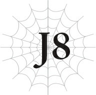

# J8 Julius, 14 tuổi: Tuổi trẻ

*(Julius, Age 14: Youth)*

“Yaaaah!”

Jeskan hét lớn một tiếng và vung rìu xuống, chặt đứt cái xúc tu đang vươn thẳng về phía mình.

“Đại ca!”

Hawkin định quay sang hỗ trợ Jeskan, nhưng chủ nhân của ông đã hét lớn ngăn lại.

“Tôi không sao! Hãy ở sát bên tiểu thư Yaana!”

“Này! Yaana, hãy đứng ngay sau tớ, dù có thế nào đi nữa!”

“Oa, được rồi!”

Yaana co rúm người lại đằng sau tấm khiên của Hyrince, miệng mím chặt.

“Á!”

Tôi chém đứt một xúc tu khác, nhưng chúng cứ liên tục mọc ra bất kể chúng tôi chém đứt bao nhiêu cái đi chăng nữa.

Chúng tôi đang chiến đấu với một quái vật gọi là Boellero, một sinh vật sở hữu những xúc tu dài giống như rắn. Những xúc tu dường như vô tận này tấn công bằng những chiếc gai gây tê liệt ở đầu; sau đó nó sẽ nuốt chửng con mồi bất lực của mình.

Và vì lý do nào đó, loài quái vật này đặc biệt ưa thích tấn công những cô gái trẻ.

Do đó, các xúc tu cứ liên tục lao về phía Yaana, cô gái duy nhất trong nhóm chúng tôi.

Hyrince chặn các xúc tu bằng khiên của mình, trong khi Hawkin bọc lót cho cậu ấy.

Trong khi Yaana thu hút sự chú ý của con quái vật, Jeskan và tôi tấn công vào cơ thể chính của nó.

Ít nhất, đó là kế hoạch ban đầu — nhưng mọi chuyện hóa ra khó khăn hơn mong đợi nhiều.

Các xúc tu mọc lại nhanh như tốc độ chúng tôi chém đứt chúng, khiến việc tung ra đòn kết liễu gần như là bất khả thi.

Lõi của Boellero là một khối cầu, và nó càng lớn thì cấp độ của quái vật càng cao và càng nguy hiểm.

Con Boellero chúng tôi đang đối đầu lúc này có lõi to gấp đôi một con người bình thường.

Xét việc một con Boellero trung bình chỉ có lõi cỡ bằng đầu người, kích thước này là lớn đến mức không thể tin nổi.

“Nó đã phải ăn thịt bao nhiêu người để lớn được thế này chứ?!”

Jeskan rên rỉ khi chặt đứt một xúc tu khác.

“Thảo nào hội mạo hiểm giả lại bỏ cuộc trước con quái này!”

Tiêu diệt con Boellero này ban đầu là một nhiệm vụ được đăng tải cho các thành viên của hội mạo hiểm giả.

Nhưng tất cả các mạo hiểm giả được gửi đến chiến đấu đều bị đánh bại thảm hại, nên giờ đây nhiệm vụ đó rơi vào tay chúng tôi.

Các mạo hiểm giả kiếm sống bằng cách tiêu diệt quái vật và nhận tiền thưởng từ hội mạo hiểm giả. Nếu chúng tôi tùy tiện can thiệp và tiêu diệt tất cả những quái vật đó, chúng tôi sẽ cướp đi sinh kế của họ.

Để tránh điều đó, chúng tôi chỉ đối phó với những quái vật quá mạnh so với khả năng của các mạo hiểm giả địa phương, hoặc các trường hợp đặc biệt khác khi hội mạo hiểm giả trực tiếp yêu cầu sự can thiệp của chúng tôi.

Điều này có nghĩa là hầu hết các yêu cầu gửi đến chúng tôi đều cực kỳ nguy hiểm.

---

“Á!”

Yaana hét lên và giải phóng một phép thuật Quang Cầu về phía con Boellero, nhưng nó đã bị một xúc tu khác chặn lại trước khi chạm tới lõi.

Chiếc xúc tu bị đánh trúng lập tức mọc lại với tốc độ đáng kinh ngạc.

“Đồ ngốc! Đứng sau bọn tớ!”

“Aaaah!”

Chiếc xúc tu lao thẳng về phía Yaana, nhưng Hyrince đã nhảy ra trước mặt cô ấy và chặn đứng nó bằng khiên của mình.

Tấm khiên của cậu ấy đủ lớn để che phủ toàn bộ cơ thể, vốn đã to lớn so với tuổi của mình.

Kể từ khi chúng tôi thêm một người tấn công là Jeskan vào đội hình, Hyrince đã lựa chọn trở thành một người phòng ngự, tập trung vào khiên thay vì kiếm.

Giờ đây, cậu ấy bảo vệ trị liệu sư của chúng tôi, Yaana, và người hỗ trợ, Hawkin, bằng tấm khiên lớn đó.

“Không dễ thế đâu!”

Một trong các xúc tu cố gắng đi vòng qua khiên của Hyrince để tiếp cận Yaana, nhưng con dao ném của Hawkin đã chém đứt nó.

Hawkin không sở hữu sức mạnh chiến đấu mạnh mẽ như hầu hết chúng tôi, nhưng ông ấy chắc chắn không hề yếu.

Ông ấy là một chuyên gia ném dao, và tôi đã được cứu nhiều lần nhờ những cú ném đúng thời điểm của ông.

Nhưng giá trị thực sự của Hawkin nằm ở bên ngoài trận chiến.

Vai trò chính của ông ấy là hỗ trợ chúng tôi theo những cách khác, như chuẩn bị nhu yếu phẩm, thu thập thông tin và vạch ra kế hoạch dựa trên những gì ông quan sát và học hỏi được.

Ông thậm chí còn thuê người khuân vác hoặc dắt theo thú thồ để mang hành lý cho chúng tôi, giúp chúng tôi có thể tiết kiệm thể lực cho trận chiến.

Nghe có vẻ là một công việc giản đơn, nhưng chúng tôi chỉ có thể chiến đấu hết khả năng của mình nhờ có Hawkin hỗ trợ.

Cách ông ấy làm việc gợi cho tôi nhớ đến ngài Tiva.

“Hửm?! Tch!” Jeskan nhận ra điều gì đó và tặc lưỡi. “Một đòn tấn công bằng axit! Vũ khí của tôi hỏng rồi!”

Không chút do dự, anh ta ném thẳng cây rìu trên tay vào lõi của Boellero.

Nó dĩ nhiên bị chặn lại bởi các xúc tu.

Nhưng khi rơi xuống đất, cây rìu tỏa ra một làn khói kỳ lạ, và lưỡi rìu bắt đầu tan chảy.

“Con quái này cũng có thể sử dụng axit sao?!”

[Axit Công kích] là một kỹ năng nguy hiểm có thể phá hủy vũ khí và giáp trụ.

Trang bị được tăng cường bằng kỹ năng [Truyền Năng lượng] không dễ bị phá vỡ, nhưng một đòn [Axit Công kích] vẫn có thể gây sát thương lên nó bất kể thế nào.

Không chỉ vậy, nó còn có kháng tính độc đáo của riêng mình, nên những mạo hiểm giả thiếu kinh nghiệm chưa quen với nó có thể dễ dàng chịu một lượng sát thương lớn từ thuộc tính này.

“Cố gắng đừng chạm vào chất nhầy trên các xúc tu! Nó sẽ làm tan chảy mọi thứ đấy!”

“Anh nói thì dễ lắm!”

Hyrince đang tuyệt vọng bảo vệ Yaana bằng tấm khiên trước các xúc tu tấn công.

Cậu ấy không có lấy một giây rảnh rỗi để lo lắng về chất nhầy kia.

Quan sát kỹ hơn, tấm khiên của cậu ấy cũng đang tỏa ra làn khói kỳ lạ giống như rìu của Jeskan.

Tình hình này rất tệ.

---

Chúng tôi có lẽ còn một chút thời gian trước khi tấm khiên dày bị vỡ, nhưng không có lấy một giây để lãng phí.

“Mọi người! Mua cho tớ chút thời gian với!”

“Hiểu rồi!”

“Rõ rồi!”

Jeskan và Hyrince lập tức đồng thanh phản hồi.

Đã hơn một năm trôi qua kể từ khi lực lượng đặc nhiệm chống buôn người giải tán.

Chúng tôi đã cùng nhau du hành đến các quốc gia khác nhau, tiêu diệt quái vật, triệt phá các sào huyệt của lũ cướp mà lực lượng đặc nhiệm đã bỏ sót, và những việc tương tự.

Tôi nghĩ tinh thần đồng đội của chúng tôi đã trở nên rất mạnh mẽ trong suốt một năm qua.

Jeskan và tôi tấn công trên tiền tuyến, Yaana và Hawkin hỗ trợ từ phía sau, còn Hyrince đứng ở giữa để chống đỡ các đòn tấn công của kẻ thù tùy thuộc vào tình hình.

Thời gian đầu, tôi thường phải dựa dẫm vào người đàn anh Jeskan, nhưng dạo gần đây, chúng tôi đã phối hợp ăn ý hơn nhiều.

Chúng tôi thậm chí còn trở nên thân thiết hơn bên ngoài chiến trường và bắt đầu gọi nhau bằng tên mà không cần dùng kính ngữ.

Biết rõ những người đồng đội đáng tin cậy của mình, tôi chắc chắn họ sẽ mua đủ thời gian tôi cần!

Jeskan rút ra một thanh mã tấu dự phòng và bắt đầu chặt đứt thêm các xúc tu.

Là một bậc thầy sử dụng nhiều loại vũ khí, anh ta luôn mang theo vài món bên người bất kỳ lúc nào và có thể hoán đổi chúng khi cần thiết. Chiếc rìu của anh ta không còn sử dụng được nữa, nhưng anh ta vẫn còn rất nhiều vũ khí khác.

Tuy nhiên, tình hình đang trông rất nghiệt ngã.

Lỗ hổng tôi để lại trên tiền tuyến là quá khó để Jeskan và Hyrince có thể hoàn toàn che lấp.

Hawkin và Yaana đang cố gắng bọc lót cho họ, nhưng điều đó rõ ràng là không đủ.

“Chuyện này sẽ khiến chúng ta bị thâm hụt ngân sách đây, nhưng muốn làm bánh kếp thì phải đập vài quả trứng thôi!”

Hawkin ném một thứ gì đó về phía con Boellero.

Bất kể thứ đó là gì, nó lập tức phát nổ, làm đóng băng các xúc tu lại.

“Ha-ha! Thấy sao hả?! [Bom Băng] không hề rẻ chút nào, nhưng hoàn toàn xứng đáng!”

Một vật phẩm ma pháp dùng một lần sao?!

Những vật phẩm ma pháp chỉ sử dụng một lần như vậy là rất đắt đỏ, chủ yếu là vì không có nhiều nghệ nhân có thể chế tạo ra chúng.

Tuy nhiên, đổi lại, uy lực của chúng được đảm bảo.

Vật phẩm Hawkin vừa ném hẳn phải có hiệu ứng Băng Ma pháp.

Con Boellero phát ra một tiếng rít đâm vào màng nhĩ.

Các xúc tu của nó quất loạn xạ xung quanh khi nó quằn quại trong đau đớn.

Tôi không thể để cơ hội này trôi qua!

“Chính là lúc này!”

Tôi giải phóng phép thuật mà mình đang hình thành trong khoảng thời gian các bạn mua cho tôi: phép thuật Thánh Quang Ma pháp mang tên [Thánh Quang Thương].

Được tăng cường thêm ma lực, đúng như những gì sư phụ đã dạy tôi!

Với mức độ sức mạnh của tôi, tôi phải mất một lúc để tạo ra phép thuật này, nhưng Thánh Quang Ma pháp vốn dĩ đã mạnh mẽ, nên nó lại càng mạnh hơn khi được truyền thêm sức mạnh.

Ngọn [Thánh Quang Thương] dễ dàng vượt qua các xúc tu và đâm xuyên qua lõi của nó!

Sau đó, toàn bộ khu vực ngập tràn trong một luồng ánh sáng chói lòa.

---

“Mọi người đã vất vả rồi.”

Sau khi hoàn thành yêu cầu, chúng tôi tụ họp lại để ăn mừng.

“Cụng ly!”

“““Cụng ly!”””

Jeskan và Hawkin cụng ly bằng bia, những người còn lại trong chúng tôi cụng ly bằng nước trái cây.

“Phù... Tôi không bao giờ muốn chiến đấu với Boellero một lần nào nữa đâu.” Yaana nhấp một ngụm nước và thở dài thườn thượt, không thể che giấu sự ghê tởm trong giọng nói của mình. “Chỉ cần nghĩ đến nó thôi cũng làm tôi nổi da gà rồi.”

“Nó tệ đến thế sao? Bọn tớ không thực sự nhận thấy điều gì khác thường cả.”

“Tất nhiên là có rồi chứ!”

Yaana vung ly nước về phía Hyrince, làm bắn ra một chút nước trái cây.

“Cậu đang nói cái gì thế? Sinh vật gớm ghiếc đó đang hướng những dục vọng kinh khủng về phía tôi đấy. Nó hoàn toàn kinh tởm!”

Nhìn cô ấy run rẩy, tôi không khỏi cảm thấy chúng tôi đã có lỗi với Yaana khi đưa cô ấy đi cùng.

Boellero được coi là một trong ba kẻ thù lớn nhất của phụ nữ trên thế giới này.

Người ta nói rằng những nạn nhân nữ của chúng phải hứng chịu những điều không thể dung thứ cho đến khi trút hơi thở cuối cùng. Đàn ông sẽ bị ăn thịt ngay lập tức, nhưng phụ nữ thì lại được giữ cho sống sót.

Có những tin đồn rằng một số kẻ biến thái thích khía cạnh khủng khiếp này của sinh vật và sẽ nuôi Boellero làm cảnh một cách bí mật, cố tình cung cấp phụ nữ cho chúng.

Mặc dù trong hầu hết các trường hợp, những người định nuôi chúng sẽ thất bại trong việc thuần hóa và cuối cùng tự biến mình thành mồi cho chúng.

Có lẽ con Boellero chúng tôi vừa chiến đấu đã trốn thoát từ những hoàn cảnh tương tự.

Tất nhiên, tôi hoàn toàn không hứng thú với những chuyện kiểu đó.

Là một người đàn ông, tôi đoán mình có thể hiểu được sự thu hút đó, nhưng tôi sẽ không bao giờ nói ra điều đó để tránh làm Yaana khó chịu thêm.

“Tại sao những thứ biến thái như vậy lại tồn tại trên thế giới này chứ? Tôi ước tất cả chúng bị tiêu diệt hết đi!”

Rõ ràng, cô ấy quá tức giận trước ý đồ xấu xa của Boellero đến mức lúc này đang nói ra một số lời lẽ cực đoan.

“Cậu đang nói gì thế? Nếu không có dục vọng, không ai trong chúng ta được sinh ra trên đời đâu. Cậu nhận ra mình đang phủ nhận lý do mình được tạo ra ngay từ đầu đúng không?”

Hyrince trông có vẻ sửng sốt, nhưng có một nụ cười ẩn hiện nơi khóe môi.

Cậu ấy rõ ràng đang trêu chọc Yaana.

“Không phải như thế! Đừng có so sánh sự giao hợp giữa một người nam và một người nữ yêu nhau với những khuynh hướng đồi bại như vậy chứ. Tình yêu thiêng liêng và cao quý hơn thế nhiều!”

“Phụt!” Lời cảm thán của Yaana khiến Hawkin phun cả ngụm bia đang uống dở ra ngoài.

Ông ấy bắt đầu ho sặc sụa, nên Jeskan vỗ mạnh vào lưng ông vài cái.

Tôi biết không có ai khác ngoài chúng tôi ở đây, nhưng tôi vẫn không nghĩ việc hét toáng lên về những thứ như “giao hợp” một cách lớn tiếng như vậy là thích hợp.

Yaana đỏ bừng mặt, muộn màng nhận ra điều tương tự.

“Thế sao? Vậy cụ thể thì hoạt động thiêng liêng và cao quý này bao gồm những gì thế? Xin hãy dạy cho chúng tôi đi, thưa Thánh nữ vĩ đại.”

“Ch-Ch-Chuyện đó—! Không phải như thế!”

A, cô ấy lại rơi vào bẫy của Hyrince một lần nữa rồi.

---

Yaana tội nghiệp càng đỏ mặt hơn, đầu óc cô ấy có vẻ đang quay cuồng.

Tôi biết cô ấy không uống rượu, nhưng cô ấy trông giống như đang say xỉn vậy.

“Tôi sẽ không nói những chuyện như thế đâu!”

“Nhưng cậu bảo nó thiêng liêng mà đúng không? Đi nào — cậu là một phụ nữ thánh thiện mà. Không thể giáo dục một kẻ tội nghiệp, ngu muội như tớ sao?”

“Oa! Oaaaa!”

Tôi biết một nửa là do lỗi của bản thân Yaana, nhưng tôi vẫn thấy tội nghiệp cho cô ấy.

Tốt hơn là tôi nên cắt ngang chuyện này.

“Hyrince, trêu chọc thế là đủ rồi đấy.”

“Hì hì. Tớ đoán vậy. Giờ tớ biết Yaana thực chất là một kẻ biến thái, thế là đủ rồi.”

“Một k-k-k-k-kẻ biến thái? Tôi á?!”

“Thì cậu rõ ràng đang bị ám ảnh bởi chủ đề đó đúng không? Nếu không cậu đã chẳng phản ứng thái quá như thế này.”

“Ai ám ảnh chứ?!”

“Thôi nào. Chuyện những người trẻ ở độ tuổi của chúng ta bắt đầu quan tâm đến chủ đề đó chẳng có gì lạ cả. Hơn nữa, cậu tự nói đấy thôi — nó 'thiêng liêng' và 'cao quý'. Nên với tư cách là một Thánh nữ phụng sự các vị thần, cậu thậm chí có thể nói việc quan tâm đến nó là nghĩa vụ của mình.”

“N-Nghĩa vụ của tôi?”

“Đúng vậy, chính xác. Nên chẳng có gì phải xấu hổ cả. Chỉ cần thành thật với bản thân thôi.”

“Thành thật với bản thân...”

“Để bắt đầu, hãy thử nghĩ về người cậu thích và tất cả những tình cảm của cậu dành cho người đó xem nào!”

“……”

Yaana quay sang nhìn tôi với một ánh mắt kỳ lạ đầy nóng bỏng.

“Yaana. Yaana. Cậu ta lại đang trêu cậu đấy.”

“Cái gì—?!”

Bừng tỉnh lại, Yaana lườm Hyrince và thấy cậu ấy đang ôm bụng cười ngặt nghẽo.

“HYYYYRIIIIIINCE?!”

“Ha-ha-ha! Xin lỗi, xin lỗi.” Hyrince vừa cười vừa xin lỗi. “Nhưng thành thật với bản thân thực sự không phải là chuyện xấu đâu cậu biết mà? Chúng ta đang ở độ tuổi mà việc có những suy nghĩ đó là hoàn toàn bình thường. Ngay cả Julius cũng là một cậu bé đang lớn mà, bất kể cậu ấy có tỏ ra cao quý và ngây thơ thế nào đi chăng nữa.”

“Hyrince...”

Giờ đến lượt tôi lườm Hyrince, nhưng cậu ấy nhún vai, vẻ mặt không hề nao núng.

“Thực tế, thỉnh thoảng chính những kiểu người nghiêm túc lại là những người dễ rơi vào lưới tình với ai đó có sức hút giới tính mạnh mẽ, vì họ đã kiềm chế ham muốn của mình quá lâu rồi. Càng kiềm chế điều gì, nó sẽ càng bùng nổ mạnh mẽ khi thời điểm đến. Nếu cậu cứ chần chừ, ai đó có thể sẽ đến và cướp cậu ấy đi mất đấy.”

“Cái gì—?!” Yaana hét lên.

“Giống như cô em đệ tử khác Aurel chẳng hạn. Cô bé đó khá thân thiết với Julius đúng không? Mặt cô bé bình thường, nhưng dạo này cô bé đang lớn nhanh như thổi đấy.”

Hyrince liếc mắt đầy ẩn ý về phía ngực của Yaana rồi khịt mũi.

Dĩ nhiên, điều đó lại khiến Yaana nổi trận lôi đình một lần nữa.

Yaana không phải là, bạn biết đấy... nhỏ nhắn đâu.

Tôi nghĩ cô ấy rất xinh đẹp, với một vóc dáng cân đối.

Chỉ là Aurel quả thực rất, ừm, được ưu ái trong lĩnh vực đó.

Tôi vẫn có một mối liên kết kỳ lạ với Aurel, vì cô ấy là đệ tử thứ hai của sư phụ tôi.

Chúng tôi gặp nhau lần đầu ở Hạt Keren cũ.

Sau đó, cô ấy thể hiện tiềm năng ma pháp và khăng khăng muốn trở thành đệ tử thứ hai của ông, nên chúng tôi đã dành nhiều thời gian bên nhau trong một khoảng thời gian.

Tôi vẫn gặp cô ấy khá thường xuyên.

Và mỗi lần chúng tôi gặp lại nhau, cô ấy lại, ừm... lớn hơn.

Vòng một của cô ấy, ý tôi là thế.

“Hừ! Julius sẽ không bị quyến rũ bởi mấy cái túi mỡ to đùng vô dụng đó đâu! Đúng không, Julius?!”

Cô ấy nhìn tôi đầy tuyệt vọng, nhưng thành thật mà nói, tôi không biết phải trả lời thế nào.

Không thể khẳng định hay phủ nhận ngay lập tức, tất cả những gì tôi có thể làm là mỉm cười mơ hồ.

Không hiểu sao, điều này chỉ khiến Yaana trông có vẻ sửng sốt hơn.

“Hai người lớn kia nữa! Đừng có vờ như không nghe thấy chúng tôi nói chuyện và lên tiếng đi chứ!”

Ánh mắt lườm của Yaana quay sang phía Jeskan và Hawkin.

“Tôi không biết phải nói gì với cô bé đâu. Tôi đã chơi bời khá nhiều rồi, nên tôi không nghĩ mình có thể đưa ra câu trả lời cô muốn đâu.”

“Th-Thật là thiếu đứng đắn!”

Yaana hầm hè với Jeskan.

---

“Ta nói nghiêm túc đấy, cô Yaana. Đã có rất nhiều người đàn ông vĩ đại ngã gục trước sự quyến rũ của phụ nữ trước đây rồi. Cậu ấy phải xây dựng một số kháng tính đối với loại sức hút giới tính đó, nếu không cậu ấy thực sự có thể bị lừa gạt, giống như Hyrince nói. Ở vị trí của Julius, cậu ấy có thể gặp nguy hiểm nếu ai đó quyến rũ cậu để ngăn cản cậu can thiệp vào một âm mưu đen tối hoặc thậm chí là cố gắng ám sát cậu.”

Yaana chùn bước trước chủ đề nghiêm túc bất ngờ này, có lẽ cô ấy cảm thấy xấu hổ vì đã quá phấn khích.

“Chuyện một cô bé ở độ tuổi của cháu tỏ ra đoan trang và đứng đắn là hoàn toàn bình thường, Yaana nhỏ bé ạ. Nhưng ta muốn cháu biết rằng, có những người phụ nữ rất tốt tình cờ kiếm sống bằng chính loại công việc đó. Việc quy chụp tất cả bọn họ là xấu xa là không đúng đâu cháu biết mà?”

“Vâng.”

Hawkin, người hiểu biết rộng về đủ loại ngành nghề và bí mật, cũng đưa ra một nhận xét chân thành đến bất ngờ, và Yaana ngoan ngoãn gật đầu.

Cô ấy có lẽ đang nhớ lại rằng có nhiều phụ nữ bước chân vào ngành giải trí ban đêm vì nghèo đói hoặc hoàn cảnh khác.

“Ta không nói Julius nên chơi bời với phụ nữ cho vui, dĩ nhiên rồi. Mặc dù ta muốn nói rằng việc tích lũy một số kinh nghiệm tại một cơ sở đáng tin cậy không phải là điều xấu. Nhưng đối với hoàng tộc thì có thể có những cách khác để học hỏi những chuyện đó, nên có lẽ ta chỉ đang lo lắng hão huyền thôi. Và nếu cháu đã gửi gắm trái tim mình cho ai đó rồi, thì điều đó cũng hoàn toàn tốt đẹp.”

Yaana nhìn tôi với niềm hy vọng lộ rõ trong mắt, nhưng tôi cố gắng vờ như không nhận thấy.

“Tôi nghe nói cũng có một chủng tộc ma tộc chuyên về quyến rũ nữa. Ma tộc dạo này im hơi lặng tiếng, nhưng nếu chiến tranh bắt đầu lại, Julius sẽ phải ra tiền tuyến, vì cậu ấy là Anh hùng mà. Và khi đó cậu ấy có thể phải đối phó với những chuyện kiểu như thế.”

Cuộc chiến chống lại ma tộc.

Thông thường, đó là nghĩa vụ lớn nhất được giao cho Anh hùng.

Người ta nói rằng các thế hệ Anh hùng đã dành phần lớn cuộc đời mình cho mục tiêu này.

Nhưng trong thời kỳ của vị Anh hùng đời trước, ma tộc đột nhiên dừng các cuộc tấn công dồn dập vào nhân loại và trở nên im ắng một cách đáng lo ngại.

Nền hòa bình bất an đó vẫn tiếp tục kéo dài cho đến ngày nay, nên tôi vẫn chưa phải chiến đấu với bất kỳ ma tộc nào.

Nhưng nếu họ bắt đầu tấn công nhân loại một lần nữa, nghĩa vụ của tôi dưới tư cách là Anh hùng sẽ là ngăn chặn họ.

Nếu ngày đó đến, tôi chắc chắn đó sẽ là một trận chiến đáng sợ.

Một đám mây u ám bao trùm lên khuôn mặt của những người khác, những người chắc hẳn cũng đang nghĩ về điều tương tự.

“Đừng lo lắng. Tôi sẽ không rơi vào bẫy dễ dàng thế đâu. Nếu có gì, tôi lại lo ngại Hyrince bị mê hoặc thẳng tới cái chết của cậu ấy hơn đấy.”

“Này, chết dưới tay một cô nương xinh đẹp thì cũng đâu có tệ chứ!”

Hyrince lập tức đáp lại lời đùa của tôi bằng một câu đùa của riêng cậu ấy.

“Thật là! Hyrince, cậu còn đáng lo hơn cả Julius nhiều!”

Yaana lập tức bắt đầu mắng mỏ cậu ấy, còn Jeskan và Hawkin thì cười khúc khích.

Tôi không thể không ước mong những khoảng thời gian như thế này sẽ kéo dài mãi mãi.

---

[◀ Chương trước: Nhật ký của Sophia 7](20_sophias_diary_7.md) | [Chương tiếp theo: Nhật ký của Sophia 8 ▶](22_sophias_diary_8.md)
