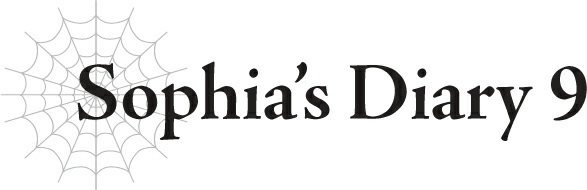

# Nhật ký của Sophia 9

*(Sophia’s Diary 9)*

Măm. Khúc xương hôm nay khá ngon đấy.

Hả? Mình bị sốt hay sao á?

Ưm, mình đoán bạn nói không hoàn toàn sai.

Dạo này mình cứ thấy là lạ thế nào ấy, bạn thấy đấy.

Thậm chí có thể nói là hơi nóng trong người.

À, nhưng thực tế mình không bị sốt.

Chỉ là cơ thể mình cảm thấy nặng nề, và có phần uể oải.

Các triệu chứng khác á?

Ồ, ừm, mình đoán dạo này mình cứ cảm thấy thèm muốn mỗi khi nhìn vào cổ của đám con trai.

Mình muốn hút máu tụi nó á?

Bạn học cái kiểu nói đó ở đ...—? Không, thôi bỏ đi, mình biết thừa câu trả lời rồi.

Nhưng đúng vậy, mình đoán là mình có cảm giác thèm chút máu thật.

Nhưng đừng lo — mình sẽ không làm thế đâu.

Lũ trẻ ranh này cực kỳ phiền phức, nhưng rõ ràng mình sẽ không tấn công tụi nó.

Mình sẽ tự kiềm chế được, tin mình đi.

---

[◀ Chương trước: J9 Julius, 15 tuổi: Cộng sự](23_j9_julius_age_15_partner.md) | [Chương tiếp theo: J10 Julius, 16 tuổi: Bằng hữu ▶](25_j10_julius_age_16_friends.md)
