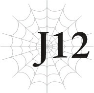
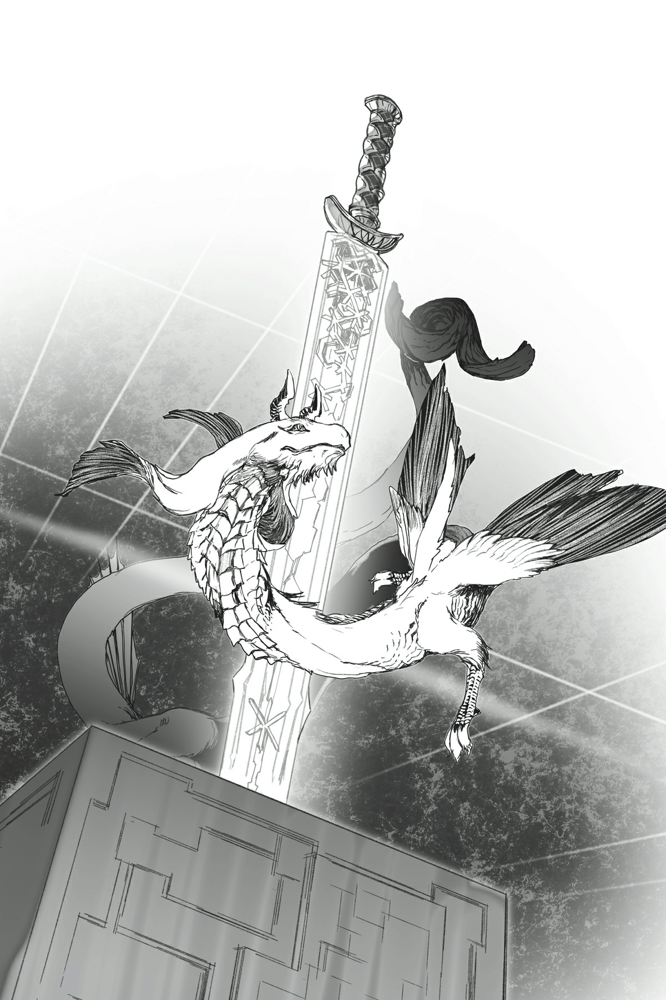
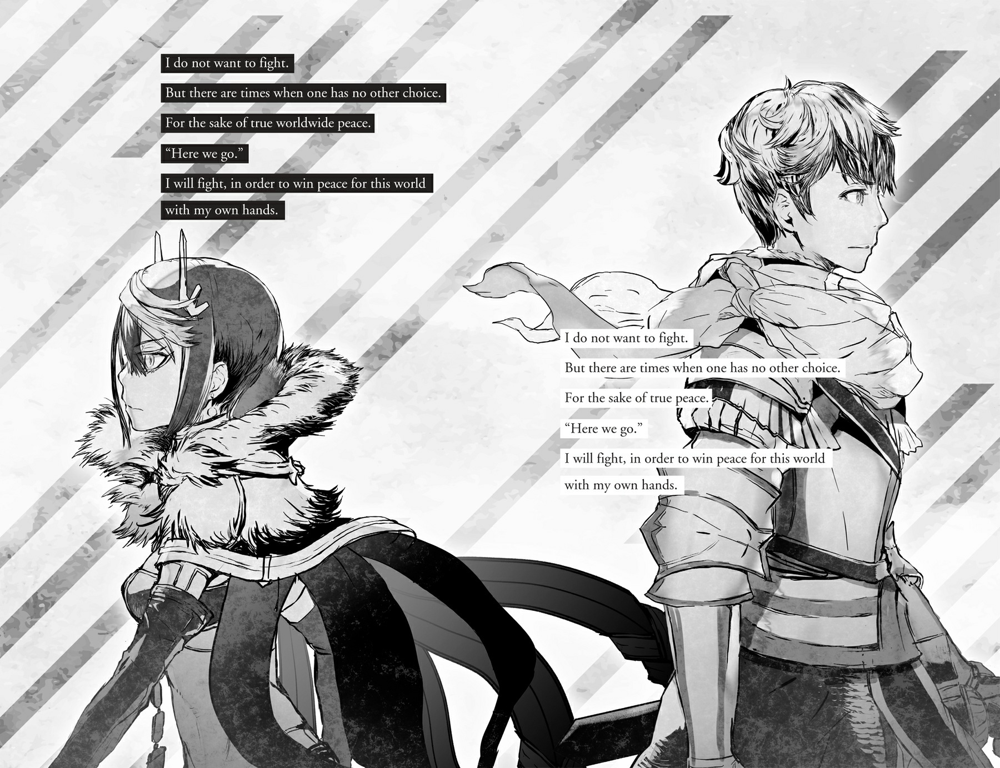

# J12 Julius, 21 tuổi: Gia đình

*(Julius, Age 21: Family)*

“Mừng anh đã về, thưa anh trai.”

Tôi đã trở lại vương thành lần đầu tiên sau một thời gian dài.

Tại đó, tôi gặp người em trai cùng cha khác mẹ của mình, Leston, tam hoàng tử và là con trai của thứ phi thứ hai của vua cha.

Vợ của vua cha, hoàng hậu chính thất, nắm giữ tầm ảnh hưởng lớn nhất, tiếp theo là thứ phi thứ nhất và thứ hai. Mẹ tôi là thứ phi thứ ba, nên bà có vị thế thấp nhất trong số họ.

Nếu tôi không phải là Anh hùng, tôi thậm chí có thể đứng ở vị trí thấp hơn cả Leston.

Thật là một chuyện kỳ lạ khi nghĩ về nó.

“Cảm ơn em. Đây, quà lưu niệm cho em.”

“Ồ. Cảm ơn anh! Đây có phải là một hỏa ma kiếm từ Đế quốc không?!”

Leston hạnh phúc ngắm nhìn thanh kiếm tôi đưa cho cậu ấy.

Đó là một thanh ma kiếm được truyền sức mạnh của lửa, tương tự như thanh kiếm tôi từng mượn từ sư phụ của mình.

Bản thân ma kiếm đã rất giá trị rồi, nhưng thanh kiếm này còn có một nguồn gốc độc đáo, nên nó sẽ không được bán trên thị trường tự do đâu.

Tuy nhiên, những tin đồn về chúng đã lan truyền rộng rãi, vì người ta thường thấy các quan chức cấp cao của Đế quốc mang theo chúng.

Tin đồn nói rằng Đế quốc đã thành công trong việc sản xuất hàng loạt ma kiếm.

Tôi đã hỏi sư phụ về chuyện đó vào lần cuối gặp ông, nhưng ông đã khéo léo lảng tránh chủ đề này, nên tôi không biết sự thật ra sao.

Nhưng vì kết quả là tôi có thể sở hữu được những thanh ma kiếm như thế này, tôi thực sự không có gì để phàn nàn cả.

“Nhưng anh có chắc chắn là ổn khi tặng em thứ này không?”

---

“Không sao đâu. Anh thực ra còn có thêm vài thanh cùng loại nữa.”

Tôi vẫn còn sở hữu vài thanh ma kiếm khác. Tôi từng nói đùa với sư phụ rằng tôi muốn một thanh, và ông lập tức phản hồi: “À thì, ta đâu có dùng chúng,” và đưa cho tôi không dưới mười thanh.

Sư phụ có thể hào phóng đến kinh ngạc.

“À thì, chúng đến từ một nguồn gốc có chút không may mắn,” ông nói vào thời điểm đó. “Nhưng chúng vẫn là những vũ khí tốt.”

Tôi không biết ông có ý gì, nhưng chắc chắn phải có một câu chuyện kỳ lạ nào đó đằng sau chúng, vì sư phụ có vẻ vô cùng háo hức muốn tống khứ chúng đi.

Đó chắc hẳn là lý do tại sao ông lại đưa cho tôi những vật phẩm giá trị như vậy một cách dễ dàng, ngay cả khi bạn có thể dễ dàng kiếm được một gia tài bằng cách bán đi dù chỉ một thanh.

Tôi đã tặng Hyrince một thanh cực kỳ chắc chắn có khả năng tự phục hồi tổn thương, mặc dù nó không có bất kỳ hiệu ứng tấn công đặc biệt nào.

Jeskan nhận được một thanh trọng kiếm với hiệu ứng lửa đặc biệt.

Đối với Hawkin, có một thanh đoản kiếm với hiệu ứng sét và gây tê liệt.

Và đối với bản thân, tôi chọn một thanh kiếm, giống như của Hyrince, không có bất kỳ đòn tấn công đặc biệt nào nhưng dẫn truyền ma lực cực kỳ dễ dàng và hữu ích cho việc hỗ trợ khi sử dụng phép thuật.

Thật đáng tiếc là không có vũ khí nào phù hợp cho Yaana, nhưng sức mạnh chiến đấu của chúng tôi đã tăng lên đáng kể với tất cả những vũ khí mới này.

Tôi không chắc phải làm gì với sáu thanh kiếm còn lại, nhưng tôi quyết định tặng năm thanh trong số đó cho các thành viên trong gia đình mình: Cha, Cylis, Leston, Shun và Sue.

Tôi đã tặng cho cha và Cylis phần của họ rồi.

Vua cha có vẻ hạnh phúc, nhưng biểu cảm của anh trai Cylis lại trông rất ủ dột.

Có vẻ như chúng tôi đã định sẵn là sẽ tiếp tục ngày càng xa cách nhau hơn.

Tôi muốn làm gì đó để thay đổi chuyện này, nhưng vì tôi thường xuyên vắng nhà, chúng tôi không có nhiều cơ hội để tương tác. Tôi nghĩ lựa chọn duy nhất của mình là tiếp tục cố gắng tiếp cận để anh ấy cởi mở hơn từng chút một theo thời gian.

Chúng tôi tương đối thân thiết khi còn nhỏ, nên tôi chắc chắn chúng tôi có thể học cách thấu hiểu nhau một lần nữa.

Còn về phần Shun và Sue, tôi quyết định đợi cho đến khi họ tốt nghiệp học viện mới tặng kiếm cho họ.

Nếu họ quen với việc sở hữu những vũ khí mạnh mẽ như vậy quá sớm, họ có thể trở nên quá phụ thuộc vào chúng. Biết rõ tính cách của hai đứa, tôi nghi ngờ chuyện đó sẽ xảy ra, nhưng tôi muốn chọn giải pháp an toàn hơn.

Hơn nữa, chúng sẽ là những món quà tốt nghiệp tuyệt vời.

...Không phải là tôi ngần ngại tặng kiếm cho chúng chỉ vì tôi có thể không còn đánh bại được chúng trong các trận đấu tập nữa đâu nhé, rõ chưa?

Thật đấy. Tôi thề.

---

“Nghĩ lại thì, ngài Potimas có nhắc đến chuyện gì đó về thánh kiếm, chứ không phải ma kiếm.”

“Thánh kiếm sao?”

Hầu hết các thanh kiếm có hiệu ứng và đặc tính đặc biệt đều được gọi là ma kiếm, nhưng những thanh sở hữu sức mạnh của ánh sáng được gọi là thánh kiếm. Chúng được coi là đặc biệt, ngay cả khi so sánh với các vũ khí ma pháp khác.

“Chuyện gì đó về một thanh thánh kiếm đặc biệt đã được lưu truyền trong hoàng tộc ở đây qua nhiều thế hệ. Em chưa từng nghe bất kỳ điều gì về nó cả, anh thì sao?”

“Không, anh không nghĩ là mình từng nghe thấy.”

Cha hoặc anh trai Cylis của tôi có thể biết điều gì đó chăng.

Nó có thể là một bí mật chỉ có nhà vua mới biết.

Nhưng tại sao một kẻ ngoài cuộc như Potimas lại biết về chuyện đó chứ?

Ngài Potimas là một yêu tinh đang lưu trú tại vương quốc của chúng tôi dưới tư cách đại sứ của tộc Elf.

Tôi chưa bao giờ thực sự nhìn thấy ông ta, nhưng Leston có vẻ đang phát triển tình bạn với ông ta.

Con gái của ngài Potimas học cùng học viện với Shun và Sue, và tôi nghe nói chúng là bạn tốt của nhau.

Tộc Elf là chủng tộc ca tụng hòa bình thế giới và thường cống hiến hết mình cho các hoạt động từ thiện.

Tuy nhiên, vì lý do nào đó, họ không hợp tác với Thần Ngôn Giáo, và vì tôi về mặt kỹ thuật là một phần của Giáo hội, tôi chưa bao giờ thực sự tương tác với họ.

Mặc dù, vì mục tiêu của họ có vẻ trùng khớp với tôi, tôi muốn được làm quen với họ nếu có thể.

Leston rõ ràng đã đầu tư và thậm chí trực tiếp giúp đỡ tộc Elf trong các hoạt động của họ.

“Ngài Potimas đã nghe nói về chuyện đó ở đâu thế?”

“Ai biết được chứ anh? Nhưng tộc Elf sống rất lâu, nên có lẽ đó chỉ là một truyền thuyết cổ xưa thôi.”

Có thể là tổ tiên của chúng ta từng truyền lại một thanh thánh kiếm từ lâu, nhưng sau đó nó đã bị thất lạc, hoặc chuyện gì đó tương tự.

---

“Hoặc ông ta có thể đã tin vào một tin đồn thất thiệt.”

Mọi người thường dựng chuyện về hoàng tộc, thường gợi ý rằng họ có một kho báu ẩn giấu khổng lồ hoặc những thứ tương tự.

Hầu hết những tin đồn đó đều là giả, nên có thể ngài Potimas đã nghe được thông tin sai lệch nào đó.

“Mặc dù chuyện đó cực kỳ cụ thể, nên em không hoàn toàn chắc chắn lắm.”

“Ồ? Cụ thể thế nào?”

“Anh biết các bậc cầu thang trong lâu đài đi xuống nhưng không dẫn đến đâu chứ? Có lời bàn tán rằng nếu một người xứng đáng đi xuống đó, một cánh cửa sẽ mở ra hoặc gì đó tương tự. Những bậc thang đó thực sự rất thần bí, nên sẽ khá ngầu nếu đó là sự thật đúng không?”

Leston nói đúng: Chắc chắn có một cầu thang thần bí trong lâu đài.

Nó dẫn xuống dưới nhưng chỉ dẫn đến một bức tường.

Không có căn phòng ẩn hay bất cứ thứ gì ở đó, nên việc tại sao cầu thang đó tồn tại vẫn là một bí ẩn.

Theo cách đó, nó chắc chắn là kiểu thứ mà những kẻ thích tung tin đồn sẽ thích lan truyền các câu chuyện về nó, nhưng hầu hết mọi người thậm chí còn không biết nó tồn tại.

Bởi vì cách duy nhất để tiếp cận cầu thang thần bí đó là đi qua khu vực riêng tư của hoàng tộc.

Và dĩ nhiên, hầu hết mọi người sẽ không tiếp cận một cầu thang không dẫn đến đâu.

Ngay cả những người hầu được phép vào các phòng riêng cũng hiếm khi đặt chân đến gần các bậc thang đó, nên hầu hết mọi người hoàn toàn không biết chúng tồn tại.

Những người duy nhất biết phần lớn là hoàng tộc, và nó hiếm khi được thảo luận, vì không ai biết gì về nó cả.

Tôi đã quên mất sự tồn tại của chúng cho đến cuộc trò chuyện này.

“Nhưng nó có lẽ là giả thôi, vì em đã không tìm thấy gì ở đó cả.”

“Nên em đã đi xuống đó rồi sao?”

“Ý em là, làm sao em có thể cưỡng lại được chứ?”

Nên Leston đã đi đến các bậc thang sau khi nghe câu chuyện này, nhưng cậu ấy không tìm thấy bất cứ thứ gì.

“Ồ, em biết rồi! Vì anh đang ở đây, anh cũng nên thử xem sao!”

Leston cụng hai tay vào nhau, như thể vừa nảy ra một ý tưởng tuyệt vời.

“Anh là hoàng tộc và là Anh hùng. Ai có thể xứng đáng hơn anh chứ?!”

“Thôi đi em. Chuyện đó thật phi thực tế quá.”

---

“Có gì sai khi hơi phi thực tế một chút chứ? Anh hiện tại đang rảnh rỗi đúng không? Đi nào — chiều em một chút đi mà!”

“Được rồi.”

Leston có vẻ không sẵn lòng chấp nhận lời từ chối, nên tôi quyết định nhượng bộ mà không tranh cãi.

Vì tôi hiếm khi được gặp người em trai này, việc đi theo yêu cầu của cậu ấy cũng không có hại gì.

“Tuyệt quá! Vậy chúng ta hãy đến đó ngay bây giờ luôn đi!”

“Được rồi, được rồi.”

Leston nhảy chân sáo ra khỏi phòng, và tôi đi theo cậu ấy với một nụ cười nhạt.

Chúng tôi bước qua các phòng riêng của hoàng tộc và tiếp cận cầu thang bên trong.

Leston bắt đầu bước xuống cầu thang vào trong bóng tối mà không hề do dự.

“Đi nào anh! Nhanh lên!”

“Anh đi ngay sau em đây.”

Tôi không khỏi mỉm cười trước hành vi có phần trẻ con so với tuổi của Leston.

Cậu ấy thực ra sắc sảo hơn nhiều so với vẻ bề ngoài, nhưng cậu ấy khoác lên mình vẻ mặt chú hề để tránh thu hút sự chú ý của hoàng hậu chính thất, để bà không coi cậu ấy là mối đe dọa tiềm tàng đối với vị thế của anh trai mình.

...Mặc dù tôi không nghĩ tất cả chỉ là diễn xuất.

Cậu ấy thông minh, nhưng cũng sở hữu một sự tò mò trẻ thơ không thể kìm nén.

Tôi sử dụng ma pháp để thắp sáng lối đi khi đi theo Leston xuống cầu thang dài.

Khi tôi còn là một đứa trẻ, tôi cũng đã từng khám phá xung quanh đây cùng anh trai Cylis của mình.

Chúng tôi đã rất chắc chắn rằng mình sẽ phát hiện ra một cánh cửa ẩn hoặc thứ gì đó tương tự.

Cuối cùng, dĩ nhiên, chúng tôi không tìm thấy thứ gì như vậy, nhưng đó là một ký ức đẹp đẽ giờ đây khi anh trai tôi đã trở nên xa cách như thế.

Khi tôi đang hồi tưởng, chúng tôi đã xuống đến bậc dưới cùng của cầu thang.

Đó là một ngõ cụt, không có gì ở đó ngoài một bức tường.

“Đi nào, anh trai!”

Leston giục tôi bước lên trước bức tường.

Chẳng có chuyện gì xảy ra đâu, em biết mà...

Tôi đã nghĩ như vậy.

“Hả?!”

Bức tường ở đó chỉ vài giây trước đã biến mất giống như một ảo ảnh.

---

Và thay vào đó, có một căn phòng nhỏ ở phía trước.

“Hả? Thật sao?”

Leston cũng ngạc nhiên giống như tôi vậy.

Khi còn là một đứa trẻ, tôi đã không tìm thấy gì khi tìm kiếm xung quanh đây để tìm một cánh cửa ẩn.

Vua cha sau đó đã cười khúc khích và bảo tôi: “Ta cũng làm điều tương tự khi bằng tuổi con. Trời ạ, ta đã thất vọng thế nào khi không tìm thấy gì.”

Nếu những gì ông nói lúc đó là sự thật, thì ông cũng không biết về căn phòng này.

“Ch-Chuyện này lớn chuyện đây!”

Giọng Leston run lên vì phấn khích.

Nhưng tôi đã tập trung sự chú ý vào vật phẩm được thờ phụng ở trung tâm căn phòng nhỏ.

Đó là một thanh kiếm.

Một thanh kiếm tra trong bao, đứng trên một bục thờ.

“Đó là thánh kiếm sao?”

“Chắc chắn rồi!”

Leston bắt đầu lao về phía nó.

“Á! Khoan đã!” Tôi chộp lấy tay cậu ấy và kéo lại.

“Kìa anh — có chuyện gì thế?!”

“Có thứ gì đó ở đó.”

Phớt lờ sự phản đối của Leston, tôi chăm chú nhìn vào bục thờ.

“Ồ?”

Phía sau bục thờ là một bức tượng điêu khắc lộng lẫy hình một con rồng trắng.

Nó nhỏ, cao khoảng bằng thanh kiếm.

Và ngay lúc này, nó đang bắt đầu di chuyển.

“Một đứa trẻ sao? Ngươi đến đây mà không biết gì về nơi này. Nhưng có vẻ ngươi xứng đáng.”

Đó không phải là một bức tượng!

Đó là một con rồng trắng nhỏ bé.

Nhưng bất chấp kích thước nhỏ bé của nó, nó sở hữu một hào quang sức mạnh to lớn.

Giống như Phượng Hoàng tôi từng thấy trước đây — không, thậm chí còn mạnh hơn thế nữa!

---

---

Nó thậm chí có thể ngang hàng với Ác mộng của Mê cung khét tiếng.

Nhưng vì nó đang nói chuyện với tôi bằng ngôn ngữ của tôi thông qua Thần giao cách cảm, chuyện đó nghĩa là chúng tôi có thể giao tiếp. Và nó không có vẻ sắp tấn công chúng tôi.

Hy vọng chúng tôi có thể giải quyết mọi chuyện bằng cách nói chuyện với nhau.

“Ngươi là ai?”

“Ta là quang long Byaku, người hộ vệ của Thánh Kiếm Anh Hùng.”

“Thánh Kiếm Anh Hùng sao?”

“Đúng vậy.” Con rồng tên Byaku gật đầu thông thái. “Anh hùng, ngươi có quyền sử dụng thanh kiếm này. Ngươi sẽ làm gì?”

“Tôi không chắc phải trả lời thế nào nữa...”

Tôi thậm chí còn không biết loại vũ khí được gọi là Thánh Kiếm Anh Hùng này là gì.

Thực tế, tôi vẫn chưa thực sự chắc chắn chuyện gì đang xảy ra ở đây.

“Nếu Anh hùng vung nó, nó có khả năng chém đứt cả một vị thần trong một đòn chém, nhưng nó chỉ có thể được sử dụng một lần duy nhất. Ngươi định chém thứ gì với thanh kiếm này?”

“...Nó thực sự có thể chém đứt bất cứ thứ gì sao?”

“Đúng vậy.”

“Ngay cả một quái vật cấp huyền thoại?”

“Dễ như trở bàn tay,” con rồng khẳng định. “Ngay cả ta cũng sẽ bất lực trước thanh kiếm này.”

Tôi không biết quang long Byaku mạnh mẽ đến mức nào, nhưng tôi có thể nhận ra mình sẽ không có cơ hội chiến thắng nếu thách thức nó chiến đấu.

Nhưng nó lại bảo thanh kiếm này có thể dễ dàng đánh bại nó.

Nếu đó là sự thật, thanh kiếm đó phải mạnh đến mức phi lý nào chứ?

Trong một khoảnh khắc, hình ảnh một con nhện trắng lóe lên trong đầu tôi.

Nếu tôi sở hữu thanh kiếm này, liệu tôi có thể đánh bại ngay cả Ác mộng của Mê cung không?

“Không.”

Tôi xua tan suy nghĩ đó.

Ác mộng của Mê cung đã không xuất hiện kể từ ngày đó, nên không có ích gì khi nghĩ về nó lúc này.

Tôi không thể mang những nạn nhân của Ác mộng trở lại cuộc sống được.

“Ngươi định chém thứ gì? Hay là ai?”

“Không thứ gì cả. Và không một ai.”

Tôi đã biết câu trả lời của mình.

Tôi sẽ không sử dụng thanh kiếm này để chém bất kỳ ai hay bất cứ thứ gì.

“Thanh kiếm này chỉ có thể sử dụng một lần duy nhất đúng không?”

---

“Đúng vậy.”

“Vậy tôi sẽ không dựa dẫm vào nó cho bất kỳ việc gì cả.”

“Ồ?”

Quang long Byaku nhìn tôi với sự thích thú lớn.

“Có rất ít nền hòa bình đạt được bằng cách chém đứt một thứ hay một người. Và tôi không nghĩ nó xứng đáng với cái giá phải trả.”

Ví dụ, điều gì sẽ xảy ra nếu tôi sử dụng nó để chém đứt một vị vua tàn bạo?

Với kẻ bạo chúa bị lật đổ, có lẽ quốc gia đó sẽ biết đến hòa bình.

Nhưng không được lâu.

Tất cả các thử thách khác sẽ chờ đợi quốc gia đó sau đó.

Họ sẽ cần một nhà lãnh đạo mới, hoặc các nhà lãnh đạo mới, để tiếp quản chính quyền.

Họ sẽ cần các cận thần để hỗ trợ những nhà lãnh đạo này.

Và họ sẽ cần các công dân hỗ trợ chính quyền.

Ngay cả khi nhà vua bị hạ bệ, hòa bình thực sự chỉ có thể đạt được thông qua sự nỗ lực của những người còn sống sót. Và ngay cả khi đó, sau một thời gian, một vị vua tương tự có thể xuất hiện.

Nhưng lần này, sẽ không còn thanh kiếm nào nữa.

Vậy thì ý nghĩa của nó là gì chứ?

“Chẳng có ý nghĩa gì cả trừ khi tôi tự tay mình hoàn thành mọi việc và tiếp tục duy trì những thành tựu đó.”

“Ngay cả khi việc sử dụng thanh kiếm này có thể cứu mạng ngươi vào một ngày nào đó sao?”

“Tôi không phủ nhận điều đó.”

Tôi không khỏi tự hỏi chuyện gì sẽ xảy ra nếu tôi sở hữu thanh kiếm này khi chạm trán với Ác mộng của Mê cung.

Nhưng tôi vẫn không nghĩ rằng tất cả những bất hạnh trên thế giới này có thể được giải quyết bằng một cái vung tay của thanh ma kiếm nào đó.

“Tôi yếu đuối; tôi biết điều đó.”

Tôi nhận thức sâu sắc về sự thật đó.

“Nhưng tôi có những người bạn hỗ trợ mình. Nên tôi có thể tiếp tục chiến đấu, ngay cả khi tôi yếu đuối. Đã có rất nhiều lần tôi ước mình mạnh mẽ hơn. Nhưng sức mạnh thực sự không đến từ việc dựa dẫm vào một vũ khí chỉ có thể sử dụng một lần duy nhất.”

Tôi đặt một tay lên chiếc khăn quàng cổ của mình.

Tôi nghĩ điều tôi thực sự cần là sức mạnh để tiếp tục chiến đấu.

Có quá nhiều sự bất công trên thế giới.

Nhưng tôi muốn đủ mạnh mẽ để tiếp tục chiến đấu và theo đuổi lý tưởng của mình, bất kể thế nào đi nữa.

---

Vì vậy, tôi không cần sức mạnh hủy diệt này.

“Ta hiểu rồi, ta hiểu rồi. Đáng ngưỡng mộ làm sao!”

Đột nhiên, Byaku phát ra một luồng sáng chói mắt.

Tôi nhắm mắt lại theo bản năng, và khi mở mắt ra lần nữa, quang long đã không còn thấy đâu nữa.

“Ngươi đã đi đâu rồi?”

“Ta ở ngay đây.”

Tôi nhìn về phía phát ra Thần giao cách cảm, nhưng không có gì ở đó cả.

Không có gì ngoại trừ thanh kiếm trên bục thờ.

“Ta đã dung hợp vào thanh kiếm rồi. Hãy mang nó theo đi.”

“Cái gì? Ưm, ngươi không nghe tôi nói sao?”

Tôi đã nói rõ ràng là tôi không cần nó mà...

“Ta thực sự đã nghe. Đó là lý do tại sao ngươi phải mang nó theo. Ngươi là người xứng đáng nhất với thanh kiếm này.”

“Ơ kìa...”

Trời đất ơi.

“Ta sẽ phong ấn sức mạnh của thanh kiếm và chìm vào giấc ngủ sâu. Nếu ngươi cần đến sức mạnh của ta, và sức mạnh của thanh kiếm, chỉ cần gọi ta.”

Chuyện đó nghĩa là tôi phải mang thanh kiếm theo lúc này sao?

Tôi đoán mình không có lựa chọn nào khác, vì tôi có chút sợ hãi khi từ chối.

“Một người như ngươi thậm chí có thể cứu được cả một vị thần thay thế đấy.”

Nói xong, kết nối thần giao cách cảm đột ngột bị cắt đứt.

Tôi do dự một lúc nhưng cuối cùng vẫn mang thanh kiếm theo bên mình.

Nó trông không giống như sở hữu sức mạnh không thể diễn tả bằng lời mà Byaku đã mô tả, mặc dù có lẽ đó chỉ là vì nó đã bị phong ấn.

“Oa. Thật đáng kinh ngạc, anh trai!”

Leston, người đã chứng kiến những sự kiện này diễn ra trong im lặng, đột nhiên reo hò đắc thắng.

“Leston, em cấm được nói với bất kỳ ai khác về chuyện này đấy nhé.”

Tôi ghét việc phải làm giảm đi sự phấn khích của cậu ấy, nhưng chuyện này rất nghiêm trọng, nên tôi phải nghiêm khắc cảnh báo cậu ấy.

Một thanh thánh kiếm sở hữu sức mạnh sử dụng một lần duy nhất có thể đánh bại cả một quái vật cấp huyền thoại sao?

Nếu mọi người biết tôi sở hữu một thứ như vậy, nó sẽ gây ra một sự hỗn loạn không cần thiết.

---

“Được rồi ạ. Em xin thề với các vị thần rằng em sẽ không nói với một ai.”

Leston trở nên nghiêm túc, rõ ràng đã nhận ra điều tương tự, và long trọng đồng ý.

“Được rồi. Chúng ta quay lại thôi chứ?”

Chúng tôi rời khỏi căn phòng và đi ngược lên cầu thang.

Ngay khi chúng tôi bước ra ngoài, khu vực cất giữ thanh kiếm lại biến thành một bức tường bình thường.

Ngày hôm sau, chính thanh kiếm đó đang đeo ở thắt lưng của tôi.

Quang long Byaku chưa từng cố gắng giao tiếp với tôi qua Thần giao cách cảm một lần nào nữa. Tôi thậm chí còn không cảm nhận được sự hiện diện của nó, đến mức tôi tự hỏi liệu nó có thực sự dung hợp vào thanh kiếm hay không.

Và bản thân thanh kiếm có vẻ giống như một thanh kiếm bình thường, không có lấy một chút sức mạnh đặc biệt nào.

Nhưng nỗi sợ hãi rằng mình có thể vô tình giải phóng sức mạnh thực sự của nó bằng cách nào đó đã ngăn cản tôi vung nó, nên tôi vẫn dự định sử dụng thanh ma kiếm thông thường của mình.

Chuyện đó nghĩa là tôi phải mang theo hai thanh kiếm mọi lúc, nhưng tôi không nghĩ mình có nhiều lựa chọn.

“Cậu định học song kiếm phái hay gì thế?”

Hyrince chào đón tôi khi chúng tôi gặp nhau trong lâu đài.

“Chỉ là dự phòng thôi. Tớ nghĩ mình nên bắt đầu mang theo một thanh, giống như Jeskan ấy.”

“Ồ, hiểu rồi.”

Hyrince chấp nhận lời bào chữa của tôi, vì Jeskan thực sự mang theo nhiều vũ khí bên mình mọi lúc.

“Hôm nay chúng ta sẽ đến học viện đúng không?”

“Ừ.”

Ma tộc cuối cùng đã bắt đầu có những động thái bất thường, nên kế hoạch là hướng về phía Đế quốc. Tôi không biết khi nào mình mới có thể quay lại.

Trong tình huống xấu nhất, nếu chiến tranh với ma tộc bắt đầu, tôi thậm chí có thể không trở về được nữa...

Vì vậy, tôi muốn dành thời gian cho gia đình trước khi đi.

Cuộc trò chuyện với Leston ngày hôm qua là một phần của kế hoạch đó.

Hôm nay, tôi sẽ đến học viện để gặp Shun và Sue.

Khi Hyrince và tôi đi qua lâu đài, một người đàn ông tiếp cận chúng tôi.

Ông ta có đôi tai nhọn — một yêu tinh.

---

Chỉ có một yêu tinh duy nhất trong vương quốc này có thể vào lâu đài. Đây chắc hẳn là ngài Potimas, người đã dành thời gian ở bên Leston.

“Hửm?”

Ngài Potimas dừng lại trước mặt chúng tôi và nhìn tôi dò xét.

Ánh mắt của ông ta dừng lại ở thanh thánh kiếm đeo ở hắt lưng tôi, rồi chuyển sang Hyrince bên cạnh tôi.

“...Hừm. Mà thôi, không sao.”

Không bình luận gì thêm, ông ta đi lướt qua chúng tôi và tiếp tục bước đi.

“...Thái độ kiểu gì thế không biết?” Hyrince càu nhàu nhìn theo bóng lưng ông ta.

Cân nhắc việc tôi là một thành viên của hoàng tộc, ông ta chắc chắn đã không thể hiện phép lịch sự đúng mực.

Nhưng tôi cũng chẳng khá hơn trong khoản đó, vì tôi đã lườm ông ta suốt thời gian qua.

Tôi không hoàn toàn chắc chắn tại sao bản thân lại có thái độ như thế đối với ông ta.

Vì lý do nào đó, tôi cảm thấy theo bản năng rằng ông ta không phải là bạn của mình.

“Chúng ta nên khuyên Leston và vua cha suy nghĩ lại về mối liên hệ với người đàn ông đó.”

“À, được rồi.”

Hyrince có vẻ bối rối trước phản ứng gay gắt của tôi, vì tôi thường không phải là người bận tâm đến cách người khác đối xử với mình.

Tôi cũng không chắc những cảm xúc mãnh liệt này đến từ đâu.

Nhưng người đàn ông đó chắc chắn là điềm xấu.

Về điều đó tôi không có gì nghi ngờ cả.

“Hyrince.”

“Có chuyện gì thế?”

“Nếu... nếu tớ có mệnh hệ gì và cậu sống sót, tớ muốn cậu giao thanh kiếm này cho Leston.”

Một lần nữa, tôi không biết điều gì đã thôi thúc tôi nói ra điều này, nhưng tôi cảm thấy mình phải làm thế.

“Này, đừng nói những điều như thế chứ.”

“Tớ biết. Tớ dĩ nhiên không có ý định chết trước cậu đâu. Tớ chỉ cảm thấy mình nên nói với cậu thôi.”

“Đừng lo lắng. Tớ đã bảo tớ sẽ không để cậu chết trước tớ đúng không? Nên tớ không thể giúp cậu việc thanh kiếm đó được đâu.”

“Vâng. Tất nhiên rồi.”

Có lẽ suy nghĩ của tôi trở nên tăm tối vì cảm giác điềm gở thần bí tôi cảm nhận được từ người đàn ông đó.

---

Chúng tôi đến học viện và đợi Shun cùng Sue trong phòng khách.

Chẳng mấy chốc, Shun hào hứng lao qua cửa.

“Anh trai!”

Sue đi theo sau cậu ấy và lặng lẽ đóng cửa lại.

Có gì đó trong hành vi của cô bé có vẻ kỳ lạ đối với tôi.

Sue luôn là kiểu người trầm lặng ngoại trừ khi có liên quan đến Shun, nhưng cô bé có luôn im lặng một cách dữ dội như thể đang nín thở thế này không?

“Shun, Sue, rất vui được gặp các em.”

“Em cũng rất vui được gặp anh!”

“Vâng.”

Shun hạnh phúc phản hồi lời chào của tôi, trong khi phản hồi của Sue rất ngắn gọn.

“Chào anh, anh Hyrince.”

“Ừ, chào em. Em lại lớn thêm một chút kể từ lần cuối anh gặp em rồi đấy.”

Sau khi trao đổi lời chào với Shun, Hyrince lùi lại phía sau, như thể nhường ánh hào quang lại cho tôi.

“Các em vẫn khỏe chứ?”

“Vâng ạ.”

Shun đã vượt qua được các âm mưu ám sát và thậm chí là một cuộc tấn công của phi long tại trường học của mình.

Khi nghe về chuyện đó, tôi đã lo lắng đến mức hầu như không thể chịu đựng nổi, nhưng rõ ràng, cậu ấy hiện đang hạnh phúc tận hưởng cuộc sống học đường của mình.

“Còn em thì sao, Sue?”

“Vâng.”

Tôi cố gắng nói chuyện với Sue nữa, nhưng cô bé không đưa ra bất kỳ phản hồi thực sự nào.

“Sue, em cảm thấy không khỏe sao?”

“Không ạ.” Sue lắc đầu, nhưng cô bé rõ ràng đang hành xử rất lạ. “Em ổn.”

“...Nếu có chuyện gì làm em bận lòng, em có thể kể cho anh nghe, rõ chưa?”

“Vâng.”

Sue gật đầu, trông như thể sắp khóc đến nơi.

“Shun, nhớ chăm sóc tốt cho em ấy đấy nhé?”

“Vâng, tất nhiên rồi ạ.”

Shun ngoan ngoãn gật đầu, như thể cậu ấy cũng có một số lo ngại về hành vi của Sue.

---

“Anh muốn giúp đỡ, nhưng anh phải đến Đế quốc sớm rồi. Nên các em phải chăm sóc tốt cho nhau đấy.”

“Đế quốc... vì ma tộc sao ạ?”

Rõ ràng, tin tức về các hoạt động bất thường của ma tộc thậm chí đã truyền đến học viện.

“Phải. Nên anh không biết khi nào mình mới có thể quay lại lần tới.”

“Em chắc chắn anh sẽ không có gì phải lo lắng đâu, anh trai, nhưng xin anh hãy cẩn thận.”

Shun nhìn tôi với niềm tin trọn vẹn đến mức làm tôi hơi xấu hổ.

Tôi không mạnh mẽ như cậu ấy nghĩ đâu...

“Chúng ta thực sự phải chiến đấu với ma tộc sao?” Khuôn mặt của Shun u ám đi. “Tại sao họ lại muốn chiến tranh đến thế chứ? Em không hiểu nổi.”

“Câu hỏi hay đấy.”

Tôi cũng không muốn chiến đấu.

Shun rất mạnh mẽ và tài năng đến mức mọi người gọi cậu ấy là thần đồng, nhưng cậu ấy vẫn lớn lên thành một cậu bé tốt bụng ghét chiến đấu.

Hy vọng của tôi là cậu ấy sẽ sống cuộc đời của mình mà không bao giờ phải sử dụng đến sức mạnh, nhưng tôi biết điều đó cũng khó khăn nhường nào.

“Anh cũng không biết tại sao ma tộc lại khăng khăng bắt đầu một cuộc chiến.”

Trong góc sâu của tâm trí, tôi nhớ lại ma tộc nữ đã hét lên rằng họ không có lựa chọn nào khác ngoài việc tuân lệnh Ma Vương.

Ma tộc cũng có lý do chiến đấu của riêng họ.

“Nhưng nếu họ có ý định đe dọa cuộc sống yên bình của chúng ta, chúng ta không có lựa chọn nào khác ngoài việc chống lại họ.”

Dù thế nào đi nữa, chúng tôi cũng cần phải chiến đấu.

“Sẽ thật lý tưởng nếu chúng ta có thể giải quyết mọi chuyện mà không cần chiến đấu. Nếu có thể làm hòa với ma tộc, thì tất nhiên anh thà chọn cách đó hơn. Nhưng thực tế là mọi chuyện không dễ dàng như vậy.”

Shun cúi đầu buồn bã khi tôi tiếp tục nói.

“Nhưng anh nghĩ chúng ta sẽ không bao giờ đi đến đâu nếu cứ tiếp tục lấy đó làm cái cớ.”

“Dạ?”

Tôi biết hầu hết mọi người sẽ cười nhạo tôi và bảo tôi là kẻ ngây thơ.

Nhưng dù vậy...

---

“Anh biết mình chỉ đang mơ mộng. Anh không quan tâm nếu mọi người cười nhạo anh là kẻ phi thực tế. Nhưng không có gì sai khi có một mục tiêu để phấn đấu cả. Mục tiêu của anh là một thế giới nơi mọi người đều có thể sống hạnh phúc trong hòa bình. Và anh sẽ tiếp tục theo đuổi lý tưởng đó cho đến ngày anh nhắm mắt xuôi tay.”

“Anh trai...”

“...!”

Sue nhảy dựng lên và lao ra khỏi phòng, như thể cô bé không thể chịu đựng nổi khi nghe những lời của tôi lâu hơn nữa.

“Á! Sue?!”

Shun quay lại đầy báo động.

“Không sao đâu. Hãy đuổi theo em ấy đi.”

Sue hiện tại không hành xử giống như chính mình.

Tôi chắc chắn cô bé đang cần sự giúp đỡ của Shun.

“Nhưng...”

Shun do dự, biết rằng cậu ấy sẽ không thể gặp lại tôi trong một thời gian dài.

“Anh sẽ quay lại thăm một khi mọi chuyện lắng xuống.”

“...Hãy hứa với em đi!”

“Anh hứa. Gặp lại em sớm nhé.”

“Vâng ạ!”

Nói xong, Shun lao ra khỏi phòng đuổi theo Sue.

“Đó rốt cuộc lại là một lời tạm biệt ngắn ngủi nhỉ.”

Hyrince lắc đầu, nhưng tôi phản hồi với quyết tâm sắt đá.

“À thì, tớ sẽ đảm bảo lần ghé thăm tới sẽ dài hơn nhiều. Tớ đã hứa rồi. Tớ sẽ quay lại bằng mọi giá.”

“...Ừ. Cậu nói đúng, dĩ nhiên rồi.”

“Hãy cùng nhau quay trở lại nhé.”

Tôi rời khỏi học viện với một quyết tâm được làm mới.

---

---

VƯƠNG QUỐC LỊCH NĂM 856

JULIUS, 22 TUỔI

ĐẠI CHIẾN NGƯỜI - MA BÙNG NỔ

---

[◀ Chương trước: J11 Julius, 17 tuổi: Thành tựu](28_j11_julius_age_17_accomplishments.md) | [Chương tiếp theo: Dòng thời gian ▶](30_timeline.md)
