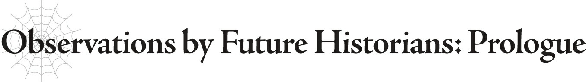

# Nhận định của nhà sử học tương lai: Mở đầu
*(Observations by Future Historians: Prologue)*

Đại chiến Người - Ma.

Cuộc xung đột giữa con người và ma tộc đã kéo dài suốt nhiều thế kỷ.

Thế nhưng, chỉ có duy nhất một trận chiến được gọi là Đại chiến Người - Ma.

Không cần phải là một nhà sử học mới biết được trận chiến này độc nhất vô nhị đến nhường nào.

Con người và ma tộc, mỗi bên đều chiến đấu vì sự sinh tồn của chủng tộc mình.

Không có gì lạ khi chỉ riêng trận chiến này đã xứng đáng được gọi là một cuộc Đại chiến.

Nhiều chi tiết vẫn chưa rõ ràng, do còn rất ít ghi chép tồn tại sau sự hỗn loạn tiếp theo đó, nhưng người ta chấp nhận rộng rãi rằng mỗi bên đã huy động lực lượng lên đến hàng triệu người.

Một số giả thuyết thậm chí còn cho rằng tổng số người tham gia vào cuộc xung đột lên đến hàng chục triệu.

Trận chiến lớn nhất trong ký ức gần đây cho đến lúc đó là Thảm kịch Zatona.

Ngay cả khi đó, tổng số lượng của cả Liên minh Ohts và Quân đội Sariella cộng lại vẫn chưa đến sáu chữ số.

Sariella là một quốc gia hùng mạnh và sở hữu một quân đội đáng gờm.

Để thách thức họ, các đối thủ láng giềng đã thành lập một liên minh và tập hợp một đội quân khổng lồ.

Xét đến dân số của họ vào thời điểm đó, rõ ràng đây sẽ được coi là một trận chiến có quy mô tương đối lớn.

Thế nhưng, cuộc Đại chiến này đã dễ dàng lấn át nó về mặt quy mô.

Bất chấp tất cả những điều này, Đại chiến Người - Ma lại kéo dài trong một thời gian ngắn đến đáng ngạc nhiên.

Với số lượng binh sĩ được huy động như vậy, việc mong đợi trận chiến kéo dài trong nhiều tháng, thậm chí nhiều năm là điều tự nhiên.

Nhưng trong thực tế, nó chỉ kéo dài trong vài ngày ngắn ngủi.

Một lần nữa, do thiếu tài liệu còn sót lại, số ngày chính xác vẫn chưa rõ ràng.

Tuy nhiên, các nhà sử học thống nhất rằng cuộc Đại chiến đã kết thúc tối đa là sau mười ngày.

Một cuộc xung đột có quy mô to lớn như vậy đã kết thúc gần như ngay khi nó vừa bắt đầu.

Nhưng điều thực sự đáng sợ về Đại chiến Người - Ma không phải là quy mô hay sự ngắn ngủi của nó.

Mà là tỷ lệ thương vong.

Con số chính xác một lần nữa vẫn chưa được biết do thiếu số liệu rõ ràng.

Tuy nhiên, giả thuyết được chấp nhận rộng rãi nhất là ít nhất một nửa số lượng của mỗi bên đã tử trận.

Và đó mới chỉ là con số tối thiểu.

Nội suy từ số lượng ma tộc còn sống sót sau khi cuộc chiến kết thúc, có thể an tâm khẳng định rằng ít nhất chừng đó người đã bỏ mạng trên chiến trường.

Một số học giả thậm chí còn đề xuất rằng tỷ lệ thương vong có thể lên tới 70 hoặc 80 phần trăm.

Nói cách cách khác, trong số hàng triệu người tham gia, có không dưới một nửa đã chết chỉ trong vòng vài ngày ngắn ngủi.

Đây là minh chứng rõ ràng cho sự tàn khốc tột cùng đặc trưng của Đại chiến Người - Ma.

Trong số ít tài liệu còn sót lại từ thời kỳ đó, những lời được ghi lại trong nhật ký của một người lính đã trở nên vô cùng nổi tiếng. Chắc hẳn hầu hết mọi người đều đã từng nghe qua câu này ở đâu đó:

“Mọi hy vọng đã mất. Thứ còn lại chỉ là tuyệt vọng.”

---

[◀ Chương trước: Thông tin xuất bản & Ảnh minh họa](00_insert_copyright.md) | [Chương tiếp theo: White 1 ▶](02_white_1.md)
