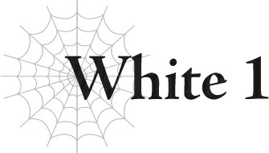
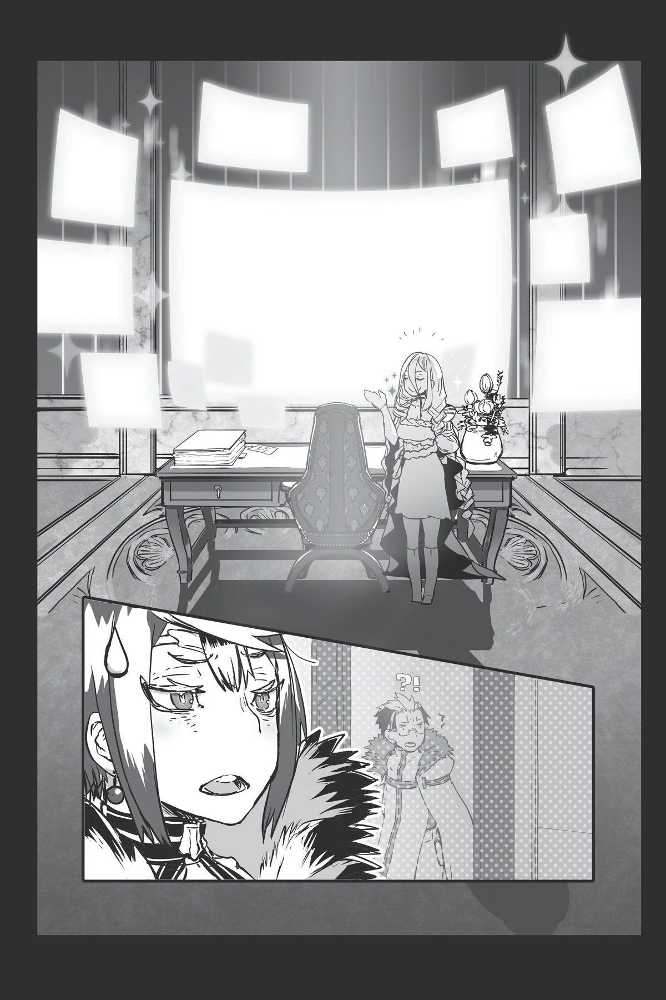
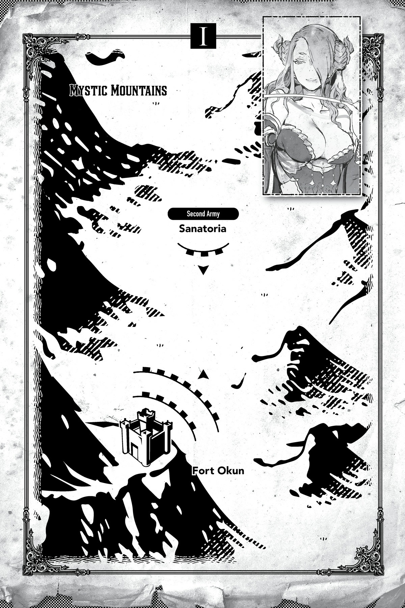

# White 1

Cuối cùng thì thời khắc ấy cũng đã đến!

Đúng vậy, đã đến lúc trình làng trung tâm chỉ huy chiến thuật mà tôi đã tự tay xây dựng rồi!

“Ừm, White... cái quái gì thế này?”

Ma Vương trông thực sự sốc.

Balto đi theo sau cô ấy và quét mắt nhìn quanh phòng với một biểu cảm ngơ ngác không kém.

Hơ-hơ-hơ.

Thế nào hả? Bị bất ngờ rồi đúng không?!

Hãy chiêm ngưỡng bức tường màn hình giám sát mà tôi đã thiết lập đi.

Mỗi chiếc màn hình hiển thị hình ảnh trực tiếp từ các pháo đài khác nhau nơi quân đội của chúng ta được phái đến.

Làm thế nào mà làm được như vậy á?

Bằng cách sử dụng các tiểu phân thân của tôi chứ sao!

Tôi đã gửi những phân thân nhện nhỏ cỡ lòng bàn tay đến từng pháo đài một.

Đúng vậy — các phân thân của tôi về cơ bản đang đóng vai trò là những chiếc camera tự hành siêu công nghệ cao!

Và mọi thứ chúng nhìn thấy sẽ được hiển thị ngay tại đây trên màn hình trong trung tâm chỉ huy chiến thuật của tôi.

Nó thậm chí còn có thể thu được cả âm thanh và giọng nói nữa kìa.

Điều đó có nghĩa là Ma Vương có thể nhận được thông tin cập nhật từng phút từ chiến trường, ngay cả khi cô ấy đang ở tận nơi này!

Thế giới này tuy có kỹ năng và những thứ tương tự, nhưng họ chưa phát triển được công nghệ truyền thông tương đương với những gì bạn có thể tìm thấy ở Trái Đất hiện đại. Vì vậy, trung tâm chỉ huy chiến thuật này sẽ hoàn toàn cách mạng hóa chiến trường!

Aaaa, thật đáng sợ quá đi mà.

Chiều sâu của sự thiên tài của tôi là vô hạn, đến mức chính tôi cũng thấy sợ hãi bản thân mình!

“Được rồi, ừm, tuyệt đấy. Chắc tôi không nên nghĩ quá sâu về chuyện này làm gì.”

Ma Vương ngồi xuống chiếc ghế chỉ huy ở trung tâm căn phòng.

...Ừm, tôi cảm thấy cô có thể phản ứng kịch tính hơn một chút ở đây chứ.

Kiểu như lắp bắp hỏi: “N-Nhưng làm thế nào?!” hay gì đó chẳng hạn.

Ngay cả Balto còn cho tôi phản ứng nhiều hơn kìa. Anh ta vẫn đang đứng chôn chân ở cửa ra vào.

“Balto,” Ma Vương gọi anh ta. “Cậu định đứng ngẩn người ra đó đến bao giờ nữa?”

“T-Tôi vô cùng xin lỗi!”

Nghe vậy, Balto nhanh chóng lấy lại tinh thần và vội vàng bước vào phòng.

Dù vậy, mắt anh ta vẫn không ngừng đảo quanh căn phòng, rõ ràng là anh ta vẫn chưa hết sốc.

Thấy chưa, đây mới là điều tôi đang nói tới chứ!

Đó chính là kiểu phản ứng mà tôi hy vọng nhận được từ Ma Vương!

Tại sao cô ấy lại thản nhiên chấp nhận nó như thể chẳng có gì to tát thế chứ?!

“...Nếu chúng ta cứ phản ứng trước mỗi chuyện nhỏ nhặt mà White làm, chúng ta sẽ chẳng bao giờ làm được việc gì đâu, hiểu chưa?”

“...Tất nhiên rồi ạ.”

Balto cuối cùng cũng lấy lại được bình tĩnh sau khi nghe lời cảnh báo vô cùng chân thành của Ma Vương.

...Ừm, điều đó chắc chắn không làm tôi có cảm giác như những nỗ lực của mình bị phớt lờ hoàn toàn hay gì đâu nhé.

Không hề. Mọi thứ vẫn ổn.

Hiểu chưa? Tuyệt vời.

“Được rồi. Vậy thì tôi đoán mình sẽ chỉ việc thư giãn ở đây và xem mọi người bán mạng làm việc thôi nhỉ.”

Ma Vương mỉm cười nhẹ khi quan sát các màn hình.

Trên mỗi chiếc màn hình trong số rất nhiều màn hình kia, trận chiến chuẩn bị bắt đầu.

Một cuộc chiến quyết định số phận của cả ma tộc và nhân loại.

“Được rồi, White. Nhờ cô cả đấy nhé?”

Tôi giơ một tay lên để biểu thị đã rõ.

Sau đó, tôi dùng Dịch chuyển để rời khỏi phòng.

Có vẻ như tôi cũng có công việc của riêng mình cần phải làm rồi.

**TIÊU ĐIỂM TRẬN CHIẾN PHÁO ĐÀI OKUN!**

Chào mừng đến với chuyên mục White Giải Thích Tất Tần Tật!

Như các bạn có thể thấy, pháo đài mà cô nàng Ngực Khủng chuẩn bị tấn công được bao quanh bởi núi non hiểm trở!

Đúng vậy: núi non hiểm trở!

Sự nguy hiểm của địa hình đồi núi là điều không cần phải bàn cãi!

Rõ ràng, một lẽ thường tình là bất kỳ ai chiếm được vị trí trên cao trong một trận chiến đều có lợi thế.

Việc bắn tên và những thứ tương tự từ trên cao xuống dưới thấp là rất dễ dàng, nhưng ngược lại thì khó hơn rấấất nhiều, bởi vì giờ đây bạn còn phải chống lại cả lực hấp dẫn nữa.

Tệ hơn nữa là bộ binh phải hành quân lên dốc để tấn công, nên họ chắc chắn sẽ nhanh chóng kiệt sức.

Bạn có thể tưởng tượng cảnh mình phải thở hồng hộc leo lên núi, rồi phải chiến đấu ngay lập tức vào khoảnh khắc vừa lên đến đỉnh không? Chuyện đó chắc chắn là cực kỳ tồi tệ.

Quan niệm thông thường cho rằng bên tấn công nên áp đảo bên phòng thủ với tỷ lệ ba chọi một để có thể tự tin tấn công một pháo đài. Nhưng khi pháo đài đó nằm ẩn mình trong núi sâu, độ khó sẽ tăng lên khoảng một triệu lần!

Đó là lý do tại sao rất nhiều lâu đài và công trình phòng thủ trên Trái Đất được xây dựng ở những nơi cao ráo.

Chắc chắn không phải chỉ vì hoàng tộc thích ngắm cảnh từ trên cao đâu!

Tôi khá chắc đấy! Hoàn toàn luôn!

Vậy cô nàng Ngực Khủng định làm thế nào để hạ gục một pháo đài trên núi đây?!

Chúng ta sắp sửa tìm ra câu trả lời rồi!

---

[◀ Chương trước: Thông tin xuất bản & Ảnh minh họa](00_insert_copyright.md) | [Chương tiếp theo: Sanatoria ▶](03_sanatoria.md)
