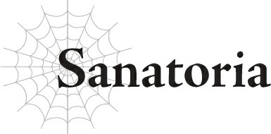
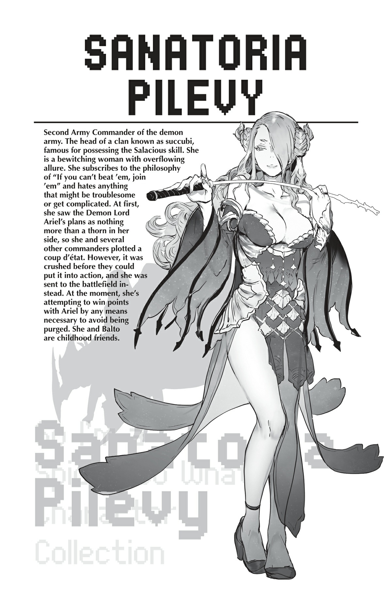
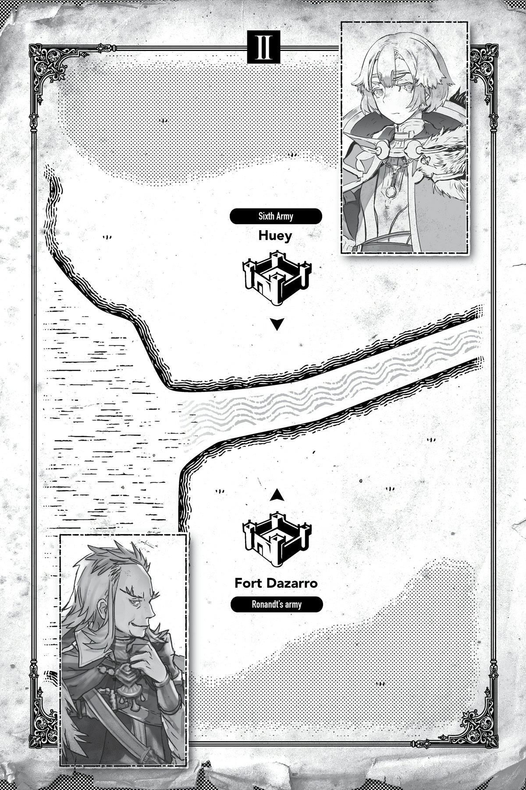

# Sanatoria

“Thưa ngài Sanatoria, đội hình chiến đấu đã hoàn tất.”

“Ừm.”

Tôi hầu như không buồn phản hồi lại báo cáo từ phó tá của mình.

Chẳng cần phải nói những điều tôi vốn đã biết rõ.

Đơn vị do tôi chỉ huy, Quân đoàn 2, đang đóng quân trên một ngọn đồi nơi chúng tôi có thể quan sát một trong những vị trí trọng yếu của loài người: Pháo đài Okun.

Pháo đài Okun được xây dựng rất gần Dãy núi Huyền Bí, vì thế nó được bảo vệ bởi địa hình hiểm trở gần như chính dãy núi đó.

Từ điểm quan sát của mình, chúng tôi có thể thấy rõ những vách đá dựng đứng chắn đường như những bức tường thành và pháo đài uy nghi trông như thể hòa làm một với địa hình đá xung quanh.

Là thành lũy đã đẩy lùi các cuộc xâm lược của ma tộc suốt vô số năm qua, chỉ cần nhìn thoáng qua cũng đủ thấy việc hạ gục nó sẽ khó khăn đến nhường nào.

Đây chẳng phải là một suy nghĩ đáng khích lệ chút nào đối với bản thân tôi, khi nhiệm vụ của tôi chính là phải làm điều đó.

Nhưng đây thậm chí còn chưa phải là một nhiệm vụ đặc biệt khó khăn nhất.

Con người thường xuyên phải chịu đựng các cuộc xâm lược của ma tộc chúng tôi trong suốt lịch sử, và vì vậy họ đã xây dựng nên những hệ thống phòng thủ gần như bất khả xâm phạm.

Nói cách khác, bất kể đi theo con đường xâm lược nào, chúng tôi cũng sẽ phải trải qua một khoảng thời gian tồi tệ.

Hay nói một cách khác nữa, chúng tôi tiêu đời dù có đi đâu đi chăng nữa.

Thật tình, đau đầu quá đi mất.

Khi tôi thở dài một tiếng, vị phó tá lén lút nhìn đi chỗ khác, gương mặt anh ta hơi đỏ lên.

Anh ta đã làm phó tá cho tôi kể từ khi tôi trở thành chỉ huy, thế nhưng anh ta vẫn chưa quen với việc ở gần tôi cho lắm.

Bạn thấy đấy, tôi đến từ dòng dõi của những kẻ mà họ gọi là succubus (nữ quỷ hút tinh khí).

Chúng tôi sở hữu một kỹ năng hiếm có tên là [Khêu Gợi] mà chúng tôi mài giũa và sử dụng như một vũ khí, giúp gia tộc của mình duy trì tước vị quý tộc suốt nhiều thế hệ.

Đúng như cái tên, kỹ năng [Khêu Gợi] cực kỳ hiệu quả đối với bất kỳ ai bị thu hút bởi giới tính đối diện, và bất kỳ hành vi nào có thể cám dỗ mục tiêu sẽ chỉ làm tăng thêm tác dụng của kỹ năng đó.

Các thành viên trong gia tộc tôi đã tận dụng thế mạnh của mình, trau chuốt kỹ lưỡng mọi khía cạnh trong cử chỉ điệu bộ để khiến bản thân trông quyến rũ và mê hoặc nhất có thể.

Kết quả là, tôi có xu hướng tỏa ra một sức hút nhất định mà không cần phải cố gắng, đến mức một số người trong tiểu đoàn toàn nam giới của tôi phàn nàn rằng điều đó có hơi quá đà.

Tác dụng chính của kỹ năng [Khêu Gợi] là tẩy não. Đó là một kỹ năng cho phép người dùng kiểm soát người khác theo ý muốn của mình.

Mặc dù, thật đáng buồn là hiệu quả của nó có giới hạn.

Hiệu ứng tẩy não sẽ tự động biến mất sau một khoảng thời gian nhất định, và tôi cũng không thể ép buộc ý chí của mình lên người khác.

Nếu tôi đưa ra một mệnh lệnh mà mục tiêu cực kỳ bài xích, nó thậm chí có thể phá vỡ hoàn toàn hiệu ứng tẩy não.

Thêm vào đó, bất chấp tất cả những hạn chế này, tỷ lệ thành công của việc tẩy não cũng khá thấp.

Đó là một khả năng cực kỳ khó sử dụng, và trên hết, kỹ năng này vô cùng khó để thăng cấp.

Mọi người thường đặt câu hỏi liệu có thể tin tưởng một người sở hữu sức mạnh tẩy não người khác hay không, và... ừm, đó là một mối lo ngại hợp lý.

Nhiều người đàn ông cũng luôn lo lắng rằng tôi sẽ tẩy não họ.

Đó chính là lý do tại sao hầu hết mọi người không cố gắng học hoặc rèn luyện kỹ năng [Khêu Gợi].

Nhưng gia tộc tôi đã đi ngược lại xu hướng đó.

Có thể nói chúng tôi đã tìm thấy một thị trường ngách rất cụ thể để lấp đầy.

Tuy nhiên, việc sở hữu một khả năng liên quan đến tẩy não thường đồng nghĩa với việc phải chịu những sự nghi ngờ vô căn cứ.

Đó là lý do tại sao, tôi nghe nói, tổ tiên của tôi đã phải quỳ gối trước Ma Vương, và trước các quý tộc khác nữa, suốt nhiều thế hệ.

Họ tự mình lan truyền tin đồn rằng khả năng của chúng tôi không đặc biệt mạnh và biến nó thành nhận thức chung rằng chúng tôi sẽ không bao giờ tẩy não ai vì mục đích xấu xa.

Tổ tiên của tôi đã đi khắp nơi nịnh bợ và bợ đỡ đến mức bạn không thể tin nổi, gieo rắc ý nghĩ rằng họ là những kẻ để người khác sử dụng, chứ không phải ngược lại.

Vì vậy, sau nhiều thế hệ làm như vậy, chúng tôi đã tích lũy đủ tầm ảnh hưởng và quyền lực để tự gọi mình là một gia tộc quý tộc.

Thời nay, dòng dõi succubus thực chất được biết đến nhiều hơn vì sự phục tùng của họ hơn là vì kỹ năng [Khêu Gợi].

Bạn phải thừa nhận rằng, thật buồn cười khi người đại diện của một gia tộc như vậy lại là một kẻ không có lấy một chút lòng trung thành nào đối với Ma Vương.

Nhưng có lẽ đó là điều tất yếu.

Ma Vương thế hệ trước đã bị giết, và người tiếp theo cũng biến mất không lâu sau đó.

Làm sao bất kỳ ai có thể duy trì lòng trung thành khi không có một vị ma vương nào để tôn sùng chứ?

Đặc biệt là khi kẻ hiện đang ngồi trên ngai vàng lại là một cô bé vô danh tiểu tốt từ đâu chui ra. Ai có thể hết lòng chấp nhận cô ta chỉ vì cô ta tự xưng là Ma Vương chứ?

Và ngay khi chúng tôi đang tận hưởng một thời kỳ hòa bình, cô ta đột nhiên tuyên bố rằng mình sẽ bắt đầu lại cuộc chiến.

Tôi lại thở dài một tiếng nữa, lần này chứa đầy sự sầu muộn.

Cách đó không xa, tôi nghe thấy tiếng ai đó nuốt nước bọt ực một cái.

Phó tá của tôi lặng lẽ xua đuổi họ đi.

Ban đầu, vị phó tá này thường bối rối một cách đáng yêu trước mọi hành động của tôi, nhưng gần đây anh ta đã lan truyền tin đồn với các binh sĩ rằng chỉ cần nhìn tôi thôi cũng có thể bị trúng độc. Bạn tin nổi không?

Thật là thô lỗ.

Và anh ta thậm chí còn bắt đầu hỏi tôi những câu như: “Xin ngài hãy cố gắng tuân thủ các quy định và kỷ luật quân đội được không ạ?”

Tại sao tôi phải làm thế chứ? Ngay từ đầu tôi đã chẳng bao giờ muốn gia nhập quân đội rồi.

Nhiệm vụ của quân đội, dĩ nhiên, là chiến đấu với con người.

Nhưng đó là vào thời đại của các ma vương thế hệ trước. Kể từ khi ngai vàng ít nhiều bị bỏ trống, trọng tâm của chúng tôi là tái thiết lãnh thổ của mình.

Và đó là điều tốt nhất.

Giải quyết lũ quái vật và tội phạm dễ dàng hơn nhiều so với việc tiến hành chiến tranh.

Ít nhất, điều đó có nghĩa là một chỉ huy như tôi ít có khả năng phải chết hơn nhiều.

Nhưng đó chắc chắn không phải là trường hợp xảy ra trong một cuộc xung đột toàn diện với con người.

Nếu tôi đi sai một bước, nó có thể dễ dàng cướp đi mạng sống của tôi.

Và rõ ràng, đó là điều cuối cùng tôi mong muốn.

Đó là lý do tại sao tôi đã cố gắng chấm dứt nguyên nhân gây ra cuộc chiến.

Cụ thể là, vị Ma Vương hiện tại...

Nhưng đó là một sai lầm lớn.

Rột. Rột.

Âm thanh đó vẫn còn vang vọng sâu trong tâm trí tôi.

Nereo, Chỉ huy Quân đoàn 9, người đã cố gắng chống lại Ma Vương cùng chúng tôi... ông ta đã bị Ma Vương ăn thịt ngay trước mắt tôi.

Một cuộc thanh trừng chính trị.

Những tiếng nhai nuốt rợn người từ cuộc gặp gỡ đó vẫn kẹt lại bên tai tôi, ngay cả bây giờ.

Đó là khoảnh khắc tôi nhận ra mình đã chọc giận một kẻ thù đáng sợ đến nhường nào.

Một con quái vật.

Tôi đã ra tay chống lại người duy nhất mà tôi không bao giờ nên đụng đến.

Vào thời điểm tôi nhận ra điều đó, mọi chuyện đã quá muộn. Tôi không còn lựa chọn nào khác ngoài việc cố gắng lấy lòng vị Ma Vương này.

Ai mà ngờ được cuối cùng tôi lại đi trên con đường giống như tổ tiên của mình chứ?

Thật tình, đúng là nực cười mà.

Nhưng không còn lựa chọn nào khác — hoặc là làm vậy, hoặc là bị giết.

Tôi phải gạt bỏ mọi thứ sang một bên, đặc biệt là lòng kiêu hãnh của mình, và liếm giày cô ta — theo đúng nghĩa đen, nếu cô ta bảo tôi làm vậy.

Nhưng tôi nghi ngờ việc chỉ cúi đầu nịnh bợ một chút là đủ để con quái vật đó tha cho tôi.

Thực tế, tôi đã tiêu đời ngay từ khoảnh khắc cô ta trở thành Ma Vương rồi.

Bởi vì mục tiêu của cô ta không phải là chiến thắng cuộc chiến — mà là để càng nhiều ma tộc chết trong cuộc chiến này càng tốt.

Không, không chỉ ma tộc. Cả con người nữa.

Về cơ bản, cô ta chỉ quan tâm đến số lượng sinh mạng nằm xuống, việc thắng hay thua chỉ là thứ yếu.

Nếu ma tộc và con người hoàn toàn tiêu diệt lẫn nhau, cô ta sẽ không thể yêu cầu một kết quả nào thuận lợi hơn thế.

Nói cách khác, nhiệm vụ duy nhất của chúng tôi là giết chóc càng nhiều càng tốt và bị giết ngược lại.

Khi bạn nhìn nhận theo cách đó, tôi thực sự chỉ đang quyết định xem mình muốn bị Ma Vương giết hay ngã xuống trong trận chiến chống lại con người mà thôi. Đó có lẽ chỉ là vấn đề tôi sẽ chết sớm hay muộn.

Điều tồi tệ nhất là cuộc chiến chống lại con người này có vẻ vẫn mang lại khả năng sống sót cao hơn là việc chống lại vị Ma Vương kinh hoàng đó.

Và ngay cả khi đó, cơ hội vẫn vô cùng mong manh...

Nhưng tôi sẽ tấn công Pháo đài Okun hết sức có thể.

Tôi không có cách nào thông minh để diễn tả chuyện này, nhưng nó trông giống như định nghĩa của một pháo đài bất khả xâm phạm.

Tấn công trực diện chắc chắn sẽ là một trận chiến cam go — điều đó là chắc chắn.

Không thể nào? Tôi sẽ không đi xa đến mức đó.

Nhưng dù chúng tôi thắng hay thua, việc chúng tôi phải gánh chịu một số tổn thất nghiêm trọng là điều không thể tránh khỏi.

Nếu chúng tôi tấn công trực diện, là vậy đó.

“Chúng đến rồi.”

Khi tôi quan sát, một sự thay đổi bắt đầu xảy ra.

Nhưng không phải ở pháo đài. Mà là trên bề mặt của một ngọn núi gần đó.

Ngọn núi đang chuyển động.

Khi nhìn kỹ hơn, rõ ràng đó hoàn toàn không phải là một ngọn núi.

Đó là một bầy quái vật đông vô số kể.

Ngọn núi bị bao phủ bởi chúng hoàn toàn đến mức bạn thậm chí không thể nhìn thấy bề mặt đất đá.

Và bầy quái vật đang lao thẳng về phía Pháo đài Okun.

Những con quái vật này được gọi là anogratch.

Nhưng chúng cũng được biết đến với một cái tên khác đáng sợ hơn: khỉ báo thù.

Một con anogratch đơn lẻ khó có thể là một mối đe dọa lớn, nhưng mối nguy hiểm thực sự nằm ở hành vi bầy đàn của chúng.

Các đàn anogratch hình thành mối liên kết cực kỳ mạnh mẽ. Nếu một con trong số chúng bị giết, những con còn lại sẽ truy đuổi kẻ thủ ác với tất cả sức mạnh của mình.

Ngay cả khi điều đó đồng nghĩa với việc từng con cuối cùng trong số chúng sẽ bị xóa sổ.

Một khi ai đó đã chọc giận một đàn anogratch, chuyện đó chỉ có thể kết thúc theo một trong hai cách: tiêu diệt toàn bộ đàn khỉ hoặc hy sinh kẻ đã chọc giận chúng.

Nhưng nếu anogratch tấn công một nơi tập trung một nhóm lớn người, bất kỳ ai giết anogratch để tự vệ sẽ chỉ tự biến mình thành mục tiêu mới cho cơn khát máu trả thù của đàn khỉ.

Và khi điều này lan rộng, cuối cùng tất cả những người liên quan đều sẽ trở thành mục tiêu.

Trong trường hợp đó, cuộc chiến sẽ đơn giản tiếp diễn cho đến khi một bên bị tiêu diệt hoàn toàn.

Vì vậy, giờ đây những người trong Pháo đài Okun phải đánh bại toàn bộ đàn anogratch hoặc tự mình bị xóa sổ.

Trên hết, thời điểm này tình cờ lại là mùa sinh sản của lũ khỉ.

Vào thời kỳ đỉnh điểm, những đàn anogratch tràn ra từ Dãy núi Huyền Bí trở thành mối đe dọa lớn nhất mà ma tộc phải đối mặt vào thời điểm này trong năm.

Và tình cờ làm sao, tôi đã bắt sống được một con mà không giết nó, rồi sai một binh sĩ bị tẩy não mang nó vào bên trong pháo đài.

Kết quả đang được diễn ra ngay vào chính khoảnh khắc này.

Đàn khỉ gầm rú lao xuống núi và băng qua đồng bằng, lao thẳng về phía pháo đài.

Ma pháp tấn công bắn ra từ pháo đài, bào mòn số lượng đàn khỉ.

Cứ làm như chuyện đó sẽ mang lại điều gì tốt đẹp cho họ vậy.

Vẫn còn rất nhiều con khác từ phía sau tràn tới. Lũ anogratch đã bao phủ toàn bộ sườn núi, và chúng vẫn tiếp tục kéo đến.

Đàn khỉ nhanh chóng leo qua những bức tường thành của pháo đài, lao về phía trước ngay cả khi đồng bọn của chúng bị bắn hạ.

Số lượng áp đảo.

Khi tôi tưởng tượng điều gì sẽ xảy ra nếu sự trả thù của chúng hướng về phía chúng tôi thay thế, tôi không khỏi rùng mình.

Một số phận khá tàn nhẫn, nếu tự tôi đánh giá.

“Có vẻ như mọi chuyện đã diễn ra suôn sẻ.”

“Vâng, thưa ngài. Thực hiện vô cùng hoàn hảo.”

Phó tá của tôi và tôi gật đầu với nhau.

Ngay từ đầu tôi đã không có ý định dùng Quân đoàn 2 để hạ gục Pháo đài Okun. Chuyện đó đơn giản là quá rủi ro.

Thay vào đó, chúng tôi chỉ việc đứng nhìn làn sóng anogratch đầu tiên leo lên tường thành pháo đài.

Tại thời điểm này, chiến thắng của chúng tôi đã được đảm bảo.

Một khi lũ quái vật đó lọt được vào bên trong pháo đài, việc toàn bộ nơi đó sụp đổ chỉ còn là vấn đề thời gian.

“Và không có lấy một tổn thất nào về phía chúng ta.”

“Đúng như ngài nói. Mặc dù bây giờ chúng ta sẽ không thể tiếp cận pháo đài đó trong một thời gian.”

Tôi đoán điều đó là đúng.

Rằng pháo đài bây giờ chỉ đơn giản là thuộc về lũ anogratch thay vì con người — chúng tôi vẫn không thể bất cẩn cố gắng tấn công nó.

Nhưng điều đó chẳng quan trọng chút nào.

“Một mối bận tâm vụn vặt. Hơn nữa, mục tiêu của chúng ta ở đây chưa bao giờ là chiếm lấy pháo đài cho riêng mình. Kết quả này là hoàn toàn có thể chấp nhận được.”

“Rất đúng ạ. Tôi phải nói rằng, đó là một nước đi vô cùng tài tình, thưa ngài.”

“Ồ, anh quá khen rồi.”

Tôi đã sử dụng kỹ năng [Khêu Gợi] để tẩy não một binh sĩ đối phương mang con anogratch vào pháo đài, nhưng ngay cả khi không có điều đó, chúng tôi vẫn có thể tìm ra cách khác để lén đưa nó vào trong.

Chiến lược này không bắt buộc tôi phải tự mình ra tay thành công.

Tôi thực sự tự nghĩ mình là một chỉ huy khá có năng lực, ngay cả trong số các đồng nghiệp ma tộc của mình.

Nhưng cuối cùng, đó cũng chỉ là một lợi thế nhỏ bé nhất.

Tôi không nằm ngoài quy luật thông thường giống như Ma Vương.

Có một giới hạn cho những gì một cá nhân bình thường như tôi có thể làm được.

Và dù vậy, ngay cả như thế...

“Tôi xin lỗi, Ma Vương. Tôi e rằng mình không có ý định ngoan ngoãn làm theo mong muốn của cô đâu.”

Nếu tôi chống lại cô ta, tôi sẽ chết.

Nếu tôi phục tùng cô ta, tôi cũng sẽ chết.

Quyết định hợp lý duy nhất là phục tùng cô ta hết sức có thể trong khi tìm kiếm một lối thoát.

Nếu tôi chỉ đơn giản làm theo những gì cô ta nói, cuối cùng cô ta sẽ không còn cần đến tôi nữa, tôi chắc chắn thế.

“Cô có thể nghĩ đó là hành vi không phù hợp đối với một ma tộc, nhưng dù sao tôi cũng đã hoàn thành nhiệm vụ của mình. Có lẽ cô sẽ bỏ qua cho tôi lần này chứ?”

Tôi biết đó là một mong ước ích kỷ, nhưng điều tốt nhất tôi có thể hy vọng là cô ta sẽ nhắm mắt làm ngơ trước sự bất tuân của mình.

Trong khi bám víu vào niềm hy vọng mong manh đó, tôi tiếp tục đứng nhìn lũ anogratch tràn ngập Pháo đài Okun.

**TIÊU ĐIỂM TRẬN CHIẾN PHÁO ĐÀI DAZARRO!**

Chào mừng quay trở lại với chuyên mục White Giải Thích Tất Tần Tật!

Như các bạn có thể thấy, pháo đài mà cậu nhóc Shota của chúng ta chuẩn bị tấn công được bao quanh bởi những con sông!

Đúng vậy: những con sông!

Sự nguy hiểm của một lượng nước khổng lồ đang chảy xiết là điều không cần phải bàn cãi!

Bạn có biết rằng việc vượt sông là cực kỳ khó khăn không?

Nếu bạn cảm thấy khó tưởng tượng, có thể thử ghé thăm một hồ bơi ngược dòng hay gì đó xem sao.

Hãy thử băng qua đó mà không bị cuốn trôi xem bạn làm tốt đến mức nào nhé.

Và vì chúng ta đang nói về một đội quân ở đây, điều đó có nghĩa là mọi người sẽ phải mang theo vũ khí, áo giáp và đủ thứ đồ đạc lỉnh kỉnh khác.

Tùy thuộc vào độ sâu của nước, chìm và chết đuối là những mối đe dọa thực sự.

Ngựa và nhu yếu phẩm cũng sẽ bị dòng nước cuốn trôi.

Ngay cả khi sở hữu các chỉ số, bạn cũng không thể xem thường sức mạnh của Mẹ Thiên Nhiên đâu.

Thêm vào đó, họ sẽ hoàn toàn không có khả năng tự vệ trong khi cố gắng vượt sông, nghĩa là kẻ thù có thể bắn tỉa họ bao nhiêu tùy thích.

Đó là cách bạn kết thúc với cảnh hai đội quân chỉ biết lườm nguýt nhau từ hai bên bờ sông đối diện.

Không bên nào muốn là người vượt sông trước cả!

Có vẻ như cậu bạn Shota của chúng ta sẽ cố gắng tấn công kẻ thù bằng ma pháp tầm xa thay vì cố gắng lội qua sông.

Cố lên, Shota! Đừng thua nhé, Shota!

---

[◀ Chương trước: White 1](02_white_1.md) | [Chương tiếp theo: Huey ▶](04_huey.md)
