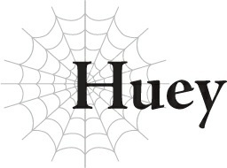
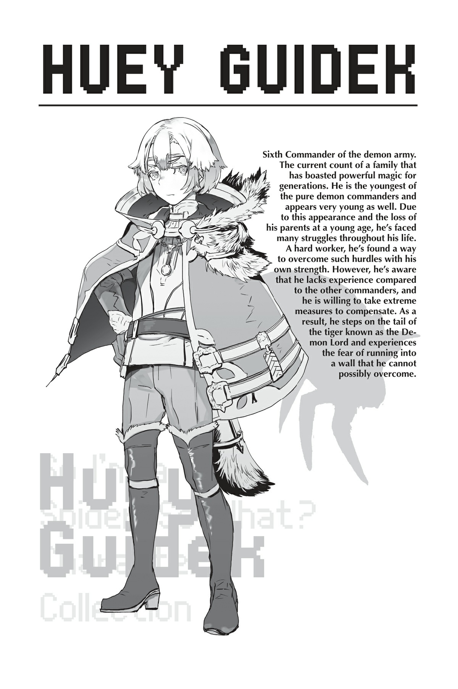

# Huey

Chỉ huy Quân đoàn 6 của quân đội ma tộc.

Đây là vai trò mà tôi đã được giao phó.

Tôi biết rõ hơn ai hết rằng đó khó có thể coi là một vị trí thích hợp cho một kẻ có tầm vóc như tôi.

Theo tiêu chuẩn của ma tộc, tôi vẫn còn rất trẻ.

Và tôi lại sở hữu một vẻ ngoài cực kỳ non nớt, thế nên mọi người luôn nhìn tôi bằng nửa con mắt.

Ma tộc sống lâu hơn con người, và một số người phát triển nhanh hơn những người khác.

Tôi dường như thuộc kiểu người già đi rất chậm, xét đến việc bản thân trông vẫn giống như một đứa trẻ.

Nghe nói dòng họ của chúng tôi có mang một chút dòng máu elf từ vài thế hệ trước, nên có lẽ điều đó cũng ảnh hưởng đến sự phát triển của tôi.

Tôi nói “nghe nói” vì thật khó tin một elf lại thực sự sinh con với ma tộc, khi nghĩ về sự khinh miệt đặc trưng của tộc elf đối với các chủng tộc khác.

Thế nhưng, dòng họ của chúng tôi từ lâu đã được ban cho khả năng tương thích cao với ma pháp, giống hệt như tộc elf, nên có lẽ chuyện đó cũng có phần nào sự thật.

Và sự phát triển chậm chạp của cơ thể tôi là điều vô cùng bất thường đối với ma tộc, điều này càng làm cho giả thuyết về dòng máu elf trở nên thuyết phục hơn.

Em trai tôi cũng rất giống tôi, nên đặc điểm này có lẽ là của cả gia đình, chứ không chỉ riêng cá nhân tôi.

Bạn học và các đàn anh trong trường thường trêu chọc ngoại hình của tôi, và ngay cả các đàn em cũng không coi tôi ra gì.

Và một cơ thể phát triển chậm chạp đồng nghĩa với việc các chỉ huy vật lý của tôi cũng tăng trưởng rất chậm.

Tôi luôn luôn thất bại trong bất kỳ cuộc cận chiến nào, đó là một nguồn sỉ nhục lớn đối với tôi.

Thế nhưng, điều đó chỉ đúng trong các trận chiến thuần túy vật lý. Với ma pháp, câu chuyện lại hoàn toàn khác.

Trong một cuộc so tài ma pháp thuần túy, tôi tự tin mình mạnh hơn bất kỳ ma tộc nào khác.

Lòng kiêu hãnh đó là điều tự nhiên đối với một bá tước của một gia tộc ma pháp lỗi lạc.

Để bảo vệ lòng kiêu hãnh đó, tôi luôn sử dụng ma pháp của mình để lật ngược thế cờ với bất kỳ kẻ nào dám chế giễu tôi.

Và một khi tiếng tăm về sức mạnh của tôi lan xa, không lâu sau tôi đã được bổ nhiệm làm một trong các chỉ huy của quân đội ma tộc, cấp bậc cao nhất mà một ma tộc có thể được phong tặng.

Giờ đây, chính những kẻ từng coi thường tôi lại phải phục tùng tôi.

Cảm giác đó chắc chắn là rất tuyệt.

Nhưng đồng thời, tôi biết mình không thực sự xứng đáng làm một chỉ huy.

Lý do duy nhất tôi trở thành chỉ huy là vì không có ai khác đủ điều kiện hơn.

Nói thẳng ra, tôi không được chọn vì năng lực cá nhân xuất sắc — tôi chỉ đơn thuần là lựa chọn dễ chấp nhận nhất theo phương pháp loại trừ.

Sự thật là, ma tộc đang thiếu hụt nhân lực trầm trọng, kể từ khi chúng tôi mất đi rất nhiều chiến binh giỏi nhất và sáng giá nhất trong cuộc chiến chống lại con người.

Còn rất ít nhà lãnh đạo kỳ cựu còn sống sót ngoài Chỉ huy Agner của Quân đoàn 1, và hầu hết các chỉ huy hiện tại khác đều từng là những tân binh trẻ tuổi lập được công trạng trong những năm dài của cuộc chiến trước.

Nhưng ngay cả thế, số lượng vẫn không đủ, nên họ phải chọn một người từ thế hệ mới đầy triển vọng và bổ nhiệm làm chỉ huy.

Cụ thể là: tôi.

Nói cách khác, tôi chỉ là một phương án tạm thời để lấp chỗ trống.

Tất nhiên, tôi được chọn vì năng lực của mình — không thể phủ nhận điều đó.

Nhưng so với các chỉ huy khác, tôi có ít sức mạnh và kinh nghiệm hơn nhiều.

Tôi tự nghĩ năng lực ma pháp của mình ngang ngửa với các chỉ huy khác, nhưng nếu trong một trận chiến thực sự, tôi chắc chắn mình sẽ là kẻ yếu nhất trong số họ.

Và vì tôi không có nhiều kinh nghiệm, tôi vẫn còn rất vụng về trong việc quản lý quân đội.

Tôi biết sau lưng mình, mọi người gọi tôi bằng những cái tên như “Chỉ huy Nhóc tỳ”.

Trong thời gian đi học, tôi có thể dập tắt mọi lời trêu chọc bằng thực lực ma pháp của mình, nhưng giờ đây khi nắm giữ vai trò chỉ huy, điều đó thôi là không đủ để thuyết phục tất cả mọi người.

Tôi nghi ngờ mọi người sẽ không ngừng chế giễu tôi cho đến khi tôi bắt kịp các chỉ huy khác.

Nhưng đối với một kẻ trẻ tuổi như tôi, điều đó nói dễ hơn làm.

Dù có nhục nhã đến đâu, tôi cũng không còn cách nào khác ngoài việc cắn răng chịu đựng.

Và rồi vị Ma Vương hiện tại xuất hiện.

Có vẻ như các ma vương, theo bản năng, luôn có thôi thúc muốn gây chiến với nhân loại.

Các thế hệ ma vương trước đây chắc chắn là như vậy, đến mức vị Ma Vương gần đây nhất biến mất có thể là một trong số ít ngoại lệ.

Nhưng khi vị Ma Vương đó biến mất, đó thực chất là một vận may lớn đối với ma tộc.

Chúng tôi đã phải chịu đựng những tổn thất nghiêm trọng trong cuộc chiến kéo dài với con người, đến mức không còn tài nguyên hay nhân lực cho một cuộc chiến nữa.

Sự thiếu hụt nhân sự này chính là lý do tôi trở thành chỉ huy ở độ tuổi trẻ như vậy, nên tôi có những cảm xúc lẫn lộn về chuyện đó.

Kể từ khi Ma Vương biến mất, ma tộc đã có thể thiết lập một lệnh ngừng bắn tạm thời với con người và tập trung vào việc tái thiết.

Thế nhưng, vị Ma Vương hiện tại đang phá hủy toàn bộ nỗ lực đó.

Thực tế, cô ta rõ ràng hoàn toàn không nghĩ đến tương lai của ma tộc chút nào.

Các Ma Vương trước đây cũng tiếp tục cuộc chiến với con người, nhưng vị Ma Vương đặc biệt này dường như không có khái niệm về sự chừng mực.

Các Ma Vương trước đây luôn cân nhắc đến tình trạng chung của ma tộc và điều động lực lượng cho phù hợp, nhưng vị hiện tại không quan tâm đến bất kỳ điều gì trong số đó. Cô ta có vẻ hoàn toàn có ý định tập hợp từng ma tộc cuối cùng và gửi họ vào trận chiến với con người.

Hầu hết các chỉ huy đều không tán thành việc này.

Ngay cả tôi cũng có thể đoán trước điều gì sẽ xảy ra nếu chúng tôi đi theo con đường này, nên tất nhiên tôi đã đồng ý với những người khác.

Và tất nhiên, các chỉ huy sẽ không chỉ ngồi yên chờ đợi sự hủy diệt của mình.

Đúng như dự đoán, một âm mưu bí mật nhằm lật đổ Ma Vương bắt đầu được nung nấu.

Tôi nghĩ đây là cơ hội hoàn hảo, nên đã gia nhập cuộc đảo chính không chút do dự.

Còn cách nào tốt hơn để tạo dựng danh tiếng cho bản thân bằng việc lật đổ vị Ma Vương đang dẫn dắt chủng tộc của chúng tôi đi vào con đường hủy diệt chứ?

Tôi đã nghĩ chúng tôi có cơ hội chiến thắng rất lớn.

Ma Vương trông rất trẻ.

Không nghi ngờ gì nữa cô ta chỉ đang bị cuốn theo cảm giác phấn khích khi được công nhận là Ma Vương và cố gắng làm những điều không thể.

Đúng là một kẻ ngốc.

Tôi lặng lẽ gia nhập phe cách mạng và cẩn thận bắt đầu gửi binh lính đến gia nhập Quân đoàn 7 của ngài Warkis.

Kế hoạch là Warkis sẽ tập hợp quân nổi dậy và tấn công, tại thời điểm đó tôi sẽ di chuyển Quân đoàn 6 đến hỗ trợ.

Cô Sanatoria của Quân đoàn 2 cũng đang hợp tác, nên chúng tôi đã sẵn sàng hạ bệ thành lũy của Ma Vương từ cả bên trong lẫn bên ngoài cùng một lúc.

Quân đoàn 4 của Balto đáng lẽ phải bảo vệ cô ta, nhưng anh ta có vẻ cũng không muốn phục tùng Ma Vương, nên chúng tôi nghi ngờ binh lính của anh ta sẽ giữ lòng trung thành với cô ta.

Nếu chúng tôi tiếp cận họ, chắc chắn nhiều người sẽ sẵn sàng đổi phe.

Vì Chỉ huy Quân đoàn 9 Nereo, người phụ trách quản lý nhân sự, cũng đứng về phía nổi loạn, nên việc luân chuyển người xung quanh là rất dễ dàng.

Chúng tôi tập hợp lực lượng một cách lặng lẽ để Ma Vương không nhận ra điều gì bất thường, và không lâu sau, quân đội nổi dậy của chúng tôi sẽ hoàn thành.

Đến lúc đó, đã quá muộn để ngăn chặn cuộc đảo chính.

...Chúng tôi đã nghĩ như vậy.

Nhưng điều tiếp theo chúng tôi biết là cuộc nổi dậy đã bị nghiền nát hoàn toàn.

Tôi đã chứng kiến khoảnh khắc chính xác thủ lĩnh, ngài Warkis, tự sát bằng chính thanh kiếm của mình.

Và ngay sau đó, tất cả các chỉ huy tham gia cuộc nổi dậy đều nhận được lời cảnh báo từ ngài Agner.

Chính lúc đó tôi nhận ra chúng tôi đã thất bại.

Ngài Agner, người dày dạn kinh nghiệm nhất trong số các chỉ huy, được toàn thể ma tộc coi là kẻ mạnh nhất, đang đứng về phía Ma Vương.

Tôi không hiểu tại sao ông ấy lại làm một việc như vậy.

Nhưng chỉ riêng điều đó đã đủ để thuyết phục tôi rằng cuộc nổi dậy là một mục tiêu vô vọng.

Sức ảnh hưởng của ngài Agner đơn giản là quá lớn. Với việc ông ấy là kẻ thù, cơ hội thành công của chúng tôi là vô cùng mong manh.

Tôi đã đặt cược vào một con ngựa thua cuộc.

Giờ đây, điều duy nhất quan trọng là tìm cách để phục hồi bằng cách nào đó.

Ngay khi tôi bắt đầu hoảng loạn, tôi đã bị Ma Vương triệu tập.

Chính lúc đó tôi đã biết chính xác tại sao ngài Agner lại chọn phục tùng cô ta.

Tôi không phải là người duy nhất bị triệu tập.

Ngài Nereo, cô Sanatoria và tôi — những chỉ huy đang bí mật hợp tác với cuộc nổi dậy.

So với thái độ không hề nao núng của Nereo và nụ cười thư thái thường ngày của Sanatoria, tôi chắc chắn mình trông run rẩy một cách thảm hại.

Tôi run rẩy vì sợ rằng chúng tôi sẽ bị kết án tử hình, nhưng thay vào đó, Ma Vương chỉ đơn giản thông báo với chúng tôi rằng Chỉ huy Quân đoàn 9 đang được thay đổi.

Chuyện đó có vẻ chẳng có gì to tát.

Quân đoàn 9 từ lâu đã chỉ còn tồn tại trên danh nghĩa.

Chỉ huy của nó, Nereo, phụ trách tất cả các vấn đề liên quan đến nhân sự, nên phần lớn nỗ lực của ông ấy được dành cho việc đó chứ không phải cho quân đội gần như không tồn tại của mình.

Ma Vương tuyên bố cô ta sẽ bổ nhiệm một chỉ huy mới và biến Quân đoàn 9 thành một đội quân thực sự.

Chỉ có thế mà thôi.

Tôi đã đến cuộc họp với nỗi lo sợ mình có thể bị hành quyết, nên tôi đã nhẹ nhõm khi nghe điều này.

Nhưng một khoảnh khắc sau, tôi nhận ra mình đã sai lầm đến nhường nào khi nghĩ rằng mối nguy hiểm đã qua đi.

Sai lầm khủng khiếp, kinh hoàng, không thể nào quên.

Ma Vương lên tiếng.

“Điều đó nghĩa là chúng ta sẽ không cần đến Chỉ huy Quân đoàn 9 hiện tại nữa.”

Và nói xong, cô ta thản nhiên vứt bỏ ngài Nereo như một công cụ đã hết giá trị sử dụng.

Một vụ hành quyết thông thường thậm chí còn nhân từ hơn thế nhiều.

Không một ai đáng phải chịu đựng những gì tôi đã chứng kiến ngày hôm đó!

Bị nuốt chửng không còn một dấu vết...

Không ai phải chết như thế, và không ai có thể làm được một việc như vậy.

Ma Vương có thể trông giống như một cô bé, nhưng bên trong, cô ta là một con thú dữ tởm lợm.

Nghĩ đến việc tôi đã phải chịu đựng bao lâu vì ngoại hình trẻ con của chính mình, thật không thể tin nổi tôi lại đánh giá sai Ma Vương vì cùng một lý do đó.

Từ ngày hôm đó, chúng tôi bị đẩy vào địa ngục.

Chúng tôi đã sai ở đâu chứ?

Điều đó quá rõ ràng. Chúng tôi không bao giờ nên cố gắng chống lại Ma Vương.

Chúng tôi đã bị đánh lừa bởi ngoại hình của cô ta, chế giễu những kế hoạch có vẻ ngu ngốc của cô ta, và khờ dại cho rằng cô ta chẳng qua chỉ là một kẻ ngốc trẻ tuổi để cho tham vọng làm mờ mắt và chuẩn bị làm hỏng mọi chuyện.

Nhưng chúng tôi đã sai.

Giờ đây mọi chuyện đã quá rõ ràng đối với tôi.

Ma Vương biết chính xác mình đang làm gì và đang cố tình đẩy tất cả chúng tôi vào địa ngục.

Cô ta thực sự là một con thú vô tâm.

Một nỗi kinh hoàng không thích gì hơn ngoài việc đứng nhìn chúng tôi đấu tranh, đau khổ và chết đi!

Cô ta có thể giết tôi bất cứ lúc nào tùy hứng.

Tôi phải làm theo những gì cô ta nói, phục tùng cô ta một cách thành kính, và làm bất cứ điều gì có thể để cải thiện cái nhìn của cô ta về tôi bằng mọi cách...

“Vậy thì hãy giết thật nhiều và chết thật nhiều.”

Đó là mệnh lệnh của cô ta.

Vì vậy chúng tôi phải giết càng nhiều kẻ địch càng tốt.

Nếu không, tất cả chúng tôi sẽ bị giết thay thế!

“Thưa ngài Huey! Chúng ta không thể chịu đựng thêm được nữa! Chúng ta phải rút lui thôi!”

Phó tá của tôi đang nài nỉ chúng tôi rút lui.

Chúng tôi đang tấn công Pháo đài Dazarro, một trong những mỏ neo trong phòng tuyến của loài người.

Quân đoàn 6 được lệnh phải hạ gục nó.

Nói thẳng ra, cán cân quyền lực không nghiêng về phía chúng tôi.

Thực tế, mọi chuyện đang diễn ra tồi tệ hơn nhiều so với những gì tôi tưởng tượng.

Quân lính của tôi, Quân đoàn 6, chủ yếu là những người sử dụng ma pháp.

Điều này một phần là do bản thân tôi chuyên về ma pháp, nhưng các ma pháp sư cũng hoạt động hiệu quả hơn khi tập hợp thành nhóm lớn, đó là lý do tôi cố tình tổ chức quân đội của mình với sự chú trọng đặc biệt vào ma pháp.

Vai trò của một ma pháp sư trong chiến tranh là tiêu diệt quân đội đối phương bằng quân bài tẩy gọi là đại ma pháp, một loại phép thuật đặc biệt được niệm theo nhóm gây ra sát thương trên quy mô khổng lồ.

Không ngoa khi nói rằng lượng đại ma pháp mà một quân đội có thể triển khai có thể là yếu tố quyết định giữa chiến thắng và thất bại.

Và để triển khai nó, nhiều người sử dụng ma pháp cần sử dụng kỹ năng [Hợp Tác] để hoạt động trơn tru cùng nhau.

Vì thế việc có một lượng lớn ma pháp sư là vô cùng quan trọng, đủ để sử dụng đại ma pháp.

Kể từ khi được bổ nhiệm làm chỉ huy, tôi đã liên tục tăng số lượng ma pháp sư dưới quyền bằng cách chỉ dạy cho bất kỳ binh sĩ triển vọng nào tôi tìm thấy, và thậm chí thương lượng để chiêu mộ những binh sĩ có năng khiếu ma pháp từ các quân đoàn khác.

Do đó, tôi tin rằng Quân đoàn 6 giờ đây sở hữu sức mạnh hủy diệt ngang ngửa với bất kỳ lực lượng nào khác.

Thật không may, điều đó đồng nghĩa với việc các binh sĩ tiền tuyến của chúng tôi yếu hơn hẳn so với hầu hết các quân đoàn khác, và vì thế có một mối nguy hiểm rõ rệt là kẻ thù có thể đột phá qua hàng ngũ của họ để tiếp cận các ma pháp sư vô cùng quan trọng của chúng tôi trong một trận chiến thực địa.

Nhưng khi công thành, chúng tôi thực sự có thể đưa sức mạnh hủy diệt của mình vào hoạt động.

Chừng nào họ không tràn ra ngoài pháo đài để tấn công, chúng tôi có thể tiếp tục giội đại ma pháp vào họ từ một khoảng cách an toàn cho đến khi phá hủy toàn bộ pháo đài và đảm bảo chiến thắng.

Tôi đã chắc chắn về điều đó.

Vậy tại sao mọi chuyện lại diễn ra vô cùng tồi tệ thế này chứ?!

“Khốn kiếp!”

“Ngài Huey, chúng ta phải rút lui thôi!”

Khi tôi chửi thề, vị phó tá lặp lại lời cầu xin của mình.

Quân đoàn 6 đang rơi vào tình cảnh khốn đốn đến mức chúng tôi không có nhiều lựa chọn.

Sự hoảng loạn của phó tá càng làm rõ hơn tình thế của chúng tôi đã trở nên tuyệt vọng đến nhường nào.

Đáng lẽ chúng tôi phải thắng trận này chứ.

Dù sao thì đây cũng là một cuộc so tài tối cao về ma pháp mà!

Đúng vậy, đối thủ của chúng tôi cũng đang sử dụng ma pháp tầm xa.

Họ đã thách thức chúng tôi vào một trận chiến ma pháp, điểm mạnh lớn nhất của Quân đoàn 6.

Vào thời điểm đó, tôi đã thầm cười khúc khích.

Tôi chắc chắn rằng chúng tôi có thể giành chiến thắng.

Thế nhưng!

Làm sao chúng tôi lại có thể đang thua cuộc chứ?!

Chúng tôi vẫn chưa bị trúng một đòn đại ma pháp nào của đối phương.

Mặc dù chúng tôi cũng không thể tung ra được bất kỳ đòn tấn công nào, vì bằng cách nào đó họ liên tục nghiền nát các nỗ lực của chúng tôi.

Tấn công kẻ thù bằng đại ma pháp thực sự là chìa khóa để chiến thắng một trận chiến.

Dĩ nhiên, chuẩn bị đại ma pháp mất rất nhiều thời gian, và lượng ma lực khổng lồ liên quan giúp người ta lập tức nhận ra đại ma pháp sắp sửa được sử dụng.

Mục tiêu, do đó, là bảo vệ đại ma pháp của chính mình trong khi ngăn cản kẻ thù sử dụng nó.

Đôi khi, đại ma pháp thậm chí còn được sử dụng để đánh lạc hướng kẻ thù.

Đó là cách sử dụng cốt lõi của nó trong các trận chiến như thế này.

Theo nghĩa đó, chúng tôi đang ngang tài ngang sức.

Họ can thiệp bất cứ khi nào chúng tôi cố gắng sử dụng đại ma pháp, nhưng chúng tôi cũng đã đập tan các nỗ lực của họ.

Điều đó nghĩa là không bên nào có thể tận dụng được các đòn tấn công mạnh nhất của mình.

Nói cách khác, chúng tôi chỉ đơn giản là đang bắn ma pháp thông thường qua lại.

Vậy tại sao bên chúng tôi lại là bên duy nhất phải chịu tổn thất chứ?!

Ma tộc sở hữu các chỉ số cao hơn con người!

Trong một cuộc đấu súng ma pháp, chắc chắn bên có chỉ số cao hơn phải giành chiến thắng — trong trường hợp này là bên chúng tôi.

Nhưng điều ngược lại đang xảy ra.

Nó hoàn toàn vô lý.

Chuyện gì đang xảy ra ở đây thế này?!

Tôi nghe nói tướng địch là một ma pháp sư loài người tên là Ronandt.

Ông ta là một huyền thoại trong loài người, người được cho là đã sống từ thời vị Ma Vương trước đây.

Tôi không tin mình đã đánh giá thấp ông ta.

Nhưng dù vậy, tôi vẫn tự tin rằng chúng tôi sẽ không thua trong một cuộc so tài thuần túy về sức mạnh ma pháp.

Thế nhưng — thế nhưng!

Tôi nghiến răng.

Cứ đà này, Ma Vương sẽ giết tôi mất.

“Chúng ta không thể... rút lui.”

“Nhưng tại sao chứ?! Nếu cứ tiếp tục thế này, chúng ta sẽ chỉ tổ mất thêm quân thôi!”

“Đơn giản là không thể!”

Nếu chúng tôi rút lui mà không đạt được bất kỳ thành tựu nào, Ma Vương sẽ nổi giận lôi đình.

Tôi sẽ bị giết.

Bị ăn thịt.

Không! Tôi không muốn chết như thế!

Tôi phải tạo ra một kết quả nào đó, bất kể phải trả giá thế nào.

Chuyện đó chỉ để lại một lựa chọn duy nhất...

“Chúng ta sẽ sử dụng đại ma pháp. Hỗ trợ tôi.”

“Không có ích gì khi cố gắng sử dụng đại ma pháp lúc này đâu! Chúng ta phải rút lui!”

“Cứ làm đi.”

Tôi sẽ tự tay niệm đại ma pháp để nghiền nát kẻ thù.

Nếu không, không có cách nào để xoay chuyển tình thế trận chiến.

Nhưng trong khi tôi đang cố gắng chuẩn bị, không một ai khác di chuyển lấy một ngón tay.

Lũ ngu ngốc này!

“Mau giúp tôi đi chứ!”

Tôi dậm chân trong sự bất mãn cực độ.

Ngay lúc đó, một thứ gì đó trong đầu tôi đứt phựt.

“Ơ?”

Thế rồi, trước khi tôi kịp hiểu chuyện gì đang xảy ra, ý thức của tôi hoàn toàn chìm vào bóng tối.

---

[◀ Chương trước: Sanatoria](03_sanatoria.md) | [Chương tiếp theo: Ronandt ▶](05_ronandt.md)
