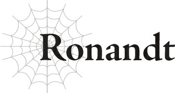
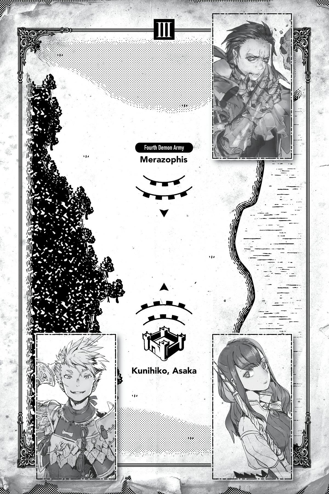

# Ronandt

“Trông ông vẫn khỏe mạnh chán nhỉ, lão già.”

“Thật tốt khi được gặp lại sư phụ.”

Đã lâu lắm rồi tôi mới được gặp lại đứa đệ tử số một của mình, hay còn được biết đến là Anh hùng Julius.

Chúng tôi đã không đối mặt trực tiếp như thế này suốt nhiều năm qua.

Tất cả là nhờ sự can thiệp của lũ Thần Ngôn Giáo, tôi hầu như không được phép tiếp cận thằng bé.

Đúng là một lũ phiền toái.

“Ta rất vui khi thấy con vẫn khỏe mạnh đấy nhé.”

“Sư phụ cũng vậy. Thật đáng kinh ngạc là ông vẫn còn hoạt động năng nổ ở độ tuổi này.”

“Con nghĩ ta là ai hả, nhóc con? Ta sẽ còn đi đây đi đó cho đến ngày ta nhắm mắt xuôi tay, đồ ngốc.”

“Ông chẳng thay đổi chút nào cả.”

Đệ tử số một của tôi mỉm cười một cách cung kính.

Khi tôi mới chăm sóc thằng bé, nó vẫn còn khá ngây thơ, nhưng từ đó đến nay nó đã trưởng thành lên rất nhiều.

“Julius... Ồ, cả Trưởng lão Ronandt nữa. Ông đến từ lúc nào thế?”

Một cậu nhóc bước vào phòng mà không thèm gõ cửa — Hyrince, tôi tin đó là tên của cậu ta? Một trong những người bạn của đứa đệ tử cũ của tôi.

“Chỉ vừa mới tới thôi.”

“Ông ấy tự dưng dịch chuyển tức thời vào đây đấy. Tớ đã liên tục bảo ông ấy đừng có dọa tớ kiểu đó nữa...”

“Nếu con thậm chí còn không phát hiện ra phép dịch chuyển đang tới, con vẫn còn một chặng đường dài phải đi đấy, nhóc con.”

Tôi lờ đi những lời phàn nàn của cậu ta.

Chúng tôi phải gặp nhau bí mật như thế này, nếu không lũ giáo hội sẽ không buông tha cho tôi.

“Đoán là lão già vẫn thế, hả?”

Hyrince thở dài, mặc dù sự hỗn xược chung của cậu ta cũng chẳng thay đổi là bao.

“Vậy, cả hai người đều có việc gì sao?”

“Đúng thế. Nhưng người bạn nhóc con Hyrince của con có thể trình bày chuyện của cậu ta trước.”

Việc của tôi chẳng có gì quan trọng — chỉ là một chút xen vào chuyện của người khác mà thôi.

Nó có thể đợi được.

“Nhóc con hả? Cháu đoán điều đó là hợp lý nếu nó phát ra từ miệng ông, nhưng mà, thôi nào.”

“Có gì sai khi gọi một đứa nhóc là nhóc con chứ? Nếu con có vấn đề gì với chuyện đó, hãy mạnh lên để đánh bại ta trước đi đã.”

“Xin ông tha cho cháu đi.”

Đứa nhóc kia nhoẻn miệng cười, rồi trở nên nghiêm túc.

“Trưởng lão Ronandt, thông tin này về mặt kỹ thuật là thông tin quân sự tối mật, nên...”

“Được rồi, đứa trẻ kia. Ta hứa sẽ không hé răng nửa lời về bất cứ điều gì ta nghe thấy trong căn phòng này.”

Tôi chắc chắn đứa nhóc đó đã hy vọng tôi sẽ rời đi, nhưng cậu ta nên biết rõ hơn thế.

Xét đến việc chúng tôi đã quen biết nhau bao lâu nay, điều này đáng lẽ phải quá rõ ràng rồi.

Quả nhiên, cậu ta nhanh chóng nhún vai và bắt đầu báo cáo.

“Đội trinh sát đã không trở về vào thời gian quy định. Có thể an tâm giả định rằng họ đã bị tiêu diệt hoàn toàn.”

Nghe vậy, gương mặt của đệ tử số một của tôi trở nên nghiêm trọng.

Những binh sĩ đồn trú ở đây, trên phòng tuyến phòng thủ đầu tiên của nhân loại, không phải là những binh sĩ bình thường.

Họ là những kẻ tinh nhuệ nhất.

Ngay cả như vậy, đội trinh sát của họ vẫn thất bại trong việc mang về bất kỳ thông tin nào — một dấu hiệu rõ ràng cho thấy kẻ thù nguy hiểm đến nhường nào.

“Hừm. Có bao nhiêu nhóm đã không trở về?”

“Tất cả bọn họ.”

Thật là một mớ hỗn độn.

Nó thậm chí còn tồi tệ hơn tôi nghĩ.

Trước một trận chiến lớn thế này, các đội trinh sát có xu hướng chia thành các nhóm nhỏ trước khi thu thập thông tin. Bằng cách đó, ngay cả khi một nhóm bị bắt và bị giết, những nhóm khác vẫn có thể mang về bất cứ thứ gì họ tìm thấy.

Nhưng lần này, không một nhóm nào quay trở lại.

Điều đó có nghĩa là mạng lưới tình báo và khả năng phát hiện của kẻ thù vượt trội hơn tất cả các trinh sát của chúng ta, và trên hết, chúng đủ mạnh để tiêu diệt các đội trinh sát tinh nhuệ một cách dễ dàng.

Cũng có khả năng chúng có đủ số lượng để tấn công nhiều phân đội trinh sát cùng một lúc.

Chắc chắn các trinh sát phải có cách liên lạc với nhau ngay cả sau khi chia tách.

Họ chắc hẳn đã được huấn luyện để nhanh chóng rút lui nếu bất kỳ nhóm nào khác gặp rắc rối.

Nhưng vì điều đó đã không xảy ra, họ chắc chắn đã bị tiêu diệt cùng một lúc.

Kỹ năng phát hiện để định vị các đội trinh sát.

Sức mạnh chiến đấu để tiêu diệt họ.

Kẻ thù sở hữu những binh sĩ có cả hai khả năng này, và sở hữu chúng với số lượng đủ lớn để ít nhất là tương đương với các đội trinh sát.

“Nghe có vẻ đây sẽ là một trận chiến đẫm máu,” đệ tử của tôi lẩm bẩm.

Thằng bé chắc hẳn đang trăn trở về các thành viên đội trinh sát đã hy sinh.

“Đệ tử.”

Đã đến lúc tôi phải thông suốt tư tưởng cho thằng bé một lần nữa.

“Biết tính con, ta chắc chắn con đang nghĩ về những binh sĩ đã mất, nhưng đó là một sự lãng phí thời gian. Tốt hơn là hãy nghĩ về bản thân mình trước đi.”

“Sư phụ! Ý ông là sao, lãng phí thời gian?!”

Bình thường, giọng nói của đệ tử tôi không bao giờ dao động, nhưng thằng bé cực kỳ nhạy cảm khi nói đến chuyện sinh tử của người khác.

“Ta đang nói rằng cái chết của các đội trinh sát không phải là điều con cần tập trung vào lúc này.”

“Sư phụ, có những điều không nên nói ra, ngay cả đối với ông. Nếu ông cứ tiếp tục như vậy, con sẽ thực sự tức giận đấy.”

“Ồ-hô? Và con định làm gì với cơn giận đó đây?”

Đứa nhóc Hyrince chùn bước trước lời đe dọa của tôi.

Đệ tử của tôi không biểu lộ bất kỳ sự sợ hãi nào, nhưng tôi biết đó chỉ là giả vờ.

“Con nói con sẽ tức giận với ta sao, hửm? Chắc chắn con không nghĩ mình có thể đánh bại ta trong một trận chiến chứ?”

Tôi nhấn mạnh hơn vào giọng nói của mình, giữ cho nó trầm xuống và đều đều.

Tiếng nuốt nước bọt ực một cái vừa rồi là từ đệ tử của tôi hay từ đứa nhóc kia thế nhỉ?

“Đừng tự mãn quá, nhóc con. Luôn có kẻ mạnh hơn con trên đời này. Ngay cả khi con là Anh hùng đi chăng nữa.”

Nói xong, tôi thu hồi sát khí đe dọa của mình và gõ nhẹ cây trượng vào đầu đệ tử.

“Đối với các đội trinh sát cũng vậy. Họ đã hoàn thành nhiệm vụ của mình trong khả năng tốt nhất và hy sinh trên chiến trường. Tất nhiên việc thương tiếc cái chết của họ không có gì sai cả. Nhưng thật sai lầm khi cảm thấy như thể con phải chịu trách nhiệm bằng cách nào đó. Con nhận ra rằng ngay cả một Anh hùng cũng không thể cứu được tất cả mọi người mọi lúc chứ, đúng không? Hay con ngốc nghếch đến mức nghĩ rằng đáng lẽ mình nên tham gia cùng các đội trinh sát? Khi mà đó sẽ là ý nghĩ thiếu tôn trọng nhất đối với họ, hành xử như thể những người đã khuất không xứng đáng với nhiệm vụ được giao. Chắc chắn vị Anh hùng vĩ đại sẽ không dám nghĩ một điều tồi tệ như vậy chứ?”

Nghe vậy, đệ tử của tôi trông như không thốt nên lời.

Thằng bé im lặng cúi đầu.

Đệ tử số một của tôi luôn luôn như thế. Thằng bé cố gắng gánh vác mọi thứ, ngay cả những gánh nặng không phải của mình.

Khi có ai đó ngã xuống trên chiến trường, lỗi lầm thuộc về chính bản thân họ chứ không phải ai khác.

Nhưng bằng cách nào đó, cậu bé này cảm thấy tội lỗi trừ khi bản thân có thể cứu được từng người một.

Thằng bé dường như vẫn không hiểu rằng điều đó là bất khả thi đối với bất kỳ ai ngoại trừ một vị thần.

“Julius.”

Chỉ một lần này, tôi gọi thằng bé bằng tên của nó.

Từ từ, nó ngẩng đầu lên.

“Trên chiến trường, con chỉ được nghĩ về bản thân mình.”

Nếu con bị phân tâm bởi bất cứ điều gì khác, con có thể sẽ chết trong một trận chiến mà đáng lẽ ra con có thể sống sót.

“Luôn có kẻ mạnh hơn. Con biết điều đó rõ như ta vậy, đúng không? Và chỉ có kẻ mạnh mới có thể bảo vệ người khác. Nhưng con vẫn còn yếu, quá yếu để có thể đánh bại cả ta.”

“Nói thì dễ đối với một người mạnh mẽ như thầy, sư phụ...”

Julius phản bác một cách yếu ớt, và tôi cười khúc khích.

“Ta cũng không ngoại lệ. Con biết cũng có những kẻ mạnh hơn cả ta mà, đúng không?”

Julius cũng đã từng chạm trán vị sư phụ đó trước đây, nên thằng bé chắc chắn phải hiểu.

Sức mạnh đó nằm ngoài tầm với của bất kỳ con người bình thường nào.

“Con có hiểu không? Nếu mọi chuyện trở nên nguy hiểm, con phải bỏ chạy mà không cần suy nghĩ lần thứ hai. Rốt cuộc, con vẫn là Anh hùng, đúng chứ? Một Anh hùng bỏ chạy đỡ rắc rối hơn nhiều so với một Anh hùng đã chết. Con phải khắc ghi điều đó vào đầu.”

“Đừng lo lắng. Cháu sẽ ở đó để bảo vệ Julius.”

Đứa nhóc này đang lảm nhảm cái gì thế?

“Chẳng đáng tin cậy chút nào khi nó phát ra từ miệng một kẻ còn yếu hơn cả đệ tử của ta.”

“Ái chà, thật là phũ phàng!”

Tôi chắc chắn cậu ta đang phản ứng một cách lố bịch như vậy để làm dịu bầu không khí, cố gắng cổ vũ đệ tử của tôi để thằng bé không bước vào trận chiến với vẻ mặt ủ dột.

Tôi thừa nhận đứa nhóc này là một người bạn tốt, ngay cả khi sức mạnh của cậu ta còn thiếu sót.

“Ha-ha. Tớ đoán tớ sẽ trông cậy vào cậu vậy.”

“Tốt lắm. Cậu không có gì phải lo lắng cả.”

Quả nhiên, tâm trạng của đệ tử tôi đã hồi phục một chút.

“Mặc dù vậy, Trưởng lão Ronandt, ông đến đây để kiểm tra đứa đệ tử yêu quý của mình sao? Cháu đoán ông cũng có một khía cạnh khá đáng yêu đấy chứ.”

“Đ-Đó chắc chắn không phải là mục đích của ta!”

Đứa ngốc này đang nói cái quái gì thế không biết?!

Tôi đã nghĩ cậu ta là một người bạn đồng hành tốt cho đệ tử của mình, nhưng rõ ràng tôi đã đánh giá sai cậu ta rồi!

“Ồ, nhìn kìa, ông ấy đang đỏ mặt đấy.”

“Ta chắc chắn là không! Thật tình! Ta đi đây, lũ nhóc ranh!”

“Được rồi ạ. Cảm ơn thầy vì ngày hôm nay, sư phụ.”

“Hừm.”

Tôi sử dụng Dịch chuyển để rời đi.

Chuyện đó vừa mới diễn ra cách đây vài ngày.

“Quân địch đang rút lui toàn diện.”

“Đúng vậy.”

Tôi gật đầu trước lời nói của một trong các đệ tử của mình.

Kể từ khi nhận Julius làm đệ tử đầu tiên, tôi đã chuyển trọng tâm từ việc rèn luyện bản thân sang việc nuôi dạy các đệ tử.

Tôi đã già rồi.

Điểm kết thúc của tôi đã ở trong tầm mắt, bất kể tôi có rèn luyện bao nhiêu đi chăng nữa.

Vì vậy, tốt hơn là truyền lại những gì tôi đã học được trong đời cho các thế hệ tương lai.

Biết đâu một ngày nào đó, một trong các đệ tử của tôi sẽ đạt được sức mạnh vượt qua cả giới hạn của con người.

Đó chắc chắn là một niềm hy vọng mong manh.

Tôi đã tập hợp những người đăng ký từ nhiều vùng đất khác nhau và đưa họ vào chế độ huấn luyện nghiêm ngặt với tư cách là đệ tử của mình.

Hầu hết họ đều không thể chịu đựng được quá trình huấn luyện của tôi và đã bỏ chạy không lâu sau đó...

Tất nhiên, điều đó chỉ giúp tôi có thêm thời gian để dành cho những người xứng đáng còn lại ở lại.

Giờ đây họ cuối cùng đã có thể chịu đựng được cấp độ huấn luyện đầu tiên của tôi.

Một số thậm chí đã học được cách sử dụng Ma pháp Không gian.

Dù vậy, họ vẫn còn một chặng đường dài phía trước.

Chưa một ai vượt qua được đứa đệ tử đầu tiên của tôi cho đến nay.

Vì đệ tử đầu tiên của tôi là Anh hùng, điều đó là tất yếu. Nhưng thật thất vọng, chưa một ai vượt qua được đứa đệ tử thứ hai của tôi.

Đệ tử thứ hai của tôi, Aurel, ban đầu chỉ là người giúp việc của tôi.

Tôi chỉ đơn giản nhận con bé làm đệ tử theo ý thích nhất thời vì con bé có vẻ có năng khiếu ma pháp.

Kết quả là, con bé không đặc biệt có động lực cho lắm.

Dù vậy, sức mạnh của con bé vẫn chỉ đứng sau Julius trong số các đệ tử của tôi, nên tôi không biết điều gì đáng ghét hơn: sự bất tài của những đứa khác hay thực tế là con bé có thể còn mạnh hơn nữa nếu nó chịu nỗ lực nhiều hơn.

Nhưng trong mọi trường hợp, tiềm năng cơ bản của các ma pháp sư ngày nay đã vượt xa các thế hệ trước.

Điều đó đã quá rõ ràng, đặc biệt là sau trận chiến này.

Chúng tôi đã giành được một chiến thắng quyết định sau khi tham gia vào một cuộc đấu súng ma pháp khốc liệt với ma tộc.

Sức mạnh của một phép thuật nhìn chung là cố định, có rất ít sự thay đổi dựa trên sự khác biệt về chỉ số của người sử dụng.

Điều này từ lâu đã được chấp nhận như một lẽ thường tình.

Nhưng sau cuộc gặp gỡ với vị sư phụ đó và quá trình huấn luyện sau này của tôi với lũ nhện, tôi nhận ra rằng việc tăng cường hiệu lực của các phép thuật là hoàn toàn có thể.

Chìa khóa nằm ở cấp độ kỹ năng [Thao tác Ma lực] của người niệm phép.

Trước khi có phát hiện này, người ta nghĩ rằng kỹ năng này chỉ cần thiết để ban đầu học cách sử dụng các phép thuật.

Nhưng tôi phát hiện ra rằng nếu bạn nâng cao cấp độ kỹ năng [Thao tác Ma lực], bạn có thể thay đổi cấu trúc của các phép thuật và làm cho chúng yếu đi hoặc mạnh lên.

Đây là một sự thay đổi cơ bản trong hiểu biết của chúng ta về ma pháp.

Nó giúp chúng ta có thể gây sát thương lớn cho kẻ thù mà không cần sử dụng đại ma pháp, vốn đòi hỏi nhiều người niệm phép và rất nhiều thời gian.

Quân đội ma tộc mà chúng tôi đối mặt dường như cũng chuyên về ma pháp, nhưng họ lại tập trung vào đại ma pháp, chiến thuật của quá khứ.

Điều đó là không đủ để đánh bại những kẻ như tôi.

Tướng địch có vẻ là một cậu bé, nhưng tôi đã kết liễu cậu ta một cách dễ dàng bằng một phép thuật tấn công tầm xa được tăng cường.

Tôi nghi ngờ tên ma tộc đó thậm chí còn không nhận ra rằng mình đã chết.

Thật khó để đoán tuổi của một ma tộc qua ngoại hình của họ, nhưng nhìn vào vẻ ngoài của cậu ta, cậu ta chắc hẳn còn khá trẻ.

Sự thiếu kinh nghiệm của cậu ta là điều hiển nhiên qua cách chỉ huy lực lượng, nên tôi nghĩ mình không đoán sai là bao.

Để trở thành một tướng quân ở độ tuổi trẻ như vậy, cậu ta chắc hẳn phải có rất nhiều tài năng.

Thật đáng tiếc khi thấy một tiềm năng như vậy bị lãng phí.

Nhưng thật dại dột khi tỏ lòng nhân từ với kẻ thù.

Với tư cách là một tướng quân, tôi biết cũng có những binh sĩ đã giao phó mạng sống của họ vào tay tôi.

Các bạn không được nghĩ xấu về tôi vì điều đó.

Nhưng dù vậy, tôi tin mình ít nhất có thể dành một khoảnh khắc để cầu nguyện cho linh hồn của cậu bé này được ra đi thanh thản.

“Thương vong của chúng ta là tối thiểu. Con đã lo sợ rằng lực lượng của chúng ta quá thiếu hụt, nhưng với tốc độ này, chúng ta sẽ có thể bảo vệ được pháo đài này.”

“Có vẻ là như thế.”

Tôi gật đầu với đứa đệ tử đang trông có vẻ vui mừng của mình.

Chúng tôi đã bị áp đảo về số lượng, đó là điều chắc chắn.

Cuộc đấu súng ma pháp vô cùng khốc liệt. Chúng tôi có thể thắng vì các đệ tử tôi đã huấn luyện có lợi thế hơn so với các kỹ thuật ma pháp lạc hậu của ma tộc, nhưng đó hoàn toàn không phải là một chiến thắng dễ dàng.

Nếu đó là bất kỳ ai khác ngoại trừ tôi và các đệ tử của tôi ở Pháo đài Dazarro, có lẽ nơi này đã thất thủ trước các ma pháp sư ma tộc đó từ lâu rồi.

Chiến thắng của chúng tôi suy cho cùng chỉ nhờ vào một vận may tốt mà thôi.

Nếu quân đội quy mô đó cũng được gửi đến các pháo đài khác, vài nơi rất có thể sẽ thất thủ.

Và vì lý do nào đó, tôi vẫn bị ám ảnh bởi một cảm giác bất an.

Tôi không khỏi lo lắng rằng đó có thể là dấu hiệu cho thấy một điều gì đó khủng khiếp sắp xảy ra.

“Đừng có lơ là cảnh giác. Kẻ thù của chúng ta là ma tộc. Chúng chắc chắn sở hữu các chỉ số cao hơn loài người chúng ta.”

“A! Tất nhiên rồi ạ.”

Đệ tử của tôi kìm lại sự phấn khích tràn trề đó và lấy lại sự bình tĩnh.

“Hãy đảm bảo những người bị thương được điều trị ngay lập tức.”

“Rõ, thưa thầy!”

Các đệ tử của tôi vội vàng rời khỏi phòng.

Vẫn còn nhiều sự chuẩn bị khác mà chúng tôi phải thực hiện.

Tôi chỉ hy vọng linh cảm này của mình hóa ra chỉ là nỗi sợ hãi vô căn cứ của một lão già mà thôi.

**TIÊU ĐIỂM TRẬN CHIẾN CỦA MERAZOPHIS!**

Chào mừng quay trở lại với chuyên mục White Giải Thích Tất Tần Tật!

Như các bạn có thể thấy, pháo đài mà Mera đang tấn công nằm giữa một hồ nước và một khu rừng!

Và một hồ nước chỉ có thể có nghĩa là một điều duy nhất: THỦY CHIẾN!

Hoặc bạn sẽ nghĩ như vậy, nhưng công nghệ đi biển của thế giới này thực chất không tiến bộ cho lắm.

Ý tôi là, hầu hết các vùng nước ở đây đều là nhà của những con quái vật siêu mạnh.

Nếu bạn thử đi bơi ngoài đại dương, một con thủy long sẽ xuất hiện để chào hỏi bạn trong nháy mắt.

Hồ nước thì đỡ hơn một chút, nhưng nếu bạn thử chèo thuyền trên đó, bạn vẫn chắc chắn sẽ đi bán muối cho cá thôi.

Đáng sợ hay sao chứ?

Dù sao thì, điều đó nghĩa là hồ nước là vùng cấm đối với cả hai bên trong trận chiến này.

Pháo đài có lợi thế là có thể bỏ qua hoàn toàn mạn sườn được bao phủ bởi hồ nước, giúp họ tập trung hoàn toàn vào phía đất liền.

Dù vậy, bạn cũng không thể loại trừ khả năng lẻn ra phía sau pháo đài bằng cách sử dụng khu rừng làm màn che, nên bên phòng thủ cũng không thể lơ là cảnh giác được.

Cả hai bên đều có những lợi thế và bất lợi riêng do địa hình mang lại.

Đoán là chuyện này sẽ phụ thuộc hoàn toàn vào sức mạnh thuần túy rồi.

Ồ, Mera chắc chắn sẽ ổn trên phương diện đó thôi!

---

[◀ Chương trước: Huey](04_huey.md) | [Chương tiếp theo: Kunihiko ▶](06_kunihiko.md)
