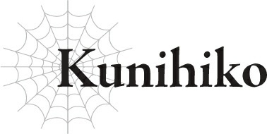

# Kunihiko

Tôi có ký ức từ kiếp trước, bạn biết đấy.

Một kiếp sống mà tôi lớn lên trên một hành tinh gọi là Trái Đất, tại một đất nước tên là Nhật Bản.

Dù không muốn thừa nhận, nhưng ở kiếp đó, tôi chỉ là một cậu học sinh trung học bình thường, chẳng có gì nổi bật.

Về cơ bản, điều đáng chú ý duy nhất về tôi là tôi có một cô bạn thuở nhỏ.

Không phải là tôi và cô bạn thuở nhỏ của tôi, Kushitani Asaka, đặc biệt thân thiết hay gì cả.

Đồng thời, cũng không phải là chúng tôi không hòa thuận với nhau.

Nếu phải chọn một, tôi đoán mình sẽ nói là chúng tôi khá hòa hợp chứ?

Chúng tôi sống cùng một khu phố và học cùng trường từ mẫu giáo đến trung học cơ sở. Chúng tôi cũng học chung trường trung học phổ thông, và thậm chí còn vào chung một lớp, dù chúng tôi không hề lên kế hoạch trước hay gì cả.

Về cơ bản, chúng tôi luôn dính lấy nhau.

Con bé chưa bao giờ đến đánh thức tôi vào buổi sáng, và chúng tôi cũng không thường xuyên đi học về cùng nhau.

Nói đúng ra, tôi thường đi học khá muộn, nên hầu như không có chuyện gặp nhau vào buổi sáng.

Trong những dịp hiếm hoi tôi thức dậy đủ sớm, thỉnh thoảng chúng tôi mới tình cờ gặp nhau và cùng đi bộ đến trường, nhưng chỉ có thế thôi.

Nhưng thật kỳ lạ, tôi luôn có một cảm giác mơ hồ rằng một ngày nào đó mình sẽ kết hôn với con bé.

Vì lý do nào đó, tôi luôn cảm thấy thư thái khi ở bên con bé, như thể nó hiểu tôi ngay cả khi tôi không nói lời nào.

Đúng vậy, tôi biết mình đã hành xử rất hời hợt, và nếu tôi cứ tiếp tục tỏ ra thờ ơ như thế, cuối cùng một gã nào đó sẽ xuất hiện và cướp con bé đi mất.

Nhưng tôi cứ tiếp tục trì hoãn, chần chừ và duy trì mối quan hệ không hơn gì mức bạn thuở nhỏ.

Nó bình dị đến mức chúng tôi hầu như không có gì kết nối ngoại trừ việc hai đứa là bạn thuở nhỏ.

Tất nhiên, tôi không hề bận lòng về chuyện đó.

Kiểu như “bình thường cũng là một điều tốt” ấy mà.

Nhưng tôi đoán là mình vẫn cảm thấy thiếu thốn một điều gì đó.

Tôi muốn tham gia vào một cuộc phiêu lưu tuyệt vời ở một vùng đất xa xôi.

Muốn có điều gì đó thú vị xảy ra với mình, giống như trong trò chơi hay light novel vậy.

Và tôi biết điều đó sẽ không bao giờ xảy ra, vì tất cả những thứ đó chỉ là hư cấu.

...Tôi đã nghĩ như vậy.

Nhưng điều tiếp theo tôi biết là tôi đã được tái sinh vào thế giới này.

Tôi sẽ thành thật: tôi không nhớ mình đã chết như thế nào, và cũng không nhớ nhiều về khoảnh khắc mình được đầu thai.

Nó giống như việc tôi đang thiu thiu ngủ, và điều tiếp theo tôi biết là mình đã trở thành một đứa trẻ sơ sinh.

Khi tỉnh dậy, tôi kiểu: CÁI QUÁI GÌ THẾ NÀY?!

Thôi nào, điều cuối cùng tôi có thể nhớ ở kiếp trước chỉ là đang ngồi trong giờ học văn học cổ điển, bạn biết không?

Đó không hẳn là một cái kết ly kỳ cho lắm.

Cái quái gì đã giết tôi thế chứ?

Và rồi bằng cách nào đó tôi lại biến thành một đứa bé.

Ai mà không thấy kỳ quái sau khi trải qua chuyện đó cơ chứ?!

Nhưng lý do tôi không hoàn toàn hoảng loạn là vì Asaka đang nằm ngay cạnh tôi.

Đúng vậy, chính xác là thế.

Cô bạn cùng lớp và bạn thuở nhỏ của tôi, Asaka.

Vì lý do nào đó, con bé cũng được chuyển sinh. Chúng tôi lại trở thành bạn thuở nhỏ một lần nữa.

Ngoại hình của con bé đã khác — ý tôi là, cả hai chúng tôi đều là TRẺ SƠ SINH — nhưng không hiểu sao, tôi có thể nhận ra đó là con bé ngay lập tức.

Và khi tôi hỏi sau đó, con bé rõ ràng cũng có cảm giác y hệt như vậy.

Không có chuyện gì điên rồ hơn thế nữa.

Nhưng quan trọng hơn, tôi nghĩ đây chắc chắn là định mệnh.

Như thể các vị thần đang bảo chúng tôi phải gắn bó với nhau vậy.

Vì thế, trong khi có một khoảng cách mơ hồ giữa hai chúng tôi ở kiếp trước, sau khi chuyển sinh, chúng tôi đã trở nên vô cùng thân thiết.

Asaka không thể quên được kiếp trước và sợ rằng mình sẽ đánh mất bản thân nếu tôi không ở bên cạnh.

Và việc có Asaka đồng nghĩa với việc tôi có người để chia sẻ về việc cuối cùng cũng được tham gia vào một cuộc phiêu lưu thực sự.

Thế giới chúng tôi được tái sinh vào là một bối cảnh giả tưởng, với quái vật và các mạo hiểm giả — chính xác là kiểu thế giới mà tôi từng ước ao ở kiếp trước.

Vì vậy, tôi đã không ngần ngại tuyên bố rằng mình muốn trở thành một mạo hiểm giả và đi chu du khắp thế giới.

Nếu Asaka không ở bên cạnh, tôi không biết liệu mình có thể táo bạo đến thế hay không.

Sẽ rất đáng sợ khi đột nhiên bị đẩy vào một thế giới xa lạ, nơi bạn không quen biết lấy một người.

Thật sự đấy. Tôi vô cùng may mắn khi có Asaka.

Ngay khi vừa biết nói, điều đầu tiên tôi làm là tỏ tình với con bé.

“Tớ không thể sống thiếu cậu. Sau này hãy gả cho tớ nhé.”

Tôi đã thốt ra điều này vào giữa ban ngày, trước sự chứng kiến của cả các bà mẹ của chúng tôi nữa.

Đó là một lời tỏ tình công khai, nhưng nghe Asaka kể lại, nó giống như một vụ hành quyết công khai hơn.

Được rồi, đúng vậy. Nghĩ lại thì lúc đó tôi đã hơi vội vàng.

Các bà mẹ của chúng tôi chỉ nhìn tôi với ánh mắt kỳ lạ, nói những câu kiểu như: “Lũ trẻ bây giờ lớn nhanh thật đấy.”

Công bằng mà nói, không đời nào họ biết được bên trong tôi thực chất là một học sinh trung học từ thế giới khác.

Có lẽ việc họ chỉ xem đó là một đứa trẻ đang bắt chước trò tỏ tình cho vui lại là điều tốt nhất.

Asaka trông thực sự rất ngượng ngùng...

Nhưng một cách thần kỳ, con bé đã đồng ý ngay tại chỗ.

Ở kiếp trước, tôi luôn nghĩ một ngày nào đó mình sẽ phải nói chuyện nghiêm túc với con bé, nhưng tôi chưa bao giờ tìm được thời điểm thích hợp, nên mối quan hệ của chúng tôi cứ mãi lấp lửng.

Tôi chưa bao giờ tưởng tượng được chuyện đó lại thay đổi khi chúng tôi được chuyển sinh hay điều gì điên rồ tương tự, nhưng tôi đoán cuối cùng mọi chuyện đã diễn ra tốt đẹp.

Về mặt thời điểm kịch tính, việc cùng nhau tái sinh là điều tuyệt vời nhất có thể xảy ra.

Nhờ đó, ngay cả một kẻ khờ khạo như tôi cũng có thể thành thật với cảm xúc của mình, nên tôi đã nghĩ việc được tái sinh cũng không đến nỗi tệ chút nào.

Asaka có vẻ nhớ thế giới cũ của chúng tôi hơn tôi, vì thỉnh thoảng con bé lại nhớ lại và khóc lóc này nọ.

Mỗi khi chuyện đó xảy ra, tôi chỉ ngồi cạnh và lặng lẽ an ủi con bé.

Có lẽ tôi mới là kẻ kỳ dị khi thích nghi nhanh đến vậy, đúng không?

Nhưng Asaka là một người rất lý trí, nên con bé đã lấy lại tinh thần khá nhanh.

...Điều đó thực ra có hơi đáng tiếc một chút, vì con bé trông rất đáng yêu và bám người mỗi khi buồn bã.

Dù sao thì, tôi vẫn rất vui vì con bé đã có thể vui vẻ trở lại.

Tôi được tái sinh vào thế giới giả tưởng trong mơ của mình và cầu hôn thành công cô bạn thuở nhỏ.

Nghe chắc chắn giống như sự khởi đầu của một tương lai tươi sáng đúng không?

Tôi biết vô số khoảng thời gian vui vẻ đang chờ đón chúng tôi — Asaka và tôi, cùng nhau đi du lịch khắp thế giới, tận hưởng cuộc sống của mình.

Tôi chưa bao giờ nghi ngờ điều đó dù chỉ một giây...

...cho đến khi ngày hôm đó đến.

“Ồ, nhìn kìa. Chúng đến rồi.”

“Kunihiko... sao cậu trông có vẻ hơi hào hứng thế?”

Khi tôi quan sát quân đội đối phương từ trên tường thành pháo đài, Asaka khẽ nhíu mày nhìn tôi.

“Cậu đùa tớ à? Thôi nào! Hãy nhìn cảnh đó và bảo tớ là nó không ngầu đi xem nào.”

Tôi chỉ tay xuống đội quân ma tộc khổng lồ phía dưới.

Bạn sẽ hiếm khi thấy lực lượng quân đội với số lượng lớn như thế này ở thế giới này, chưa nói đến Trái Đất, và bây giờ cả một mớ hỗn độn bọn chúng đang diễu binh thẳng về phía pháo đài của chúng ta.

“Tuyệt vời thật.”

“Không phải là tớ không hiểu ý cậu, nhưng cậu có nhận ra chúng ta sắp phải chiến đấu với tất cả những người đó không?”

Asaka thở dài một tiếng.

Ma tộc đã tập hợp quân đội của họ và đang tấn công nhân loại.

Cho đến gần đây, chuyện này chỉ dừng lại ở một vài tin đồn lặng lẽ, nhưng một khi hiệp hội bắt đầu tập hợp các mạo hiểm giả để chiến đấu trong chiến tranh, mọi thứ đã trở nên vô cùng chân thực và nhanh chóng.

Trên hết, việc tham gia là bắt buộc đối với các mạo hiểm giả từ hạng B trở lên.

Hạng C trở xuống được lựa chọn tự quyết định xem có tham gia hay không, nhưng hiệp hội đã nói rõ rằng họ muốn có càng nhiều người đăng ký càng tốt.

Asaka và tôi là các mạo hiểm giả hạng A, nên chúng tôi không có đặc quyền được lựa chọn.

Tất cả các mạo hiểm giả hạng cao đều bị cử thẳng ra chiến trường, ngay cả những người bình thường vẫn bảo vệ các thị trấn và thành phố khỏi lũ quái vật địa phương.

Điều đó đồng nghĩa với việc những nơi đó sẽ tạm thời không được bảo vệ, nhưng điều đó chỉ cho thấy tình hình chiến tranh này tồi tệ đến mức nào.

Nếu điều đó vẫn chưa đủ chứng minh, họ đã mở các cổng dịch chuyển tức thời, vốn bình thường bị cấm đối với dân thường, để vận chuyển binh lính và mạo hiểm giả ra chiến trường.

Mặc dù tất cả những điều này chỉ là tôi lặp lại những gì Asaka đã kể cho tôi nghe.

Tôi không nghĩ về những chi tiết ngớ ngẩn như vậy — tôi chỉ việc làm theo mệnh lệnh và chiến đấu với ma tộc mà thôi.

“Hừm! Bất kể bọn chúng có bao nhiêu đứa đi chăng nữa cũng chẳng nghĩa lý gì chừng nào cậu và tớ còn tham gia trận chiến này.”

“Kunihiko, đừng có tinh tướng.”

Asaka lại thở dài, nhưng con bé trông cũng không đặc biệt lo lắng cho lắm.

Rất nhiều mạo hiểm giả khác ở đây đang vô cùng lo lắng — tôi có thể nhận ra điều đó.

Cũng không thể trách họ được. Mọi người đều nói ma tộc sở hữu các chỉ số tốt hơn con người, và hiện tại có một lượng lớn ma tộc đang tiến về phía chúng tôi.

Theo những gì tôi nghe được, cũng đã nhiều năm rồi không có bất kỳ ma tộc nào tấn công.

Trước đó, cứ vài năm lại có những cuộc đụng độ nhỏ, nhưng rồi ngay cả những cuộc đụng độ đó cũng dừng lại, nên những người duy nhất từng thực sự chiến đấu với ma tộc vào thời điểm này đều là những hóa thạch sống cả rồi.

Nói cách khác, đây sẽ là lần đầu tiên hầu hết các chiến binh loài người đối mặt với ma tộc, chứ không riêng gì những người trẻ tuổi như Asaka và tôi.

Các mạo hiểm giả thường chiến đấu với quái vật, và thỉnh thoảng là vài tên cướp hay gì đó, nên chúng tôi chưa từng trải qua những trận chiến như thế này.

Chưa kể, hầu hết các mạo hiểm giả không hoạt động tốt với bất kỳ ai ngoại trừ tổ đội của chính họ, nhưng bây giờ chúng tôi phải lập thành một nhóm lớn và hợp tác sao? Nghĩ hay đấy.

Chúng tôi chưa bao giờ được huấn luyện cho những trò nhảm nhí đó cả. Không đời nào.

Nhưng tôi đoán các ông lớn bên phía chúng ta cũng hiểu điều đó, nên họ gần như chỉ bảo các mạo hiểm giả chúng tôi muốn làm gì thì làm.

Chúng tôi được tập hợp tại phòng tuyến phòng thủ cuối cùng của pháo đài, trong khi những binh lính thực sự được huấn luyện cho việc này đang ở tiền tuyến.

Bạn được phép ở lại đây và bảo vệ pháo đài nếu muốn.

Hoặc bạn có thể đi ra ngoài tập kích để nghênh chiến với quân địch.

Nhưng nếu bạn làm chuyện gì điên rồ và tự nộp mạng, thì đó là lỗi của bạn!

...Về cơ bản là như vậy.

Ngay cả khi chúng tôi không làm gì điên rồ, tôi khá chắc chắn rất nhiều người vẫn sẽ phải bỏ mạng, xét đến việc quân đội đối phương khổng lồ như thế nào.

Đó là lý do tại sao hầu như ai cũng lo lắng.

Những người duy nhất không lo lắng là những kẻ như Asaka và tôi, những người hoàn toàn tự tin vào sức mạnh của bản thân, hoặc các chiến binh kỳ cựu đang nóng lòng muốn đứng trên một chiến trường như thế này.

“Kunihiko, Asaka.”

Nghe thấy có người gọi tên mình, tôi quay lại.

“Ơ kìa, rất vui được gặp chú, sư phụ.”

“Đã lâu không gặp chú ạ.”

“Ừ, ừ. Cháu trông không có vẻ gì là lo lắng cả nhỉ, Kunihiko. Không biết đó là điều tốt hay xấu nữa đây.”

Tôi đã đoán được đó là ai trước khi ông ấy lên tiếng, quả nhiên đó chính là người hướng dẫn mạo hiểm của chúng tôi, chú Gotou.

Chú Gotou là một mạo hiểm giả hạng A, người đã chăm sóc Asaka và tôi và cứu mạng chúng tôi từ khi hai đứa còn nhỏ. Chú ấy cũng đã dạy cho chúng tôi những điều căn bản khi chúng tôi mới trở thành mạo hiểm giả.

“Ta đã nghe những tin đồn về hai đứa nhóc điên rồ các cháu rồi đấy nhé. Mọi người nói việc hai đứa đạt đến hạng S chỉ còn là vấn đề thời gian.”

“Vâng, chỉ còn vài năm nữa thôi ạ.”

“Chú nghĩ sao về chuyện đó, sư phụ?”

“Chà, hai đứa từng là những đứa trẻ còi cọc như thế cơ mà. Thời gian trôi nhanh thật đấy. Bây giờ hai đứa sắp vượt qua ta trước khi ta kịp nhận ra rồi!”

Chú Gotou nói chuyện nghe y hệt như một người già.

Asaka và tôi đã đi chu du khắp thế giới với tư cách là các mạo hiểm giả và thực hiện đủ loại nhiệm vụ khó khăn.

Đó là cách chúng tôi đạt đến hạng A, và thậm chí đã đáp ứng tất cả các yêu cầu của hạng S ngoại trừ số năm hoạt động tối thiểu.

Tất cả những gì chúng tôi phải làm là tiếp tục làm mạo hiểm giả thêm một thời gian nữa, và chúng tôi sẽ tự động đạt được hạng S.

Điều đó đồng nghĩa với việc về mặt kỹ thuật chúng tôi sẽ xếp trên cả chú Gotou, nhưng...

“Nếu muốn, cháu chắc chắn chú có thể đạt đến hạng S bất cứ lúc nào, chú Gotou.”

Chú Gotou mạnh một cách điên rồ, ngay cả đối với một mạo hiểm giả hạng A.

Và lời đó là do một kẻ đã đi khắp thế giới như tôi nói ra đấy, nên bạn tốt nhất hãy tin đó là sự thật đi.

Chúng tôi thậm chí đã gặp một vài mạo hiểm giả hạng S ngoài thực địa, nhưng thật lòng mà nói, tôi và Asaka còn mạnh hơn cả những kẻ giỏi nhất trong số họ.

Nhưng dù sao thì, chú Gotou cũng không hề kém cạnh bất kỳ ai trong số họ.

Sau khi cộng thêm sức mạnh từ thanh ma kiếm của mình, có lẽ không ngoa khi nói chú ấy gần như cùng đẳng cấp với các mạo hiểm giả hạng S hàng đầu.

Biệt danh của chú ấy là Lôi Kiếm, ám chỉ sức mạnh của sấm sét trú ngụ trong thanh vũ khí mang tính biểu tượng đó.

Đó là một trong những thứ điên rồ nhất tôi từng thấy — người ta nói sấm sét của nó có thể sánh ngang với một đòn đại ma pháp.

Nhưng có một mặt trái: một số kẻ ngu ngốc tuyên bố rằng chú Gotou đạt được hạng A chỉ nhờ vào thanh kiếm của mình.

Chú ấy thậm chí còn chưa có được thanh kiếm đó cho đến tận sau khi đạt hạng A đấy chứ! Lũ ngốc!

“Ầy, nhiều áp lực quá. Sức mạnh của ta đều nhờ vào người bạn này cả thôi.”

Chú Gotou vỗ vỗ vào thanh kiếm trên thắt lưng của mình.

Tôi biết chú ấy chỉ đang khiêm tốn, nhưng nói những lời như vậy chỉ khiến mọi người ghen tị hơn mà thôi.

“Hơn nữa, ta chỉ làm việc ở quê nhà của mình thôi, nên hạng A là quá đủ đối với ta rồi.”

“Cháu biết mình nên ngậm miệng lại nếu chú thấy hạnh phúc với điều đó, nhưng mà...”

Nhận thấy sự không hài lòng của tôi, chú Gotou cười toe toét.

“Cháu nhớ ra rồi, chú Gotou. Không phải Pháo đài Okun sẽ gần quê nhà của chú hơn sao?”

Ồ phải rồi, Asaka nói đúng.

Pháo đài chúng tôi đang ở hiện tại khá xa so với địa bàn của chú Gotou ở chân Dãy núi Huyền Bí. Một nơi gọi là Pháo đài Okun gần đó hơn nhiều.

Và theo những gì tôi nghe được, ma tộc đang tấn công tất cả các pháo đài trên biên giới cùng một lúc.

Tại sao chú Gotou không đến đó thay thế chứ?

“Ừm. Đúng vậy, nhưng mà...” Chú Gotou ngập ngừng và nhìn quanh trước khi tiếp tục bằng một giọng nhỏ nhẹ. “Chuyện này giữ bí mật giữa chúng ta thôi nhé, nhưng họ đang tập hợp tất cả các mạo hiểm giả thực sự mạnh ở đây. Các cháu thấy chứ?”

Chú Gotou dùng ánh mắt ra hiệu về phía một vài mạo hiểm giả khác.

Theo hướng nhìn của chú ấy, tôi nhận ra mỗi một người trong số họ đều là mạo hiểm giả hàng đầu, nổi tiếng đến mức có cả biệt danh riêng.

“Tại sao lại thế ạ?”

“...Bởi vì binh lính ở đây rất yếu,” chú Gotou thì thầm nhỏ hơn nữa, nghe có vẻ thất vọng. “Kẻ phụ trách pháo đài này là một gã bù nhìn chỉ trở thành tướng quân nhờ vào gia thế của mình. Nên hiển nhiên quân lính của hắn cũng chẳng ra gì. Đó là lý do tại sao họ phải đảm bảo bố trí các mạo hiểm giả cực kỳ mạnh ở đây.”

“Thật sao chú? Cái quái gì thế?” Tôi không thể không cao giọng. “Cháu tưởng đế quốc là nơi tôn vinh sức mạnh cơ mà! Tại sao họ lại để một gã vô tích sự phụ trách một pháo đài chứ?”

“Ngày xưa thì đúng thế, mọi người thường hợp tác với nhau vì mối đe dọa thường trực từ các cuộc tấn công của ma tộc. Nhưng kể từ khi mối nguy hiểm đó biến mất, ta đoán đã xảy ra một số cuộc xung đột nội bộ.”

Asaka và tôi đều công khai thở dài.

“Sự suy tàn của gia tộc Vicow đặc biệt nghiêm trọng. Các cháu đã nghe nói về việc các thế hệ thừa kế và gia chủ của gia tộc đó lần lượt qua đời chưa? Nếu họ vẫn còn đó, mọi chuyện ở đế quốc có lẽ sẽ tốt hơn một chút...”

“...Chú có vẻ rất thông thạo về tất cả những chuyện này nhỉ.”

Khi chú Gotou giải thích tình hình ở đế quốc, Asaka nhìn chú ấy một cách tò mò.

“Không, không hẳn đâu. Ta nghe thấy những chuyện này dù có muốn hay không thôi. Lượng thông tin bị rò rỉ về họ là bằng chứng rõ ràng cho thấy đế quốc đang rơi vào tình cảnh hỗn loạn.”

Chú Gotou nhíu mày và nhún vai.

“Và chính vì mớ hỗn độn đó mà ta mới phải ra nông nỗi này.” Chú ấy dừng lại và quan sát quân đội ma tộc. “Nhưng nhiệm vụ này cũng không đến nỗi tệ.”

“Không tệ sao ạ?”

“Đúng thế. Ta đã bảo các cháu là tên tướng quân ở đây là một kẻ ngốc, đúng không? Trong trường hợp xấu nhất, hắn có thể đã dùng mạo hiểm giả chúng ta làm tốt thí bằng cách cử chúng ta ra ngoài để giữ chân ma tộc, rồi nã pháo vào cuộc hỗn chiến sau đó hay gì đó tương tự. Hắn chỉ đẩy chúng ta sang một bên như thể chúng ta đang cản đường, nên chúng ta đã được rảnh rang.”

“Chà...”

Nói cách khác, tên tướng quân này bất tài đến mức có thể đã gián tiếp hại chết tất cả chúng tôi sao?

Thật may mắn cho chúng tôi khi không phải làm theo những gì hắn nói.

Về mặt kỹ thuật, chúng tôi nằm dưới quyền chỉ huy của hắn, nhưng hắn bảo các mạo hiểm giả chúng tôi muốn làm gì thì làm. Hắn chắc hẳn đã nhận ra đó là điều tốt nhất.

Hửm? Khoan đã. Làm thế nào một tên tướng quân ngu ngốc như vậy có thể tự mình đưa ra kết luận đó chứ?

“À, chuyện này chỉ được dàn xếp nhờ vào vị phó tá thông minh hơn nhiều của hắn đã thực hiện tất cả các sắp xếp đó thôi.”

Lời giải thích kịp thời của chú Gotou đã giải tỏa sự bối rối của tôi.

Chú ấy nói thêm rằng vị phó tá này không có bất kỳ mối quan hệ cá nhân nào với tên tướng quân và được cử đến bởi các ma pháp sư hoàng gia của đế quốc.

Không giống như tên tướng quân, người này dường như biết rõ chuyện gì đang xảy ra, điều đó về cơ bản khiến phó tá mới là người thực sự nắm quyền chỉ huy.

Trên danh nghĩa, tên tướng quân về mặt kỹ thuật vẫn là người đứng đầu, nên người này đang gặp khó khăn trong việc hoàn thành mọi việc.

“Và tại sao chú lại biết tất cả những chuyện này?”

“Ồ, ta chỉ tình cờ quen biết vị phó tá đó thôi, thế thôi. Cô ấy đã cằn nhằn bên tai ta suốt buổi uống rượu tối qua để phàn nàn về tên tướng quân.”

“Cháu đã nghi ngờ như vậy rồi. Vậy ra chú có được tất cả những thông tin này bằng cách thân thiết với một nhân vật lớn sao?” Asaka lắc đầu nhìn chú Gotou. “Và chú nói ‘cô ấy’ — người này là phụ nữ sao?”

“Hả?! Khoan đã, ôi trời, có phải chú và cô ấy —?!”

“Cái gì?! Không! Tất nhiên là không rồi!”

Tôi đã nghĩ có thể chú Gotou cuối cùng cũng sắp có được một mối tình lãng mạn trong đời, nhưng có vẻ như tôi đã lầm.

Không ngạc nhiên lắm, tôi đoán vậy, vì chú ấy gần như đã từ bỏ việc kết hôn ở thời điểm này rồi.

“Cô ấy thực tế chỉ là một đứa trẻ so với ta thôi. Ta không nghĩ đến việc kết hôn ở độ tuổi của mình đâu. Mặc dù ta phải thừa nhận rằng sẽ thật tốt nếu chọn được một người bạn đời từ sớm, giống như các cháu vậy.”

Chú ấy nhìn trìu mến Asaka rồi đến tôi.

Tôi nghe thấy một tiếng hừ mũi đầy khó chịu từ ai đó trong nhóm.

Vì chúng tôi đang tán gẫu sôi nổi giữa một nhóm các mạo hiểm giả đang căng thẳng ngay trước trận chiến, tôi biết chúng tôi đang nổi bật lên như những kẻ lạc loài, nhưng tôi đoán câu nói đó đã chọc giận một số kẻ độc thân bền vững ở đây.

Liếc nhìn xung quanh, tôi thấy một số lượng lớn đàn ông đang lườm chúng tôi như thể chúng tôi đang phá hỏng bầu không khí.

Đoán là chúng tôi tốt nhất nên im lặng thôi. Nếu chúng tôi cứ tiếp tục tán gẫu thế này lâu hơn, họ có lẽ sẽ thực sự bắt đầu phàn nàn mất.

“Hửm?”

Nhưng giữa tất cả những ánh mắt lườm nguýt hướng về phía chúng tôi, tôi cảm nhận thấy một cái nhìn khác biệt so với phần còn lại.

Theo hướng của nó đến nguồn gốc, tôi tìm thấy một đứa trẻ nhỏ mặc áo choàng.

Tôi không thể nhìn rõ mặt vì chiếc mũ trùm đầu kéo thấp che khuất, nhưng một kẻ thấp bé và nhỏ nhắn như vậy chắc chắn phải là một đứa trẻ. Một đứa trẻ như thế đang làm gì ở đây chứ?

“Khốn kiếp, chuyện đó trông không ổn chút nào...”

Ý nghĩ đó lập tức bị đẩy ra khỏi đầu tôi khi tôi nghe thấy chú Gotou lẩm bẩm bằng một giọng sửng sốt.

“Cái quái gì thế?” tôi thốt lên.

Tôi vừa tận mắt nhìn thấy một thứ kỳ dị đến mức tôi không thể kiềm chế được.

Không chỉ có chúng tôi bị sốc — hầu hết những người xung quanh cũng đang trợn mắt há mồm nhìn chằm chằm vào cùng một thứ đó.

Nói một cách ngắn gọn, đó là một ngọn thương.

Một ngọn thương khổng lồ đen tuyền đột nhiên xuất hiện phía trên quân đội ma tộc.

“Hắc Thương?! Không, khoan đã! Đó là [Hắc Thương] sao?!”

[Hắc Thương], tức là một phép thuật Hắc ma pháp, phiên bản nâng cao của ma pháp Bóng tối sao?!

Đó chẳng phải là một đòn đại ma pháp sao?!

Và ngay cả khi đúng như vậy, làm thế nào cái thứ đó lại khổng lồ đến mức điên rồ như thế chứ?! Tôi có thể cảm thấy ruột gan mình đang cồn cào cả lên!

“Asaka!”

Ngay khi tôi hét lên và bắt đầu di chuyển, ngọn [Hắc Thương] khổng lồ lao thẳng về phía pháo đài.

Tôi rút thanh ma kiếm bên thắt lưng, truyền ma lực vào đó và chém ra.

Thanh ma kiếm của tôi sở hữu sức mạnh của sấm sét, giống như của chú Gotou.

Đó là một thanh ma kiếm kiểu katana, được chế tạo từ các bộ phận của một con lôi long mà chúng tôi đã đánh bại.

Cùng lúc đó, Asaka bắt đầu niệm chú.

Cây trượng của con bé, tương tự như thanh kiếm của tôi, được chế tạo từ các bộ phận của một con phong long mà chúng tôi đã đánh bại, nên nó là một cây ma trượng giúp tăng cường sức mạnh của ma pháp Gió.

Đòn tấn công sấm sét của tôi và phép thuật gió của Asaka đồng thời đâm sầm vào ngọn [Hắc Thương].

Đó không phải là những đòn tấn công duy nhất — một phép thuật khác, có lẽ là phép quang ma pháp [Tia Sáng], bắn ra từ một nơi khác bên trong pháo đài và cũng đánh trúng ngọn thương.

Ba đòn tấn công phối hợp chặn đứng ngọn [Hắc Thương], nhưng nó không đủ để triệt tiêu nó hoàn toàn.

UỲNH.

Từ nơi tôi đang đứng, tôi có thể nhìn thấy rõ khoảnh khắc ngọn [Hắc Thương] thổi bay một lỗ lớn trên bức tường thành phía trước của pháo đài.

Nó phải rộng ít nhất ba mươi feet, tôi nghĩ thế?

Phần tường thành còn lại đã bắt đầu đổ sập xuống.

“Cái quái gì thế...”

Chú Gotou lẩm bẩm dưới hơi thở.

Nhìn chung, thiệt hại không quá thảm khốc. Pháo đài có nhiều lớp tường thành.

Ngay cả khi một lớp bị hư hại, chúng tôi chỉ việc từ bỏ nó, rút lui về lớp tiếp theo và tiếp tục chiến đấu.

Tuy nhiên, điều này đồng nghĩa với việc chúng tôi không thể sử dụng bức tường đó để tấn công kẻ thù mà không sợ bị trả đũa nữa.

Những kẻ đó nằm ngoài tầm bắn của chúng tôi.

Không có phép thuật thông thường nào có thể bắn xa đến thế. Ngọn [Hắc Thương] vừa bay đến chỗ chúng tôi đã thách thức mọi logic thông thường.

Đặc biệt là khi nó đã thổi bay ba phép thuật ngăn chặn khác nhau từ phía chúng tôi và vẫn gây sát thương cho pháo đài khốn kiếp đó.

Nếu tôi, Asaka và một người nào đó không đưa ra một số sự kháng cự, nó có lẽ đã gây ra sự tàn phá khủng khiếp hơn nhiều.

Điều gì sẽ xảy ra nếu có thêm vài ngọn thương như vậy bay về phía chúng tôi chứ?

Chúng tôi sẽ sớm đi bán muối trong nháy mắt mà thôi.

“Chúng ta phải ra ngoài kia nghênh chiến với chúng.”

Kẻ thù ở ngoài tầm bắn của chúng tôi, nhưng bằng cách nào đó, chúng tôi lại nằm trong tầm bắn của chúng.

Điều đó nghĩa là chúng tôi phải lao lên và thu hẹp khoảng cách.

Vì mọi người đều im lặng như tờ, giọng nói của tôi vang lên vô cùng rõ ràng.

“Cháu định ra ngoài đó sao? Cháu điên rồi à?” Người mạo hiểm giả vừa lườm tôi lên tiếng, mặt tái mét. “Cháu không nhìn thấy cái thứ đó sao?! Làm sao chúng ta có thể chống lại cái thứ đó chứ?!”

“Đó là lý do tại sao tôi mới bảo chúng ta phải ra ngoài đó và làm gì đó với nó!” tôi hét vào mặt người mạo hiểm giả đang dao động. “Đi thôi! Bất cứ ai có thể chiến đấu, hãy đi với tôi!”

Nói xong, tôi lao ra ngoài pháo đài.

Hầu hết mọi người đều quá sợ hãi nên không dám đi theo.

Bất chấp những gì tôi đã nói, tôi đoán hầu hết họ lúc này cũng không thể chiến đấu được nữa rồi.

Nhưng điều đó không sao cả.

Chừng nào Asaka còn ở bên cạnh, đó là tất cả những gì tôi cần.

“...Chúng ta có lẽ đã coi nhẹ chuyện này một chút rồi.”

“Ừ.”

Hai chúng tôi nói chuyện khi đang chạy.

Tôi và Asaka rất mạnh.

Những lần duy nhất chúng tôi thực sự suýt mất mạng là khi chiến đấu với lôi long và phong long. Ngoại trừ chuyện đó, chúng tôi đã thắng mọi trận chiến mà không gặp bất kỳ vấn đề gì.

Khi nghe tin mình sẽ chiến đấu với ma tộc, chúng tôi đã không quá lo lắng.

Tôi đã nghĩ không đời nào bọn chúng có thể tồi tệ hơn những con rồng đó.

Ngay cả khi chúng tôi thua trận chiến, tôi vẫn mặc định rằng ít nhất Asaka và tôi vẫn sẽ sống sót.

Việc nhìn thấy ngọn [Hắc Thương] đó đã thay đổi tất cả chỉ trong một khoảnh khắc.

Có một khả năng thực tế là chúng tôi có thể bị giết ở đây.

Nhưng nếu Asaka và tôi bỏ chạy lúc này, nhân loại sẽ tiêu đời mất.

Bạn có thể cá là tôi sẽ mất ngủ vì chuyện đó đấy.

Nên chúng tôi tốt nhất là chiến đấu với tất cả những gì mình có, đúng không?

Tôi có thể nhìn thấy quân đội ma tộc đang hiện ra trong tầm mắt.

Các ngọn giáo của chúng đã sẵn sàng để đẩy lùi chúng tôi khi chúng tôi lao tới.

“Aaaaaah!”

Bất chấp tất cả lao thẳng vào, tôi kích hoạt sức mạnh của thanh ma kiếm và gọi sấm sét xuống xung quanh mình.

Những tia sét dữ dội nướng chín một lũ ma tộc, tiễn chúng bay màu.

Sau đó, phép thuật gió của Asaka quét sạch những tên còn lại.

Ở thế giới này, chỉ số cao có thể khiến bạn mạnh mẽ một cách điên rồ, đủ để cân cả một đội quân.

Và tôi khá chắc chắn Asaka và tôi đã vượt xa giới hạn của một con người bình thường.

Những chiến binh loài người huyền thoại nhất sở hữu các chỉ số khoảng 1.000, nhưng của Asaka và tôi còn nhiều hơn gấp đôi con số đó.

Chỉ số của ma tộc được cho là cao hơn con người, nhưng có vẻ như bọn chúng cũng không mạnh hơn hai đứa chúng tôi là bao, nếu có đi chăng nữa.

Chúng tôi có thể xử lý được bọn chúng!

Điều đó đồng nghĩa với việc ngọn [Hắc Thương] đó là do một nhóm lớn người cùng nhau triển khai, đúng không?

...Không phải.

Ngay cả khi sử dụng [Hợp Tác] để niệm một phép thuật, tất cả những người tham gia đều phải có kỹ năng phù hợp để sử dụng nó và ở cấp độ kỹ năng thích hợp nữa.

[Hắc Thương] là một phép Hắc ma pháp, phiên bản nâng cao của ma pháp Bóng tối.

Bạn phải cực kỳ giỏi ma pháp Bóng tối để có thể học được ma pháp Bóng tối nâng cao, nên tôi thực sự nghi ngờ việc cả một nhóm người đều xoay sở để đạt đến cấp độ Hắc ma pháp.

Không, có lẽ chỉ có một số ít người sử dụng trên toàn thế giới biết kỹ năng đó mà thôi.

Vậy thì chuyện quái gì đang xảy ra ở đây chứ?

“Hừ... ư-ự-ự-ự!”

Cố gắng phớt lờ cảm giác bất an đang dâng lên trong ngực, tôi tập trung vào việc tiêu diệt nhiều kẻ thù nhất có thể.

Gần đó, tôi có thể nghe thấy những tiếng sét tương tự đánh trúng những kẻ thù khác.

Tôi đoán chú Gotou chắc hẳn đã đi theo Asaka và tôi vào trận chiến.

Có lẽ chúng tôi sẽ truyền cảm hứng cho một số mạo hiểm giả khác cùng tham gia.

Chúng tôi phải đứng vững, ngay tại đây và ngay lúc này.

Để chúng tôi có thể tiêu diệt kẻ đã niệm ngọn [Hắc Thương] đó trước khi hắn kịp chuẩn bị một ngọn khác!

Ngay khi ý nghĩ đó vừa lóe lên trong đầu, tôi cảm nhận được một lượng ma lực khổng lồ đang trỗi dậy từ sâu trong hàng ngũ ma tộc.

Một ngọn thương đen tuyền khổng lồ khác lại xuất hiện.

“Kunihiko!”

“Tớ biết rồi!”

Cứ làm như chúng tôi sẽ chỉ đứng đây nhìn vậy!

Hơ! Cảm ơn vì đã chỉ cho chúng tôi biết chính xác vị trí của ngươi nhé, đồ ngốc!

“Lao lênnnnn!”

Tôi phóng sấm sét của thanh ma kiếm về phía nguồn gốc của ngọn [Hắc Thương] trong một vòng cung mạnh mẽ.

Nó thổi bay bất kỳ tên ma tộc nào trên đường đi của nó không còn dấu vết, lóe sáng khi chạm đến gốc của ngọn [Hắc Thương], rồi biến mất.

Cùng lúc đó, ngọn [Hắc Thương] tan biến vào không trung mà không bắn về phía trước.

Trúng mục tiêu rồi!

Nhưng ngay khi tôi chuẩn bị cười đắc ý, tôi nhận ra còn quá sớm để cho rằng chúng tôi đã thắng.

Khi bụi bặm tan đi, nụ cười của tôi nhanh chóng biến mất.

Đòn tấn công lớn của tôi đã đánh trúng mục tiêu trực diện — nhưng kẻ niệm phép vẫn đứng đó trông cực kỳ bình thản.

“Thật sao?”

Chỉ một từ đó thôi đã nói lên rất nhiều điều lúc này.

Đó là sự sốc khi hắn chịu đựng đòn tấn công của tôi mà không hề trầy xước.

Sau đó là nỗi sợ hãi khi biết rằng ngọn [Hắc Thương] được tạo ra bởi chỉ duy nhất một kẻ niệm phép, chứ không phải một nhóm hợp tác cùng nhau.

Và quan trọng nhất, đó là thực tế là tôi nhận ra người đàn ông này.

Không đời nào tôi có thể quên được hắn.

Hắn chính là tên khốn đã xuất hiện khi tôi còn là một đứa trẻ, đập tan ảo tưởng của tôi rằng cuộc sống của chúng tôi sẽ mãi mãi vui vẻ, và dạy cho tôi biết địa ngục trông như thế nào ở thế giới này.

Hắn chính là kẻ đã quét sạch toàn bộ gia tộc đã nuôi nấng chúng tôi.

“Ai mà ngờ được chúng ta lại gặp lại nhau ở một nơi thế này chứ! Merazophis!”

Kẻ thù truyền kiếp mà tôi chưa từng quên dù chỉ một lần đang đứng ngay trước mắt tôi.

---

[◀ Chương trước: Ronandt](05_ronandt.md) | [Chương tiếp theo: Asaka ▶](07_asaka.md)
