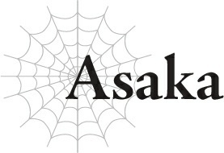
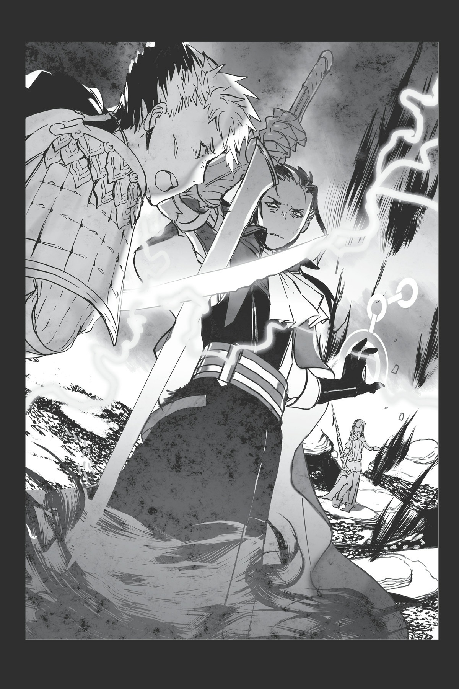

# Asaka

Đôi khi, những cơn ác mộng có thể bước ra đời thực.

...Tôi chắc rằng ý nghĩ kỳ lạ này chỉ là cách tôi cố gắng chạy trốn khỏi thực tại mà thôi.

Kunihiko và tôi là những người đặc biệt.

Bạn có thể nghĩ điều đó nghe giống như ảo tưởng về sự vĩ đại, nhưng thực tế đơn giản là chúng tôi mạnh hơn nhiều so với bất kỳ con người bình thường nào ở thế giới này.

Theo Kunihiko, việc có được các kỹ năng bá đạo khi bạn tái sinh ở một thế giới khác dường như là một chuyện thường tình.

Tôi không chắc có nên tin con bé hoàn toàn hay không, vì nó đang nói về truyện hư cấu, nhưng... chúng tôi thực sự có được những sức mạnh đặc biệt, nên tôi đoán mình không thể bảo là nó sai.

Tôi không cảm thấy thoải mái cho lắm khi chúng tôi dường như đang diễn lại các tình tiết trong truyện kể, hoặc thậm chí là bị ép buộc phải làm như vậy.

Nhưng những sức mạnh này thực sự đã giúp ích cho chúng tôi rất nhiều, nên cảm xúc của tôi về vấn đề này khá phức tạp.

Chúng tôi đã mạnh lên với tư cách là các mạo hiểm giả, gặt hái danh tiếng và phần thưởng suôn sẻ đến mức đôi khi nó thực sự mang lại cảm giác giống như một đoạn chuyển cảnh trong một câu chuyện vậy.

Ngay khi đạt đủ số năm hoạt động theo quy định, chúng tôi chắc chắn sẽ đạt được hạng S, đỉnh cao của bảng xếp hạng mạo hiểm giả.

Một khi đạt đến cấp độ đó, sẽ không quá lời khi nói rằng hai chúng tôi sẽ được coi là có địa vị cao hơn một số quý tộc nhỏ, tùy thuộc vào quốc gia.

Thực tế, nếu chúng tôi muốn định cư lâu dài ở một nơi nào đó, hai đứa có lẽ có thể có được một tước vị quý tộc nếu thực sự muốn và sống trong yên bình suốt phần đời còn lại.

Tôi chắc chắn vẫn sẽ có những lúc chúng tôi được yêu cầu giúp đỡ với tư cách là mạo hiểm giả, nhưng tôi không thể tưởng tượng được việc chúng tôi phải chiến đấu với thứ gì đó mạnh như phong long hay lôi long thường xuyên.

Quái vật cũng được chia thành các cấp độ khác nhau. Những con rồng mà tôi đang nghĩ đến thuộc hạng S, và thậm chí còn có những sinh vật huyền thoại mà con người không bao giờ có hy vọng cạnh tranh nổi.

Nhưng những con quái vật như vậy hiếm khi xuất hiện và gây rắc rối.

Nếu chúng nổi loạn thường xuyên như thế, nhân loại chắc đã tuyệt chủng từ lâu ở thế giới này rồi.

Vì vậy, chỉ cần chúng tôi không dại dột bén mảng đến bất kỳ khu vực nguy hiểm nào nơi những loại quái vật đó sinh sống, tôi tự tin rằng hai chúng tôi sẽ không bao giờ bị giết.

Đó chính là mức độ mạnh mẽ mà Kunihiko và tôi đã đạt được.

Mọi người thường bảo tôi là người rất ngăn nắp và đáng tin cậy.

Đôi khi cũng có những lời nhận xét rằng tôi điềm tĩnh và trưởng thành.

Nhưng thành thật mà nói, tôi không thể nói là mình đồng ý.

Sự thật là tôi là một kẻ lười biếng, sẵn sàng làm bất cứ điều gì để tránh rắc rối.

Tôi chỉ “ngăn nắp” và “đáng tin cậy” để tránh phải làm nhiều việc hơn mức tôi bắt buộc phải làm mà thôi.

Và sự điềm tĩnh và trưởng thành mà họ nói chẳng qua là vì tôi không thể bận tâm đến việc nổi giận trước mỗi chuyện nhỏ nhặt, nên tôi luôn chọn con đường ít lực cản nhất.

Lẽ tự nhiên, một công việc nguy hiểm và bất ổn như mạo hiểm giả là điều cuối cùng tôi mong muốn.

Lý do duy nhất tôi làm việc này chẳng qua là để đi cùng với Kunihiko mà thôi.

Tôi không thích tỏ ra ủy mị, nhưng ngay cả tôi cũng không khỏi xúc động khi được chuyển sinh và sau đó phải chứng kiến sự hủy diệt của toàn bộ gia tộc của chúng tôi.

Kunihiko chính là người đã giúp tôi vượt qua tất cả những chuyện đó.

Nếu không có cậu ấy, tôi chắc chắn mình sẽ không bao giờ có thể đứng vững trở lại.

Tôi muốn đền đáp cậu ấy vì điều đó. Hơn nữa, tôi muốn ở bên cạnh Kunihiko.

Đó là lý do tôi trở thành mạo hiểm giả vì cậu ấy, ngay cả khi đó không phải là điều tôi mong muốn.

Tôi sẽ chịu đựng bất cứ điều gì vì Kunihiko.

...Khá là sến sẩm, nếu tự tôi đánh giá.

Tôi chắc chắn không thể tưởng tượng nổi điều này ở kiếp trước của chúng tôi.

Hồi đó, Kunihiko và tôi chỉ là những người bạn thuở nhỏ không thể tiến thêm bước tiếp theo để hẹn hò.

Tôi luôn hình dung mình có thể kết hôn với cậu ấy vào một ngày nào đó, nhưng tôi chưa bao giờ nghĩ mình lại yêu cậu ấy sâu sắc đến thế.

Và vì Kunihiko luôn hành động tùy hứng, tôi đã tự giao cho mình nhiệm vụ lập ra một kế hoạch chi tiết cho hai đứa.

Khi chúng tôi trở thành mạo hiểm giả, tôi đã nhờ chú Gotou chỉ dạy cho chúng tôi để hai đứa không bỏ qua những điều cơ bản.

Tôi quản lý nhu yếu phẩm của chúng tôi, cẩn thận đánh giá các yêu cầu nhiệm vụ nhận được, nghiên cứu điểm đến của chúng tôi, và vân vân.

Tôi làm tất cả những điều đó là vì Kunihiko.

Và cũng vì lợi ích của Kunihiko mà tôi tham gia vào trận chiến này.

Tất nhiên, việc này là bắt buộc đối với các mạo hiểm giả hạng B trở lên, nhưng không phải là không có cách để tránh né bằng cách nào đó.

Nếu tôi thực sự nghĩ nó quá phiền phức, tôi đã có thể giật dây và tìm cách để không phải tham gia.

Nhưng lý do tôi không làm vậy là vì tôi nghi ngờ một người đàn ông cụ thể cũng sẽ tham gia vào trận chiến này.

Tên hắn là Merazophis.

Hắn chính là tên ma tộc đã quét sạch gia tộc của chúng tôi.

Và mục tiêu của Kunihiko là một ngày nào đó sẽ đánh bại Merazophis.

Cậu ấy có thể không nói ra miệng, nhưng tôi chắc chắn về điều đó.

Kunihiko đã mạnh lên nhiều hơn mức cần thiết ngay cả đối với một mạo hiểm giả, nhưng cậu ấy vẫn chưa bao giờ ngừng luyện tập, không nghi ngờ gì nữa là với hy vọng trả thù vào một ngày nào đó.

Để tự giải thoát bản thân khỏi nỗi nhục nhã của một kẻ quá bất lực không thể làm được gì và được tha mạng sau khi tất cả những người khác chúng tôi biết đều đã chết.

Tất nhiên, không có cách nào biết trước rằng chúng tôi sẽ thực sự chạm mặt hắn trong trận chiến này.

Nhưng tôi chắc chắn một ma tộc đủ mạnh để tự tay quét sạch cả một gia tộc phải có cấp bậc khá cao, nên việc hắn là một chỉ huy trong một cuộc giao tranh quy mô lớn thế này là điều không có gì lạ.

Dù sao thì, cơ hội gặp lại hắn bên ngoài một trận chiến lớn có lẽ còn mong manh hơn nhiều.

Vì vậy tôi nghĩ việc đánh cược vào cơ hội một phần triệu này là xứng đáng.

Tôi chắc chắn đang hối hận về quyết định đó lúc này.

Một lưỡi kiếm lướt qua mặt Kunihiko, chỉ trong gang tấc.

Nếu cậu ấy ngửa người ra sau chỉ chậm một giây, thanh kiếm có lẽ đã đâm xuyên qua đầu cậu ấy rồi.

Ý nghĩ đó khiến máu trong người tôi đông cứng lại.

Cơ thể tôi nóng lên vì chạy loanh quanh, nhưng bằng cách nào đó tôi vẫn cảm thấy ớn lạnh từ bên trong.

Kunihiko và Merazophis đang lao vào một cuộc đấu kiếm dữ dội.

Với mỗi cú vung kiếm của Merazophis, tim tôi gần như ngừng đập vì sợ rằng Kunihiko có thể bị chém gục.

Hơi thở của tôi dồn dập và nóng hổi, nhưng đồng thời tôi lại lạnh toát.

Tôi đang sợ hãi.

Tôi chưa bao giờ cảm thấy sợ hãi thế này, ngay cả khi chúng tôi chiến đấu với lôi long và phong long.

Những trận chiến đó cũng tuyệt vọng như trận này, nhưng chúng hoàn toàn khác biệt ở một điểm quan trọng: ý chí bất khuất của đối thủ của chúng tôi.

Rồng suy cho cùng vẫn chỉ là quái vật hoang dã.

Chúng hành động theo bản năng sinh tồn, và tuy chúng quyết tâm không để bị giết, điều đó rốt cuộc chỉ là một phần trong bản tính tự nhiên của chúng.

Nhưng Merazophis thì khác.

*Ta sẽ không thua.*

*Ta từ chối để các ngươi giết ta, bất kể thế nào.*

Quyết tâm của hắn mãnh liệt đến mức tôi gần như có thể nghe thấy những ý nghĩ trú ngụ bên trong sự kiên định thầm lặng của hắn.

Ý chí mạnh mẽ trong đôi mắt hắn, thứ mà tôi không hề thấy một lần nào ở lôi long hay phong long, mạnh đến mức tôi không thể không lo lắng cho tính mạng của Kunihiko.

Tôi không biết Merazophis là loại người thế nào, nhưng tôi đã học được một điều từ trận chiến này rồi.

Merazophis rất mạnh.

Quá mạnh.

Và không chỉ là các chỉ số của hắn, vốn chắc chắn là rất cao. Nhìn từ phong cách chiến đấu của hắn, rõ ràng hắn đã trải qua quá trình huấn luyện cực kỳ khắc nghiệt.

Kiếm thuật hoàn hảo như sách giáo khoa của hắn là minh chứng cho việc hắn đã lặp đi lặp lại từng động tác này vô số lần.

Chú Gotou cũng bắt Kunihiko và tôi luyện tập các đường vung kiếm.

Nhưng tôi chắc chắn người đàn ông này đã lặp lại những động tác đó nhiều hơn cả hai chúng tôi cộng lại.

Nhờ có những đặc quyền chuyển sinh của mình, Kunihiko và tôi sở hữu các chỉ số cao hơn những người khác, nên đôi khi nó thực sự có thể gây thất vọng khi các kỹ thuật của chúng tôi không thể bắt kịp các chỉ số cao đó.

Nhưng đối với Merazophis, điều ngược lại mới đúng.

Hắn thuộc kiểu người có chỉ số tăng lên để bắt kịp với các kỹ thuật được mài giũa vô cùng điêu luyện của mình.

Sự nắm bắt các nguyên bản chiến đấu của hắn là không thể so sánh.

Tôi đã đảm bảo rằng chúng tôi phải nghiên cứu các kỹ năng cơ bản để một ngày nào đó hai đứa không bị quá phụ thuộc vào chỉ số cao của mình, và chú Gotou đã huấn luyện chúng tôi theo hướng đó.

Nhưng Merazophis ở một đẳng cấp hoàn toàn khác.

Người ta nói ma tộc sống lâu hơn con người, nhưng tôi thậm chí không thể hình dung nổi phải mất bao nhiêu năm ròng rã huấn luyện mới có thể đạt được cấp độ thể hiện này.

Lôi long và phong long nguy hiểm vì chỉ số cao, đòn tấn công hơi thở mạnh mẽ, ma pháp diện rộng, v.v., nhưng Merazophis là một sinh vật hoàn toàn khác biệt.

Những con rồng đó có thể sở hữu chỉ số cao hơn, nhưng Merazophis chắc chắn nguy hiểm hơn.

Chúng tôi vẫn chưa thể tung ra được một đòn tấn công nào trúng hắn.

Tôi bắt đầu tập trung ma pháp.

Vì tôi đã sử dụng sức mạnh vượt quá giới hạn của mình để bắn ra các phép thuật với tốc độ tối đa, đầu tôi đã bắt đầu đau nhức, nhưng tôi lờ nó đi và niệm phép tiếp theo.

Một phát bắn bằng khí nén lao thẳng về phía Merazophis.

Phép thuật này thậm chí đã có thể gây thương tích cho lôi long — nhưng Merazophis đã cản phá nó bằng một phép Hắc ma pháp triệt tiêu hoàn toàn.

Ngay khi hai phép thuật va chạm vào nhau, Kunihiko chém một nhát theo chiều ngang vào thân người Merazophis.

Nhưng Merazophis cũng đỡ được đòn đó mà không hề tốn sức.

Cả hai chúng tôi đã tấn công dữ dội trong suốt vài phút qua — Kunihiko với lưỡi kiếm và sấm sét của thanh ma kiếm còn tôi với ma pháp.

Nhưng Merazophis đã khéo léo đỡ được cả hai đòn tấn công của chúng tôi.

Hắn đỡ lưỡi kiếm của Kunihiko bằng kiếm của mình hoặc né tránh nó, rồi sử dụng Hắc ma pháp để triệt tiêu sấm sét hoặc phép thuật gió của tôi.

Cái đầu đau như búa bổ của tôi đã phải trả giá cho việc niệm ma pháp không ngừng nghỉ, nhưng Merazophis vẫn theo kịp với một vẻ mặt hoàn toàn bình tĩnh.

Tất cả diễn ra trong khi hắn vẫn đang đấu kiếm với Kunihiko.

Hắn đang chiến đấu với cả hai chúng tôi cùng một lúc và làm tốt hơn cả hai đứa cộng lại.

Hắn trông giống như một con người bình thường, nhưng rõ ràng hắn là một cơn ác mộng sống, mạnh mẽ hơn bất kỳ con rồng nào.

Đúng vậy, chúng tôi đã đối mặt với cái chết khi chiến đấu với lôi long và phong long.

Nhưng thất bại của chúng tôi chưa bao giờ có vẻ cận kề như lúc này.

Nếu các đòn tấn công của chúng tôi gây ra sát thương cho hắn, thì đó sẽ là vấn đề ai là người cạn kiệt sức lực trước.

Nhưng ngay lúc này, chúng tôi hoàn toàn không gây ra được bất kỳ sát thương nào cả.

Hơi thở của tôi dồn dập hơn.

Tôi phải liên tục thay đổi vị trí để bắt kịp với những chuyển động liên tục, bão táp của Kunihiko và Merazophis, nên tôi đã chạy quanh như điên.

Với mỗi phép thuật tôi niệm, tôi ngay lập tức phải bắt đầu chuẩn bị phép tiếp theo.

Đầu tôi đau buốt, và chân tôi nhức mỏi.

Tôi gần như không thể thở nổi.

Tôi đang chiến đấu chỉ bằng ý chí thuần túy, nhưng cơ thể tôi có thể đổ gục bất cứ lúc nào.

Kunihiko chắc chắn cũng thế.

Tôi có thể nhận ra cậu ấy cũng đang thở dốc, và mồ hôi vã ra như tắm.

Trong khi Merazophis trông vẫn điềm tĩnh như mọi khi.

Có vẻ như hắn hoàn toàn không bị kiệt sức chút nào.

Ngay cả khi đó phần nào chỉ là giả vờ, thực tế vẫn là hắn rõ ràng không hề mệt mỏi như Kunihiko và tôi.

Và ngay khi một trong hai chúng tôi cạn kiệt sức lực, sự cân bằng vốn đã mong manh này sẽ hoàn toàn sụp đổ.

Trên hết...

“Á?!”

Một phép Hắc ma pháp sượt qua mặt tôi.

Tất nhiên là do Merazophis bắn ra.

Và cùng lúc đó, hắn chém kiếm xuống chỗ Kunihiko.

“Hự!”

Kunihiko đỡ đòn bằng lưỡi kiếm của mình, nhưng sức mạnh của Merazophis đã bắt đầu áp đảo cậu ấy.

Hoảng loạn, tôi bắn một phép ma pháp Gió để chia tách họ ra.

Merazophis nhảy lùi lại một cách dễ dàng, vẫn không hề hấn gì.

Cả hai chúng tôi đã đè nặng lên hắn bằng hết đòn tấn công này đến đòn tấn công khác, nhưng hắn không chỉ tập trung vào phòng thủ. Bằng cách nào đó, hắn vừa chặn đứng mọi đòn tấn công của chúng tôi vừa tìm được thời gian để phản công lại.

Nếu một trong hai đứa lơ là cảnh giác dù chỉ một giây, chúng tôi có thể bị giết.

Vậy thì chúng tôi sẽ gục ngã vì kiệt sức trước, hay các đòn tấn công của hắn sẽ hạ gục chúng tôi trước đây?

Khi nhìn Merazophis hoàn toàn không hề hấn gì bất chấp các đòn tấn công tuyệt vọng của chúng tôi, tôi không thể thấy bất kỳ cách nào giúp chúng tôi có thể giành chiến thắng.

Tất cả những gì tôi thấy là thất bại tất yếu của hai đứa.

Tôi nên làm gì đây?

Chúng tôi vẫn đang cầm cự được vào lúc này.

Nhưng nếu tình trạng này cứ tiếp tục kéo dài, chúng tôi sẽ sớm thất bại mà thôi.

Và dù vậy, nếu chúng tôi để cơn ác mộng này tự do hoành hành, chính nhân loại sẽ mất đi mọi hy vọng.

Merazophis đơn giản là quá mạnh.

Hắn có thể dễ dàng cân cả một đội quân và giành chiến thắng.

Tôi điên cuồng tính toán trong đầu.

...Mạng sống của Kunihiko và tôi so với toàn thể nhân loại sao? Nó thậm chí còn chẳng đáng để so sánh.

Thật lòng mà nói, tôi không thực sự quan tâm đến số phận của nhân loại hay bất cứ điều gì tương tự.

Và tôi không nghĩ có bất kỳ mục đích thực tế nào trong việc mạo hiểm mạng sống ở đây chỉ để làm chậm bước chân của Merazophis trong vài khoảnh khắc.

Điều đó nghĩa là điều tốt nhất nên làm là bỏ chạy.

Câu hỏi là liệu Merazophis có thực sự để chúng tôi trốn thoát dễ dàng như vậy hay không.

Thật lòng thì tôi nghi ngờ chuyện đó.

Trừ khi chúng tôi có thể câu giờ được kha khá, hắn sẽ giết chúng tôi ngay khi chúng tôi quay lưng bỏ chạy.

Nhưng làm thế nào chúng tôi giữ chân hắn đủ lâu để trốn thoát đây?

Chúng tôi thậm chí có thể làm hắn phân tâm chút nào không khi mà hai đứa hoàn toàn không thể tung ra được một đòn tấn công nào trúng hắn?

Không.

Không có gì chúng tôi có thể làm được cả.

Tôi đã chạm đến giới hạn của mình rồi.

Giá như chúng tôi có một chút sự giúp đỡ...

Ngay lúc đó, Merazophis đột ngột gập người trên của mình lại.

Một khoảnh khắc sau, một luồng ánh sáng bắn qua khoảng không nơi thân người hắn vừa ở đó chỉ một tích tắc trước.

Đó là cái gì thế?

Ma pháp sao?

Tôi liếc nhìn về hướng nó bắn tới, nhưng tôi không thấy bất kỳ người niệm phép nào trong tầm mắt.

Nó bay tới từ hướng pháo đài — nhưng không thể nào, đúng chứ?

Chúng tôi đang ở một khoảng cách khá xa so với nơi đó.

Nếu nó thực sự bay tới từ pháo đài, nó chắc chắn phải được niệm bởi một ma pháp sư cực kỳ mạnh mẽ.

Và không chỉ có thế, một phát bắn khác lập tức nối tiếp ngay sau phát thứ nhất.

Nhắm thẳng vào Merazophis, người đang di chuyển nhanh chóng để né tránh các đòn tấn công.

Làm thế nào ai đó có thể bắn tỉa Merazophis từ một khoảng cách cực kỳ xa như vậy mà không bắn trúng Kunihiko chứ?

Tôi biết mình chắc chắn không làm được.

Đây chính xác là sự giúp đỡ mà chúng tôi cần.

Thế nhưng!

Merazophis vẫn đang lách qua các đòn tấn công của Kunihiko, ma pháp Gió của tôi, và cả tay bắn tỉa ma pháp cùng một lúc.

Hắn rất mạnh.

Quá mạnh!

Sự bổ sung của tay bắn tỉa đồng nghĩa với việc Merazophis không thể phản công nhiều như trước, điều này cho phép chúng tôi dồn dập tấn công.

Nhưng chúng tôi vẫn không thể đột phá qua hàng phòng thủ của hắn.

Thực tế, tôi có cảm giác rằng nếu chúng tôi dừng lại dù chỉ một giây, tất cả sẽ kết thúc.

Nó giống như việc chúng tôi đang khiêu vũ trên lớp băng mỏng nhất vậy.

Ngay cả khi có thêm sự trợ giúp, nó vẫn là chưa đủ.

“Hự?!”

Đột nhiên, một phép ma pháp Gió đánh trúng ngay sau lưng Merazophis.

Nhưng đó không phải là do tôi bắn ra.

Đó là một ai khác — một đứa trẻ mặc áo choàng sao?

Đứa trẻ đã đánh trúng Merazophis bằng ma pháp Gió từ phía sau và đã sẵn sàng chuẩn bị phép thuật tiếp theo.

Tôi đoán họ đứng về phía chúng tôi.

Trong trường hợp đó, tôi sẽ chấp nhận sự giúp đỡ của họ, dù là trẻ con hay không.

Hơn nữa, mặc dù họ trông nhỏ bé như một đứa trẻ, ma pháp đó nhanh và mạnh một cách đáng kể.

Nó dường như không gây ra nhiều sát thương cho Merazophis, nhưng thực tế là nó đã có thể đánh trúng hắn.

Chưa một đòn tấn công nào của chúng tôi có thể chạm tới hắn trong suốt thời gian qua.

Điều đó nghĩa là Merazophis đã không thể né tránh đòn tấn công của người này.

Chỉ với một trận chiến bốn chọi một, cuối cùng chúng tôi mới có hy vọng có thể là đối thủ của hắn.

Vì đòn đánh không gây ra nhiều sát thương, cơ hội chiến thắng của chúng tôi vẫn rất mong manh, nhưng nó vẫn tốt hơn nhiều so với tình cảnh trước đó.

Đây là cơ hội duy nhất của chúng tôi.

Ngay khi quyết định điều đó, tôi dừng việc bắn ma pháp liên tục trong một khoảnh khắc và tập trung năng lượng để dệt nên một phép thuật lớn hơn.

Cảm nhận được điều đó, Merazophis thay đổi mục tiêu để nhắm vào tôi với phép thuật tiếp theo của hắn.

“Hự!”

Kunihiko bước tới với một nhát chém nhanh để ngăn hắn lại.

Merazophis đỡ đòn tấn công của cậu ấy bằng kiếm của mình.

Cùng lúc đó, tay bắn tỉa ma pháp và đứa trẻ tấn công Merazophis bằng nhiều ma pháp hơn.

“...”

Chỉ trong một khoảnh khắc, Merazophis nhăn mặt.

Nếu hắn chuyển hướng phép thuật vốn định dành cho tôi, hắn có thể triệt tiêu hai đòn tấn công ma pháp kia.

Hắn đã thực hiện được điều đó suốt thời gian qua, nên tôi không thấy lý do tại sao bây giờ lại khác biệt.

Nhưng Merazophis không làm vậy.

Hắn để đòn tấn công của tay bắn tỉa và ma pháp Gió đánh trúng trực diện mình, và thay vì phản công bằng Hắc ma pháp, hắn lại sử dụng nó để tấn công tôi.

“?!”

Đòn tấn công của tay bắn tỉa đánh trúng ngực hắn, tiếp theo là ma pháp Gió đánh trúng sau đầu hắn.

Và một ngọn thương bóng tối đâm xuyên qua dạ dày tôi.

Nhưng!

Tôi đã hoàn thành cấu trúc ma pháp của mình!

Chịu đựng cơn đau, tôi kích hoạt phép thuật.

Ma pháp Cuồng phong: [Bão Rồng]!

Phép thuật lập tức nhấn chìm Merazophis.

“Hự!”

Ngay cả Merazophis cũng không thể né tránh [Bão Rồng], một phép thuật vốn nhằm mục đích gây ra sự hủy diệt trên quy mô khổng lồ.

Và đó là siêu đại ma pháp, thứ vốn bình thường không thể được niệm bởi một người duy nhất.

Siêu đại ma pháp vượt trội hơn cả đại ma pháp về mặt sức mạnh và đủ mạnh để hạ gục một con rồng.

Tôi biết, vì đây chính là phép thuật chúng tôi đã dùng để đánh bại lôi long.

Chắc chắn ngay cả Merazophis cũng không thể sống sót...

“Á!”

Một tiếng hét quyết tâm.

Ánh chớp của một lưỡi kiếm.

Chỉ như thế, phép thuật mạnh nhất của tôi tan biến vào không trung.

Chuyện này không thể xảy ra được... Đúng không chứ...?

Tất nhiên hắn không phải không hề hấn gì, nhưng Merazophis vẫn đứng vững trên hai chân.

Mặc dù hắn đã bị bắn trúng ngực và trúng ma pháp sau đầu ngay trước khi [Bão Rồng] ập đến, nhưng cứ như thể hắn hầu như không phải chịu sát thương từ những đòn đó vậy.

Chỉ số của hắn phải cao đến mức nào mới có thể làm được điều đó chứ...?

Chúng tôi tiêu đời rồi.

“AAAAAH!”

Ngay khi ý nghĩ đó hiện lên, Kunihiko chém xuống chỗ Merazophis.

Lập tức, Merazophis chuẩn bị đỡ đòn.

Nhưng một đòn tấn công từ tay bắn tỉa đâm xuyên qua tay hắn, và ma pháp Gió chặn đứng chuyển động của hắn.

Sau đó nhát chém bằng toàn bộ sức mạnh của Kunihiko chém sâu vào vai Merazophis.

“Hự!”

Nhưng trong khi bình thường nhát chém chéo này đáng lẽ phải chém đứt đôi người hắn, nó chỉ lún sâu vào vai Merazophis rồi dừng lại.

Hàng phòng thủ của hắn quá mạnh nhờ vào các chỉ số thuần túy.

Đòn tấn công của Kunihiko đã thất bại trong việc gây ra đủ sát thương.

Merazophis vung kiếm và đánh văng Kunihiko ra xa.

Sau đó hắn đặt một tay lên vai và hét lớn.

“Rút quân!”

Nói xong, hắn quay lưng và chạy trốn khỏi chúng tôi.

Đó là một hiệu lệnh rút lui rõ ràng, gần như là quá kịch tính.

Đến mức nó thực sự có vẻ như là giả vờ.

Kunihiko đứng nhìn theo hắn trong im lặng một lúc.

Sau đó cậu ấy tỉnh táo lại và chạy đến chỗ tôi.

“Asaka!”

“Ừm. Tớ không sao.”

“Thế này mà cậu bảo không sao hả?!”

Ngay lúc này, tôi đang nằm ngửa trên mặt đất.

Hắc ma pháp của Merazophis đã đánh trúng bụng tôi.

Tôi đoán nó đã thổi bay một lỗ lớn xuyên qua người tôi.

Kunihiko vội vã rút ra một lọ thuốc hồi phục và đổ lên vết thương, nơi nó ngấm vào một cách đau rát.

“Đừng chết! Cậu không được phép chết bỏ lại tớ đâu đấy!”

“Đừng lo. Tớ không nghĩ mình sẽ chết đâu.”

Tôi không phải đang cố tỏ ra dũng cảm — tôi thực sự cảm thấy mình có lẽ sẽ sống sót.

Các chỉ số thực sự là một thứ kinh ngạc.

Bình thường, với một cái lỗ như thế này ở bụng, bạn chắc chắn sẽ chết.

Nhưng nhờ kỹ năng [Tự động Hồi phục HP] và Ma pháp Trị liệu tôi liên tục tự niệm cho mình, tôi nghĩ mình sẽ qua khỏi.

“Hắn lại để chúng ta sống một lần nữa.”

“Tớ biết.”

Một khi nhận ra tôi thực sự không nằm trên bờ vực cái chết, Kunihiko lẩm bẩm nhỏ nhẹ khi tiếp tục điều trị cho tôi.

Nếu trận chiến đó tiếp tục, chúng tôi đã thua cuộc.

Chúng tôi đã thành công gây thương tích cho Merazophis, nhưng chỉ có thế mà thôi.

Mỗi người chúng tôi đã tấn công hắn với tất cả những gì mình có.

Và ngay cả khi đó, điều nhiều nhất chúng tôi có thể làm được chỉ là một vết xước.

Ngay cả khi hai đứa chiến đấu với ý chí hy sinh bản thân trong quá trình đó, tôi vẫn không nghĩ chúng tôi có thể giành chiến thắng.

“Tớ tệ thật đấy. Tớ vẫn phải mạnh hơn nữa.”

Cậu không cần phải mạnh đến mức đó đâu, thực sự đấy.

Đó là điều tôi muốn nói.

Tôi không bao giờ muốn trải nghiệm sự nguy hiểm như thế này một lần nữa.

Không có gì đảm bảo rằng hắn sẽ lại tha mạng cho chúng tôi vào lần tới.

Dù sao thì người ta vẫn bảo quá tam ba bận mà.

Đây đã là lần thứ hai Merazophis quyết định tha mạng cho chúng tôi.

Khi hắn quét sạch gia tộc đã sinh ra và nuôi nấng chúng tôi, hắn đã để chúng tôi đi tự do chỉ vì một ý thích nhất thời.

Và hôm nay, chuyện đó lại xảy ra.

Mặc dù tôi không biết lý do của hắn lần này là gì.

“Các em có sao không?!”

Trong khi tôi đang mải suy nghĩ, đứa trẻ mặc áo choàng chạy đến.

Em ấy thực sự đã giúp chúng tôi vượt qua trận chiến này. Tôi nên cảm ơn em ấy.

“Cảm ơn em rất nhiều. Sự hỗ trợ của em thực sự rất đáng trân quý.”

“Có cảm ơn thì để sau đi! Trước tiên chúng ta phải chữa trị cho em đã!”

“Không sao đâu — chị có thể đứng được.”

Vết thương của tôi hầu như đã khép lại.

Nó chắc chắn vẫn còn đau, nên tôi không thể ép bản thân quá nhiều cho đến khi nó hoàn toàn lành lặn, nhưng tôi ít nhất có thể tự đứng dậy và đi lại được.

Chúng tôi vẫn đang ở trên chiến trường, nghĩa là tôi không thể cứ nằm ườn ra đó, nên tôi bắt đầu ngồi dậy.

Tôi thoáng thấy khuôn mặt của bóng người đội mũ trùm đầu: một cô bé, đang trợn tròn mắt ngạc nhiên trước tốc độ hồi phục của tôi.

Tôi không thể nhìn rõ trong trận chiến vì chiếc mũ trùm đầu kéo thấp che khuất mắt em ấy, nhưng em ấy là một mỹ nhân thực sự.

Và đánh giá qua ngoại hình chung của em ấy, bây giờ tôi đã hiểu làm thế nào em ấy có thể chiến đấu tốt đến vậy.

“À, ra em là một elf.”

Đôi tai nhọn của cô bé đã tiết lộ điều đó.

Tộc elf sống thậm chí còn lâu hơn ma tộc, và họ được cho là đặc biệt có năng khiếu về ma pháp.

Kết quả của tuổi thọ dài của họ là họ già đi khá chậm, nên cô bé này có lẽ lớn tuổi hơn nhiều so với vẻ ngoài của mình.

Cô bé này và một người khác.

Tôi nhìn về phía pháo đài.

Tôi không biết người đó là ai hay trông như thế nào, nhưng đã có một ma pháp sư hỗ trợ chúng tôi bằng cách bắn tỉa Merazophis trong suốt trận chiến.

Nếu không có sự giúp đỡ của hai người này, chúng tôi thậm chí đã không thể bắt đầu chiến đấu với Merazophis.

Sự kiệt sức đang ngày càng khó có thể phớt lờ, nhưng không có thời gian để lãng phí. Tôi gạt bỏ mong muốn chỉ muốn nằm xuống và ngủ.

Kunihiko đưa tay ra, và tôi để cậu ấy kéo mình đứng dậy.

“Trận chiến trông thế nào rồi?”

“Có vẻ như chúng đang rút lui.”

Nhìn xung quanh, tôi chỉ có thể nhìn thấy lờ mờ quân đội ma tộc đang rút lui.

Và tôi cũng nhìn thấy các mạo hiểm giả đang chiến đấu với chúng, với chú Gotou ở giữa họ.

Có lẽ Merazophis nhận thấy trận chiến của họ đang diễn ra không thuận lợi cho ma tộc nên quyết định rút lui chiến thuật.

Nếu vậy, chúng tôi nợ chú Gotou và những người khác rất nhiều.

“Tớ đoán chúng ta nên quay lại thôi.”

“Ừ.”

Cả hai chúng tôi cũng đều quá kiệt sức để chiến đấu thêm nữa rồi.

Nếu chúng tôi cố gắng đuổi theo lũ ma tộc đang rút lui, Merazophis có thể thực sự sẽ giết chúng tôi một lần và mãi mãi.

Không, chúng tôi nên dừng lại khi còn có thể.

“Em có đi cùng không?”

“Có chứ.”

Cô bé elf bỏ mũ trùm đầu ra và gật đầu.

“Nhưng trước tiên, cô nên tự giới thiệu bản thân với hai em... Tagawa và Kushitani.”

Trong một khoảnh khắc, tôi quá mệt mỏi đến mức không nhận thấy có gì kỳ lạ khi em ấy biết tên của chúng tôi.

Nhưng rồi tôi nhận ra: Kunihiko và tôi chưa bao giờ sử dụng họ cũ của mình ở thế giới này.

Vậy làm thế nào cô bé này biết được chúng?

“Tên cô là Filimõs Harrifenas. Nhưng trong trường hợp của hai em, có lẽ cô nên đưa ra tên cũ của mình thì hơn: Ở kiếp trước, cô là Okazaki Kanami.”

Mắt Kunihiko trợn tròn kinh ngạc, và mắt tôi cũng vậy.

Bởi vì đó chính là tên của giáo viên chủ nhiệm cũ của chúng tôi.

---

[◀ Chương trước: Kunihiko](06_kunihiko.md) | [Chương tiếp theo: Aurel ▶](08_aurel.md)
