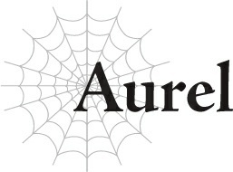

# Aurel

Chào mọi người!

Tôi là Aurel, cô nàng [BÍP] tuổi được yêu thích nhất đây!

Ờm, tuổi tác của tôi là một bíii mật đấy nhé.

Tôi là con gái của một gia đình quý tộc cơ đấy, bạn biết không!

Dù cho chúng tôi nghèo rớt mồng tơi.

Nhưng là một tiểu thư quý tộc dễ thương vẫn chưa kết hôn ở độ tuổi này, tôi đang bắt đầu bị tụt lại phía sau rồi.

Theo kế hoạch cuộc đời của tôi, đáng lẽ giờ này tôi phải lấy chồng và đẻ được một hai đứa nhóc rồi chứ, thế quái nào mọi chuyện lại ra nông nỗi này?

Chuyện là thế này, tôi là con gái thứ hai của một gia đình quý tộc nghèo ở vùng khỉ ho cò gáy của đế quốc.

Đúng vậy. Tôi đến từ vùng hẻo lánh, tôi nghèo, và trên hết, tôi thậm chí còn không phải là con cả.

Tại thời điểm đó, cái danh quý tộc thực sự chẳng có nghĩa lý gì cả.

Nếu tôi là con gái cả, tôi có thể vẫn được gả vào một gia tộc quý tộc thân thiết nào đó, nhưng vì tôi là con thứ, tôi không dám ôm hy vọng đó làm gì.

Hơn nữa, chẳng có lợi lộc gì khi kết thân với một gia đình quý tộc nghèo như chúng tôi cả, nên tôi nghi ngờ ngay từ đầu đã chẳng có ai thèm xếp hàng để kết hôn với chúng tôi rồi.

Ồ, nhân tiện thì chị gái tôi đã may mắn được gả cho một người ở nước láng giềng.

Và anh trai tôi sẽ tiếp quản vị trí gia trưởng, nên tôi thực sự phải tìm nơi nào đó để gả đi.

Nhưng vì chúng tôi nghèo xơ xác, nên việc tìm kiếm một đối tượng thực sự là một nỗi đau đầu kinh khủng.

Chúng tôi thực sự không có tiền bạc hay bất cứ thứ gì để làm của hồi môn cả, nên là...

Đó là lý do tại sao tôi được gửi đi làm người giúp việc sống tại nhà người ta để có thể kiếm thêm chút tiền lẻ và đồng thời tạo dựng một vài mối quan hệ.

Việc con gái thứ hai hoặc thứ ba của một gia đình quý tộc được gửi đi làm người hầu sống tại một gia đình có địa vị cao hơn không phải là điều quá bất thường.

Bạn được trả lương, và nếu may mắn, bạn thậm chí có thể gặp được một ai đó đặc biệt.

Tùy thuộc vào việc bạn làm việc tốt đến mức nào, có cơ hội bạn có thể được ở lại với gia đình đó vĩnh viễn.

Ngoại trừ việc, vì tôi đến từ vùng khỉ ho cò gáy và lại nói năng thô lỗ như một tên lính, tôi ít nhiều đã bị đá ra ngoài trước khi kịp vượt qua cuộc phỏng vấn khốn kiếp.

Tôi đoán mình chỉ là không có tố chất để cư xử như một quý cô thực thụ, nên tôi chẳng bao giờ được chọn cho mấy việc đó cả.

Nhưng trong khi tôi thực tế đang thực hiện một chuyến du ngoạn thế giới để trượt tất cả các cuộc phỏng vấn, tôi đã may mắn gặp được ngài Ronandt với tư cách là chủ nhân tiềm năng.

Ronandt là ma pháp sư cung đình mạnh nhất trong toàn bộ đế quốc, tầng lớp tinh hoa nhất của tinh hoa.

Về cơ bản, ông ấy là một huyền thoại sống.

Nhưng tôi đã nghĩ, đối với một người quan trọng như vậy mà lại đi thuê một đứa con gái quê mùa từ vùng hẻo lánh như tôi, chắc chắn phải có uẩn khúc gì đó, đúng không?

Ồ, có uẩn khúc thật đấy.

Nếu tôi phải tóm gọn lão già đó trong một từ, tôi có thể chọn: kẻ biến thái, tên ngốc cuồng ma pháp, gã dị hợm, tên vũ phu, vân vân và mây mây.

Úp, thế là hơi nhiều từ rồi nhỉ?

Về cơ bản, lão già đó là một kẻ mất trí.

Nhưng nếu tôi từ bỏ công việc này, tôi sẽ không bao giờ tìm được việc làm nữa.

Vì vậy, tôi đã dũng cảm nuốt nước mắt vào trong và phục vụ lão già quái đản đó.

Nhìn lại thì đây chính là nơi cuộc đời tôi bắt đầu trở nên vô cùng kỳ quặc.

Làm việc cho lão già, tiết kiệm tiền, và kết hôn với một người giàu có đủ để ít nhất đảm bảo tôi không bị đói, ngay cả khi họ là thường dân.

Đó là mục tiêu cao nhất của tôi vào thời điểm đó.

Điều tốt nhất tôi có thể hy vọng, với cái miệng thô lỗ của mình.

Đáng lẽ tôi nên từ bỏ ý định kết hôn với một gia đình quý tộc ngay từ đầu.

Gia đình nghèo kiết xác của tôi hầu như chẳng khá khẩm hơn thường dân là bao, nên tôi cũng không thực sự bận tâm đến việc rời khỏi giới quý tộc.

Chỉ cần tôi có thể là một thường dân với một cuộc sống tương đối tử tế, thế là đủ rồi.

Ấy vậy mà, những năm tháng thanh xuân tươi đẹp nhất để kết hôn của tôi đã trôi qua gần hết, và tôi vẫn độc thân bền vững.

Nhưng có lẽ việc chưa kết hôn là vấn đề nhỏ nhất của tôi lúc này.

Tại sao tôi lại phải ở trên một bãi chiến trường chết tiệt này chứ?

“Chết tiệt thật, đúng là một mớ hỗn độn.”

Tôi cuối cùng cũng phải lẩm bẩm thành tiếng dù đã cố gắng kiềm chế.

Làm thế nào mà con gái thứ hai của một gia đình quý tộc nghèo từ vùng khỉ ho cò gáy lại có thể trở thành một ma pháp sư cung đình được chứ?

Nếu bạn thấy bối rối, thì tôi cũng vậy thôi.

Về cơ bản, tất cả là tại lão già chết tiệt đó đã nói “Ngươi có tài năng ma pháp!” và ép tôi phải làm đệ tử của ông ấy.

Chủ yếu là vì vị Anh hùng, ngài Julius, người đã trở thành đệ tử đầu tiên của lão già trước đó, đã suýt không sống sót nổi qua quá trình huấn luyện điên rồ của ông ấy.

Bạn thậm chí không thể gọi đó là huấn luyện được. Đó hoàn toàn là tra tấn!

Ngài ấy theo đúng nghĩa đen trông như sắp chết đến nơi, nên tôi đã sử dụng Trị liệu Ma pháp cho ngài ấy ngay tại chỗ, và đó là lúc mọi chuyện trở nên tồi tệ.

Lão già đã nhìn thấy tôi làm điều đó và cho rằng tôi giỏi ma pháp hay gì đó...

Nhưng lý do duy nhất tôi biết cách làm điều đó ngay từ đầu là vì khi chúng tôi đi xe ngựa một thời gian trước, lão già đã sử dụng Trị liệu Ma pháp để chữa lành cái mông đau nhức của tôi, nên tôi đã nghĩ: “Ồ, cái đó tiện lợi thật đấy; mình nên học nó” và lén lút luyện tập.

Không có lý do thực sự nào để tôi phải giấu nó, nhưng nhìn lại, tôi nghĩ lúc đó tôi đã thực sự đưa ra quyết định đúng đắn.

Bởi vì ngay khoảnh khắc lão già phát hiện ra tôi, cuộc đời tôi đã biến thành địa ngục trần gian nhờ vào sự tra tấn mà ông ấy gọi là “huấn luyện.”

Tôi đã cố gắng trốn thoát khỏi ông ấy vô số lần kể từ đó, nhưng lão già đó là một bậc thầy Ma pháp Không gian.

Bất kể tôi chạy trốn đi đâu, ông ấy luôn truy đuổi tôi bằng dịch chuyển tức thời!

Vì vậy tôi nghĩ lựa chọn duy nhất của mình là cũng phải học Dịch chuyển luôn!

Nhưng việc học Ma pháp Không gian chỉ càng làm cho mọi chuyện trở nên tồi tệ hơn.

Chính phủ bắt đầu chú ý đến tôi, và trước khi kịp nhận ra, tôi đã bị đẩy vào vị trí ma pháp sư cung đình và thậm chí còn có một tước vị quý tộc sang chảnh.

Tất cả những gì tôi muốn chỉ là một mái nhà che đầu và thức ăn đầy bụng. Thay vào đó, tôi lại thấy mình đang thăng tiến trong xã hội...

Tất cả chỉ vì Ma pháp Không gian là cực kỳ hiếm.

Nhưng vì bây giờ tôi đã có tước vị quý tộc cá nhân, có lẽ ai đó sẽ thực sự muốn kết hôn với tôi!

Ngoại trừ việc tôi đã quá bận rộn với công việc đến mức thậm chí không có thời gian để lo lắng về chuyện đó.

Các ma pháp sư cung đình có cả đống việc lặt vặt phải làm đấy nhé!

Và ngay cả khi rảnh rỗi, tôi lại phải chỉ dạy cho các ma pháp sư cung đình khác cùng đệ tử của họ và những thứ tương tự, vì lợi ích của thế hệ tương lai hay mấy thứ rác rưởi gì đó?

Một ngày nọ, tôi kiểu: Tuyệt vời, hôm nay mình không có việc gì làm cả!

Và rồi ngày hôm sau, tôi đột nhiên ngập đầu trong đống công việc phải làm.

Tôi biết tìm đâu ra thời gian để gặp gỡ đối tượng kết hôn bây giờ chứ?!

Thành thật mà nói, trận chiến này đã vượt quá giới hạn rồi.

Tại sao một thiếu nữ ngọt ngào như tôi lại phải đưa ra mệnh lệnh trên chiến trường chứ, hả?

“Ái chà. Tôi chỉ muốn nghỉ hưu thôi, chết tiệt thật.”

Ngay lúc này, tôi đang chỉ đạo việc khôi phục một bức tường thành pháo đài đã bị phá hủy.

May mắn thay, thiệt hại tương đối nhẹ, nên các ma pháp sư cung đình khác và tôi có thể đưa bức tường trở lại hình dáng tương đối ổn thỏa, ngay cả khi chúng tôi không thể sửa chữa nó hoàn toàn.

“Trưởng lão, ngài có thể giúp chúng tôi thay vì phàn nàn được không ạ?”

Một trong các đồng nghiệp của tôi bắt đầu than vãn, nhưng tôi không rảnh để chịu đựng ba cái thứ đó đâu, cảm ơn nhé.

“Tôi vừa mới làm việc cật lực đến mức suýt chết rồi đấy, anh bạn. Chỉ để tôi nghỉ ngơi một chút thôi, được chứ?”

Hoàn toàn chính xác.

Đó thực sự là những gì đã xảy ra.

Thực tế, nếu tôi đi sai một bước, tôi thực sự đã chết rồi.

Tôi đã đẩy ma pháp của mình đến giới hạn trong cuộc đấu súng tầm xa điên rồ đó, bạn biết không?

Kẻ dị hợm đó là ai thế chứ?

Từ bao giờ quân đội ma tộc lại có một kẻ như vậy?

Tôi nghe nói kẻ đã phá hủy bức tường thành của chúng tôi là một ma tộc tên là Merazophis hay gì đó, nhưng ma pháp của hắn có lẽ đã ngang ngửa với sư phụ của tôi, điều đó thật là lố bịch!

Sư phụ Ronandt vốn đã vượt xa giới hạn thông thường của con người, nhưng tôi không biết liệu ngay cả ông ấy có thể phá hủy bức tường của một pháo đài như thế này từ một khoảng cách xa như vậy hay không...

Mặc dù điều đáng sợ là có lẽ ông ấy làm được thật.

“Anh có nghĩ sư phụ tôi có thể làm được chuyện này không?”

“Chắc chắn điều này là điên rồ ngay cả với Trưởng lão Ronandt... mặc dù tôi không thể khẳng định chắc chắn rằng nó là bất khả thi...”

Đồng nghiệp của tôi dường như cũng có cùng ý kiến với tôi về vấn đề này.

“Ý tôi là, đúng thế, sư phụ khá là hoang dã, nhưng gã Merazophis này có vẻ cũng hoàn toàn là quái vật.”

“Trưởng lão, điều đó nghe cứ như thể Trưởng lão Ronandt không phải là con người vậy.”

“Ồ, đúng thế, ông ấy chắc chắn ít nhất đã từ bỏ một nửa tư cách làm người từ lâu rồi.”

“À...”

Cách mà gã đó đơn giản gật đầu như thể mọi chuyện đều hợp lý cho thấy những người xung quanh sư phụ thực sự nghĩ gì về ông ấy.

Nhưng điều đó cũng có nghĩa là kẻ chúng tôi vừa chiến đấu kỳ dị đến mức hắn thậm chí có thể là một đối thủ xứng tầm của sư phụ tôi.

Thành thật mà nói, nếu những đứa trẻ mạo hiểm giả trẻ tuổi đó không ngăn cản hắn, toàn bộ pháo đài khốn kiếp này có lẽ đã biến thành một đống đổ nát từ lâu rồi. Nó thực sự tồi tệ đến mức đó.

Sư phụ tôi thích nói: “Kẻ thực sự mạnh có thể chiến đấu với bất kỳ số lượng kẻ yếu nào một cách dễ dàng.”

Cũng giống như đang nói về chính ông ấy vậy.

Đừng nói là hàng chục — phải mất hàng trăm hoặc có lẽ hàng ngàn người mới có thể hạ gục được lão già đó.

Vì tôi đã chứng kiến lão già đó chiến đấu ở cự ly gần, tôi có thể hiểu được phần nào cấp độ sức mạnh điên rồ của gã Merazophis này, nhưng điều đó không có nghĩa là tôi thấy vui khi hắn ở phe địch.

Tôi cảm thấy hơi tiếc cho lũ ma tộc được gửi đến pháo đài nơi sư phụ tôi đồn trú, nhưng ai là kẻ đã quyết định tôi phải chiến đấu với một tên ma tộc thậm chí còn mạnh hơn cả những kẻ đó chứ?

Tôi đang bị trừng phạt vì điều gì đó tôi đã làm hay sao?

Tất cả những gì tôi có thể nghĩ đến là lần tôi lén bỏ một ít thuốc độc vào thức ăn của lão già.

“Hừ! Ngươi sẽ cần lượng độc gấp mười lần thế này nếu muốn giết ta đấy!”

Đúng vậy, ông ấy hoàn toàn ổn...

Lão già đó thực sự là con người sao?

Thành thật mà nói, đôi khi tôi nửa đùa nửa thật nghĩ ông ấy có thể là một con quái vật siêu mạnh cải trang.

Ý tôi là, toàn bộ lý do cuộc đời tôi đi chệch đường ray chết tiệt là vì con quái vật già nua đó đã để mắt đến tôi...

“Đáng lẽ giờ này tôi phải đang âu yếm với người chồng siêu nóng bỏng của mình rồi chứ...”

“Lệnh bà lại quay lại chuyện đó nữa rồi sao?”

Tôi luôn nói về việc mình chỉ muốn kết hôn một cách đàng hoàng rồi nghỉ hưu, nên tôi nghĩ các đồng nghiệp đã phát ngán khi nghe chuyện đó.

“Lệnh bà, nếu thực sự muốn kết hôn, tất cả những gì ngài cần làm chỉ là cọ bộ ngực đó vào bất kỳ gã nào ngài muốn, đúng không?”

“Anh có biết những nhận xét kiểu đó được gọi là gì không? Quấy rối tình dục đấy, chết tiệt thật.”

Đúng vậy, ngực của tôi thuộc loại lớn, đó là điều chắc chắn.

Đó là một trong số ít thứ tôi có thể tự hào, nhưng nó cũng đi kèm với rất nhiều rắc rối.

Chẳng hạn như những cái nhìn rùng rợn từ rất nhiều gã đàn ông và một cơn đau lưng dữ dội đi kèm.

Ngay cả ngài Julius thuần khiết cũng luôn liếc nhìn chúng mỗi khi chúng tôi gặp mặt...

“Ừm, vấn đề thực sự là không có gã nào tôi muốn kết hôn cả.”

“Tôi nghĩ tiêu chuẩn của ngài quá cao thôi, lệnh bà.”

“Hừ!”

Tôi không thể cãi lại điều đó, vì nó phần nào là sự thật.

Đặc biệt là khi Julius tình cờ đặt tiêu chuẩn lên cực kỳ cao.

Đẹp trai! Gia thế hoàn hảo! Tính cách tuyệt vời! Sức mạnh dư thừa!

Tôi biết việc so sánh người khác với một người như vậy là vô lý, nhưng thật khó để không làm thế khi bạn quen biết một vị Anh hùng thực sự.

Điểm trừ duy nhất là việc làm vợ của một Anh hùng nghe có vẻ là một nỗi phiền toái khổng lồ.

Nhưng so với điều đó...

Lũ đàn ông xung quanh tôi đều là những pháp sư quái dị, đặc biệt là lão già kia.

Tôi nhìn vào mặt đồng nghiệp của mình và thở dài một tiếng thật dài.

“Lệnh bà, như vậy không phải hơi thô lỗ sao?”

“Sao cũng được. Tôi có quyền thở dài trước những người đàn ông trưởng thành gọi một cô gái trẻ hơn là ‘lệnh bà’.”

Đúng vậy. Tất cả các ma pháp sư cung đình khác, không riêng gì gã này, đều lớn tuổi hơn tôi!

Nhưng tất cả bọn họ đều gọi tôi là “lệnh bà” vì lý do nào đó!!

Và thậm chí không phải là để mỉa mai — họ thực sự có ý đó.

Đối với các ma pháp sư cung đình của đế quốc, sức mạnh ma pháp quyết định vị trí của bạn.

Và vì tôi chỉ đứng sau lão già về mặt sức mạnh, điều đó có nghĩa là tôi nhận được sự tôn trọng gần như ngang bằng với ông ấy.

Tôi đoán một số người có thể thích ý tưởng về một lũ đàn ông lớn tuổi phủ phục trước mình để lắng nghe từng lời của mình, nhưng thực sự, điều đó chỉ có nghĩa là tôi đang bị bao vây bởi một lũ quái nhân cuồng ma pháp, được chứ?

Không hẳn là kiểu đàn ông tôi đang tìm kiếm để kết hôn...

Nhưng hầu hết những ngày của tôi đều trôi qua với những gã này từ sáng đến tối.

Tôi hầu như không bao giờ gặp ai mới, và ngay cả khi có ai đó lọt vào mắt tôi một chút, tôi hiếm khi có cơ hội nói chuyện với họ.

Hơn nữa, hầu hết những người đó đều đã đính hôn hoặc kết hôn rồi.

Những người tốt nhất luôn được chọn từ sớm, bạn biết không?

Điều tiếp theo bạn biết là mọi người tương đối ổn thỏa đều đã có chủ, và hầu như chẳng còn gã độc thân chết tiệt nào gần tuổi tôi cả.

...Tôi thực sự có thể đã tiêu đời ở thời điểm này rồi.

“Áaaa! Không có gã nào tuyệt vời bằng tuổi tôi đang nằm vất vưởng ở đâu đó sao?!”

“Hừm. Ý tôi là, tôi có thể nghĩ ra một người...”

“Hả? Ai cơ?!”

Đồng nghiệp của tôi định gợi ý cho tôi sao?!

“Ngài biết đấy — Ngài Anh hùng.”

“A...”

Hợp lý đấy.

Nhưng đó không phải là một lựa chọn.

“Ngài Julius nằm ngoài tầm với của tôi rồi, anh bạn.”

“Ngài nghĩ thế sao? Nhưng ngài có vẻ khá thân thiết với ngài ấy, nên tôi thực sự tin ngài có cơ hội mà, lệnh bà.”

“Cơ hội cái con khỉ. Tôi và ngài ấy không hợp nhau đâu.”

“Tại sao ngài luôn tự đánh giá thấp bản thân như vậy chứ, lệnh bà?”

Tôi không nghĩ việc nói rằng ngài Julius, người là một hoàng tử và là Anh hùng, có thể tìm được một người tốt hơn nhiều so với một đứa con gái quý tộc nghèo từ vùng hẻo lánh là điều xa vời.

Hơn nữa...

“Hơn nữa, tôi và ngài Julius đơn giản là không phải kiểu đó.”

Tôi biết ngài ấy cực kỳ tuyệt vời và tất cả những thứ đó, nhưng điều đó càng khiến việc coi ngài ấy hơn mức một người bạn trở nên khó khăn hơn.

“Ngài Julius là một vầng sáng, chết tiệt thật. Một vầng sáng thu hút mọi người về phía ngài ấy. Đủ loại người cuối cùng tập hợp xung quanh ngài ấy và quyết định bước đi cùng ngài ấy theo ý chí tự do của họ, bạn biết không? Đó là điều khiến ngài ấy trở thành Anh hùng. Một huyền thoại.”

Thánh nữ Yaana từng nói rằng ngài ấy giống như ánh nắng ấm áp dịu dàng hay gì đó.

Nhưng tôi không nghĩ thế.

Ngài ấy mãnh liệt hơn thế nhiều, như một ngọn lửa bùng cháy dữ dội trong bóng tối.

Bạn biết nó sẽ thiêu rụi bạn nếu bạn đến quá gần, nhưng mọi người vẫn không thể không di chuyển về phía ngài ấy.

Và rồi họ hy sinh bản thân nhân danh ngài ấy.

Nào, tôi không nói đó là điều xấu.

Nó chỉ cho thấy ngài Julius có sức hút lớn đến nhường nào, đến mức mọi người muốn cống hiến hết mình cho ngài ấy.

Nhưng tôi chỉ muốn sống trong yên bình, nên vầng sáng đó có hơi quá chói mắt đối với tôi.

Ngài Julius rất cao quý và tất cả những thứ đó, nhưng việc ở bên cạnh ngài ấy có vẻ như là một gánh nặng quá lớn để gánh vác.

Cá nhân tôi nghĩ ngài ấy có thể sống thư thả hơn một chút, bạn biết không?

Nhưng ngài ấy luôn cực kỳ nghiêm túc, ngay từ khi còn là một đứa trẻ, nên tôi không nghĩ ngài ấy có thể thay đổi cách sống của mình vào thời điểm này.

“Vì vậy, lùi lại một bước phía sau ngài ấy với tư cách là một người bạn mới là vị trí thích hợp cho tôi.”

“Tôi hiểu rồi.”

“Tôi chỉ hy vọng ngài ấy không làm bất cứ điều gì quá điên rồ trong cuộc chiến này...”

Nhưng biết tính Julius, ngài ấy sẽ kết thúc bằng việc làm điều gì đó liều mạng bất kể ai nói gì đi chăng nữa.

“Nhưng chuyện đó nghe có vẻ giống như một người chị gái đang lo lắng hơn là một người bạn, ngài có nghĩ thế không?”

“Tôi đoán anh có thể gọi nó là như vậy.”

“Thật phù hợp với ngài, lệnh bà.”

“Hừ.”

Tôi không thể nói anh ta hoàn toàn sai, nên tôi chỉ lặng lẽ đẩy lưng đồng nghiệp của mình để bảo anh ta đi hoàn thành việc sửa bức tường.

Ngay lúc này, tôi lo lắng về việc liệu Merazophis có tấn công lại hay không hơn là triển vọng kết hôn ngớ ngẩn của mình.

Giữa ba mạo hiểm giả kia và việc tôi bắn tỉa hắn từ đây, chúng tôi đã đuổi được hắn đi, nhưng tôi không biết liệu lần sau mọi chuyện có suôn sẻ như vậy nữa hay không.

Hắn có vẻ hoàn toàn ổn ngay cả sau khi tôi bắn trúng trực diện. Tôi đã nhắm thẳng vào tim hắn nữa chứ...

Tôi nghi ngờ việc có nhiều kẻ dị hợm như hắn ngoài kia, nhưng dù thế nào đi nữa, có vẻ như trận chiến này sẽ khó khăn hơn tôi nghĩ.

Thật khác xa với những tin đồn rằng lũ ma tộc khốn kiếp đang ở trong tình cảnh thảm hại đến mức chúng tôi thậm chí còn có cả người tị nạn ở biên giới...

Tôi không nghĩ những người như sư phụ và ngài Julius sẽ dễ dàng ngã xuống, nhưng tôi muốn đảm bảo họ biết phải đặc biệt cẩn thận.

Nhưng tôi đoán lúc này tôi không ở vị trí để lo lắng cho người khác.

Tốt hơn là nên bắt tay vào việc thôi.

---

[◀ Chương trước: Asaka](07_asaka.md) | [Chương tiếp theo: Merazophis ▶](09_merazophis.md)
