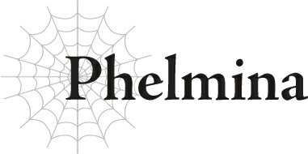

# Phelmina

Tên tôi là Phelmina.

Chỉ Phelmina mà thôi.

Đã từng có thời tôi sở hữu cả họ của gia tộc nữa, nhưng giờ thì không còn nữa rồi.

Tôi được sinh ra trong một gia tộc ma tộc danh giá và chưa bao giờ thiếu thốn bất cứ thứ gì trong đời.

Cha tôi là người đứng đầu bộ tài chính kiêm Chỉ huy Quân đoàn 10 của quân đội ma tộc, một vị trí vững chắc như bàn thạch theo bất kỳ tiêu chuẩn nào.

Nói một cách chính xác, tôi nên nói ông ấy từng là Chỉ huy Quân đoàn 10, nhưng đó vẫn là trường hợp khi tôi còn sống cùng gia đình.

Không hề có một Quân đoàn 10 thực tế nào cả, nên đó chỉ là một chức danh trên giấy tờ, nhưng nó vẫn được trả lương đủ cao để gia đình tôi có cuộc sống khá sung túc.

Nhưng dù chúng tôi không thiếu thốn gì, gia đình tôi theo đó cũng cực kỳ nghiêm khắc.

Những kẻ đứng ở vị trí dẫn đầu phải sở hữu lượng sức mạnh và tinh thần tương xứng.

Tôi chắc chắn rằng tất cả các gia tộc ma tộc quý tộc đều nuôi dạy con cái họ với những niềm tin như vậy, chứ không riêng gì gia đình tôi.

Những tin đồn cho rằng gia đình tôi đối xử với con cái nghiêm khắc hơn nhiều so với những gia đình khác là hoàn toàn vô căn cứ.

Học vẹt, rèn luyện, và các bài học lễ nghi.

Từ khi còn nhỏ, đó là cách tôi trải qua những ngày tháng của mình, và tôi tin rằng mình đã trở thành một tiểu thư đúng mực, người không làm nhục nhã thanh danh của gia tộc.

Ít nhất, tôi từng tin là như thế.

Bởi vì sau một sự cố nhất định, gia đình tôi đã từ mặt tôi...

Dưới lớp mũ trùm đầu che khuất, tôi lén lút liếc nhìn người bên cạnh...

“Cái gì?”

...nhưng lập tức bị phát hiện ngay.

Người đang nhíu mày nhìn tôi lúc này chính là Sophia Keren.

Cô ta chính là nguyên nhân khiến tôi bị trục xuất khỏi gia tộc.

Ngay cả bây giờ, chỉ cần nghĩ về những gì đã xảy ra cũng đủ khiến máu trong người tôi sôi lên.

“Ồ, không có gì.”

“Vậy sao.”

Một cuộc trò chuyện ngắn ngủi.

Chúng tôi không đủ thân thiết để tiến hành một cuộc tán gẫu thân thiện, và lúc này cũng không phải là thời gian hay địa điểm thích hợp cho việc đó.

Hiện tại, chúng tôi đang ẩn nấp trong rừng, chờ đợi để phục kích kẻ thù.

Nhìn xung quanh, tôi thấy các thành viên khác trong đội quân mặc áo choàng trắng của chúng tôi cũng đang ẩn nấp quanh khu vực này.

Vì tất cả chúng tôi đều đang sử dụng kỹ năng [Ẩn mật] cấp độ cao, nên hầu như không thể nhìn thấy bất kỳ ai nếu không biết trước họ ở đó.

Nhóm nhỏ gồm những binh sĩ tài năng xuất chúng này chính là Quân đoàn 10.

Khi cha tôi còn phụ trách, các hàng ngũ hoàn toàn được lấp đầy bởi các tư binh của gia đình tôi, hầu hết họ đều chẳng có ích gì trong chiến đấu.

Nhưng những ngày đó đã qua rồi.

Khi cha tôi bước xuống khỏi vị trí chỉ huy và một người mới lên thay thế ông ấy, Quân đoàn 10 đã được tái sinh thành một lực lượng nhỏ nhưng vô cùng tinh nhuệ.

So với các quân đoàn khác, quân đoàn của chúng tôi hầu như không bằng một phần mười về mặt quy mô.

Nhưng mỗi cá nhân đều có thể chiến đấu tốt bằng cả trăm người của bất kỳ quân đoàn nào khác.

Tôi thậm chí sẵn sàng cá rằng chúng tôi có thể tự mình cầm cự trong một trận chiến trực diện với một trong các quân đoàn khác.

Đó chính là mức độ mạnh mẽ của các binh sĩ Quân đoàn 10.

Điều đáng sợ nhất là những binh sĩ tinh nhuệ này chỉ được huấn luyện trong vòng chưa đầy vài năm.

Tôi khó có thể đưa ra phán xét, vì chính tôi cũng là một trong số họ.

Nhưng các quân đoàn khác không hề biết đến sức mạnh thực sự của Quân đoàn 10.

Chưa được bao lâu kể từ khi chúng tôi được thành lập, và chúng tôi khá nhỏ bé so với quy mô của một quân đoàn thông thường, nên chúng tôi vẫn chưa có cơ hội để thể hiện sức mạnh của mình.

Nhưng chúng tôi đã làm việc chăm chỉ hơn thế rất nhiều ở phía sau hậu trường, dưới mệnh lệnh của chủ nhân: thu thập thông tin, thực hiện các vụ ám sát, và các nhiệm vụ khác nhau khác.

Do đó, mọi người dường như cho rằng chúng tôi chuyên về loại thủ đoạn lén lút này.

Họ không hoàn toàn sai, nhưng thực tế, đó chỉ là một khía cạnh trong tài năng của chúng tôi; chúng tôi cũng xuất sắc không kém trong cận chiến thông thường.

Đáng tiếc là chúng tôi vẫn chưa có cơ hội để chứng minh điều đó.

Và ngày hôm nay cũng không phải là ngoại lệ.

Các quân đoàn khác đều đang hiên ngang xâm chiếm lãnh thổ loài người, nhưng chúng tôi vẫn đang ẩn náu trong bóng tối.

Tôi chắc chắn rằng thực tế là chúng tôi không thể phô diễn dũng khí của mình trong trận chiến cũng là lý do khiến tâm trạng của Sophia trở nên tồi tệ như vậy.

Sophia có một khát khao mãnh liệt được đứng dưới ánh hào quang, và cô ta cũng đơn giản là rất thích chiến đấu.

Tuy nhiên, theo một nghĩa nào đó, đây là chiến trường quan trọng nhất trong tất cả.

Đó chính là lý do tại sao chúng tôi có mặt ở đây.

“......”

Hoàn toàn im lặng.

Toàn bộ Quân đoàn 10 dịch chuyển để vào vị trí và sẵn sàng chiến đấu.

Các giác quan của chúng tôi, được mài giũa bởi các kỹ năng, đã phát hiện ra tiếng bước chân của những kẻ đang di chuyển qua khu rừng.

Vì vậy chúng tôi nín thở và chờ đợi.

Vì tất cả các thành viên của chúng tôi đều sở hữu kỹ năng [Vô thanh], nên không ai có thể phát hiện ra chúng tôi qua hơi thở hay nhịp tim, và kỹ năng [Vô hương] cũng ngăn chặn chúng tôi bị phát hiện bởi mùi cơ thể.

Ngoài ra, chúng tôi đã trải qua đủ loại huấn luyện để tránh bị phát hiện.

Cách duy nhất có thể phát hiện ra chúng tôi là sử dụng một kỹ năng như [Thiên Lý Nhãn].

Không có cách nào thực sự để phòng thủ trước nó, nhưng với việc sử dụng khéo léo các kỹ năng như [Ẩn mật] và [Che giấu], chúng tôi có thể giảm thiểu rủi ro đến một mức độ nhất định.

Tôi nghi ngờ mục tiêu của chúng tôi liên tục sử dụng các kỹ năng phát hiện, nên chừng nào họ không biết chúng tôi ở đây, họ gần như chắc chắn sẽ không phát hiện ra chúng tôi.

Và khi chúng tôi giữ cho hơi thở tĩnh lặng, chúng tôi chờ đợi mục tiêu đi qua ngay dưới chân mình.

Chúng tôi không nhìn về hướng của họ, vì ngay cả một cử động nhỏ nhất cũng có thể đủ để đánh động họ.

Tiếng bước chân tiến lại gần hơn rồi bắt đầu đi qua đơn vị đang ẩn nấp của chúng tôi.

Đánh giá qua âm thanh, có lẽ có khoảng một trăm kẻ.

Con đường duy nhất đi qua khu rừng này là những lối mòn của thú rừng, nên nó khó có thể thích hợp cho việc hành quân với một lượng lớn binh lính.

Hệ quả là, việc bất kỳ ai giám sát nó lại càng khó khăn hơn.

Đó chính là bản chất của vùng đất không người nằm giữa lãnh thổ loài người và ma tộc.

Có các pháo đài của loài người được bố trí ở bất kỳ nơi nào mà một đội quân có khả năng hành quân qua.

Khu vực ở giữa được gọi là vùng đất không người, nơi các cuộc đụng độ nhỏ giữa con người và ma tộc thường xuyên xảy ra.

Khu rừng này chính là một khu vực như vậy.

Và có vẻ như trong khi phần lớn lực lượng ma tộc đang hành quân vào trận chiến, kẻ thù lại đang lập kế hoạch đi qua vùng đất không người này để xâm nhập vào lãnh thổ ma tộc.

Với tư cách là Quân đoàn 10, nhiệm vụ của chúng tôi là tiêu diệt hoàn toàn cuộc xâm nhập đó.

Các thành viên khác của chúng tôi cũng đã được bố trí ở các khu vực khác của vùng đất không người, với nhiệm vụ tiêu diệt bất kỳ kẻ thù nào cố gắng đi qua, cũng như bất kỳ con người nào đã sinh sống ở những khu vực đó.

Nhưng mũi nhọn chính là ở ngay đây.

Tôi nín thở và chờ đợi tín hiệu.

Không lâu sau, nó đã đến.

Một sợi chỉ mỏng đến mức mắt thường hầu như không thể nhìn thấy được quấn quanh ngón tay tôi.

Tôi cảm thấy một lực kéo.

Nhận được tín hiệu đó, tất cả chúng tôi đồng loạt hành động cùng một lúc.

Chúng tôi lao ra khỏi nơi ẩn nấp và tấn công kẻ thù như một thể thống nhất.

Sở trường của tôi là một loại vũ khí ném gọi là chakram.

Tôi phóng nó lướt qua Sophia khi cô ta lao thẳng về phía trước, và nó cắm phập vào hộp sọ của mục tiêu của tôi.

Một khoảnh khắc sau, Sophia chém vào một kẻ thù khác, và sau đó, các thành viên còn lại cũng đồng loạt ra tay.

Cuộc tấn công bất ngờ đầu tiên của chúng tôi hoàn toàn thành công, khiến các nạn nhân không có thời gian để tự vệ.

Chúng tôi dồn dập tấn công kẻ thù đang bàng hoàng khi chúng cố gắng tìm hiểu xem chuyện gì đang xảy ra.

Chưa đầy một nửa trong số chúng có thể chống đỡ được đợt tấn công thứ hai, nên nó cũng gây ra một lượng sát thương đáng kể.

Chỉ khi chúng tôi bắt đầu tung ra đợt tấn công thứ ba, kẻ thù mới hiểu được rằng chúng đã bị phục kích và bắt đầu tự vệ.

Đến thời điểm này, chúng đã phải chịu tổn thất nặng nề.

Thực tế là chúng đang tiến lên trên một lối mòn hẹp theo một hàng dọc cũng hoạt động có lợi cho chúng tôi.

Chúng tôi tấn công hàng ngũ kéo dài của chúng từ cả hai phía trong một cuộc gọng kìm, chia cắt chúng ra và tiêu diệt các bộ phận bị cô lập.

Hơn nữa, việc di chuyển trên lối mòn hẹp ngay cả trong thời điểm thuận lợi nhất cũng đã khó khăn rồi.

Không có hy vọng thiết lập một hàng phòng thủ có tổ chức ở đây.

Cuộc chiến sẽ quy về một cuộc so tài thuần túy về sức mạnh cá nhân.

Thật không may cho kẻ thù của chúng tôi, cuộc tấn công ban đầu của chúng tôi đã làm mỏng đi số lượng của chúng, và chúng vẫn chưa hồi phục sau sự hỗn loạn.

Chưa kể đến sức mạnh thuần túy của chúng tôi.

Thật sự, tôi không thấy làm thế nào chúng tôi có thể thua được.

“Phục kích! Chúng ta đang bị tấn công!”

“Cái gì?! Chết tiệt!”

Trong khi kẻ thù hoảng loạn, các binh sĩ Quân đoàn 10 chỉ lặng lẽ tấn công.

“POTIMAAAAS!”

Sửa lại một chút: ngoại trừ một người, kẻ đang hét lớn khi vung thanh đại kiếm của mình.

“Ra là các người đã chờ đợi chúng ta ở đây sao, hửm?”

Đứng đối diện với một Sophia đang hét lớn là một người đàn ông tộc elf với một ánh nhìn hiểm ác trong mắt.

Mục tiêu chính của chúng tôi: Potimas Harrifenas.

Hắn ta cùng với tộc elf dưới quyền chỉ huy của hắn.

“Ta cho phép các ngươi sử dụng vũ khí của mình. Giết sạch chúng đi.”

Potimas ra lệnh bằng một giọng bình tĩnh nhưng chói tai.

Ngay lập tức, tộc elf bắt đầu thay đổi.

Một vài kẻ biến đổi bàn tay của mình để lộ ra thứ gọi là nòng súng.

Những kẻ khác rút ra các vũ khí có hình dạng tương tự hoặc tạo ra các lưỡi kiếm phát sáng trên tay.

Ngay lập tức, những khẩu súng bắt đầu kêu lên lạch cạch khi chúng nhả đạn.

Nhưng vì chúng tôi đã dự đoán trước được tất cả những điều này, chúng tôi phản ứng mà không hề hoảng loạn.

Một số người trong chúng tôi tạo ra các bức tường ma pháp để che chắn cho bản thân, trong khi những người khác dự đoán đường đi của những viên đạn và né tránh chúng.

“Cái—?!”

Khi tộc elf lùi lại trong sự ngạc nhiên, đã đến lúc cho cuộc phản công của chúng tôi.

Ngay cả Potimas dường như cũng bị bất ngờ trước diễn biến này, đánh giá qua việc biểu cảm của hắn trở nên tối tăm đi một chút.

Đúng vậy — chúng tôi biết tất cả về các người.

Về việc tộc elf các người sử dụng những vũ khí kỳ lạ gọi là máy móc như thế nào.

Bởi vì Chỉ huy Quân đoàn 10 không ai khác chính là chủ nhân của chúng tôi.

“Hừ!”

Thanh đại kiếm của Sophia chém xuống chỗ Potimas, kẻ đã đỡ nó bằng cánh tay phải của mình.

Tôi chắc chắn cánh tay đó được làm từ một loại máy móc nào đó, nhưng thanh kiếm của Sophia đã chém đứt nó một cách dễ dàng.

“Tch.” Potimas tặc lưỡi. “Ta không còn lựa chọn nào khác. [Kết Giới Phản Kỹ Thuật]—”

Lời nói của tên thủ lĩnh tộc elf bị cắt đứt giữa chừng.

Bởi vì đầu và cổ của hắn đột nhiên bị chia tách bởi một người đột ngột xuất hiện phía sau hắn.

“...Ngươi có phiền không khi đừng có chen ngang vào ngay lúc mọi chuyện đang trở nên thú vị chứ?”

Sophia trông có vẻ hờn dỗi vì đối thủ của mình đã bị cướp mất.

Nhưng thủ phạm không hề đáp lại, thay vào đó lặng lẽ nghiền nát chiếc đầu bị chặt của Potimas.

Vào cùng khoảnh khắc đó, việc tiêu diệt lực lượng tộc elf đã hoàn tất.

Không một kẻ nào trốn thoát. Không một kẻ nào sống sót. Và không một ai phía chúng tôi bị thương vong.

Ngay khi xác nhận điều này, tôi quỳ xuống.

“Nhiệm vụ đã hoàn thành, thưa chủ nhân.”

Phần còn lại của đơn vị cũng làm theo tấm gương của tôi và quỳ xuống trước chủ nhân.

Chỉ có Sophia là vẫn đứng thẳng.

Chủ nhân chỉ lặng lẽ gật đầu mà không thèm liếc nhìn chúng tôi một cái.

Chủ nhân của chúng tôi, Chỉ huy Quân đoàn 10... White đại nhân.

Nếu bạn hỏi cuộc đời tôi đã đi chệch đường ray từ khi nào, câu trả lời rất đơn giản.

Cái ngày mà Sophia xuất hiện ở học viện.

Từ đó trở đi, mọi thứ đều sai lệch.

Ngoại trừ việc trải qua quá trình huấn luyện nghiêm khắc để đảm bảo tôi không làm nhục nhã thanh danh của gia tộc, tôi đã sống một cuộc đời không gặp bất kỳ khó khăn nào.

Chưa bao giờ tôi phải trải nghiệm những sự kiện nằm ngoài tầm kiểm soát của mình như vậy.

Cha mẹ tôi đã chọn một vị hôn phu cho tôi, nên tôi đoán tương lai của mình không phải do tôi tự quyết định.

Nhưng vị hôn phu của tôi, ngài Wald, là một quý ông hoàn hảo, và nhiệm vụ của bất kỳ quý tộc nào là sống trọn vẹn tương lai đã được lựa chọn cho họ, nên tôi không đặc biệt không hài lòng với sự sắp đặt này.

Thực tế, tôi khá quý mến vị hôn phu của mình, ngài Wald.

Nhưng những cảm xúc đó giống với tình bạn hơn là tình yêu nam nữ.

Hoặc có lẽ, vì tôi biết mình đính hôn để kết hôn với anh ấy trong tương lai, đó là một tình cảm gần như là tình thân gia đình.

Dù sao thì, cảm xúc của tôi không phải là tình yêu lãng mạn.

Và tôi tin rằng đối với Wald cũng vậy.

Nhưng đây không phải là vấn đề; ngay cả khi chúng tôi không có một tình yêu cuồng nhiệt, tôi vẫn tự tin rằng chúng tôi có thể xây dựng một gia đình trên cơ sở tôn trọng lẫn nhau.

Cho đến khi Wald yêu một người phụ nữ khác và phản bội tôi.

Vâng, bạn đoán đúng rồi đấy: Người phụ nữ được nói đến không ai khác chính là Sophia.

Khi cô ta chuyển đến học viện, Sophia lập tức thu hút sự chú ý của mọi người.

Giới thượng lưu của ma tộc là một thế giới nhỏ bé.

Vì tổng dân số quá ít, nên lẽ tự nhiên là số lượng quý tộc còn ít hơn nữa.

Dĩ nhiên, tôi đã gặp hầu hết những đứa trẻ quý tộc khác từ lâu trước khi chúng tôi vào học viện.

Ngay cả khi tôi không quen biết họ cá nhân, hầu hết ít nhất cũng là người quen hoặc bạn của bạn, nên tôi có sự hiểu biết cơ bản về tính cách của họ qua lời truyền miệng.

Nhưng Sophia là một ngoại lệ.

Nguồn gốc của cô ta là ẩn số, và chưa từng có ai gặp cô ta trước đây.

Điều duy nhất chúng tôi biết chắc chắn là cô ta đang ở trong dinh thự của Công tước Phthalo trước khi đến học viện.

Do đó, những lời đồn đoán nổ ra khắp nơi: “Cô ta là con ngoài giá thú của Công tước Balto Phthalo sao?” “Cô ta là con gái của vị Ma Vương trước đây đã biến mất sao?” “Cô ta có quan hệ họ hàng với vị Ma Vương hiện tại sao?”

Bây giờ khi biết sự thật, rõ ràng là không có giả thuyết nào trong số đó là đúng, nhưng vào thời điểm đó, không ai biết làm thế nào để tiếp cận học sinh chuyển trường bí ẩn mới này.

Vì vậy, theo một nghĩa nào đó, việc ngài Wald là người đầu tiên tiếp cận cô ta với tư cách là người đại diện của lớp là điều hoàn toàn tự nhiên, vì anh ấy có địa vị xã hội cao nhất trong năm học của chúng tôi.

Nhưng Sophia hóa ra lại đặc biệt hơn tôi tưởng, và vì ngài Wald là người khá hiếu thắng, tôi tin rằng anh ấy đã sớm quên đi mục tiêu ban đầu của mình khi thiết lập liên lạc với cô ta.

Đúng vậy, chính xác là thế.

Bất chấp tính cách tồi tệ của mình, Sophia rất có tài năng.

Và trong khi ngài Wald tỏ ra thân thiện, sự thật là anh ấy cực kỳ kiêu hãnh và hiếu thắng.

Vì tôi đã dành nhiều năm bên cạnh anh ấy từ khi còn nhỏ nhờ vào hôn ước của chúng tôi, tôi hiểu anh ấy khá rõ, nhưng hầu hết mọi người đều dễ dàng bị đánh lừa bởi vẻ bề ngoài và những lời nói hoa mỹ của anh ấy.

Wald có tài năng xây dựng lượng người theo dõi bằng cách giả vờ tử tế trong khi làm rõ rằng mình là người vượt trội. Anh ấy sẽ thản nhiên đề cập đến tài năng của mình theo cách khiến hầu hết mọi người tin rằng: *Mình không thể đánh bại người này*, trong khi cũng hành xử thân thiện để họ nghĩ: *Nhưng anh ấy thật tốt bụng!*

Quả là một nhân vật đáng gờm, tôi phải nói như vậy.

Mặc dù việc biết khía cạnh đó của anh ấy chính là lý do tôi không thể nảy sinh tình cảm lãng mạn với anh ấy.

Dù vậy, kế hoạch của Wald giả định rằng anh ấy thực sự vượt trội hơn người mà anh ấy đang cố gắng gây ấn tượng.

Anh ấy đến từ một gia đình quý tộc cấp cao và nỗ lực rất nhiều cho phù hợp.

Nhưng Sophia đã vượt qua anh ấy về mọi mặt.

Ngài Wald, người luôn đứng đầu lớp chúng tôi, đã thua một ai đó.

Lẽ tự nhiên, điều này đã thắp lên một ngọn lửa trong lòng anh ấy.

Mọi chuyện càng tồi tệ hơn khi Sophia rõ ràng đang cười khẩy và nhìn xuống anh ấy bằng nửa con mắt.

Đúng vậy, họ quả là một cặp bài trùng.

Từ đó trở đi, cuộc chiến đơn phương của ngài Wald bắt đầu.

Anh ấy bắt đầu thách thức Sophia bất cứ khi nào có cơ hội và lần nào cũng thua cuộc.

Dù là điểm kiểm tra, thực hành đấu tập trong các lớp chiến đấu, hay thậm chí là các bài học khiêu vũ, ngài Wald đều kém hơn Sophia ở mọi hạng mục.

“Cô thực sự rất tuyệt vời, cô Sophia.”

Anh ấy sẽ mỉm cười nhẹ nhàng và khen ngợi cô ta, nhưng tôi có thể nhận ra rằng ở bên trong, ý chí ganh đua của anh ấy chỉ càng bùng cháy dữ dội hơn.

Tôi nghi ngờ có ai đó nhận ra rằng ở một thời điểm nào đó, những lời khen ngợi của anh ấy đã trở nên chân thành.

Có lẽ ngay cả bản thân Wald cũng không nhận ra điều đó ngay lập tức.

Wald luôn đứng đầu trong hầu hết mọi thứ. Tôi không nghĩ anh ấy từng gặp nhiều khó khăn để giành chiến thắng ở bất kỳ việc gì trước đây.

Đôi khi, tôi đã không kiềm chế đủ và vô tình vượt qua anh ấy, điều này luôn dẫn dắt anh ấy làm việc chăm chỉ hơn để lại đứng đầu vào lần sau.

Đó chính là kiểu người của ngài Wald.

Tôi biết rằng anh ấy liên tục làm việc chăm chỉ để giữ vững vị trí đứng đầu của mình, nên tôi cũng đã nỗ lực để luôn giữ vị trí thứ hai.

Hi-hi. Dù ngài Wald có thông minh đến đâu, anh ấy cũng chưa bao giờ nhận ra rằng tôi đã cẩn thận kiềm chế bản thân để đảm bảo anh ấy luôn đứng đầu đâu nhé.

Nhưng tôi vẫn tôn trọng Wald ở một mức độ nhất định vì đạo đức làm việc và những tham vọng cao cả của anh ấy.

Tôi đã nghĩ rằng cùng nhau, có lẽ chúng tôi có thể giúp dẫn dắt ma tộc ra khỏi sự suy tàn của mình.

Chúng tôi là những quý tộc cấp cao, những nhà lãnh đạo của tương lai.

Chúng tôi không thể chấp nhận thất bại. Chúng tôi cần phải luôn đứng ở vị trí dẫn đầu.

Nhưng Sophia, kẻ không biết gì về những đấu tranh và khó khăn như vậy, đã liên tục giành chiến thắng mà không hề nhân từ.

Và ngài Wald, người luôn liên tục giành chiến thắng và có được sự ngưỡng mộ của những kẻ thua cuộc, đã bắt đầu ngưỡng mộ kẻ liên tục đánh bại mình.

...Một logic khá đơn giản, phải không nào?

Wald bắt đầu dành ngày càng nhiều thời gian và tiền bạc cho Sophia, và mọi chuyện chỉ càng trở nên tồi tệ hơn khi những năm tháng trôi qua.

Cô ta vốn đã xinh đẹp khi mới đến, nhưng ngoại hình của cô ta chỉ càng lớn lên càng xinh đẹp hơn và khí chất của cô ta bằng cách nào đó càng trở nên mê hoặc hơn.

Hầu hết các nam sinh đã bắt đầu phục tùng cô ta từ lâu.

Điều đó sẽ không quá tệ nếu họ chỉ đơn thuần là thầm thương trộm nhớ cô ta.

Chắc chắn sẽ không lý tưởng nếu tất cả các chàng trai quý tộc trẻ tuổi quanh tuổi chúng tôi đều yêu cùng một người phụ nữ, nhưng đây không phải là lần đầu tiên các chàng trai bị mê hoặc bởi vẻ đẹp.

Chỉ cần họ cuối cùng tỉnh ngộ ra là được.

Nhưng tình hình nghiêm trọng hơn thế nhiều.

Sophia đã cắm răng nanh vào người họ.

Có rất ít kỹ năng có thể gây ra hiệu ứng trạng thái [Mê Hoặc], nhưng chúng chắc chắn có tồn tại.

Các nạn nhân sẽ bắt đầu thờ phụng kẻ đã mê hoặc họ.

Và giờ đây, hầu hết các chàng trai trẻ tuổi có nhiệm vụ dẫn dắt thế hệ ma tộc tiếp theo đã bị mê hoặc bởi một người phụ nữ và tuân theo mọi mệnh lệnh của cô ta.

Và điều đó tôi chắc chắn không thể bỏ qua.

Không chỉ có thế, khi tôi nói cô ta cắm răng nanh vào người họ, tôi đang nói theo nghĩa đen.

Hóa ra, Sophia thực sự là một ma cà rồng, sinh vật trong truyện cổ tích.

Với tốc độ mà cô ta đang đi, tôi thực sự lo ngại cô ta hoàn toàn có thể tiếp quản toàn bộ ma tộc.

May mắn thay, Sophia dường như không có ý định như vậy và thậm chí có vẻ như không hề cố ý tạo ra hiệu ứng [Mê Hoặc].

Nhưng cô ta vẫn nguy hiểm, nên tôi đã thảo luận với cha mình để tìm cách đối phó với cô ta.

Không may là, cô ta đã đánh hơi thấy kế hoạch của tôi.

Tôi đoán mình có lẽ đã hoảng loạn hơn cả những gì bản thân nhận ra.

Ngài Wald và những người khác đã quay lưng lại với tôi, trút lên đầu tôi những cáo buộc sai sự thật.

Không, tôi đoán không phải tất cả chúng đều là sai sự thật.

Tôi thực sự đã lên kế hoạch loại bỏ Sophia nếu tôi có thể xoay sở được.

Do đó, tôi bị đuổi khỏi học viện, và để mọi chuyện tồi tệ hơn, cha tôi tuyên bố từ mặt tôi.

Tôi sẽ không bao giờ quên khuôn mặt thờ ơ của ông khi ông nói với tôi như vậy.

Như tôi được biết sau đó, vì Sophia có mối liên hệ với Ma Vương, cha của Wald và một số quý tộc khác đã đưa ra kết luận rằng tôi phải bị trục xuất.

Chính ngài Wald là người đứng sau sự thao túng này.

Tôi đã luôn cố tình kiềm chế để đảm bảo ngài Wald có được vị trí đứng đầu, nên có lẽ tôi đã đánh giá quá cao sức mạnh của chính mình.

Sâu thẳm bên trong, tôi đã nghĩ rằng nếu mình dốc toàn lực, tôi có thể làm được bất cứ điều gì.

Nhưng trước khi tôi có thể loại bỏ Sophia, Wald đã loại bỏ tôi trước.

Nếu bạn coi đây là một cuộc so tài, bạn có thể nói tôi đã thua ngài Wald.

Đây có lẽ là lần đầu tiên tôi dốc hết sức chống lại Wald và vẫn thua cuộc.

Đã có lúc tôi hy vọng rằng ngài Wald sẽ trở nên mạnh mẽ hơn để tôi không còn có thể đánh bại anh ấy ngay cả khi tôi đã cố gắng hết sức.

Nhưng đây khó có thể là những gì tôi đã hy vọng.

Tôi cũng chưa bao giờ tưởng tượng được rằng thất bại của mình lại dẫn đến việc bị trục xuất khỏi giới thượng lưu...

Ngay cả khi chúng tôi không yêu nhau, tôi vẫn nghĩ chúng tôi ít nhất cũng có một mức độ tin tưởng nhất định dành cho nhau.

Nhưng tôi đã bị phản bội bởi vị hôn phu của mình, bị gia đình từ mặt, và rơi vào vực thẳm của sự tuyệt vọng.

May mắn thay, cha tôi đã không đá tôi ra ngoài mà không có lấy một đồng xu dính túi; ông đã sắp xếp cho tôi một ít tiền mang theo và một nơi để đến.

Cụ thể là, Quân đoàn 10.

Gần như cùng thời điểm tôi bị từ mặt, Quân đoàn 10 đã đổi chủ từ cha tôi sang chỉ huy hiện tại của nó, White đại nhân, và bắt đầu chiêu mộ binh lính.

Cha tôi quen biết White đại nhân, vì cô ấy là người kế nhiệm của ông, và đã tiến cử tôi. Cô ấy đã tốt bụng nhận tôi vào, và đó là cách tôi trở thành một binh sĩ của Quân đoàn 10.

Kể từ đó, tôi đã phục vụ White đại nhân.

Tôi không cảm thấy gì ngoài lòng biết ơn sâu sắc đối với cô ấy.

Lúc đó tôi chỉ là một cô gái trẻ, nên nếu cô ấy không tạo ra một nơi cho tôi, tôi chắc chắn mình đã phải chết một cái chết vô ích từ lâu rồi ngay cả với số tiền cha tôi đã cho.

Hơn nữa, White đại nhân chưa bao giờ đối xử với tôi như một đứa trẻ đơn thuần và luôn giao phó công việc và huấn luyện cho tôi.

Đó là những ngày tháng điên rồ — ý tôi là những ngày tháng làm việc chăm chỉ và kỳ dị, tức là, những phương pháp huấn luyện độc nhất vô nhị. Dù thế nào đi nữa, mỗi khoảnh khắc đều tràn ngập... sự hào hứng.

Vì tôi quá bận rộn chạy loanh quanh suốt ngày để có thời gian chìm đắm trong tuyệt vọng, tôi đã bắt đầu cảm thấy tốt hơn trước khi tôi kịp nhận ra.

Tôi không biết đó có phải là ý định của chủ nhân hay không, nhưng dù thế nào đi nữa, tôi đã có thể phục hồi hoàn toàn về mặt tinh thần và cảm xúc.

Có lẽ việc tôi bị đánh đập và hành hạ đau đớn mỗi ngày đến mức việc bị vị hôn phu phản bội và bị gia đình trục xuất dường như hầu như chẳng đáng để so sánh cũng đã giúp ích rất nhiều.

Nhờ đó, các chỉ số của tôi đã tăng cao hơn rất nhiều so với những gì tôi có thể tưởng tượng.

Tôi học được rằng con người có thể vượt qua giới hạn của chính mình.

Trước khi được White đại nhân nhận vào, tôi tin rằng mình đã luyện tập tốt nhất có thể với tư cách là con gái của một gia đình quý tộc, nhưng tôi đã phát hiện ra qua trải nghiệm thực tế của bản thân rằng tuy ai cũng có thể làm việc chăm chỉ, nhưng không phải ai cũng có thể vượt qua giới hạn của mình.

Các bạn học cùng khóa huấn luyện của tôi, nay là các thành viên của Quân đoàn 10, đều đã từ bỏ một phần bản thân để trở nên mạnh mẽ thế này.

Chủ nhân gọi đó là “cày cấp”.

Mối liên kết kết nối những người chúng tôi đã cùng nhau đi qua địa ngục cày cấp đó là rất bền chặt.

Và qua quá trình phục vụ như tay chân của chủ nhân trên thực địa, chúng tôi đã biết được một vài bí mật đen tối nhất của thế giới này.

Với tư cách là con gái của một gia đình quý tộc, tôi đã nghĩ tương lai của mình là giúp dẫn dắt ma tộc.

Nhưng những kế hoạch đó đã biến mất trong tích tắc, và giờ đây tôi bước đi trên một con đường nặng nề hơn nhiều ngay sau gót chân của chủ nhân.

Bạn không bao giờ biết cuộc đời có thể đưa bạn đến đâu, tôi đoán vậy.

Hoặc khi nào vị hôn phu cũ đã hủy hoại cuộc đời bạn, cũng như ma cà rồng đã xúi giục anh ta làm vậy, có thể sẽ nhập ngũ vào Quân đoàn 10 ngay bên cạnh bạn.

“Ngồi.”

Khi Sophia nhíu mày nhìn chủ nhân vì đã cướp đi con mồi của cô ta, chủ nhân chỉ nói một từ duy nhất.

Đột nhiên, Sophia quỳ rạp mặt xuống đất.

“Hừ... ư-ự-ự!”

Sophia run rẩy với nỗ lực cố gắng đứng dậy, nhưng thay vào đó, trán cô ta cứ tiếp tục áp sát vào nền đất bụi bặm.

Tôi được biết đây là một lời nguyền mà chủ nhân đã đặt lên Sophia như một hình phạt ép buộc cô ta phải phủ phục xuống.

Chủ nhân đã đặt lời nguyền này lên cô ta vào đúng ngày tôi bị từ mặt.

Nói cách khác, cô ấy đã làm điều đó vì tôi!

...Hoặc tôi muốn nghĩ như vậy, nhưng trên thực tế, nó nhiều khả năng là nhằm dạy cho Sophia một chút lễ nghi thì đúng hơn.

Nhưng đối với tôi, lời nguyền đó mang lại cảm giác như một sự trả thù.

Vì vậy xin hãy nuông chiều tôi khi tôi nói lời này:

Đáng đời cô ta lắm!

---

[◀ Chương trước: Merazophis](09_merazophis.md) | [Chương tiếp theo: Wald ▶](11_wald.md)
