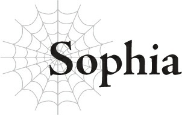
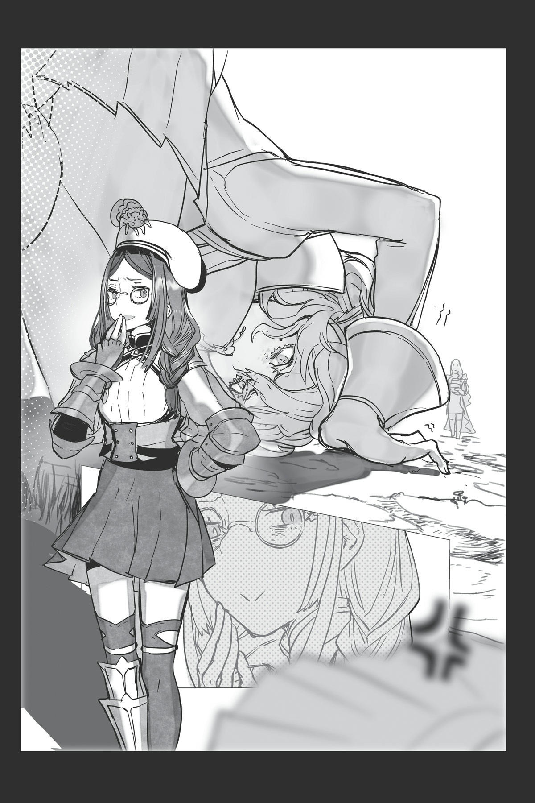
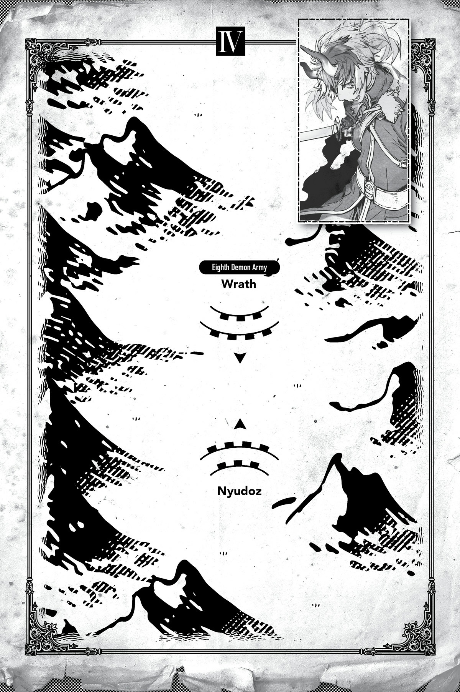

# Sophia

Thế là tôi bị ép phải đến cái trường học ngu ngốc đó, và cứ như thể những ngày tháng của tôi vẫn chưa đủ căng thẳng ấy, tôi lại vô tình làm đảo lộn cả học viện bằng cái sức mạnh [Mê Hoặc] mà tôi thậm chí còn không biết mình đang sử dụng, và giờ tôi đang bị trừng phạt vì chuyện đó bằng lời nguyền quái đản này.

Chuyện này hoàn toàn không có một chút logic nào cả!

Ngay từ đầu, tôi vốn đã là một học sinh trung học ở kiếp trước rồi, nên việc gửi tôi đi học với một lũ nhóc mũi thò lò ở kiếp thứ hai này quả là một hành động tồi tệ.

Tôi phải đi chơi với những đứa trẻ phiền phức này ngày này qua ngày khác, và tôi hoàn toàn không được gặp Merazophis chút nào.

Bạn có biết tôi đã phải cố gắng thế nào để không phát điên vì căng thẳng không?

Và sau vài năm chịu đựng mọi thứ, người lại tùy tiện giáng một lời nguyền lên tôi như một “hình phạt” sao?

Như thế không phải là quá đáng lắm sao?!

Điều tồi tệ nhất là tôi thậm chí không thể chống lại nó, vì đó chính là cách lời nguyền hoạt động.

Nghe này, tôi thực sự có nghĩ là hơi kỳ lạ khi những tên con trai ngu ngốc đó đột nhiên bắt đầu sùng bái tôi, được chứ?

Nhưng tôi đã nghĩ đó chỉ là do tuổi dậy thì hay gì đó tương tự thôi.

Làm sao tôi biết được là mình đang vô thức áp đặt hiệu ứng [Mê Hoặc] lên tất cả mọi người chứ?

Công bằng mà nói, đáng lẽ tôi phải nghi ngờ có điều gì đó không ổn khi tên đạo đức giả cùng những tên con trai khác hợp sức đuổi cô nàng Lớp trưởng đi. Chuyện đó thực sự rất kỳ lạ.

Hóa ra chuyện đó cũng là vì hiệu ứng [Mê Hoặc]...

Ồ, nhân tiện thì tên đạo đức giả tên thật là Wald, còn cô nàng Lớp trưởng là Phelmina.

Wald thực sự có một tính cách tồi tệ ẩn dưới vẻ ngoài thân thiện, còn Phelmina thì nghiêm túc một cách nực nội, nên đó là những cái tên tôi tự gọi họ trong đầu.

Phelmina lúc nào cũng lên lớp dạy đời tôi, nên tôi thực sự cảm thấy hơi đắc ý khi Wald đuổi cô ta ra khỏi trường, nhưng thế cờ đã lật ngược khi Chủ nhân giáng lời nguyền ngớ ngẩn này lên tôi ngay sau khi phát hiện ra những gì đã xảy ra.

Chà, tôi đoán mình cũng có hơi cảm thấy có lỗi về những gì đã xảy ra với Phelmina.

Cô ta có thể là một kẻ hay cằn nhằn, nhưng những gì cô ta nói thường là đúng.

Cô ta chắc chắn không làm gì đáng để bị đuổi khỏi trường bởi những tên con trai tôn sùng tôi.

Không phải tôi bảo họ làm vậy, và tôi chắc chắn không hề giúp sức, nhưng tôi thực sự cảm thấy mình có chút trách nhiệm, được chứ?

Điều đó vẫn không biện minh cho việc tôi bị nguyền rủa chút nào, nhưng tôi thậm chí còn bị Merazophis mắng mỏ sau đó...

“Tiểu thư, cha mẹ cô sẽ nghĩ gì nếu họ nhìn thấy cô như bây giờ chứ?”

Tôi chưa bao giờ thấy anh ấy nhìn tôi một cách nghiêm khắc như vậy.

“Tiểu thư, tôi không nghi ngờ gì việc chỉ đơn thuần đi theo bản năng ma cà rồng của mình và làm những gì cô muốn chắc chắn phải rất thỏa mãn. Sẽ không có ai quay lưng lại với cô, họ cũng không thể bất tuân cô. Rốt cuộc, chính cô đã biến họ thành như vậy. Cô cảm thấy điều đó giống như một giấc mơ sao? Hay cô có lẽ đã nghĩ đó thực sự là một giấc mơ, không để lại hậu quả gì ngoài đời thực?”

Ngay cả khi tôi không cố ý, thì sự thật là tôi đã sử dụng sức mạnh [Mê Hoặc] đó.

Và có vẻ như do những thay đổi trong cơ thể tôi qua các đặc tính sinh dục phụ, tôi đã vô thức nhắm vào đàn ông, những người mà tôi, với tư cách là một ma cà rồng, coi là con mồi theo bản năng.

“Cha mẹ cô chỉ có một yêu cầu duy nhất đối với tôi: chăm sóc cô, Tiểu thư. Đó là sứ mệnh duy nhất trong đời tôi.”

Những lời đó cho thấy Merazophis vẫn còn quan tâm sâu sắc đến cha mẹ tôi nhường nào.

“Họ đã giao phó sự an toàn của cô cho tôi. Tôi sẽ bảo vệ cô cho đến khi tôi chết. Tôi sẽ không bao giờ bỏ rơi cô. Và nếu cô phạm sai lầm, tôi sẽ nói cho cô biết. Tôi sẽ giơ tay bao nhiêu lần tùy thích để giữ cô đi đúng hướng.”

Nói xong, anh ấy tát nhẹ vào má tôi bằng lòng bàn tay.

“Tôi sẽ trông chừng cô để đảm bảo cô sống một cuộc đời mà mẹ và cha cô sẽ tự hào, Tiểu thư. Nếu cô làm sai, tôi sẽ sử dụng bàn tay này một lần nữa nếu phải làm vậy. Nhưng xin cô, đừng bao giờ bắt tôi phải làm thế nữa.”

Như thế thật không công bằng.

Làm sao tôi có thể làm gì khác ngoài việc vâng lời khi anh ấy nói những lời như vậy với những giọt nước mắt trong mắt chứ?

Kể từ đó, tôi đã cư xử vô cùng ngoan ngoãn.

Ấy thế mà!

“Hừ... ư-ự-ự!”

Tôi lại đang ở đây, bị ép phải quỳ xuống đất.

Chủ nhân?

Người không nghĩ rằng mình đang sử dụng lời nguyền này hơi quá thường xuyên rồi sao?

Không giống như Merazophis, người chỉ đơn giản là đang trừng phạt tôi vì mọi chuyện nhỏ nhặt người có thể nghĩ ra, đúng không?!

Sẽ là một chuyện nếu người chỉ sử dụng nó để răn đe tôi khi tôi làm sai điều gì đó.

Nhưng đó có phải là do tôi ảo tưởng không, hay người đang sử dụng nó bất cứ khi nào người có tâm trạng tồi tệ và cảm thấy muốn trút giận lên ai đó vậy?!

“Hì.”

Khi trán tôi chạm xuống đất, tôi nghe thấy ai đó khẽ cười khẩy.

PhelminaaaAAAAAA!

Nghe này, tôi hiểu tại sao cô ghét tôi vì đã làm đảo lộn cả cuộc đời cô, được chứ?!

Nhưng cô thực sự có cần phải cười nhạo tôi mỗi khi tôi bị ép phải quỳ như thế này không?!

Đúng vậy, tôi thực sự cảm thấy có một chút trách nhiệm cho những gì đã xảy ra, và thậm chí là tội lỗi.

Nhưng tôi chắc chắn vẫn cực kỳ ghét cô nàng này.

**TIÊU ĐIỂM TRẬN CHIẾN CỦA WRATH!**

Chào mừng quay trở lại với chuyên mục White Giải Thích Tất Tần Tật!

Như các bạn có thể thấy, pháo đài mà Wrath sắp tấn công được bao quanh bởi núi non.

Về cơ bản, đó là một pháo đài được xây dựng trong một lòng chảo.

Pháo đài không thực sự nằm trên địa hình cao như cái mà Ngực Khủng đã tấn công, nên theo nghĩa đó, nó có thể dễ tấn công hơn pháo đài kia.

Nhưng vì nó vẫn được bao quanh bốn bề bởi núi non, nên lựa chọn duy nhất là tấn công trực diện.

Những người trong pháo đài có thể nhìn thấy kẻ thù đang tiến đến bất kể họ tiếp cận theo cách nào, giúp họ dễ dàng lên kế hoạch và tiến hành phản công.

Không có chỗ cho bất kỳ âm mưu hay chiến thuật thông minh nào, lựa chọn duy nhất của phe tấn công là dùng sức mạnh thô bạo để mở đường đi thẳng qua cửa trước!

Nghe giống như một cuộc ẩu đả kiểu cổ điển tốt đẹp đối với tôi!

...Ngoại trừ việc có một vấn đề nhỏ.

Người đang tấn công chính là Wrath.

Các bạn thực sự có thể hình dung ra cảnh anh ấy ngoan ngoãn thiết lập các công trình công thành này nọ sao?

Có khi anh ấy có thể tự mình giật sập toàn bộ pháo đài luôn ấy chứ, các bạn có nghĩ thế không?

Nó sẽ không hẳn là một cuộc công thành mà giống như một cuộc phá dỡ hơn.

...Vâng, tốt nhất là cứ để anh ấy tự lo liệu mọi thứ đi!

---

[◀ Chương trước: Wald](11_wald.md) | [Chương tiếp theo: Wrath ▶](13_wrath.md)
